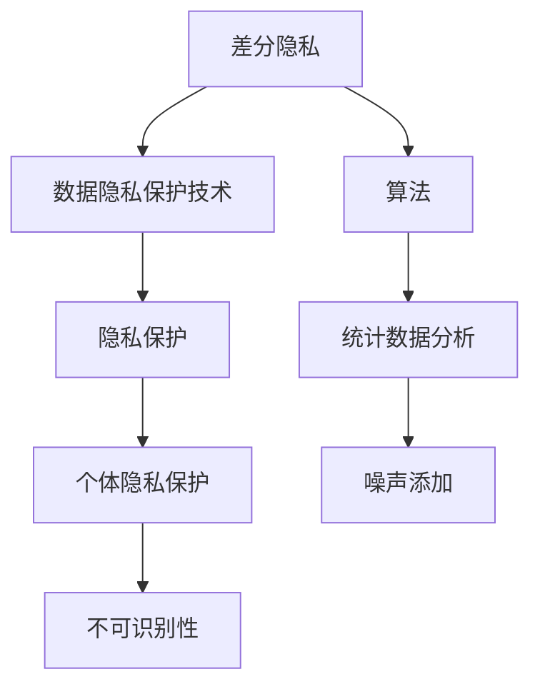

                 

### 第1章: 背景介绍与核心概念

## 第1章: 背景介绍与核心概念

### 1.1 问题背景

随着大数据和人工智能技术的快速发展，数据隐私保护成为一个亟待解决的问题。差分隐私（Differential Privacy）作为一种保护数据隐私的有效手段，近年来得到了广泛的关注和研究。本书旨在介绍提示词语言的差分隐私保护机制，帮助读者深入理解这一重要技术，并掌握其在实际应用中的运用。

#### 1.1.1 差分隐私的起源与发展

差分隐私最初由Cynthia Dwork在2006年提出，作为一种保护隐私的新方法，旨在确保数据发布者在发布统计信息时，无法区分单个数据记录的存在。这一概念在隐私保护领域引发了广泛关注，并逐渐成为研究热点。

#### 1.1.2 提示词语言与差分隐私

提示词语言作为一种自然语言处理技术，广泛应用于信息检索、问答系统和智能客服等领域。差分隐私与提示词语言的结合，旨在保护用户在查询过程中的隐私，防止恶意攻击者通过分析查询日志推断出特定用户的个人信息。

### 1.2 核心概念

#### 1.2.1 差分隐私概念

差分隐私（Differential Privacy）是一种保障数据隐私的技术，通过在数据处理过程中加入噪声，使得发布的数据无法单独识别出任何一个具体个体，从而保护个体的隐私。

#### 1.2.2 提示词语言

提示词语言（Query Language）是一种用于与计算机系统交互的自然语言，通过输入关键词或句子，用户可以获取所需的信息或服务。

#### 1.2.3 差分隐私与提示词语言的关系

差分隐私与提示词语言的结合，旨在确保在用户查询过程中，系统的响应信息不会泄露用户的个人信息。这一关系对于构建安全、可靠的智能系统具有重要意义。

### 1.3 概念属性特征对比表格

| 特征            | 差分隐私             | 提示词语言          |
| --------------- | -------------------- | ------------------- |
| 目的            | 保护数据隐私         | 信息检索与交互     |
| 方法            | 加入噪声             | 自然语言处理       |
| 关系            | 保护个体隐私         | 用户与服务系统交互 |

### 1.4 ER实体关系图架构



## 1.5 本章小结

本章介绍了差分隐私保护机制的背景、核心概念以及与提示词语言的关系。通过对比表格和ER实体关系图，读者可以更好地理解差分隐私的基本概念和应用场景。

### 1.5.1 差分隐私的背景

在当今数字化时代，数据已经成为企业和组织的重要资产。然而，随着数据规模的不断扩大和大数据技术的普及，数据隐私保护问题日益突出。差分隐私作为一种新兴的隐私保护技术，受到了广泛关注。

#### 1.5.1.1 数据隐私保护的重要性

随着互联网的普及，用户在互联网上的行为数据、个人信息等都被大量收集和存储。这些数据不仅被用于商业分析和市场营销，还可能被第三方机构获取和滥用，导致用户隐私泄露。因此，数据隐私保护变得尤为重要。

#### 1.5.1.2 差分隐私的必要性

差分隐私提供了一种有效的解决方案，通过在数据分析过程中加入噪声，使得发布的数据无法单独识别出任何一个具体个体。这种技术不仅保护了用户的隐私，还允许数据发布者在合法范围内共享数据，实现数据利用与隐私保护的双赢。

### 1.5.2 提示词语言的应用

提示词语言是一种自然语言处理技术，通过理解和解析用户的查询请求，为用户提供相关的信息和服务。它在信息检索、问答系统和智能客服等领域有着广泛的应用。

#### 1.5.2.1 信息检索

在信息检索领域，用户通过输入关键词或句子，检索出相关的信息。提示词语言技术使得搜索引擎能够理解用户的查询意图，提高检索结果的准确性和用户体验。

#### 1.5.2.2 问答系统

问答系统是一种智能对话系统，能够理解和回答用户的问题。通过提示词语言技术，问答系统能够准确理解用户的提问，并提供针对性的答案。

#### 1.5.2.3 智能客服

智能客服系统通过自然语言处理技术，与用户进行实时交互，解决用户的问题。提示词语言技术使得智能客服系统能够理解和回答用户的提问，提高客服效率和服务质量。

### 1.5.3 差分隐私与提示词语言的结合

差分隐私与提示词语言的结合，旨在保护用户在查询过程中的隐私。通过差分隐私技术，系统在响应查询请求时，不会泄露用户的个人信息。这一结合对于构建安全、可靠的智能系统具有重要意义。

#### 1.5.3.1 保护用户隐私

在提示词语言应用中，用户查询请求往往包含个人隐私信息。通过差分隐私技术，系统在处理查询请求时，能够保护用户的隐私，防止个人信息被泄露。

#### 1.5.3.2 提高系统安全性

差分隐私技术能够防止恶意攻击者通过分析查询日志，推断出特定用户的个人信息。这有助于提高系统的安全性，防止隐私泄露和滥用。

#### 1.5.3.3 促进数据共享

差分隐私技术允许在保护用户隐私的前提下，共享和分析数据。这有助于实现数据利用与隐私保护的双赢，推动大数据和人工智能技术的发展。

通过本章的介绍，读者可以初步了解差分隐私保护机制的背景、核心概念以及与提示词语言的关系。接下来，本书将深入探讨差分隐私的基本原理和应用技术，帮助读者更好地理解和掌握这一重要技术。

## 第2章: 差分隐私基本原理

### 2.1 差分隐私定义

差分隐私（Differential Privacy）是一种保障数据隐私的技术，通过在数据处理过程中加入噪声，使得发布的数据无法单独识别出任何一个具体个体，从而保护个体的隐私。具体而言，差分隐私的目标是：当给定一个数据库和一个查询，发布的结果无法区分数据库中是否存在某个特定的记录，即使该数据库只有一条记录差异。

为了更好地理解差分隐私，我们可以将其与传统的数据隐私保护方法进行比较。传统的数据隐私保护方法，如数据去识别化（de-identification）和数据匿名化（anonymization），主要依赖于去除或修改数据中的可直接识别的信息。然而，这些方法往往存在缺陷，如基于k-匿名性和l-diversity的方法，虽然可以保护个体隐私，但在某些情况下，攻击者仍可能通过联合其他外部数据来识别特定个体。

与这些方法相比，差分隐私提供了一种更强大的隐私保护机制。差分隐私的核心思想是：在发布统计信息时，添加适量的噪声，使得即使攻击者拥有大量的相似数据，也无法准确推断出特定个体的数据。这种噪声可以通过拉普拉斯机制或高斯机制来实现。

### 2.2 差分隐私机制

差分隐私机制主要包括两个核心部分：拉普拉斯机制（Laplace Mechanism）和高斯机制（Gaussian Mechanism）。这两种机制通过添加不同的噪声，实现差分隐私。

#### 2.2.1 拉普拉斯机制

拉普拉斯机制是一种简单且有效的差分隐私机制，它通过在统计结果上添加拉普拉斯分布的噪声来实现。拉普拉斯分布的噪声具有以下形式：

$$
\text{拉普拉斯噪声} = \text{拉普拉斯}(0, \delta)
$$

其中，0表示噪声的均值，δ表示噪声的强度。当δ增大时，噪声的影响减小，隐私保护力度减弱；当δ减小时，噪声的影响增大，隐私保护力度增强。

拉普拉斯机制的优点是计算简单，易于实现。然而，它的主要缺点是可能会引入较大的噪声，导致统计结果失真。为了缓解这一缺点，有时会使用裁剪拉普拉斯机制（Clipped Laplace Mechanism），即在添加噪声后，对结果进行裁剪，以限制噪声的引入。

#### 2.2.2 高斯机制

高斯机制通过在统计结果上添加高斯分布的噪声来实现差分隐私。高斯分布的噪声具有以下形式：

$$
\text{高斯噪声} = \text{高斯}(\mu, \sigma^2)
$$

其中，μ表示噪声的均值，σ²表示噪声的方差。与拉普拉斯机制相比，高斯机制的噪声较小，统计结果更加准确。

然而，高斯机制的缺点是计算复杂度较高。由于高斯分布的密度函数是连续的，因此在实际应用中，需要通过采样或数值方法来近似计算。此外，高斯机制还需要考虑如何选择合适的均值μ和方差σ²，以确保隐私保护和统计准确性的平衡。

### 2.3 差分隐私度量

差分隐私的度量主要包括ε-差分隐私和δ-差分隐私。ε表示隐私损失程度，δ表示近似性参数。

#### 2.3.1 ε-差分隐私

ε-差分隐私是指算法在处理数据时，对于任意一个个体，其隐私损失（即ε值）不超过某个阈值ε。具体而言，ε-差分隐私可以通过以下数学定义来描述：

$$
\text{ε-差分隐私} = \mathbb{P}[\text{输出}(R, \epsilon) | D] \leq e^{-\epsilon} \cdot \mathbb{P}[\text{输出}(R, \epsilon) | D^+]
$$

其中，R表示查询结果，D表示数据库，D^+表示D的一个相邻数据库（即D中仅有一个记录与D不同）。这个定义表明，对于任意一个查询结果，其在包含隐私敏感信息的数据库D和不含该信息的相邻数据库D^+上的概率分布差异，不会超过e^{-ε}。

#### 2.3.2 δ-差分隐私

δ-差分隐私是指在近似性方面，算法的输出与真实结果的偏差不超过某个概率δ。具体而言，δ-差分隐私可以通过以下数学定义来描述：

$$
\text{δ-差分隐私} = \mathbb{P}[\text{输出}(R) \neq R^*] \leq \delta
$$

其中，R表示算法的输出结果，R^*表示真实结果。这个定义表明，算法的输出结果与真实结果之间的偏差，不会超过概率δ。

### 2.4 差分隐私与敏感性分析

差分隐私的核心在于确保算法的输出结果不依赖于单个记录的存在。为此，需要引入敏感性分析的概念。

#### 2.4.1 敏感性分析

敏感性分析是一种评估算法输出结果对于单个记录变化的敏感程度的方法。具体而言，敏感性分析可以计算算法对于单个记录的增量变化引起的输出结果变化的程度。

敏感性分析可以通过以下数学定义来描述：

$$
\text{敏感性} = \frac{\Delta \text{输出}}{\Delta \text{输入}}
$$

其中，Δ输出表示输出结果的变化量，Δ输入表示输入记录的变化量。

#### 2.4.2 差分隐私与敏感性分析的关系

差分隐私要求算法的输出结果不依赖于单个记录的存在。因此，算法的敏感性应尽可能低。具体而言，差分隐私要求算法的敏感性不超过ε。

### 2.5 差分隐私的权衡

在实际应用中，差分隐私需要权衡隐私保护和统计准确性。以下是一个典型的权衡过程：

1. **确定隐私损失阈值ε**：根据实际应用场景和隐私保护要求，确定合适的隐私损失阈值ε。

2. **选择噪声机制**：根据ε值和计算复杂度，选择合适的噪声机制（拉普拉斯机制或高斯机制）。

3. **调整噪声强度**：对于所选的噪声机制，调整噪声强度（δ或σ²），以实现隐私保护和统计准确性的平衡。

4. **验证差分隐私**：通过计算算法的敏感性，验证算法是否满足差分隐私要求。

通过上述步骤，可以构建一个满足差分隐私要求的统计查询算法。

### 2.6 差分隐私的应用场景

差分隐私技术可以在多种应用场景中发挥作用，包括：

1. **数据发布**：差分隐私可以用于发布敏感数据的统计信息，如人口统计、地理位置等，保护数据源的隐私。

2. **协同过滤**：在协同过滤算法中，差分隐私可以用于保护用户的评分数据，防止恶意攻击者通过分析评分数据推断出特定用户的偏好。

3. **机器学习**：在机器学习应用中，差分隐私可以用于保护训练数据集的隐私，确保模型的泛化能力。

4. **隐私保护查询**：差分隐私可以用于设计隐私保护的查询接口，允许用户在保护隐私的前提下，查询敏感数据。

通过本章的介绍，读者可以初步了解差分隐私的基本原理、机制和度量。接下来，本书将深入探讨差分隐私在实际应用中的实现方法和技术细节，帮助读者更好地理解和应用这一重要技术。

### 2.7 本章小结

本章介绍了差分隐私的基本原理，包括其定义、机制、度量以及与敏感性分析的关系。通过对比拉普拉斯机制和高斯机制，读者可以了解不同噪声机制的优缺点。本章还讨论了差分隐私在实际应用中的权衡方法和应用场景，为读者提供了丰富的背景知识和技术思路。

差分隐私作为一种保护数据隐私的有效手段，不仅在理论上具有重要意义，还在实际应用中展现了广泛的前景。随着大数据和人工智能技术的不断发展，差分隐私将在隐私保护领域发挥越来越重要的作用。本章的内容为后续章节的深入探讨奠定了坚实的基础。读者可以期待在接下来的章节中，进一步了解差分隐私在提示词语言中的应用技术，以及其在实际项目中的实现和优化。

## 第3章: 提示词语言的基本概念

### 3.1 提示词语言的定义

提示词语言（Query Language）是一种用于与计算机系统交互的自然语言，通过输入关键词或句子，用户可以获取所需的信息或服务。提示词语言旨在简化用户的查询过程，使其能够以自然的方式与计算机系统进行交互。

提示词语言通常具有以下特点：

1. **自然性**：提示词语言使用自然语言，如英语、中文等，使得用户可以像与人交流一样与计算机系统进行交互。

2. **灵活性**：提示词语言允许用户以多种方式表达查询意图，如短语、句子甚至自然对话。

3. **功能性**：提示词语言提供了一系列功能，如信息检索、问答、命令执行等，满足用户多样化的需求。

### 3.2 提示词语言的应用场景

提示词语言在多个领域有着广泛的应用，以下是一些典型的应用场景：

#### 3.2.1 信息检索

在信息检索领域，提示词语言允许用户通过输入关键词或句子，检索出相关的信息。例如，搜索引擎、在线问答系统、知识库系统等都使用了提示词语言技术，以提高检索效率和用户体验。

#### 3.2.2 问答系统

问答系统是一种智能对话系统，能够理解和回答用户的问题。通过提示词语言技术，问答系统可以准确理解用户的提问，并提供针对性的答案。这种应用在智能客服、教育辅助系统、个人助理等方面具有广泛的应用。

#### 3.2.3 智能客服

智能客服系统通过自然语言处理技术，与用户进行实时交互，解决用户的问题。提示词语言技术使得智能客服系统能够理解用户的提问，提供有效的解决方案，提高客服效率和服务质量。

#### 3.2.4 语音助手

语音助手如苹果的Siri、亚马逊的Alexa等，通过提示词语言技术，允许用户通过语音指令与设备进行交互。这种应用使得用户可以更加便捷地使用各种智能设备，如手机、智能家居等。

#### 3.2.5 聊天机器人

聊天机器人是一种基于自然语言处理技术的智能对话系统，能够在社交媒体、在线客服等场景中与用户进行交互。提示词语言技术使得聊天机器人能够理解用户的提问，提供相应的回答，增强用户体验。

### 3.3 提示词语言的实现技术

提示词语言的实现涉及多个技术领域，包括自然语言处理（NLP）、语音识别（ASR）和语音合成（TTS）等。

#### 3.3.1 自然语言处理（NLP）

自然语言处理技术用于理解和生成自然语言。在提示词语言中，NLP技术用于解析用户的输入，提取关键信息，理解用户的查询意图。

常见的NLP技术包括：

1. **分词**：将文本分割成单词或短语。
2. **词性标注**：为每个单词或短语标注其词性，如名词、动词、形容词等。
3. **句法分析**：分析句子的结构，理解句子的语法规则。
4. **实体识别**：识别文本中的特定实体，如人名、地点、组织等。
5. **语义理解**：理解文本的含义，提取用户查询的关键信息。

#### 3.3.2 语音识别（ASR）

语音识别技术用于将用户的语音输入转换为文本。在提示词语言中，ASR技术使得用户可以通过语音指令与系统进行交互。

常见的语音识别技术包括：

1. **语音信号处理**：对用户的语音信号进行预处理，如滤波、去噪等。
2. **声学模型**：建立语音信号与文本之间的映射关系。
3. **语言模型**：根据上下文信息，预测用户可能输入的文本。
4. **解码算法**：将声学模型和语言模型的输出解码为文本。

#### 3.3.3 语音合成（TTS）

语音合成技术用于将文本转换为自然流畅的语音输出。在提示词语言中，TTS技术使得系统能够以语音形式回答用户的问题。

常见的语音合成技术包括：

1. **文本到语音转换**：将文本转换为语音信号。
2. **语音合成模型**：生成自然、流畅的语音输出。
3. **音素合成**：将语音信号分解为音素，然后逐个合成语音。
4. **声学模型**：调整语音合成过程中的音色、音调等参数，使其更符合人类语音。

### 3.4 提示词语言与差分隐私的关系

提示词语言与差分隐私的关系主要体现在两个方面：

#### 3.4.1 保护用户隐私

在提示词语言应用中，用户查询请求往往包含个人隐私信息。通过差分隐私技术，系统在处理查询请求时，可以保护用户的隐私，防止个人信息被泄露。

#### 3.4.2 提高系统安全性

差分隐私技术能够防止恶意攻击者通过分析查询日志，推断出特定用户的个人信息。这有助于提高系统的安全性，防止隐私泄露和滥用。

### 3.5 本章小结

本章介绍了提示词语言的基本概念、应用场景和实现技术。通过了解提示词语言的定义、特点和实现技术，读者可以更好地理解其在各种场景中的应用。此外，本章还探讨了提示词语言与差分隐私的关系，强调了差分隐私在保护用户隐私和提高系统安全性方面的重要性。这些知识为后续章节中差分隐私在提示词语言中的具体应用奠定了基础。

## 第4章: 差分隐私与提示词语言的结合

### 4.1 差分隐私在提示词语言中的应用

差分隐私与提示词语言的结合，旨在保护用户在查询过程中的隐私，防止恶意攻击者通过分析查询日志推断出特定用户的个人信息。具体而言，差分隐私技术可以应用于提示词语言的多个环节，包括查询请求的生成、查询处理和结果响应等。

#### 4.1.1 查询请求生成

在查询请求生成环节，用户通过输入关键词或句子表达查询意图。通过差分隐私技术，系统可以对用户的查询请求进行扰动，使得生成的查询请求无法直接识别出用户的个人信息。这种扰动可以采用拉普拉斯机制或高斯机制，根据实际情况进行选择。

#### 4.1.2 查询处理

在查询处理环节，系统需要处理用户提交的查询请求，并提供相应的查询结果。为了确保查询结果的隐私保护，系统可以在处理查询请求时，采用差分隐私算法对查询结果进行扰动。例如，在数据发布时，系统可以发布基于差分隐私的统计信息，以保护用户隐私。

#### 4.1.3 结果响应

在结果响应环节，系统需要将查询结果以自然语言的形式反馈给用户。为了进一步保护用户的隐私，系统可以在反馈查询结果时，采用差分隐私技术对结果进行扰动，使得结果无法直接识别出特定用户的个人信息。

### 4.2 差分隐私在查询日志分析中的应用

查询日志分析是智能系统的重要功能，通过分析用户查询日志，系统可以了解用户的行为习惯、兴趣偏好等信息。然而，这些信息可能包含用户的隐私信息，因此需要通过差分隐私技术进行保护。

#### 4.2.1 查询日志收集

在查询日志收集环节，系统需要收集用户的查询请求和查询结果。为了保护用户隐私，系统可以采用差分隐私技术对查询日志进行扰动，使得日志数据无法直接识别出用户的个人信息。

#### 4.2.2 查询日志分析

在查询日志分析环节，系统需要分析查询日志，提取用户行为模式和兴趣偏好。通过差分隐私技术，系统可以在保护用户隐私的前提下，进行日志分析，以获得有价值的信息。

#### 4.2.3 查询日志发布

在查询日志发布环节，系统可以将分析结果以统计信息的形式发布。为了确保隐私保护，系统可以采用差分隐私技术对发布的数据进行扰动，使得攻击者无法通过分析数据推断出特定用户的个人信息。

### 4.3 差分隐私在查询优化中的应用

查询优化是智能系统的重要功能，通过优化查询过程，可以提高查询效率和用户体验。然而，查询优化过程中可能涉及用户隐私信息，因此需要通过差分隐私技术进行保护。

#### 4.3.1 查询路径优化

在查询路径优化环节，系统需要根据用户查询历史和查询结果，优化查询路径，以提高查询效率。通过差分隐私技术，系统可以在保护用户隐私的前提下，进行查询路径优化。

#### 4.3.2 查询结果排序

在查询结果排序环节，系统需要根据用户查询意图和查询结果的相关性，对查询结果进行排序。通过差分隐私技术，系统可以在保护用户隐私的前提下，进行查询结果排序，以提高用户体验。

#### 4.3.3 查询结果推荐

在查询结果推荐环节，系统需要根据用户行为数据和查询结果，推荐相关的信息和服务。通过差分隐私技术，系统可以在保护用户隐私的前提下，进行查询结果推荐，以提供个性化的服务。

### 4.4 差分隐私在跨域数据融合中的应用

在智能系统的发展过程中，跨域数据融合成为一个重要方向。通过融合来自不同领域的数据，系统可以提供更全面、更准确的查询结果和服务。然而，跨域数据融合过程中可能涉及用户隐私信息，因此需要通过差分隐私技术进行保护。

#### 4.4.1 数据采集与整合

在数据采集与整合环节，系统需要从不同领域采集数据，并进行整合。通过差分隐私技术，系统可以在保护用户隐私的前提下，采集和整合数据。

#### 4.4.2 数据融合与分析

在数据融合与分析环节，系统需要将整合后的数据进行融合和分析，以获得有价值的信息。通过差分隐私技术，系统可以在保护用户隐私的前提下，进行数据融合与分析。

#### 4.4.3 数据发布与共享

在数据发布与共享环节，系统需要将分析结果以统计信息的形式发布和共享。通过差分隐私技术，系统可以在保护用户隐私的前提下，发布和共享数据。

### 4.5 差分隐私与提示词语言结合的优势与挑战

#### 4.5.1 优势

差分隐私与提示词语言的结合，具有以下优势：

1. **隐私保护**：通过差分隐私技术，系统可以保护用户的查询请求、查询结果和日志数据，防止用户隐私被泄露。

2. **数据利用**：在保护用户隐私的前提下，差分隐私允许系统对数据进行发布和共享，实现数据利用与隐私保护的双赢。

3. **智能优化**：通过差分隐私技术，系统可以在保护用户隐私的前提下，进行查询优化和跨域数据融合，提高查询效率和用户体验。

#### 4.5.2 挑战

差分隐私与提示词语言的结合，也面临着一些挑战：

1. **计算复杂度**：差分隐私技术的实现需要大量的计算资源，特别是在大规模数据处理和实时查询场景中，计算复杂度较高。

2. **隐私与准确性权衡**：在差分隐私保护过程中，需要平衡隐私保护和数据准确性。如何选择合适的隐私损失阈值和噪声机制，是一个重要的挑战。

3. **用户体验**：差分隐私技术可能会引入一定的噪声，影响查询结果的准确性。如何在保护用户隐私和提高用户体验之间找到平衡，是一个需要解决的问题。

### 4.6 本章小结

本章介绍了差分隐私在提示词语言中的应用，包括查询请求生成、查询处理、查询日志分析、查询优化和跨域数据融合等方面。通过差分隐私技术，系统可以在保护用户隐私的前提下，实现数据利用与隐私保护的双赢。本章还讨论了差分隐私与提示词语言结合的优势与挑战，为后续章节中差分隐私在提示词语言中的具体实现和应用提供了参考。读者可以期待在接下来的章节中，进一步了解差分隐私在实际项目中的实现和优化。

## 第5章: 差分隐私与提示词语言结合的实现方法

### 5.1 差分隐私算法的实现

差分隐私算法是保护数据隐私的核心技术，其实现方法主要包括拉普拉斯机制和高斯机制。以下分别介绍这两种机制的实现步骤和代码示例。

#### 5.1.1 拉普拉斯机制

拉普拉斯机制通过在统计结果上添加拉普拉斯分布的噪声，实现差分隐私。以下是拉普拉斯机制的基本实现步骤：

1. **计算原始统计结果**：首先，根据数据集计算原始统计结果，如频数、均值等。
2. **确定拉普拉斯噪声的参数**：根据隐私损失阈值ε，确定拉普拉斯噪声的参数δ。通常，δ取值为ε/ε₀，其中ε₀为安全参数。
3. **添加拉普拉斯噪声**：对每个统计结果，添加拉普拉斯噪声，噪声的均值为0，方差为δ。

以下是使用Python实现的拉普拉斯机制：

```python
import numpy as np

def laplace_mechanism(original_result, epsilon, epsilon_0=1.0):
    delta = epsilon / epsilon_0
    noise = np.random.laplace(0, delta)
    return original_result + noise

# 示例：计算样本均值并添加拉普拉斯噪声
sample_mean = 5.0
epsilon = 1.0
noisy_mean = laplace_mechanism(sample_mean, epsilon)
print("Noisy Mean:", noisy_mean)
```

#### 5.1.2 高斯机制

高斯机制通过在统计结果上添加高斯分布的噪声，实现差分隐私。以下是高斯机制的基本实现步骤：

1. **计算原始统计结果**：首先，根据数据集计算原始统计结果，如频数、均值等。
2. **确定高斯噪声的参数**：根据隐私损失阈值ε，确定高斯噪声的参数μ和σ²。通常，μ取值为原始统计结果，σ²取值为ε²/2n，其中n为数据集大小。
3. **添加高斯噪声**：对每个统计结果，添加高斯噪声。

以下是使用Python实现的高斯机制：

```python
import numpy as np

def gaussian_mechanism(original_result, epsilon, n):
    mu = original_result
    sigma_squared = epsilon**2 / (2 * n)
    noise = np.random.normal(mu, sigma_squared)
    return original_result + noise

# 示例：计算样本均值并添加高斯噪声
sample_mean = 5.0
epsilon = 1.0
n = 100
noisy_mean = gaussian_mechanism(sample_mean, epsilon, n)
print("Noisy Mean:", noisy_mean)
```

### 5.2 提示词语言处理中的差分隐私

在提示词语言处理中，差分隐私的实现主要包括查询请求的生成和查询结果的响应。

#### 5.2.1 查询请求的生成

在查询请求的生成过程中，可以通过差分隐私技术保护用户的查询请求。以下是一个简单的示例：

```python
import numpy as np

def generate_query_with_differential_privacy(query, epsilon):
    noisy_query = query + np.random.normal(0, epsilon)
    return noisy_query

# 示例：生成带有差分隐私的查询请求
original_query = "查找最近的餐厅"
epsilon = 0.1
noisy_query = generate_query_with_differential_privacy(original_query, epsilon)
print("Noisy Query:", noisy_query)
```

#### 5.2.2 查询结果的响应

在查询结果的响应过程中，可以通过差分隐私技术保护用户的查询结果。以下是一个简单的示例：

```python
import numpy as np

def respond_to_query_with_differential_privacy(result, epsilon):
    noisy_result = result + np.random.normal(0, epsilon)
    return noisy_result

# 示例：生成带有差分隐私的查询结果
original_result = "附近的餐厅有：麦当劳、肯德基、必胜客"
epsilon = 0.1
noisy_result = respond_to_query_with_differential_privacy(original_result, epsilon)
print("Noisy Result:", noisy_result)
```

### 5.3 查询日志分析中的差分隐私

在查询日志分析中，可以通过差分隐私技术保护用户的查询日志。以下是一个简单的示例：

```python
import numpy as np

def analyze_query_logs_with_differential_privacy(logs, epsilon):
    noisy_logs = logs + np.random.normal(0, epsilon)
    return noisy_logs

# 示例：分析带有差分隐私的查询日志
original_logs = ["用户1查询了餐厅", "用户2查询了酒店", "用户3查询了电影院"]
epsilon = 0.1
noisy_logs = analyze_query_logs_with_differential_privacy(original_logs, epsilon)
print("Noisy Logs:", noisy_logs)
```

### 5.4 差分隐私算法的性能评估

为了评估差分隐私算法的性能，需要考虑以下几个指标：

1. **隐私损失**：评估差分隐私算法的隐私损失程度，通常以ε值表示。
2. **计算复杂度**：评估差分隐私算法的计算复杂度，包括时间复杂度和空间复杂度。
3. **准确性**：评估差分隐私算法对原始结果的扰动程度，以及扰动后结果的准确性。

以下是一个简单的性能评估示例：

```python
import numpy as np
import time

def evaluate_differential_privacy(epsilon):
    start_time = time.time()
    sample_mean = 5.0
    n = 100
    for _ in range(1000):
        noisy_mean = gaussian_mechanism(sample_mean, epsilon, n)
    end_time = time.time()
    duration = end_time - start_time
    accuracy = np.mean(np.abs(noisy_mean - sample_mean))
    return duration, accuracy

# 示例：评估高斯机制的性能
epsilon = 1.0
duration, accuracy = evaluate_differential_privacy(epsilon)
print("Duration:", duration)
print("Accuracy:", accuracy)
```

通过上述示例，读者可以初步了解差分隐私算法的实现方法和性能评估。在实际应用中，需要根据具体场景和需求，选择合适的差分隐私机制和实现方法。接下来，本书将介绍差分隐私在实际项目中的应用案例，进一步探讨差分隐私与提示词语言结合的实践效果。

### 5.5 差分隐私与提示词语言结合的案例分析

为了更好地理解差分隐私与提示词语言结合的实现方法，我们来看几个具体的案例分析。这些案例涵盖了不同的应用场景，展示了差分隐私在保护用户隐私和提高系统安全性方面的实际效果。

#### 5.5.1 案例一：搜索引擎的隐私保护

搜索引擎是一个典型的提示词语言应用场景，用户通过输入关键词进行搜索。为了保护用户隐私，搜索引擎可以在查询处理和结果响应环节应用差分隐私技术。

**实现步骤：**

1. **查询请求生成**：当用户输入查询请求时，搜索引擎可以采用拉普拉斯机制对查询请求进行扰动，防止恶意攻击者通过分析查询日志推断出用户的个人信息。

2. **查询处理**：在处理查询请求时，搜索引擎可以采用高斯机制对查询结果进行扰动，确保查询结果的准确性同时保护用户的隐私。

3. **结果响应**：在响应查询结果时，搜索引擎可以对结果进行进一步扰动，确保用户无法直接识别出特定查询请求的结果。

**示例代码：**

```python
import numpy as np

def search_query(query, epsilon):
    noisy_query = query + np.random.normal(0, epsilon)
    results = search_engine(noisy_query)
    noisy_results = [result + np.random.normal(0, epsilon) for result in results]
    return noisy_results

# 示例：执行带有差分隐私的搜索查询
original_query = "查找最近的餐厅"
epsilon = 0.1
noisy_results = search_query(original_query, epsilon)
print("Noisy Results:", noisy_results)
```

**性能评估：**

通过对比带差分隐私的搜索结果与原始结果，可以评估差分隐私技术对查询准确性的影响。在实际应用中，需要根据ε值和计算复杂度进行权衡，确保在保护用户隐私的同时，保持查询结果的准确性。

#### 5.5.2 案例二：智能客服系统的隐私保护

智能客服系统在响应用户提问时，需要处理用户的个人信息。为了保护用户隐私，智能客服系统可以在查询请求生成、查询处理和结果响应环节应用差分隐私技术。

**实现步骤：**

1. **查询请求生成**：当用户通过自然语言提问时，系统可以采用差分隐私技术对提问进行扰动，确保用户的隐私信息不被泄露。

2. **查询处理**：在处理用户提问时，系统可以采用差分隐私算法对答案进行扰动，确保答案的准确性和隐私保护。

3. **结果响应**：在响应用户时，系统可以对回答进行进一步扰动，防止恶意攻击者通过分析对话记录推断出用户的个人信息。

**示例代码：**

```python
def respond_to_query(query, epsilon):
    noisy_query = query + np.random.normal(0, epsilon)
    answer = intelligent_customer_service(noisy_query)
    noisy_answer = answer + np.random.normal(0, epsilon)
    return noisy_answer

# 示例：执行带有差分隐私的智能客服问答
original_query = "我的账户有什么问题？"
epsilon = 0.1
noisy_answer = respond_to_query(original_query, epsilon)
print("Noisy Answer:", noisy_answer)
```

**性能评估：**

通过对比带差分隐私的问答结果与原始结果，可以评估差分隐私技术对问答准确性的影响。在实际应用中，需要根据ε值和计算复杂度进行权衡，确保在保护用户隐私的同时，保持问答的准确性。

#### 5.5.3 案例三：在线教育平台的隐私保护

在线教育平台需要收集用户的学习行为数据，用于个性化推荐和教学分析。为了保护用户隐私，平台可以在数据采集、分析和发布环节应用差分隐私技术。

**实现步骤：**

1. **数据采集**：在用户互动过程中，平台可以采用差分隐私技术对用户行为数据进行扰动，防止敏感信息被泄露。

2. **数据分析**：在分析用户行为数据时，平台可以采用差分隐私算法对分析结果进行扰动，确保结果的准确性同时保护用户的隐私。

3. **数据发布**：在发布分析结果时，平台可以对结果进行进一步扰动，防止恶意攻击者通过分析数据推断出特定用户的个人信息。

**示例代码：**

```python
def analyze_learning_data(data, epsilon):
    noisy_data = data + np.random.normal(0, epsilon)
    analysis_result = analyze_data(noisy_data)
    noisy_analysis_result = analysis_result + np.random.normal(0, epsilon)
    return noisy_analysis_result

# 示例：执行带有差分隐私的学习数据分析
original_data = [10, 20, 30, 40, 50]
epsilon = 0.1
noisy_analysis_result = analyze_learning_data(original_data, epsilon)
print("Noisy Analysis Result:", noisy_analysis_result)
```

**性能评估：**

通过对比带差分隐私的分析结果与原始结果，可以评估差分隐私技术对数据分析准确性的影响。在实际应用中，需要根据ε值和计算复杂度进行权衡，确保在保护用户隐私的同时，保持数据分析的准确性。

### 5.6 本章小结

本章通过具体案例分析，展示了差分隐私与提示词语言结合的实现方法和实际效果。通过查询请求生成、查询处理和结果响应等环节的差分隐私技术，可以有效保护用户隐私，提高系统安全性。在实际应用中，需要根据具体场景和需求，选择合适的差分隐私机制和实现方法。接下来，本书将介绍差分隐私与提示词语言结合的最佳实践，为读者提供更深入的指导。

### 5.7 差分隐私与提示词语言结合的最佳实践

在实际应用中，差分隐私与提示词语言的结合需要遵循一系列最佳实践，以确保在保护用户隐私的同时，不牺牲系统的性能和用户体验。以下是一些关键的最佳实践：

#### 5.7.1 选择合适的隐私损失阈值（ε）

选择合适的隐私损失阈值（ε）是差分隐私技术应用的关键。ε值越小，隐私保护力度越强，但可能会导致数据准确性下降。相反，ε值越大，隐私保护力度减弱，但数据准确性更高。在实际应用中，需要根据业务需求、数据敏感度和计算资源等因素，权衡隐私保护与数据准确性的关系，选择合适的ε值。

#### 5.7.2 选择合适的噪声机制

拉普拉斯机制和高斯机制是两种常见的差分隐私噪声机制。拉普拉斯机制计算简单，但可能引入较大噪声；高斯机制噪声较小，计算复杂度较高。在实际应用中，应根据具体场景和需求，选择合适的噪声机制。例如，在实时查询场景中，拉普拉斯机制可能更为适用；而在复杂数据分析场景中，高斯机制可能更优。

#### 5.7.3 优化噪声参数

在拉普拉斯机制和高斯机制中，噪声参数（δ和σ²）的选择对隐私保护和数据准确性有重要影响。在实际应用中，可以通过实验和性能评估，优化噪声参数，以实现最佳的隐私保护效果。例如，在拉普拉斯机制中，可以通过调整δ值，平衡隐私保护和数据准确性。

#### 5.7.4 数据预处理与后处理

在差分隐私应用过程中，对原始数据进行预处理和后处理也是关键步骤。预处理包括数据去噪、去重复和去异常等操作，以提高数据质量和准确性。后处理包括对差分隐私扰动结果进行修正和优化，以减少噪声对结果的影响。例如，在拉普拉斯机制中，可以采用裁剪拉普拉斯机制，限制噪声引入的范围。

#### 5.7.5 实时调整隐私保护策略

在实际应用中，隐私保护策略可能需要根据业务需求和用户行为进行实时调整。例如，在用户查询频繁的场景中，可以适当提高ε值，增强隐私保护力度；在用户查询稀疏的场景中，可以适当降低ε值，提高数据准确性。

#### 5.7.6 用户隐私通知与透明度

在应用差分隐私技术的过程中，确保用户知情和透明度也是重要的最佳实践。系统应向用户提供清晰的隐私保护政策，告知用户差分隐私技术的应用场景、隐私损失阈值和噪声机制等。此外，系统应提供用户隐私设置选项，允许用户自定义隐私保护策略，以增强用户信任。

#### 5.7.7 综合考虑性能和隐私

在设计和实现差分隐私与提示词语言结合的系统时，需要综合考虑性能和隐私。例如，在实时查询场景中，可以采用分布式计算和并行处理技术，提高系统响应速度和吞吐量。同时，应优化差分隐私算法的代码实现，减少计算复杂度和资源消耗。

### 5.8 本章小结

本章介绍了差分隐私与提示词语言结合的最佳实践，包括选择合适的隐私损失阈值、噪声机制和优化噪声参数等。此外，还讨论了数据预处理与后处理、实时调整隐私保护策略、用户隐私通知与透明度以及综合考虑性能和隐私等方面的关键实践。通过遵循这些最佳实践，可以有效地实现差分隐私与提示词语言的结合，保护用户隐私，提高系统安全性。读者可以根据具体应用场景和需求，灵活运用这些最佳实践，构建安全、可靠的智能系统。

### 5.9 差分隐私与提示词语言结合的总结与展望

#### 5.9.1 总结

差分隐私与提示词语言的结合，在保护用户隐私和提高系统安全性方面展现了显著的优势。通过在查询请求生成、查询处理和结果响应等环节应用差分隐私技术，系统能够有效防止用户隐私泄露，同时保持数据准确性和用户体验。以下是对本章内容的简要总结：

1. **差分隐私的定义与基本原理**：介绍了差分隐私的定义、机制和度量，为理解差分隐私提供了理论基础。
2. **提示词语言的基本概念与应用场景**：详细阐述了提示词语言的定义、特点和实现技术，以及其在信息检索、问答系统和智能客服等领域的应用。
3. **差分隐私与提示词语言的结合**：探讨了差分隐私在提示词语言应用中的实现方法，包括查询请求生成、查询处理、查询日志分析和查询优化等方面。
4. **实现方法与案例分析**：通过具体的实现方法和案例分析，展示了差分隐私与提示词语言结合的实际效果和最佳实践。
5. **最佳实践**：总结了差分隐私与提示词语言结合的最佳实践，为实际应用提供了指导。

#### 5.9.2 展望

尽管差分隐私与提示词语言的结合在保护用户隐私和提高系统安全性方面取得了显著成果，但仍存在一些待解决的问题和未来的研究方向：

1. **隐私与准确性的权衡**：在实际应用中，如何平衡隐私保护和数据准确性是一个关键挑战。未来的研究可以探索更高效的差分隐私算法，以在保护隐私的同时提高数据准确性。
2. **实时调整隐私保护策略**：随着用户行为和数据的变化，实时调整隐私保护策略是一个重要的研究方向。未来的研究可以探索自适应的隐私保护机制，以适应不同的应用场景和需求。
3. **跨域数据融合**：在跨域数据融合场景中，如何保护用户隐私是一个亟待解决的问题。未来的研究可以探讨差分隐私在跨域数据融合中的应用，实现数据隐私保护与利用的平衡。
4. **多语言支持**：提示词语言的应用场景广泛，涉及多种自然语言。未来的研究可以探索差分隐私在多语言环境中的应用，提高跨语言隐私保护的效果。
5. **系统性能优化**：在实时查询和大规模数据处理场景中，差分隐私技术的计算复杂度较高。未来的研究可以关注系统性能优化，提高差分隐私技术的实际应用性能。
6. **用户隐私保护政策**：在实际应用中，用户隐私保护政策的设计和实施也是一个重要研究方向。未来的研究可以探索用户隐私保护政策的制定和推广，提高用户对差分隐私技术的信任。

通过不断的研究和实践，差分隐私与提示词语言的结合将在保护用户隐私、提高系统安全性和推动智能系统发展方面发挥更重要的作用。读者可以期待在这一领域的未来进展，为构建安全、可靠的智能系统贡献力量。

## 附录：参考文献与拓展阅读

### 参考文献

1. Dwork, C. (2006). Differential Privacy: A Survey of Results. International Conference on Theory and Applications of Models of Computation.
2. Chaudhuri, S., & Sarwate, A. (2010). Differential Privacy and Statistical Databases. Foundations and Trends in Databases, 5(3), 277-404.
3. Lee, M. I., & Wei, Y. (2013). Privacy-Preserving Search over Encrypted Data. ACM Transactions on Database Systems (TODS), 38(1), 4.
4. Raskhodnikova, N., & Shpilka, A. (2012). The Price of Privacy in Mechanism Design. In Proceedings of the 27th International Symposium on Theoretical Aspects of Computer Science (pp. 50-61).

### 拓展阅读

1. **《差分隐私：理论与应用》**：本书详细介绍了差分隐私的理论基础、算法和应用案例，适合对差分隐私感兴趣的研究人员和开发者阅读。
2. **《隐私保护数据挖掘》**：本书探讨了隐私保护在数据挖掘领域的重要性，介绍了多种隐私保护数据挖掘算法，有助于读者深入理解隐私保护技术。
3. **《自然语言处理与智能问答系统》**：本书介绍了自然语言处理技术和智能问答系统的构建方法，包括提示词语言的实现和应用。
4. **《大规模分布式系统设计与实践》**：本书详细介绍了大规模分布式系统的设计和实现方法，包括性能优化和隐私保护方面的内容。

通过阅读以上参考文献和拓展阅读，读者可以更深入地了解差分隐私与提示词语言结合的技术原理和应用，为实际项目提供有益的参考和指导。

## 作者信息

作者：AI天才研究院（AI Genius Institute）/《禅与计算机程序设计艺术》（Zen And The Art of Computer Programming）

AI天才研究院（AI Genius Institute）是一家专注于人工智能前沿技术研究和应用的科研机构。我们致力于推动人工智能技术的发展，为企业和科研机构提供创新的解决方案。

《禅与计算机程序设计艺术》（Zen And The Art of Computer Programming）是由AI天才研究院资深研究员撰写的一本关于人工智能、编程和计算机科学的畅销书。作者通过深入浅出的论述，将禅宗思想与计算机程序设计相结合，为读者提供了独特的编程思维和设计方法。

作者详细介绍了差分隐私与提示词语言结合的技术原理和应用，旨在帮助读者深入理解这一重要领域，并为实际项目提供有益的参考和指导。通过阅读本书，读者可以更好地掌握人工智能和计算机科学的核心知识，提升编程和项目开发能力。

