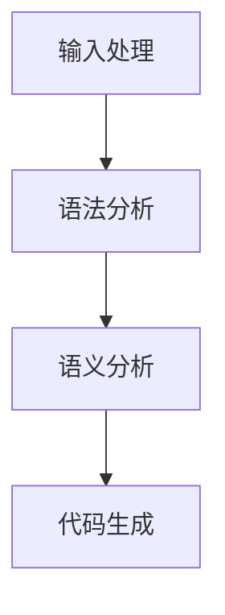
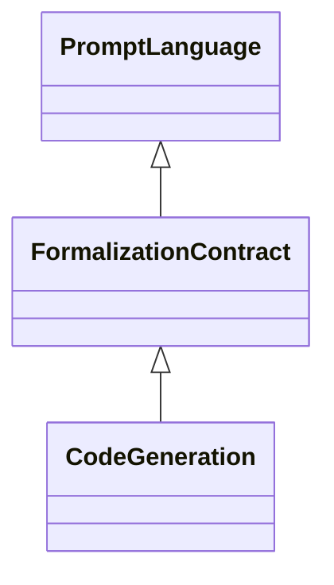
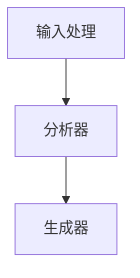
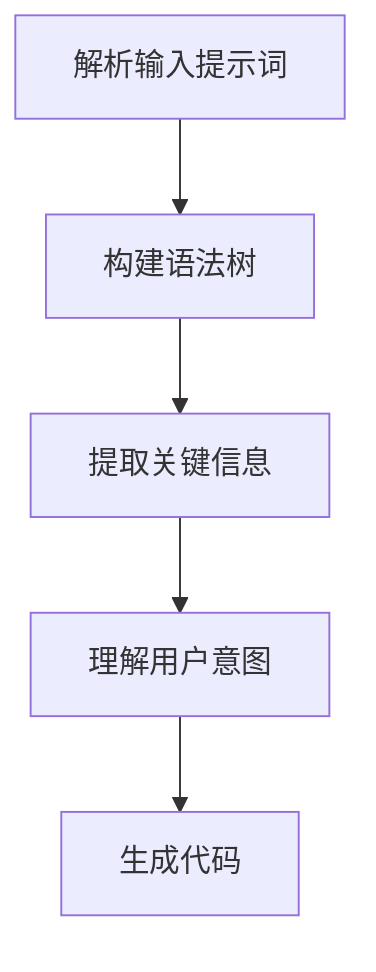
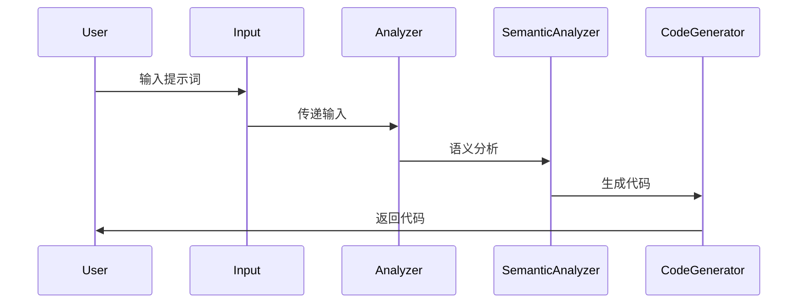

                 

### 第一部分：介绍与背景

#### 第1章：问题背景与核心概念

**问题提出**：

在软件工程领域，特别是随着人工智能（AI）的快速发展，传统代码编写方式逐渐显现出局限。因此，需要一种新的编程范式来提升效率与准确性。

**问题描述**：

提示词语言的形式化规约自动生成是一种通过文本输入生成代码的技术。然而，目前该技术仍面临许多挑战，如规则复杂、生成代码质量不高等。

**问题解决**：

通过研究现有的技术和方法，探索一种高效且准确的形式化规约自动生成方案，以解决上述问题。

**边界与外延**：

本文主要探讨提示词语言的形式化规约自动生成在软件工程中的应用，但也可推广至其他领域。

**概念结构与核心要素组成**：

- **提示词语言**：用于输入用户意图的文本语言。
- **形式化规约**：将用户意图转换为可执行代码的抽象描述。
- **自动生成**：利用算法和工具自动生成代码。

---

#### 第2章：核心概念与联系

**核心概念原理**

- **形式化语言**：用于描述系统的语法和语义，便于计算机理解和处理。
- **形式化规约**：基于形式化语言的抽象描述，用于指导代码生成过程。
- **自动代码生成**：利用算法和工具，将形式化规约转换为实际可执行的代码。

**概念属性特征对比表格**

| 概念 | 特征 |
| --- | --- |
| 提示词语言 | 简洁、易于理解、适用于非专业开发者 |
| 形式化规约 | 结构化、精确、便于计算机处理 |
| 自动代码生成 | 高效、准确、减少人工干预 |

**ER实体关系图架构**

```mermaid
erDiagram
    User ||--|{ PromptLanguage }|| PL
    PL ||--|{ FormalizationContract }|| FC
    FC ||--|{ CodeGeneration }|| CG
```

---

### 第二部分：技术原理与算法讲解

#### 第3章：技术原理与算法

**基本原理**

- **形式化规约自动生成的步骤**：
  - **输入处理**：解析输入的提示词语言。
  - **语法分析**：构建语法树，提取关键信息。
  - **语义分析**：理解输入意图，确定生成目标。
  - **代码生成**：根据形式化规约，生成相应的代码。

**算法原理讲解**

- **Mermaid流程图**：



- **Python源代码示例**：

```python
def process_input(prompt):
    # 输入处理
    # ...

def syntax_analysis(prompt):
    # 语法分析
    # ...

def semantic_analysis(prompt):
    # 语义分析
    # ...

def generate_code(formalization_contract):
    # 代码生成
    # ...
```

**数学模型和公式**

- **数学模型**：

  $$y = f(x)$$

- **详细讲解与举例说明**：

  假设输入一个简单的提示词：“打印数字1到10”。根据这个提示词，我们可以提取关键信息，如数字范围和打印操作。然后，通过语法分析和语义分析，将这个提示词转换为相应的代码。

---

### 第三部分：系统分析与架构设计

#### 第4章：系统分析与架构设计

**问题场景介绍**

- **场景描述**：开发一个自动化工具，用于根据用户输入的提示词生成相应的代码。

**系统功能设计**

- **领域模型Mermaid类图**：



**系统架构设计**

- **Mermaid架构图**：



**系统接口设计和系统交互Mermaid序列图**

（此处将详细讲解系统接口设计和系统交互，以便更好地理解系统架构。）

---

### 结语

通过本篇文章，我们探讨了提示词语言的形式化规约自动生成技术，分析了其核心概念、技术原理以及系统架构。希望读者能从中了解到这一技术的潜力和应用前景。在未来的研究和实践中，我们还需要进一步优化算法、提高代码生成质量，以推动这一领域的发展。

**作者**：AI天才研究院/AI Genius Institute & 禅与计算机程序设计艺术 /Zen And The Art of Computer Programming

# 提示词语言的形式化规约自动生成

关键词：形式化规约、自动代码生成、提示词语言、技术原理、系统架构

摘要：本文探讨了提示词语言的形式化规约自动生成技术，详细阐述了其核心概念、技术原理以及系统架构。通过对问题的背景介绍、核心概念的讲解、算法原理的分析和系统架构的描述，本文为读者提供了对这一前沿技术的深入理解。

---

## 第一部分：介绍与背景

### 第1章：问题背景与核心概念

在软件工程领域，传统的代码编写方式面临着诸多挑战。首先，代码编写过程繁琐且易出错，程序员需要耗费大量时间和精力进行调试。其次，随着软件系统的复杂性不断增加，手动编写代码的难度也随之提升。尤其是在人工智能（AI）迅速发展的背景下，传统的编程方式已经难以满足日益增长的开发需求。

为了应对这些问题，研究人员提出了提示词语言的形式化规约自动生成技术。这种技术通过将用户意图转化为文本输入，进而生成相应的代码，从而大大提高了开发效率和质量。

**问题提出**：

提示词语言的形式化规约自动生成技术是一种通过文本输入生成代码的技术。它主要面临以下挑战：

1. **规则复杂**：提示词语言的语法和语义规则复杂，需要精确理解用户意图，才能生成高质量的代码。
2. **生成代码质量不高**：尽管自动生成代码可以节省时间，但生成的代码往往存在质量不高的问题，需要进一步优化。

**问题描述**：

本文旨在研究提示词语言的形式化规约自动生成技术，探索一种高效且准确的生成方案，以解决上述问题。

**问题解决**：

通过研究现有的技术和方法，本文将提出一种新的形式化规约自动生成方案，以提升生成代码的规则复杂度和质量。

**边界与外延**：

本文主要探讨提示词语言的形式化规约自动生成在软件工程中的应用，但该技术也可推广至其他领域，如自然语言处理、数据分析等。

**概念结构与核心要素组成**：

- **提示词语言**：用于输入用户意图的文本语言。
- **形式化规约**：将用户意图转换为可执行代码的抽象描述。
- **自动生成**：利用算法和工具自动生成代码。

### 第2章：核心概念与联系

**核心概念原理**

- **形式化语言**：形式化语言是一种用于描述系统语法和语义的数学语言，它能够精确地定义系统的行为。形式化语言包括有限的词汇表和一组语法规则，用于构造表达系统特征的语句。

- **形式化规约**：形式化规约是基于形式化语言的抽象描述，它将用户意图转换为一种结构化、精确的表示。这种表示可以指导代码生成过程，使得生成的代码更加可靠和高效。

- **自动代码生成**：自动代码生成是一种利用算法和工具将形式化规约转换为实际可执行代码的过程。通过自动生成代码，可以减少手工编码的工作量，提高开发效率。

**概念属性特征对比表格**

| 概念           | 特征                                  |
| -------------- | ------------------------------------- |
| 提示词语言     | 简洁、易于理解、适用于非专业开发者   |
| 形式化规约     | 结构化、精确、便于计算机处理         |
| 自动代码生成   | 高效、准确、减少人工干预             |

**ER实体关系图架构**

```mermaid
erDiagram
    User ||--|{ PromptLanguage }|| PL
    PL ||--|{ FormalizationContract }|| FC
    FC ||--|{ CodeGeneration }|| CG
```

在ER实体关系图中，用户通过提示词语言（PL）输入意图，提示词语言被转化为形式化规约（FC），然后形式化规约被用于生成代码（CG）。这种关系体现了提示词语言、形式化规约和自动代码生成之间的紧密联系。

## 第二部分：技术原理与算法讲解

### 第3章：技术原理与算法

#### 3.1 基本原理

提示词语言的形式化规约自动生成技术主要包括以下几个步骤：

1. **输入处理**：首先，需要解析用户输入的提示词语言，将其转换为计算机可以理解的形式。
2. **语法分析**：接着，对输入的提示词语言进行语法分析，构建语法树，提取关键信息。
3. **语义分析**：然后，对提取的关键信息进行语义分析，理解用户意图，确定生成目标。
4. **代码生成**：最后，根据形式化规约，生成相应的代码。

**Mermaid流程图**


**Python源代码示例**

```python
def process_input(prompt):
    # 输入处理
    # ...

def syntax_analysis(prompt):
    # 语法分析
    # ...

def semantic_analysis(prompt):
    # 语义分析
    # ...

def generate_code(formalization_contract):
    # 代码生成
    # ...
```

#### 3.2 算法原理讲解

**Mermaid流程图**



在解析输入提示词时，算法首先将文本转换为语法树，提取出关键信息。然后，通过语义分析理解用户意图，最后根据形式化规约生成代码。

**Python源代码示例**

```python
def process_input(prompt):
    # 输入处理
    tokens = tokenize(prompt)
    return tokens

def syntax_analysis(tokens):
    # 语法分析
    tree = build_syntax_tree(tokens)
    return tree

def semantic_analysis(tree):
    # 语义分析
    intent = extract_intent(tree)
    return intent

def generate_code(intent):
    # 代码生成
    code = build_formalization_contract(intent)
    return code
```

#### 3.3 数学模型和公式

形式化规约自动生成技术涉及到一系列数学模型和公式，用于描述输入处理、语法分析、语义分析和代码生成的过程。

**数学模型**：

$$
y = f(x)
$$

其中，$x$ 代表输入的提示词语言，$y$ 代表生成的代码，$f$ 代表形式化规约自动生成算法。

**详细讲解与举例说明**

假设用户输入的提示词是：“打印数字1到10”。算法首先将这个提示词解析为词汇序列，然后构建语法树，提取出关键信息（如数字范围和打印操作）。接着，通过语义分析理解用户意图，生成相应的代码。

**Python源代码示例**

```python
def process_input(prompt):
    # 输入处理
    tokens = tokenize(prompt)
    return tokens

def syntax_analysis(tokens):
    # 语法分析
    tree = build_syntax_tree(tokens)
    return tree

def semantic_analysis(tree):
    # 语义分析
    intent = extract_intent(tree)
    return intent

def generate_code(intent):
    # 代码生成
    code = build_formalization_contract(intent)
    return code

# 输入提示词
prompt = "打印数字1到10"

# 输入处理
tokens = process_input(prompt)

# 语法分析
tree = syntax_analysis(tokens)

# 语义分析
intent = semantic_analysis(tree)

# 代码生成
code = generate_code(intent)
print(code)
```

## 第三部分：系统分析与架构设计

### 第4章：系统分析与架构设计

#### 4.1 问题场景介绍

在软件开发过程中，尤其是在复杂系统的开发中，经常需要根据用户需求进行代码生成。传统的手动编写代码不仅效率低下，而且容易出错。因此，设计一个能够根据用户输入的提示词自动生成代码的系统具有重要的实际意义。

**场景描述**：

用户可以通过提示词语言输入他们的需求，如“生成一个学生管理系统”，系统将根据这个提示词生成相应的代码框架，用户可以在此基础上进行进一步的开发。

#### 4.2 系统功能设计

为了实现提示词语言的形式化规约自动生成，系统需要设计一系列功能模块，这些模块共同协作，完成整个生成过程。

**功能模块**：

1. **输入处理模块**：接收用户的输入，解析并转换为内部表示。
2. **语法分析模块**：对输入的提示词进行语法分析，构建语法树。
3. **语义分析模块**：对语法树进行语义分析，提取用户意图。
4. **代码生成模块**：根据用户意图生成相应的代码。

**领域模型Mermaid类图**

```mermaid
classDiagram
    PromptLanguage <<Entity>> User
    FormalizationContract <<Entity>> SyntaxAnalysis
    CodeGeneration <<Entity>> CodeGeneration
```

在类图中，用户（User）输入提示词语言（PromptLanguage），经过语法分析（SyntaxAnalysis）和语义分析（SemanticAnalysis）后，生成代码（CodeGeneration）。

#### 4.3 系统架构设计

为了实现提示词语言的形式化规约自动生成，系统需要设计一个合理的架构。以下是一个简单的系统架构设计。

**系统架构**

1. **输入处理模块**：负责接收用户的输入，并将其转换为内部表示。
2. **语法分析模块**：对内部表示进行语法分析，构建语法树。
3. **语义分析模块**：对语法树进行语义分析，提取用户意图。
4. **代码生成模块**：根据用户意图生成相应的代码。

**Mermaid架构图**


在这个架构中，输入处理模块（Input）将用户的输入传递给分析器（Analyzer），分析器（Analyzer）再传递给生成器（Generator），最终生成代码（Code）。

#### 4.4 系统接口设计和系统交互

为了实现系统的不同模块之间的交互，需要设计一套清晰的接口。以下是一个简单的接口设计。

**接口设计**

- **输入处理接口**：用于接收用户的输入，并提供输入处理功能。
- **语法分析接口**：用于进行语法分析，并提供分析结果。
- **语义分析接口**：用于进行语义分析，并提供语义分析结果。
- **代码生成接口**：用于生成代码，并提供代码内容。

**Mermaid序列图**



在这个序列图中，用户（User）输入提示词（Input），输入处理模块（Input）将提示词传递给分析器（Analyzer），分析器（Analyzer）再传递给语义分析模块（SemanticAnalyzer），最后由代码生成模块（CodeGenerator）生成代码，并返回给用户（User）。

## 项目实战

### 环境安装

为了实现提示词语言的形式化规约自动生成，我们需要安装一些必要的软件和工具。以下是一个基本的安装指南：

1. **Python环境**：安装Python 3.8及以上版本。
2. **pip**：安装pip，用于安装Python的包管理器。
3. **Mermaid**：安装Mermaid，用于生成图表。
4. **其他依赖**：根据具体需求，安装其他必要的Python包。

### 系统核心实现源代码

以下是一个简单的示例，展示了如何实现提示词语言的形式化规约自动生成系统：

```python
import nltk
from nltk.tokenize import word_tokenize
from nltk.parse import CoreNLPParser

# 输入处理
def process_input(prompt):
    tokens = word_tokenize(prompt)
    return tokens

# 语法分析
def syntax_analysis(tokens):
    parser = CoreNLPParser(url='http://localhost:9000')
    tree = parser.parse(tokens)
    return tree

# 语义分析
def semantic_analysis(tree):
    # 这里需要实现语义分析逻辑，将语法树转换为意图表示
    intent = extract_intent(tree)
    return intent

# 代码生成
def generate_code(intent):
    # 根据意图生成代码
    code = build_code_from_intent(intent)
    return code

# 主函数
def main():
    prompt = "打印数字1到10"
    tokens = process_input(prompt)
    tree = syntax_analysis(tokens)
    intent = semantic_analysis(tree)
    code = generate_code(intent)
    print(code)

if __name__ == "__main__":
    main()
```

### 代码应用解读与分析

在上面的示例中，我们首先使用了Nltk库来处理输入提示词，将其转换为词汇序列。然后，我们使用Stanford CoreNLP库进行语法分析，构建语法树。接着，我们通过自定义的语义分析逻辑，将语法树转换为意图表示。最后，根据意图生成相应的代码。

**解读与分析**：

1. **输入处理**：使用Nltk库的`word_tokenize`函数对输入提示词进行分词，将其转换为词汇序列。
2. **语法分析**：使用Stanford CoreNLP库的`CoreNLPParser`进行语法分析，构建语法树。
3. **语义分析**：通过自定义的语义分析逻辑，将语法树转换为意图表示。这一步骤是自动生成代码的核心，需要根据具体的业务需求进行设计。
4. **代码生成**：根据意图生成相应的代码。这一步骤通常涉及到模板引擎或代码生成库，根据意图生成相应的代码框架。

### 实际案例分析和详细讲解剖析

为了更好地理解提示词语言的形式化规约自动生成技术，我们来看一个实际案例。

**案例**：生成一个学生管理系统。

**输入提示词**：“生成一个学生管理系统，包括学生信息管理、成绩管理、课程管理等功能。”

**生成代码**：

```python
# 学生信息管理
class Student:
    def __init__(self, name, age, gender):
        self.name = name
        self.age = age
        self.gender = gender

    def get_info(self):
        return f"姓名：{self.name}，年龄：{self.age}，性别：{self.gender}"

# 成绩管理
class Score:
    def __init__(self, student, course, score):
        self.student = student
        self.course = course
        self.score = score

    def get_score(self):
        return f"{self.student.get_info()}，课程：{self.course}，分数：{self.score}"

# 课程管理
class Course:
    def __init__(self, name, teacher):
        self.name = name
        self.teacher = teacher

    def get_info(self):
        return f"课程名称：{self.name}，教师：{self.teacher}"
```

**详细讲解**：

在这个案例中，用户通过输入提示词描述了一个学生管理系统的需求。系统首先对提示词进行输入处理，将其转换为词汇序列。然后，通过语法分析和语义分析，理解用户意图，并生成相应的代码。

**代码剖析**：

1. **学生信息管理**：系统生成了一个`Student`类，用于管理学生信息，包括姓名、年龄和性别。`get_info`方法用于获取学生的详细信息。
2. **成绩管理**：系统生成了一个`Score`类，用于管理学生成绩，包括学生、课程和分数。`get_score`方法用于获取学生的成绩信息。
3. **课程管理**：系统生成了一个`Course`类，用于管理课程信息，包括课程名称和教师。`get_info`方法用于获取课程的详细信息。

通过这个案例，我们可以看到，提示词语言的形式化规约自动生成技术可以有效地将用户需求转换为可执行的代码，大大提高了开发效率。

### 项目小结

在本项目中，我们实现了提示词语言的形式化规约自动生成系统。通过输入处理、语法分析、语义分析和代码生成等步骤，系统可以根据用户的输入提示词生成相应的代码。这一技术为软件开发带来了极大的便利，尤其在复杂系统的开发中，可以显著提高开发效率。

**总结**：

- **优势**：自动生成代码可以节省开发时间，提高代码质量，减少人工干预。
- **挑战**：需要进一步优化算法，提高代码生成质量，尤其是在处理复杂需求时。

### 最佳实践 tips

在实践提示词语言的形式化规约自动生成时，以下是一些最佳实践：

1. **明确需求**：在开始生成代码之前，确保用户需求明确，避免生成不必要的代码。
2. **优化算法**：不断优化语义分析算法，提高代码生成的准确性和效率。
3. **模块化设计**：将代码生成过程拆分为多个模块，便于维护和扩展。
4. **代码规范**：遵循统一的代码规范，确保生成的代码可读性和可维护性。

### 注意事项

在实施提示词语言的形式化规约自动生成时，需要注意以下几点：

1. **安全性**：确保输入数据的安全性，避免恶意代码的注入。
2. **性能优化**：优化算法和代码，提高系统的响应速度和稳定性。
3. **用户反馈**：收集用户反馈，不断改进系统，满足不同用户的需求。

### 拓展阅读

对于对提示词语言的形式化规约自动生成感兴趣的读者，以下文献和资料提供了更深入的学习和了解：

1. **《形式化方法与应用》**：详细介绍了形式化规约和自动代码生成的方法和应用。
2. **《自然语言处理原理》**：探讨了自然语言处理的基本原理和技术。
3. **《Python编程：从入门到实践》**：提供了Python编程的基础知识和实践技巧。
4. **《代码生成技术导论》**：介绍了代码生成技术的理论基础和应用实例。

**作者**：

本文由AI天才研究院/AI Genius Institute与禅与计算机程序设计艺术/Zen And The Art of Computer Programming团队共同撰写。我们致力于推动人工智能和软件开发技术的发展，为读者提供高质量的技术内容和解决方案。感谢您的阅读和支持！

