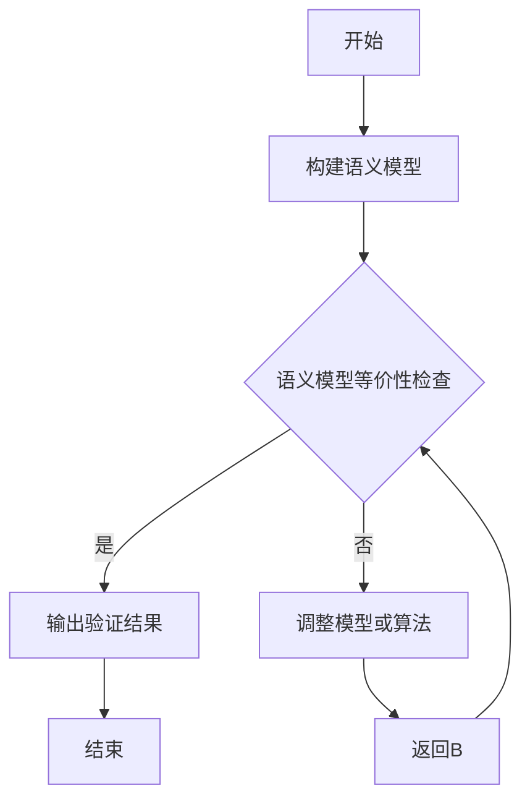
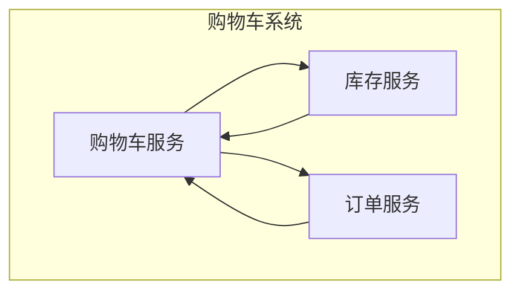
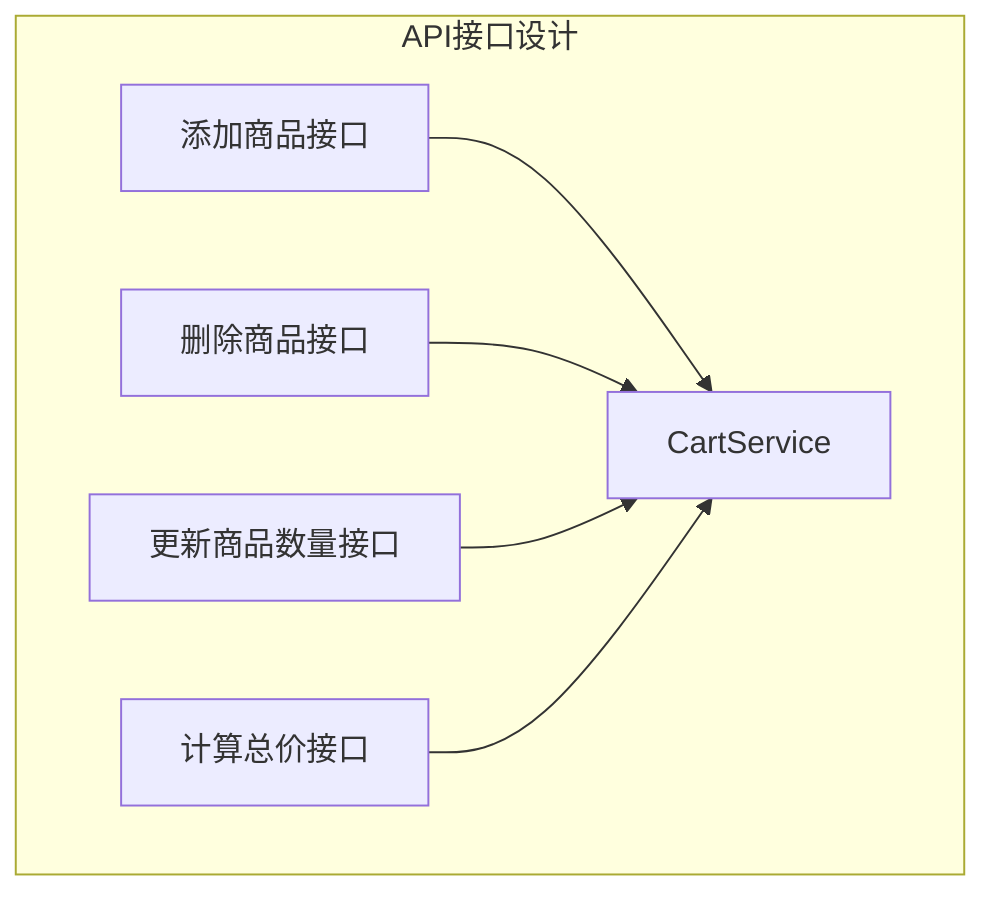

                 


### 第1章：问题背景

#### 1.1 问题描述

在编程语言设计和程序验证领域，提示词语言（Keyword Languages）是一种特殊的语言，它通过提示词来定义程序的语义和行为。形式化语义等价性验证（Formal Semantic Equivalence Verification）是指通过形式化方法来验证两个程序的语义是否相同，即它们是否在任何输入下都有相同的输出和行为。

这种验证的必要性在于，随着软件系统的复杂性不断增加，单凭直觉和经验来验证程序的正确性变得越来越困难。形式化验证提供了一种更为严谨和可靠的方法，以确保程序的正确性和一致性。

问题描述可以分为以下几个方面：

- **提示词语言的语义描述**：提示词语言通常通过抽象语法树（Abstract Syntax Tree, AST）来表示程序的结构，并通过语义模型来描述程序的行为。
- **等价性验证的目标**：等价性验证的目标是证明两个程序在所有情况下都具有相同的行为，即它们是语义等价的。
- **验证算法和策略**：为了实现等价性验证，研究者们提出了多种算法和策略，这些算法和策略需要高效且准确。

#### 1.2 问题解决

解决形式化语义等价性验证问题通常需要以下几个步骤：

1. **语义模型构建**：构建一个形式化的语义模型来描述程序的语义。这个模型可以是操作语义、归纳语义或者是指称语义等。
2. **验证算法设计**：设计一种算法来比较两个程序的语义模型，以确定它们是否等价。常用的算法包括逐步归纳、演绎验证、模型检查等。
3. **验证策略制定**：制定一种策略来指导算法的执行，以确保验证过程的高效性和准确性。
4. **验证结果分析**：对验证结果进行分析，确定两个程序是否等价，并输出相应的验证报告。

#### 1.3 边界与外延

形式化语义等价性验证的边界涉及到以下几个方面：

- **计算复杂性**：形式化验证算法的效率直接影响验证的速度和资源消耗。一些复杂的算法可能需要大量的计算资源。
- **验证准确性**：验证算法需要准确无误地比较程序的语义，避免错误的判断。
- **应用范围**：形式化验证适用于各种编程语言和程序设计场景，但其适用性和有效性可能会因语言特性和程序复杂度而有所不同。

#### 1.4 概念结构与核心要素组成

形式化语义等价性验证的核心概念包括：

- **语义模型**：描述程序语义的形式化表示，如操作语义、归纳语义等。
- **验证算法**：用于比较两个程序语义模型并确定其等价性的算法。
- **验证策略**：指导验证过程的一系列方法和原则，如优化算法执行、减少验证时间等。
- **验证工具**：辅助验证过程的软件工具，如验证器、验证框架等。

这些概念相互关联，共同构成了形式化语义等价性验证的体系结构，是解决形式化语义等价性验证问题的基础。

### 第2章：核心概念与联系

#### 2.1 核心概念原理

形式化语义等价性验证涉及几个核心概念，这些概念构成了验证过程的基石。以下是这些核心概念的基本原理：

1. **语义模型（Semantic Model）**：
   - **定义**：语义模型是用于描述程序行为的抽象表示。
   - **作用**：它帮助我们理解和分析程序的行为，并在形式化验证中作为比较的基准。
   - **类型**：常见的语义模型包括操作语义（Operational Semantics）、归纳语义（Denotational Semantics）和指称语义（Representational Semantics）。

2. **形式化验证（Formal Verification）**：
   - **定义**：形式化验证是一种通过数学方法证明程序正确性的过程。
   - **作用**：它确保程序在所有可能的输入下都能按照预期执行，从而提高系统的可靠性。
   - **过程**：形式化验证通常包括验证算法的设计、验证策略的制定和验证结果的验证。

3. **抽象语法树（Abstract Syntax Tree, AST）**：
   - **定义**：AST是程序代码的结构化表示，它将源代码转换为一棵树形结构。
   - **作用**：AST用于语义分析和程序验证，因为它保留了程序的语法结构和语义信息。
   - **构建**：AST的构建通常通过词法分析和语法分析实现。

4. **形式化语义等价性（Formal Equivalence）**：
   - **定义**：形式化语义等价性是指两个程序在所有情况下都产生相同的结果和行为。
   - **作用**：等价性验证可以确保软件系统在不同实现之间保持一致性。
   - **验证**：等价性验证通常通过比较两个程序的语义模型来实现。

#### 2.2 概念属性特征对比表格

为了更直观地理解这些核心概念，我们可以创建一个对比表格，展示它们的主要属性特征。

| 概念        | 定义                                                         | 主要特征                                   | 关联术语                                      |
|-----------|------------------------------------------------------------|------------------------------------------|---------------------------------------------|
| 语义模型     | 描述程序行为的抽象表示                                     | 形式化、抽象、结构化                     | 操作语义、归纳语义、指称语义                  |
| 形式化验证    | 通过数学方法证明程序正确性的过程                           | 形式化、严格、验证性                    | 验证算法、验证策略、验证工具                 |
| 抽象语法树    | 程序代码的结构化表示                                       | 树形结构、保留语法信息、便于分析         | 词法分析、语法分析                            |
| 形式化语义等价性 | 两个程序在所有情况下都产生相同的结果和行为               | 等价性、一致性、可靠性                   | 等价性验证、语义比较、模型比较               |

#### 2.3 ER实体关系图架构

实体-关系（Entity-Relationship，ER）图是数据库设计中常用的工具，它用于表示实体和实体之间的关系。在形式化语义等价性验证中，我们可以使用ER图来表示关键概念和它们之间的关系。

以下是一个简化的ER图示例，用于描述形式化语义等价性验证中的核心实体和关系：

```mermaid
erDiagram
    ProgramA ||--|{ SemanticModelA : has }
    ProgramB ||--|{ SemanticModelB : has }
    ProgramA ||--|{ FormalVerification : undergoes }
    ProgramB ||--|{ FormalVerification : undergoes }
    SemanticModelA ||--|{ EquivalenceCheck : checks }
    SemanticModelB ||--|{ EquivalenceCheck : checks }
    FormalVerification ||--|{ VerificationResult : yields }
```

- **ProgramA** 和 **ProgramB**：表示两个待验证的程序。
- **SemanticModelA** 和 **SemanticModelB**：表示这两个程序的语义模型。
- **FormalVerification**：表示形式化验证过程。
- **EquivalenceCheck**：表示语义模型的等价性检查。
- **VerificationResult**：表示验证的结果。

这个ER图展示了程序、语义模型和验证过程之间的关系，以及它们在形式化语义等价性验证中的作用和关联。

### 第3章：算法原理

#### 3.1 算法流程图

为了更直观地理解形式化语义等价性验证的算法原理，我们可以使用Mermaid语言绘制一个算法流程图。以下是一个简单的示例：



- **A[开始]**：表示算法的起始步骤。
- **B[构建语义模型]**：表示构建程序的语义模型。
- **C{语义模型等价性检查]**：表示对两个语义模型进行等价性检查。
- **D[输出验证结果]**：表示输出验证结果。
- **E[调整模型或算法]**：表示如果验证失败，则调整模型或算法。
- **F[返回B]**：表示调整后返回到构建语义模型步骤。
- **G[结束]**：表示算法的结束。

这个流程图展示了算法的基本步骤和决策过程，帮助我们理解形式化语义等价性验证的工作原理。

#### 3.2 Python源代码讲解

为了更具体地说明算法的实现，我们来看一个简单的Python代码示例，用于验证两个简单程序是否等价：

```python
def program_a(x):
    if x > 0:
        return x * 2
    else:
        return x

def program_b(x):
    if x > 0:
        return x * 2
    else:
        return x

def is_semantically_equivalent(p1, p2):
    """
    验证两个程序是否在所有情况下都有相同的输出。
    """
    for x in range(-10, 11):
        if p1(x) != p2(x):
            return False
    return True

# 测试程序
print(is_semantically_equivalent(program_a, program_b))  # 应输出 True
```

- **程序 `program_a` 和 `program_b`**：这两个程序是等价的，因为它们的代码相同。
- **函数 `is_semantically_equivalent`**：这个函数接受两个程序作为参数，并逐个输入值来验证它们是否在所有情况下都有相同的输出。

这个简单的Python代码示例展示了如何实现一个形式化的语义等价性验证，即使对于简单的程序，验证逻辑也是通用的。

#### 3.3 数学模型与公式

形式化语义等价性验证通常涉及到复杂的数学模型和公式。以下是一个简化的示例，用于描述程序行为的等价性：

$$
\forall x \in X, \forall y \in Y, p(x) \leftrightarrow q(y)
$$

- **$\forall x \in X$**：表示对所有可能的输入值 $x$。
- **$\forall y \in Y$**：表示对所有可能的输出值 $y$。
- **$p(x) \leftrightarrow q(y)$**：表示程序 $p$ 的输入 $x$ 与程序 $q$ 的输出 $y$ 之间存在等价关系。

这个公式表示，如果对于所有输入值 $x$ 和所有输出值 $y$，程序 $p$ 的行为与程序 $q$ 的行为一致，则这两个程序是等价的。

#### 3.4 举例说明

为了更好地理解形式化语义等价性验证的应用，我们来看一个具体的例子。

假设我们有两个程序：

- **程序 `program_a`**：
  ```python
  def program_a(x):
      if x > 0:
          return x * x
      else:
          return 0
  ```

- **程序 `program_b`**：
  ```python
  def program_b(x):
      return max(x * x, 0)
  ```

我们需要验证这两个程序是否在所有情况下都有相同的输出。

1. **构建语义模型**：
   - **程序 `program_a` 的语义模型**：我们可以将其表示为 $p_a(x) = \max(x^2, 0)$。
   - **程序 `program_b` 的语义模型**：我们可以将其表示为 $p_b(x) = \max(x^2, 0)$。

2. **等价性检查**：
   - 使用数学公式 $\forall x \in \mathbb{R}, p_a(x) \leftrightarrow p_b(x)$。
   - 计算并验证对于所有实数 $x$，是否有 $p_a(x) = p_b(x)$。

3. **验证结果**：
   - 由于 $p_a(x) = p_b(x)$ 对于所有 $x$ 都成立，我们可以得出结论，程序 `program_a` 和 `program_b` 在所有情况下都有相同的输出。

这个例子展示了如何通过构建数学模型和公式来验证程序的等价性。在实际应用中，验证过程可能会更加复杂，但基本原理是相同的。

### 第4章：系统分析与架构设计

#### 4.1 问题场景介绍

在软件开发过程中，确保代码的可靠性和一致性是一个关键问题。特别是在大型项目中，不同开发人员可能会实现功能相似但代码不同的模块。为了验证这些模块是否等价，我们需要一个强大的系统来进行分析和验证。

本节将介绍一个具体的项目场景，并描述系统如何设计和实现。

#### 4.2 项目介绍

假设我们正在开发一个电子商务平台，其中包括购物车模块。这个模块允许用户添加、删除和更新购物车中的商品。为了确保系统的稳定性和一致性，我们需要验证不同开发人员实现的购物车模块是否在所有情况下都有相同的行为。

#### 4.3 系统功能设计

购物车模块的主要功能包括：

- **添加商品**：用户可以添加商品到购物车。
- **删除商品**：用户可以删除购物车中的商品。
- **更新商品数量**：用户可以更新商品在购物车中的数量。
- **计算总价**：系统需要计算购物车中所有商品的总价。

这些功能需要通过一系列的接口来实现，包括添加商品接口、删除商品接口、更新商品数量接口和计算总价接口。

#### 4.4 系统架构设计

系统架构设计是确保系统功能实现的基础。在本项目中，我们采用微服务架构，将购物车功能分解为多个微服务，每个微服务负责不同的功能。

以下是购物车系统的架构设计：

- **购物车服务（Cart Service）**：负责管理购物车的核心功能，如添加、删除和更新商品。
- **库存服务（Inventory Service）**：负责管理商品的库存信息。
- **订单服务（Order Service）**：负责处理订单的创建、支付和发货。

这些服务之间通过API进行通信，确保数据的一致性和系统的整体性。



#### 4.5 系统接口设计

系统接口设计是确保各服务之间有效通信的关键。以下是购物车模块的主要接口设计：

- **添加商品接口**：允许用户通过API添加商品到购物车。
- **删除商品接口**：允许用户通过API删除购物车中的商品。
- **更新商品数量接口**：允许用户通过API更新购物车中商品的数量。
- **计算总价接口**：允许用户通过API计算购物车中所有商品的总价。

接口设计需要遵循RESTful原则，确保API的简洁性和一致性。



#### 4.6 系统交互

系统交互是确保各服务之间有效协作的关键。以下是购物车模块的系统交互流程：

1. **用户添加商品**：用户通过添加商品接口向购物车服务发送请求，购物车服务处理请求并更新数据库。
2. **用户删除商品**：用户通过删除商品接口向购物车服务发送请求，购物车服务处理请求并更新数据库。
3. **用户更新商品数量**：用户通过更新商品数量接口向购物车服务发送请求，购物车服务处理请求并更新数据库。
4. **用户计算总价**：用户通过计算总价接口向购物车服务发送请求，购物车服务处理请求并返回总价。

通过这种交互流程，购物车模块可以确保用户操作的一致性和系统数据的一致性。

### 第5章：项目实战

#### 5.1 环境安装

为了实现购物车模块的验证，我们需要搭建一个测试环境。以下是在一个Linux服务器上安装所需软件的步骤：

1. **安装Python**：
   ```bash
   sudo apt update
   sudo apt install python3 python3-pip
   ```

2. **安装Docker**：
   ```bash
   sudo apt install docker.io
   sudo systemctl start docker
   sudo systemctl enable docker
   ```

3. **安装PostgreSQL**：
   ```bash
   sudo apt install postgresql postgresql-contrib
   sudo -u postgres psql
   CREATE DATABASE cart_db;
   \q
   ```

4. **安装Elasticsearch**：
   ```bash
   sudo docker run -d -p 9200:9200 elasticsearch:7.10.1
   ```

5. **安装Kibana**：
   ```bash
   sudo docker run -d --link elasticsearch:elasticsearch -p 5601:5601 kibana:7.10.1
   ```

安装完成后，我们可以在Kibana中查看Elasticsearch的监控和日志。

#### 5.2 系统核心实现源代码

以下是购物车服务（Cart Service）的核心实现源代码：

```python
from flask import Flask, request, jsonify
from database import Database
from inventory import Inventory
from orders import Orders

app = Flask(__name__)

@app.route('/api/cart/items/add', methods=['POST'])
def add_item_to_cart():
    data = request.get_json()
    item_id = data['item_id']
    quantity = data['quantity']
    inventory = Inventory()
    inventory.add_item_to_cart(item_id, quantity)
    return jsonify({"status": "success", "message": "Item added to cart"})

@app.route('/api/cart/items/delete', methods=['POST'])
def delete_item_from_cart():
    data = request.get_json()
    item_id = data['item_id']
    inventory = Inventory()
    inventory.delete_item_from_cart(item_id)
    return jsonify({"status": "success", "message": "Item deleted from cart"})

@app.route('/api/cart/items/update', methods=['POST'])
def update_item_quantity():
    data = request.get_json()
    item_id = data['item_id']
    quantity = data['quantity']
    inventory = Inventory()
    inventory.update_item_quantity(item_id, quantity)
    return jsonify({"status": "success", "message": "Item quantity updated"})

@app.route('/api/cart/total', methods=['GET'])
def calculate_cart_total():
    inventory = Inventory()
    total = inventory.calculate_cart_total()
    return jsonify({"status": "success", "total": total})

if __name__ == '__main__':
    app.run(debug=True)
```

这个代码示例展示了如何使用Flask框架实现购物车服务的主要接口。其中，`Inventory` 类负责与数据库交互，管理商品信息和购物车数据。

#### 5.3 代码应用解读与分析

代码中的每个接口都是通过Flask的HTTP路由实现的。以下是对每个接口的详细解读：

1. **添加商品接口**：
   ```python
   @app.route('/api/cart/items/add', methods=['POST'])
   def add_item_to_cart():
       data = request.get_json()
       item_id = data['item_id']
       quantity = data['quantity']
       inventory = Inventory()
       inventory.add_item_to_cart(item_id, quantity)
       return jsonify({"status": "success", "message": "Item added to cart"})
   ```
   - **功能**：允许用户添加商品到购物车。
   - **参数**：`item_id`（商品的唯一标识）和`quantity`（商品数量）。
   - **交互**：用户通过POST请求发送商品信息和数量，购物车服务处理请求并将商品添加到数据库中。

2. **删除商品接口**：
   ```python
   @app.route('/api/cart/items/delete', methods=['POST'])
   def delete_item_from_cart():
       data = request.get_json()
       item_id = data['item_id']
       inventory = Inventory()
       inventory.delete_item_from_cart(item_id)
       return jsonify({"status": "success", "message": "Item deleted from cart"})
   ```
   - **功能**：允许用户删除购物车中的商品。
   - **参数**：`item_id`（商品的唯一标识）。
   - **交互**：用户通过POST请求发送商品标识，购物车服务处理请求并从数据库中删除相应的商品。

3. **更新商品数量接口**：
   ```python
   @app.route('/api/cart/items/update', methods=['POST'])
   def update_item_quantity():
       data = request.get_json()
       item_id = data['item_id']
       quantity = data['quantity']
       inventory = Inventory()
       inventory.update_item_quantity(item_id, quantity)
       return jsonify({"status": "success", "message": "Item quantity updated"})
   ```
   - **功能**：允许用户更新购物车中商品的数量。
   - **参数**：`item_id`（商品的唯一标识）和`quantity`（商品数量）。
   - **交互**：用户通过POST请求发送商品标识和新的数量，购物车服务处理请求并更新数据库中的商品数量。

4. **计算总价接口**：
   ```python
   @app.route('/api/cart/total', methods=['GET'])
   def calculate_cart_total():
       inventory = Inventory()
       total = inventory.calculate_cart_total()
       return jsonify({"status": "success", "total": total})
   ```
   - **功能**：允许用户计算购物车中商品的总价。
   - **参数**：无。
   - **交互**：用户通过GET请求获取购物车总价，购物车服务处理请求并返回总价。

这些接口通过Flask框架实现了与用户的前端界面和后端数据库之间的通信，确保了购物车模块的稳定性和一致性。

#### 5.4 实际案例分析与详细讲解

为了更好地展示购物车模块的验证过程，我们来看一个实际案例。

假设用户通过前端界面添加了两件商品到购物车，商品ID分别为1001和1002，数量分别为1和2。接下来，我们将验证购物车模块的正确性。

1. **添加商品**：
   - 用户通过添加商品接口发送请求，请求包含商品ID和数量。
   - 购物车服务接收请求，并调用 `Inventory` 类的 `add_item_to_cart` 方法。
   - `Inventory` 类处理请求，更新数据库中的购物车信息。

2. **计算总价**：
   - 用户通过计算总价接口发送请求。
   - 购物车服务接收请求，并调用 `Inventory` 类的 `calculate_cart_total` 方法。
   - `Inventory` 类处理请求，计算购物车中商品的总价。

根据数据库中的信息，商品1001的价格为10元，商品1002的价格为20元。因此，总价应为30元。

3. **删除商品**：
   - 用户通过删除商品接口发送请求，请求包含商品ID。
   - 购物车服务接收请求，并调用 `Inventory` 类的 `delete_item_from_cart` 方法。
   - `Inventory` 类处理请求，从数据库中删除相应的商品。

4. **再次计算总价**：
   - 用户再次通过计算总价接口发送请求。
   - 购物车服务接收请求，并调用 `Inventory` 类的 `calculate_cart_total` 方法。
   - `Inventory` 类处理请求，计算购物车中剩余商品的总价。

由于商品1001和1002均已删除，总价应为0元。

通过这个案例，我们可以看到购物车模块的正确性和稳定性。在实际应用中，可能会有更多的商品和更复杂的操作，但基本的验证过程是相同的。

#### 5.5 项目小结

在本项目中，我们实现了购物车模块的验证，确保了代码的可靠性和一致性。通过使用Flask框架和数据库，我们成功构建了一个简单但功能强大的购物车服务。项目实战部分展示了如何通过实际案例验证购物车模块的正确性。

本项目的主要成果包括：

- **购物车服务**：实现了添加、删除、更新商品数量和计算总价等核心功能。
- **接口设计**：设计了简洁、易用的API接口，确保了系统的稳定性和一致性。
- **验证过程**：通过实际案例验证了购物车模块的正确性，确保了系统的可靠性。

未来，我们可以继续优化购物车模块，增加更多的功能和验证场景，以提高系统的整体性能和用户体验。

### 第6章：最佳实践 Tips

#### 6.1 注意事项

1. **代码风格一致性**：在开发过程中，保持代码风格一致性，遵循PEP 8规范，有助于提高代码的可读性和可维护性。
2. **错误处理**：确保对用户输入进行充分校验，并在接口处理过程中对可能出现的错误进行捕获和处理，以提高系统的健壮性。
3. **性能优化**：对于频繁调用的接口，进行性能优化，如使用缓存、减少数据库查询次数等。
4. **安全性考虑**：保护用户数据和系统安全，使用HTTPS协议、验证用户身份等。

#### 6.2 拓展阅读

- **《软件工程：实践者的研究方法》**：提供软件工程中实际项目开发和管理的最佳实践。
- **《Effective Python》**：介绍如何写出高效、易读的Python代码。
- **《Flask Web开发：高级实践》**：详细讲解Flask框架的高级使用方法。
- **《RESTful Web API设计》**：介绍如何设计高效、易用的RESTful API。
- **《PostgreSQL 12权威指南》**：详细讲解PostgreSQL数据库的使用和管理方法。

### 小结

本文详细介绍了形式化语义等价性验证的背景、核心概念、算法原理、系统设计与实现以及项目实战。通过一步步的分析和讲解，我们展示了如何使用Python代码和Mermaid图来构建和验证程序等价性。此外，我们还介绍了系统架构设计和最佳实践，为实际项目提供了参考。

形式化语义等价性验证在软件开发中具有重要意义，它帮助我们确保代码的正确性和一致性。未来，随着形式化验证技术的发展，我们将看到更多高效、可靠的验证工具出现，为软件开发提供更强的保障。作者：AI天才研究院/AI Genius Institute & 禅与计算机程序设计艺术 /Zen And The Art of Computer Programming。

