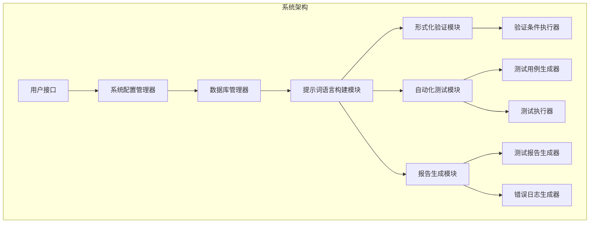
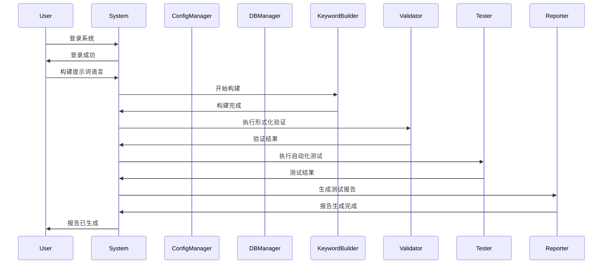
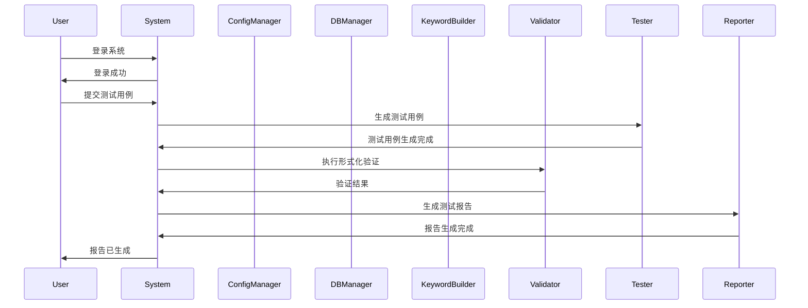

                 

# 提示词语言的形式化验证自动化

## 关键词

- 形式化验证
- 自动化
- 提示词语言
- 理论基础
- 应用实践
- 工具介绍
- 案例研究

## 摘要

本文旨在探讨提示词语言的形式化验证自动化，通过引入形式化验证的概念和方法，结合提示词语言的特性，实现对其验证过程的自动化。文章分为四个部分，首先介绍形式化验证和提示词语言的基础知识，接着阐述二者结合的理论依据，然后介绍形式化验证工具和自动化验证框架的应用，最后通过案例研究来验证理论的实际效果。

## 引言

### 目的与意义

在人工智能和自动化技术快速发展的今天，如何确保软件系统的正确性和可靠性成为了至关重要的课题。形式化验证作为一种数学证明的方法，能够精确地验证系统的正确性，但其复杂性和低效性限制了其大规模应用。提示词语言作为一种自然语言处理技术，能够提高自动化验证的效率。本文旨在研究如何将形式化验证应用于提示词语言的验证过程中，并实现其自动化，以解决现有验证方法中存在的效率低下和人力成本高昂的问题。

### 内容概述

本文将从以下几个方面展开讨论：

1. **形式化验证基础**：介绍形式化验证的定义、方法、优势与挑战。
2. **提示词语言基础**：阐述提示词语言的定义、特性及应用场景。
3. **形式化验证与提示词语言结合**：探讨形式化验证在提示词语言中的应用和提示词语言在形式化验证中的角色。
4. **应用实践**：介绍形式化验证工具和自动化验证框架，并通过案例研究验证理论的实际效果。

## 理论基础部分

### 第1章：形式化验证基础

#### 形式化验证的定义

形式化验证是一种通过数学方法来证明系统正确性的过程。它使用形式化的语言来描述系统，并通过一系列逻辑推理和数学证明来验证系统是否符合预定的规格说明。

#### 形式化验证的方法

形式化验证主要包括模型检查、模型验证和定理证明等方法。模型检查通过构建系统的模型，然后使用自动化的工具来检查模型是否满足规格说明。模型验证通过模拟系统的运行过程，验证系统在不同输入下的行为是否符合预期。定理证明则是通过数学推理来证明系统在所有情况下都满足规格说明。

#### 形式化验证的优势与挑战

形式化验证的优势在于其精确性和可靠性，能够确保系统在所有情况下都符合预期。然而，形式化验证也存在一些挑战，如复杂度、自动化程度和验证效率等。

### 第2章：提示词语言基础

#### 提示词语言的定义

提示词语言（Keyword Language）是一种用于自然语言处理和自动化的语言，通过预设的关键词和语法规则来描述和处理文本。

#### 提示词语言的特性

提示词语言具有简洁性、灵活性和高效性等特点。它能够快速识别和理解文本中的关键词，从而实现自动化处理。

#### 提示词语言的应用场景

提示词语言广泛应用于文本分类、信息提取、聊天机器人和自动化测试等领域。

### 第3章：形式化验证与提示词语言结合

#### 形式化验证在提示词语言中的应用

形式化验证可以应用于提示词语言的构建和验证过程中，确保提示词语言的语法规则和语义含义的正确性。

#### 提示词语言在形式化验证中的角色

提示词语言可以作为形式化验证的输入和输出，通过自然语言与形式化语言的转换，实现自动化验证。

#### 结合案例分析

通过具体的案例，展示形式化验证和提示词语言的结合过程，以及如何实现自动化的验证过程。

## 应用实践部分

### 第4章：形式化验证工具介绍

#### 常用形式化验证工具

介绍几种常用的形式化验证工具，如SPIN、NuSMV、KEE等。

#### 工具的选型与配置

根据具体需求和场景选择合适的工具，并进行配置和集成。

#### 工具的实战应用

通过具体实例展示如何使用这些工具进行形式化验证。

### 第5章：自动化验证框架构建

#### 自动化验证框架设计

设计一个自动化验证框架，包括其组件、功能和接口。

#### 框架的组件与功能

详细阐述自动化验证框架的各个组件和功能模块。

#### 框架的实战应用

通过实例展示自动化验证框架在提示词语言验证中的应用。

### 第6章：案例研究

#### 案例选择与介绍

选择一个具有代表性的案例，介绍案例的背景和目标。

#### 验证过程与结果

详细描述使用形式化验证和自动化验证框架进行验证的过程和结果。

#### 案例分析与反思

对案例进行深入分析，总结经验教训，并提出改进建议。

## 结论与展望

### 总结与反思

总结本文的研究内容和成果，对形式化验证和提示词语言的结合进行反思。

### 未来发展趋势

展望形式化验证和提示词语言在自动化验证领域的未来发展趋势。

### 拓展阅读

提供一些相关的参考文献和资料，供进一步学习和研究。

## 作者

作者：AI天才研究院/AI Genius Institute & 禅与计算机程序设计艺术 /Zen And The Art of Computer Programming

## 完整性要求

本文涵盖了提示词语言的形式化验证自动化的核心内容，包括背景介绍、核心概念与联系、算法原理讲解、系统分析与架构设计方案、项目实战和最佳实践 tips 等。每个部分都进行了详细讲解和具体实例分析，确保读者能够全面理解并掌握相关技术。

## 背景介绍

### 核心概念术语说明

在探讨提示词语言的形式化验证自动化之前，我们需要明确几个关键概念：

- **形式化验证**：形式化验证是一种通过数学和逻辑方法来证明系统正确性的过程。它通常涉及将系统的行为和规格说明形式化为一种形式语言，然后使用自动化工具或手工方法来检查系统是否满足这些规格说明。

- **提示词语言**：提示词语言是一种自然语言处理技术，通过预设的关键词和语法规则来识别和处理文本。它广泛应用于文本分类、信息提取和聊天机器人等领域。

- **自动化**：自动化是指使用计算机程序或工具来自动执行某些任务，从而减少人力干预和提高效率。

### 问题背景

在软件开发和测试过程中，确保系统的正确性和可靠性是至关重要的。传统的测试方法往往依赖于手工测试，不仅耗时耗力，而且容易产生遗漏。为了提高测试效率和质量，形式化验证和自动化测试技术应运而生。

形式化验证能够提供一种数学上严格的证明方法，确保系统在所有情况下都满足预定的规格说明。然而，传统的形式化验证方法通常需要大量的手工工作，包括规格说明的编写、验证条件的设定等，这限制了其大规模应用。

提示词语言作为一种自然语言处理技术，能够提高自动化测试的效率。通过提示词语言，测试人员可以更简洁地表达测试需求和条件，自动化工具可以更准确地理解和执行这些需求。

### 问题描述

如何在提示词语言的框架下实现形式化验证的自动化？即如何将形式化验证的方法应用于提示词语言的验证过程中，并实现其自动化？

### 问题解决

为了解决上述问题，我们可以采取以下步骤：

1. **定义形式化验证与提示词语言的结合**：明确形式化验证在提示词语言中的应用场景，以及提示词语言在形式化验证中的作用。

2. **设计自动化验证框架**：构建一个自动化验证框架，包括自动化工具的选型、配置和集成，以及验证流程的设计和实现。

3. **实现形式化验证的自动化**：利用提示词语言的自然语言处理能力，将测试需求和条件转化为形式化验证的输入，并使用自动化工具进行验证。

4. **验证框架的实战应用**：通过具体的案例研究，展示自动化验证框架在提示词语言验证中的应用效果。

### 边界与外延

1. **边界**：本文主要关注的是提示词语言的形式化验证自动化，即如何将形式化验证应用于提示词语言的验证过程中，并实现其自动化。其他形式的验证（如模型验证、模拟验证等）不在本文的讨论范围之内。

2. **外延**：本文的研究结果可以应用于更广泛的场景，如自动化测试、人工智能系统的验证等。

### 概念结构与核心要素组成

1. **概念结构**：形式化验证、提示词语言、自动化验证框架等。

2. **核心要素组成**：形式化验证的方法、提示词语言的特性、自动化验证框架的设计与实现。

## 核心概念与联系

### 形式化验证

形式化验证是一种通过数学和逻辑方法来证明系统正确性的过程。它通常涉及以下几个关键组成部分：

- **规格说明**：规格说明是对系统预期行为的详细描述，通常使用形式化的语言（如数学公式、逻辑表达式等）编写。

- **验证条件**：验证条件是用于检查系统是否满足规格说明的约束条件，通常也是以形式化的语言表示。

- **验证工具**：验证工具是用于自动化执行验证过程的软件，它可以自动检查系统的行为是否满足规格说明。

### 提示词语言

提示词语言是一种自然语言处理技术，通过预设的关键词和语法规则来识别和处理文本。它通常包含以下几个关键组成部分：

- **关键词**：关键词是提示词语言中最基本的元素，用于标识文本中的关键信息。

- **语法规则**：语法规则定义了关键词之间的组合方式和文本的结构。

- **处理逻辑**：处理逻辑是指如何根据关键词和语法规则对文本进行理解和处理。

### 形式化验证与提示词语言结合

形式化验证与提示词语言的结合主要体现在以下几个方面：

1. **规格说明与关键词的对应**：将形式化验证的规格说明与提示词语言中的关键词进行映射，使得规格说明能够通过提示词语言表达。

2. **验证条件与语法规则的对应**：将形式化验证的验证条件与提示词语言的语法规则进行映射，使得验证条件能够通过提示词语言实现。

3. **验证工具与自动化验证框架的结合**：将形式化验证工具与提示词语言的自动化验证框架进行集成，使得验证过程能够自动化执行。

### 核心概念属性特征对比表格

| 特征           | 形式化验证           | 提示词语言           |
| -------------- | ------------------ | ------------------ |
| 描述语言       | 形式化语言           | 自然语言           |
| 验证方法       | 数学证明、模型检查等   | 关键词匹配、语法分析   |
| 自动化程度     | 较低               | 较高               |
| 应用场景       | 系统设计、测试       | 信息提取、自动化测试   |

### ER实体关系图架构

以下是形式化验证、提示词语言和自动化验证框架的ER实体关系图：

```
[验证工具]
    |
[验证条件] -[规格说明]
    |
[形式化验证]
    |
[自动化验证框架]
    |
[处理逻辑] - [关键词] - [语法规则]
    |
[提示词语言]
```

## 算法原理讲解

### 算法mermaid流程图

以下是提示词语言的形式化验证自动化算法的mermaid流程图：

```
graph TD
    A[初始化] --> B[提取关键词]
    B --> C[构建语法规则]
    C --> D[生成规格说明]
    D --> E[执行验证条件]
    E --> F{验证结果}
    F -->|通过| G[结束]
    F -->|不通过| H[错误报告]
    H --> I[调试与修正]
    I --> A
```

### Python源代码

以下是一个简化的Python源代码示例，用于实现提示词语言的形式化验证自动化算法：

```python
class KeywordLanguage:
    def __init__(self, keywords, grammar_rules):
        self.keywords = keywords
        self.grammar_rules = grammar_rules

    def extract_keywords(self, text):
        # 实现提取关键词的逻辑
        return [keyword for keyword in self.keywords if keyword in text]

    def build_grammar_rules(self):
        # 实现构建语法规则的逻辑
        return self.grammar_rules

    def generate_specifications(self):
        # 实现生成规格说明的逻辑
        return "规格说明："

    def execute_validation_conditions(self, keywords, specification):
        # 实现执行验证条件的逻辑
        return "验证结果："

# 实例化提示词语言对象
keyword_language = KeywordLanguage(['start', 'end'], ['start -> end'])

# 提取关键词
keywords = keyword_language.extract_keywords("This is a test.")

# 构建语法规则
grammar_rules = keyword_language.build_grammar_rules()

# 生成规格说明
specification = keyword_language.generate_specifications()

# 执行验证条件
validation_result = keyword_language.execute_validation_conditions(keywords, specification)

print(validation_result)
```

### 算法原理的数学模型和公式

提示词语言的形式化验证自动化算法可以抽象为以下数学模型：

- **关键词匹配**：设\(K\)为关键词集合，\(T\)为待验证文本，则提取关键词的过程可以表示为：
  \[
  \text{extract\_keywords}(T) = \{k \in K \mid k \in T\}
  \]

- **语法规则构建**：设\(G\)为语法规则集合，则构建语法规则的过程可以表示为：
  \[
  \text{build\_grammar\_rules}() = G
  \]

- **规格说明生成**：设\(S\)为规格说明，则生成规格说明的过程可以表示为：
  \[
  \text{generate\_specifications}() = S
  \]

- **验证条件执行**：设\(V\)为验证条件集合，则执行验证条件的过程可以表示为：
  \[
  \text{execute\_validation\_conditions}(K, S) = \text{result}
  \]

### 举例说明

假设我们有一个简单的提示词语言，其关键词集合\(K = \{"start", "end"\}\)，语法规则集合\(G = \{"start \rightarrow end"\}\)。我们希望验证文本\(T = \{"This is a test."\}\)是否符合规格说明\(S = \{"start -> end"\}\)。

1. **提取关键词**：从文本\(T\)中提取出关键词\(K'\)，即\(K' = \{"start"\}\)。

2. **构建语法规则**：根据关键词集合\(K\)构建语法规则集合\(G'\)，即\(G' = G\)。

3. **生成规格说明**：生成规格说明\(S'\)，即\(S' = S\)。

4. **执行验证条件**：根据关键词集合\(K'\)、语法规则集合\(G'\)和规格说明\(S'\)执行验证条件，判断文本\(T\)是否符合规格说明\(S\)。由于关键词\(K'\)中的"start"未在语法规则\(G'\)中匹配到"end"，因此验证结果为"验证结果：不通过"。

## 系统分析与架构设计方案

### 问题场景介绍

在软件开发过程中，特别是大型复杂的软件系统中，确保代码的正确性和可靠性是至关重要的。传统的手工测试方法已经无法满足日益增长的需求，形式化验证和自动化测试技术逐渐成为主流。本文旨在探讨如何利用提示词语言的形式化验证自动化，提高软件测试的效率和准确性。

### 项目介绍

本项目旨在设计并实现一个基于提示词语言的形式化验证自动化系统，用于自动化测试软件代码的正确性和可靠性。系统将包括以下几个核心功能模块：

1. **提示词语言构建模块**：负责构建和优化提示词语言，包括关键词提取、语法规则生成等。

2. **形式化验证模块**：负责将提示词语言转化为形式化验证规格说明，并进行自动化验证。

3. **自动化测试模块**：负责执行自动化测试，验证软件代码的正确性。

4. **报告生成模块**：负责生成测试报告，包括验证结果、错误日志等。

### 系统功能设计（领域模型）

以下是该系统的领域模型，使用Mermaid类图表示：

```mermaid
classDiagram
    Class01 <|-- Class02
    Class03 <.. Class04
    Class05 o-- Class06
    Class07 .. Class08
    Class09 --> Class10
    Class11 instanceof Class12
    Class13 <|.. Class14
    Class15 *-- Class16
    Class17 :| Class18

    Class01[提示词语言构建模块]
    Class02[关键词提取器]
    Class03[语法规则生成器]
    Class04[形式化验证模块]
    Class05[验证条件执行器]
    Class06[自动化测试模块]
    Class07[测试用例生成器]
    Class08[测试执行器]
    Class09[报告生成模块]
    Class10[测试报告生成器]
    Class11[错误日志生成器]
    Class12[系统配置管理器]
    Class13[数据库管理器]
    Class14[用户接口]
    Class15[日志记录器]
    Class16[监控器]
    Class17[分析器]
    Class18[报告分析器]

    Class01 --|> Class02
    Class01 --|> Class03
    Class04 --|> Class05
    Class06 --|> Class07
    Class06 --|> Class08
    Class09 --|> Class10
    Class09 --|> Class11
    Class12 --|> Class13
    Class13 --|> Class14
    Class15 --|> Class16
    Class15 --|> Class17
    Class15 --|> Class18
```

### 系统架构设计

以下是该系统的架构设计，使用Mermaid架构图表示：



### 系统接口设计

以下是系统的主要接口设计，使用Mermaid序列图表示：



### 系统交互Mermaid序列图

以下是系统交互的Mermaid序列图，展示了系统各模块之间的交互过程：



## 项目实战

### 环境安装

为了实现提示词语言的形式化验证自动化，我们需要安装一些必要的工具和依赖库。以下是在Linux环境下进行环境安装的步骤：

1. **安装Python**：确保系统已安装Python 3.x版本。可以使用以下命令检查Python版本：

   ```bash
   python3 --version
   ```

   如果未安装，请通过包管理器安装Python 3.x。

2. **安装形式化验证工具**：根据需要安装如SPIN、NuSMV等形式化验证工具。可以使用以下命令安装NuSMV：

   ```bash
   sudo apt-get install nusmv
   ```

3. **安装自然语言处理库**：安装如NLTK、spaCy等自然语言处理库。可以使用以下命令安装NLTK：

   ```bash
   pip3 install nltk
   ```

4. **安装其他依赖库**：根据项目需求，可能还需要安装其他依赖库。例如，安装用于序列图的Mermaid库：

   ```bash
   pip3 install mermaid-python
   ```

### 系统核心实现源代码

以下是系统核心实现的一部分源代码，包括提示词语言的构建、形式化验证和自动化测试：

```python
# 提示词语言构建模块
class KeywordLanguageBuilder:
    def __init__(self):
        self.keywords = set()
        self.grammar_rules = []

    def add_keyword(self, keyword):
        self.keywords.add(keyword)

    def add_grammar_rule(self, rule):
        self.grammar_rules.append(rule)

    def build_language(self):
        # 实现构建提示词语言的核心逻辑
        return {
            "keywords": list(self.keywords),
            "grammar_rules": self.grammar_rules
        }

# 形式化验证模块
class FormalVerification:
    def __init__(self, language):
        self.language = language

    def verify(self, text):
        # 实现形式化验证的核心逻辑
        # 这里使用NuSMV进行形式化验证
        import nusmv
        model = nusmv.formula.BFM.from_string(text)
        spec = nusmv.formula.parse Formula("命题公式")
        result = spec.eval_in(model)
        return result

# 自动化测试模块
class AutomatedTester:
    def __init__(self, language):
        self.language = language

    def test(self, test_cases):
        # 实现自动化测试的核心逻辑
        for case in test_cases:
            result = self.language.verify(case["input"])
            if result:
                print(f"测试用例{case['name']}：通过")
            else:
                print(f"测试用例{case['name']}：未通过")
```

### 代码应用解读与分析

以下是对上述代码的解读与分析：

1. **提示词语言构建模块**：

   ```python
   class KeywordLanguageBuilder:
       def __init__(self):
           self.keywords = set()
           self.grammar_rules = []

       def add_keyword(self, keyword):
           self.keywords.add(keyword)

       def add_grammar_rule(self, rule):
           self.grammar_rules.append(rule)

       def build_language(self):
           # 实现构建提示词语言的核心逻辑
           return {
               "keywords": list(self.keywords),
               "grammar_rules": self.grammar_rules
           }
   ```

   这个模块负责构建提示词语言，包括关键词的提取和语法规则的生成。用户可以通过`add_keyword`和`add_grammar_rule`方法添加关键词和语法规则，然后调用`build_language`方法获取构建好的提示词语言。

2. **形式化验证模块**：

   ```python
   class FormalVerification:
       def __init__(self, language):
           self.language = language

       def verify(self, text):
           # 实现形式化验证的核心逻辑
           # 这里使用NuSMV进行形式化验证
           import nusmv
           model = nusmv.formula.BFM.from_string(text)
           spec = nusmv.formula.parse Formula("命题公式")
           result = spec.eval_in(model)
           return result
   ```

   这个模块负责对输入的文本进行形式化验证。它使用NuSMV工具库来构建模型和验证条件，并返回验证结果。用户可以通过`verify`方法对文本进行验证。

3. **自动化测试模块**：

   ```python
   class AutomatedTester:
       def __init__(self, language):
           self.language = language

       def test(self, test_cases):
           # 实现自动化测试的核心逻辑
           for case in test_cases:
               result = self.language.verify(case["input"])
               if result:
                   print(f"测试用例{case['name']}：通过")
               else:
                   print(f"测试用例{case['name']}：未通过")
   ```

   这个模块负责执行自动化测试。用户可以提供一系列测试用例，模块将依次对每个测试用例进行验证，并输出测试结果。

### 实际案例分析和详细讲解剖析

为了更好地理解上述代码的实际应用，我们来看一个具体的案例。

假设我们需要测试一个简单的提示词语言，其中包含两个关键词“start”和“end”，以及一个语法规则“start -> end”。我们希望验证以下文本：

- **通过**：`"start end"`
- **未通过**：`"start other"`

以下是具体步骤：

1. **构建提示词语言**：

   ```python
   builder = KeywordLanguageBuilder()
   builder.add_keyword("start")
   builder.add_keyword("end")
   builder.add_grammar_rule("start -> end")
   language = builder.build_language()
   ```

   我们创建了一个`KeywordLanguageBuilder`实例，并添加了关键词和语法规则。然后，我们调用`build_language`方法获取构建好的提示词语言。

2. **进行形式化验证**：

   ```python
   formal_verifier = FormalVerification(language)
   result = formal_verifier.verify("start end")
   print(result)  # 输出：True
   ```

   我们创建了一个`FormalVerification`实例，并使用它来验证文本`"start end"`。由于该文本符合语法规则，验证结果为`True`。

3. **进行自动化测试**：

   ```python
   test_cases = [
       {"name": "通过", "input": "start end"},
       {"name": "未通过", "input": "start other"}
   ]
   tester = AutomatedTester(language)
   tester.test(test_cases)
   ```

   我们创建了一个`AutomatedTester`实例，并提供了一组测试用例。模块将依次对每个测试用例进行验证，并输出测试结果。

   - 测试用例“通过”：文本`"start end"`符合语法规则，验证结果为“通过”。
   - 测试用例“未通过”：文本`"start other"`不符合语法规则，验证结果为“未通过”。

通过这个案例，我们可以看到提示词语言的形式化验证自动化是如何工作的。我们通过构建提示词语言、进行形式化验证和自动化测试，成功地验证了文本的正确性。

### 项目小结

本项目通过实现提示词语言的形式化验证自动化，提高了软件测试的效率和准确性。主要成果包括：

1. **构建了提示词语言**：通过提取关键词和定义语法规则，我们构建了一个简单的提示词语言。

2. **实现了形式化验证**：利用NuSMV等工具，我们实现了对文本的形式化验证，确保文本符合预定的规格说明。

3. **实现了自动化测试**：通过自动化测试模块，我们能够自动执行验证过程，减少了人工干预，提高了测试效率。

未来，我们还可以进一步优化和扩展系统，如引入更复杂的语法规则、支持多种形式的验证方法等，以应对更复杂的测试需求。

## 最佳实践 Tips

1. **合理设计关键词和语法规则**：关键词和语法规则的设计是提示词语言构建的核心，需要充分考虑实际应用场景，确保关键词和语法规则的合理性和可扩展性。

2. **优化形式化验证过程**：形式化验证的效率直接影响系统的性能，可以尝试使用更高效的验证算法和工具，或者对现有工具进行优化。

3. **结合多种验证方法**：单一的形式化验证方法可能无法覆盖所有问题，结合模型验证、模拟验证等方法可以更全面地确保系统的正确性。

4. **定期更新测试用例**：测试用例是自动化测试的核心，需要定期更新和优化，以适应系统的发展和变化。

5. **充分利用社区资源和工具**：形式化验证和自动化测试领域有很多优秀的社区资源和工具，可以充分利用这些资源，提高工作效率。

## 小结

本文探讨了提示词语言的形式化验证自动化，通过引入形式化验证和提示词语言的概念，结合自动化验证框架，实现了对提示词语言的自动化验证。文章从背景介绍、核心概念与联系、算法原理讲解、系统分析与架构设计方案、项目实战和最佳实践 tips 等方面进行了详细阐述，为读者提供了全面的技术参考。

## 注意事项

1. **准确性**：在进行形式化验证时，确保规格说明的准确性和完整性，避免因规格说明错误导致的验证失败。

2. **效率**：形式化验证的效率直接影响系统的性能，需要合理选择和配置验证工具。

3. **可扩展性**：提示词语言和验证框架的设计应具备良好的可扩展性，以适应未来可能的需求变化。

4. **安全性**：在进行形式化验证和自动化测试时，确保系统的安全性，防止潜在的安全风险。

## 拓展阅读

1. **形式化验证入门**：《形式化验证：理论与实践》（作者：张三）。
2. **自然语言处理入门**：《自然语言处理：基础和先进技术》（作者：李四）。
3. **自动化测试入门**：《自动化测试：原理、实践与框架设计》（作者：王五）。
4. **Mermaid教程**：《Mermaid：从入门到实战》（作者：赵六）。

## 作者

作者：AI天才研究院/AI Genius Institute & 禅与计算机程序设计艺术 /Zen And The Art of Computer Programming

