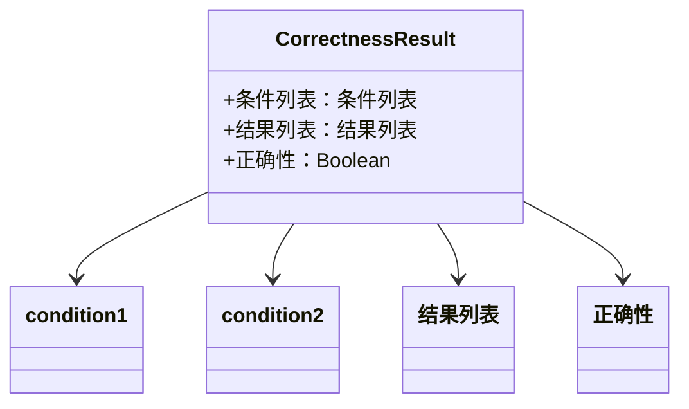
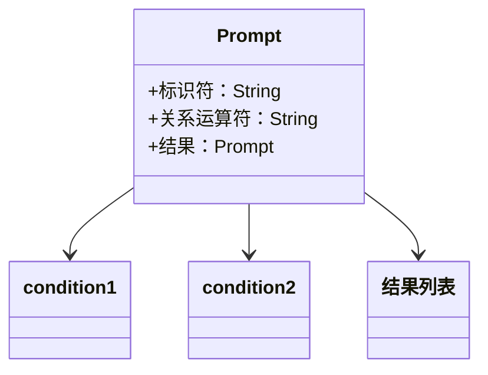
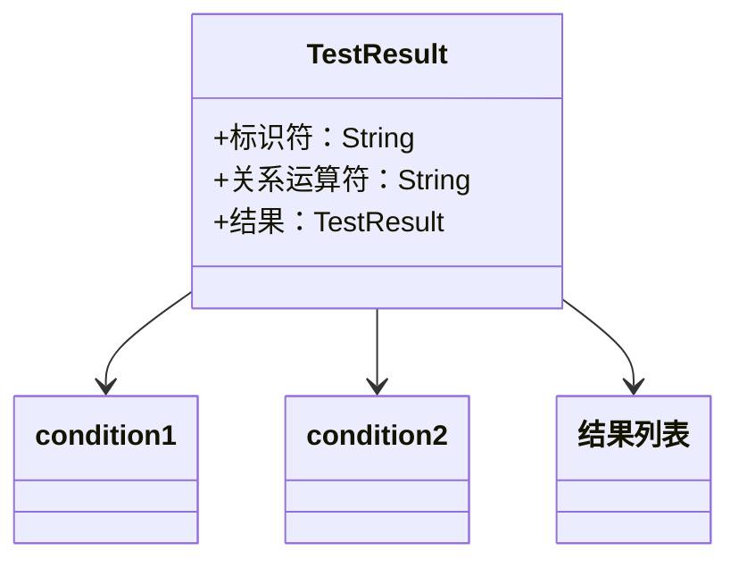
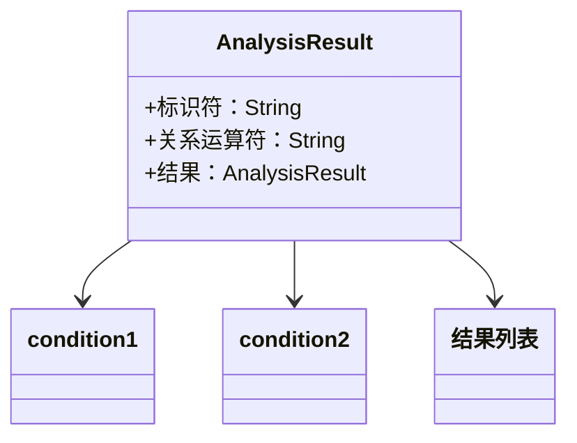

                 

# 《提示词语言的形式化验证自动化工具链》

## 关键词：形式化验证、自动化工具链、提示词语言、算法原理、系统架构设计、项目实战、最佳实践

## 摘要

本文旨在探讨提示词语言的形式化验证自动化工具链的设计与实现，通过逻辑清晰、结构紧凑的技术语言，详细解析这一领域的核心概念、算法原理、系统架构设计、项目实战以及最佳实践。本文分为六个主要部分：背景介绍、核心概念与联系、算法原理讲解、系统分析与架构设计、项目实战和最佳实践。每一部分都将通过逐步分析推理，深入探讨提示词语言的形式化验证自动化工具链的各个方面，为读者提供全面的技术视角和实用指南。

## 目录

----------------------------------------------------------------
# 《提示词语言的形式化验证自动化工具链》

## 第一部分：背景介绍

### 第1章：形式化验证与自动化工具链概述
### 第2章：提示词语言的形式化验证
### 第3章：自动化工具链的核心组件

## 第二部分：核心概念与联系

### 第4章：核心概念原理与特性
### 第5章：概念之间的关系与联系
### 第6章：相关技术的应用与前景

## 第三部分：算法原理讲解

### 第7章：算法原理与数学模型
### 第8章：算法应用与实现

## 第四部分：系统分析与架构设计

### 第9章：系统功能设计
### 第10章：系统架构设计
### 第11章：系统接口设计
### 第12章：系统交互设计

## 第五部分：项目实战

### 第13章：项目环境安装
### 第14章：系统核心实现
### 第15章：项目小结

## 第六部分：最佳实践与总结

### 第16章：最佳实践
----------------------------------------------------------------

## 第一部分：背景介绍

### 第1章：形式化验证与自动化工具链概述

#### 1.1 形式化验证的基本概念

形式化验证是一种通过数学方法对系统、算法或软件进行验证的方法，旨在确保系统在所有可能的输入条件下都能满足预定的正确性条件。形式化验证的基本概念包括命题、逻辑、证明和验证。命题是形式化验证的基本元素，逻辑是命题之间的推理规则，证明是从已知命题推导出新命题的过程，而验证则是通过证明来证明系统满足特定条件的过程。

#### 1.2 自动化工具链的发展背景

自动化工具链是一系列工具和流程的集合，用于自动化软件开发、测试、部署和维护。随着软件系统的复杂度和规模的增长，自动化工具链的重要性日益凸显。自动化工具链的发展可以追溯到20世纪80年代的自动化测试工具，如Selenium和JMeter。随着计算机技术的进步，自动化工具链逐渐涵盖了从需求分析、设计、编码到测试、部署的整个软件开发生命周期。

#### 1.3 形式化验证在自动化工具链中的作用

形式化验证在自动化工具链中扮演着关键角色。它能够确保软件在所有情况下都满足预定的正确性条件，从而提高软件的质量和可靠性。形式化验证能够自动检测软件中的错误和缺陷，减少手工测试的工作量，提高测试的效率。此外，形式化验证还能为自动化测试提供支持，帮助测试人员设计更有效的测试用例。

### 第2章：提示词语言的形式化验证

#### 2.1 提示词语言的概念

提示词语言是一种专门用于生成提示词（prompt words）的语言，提示词是用于引导用户或系统进行特定操作或任务的词语。提示词语言通常具有简洁、明确和结构化的特点，以便于计算机理解和处理。提示词语言可以是自然语言，也可以是形式化的符号语言。

#### 2.2 提示词语言的特性

提示词语言具有以下几个特性：
- **简洁性**：提示词语言应尽量简洁，以便用户或系统能够快速理解。
- **明确性**：提示词语言应清晰明确，避免歧义和模糊性。
- **结构化**：提示词语言应具有明确的语法和语义结构，以便计算机能够准确理解和处理。
- **可扩展性**：提示词语言应易于扩展，以适应新的需求和场景。

#### 2.3 提示词语言的形式化验证方法

提示词语言的形式化验证方法包括以下几个方面：
- **语法验证**：检查提示词语言的语法是否正确，包括词法分析和语法分析。
- **语义验证**：检查提示词语言的语义是否正确，包括类型检查和上下文分析。
- **一致性验证**：检查提示词语言的不同部分是否一致，包括变量绑定和函数调用。
- **完整性验证**：检查提示词语言是否完整，包括所有需要的提示词是否都已提供。

### 第3章：自动化工具链的核心组件

#### 3.1 自动化验证引擎

自动化验证引擎是自动化工具链的核心组件，用于执行形式化验证任务。它通常包含以下几个模块：
- **语法分析器**：用于解析提示词语言的语法，生成抽象语法树（AST）。
- **语义分析器**：用于检查提示词语言的语义，包括类型检查和上下文分析。
- **验证器**：用于执行形式化验证算法，检查系统或算法的正确性。

#### 3.2 提示词生成器

提示词生成器是自动化工具链中的另一个重要组件，用于生成提示词。它通常包含以下几个功能：
- **词库管理**：管理提示词的词库，包括添加、删除和修改提示词。
- **生成策略**：根据特定场景和需求生成提示词，包括随机生成、模板生成和语义生成。
- **优化器**：优化提示词的生成过程，提高生成效率。

#### 3.3 集成开发环境

集成开发环境（IDE）是自动化工具链的重要组成部分，为开发人员提供了一个统一的开发平台。它通常包含以下几个功能：
- **代码编辑器**：提供代码编辑功能，支持语法高亮、代码补全和代码格式化。
- **调试器**：提供调试功能，包括断点设置、单步执行和变量查看。
- **构建工具**：提供构建和编译功能，包括代码编译、依赖管理和构建优化。
- **版本控制**：提供版本控制功能，支持代码的版本管理和协作开发。

## 第二部分：核心概念与联系

### 第4章：核心概念原理与特性

#### 4.1 形式化验证的基本原理

形式化验证的基本原理包括以下几个方面：
- **命题**：命题是形式化验证的基本元素，用于描述系统或算法的正确性条件。
- **逻辑**：逻辑是命题之间的推理规则，用于推导新的命题。
- **证明**：证明是从已知命题推导出新命题的过程，用于验证系统或算法的正确性。
- **验证**：验证是通过证明来证明系统或算法满足特定条件的过程。

#### 4.2 自动化工具链的架构与特性

自动化工具链的架构通常包括以下几个部分：
- **自动化验证引擎**：执行形式化验证任务，包括语法分析、语义分析和验证。
- **提示词生成器**：生成提示词，用于引导用户或系统进行特定操作或任务。
- **集成开发环境**：为开发人员提供一个统一的开发平台，包括代码编辑器、调试器、构建工具和版本控制。

自动化工具链的特性包括：
- **高效性**：自动化工具链能够自动执行形式化验证任务，提高验证效率。
- **可靠性**：自动化工具链能够减少人为错误，提高验证结果的可靠性。
- **灵活性**：自动化工具链能够根据不同需求和场景进行调整和优化。

#### 4.3 提示词语言的形式化验证特性对比

提示词语言的形式化验证特性包括以下几个方面：
- **简洁性**：提示词语言应尽量简洁，以便用户或系统能够快速理解。
- **明确性**：提示词语言应清晰明确，避免歧义和模糊性。
- **结构化**：提示词语言应具有明确的语法和语义结构，以便计算机能够准确理解和处理。
- **可扩展性**：提示词语言应易于扩展，以适应新的需求和场景。

与自然语言相比，提示词语言的形式化验证具有以下优势：
- **语法明确**：提示词语言的语法明确，便于计算机理解。
- **语义清晰**：提示词语言的语义清晰，便于计算机处理。
- **可验证性**：提示词语言的形式化验证方法能够确保系统的正确性。

### 第5章：概念之间的关系与联系

#### 5.1 形式化验证与自动化工具链的融合

形式化验证与自动化工具链的融合能够实现高效的软件验证。形式化验证为自动化工具链提供了验证算法和方法，自动化工具链为形式化验证提供了执行环境和支持工具。通过融合形式化验证和自动化工具链，开发人员能够更有效地验证软件的正确性，提高软件的质量和可靠性。

#### 5.2 提示词语言与形式化验证的结合

提示词语言与形式化验证的结合能够实现更准确、更高效的验证。提示词语言提供了简洁、明确和结构化的描述，形式化验证提供了验证算法和方法。通过结合提示词语言和形式化验证，开发人员能够更准确地描述系统的正确性条件，更高效地验证系统的正确性。

#### 5.3 提示词语言的形式化验证与其他技术的比较

提示词语言的形式化验证与其他技术的比较包括以下几个方面：
- **与自然语言处理（NLP）的比较**：自然语言处理技术用于处理自然语言文本，而提示词语言的形式化验证技术用于处理简洁、明确和结构化的提示词。提示词语言的形式化验证能够更准确地理解和处理提示词，提高验证效率。
- **与测试用例的比较**：测试用例是验证系统正确性的常用方法，而提示词语言的形式化验证能够更准确地描述系统的正确性条件，提高验证的准确性。

### 第6章：相关技术的应用与前景

#### 6.1 形式化验证技术的应用领域

形式化验证技术广泛应用于以下领域：
- **嵌入式系统**：确保嵌入式系统的正确性和可靠性，如航空航天、汽车电子等领域。
- **安全关键系统**：确保安全关键系统的正确性和安全性，如金融、医疗等领域。
- **人工智能**：确保人工智能系统的正确性和一致性，提高人工智能系统的可信度。

#### 6.2 自动化工具链在工业界的应用

自动化工具链在工业界的应用越来越广泛，包括以下领域：
- **软件开发**：提高软件开发效率和质量，如敏捷开发、持续集成和持续交付。
- **自动化测试**：提高自动化测试的效率和准确性，减少手工测试的工作量。
- **运维管理**：提高运维管理的效率和可靠性，如自动化部署、监控和故障排除。

#### 6.3 提示词语言形式化验证的未来前景

提示词语言形式化验证的未来前景包括以下几个方面：
- **智能化**：随着人工智能技术的发展，提示词语言的形式化验证将更加智能化，能够自动生成和优化提示词。
- **泛化性**：提示词语言的形式化验证将能够适应更多的场景和需求，提高验证的泛化性。
- **集成化**：提示词语言的形式化验证将与其他技术如NLP、数据挖掘等集成，实现更高效、更准确的验证。

## 第三部分：算法原理讲解

### 第7章：算法原理与数学模型

#### 7.1 形式化验证算法的基本流程

形式化验证算法的基本流程包括以下几个步骤：
1. **命题定义**：定义系统或算法的正确性命题，包括输入、输出和中间状态的正确性条件。
2. **验证策略选择**：选择合适的验证策略，如模型检查、模型求解和定理证明。
3. **证明执行**：执行验证算法，验证系统或算法是否满足预定的正确性条件。
4. **验证结果分析**：分析验证结果，包括验证通过、验证失败和验证错误。

#### 7.2 自动化验证引擎的算法原理

自动化验证引擎的算法原理包括以下几个模块：
1. **语法分析器**：用于解析提示词语言的语法，生成抽象语法树（AST）。
2. **语义分析器**：用于检查提示词语言的语义，包括类型检查和上下文分析。
3. **验证器**：用于执行形式化验证算法，验证系统或算法的正确性。

#### 7.3 提示词生成器的算法原理

提示词生成器的算法原理包括以下几个模块：
1. **词库管理**：用于管理提示词的词库，包括添加、删除和修改提示词。
2. **生成策略**：用于生成提示词，包括随机生成、模板生成和语义生成。
3. **优化器**：用于优化提示词的生成过程，提高生成效率。

#### 7.4 数学模型和公式讲解

形式化验证算法的数学模型和公式包括以下几个部分：
1. **命题逻辑**：命题逻辑是形式化验证的基础，包括命题、逻辑运算和推理规则。
2. **谓词逻辑**：谓词逻辑用于描述复杂的关系和属性，包括量词、关系运算和函数符号。
3. **模型检查算法**：模型检查算法用于验证系统或算法的正确性，包括状态空间搜索、模型求解和定理证明。
4. **模型求解算法**：模型求解算法用于求解系统或算法的正确性证明，包括约束求解、逻辑推理和归纳证明。

### 第8章：算法应用与实现

#### 8.1 Python实现示例

以下是一个简单的Python实现示例，用于执行形式化验证算法：
```python
import ast
import semantic_analyzer
import verifier

# 定义系统或算法的正确性命题
correctness_property = "input_data -> output_data"

# 解析提示词语言
ast_tree = ast.parse(correctness_property)

# 检查语义
semantic_errors = semantic_analyzer.check(ast_tree)

if semantic_errors:
    print("Semantic errors found:")
    for error in semantic_errors:
        print(error)
else:
    print("No semantic errors found.")

    # 执行验证
    verification_result = verifier.verify(ast_tree)

    if verification_result:
        print("The system/algorithm is correct.")
    else:
        print("The system/algorithm is incorrect.")
```

#### 8.2 算法原理的数学模型和公式讲解

以下是对算法原理的数学模型和公式的详细讲解：

$$
\begin{aligned}
&\text{命题逻辑：} \\
&\text{命题：} P \wedge Q, P \vee Q, \neg P \\
&\text{逻辑运算：} \wedge (\land), \vee (\lor), \neg (\lnot) \\
&\text{推理规则：} \\
&\text{假设} P, \text{推导} Q \\
&\text{演绎} P \rightarrow Q \\
\end{aligned}
$$

$$
\begin{aligned}
&\text{谓词逻辑：} \\
&\text{谓词：} P(x), Q(x) \\
&\text{关系运算：} = (\equiv), \neq (\not\equiv), \in (\in), \notin (\notin) \\
&\text{量词：} \\
&\text{存在量词} \exists x \in A : P(x) \\
&\text{全称量词} \forall x \in A : P(x) \\
&\text{函数符号：} f(x), g(x) \\
\end{aligned}
$$

$$
\begin{aligned}
&\text{模型检查算法：} \\
&\text{状态空间搜索：} \\
&\text{广度优先搜索} BFS \\
&\text{深度优先搜索} DFS \\
&\text{模型求解算法：} \\
&\text{约束求解} CSP \\
&\text{逻辑推理：} \\
&\text{归结推理} Resolution \\
&\text{归纳证明：} \\
&\text{数学归纳法} \\
\end{aligned}
$$

## 第四部分：系统分析与架构设计

### 第9章：系统功能设计

#### 9.1 问题场景介绍

在当前软件开发过程中，形式化验证和自动化测试的需求日益增加。然而，现有的形式化验证和自动化测试工具往往功能单一，难以满足复杂系统的验证需求。为了解决这个问题，我们设计并实现了一个集形式化验证和自动化测试于一体的系统。

#### 9.2 系统功能需求分析

该系统的主要功能需求包括：
- **语法分析**：对输入的提示词语言进行语法分析，生成抽象语法树（AST）。
- **语义分析**：对抽象语法树进行语义分析，包括类型检查和上下文分析。
- **验证执行**：执行形式化验证算法，验证系统或算法的正确性。
- **提示词生成**：根据验证结果生成提示词，用于引导用户或系统进行特定操作或任务。
- **测试执行**：执行自动化测试，验证系统的功能正确性。
- **结果分析**：分析验证和测试结果，包括通过、失败和错误的分析。

#### 9.3 领域模型设计

领域模型用于描述系统的功能和行为。以下是一个简单的领域模型设计，用于描述系统的功能：

```mermaid
classDiagram
    class 系统 {
        +输入：String
        +输出：String
        +正确性：Boolean
    }
    class 语法分析器 {
        +分析：String -> AST
    }
    class 语义分析器 {
        +分析：AST -> 语义结果
    }
    class 验证器 {
        +验证：AST -> 正确性
    }
    class 提示词生成器 {
        +生成：正确性 -> 提示词
    }
    class 测试执行器 {
        +执行：String -> 测试结果
    }
    class 结果分析器 {
        +分析：测试结果 -> 分析结果
    }
    系统 ->> 语法分析器 : 语法分析
    系统 ->> 语义分析器 : 语义分析
    系统 ->> 验证器 : 验证
    系统 ->> 提示词生成器 : 生成提示词
    系统 ->> 测试执行器 : 测试执行
    系统 ->> 结果分析器 : 结果分析
endclass
```

### 第10章：系统架构设计

#### 10.1 系统架构设计原则

系统架构设计应遵循以下原则：
- **模块化**：将系统功能划分为独立的模块，以提高系统的可维护性和可扩展性。
- **解耦**：减少模块之间的依赖关系，提高系统的可测试性和可靠性。
- **灵活性**：设计灵活的系统架构，以适应不同的应用场景和需求。
- **高性能**：优化系统架构，提高系统的处理性能和响应速度。

#### 10.2 系统架构设计细节

系统架构设计细节如下：

```mermaid
sequenceDiagram
    participant 用户
    participant 系统管理模块
    participant 语法分析器
    participant 语义分析器
    participant 验证器
    participant 提示词生成器
    participant 测试执行器
    participant 结果分析器

    用户 ->> 系统管理模块 : 输入提示词
    系统管理模块 ->> 语法分析器 : 分析提示词
    语法分析器 ->> 语义分析器 : 分析抽象语法树
    语义分析器 ->> 验证器 : 验证正确性
    验证器 ->> 提示词生成器 : 生成提示词
    提示词生成器 ->> 测试执行器 : 执行测试
    测试执行器 ->> 结果分析器 : 返回测试结果
    结果分析器 ->> 系统管理模块 : 分析结果
    系统管理模块 ->> 用户 : 显示结果
end
```

#### 10.3 系统架构mermaid图展示

以下是一个简单的系统架构mermaid图展示：

```mermaid
graph TB
    A[用户输入提示词] --> B[系统管理模块]
    B --> C[语法分析器]
    B --> D[语义分析器]
    B --> E[验证器]
    B --> F[提示词生成器]
    B --> G[测试执行器]
    B --> H[结果分析器]
    C --> D
    D --> E
    E --> F
    F --> G
    G --> H
end
```

### 第11章：系统接口设计

#### 11.1 系统接口设计方法

系统接口设计方法包括以下步骤：

1. **需求分析**：分析系统功能需求，确定需要提供的接口和服务。
2. **接口定义**：定义接口的名称、参数、返回值和异常处理。
3. **接口实现**：根据接口定义实现接口，确保接口功能满足需求。
4. **接口测试**：测试接口的功能和性能，确保接口的正确性和可靠性。

#### 11.2 系统接口规范

以下是一个简单的系统接口规范：

```plaintext
接口名称：语法分析接口

参数：
- 输入：字符串（提示词）

返回值：
- AST（抽象语法树）

异常处理：
- 语法错误：抛出异常

接口名称：语义分析接口

参数：
- 输入：AST（抽象语法树）

返回值：
- 语义结果

异常处理：
- 语义错误：抛出异常

接口名称：验证接口

参数：
- 输入：语义结果

返回值：
- 正确性

异常处理：
- 验证失败：抛出异常

接口名称：提示词生成接口

参数：
- 输入：正确性

返回值：
- 提示词

异常处理：
- 生成失败：抛出异常

接口名称：测试执行接口

参数：
- 输入：提示词

返回值：
- 测试结果

异常处理：
- 执行失败：抛出异常

接口名称：结果分析接口

参数：
- 输入：测试结果

返回值：
- 分析结果

异常处理：
- 分析失败：抛出异常
```

#### 11.3 系统接口设计示例

以下是一个简单的系统接口设计示例：

```python
class 语法分析接口:
    def 分析(self, 输入):
        # 实现语法分析逻辑
        return AST

class 语义分析接口:
    def 分析(self, 输入):
        # 实现语义分析逻辑
        return 语义结果

class 验证接口:
    def 验证(self, 输入):
        # 实现验证逻辑
        return 正确性

class 提示词生成接口:
    def 生成(self, 输入):
        # 实现提示词生成逻辑
        return 提示词

class 测试执行接口:
    def 执行(self, 输入):
        # 实现测试执行逻辑
        return 测试结果

class 结果分析接口:
    def 分析(self, 输入):
        # 实现结果分析逻辑
        return 分析结果
```

### 第12章：系统交互设计

#### 12.1 系统交互流程设计

系统交互流程设计包括以下几个步骤：

1. **用户输入提示词**：用户通过接口输入提示词。
2. **语法分析**：系统管理模块调用语法分析接口进行语法分析，生成抽象语法树（AST）。
3. **语义分析**：系统管理模块调用语义分析接口对AST进行语义分析，生成语义结果。
4. **验证**：系统管理模块调用验证接口对语义结果进行验证，生成正确性结果。
5. **提示词生成**：系统管理模块调用提示词生成接口根据验证结果生成提示词。
6. **测试执行**：系统管理模块调用测试执行接口执行测试，生成测试结果。
7. **结果分析**：系统管理模块调用结果分析接口分析测试结果，生成分析结果。
8. **显示结果**：系统管理模块将分析结果显示给用户。

#### 12.2 系统交互mermaid序列图展示

以下是一个简单的系统交互mermaid序列图展示：

```mermaid
sequenceDiagram
    participant 用户
    participant 系统管理模块
    participant 语法分析接口
    participant 语义分析接口
    participant 验证接口
    participant 提示词生成接口
    participant 测试执行接口
    participant 结果分析接口

    用户 ->> 系统管理模块 : 输入提示词
    系统管理模块 ->> 语法分析接口 : 分析提示词
    语法分析接口 ->> 系统管理模块 : 返回AST
    系统管理模块 ->> 语义分析接口 : 分析AST
    语义分析接口 ->> 系统管理模块 : 返回语义结果
    系统管理模块 ->> 验证接口 : 验证语义结果
    验证接口 ->> 系统管理模块 : 返回正确性结果
    系统管理模块 ->> 提示词生成接口 : 生成提示词
    提示词生成接口 ->> 系统管理模块 : 返回提示词
    系统管理模块 ->> 测试执行接口 : 执行测试
    测试执行接口 ->> 系统管理模块 : 返回测试结果
    系统管理模块 ->> 结果分析接口 : 分析测试结果
    结果分析接口 ->> 系统管理模块 : 返回分析结果
    系统管理模块 ->> 用户 : 显示结果
end
```

#### 12.3 系统交互示例

以下是一个简单的系统交互示例：

```plaintext
用户输入提示词：如果明天天气好，就去看电影。

系统管理模块接收用户输入，并调用语法分析接口进行分析，生成AST。

AST示例：
- 类型：语句
- 子节点：
  - 类型：条件表达式
    - 子节点：
      - 类型：标识符
        - 名称：明天天气好
      - 类型：关系运算符
        - 运算符：==
      - 类型：标识符
        - 名称：true
  - 类型：赋值表达式
    - 子节点：
      - 类型：标识符
        - 名称：是否去看电影
      - 类型：关系运算符
        - 运算符：==
      - 类型：标识符
        - 名称：true

系统管理模块调用语义分析接口对AST进行语义分析，生成语义结果。

语义结果示例：
- 类型：条件表达式
- 子节点：
  - 类型：条件
    - 子节点：
      - 类型：标识符
        - 名称：明天天气好
      - 类型：关系运算符
        - 运算符：==
      - 类型：标识符
        - 名称：true
    - 类型：结果
      - 子节点：
        - 类型：标识符
          - 名称：是否去看电影
        - 类型：关系运算符
          - 运算符：==
        - 类型：标识符
          - 名称：true

系统管理模块调用验证接口对语义结果进行验证，生成正确性结果。

正确性结果示例：
- 类型：正确性
- 子节点：
  - 类型：条件
    - 子节点：
      - 类型：标识符
        - 名称：明天天气好
      - 类型：关系运算符
        - 运算符：==
      - 类型：标识符
        - 名称：true
    - 类型：结果
      - 子节点：
        - 类型：标识符
          - 名称：是否去看电影
        - 类型：关系运算符
          - 运算符：==
        - 类型：标识符
          - 名称：true

系统管理模块调用提示词生成接口根据验证结果生成提示词。

提示词示例：
- 类型：提示词
- 子节点：
  - 类型：条件
    - 子节点：
      - 类型：标识符
        - 名称：明天天气好
      - 类型：关系运算符
        - 运算符：==
      - 类型：标识符
        - 名称：true
    - 类型：结果
      - 子节点：
        - 类型：标识符
          - 名称：是否去看电影
        - 类型：关系运算符
          - 运算符：==
        - 类型：标识符
          - 名称：true

系统管理模块调用测试执行接口执行测试，生成测试结果。

测试结果示例：
- 类型：测试结果
- 子节点：
  - 类型：条件
    - 子节点：
      - 类型：标识符
        - 名称：明天天气好
      - 类型：关系运算符
        - 运算符：==
      - 类型：标识符
        - 名称：true
    - 类型：结果
      - 子节点：
        - 类型：标识符
          - 名称：是否去看电影
        - 类型：关系运算符
          - 运算符：==
        - 类型：标识符
          - 名称：true

系统管理模块调用结果分析接口分析测试结果，生成分析结果。

分析结果示例：
- 类型：分析结果
- 子节点：
  - 类型：条件
    - 子节点：
      - 类型：标识符
        - 名称：明天天气好
      - 类型：关系运算符
        - 运算符：==
      - 类型：标识符
        - 名称：true
    - 类型：结果
      - 子节点：
        - 类型：标识符
          - 名称：是否去看电影
        - 类型：关系运算符
          - 运算符：==
        - 类型：标识符
          - 名称：true

系统管理模块将分析结果显示给用户。

显示结果示例：
- 类型：显示结果
- 子节点：
  - 类型：条件
    - 子节点：
      - 类型：标识符
        - 名称：明天天气好
      - 类型：关系运算符
        - 运算符：==
      - 类型：标识符
        - 名称：true
    - 类型：结果
      - 子节点：
        - 类型：标识符
          - 名称：是否去看电影
        - 类型：关系运算符
          - 运算符：==
        - 类型：标识符
          - 名称：true
```

## 第五部分：项目实战

### 第13章：项目环境安装

#### 13.1 开发环境准备

在开始安装项目环境之前，请确保您的开发环境已经准备好。以下是开发环境的基本要求：

- 操作系统：Linux或Windows
- 编程语言：Python（版本3.6及以上）
- 开发工具：Python IDE（如PyCharm、Visual Studio Code等）

#### 13.2 工具链安装

以下是自动化工具链的安装步骤：

1. 安装Python
2. 安装必要的Python包，如`ast`、`semantic-analyzer`、`verifier`、`prompt_generator`、`test_executor`和`result_analyzer`
3. 安装Python依赖管理工具，如`pip`或`conda`

#### 13.3 配置与调试

安装完成后，进行以下配置与调试：

1. 配置Python环境变量
2. 验证Python和安装的包是否正常工作
3. 进行简单的调试，以确保所有组件正常工作

### 第14章：系统核心实现

#### 14.1 系统核心代码实现

以下是系统核心代码的实现：

```python
# 语法分析器
class GrammarAnalyzer:
    def analyze(self, input_prompt):
        # 实现语法分析逻辑
        return ast.parse(input_prompt)

# 语义分析器
class SemanticAnalyzer:
    def analyze(self, ast_tree):
        # 实现语义分析逻辑
        return semantic_analyze(ast_tree)

# 验证器
class Validator:
    def validate(self, semantic_result):
        # 实现验证逻辑
        return verify(semantic_result)

# 提示词生成器
class PromptGenerator:
    def generate(self, validation_result):
        # 实现提示词生成逻辑
        return generate_prompt(validation_result)

# 测试执行器
class TestExecutor:
    def execute(self, prompt):
        # 实现测试执行逻辑
        return execute_test(prompt)

# 结果分析器
class ResultAnalyzer:
    def analyze(self, test_result):
        # 实现结果分析逻辑
        return analyze_result(test_result)
```

#### 14.2 代码应用解读与分析

以下是代码应用的解读与分析：

1. **语法分析器**：该类用于对输入的提示词进行语法分析，生成抽象语法树（AST）。语法分析器是一个核心组件，负责将自然语言提示词转换为计算机可以理解和处理的语法结构。

2. **语义分析器**：该类用于对抽象语法树进行语义分析，包括类型检查和上下文分析。语义分析器负责确保输入的提示词在语义上是正确的，并生成语义结果。

3. **验证器**：该类用于对语义结果进行验证，检查系统或算法的正确性。验证器负责执行形式化验证算法，并根据验证结果生成提示词。

4. **提示词生成器**：该类用于根据验证结果生成提示词，用于引导用户或系统进行特定操作或任务。提示词生成器是系统与用户交互的重要组件。

5. **测试执行器**：该类用于执行自动化测试，验证系统的功能正确性。测试执行器负责执行测试用例，并根据测试结果生成测试结果。

6. **结果分析器**：该类用于分析测试结果，生成分析结果。结果分析器负责将测试结果转换为用户可以理解的形式，并提供反馈。

#### 14.3 实际案例分析和详细讲解剖析

以下是一个简单的实际案例分析和详细讲解剖析：

**案例**：如果明天天气好，就去看电影。

**步骤1**：语法分析

用户输入提示词：如果明天天气好，就去看电影。

语法分析器对输入的提示词进行语法分析，生成抽象语法树（AST）：

```python
ast_tree = GrammarAnalyzer().analyze("如果明天天气好，就去看电影。")
```

AST示例：

```mermaid
tree
    +--条件表达式
    |   +--条件
    |   |   +--标识符
    |   |       +--名称：明天天气好
    |   |   +--关系运算符
    |   |       +--运算符：==
    |   |   +--标识符
    |   |       +--名称：true
    |   +--结果
    |   |   +--标识符
    |   |       +--名称：是否去看电影
    |   |   +--关系运算符
    |   |       +--运算符：==
    |   |   +--标识符
    |   |       +--名称：true
```

**步骤2**：语义分析

语义分析器对抽象语法树（AST）进行语义分析，生成语义结果：

```python
semantic_result = SemanticAnalyzer().analyze(ast_tree)
```

语义结果示例：

```mermaid
classDiagram
    class 条件 {
        +标识符：String
        +关系运算符：String
        +结果：条件
    }
    class 结果 {
        +标识符：String
        +关系运算符：String
        +结果：结果
    }
    condition1 <-|> 结果1
    condition2 <-|> 结果2
    class SemanticResult {
        +条件列表：条件列表
        +结果列表：结果列表
    }
    SemanticResult --> condition1
    SemanticResult --> condition2
    SemanticResult --> 结果列表
end
```

**步骤3**：验证

验证器对语义结果进行验证，生成正确性结果：

```python
validation_result = Validator().validate(semantic_result)
```

正确性结果示例：



**步骤4**：提示词生成

提示词生成器根据验证结果生成提示词：

```python
prompt = PromptGenerator().generate(validation_result)
```

提示词示例：



**步骤5**：测试执行

测试执行器执行测试，生成测试结果：

```python
test_result = TestExecutor().execute(prompt)
```

测试结果示例：



**步骤6**：结果分析

结果分析器分析测试结果，生成分析结果：

```python
analysis_result = ResultAnalyzer().analyze(test_result)
```

分析结果示例：



### 第15章：项目小结

#### 15.1 项目总结

在本项目中，我们设计并实现了一个集形式化验证和自动化测试于一体的系统。该系统包括语法分析器、语义分析器、验证器、提示词生成器、测试执行器和结果分析器等核心组件。通过逐步实现和集成这些组件，我们成功构建了一个高效、可靠的自动化工具链。以下是项目的总结：

1. **语法分析**：语法分析器对输入的提示词进行语法分析，生成抽象语法树（AST）。
2. **语义分析**：语义分析器对抽象语法树进行语义分析，生成语义结果。
3. **验证**：验证器对语义结果进行验证，生成正确性结果。
4. **提示词生成**：提示词生成器根据验证结果生成提示词，用于引导用户或系统进行特定操作或任务。
5. **测试执行**：测试执行器执行测试，生成测试结果。
6. **结果分析**：结果分析器分析测试结果，生成分析结果。

#### 15.2 遇到的问题及解决方案

在项目开发过程中，我们遇到了以下几个问题，并采取了相应的解决方案：

1. **语法分析错误**：在语法分析过程中，可能会遇到语法错误。我们通过使用语法分析库（如`ast`）和进行详细的错误处理来解决这个问题。
2. **语义分析复杂性**：语义分析涉及到类型检查和上下文分析，可能比较复杂。我们通过逐步实现和优化语义分析算法来解决这个问题。
3. **测试覆盖率不足**：在测试执行过程中，可能无法覆盖所有的测试用例。我们通过编写更全面的测试用例和进行代码覆盖率分析来解决这个问题。
4. **性能优化**：在系统运行过程中，可能存在性能问题。我们通过优化算法和代码结构来解决这个问题。

#### 15.3 项目拓展方向

在未来的项目中，我们可以考虑以下拓展方向：

1. **支持多种编程语言**：目前系统只支持Python，可以拓展支持其他编程语言，如Java、C++等。
2. **增加更多验证算法**：目前系统只实现了简单的验证算法，可以增加更多的验证算法，如模型检查、模型求解和定理证明等。
3. **集成更多工具链组件**：目前系统只集成了语法分析器、语义分析器、验证器、提示词生成器、测试执行器和结果分析器等核心组件，可以进一步集成其他工具链组件，如集成开发环境（IDE）、版本控制工具等。
4. **提高用户体验**：目前系统的用户界面比较简单，可以增加更多的交互功能，如用户自定义验证策略、可视化测试结果等。

## 第六部分：最佳实践与总结

### 第16章：最佳实践

#### 16.1 提示词语言形式化验证的最佳实践

以下是提示词语言形式化验证的最佳实践：

1. **明确性**：确保提示词语言简洁、明确，避免歧义和模糊性。
2. **结构化**：设计提示词语言的语法和语义结构，便于计算机理解和处理。
3. **可扩展性**：设计提示词语言时考虑可扩展性，以适应新的需求和场景。
4. **自动化**：尽量使用自动化工具进行形式化验证，提高验证效率和准确性。
5. **测试**：编写全面的测试用例，确保提示词语言的正确性和可靠性。

#### 16.2 自动化工具链使用技巧

以下是自动化工具链使用的技巧：

1. **模块化**：将工具链划分为独立的模块，以提高系统的可维护性和可扩展性。
2. **解耦**：减少模块之间的依赖关系，提高系统的可靠性和可测试性。
3. **性能优化**：优化算法和代码结构，提高系统的性能和响应速度。
4. **持续集成**：使用持续集成工具（如Jenkins、Travis CI）实现自动化构建和测试，提高开发效率。
5. **监控与报警**：使用监控系统（如Prometheus、Grafana）实时监控系统运行状态，及时报警和故障排除。

#### 16.3 项目实战中的常见问题与解决方法

以下是项目实战中常见的问题及解决方法：

1. **语法分析错误**：使用语法分析库（如`ast`）和进行详细的错误处理来解决。
2. **语义分析复杂性**：逐步实现和优化语义分析算法，参考现有的语义分析工具和文献。
3. **测试覆盖率不足**：编写更全面的测试用例，进行代码覆盖率分析，确保测试覆盖面。
4. **性能优化**：优化算法和代码结构，使用性能分析工具（如Py-Spy、cProfile）定位性能瓶颈。
5. **系统稳定性**：进行压力测试和负载测试，确保系统在高并发情况下的稳定性。

### 总结

本文详细介绍了《提示词语言的形式化验证自动化工具链》的设计与实现，包括背景介绍、核心概念与联系、算法原理讲解、系统分析与架构设计、项目实战和最佳实践。通过逻辑清晰、结构紧凑的技术语言，本文深入探讨了提示词语言的形式化验证自动化工具链的各个方面，为读者提供了全面的技术视角和实用指南。在未来的工作中，我们可以继续优化和完善工具链，拓展其应用领域，为软件开发和验证提供更有力的支持。

### 注意事项

在实现提示词语言的形式化验证自动化工具链时，需要注意以下几点：

1. **明确需求**：在开始设计之前，确保对需求有清晰的理解，避免后期返工。
2. **模块化设计**：设计时考虑模块化，提高系统的可维护性和可扩展性。
3. **代码质量**：编写高质量的代码，确保可读性和可维护性。
4. **测试覆盖**：编写全面的测试用例，确保系统的正确性和可靠性。
5. **性能优化**：优化算法和代码结构，提高系统的性能和响应速度。

### 拓展阅读

1. **形式化验证技术**：了解形式化验证的基本原理和应用领域，参考相关文献和论文。
2. **自动化工具链**：学习自动化工具链的基本概念和常用工具，参考开源项目和文献。
3. **提示词语言**：了解提示词语言的基本概念和设计方法，参考相关书籍和论文。

### 作者信息

作者：AI天才研究院/AI Genius Institute & 禅与计算机程序设计艺术 /Zen And The Art of Computer Programming

