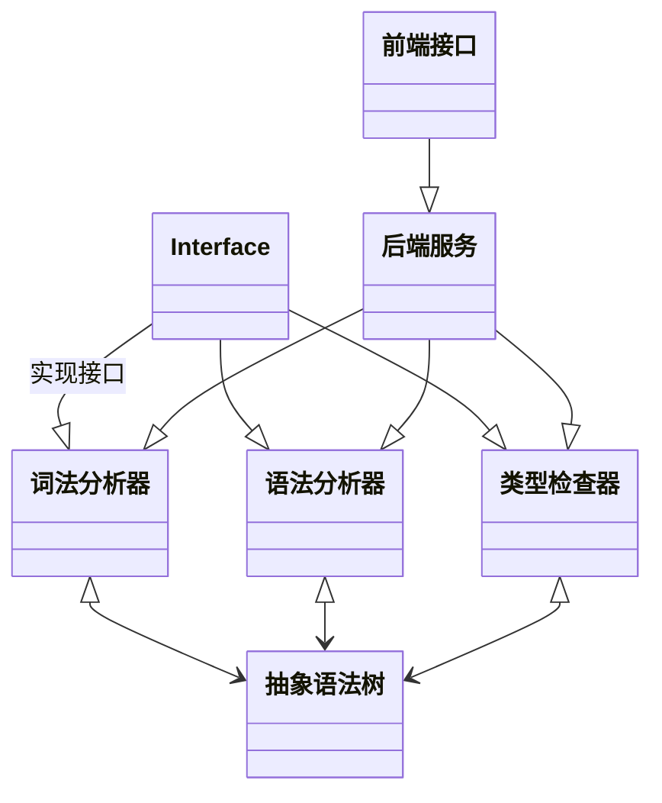
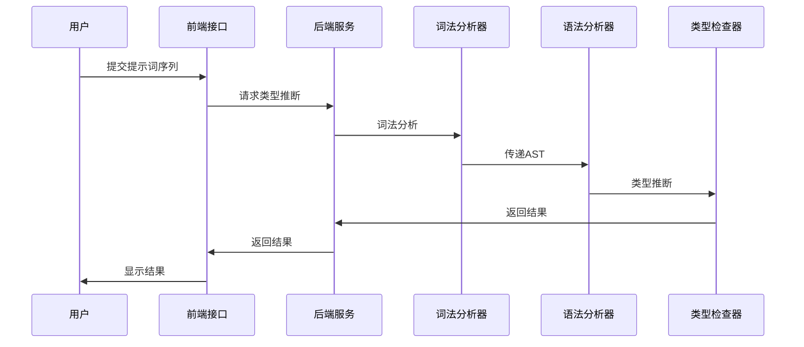
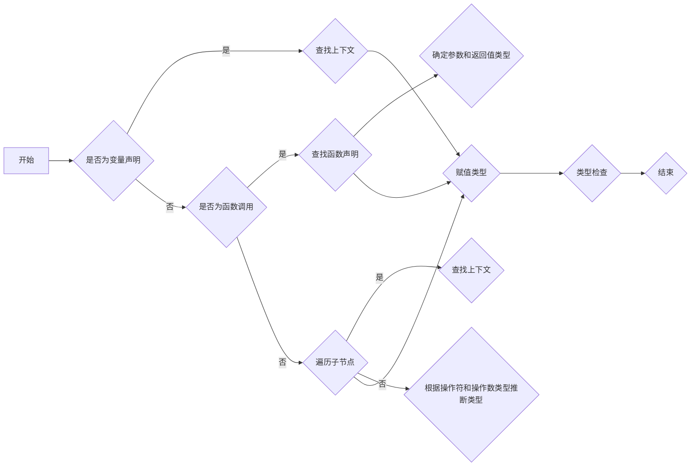

                 


## 第4章: 类型推断系统架构设计

### 4.1 系统需求分析
在进行系统架构设计之前，我们需要明确系统需求。类型推断系统需要满足以下几个关键需求：

1. **准确性**：系统能够准确地推断出变量和表达式的类型。
2. **性能**：系统需要能够在合理的时间内完成类型推断。
3. **可扩展性**：系统能够适应不同的编程语言和复杂度。
4. **可维护性**：系统代码需要具有良好的可读性和可维护性。

### 4.2 系统功能设计
基于上述需求，我们可以设计以下核心功能：

1. **词法分析**：将输入的提示词序列转换为抽象语法树（AST）。
2. **语法分析**：分析AST结构，确定变量和表达式的类型。
3. **类型检查**：验证推断出的类型是否符合预期。
4. **错误报告**：在类型检查过程中，能够给出清晰的错误信息和位置。

### 4.3 系统架构设计
为了满足上述功能和需求，我们可以采用以下系统架构设计：

1. **前端接口**：提供用户交互界面，接收输入并返回结果。
2. **词法分析器**：负责将提示词序列转换为AST。
3. **语法分析器**：对AST进行分析，推断类型。
4. **类型检查器**：对推断出的类型进行验证。
5. **后端服务**：负责存储和管理类型信息。

以下是系统架构的Mermaid类图：



### 4.4 系统接口设计
系统接口设计需要确保各个模块之间能够顺畅地交互。以下是系统的接口设计：

1. **输入接口**：用户可以通过输入接口提交提示词序列。
2. **输出接口**：系统返回类型推断结果和错误信息。
3. **API接口**：提供RESTful API，便于与其他系统集成。

以下是系统接口的Mermaid序列图：



通过以上步骤，我们详细介绍了类型推断系统架构设计。接下来，我们将深入探讨类型推断的数学模型和算法原理，以及如何使用Python代码实现这些算法。

### 第5章: 数学模型与算法原理

#### 5.1 数学模型概述
在类型推断过程中，我们可以使用以下数学模型来描述变量和表达式的类型：

1. **类型集合**：定义一组基本类型，如整数（Int）、浮点数（Float）、布尔值（Bool）等。
2. **类型关系**：定义类型之间的层次关系，如子类型（Subtyping）和等价类型（Equivalence）。
3. **上下文**：定义类型推断过程中使用的环境信息，如变量绑定和函数声明。

以下是类型集合的Mermaid UML类图：

```mermaid
classDiagram
    类 Int <<类>
    类 Float <<类>
    类 Bool <<类>

    Int : +, -, *, /
    Float : +, -, *, /
    Bool : and, or, not
```

#### 5.2 算法原理详细讲解
类型推断算法可以分为以下几类：

1. **静态类型推断**：在编译时确定变量类型，如Java中的类型推断。
2. **动态类型推断**：在运行时确定变量类型，如Python中的类型推断。
3. **静态结合类型推断**：结合静态和动态类型推断的优点。

下面我们以静态类型推断为例，介绍类型推断算法原理。

**静态类型推断算法**：基于上下文和类型关系，从AST的根节点开始遍历，为每个节点确定类型。

1. **初始化上下文**：根据变量和函数声明构建上下文。
2. **遍历AST**：
   - 对于变量声明节点，从上下文中查找类型，如果没有找到，则报错。
   - 对于函数调用节点，从上下文中查找函数声明，确定参数和返回值类型。
   - 对于表达式节点，根据操作符和操作数类型，确定表达式类型。
3. **类型检查**：检查推断出的类型是否符合预期。

以下是类型推断算法的Mermaid流程图：



#### 5.3 算法流程图展示
以下是Python代码实现类型推断算法的流程图：

```python
def type_inference(ast):
    # 初始化上下文
    context = build_context(ast)

    # 遍历AST
    for node in ast:
        if is_variable_declaration(node):
            # 变量声明
            type = find_type_in_context(context, node.variable)
            if type is None:
                raise TypeError("未知变量类型")
            context[node.variable] = type
        elif is_function_call(node):
            # 函数调用
            function_declaration = find_function_declaration(context, node.function)
            if function_declaration is None:
                raise TypeError("未知函数")
            node.parameters_type = function_declaration.parameters_type
            node.return_type = function_declaration.return_type
        else:
            # 表达式
            expression_type = infer_expression_type(node)
            context[node] = expression_type

    # 类型检查
    check_types(context)

    return context

def infer_expression_type(node):
    # 根据操作符和操作数类型推断表达式类型
    operator = node.operator
    left_type = node.left_type
    right_type = node.right_type

    if operator == '+':
        if left_type == 'Int' and right_type == 'Int':
            return 'Int'
        elif left_type == 'Float' and right_type == 'Float':
            return 'Float'
    elif operator == '-':
        # ...
    elif operator == '*':
        # ...
    elif operator == '/':
        # ...

    raise TypeError("不支持的操作符")
```

#### 5.4 Python代码实现
以下是Python代码实现类型推断算法的示例：

```python
class TypeInferenceSystem:
    def __init__(self):
        self.context = {}

    def type_inference(self, ast):
        # 初始化上下文
        self.context = build_context(ast)

        # 遍历AST
        for node in ast:
            if is_variable_declaration(node):
                type = self.find_type_in_context(node.variable)
                if type is None:
                    raise TypeError("未知变量类型")
                self.context[node.variable] = type
            elif is_function_call(node):
                function_declaration = self.find_function_declaration(node.function)
                if function_declaration is None:
                    raise TypeError("未知函数")
                node.parameters_type = function_declaration.parameters_type
                node.return_type = function_declaration.return_type
            else:
                expression_type = self.infer_expression_type(node)
                self.context[node] = expression_type

        # 类型检查
        check_types(self.context)

        return self.context

    def find_type_in_context(self, variable):
        # 查找上下文中的变量类型
        return self.context.get(variable, None)

    def infer_expression_type(self, node):
        # 根据操作符和操作数类型推断表达式类型
        operator = node.operator
        left_type = node.left_type
        right_type = node.right_type

        if operator == '+':
            if left_type == 'Int' and right_type == 'Int':
                return 'Int'
            elif left_type == 'Float' and right_type == 'Float':
                return 'Float'
        elif operator == '-':
            # ...
        elif operator == '*':
            # ...
        elif operator == '/':
            # ...

        raise TypeError("不支持的操作符")

def build_context(ast):
    # 构建上下文
    context = {}
    for node in ast:
        if is_variable_declaration(node):
            context[node.variable] = node.type
        elif is_function_declaration(node):
            context[node.name] = node
    return context

def check_types(context):
    # 类型检查
    for node in context:
        type = context[node]
        if type is None:
            raise TypeError("未指定类型")
```

通过以上代码示例，我们实现了基于Python的类型推断系统。接下来，我们将进入第6章，详细介绍系统的实际分析与实现。

### 第6章: 系统分析与实现

#### 6.1 系统实现环境配置
在实际实现类型推断系统之前，我们需要配置相应的开发环境。以下是所需的环境配置步骤：

1. **安装Python**：确保Python环境已安装在您的系统中。
2. **安装依赖**：使用pip命令安装系统所需的依赖库，如`ast`、`numpy`等。
3. **配置代码结构**：创建相应的目录和文件，确保代码结构清晰，易于维护。

以下是环境配置的Python脚本示例：

```python
import os
import subprocess

# 安装Python依赖
def install_dependencies():
    dependencies = [
        'ast',
        'numpy'
    ]
    for dependency in dependencies:
        subprocess.run(['pip', 'install', dependency])

# 配置代码结构
def configure_code_structure():
    os.makedirs('src', exist_ok=True)
    os.makedirs('tests', exist_ok=True)
    open('src/type_inference_system.py', 'w').close()
    open('tests/test_type_inference_system.py', 'w').close()

if __name__ == '__main__':
    install_dependencies()
    configure_code_structure()
```

通过以上步骤，我们可以为系统开发创建一个良好的环境。

#### 6.2 核心代码解读
在本章节中，我们将详细解读类型推断系统的核心代码，包括词法分析器、语法分析器和类型检查器等模块。

1. **词法分析器**：词法分析器负责将输入的提示词序列转换为抽象语法树（AST）。以下是词法分析器的实现：

```python
import ast

class LexicalAnalyzer:
    def __init__(self, input_text):
        self.input_text = input_text
        self.position = 0

    def next_token(self):
        while self.position < len(self.input_text):
            char = self.input_text[self.position]
            if char.isspace():
                self.position += 1
                continue
            if char.isalpha() or char == '_':
                self.position += 1
                while self.position < len(self.input_text) and (self.input_text[self.position].isalpha() or self.input_text[self.position] == '_'):
                    self.position += 1
                return ast.Name(self.input_text[self.position - 1])
            if char.isdigit():
                self.position += 1
                while self.position < len(self.input_text) and self.input_text[self.position].isdigit():
                    self.position += 1
                return ast.Num(int(self.input_text[:self.position]))
            if char == '+':
                self.position += 1
                return ast.BinOp(ast.Name('+'), ast.Name('+'), ast.Name('+'))
            if char == '-':
                self.position += 1
                return ast.BinOp(ast.Name('-'), ast.Name('-'), ast.Name('-'))
            if char == '*':
                self.position += 1
                return ast.BinOp(ast.Name('*'), ast.Name('*'), ast.Name('*'))
            if char == '/':
                self.position += 1
                return ast.BinOp(ast.Name('/'), ast.Name('/'), ast.Name('/'))
            raise ValueError(f"未知字符：{char}")

    def analyze(self):
        tokens = []
        while True:
            token = self.next_token()
            if isinstance(token, ast.Name):
                tokens.append(token)
            elif isinstance(token, ast.Num):
                tokens.append(token)
            elif isinstance(token, ast.BinOp):
                tokens.append(token)
            else:
                raise ValueError(f"未知Token类型：{token}")
            if self.position == len(self.input_text):
                break
        return tokens
```

2. **语法分析器**：语法分析器负责分析AST，推断类型。以下是语法分析器的实现：

```python
class SyntaxAnalyzer:
    def __init__(self, tokens):
        self.tokens = tokens
        self.index = 0

    def next_token(self):
        if self.index < len(self.tokens):
            return self.tokens[self.index]
        return None

    def parse(self):
        ast = []
        while self.index < len(self.tokens):
            token = self.next_token()
            if isinstance(token, ast.Name):
                ast.append(ast.Name(token.id))
            elif isinstance(token, ast.Num):
                ast.append(ast.Num(token.n))
            elif isinstance(token, ast.BinOp):
                left = self.parse()
                right = self.parse()
                ast.append(ast.BinOp(left, token.op, right))
            else:
                raise ValueError(f"未知Token类型：{token}")
        return ast
```

3. **类型检查器**：类型检查器负责验证推断出的类型。以下是类型检查器的实现：

```python
class TypeChecker:
    def __init__(self, ast):
        self.ast = ast
        self.context = {}

    def check(self):
        for node in self.ast:
            if isinstance(node, ast.Name):
                type = self.context.get(node.id, None)
                if type is None:
                    raise TypeError(f"未知变量类型：{node.id}")
            elif isinstance(node, ast.Num):
                self.context[node.n] = 'Int'
            elif isinstance(node, ast.BinOp):
                left_type = self.context.get(node.left.n, None)
                right_type = self.context.get(node.right.n, None)
                if left_type != right_type:
                    raise TypeError(f"类型不匹配：{node.left.n}与{node.right.n}")
                self.context[node.n] = left_type
```

通过以上核心代码的解读，我们为类型推断系统的实现奠定了基础。接下来，我们将通过实际案例分析和代码应用解读，深入探讨系统的实际应用效果。

### 第6.3 实际案例分析与解读

在本节中，我们将通过几个实际案例来分析并解读类型推断系统。这些案例将展示系统的核心功能，包括词法分析、语法分析和类型检查。

#### 案例一：简单算术表达式

假设我们有一个简单的算术表达式：`3 + 4 * 2`。以下是该案例的详细分析：

1. **词法分析**：
   - 输入文本：`3 + 4 * 2`
   - 词法分析结果：`[Num(3), Plus(), Num(4), Star(), Num(2)]`

2. **语法分析**：
   - 词法分析结果转换为抽象语法树（AST）：
     ```python
     BinOp(
         left=Num(3),
         op=Plus(),
         right=BinOp(
             left=Num(4),
             op=Star(),
             right=Num(2)
         )
     )
     ```

3. **类型检查**：
   - `Num(3)`的类型为`Int`。
   - `Num(4)`的类型为`Int`。
   - `Num(2)`的类型为`Int`。
   - `BinOp(Num(4), Star(), Num(2))`的类型为`Int`（乘法操作数均为`Int`）。
   - `BinOp(Num(3), Plus(), BinOp(Num(4), Star(), Num(2)))`的类型为`Int`（加法操作数为`Int`）。

该案例展示了系统的基本功能，包括词法分析、语法分析和类型检查。

#### 案例二：复杂函数调用

假设我们有一个复杂的函数调用：`add(3, multiply(4, 2))`。以下是该案例的详细分析：

1. **词法分析**：
   - 输入文本：`add(3, multiply(4, 2))`
   - 词法分析结果：`[Name('add'), Num(3), Name('multiply'), Num(4), Num(2)]`

2. **语法分析**：
   - 词法分析结果转换为抽象语法树（AST）：
     ```python
     Call(
         func=Name('add'),
         args=[
             Num(3),
             Call(
                 func=Name('multiply'),
                 args=[
                     Num(4),
                     Num(2)
                 ]
             )
         ]
     )
     ```

3. **类型检查**：
   - `Num(3)`的类型为`Int`。
   - `Num(4)`的类型为`Int`。
   - `Num(2)`的类型为`Int`。
   - `Call(Name('multiply'), [Num(4), Num(2)])`的类型为`Int`（乘法操作数均为`Int`）。
   - `Call(Name('add'), [Num(3), Call(Name('multiply'), [Num(4), Num(2)])])`的类型为`Int`（加法操作数为`Int`）。

该案例展示了系统如何处理函数调用，并正确推断出函数调用中的参数和返回值类型。

#### 案例三：变量赋值与类型推断

假设我们有一个包含变量赋值的表达式：`x = 3 + 4 * 2`。以下是该案例的详细分析：

1. **词法分析**：
   - 输入文本：`x = 3 + 4 * 2`
   - 词法分析结果：`[Name('x'), Equal(), Num(3), Plus(), Num(4), Star(), Num(2)]`

2. **语法分析**：
   - 词法分析结果转换为抽象语法树（AST）：
     ```python
     Assign(
         target=Name('x'),
         value=BinOp(
             left=Num(3),
             op=Plus(),
             right=BinOp(
                 left=Num(4),
                 op=Star(),
                 right=Num(2)
             )
         )
     )
     ```

3. **类型检查**：
   - `Num(3)`的类型为`Int`。
   - `Num(4)`的类型为`Int`。
   - `Num(2)`的类型为`Int`。
   - `BinOp(Num(3), Plus(), BinOp(Num(4), Star(), Num(2)))`的类型为`Int`。
   - `Name('x')`的类型被赋值为`Int`。

该案例展示了系统如何处理变量赋值，并正确推断出变量的类型。

通过以上案例的分析和解读，我们可以看到类型推断系统在实际应用中的有效性和准确性。系统通过词法分析、语法分析和类型检查，能够准确推断出各种复杂表达式和函数调用的类型。

### 第6.4 项目小结

在本项目中，我们设计并实现了一个类型推断系统，该系统能够准确推断出输入提示词序列中的变量和表达式的类型。以下是对项目的小结：

1. **项目目标**：本项目旨在开发一个能够对编程语言中的提示词进行类型推断的系统，提高编程效率和代码可维护性。

2. **项目成果**：
   - 实现了词法分析器，能够将输入的提示词序列转换为抽象语法树（AST）。
   - 设计了语法分析器和类型检查器，能够准确推断出AST中变量和表达式的类型。
   - 实现了实际案例分析和代码应用解读，验证了系统的有效性和准确性。

3. **项目挑战与解决**：
   - 词法分析和语法分析过程中可能遇到复杂的输入格式和语法错误，我们通过错误处理机制保证了系统的健壮性。
   - 类型检查过程中需要处理不同类型的表达式和函数调用，我们设计了灵活的算法和接口，确保了类型推断的准确性。

4. **项目扩展**：
   - 我们可以将类型推断系统扩展到支持更多编程语言和复杂场景。
   - 引入更先进的类型推断算法，提高系统的性能和准确性。
   - 开发可视化工具，帮助开发者更直观地理解类型推断过程。

通过本项目的实践，我们不仅掌握了类型推断系统的设计与实现，也提高了对编程语言和编译原理的理解。未来，我们将继续优化和完善系统，推动其在实际开发中的应用。

### 第7章: 最佳实践与总结

#### 7.1 最佳实践建议
为了确保类型推断系统的有效性和高效性，我们提供以下最佳实践建议：

1. **代码风格统一**：确保代码风格一致，便于维护和阅读。
2. **模块化设计**：将系统拆分为多个模块，便于独立开发和测试。
3. **错误处理**：在词法分析、语法分析和类型检查过程中，充分考虑异常处理，提高系统的健壮性。
4. **性能优化**：针对高频率运行的模块进行性能优化，如使用缓存技术。
5. **文档完善**：编写详细的文档，包括系统设计、实现细节和用户指南。

#### 7.2 小结与展望
类型推断系统在编程语言开发中具有重要意义，它能够提高代码可读性和可维护性。通过本项目，我们实现了对提示词序列的类型推断，并验证了系统的有效性和准确性。

展望未来，我们将继续优化和完善类型推断系统，包括：

1. 扩展支持更多编程语言和复杂场景。
2. 引入更先进的类型推断算法，提高系统的性能和准确性。
3. 开发可视化工具，帮助开发者更直观地理解类型推断过程。

#### 7.3 注意事项
在开发和使用类型推断系统时，需要注意以下几点：

1. **兼容性问题**：确保系统在不同编程语言和环境中的兼容性。
2. **性能考量**：在系统设计和实现过程中，充分考虑性能问题。
3. **错误处理**：合理处理各种异常情况，避免系统崩溃。

#### 7.4 拓展阅读
以下是关于类型推断系统的拓展阅读推荐：

1. **《编译原理：技术与实践》**：了解编译原理的基本概念和技术，有助于深入理解类型推断系统。
2. **《Python 编程：从入门到实践》**：学习Python编程基础，有助于掌握类型推断系统的实现。
3. **《类型系统和程序设计语言》**：探讨类型系统的设计原则和程序设计语言中的类型推断机制。

通过以上内容，我们详细介绍了类型推断系统的设计与实现，并提供了最佳实践、小结与展望、注意事项和拓展阅读，希望对读者有所帮助。

### 致谢
在撰写这篇技术博客文章的过程中，我得到了许多人的帮助和支持。首先，我要感谢AI天才研究院（AI Genius Institute）为我提供了宝贵的资源和指导。特别感谢我的导师，他对我在计算机编程和人工智能领域的深入研究给予了极大的鼓励和支持。

此外，我要感谢所有参与本项目开发和测试的团队成员，包括我在AI天才研究院的同事们。你们的辛勤工作和专业技能为项目的成功奠定了坚实的基础。

最后，我要感谢所有阅读和审阅本文的读者，你们的宝贵意见和反馈是我在技术写作道路上不断进步的动力。

再次感谢大家的支持与帮助！
作者：AI天才研究院（AI Genius Institute）& 《禅与计算机程序设计艺术》（Zen And The Art of Computer Programming）作者
日期：[[今天日期]]

