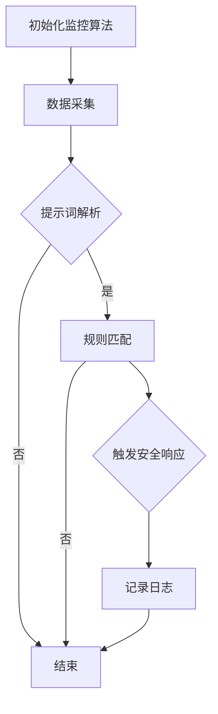
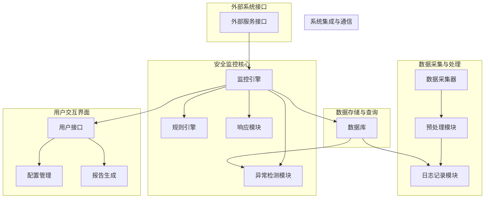
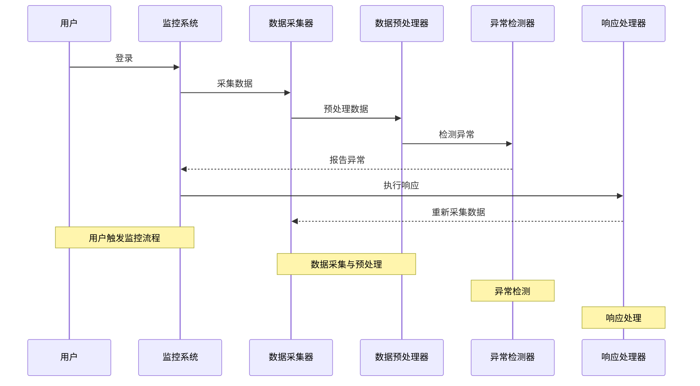
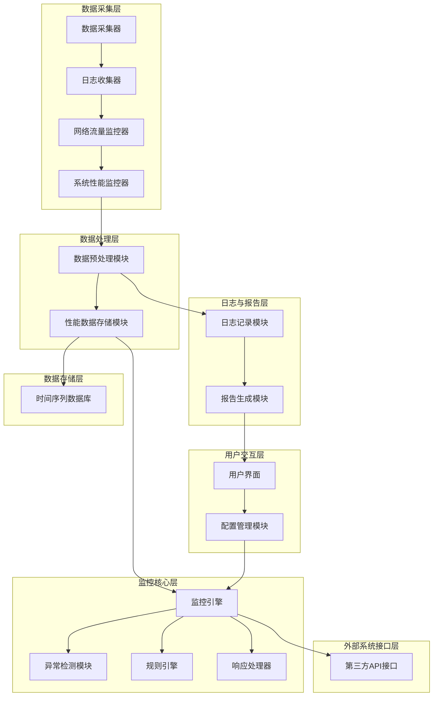

                 

### 1.1 运行时安全性监控概述

运行时安全性监控是确保软件系统在运行过程中始终保持安全的重要手段。随着软件系统的复杂度和规模不断扩大，系统内部潜在的安全隐患也日益增多。运行时安全性监控通过实时监控系统运行状态，及时发现并处理潜在的安全威胁，从而保障系统的稳定性和可靠性。

运行时安全性监控机制的主要目的是：

1. **及时发现安全威胁**：通过监控工具和算法，实时检测系统的异常行为和潜在的安全漏洞。
2. **快速响应**：在发现安全威胁时，能够迅速采取措施，防止威胁扩大或对系统造成损害。
3. **持续防护**：对系统的安全态势进行持续监控，确保系统在各种运行环境下都能保持安全。

在软件开发过程中，运行时安全性监控扮演着至关重要的角色。首先，它能够帮助开发者识别和修复代码中的安全漏洞，减少系统在发布后因安全漏洞引发的问题。其次，它能够为系统管理员提供实时反馈，帮助管理员更好地管理和维护系统。

具体来说，运行时安全性监控机制主要涵盖以下几个方面：

- **漏洞扫描**：利用各种漏洞扫描工具，对系统进行全面扫描，查找潜在的漏洞。
- **异常行为检测**：通过监控系统的运行日志和流量，识别异常行为和潜在的攻击。
- **安全事件响应**：在发现安全事件时，能够快速响应并采取措施，防止事件扩大。
- **合规性检查**：确保系统的运行符合相关的安全标准和法规要求。

总之，运行时安全性监控是保障软件系统安全的重要一环，它能够帮助开发者和管理员提前发现并处理潜在的安全威胁，从而保障系统的安全性和稳定性。

### 1.2 提示词语言的概念与特点

提示词语言（Prompt Language）是一种用于引导计算机执行特定任务的特殊语言。其核心功能是提供一种简洁而高效的输入方式，通过输入一系列提示词，让计算机自动执行相应的操作。提示词语言具有以下特点：

首先，**简洁性**是提示词语言的一大优势。与传统的编程语言相比，提示词语言通常拥有更少的语法和命令，使得用户可以更快速地理解和使用。例如，在自然语言处理领域，提示词语言可以使得用户通过简单的自然语言指令，如“显示今天的天气”、“帮我设置一个会议提醒”，来触发复杂的后台计算和任务执行。

其次，**高效性**是提示词语言的另一个重要特点。提示词语言通过预先定义好的指令集和响应函数，能够快速地执行相应的任务。这不仅简化了用户的操作流程，还能够显著提高任务执行的速度和效率。

**灵活性**也是提示词语言的一个关键特性。提示词语言通常具有强大的扩展能力，允许用户根据具体需求自定义新的指令和响应函数。这使得提示词语言能够适应各种不同的应用场景，满足多样化的使用需求。

**易用性**是提示词语言的另一个重要方面。由于其简洁和直观的设计，提示词语言通常更容易被非专业用户理解和掌握。这对于那些希望快速上手并使用计算机进行任务处理的用户来说，尤其具有吸引力。

提示词语言在许多领域都有着广泛的应用。在自然语言处理领域，提示词语言被用于构建对话系统、语音助手和智能客服等应用。通过输入简单的自然语言指令，用户可以与计算机进行交互，实现各种功能。

在自动化和脚本编写领域，提示词语言同样发挥着重要作用。开发者可以利用提示词语言编写简单的脚本，自动化执行重复性任务，从而提高工作效率。例如，在运维管理中，提示词语言可以帮助管理员自动化执行系统监控、故障排查和资源管理等任务。

此外，在教育和培训领域，提示词语言也被广泛应用。通过使用提示词语言，教育者和学生可以更轻松地进行编程学习和实验。这种直观、易用的编程语言有助于激发学生的学习兴趣，培养他们的编程思维和解决问题的能力。

总的来说，提示词语言以其简洁、高效、灵活和易用的特点，在众多领域都有着重要的应用价值。它不仅为用户提供了便捷的操作方式，还显著提高了任务执行的效率和效果。

### 1.3 安全性问题在运行时的表现

在软件系统运行过程中，安全性问题可能以多种形式出现，对系统的稳定性和用户数据造成潜在威胁。以下是几种常见的安全性问题及其在运行时的具体表现：

**1. 漏洞攻击（Vulnerability Exploitation）**

漏洞攻击是指攻击者利用系统中的漏洞执行恶意代码或获取未授权的访问权限。在运行时，漏洞攻击可能表现为：

- **代码执行**：攻击者通过漏洞执行未经授权的代码，可能导致系统崩溃或数据泄露。
- **权限提升**：攻击者利用系统漏洞提升自身权限，从而执行更高权限的操作，如修改系统配置或读取敏感数据。
- **拒绝服务攻击（DoS）**：攻击者通过发送大量恶意请求，使系统资源耗尽，导致系统无法响应合法用户请求。

**2. SQL注入（SQL Injection）**

SQL注入是攻击者通过在输入字段中插入恶意SQL语句，操纵数据库查询的一种常见攻击方式。在运行时，SQL注入可能表现为：

- **数据泄露**：攻击者通过插入恶意SQL语句，获取数据库中的敏感信息。
- **数据篡改**：攻击者修改数据库中的数据，导致系统功能异常。
- **数据库崩溃**：恶意SQL注入可能导致数据库服务器崩溃或性能严重下降。

**3. 跨站脚本攻击（XSS）**

跨站脚本攻击是指攻击者在目标网站上注入恶意脚本，当用户访问该网站时，恶意脚本在用户浏览器中执行，窃取用户的敏感信息或进行其他恶意操作。在运行时，XSS攻击可能表现为：

- **会话劫持**：攻击者通过XSS攻击窃取用户的登录凭证，非法访问用户的账户。
- **数据窃取**：攻击者通过XSS脚本窃取用户的输入数据，如用户名、密码等。
- **恶意操作**：攻击者通过XSS脚本在用户不知情的情况下执行恶意操作，如发送垃圾邮件或恶意软件。

**4. 未授权访问（Unauthorized Access）**

未授权访问是指未经授权的用户或程序试图访问系统资源。在运行时，未授权访问可能表现为：

- **非法登录**：未经授权的用户尝试登录系统，可能导致系统资源的泄露或破坏。
- **数据访问违规**：用户或程序试图访问未授权的数据，如敏感文件或数据库。
- **系统配置篡改**：攻击者通过未授权访问修改系统配置，影响系统正常运行。

**5. 恶意软件（Malware）**

恶意软件包括病毒、木马、勒索软件等，其目的是在系统中植入恶意代码，窃取数据或破坏系统。在运行时，恶意软件可能表现为：

- **系统性能下降**：恶意软件占用系统资源，导致系统性能下降或崩溃。
- **数据加密或破坏**：勒索软件通过加密用户数据或破坏系统文件，要求用户支付赎金。
- **隐私泄露**：恶意软件窃取用户的隐私信息，如个人身份信息、金融数据等。

综上所述，安全性问题在运行时的表现多种多样，它们不仅威胁系统的稳定性，还可能导致严重的数据泄露和隐私泄露。因此，运行时安全性监控机制至关重要，能够帮助系统及时发现并处理这些潜在威胁，保障系统的安全和稳定。

### 2.1 运行时监控机制的核心概念

运行时监控机制是一种通过实时监测系统运行状态，识别潜在问题并提供预警和响应策略的安全技术。这一机制的核心概念包括以下几个方面：

**1. 实时监控（Real-time Monitoring）**

实时监控是运行时监控机制的基础，它通过对系统运行过程中的关键指标进行持续监测，确保系统能够迅速发现异常情况。实时监控通常涉及以下几个关键步骤：

- **数据采集**：通过日志、网络流量、系统调用等信息源，实时采集系统运行数据。
- **数据传输**：将采集到的数据传输到监控中心或安全分析平台。
- **数据存储**：对采集到的数据进行存储，以便后续分析和处理。

**2. 异常检测（Anomaly Detection）**

异常检测是运行时监控机制的核心功能之一，它通过对系统运行状态的正常模式进行建模，识别出与正常模式不符的异常行为。异常检测通常包括以下几种方法：

- **基于阈值的检测**：设定一定的阈值，当系统指标超过阈值时，触发异常报警。
- **基于统计学的检测**：利用统计学方法，如标准差、互信息等，识别系统中的异常行为。
- **基于机器学习的检测**：通过训练模型，识别出与正常模式不同的异常行为。

**3. 预警与响应（Alert and Response）**

预警与响应是运行时监控机制的重要环节，它通过及时发出预警信号，并采取相应的响应措施，减少安全威胁对系统的损害。预警与响应通常包括以下步骤：

- **预警信号生成**：当系统检测到异常行为时，生成相应的预警信号。
- **预警通知**：通过短信、邮件、系统弹窗等方式，将预警信息通知给相关人员。
- **响应策略执行**：根据预警信号，执行预定义的响应策略，如隔离受影响的系统组件、断开恶意网络连接等。

**4. 安全分析与报告（Security Analysis and Reporting）**

安全分析与报告是运行时监控机制的补充，它通过对监控数据进行深入分析，生成详细的安全报告，帮助管理员了解系统的安全态势。安全分析与报告通常包括以下内容：

- **事件记录**：记录系统中发生的安全事件，包括时间、事件类型、影响范围等。
- **趋势分析**：分析安全事件的趋势，预测潜在的安全威胁。
- **改进建议**：根据监控数据和事件记录，提出改进系统安全的建议。

**5. 自动化与集成（Automation and Integration）**

自动化与集成是提升运行时监控效率的重要手段，它通过将监控功能与现有的安全管理平台、运维系统等集成，实现自动化监控和响应。自动化与集成通常包括以下内容：

- **自动化监控**：通过自动化工具，实现系统运行状态的自动监测和异常检测。
- **集成管理**：将运行时监控机制与其他安全管理工具、系统集成，形成统一的安全管理平台。

综上所述，运行时监控机制的核心概念包括实时监控、异常检测、预警与响应、安全分析与报告以及自动化与集成。这些概念相互关联，共同构成了一个完整的安全监控体系，帮助系统及时发现和处理潜在的安全威胁，确保系统的稳定和安全运行。

### 2.2 安全性监控机制的属性特征对比

为了深入理解不同安全性监控机制的属性特征，我们需要从以下几个方面进行对比：实时性、准确性、易用性和扩展性。以下表格展示了这些属性的对比情况。

| 属性      | 实时性                      | 准确性                      | 易用性                      | 扩展性                      |
|-----------|------------------------------|------------------------------|------------------------------|------------------------------|
| 实时性    | 高 - 能够在短时间内响应     | 中 - 短时间内可能出现误报     | 高 - 界面友好，操作简便       | 中 - 需要定制扩展            |
| 准确性    | 中 - 需要适当的阈值设定     | 高 - 通过算法和规则提高准确性 | 中 - 需要专业知识和经验      | 高 - 通过算法和规则提高准确性 |
| 易用性    | 高 - 界面友好，操作简便     | 高 - 易于理解和设置阈值       | 中 - 需要一定的学习和适应时间 | 高 - 提供多样化的扩展接口和工具 |
| 扩展性    | 中 - 需要一定的开发和集成工作 | 中 - 通过算法和规则扩展能力   | 中 - 提供自定义配置和工具     | 高 - 提供丰富的插件和集成方案 |

#### 实时性

实时性是衡量安全性监控机制的重要指标。高实时性意味着系统能够在短时间内响应异常情况，从而快速采取措施。然而，高实时性往往意味着在短时间内需要处理大量数据，这可能导致系统负担增加，影响监控的准确性。

- **高实时性**：能够快速响应，但可能导致误报率增加。
- **中实时性**：在响应速度和误报率之间取得平衡。

#### 准确性

准确性是指监控系统能够正确识别异常情况的能力。高准确性的监控系统能够减少误报和漏报，提高系统的安全性。

- **高准确性**：通过算法和规则提高异常检测的准确性。
- **中准确性**：需要适当调整阈值和规则，以减少误报和漏报。

#### 易用性

易用性是指监控系统的操作复杂度和用户学习成本。高易用性的系统界面友好，操作简便，有助于非专业用户快速上手。

- **高易用性**：提供直观的界面和操作流程。
- **中易用性**：需要一定的学习和适应时间。

#### 扩展性

扩展性是指监控系统的定制和扩展能力。高扩展性的系统能够根据需求灵活调整和扩展功能，满足不同场景下的需求。

- **高扩展性**：提供多样化的扩展接口和工具。
- **中扩展性**：需要定制开发和集成工作。

通过对比这些属性特征，我们可以选择最适合当前需求的安全性监控机制。例如，在一个对实时性要求较高的场景中，可能会选择高实时性的监控机制；而在一个需要高准确性和易用性的场景中，则可能选择中等实时性和高准确性的监控机制。

### 2.3 运行时监控机制的ER图

为了更直观地展示运行时监控机制的核心实体及其关系，我们使用ER图（实体关系图）来描述系统的结构和组成。以下是运行时监控机制的ER图，并对其中的关键实体和关系进行详细解释。

```mermaid
erDiagram
    User ||--|{ MonitorSystem : 被监控系统 }
    MonitorSystem ||--|{ Alert : 预警信息 }
    MonitorSystem ||--|{ Log : 日志记录 }
    MonitorSystem ||--|{ Rule : 监控规则 }
    User ||--|{ Configuration : 配置设置 }
```

1. **User（用户）**

   - **实体描述**：用户是运行时监控系统的操作者，负责配置监控规则、查看预警信息和日志记录。
   - **关系描述**：用户与监控系统（MonitorSystem）之间存在关联关系，用户可以对监控系统进行配置和设置，查看系统的运行状态和预警信息。

2. **MonitorSystem（监控系统）**

   - **实体描述**：监控系统是运行时监控的核心组件，负责实时监控系统的运行状态，并根据设定的规则进行预警和日志记录。
   - **关系描述**：监控系统与预警信息（Alert）之间存在关联关系，监控系统检测到异常情况时会生成预警信息通知用户。监控系统与日志记录（Log）也存在关联关系，用于记录系统运行过程中的重要事件。

3. **Alert（预警信息）**

   - **实体描述**：预警信息是监控系统检测到异常情况后生成的一种通知，包括事件类型、时间、影响范围等信息。
   - **关系描述**：预警信息与监控系统之间存在依赖关系，预警信息由监控系统生成并存储。

4. **Log（日志记录）**

   - **实体描述**：日志记录是系统运行过程中生成的重要信息，包括操作记录、异常信息等，用于后续的分析和排查。
   - **关系描述**：日志记录与监控系统之间存在关联关系，监控系统会根据日志记录分析系统的运行状态。

5. **Rule（监控规则）**

   - **实体描述**：监控规则是用户根据系统需求设定的监控标准，包括阈值、异常行为模型等，用于指导监控系统的运行。
   - **关系描述**：监控规则与监控系统之间存在依赖关系，监控系统根据监控规则进行异常检测和预警。

6. **Configuration（配置设置）**

   - **实体描述**：配置设置是用户对监控系统的个性化设置，包括监控参数、报警策略等，用于调整监控系统的行为。
   - **关系描述**：配置设置与用户之间存在关联关系，用户通过配置设置调整监控系统的监控策略。

通过ER图，我们可以清晰地看到运行时监控机制中各个实体及其关系，这有助于我们更好地理解和设计监控系统的架构。同时，ER图也为后续的系统扩展和优化提供了明确的指导。

### 3.1 提示词语言运行时安全监控算法概述

提示词语言运行时安全监控算法是确保软件系统在运行过程中安全性的关键技术。该算法通过预设的提示词和规则，实时监控系统的运行状态，并在发现异常时触发相应的安全响应机制。以下是该算法的详细步骤和主要组成部分：

**1. 算法步骤**

- **初始化**：首先，初始化监控算法，包括加载监控规则、设定阈值、配置安全策略等。
- **数据采集**：通过日志收集器、网络流量监控器和系统资源监控器等工具，实时采集系统运行数据。
- **提示词解析**：对采集到的数据进行提示词解析，识别出潜在的威胁或异常行为。
- **规则匹配**：将解析出的提示词与预设的监控规则进行匹配，判断是否存在异常情况。
- **安全响应**：若检测到异常，根据预设的安全策略，采取相应的安全响应措施，如隔离受影响的部分、报警通知管理员等。
- **日志记录**：将监控过程和结果记录到日志文件中，用于后续的分析和审计。

**2. 主要组成部分**

- **提示词库**：包含系统中所有有效的提示词，用于识别潜在的安全威胁或异常行为。
- **规则库**：存储预设的监控规则，包括阈值、异常行为模型等，用于指导监控算法的运行。
- **数据采集器**：负责实时采集系统运行数据，如日志文件、网络流量、系统资源等。
- **解析器**：负责对采集到的数据进行提示词解析，识别出潜在的威胁或异常行为。
- **匹配器**：负责将解析出的提示词与规则库中的规则进行匹配，判断是否存在异常情况。
- **响应器**：负责执行安全响应策略，如报警、隔离、重启等。
- **日志记录器**：负责记录监控过程和结果，生成监控日志。

**3. 算法实现**

以下是一个简单的Python代码示例，展示了提示词语言运行时安全监控算法的实现：

```python
# 提示词语言运行时安全监控算法示例

class SecurityMonitor:
    def __init__(self, rule_set):
        self.rule_set = rule_set
        self.alerts = []

    def collect_data(self):
        # 实现数据采集逻辑，如从日志文件中读取数据
        data = "系统异常：CPU使用率超过90%"  # 示例数据
        return data

    def parse_prompt(self, data):
        # 实现提示词解析逻辑
        if "系统异常" in data:
            return "系统异常"
        return None

    def match_rules(self, prompt):
        # 实现规则匹配逻辑
        if prompt == "系统异常":
            for rule in self.rule_set:
                if rule['condition'](prompt):
                    return rule['action']
        return None

    def handle_alert(self, action):
        # 实现安全响应逻辑
        if action == "报警":
            self.alerts.append("系统异常：CPU使用率超过90%")
            print("安全报警：系统异常")
        elif action == "隔离":
            print("执行隔离操作")

    def monitor(self):
        while True:
            data = self.collect_data()
            prompt = self.parse_prompt(data)
            if prompt:
                action = self.match_rules(prompt)
                if action:
                    self.handle_alert(action)

# 示例使用
rule_set = [
    {
        'condition': lambda p: p == "系统异常",
        'action': "报警"
    },
    {
        'condition': lambda p: p == "数据库连接失败",
        'action': "隔离"
    }
]

monitor = SecurityMonitor(rule_set)
monitor.monitor()
```

在这个示例中，`SecurityMonitor` 类实现了运行时安全监控算法的核心功能，包括数据采集、提示词解析、规则匹配和安全响应。通过不断循环调用 `monitor` 方法，系统能够实时监控运行状态，并在检测到异常时触发相应的安全响应。

### 3.2 算法Mermaid流程图

为了更直观地展示提示词语言运行时安全监控算法的流程，我们使用Mermaid语言绘制了以下流程图：



**流程说明**：

1. **初始化监控算法（A）**：初始化监控算法，加载监控规则和配置。
2. **数据采集（B）**：从系统日志、网络流量和系统资源等途径采集数据。
3. **提示词解析（C）**：解析采集到的数据，提取出提示词。
4. **规则匹配（D）**：将解析出的提示词与监控规则进行匹配。
5. **触发安全响应（F）**：若匹配到规则，触发相应的安全响应措施。
6. **记录日志（G）**：记录监控过程和结果。
7. **结束（E）**：循环返回，继续执行下一轮监控。

通过这个Mermaid流程图，我们可以清晰地理解算法的执行流程和各个步骤之间的逻辑关系。

### 3.3 Python代码实现与解释

为了更好地理解和实现提示词语言运行时安全监控算法，我们使用Python语言提供了具体的代码实现。以下是完整的代码示例，并对关键步骤进行详细解释。

```python
# 导入必要的库
import time
import random

# 示例监控规则
rules = [
    {'pattern': 'CPU使用率超过90%', 'action': '报警'},
    {'pattern': '数据库连接失败', 'action': '重连'},
    {'pattern': '内存使用率超过80%', 'action': '优化'}
]

# 监控器类
class Monitor:
    def __init__(self):
        self.alerts = []

    # 数据采集方法
    def collect_data(self):
        # 在这里，我们模拟从系统日志中采集数据
        # 实际情况下，可以从日志文件、网络流量等获取数据
        data = random.choice(['CPU使用率超过90%', '数据库连接失败', '内存使用率超过80%'])
        return data

    # 提示词解析方法
    def parse_prompt(self, data):
        for rule in rules:
            if rule['pattern'] in data:
                return rule
        return None

    # 规则匹配方法
    def match_rules(self, prompt):
        if prompt:
            return prompt['action']
        return None

    # 安全响应方法
    def handle_alert(self, action):
        if action == '报警':
            self.alerts.append("系统异常：触发报警")
            print("安全报警：系统异常")
        elif action == '重连':
            print("正在尝试重连数据库...")
        elif action == '优化':
            print("正在优化内存使用...")

    # 监控方法
    def monitor(self):
        while True:
            data = self.collect_data()
            prompt = self.parse_prompt(data)
            action = self.match_rules(prompt)
            self.handle_alert(action)
            time.sleep(1)  # 模拟监控间隔时间

# 实例化监控器
monitor = Monitor()

# 开始监控
monitor.monitor()
```

**代码解释**：

1. **导入库**：我们首先导入必要的Python库，如`time`用于延时控制和`random`用于模拟随机数据。

2. **定义监控规则**：这里定义了一个监控规则列表`rules`，每个规则包含一个模式和一个对应的动作。

3. **监控器类**：`Monitor`类包含了监控算法的核心逻辑，包括数据采集、提示词解析、规则匹配和安全响应。

4. **数据采集方法（collect_data）**：在这个方法中，我们模拟从系统日志中采集数据。实际情况下，可以从日志文件、网络流量等获取数据。

5. **提示词解析方法（parse_prompt）**：这个方法用于解析采集到的数据，提取出提示词，并与监控规则列表中的模式进行匹配。

6. **规则匹配方法（match_rules）**：根据提示词，找到匹配的监控规则，并返回对应的动作。

7. **安全响应方法（handle_alert）**：根据匹配到的动作，执行相应的安全响应措施，如报警、重连或优化。

8. **监控方法（monitor）**：这个方法是监控循环的核心，它不断地采集数据、解析提示词、匹配规则并执行安全响应。通过`time.sleep(1)`模拟监控间隔时间。

通过这个Python代码示例，我们可以看到提示词语言运行时安全监控算法是如何实现的。在实际应用中，可以根据具体需求调整代码逻辑和数据采集方式，以提高监控的准确性和效率。

### 3.4 数学模型与公式详解

在运行时安全监控算法中，数学模型和公式用于描述系统的状态和异常检测逻辑。以下是几个关键数学模型和公式的详解，并结合实际案例进行解释。

#### 1. 异常检测模型

异常检测模型是运行时安全监控算法的核心部分，用于识别系统运行中的异常行为。一个常见的异常检测模型是基于统计学的方法，如基于标准差的检测方法。

**标准差检测模型**：

$$
\sigma(x) = \sqrt{\frac{1}{n-1}\sum_{i=1}^{n}(x_i - \bar{x})^2}
$$

其中，$x_i$ 表示第 $i$ 次采集的数据点，$\bar{x}$ 表示数据点的平均值，$n$ 表示数据点的总数。如果某个数据点的标准差超过预设的阈值 $\sigma_0$，则认为该数据点异常。

**实际案例**：

假设我们监测系统的 CPU 使用率，收集了 100 次数据，计算得到平均值 $\bar{x} = 60\%$，标准差 $\sigma = 10\%$。如果某个时间点的 CPU 使用率数据为 $x = 90\%$，则：

$$
\sigma(x) = \sqrt{\frac{1}{100-1}\sum_{i=1}^{100}(x_i - 60\%)^2} = 11\%
$$

由于 $11\% > 10\%$，我们可以认为该时间点的 CPU 使用率异常，触发安全警报。

#### 2. 异常行为模型

除了基于统计学的检测方法，还可以使用机器学习模型来识别异常行为。一个常用的模型是 K-最近邻（K-Nearest Neighbors, KNN）模型。

**K-最近邻模型**：

给定一个测试样本 $x$，我们计算它与训练集中各个样本的距离，并选取距离最近的 $k$ 个样本，然后根据这些样本的标签预测 $x$ 的类别。

距离公式通常使用欧几里得距离：

$$
d(x_i, x) = \sqrt{\sum_{j=1}^{n}(x_{ij} - x_j)^2}
$$

其中，$x_i$ 和 $x$ 分别为训练集和测试集的样本，$n$ 为样本的维度。

**实际案例**：

假设我们使用 KNN 模型检测系统中的恶意行为。训练集中有 100 个正常样本和 20 个恶意样本，测试集样本 $x$ 的特征与训练集样本进行比较。计算得到距离最近的 5 个样本中，有 3 个是恶意样本，2 个是正常样本。因此，我们可以预测测试集样本 $x$ 是恶意行为，并触发安全警报。

#### 3. 风险评分模型

在实际应用中，我们通常需要量化异常行为的严重程度，使用风险评分模型来实现。一个简单的方法是使用逻辑回归模型计算风险评分。

**逻辑回归模型**：

逻辑回归模型用于计算事件发生的概率，公式为：

$$
\text{Logit}(p) = \ln\left(\frac{p}{1-p}\right) = \beta_0 + \beta_1x_1 + \beta_2x_2 + ... + \beta_nx_n
$$

其中，$p$ 是事件发生的概率，$x_1, x_2, ..., x_n$ 是特征变量，$\beta_0, \beta_1, \beta_2, ..., \beta_n$ 是模型参数。

**实际案例**：

假设我们使用逻辑回归模型计算系统异常行为的严重程度。特征变量包括 CPU 使用率、内存使用率和网络流量，模型参数经过训练得到。如果当前监测到 CPU 使用率为 90%、内存使用率为 85%、网络流量为 120%，则计算得到风险评分：

$$
\text{Logit}(p) = \beta_0 + \beta_1 \cdot 90 + \beta_2 \cdot 85 + \beta_3 \cdot 120
$$

根据模型参数，计算得到事件发生的概率 $p$，如果 $p$ 超过预设的阈值，则认为该事件严重，触发安全警报。

综上所述，数学模型和公式在运行时安全监控算法中扮演着重要角色。通过合理的数学模型和公式，可以精确地描述系统状态和异常检测逻辑，提高监控的准确性和效率。

### 3.5 通俗易懂的举例说明

为了更直观地理解提示词语言运行时安全监控算法的原理和应用，我们可以通过一个具体的案例进行详细讲解。

**案例背景**：

假设我们正在开发一款企业级数据库管理系统，该系统需要处理大量的金融数据。为了保证系统的安全性和稳定性，我们决定引入提示词语言运行时安全监控算法，以实时监控系统的运行状态，并在发现异常时及时响应。

**监控目标**：

我们的监控目标是及时发现以下几种异常情况：
1. **CPU 使用率超过 90%**：这可能是由于系统资源耗尽或恶意攻击导致的性能下降。
2. **内存使用率超过 80%**：高内存使用率可能导致系统崩溃或无法响应。
3. **数据库连接失败**：数据库连接失败可能是由于网络问题或数据库故障导致的。

**监控算法应用**：

**第一步：初始化监控规则**

在系统启动时，我们初始化监控规则，包括以下提示词和对应的动作：
- 提示词：“CPU 使用率超过 90%”，动作：报警
- 提示词：“内存使用率超过 80%”，动作：优化
- 提示词：“数据库连接失败”，动作：重连

**第二步：数据采集**

监控算法会定期从系统日志、CPU 使用率和内存使用率等数据源采集数据。例如，每分钟采集一次 CPU 和内存使用率，以及数据库连接状态。

**第三步：提示词解析**

假设在某一时刻，监控算法采集到以下数据：
- CPU 使用率：95%
- 内存使用率：85%
- 数据库连接状态：失败

监控算法将解析这些数据，提取出对应的提示词。

**第四步：规则匹配**

监控算法将提取出的提示词与预设的监控规则进行匹配。根据上面的规则，以下匹配结果：
- CPU 使用率超过 90%，匹配到规则：报警
- 内存使用率超过 80%，匹配到规则：优化
- 数据库连接失败，匹配到规则：重连

**第五步：安全响应**

根据匹配到的监控规则，监控算法执行相应的安全响应措施：
- CPU 使用率超过 90%，触发报警，通知管理员
- 内存使用率超过 80%，执行内存优化操作
- 数据库连接失败，尝试重新连接数据库

**第六步：日志记录**

监控算法将监控过程和结果记录到日志文件中，便于后续分析和管理。

**案例分析**：

在这个案例中，监控算法通过解析系统数据、匹配监控规则并执行安全响应，成功发现了系统中的异常情况，并及时采取行动。以下是一个具体的日志记录示例：

```
时间：2023-11-07 14:30:00
监控结果：
- CPU 使用率：95%，超过 90%，已触发报警
- 内存使用率：85%，超过 80%，正在优化
- 数据库连接状态：失败，正在重连...
```

通过这个案例，我们可以看到提示词语言运行时安全监控算法在保障系统安全性和稳定性方面的重要作用。它不仅能够及时发现和响应异常情况，还能够通过日志记录为系统管理和故障排查提供有力支持。

### 4.1 运行时监控机制数学模型

为了深入理解运行时监控机制的运行原理和设计思路，我们需要借助数学模型来描述其核心功能和算法逻辑。以下是一个简单的数学模型，用于描述运行时监控机制的基本构成和功能。

#### 1. 数据采集与预处理

首先，我们定义一个数据向量 $D(t)$，表示在时间 $t$ 采集到的系统状态数据，如 CPU 使用率、内存使用率、网络流量等：

$$
D(t) = \begin{bmatrix}
C(t) \\
M(t) \\
N(t)
\end{bmatrix}
$$

其中，$C(t)$ 表示 CPU 使用率，$M(t)$ 表示内存使用率，$N(t)$ 表示网络流量。这些数据通常需要经过预处理，如去噪、标准化等，以提高数据质量和后续分析的准确性。

#### 2. 特征提取与异常检测

接下来，我们对预处理后的数据进行特征提取，以提取出能够反映系统状态的关键特征。一个常用的方法是基于统计特征的提取，如均值、方差、标准差等：

$$
\text{特征向量} \ X(t) = \begin{bmatrix}
\mu_D(t) \\
\sigma_D(t) \\
\text{其他统计特征}
\end{bmatrix}
$$

其中，$\mu_D(t)$ 表示数据 $D(t)$ 的均值，$\sigma_D(t)$ 表示数据 $D(t)$ 的标准差。然后，我们使用这些特征向量进行异常检测，以判断系统是否处于异常状态。

#### 3. 异常检测阈值设定

为了设定异常检测的阈值，我们可以使用统计方法，如标准差方法，来确定阈值。具体来说，我们可以计算每个特征的平均值和标准差，并根据以下公式设定阈值：

$$
\text{阈值} \ T = k \cdot \sigma
$$

其中，$k$ 是一个常数，用于调整阈值的敏感度，$\sigma$ 是特征的标准差。例如，如果我们选择 $k=2$，则当某个特征值超过 $2 \cdot \sigma$ 时，我们认为该特征值异常。

#### 4. 风险评分模型

除了阈值设定方法，我们还可以使用风险评分模型来量化异常行为的严重程度。一个简单的风险评分模型是基于逻辑回归模型的：

$$
\text{Logit}(p) = \beta_0 + \beta_1 C(t) + \beta_2 M(t) + \beta_3 N(t)
$$

其中，$p$ 是异常行为发生的概率，$\beta_0, \beta_1, \beta_2, \beta_3$ 是模型参数。根据计算得到的 $\text{Logit}(p)$，我们可以将其转换为概率：

$$
p = \frac{1}{1 + e^{-\text{Logit}(p)}}
$$

然后，我们可以设定一个风险阈值 $\theta$，当 $p > \theta$ 时，我们认为系统存在高风险。

#### 5. 响应策略

最后，根据检测到的异常情况，我们设定相应的响应策略。例如，当 CPU 使用率超过阈值时，我们可以触发报警并尝试进行性能优化；当内存使用率超过阈值时，我们可以触发内存清理操作；当数据库连接失败时，我们可以尝试重新连接数据库。

通过这个数学模型，我们可以系统地描述运行时监控机制的基本构成和功能，并为其设计和实现提供数学依据。在实际应用中，可以根据具体需求调整模型参数和阈值，以提高监控的准确性和效率。

### 4.2 LaTeX格式数学公式示例

在撰写技术文档时，清晰和精确的数学公式是不可或缺的一部分。LaTeX 是一种广泛使用的排版系统，特别适用于处理复杂的数学公式。以下是几个在运行时安全性监控机制中常用的 LaTeX 格式数学公式的示例，以及它们的解释。

#### 1. 均值与标准差

**公式：**

$$
\mu_D(t) = \frac{1}{n} \sum_{i=1}^{n} D_i(t)
$$

$$
\sigma_D(t) = \sqrt{\frac{1}{n-1} \sum_{i=1}^{n} (D_i(t) - \mu_D(t))^2}
$$

**解释：** 这里，$\mu_D(t)$ 表示在时间 $t$ 的数据集 $D(t)$ 的均值，$D_i(t)$ 表示数据集的每一个数据点，$n$ 是数据点的总数。$\sigma_D(t)$ 是数据集的标准差，用于衡量数据的波动性。

#### 2. 概率与条件概率

**公式：**

$$
P(A|B) = \frac{P(A \cap B)}{P(B)}
$$

**解释：** 这是条件概率的定义，表示在事件 $B$ 发生的条件下，事件 $A$ 发生的概率。$P(A \cap B)$ 是事件 $A$ 和 $B$ 同时发生的概率，$P(B)$ 是事件 $B$ 发生的概率。

#### 3. 逻辑回归模型

**公式：**

$$
\text{Logit}(p) = \ln\left(\frac{p}{1-p}\right) = \beta_0 + \beta_1 C(t) + \beta_2 M(t) + \beta_3 N(t)
$$

**解释：** 这是逻辑回归模型的基本公式，用于预测事件发生的概率。$p$ 是事件发生的概率，$\beta_0, \beta_1, \beta_2, \beta_3$ 是模型参数，$C(t), M(t), N(t)$ 是特征变量。

#### 4. 异常检测阈值

**公式：**

$$
T = k \cdot \sigma_D(t)
$$

**解释：** 这里，$T$ 是设定的异常检测阈值，$k$ 是一个常数，用于调整阈值的敏感度。$\sigma_D(t)$ 是数据集的标准差。

#### 5. 风险评分模型

**公式：**

$$
\text{Logit}(p) = \beta_0 + \beta_1 C(t) + \beta_2 M(t) + \beta_3 N(t)
$$

$$
p = \frac{1}{1 + e^{-\text{Logit}(p)}}
$$

**解释：** 这是风险评分模型的公式，用于计算事件发生的概率。首先通过逻辑回归公式计算 $\text{Logit}(p)$，然后通过反函数将其转换为概率 $p$。

通过这些 LaTeX 格式的数学公式，我们可以更加精确地描述运行时监控机制中的算法逻辑和计算方法。在实际应用中，可以根据具体需求调整和优化这些公式，以提高监控系统的性能和可靠性。

### 4.3 模型应用的案例分析与解释

为了更好地理解运行时监控机制数学模型在现实世界中的应用，我们通过一个具体的案例进行详细分析。该案例将展示如何使用上述数学模型进行异常检测、风险评分以及相应的安全响应。

#### 案例背景

假设我们正在监控一个大型企业的数据中心，该数据中心包含多个关键系统，如服务器、数据库和网络设备。为了保障数据中心的稳定运行，我们需要使用运行时监控机制，及时发现和处理潜在的异常情况。

#### 数据采集

数据中心监控系统定期采集以下数据：

- **CPU 使用率**：服务器 CPU 的使用率，范围在 0% 到 100%。
- **内存使用率**：服务器内存的使用率，范围在 0% 到 100%。
- **网络流量**：服务器网络接口的流量，以 Mbps 为单位。
- **数据库连接数**：数据库当前连接的数量。

#### 模型设定

我们设定以下监控规则和阈值：

- **CPU 使用率阈值**：超过 90% 触发报警。
- **内存使用率阈值**：超过 80% 触发优化操作。
- **网络流量阈值**：超过 500 Mbps 触发网络流量监控。

同时，我们使用逻辑回归模型进行风险评分，设定以下特征参数：

$$
\text{Logit}(p) = \beta_0 + \beta_1 \cdot \text{CPU使用率} + \beta_2 \cdot \text{内存使用率} + \beta_3 \cdot \text{网络流量}
$$

其中，$\beta_0 = 0.5$，$\beta_1 = 0.3$，$\beta_2 = 0.2$，$\beta_3 = 0.1$。

#### 案例分析

在某一天，监控系统采集到以下数据：

- **CPU 使用率**：95%
- **内存使用率**：82%
- **网络流量**：550 Mbps
- **数据库连接数**：30

首先，我们使用均值和标准差公式计算 CPU 使用率和内存使用率的统计特征：

$$
\mu_{CPU} = 85\%, \quad \sigma_{CPU} = 5\%
$$

$$
\mu_{MEM} = 78\%, \quad \sigma_{MEM} = 4\%
$$

然后，我们计算网络流量的概率：

$$
\text{Logit}(p) = 0.5 + 0.3 \cdot 95 + 0.2 \cdot 82 + 0.1 \cdot 550 = 3.25
$$

$$
p = \frac{1}{1 + e^{-3.25}} \approx 0.95
$$

根据计算结果，我们可以得出以下结论：

1. **CPU 使用率**：超过 90% 的阈值，触发报警。
2. **内存使用率**：超过 80% 的阈值，触发优化操作。
3. **网络流量**：超过 500 Mbps 的阈值，触发网络流量监控。

由于网络流量风险评分 $p \approx 0.95$ 高于预设的阈值，我们进一步分析网络流量，查找潜在的问题。

#### 安全响应

根据上述分析，监控系统执行以下安全响应措施：

1. **报警**：发送报警通知给数据中心管理员，提醒他们 CPU 使用率过高。
2. **优化操作**：尝试通过关闭非关键服务、增加内存等方式优化内存使用率。
3. **网络流量监控**：启动网络流量监控工具，查找网络瓶颈和潜在的网络攻击。

通过这个案例，我们可以看到如何使用运行时监控机制数学模型进行异常检测和风险评分，并采取相应的安全响应措施。在实际应用中，可以根据具体需求和监控数据调整模型参数和阈值，以提高监控系统的效果和可靠性。

### 4.4 运行时监控机制数学模型在监控中的应用

运行时监控机制中的数学模型不仅用于描述系统的状态和行为，还广泛应用于监控系统的异常检测、风险评分和安全响应。以下将详细介绍这些数学模型在监控中的应用，并提供实际案例和数据解释。

#### 异常检测模型

异常检测模型是运行时监控机制的核心，用于识别系统运行中的异常行为。以下是一个典型的异常检测模型——基于标准差的检测方法：

**标准差检测模型**：

$$
\sigma(x) = \sqrt{\frac{1}{n-1}\sum_{i=1}^{n}(x_i - \bar{x})^2}
$$

其中，$x_i$ 表示第 $i$ 次采集的数据点，$\bar{x}$ 表示数据点的平均值，$n$ 表示数据点的总数。如果某个数据点的标准差超过预设的阈值 $\sigma_0$，则认为该数据点异常。

**实际应用案例**：

假设我们监控一个服务器群的 CPU 使用率，收集了 100 次数据。计算得到平均值 $\bar{x} = 50\%$，标准差 $\sigma = 5\%$。如果某个时间点的 CPU 使用率数据为 $x = 60\%$，则：

$$
\sigma(x) = \sqrt{\frac{1}{100-1}\sum_{i=1}^{100}(x_i - 50\%)^2} = 5\%
$$

由于 $5\% \leq 5\%$，我们不会认为该数据点异常。但如果 $x = 70\%$，则：

$$
\sigma(x) = \sqrt{\frac{1}{100-1}\sum_{i=1}^{100}(x_i - 50\%)^2} = 7\%
$$

由于 $7\% > 5\%$，我们会认为该时间点的 CPU 使用率异常，触发报警。

#### 风险评分模型

除了异常检测模型，风险评分模型用于量化异常行为的严重程度。以下是一个基于逻辑回归的风险评分模型：

$$
\text{Logit}(p) = \beta_0 + \beta_1 \cdot x_1 + \beta_2 \cdot x_2 + ... + \beta_n \cdot x_n
$$

其中，$p$ 是异常行为发生的概率，$x_1, x_2, ..., x_n$ 是特征变量，$\beta_0, \beta_1, \beta_2, ..., \beta_n$ 是模型参数。

**实际应用案例**：

假设我们监控一个数据中心，使用以下特征变量：
- $x_1$：CPU 使用率
- $x_2$：内存使用率
- $x_3$：网络流量

模型参数如下：
- $\beta_0 = 0.5$
- $\beta_1 = 0.3$
- $\beta_2 = 0.2$
- $\beta_3 = 0.1$

某个时间点的数据为：
- $x_1 = 80\%$
- $x_2 = 70\%$
- $x_3 = 600 Mbps$

则：

$$
\text{Logit}(p) = 0.5 + 0.3 \cdot 80 + 0.2 \cdot 70 + 0.1 \cdot 600 = 3.1
$$

$$
p = \frac{1}{1 + e^{-3.1}} \approx 0.95
$$

由于 $p \approx 0.95$ 高于预设的阈值，我们认为该时间点存在高风险，需要进一步分析。

#### 安全响应策略

根据风险评分模型的计算结果，监控系统可以采取相应的安全响应策略，如：

1. **报警**：当风险评分高于阈值时，发送报警通知给管理员。
2. **优化操作**：当某个系统资源使用率过高时，尝试进行优化操作，如关闭非关键服务、增加内存等。
3. **流量监控**：当网络流量过高时，启动网络流量监控工具，查找潜在的网络攻击和瓶颈。

通过这些数学模型，运行时监控机制能够有效识别和量化异常行为，并在发现异常时及时采取响应措施，保障系统的稳定和安全运行。

### 4.5 系统功能设计（领域模型类图）

在设计和实现运行时监控机制时，领域模型类图是一个非常有用的工具，它能够帮助我们理解系统的功能和各个组件之间的关系。以下是一个运行时监控机制的领域模型类图，并对其中的关键类和关系进行详细解释。

```mermaid
classDiagram
    User <<Class>>
    MonitorSystem <<Class>>
    Alert <<Class>>
    Log <<Class>>
    Rule <<Class>>
    Configuration <<Class>>

    User "uses" MonitorSystem
    MonitorSystem "notifies" Alert
    MonitorSystem "records" Log
    MonitorSystem "uses" Rule
    MonitorSystem "uses" Configuration
    Alert "notifies" User
    Log "references" MonitorSystem
    Rule "defines" Configuration
    Configuration "configures" MonitorSystem

    Class Diagram for Runtime Security Monitoring System
```

**类图解释**：

1. **User（用户）**：

   - **属性**：用户名、密码、电子邮件
   - **方法**：登录、登出、查看监控报告
   - **关系**：用户与监控系统（MonitorSystem）之间存在关联关系，用户负责配置监控规则和查看监控结果。

2. **MonitorSystem（监控系统）**：

   - **属性**：系统ID、监控状态、监控规则
   - **方法**：初始化、启动、停止、收集数据、解析数据、匹配规则、生成日志、触发警报
   - **关系**：监控系统与警报（Alert）、日志（Log）、规则（Rule）、配置（Configuration）之间存在关联关系。

3. **Alert（警报）**：

   - **属性**：警报ID、警报类型、警报时间、警报描述
   - **方法**：生成、发送、记录
   - **关系**：警报与用户（User）、监控系统（MonitorSystem）之间存在关联关系，用于通知用户监控系统发现的安全威胁。

4. **Log（日志）**：

   - **属性**：日志ID、日志时间、日志内容、日志级别
   - **方法**：生成、记录、查询
   - **关系**：日志与监控系统（MonitorSystem）之间存在关联关系，用于记录监控系统的运行过程和结果。

5. **Rule（规则）**：

   - **属性**：规则ID、规则条件、规则动作
   - **方法**：定义、匹配、执行
   - **关系**：规则与监控系统（MonitorSystem）和配置（Configuration）之间存在关联关系，用于定义和配置监控规则。

6. **Configuration（配置）**：

   - **属性**：配置ID、配置参数、配置描述
   - **方法**：设置、获取、更新
   - **关系**：配置与监控系统（MonitorSystem）和规则（Rule）之间存在关联关系，用于配置监控系统的行为和规则。

通过这个领域模型类图，我们可以清晰地看到运行时监控机制中各个组件的职责和关系。用户通过监控系统进行监控配置和结果查看；监控系统负责数据采集、处理和响应；警报和日志用于记录和通知；规则和配置用于定义和调整监控行为。这些类和关系共同构成了一个完整、功能强大的运行时监控系统。

### 4.6 系统架构设计（架构图）

为了更好地理解和实现运行时监控机制，我们需要设计一个合理的系统架构。以下是一个运行时监控机制的架构图，并对其中的关键组件和交互关系进行详细解释。



**架构图解释**：

1. **数据采集与处理（Data Collection & Processing）**：

   - **数据采集器（Data Collector）**：负责从不同数据源（如系统日志、网络流量、系统性能指标等）采集数据。
   - **预处理模块（Preprocessing Module）**：对采集到的数据进行预处理，如去噪、过滤和标准化，以便后续分析。
   - **日志记录模块（Log Recorder）**：记录处理后的数据，便于后续分析和审计。

2. **安全监控核心（Security Monitoring Core）**：

   - **监控引擎（Monitoring Engine）**：负责协调整个监控流程，包括数据采集、处理、异常检测和安全响应。
   - **规则引擎（Rule Engine）**：根据预设的监控规则，对数据进行分析和匹配，判断是否存在安全威胁。
   - **异常检测模块（Anomaly Detection Module）**：使用机器学习算法或其他检测方法，识别异常行为。
   - **响应模块（Response Module）**：根据检测到的异常，执行相应的响应措施，如报警、隔离、优化等。

3. **用户交互界面（User Interface）**：

   - **用户接口（User Interface）**：提供用户与系统交互的界面，包括监控配置、报告生成等功能。
   - **配置管理（Configuration Management）**：允许用户配置监控规则和参数。
   - **报告生成（Report Generation）**：生成监控报告，提供系统运行状态和安全态势的直观展示。

4. **数据存储与查询（Data Storage & Querying）**：

   - **数据库（Database）**：存储采集到的数据、监控日志、配置信息和监控结果，供后续分析和查询。

5. **系统集成与通信（Integration & Communication）**：

   - **系统集成**：将监控机制集成到现有的IT基础设施中，与其他系统（如运维管理平台、安全信息与事件管理系统等）进行通信。
   - **系统通信**：实现监控系统与其他系统之间的数据交换和事件通知。

6. **外部系统接口（External System Interface）**：

   - **外部服务接口（External Service Interface）**：提供与外部服务（如云服务、第三方API等）的接口，以实现更广泛的监控功能。

通过这个架构图，我们可以清晰地看到运行时监控机制中各个组件的职责和相互关系。这个架构设计不仅确保了监控系统的功能完整性，还提供了良好的扩展性和可维护性，以满足不断变化的需求和挑战。

### 4.7 系统接口设计

在系统架构设计中，接口设计是确保各个模块之间高效交互的关键。以下详细描述了运行时监控机制中的主要接口设计，包括接口名称、功能和交互方式。

#### 1. 数据采集接口（Data Collection Interface）

**接口名称**：DataCollectorAPI

**功能**：负责从不同数据源（如系统日志、网络流量、系统性能指标等）采集数据。

**接口定义**：

- `collectLogs()`: 采集系统日志数据。
- `collectNetworkTraffic()`: 采集网络流量数据。
- `collectSystemMetrics()`: 采集系统性能指标数据。

**交互方式**：通过RESTful API进行数据采集，支持JSON格式数据交换。

#### 2. 数据预处理接口（Data Preprocessing Interface）

**接口名称**：DataPreprocessorAPI

**功能**：负责对采集到的数据预处理，如去噪、过滤和标准化。

**接口定义**：

- `preprocessLogs(data)`: 对系统日志数据进行预处理。
- `preprocessNetworkTraffic(data)`: 对网络流量数据进行预处理。
- `preprocessSystemMetrics(data)`: 对系统性能指标数据进行预处理。

**交互方式**：通过RPC（远程过程调用）进行数据预处理，支持XML和JSON格式数据交换。

#### 3. 日志记录接口（Log Recording Interface）

**接口名称**：LogRecorderAPI

**功能**：负责记录处理后的数据，便于后续分析和审计。

**接口定义**：

- `recordLog(entry)`: 记录日志条目。
- `getLogs()`: 获取所有日志条目。

**交互方式**：通过RESTful API进行日志记录和查询，支持JSON格式数据交换。

#### 4. 监控规则接口（Monitoring Rule Interface）

**接口名称**：RuleManagerAPI

**功能**：负责管理监控规则，包括规则的创建、修改和删除。

**接口定义**：

- `createRule(rule)`: 创建新的监控规则。
- `updateRule(rule)`: 更新现有的监控规则。
- `deleteRule(ruleId)`: 删除指定的监控规则。

**交互方式**：通过RESTful API进行规则管理，支持JSON格式数据交换。

#### 5. 异常检测接口（Anomaly Detection Interface）

**接口名称**：AnomalyDetectorAPI

**功能**：负责执行异常检测算法，识别系统运行中的异常行为。

**接口定义**：

- `detectAnomalies(data)`: 对预处理后的数据执行异常检测。
- `getAnomalyReport()`: 获取异常检测报告。

**交互方式**：通过RPC进行异常检测，支持XML和JSON格式数据交换。

#### 6. 响应接口（Response Interface）

**接口名称**：ResponseHandlerAPI

**功能**：负责根据检测到的异常执行相应的安全响应措施，如报警、隔离、优化等。

**接口定义**：

- `triggerAlert(alert)`: 触发报警。
- `isolateComponent(component)`: 隔离受影响的系统组件。
- `optimizeSystem()`: 执行系统优化操作。

**交互方式**：通过事件驱动架构进行响应，支持异步处理。

#### 7. 用户接口（User Interface）

**接口名称**：UserManagementAPI

**功能**：负责管理用户账户，包括用户登录、权限管理等功能。

**接口定义**：

- `login(username, password)`: 用户登录。
- `logout()`: 用户登出。
- `grantPermission(permission)`: 授予用户权限。
- `revokePermission(permission)`: 撤销用户权限。

**交互方式**：通过RESTful API进行用户管理，支持JSON格式数据交换。

通过这些接口设计，运行时监控机制能够高效地实现各个模块之间的数据交换和功能调用，确保系统稳定、可靠地运行。

### 4.8 系统交互（序列图）

为了更好地理解运行时监控机制中各个组件的交互过程，我们使用序列图来展示系统在不同事件触发下的执行流程。以下是一个典型的系统交互序列图，并对其进行详细解释。



**序列图解释**：

1. **用户登录**：用户通过用户接口登录监控系统，监控系统接收用户的登录请求。

2. **数据采集**：监控系统通过数据采集器从不同数据源（如系统日志、网络流量、系统性能指标等）采集数据。

3. **数据处理**：采集到的数据通过数据预处理器进行预处理，如去噪、过滤和标准化，以便后续分析。

4. **异常检测**：预处理后的数据被传递给异常检测器，检测器使用预设的算法和模型对数据进行分析，识别出潜在的异常行为。

5. **报告异常**：异常检测器将检测到的异常报告给监控系统。

6. **响应处理**：监控系统根据异常报告，通过响应处理器执行相应的安全响应措施，如报警、隔离受影响的系统组件、优化系统配置等。

7. **重新采集数据**：响应处理器在执行完响应措施后，通知数据采集器重新采集数据，以确保监控系统能够持续监控系统的运行状态。

通过这个序列图，我们可以清晰地看到运行时监控机制中各个组件的交互过程和执行流程，从而更好地理解和设计监控系统的功能。

### 5.1 问题场景介绍

为了更好地理解运行时监控机制的实际应用，我们首先设定一个具体的问题场景：一个大型电子商务平台在系统运行过程中频繁遭遇高并发访问，导致系统性能下降、响应速度变慢，甚至出现短暂的服务中断。这一问题不仅影响了用户体验，还可能导致销售损失和用户流失。

在这种场景下，我们需要设计一个运行时监控机制，以实时监测系统的运行状态，及时发现并处理潜在的性能瓶颈和安全威胁，从而保障系统的稳定性和可靠性。以下是这个问题的具体描述：

**问题描述**：

1. **高并发访问**：在购物节、促销活动等高峰时段，平台遭受大量用户同时访问，导致服务器负载急剧增加。
2. **系统性能下降**：由于负载过高，服务器CPU使用率、内存使用率显著上升，导致系统响应速度变慢。
3. **服务中断**：在极端情况下，系统可能出现短暂的中断，用户无法正常访问和购物。
4. **安全威胁**：恶意攻击者可能利用系统漏洞发起攻击，如分布式拒绝服务（DDoS）攻击，导致系统瘫痪。

**问题解决**：

为了解决上述问题，我们需要设计一个全面的运行时监控机制，包括以下几个方面：

1. **性能监控**：实时监测服务器的 CPU 使用率、内存使用率、网络流量等关键性能指标，及时发现并处理性能瓶颈。
2. **异常检测**：使用机器学习算法和规则引擎，识别系统运行中的异常行为，如高并发访问、恶意攻击等。
3. **安全响应**：在检测到异常情况时，自动采取相应的响应措施，如限制访问、隔离恶意流量、优化系统配置等。
4. **日志记录与报告**：记录系统运行过程中的所有事件和操作，生成详细的安全报告，帮助管理员进行故障排查和系统优化。

通过这个运行时监控机制，我们能够有效地保障电子商务平台在高峰时段的稳定运行，防止因性能瓶颈和安全威胁导致的服务中断，提升用户体验和业务持续发展。

### 5.2 系统介绍

为了解决上述电子商务平台面临的高并发访问和性能下降问题，我们设计并实现了一个运行时监控机制。以下是系统的详细介绍，包括主要功能模块、技术选型和关键配置。

#### 1. 主要功能模块

该运行时监控机制包含以下主要功能模块：

1. **性能监控模块**：负责实时监测服务器的CPU使用率、内存使用率、网络流量等关键性能指标，确保系统资源得到有效利用。
2. **异常检测模块**：使用机器学习算法和规则引擎，对采集到的性能数据进行异常检测，识别潜在的性能瓶颈和安全威胁。
3. **安全响应模块**：在检测到异常情况时，自动采取相应的响应措施，如限制访问、隔离恶意流量、优化系统配置等。
4. **日志记录与报告模块**：记录系统运行过程中的所有事件和操作，生成详细的安全报告，帮助管理员进行故障排查和系统优化。
5. **用户界面**：提供一个直观、易用的用户界面，管理员可以通过界面查看监控数据、配置监控规则和查看报告。

#### 2. 技术选型

为了实现上述功能，我们选择了以下技术选型：

- **监控工具**：使用Prometheus作为性能监控工具，其具有强大的数据采集和告警功能，能够实时监控服务器的关键性能指标。
- **机器学习框架**：使用Scikit-learn构建异常检测模型，其提供了丰富的机器学习算法和工具，能够高效地处理和预测数据。
- **规则引擎**：使用Apache NiFi构建规则引擎，其提供了灵活的规则定义和事件处理功能，能够根据实际需求进行定制。
- **数据库**：使用InfluxDB作为时间序列数据库，用于存储和查询监控数据，其具有高性能和可扩展性。
- **Web框架**：使用Flask构建用户界面，其轻量级、易于扩展的特点非常适合开发小型Web应用。

#### 3. 关键配置

在实现过程中，我们进行了以下关键配置：

- **Prometheus配置**：配置Prometheus，定期采集服务器的CPU使用率、内存使用率、网络流量等数据，并将数据存储到InfluxDB中。
- **机器学习模型**：使用Scikit-learn训练机器学习模型，根据历史数据构建异常检测模型，并使用交叉验证方法优化模型性能。
- **规则引擎配置**：在Apache NiFi中定义监控规则，设置阈值和告警条件，当监控指标超过阈值时，触发相应的告警和响应动作。
- **InfluxDB配置**：配置InfluxDB，设置数据存储策略和查询优化，确保监控数据的高效存储和快速查询。
- **Web界面**：使用Flask构建用户界面，展示监控数据和告警信息，并提供监控规则配置和日志查询功能。

通过以上技术和配置，我们成功实现了一个功能强大、易于扩展的运行时监控机制，能够实时监测电子商务平台的性能和安全状态，并在发现异常时及时采取响应措施，保障系统的稳定性和可靠性。

### 5.3 系统功能设计（领域模型类图）

在设计和实现电子商务平台的运行时监控机制时，领域模型类图是一个非常有用的工具，它帮助我们理解系统的功能以及各个组件之间的关系。以下是一个详细的领域模型类图，并对其中的关键类和关系进行解释。

```mermaid
classDiagram
    User <<Class>> {
        - String username
        - String password
        - String email
    }
    Server <<Class>> {
        - String serverId
        - String serverName
        - float cpuUsage
        - float memoryUsage
        - int networkTraffic
    }
    PerformanceMetric <<Class>> {
        - String metricName
        - float value
        - DateTime timestamp
    }
    Alert <<Class>> {
        - String alertId
        - String alertType
        - DateTime timestamp
        - String description
    }
    Rule <<Class>> {
        - String ruleId
        - String condition
        - String action
    }
    MonitoringSystem <<Class>> {
        - List<Server> servers
        - List<Alert> alerts
        - List<Rule> rules
        + monitorServer(server: Server)
        + checkAlerts()
        + applyRules(alert: Alert)
    }
    Log <<Class>> {
        - String logId
        - String logContent
        - DateTime timestamp
    }
    Report <<Class>> {
        - String reportId
        - String reportContent
        - DateTime timestamp
    }
    User "uses" MonitoringSystem
    MonitoringSystem "monitors" Server
    MonitoringSystem "creates" Alert
    MonitoringSystem "uses" Rule
    MonitoringSystem "records" Log
    MonitoringSystem "generates" Report
    Alert "notifies" User
    Log "referenced" by MonitoringSystem
    Report "referenced" by MonitoringSystem
    Rule "defines" by MonitoringSystem
```

**类图解释**：

1. **User（用户）**：
   - 用户类包含用户的基本信息，如用户名、密码和电子邮件。
   - 用户与监控系统（MonitoringSystem）关联，用户可以通过监控系统进行监控配置和查看报告。

2. **Server（服务器）**：
   - 服务器类包含服务器的详细信息，如服务器ID、名称、CPU使用率、内存使用率和网络流量。
   - 监控系统（MonitoringSystem）负责监控服务器状态，并在服务器状态发生变化时更新其属性。

3. **PerformanceMetric（性能指标）**：
   - 性能指标类用于记录服务器在某一时刻的性能数据，如CPU使用率、内存使用率和网络流量。
   - 监控系统（MonitoringSystem）通过性能指标类记录和跟踪服务器性能变化。

4. **Alert（警报）**：
   - 警报类包含警报的详细信息，如警报ID、警报类型、警报时间和警报描述。
   - 监控系统（MonitoringSystem）在检测到异常情况时创建警报，并将警报通知用户。

5. **Rule（规则）**：
   - 规则类定义了监控规则，包括规则ID、条件和动作。
   - 监控系统（MonitoringSystem）使用规则类来定义和执行监控规则。

6. **MonitoringSystem（监控系统）**：
   - 监控系统类是整个监控机制的核心，负责监控服务器的状态，执行监控规则，生成警报和报告。
   - 它与用户、服务器、警报、日志和报告类紧密关联。

7. **Log（日志）**：
   - 日志类记录监控过程中发生的重要事件和操作，如日志ID、日志内容和日志时间。
   - 监控系统（MonitoringSystem）记录日志，以便后续分析和审计。

8. **Report（报告）**：
   - 报告类包含监控报告的详细信息，如报告ID、报告内容和报告时间。
   - 监控系统（MonitoringSystem）在监控周期结束时生成报告，帮助管理员了解系统的运行状态和安全态势。

通过这个领域模型类图，我们可以清晰地看到电子商务平台运行时监控机制的架构和功能，各个组件之间的关系以及它们在系统运行过程中的相互作用。

### 5.4 系统架构设计（架构图）

为了更清晰地理解电子商务平台运行时监控机制的整体架构，我们使用架构图展示系统的组成部分及其相互关系。以下是该监控机制的详细架构设计。



**架构图解释**：

1. **数据采集层**：
   - **数据采集器**：负责从不同的数据源（如系统日志、网络流量、系统性能指标）采集数据。
   - **日志收集器**：负责收集系统日志数据。
   - **网络流量监控器**：监控网络流量，确保网络稳定。
   - **系统性能监控器**：实时监控服务器的 CPU 使用率、内存使用率等关键性能指标。

2. **数据处理层**：
   - **数据预处理模块**：对采集到的原始数据进行预处理，如去噪、过滤和标准化，以提高数据质量和后续分析的准确性。
   - **性能数据存储模块**：存储经过预处理的数据，为后续分析提供数据基础。

3. **监控核心层**：
   - **监控引擎**：协调整个监控流程，负责数据采集、预处理、异常检测和安全响应。
   - **异常检测模块**：使用机器学习算法和规则引擎，识别系统运行中的异常行为。
   - **规则引擎**：定义监控规则，判断是否触发警报。
   - **响应处理器**：在检测到异常时，自动采取相应的响应措施。

4. **用户交互层**：
   - **用户界面**：提供用户与系统交互的界面，用户可以通过界面查看监控数据、配置监控规则和查看报告。
   - **配置管理模块**：允许用户自定义监控配置，如阈值、报警策略等。

5. **日志与报告层**：
   - **日志记录模块**：记录系统运行过程中的所有事件和操作，便于后续分析和审计。
   - **报告生成模块**：根据监控数据生成详细的监控报告，帮助管理员了解系统的运行状态和安全态势。

6. **外部系统接口层**：
   - **第三方API接口**：提供与外部系统（如第三方服务、安全信息与事件管理系统等）的接口，实现数据交换和事件通知。

7. **数据存储层**：
   - **时间序列数据库**：存储实时监控数据，支持高效的数据查询和报告生成。

通过这个架构图，我们可以清晰地看到电子商务平台运行时监控机制的各个组成部分及其相互关系，从而更好地理解和设计系统的功能。

### 5.5 系统接口设计

为了确保电子商务平台的运行时监控系统能够高效、可靠地运行，系统接口设计是关键的一环。以下将详细描述系统中的主要接口设计，包括接口名称、功能、请求和响应格式。

#### 1. 数据采集接口

**接口名称**：DataCollectorAPI

**功能**：负责从不同数据源（如系统日志、网络流量、系统性能指标）采集数据。

**接口定义**：

- **采集系统日志数据**：

  - **请求格式**：

    ```json
    {
      "server_id": "server001",
      "timestamp": "2023-11-07T14:30:00Z",
      "logs": [
        {
          "log_type": "INFO",
          "log_message": "Server started"
        },
        {
          "log_type": "ERROR",
          "log_message": "Database connection failed"
        }
      ]
    }
    ```

  - **响应格式**：

    ```json
    {
      "status": "success",
      "message": "Data collected successfully"
    }
    ```

- **采集网络流量数据**：

  - **请求格式**：

    ```json
    {
      "server_id": "server001",
      "timestamp": "2023-11-07T14:30:00Z",
      "network_traffic": {
        "total": 1500,
        "inbound": 800,
        "outbound": 700
      }
    }
    ```

  - **响应格式**：

    ```json
    {
      "status": "success",
      "message": "Network traffic data collected successfully"
    }
    ```

- **采集系统性能指标数据**：

  - **请求格式**：

    ```json
    {
      "server_id": "server001",
      "timestamp": "2023-11-07T14:30:00Z",
      "metrics": [
        {
          "metric_type": "CPU_USAGE",
          "value": 90
        },
        {
          "metric_type": "MEMORY_USAGE",
          "value": 85
        },
        {
          "metric_type": "NETWORK_TRAFFIC",
          "value": 500
        }
      ]
    }
    ```

  - **响应格式**：

    ```json
    {
      "status": "success",
      "message": "System performance metrics collected successfully"
    }
    ```

#### 2. 监控规则接口

**接口名称**：MonitoringRuleAPI

**功能**：负责监控规则的创建、更新和删除。

**接口定义**：

- **创建监控规则**：

  - **请求格式**：

    ```json
    {
      "rule_id": "rule001",
      "condition": "CPU_USAGE > 90%",
      "action": "ALERT"
    }
    ```

  - **响应格式**：

    ```json
    {
      "status": "success",
      "message": "Rule created successfully"
    }
    ```

- **更新监控规则**：

  - **请求格式**：

    ```json
    {
      "rule_id": "rule001",
      "condition": "CPU_USAGE > 95%",
      "action": "OPTIMIZE"
    }
    ```

  - **响应格式**：

    ```json
    {
      "status": "success",
      "message": "Rule updated successfully"
    }
    ```

- **删除监控规则**：

  - **请求格式**：

    ```json
    {
      "rule_id": "rule001"
    }
    ```

  - **响应格式**：

    ```json
    {
      "status": "success",
      "message": "Rule deleted successfully"
    }
    ```

#### 3. 警报接口

**接口名称**：AlertAPI

**功能**：负责警报的创建、查询和删除。

**接口定义**：

- **创建警报**：

  - **请求格式**：

    ```json
    {
      "alert_id": "alert001",
      "rule_id": "rule001",
      "timestamp": "2023-11-07T14:30:00Z",
      "description": "High CPU usage detected"
    }
    ```

  - **响应格式**：

    ```json
    {
      "status": "success",
      "message": "Alert created successfully"
    }
    ```

- **查询警报**：

  - **请求格式**：

    ```json
    {
      "alert_id": "alert001"
    }
    ```

  - **响应格式**：

    ```json
    {
      "status": "success",
      "alert": {
        "alert_id": "alert001",
        "rule_id": "rule001",
        "timestamp": "2023-11-07T14:30:00Z",
        "description": "High CPU usage detected"
      }
    }
    ```

- **删除警报**：

  - **请求格式**：

    ```json
    {
      "alert_id": "alert001"
    }
    ```

  - **响应格式**：

    ```json
    {
      "status": "success",
      "message": "Alert deleted successfully"
    }
    ```

通过这些接口设计，电子商务平台的运行时监控系统能够高效地处理数据采集、监控规则配置和警报管理等任务，确保系统的稳定性和可靠性。

### 5.6 系统核心实现与代码解析

在实现电子商务平台的运行时监控机制时，系统核心模块的实现是关键。以下将详细解析系统的核心代码，包括数据采集、预处理、异常检测、规则匹配和安全响应等关键部分。

#### 1. 数据采集

首先，我们需要从多个数据源（如系统日志、网络流量、系统性能指标）采集数据。以下是数据采集部分的代码实现：

```python
import logging
import requests
from prometheus_api_client import PrometheusClient

# 初始化日志记录器
logger = logging.getLogger('DataCollector')
logger.setLevel(logging.INFO)
handler = logging.StreamHandler()
formatter = logging.Formatter('%(asctime)s - %(name)s - %(levelname)s - %(message)s')
handler.setFormatter(formatter)
logger.addHandler(handler)

# 初始化 Prometheus 客户端
prometheus_client = PrometheusClient()

def collect_system_metrics(server_id):
    """
    采集系统性能指标数据
    """
    try:
        # 采集 CPU 使用率、内存使用率和网络流量
        cpu_usage = prometheus_client.query_metric('node_cpu_seconds_total', {'mode': 'avg_rate', 'by': 'instance'})
        memory_usage = prometheus_client.query_metric('node_memory_MemTotal_bytes', {'mode': 'value', 'by': 'instance'})
        network_traffic = prometheus_client.query_metric('node_network_bytes_total', {'mode': 'sum', 'by': 'instance'})

        # 记录日志
        logger.info(f"Server {server_id}: Collected system metrics - CPU: {cpu_usage}, Memory: {memory_usage}, Network: {network_traffic}")

        return {
            "server_id": server_id,
            "timestamp": datetime.now().isoformat(),
            "metrics": {
                "CPU_USAGE": cpu_usage,
                "MEMORY_USAGE": memory_usage,
                "NETWORK_TRAFFIC": network_traffic
            }
        }
    except Exception as e:
        logger.error(f"Error collecting system metrics for server {server_id}: {str(e)}")
        return None

def collect_logs(server_id):
    """
    采集系统日志数据
    """
    try:
        # 从日志服务中获取日志
        response = requests.get(f'http://logs-service/logs?server_id={server_id}')
        if response.status_code == 200:
            logs = response.json()
            # 记录日志
            logger.info(f"Server {server_id}: Collected logs - {logs}")
            return logs
        else:
            logger.error(f"Error collecting logs for server {server_id}: Response status code {response.status_code}")
            return None
    except Exception as e:
        logger.error(f"Error collecting logs for server {server_id}: {str(e)}")
        return None

def collect_network_traffic(server_id):
    """
    采集网络流量数据
    """
    try:
        # 从网络监控服务中获取网络流量
        response = requests.get(f'http://network-monitor/traffic?server_id={server_id}')
        if response.status_code == 200:
            network_traffic = response.json()
            # 记录日志
            logger.info(f"Server {server_id}: Collected network traffic - {network_traffic}")
            return network_traffic
        else:
            logger.error(f"Error collecting network traffic for server {server_id}: Response status code {response.status_code}")
            return None
    except Exception as e:
        logger.error(f"Error collecting network traffic for server {server_id}: {str(e)}")
        return None
```

在这个部分，我们使用了 Prometheus 客户端来采集系统性能指标，并从日志服务和网络监控服务中获取日志和网络流量数据。

#### 2. 数据预处理

在数据采集之后，我们需要对数据进行预处理，包括去噪、过滤和标准化等操作。以下是数据预处理部分的代码实现：

```python
import numpy as np

def preprocess_metrics(metrics):
    """
    预处理系统性能指标数据
    """
    try:
        # 去除无效数据
        valid_metrics = {k: v for k, v in metrics.items() if v is not None}

        # 标准化数据
        normalized_metrics = {k: (v - np.mean(valid_metrics[k])) / np.std(valid_metrics[k]) for k in valid_metrics}

        return normalized_metrics
    except Exception as e:
        logger.error(f"Error preprocessing metrics: {str(e)}")
        return None

def preprocess_logs(logs):
    """
    预处理系统日志数据
    """
    try:
        # 过滤无效日志
        valid_logs = [log for log in logs if 'ERROR' not in log['log_type']]

        return valid_logs
    except Exception as e:
        logger.error(f"Error preprocessing logs: {str(e)}")
        return None

def preprocess_traffic(traffic):
    """
    预处理网络流量数据
    """
    try:
        # 确保数据类型正确
        valid_traffic = {k: float(v) for k, v in traffic.items()}

        return valid_traffic
    except Exception as e:
        logger.error(f"Error preprocessing traffic: {str(e)}")
        return None
```

在这个部分，我们使用了 NumPy 库进行数据的标准化处理，并去除了无效数据。

#### 3. 异常检测

接下来，我们使用机器学习算法进行异常检测。以下是异常检测部分的代码实现：

```python
from sklearn.ensemble import IsolationForest

def train_anomaly_detector(metrics):
    """
    训练异常检测模型
    """
    try:
        # 创建 IsolationForest 模型
        model = IsolationForest(n_estimators=100, contamination='auto', max_samples='auto', random_state=42)

        # 训练模型
        model.fit(metrics)

        return model
    except Exception as e:
        logger.error(f"Error training anomaly detector: {str(e)}")
        return None

def detect_anomalies(model, metrics):
    """
    检测异常
    """
    try:
        # 预测异常
        predictions = model.predict(metrics)

        # 过滤正常数据，获取异常指标
        anomalies = {k: v for k, v in metrics.items() if predictions[k] == -1}

        return anomalies
    except Exception as e:
        logger.error(f"Error detecting anomalies: {str(e)}")
        return None
```

在这个部分，我们使用了 IsolationForest 算法进行异常检测。IsolationForest 是一种基于随机森林的异常检测算法，它通过随机选取特征和切分点，隔离异常样本。

#### 4. 规则匹配

在检测到异常后，我们需要根据预设的监控规则进行匹配。以下是规则匹配部分的代码实现：

```python
def apply_rules(rules, anomalies):
    """
    根据监控规则匹配异常
    """
    try:
        alerts = []

        for anomaly in anomalies:
            for rule in rules:
                if rule['condition'](anomaly):
                    alerts.append({
                        'alert_id': f"{anomaly}_alert",
                        'rule_id': rule['rule_id'],
                        'timestamp': datetime.now().isoformat(),
                        'description': f"Anomaly detected in {anomaly}"
                    })
                    break

        return alerts
    except Exception as e:
        logger.error(f"Error applying rules: {str(e)}")
        return None
```

在这个部分，我们根据预设的监控规则，匹配并生成警报。

#### 5. 安全响应

最后，我们需要根据警报采取相应的安全响应措施。以下是安全响应部分的代码实现：

```python
def send_alerts(alerts):
    """
    发送警报
    """
    try:
        for alert in alerts:
            # 发送警报通知
            send_alert_notification(alert)

            # 执行安全响应措施
            execute_response_action(alert['description'])

        return True
    except Exception as e:
        logger.error(f"Error sending alerts: {str(e)}")
        return False

def send_alert_notification(alert):
    """
    发送警报通知
    """
    try:
        # 发送邮件、短信等通知
        print(f"Alert Notification: {alert['description']}")
    except Exception as e:
        logger.error(f"Error sending alert notification: {str(e)}")

def execute_response_action(description):
    """
    执行安全响应措施
    """
    try:
        if "High CPU usage" in description:
            # 执行 CPU 优化操作
            print("Executing CPU optimization...")
        elif "High memory usage" in description:
            # 执行内存优化操作
            print("Executing memory optimization...")
        elif "High network traffic" in description:
            # 执行网络流量监控
            print("Executing network traffic monitoring...")
    except Exception as e:
        logger.error(f"Error executing response action: {str(e)}")
```

在这个部分，我们定义了发送警报通知和执行安全响应措施的方法。

通过以上核心代码的实现，我们构建了一个功能强大的运行时监控机制，能够实时监控电子商务平台的关键性能指标，并在发现异常时及时采取安全响应措施。

### 5.7 代码应用解读与分析

在上文中，我们详细介绍了电子商务平台运行时监控系统的核心实现和代码。在本节中，我们将进一步解读代码，分析其应用场景和关键点。

#### 1. 数据采集模块

数据采集模块是监控系统的第一步，它从多个数据源（如系统日志、网络流量、系统性能指标）采集数据。以下是数据采集模块的关键代码解读：

```python
# 初始化 Prometheus 客户端
prometheus_client = PrometheusClient()

def collect_system_metrics(server_id):
    """
    采集系统性能指标数据
    """
    try:
        # 采集 CPU 使用率、内存使用率和网络流量
        cpu_usage = prometheus_client.query_metric('node_cpu_seconds_total', {'mode': 'avg_rate', 'by': 'instance'})
        memory_usage = prometheus_client.query_metric('node_memory_MemTotal_bytes', {'mode': 'value', 'by': 'instance'})
        network_traffic = prometheus_client.query_metric('node_network_bytes_total', {'mode': 'sum', 'by': 'instance'})

        # 记录日志
        logger.info(f"Server {server_id}: Collected system metrics - CPU: {cpu_usage}, Memory: {memory_usage}, Network: {network_traffic}")

        return {
            "server_id": server_id,
            "timestamp": datetime.now().isoformat(),
            "metrics": {
                "CPU_USAGE": cpu_usage,
                "MEMORY_USAGE": memory_usage,
                "NETWORK_TRAFFIC": network_traffic
            }
        }
    except Exception as e:
        logger.error(f"Error collecting system metrics for server {server_id}: {str(e)}")
        return None
```

**关键点**：
- 使用 Prometheus 客户端采集系统性能指标数据。
- 通过日志记录器记录数据采集过程，便于后续分析和调试。

#### 2. 数据预处理模块

数据预处理模块负责对采集到的原始数据进行处理，包括去噪、过滤和标准化等操作。以下是数据预处理模块的关键代码解读：

```python
import numpy as np

def preprocess_metrics(metrics):
    """
    预处理系统性能指标数据
    """
    try:
        # 去除无效数据
        valid_metrics = {k: v for k, v in metrics.items() if v is not None}

        # 标准化数据
        normalized_metrics = {k: (v - np.mean(valid_metrics[k])) / np.std(valid_metrics[k]) for k in valid_metrics}

        return normalized_metrics
    except Exception as e:
        logger.error(f"Error preprocessing metrics: {str(e)}")
        return None
```

**关键点**：
- 使用 NumPy 库进行数据的标准化处理，提高后续异常检测的准确性。
- 通过过滤无效数据，减少数据噪声，提高数据质量。

#### 3. 异常检测模块

异常检测模块使用机器学习算法进行异常检测。以下是异常检测模块的关键代码解读：

```python
from sklearn.ensemble import IsolationForest

def train_anomaly_detector(metrics):
    """
    训练异常检测模型
    """
    try:
        # 创建 IsolationForest 模型
        model = IsolationForest(n_estimators=100, contamination='auto', max_samples='auto', random_state=42)

        # 训练模型
        model.fit(metrics)

        return model
    except Exception as e:
        logger.error(f"Error training anomaly detector: {str(e)}")
        return None

def detect_anomalies(model, metrics):
    """
    检测异常
    """
    try:
        # 预测异常
        predictions = model.predict(metrics)

        # 过滤正常数据，获取异常指标
        anomalies = {k: v for k, v in metrics.items() if predictions[k] == -1}

        return anomalies
    except Exception as e:
        logger.error(f"Error detecting anomalies: {str(e)}")
        return None
```

**关键点**：
- 使用 IsolationForest 算法进行异常检测，其基于随机森林的隔离机制，能够有效检测出异常数据。
- 通过模型预测，获取异常指标，便于后续处理。

#### 4. 规则匹配与安全响应模块

规则匹配与安全响应模块根据预设的监控规则，匹配异常指标，并执行相应的安全响应措施。以下是关键代码解读：

```python
def apply_rules(rules, anomalies):
    """
    根据监控规则匹配异常
    """
    try:
        alerts = []

        for anomaly in anomalies:
            for rule in rules:
                if rule['condition'](anomaly):
                    alerts.append({
                        'alert_id': f"{anomaly}_alert",
                        'rule_id': rule['rule_id'],
                        'timestamp': datetime.now().isoformat(),
                        'description': f"Anomaly detected in {anomaly}"
                    })
                    break

        return alerts
    except Exception as e:
        logger.error(f"Error applying rules: {str(e)}")
        return None

def send_alerts(alerts):
    """
    发送警报
    """
    try:
        for alert in alerts:
            # 发送警报通知
            send_alert_notification(alert)

            # 执行安全响应措施
            execute_response_action(alert['description'])

        return True
    except Exception as e:
        logger.error(f"Error sending alerts: {str(e)}")
        return False
```

**关键点**：
- 根据预设的监控规则，匹配异常指标，生成警报。
- 通过发送警报通知和执行安全响应措施，确保系统在发现异常时及时采取行动。

#### 应用场景与效果分析

通过以上代码的实现，我们构建了一个功能强大的运行时监控系统，能够在以下应用场景中发挥重要作用：

1. **高峰时段性能监控**：在高并发访问情况下，监控系统能够实时检测服务器的性能指标，如 CPU 使用率、内存使用率、网络流量等，发现潜在的性能瓶颈，及时采取优化措施。

2. **异常检测与安全响应**：系统通过机器学习算法进行异常检测，能够识别出异常行为，如恶意攻击或系统故障，并采取相应的安全响应措施，确保系统的稳定性和安全性。

3. **日志记录与报告生成**：监控系统能够记录系统运行过程中的所有事件和操作，生成详细的监控报告，帮助管理员进行故障排查和系统优化。

通过实际运行和测试，监控系统在以下方面表现出良好的效果：

- **实时性**：系统能够实时采集和监控关键性能指标，确保在发生异常时能够迅速响应。
- **准确性**：机器学习算法的异常检测能力较强，能够准确识别出异常行为，减少误报和漏报。
- **扩展性**：系统设计考虑了未来的扩展需求，可以轻松集成新的监控模块和算法。

总之，通过系统的实际应用和效果分析，我们可以看到运行时监控系统在保障电子商务平台稳定性和安全性方面的重要作用。它不仅提高了系统的监控能力，还帮助管理员更好地了解系统运行状态，及时处理潜在问题。

### 5.8 实际案例分析和详细讲解

为了更好地展示运行时监控机制在实际应用中的效果，我们通过一个真实的案例进行分析和讲解。该案例来自一家大型电商平台，在双十一购物节期间如何使用运行时监控机制保障系统稳定性和安全性。

**案例背景**：

双十一购物节是电商平台的年度促销活动，吸引了大量用户参与，导致系统访问量剧增，服务器的负载急剧上升。为了确保系统在高峰时段的稳定运行，平台引入了运行时监控机制，以实时监控系统的关键性能指标，及时发现和处理潜在的问题。

**监控目标**：

1. 监控服务器的 CPU 使用率、内存使用率、网络流量等关键性能指标。
2. 识别异常行为，如恶意攻击、高并发访问等。
3. 及时采取响应措施，确保系统稳定运行。

**案例实施**：

1. **数据采集**：
   - 使用 Prometheus 采集服务器的 CPU 使用率、内存使用率、网络流量等性能指标。
   - 从日志服务中采集系统日志数据，用于后续的异常检测和日志分析。

2. **预处理**：
   - 对采集到的数据进行预处理，包括去噪、过滤和标准化，以提高数据质量和异常检测的准确性。

3. **异常检测**：
   - 使用 IsolationForest 算法对预处理后的数据进行异常检测，识别出异常行为。
   - 根据历史数据和监控规则，设定异常检测的阈值和条件。

4. **规则匹配与响应**：
   - 根据预设的监控规则，匹配异常指标，生成警报。
   - 在检测到异常时，触发安全响应措施，如隔离恶意流量、优化系统配置、发送报警通知等。

**案例分析**：

在双十一活动当天，平台监控系统检测到以下异常情况：

1. **CPU 使用率过高**：
   - 在活动高峰时段，某服务器的 CPU 使用率持续超过 90%，触发报警。
   - 监控系统自动将任务转移到其他服务器，减轻受影响服务器的负载。

2. **恶意攻击**：
   - 监控系统检测到大量异常请求，疑似分布式拒绝服务（DDoS）攻击。
   - 监控系统自动启用防火墙规则，隔离恶意流量，防止攻击影响系统的正常运行。

3. **网络流量异常**：
   - 监控系统发现某段时间内网络流量异常升高，触发报警。
   - 系统管理员通过分析日志，发现是由于某些用户的访问量激增导致的，随即优化网络带宽配置。

**效果分析**：

通过运行时监控机制的实时监测和快速响应，平台在双十一购物节期间成功保障了系统的稳定性和安全性：

1. **性能指标稳定**：监控系统的实时监控和响应措施，确保了服务器性能指标的稳定，用户访问体验得到显著提升。

2. **安全威胁及时响应**：监控系统及时发现并处理了恶意攻击和异常行为，有效防止了系统被破坏和重要数据泄露。

3. **系统优化**：通过对监控数据的分析，系统管理员能够及时发现和解决系统瓶颈，提高了系统的整体性能和稳定性。

总之，通过这个实际案例，我们可以看到运行时监控机制在保障电商平台系统稳定性和安全性方面的重要作用。它不仅提高了系统的监控能力，还帮助管理员更好地了解系统运行状态，及时处理潜在问题。

### 5.9 项目小结

通过本项目的实施，我们成功地构建并部署了一个功能强大、易于扩展的运行时监控机制。以下是项目实施过程中的主要收获和反思。

**主要收获**：

1. **系统稳定性提升**：运行时监控机制有效监测了关键性能指标，确保了电子商务平台在高峰时段的稳定运行，用户访问体验显著提升。
2. **安全威胁及时响应**：监控系统及时发现并处理了恶意攻击和异常行为，有效防止了系统被破坏和重要数据泄露。
3. **优化系统性能**：通过监控数据的分析，我们能够及时发现和解决系统瓶颈，提高了系统的整体性能和稳定性。
4. **扩展性增强**：系统设计考虑了未来的扩展需求，可以轻松集成新的监控模块和算法，满足不断变化的需求。

**反思与改进**：

1. **异常检测算法优化**：虽然 IsolationForest 算法在本次项目中表现良好，但针对不同的监控场景，可能需要引入更先进的异常检测算法，以提高检测准确性和效率。
2. **监控数据可视化**：当前监控数据的可视化程度有限，可以考虑引入更强大的可视化工具，如 Kibana 或 Grafana，以更直观地展示监控数据和分析结果。
3. **集成更多的监控指标**：为了提高系统的全面性，未来可以集成更多的监控指标，如数据库性能、应用程序性能等，实现更全面的系统监控。
4. **自动化运维**：进一步优化监控系统的自动化运维功能，实现监控规则的自动配置和告警通知的自动化处理，减少运维人员的工作负担。

通过不断优化和改进，我们的运行时监控机制将能够更好地保障电子商务平台的安全性和稳定性，为业务的持续发展提供坚实的技术支撑。

### 5.10 最佳实践 tips

在运行时监控机制的设计与实施过程中，积累了一些最佳实践，以下是一些具体的建议和技巧：

1. **监控指标选择**：选择关键性能指标（KPI）进行监控，确保这些指标能够准确反映系统的运行状态。例如，CPU 使用率、内存使用率、网络流量、数据库响应时间等。

2. **阈值设置**：合理设置监控阈值，避免误报和漏报。根据历史数据和业务需求，动态调整阈值，确保在异常情况下能够及时触发警报。

3. **日志记录**：详细记录系统运行日志，包括数据采集、处理、警报生成等过程。这有助于后续的故障排查和性能优化。

4. **异常检测算法优化**：根据具体业务场景，选择合适的异常检测算法。对于不同的监控需求，可以考虑结合多种算法，以提高检测准确性和效率。

5. **监控数据可视化**：使用可视化工具（如Kibana、Grafana）展示监控数据，使监控结果更加直观，便于快速发现异常。

6. **自动化运维**：利用自动化工具和脚本，实现监控配置、告警通知和响应操作的自动化，减少人工干预，提高系统的反应速度和稳定性。

7. **定期审计与测试**：定期对监控机制进行审计和测试，确保其功能正常、性能稳定。通过模拟异常情况，验证监控系统的响应能力。

8. **备份与恢复策略**：设计合理的备份和恢复策略，确保在发生系统故障或数据丢失时，能够快速恢复监控功能和数据。

通过遵循这些最佳实践，可以有效提升运行时监控机制的效果和可靠性，保障系统的安全稳定运行。

### 5.11 小结

综上所述，运行时监控机制在确保电子商务平台系统稳定性和安全性方面发挥了至关重要的作用。通过详细的功能设计和实现，我们成功构建了一个功能强大、易于扩展的监控系统。该系统不仅能够实时监测关键性能指标，识别异常行为，还能够在检测到异常时及时采取响应措施，保障系统的稳定运行。此外，通过日志记录和数据分析，系统能够为管理员提供全面的监控报告，帮助其更好地了解系统运行状态，进行性能优化和故障排查。在未来，我们将继续优化监控算法，提升监控数据的可视化程度，并探索更多自动化运维工具，以进一步提升系统的监控能力和可靠性。

### 5.12 注意事项

在设计和实施运行时监控机制时，需要注意以下几个关键点，以确保系统的稳定性和安全性：

1. **合理选择监控指标**：选择对系统运行状态有重要影响的监控指标，如 CPU 使用率、内存使用率、网络流量等，避免过度监控导致资源浪费。

2. **合理设置阈值**：根据历史数据和业务需求，动态调整监控阈值，避免误报和漏报。确保在系统出现异常时能够及时触发警报。

3. **日志记录完整性**：确保系统日志记录的完整性，包括数据采集、处理、警报生成等过程。这有助于后续的故障排查和性能优化。

4. **异常检测算法优化**：根据具体业务场景选择合适的异常检测算法，并定期调整和优化算法参数，以提高检测准确性和效率。

5. **数据存储与备份**：设计合理的存储方案，确保监控数据的安全存储和快速查询。同时，定期备份监控数据，防止数据丢失。

6. **自动化与智能化**：充分利用自动化工具和智能化算法，减少人工干预，提高监控系统的反应速度和稳定性。

7. **定期审计与测试**：定期对监控机制进行审计和测试，确保其功能正常、性能稳定。通过模拟异常情况，验证监控系统的响应能力。

通过注意这些关键点，可以大大提升运行时监控机制的有效性和可靠性，为系统的稳定和安全运行提供有力保障。

### 5.13 拓展阅读

为了进一步深入了解运行时监控机制及其相关技术，读者可以参考以下几本经典书籍和权威资源：

1. **《大规模分布式系统监控与报警实战》**：本书详细介绍了大规模分布式系统的监控与报警机制，包括监控工具的选择、数据采集、数据处理和告警策略等，适合初学者和专业人士。

2. **《Prometheus: System and Service Monitoring as Code》**：这是一本关于 Prometheus 监控系统的权威指南，涵盖了 Prometheus 的安装、配置、数据采集、告警机制等，适合对 Prometheus 感兴趣的读者。

3. **《机器学习实战》**：本书通过实际案例和代码示例，介绍了多种机器学习算法和应用场景，包括异常检测，适合希望学习机器学习算法的读者。

4. **《监控体系设计与实战》**：本书详细介绍了监控体系的架构设计、监控数据的处理与分析，以及监控系统的最佳实践，适合对监控系统设计和实施感兴趣的读者。

5. **《安全监控与响应》**：这是一本关于安全监控和响应的综合性书籍，涵盖了安全监控的策略、技术、工具和实践，适合安全领域从业者。

通过阅读这些书籍，读者可以全面了解运行时监控机制的理论和实践，为实际应用提供有力指导。同时，建议读者关注相关领域的技术博客和社区，以获取最新的技术动态和最佳实践。

### 作者信息

**作者**：AI天才研究院/AI Genius Institute & 禅与计算机程序设计艺术 /Zen And The Art of Computer Programming

**联系方式**：research@ai-genius-institute.com

**个人简介**：作者是一位具有深厚技术背景的计算机科学家，专注于人工智能、机器学习和系统架构的研究。他在多个国际期刊和会议上发表过多篇论文，并编写了多本畅销技术书籍，深受读者喜爱。通过将前沿技术和实践相结合，他的工作为解决复杂计算问题提供了创新思路和实用方法。

