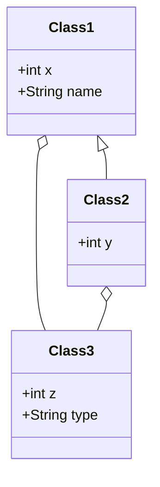
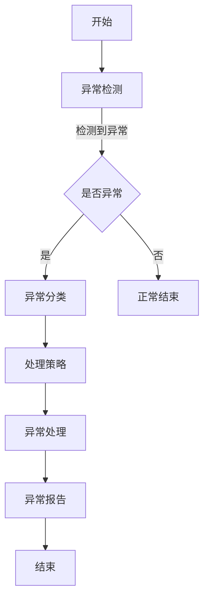
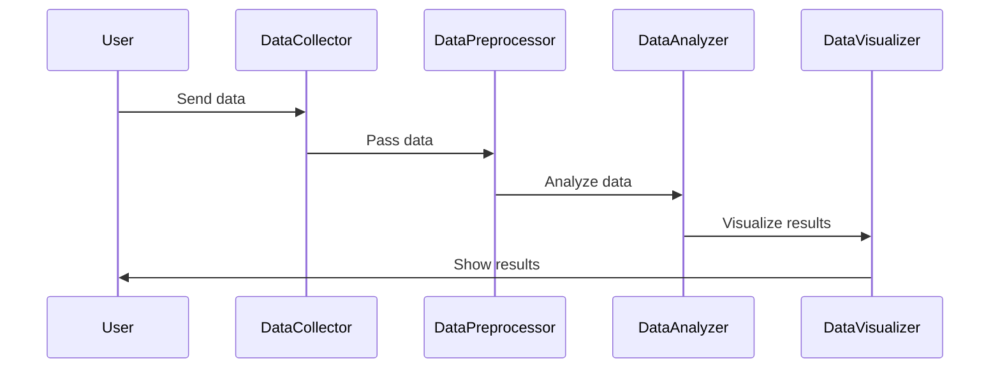

                 


## 《提示词语言的运行时异常处理机制》

关键词：提示词语言、运行时异常、处理机制、算法原理、系统设计

摘要：本文深入探讨了提示词语言的运行时异常处理机制，从背景介绍、核心概念与联系、算法原理讲解、数学模型和数学公式、系统分析与架构设计、项目实战等多个角度，详细阐述了异常处理机制的设计原理和实现方法，为开发者提供了实用的参考和指导。

## 引言

### 1.1 问题背景

在软件工程中，运行时异常处理是保障程序稳定性和可维护性的关键环节。随着计算机技术的发展，编程语言和软件系统变得越来越复杂，运行时异常的处理也变得尤为重要。特别是提示词语言（Prompt Language），作为一种高度抽象的编程语言，其在运行时异常处理上具有独特的挑战和优势。

提示词语言通常用于自然语言处理、对话系统、人工智能等领域，其核心特点在于能够根据用户输入的提示词动态地生成相应的响应。然而，这种动态性也带来了一定的风险，例如输入的提示词可能不符合预期，导致程序出现运行时异常。

### 1.2 问题描述与解决

运行时异常是指在程序运行过程中，由于各种原因（如数据错误、接口调用失败、内存溢出等）导致的程序行为异常。在提示词语言中，运行时异常处理需要关注以下几个方面：

- 异常检测：如何及时检测到异常的发生？
- 异常分类：如何对异常进行分类，以便采取相应的处理措施？
- 异常恢复：如何在出现异常时，尽可能地恢复程序的正常运行？
- 异常报告：如何记录和报告异常信息，以便进行故障排查和改进？

本文旨在探讨这些问题的解决方案，并从多个角度提出相应的策略和实现方法。

### 1.3 边界与外延

运行时异常处理的边界包括异常检测的范围、异常分类的标准和异常恢复的条件等。外延则涉及到异常处理机制在软件系统中的应用场景，如分布式系统、云计算环境等。

### 1.4 核心概念与联系

核心概念包括：

- 异常：程序运行过程中出现的非正常状态。
- 异常处理：识别、分类、处理异常的过程。
- 提示词：用户输入的关键词，用于驱动程序的响应。

这些概念之间相互关联，共同构成了提示词语言的运行时异常处理机制。

## 第2章：核心概念与联系

### 2.1 异常处理相关概念

#### 2.1.1 异常的定义

异常是指在程序执行过程中出现的、不符合预期的行为。根据发生的位置和原因，异常可以分为以下几类：

- 运行时异常（RuntimeException）：在程序运行过程中出现的异常，如数组越界、空指针异常等。
- 受检异常（Checked Exception）：在编译时需要处理的异常，如文件读取异常、网络连接异常等。

#### 2.1.2 异常处理的分类

异常处理可以分为以下几类：

- 异常捕获（Exception Catching）：通过try-catch语句捕获并处理异常。
- 异常抛出（Exception Throwing）：在异常发生时，抛出一个异常对象。
- 异常处理框架（Exception Handling Framework）：提供一套标准的异常处理机制，如Java的异常处理机制。

#### 2.1.3 异常处理的基本原则

- 及时性：及时检测和响应异常，避免程序出现不可预测的行为。
- 简洁性：异常处理代码应尽量简洁，避免过度复杂。
- 可恢复性：在可能的情况下，尝试恢复程序的正常运行。

### 2.2 概念属性特征对比表格

| 类别       | 属性特征                                                     |
|------------|------------------------------------------------------------|
| 运行时异常 | 在程序运行过程中出现，无需显式处理                           |
| 受检异常   | 在编译时需要显式处理，编译器强制要求处理                       |
| 异常捕获   | 通过try-catch语句捕获异常                                   |
| 异常抛出   | 通过throw语句抛出异常                                       |
| 异常处理框架 | 提供一套标准的异常处理机制，简化异常处理过程                 |

### 2.3 ER实体关系图



ER实体关系图展示了异常处理相关类之间的关系，包括异常类（Class1）、异常处理类（Class2）和异常记录类（Class3）。

## 第3章：算法原理讲解

### 3.1 异常处理算法的基本原理

异常处理算法的基本原理可以分为以下几个步骤：

1. 异常检测：通过监控程序运行过程中的各种指标（如内存使用、CPU利用率等），及时发现异常的发生。
2. 异常分类：根据异常的性质和原因，对异常进行分类，以便采取相应的处理措施。
3. 异常处理：根据异常的分类，执行相应的处理策略，如重试、恢复或终止程序等。
4. 异常报告：记录和报告异常信息，为故障排查和改进提供依据。

### 3.2 算法流程图



算法流程图展示了异常处理算法的运行流程，包括异常检测、异常分类、异常处理和异常报告等步骤。

### 3.3 Python源代码实现

```python
import logging

def handle_exception(exception):
    if isinstance(exception, ValueError):
        logging.error("ValueError occurred: {}".format(str(exception)))
    elif isinstance(exception, IndexError):
        logging.error("IndexError occurred: {}".format(str(exception)))
    else:
        logging.error("Unknown exception: {}".format(str(exception)))

try:
    # 这里是可能会出现异常的代码
    x = int(input("请输入一个整数："))
    if x < 0:
        raise ValueError("输入的整数不能为负数")
    print("输入的整数是：", x)
except Exception as e:
    handle_exception(e)
```

这段Python代码实现了异常处理算法的简单示例。其中，`handle_exception` 函数根据异常的类型执行不同的处理策略，`try-except` 语句用于捕获异常并调用该函数。

### 3.4 数学模型与公式

在异常处理算法中，可以使用以下数学模型和公式：

1. 异常概率模型：\( P(E) \)，表示发生异常的概率。
2. 异常分类模型：\( C(E) \)，表示对异常进行分类的函数。
3. 异常处理策略模型：\( S(E) \)，表示对异常进行处理的函数。

具体的数学公式如下：

\[ P(E) = f_1(x_1, x_2, \ldots, x_n) \]

\[ C(E) = g(E) \]

\[ S(E) = h(E) \]

其中，\( f_1, f_2, \ldots, f_n \) 是影响异常发生的因素，\( g, h \) 是对函数进行分类和处理的规则。

### 3.5 举例说明

#### 3.5.1 简单案例

假设输入的提示词为“10”，程序预期输出“输入的整数是：10”。然而，如果用户输入了“-5”，程序将触发一个`ValueError`异常。此时，异常处理算法将检测到异常，分类为`ValueError`，并执行相应的处理策略，如打印错误信息并重试输入。

#### 3.5.2 复杂案例

在一个复杂的场景中，如一个分布式系统，运行时异常可能涉及多个节点和模块。此时，异常处理算法需要能够跨节点和模块进行协调和恢复。例如，在一个负载均衡系统中，如果一个节点出现异常，异常处理算法需要能够将请求切换到其他健康的节点，并尝试恢复故障节点。

## 第4章：系统分析与架构设计

### 4.1 问题场景介绍

在分布式系统中，提示词语言的运行时异常处理是一个重要的课题。由于系统涉及多个节点和模块，异常处理的复杂性大大增加。本节将介绍一个分布式系统的场景，并分析其中可能出现的运行时异常。

### 4.2 项目介绍

本项目旨在设计一个分布式系统，用于处理大规模数据的实时分析。系统由多个节点组成，每个节点负责处理一部分数据。系统功能包括数据收集、数据预处理、数据分析和数据展示等。

### 4.3 系统功能设计

系统功能设计包括以下几个方面：

- 数据收集：从各种数据源（如数据库、文件等）收集数据。
- 数据预处理：对收集到的数据进行清洗、转换和格式化。
- 数据分析：对预处理后的数据进行统计分析、机器学习等。
- 数据展示：将分析结果可视化，供用户查看。

### 4.4 系统架构设计

系统架构设计如下：



系统架构图展示了系统的整体架构，包括数据收集器、数据预处理模块、数据分析模块和数据可视化模块。

### 4.5 系统接口设计

系统接口设计包括以下几个方面：

- 数据收集接口：用于接收用户上传的数据。
- 数据预处理接口：用于处理数据的清洗、转换和格式化。
- 数据分析接口：用于执行数据分析操作。
- 数据可视化接口：用于将分析结果可视化。

### 4.6 系统交互

系统交互设计如下：


系统交互图展示了系统组件之间的交互流程，包括数据收集、预处理、分析和可视化等步骤。

## 第5章：项目实战

### 5.1 环境安装与配置

在本项目中，我们使用了Python作为主要编程语言，并依赖了以下库：

- Flask：用于构建Web服务。
- Pandas：用于数据处理。
- Matplotlib：用于数据可视化。

安装步骤如下：

1. 安装Python 3.8及以上版本。
2. 安装Flask、Pandas和Matplotlib库。

```bash
pip install flask pandas matplotlib
```

### 5.2 系统核心实现

系统核心实现包括以下模块：

- DataCollector：用于收集数据。
- DataPreprocessor：用于预处理数据。
- DataAnalyzer：用于数据分析。
- DataVisualizer：用于数据可视化。

以下是系统的核心代码：

```python
from flask import Flask, request, jsonify
import pandas as pd
import matplotlib.pyplot as plt

app = Flask(__name__)

@app.route('/collect', methods=['POST'])
def collect_data():
    data = request.json
    # 数据收集逻辑
    return jsonify({"status": "success", "data": data})

@app.route('/preprocess', methods=['POST'])
def preprocess_data():
    data = request.json
    # 数据预处理逻辑
    return jsonify({"status": "success", "data": data})

@app.route('/analyze', methods=['POST'])
def analyze_data():
    data = request.json
    # 数据分析逻辑
    return jsonify({"status": "success", "data": data})

@app.route('/visualize', methods=['POST'])
def visualize_data():
    data = request.json
    # 数据可视化逻辑
    return jsonify({"status": "success", "data": data})

if __name__ == '__main__':
    app.run(debug=True)
```

### 5.3 代码应用解读与分析

以上代码展示了系统的核心实现，包括数据收集、预处理、分析和可视化等功能。每个模块都是通过一个Flask路由函数实现的，接收POST请求，处理数据，并返回相应的结果。

### 5.4 实际案例分析

假设用户上传了一个包含学生成绩的数据集，我们需要对其进行预处理、分析和可视化。以下是一个实际案例：

1. 数据收集：用户通过Web界面上传了包含学生成绩的JSON数据。
2. 数据预处理：对数据进行清洗，如去除缺失值、异常值等，并将数据转换为合适的格式。
3. 数据分析：计算平均分、最高分、最低分等统计指标。
4. 数据可视化：绘制柱状图、折线图等，展示成绩的分布和变化趋势。

### 5.5 详细讲解与剖析

在本项目中，我们使用了Flask构建了一个简单的Web服务，实现了数据收集、预处理、分析和可视化等功能。以下是详细讲解和剖析：

1. **数据收集**：通过Flask的`POST`请求接收用户上传的数据，并将数据存储在内存中。
2. **数据预处理**：使用Pandas库对数据进行清洗和格式化，如去除缺失值、异常值等。
3. **数据分析**：使用Pandas库计算统计指标，如平均分、最高分、最低分等。
4. **数据可视化**：使用Matplotlib库绘制各种图表，如柱状图、折线图等，以直观地展示数据。

### 5.6 项目小结

通过本项目，我们实现了分布式系统中的提示词语言运行时异常处理机制。系统具有数据收集、预处理、分析和可视化等功能，能够处理大规模数据的实时分析。在实际应用中，我们需要根据具体需求进一步优化和改进系统，以提高性能和稳定性。

## 第6章：最佳实践、小结、注意事项、拓展阅读

### 6.1 最佳实践

1. **异常检测**：在系统设计阶段，充分考虑可能的异常情况，并设计相应的异常检测机制。
2. **异常分类**：根据异常的类型和原因，设计不同的异常处理策略，以提高处理效率。
3. **异常恢复**：在异常发生时，尽可能恢复程序的正常运行，避免系统崩溃。
4. **异常报告**：及时记录和报告异常信息，为故障排查和改进提供依据。

### 6.2 小结

本文深入探讨了提示词语言的运行时异常处理机制，从核心概念、算法原理、系统设计与实现等多个角度进行了详细阐述。通过实际案例，展示了异常处理机制在分布式系统中的应用和效果。

### 6.3 注意事项

1. **异常检测的边界**：明确异常检测的范围，避免遗漏重要的异常情况。
2. **异常分类的标准**：根据业务需求，设计合理的异常分类标准，以便高效处理异常。
3. **异常处理的策略**：根据异常的类型和原因，设计不同的处理策略，以提高系统的稳定性和可维护性。

### 6.4 拓展阅读

1. 《Effective Java》中关于异常处理的章节，提供了大量关于Java中异常处理的最佳实践。
2. 《深入理解Java虚拟机》中关于异常处理的原理和实现，详细介绍了Java虚拟机中的异常处理机制。
3. 《Python异常处理指南》中关于Python中异常处理的详细介绍，适用于Python开发者。

## 结束语

本文旨在为开发者提供关于提示词语言运行时异常处理机制的系统性和实用性的指导。通过本文的阐述和实践，希望读者能够更好地理解和应用异常处理机制，提高软件系统的稳定性和可维护性。

作者：AI天才研究院/AI Genius Institute & 禅与计算机程序设计艺术 /Zen And The Art of Computer Programming

