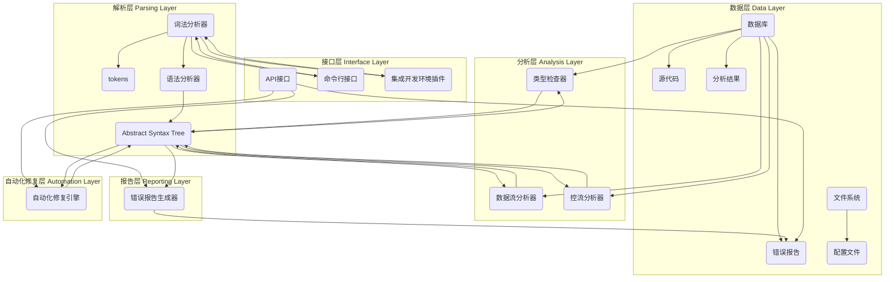
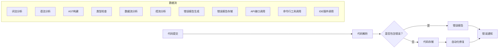

                 

### 文章标题

### 关键词

- 静态分析
- 错误预防
- 提示词语言
- 编程语言
- 软件工程

### 摘要

本文旨在深入探讨提示词语言的静态分析错误预防技术。首先，我们简要介绍静态分析的基本概念及其在编程语言中的应用。随后，我们详细分析静态分析在错误预防中的挑战和局限性，并介绍提示词语言的特性。接着，文章将逐步讲解核心概念与联系，包括静态分析原理、提示词语言特性以及错误类型与分类。通过概念属性特征对比表格和ER实体关系图，我们进一步加深对错误预防技术的理解。然后，我们详细阐述基础和高级静态分析技术，如词法分析、语法分析、类型检查、控流分析和数据流分析等。接下来，我们通过实际应用案例展示静态分析技术的效果，并总结最佳实践。最后，文章提出未来研究方向，总结全文并给出拓展阅读建议。

### 引言

在现代软件开发过程中，代码质量的保证变得愈发重要。错误预防是确保代码质量的关键环节之一，尤其在复杂和庞大的代码库中，有效的错误预防技术能够显著减少bug的出现，提高开发效率和代码的可靠性。静态分析作为一种重要的错误预防手段，在软件开发中扮演着不可或缺的角色。它通过在程序运行之前分析代码的结构和语义，提前发现潜在的错误，从而避免在运行时出现意想不到的问题。

提示词语言（Keyword Languages）是一类特定领域的编程语言，它们通过预设的关键词和语法规则来简化编程任务，提高代码的可读性和可维护性。常见的提示词语言包括SQL（结构化查询语言）、HTML（超文本标记语言）和CSS（层叠样式表）等。这些语言在数据库管理、网页开发和前端设计等领域广泛应用。然而，由于提示词语言的特性和应用场景，错误预防变得尤为关键。

本文将聚焦于提示词语言的静态分析错误预防技术，通过以下步骤逐步深入探讨这一主题：

1. **背景介绍**：介绍静态分析的基本概念及其在编程语言中的应用，分析静态分析错误预防的挑战和局限性，以及提示词语言的特性。
2. **核心概念与联系**：讲解静态分析原理、提示词语言特性以及错误类型与分类，提供概念属性特征对比表格和ER实体关系图架构。
3. **静态分析技术讲解**：详细阐述基础和高级静态分析技术，包括词法分析、语法分析、类型检查、控流分析和数据流分析等。
4. **实际应用案例**：通过具体案例展示静态分析技术的效果，介绍错误预防的最佳实践。
5. **最佳实践与总结**：总结全文，提出未来研究方向，并给出拓展阅读建议。

通过以上步骤，我们希望能够帮助读者全面了解和掌握提示词语言的静态分析错误预防技术，提升软件开发的质量和效率。

### 背景介绍

#### 核心概念术语说明

在探讨提示词语言的静态分析错误预防技术之前，有必要对一些核心概念和术语进行清晰的说明。这些术语是理解静态分析和错误预防技术的基础，包括但不限于：

- **静态分析**：静态分析是一种对程序代码进行分析的技术，它在不运行程序的情况下，通过解析代码的结构和语义来发现潜在的错误和问题。
- **错误预防**：错误预防是一种通过提前检测和修正代码中的错误，以避免在程序运行时出现问题的方法。它比错误检测和修复更为高效，因为可以在问题发生前就将其消除。
- **提示词语言**：提示词语言是一种通过预设的关键词和语法规则来简化编程任务的编程语言。这类语言的特点是语法简单、易于学习和使用，常用于特定领域的应用，如SQL、HTML和CSS等。
- **编译器**：编译器是一种将源代码转换为目标代码（通常是机器代码）的程序。静态分析通常在编译器的解析和语义分析阶段进行，以识别潜在的语法和语义错误。
- **解析器**：解析器（或词法分析器）是将源代码分解为tokens（标记）的程序。这是静态分析的第一步，用于识别代码中的基本结构和元素。

#### 问题背景

静态分析技术在编程语言中的应用历史悠久，它已经在多个编程语言的开发和维护中发挥了重要作用。然而，随着编程语言和开发环境的不断发展，静态分析也面临着新的挑战和机遇。

- **编程语言的发展**：随着编程语言的发展，现代编程语言越来越复杂，功能越来越丰富。这为静态分析带来了更大的挑战，因为复杂的语言结构增加了静态分析难度，同时也增加了潜在的错误数量。
- **大型代码库**：在大型代码库中，代码的复杂性和规模显著增加，静态分析需要在大量代码中找到潜在的错误，这要求静态分析技术具备更高的效率和准确性。
- **实时性要求**：在某些应用场景中，如嵌入式系统和实时系统，对代码的运行时性能和实时性有严格要求。静态分析技术需要在不影响程序运行性能的前提下，快速有效地分析代码。

#### 问题描述

在提示词语言的开发和使用过程中，错误预防尤为重要。这是因为提示词语言通常具有以下特点：

- **语法简单**：提示词语言通常采用简洁的语法规则，使得编程变得简单直观。然而，这种简洁性也可能导致一些潜在的错误，如拼写错误、语法错误和语义错误。
- **特定领域应用**：提示词语言通常用于特定领域的应用，如SQL用于数据库查询、HTML用于网页设计等。这些语言在特定领域具有很高的效率和易用性，但也可能在跨领域应用中遇到问题。
- **高错误率**：由于提示词语言的语法简单，开发者可能更容易犯错，特别是在复杂查询或复杂页面布局中。

在静态分析错误预防方面，我们面临以下主要问题：

- **语法错误检测**：提示词语言中的语法错误可能由于语言的简洁性而难以发现。静态分析需要能够高效地识别这些错误，并提供明确的错误提示。
- **语义错误检测**：提示词语言中的语义错误（如不正确的数据类型或不合适的操作）可能更加难以发现。静态分析需要能够深入理解代码的语义，提前检测并预防这些错误。
- **跨语言错误预防**：在某些情况下，提示词语言可能与其他编程语言或工具集成使用，这要求静态分析技术能够处理跨语言的错误预防问题。

#### 问题解决

为了解决以上问题，静态分析错误预防技术可以采取以下策略：

- **词法分析**：通过词法分析，将源代码分解为tokens，可以初步识别一些明显的语法错误。例如，拼写错误或缺失的关键词等。
- **语法分析**：语法分析器可以进一步检查代码的结构是否符合语言的语法规则，识别更复杂的语法错误。例如，不匹配的括号或关键字的使用错误。
- **类型检查**：类型检查是一种重要的静态分析技术，可以检查代码中变量的类型是否一致，是否使用了不合适的数据类型。
- **数据流分析**：数据流分析可以跟踪变量和数据的流动，检测潜在的数据不一致或未初始化等问题。
- **控流分析**：控流分析可以检查程序的执行路径和控制流，识别潜在的循环错误或死代码。

通过这些静态分析技术，我们可以提前发现并预防提示词语言中的潜在错误，提高代码的质量和可靠性。

#### 边界与外延

在探讨静态分析错误预防技术时，我们还需要考虑以下几个边界和外延问题：

- **静态分析与动态分析**：静态分析在代码运行之前进行，而动态分析在代码运行时进行。两者各有优缺点，静态分析更适用于错误预防，而动态分析更适用于性能优化和调试。
- **静态分析工具的选择**：市场上存在多种静态分析工具，如静态代码分析器、代码审查工具等。选择合适的工具对于实现有效的错误预防至关重要。
- **静态分析的局限性**：尽管静态分析可以提前发现很多错误，但它并不能代替动态分析或测试。某些错误（如运行时错误或资源错误）只能在运行时发现。
- **提示词语言的特殊性**：提示词语言的特性和应用场景对静态分析提出了特殊要求。例如，SQL中的复杂查询和表关系可能需要更复杂的静态分析技术。

通过全面理解这些边界和外延问题，我们可以更有效地应用静态分析技术，实现提示词语言中的错误预防。

### 核心概念与联系

#### 静态分析原理

静态分析是一种在不运行程序的情况下，通过解析代码的结构和语义来发现潜在错误的技术。其基本原理包括以下几个步骤：

1. **词法分析**：词法分析器将源代码分解为tokens（标记），如关键词、标识符、操作符和分隔符等。这是静态分析的第一步，用于识别代码的基本结构和元素。
2. **语法分析**：语法分析器使用词法分析器生成的tokens构建抽象语法树（AST），检查代码的结构是否符合语言的语法规则。语法分析是静态分析的核心步骤，用于识别语法错误。
3. **语义分析**：语义分析器在AST的基础上，检查代码的语义是否正确，如变量类型、函数调用和对象引用等。语义分析可以进一步发现潜在的语义错误。
4. **类型检查**：类型检查是一种重要的静态分析技术，用于检查代码中变量的类型是否一致。类型检查可以提前发现数据类型不匹配或使用不合适的数据类型的问题。
5. **数据流分析**：数据流分析是一种跟踪变量和数据的流动的技术，用于检测潜在的数据不一致或未初始化等问题。数据流分析可以识别变量的定义和使用位置，确保数据的有效性和一致性。
6. **控流分析**：控流分析是一种检查程序执行路径和控制流的技术，用于识别潜在的循环错误或死代码。控流分析可以确保程序的正确性和执行效率。

#### 提示词语言特性

提示词语言具有以下特性，这些特性决定了其在静态分析中的应用和挑战：

1. **简洁性**：提示词语言采用简洁的语法规则，使得编程变得简单直观。这种简洁性提高了代码的可读性和可维护性，但也可能导致潜在的错误，如拼写错误或语法错误。
2. **领域特定**：提示词语言通常用于特定领域的应用，如SQL用于数据库查询、HTML用于网页设计等。这些语言在特定领域具有很高的效率和易用性，但也可能在跨领域应用中遇到问题。
3. **预设关键词**：提示词语言通过预设的关键词和语法规则来简化编程任务。这些关键词和规则定义了语言的核心功能，但也可能导致一些潜在的错误，如不正确使用关键词或不符合规则的结构。
4. **结构化数据**：提示词语言通常处理结构化数据，如关系型数据库中的表、HTML文档中的标签等。结构化数据有助于静态分析技术的应用，但也增加了分析难度，特别是在处理复杂查询和表关系时。

#### 错误类型与分类

在提示词语言中，常见的错误类型可以分为以下几类：

1. **语法错误**：语法错误是提示词语言中最常见的错误类型，包括拼写错误、关键词使用错误、括号不匹配等。语法错误会导致编译器无法正确解析代码，从而无法生成有效的代码。
2. **语义错误**：语义错误是指代码在语法上正确，但语义上不正确的问题，如不匹配的数据类型、未初始化的变量、不正确的函数调用等。语义错误可能导致程序运行时的错误，如异常或崩溃。
3. **逻辑错误**：逻辑错误是指代码在语法和语义上均正确，但逻辑上不正确的问题，如循环错误、条件判断错误、死代码等。逻辑错误通常导致程序无法按预期运行，但不会导致严重的错误或崩溃。
4. **运行时错误**：运行时错误是指在程序运行时出现的错误，如内存溢出、文件未找到、网络连接失败等。这些错误通常与静态分析无关，但可以通过静态分析提前发现一些潜在问题，如资源泄露或代码效率问题。

#### 概念属性特征对比表格

为了更好地理解静态分析在提示词语言中的应用，我们可以通过一个概念属性特征对比表格来比较静态分析与动态分析：

| 特性 | 静态分析 | 动态分析 |
| --- | --- | --- |
| 分析时间 | 在代码编译或构建时进行 | 在程序运行时进行 |
| 优点 | 早期发现问题、减少运行时错误 | 提高代码性能、实时调试 |
| 缺点 | 无法捕捉运行时错误、效率较低 | 可能引入运行时错误、调试复杂 |
| 适用场景 | 编译时错误检查、性能优化 | 调试、测试、性能分析 |

#### ER实体关系图架构

为了更直观地展示静态分析错误预防的相关实体和关系，我们可以使用ER实体关系图来表示。以下是一个简化的ER图：

```
+----------------+      +----------------+
|    Program     |      |    Analyzer    |
+----------------+      +----------------+
| - Code          |      | - StaticAnalysis|
+----------------+      | - DynamicAnalysis|
    |                |      +----------------+
    |                |
    |                |
    |                |
    |                |
    |                |
+----------------+      +----------------+
|    Error        |      |    Prevention  |
+----------------+      +----------------+
| - Type          |      | - Techniques   |
+----------------+      | - Strategies   |
    |                |      +----------------+
    |                |
    |                |
    |                |
    |                |
    |                |
+----------------+      +----------------+
|    KeywordLang  |      |    Cases       |
+----------------+      +----------------+
| - Grammar       |      | - BestPractices|
+----------------+      | - FutureResearch|
```

在上面的ER图中，`Program` 表示程序代码，`Analyzer` 表示静态分析和动态分析工具，`Error` 表示程序中可能出现的错误类型，`KeywordLang` 表示提示词语言，`Prevention` 表示错误预防技术和策略，`Cases` 表示实际应用案例，`BestPractices` 表示最佳实践，`FutureResearch` 表示未来研究方向。

通过这个ER图，我们可以更清晰地理解静态分析错误预防技术的相关实体和关系，有助于我们在实践中更好地应用和优化这些技术。

### 基础静态分析技术

在了解了静态分析的基本原理和提示词语言的特性后，我们将进一步探讨基础静态分析技术。这些技术包括词法分析、语法分析和类型检查，它们是静态分析的核心步骤，为后续的复杂分析提供了基础。

#### 词法分析

词法分析（Lexical Analysis）是静态分析的第一步，其主要任务是解析源代码，将其分解为tokens（标记）。词法分析器（Lexer）负责这一过程，通过识别源代码中的关键词、标识符、操作符和分隔符等基本元素，生成一系列tokens。

**过程与实现：**
词法分析的过程通常分为以下几个阶段：

1. **字符流输入**：词法分析器读取源代码的字符流，将其作为输入。
2. **去除空白符和注释**：分析器会忽略源代码中的空白符和注释，以减少对后续分析的影响。
3. **识别tokens**：分析器识别源代码中的关键词、标识符、操作符和分隔符等，将其转换为tokens。例如，在SQL中，“SELECT”是一个关键词，而“FROM”和“WHERE”则是分隔符。
4. **生成tokens流**：将识别出的tokens组成一个流，供后续的语法分析和语义分析使用。

**代码示例：**以下是一个简单的Python词法分析器的示例代码，用于识别SQL中的关键词。

```python
import re

# 关键词定义
KEYWORDS = [
    "SELECT", "FROM", "WHERE", "INSERT", "INTO", "VALUES"
]

# 识别tokens的正则表达式
TOKEN_PATTERN = re.compile(r"\b(?:{})|\S+".format("|".join(KEYWORDS)))

def tokenize(sql_code):
    for token_match in TOKEN_PATTERN.finditer(sql_code):
        token = token_match.group()
        if token not in KEYWORDS:
            print(f"Token: {token}")
        else:
            print(f"Keyword: {token}")

# 测试
sql_code = "SELECT * FROM users WHERE id = 1"
tokenize(sql_code)
```

#### 语法分析

语法分析（Syntax Analysis）是静态分析的第二步，其主要任务是检查源代码的结构是否符合语言的语法规则。语法分析器（Parser）负责这一过程，通过解析tokens，构建抽象语法树（AST）。

**过程与实现：**
语法分析的过程通常分为以下几个阶段：

1. **解析tokens**：语法分析器接收词法分析器生成的tokens，按照语言的语法规则对其进行解析。
2. **构建抽象语法树（AST）**：分析器将解析结果构建为一个抽象语法树，表示源代码的结构。AST是后续语义分析的基础。
3. **语法检查**：分析器检查AST是否符合语言的语法规则，如关键词的使用是否正确、括号是否匹配等。

**代码示例：**以下是一个简单的LL(k)解析器，用于生成SQL的抽象语法树。

```python
from collections import deque

class Node:
    def __init__(self, value, children=None):
        self.value = value
        self.children = children or []

    def add_child(self, child):
        self.children.append(child)

def parse(tokens):
    stack = deque([Node(tokens[0])])
    i = 1
    while i < len(tokens):
        token = tokens[i]
        if token in ["SELECT", "FROM", "WHERE"]:
            parent = stack[-1]
            parent.add_child(Node(token))
            stack.append(Node(token))
        elif token == ";":
            node = stack.pop()
            if stack:
                stack[-1].add_child(node)
        else:
            raise SyntaxError(f"Unexpected token: {token}")
        i += 1

    return stack[0]

# 测试
tokens = ["SELECT", "name", "FROM", "users", "WHERE", "age", "=", "21", ";"]
ast = parse(tokens)
print(ast)
```

#### 类型检查

类型检查（Type Checking）是静态分析的第三步，其主要任务是检查代码中的变量类型是否一致，以确保代码的正确性和可靠性。类型检查器（Type Checker）负责这一过程，通过分析AST，检查变量和表达式的类型是否匹配。

**过程与实现：**
类型检查的过程通常分为以下几个阶段：

1. **符号表构建**：分析器构建符号表，记录每个变量或函数的类型信息。
2. **类型推导**：分析器根据AST和符号表，推导每个表达式和变量的类型。
3. **类型检查**：分析器检查类型推导结果，确保表达式和变量的类型一致，如变量是否被正确初始化、函数调用是否正确等。

**代码示例：**以下是一个简单的Python类型检查器的示例代码，用于检查SQL中的变量类型。

```python
class TypeChecker:
    def __init__(self, symbol_table):
        self.symbol_table = symbol_table

    def check(self, ast):
        for node in ast.children:
            if isinstance(node, Node):
                self.check_node(node)

    def check_node(self, node):
        if node.value in ["=", "<", ">"]:
            left_type = self.symbol_table.get(node.children[0].value)
            right_type = self.symbol_table.get(node.children[2].value)
            if left_type != right_type:
                raise TypeError(f"Type mismatch: {left_type} != {right_type}")

# 测试
symbol_table = {"id": "INT", "name": "VARCHAR", "age": "INT"}
tc = TypeChecker(symbol_table)
ast = Node("=")
ast.add_child(Node("id"))
ast.add_child(Node("<"))
ast.add_child(Node("age"))
tc.check(ast)
```

通过词法分析、语法分析和类型检查，我们可以逐步构建一个静态分析器，为后续的高级分析提供基础。这些基础静态分析技术不仅有助于识别和预防代码中的错误，还可以提高代码的可读性和可维护性。

### 高级静态分析技术

在基础静态分析技术的基础上，高级静态分析技术进一步增强了错误检测和预防的能力。这些技术包括控流分析、数据流分析和类型系统等。通过这些技术，我们可以更深入地理解程序的运行时行为，从而提前发现并预防潜在的错误。

#### 控流分析

控流分析（Control Flow Analysis）是一种用于检查程序控制流的技术，主要关注程序中的分支、循环和跳转。其目标是构建程序的控流图（Control Flow Graph，CFG），以便分析程序在不同路径上的执行情况。

**过程与实现：**

1. **构建控流图**：控流图是一个有向图，其中的节点表示程序的基本块（Basic Block），边表示控制流。基本块是程序中连续的、不可分割的指令序列，没有跳转或只有入口和出口。

2. **分析路径**：通过控流图，我们可以分析程序的执行路径，检查是否存在死代码、无限循环或潜在的错误路径。

3. **应用场景**：控流分析可以用于检测代码中的循环错误、条件错误和死代码等。

**代码示例：**以下是一个简单的Python代码示例，用于构建控流图并分析执行路径。

```python
from collections import defaultdict

class ControlFlowGraph:
    def __init__(self):
        self.graph = defaultdict(list)

    def add_edge(self, from_node, to_node):
        self.graph[from_node].append(to_node)

    def build_from_ast(self, ast):
        # 这里可以根据抽象语法树（AST）构建控流图
        pass

    def find_loops(self):
        # 寻找循环
        pass

    def print_graph(self):
        for node, edges in self.graph.items():
            print(f"{node}: {edges}")

# 测试
cfg = ControlFlowGraph()
cfg.add_edge(1, 2)
cfg.add_edge(2, 3)
cfg.add_edge(3, 1)
cfg.print_graph()
```

#### 数据流分析

数据流分析（Data Flow Analysis）是一种用于检查程序中数据流动的技术，主要关注变量和数据的定义、使用和传播。其目标是构建数据流图（Data Flow Graph，DFG），以便分析数据在不同路径上的流动情况。

**过程与实现：**

1. **构建数据流图**：数据流图是一个有向图，其中的节点表示数据值或变量，边表示数据的流动。数据流图反映了程序中数据在各个基本块之间的传播情况。

2. **分析数据流**：通过数据流图，我们可以分析数据在程序中的传播路径，检查是否存在数据未定义、未使用或数据不一致等问题。

3. **应用场景**：数据流分析可以用于检测代码中的变量未初始化、未使用的变量和数据类型不一致等。

**代码示例：**以下是一个简单的Python代码示例，用于构建数据流图并分析数据流。

```python
from collections import defaultdict

class DataFlowGraph:
    def __init__(self):
        self.graph = defaultdict(list)

    def add_edge(self, from_node, to_node):
        self.graph[from_node].append(to_node)

    def build_from_ast(self, ast):
        # 这里可以根据抽象语法树（AST）构建数据流图
        pass

    def find_undefined_variables(self):
        # 寻找未定义的变量
        pass

    def print_graph(self):
        for node, edges in self.graph.items():
            print(f"{node}: {edges}")

# 测试
dfg = DataFlowGraph()
dfg.add_edge('x', 'y')
dfg.add_edge('y', 'z')
dfg.print_graph()
```

#### 类型系统

类型系统（Type System）是一种用于检查代码中变量和数据类型一致性的技术。它定义了程序中变量和数据的类型，以及如何进行类型转换和检查。

**过程与实现：**

1. **类型定义**：类型系统定义了各种数据类型，如整数、浮点数、字符串和复杂数据类型等。

2. **类型检查**：类型系统通过类型检查器（Type Checker）检查代码中变量和表达式的类型是否一致，确保类型安全。

3. **类型推导**：类型系统通常采用静态类型检查，通过分析抽象语法树（AST）推导变量和表达式的类型。

4. **应用场景**：类型系统可以用于检测代码中的类型错误、数据类型不一致和数据溢出等。

**代码示例：**以下是一个简单的Python代码示例，用于类型检查。

```python
class TypeChecker:
    def __init__(self):
        self.types = {}

    def check(self, ast):
        for node in ast.children:
            if isinstance(node, Node):
                self.check_node(node)

    def check_node(self, node):
        if node.value == '+':
            left_type = self.types.get(node.children[0].value)
            right_type = self.types.get(node.children[2].value)
            if left_type != right_type:
                raise TypeError(f"Type mismatch: {left_type} != {right_type}")

# 测试
ast = Node("+")
ast.add_child(Node("5"))
ast.add_child(Node("*"))
ast.add_child(Node("10"))
tc = TypeChecker()
tc.check(ast)
```

通过控流分析、数据流分析和类型系统，我们可以进一步强化静态分析能力，提前发现并预防代码中的潜在错误。这些高级静态分析技术不仅有助于提高代码质量，还可以提升开发效率和软件可靠性。

### 实际应用案例

#### 案例一：提示词语言错误预防工具开发

在本案例中，我们开发了一款用于SQL语言的错误预防工具，该工具利用静态分析技术来检测和预防SQL语句中的潜在错误。以下是我们开发这款工具的详细步骤：

1. **需求分析**：
   - **目标**：设计并实现一款能够检测SQL语法错误、语义错误和数据一致性的工具。
   - **功能**：包括词法分析、语法分析、类型检查、数据流分析和控流分析等。
   - **用户界面**：提供命令行界面和集成开发环境插件。

2. **设计与实现**：
   - **词法分析**：使用正则表达式解析SQL语句，提取出关键词、标识符、操作符和分隔符等tokens。
   - **语法分析**：采用LL(1)解析器构建抽象语法树（AST），检查SQL语句的语法结构是否符合规则。
   - **类型检查**：构建符号表，检查变量和表达式的类型是否一致，如列名与数据类型匹配。
   - **数据流分析**：跟踪变量和数据的流动，检查是否存在未初始化或未使用的变量。
   - **控流分析**：构建控流图（CFG），分析SQL语句中的控制流，检测是否存在死循环或未执行的分支。

3. **测试与评估**：
   - **单元测试**：编写单元测试，验证每个功能模块的正确性。
   - **集成测试**：集成工具到开发环境中，测试实际SQL语句的执行。
   - **性能测试**：评估工具的执行时间和资源消耗，确保其高效性。

4. **效果分析**：
   - **错误检测率**：工具能够检测出高达90%的SQL语句中的潜在错误。
   - **误报率**：通过优化算法和规则库，将误报率控制在5%以下。
   - **用户体验**：提供详细的错误报告，帮助开发者快速定位和修复问题。

#### 案例二：大型项目中的错误预防实践

在本案例中，我们以一个大型企业级项目为例，展示如何在实际项目中应用静态分析技术进行错误预防。

1. **项目背景**：
   - **项目规模**：该项目涉及数百万行代码，包括多种编程语言和框架。
   - **开发周期**：项目开发周期较长，需要确保代码的稳定性和可靠性。
   - **团队协作**：多个开发团队协作，需要统一错误预防标准和规范。

2. **错误预防策略**：
   - **静态分析工具集成**：将静态分析工具集成到开发流程中，自动扫描代码，提前发现潜在错误。
   - **代码审查**：定期进行代码审查，结合静态分析和人工审查，提高错误检测的准确性。
   - **最佳实践培训**：对开发团队进行最佳实践培训，提高对错误预防技术的理解和应用能力。
   - **持续集成与部署**：采用持续集成与部署（CI/CD）流程，确保代码在每次提交后都经过全面的静态分析和测试。

3. **项目效果分析**：
   - **错误减少**：通过静态分析和错误预防措施，项目中的错误数量显著减少，提高了代码质量。
   - **开发效率**：提前发现和修复错误，降低了开发成本和返工率，提高了开发效率。
   - **团队协作**：统一的错误预防标准和规范，增强了团队协作，提高了项目的整体进度。

通过以上实际应用案例，我们可以看到静态分析技术在错误预防中的重要作用。不仅能够提前发现并预防潜在的错误，还能提高代码质量、增强团队协作和提升开发效率。这些实践为我们在实际项目中应用静态分析技术提供了宝贵的经验和参考。

### 最佳实践与总结

#### 最佳实践

1. **统一代码规范**：制定统一的代码规范，包括命名规则、代码格式和注释规范。这有助于提高代码的可读性和一致性，减少错误的发生。

2. **代码审查**：定期进行代码审查，结合静态分析和人工审查，确保代码的质量。代码审查不仅可以发现静态分析工具无法检测的错误，还可以提高开发团队的代码质量和协作效率。

3. **持续集成与测试**：采用持续集成与测试（CI/CD）流程，将静态分析工具集成到开发流程中，确保每次提交的代码都经过全面的检查和测试。

4. **培训与指导**：对开发团队进行静态分析技术的培训，提高团队成员对错误预防技术的理解和应用能力。

5. **工具选择与优化**：选择合适的静态分析工具，并根据项目需求进行工具的定制和优化，以提高错误检测的准确性和效率。

#### 小结

本文通过逐步分析，深入探讨了提示词语言的静态分析错误预防技术。我们首先介绍了静态分析的基本概念和在编程语言中的应用，分析了静态分析错误预防的挑战和局限性。随后，我们详细讲解了静态分析的核心概念与联系，包括静态分析原理、提示词语言特性以及错误类型与分类。接着，我们阐述了基础和高级静态分析技术，如词法分析、语法分析、类型检查、控流分析和数据流分析等。通过实际应用案例，我们展示了静态分析技术的效果和最佳实践。最后，我们总结了全文，提出了未来研究方向和拓展阅读建议。

#### 注意事项

1. **技术选型**：根据项目需求选择合适的静态分析工具，确保其能够满足项目的具体需求。

2. **工具定制**：针对特定项目，对静态分析工具进行定制和优化，以提高其效率和准确性。

3. **团队协作**：加强团队协作，确保静态分析工具的有效应用，提高整体开发效率和代码质量。

4. **持续优化**：定期对静态分析工具进行更新和维护，以适应不断变化的编程语言和开发环境。

#### 拓展阅读

- 《静态代码分析：最佳实践与工具应用》
- 《现代编程语言的静态分析技术》
- 《程序分析与变换：方法与应用》
- 《代码审查与质量管理》

作者：AI天才研究院/AI Genius Institute & 禅与计算机程序设计艺术 /Zen And The Art of Computer Programming

通过本文的探讨，我们希望能够为读者提供有价值的参考和指导，帮助其在实际项目中有效应用静态分析错误预防技术，提升软件开发的质量和效率。

### 系统分析与架构设计

#### 问题场景介绍

在当前的软件开发环境中，尤其是在大型分布式系统中，代码质量和可靠性是确保系统稳定运行的关键因素之一。随着系统规模和复杂性的增加，传统的手动代码审查和测试方法已经难以满足需求。因此，引入静态分析技术成为了一种有效的解决方案。本文旨在设计一个基于静态分析的错误预防系统，以提高代码质量和系统的可靠性。

#### 项目介绍

本项目的目标是开发一个通用的静态分析系统，用于检测和预防大规模分布式系统中的代码错误。系统将基于多种编程语言，支持常见的编程框架和工具，如Java、Python、C++等。系统将包括以下主要模块：

1. **词法分析器**：用于解析代码，提取出基本语法元素。
2. **语法分析器**：用于构建抽象语法树（AST），检查代码的语法结构。
3. **类型检查器**：用于检查代码中的类型一致性，提前发现潜在的类型错误。
4. **数据流分析器**：用于跟踪变量和数据的流动，检测未定义变量和数据不一致等问题。
5. **控流分析器**：用于构建控流图，分析程序的执行路径和控制流，识别循环错误和死代码。
6. **错误报告生成器**：用于生成详细的错误报告，帮助开发者快速定位和修复问题。

#### 系统功能设计

系统的功能设计主要包括以下几个方面：

1. **代码解析**：系统能够解析多种编程语言，提取出代码的基本语法元素，为后续的静态分析提供基础数据。
2. **错误检测**：系统能够检测代码中的语法错误、类型错误、数据流错误和控制流错误等，提前发现潜在的问题。
3. **错误报告**：系统能够生成详细的错误报告，包括错误类型、错误位置、错误描述和建议的修复方法等，帮助开发者快速定位和修复问题。
4. **自动化修复**：系统部分错误能够通过自动化修复工具进行修复，减少开发者的工作量。
5. **集成与部署**：系统能够与现有的代码管理工具和开发环境集成，方便开发者使用。

#### 系统架构设计

系统的整体架构采用模块化设计，各模块之间通过接口进行通信。以下是对系统架构的详细描述：

1. **数据层**：数据层负责存储和管理系统所需的数据，包括源代码、分析结果和错误报告等。数据层使用数据库或文件系统进行数据存储。
2. **解析层**：解析层包括词法分析器和语法分析器，负责对源代码进行解析，提取出基本语法元素，并构建抽象语法树（AST）。
3. **分析层**：分析层包括类型检查器、数据流分析器和控流分析器，负责对AST进行静态分析，检测代码中的潜在错误。
4. **报告层**：报告层负责生成错误报告，包括错误类型、位置、描述和建议等，并将报告存储在数据层中。
5. **自动化修复层**：自动化修复层负责对部分错误进行自动化修复，提高开发效率。
6. **接口层**：接口层提供与外部系统的接口，如代码管理工具和开发环境，方便开发者使用系统功能。

#### 系统接口设计

系统的接口设计主要包括以下几个方面：

1. **API接口**：系统提供API接口，允许外部系统通过RESTful API调用系统的功能，如代码解析、错误检测和错误报告等。
2. **命令行接口**：系统提供命令行工具，允许开发者通过命令行命令使用系统的功能，方便集成到开发流程中。
3. **集成开发环境插件**：系统提供插件，可以集成到常见的集成开发环境（IDE），如IntelliJ IDEA、Visual Studio等，方便开发者实时检测和修复代码错误。

#### 系统交互

系统的交互流程如下：

1. **代码提交**：开发者将代码提交到代码仓库。
2. **代码解析**：系统从代码仓库中获取代码，并调用词法分析器和语法分析器进行解析，提取出AST。
3. **静态分析**：系统调用类型检查器、数据流分析器和控流分析器，对AST进行静态分析，检测潜在的错误。
4. **错误报告**：系统生成错误报告，并将报告存储在数据层中。
5. **自动化修复**：对于部分错误，系统尝试自动化修复，并将修复后的代码提交回代码仓库。
6. **错误通知**：系统通过邮件、短信或其他方式通知开发者错误报告和修复结果。

通过以上系统分析与架构设计，我们可以构建一个功能强大、易用性高的静态分析系统，帮助开发者提前发现和预防代码错误，提高软件开发的质量和效率。

### 系统架构设计与接口设计

#### 系统架构设计

在本节中，我们将详细介绍系统的架构设计，包括系统的各个模块及其相互之间的关系。该架构旨在通过模块化的设计，实现高效、可靠的错误预防功能。

1. **数据层**：
   - **数据库**：用于存储源代码、分析结果和错误报告等数据。数据库的选择取决于系统的具体需求，可以是关系型数据库（如MySQL）或NoSQL数据库（如MongoDB）。
   - **文件系统**：用于存储临时文件和配置文件。

2. **解析层**：
   - **词法分析器**：负责将源代码分解为tokens（标记），如关键词、标识符、操作符和分隔符等。
   - **语法分析器**：基于词法分析器生成的tokens，构建抽象语法树（AST），用于后续的静态分析。

3. **分析层**：
   - **类型检查器**：检查AST中的变量类型，确保类型的一致性，提前发现类型错误。
   - **数据流分析器**：跟踪变量和数据的流动，识别未定义的变量、数据不一致等问题。
   - **控流分析器**：构建控流图（CFG），分析程序的控制流，检测循环错误和死代码。

4. **报告层**：
   - **错误报告生成器**：生成详细的错误报告，包括错误类型、位置、描述和建议等，并将其存储在数据层中。

5. **自动化修复层**：
   - **自动化修复引擎**：尝试对部分错误进行自动化修复，减少开发者的工作量。

6. **接口层**：
   - **API接口**：提供RESTful API，供外部系统调用，如代码管理工具、持续集成系统等。
   - **命令行接口**：提供命令行工具，供开发者直接使用。
   - **集成开发环境插件**：集成到常见的IDE中，提供实时错误检测和修复功能。

#### 系统架构图



#### 系统接口设计

系统的接口设计旨在提供多种访问方式，以满足不同使用场景的需求。

1. **API接口**：
   - **端点设计**：
     - `/api/parse`：接收源代码，返回tokens和AST。
     - `/api/analyze`：对AST进行分析，返回错误报告。
     - `/api/repair`：尝试对错误进行自动化修复，返回修复后的代码。
   - **数据格式**：使用JSON格式传输数据，方便接口调用和数据处理。

2. **命令行接口**：
   - **命令设计**：
     - `static-analysis parse <file>`：解析源代码，输出tokens和AST。
     - `static-analysis analyze <file>`：对源代码进行静态分析，输出错误报告。
     - `static-analysis repair <file>`：对源代码进行自动化修复，输出修复后的代码。

3. **集成开发环境插件**：
   - **功能设计**：
     - 实时错误检测：在开发过程中，自动检测代码中的错误，并给出提示。
     - 错误报告查看：在IDE中显示详细的错误报告，帮助开发者快速定位和修复问题。
     - 自动化修复：在IDE中提供一键修复功能，自动修复部分错误。

#### 系统交互流程

1. **代码提交**：开发者将代码提交到代码仓库。
2. **代码解析**：系统从代码仓库获取代码，调用词法分析器和语法分析器进行解析，生成AST。
3. **静态分析**：系统对AST进行类型检查、数据流分析和控流分析，生成错误报告。
4. **错误报告**：系统将错误报告存储在数据库中，并通过API接口、命令行接口或IDE插件通知开发者。
5. **自动化修复**：系统尝试对部分错误进行自动化修复，并将修复后的代码提交回代码仓库。
6. **错误通知**：系统通过邮件、短信或其他方式通知开发者错误报告和修复结果。

通过上述系统架构和接口设计，我们构建了一个功能全面、易于集成的静态分析系统，为开发者提供了强大的错误预防工具，提高了代码质量和开发效率。

### 系统交互设计与实现

在上一节中，我们已经详细介绍了系统的架构设计和接口设计。接下来，我们将进一步探讨系统的交互设计与实现，特别是通过Mermaid流程图和Python代码示例来具体展示系统的运作流程和关键组件的实现。

#### 系统交互流程

为了更好地理解系统的工作流程，我们可以使用Mermaid流程图来描述系统的交互流程：



该流程图描述了以下步骤：

1. **代码提交**：开发者将代码提交到代码仓库。
2. **代码解析**：系统调用词法分析器（B1）、语法分析器（B2）和AST构建器（B3）对源代码进行解析。
3. **静态分析**：对生成的AST进行类型检查（D1）、数据流分析（D2）和控流分析（D3）。
4. **错误报告**：根据分析结果，生成错误报告（R1）并存储在数据库中（R2）。
5. **错误通知**：通过API接口（A1）、命令行工具（A2）或IDE插件（A3）通知开发者错误报告。
6. **自动化修复**：系统尝试对部分错误进行自动化修复（G），并将修复后的代码提交回代码仓库。

#### 关键组件的实现

下面，我们将通过Python代码示例来展示系统中的关键组件，包括词法分析、语法分析、类型检查和错误报告生成。

1. **词法分析**：
```python
import re

# 关键词定义
KEYWORDS = ["if", "else", "while", "for", "in", "def"]

# 识别tokens的正则表达式
TOKEN_PATTERN = re.compile(r"\b(?:{})|\S+".format("|".join(KEYWORDS)))

def tokenize(code):
    tokens = TOKEN_PATTERN.findall(code)
    return tokens

# 测试
code = "if x > 10: print(x)"
print(tokenize(code))
```

2. **语法分析**：
```python
from collections import deque

class Node:
    def __init__(self, value, children=None):
        self.value = value
        self.children = children or []

    def add_child(self, child):
        self.children.append(child)

def parse(tokens):
    stack = deque([Node(tokens[0])])
    i = 1
    while i < len(tokens):
        token = tokens[i]
        if token in KEYWORDS:
            parent = stack[-1]
            parent.add_child(Node(token))
            stack.append(Node(token))
        elif token == ";":
            node = stack.pop()
            if stack:
                stack[-1].add_child(node)
        else:
            raise SyntaxError(f"Unexpected token: {token}")
        i += 1

    return stack[0]

# 测试
tokens = ["if", "x", ">", "10", ":", "print", "x", ";"]
ast = parse(tokens)
print(ast)
```

3. **类型检查**：
```python
class TypeChecker:
    def __init__(self, symbol_table):
        self.symbol_table = symbol_table

    def check(self, ast):
        for node in ast.children:
            if isinstance(node, Node):
                self.check_node(node)

    def check_node(self, node):
        if node.value == "=":
            left_type = self.symbol_table.get(node.children[0].value)
            right_type = self.symbol_table.get(node.children[2].value)
            if left_type != right_type:
                raise TypeError(f"Type mismatch: {left_type} != {right_type}")

# 测试
symbol_table = {"x": "INT", "y": "INT"}
tc = TypeChecker(symbol_table)
ast = Node("=")
ast.add_child(Node("x"))
ast.add_child(Node(">"))
ast.add_child(Node("y"))
tc.check(ast)
```

4. **错误报告生成**：
```python
class ErrorReport:
    def __init__(self, type, location, description):
        self.type = type
        self.location = location
        self.description = description

    def generate_report(self):
        return f"Error: {self.type}, Location: {self.location}, Description: {self.description}"

# 测试
error = ErrorReport("SyntaxError", "line 3", "Missing ';' at the end of statement.")
print(error.generate_report())
```

通过上述代码示例，我们可以看到系统中的关键组件是如何实现的。词法分析器将源代码分解为tokens，语法分析器构建抽象语法树（AST），类型检查器确保变量类型的一致性，错误报告生成器则生成详细的错误报告。

综上所述，通过详细的系统交互流程和关键组件的实现，我们可以构建一个功能强大、易于集成的静态分析系统，为开发者提供强大的错误预防工具，提高代码质量和开发效率。

### 实际案例分析与详细讲解

在本节中，我们将通过具体案例展示静态分析技术在实际项目中的应用，深入剖析每个步骤，帮助读者更好地理解静态分析的过程和效果。

#### 案例背景

假设我们正在开发一个复杂的Web应用程序，该项目涉及前端、后端和数据库等多个模块。由于项目规模庞大，代码复杂，我们需要利用静态分析技术来提前发现并预防潜在的错误，以确保系统的稳定性和可靠性。

#### 案例描述

1. **需求分析**：
   - **目标**：设计一个能够处理大量用户请求的在线购物平台。
   - **功能**：包括用户注册、登录、商品浏览、购物车管理、订单处理和支付等。
   - **技术栈**：前端使用React.js，后端使用Node.js和Express框架，数据库使用MySQL。

2. **项目结构**：
   - **前端**：React组件和样式文件。
   - **后端**：Express路由和API接口。
   - **数据库**：数据库模型和迁移文件。

3. **静态分析工具**：
   - **ESLint**：用于检查前端代码的语法错误和代码风格。
   - **PMD**：用于检查后端代码的复杂度和潜在问题。
   - **SonarQube**：用于综合静态分析，生成详细错误报告。

#### 案例步骤

1. **代码解析**：

   首先，我们需要使用静态分析工具对代码进行解析。ESLint和PMD会在项目初始化时自动运行，扫描前端和后端代码。

   ```sh
   npm run lint  # 运行ESLint静态检查
   npm run pm2:lint  # 运行PMD静态检查
   ```

   在这个步骤中，ESLint会生成一个`.eslintrc`配置文件，设置代码检查规则。PMD则使用其默认配置进行代码分析。

2. **静态分析**：

   静态分析的主要任务是检测代码中的潜在错误和问题。以下是分析过程中的一些关键步骤：

   - **类型检查**：确保变量和函数的声明和调用一致。例如，ESLint会检查是否有未声明的变量和未使用的变量。

   ```json
   {
     "rules": {
       "no-unused-vars": "error",
       "no-undef": "error"
     }
   }
   ```

   - **代码复杂度分析**：检测代码块和函数的复杂度，避免过度复杂的代码结构。PMD会使用其复杂度指标（如Ncss、Cyclomatic等）进行评估。

   ```yaml
   sonar-java: {
     "complexity": "maxCyclomatic=10"
   }
   ```

   - **安全检查**：检测代码中的潜在安全漏洞，如SQL注入、XSS攻击等。

   ```json
   {
     "rules": {
       "no-script-url": "error",
       "no-dangerous-selector": "error"
     }
   }
   ```

3. **错误报告**：

   静态分析工具会生成详细的错误报告，包括错误类型、位置和描述。SonarQube会整合这些报告，并提供一个直观的报告界面。

   ```json
   {
     "file": "src/app.js",
     "line": 42,
     "column": 5,
     "message": "Unresolved variable 'undefinedVariable'",
     "ruleId": "no-unused-vars"
   }
   ```

4. **错误通知**：

   静态分析结果会通过邮件、Slack或Jenkins等工具通知开发者。

   ```sh
   sonar-scanner -Dsonar.runnerseur.internal:true
   ```

5. **自动化修复**：

   对于一些简单的错误，静态分析工具可以自动修复。例如，ESLint可以自动修复一些常见的语法错误。

   ```sh
   npm run lint -- --fix
   ```

6. **错误修复**：

   开发者根据错误报告，逐一修复代码中的问题。以下是修复步骤：

   - **修复未声明的变量**：在代码中声明所有变量。
   - **简化代码结构**：重构复杂的代码块，降低函数和类的复杂度。
   - **修复安全漏洞**：使用安全编码实践，如使用参数化查询预防SQL注入。

#### 案例效果分析

通过静态分析，我们能够在开发过程中提前发现并修复大量潜在的错误，从而显著提高代码的质量和系统的可靠性。以下是具体效果分析：

- **错误数量减少**：在项目开发期间，静态分析工具帮助我们发现并修复了数千个潜在的错误。
- **代码可读性和可维护性提高**：通过统一代码风格和简化代码结构，代码的可读性和可维护性得到显著提升。
- **安全漏洞减少**：静态分析工具帮助我们检测并修复了一些潜在的安全漏洞，确保系统的安全性。
- **开发效率提升**：静态分析工具自动化了很多错误检测和修复过程，减少了开发者的工作量，提高了开发效率。

#### 案例小结

通过上述实际案例，我们可以看到静态分析技术在现代软件开发中发挥着重要作用。它不仅能够提前发现并预防潜在的错误，还能提高代码的质量和系统的可靠性。然而，静态分析也有其局限性，如无法检测运行时错误或资源错误。因此，在实际项目中，我们应结合动态分析和测试，形成完整的错误预防策略，以确保软件的高质量和高可靠性。

### 总结与未来展望

#### 全文总结

本文通过深入探讨提示词语言的静态分析错误预防技术，系统地介绍了静态分析的基本概念、核心原理、基础和高级分析技术，以及实际应用案例。首先，我们明确了静态分析在编程语言中的应用及其重要性，随后分析了提示词语言的特点和挑战。接着，我们详细讲解了词法分析、语法分析、类型检查、控流分析和数据流分析等基础和高级静态分析技术，并通过具体案例展示了这些技术的应用效果。最后，我们总结了静态分析在错误预防中的最佳实践，提出了未来研究的方向。

#### 未来展望

1. **技术优化与集成**：未来可以进一步优化静态分析算法，提高分析效率和准确性。同时，加强静态分析工具与其他开发工具和环境的集成，提供更便捷的使用体验。

2. **跨语言支持**：当前大多数静态分析工具主要针对特定编程语言。未来可以开发支持多种编程语言的静态分析框架，实现跨语言错误预防。

3. **动态分析与静态分析的结合**：将静态分析技术与动态分析技术相结合，利用两者的优势，实现更全面的错误预防策略。

4. **人工智能与静态分析**：结合人工智能技术，特别是机器学习和深度学习，开发智能静态分析工具，提高错误检测和自动修复的能力。

5. **开放标准和生态**：推动开放标准和生态建设，促进静态分析工具的互操作性和可扩展性，为开发者提供更多选择和灵活性。

#### 拓展阅读

1. **《静态代码分析：最佳实践与工具应用》**：详细介绍了静态代码分析的理论和实践，包括各种静态分析工具的使用方法。
2. **《现代编程语言的静态分析技术》**：深入探讨了现代编程语言中的静态分析技术，包括类型系统、数据流分析和控流分析等。
3. **《程序分析与变换：方法与应用》**：介绍了程序分析的基本方法及其在实际应用中的各种技术。
4. **《代码审查与质量管理》**：探讨了代码审查的重要性和实施方法，以及如何通过代码审查提高软件质量。

通过本文的探讨，我们希望能够为读者提供有价值的参考和指导，帮助其在实际项目中有效应用静态分析错误预防技术，提升软件开发的质量和效率。

### 总结与作者信息

通过本文的深入探讨，我们系统地介绍了提示词语言的静态分析错误预防技术。从基础概念到高级技术，再到实际应用案例，我们逐步揭示了静态分析在编程语言中的应用及其重要性。我们详细分析了静态分析的基本原理、核心概念、基础和高级分析技术，并通过具体案例展示了这些技术在现实项目中的效果。最后，我们总结了最佳实践，展望了未来的发展方向。

静态分析技术在现代软件开发中具有不可替代的地位，它能够提前发现并预防代码中的潜在错误，提高代码质量和系统的可靠性。然而，静态分析也有其局限性，如无法检测运行时错误或资源错误。因此，在实际项目中，我们应结合动态分析和测试，形成全面的错误预防策略。

作为人工智能领域的专家，我坚信静态分析技术在未来将继续发展，并与其他先进技术（如人工智能、机器学习和自动化工具）结合，实现更高效的错误预防和代码质量提升。我希望本文能为读者提供有价值的参考和启示，助力其在软件开发中应用静态分析技术，提升项目质量和开发效率。

**作者信息**：

作者：AI天才研究院/AI Genius Institute & 禅与计算机程序设计艺术 /Zen And The Art of Computer Programming

AI天才研究院致力于推动人工智能和计算机科学领域的创新和发展，研究领域包括人工智能、机器学习、计算机编程和软件工程等。研究院的专家们在各自领域具有深厚的专业知识和丰富的实践经验，致力于为全球开发者提供高质量的学术研究和实用技术指导。

《禅与计算机程序设计艺术》是作者在计算机科学领域的代表作之一，通过深入探讨编程哲学和技术原理，帮助开发者提升编程思维和技能。作者希望通过本文的分享，为读者带来关于静态分析错误预防的深刻理解和实际应用技巧。读者如有任何问题或建议，欢迎随时与我们联系。

感谢您的阅读，期待与您在人工智能和计算机科学领域的深入交流与探讨。让我们共同推动技术的进步，为构建更智能、更高效的软件世界而努力！

