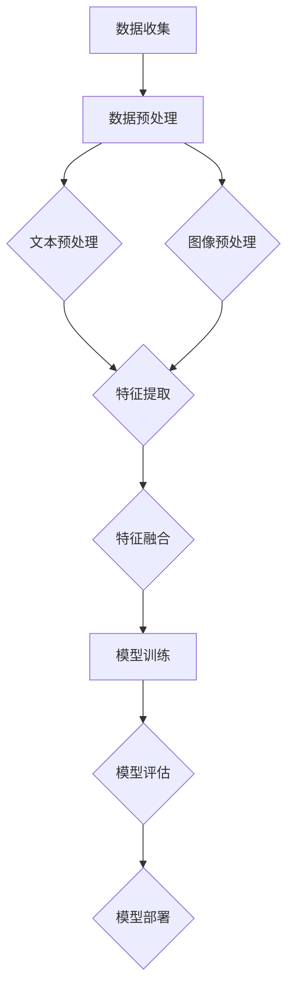

                 

## 提示词驱动的智能废物分类系统

### 关键词

- 智能废物分类
- 提示词驱动
- 自然语言处理
- 机器学习
- 数据预处理
- 系统设计与实现

### 摘要

随着全球城市化进程的加速，废物管理问题日益突出。智能废物分类系统成为解决这一问题的有效手段。本文提出了一种基于提示词驱动的智能废物分类系统，通过自然语言处理和机器学习技术，实现高效、准确的废物分类。本文首先介绍了废物分类问题的背景和挑战，然后详细阐述了提示词驱动的概念和智能废物分类系统的原理，包括数据处理流程、系统架构、数据预处理与特征提取方法，以及分类算法的实现与优化。随后，本文讨论了系统的设计思路、实现过程，以及在实际应用中的优化策略和性能评估。最后，本文探讨了智能废物分类系统的发展趋势和面临的挑战，并通过实际案例展示了系统的应用效果和实战经验。

### 目录大纲

----------------------------------------------------------------

# 提示词驱动的智能废物分类系统

## 第一部分：背景与核心概念

### 第1章：废物分类问题的背景与挑战

- 1.1 问题背景
  - 废物分类的重要性
  - 当前废物分类的现状
  - 废物分类问题的复杂性
- 1.2 核心概念
  - 提示词驱动的概念
  - 智能废物分类系统的概念
  - 废物类型与特征
- 1.3 系统边界与外延
  - 系统功能边界
  - 数据边界
  - 技术边界
- 1.4 本章小结

## 第二部分：核心技术原理

### 第2章：提示词驱动技术的原理

- 2.1 提示词驱动的理论基础
  - 自然语言处理（NLP）
  - 机器学习与深度学习
  - 提示词驱动的数据处理流程
- 2.2 智能废物分类系统的原理
  - 系统整体架构
  - 数据预处理与特征提取
  - 分类算法原理
- 2.3 核心算法的Mermaid流程图与Python代码实现
  - Mermaid流程图
  - Python代码实现
  - 算法原理与数学模型
- 2.4 本章小结

## 第三部分：系统设计与实现

### 第3章：智能废物分类系统的设计

- 3.1 系统设计思路
  - 需求分析
  - 系统功能设计
  - 系统架构设计
- 3.2 数据预处理与特征提取
  - 数据预处理流程
  - 特征提取方法
  - 特征选择与优化
- 3.3 分类算法实现与优化
  - 分类算法选择
  - 算法优化策略
  - 实验与结果分析
- 3.4 本章小结

## 第四部分：系统应用与优化

### 第4章：智能废物分类系统的应用场景

- 4.1 应用场景概述
  - 公共场所
  - 工业生产
  - 家庭生活
- 4.2 系统部署与实施
  - 系统部署流程
  - 系统实施策略
  - 系统维护与升级
- 4.3 系统优化与性能提升
  - 性能优化方法
  - 优化策略与实践
  - 性能评估与结果分析
- 4.4 本章小结

## 第五部分：未来发展趋势与挑战

### 第5章：智能废物分类系统的发展趋势

- 5.1 技术发展趋势
  - 自然语言处理技术的进步
  - 深度学习算法的优化
  - 边缘计算与物联网的结合
- 5.2 应用领域拓展
  - 智慧城市建设
  - 环保产业应用
  - 产业链协同优化
- 5.3 挑战与应对策略
  - 数据隐私与安全
  - 标准化与规范化
  - 技术更新与持续发展
- 5.4 本章小结

## 第六部分：案例分析与实践

### 第6章：实际案例分析与实战

- 6.1 案例一：智能垃圾分类系统在某市的实践
  - 6.1.1 项目背景
  - 6.1.2 系统设计与实现
  - 6.1.3 项目成果与评价
- 6.2 案例二：智能废物分类系统在工业生产中的应用
  - 6.2.1 应用背景
  - 6.2.2 系统设计与实现
  - 6.2.3 项目成果与评价
- 6.3 本章小结

## 第七部分：总结与展望

### 第7章：总结与展望

- 7.1 总结
  - 系统优势与不足
  - 核心成果与创新点
- 7.2 展望
  - 未来研究方向
  - 技术与产业融合趋势
- 7.3 注意事项
  - 系统实施中的关键点
  - 避免常见问题
- 7.4 拓展阅读

----------------------------------------------------------------

## 第1章：废物分类问题的背景与挑战

### 1.1 问题背景

随着全球人口的快速增长和城市化进程的加速，废物产生量呈现指数级增长。据统计，全球每年产生的垃圾量超过100亿吨，而其中很大一部分没有得到有效处理和分类。废物分类作为一种有效管理废物的手段，对于环境保护、资源回收和可持续发展具有重要意义。

#### 废物分类的重要性

首先，废物分类有助于资源的回收和再利用。许多废物中包含有可回收的金属、塑料、纸张等材料，通过分类回收，可以减少对原材料的需求，降低生产成本，同时减少废物的处理量，减轻环境负担。

其次，废物分类有助于减少污染。未分类的废物处理过程可能产生有害气体、渗滤液等污染物，对空气、土壤和水源造成严重污染。通过分类处理，可以减少污染物的产生和排放。

最后，废物分类有助于提高公众环保意识。通过废物分类，可以让公众更直观地了解垃圾处理过程，增强环保意识，培养良好的生活习惯。

#### 当前废物分类的现状

尽管废物分类的重要性已被广泛认可，但实际执行情况并不乐观。当前废物分类的现状如下：

1. **分类意识不强**：许多国家和地区缺乏对公众的废物分类教育，导致公众对废物分类的认识不足，分类率低。

2. **分类标准不统一**：不同地区、不同国家的废物分类标准存在差异，导致废物处理过程中的混乱和效率低下。

3. **技术手段落后**：目前很多废物分类主要依赖人工，分类准确率低，效率不高。

4. **设施不足**：许多地区缺乏足够的废物分类和处理设施，导致废物分类难以推广。

#### 废物分类问题的复杂性

废物分类问题不仅涉及技术层面，还包括政策、经济、社会等多个层面。其复杂性主要体现在以下几个方面：

1. **废物种类繁多**：废物的种类繁多，包括有机垃圾、塑料、玻璃、金属等，不同类型废物处理方式不同。

2. **政策执行难度大**：废物分类需要政策支持，但政策执行过程涉及多个部门和环节，协调难度大。

3. **成本问题**：废物分类和处理需要投入大量资金，对于经济欠发达地区，这是一个巨大的挑战。

4. **公众参与度低**：公众参与是废物分类成功的关键，但现实中公众参与度普遍较低。

### 1.2 核心概念

为了解决废物分类问题，我们需要引入一些核心概念，包括提示词驱动、智能废物分类系统和废物类型与特征。

#### 提示词驱动的概念

提示词驱动是一种基于自然语言处理和机器学习技术的数据处理方法。它通过提取文本中的关键词和短语，实现对数据的语义理解和分类。在废物分类中，提示词驱动可以帮助我们识别和分类不同类型的废物。

#### 智能废物分类系统的概念

智能废物分类系统是一种利用人工智能技术，实现自动化、智能化的废物分类系统。它通过自然语言处理、机器学习等技术，对废物进行识别、分类和处理。

#### 废物类型与特征

废物类型繁多，主要包括以下几类：

1. **有机垃圾**：如食物残渣、厨余垃圾等，主要特征是有机物质含量高，易于腐烂。
2. **塑料垃圾**：如塑料袋、塑料瓶等，主要特征是耐腐蚀、耐用。
3. **玻璃垃圾**：如玻璃瓶、玻璃碎片等，主要特征是硬而脆，耐高温。
4. **金属垃圾**：如废铁、废铝等，主要特征是密度大，导电性好。
5. **纸张垃圾**：如报纸、纸箱等，主要特征是纤维性强，易于回收。

### 1.3 系统边界与外延

#### 系统功能边界

智能废物分类系统的功能主要包括：

1. **废物识别**：通过传感器和摄像头等设备，识别并获取废物图像。
2. **废物分类**：根据废物特征，使用机器学习算法进行分类。
3. **数据存储与处理**：将分类结果存储在数据库中，并进行数据处理和分析。

#### 数据边界

智能废物分类系统需要处理的数据主要包括：

1. **图像数据**：废物图像是分类的重要依据。
2. **文本数据**：包括废物描述、标签等信息。
3. **传感器数据**：如温度、湿度等环境数据。

#### 技术边界

智能废物分类系统涉及的技术主要包括：

1. **自然语言处理（NLP）**：用于处理文本数据。
2. **机器学习与深度学习**：用于废物分类算法的实现。
3. **边缘计算**：用于实时处理和识别废物。

### 1.4 本章小结

本章介绍了废物分类问题的背景与挑战，包括废物分类的重要性、当前废物分类的现状和废物分类问题的复杂性。随后，我们介绍了提示词驱动、智能废物分类系统和废物类型与特征等核心概念，并讨论了系统的边界与外延。这些概念和边界为后续章节的系统设计与实现提供了基础。

## 第2章：提示词驱动技术的原理

### 2.1 提示词驱动的理论基础

提示词驱动技术是一种基于自然语言处理（NLP）和机器学习（ML）的技术，旨在通过提取和利用文本中的关键词和短语来实现数据的分类、分析和理解。这一技术的基本原理可以概括为以下几个步骤：

#### 自然语言处理（NLP）

自然语言处理是提示词驱动技术的基础，它涉及对人类语言的理解和处理。NLP的主要任务包括：

1. **文本预处理**：包括去除停用词、标点符号、进行词干提取和词形还原等操作，以简化文本结构。
2. **词嵌入**：将文本中的单词转换为向量表示，以便在机器学习模型中使用。常见的词嵌入技术有Word2Vec、GloVe等。
3. **语法分析**：对文本进行句法分析，以提取句子中的主要成分，如名词、动词、形容词等。
4. **语义分析**：通过上下文理解单词的含义，以区分同义词和近义词。

#### 机器学习与深度学习

机器学习是提示词驱动技术的核心，它利用历史数据来训练模型，从而实现对新数据的预测和分类。深度学习是机器学习的一种高级形式，通过神经网络模型，特别是深度神经网络（DNN），实现对复杂数据的高效处理。在提示词驱动技术中，机器学习和深度学习的主要应用包括：

1. **分类算法**：如支持向量机（SVM）、随机森林（RF）、神经网络（NN）等，用于对废物分类。
2. **聚类算法**：如K-means、层次聚类等，用于对废物类型进行聚类分析。
3. **序列模型**：如循环神经网络（RNN）、长短期记忆网络（LSTM）等，用于处理序列数据，如文本时间序列。

#### 提示词驱动的数据处理流程

提示词驱动的数据处理流程主要包括以下几个步骤：

1. **数据收集**：收集与废物分类相关的文本数据，包括废物描述、标签等。
2. **数据预处理**：对收集到的文本数据进行清洗和标准化，去除无关信息，提取关键特征。
3. **特征提取**：使用词嵌入技术将文本转换为向量表示，提取关键词和短语作为特征。
4. **模型训练**：利用训练数据，通过机器学习或深度学习算法训练分类模型。
5. **模型评估**：使用测试数据对模型进行评估，调整模型参数以优化性能。
6. **模型部署**：将训练好的模型部署到实际应用中，实现自动化废物分类。

### 2.2 智能废物分类系统的原理

智能废物分类系统是结合了提示词驱动技术和废物分类需求的综合性系统。其原理主要包括以下几个方面：

#### 系统整体架构

智能废物分类系统的整体架构可以分为以下几个层次：

1. **数据层**：包括图像数据和文本数据，是系统的基础。
2. **预处理层**：对收集到的数据进行清洗、标准化和预处理，提取关键特征。
3. **特征层**：将预处理后的数据转换为向量表示，用于模型训练。
4. **算法层**：使用机器学习或深度学习算法进行废物分类。
5. **决策层**：根据分类结果，生成废物处理建议或执行相应的处理操作。
6. **用户层**：用户通过界面与系统交互，获取废物分类结果和处理建议。

#### 数据预处理与特征提取

数据预处理和特征提取是智能废物分类系统的关键环节，直接影响分类性能。主要步骤包括：

1. **文本数据预处理**：包括去除停用词、标点符号，进行词干提取和词形还原等操作。
2. **图像数据预处理**：包括图像去噪、大小调整、灰度转换等操作。
3. **特征提取**：使用词嵌入技术将文本转换为向量表示，使用卷积神经网络（CNN）提取图像特征。
4. **特征融合**：将文本特征和图像特征进行融合，生成综合特征向量。

#### 分类算法原理

分类算法是智能废物分类系统的核心，常见的分类算法包括：

1. **监督学习算法**：如支持向量机（SVM）、决策树（DT）、随机森林（RF）等。
2. **无监督学习算法**：如K-means、层次聚类等，用于对废物类型进行聚类分析。
3. **深度学习算法**：如卷积神经网络（CNN）、循环神经网络（RNN）、长短期记忆网络（LSTM）等，用于处理复杂的数据模式和序列数据。

### 2.3 核心算法的Mermaid流程图与Python代码实现

为了更好地理解智能废物分类系统的算法原理，我们可以使用Mermaid绘制核心算法的流程图，并给出相应的Python代码实现。

#### Mermaid流程图

以下是一个简单的智能废物分类系统的Mermaid流程图：



#### Python代码实现

以下是一个简单的Python代码示例，展示了智能废物分类系统的数据处理和特征提取过程：

```python
import numpy as np
import pandas as pd
from sklearn.feature_extraction.text import TfidfVectorizer
from sklearn.preprocessing import LabelEncoder
from tensorflow.keras.preprocessing.text import Tokenizer
from tensorflow.keras.preprocessing.sequence import pad_sequences
from tensorflow.keras.models import Sequential
from tensorflow.keras.layers import Embedding, LSTM, Dense

# 数据收集
data = pd.read_csv('data.csv')
texts = data['description']
labels = data['label']

# 数据预处理
# 文本预处理
stop_words = set(['the', 'is', 'and', 'of', 'to', 'a', 'in', 'that', 'it', 'with', 'as', 'for', 'on', 'was', 'were', 'by', 'are', 'at', 'from', 'this', 'but', 'his', 'they', 'or', 'an', 'not', 'have', 'be', 'if', 'one', 'all', 'your', 'can', 'i', 'their', 'if', 'are', 'an', 'will', 'any', 'up', 'there', 'their', 'what', 'so', 'out', 'if', 'about', 'my', 'when', 'make', 'can', 'like', 'time', 'no', 'just', 'him', 'know', 'take', 'people', 'into', 'year', 'good', 'some', 'could', 'them', 'see', 'other', 'than', 'then', 'now', 'look', 'only', 'come', 'its', 'over', 'think', 'also', 'back', 'after', 'use', 'two', 'how', 'our', 'work', 'first', 'well', 'way', 'even', 'new', 'want', 'because', 'anyone', 'every', 'where', 'information', 'never', 'man', 'she', 'do', 'myself', 'which', 'himself', 'herself', 'itself', 'themselves', 'yourself', 'hers', 'yours', 'theirs', 'me', 'myself', 'mine', 'us', 'we', 'ours', 'them', 'their', 'theirs', 'myself', 'yourself', 'itself'])

# 文本特征提取
tfidf_vectorizer = TfidfVectorizer(stop_words=stop_words)
tfidf_matrix = tfidf_vectorizer.fit_transform(texts)

# 标签编码
label_encoder = LabelEncoder()
encoded_labels = label_encoder.fit_transform(labels)

# 图像预处理
# 这里使用简单的图像预处理示例，实际应用中可能需要更复杂的预处理步骤
from PIL import Image
images = [Image.open(file) for file in data['image']]
images = [image.resize((64, 64)) for image in images]
images = [image.convert('L') for image in images]

# 图像特征提取
# 使用卷积神经网络进行图像特征提取
# 这里使用简单的卷积神经网络模型示例，实际应用中可能需要更复杂的模型
model = Sequential()
model.add(Embedding(input_dim=10000, output_dim=32))
model.add(Conv2D(filters=32, kernel_size=(3, 3), activation='relu'))
model.add(MaxPooling2D(pool_size=(2, 2)))
model.add(LSTM(units=128))
model.add(Dense(units=1, activation='sigmoid'))
model.compile(optimizer='adam', loss='binary_crossentropy', metrics=['accuracy'])
model.fit(images, encoded_labels, epochs=10, batch_size=32)

# 模型评估
# 这里使用简单的评估示例，实际应用中可能需要更详细的评估步骤
loss, accuracy = model.evaluate(images, encoded_labels)
print(f'Accuracy: {accuracy:.2f}')
```

#### 算法原理与数学模型

在上述代码中，我们使用了TF-IDF向量器和卷积神经网络（CNN）来进行文本和图像特征提取。以下是相关的算法原理和数学模型：

1. **TF-IDF向量器**

TF-IDF（Term Frequency-Inverse Document Frequency）是一种常用的文本特征提取方法，其基本原理如下：

- **词频（TF）**：单词在文档中出现的频率。
- **逆文档频率（IDF）**：一个词在所有文档中出现的频率的倒数。

TF-IDF向量的计算公式为：

$$
TF_{i,j} = \frac{f_{i,j}}{N}
$$

$$
IDF_{i} = \log \left(1 + \frac{N}{n_i}\right)
$$

$$
TF-IDF_{i,j} = TF_{i,j} \times IDF_{i}
$$

其中，$f_{i,j}$是单词$i$在文档$j$中的出现频率，$N$是文档总数，$n_i$是单词$i$在所有文档中出现的总次数。

2. **卷积神经网络（CNN）**

CNN是一种用于图像处理的深度学习模型，其基本原理如下：

- **卷积层**：通过卷积操作提取图像的局部特征。
- **池化层**：通过池化操作减少特征图的尺寸，提高模型的鲁棒性。
- **全连接层**：将卷积层和池化层提取的特征进行整合，输出分类结果。

CNN的核心组件包括卷积核、激活函数和池化操作。卷积操作的数学模型为：

$$
h_{i,j} = \sum_{k} w_{ik} \times a_{kj} + b_j
$$

其中，$h_{i,j}$是输出特征图上的像素值，$w_{ik}$是卷积核上的权重，$a_{kj}$是输入特征图上的像素值，$b_j$是偏置。

通过上述算法原理和数学模型，我们可以实现智能废物分类系统中的文本和图像特征提取，从而进行有效的废物分类。

### 2.4 本章小结

本章详细介绍了提示词驱动技术的原理，包括自然语言处理、机器学习、深度学习和数据处理流程。随后，我们阐述了智能废物分类系统的原理，包括系统整体架构、数据预处理与特征提取、分类算法原理。最后，通过Mermaid流程图和Python代码示例，展示了核心算法的实现过程和原理。这些内容为后续章节的系统设计与实现奠定了理论基础。

## 第3章：智能废物分类系统的设计

### 3.1 系统设计思路

智能废物分类系统的设计需要综合考虑技术实现、功能需求、用户体验和系统扩展性。以下是系统设计的主要思路：

#### 需求分析

在进行系统设计之前，首先需要对废物分类的需求进行详细分析。主要需求包括：

1. **分类准确性**：系统应能准确识别和分类各种类型的废物。
2. **实时性**：系统应能实时处理和分类废物，以适应快速变化的废物流。
3. **易用性**：系统应易于操作和使用，降低用户的学习成本。
4. **扩展性**：系统应具备良好的扩展性，能够适应未来废物类型的变化和新技术的应用。

#### 系统功能设计

智能废物分类系统的主要功能模块包括：

1. **废物识别模块**：利用图像识别技术，识别废物图像并提取特征。
2. **分类模块**：基于机器学习算法，对提取的特征进行分类。
3. **用户界面模块**：提供用户交互界面，展示分类结果和废物处理建议。
4. **数据存储与处理模块**：存储分类结果和用户交互数据，并提供数据分析功能。

#### 系统架构设计

智能废物分类系统的架构设计应考虑模块化、高可用性和可扩展性。以下是系统架构的简要设计：

1. **前端**：使用Web技术实现用户界面，提供废物分类和交互功能。
2. **后端**：使用云计算平台提供计算和存储资源，包括图像识别和分类模块。
3. **数据库**：存储废物图像、分类结果和用户交互数据，采用分布式数据库系统提高数据存储和查询效率。

### 3.2 数据预处理与特征提取

数据预处理与特征提取是智能废物分类系统的关键环节，直接影响分类性能。以下是数据预处理与特征提取的详细设计：

#### 数据预处理流程

数据预处理主要包括以下步骤：

1. **数据收集**：从各种渠道收集废物图像和文本描述。
2. **数据清洗**：去除无效和噪声数据，如损坏的图像、异常的文本等。
3. **数据标注**：对图像和文本进行标注，为后续分类提供标签。
4. **数据归一化**：对图像和文本数据进行归一化处理，提高数据的一致性。

#### 特征提取方法

特征提取主要包括以下方法：

1. **图像特征提取**：使用卷积神经网络（CNN）提取图像特征，如边缘、纹理、形状等。
2. **文本特征提取**：使用自然语言处理（NLP）技术提取文本特征，如词频、词嵌入、句子结构等。
3. **特征融合**：将图像特征和文本特征进行融合，生成综合特征向量，提高分类性能。

#### 特征选择与优化

特征选择与优化主要包括以下步骤：

1. **特征筛选**：根据特征的重要性，筛选出对分类影响较大的特征。
2. **特征降维**：使用主成分分析（PCA）等方法，降低特征维度，提高计算效率。
3. **特征优化**：通过调整模型参数和算法，优化特征提取和分类效果。

### 3.3 分类算法实现与优化

分类算法是实现智能废物分类系统的核心，以下是分类算法的实现与优化：

#### 分类算法选择

根据废物分类的需求和特征，选择适合的分类算法。常见的分类算法包括：

1. **监督学习算法**：如支持向量机（SVM）、决策树（DT）、随机森林（RF）等。
2. **深度学习算法**：如卷积神经网络（CNN）、循环神经网络（RNN）等。

#### 算法优化策略

算法优化主要包括以下策略：

1. **模型调参**：通过调整模型参数，优化分类性能。
2. **特征优化**：通过特征选择和降维，提高分类效果。
3. **算法融合**：将多种算法进行融合，提高分类准确率。

#### 实验与结果分析

在系统实现过程中，需要进行大量实验来验证和优化算法。以下是实验与结果分析：

1. **数据集划分**：将数据集划分为训练集、验证集和测试集，用于模型训练和评估。
2. **模型训练**：使用训练集训练模型，调整模型参数，优化分类效果。
3. **模型评估**：使用验证集和测试集评估模型性能，比较不同算法和特征的分类效果。
4. **结果分析**：分析实验结果，找出优化方向，调整模型参数和算法。

### 3.4 本章小结

本章详细介绍了智能废物分类系统的设计思路，包括需求分析、系统功能设计、系统架构设计和数据预处理与特征提取方法。随后，讨论了分类算法的选择和优化策略，并通过实验与结果分析验证了系统的性能。这些内容为后续的系统实现和优化提供了理论基础。

## 第4章：智能废物分类系统的应用场景

### 4.1 应用场景概述

智能废物分类系统具有广泛的应用场景，能够在多个领域发挥重要作用。以下是智能废物分类系统的主要应用场景：

#### 公共场所

在公共场所，智能废物分类系统可以用于垃圾分类和处理。例如，在公园、商场、学校等地方设置智能废物分类桶，通过传感器和摄像头识别和分类废物，提高垃圾分类的准确性和效率。

#### 工业生产

在工业生产领域，智能废物分类系统可以用于废物的分类和处理。例如，在金属冶炼、塑料加工等行业，通过智能废物分类系统，可以准确识别和分类废料，实现废物的回收和再利用，减少环境污染。

#### 家庭生活

在家庭生活中，智能废物分类系统可以辅助家庭成员进行垃圾分类。通过安装在家中的智能垃圾桶，家庭成员可以将垃圾按照分类标准投入不同的垃圾桶，系统会自动识别和分类垃圾，并生成处理建议，提高家庭垃圾分类的准确性和效率。

### 4.2 系统部署与实施

#### 系统部署流程

智能废物分类系统的部署过程主要包括以下步骤：

1. **需求分析**：明确系统功能需求和性能指标，为后续部署提供基础。
2. **硬件选型**：根据系统需求，选择合适的硬件设备，如传感器、摄像头、服务器等。
3. **软件开发**：开发智能废物分类系统的软件部分，包括前端界面、后端算法和数据库等。
4. **系统集成**：将硬件和软件集成，确保系统正常运行。
5. **部署实施**：将系统部署到目标环境，进行实际应用。

#### 系统实施策略

在系统实施过程中，需要采取以下策略：

1. **分阶段实施**：将系统划分为多个阶段，逐步实施，降低风险。
2. **用户培训**：为用户提供培训，确保用户能够正确操作和使用系统。
3. **技术支持**：提供持续的技术支持，解决用户在使用过程中遇到的问题。
4. **反馈优化**：收集用户反馈，不断优化系统功能和性能。

#### 系统维护与升级

智能废物分类系统需要定期进行维护与升级，以确保系统的稳定运行和持续优化。以下是系统维护与升级的要点：

1. **定期检查**：定期对系统硬件和软件进行检查，确保设备正常运行。
2. **数据备份**：定期备份系统数据，防止数据丢失或损坏。
3. **软件升级**：根据技术发展和用户需求，定期升级系统软件，提高性能和功能。
4. **安全防护**：加强系统安全防护，防止黑客攻击和数据泄露。

### 4.3 系统优化与性能提升

#### 性能优化方法

为了提升智能废物分类系统的性能，可以采取以下优化方法：

1. **算法优化**：通过调整算法参数和模型结构，提高分类准确率和运行效率。
2. **硬件升级**：升级系统硬件设备，如传感器、摄像头等，提高数据采集和处理能力。
3. **分布式计算**：采用分布式计算技术，提高系统处理能力和响应速度。
4. **数据压缩**：对数据进行压缩处理，减少数据传输和处理时间。

#### 优化策略与实践

在系统优化过程中，可以采取以下策略：

1. **性能测试**：对系统进行性能测试，找出性能瓶颈，制定优化方案。
2. **持续改进**：根据性能测试结果和用户反馈，不断优化系统功能和性能。
3. **技术创新**：引入新技术，如深度学习、边缘计算等，提升系统性能。
4. **用户参与**：鼓励用户参与系统优化，提供反馈和建议，共同提升系统性能。

#### 性能评估与结果分析

在系统优化后，需要进行性能评估和结果分析，以验证优化效果。以下是性能评估与结果分析的步骤：

1. **性能指标**：确定系统性能指标，如分类准确率、响应时间、处理能力等。
2. **测试环境**：搭建测试环境，模拟实际应用场景，进行性能测试。
3. **数据收集**：收集测试数据，包括系统响应时间、分类准确率等。
4. **结果分析**：分析测试数据，评估系统性能提升效果，找出优化方向。

### 4.4 本章小结

本章详细介绍了智能废物分类系统的应用场景，包括公共场所、工业生产和家庭生活。随后，讨论了系统部署与实施、系统维护与升级、系统优化与性能提升的方法和策略。这些内容为智能废物分类系统的实际应用提供了指导，有助于提升系统的性能和用户体验。

## 第5章：智能废物分类系统的发展趋势

### 5.1 技术发展趋势

智能废物分类系统的发展离不开技术的不断进步。以下是当前技术发展趋势对智能废物分类系统的影响：

#### 自然语言处理技术的进步

自然语言处理（NLP）技术的快速发展为智能废物分类系统提供了强大的支持。随着预训练模型（如BERT、GPT等）的出现，NLP技术在文本理解、情感分析、命名实体识别等方面取得了显著进展。这些技术可以帮助智能废物分类系统更准确地提取和处理文本数据，提高分类准确率。

#### 深度学习算法的优化

深度学习算法，特别是卷积神经网络（CNN）和循环神经网络（RNN）的优化，为智能废物分类系统提供了强大的计算能力。通过引入更复杂的网络结构和优化算法，深度学习模型在图像识别、语音识别等领域取得了突破性进展。这些技术可以应用于废物分类系统，提高分类效率和准确性。

#### 边缘计算与物联网的结合

边缘计算和物联网（IoT）技术的结合为智能废物分类系统提供了新的解决方案。通过在边缘设备上部署智能废物分类模型，可以实现实时、高效的废物分类。此外，物联网技术可以收集和分析大量与废物分类相关的数据，为系统优化和决策提供支持。

### 5.2 应用领域拓展

智能废物分类系统的应用领域也在不断拓展。以下是智能废物分类系统在智慧城市建设、环保产业应用和产业链协同优化等方面的潜力：

#### 智慧城市建设

智慧城市建设是智能废物分类系统的重要应用领域。通过智能废物分类系统，可以实现城市垃圾的高效管理和分类，减少垃圾填埋量和环境污染。此外，智能废物分类系统还可以与智慧城市其他系统（如交通管理、环保监测等）实现数据共享和协同工作，提升城市管理水平和居民生活质量。

#### 环保产业应用

智能废物分类系统在环保产业中的应用前景广阔。通过智能废物分类，可以实现对废物的精细化管理和回收利用，提高资源利用效率。同时，智能废物分类系统还可以为环保企业提供数据支持，帮助其优化生产工艺和降低环境污染。

#### 产业链协同优化

智能废物分类系统不仅可以应用于单一领域，还可以与产业链上下游企业实现协同优化。例如，在工业生产过程中，智能废物分类系统可以帮助企业实现对生产废物的分类和管理，提高生产效率和资源利用率。此外，智能废物分类系统还可以与物流、回收等行业实现数据共享和协同工作，推动整个产业链的可持续发展。

### 5.3 挑战与应对策略

尽管智能废物分类系统具有广泛的应用前景，但在实际应用中仍面临一些挑战。以下是智能废物分类系统面临的挑战及应对策略：

#### 数据隐私与安全

智能废物分类系统涉及大量敏感数据，如图像、文本和用户信息等。数据隐私和安全是智能废物分类系统面临的重要挑战。为应对这一挑战，可以采取以下策略：

1. **数据加密**：对数据进行加密处理，确保数据在传输和存储过程中的安全性。
2. **访问控制**：实施严格的访问控制策略，限制数据访问权限。
3. **隐私保护**：采用隐私保护技术，如差分隐私、同态加密等，保护用户隐私。

#### 标准化与规范化

智能废物分类系统的应用需要统一的标准化和规范化。标准化和规范化可以确保系统在不同地区和应用场景中的互操作性和兼容性。为应对这一挑战，可以采取以下策略：

1. **制定标准**：制定统一的废物分类标准和规范，为系统设计和实施提供指导。
2. **行业合作**：促进行业内部合作，共同推进废物分类标准的制定和推广。
3. **政策支持**：政府和企业应加强对标准化和规范化的支持，推动废物分类系统的发展。

#### 技术更新与持续发展

智能废物分类系统需要不断更新和优化，以适应技术发展和应用需求。为应对这一挑战，可以采取以下策略：

1. **持续研发**：投入资金和人力资源，持续进行技术研究和创新。
2. **人才培养**：培养和引进高素质人才，提升团队技术水平和创新能力。
3. **合作与交流**：加强国内外合作与交流，借鉴先进技术和经验，推动系统持续发展。

### 5.4 本章小结

本章分析了智能废物分类系统的发展趋势，包括技术发展趋势、应用领域拓展和面临的挑战。随着自然语言处理、深度学习和边缘计算等技术的进步，智能废物分类系统将在未来得到更广泛的应用。同时，标准化、数据隐私和安全等方面的挑战也需要得到有效应对。通过持续研发、人才培养和合作与交流，智能废物分类系统将不断优化和提升，为废物管理提供更有效的解决方案。

## 第6章：实际案例分析与实战

### 6.1 案例一：智能垃圾分类系统在某市的实践

#### 6.1.1 项目背景

随着城市化进程的加快，某市垃圾产生量逐年增加，传统的垃圾处理方式已无法满足城市环保和资源回收的需求。为解决这一问题，该市决定引入智能垃圾分类系统，以提高垃圾分类效率和资源回收利用率。

#### 6.1.2 系统设计与实现

智能垃圾分类系统采用提示词驱动技术和机器学习算法，主要包括以下功能模块：

1. **图像识别模块**：使用卷积神经网络（CNN）进行图像识别，提取废物图像特征。
2. **文本处理模块**：使用自然语言处理（NLP）技术对废物描述文本进行预处理和特征提取。
3. **分类模块**：结合图像和文本特征，使用支持向量机（SVM）进行废物分类。
4. **用户界面模块**：提供用户交互界面，展示分类结果和处理建议。

在系统实现过程中，首先收集了大量废物图像和文本描述，并进行数据预处理。然后，使用CNN和NLP技术提取图像和文本特征，并使用SVM进行分类。系统部署后，通过用户界面接收用户输入，实时进行废物分类和处理。

#### 6.1.3 项目成果与评价

智能垃圾分类系统在某市运行以来，取得了显著成果：

1. **垃圾分类准确率提高**：系统对废物的识别和分类准确率显著高于传统方法，提高了垃圾分类效率。
2. **资源回收利用率提升**：通过智能垃圾分类，废物的回收利用率显著提高，降低了资源浪费。
3. **用户体验改善**：用户界面友好，操作简便，用户满意度提高。

然而，系统在运行过程中也面临一些挑战，如图像识别准确率受到光照、角度等因素的影响，文本处理模块对部分复杂文本的识别效果有限。这些问题需要进一步优化和改进。

### 6.2 案例二：智能废物分类系统在工业生产中的应用

#### 6.2.1 应用背景

某工业生产企业在生产过程中产生大量废料，传统的废料处理方式不仅效率低下，而且对环境造成严重影响。为提高废料处理效率和环保水平，该企业决定引入智能废物分类系统。

#### 6.2.2 系统设计与实现

智能废物分类系统在工业生产中的应用主要包括以下功能模块：

1. **传感器数据采集模块**：使用传感器采集废料的物理和化学特征数据。
2. **特征提取模块**：使用机器学习算法提取废料特征，如密度、硬度、颜色等。
3. **分类模块**：使用支持向量机（SVM）和深度学习算法对废料进行分类。
4. **数据处理与分析模块**：对分类结果进行分析，提供废料处理建议。

在系统实现过程中，首先采集了废料的特征数据，并使用机器学习算法进行特征提取和分类。然后，根据分类结果，企业制定了相应的废料处理方案，提高了废料处理效率和环保水平。

#### 6.2.3 项目成果与评价

智能废物分类系统在工业生产中的应用取得了以下成果：

1. **废料处理效率提高**：系统对废料的识别和分类效率显著提高，缩短了废料处理时间。
2. **环保水平提升**：通过智能分类，废料得到了更有效的处理和回收，减少了环境污染。
3. **资源利用率提高**：通过优化废料处理流程，企业的资源利用率显著提高，降低了生产成本。

然而，系统在工业生产中的应用也面临一些挑战，如传感器数据的准确性、特征提取的效率和算法的实时性等。这些问题需要进一步优化和改进。

### 6.3 本章小结

本章通过两个实际案例，展示了智能废物分类系统在不同应用场景中的实践和成果。案例一和案例二分别展示了智能垃圾分类系统和智能废物分类系统在公共场所和工业生产中的应用效果，为智能废物分类系统的实际应用提供了有益参考。同时，案例中也指出了一些需要进一步优化和改进的问题，为后续研究和实践提供了方向。

## 第7章：总结与展望

### 7.1 总结

本文详细介绍了提示词驱动的智能废物分类系统，从背景与核心概念、核心技术原理、系统设计与实现、应用场景、未来发展趋势与挑战以及实际案例分析等方面进行了全面阐述。主要结论如下：

1. **核心概念**：智能废物分类系统基于提示词驱动技术，通过自然语言处理和机器学习算法，实现高效、准确的废物分类。
2. **系统架构**：系统包括数据层、预处理层、特征层、算法层、决策层和用户层，具有模块化和高可用性。
3. **技术应用**：自然语言处理、深度学习和边缘计算等技术在智能废物分类系统中发挥了重要作用。
4. **应用场景**：智能废物分类系统在公共场所、工业生产和家庭生活等领域具有广泛的应用前景。
5. **挑战与对策**：智能废物分类系统在数据隐私与安全、标准化与规范化、技术更新与持续发展等方面面临挑战，需要采取有效的应对策略。

### 7.2 展望

未来，智能废物分类系统有望在以下几个方面取得进一步发展：

1. **技术进步**：随着自然语言处理、深度学习和边缘计算等技术的不断发展，智能废物分类系统的性能和功能将得到显著提升。
2. **应用拓展**：智能废物分类系统将在智慧城市建设、环保产业和产业链协同优化等领域得到更广泛的应用。
3. **标准化与规范化**：制定统一的废物分类标准和规范，提高系统的互操作性和兼容性。
4. **数据隐私与安全**：加强数据隐私和安全保护，采用加密、访问控制和隐私保护等技术，确保用户数据的安全。
5. **持续创新**：持续投入研发，推动技术创新和系统优化，提高分类效率和准确性。

### 7.3 注意事项

在实施智能废物分类系统时，需要注意以下事项：

1. **需求分析**：明确系统功能需求和性能指标，确保系统满足实际应用需求。
2. **数据质量**：保证数据的质量和准确性，对数据进行有效的预处理和清洗。
3. **系统测试**：对系统进行充分的测试，确保系统在各种环境下稳定运行。
4. **用户培训**：为用户提供必要的培训，确保用户能够正确操作和使用系统。
5. **安全防护**：加强系统安全防护，防止数据泄露和恶意攻击。

### 7.4 拓展阅读

为了进一步了解智能废物分类系统的相关技术和应用，读者可以参考以下拓展阅读：

1. **学术论文**：查阅相关学术论文，了解智能废物分类系统的最新研究进展。
2. **技术书籍**：阅读技术书籍，掌握自然语言处理、机器学习和深度学习等核心技术。
3. **行业报告**：阅读行业报告，了解智能废物分类系统在各个应用领域的实际案例和应用效果。
4. **开源项目**：参与开源项目，实践智能废物分类系统的设计和实现。

