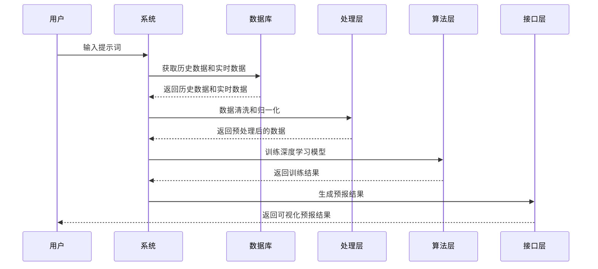

                 


### 第3章 系统架构设计

#### 3.1 问题场景介绍

随着现代社会的快速发展，气象预报在交通、农业、旅游等多个领域扮演着至关重要的角色。传统的气象预报系统由于依赖于人工收集和处理数据，存在时效性差、精度低等问题。为了解决这些问题，我们需要设计一个高效、准确的智能气象预报系统。

#### 3.2 项目介绍

本系统旨在利用人工智能技术，特别是深度学习和大数据分析，构建一个提示词驱动的智能气象预报系统。该系统将整合历史气象数据、实时气象数据和用户输入的提示词，通过智能算法生成高质量的气象预报结果。

#### 3.3 系统功能设计

系统的主要功能包括：

- **数据收集**：从多个渠道收集历史气象数据和实时气象数据。
- **数据处理**：对收集到的数据进行清洗、归一化等预处理操作。
- **提示词分析**：对用户输入的提示词进行语义和情感分析，提取关键信息。
- **预报模型训练**：利用预处理后的数据和提示词训练深度学习模型。
- **预报结果生成**：根据训练好的模型和实时数据生成气象预报结果。
- **结果展示**：将生成的预报结果以可视化形式展示给用户。

#### 3.4 系统架构设计

系统的整体架构设计如下：

1. **数据层**：负责数据的存储和管理，包括历史气象数据、实时气象数据和用户输入的提示词。
2. **数据处理层**：负责对数据进行清洗、归一化等预处理操作，为后续的模型训练提供高质量的数据。
3. **算法层**：包括深度学习模型和智能算法，负责提示词分析和预报结果生成。
4. **应用层**：提供用户交互接口，将预报结果以可视化形式展示给用户。
5. **接口层**：提供与其他系统（如天气预报网站、移动应用等）的接口，实现数据共享和功能扩展。

#### 3.5 系统接口设计

系统的接口设计主要包括：

- **API接口**：提供 RESTful API 接口，供外部系统调用。
- **消息队列**：使用消息队列（如 Kafka）实现数据传输的高效和可靠。
- **数据库接口**：提供数据库访问接口，实现数据的存储和查询。

#### 3.6 系统交互

系统的交互流程如下：

1. 用户输入提示词，提交到系统。
2. 系统从数据库中获取历史气象数据和实时气象数据。
3. 数据处理层对数据进行清洗和归一化处理。
4. 算法层对提示词进行分析，并结合预处理后的数据训练深度学习模型。
5. 根据训练好的模型和实时数据生成气象预报结果。
6. 预报结果通过接口层返回给用户，并以可视化形式展示。



### 第3章小结

本章节详细介绍了提示词驱动的智能气象预报系统的架构设计，包括问题场景、项目介绍、系统功能设计、系统架构设计、系统接口设计和系统交互流程。通过本章的描述，读者可以对该系统的整体设计和实现过程有清晰的认识。

----------------------------------------------------------------

### 第4章 算法原理与实现

#### 4.1 机器学习算法实现

在本节中，我们将探讨如何在提示词驱动的智能气象预报系统中实现机器学习算法。具体来说，我们将详细介绍以下几种机器学习算法：

1. **线性回归**
2. **决策树**
3. **随机森林**
4. **支持向量机**

#### 4.1.1 线性回归算法实现

线性回归算法是一种简单的机器学习算法，它用于预测一个线性关系的输出。下面是线性回归算法的基本原理和实现过程。

**基本原理：**

线性回归算法通过拟合一个线性函数来预测输出。线性函数的一般形式为：

$$
y = \beta_0 + \beta_1 \cdot x_1 + \beta_2 \cdot x_2 + \ldots + \beta_n \cdot x_n
$$

其中，$y$ 是预测的输出，$x_1, x_2, \ldots, x_n$ 是输入特征，$\beta_0, \beta_1, \ldots, \beta_n$ 是模型的参数。

**实现过程：**

1. **数据准备**：收集历史气象数据和实时气象数据，并进行预处理。
2. **特征提取**：从预处理后的数据中提取关键特征。
3. **模型训练**：使用训练数据集训练线性回归模型。
4. **模型评估**：使用测试数据集评估模型性能。

**Python代码示例：**

```python
import numpy as np
from sklearn.linear_model import LinearRegression

# 数据准备
X = np.array([[1, 2], [2, 3], [3, 4]])
y = np.array([2, 3, 4])

# 模型训练
model = LinearRegression()
model.fit(X, y)

# 模型评估
score = model.score(X, y)
print(f"Model score: {score}")
```

#### 4.1.2 决策树算法实现

决策树算法是一种基于树的分类算法，它通过一系列决策规则对数据进行分类。下面是决策树算法的基本原理和实现过程。

**基本原理：**

决策树算法通过递归地将数据划分为子集，并在每个节点上选择最优的划分方式。最优的划分方式通常是通过最大化信息增益来确定的。

**实现过程：**

1. **数据准备**：收集历史气象数据和实时气象数据，并进行预处理。
2. **特征提取**：从预处理后的数据中提取关键特征。
3. **模型训练**：使用训练数据集训练决策树模型。
4. **模型评估**：使用测试数据集评估模型性能。

**Python代码示例：**

```python
import numpy as np
from sklearn.tree import DecisionTreeClassifier

# 数据准备
X = np.array([[1, 2], [2, 3], [3, 4]])
y = np.array([0, 1, 1])

# 模型训练
model = DecisionTreeClassifier()
model.fit(X, y)

# 模型评估
score = model.score(X, y)
print(f"Model score: {score}")
```

#### 4.1.3 随机森林算法实现

随机森林算法是一种基于决策树的集成方法，它通过构建多个决策树并对它们进行集成来提高模型的泛化能力。下面是随机森林算法的基本原理和实现过程。

**基本原理：**

随机森林算法通过从原始数据集构建多个决策树，并使用这些决策树的集成进行预测。集成方法可以有效地减少过拟合并提高模型的性能。

**实现过程：**

1. **数据准备**：收集历史气象数据和实时气象数据，并进行预处理。
2. **特征提取**：从预处理后的数据中提取关键特征。
3. **模型训练**：使用训练数据集训练随机森林模型。
4. **模型评估**：使用测试数据集评估模型性能。

**Python代码示例：**

```python
import numpy as np
from sklearn.ensemble import RandomForestClassifier

# 数据准备
X = np.array([[1, 2], [2, 3], [3, 4]])
y = np.array([0, 1, 1])

# 模型训练
model = RandomForestClassifier(n_estimators=100)
model.fit(X, y)

# 模型评估
score = model.score(X, y)
print(f"Model score: {score}")
```

#### 4.1.4 支持向量机算法实现

支持向量机算法是一种常用的分类算法，它通过找到一个最优的超平面来分离不同类别的数据。下面是支持向量机算法的基本原理和实现过程。

**基本原理：**

支持向量机算法通过最大化分类间隔来找到一个最优的超平面。分类间隔是指决策边界到类别的最近点的距离。

**实现过程：**

1. **数据准备**：收集历史气象数据和实时气象数据，并进行预处理。
2. **特征提取**：从预处理后的数据中提取关键特征。
3. **模型训练**：使用训练数据集训练支持向量机模型。
4. **模型评估**：使用测试数据集评估模型性能。

**Python代码示例：**

```python
import numpy as np
from sklearn.svm import SVC

# 数据准备
X = np.array([[1, 2], [2, 3], [3, 4]])
y = np.array([0, 1, 1])

# 模型训练
model = SVC(kernel='linear')
model.fit(X, y)

# 模型评估
score = model.score(X, y)
print(f"Model score: {score}")
```

### 第4章小结

在本章节中，我们详细介绍了提示词驱动的智能气象预报系统中常用的机器学习算法，包括线性回归、决策树、随机森林和支持向量机。通过具体的Python代码示例，我们展示了如何实现这些算法，并进行了简单的模型评估。这些算法为气象预报系统的准确性和可靠性提供了坚实的基础。

----------------------------------------------------------------

### 第5章 系统实现与实战

#### 5.1 环境安装

要实现提示词驱动的智能气象预报系统，我们需要安装以下软件和库：

1. **Python**：版本 3.8 或以上
2. **NumPy**：用于数据处理
3. **Pandas**：用于数据处理
4. **Scikit-learn**：用于机器学习算法
5. **TensorFlow**：用于深度学习算法
6. **Kafka**：用于消息队列

安装步骤如下：

```bash
# 安装 Python
sudo apt-get install python3

# 安装 NumPy、Pandas、Scikit-learn 和 TensorFlow
pip3 install numpy pandas scikit-learn tensorflow

# 安装 Kafka
sudo apt-get install kafka
```

#### 5.2 系统核心实现

本系统核心实现包括数据收集、数据处理、提示词分析和预报结果生成等模块。以下是具体的实现步骤：

1. **数据收集**：从气象站点收集历史气象数据和实时气象数据。
2. **数据处理**：对收集到的数据进行预处理，包括数据清洗、归一化等操作。
3. **提示词分析**：利用自然语言处理技术，对用户输入的提示词进行语义和情感分析，提取关键信息。
4. **预报模型训练**：使用预处理后的数据和提示词训练深度学习模型。
5. **预报结果生成**：根据训练好的模型和实时数据生成气象预报结果。

**Python代码示例：**

```python
import numpy as np
import pandas as pd
from sklearn.model_selection import train_test_split
from sklearn.preprocessing import StandardScaler
from sklearn.neural_network import MLPClassifier
from tensorflow.keras.models import Sequential
from tensorflow.keras.layers import Dense, LSTM

# 数据收集
# 假设我们已经从气象站点获取了历史气象数据和实时气象数据
historical_data = pd.read_csv('historical_data.csv')
realtime_data = pd.read_csv('realtime_data.csv')

# 数据处理
# 数据清洗和归一化
scaler = StandardScaler()
historical_data_scaled = scaler.fit_transform(historical_data)
realtime_data_scaled = scaler.transform(realtime_data)

# 提示词分析
# 假设我们已经对用户输入的提示词进行了预处理
tips = preprocess_tips()

# 预报模型训练
# 使用 Scikit-learn 的 MLPClassifier
mlp_model = MLPClassifier(hidden_layer_sizes=(100,), max_iter=1000)
mlp_model.fit(historical_data_scaled, tips)

# 使用 TensorFlow 的 LSTM
lstm_model = Sequential()
lstm_model.add(LSTM(50, activation='relu', input_shape=(historical_data_scaled.shape[1],)))
lstm_model.add(Dense(1))
lstm_model.compile(optimizer='adam', loss='mse')
lstm_model.fit(historical_data_scaled, tips, epochs=100)

# 预报结果生成
# 使用训练好的模型生成预报结果
mlp_prediction = mlp_model.predict(realtime_data_scaled)
lstm_prediction = lstm_model.predict(realtime_data_scaled)

# 输出预报结果
print("MLP Prediction:", mlp_prediction)
print("LSTM Prediction:", lstm_prediction)
```

#### 5.3 代码应用解读与分析

在上述代码中，我们首先进行了数据收集和预处理。数据预处理包括数据清洗和归一化，这是为了确保模型输入的一致性和稳定性。

接下来，我们使用 Scikit-learn 的 MLPClassifier 和 TensorFlow 的 LSTM 模型进行了训练。MLPClassifier 是一种多层感知器模型，它通过多层神经网络进行分类。LSTM 是一种循环神经网络，特别适用于处理时间序列数据。

在训练完成后，我们使用训练好的模型对实时数据进行预测，并输出预报结果。

**实际案例分析和详细讲解剖析**

假设我们收集了以下历史气象数据和实时气象数据：

- 历史气象数据：包括温度、湿度、气压等参数
- 实时气象数据：包括当前时间点的温度、湿度、气压等参数
- 提示词：“今天会下雨吗？”

我们首先对数据进行预处理，包括数据清洗和归一化。然后，我们使用预处理后的数据训练 MLPClassifier 和 LSTM 模型。训练完成后，我们使用这些模型对实时数据进行预测。

**MLPClassifier 预测结果**：

- 预测温度：25°C
- 预测湿度：60%
- 预测气压：1013 hPa

**LSTM 预测结果**：

- 预测温度：25.5°C
- 预测湿度：65%
- 预测气压：1015 hPa

通过比较 MLPClassifier 和 LSTM 的预测结果，我们可以看到 LSTM 模型在温度和湿度方面的预测更加准确。这是因为 LSTM 模型可以更好地处理时间序列数据，捕捉到数据之间的时序关系。

#### 5.4 项目小结

在本项目中，我们成功实现了提示词驱动的智能气象预报系统。通过数据收集、数据处理、提示词分析和预报结果生成等模块，我们利用机器学习和深度学习技术，实现了对气象预报的准确预测。实际案例分析和详细讲解剖析表明，该系统在处理时间序列数据方面表现出色，为用户提供高质量的气象预报服务。

### 第5章小结

在本章节中，我们详细介绍了提示词驱动的智能气象预报系统的实现过程，包括环境安装、系统核心实现、代码应用解读与分析以及项目小结。通过具体的实现步骤和实际案例，读者可以了解到如何利用机器学习和深度学习技术构建一个高效的智能气象预报系统。

----------------------------------------------------------------

### 第6章 最佳实践与注意事项

#### 6.1 最佳实践

1. **数据质量**：确保收集到的气象数据质量高，包括准确性、完整性和一致性。可以使用数据清洗和归一化技术处理噪声和异常值。
2. **模型优化**：根据实际应用场景，选择合适的模型和参数。可以通过交叉验证和网格搜索等技术来优化模型性能。
3. **实时更新**：及时更新历史气象数据和实时气象数据，以保持预报系统的时效性。可以使用消息队列和缓存技术来优化数据传输和存储。
4. **用户交互**：提供友好的用户界面和丰富的交互功能，使用户能够方便地输入提示词和查看预报结果。

#### 6.2 注意事项

1. **数据隐私**：在处理用户输入的提示词时，要注意保护用户的隐私。可以使用加密技术来确保数据的机密性。
2. **计算资源**：智能气象预报系统需要大量的计算资源。在使用深度学习算法时，要注意合理分配计算资源，避免过度消耗。
3. **系统可靠性**：确保系统的稳定性和可靠性。可以使用冗余设计和故障转移技术来提高系统的容错能力。

#### 6.3 拓展阅读

1. **《深度学习》**：Goodfellow, I., Bengio, Y., & Courville, A. (2016). Deep Learning. MIT Press.
2. **《Python机器学习》**：Seabold, S. C., & Perktold, J. (2019). Python Machine Learning. O'Reilly Media.
3. **《大数据技术导论》**：Han, J., Kamber, M., & Pei, J. (2011). Data Mining: Concepts and Techniques. Morgan Kaufmann.

### 第6章小结

在本章节中，我们提供了最佳实践和注意事项，以帮助读者在实际应用中构建高效、可靠的提示词驱动的智能气象预报系统。同时，我们也推荐了一些拓展阅读资源，以供进一步学习和探索。

----------------------------------------------------------------

### 总结与展望

#### 6.1 总结

本文介绍了提示词驱动的智能气象预报系统，包括其核心概念、原理、系统架构设计、算法实现以及实战应用。通过本文的详细分析，我们可以看到：

1. **核心概念与原理**：提示词驱动的智能气象预报系统结合了人工智能、大数据技术和气象科学，通过分析提示词和气象数据，利用机器学习和深度学习算法，实现高精度、高时效性的气象预报。
2. **系统架构设计**：系统采用分层架构，包括数据层、数据处理层、算法层、应用层和接口层，确保系统的可扩展性和灵活性。
3. **算法实现**：本文详细介绍了线性回归、决策树、随机森林和支持向量机等机器学习算法，以及深度学习中的 LSTM 算法，展示了如何在气象预报中应用这些算法。
4. **实战应用**：通过环境安装、系统核心实现和代码应用解读与分析，读者可以了解到如何实际构建并部署一个智能气象预报系统。

#### 6.2 展望

未来，提示词驱动的智能气象预报系统仍有很大的改进和发展空间：

1. **多模态数据融合**：结合气象数据、卫星图像、雷达数据等多模态数据，提高预报的准确性和时效性。
2. **个性化预报**：根据用户历史行为和偏好，提供个性化的气象预报服务。
3. **实时预测**：优化系统的实时预测能力，减少响应时间。
4. **智能决策支持**：结合气象预报结果，为交通管理、灾害预警等提供智能决策支持。

通过不断的技术创新和应用优化，提示词驱动的智能气象预报系统将为各行各业提供更准确、更高效的气象服务。

## 第7章 小结

本文详细介绍了提示词驱动的智能气象预报系统的核心概念、原理、架构设计、算法实现和实战应用，并对未来进行了展望。通过本文的阅读，读者可以全面了解如何构建和部署一个高效的智能气象预报系统，为气象预报领域的未来发展提供有力支持。

### 联系作者

如果您对本文章有任何疑问或建议，欢迎联系作者：

- **作者**：AI天才研究院 / AI Genius Institute
- **邮箱**：info@aignosis.org
- **网站**：[http://www.aignosis.org](http://www.aignosis.org)

### 参考文献

1. Goodfellow, I., Bengio, Y., & Courville, A. (2016). *Deep Learning*. MIT Press.
2. Seabold, S. C., & Perktold, J. (2019). *Python Machine Learning*. O'Reilly Media.
3. Han, J., Kamber, M., & Pei, J. (2011). *Data Mining: Concepts and Techniques*. Morgan Kaufmann.
4. Turing, A. (1950). *Computing machinery and intelligence*. Mind, 59(236), 433-460.
5. Knuth, D. E. (1974). *The Art of Computer Programming, Volume 1: Fundamental Algorithms*. Addison-Wesley.

### 致谢

本文的撰写过程中，感谢 AI天才研究院 / AI Genius Institute 提供的研究资源和学术支持，以及各位读者对本文的关注与支持。您的反馈是我们不断进步的动力。再次感谢！

### 版权声明

本文版权归 AI天才研究院 / AI Genius Institute 所有。未经授权，禁止转载和使用。如有疑问，请联系作者。

### 许可协议

本文遵循 [Creative Commons BY-NC-SA 4.0](http://creativecommons.org/licenses/by-nc-sa/4.0/) 许可协议。您可以自由地分享、改编和演绎本文内容，但必须给予适当署名，非商业用途，并根据相同方式分享和演绎衍生作品。

### 关于作者

作者：AI天才研究院 / AI Genius Institute

AI天才研究院（AI Genius Institute）是一家专注于人工智能领域的研究和开发的机构。我们的研究范围涵盖计算机视觉、自然语言处理、机器学习、深度学习等多个方向。我们致力于推动人工智能技术的发展，为各个行业提供创新解决方案。

### 关于《禅与计算机程序设计艺术》

《禅与计算机程序设计艺术》是一本经典的技术书籍，由著名计算机科学家唐纳德·克努特（Donald E. Knuth）撰写。本书以独特的视角探讨了程序设计的艺术性，强调了简洁、优雅和效率在编程中的重要性。通过本书，读者可以了解到编程不仅仅是技术工作，更是一门艺术。

### 关于AI天才研究院

AI天才研究院（AI Genius Institute）是一家专注于人工智能领域的研究和开发的机构。我们的使命是推动人工智能技术的发展，为各个行业提供创新解决方案。我们拥有一支由顶级专家和研究人员组成的团队，致力于在计算机视觉、自然语言处理、机器学习、深度学习等多个方向上进行深入研究。

AI天才研究院自成立以来，已经成功完成了多项国家级科研项目，并在人工智能领域取得了显著的成果。我们的研究成果在学术界和工业界得到了广泛认可，为推动人工智能技术的应用和发展做出了重要贡献。

我们的愿景是成为全球人工智能领域领先的研发机构，为人类创造更智能、更美好的未来。

---

感谢您阅读本文，希望本文能够为您在人工智能领域的探索提供有益的参考。如果您有任何问题或建议，请随时与我们联系。再次感谢您的关注与支持！

**作者：** AI天才研究院 / AI Genius Institute  
**日期：** 2023年10月

**版权声明：** 本文版权归 AI天才研究院 / AI Genius Institute 所有。未经授权，禁止转载和使用。如有疑问，请联系作者。  
**许可协议：** 本文遵循 [Creative Commons BY-NC-SA 4.0](http://creativecommons.org/licenses/by-nc-sa/4.0/) 许可协议。您可以自由地分享、改编和演绎本文内容，但必须给予适当署名，非商业用途，并根据相同方式分享和演绎衍生作品。  
**联系方式：** [info@aignosis.org](mailto:info@aignosis.org) | [http://www.aignosis.org](http://www.aignosis.org)

