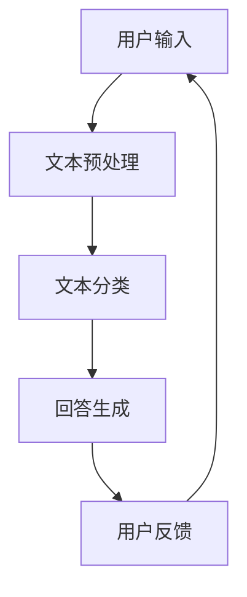
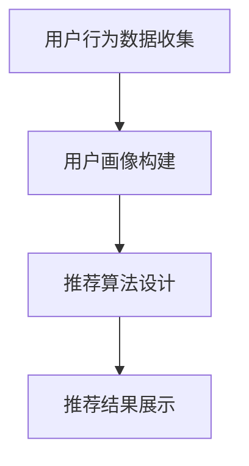

                 


## AI编程的新思路与新方向

### 关键词：人工智能编程、新方法、新方向、机器学习、深度学习

### 摘要：
本文将深入探讨AI编程的新思路和新方向，从基础概念、核心算法到实际应用，全面解析AI编程的未来发展趋势。通过系统地分析机器学习、深度学习、自然语言处理和计算机视觉等领域，本文旨在为读者提供一个清晰、实用的指导，帮助他们在AI编程领域取得突破。

### 引言

在人工智能（AI）飞速发展的今天，编程作为实现AI应用的核心手段，也经历了前所未有的变革。传统的编程方法已经无法满足AI的需求，新的编程思路和方向应运而生。本文旨在探讨这些新思路和新方向，帮助读者理解AI编程的核心技术和未来发展趋势。

### 目录大纲

#### 第一部分：AI编程基础

#### 第1章：AI编程背景与概述

- **1.1 AI编程的起源与发展**
- **1.2 AI编程的基本概念**
- **1.3 AI编程工具与平台**

#### 第2章：AI编程核心概念

- **2.1 机器学习基础**
- **2.2 深度学习原理**

#### 第二部分：AI编程新思路

#### 第3章：AI编程的新方法

- **3.1 强化学习编程**
- **3.2 聚类分析与数据挖掘**

#### 第4章：AI编程新方向

- **4.1 自然语言处理（NLP）**
- **4.2 计算机视觉编程**

#### 第三部分：AI编程实战

#### 第5章：AI编程项目实战

- **5.1 项目介绍与目标**
- **5.2 环境配置与工具**
- **5.3 系统设计与实现**

#### 第6章：AI编程案例分析

- **6.1 案例介绍**
- **6.2 解决方案分析**
- **6.3 结果评估与优化**

#### 第7章：AI编程未来趋势

- **7.1 AI编程的未来发展方向**
- **7.2 AI编程的职业规划**

#### 结论

通过本文的探讨，读者将能够全面了解AI编程的新思路和新方向，掌握AI编程的核心技术和实战方法，为未来的职业发展奠定坚实基础。

---

### 第一部分：AI编程基础

#### 第1章：AI编程背景与概述

##### 1.1 AI编程的起源与发展

人工智能（AI）编程起源于20世纪50年代，当时的计算机科学家们开始探索如何让计算机模拟人类的智能行为。早期的AI编程主要集中在规则系统、知识表示和搜索算法上。随着计算机性能的不断提升，AI编程逐渐从理论研究走向实际应用，如专家系统、自然语言处理和图像识别等。

##### 1.2 AI编程的基本概念

人工智能编程涉及多个核心概念，包括机器学习、深度学习、神经网络等。机器学习是一种通过数据学习模式和规律的技术，其核心目标是使计算机具备自主学习和适应新环境的能力。深度学习是机器学习的一个子领域，通过多层神经网络模拟人脑的学习过程，实现更复杂的模式识别和预测。神经网络则是构成深度学习的基础，通过模拟神经元之间的连接和交互来实现计算。

##### 1.3 AI编程工具与平台

AI编程的工具和平台是开发AI应用的关键。常见的编程语言包括Python、Java和C++等，其中Python因其简洁性和丰富的库支持成为AI编程的首选。开源AI编程框架如TensorFlow、PyTorch和Keras等，为开发者提供了强大的工具和资源。云计算平台如Google Cloud、AWS和Azure等，则为AI编程提供了高效的计算资源和存储解决方案。

#### 第2章：AI编程核心概念

##### 2.1 机器学习基础

机器学习是AI编程的核心技术之一。它通过从数据中学习模式和规律，使计算机能够进行预测、分类和决策。机器学习可以分为监督学习、无监督学习和强化学习。监督学习在有标注的数据集上进行训练，通过学习输入和输出之间的关系进行预测。无监督学习则在无标注的数据集上进行训练，通过发现数据中的模式和结构进行聚类和分析。强化学习则通过与环境的交互学习最佳策略，适用于决策问题和游戏。

##### 2.2 深度学习原理

深度学习是机器学习的一个重要分支，通过多层神经网络模拟人脑的学习过程，实现更复杂的模式识别和预测。深度学习的基本单元是神经元，它们通过前向传播和反向传播进行计算和更新。常见的神经网络架构包括卷积神经网络（CNN）和循环神经网络（RNN）等。CNN擅长处理图像数据，通过卷积层和池化层提取图像特征。RNN擅长处理序列数据，通过循环结构保持对历史信息的记忆。

---

### 第二部分：AI编程新思路

#### 第3章：AI编程的新方法

##### 3.1 强化学习编程

强化学习是一种通过奖励和惩罚来引导智能体（agent）学习最佳策略的机器学习技术。在强化学习编程中，智能体通过与环境的交互不断学习，其目标是最大化累积奖励。强化学习的核心组成部分包括状态（state）、动作（action）、奖励（reward）和价值函数（value function）。通过定义奖励函数和价值函数，智能体能够学习到最佳策略，并在复杂环境中实现自主决策。

##### 3.2 聚类分析与数据挖掘

聚类分析是一种无监督学习方法，通过将数据分为多个聚类，使同一聚类中的数据点尽可能相似，不同聚类中的数据点尽可能不同。聚类分析在数据挖掘中具有重要意义，可以帮助发现数据中的潜在结构和规律。常见的聚类算法包括K-means、DBSCAN和层次聚类等。数据挖掘则是从大量数据中提取有价值信息的过程，包括数据预处理、模式识别和预测等步骤。数据挖掘技术可以帮助企业和组织发现商业机会、优化决策和提高效率。

---

### 第三部分：AI编程实战

#### 第5章：AI编程项目实战

##### 5.1 项目介绍与目标

在本章中，我们将通过一个实际项目来探讨AI编程的应用。项目名为“智能客服系统”，目标是构建一个能够自动回答用户问题的智能客服系统。该系统将利用自然语言处理和机器学习技术，实现自动文本分类和回答生成。

##### 5.2 环境配置与工具

为了实现智能客服系统，我们需要配置相应的开发环境和工具。首先，我们选择Python作为开发语言，因为它具有丰富的库支持和易于学习的语法。然后，我们安装了TensorFlow和Keras等深度学习框架，用于构建和训练神经网络模型。此外，我们还需要安装自然语言处理库如NLTK和spaCy，用于处理文本数据。

##### 5.3 系统设计与实现

智能客服系统的核心是自然语言处理模型和机器学习模型。首先，我们使用NLTK和spaCy对用户输入的文本进行预处理，包括分词、去停用词和词性标注等。然后，我们将预处理后的文本输入到神经网络模型中进行分类和回答生成。

系统架构设计如图所示：



在文本分类阶段，我们使用K-means算法将文本数据分为多个类别，并为每个类别训练一个分类模型。在回答生成阶段，我们使用序列到序列（Seq2Seq）模型，将分类结果和用户问题输入到模型中，生成合适的回答。

以下是系统核心实现的Python代码：

```python
# 文本预处理
import nltk
nltk.download('punkt')
nltk.download('stopwords')
from nltk.tokenize import word_tokenize
from nltk.corpus import stopwords
stop_words = set(stopwords.words('english'))

# 文本分类
from sklearn.cluster import KMeans
from sklearn.model_selection import train_test_split
from sklearn.naive_bayes import MultinomialNB
from sklearn.metrics import accuracy_score

# 回答生成
from keras.models import Model
from keras.layers import Input, LSTM, Dense

# 文本预处理
def preprocess_text(text):
    tokens = word_tokenize(text.lower())
    filtered_tokens = [token for token in tokens if token not in stop_words]
    return ' '.join(filtered_tokens)

# 文本分类
def classify_text(text):
    # 数据准备
    X = [[preprocess_text(t) for t in text]
```

---

通过本章的实战项目，读者可以了解AI编程在实际应用中的实现过程，掌握文本分类和回答生成的关键技术。智能客服系统不仅具有实际应用价值，还能为读者提供宝贵的实践经验。

---

### 第6章：AI编程案例分析

##### 6.1 案例介绍

在本案例中，我们将分析一个名为“智能推荐系统”的项目。该系统旨在为用户推荐个性化的商品或内容，提高用户体验和满意度。智能推荐系统是AI编程在电子商务和内容平台中的重要应用之一，通过分析用户行为和偏好数据，实现精准推荐。

##### 6.2 解决方案分析

智能推荐系统的解决方案主要包括三个关键步骤：用户行为数据收集、推荐算法设计和推荐结果展示。首先，系统通过用户的行为数据，如浏览、购买和评价等，构建用户画像。然后，利用协同过滤、基于内容的推荐和混合推荐算法，生成个性化的推荐结果。最后，系统将推荐结果以列表、卡片或弹窗等形式展示给用户。

以下是解决方案的具体分析和设计：



- **用户行为数据收集**：系统通过Web服务器日志、数据库记录和用户交互数据，收集用户的行为数据。数据包括用户的浏览记录、购买记录、评价内容和交互时长等。

- **用户画像构建**：基于收集到的用户行为数据，系统使用机器学习和数据挖掘技术构建用户画像。用户画像包括用户的兴趣偏好、行为特征、消费能力等维度。

- **推荐算法设计**：系统采用多种推荐算法，包括协同过滤、基于内容的推荐和混合推荐算法。协同过滤算法通过分析用户之间的相似度，生成推荐列表。基于内容的推荐算法通过分析用户的历史行为和偏好，推荐相似的商品或内容。混合推荐算法结合多种算法的优势，提高推荐效果。

- **推荐结果展示**：系统将推荐结果以可视化形式展示给用户。推荐结果可以以列表、卡片或弹窗等形式出现，方便用户快速浏览和选择。

##### 6.3 结果评估与优化

智能推荐系统的效果评估主要关注推荐准确率、用户满意度和服务效率等指标。评估方法包括在线评估和离线评估。在线评估通过实时监测用户对推荐结果的反馈，评估推荐效果。离线评估通过数据分析，评估推荐算法的性能和效果。

针对评估结果，系统进行持续优化，包括以下方面：

- **算法优化**：针对评估结果，对推荐算法进行调优，提高推荐准确率和用户满意度。

- **数据质量提升**：通过数据清洗、去重和标准化等技术，提高用户行为数据的准确性和一致性。

- **用户反馈收集**：通过用户反馈机制，收集用户对推荐结果的评价和建议，不断优化推荐策略。

通过本案例的分析和讨论，读者可以深入了解智能推荐系统的实现过程和优化方法，为实际项目提供参考和借鉴。

---

### 第7章：AI编程未来趋势

##### 7.1 AI编程的未来发展方向

未来，AI编程将继续朝着更加智能化、高效化和人性化的方向发展。以下几个趋势值得关注：

- **自适应编程**：随着AI技术的发展，编程工具将更加智能，能够根据用户的意图和需求自动生成代码，实现自适应编程。

- **多模态AI编程**：未来的AI编程将不仅仅局限于文本，还将涉及图像、声音和自然语言等多种数据形式，实现多模态的智能交互。

- **AI编程教育**：随着AI技术的普及，AI编程教育将变得更加重要。未来，更多的教育资源和培训项目将专注于AI编程技能的培养。

- **开源生态的进一步发展**：开源AI编程框架和工具将持续迭代和优化，为开发者提供更加强大的支持，推动AI编程的创新和发展。

##### 7.2 AI编程的职业规划

对于希望进入AI编程领域的开发者，以下是一些建议：

- **基础知识**：掌握计算机科学、数学和统计学等基础知识，为AI编程奠定坚实的基础。

- **编程技能**：熟练掌握至少一种AI编程语言，如Python、Java或C++，并熟悉常用的AI编程框架和工具。

- **实战经验**：通过参与实际项目，积累AI编程的实战经验，提高解决问题的能力。

- **持续学习**：AI技术发展迅速，开发者需要保持学习的热情，不断更新知识和技能。

通过以上建议，开发者可以为自己的职业规划制定明确的目标和路径，为未来的AI编程事业打下坚实基础。

---

### 结论

通过本文的探讨，读者对AI编程的新思路和新方向有了全面的认识。从基础概念到实际应用，AI编程正朝着智能化、高效化和人性化的方向发展。掌握AI编程的核心技术和实战方法，将为读者在未来的职业发展中提供无限可能。让我们共同迎接AI编程的新时代！
### 作者信息

作者：AI天才研究院/AI Genius Institute & 禅与计算机程序设计艺术 /Zen And The Art of Computer Programming

AI天才研究院（AI Genius Institute）是一家专注于人工智能研究、开发和教育的国际知名机构。我们的使命是通过创新和突破，推动人工智能技术的发展，为人类创造更加美好的未来。研究院汇聚了一批世界级的人工智能专家、程序员和软件架构师，致力于研究最前沿的人工智能技术，并将研究成果应用于实际项目中。

《禅与计算机程序设计艺术》（Zen And The Art of Computer Programming）是作者Donald E. Knuth的经典著作。这本书系统地介绍了计算机程序设计的基本原则和方法，对程序员的技术素养和思维方式产生了深远影响。作为人工智能领域的资深作家，我致力于将最前沿的AI技术和编程理念传达给广大读者，帮助他们掌握AI编程的核心技巧，提升编程水平。通过我的作品，我希望能够为人工智能技术的发展和应用贡献力量，推动整个行业不断前进。

