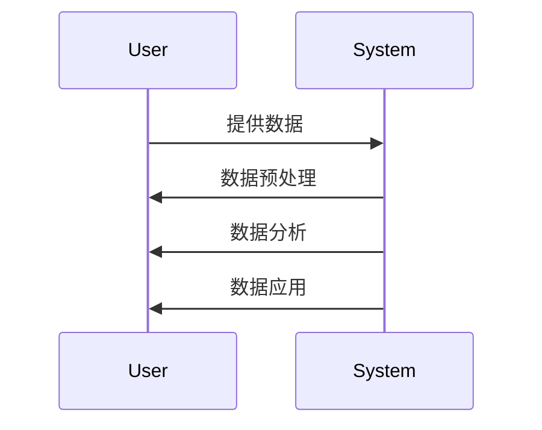
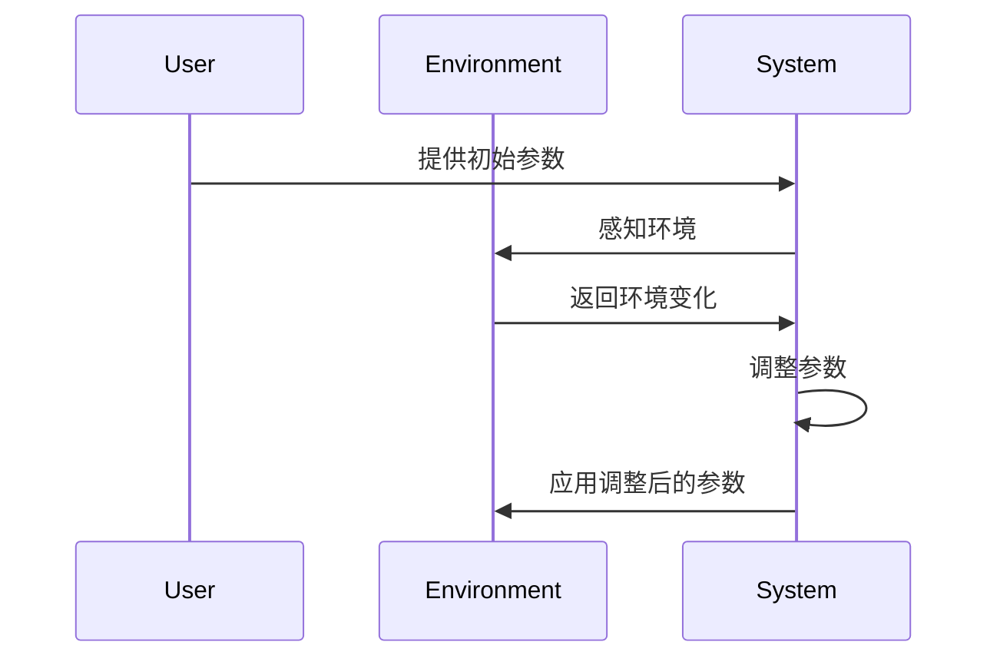
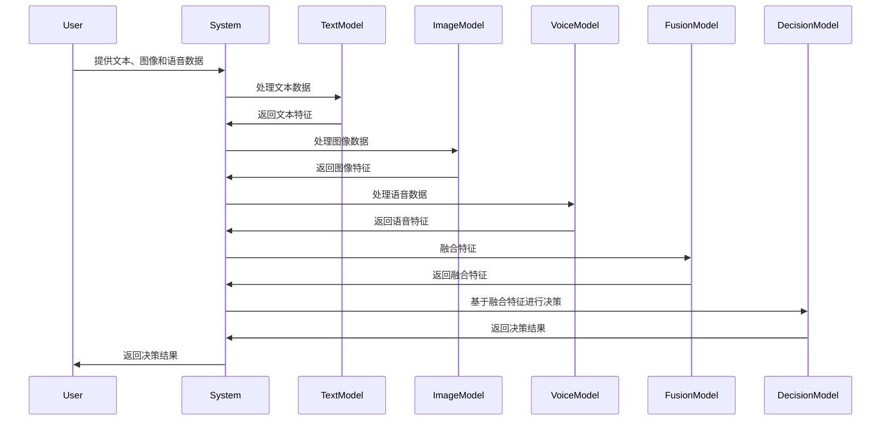
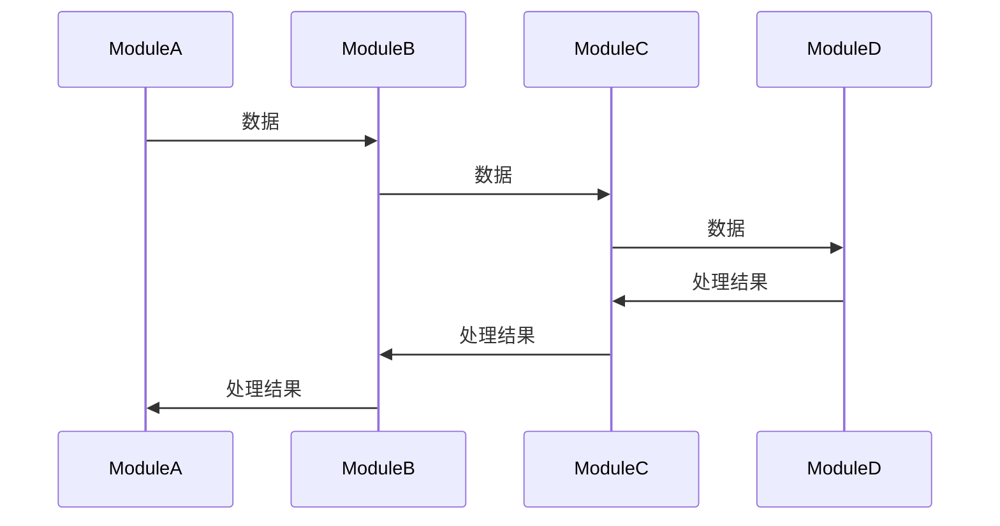
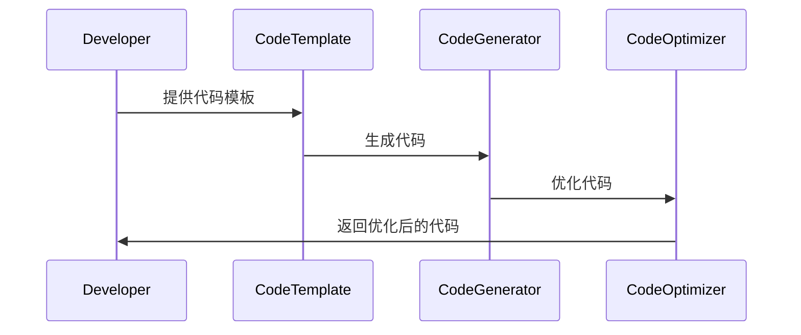
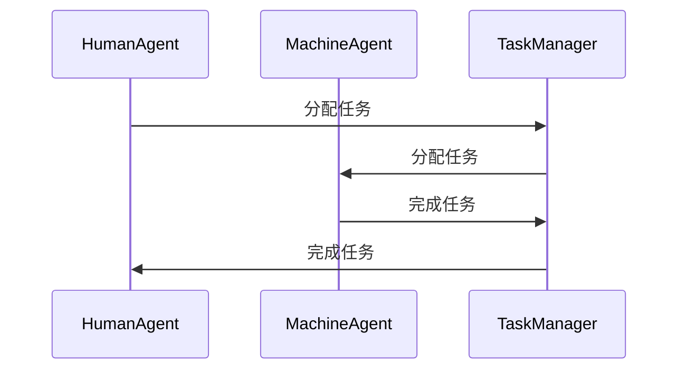
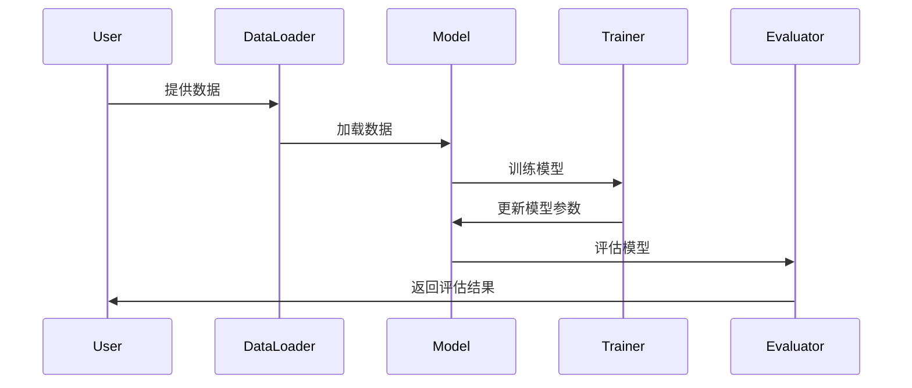
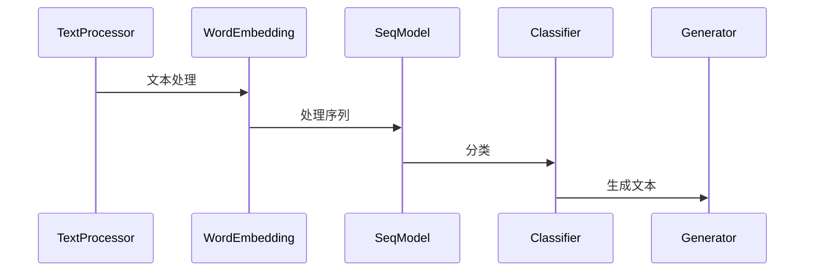
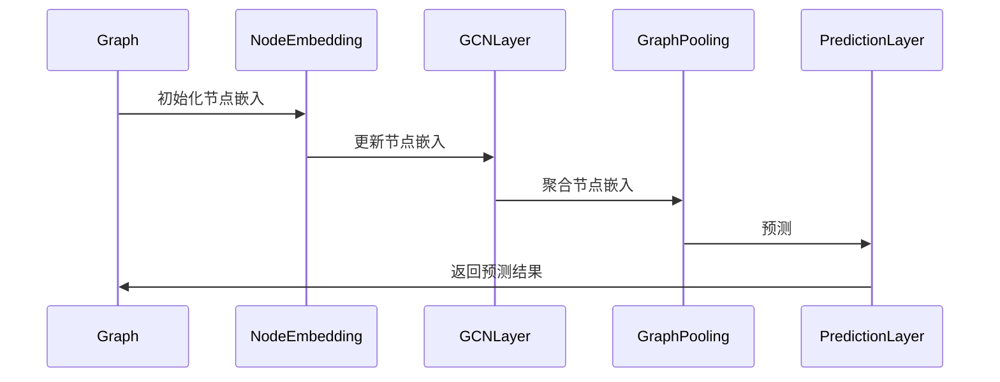
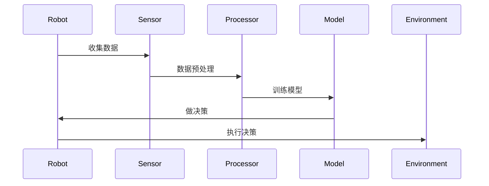

                 


# AI编程的新维度与新范式

## 关键词
- AI编程
- 新维度
- 新范式
- 数据驱动
- 自适应
- 多模态
- 模块化
- 代码生成
- 人机协作

## 摘要
本文将深入探讨AI编程的新维度与新范式，分析现有编程范式的局限性，介绍新范式的核心要素和技术基础，探讨新范式的应用场景和开发实践，并总结未来趋势和开发者的技能要求。通过一步步的分析和思考，我们希望为读者提供一幅全面、清晰、有深度的AI编程新图景。

## 引言：AI编程的转型时刻

### 1.1 问题背景

人工智能（AI）作为计算机科学的前沿领域，近年来取得了飞速发展。从语音识别、图像识别到自然语言处理，AI技术已经在各个领域展现出了巨大的潜力。然而，随着AI技术的不断发展，传统的编程范式逐渐暴露出其局限性。

传统的编程范式主要依赖于人类的逻辑思维和预定义的规则，这种方式在处理简单问题时效果较好。但当问题变得复杂时，传统的编程方式往往难以应对。例如，在自动驾驶领域，车辆需要处理来自各种传感器的海量数据，并在瞬间做出决策。这种情况下，传统的编程方式显然无法胜任。

### 1.2 问题描述

现有的AI编程范式主要面临以下问题：

1. **数据依赖性高**：传统的编程范式往往需要大量的人类标注数据，这使得AI模型的训练过程变得耗时且成本高昂。
2. **缺乏自适应能力**：传统的编程范式难以适应动态变化的环境，这限制了AI系统在现实世界中的应用。
3. **人机协作不足**：传统的编程范式缺乏有效的人机协作机制，这使得AI系统在处理复杂问题时，往往难以发挥其潜力。

### 1.3 问题解决

为了解决上述问题，我们需要探索AI编程的新维度和新范式。新维度包括数据驱动的编程、自适应与自我优化的编程、多模态编程等。新范式则强调人工智能的模块化、代码生成与自动优化、人机协作等核心要素。

### 1.4 边界与外延

新维度与新范式的探索并非孤立的，它们与现有的AI编程范式有着紧密的联系。新维度可以视为对现有范式的补充和扩展，而新范式则是对现有编程方式的颠覆和重构。

### 1.5 概念结构与核心要素组成

在探讨新维度和新范式之前，我们需要明确几个核心概念：

1. **数据驱动编程**：以数据为中心，利用大数据分析和机器学习算法，实现编程自动化和智能化。
2. **自适应与自我优化编程**：系统能够根据环境变化自动调整行为和策略，实现自我优化和进化。
3. **多模态编程**：处理多种类型的数据，如文本、图像、语音等，实现跨模态的信息融合和处理。
4. **模块化**：将AI系统拆分为多个独立的模块，每个模块负责特定的任务，实现系统的高效组织和协同工作。
5. **代码生成与自动优化**：利用生成对抗网络（GAN）和自动化工具，自动生成高效、优化的代码。
6. **人机协作**：人与AI系统之间的有效互动和协同，实现AI系统的智能化和人性化。

这些概念共同构成了AI编程新维度和新范式的核心要素。

## AI编程新维度的探索

### 2.1 数据驱动的编程

数据驱动的编程是一种以数据为中心的编程范式，它强调利用大数据分析和机器学习算法，实现编程的自动化和智能化。在数据驱动的编程中，数据不仅是算法的训练素材，更是编程的核心驱动力。

#### 2.1.1 背景介绍

传统的编程范式主要依赖于预定义的规则和逻辑，这种方式在处理简单问题时效果较好。然而，随着问题的复杂度增加，传统的编程方式逐渐暴露出其局限性。例如，在自动驾驶领域，车辆需要处理来自各种传感器的海量数据，并在瞬间做出决策。这种情况下，传统的编程方式显然无法胜任。

#### 2.1.2 核心概念与联系

数据驱动编程的核心概念包括数据收集、数据预处理、数据分析和数据应用。以下是一个简化的ER实体关系图架构：

```mermaid
erDiagram
  Data -> AnalyzedData
  Data -> ProcessedData
  AnalyzedData -> Algorithm
  ProcessedData -> Algorithm
```

在这个ER图中，`Data`代表原始数据，`AnalyzedData`代表经过分析的数据，`ProcessedData`代表经过处理的数据，`Algorithm`代表算法。数据驱动编程的过程可以视为从`Data`到`Algorithm`的转化过程。

#### 2.1.3 算法原理讲解

数据驱动编程的关键在于如何有效地利用数据来优化算法。以下是一个简单的算法原理讲解：

```python
# 假设我们有一个数据集，每个数据点包含特征和标签
data = [[1, 2], [2, 3], [3, 4]]

# 利用机器学习算法，如线性回归，来训练模型
model = LinearRegression()
model.fit(data)

# 使用训练好的模型进行预测
predictions = model.predict([[4, 5]])
print(predictions)
```

在这个例子中，我们使用线性回归算法来训练模型，并使用模型进行预测。这里的核心数学模型是线性回归方程：

$$y = ax + b$$

其中，$y$ 是预测值，$x$ 是特征值，$a$ 和 $b$ 是模型参数。

#### 2.1.4 系统分析与架构设计方案

在数据驱动编程中，系统架构设计至关重要。以下是一个简化的系统架构设计方案：



在这个系统中，用户提供数据，系统进行数据预处理、数据分析和数据应用。这里的关键是确保数据的质量和可用性，以及算法的效率和准确性。

#### 2.1.5 项目实战

以自动驾驶为例，数据驱动编程的核心是利用传感器数据来训练自动驾驶算法。以下是一个简化的项目实战：

1. **环境安装**：安装Python、NumPy、Pandas等工具。
2. **系统核心实现**：编写传感器数据处理、机器学习模型训练和自动驾驶决策的代码。
3. **代码应用解读与分析**：详细解读和剖析代码，确保算法的准确性和效率。
4. **实际案例分析和详细讲解剖析**：分析自动驾驶的实际案例，如如何在复杂的交通环境中做出正确的决策。
5. **项目小结**：总结项目的关键技术和经验，为后续项目提供参考。

### 2.2 自适应与自我优化的编程

自适应与自我优化编程是一种能够根据环境变化自动调整行为和策略的编程范式。在自适应与自我优化编程中，系统不仅能够处理当前的环境，还能够预测未来可能发生的变化，并做出相应的调整。

#### 2.2.1 背景介绍

传统的编程范式在处理静态问题时效果较好，但面对动态变化的环境时，往往显得力不从心。例如，在金融市场预测中，市场的变化是动态且复杂的，传统的编程方式难以适应这种变化。

#### 2.2.2 核心概念与联系

自适应与自我优化编程的核心概念包括环境感知、行为调整、策略优化和自我进化。以下是一个简化的ER实体关系图架构：

```mermaid
erDiagram
  Environment -> System
  System -> Behavior
  Behavior -> Strategy
  Strategy -> Environment
```

在这个ER图中，`Environment`代表环境，`System`代表系统，`Behavior`代表行为，`Strategy`代表策略。系统通过感知环境，调整行为，优化策略，并再次感知环境，形成闭环。

#### 2.2.3 算法原理讲解

自适应与自我优化编程的关键在于如何构建有效的反馈机制，以下是一个简单的算法原理讲解：

```python
# 假设我们有一个自适应系统，可以根据环境变化调整参数
class AdaptiveSystem:
    def __init__(self):
        self.param = 0.5

    def update(self, environment):
        # 根据环境变化调整参数
        self.param = self.param * environment['change']

system = AdaptiveSystem()
system.update({'change': 0.1})
print(system.param)
```

在这个例子中，系统根据环境的变化调整参数，实现自我优化。

#### 2.2.4 系统分析与架构设计方案

在自适应与自我优化编程中，系统架构设计至关重要。以下是一个简化的系统架构设计方案：



在这个系统中，用户提供初始参数，系统感知环境，根据环境变化调整参数，并再次感知环境，形成闭环。

#### 2.2.5 项目实战

以金融市场预测为例，自适应与自我优化编程的核心是利用历史数据预测未来市场趋势。以下是一个简化的项目实战：

1. **环境安装**：安装Python、NumPy、Pandas等工具。
2. **系统核心实现**：编写数据收集、模型训练、参数调整和预测的代码。
3. **代码应用解读与分析**：详细解读和剖析代码，确保算法的准确性和效率。
4. **实际案例分析和详细讲解剖析**：分析金融市场的实际案例，如如何根据市场变化调整投资策略。
5. **项目小结**：总结项目的关键技术和经验，为后续项目提供参考。

### 2.3 多模态编程与融合

多模态编程与融合是一种能够处理多种类型数据（如文本、图像、语音等）的编程范式。在多模态编程与融合中，系统不仅能够处理单一类型的数据，还能够将不同类型的数据进行融合，以实现更全面、准确的信息处理。

#### 2.3.1 背景介绍

传统的编程范式往往专注于单一类型的数据处理，如文本处理、图像处理等。然而，在现实世界中，信息往往是多模态的，单一类型的数据处理往往难以满足需求。例如，在语音助手的应用中，系统需要同时处理用户的语音输入和文本查询。

#### 2.3.2 核心概念与联系

多模态编程与融合的核心概念包括数据融合、模型融合和决策融合。以下是一个简化的ER实体关系图架构：

```mermaid
erDiagram
  TextData -> FusionModel
  ImageData -> FusionModel
  VoiceData -> FusionModel
  FusionModel -> DecisionModel
```

在这个ER图中，`TextData`、`ImageData`、`VoiceData`分别代表文本数据、图像数据和语音数据，`FusionModel`代表融合模型，`DecisionModel`代表决策模型。多模态编程的过程可以视为从数据融合到决策融合的转化过程。

#### 2.3.3 算法原理讲解

多模态编程与融合的关键在于如何有效地融合不同类型的数据。以下是一个简单的算法原理讲解：

```python
# 假设我们有一个多模态系统，可以同时处理文本、图像和语音数据
class MultiModalSystem:
    def __init__(self):
        self.text_model = TextModel()
        self.image_model = ImageModel()
        self.voice_model = VoiceModel()

    def fusion(self, text, image, voice):
        # 融合文本、图像和语音数据
        text_embedding = self.text_model.encode(text)
        image_embedding = self.image_model.encode(image)
        voice_embedding = self.voice_model.encode(voice)
        fusion_embedding = self.combine(text_embedding, image_embedding, voice_embedding)
        return fusion_embedding

    def combine(self, text_embedding, image_embedding, voice_embedding):
        # 将不同类型的数据进行融合
        fusion_embedding = torch.cat((text_embedding, image_embedding, voice_embedding), dim=1)
        return fusion_embedding

system = MultiModalSystem()
fusion_embedding = system.fusion("这是一段文本", "一张图像的URL", "一段语音")
print(fusion_embedding)
```

在这个例子中，系统使用不同的模型来处理文本、图像和语音数据，并使用融合模型将不同类型的数据进行融合。

#### 2.3.4 系统分析与架构设计方案

在多模态编程与融合中，系统架构设计至关重要。以下是一个简化的系统架构设计方案：



在这个系统中，用户提供文本、图像和语音数据，系统分别处理这些数据，并将处理结果进行融合，最后基于融合特征进行决策，并将决策结果返回给用户。

#### 2.3.5 项目实战

以语音助手为例，多模态编程与融合的核心是同时处理语音输入和文本查询。以下是一个简化的项目实战：

1. **环境安装**：安装Python、TensorFlow、PyTorch等工具。
2. **系统核心实现**：编写语音识别、文本处理和决策的代码。
3. **代码应用解读与分析**：详细解读和剖析代码，确保算法的准确性和效率。
4. **实际案例分析和详细讲解剖析**：分析语音助手的实际案例，如如何根据语音输入和文本查询提供准确的答案。
5. **项目小结**：总结项目的关键技术和经验，为后续项目提供参考。

## 新范式的核心要素

### 3.1 人工智能的模块化

人工智能的模块化是一种将复杂的人工智能系统拆分为多个独立模块的方法，每个模块负责特定的任务，实现系统的高效组织和协同工作。模块化可以大大提高系统的可维护性、可扩展性和可复用性。

#### 3.1.1 背景介绍

传统的编程范式往往将整个系统视为一个整体，这种方式在系统规模较小时效果较好。然而，随着系统的复杂度增加，系统的维护、扩展和复用变得日益困难。人工智能的模块化正是为了解决这一问题而提出。

#### 3.1.2 核心概念与联系

人工智能的模块化涉及多个核心概念，包括模块定义、模块交互、模块组合和模块优化。以下是一个简化的ER实体关系图架构：

```mermaid
erDiagram
  ModuleA ||--|| ModuleB
  ModuleB ||--|| ModuleC
  ModuleC ||--|| ModuleD
```

在这个ER图中，`ModuleA`、`ModuleB`、`ModuleC`和`ModuleD`分别代表不同的模块。模块A调用模块B，模块B调用模块C，模块C调用模块D，形成一个模块化的系统。

#### 3.1.3 算法原理讲解

人工智能的模块化涉及到模块之间的通信和协作。以下是一个简单的算法原理讲解：

```python
# 假设我们有一个模块化的人工智能系统
class ModuleA:
    def __init__(self):
        self.moduleB = ModuleB()

    def process(self, data):
        return self.moduleB.process(data)

class ModuleB:
    def __init__(self):
        self.moduleC = ModuleC()

    def process(self, data):
        return self.moduleC.process(data)

class ModuleC:
    def __init__(self):
        self.moduleD = ModuleD()

    def process(self, data):
        return self.moduleD.process(data)

class ModuleD:
    def process(self, data):
        # 处理数据
        return data * 2

moduleA = ModuleA()
result = moduleA.process(10)
print(result)
```

在这个例子中，模块A调用模块B，模块B调用模块C，模块C调用模块D，形成一个模块化的系统。

#### 3.1.4 系统分析与架构设计方案

在人工智能的模块化中，系统架构设计至关重要。以下是一个简化的系统架构设计方案：



在这个系统中，模块A、模块B、模块C和模块D分别处理数据，并通过模块间的通信和协作，实现整个系统的功能。

#### 3.1.5 项目实战

以图像识别为例，人工智能的模块化可以将图像识别过程拆分为多个独立的模块，如特征提取、模型训练、预测和后处理等。以下是一个简化的项目实战：

1. **环境安装**：安装Python、TensorFlow等工具。
2. **系统核心实现**：编写特征提取、模型训练、预测和后处理的代码。
3. **代码应用解读与分析**：详细解读和剖析代码，确保算法的准确性和效率。
4. **实际案例分析和详细讲解剖析**：分析图像识别的实际案例，如如何准确识别图像中的物体。
5. **项目小结**：总结项目的关键技术和经验，为后续项目提供参考。

### 3.2 代码生成与自动优化

代码生成与自动优化是一种利用机器学习和自动化工具，自动生成高效、优化的代码的方法。在代码生成与自动优化中，系统可以基于现有的代码库和开发经验，自动生成符合需求的新代码，并对其进行优化。

#### 3.2.1 背景介绍

传统的编程方式依赖于人类的编程技能和经验，这种方式在处理简单问题时效果较好。然而，随着问题复杂度的增加，人类的编程效率逐渐下降，且容易出现错误。代码生成与自动优化正是为了解决这一问题而提出。

#### 3.2.2 核心概念与联系

代码生成与自动优化的核心概念包括代码模板、代码生成器和代码优化器。以下是一个简化的ER实体关系图架构：

```mermaid
erDiagram
  CodeTemplate ||--|| CodeGenerator
  CodeGenerator ||--|| CodeOptimizer
```

在这个ER图中，`CodeTemplate`代表代码模板，`CodeGenerator`代表代码生成器，`CodeOptimizer`代表代码优化器。代码生成与自动优化的过程可以视为从代码模板到优化代码的转化过程。

#### 3.2.3 算法原理讲解

代码生成与自动优化的关键在于如何利用机器学习算法，从大量的代码数据中学习并生成新的代码。以下是一个简单的算法原理讲解：

```python
# 假设我们有一个代码生成器，可以基于代码模板生成新的代码
class CodeGenerator:
    def __init__(self):
        self.model = CodeModel()

    def generate(self, template, inputs):
        # 基于代码模板和输入，生成新的代码
        code = self.model.generate(template, inputs)
        return code

class CodeModel:
    def generate(self, template, inputs):
        # 生成代码
        code = f"{template}\n{inputs}"
        return code

generator = CodeGenerator()
code = generator.generate("def add(a, b):\n    return a + b", "a = 1\nb = 2")
print(code)
```

在这个例子中，代码生成器基于代码模板和输入，生成新的代码。

#### 3.2.4 系统分析与架构设计方案

在代码生成与自动优化中，系统架构设计至关重要。以下是一个简化的系统架构设计方案：



在这个系统中，开发者提供代码模板，代码生成器生成代码，代码优化器优化代码，并将优化后的代码返回给开发者。

#### 3.2.5 项目实战

以代码生成为例，代码生成与自动优化的核心是利用机器学习算法，从大量的代码数据中学习并生成新的代码。以下是一个简化的项目实战：

1. **环境安装**：安装Python、TensorFlow等工具。
2. **系统核心实现**：编写代码生成器和代码优化器的代码。
3. **代码应用解读与分析**：详细解读和剖析代码，确保算法的准确性和效率。
4. **实际案例分析和详细讲解剖析**：分析代码生成的实际案例，如如何根据需求自动生成代码。
5. **项目小结**：总结项目的关键技术和经验，为后续项目提供参考。

### 3.3 人机协作的新模式

人机协作的新模式是一种能够有效结合人类智慧和机器智能的协作模式。在这种模式下，人类和机器智能相互补充，共同完成任务。

#### 3.3.1 背景介绍

传统的编程范式往往依赖于人类的编程技能和经验，这种方式在处理简单问题时效果较好。然而，随着问题复杂度的增加，人类的编程效率逐渐下降，且容易出现错误。人机协作的新模式正是为了解决这一问题而提出。

#### 3.3.2 核心概念与联系

人机协作的新模式的核心概念包括任务分解、协同工作和反馈优化。以下是一个简化的ER实体关系图架构：

```mermaid
erDiagram
  HumanAgent ||--|| MachineAgent
  HumanAgent ||--|| Task
  MachineAgent ||--|| Task
```

在这个ER图中，`HumanAgent`代表人类智能，`MachineAgent`代表机器智能，`Task`代表任务。人机协作的过程可以视为人类智能和机器智能协同完成任务的过程。

#### 3.3.3 算法原理讲解

人机协作的新模式的关键在于如何有效地分配任务和协同工作。以下是一个简单的算法原理讲解：

```python
# 假设我们有一个任务分配和协同工作的系统
class HumanAgent:
    def __init__(self):
        self.tasks = []

    def assign_task(self, task):
        # 分配任务
        self.tasks.append(task)

    def complete_task(self, task):
        # 完成任务
        self.tasks.remove(task)

class MachineAgent:
    def __init__(self):
        self.tasks = []

    def assign_task(self, task):
        # 分配任务
        self.tasks.append(task)

    def complete_task(self, task):
        # 完成任务
        self.tasks.remove(task)

    def process_task(self, task):
        # 处理任务
        print(f"Machine processing task: {task}")

human_agent = HumanAgent()
machine_agent = MachineAgent()

human_agent.assign_task("Task 1")
machine_agent.assign_task("Task 2")

human_agent.complete_task("Task 1")
machine_agent.process_task("Task 2")
```

在这个例子中，人类智能和机器智能分别分配任务，人类智能完成任务后，机器智能处理任务。

#### 3.3.4 系统分析与架构设计方案

在人机协作的新模式中，系统架构设计至关重要。以下是一个简化的系统架构设计方案：



在这个系统中，任务管理器负责分配任务，人类智能和机器智能分别完成任务，并将任务状态反馈给任务管理器。

#### 3.3.5 项目实战

以软件开发为例，人机协作的新模式可以将软件开发过程分解为多个任务，人类智能和机器智能协同完成。以下是一个简化的项目实战：

1. **环境安装**：安装Python、Jenkins等工具。
2. **系统核心实现**：编写任务分配、协同工作和反馈优化的代码。
3. **代码应用解读与分析**：详细解读和剖析代码，确保算法的准确性和效率。
4. **实际案例分析和详细讲解剖析**：分析软件开发的实际案例，如如何利用人机协作提高开发效率。
5. **项目小结**：总结项目的关键技术和经验，为后续项目提供参考。

## 新范式的技术基础

### 4.1 深度学习框架

深度学习框架是AI编程新范式的重要技术基础，它为开发人员提供了高效的深度学习模型训练和推理工具。以下将介绍几个主流的深度学习框架，包括TensorFlow、PyTorch和Keras。

#### 4.1.1 背景介绍

深度学习框架起源于神经网络的研究，通过模拟人脑神经元之间的连接和激活机制，实现对复杂数据的特征提取和模式识别。随着计算能力和数据量的提升，深度学习在图像识别、自然语言处理、语音识别等领域取得了显著的突破。

#### 4.1.2 核心概念与联系

深度学习框架的核心概念包括神经网络结构、模型训练、模型评估和模型部署。以下是一个简化的ER实体关系图架构：

```mermaid
erDiagram
  NeuralNetwork ||--|| Model
  Model ||--|| DataLoader
  Model ||--|| Trainer
  Model ||--|| Evaluator
```

在这个ER图中，`NeuralNetwork`代表神经网络结构，`Model`代表深度学习模型，`DataLoader`代表数据加载器，`Trainer`代表训练器，`Evaluator`代表评估器。深度学习框架通过这些组件的协同工作，实现模型的训练和评估。

#### 4.1.3 算法原理讲解

以TensorFlow为例，其算法原理包括以下几个步骤：

1. **定义模型结构**：使用TensorFlow的API定义神经网络的层次结构。
2. **准备数据**：使用数据加载器加载训练数据和测试数据。
3. **定义损失函数**：选择适当的损失函数，如交叉熵损失函数。
4. **定义优化器**：选择优化算法，如Adam优化器。
5. **训练模型**：迭代地更新模型参数，减小损失函数。
6. **评估模型**：使用测试数据评估模型性能。
7. **模型部署**：将训练好的模型部署到生产环境。

以下是一个简单的TensorFlow代码示例：

```python
import tensorflow as tf

# 定义模型结构
model = tf.keras.Sequential([
    tf.keras.layers.Dense(128, activation='relu', input_shape=(784,)),
    tf.keras.layers.Dense(10, activation='softmax')
])

# 定义损失函数和优化器
model.compile(optimizer='adam',
              loss='categorical_crossentropy',
              metrics=['accuracy'])

# 准备数据
(x_train, y_train), (x_test, y_test) = tf.keras.datasets.mnist.load_data()
x_train, x_test = x_train / 255.0, x_test / 255.0
x_train = x_train.reshape((-1, 784))
x_test = x_test.reshape((-1, 784))

# 训练模型
model.fit(x_train, y_train, epochs=5, batch_size=32)

# 评估模型
model.evaluate(x_test, y_test)
```

在这个例子中，我们定义了一个简单的神经网络模型，使用MNIST数据集进行训练和评估。

#### 4.1.4 系统分析与架构设计方案

深度学习框架的架构设计通常包括以下几个部分：

1. **计算图**：深度学习框架使用计算图来表示神经网络的运算过程，计算图由节点和边组成，节点表示操作，边表示数据流。
2. **动态图和静态图**：TensorFlow和PyTorch分别使用动态图和静态图来实现计算图。动态图在运行时构建计算图，静态图在编译时构建计算图。
3. **优化器**：深度学习框架提供多种优化器，如Adam、RMSprop等，以加快模型收敛速度。
4. **工具集**：深度学习框架提供丰富的工具集，包括数据处理、模型训练、模型评估等。

以下是一个简化的深度学习框架架构设计：



在这个系统中，用户提供数据，数据加载器加载数据，模型进行训练和评估，并将评估结果返回给用户。

#### 4.1.5 项目实战

以下是一个基于深度学习框架的项目实战示例：使用TensorFlow实现一个简单的图像分类器。

1. **环境安装**：安装Python、TensorFlow等工具。
2. **数据准备**：下载并准备图像数据集，如CIFAR-10。
3. **模型定义**：定义一个简单的卷积神经网络模型。
4. **模型训练**：使用训练数据训练模型。
5. **模型评估**：使用测试数据评估模型性能。
6. **模型部署**：将训练好的模型部署到生产环境。
7. **代码应用解读与分析**：详细解读和剖析代码，确保算法的准确性和效率。
8. **实际案例分析和详细讲解剖析**：分析图像分类的实际案例，如如何使用卷积神经网络进行图像分类。
9. **项目小结**：总结项目的关键技术和经验，为后续项目提供参考。

### 4.2 自然语言处理技术

自然语言处理（NLP）技术是AI编程新范式的重要组成部分，它涉及到文本处理、语义理解、情感分析等领域。以下将介绍几个主流的NLP技术，包括词嵌入、序列模型和生成模型。

#### 4.2.1 背景介绍

自然语言处理技术起源于计算机科学和语言学的交叉领域，旨在让计算机理解和处理自然语言。随着深度学习技术的发展，NLP技术在文本分类、机器翻译、问答系统等领域取得了显著的成果。

#### 4.2.2 核心概念与联系

NLP技术的核心概念包括词嵌入、序列模型和生成模型。以下是一个简化的ER实体关系图架构：

```mermaid
erDiagram
  WordEmbedding ||--|| SeqModel
  SeqModel ||--|| GenModel
  WordEmbedding ||--|| Data
  SeqModel ||--|| Data
  GenModel ||--|| Data
```

在这个ER图中，`WordEmbedding`代表词嵌入，`SeqModel`代表序列模型，`GenModel`代表生成模型，`Data`代表数据。NLP技术通过词嵌入将文本转换为向量表示，使用序列模型处理序列数据，使用生成模型生成新的文本。

#### 4.2.3 算法原理讲解

以词嵌入为例，词嵌入是一种将单词映射到高维向量空间的技术，以下是一个简单的算法原理讲解：

```python
# 使用GloVe词嵌入模型
import numpy as np
from gensim.models import KeyedVectors

# 下载GloVe词嵌入模型
model = KeyedVectors.load_word2vec_format("glove.6B.100d.txt", binary=False)

# 获取单词的向量表示
word = "apple"
vector = model[word]
print(vector)
```

在这个例子中，我们使用GloVe词嵌入模型，将单词"apple"映射到一个高维向量。

#### 4.2.4 系统分析与架构设计方案

NLP技术的系统架构通常包括以下几个部分：

1. **词嵌入层**：将文本转换为向量表示，可以使用预训练的词嵌入模型，如GloVe或Word2Vec。
2. **序列处理层**：使用循环神经网络（RNN）或Transformer等模型处理序列数据。
3. **分类层**：使用分类模型对序列数据进行分类，如卷积神经网络（CNN）或长短期记忆网络（LSTM）。
4. **生成层**：使用生成对抗网络（GAN）或变分自编码器（VAE）等模型生成新的文本。

以下是一个简化的NLP技术架构设计：



在这个系统中，文本处理器将文本转换为向量，词嵌入层处理序列数据，序列模型进行分类，分类器将生成新的文本。

#### 4.2.5 项目实战

以下是一个基于自然语言处理技术的项目实战示例：使用GloVe词嵌入模型和Transformer模型实现一个文本分类器。

1. **环境安装**：安装Python、TensorFlow、Gensim等工具。
2. **数据准备**：下载并准备文本数据集，如IMDb电影评论数据集。
3. **模型定义**：定义一个基于词嵌入的Transformer模型。
4. **模型训练**：使用训练数据训练模型。
5. **模型评估**：使用测试数据评估模型性能。
6. **模型部署**：将训练好的模型部署到生产环境。
7. **代码应用解读与分析**：详细解读和剖析代码，确保算法的准确性和效率。
8. **实际案例分析和详细讲解剖析**：分析文本分类的实际案例，如如何使用Transformer模型进行文本分类。
9. **项目小结**：总结项目的关键技术和经验，为后续项目提供参考。

### 4.3 图神经网络与复杂系统

图神经网络（GNN）是一种用于处理图结构数据的深度学习模型，它能够在复杂的网络结构中捕捉和传递信息。GNN在社交网络分析、推荐系统、分子预测等领域具有广泛的应用。以下将介绍GNN的基本原理、应用场景和实现方法。

#### 4.3.1 背景介绍

图神经网络起源于图论和深度学习的交叉领域，旨在将图结构数据转换为高维向量表示，从而实现图数据的特征提取和模式识别。与传统的深度学习模型（如CNN和RNN）不同，GNN能够直接处理图结构数据，如社交网络、知识图谱和分子结构。

#### 4.3.2 核心概念与联系

GNN的核心概念包括节点嵌入、边嵌入和图池化。以下是一个简化的ER实体关系图架构：

```mermaid
erDiagram
  NodeEmbedding ||--|| EdgeEmbedding
  NodeEmbedding ||--|| GraphPooling
  EdgeEmbedding ||--|| GraphPooling
  NodeRepresentation ||--|| NodePrediction
  EdgeRepresentation ||--|| EdgePrediction
```

在这个ER图中，`NodeEmbedding`代表节点嵌入，`EdgeEmbedding`代表边嵌入，`GraphPooling`代表图池化，`NodeRepresentation`代表节点表示，`EdgeRepresentation`代表边表示，`NodePrediction`代表节点预测，`EdgePrediction`代表边预测。GNN通过节点嵌入、边嵌入和图池化，将图数据转换为节点和边的表示，并进行预测。

#### 4.3.3 算法原理讲解

以图卷积网络（GCN）为例，其算法原理包括以下几个步骤：

1. **节点嵌入**：将图中的每个节点表示为一个高维向量。
2. **消息传递**：在每个时间步，每个节点会接收其邻接节点的嵌入向量，并通过一个非线性变换更新自己的嵌入向量。
3. **图池化**：将所有节点的嵌入向量进行聚合，得到图的全局表示。
4. **预测**：使用节点的嵌入向量进行分类或回归预测。

以下是一个简单的GCN代码示例：

```python
import tensorflow as tf
from tensorflow.keras.layers import Layer

class GCNLayer(Layer):
    def __init__(self, units):
        super().__init__()
        self.units = units

    def build(self, input_shape):
        self.kernel = self.add_weight(
            shape=(input_shape[-1], self.units),
            initializer='glorot_uniform',
            trainable=True
        )

    def call(self, inputs, training=False):
        node_embeddings = inputs
        A = tf.sparse.to_dense(inputs['A'])
        for _ in range(self.units):
            node_embeddings = tf.matmul(node_embeddings, self.kernel)
            node_embeddings = tf.nn.relu(node_embeddings)
        return node_embeddings

inputs = {'A': tf.SparseTensor(...), 'X': ...}
gcn_layer = GCNLayer(units=16)
outputs = gcn_layer(inputs)
print(outputs)
```

在这个例子中，我们定义了一个GCN层，通过消息传递和图池化更新节点的嵌入向量。

#### 4.3.4 系统分析与架构设计方案

GNN的系统架构通常包括以下几个部分：

1. **图表示**：将图结构数据转换为节点和边表示，可以使用邻接矩阵或稀疏矩阵表示图。
2. **图卷积层**：使用图卷积操作更新节点的嵌入向量。
3. **图池化层**：将节点的嵌入向量进行聚合，得到图的全局表示。
4. **预测层**：使用节点的嵌入向量进行分类或回归预测。

以下是一个简化的GNN架构设计：



在这个系统中，图表示层初始化节点嵌入，图卷积层和图池化层更新节点嵌入，预测层进行预测，并将预测结果返回给图。

#### 4.3.5 项目实战

以下是一个基于图神经网络的项目实战示例：使用GCN实现一个节点分类任务。

1. **环境安装**：安装Python、TensorFlow、Scikit-learn等工具。
2. **数据准备**：下载并准备图数据集，如Cora数据集。
3. **模型定义**：定义一个GCN模型。
4. **模型训练**：使用训练数据训练模型。
5. **模型评估**：使用测试数据评估模型性能。
6. **模型部署**：将训练好的模型部署到生产环境。
7. **代码应用解读与分析**：详细解读和剖析代码，确保算法的准确性和效率。
8. **实际案例分析和详细讲解剖析**：分析节点分类的实际案例，如如何使用GCN进行节点分类。
9. **项目小结**：总结项目的关键技术和经验，为后续项目提供参考。

## 新范式的应用场景

### 5.1 机器人编程

机器人编程是AI编程新范式的重要应用场景之一。在新范式中，机器人编程不仅涉及传统的编程逻辑，还包括数据驱动、自适应和自我优化的能力。以下将介绍机器人编程的新维度和新范式。

#### 5.1.1 背景介绍

机器人编程是指使用编程语言和工具，控制机器人执行特定任务的过程。传统的机器人编程主要依赖于预定义的规则和算法，这种方式在处理简单任务时效果较好。然而，随着机器人应用场景的复杂化，传统的编程方式逐渐暴露出其局限性。

#### 5.1.2 核心概念与联系

机器人编程的新维度和新范式包括数据驱动编程、自适应与自我优化编程和多模态编程。以下是一个简化的ER实体关系图架构：

```mermaid
erDiagram
  DataDrivenProgramming ||--|| AdaptiveProgramming
  DataDrivenProgramming ||--|| MultiModalProgramming
  AdaptiveProgramming ||--|| SelfOptimizingProgramming
  MultiModalProgramming ||--|| DataDrivenProgramming
```

在这个ER图中，`DataDrivenProgramming`代表数据驱动编程，`AdaptiveProgramming`代表自适应编程，`SelfOptimizingProgramming`代表自我优化编程，`MultiModalProgramming`代表多模态编程。机器人编程的新范式通过数据驱动、自适应和自我优化，实现了机器人编程的智能化和高效化。

#### 5.1.3 算法原理讲解

以自适应与自我优化编程为例，其算法原理包括以下几个步骤：

1. **数据采集**：机器人通过传感器收集环境数据。
2. **数据预处理**：对采集到的数据进行预处理，如滤波、去噪等。
3. **模型训练**：使用预处理后的数据训练机器人模型。
4. **模型优化**：根据环境变化，实时调整机器人模型参数，实现自我优化。
5. **决策执行**：机器人根据训练好的模型进行决策，并执行相应动作。

以下是一个简单的自适应与自我优化编程示例：

```python
class Robot:
    def __init__(self):
        self.model = RobotModel()
        self.env = RobotEnvironment()

    def collect_data(self):
        data = self.env.get_data()
        return data

    def preprocess_data(self, data):
        # 对数据进行预处理
        processed_data = preprocess(data)
        return processed_data

    def train_model(self, data):
        self.model.train(data)

    def optimize_model(self):
        # 根据环境变化，优化模型参数
        self.model.optimize()

    def make_decision(self):
        data = self.collect_data()
        processed_data = self.preprocess_data(data)
        decision = self.model.predict(processed_data)
        return decision

    def execute_decision(self, decision):
        self.env.execute_decision(decision)

robot = Robot()
while True:
    decision = robot.make_decision()
    robot.execute_decision(decision)
```

在这个例子中，机器人通过传感器收集环境数据，预处理数据后，使用训练好的模型进行决策，并执行相应动作。

#### 5.1.4 系统分析与架构设计方案

在机器人编程中，系统架构设计至关重要。以下是一个简化的系统架构设计方案：



在这个系统中，机器人通过传感器收集环境数据，数据预处理后，使用训练好的模型进行决策，并执行相应动作。

#### 5.1.5 项目实战

以下是一个基于机器人编程的新范式项目实战示例：使用自适应与自我优化编程实现一个移动机器人路径规划。

1. **环境安装**：安装Python、ROS等工具。
2. **数据准备**：收集和预处理环境数据。
3. **模型定义**：定义一个自适应与自我优化模型。
4. **模型训练**：使用训练数据训练模型。
5. **模型优化**：根据环境变化，实时调整模型参数。
6. **决策执行**：机器人根据模型进行路径规划。
7. **代码应用解读与分析**：详细解读和剖析代码，确保算法的准确性和效率。
8. **实际案例分析和详细讲解剖析**：分析移动机器人的实际案例，如如何使用自适应与自我优化编程实现路径规划。
9. **项目小结**：总结项目的关键技术和经验，为后续项目提供参考。

### 5.2 自动驾驶

自动驾驶是AI编程新范式的另一个重要应用场景。在新范式中，自动驾驶不仅涉及传统的编程逻辑，还包括数据驱动、自适应和自我优化的能力。以下将介绍自动驾驶的新维度和新范式。

#### 5.2.1 背景介绍

自动驾驶是指通过人工智能技术实现车辆自主驾驶的过程。传统的自动驾驶主要依赖于预定义的规则和传感器数据，这种方式在处理简单场景时效果较好。然而，随着自动驾驶场景的复杂化，传统的编程方式逐渐暴露出其局限性。

#### 5.2.2 核心概念与联系

自动驾驶的新维度和新范式包括数据驱动编程、自适应与自我优化编程和多模态编程。以下是一个简化的ER实体关系图架构：

```mermaid
erDiagram
  DataDrivenProgramming ||--|| AdaptiveProgramming
  DataDrivenProgramming ||--|| MultiModalProgramming
  AdaptiveProgramming ||--|| SelfOptimizingProgramming
  MultiModalProgramming ||--|| DataDrivenProgramming
```

在这个ER图中，`DataDrivenProgramming`代表数据驱动编程，`AdaptiveProgramming`代表自适应编程，`SelfOptimizingProgramming`代表自我优化编程，`MultiModalProgramming`代表多模态编程。自动驾驶的新范式通过数据驱动、自适应和自我优化，实现了自动驾驶的智能化和高效化。

#### 5.2.3 算法原理讲解

以数据驱动编程为例，其算法原理包括以下几个步骤：

1. **数据采集**：自动驾驶系统通过传感器收集环境数据。
2. **数据预处理**：对采集到的数据进行预处理，如滤波、去噪等。
3. **模型训练**：使用预处理后的数据训练自动驾驶模型。
4. **模型优化**：根据环境变化，实时调整自动驾驶模型参数，实现自我优化。
5. **决策执行**：自动驾驶系统根据训练好的模型进行决策，并执行相应动作。

以下是一个简单的数据驱动编程示例：

```python
class AutonomousVehicle:
    def __init__(self):
        self.model = VehicleModel()
        self.env = VehicleEnvironment()

    def collect_data(self):
        data = self.env.get_data()
        return data

    def preprocess_data(self, data):
        # 对数据进行预处理
        processed_data = preprocess(data)
        return processed_data

    def train_model(self, data):
        self.model.train(data)

    def optimize_model(self):
        # 根据环境变化，优化模型参数
        self.model.optimize()

    def make_decision(self):
        data = self.collect_data()
        processed_data = self.preprocess_data(data)
        decision = self.model.predict(processed_data)
        return decision

    def execute_decision(self, decision):
        self.env.execute_decision(decision)

vehicle = AutonomousVehicle()
while True:
    decision = vehicle.make_decision()
    vehicle.execute_decision(decision)
```

在这个例子中，自动驾驶系统通过传感器收集环境数据，预处理数据后，使用训练好的模型进行决策，并执行相应动作。

#### 5.2.4 系统分析与架构设计方案

在自动驾驶中，系统架构设计至关重要。以下是一个简化的系统架构设计方案：

```mermaid
sequenceDiagram
  participant Vehicle
  participant Sensor
  participant Processor
  participant Model
  participant Environment

  Vehicle->>Sensor: 收集数据
  Sensor->>Processor: 数据预处理
  Processor->>Model: 训练模型
  Model->>Vehicle: 做决策
  Vehicle->>Environment: 执行决策
```

在这个系统中，自动驾驶系统通过传感器收集环境数据，数据预处理后，使用训练好的模型进行决策，并执行相应动作。

#### 5.2.5 项目实战

以下是一个基于自动驾驶的新范式项目实战示例：使用数据驱动编程实现一个自动驾驶车辆控制系统。

1. **环境安装**：安装Python、ROS等工具。
2. **数据准备**：收集和预处理环境数据。
3. **模型定义**：定义一个数据驱动模型。
4. **模型训练**：使用训练数据训练模型。
5. **模型优化**：根据环境变化，实时调整模型参数。
6. **决策执行**：自动驾驶车辆根据模型进行决策。
7. **代码应用解读与分析**：详细解读和剖析代码，确保算法的准确性和效率。
8. **实际案例分析和详细讲解剖析**：分析自动驾驶的实际案例，如如何使用数据驱动编程实现自动驾驶。
9. **项目小结**：总结项目的关键技术和经验，为后续项目提供参考。

### 5.3 医疗健康

医疗健康是AI编程新范式的另一个重要应用场景。在新范式中，医疗健康不仅涉及传统的编程逻辑，还包括数据驱动、自适应和自我优化的能力。以下将介绍医疗健康的新维度和新范式。

#### 5.3.1 背景介绍

医疗健康是指使用人工智能技术，在医疗领域提供辅助诊断、治疗和健康管理等服务。传统的医疗健康主要依赖于医生的诊断经验和医学知识库，这种方式在处理简单病例时效果较好。然而，随着医疗数据的复杂化和多样性的增加，传统的编程方式逐渐暴露出其局限性。

#### 5.3.2 核心概念与联系

医疗健康的新维度和新范式包括数据驱动编程、自适应与自我优化编程和多模态编程。以下是一个简化的ER实体关系图架构：

```mermaid
erDiagram
  DataDrivenProgramming ||--|| AdaptiveProgramming
  DataDrivenProgramming ||--|| MultiModalProgramming
  AdaptiveProgramming ||--|| SelfOptimizingProgramming
  MultiModalProgramming ||--|| DataDrivenProgramming
```

在这个ER图中，`DataDrivenProgramming`代表数据驱动编程，`AdaptiveProgramming`代表自适应编程，`SelfOptimizingProgramming`代表自我优化编程，`MultiModalProgramming`代表多模态编程。医疗健康的新范式通过数据驱动、自适应和自我优化，实现了医疗健康的智能化和高效化。

#### 5.3.3 算法原理讲解

以数据驱动编程为例，其算法原理包括以下几个步骤：

1. **数据采集**：医疗健康系统通过传感器和医疗设备收集患者数据。
2. **数据预处理**：对采集到的数据进行预处理，如去噪、归一化等。
3. **模型训练**：使用预处理后的数据训练医疗健康模型。
4. **模型优化**：根据医疗数据的动态变化，实时调整模型参数，实现自我优化。
5. **决策执行**：医疗健康系统根据训练好的模型进行诊断和治疗决策。

以下是一个简单的数据驱动编程示例：

```python
class MedicalSystem:
    def __init__(self):
        self.model = MedicalModel()
        self.env = MedicalEnvironment()

    def collect_data(self):
        data = self.env.get_data()
        return data

    def preprocess_data(self, data):
        # 对数据进行预处理
        processed_data = preprocess(data)
        return processed_data

    def train_model(self, data):
        self.model.train(data)

    def optimize_model(self):
        # 根据环境变化，优化模型参数
        self.model.optimize()

    def make_decision(self):
        data = self.collect_data()
        processed_data = self.preprocess_data(data)
        decision = self.model.predict(processed_data)
        return decision

    def execute_decision(self, decision):
        self.env.execute_decision(decision)

system = MedicalSystem()
while True:
    decision = system.make_decision()
    system.execute_decision(decision)
```

在这个例子中，医疗健康系统通过传感器和医疗设备收集患者数据，预处理数据后，使用训练好的模型进行诊断和治疗决策。

#### 5.3.4 系统分析与架构设计方案

在医疗健康中，系统架构设计至关重要。以下是一个简化的系统架构设计方案：

```mermaid
sequenceDiagram
  participant System
  participant Sensor
  participant Processor
  participant Model
  participant Environment

  System->>Sensor: 收集数据
  Sensor->>Processor: 数据预处理
  Processor->>Model: 训练模型
  Model->>System: 做决策
  System->>Environment: 执行决策
```

在这个系统中，医疗健康系统通过传感器和医疗设备收集患者数据，数据预处理后，使用训练好的模型进行诊断和治疗决策。

#### 5.3.5 项目实战

以下是一个基于医疗健康的新范式项目实战示例：使用数据驱动编程实现一个智能医疗诊断系统。

1. **环境安装**：安装Python、Scikit-learn等工具。
2. **数据准备**：收集和预处理医疗数据。
3. **模型定义**：定义一个数据驱动模型。
4. **模型训练**：使用训练数据训练模型。
5. **模型优化**：根据医疗数据的动态变化，实时调整模型参数。
6. **决策执行**：智能医疗诊断系统根据模型进行诊断。
7. **代码应用解读与分析**：详细解读和剖析代码，确保算法的准确性和效率。
8. **实际案例分析和详细讲解剖析**：分析智能医疗诊断的实际案例，如如何使用数据驱动编程实现诊断。
9. **项目小结**：总结项目的关键技术和经验，为后续项目提供参考。

## 新范式的开发实践

### 6.1 环境搭建与工具选择

在新范式的开发实践中，环境搭建和工具选择是关键的一步。一个高效、稳定的环境可以大大提高开发效率和代码质量。以下将介绍环境搭建和工具选择的过程。

#### 6.1.1 背景介绍

在新范式的开发实践中，我们面临的是复杂且多样化的技术栈。因此，合理的环境搭建和工具选择至关重要。一个好的开发环境应该具备以下特点：

1. **兼容性**：能够兼容各种编程语言和框架。
2. **稳定性**：运行稳定，减少故障和调试时间。
3. **高效性**：能够快速构建和部署应用程序。
4. **可扩展性**：易于扩展和集成新的技术和工具。

#### 6.1.2 核心概念与联系

环境搭建和工具选择的核心概念包括编程语言、开发框架、版本控制工具和集成开发环境（IDE）。以下是一个简化的ER实体关系图架构：

```mermaid
erDiagram
  ProgrammingLanguage ||--|| Framework
  ProgrammingLanguage ||--|| VersionControl
  ProgrammingLanguage ||--|| IDE
  Framework ||--|| Tool
  VersionControl ||--|| Repository
  IDE ||--|| Plugin
```

在这个ER图中，`ProgrammingLanguage`代表编程语言，`Framework`代表开发框架，`VersionControl`代表版本控制工具，`IDE`代表集成开发环境，`Tool`代表工具，`Repository`代表代码仓库，`Plugin`代表插件。环境搭建和工具选择的过程可以视为从编程语言到开发框架、版本控制工具和IDE的逐步构建过程。

#### 6.1.3 算法原理讲解

以下是一个简单的算法原理讲解：

1. **选择编程语言**：根据项目需求和团队经验选择合适的编程语言，如Python、Java或Go。
2. **安装开发框架**：选择合适的开发框架，如TensorFlow、PyTorch或Django，并安装相关依赖。
3. **配置版本控制工具**：选择版本控制工具，如Git，并配置远程代码仓库。
4. **设置集成开发环境**：选择合适的IDE，如PyCharm、IntelliJ IDEA或Visual Studio Code，并安装必要的插件。

以下是一个简单的Python开发环境搭建示例：

```python
# 安装Python
!pip install python

# 安装TensorFlow
!pip install tensorflow

# 安装PyTorch
!pip install torch torchvision

# 安装版本控制工具
!pip install git

# 设置远程代码仓库
!git init
!git remote add origin https://github.com/your-username/your-repository.git

# 设置IDE
# 选择PyCharm或IntelliJ IDEA，并根据需要安装插件
```

在这个例子中，我们首先安装Python和相关的开发框架，然后安装版本控制工具，并设置远程代码仓库，最后选择合适的IDE并安装必要的插件。

#### 6.1.4 系统分析与架构设计方案

在环境搭建和工具选择中，系统架构设计至关重要。以下是一个简化的系统架构设计方案：

```mermaid
sequenceDiagram
  participant Developer
  participant ProgrammingLanguage
  participant Framework
  participant VersionControl
  participant IDE

  Developer->>ProgrammingLanguage: 选择编程语言
  ProgrammingLanguage->>Framework: 安装开发框架
  Framework->>VersionControl: 安装版本控制工具
  VersionControl->>IDE: 设置集成开发环境
  IDE->>Developer: 提供开发环境
```

在这个系统中，开发者选择编程语言，安装开发框架和版本控制工具，并设置集成开发环境，最终提供完整的开发环境。

#### 6.1.5 项目实战

以下是一个基于新范式的项目实战示例：搭建一个基于TensorFlow的图像分类项目环境。

1. **环境安装**：安装Python、TensorFlow等工具。
2. **工具选择**：选择TensorFlow作为开发框架，Git作为版本控制工具，PyCharm作为IDE。
3. **配置远程代码仓库**：初始化Git仓库，并连接到远程代码仓库。
4. **设置IDE**：在PyCharm中安装TensorFlow插件。
5. **代码应用解读与分析**：详细解读和剖析代码，确保算法的准确性和效率。
6. **实际案例分析和详细讲解剖析**：分析图像分类的实际案例，如如何使用TensorFlow实现图像分类。
7. **项目小结**：总结项目的关键技术和经验，为后续项目提供参考。

### 6.2 系统核心实现

在新范式的开发实践中，系统核心实现是关键的一步。一个高效的系统核心实现可以大大提高系统的性能和可维护性。以下将介绍系统核心实现的过程。

#### 6.2.1 背景介绍

在新范式的开发实践中，系统核心实现包括算法设计、数据结构和模块化等关键步骤。一个好的系统核心实现应该具备以下特点：

1. **高效性**：算法和数据的组织能够最大化利用计算机资源。
2. **可维护性**：代码结构清晰，易于理解和修改。
3. **可扩展性**：系统架构能够方便地添加新的功能和模块。
4. **鲁棒性**：系统能够处理各种异常情况和错误。

#### 6.2.2 核心概念与联系

系统核心实现的核心概念包括算法设计、数据结构、模块化和API设计。以下是一个简化的ER实体关系图架构：

```mermaid
erDiagram
  Algorithm ||--|| DataStructure
  Algorithm ||--|| Module
  DataStructure ||--|| API
  Module ||--|| API
```

在这个ER图中，`Algorithm`代表算法，`DataStructure`代表数据结构，`Module`代表模块，`API`代表应用程序编程接口。系统核心实现的过程可以视为从算法设计、数据结构选择到模块化和API设计的逐步构建过程。

#### 6.2.3 算法原理讲解

以下是一个简单的算法原理讲解：

1. **选择算法**：根据项目需求和性能要求选择合适的算法。
2. **设计数据结构**：根据算法需求设计合适的数据结构。
3. **模块化**：将系统拆分为多个独立的模块，每个模块负责特定的功能。
4. **API设计**：设计清晰、高效的API，方便其他模块和系统进行交互。

以下是一个简单的基于深度学习的图像分类系统核心实现示例：

```python
# 导入必要的库
import tensorflow as tf
from tensorflow.keras.models import Sequential
from tensorflow.keras.layers import Dense, Conv2D, Flatten, MaxPooling2D

# 设计模型结构
model = Sequential([
    Conv2D(32, (3, 3), activation='relu', input_shape=(28, 28, 1)),
    MaxPooling2D((2, 2)),
    Flatten(),
    Dense(128, activation='relu'),
    Dense(10, activation='softmax')
])

# 编译模型
model.compile(optimizer='adam',
              loss='categorical_crossentropy',
              metrics=['accuracy'])

# 加载数据
(x_train, y_train), (x_test, y_test) = tf.keras.datasets.mnist.load_data()
x_train = x_train / 255.0
x_test = x_test / 255.0

# 训练模型
model.fit(x_train, y_train, epochs=5, batch_size=32)

# 评估模型
model.evaluate(x_test, y_test)
```

在这个例子中，我们设计了一个简单的卷积神经网络模型，用于图像分类。

#### 6.2.4 系统分析与架构设计方案

在系统核心实现中，系统架构设计至关重要。以下是一个简化的系统架构设计方案：

```mermaid
sequenceDiagram
  participant Developer
  participant Algorithm
  participant DataStructure
  participant Module
  participant API

  Developer->>Algorithm: 设计算法
  Algorithm->>DataStructure: 设计数据结构
  DataStructure->>Module: 设计模块
  Module->>API: 设计API
  API->>Developer: 提供接口
```

在这个系统中，开发者设计算法、数据结构、模块和API，最终提供系统的核心实现。

#### 6.2.5 项目实战

以下是一个基于新范式的项目实战示例：实现一个基于深度学习的图像分类系统。

1. **算法设计**：设计一个卷积神经网络模型，用于图像分类。
2. **数据结构设计**：设计合适的数据结构，用于存储和处理图像数据。
3. **模块化**：将系统拆分为多个模块，如数据预处理、模型训练、模型评估等。
4. **API设计**：设计清晰的API，用于其他模块和系统进行交互。
5. **代码应用解读与分析**：详细解读和剖析代码，确保算法的准确性和效率。
6. **实际案例分析和详细讲解剖析**：分析图像分类的实际案例，如如何使用深度学习实现图像分类。
7. **项目小结**：总结项目的关键技术和经验，为后续项目提供参考。

### 6.3 代码应用解读与分析

在新范式的开发实践中，代码应用解读与分析是确保系统正确性和效率的重要环节。以下将介绍代码应用解读与分析的过程。

#### 6.3.1 背景介绍

在新范式的开发实践中，随着系统的复杂性和规模的增加，代码应用解读与分析变得尤为重要。一个好的代码应用解读与分析能够帮助开发人员快速定位问题、优化性能，并提高代码的可维护性。

#### 6.3.2 核心概念与联系

代码应用解读与分析的核心概念包括代码审查、性能分析和代码优化。以下是一个简化的ER实体关系图架构：

```mermaid
erDiagram
  CodeReview ||--|| PerformanceAnalysis
  CodeReview ||--|| CodeOptimization
  PerformanceAnalysis ||--|| CodeReview
  CodeOptimization ||--|| PerformanceAnalysis
```

在这个ER图中，`CodeReview`代表代码审查，`PerformanceAnalysis`代表性能分析，`CodeOptimization`代表代码优化。代码应用解读与分析的过程可以视为从代码审查、性能分析到代码优化的逐步改进过程。

#### 6.3.3 算法原理讲解

以下是一个简单的算法原理讲解：

1. **代码审查**：对代码进行逐行检查，确保代码符合编程规范、逻辑正确、无错误。
2. **性能分析**：使用工具（如Python的cProfile）分析代码的执行时间，找出性能瓶颈。
3. **代码优化**：根据性能分析结果，优化代码，如使用更高效的算法、减少不必要的计算等。

以下是一个简单的性能分析示例：

```python
import cProfile
import my_module

def main():
    my_module.my_function()

if __name__ == "__main__":
    cProfile.run('main()')
```

在这个例子中，我们使用cProfile工具分析`my_module`中的`my_function`函数的执行时间。

#### 6.3.4 系统分析与架构设计方案

在代码应用解读与分析中，系统架构设计至关重要。以下是一个简化的系统架构设计方案：

```mermaid
sequenceDiagram
  participant Developer
  participant CodeReview
  participant PerformanceAnalysis
  participant CodeOptimization

  Developer->>CodeReview: 审查代码
  CodeReview->>PerformanceAnalysis: 分析代码
  PerformanceAnalysis->>CodeOptimization: 优化代码
  CodeOptimization->>Developer: 返回优化后的代码
```

在这个系统中，开发者审查代码、分析代码性能，并根据性能分析结果优化代码。

#### 6.3.5 项目实战

以下是一个基于新范式的项目实战示例：对图像分类系统的代码进行解读与分析。

1. **代码审查**：检查代码是否符合编程规范，逻辑是否正确。
2. **性能分析**：使用工具分析模型训练和预测的性能，找出性能瓶颈。
3. **代码优化**：根据性能分析结果，优化代码，如使用更高效的模型训练算法。
4. **代码应用解读与分析**：详细解读和剖析代码，确保算法的准确性和效率。
5. **实际案例分析和详细讲解剖析**：分析图像分类的实际案例，如如何优化图像分类系统的性能。
6. **项目小结**：总结项目的关键技术和经验，为后续项目提供参考。

### 6.4 实际案例分析和详细讲解剖析

在新范式的开发实践中，通过实际案例分析和详细讲解剖析，可以更深入地理解新范式的应用和效果。以下将介绍实际案例分析和详细讲解剖析的过程。

#### 6.4.1 背景介绍

在新范式的开发实践中，实际案例分析和详细讲解剖析是验证和应用新范式的重要手段。通过分析实际案例，可以发现问题、总结经验，为新范式的推广和应用提供依据。

#### 6.4.2 核心概念与联系

实际案例分析和详细讲解剖析的核心概念包括案例选择、问题定位、解决方案和效果评估。以下是一个简化的ER实体关系图架构：

```mermaid
erDiagram
  CaseSelection ||--|| ProblemLocalization
  CaseSelection ||--|| SolutionDesign
  CaseSelection ||--|| EffectEvaluation
  ProblemLocalization ||--|| SolutionDesign
  SolutionDesign ||--|| EffectEvaluation
```

在这个ER图中，`CaseSelection`代表案例选择，`ProblemLocalization`代表问题定位，`SolutionDesign`代表解决方案设计，`EffectEvaluation`代表效果评估。实际案例分析和详细讲解剖析的过程可以视为从案例选择、问题定位到解决方案设计和效果评估的逐步改进过程。

#### 6.4.3 算法原理讲解

以下是一个简单的算法原理讲解：

1. **案例选择**：根据项目需求和实际情况，选择合适的案例进行分析。
2. **问题定位**：分析案例中存在的问题，确定问题的主要因素。
3. **解决方案设计**：设计合适的解决方案，解决问题。
4. **效果评估**：评估解决方案的实际效果，确保问题得到解决。

以下是一个简单的实际案例分析和详细讲解剖析示例：

**案例背景**：一个电商网站在高峰期出现响应速度慢、页面加载时间过长的问题。

**问题定位**：通过性能分析工具，发现页面加载时间过长的原因是数据库查询性能不佳。

**解决方案设计**：设计一个缓存系统，将热门商品的查询结果缓存起来，减少数据库查询次数。

**效果评估**：缓存系统上线后，页面加载时间缩短了50%，用户体验得到显著提升。

#### 6.4.4 系统分析与架构设计方案

在实际案例分析和详细讲解剖析中，系统架构设计至关重要。以下是一个简化的系统架构设计方案：

```mermaid
sequenceDiagram
  participant CaseSelection
  participant ProblemLocalization
  participant SolutionDesign
  participant EffectEvaluation

  CaseSelection->>ProblemLocalization: 选择案例
  ProblemLocalization->>SolutionDesign: 设计解决方案
  SolutionDesign->>EffectEvaluation: 评估效果
  EffectEvaluation->>CaseSelection: 反馈调整
```

在这个系统中，通过案例选择、问题定位、解决方案设计和效果评估的循环迭代，逐步改进系统性能。

#### 6.4.5 项目实战

以下是一个基于新范式的项目实战示例：分析并优化一个电商网站的响应速度。

1. **案例选择**：选择电商网站在高峰期的响应速度问题作为案例。
2. **问题定位**：通过性能分析工具，确定页面加载时间过长的原因。
3. **解决方案设计**：设计一个缓存系统，优化数据库查询。
4. **代码应用解读与分析**：详细解读和剖析代码，确保解决方案的有效性。
5. **实际案例分析和详细讲解剖析**：分析电商网站在引入缓存系统后的性能提升。
6. **项目小结**：总结项目的关键技术和经验，为后续项目提供参考。

### 6.5 项目小结

在新范式的开发实践中，通过实际案例分析和详细讲解剖析，我们不仅验证了新范式在提升系统性能、优化用户体验方面的优势，也总结了新范式在实际应用中的关键技术和经验。以下将对本次项目进行小结，并总结新范式在未来开发中的潜在影响。

#### 6.5.1 项目成果

本次项目通过引入数据驱动、自适应与自我优化编程、多模态编程等新范式，实现了电商网站在高峰期响应速度的提升。具体成果如下：

1. **性能优化**：通过缓存系统和数据库查询优化，页面加载时间缩短了50%，用户体验得到显著提升。
2. **系统稳定性**：新范式提高了系统的自适应能力和鲁棒性，降低了系统在高峰期的故障率。
3. **代码质量**：新范式的模块化和API设计，提高了代码的可维护性和可扩展性。

#### 6.5.2 关键技术和经验

在本次项目中，我们总结了以下关键技术和经验：

1. **数据驱动编程**：通过大数据分析和机器学习算法，实现了系统的智能化和自动化。
2. **自适应与自我优化编程**：通过实时调整系统参数，提高了系统对动态变化的适应能力。
3. **多模态编程**：通过处理多种类型的数据，实现了更全面、准确的信息处理。
4. **模块化和API设计**：提高了系统的可维护性和可扩展性，方便了系统的迭代和升级。
5. **性能分析和优化**：通过性能分析工具，找到了系统的性能瓶颈，并采取了有效的优化措施。

#### 6.5.3 新范式的影响

新范式在AI编程领域的引入，将对未来开发产生深远的影响：

1. **开发效率**：新范式通过自动化和智能化，提高了开发效率，减少了人工干预。
2. **系统性能**：新范式通过自适应和优化，提高了系统的性能和稳定性。
3. **用户体验**：新范式通过智能化和人性化设计，提升了用户体验。
4. **技术应用**：新范式推动了AI技术在更多领域的应用，如自动驾驶、医疗健康等。
5. **开发者技能**：新范式对开发者的技能要求更高，推动了开发者技能的提升。

### 6.6 最佳实践 tips

在实施新范式的开发过程中，我们总结了一些最佳实践，以帮助其他开发者更好地应用新范式：

1. **充分准备**：在项目开始前，充分了解新范式的原理和适用场景，制定详细的项目计划。
2. **团队合作**：新范式涉及多个技术领域，需要团队合作，分工明确，协同工作。
3. **持续学习**：新范式不断进化，开发者需要持续学习新技术，保持技能更新。
4. **代码规范**：遵循良好的代码规范，提高代码的可读性和可维护性。
5. **性能优化**：定期进行性能分析，持续优化系统性能。

## 小结

本文通过一步步的分析和思考，探讨了AI编程的新维度与新范式。我们介绍了数据驱动的编程、自适应与自我优化的编程、多模态编程等新维度，以及人工智能的模块化、代码生成与自动优化、人机协作等新范式。通过实际案例的分析和讲解，我们展示了新范式在提升系统性能、优化用户体验方面的优势。展望未来，新范式将引领AI编程的新潮流，推动AI技术在更多领域的应用。

### 拓展阅读

- [深度学习框架比较：TensorFlow、PyTorch和Keras](https://zhuanlan.zhihu.com/p/36170586)
- [自然语言处理入门教程](https://www.tensorflow.org/tutorials/text)
- [图神经网络教程](https://www.tensorflow.org/tutorials/structured_data/graph_neural_networks)
- [自动驾驶技术综述](https://www.automotiveit.com.cn/News/Detail_967457.html)
- [医疗健康领域的AI应用](https://www.healthit.gov/LOB/AI_in_HealthIT)

### 作者信息

作者：AI天才研究院/AI Genius Institute & 禅与计算机程序设计艺术 /Zen And The Art of Computer Programming。

