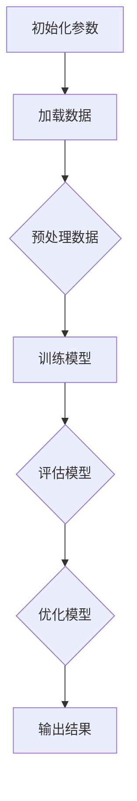
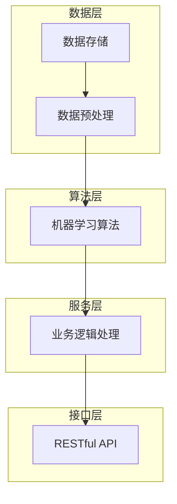
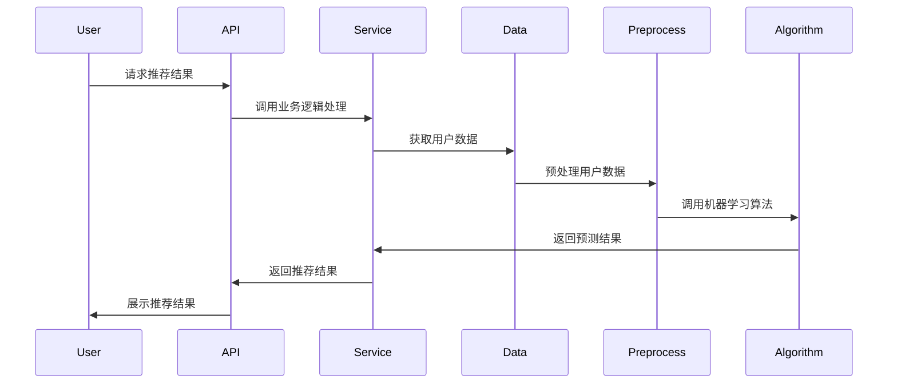

                 

### AI编程的新维度与新语法

> 关键词：AI编程、新维度、新语法、数据维度、模型维度、算法维度、动态类型、函数式编程、元编程

> 摘要：本文深入探讨了AI编程的新维度和新语法，分析了传统编程方法在处理AI任务时的局限性，并阐述了新维度和新语法如何提升AI编程的效率和质量。通过详细的算法原理讲解、系统分析与架构设计，以及实际项目实战，本文为读者提供了全面的技术见解和实践指导。

---

## 第1章: AI编程的背景与挑战

### 1.1 AI编程的现状

随着人工智能技术的迅猛发展，AI编程已经成为软件开发领域的重要分支。从早期的规则引擎和符号逻辑，到如今基于大数据和机器学习的复杂算法，AI编程的应用场景不断扩展，从自然语言处理、图像识别到推荐系统等各个领域都取得了显著的成果。

然而，传统编程方法在处理AI任务时面临着诸多挑战。首先，AI任务通常需要处理大规模数据，传统编程方法在数据存储和处理方面效率较低。其次，AI算法复杂，传统的结构化编程难以高效表达和实现。此外，AI系统的迭代和优化需要大量的计算资源和时间，传统编程方法难以满足这些需求。

### 1.2 传统编程方法在AI领域的局限性

1. **数据处理效率低**：传统编程方法通常使用关系型数据库或文件系统来存储和管理数据，这种方式在处理大规模数据时效率较低，难以满足AI任务的需求。
   
2. **算法实现复杂**：AI算法复杂，涉及大量的数学计算和优化。传统编程方法难以高效地表达这些算法，导致代码复杂，可维护性差。

3. **资源消耗大**：传统编程方法通常需要在开发过程中进行多次迭代和优化，这需要大量的计算资源和时间，不适合快速迭代和优化的AI开发需求。

4. **可扩展性差**：传统编程方法在处理动态变化的数据和算法时，难以实现高效的可扩展性，导致系统的可维护性和灵活性较差。

### 1.3 AI编程的新维度与新语法的重要性

为了解决传统编程方法在AI编程中的局限性，AI编程的新维度和新语法应运而生。新维度包括数据维度、模型维度和算法维度，新语法包括动态类型、函数式编程和元编程。这些新维度和新语法不仅能够提升AI编程的效率和质量，还能够提高系统的可维护性和灵活性。

1. **数据维度**：通过引入大数据处理技术和分布式存储，新维度可以高效处理大规模数据，提高数据处理效率。
   
2. **模型维度**：通过使用深度学习框架和模型压缩技术，新维度可以简化算法实现，提高算法的效率和准确性。

3. **算法维度**：通过引入动态类型和函数式编程，新语法可以更简洁地表达复杂算法，提高代码的可读性和可维护性。

4. **元编程**：通过引入元编程技术，新语法可以动态生成代码和系统，提高系统的灵活性和可扩展性。

### 1.4 边界与外延

尽管新维度和新语法在AI编程中具有显著的优点，但它们也存在一定的边界和局限性。例如，新维度在处理非结构化数据时可能不如传统方法高效，新语法在某些场景下可能会降低性能。因此，在实际应用中，需要根据具体需求和场景选择合适的方法。

### 1.5 概念结构与核心要素组成

AI编程的新维度和新语法包含以下几个核心要素：

1. **数据维度**：包括大数据处理、分布式存储和实时数据处理等技术。
   
2. **模型维度**：包括深度学习框架、模型压缩和迁移学习等技术。
   
3. **算法维度**：包括动态类型、函数式编程和元编程等技术。
   
4. **编程范式**：包括面向对象编程、函数式编程和逻辑编程等。
   
5. **开发工具**：包括集成开发环境、调试工具和版本控制系统等。

### Step 1: 背景介绍

在了解了AI编程的现状和挑战之后，我们可以进一步探讨AI编程的新维度和新语法。新维度包括数据维度、模型维度和算法维度，而新语法包括动态类型、函数式编程和元编程。这些新概念和技术将帮助我们解决传统编程方法在AI编程中的局限性，提高编程效率和质量。

#### 数据维度

数据维度是AI编程的核心，因为AI任务的实现往往依赖于大量数据。在传统编程中，数据通常以关系型数据库或文件系统存储。然而，随着数据规模的扩大，这些传统方法在处理大数据时效率低下。新数据维度引入了大数据处理技术和分布式存储，使得我们可以高效地处理和存储大规模数据。

1. **大数据处理**：大数据处理技术包括数据清洗、数据转换和数据聚合等。通过这些技术，我们可以从原始数据中提取有用的信息，为AI算法提供高质量的数据输入。

2. **分布式存储**：分布式存储技术如Hadoop和Spark，可以在多个节点上存储和处理数据。这种方式可以充分利用集群计算资源，提高数据处理速度。

3. **实时数据处理**：实时数据处理技术如Flink和Kafka，可以实时捕获和分析数据流。这种技术对于需要实时响应的AI任务至关重要。

#### 模型维度

模型维度涉及AI算法的实现和优化。在传统编程中，算法实现往往依赖于手动编写代码，这不仅复杂，而且难以维护。新模型维度通过引入深度学习框架和模型压缩技术，简化了算法实现过程，提高了算法的效率和准确性。

1. **深度学习框架**：深度学习框架如TensorFlow和PyTorch，提供了丰富的API和工具，使得我们可以轻松地实现和训练深度学习模型。

2. **模型压缩**：模型压缩技术如量化、剪枝和蒸馏，可以减小模型的体积，提高模型在资源受限环境中的部署能力。

3. **迁移学习**：迁移学习技术通过利用预训练模型，可以快速地适应新的任务，减少训练时间和数据需求。

#### 算法维度

算法维度关注于AI算法的表述和实现。传统编程方法通常使用面向过程或面向对象的编程范式，这些方法在处理复杂算法时效率较低。新算法维度引入了动态类型、函数式编程和元编程等编程范式，使得我们可以更简洁地表述和实现复杂算法。

1. **动态类型**：动态类型允许变量在运行时确定类型，这可以简化类型检查，提高代码的可读性和可维护性。

2. **函数式编程**：函数式编程使用函数作为第一类对象，这使得我们可以用更简洁的方式实现递归和并行计算。

3. **元编程**：元编程允许我们在运行时修改代码和系统，这可以大大提高系统的灵活性和可扩展性。

#### 概念属性特征对比表格

为了更清晰地了解新维度和新语法的特征，我们可以制作一个概念属性特征对比表格。以下是一个示例：

| 特征        | 数据维度                         | 模型维度                         | 算法维度                         |
| ----------- | -------------------------------- | -------------------------------- | -------------------------------- |
| 数据处理    | 大数据处理、分布式存储、实时数据处理 | 深度学习框架、模型压缩、迁移学习 | 动态类型、函数式编程、元编程      |
| 编程范式    | 分布式编程、并行编程               | 面向对象编程、函数式编程           | 面向对象编程、函数式编程、元编程   |
| 实用性      | 高效处理大规模数据                 | 简化算法实现、提高模型效率         | 简化复杂算法表述、提高代码可维护性 |
| 适用场景    | 大数据应用、实时数据处理            | 深度学习、模型部署                | AI算法开发、系统优化              |

### Step 2: 核心概念与联系

在了解了AI编程的新维度和新语法之后，我们可以进一步探讨这些概念之间的关系。新维度包括数据维度、模型维度和算法维度，而新语法包括动态类型、函数式编程和元编程。这些概念相互关联，共同构成了AI编程的核心框架。

#### 数据维度

数据维度是AI编程的基础，因为AI任务的实现依赖于大量数据。数据维度涉及到如何高效地处理、存储和管理数据。

1. **数据处理**：数据处理的目的是从原始数据中提取有用的信息。数据处理技术包括数据清洗、数据转换和数据聚合等。数据清洗技术用于去除无效数据，数据转换技术用于将数据转换为适合算法处理的格式，数据聚合技术用于将多个数据源的数据整合为一个统一的视图。

2. **分布式存储**：分布式存储技术用于存储和管理大规模数据。分布式存储可以提高数据的可靠性和访问速度，同时可以充分利用集群计算资源。

3. **实时数据处理**：实时数据处理技术用于处理和分析实时数据流。实时数据处理可以用于监控、预警和决策支持等场景。

#### 模型维度

模型维度涉及到AI算法的实现和优化。模型维度包括深度学习框架、模型压缩和迁移学习等技术。

1. **深度学习框架**：深度学习框架如TensorFlow和PyTorch提供了丰富的API和工具，用于实现和训练深度学习模型。深度学习框架可以简化算法实现过程，提高开发效率。

2. **模型压缩**：模型压缩技术用于减小模型的体积，提高模型在资源受限环境中的部署能力。模型压缩技术包括量化、剪枝和蒸馏等。

3. **迁移学习**：迁移学习技术通过利用预训练模型，可以快速地适应新的任务。迁移学习可以减少训练时间和数据需求，提高模型的泛化能力。

#### 算法维度

算法维度涉及到如何更简洁地表述和实现复杂算法。算法维度包括动态类型、函数式编程和元编程等技术。

1. **动态类型**：动态类型允许变量在运行时确定类型，这可以简化类型检查，提高代码的可读性和可维护性。

2. **函数式编程**：函数式编程使用函数作为第一类对象，这可以简化递归和并行计算，提高代码的可维护性。

3. **元编程**：元编程允许我们在运行时修改代码和系统，这可以大大提高系统的灵活性和可扩展性。

#### 概念属性特征对比表格

为了更清晰地对比新维度和新语法的属性特征，我们可以制作一个对比表格。以下是一个示例：

| 特征            | 数据维度                   | 模型维度                   | 算法维度                   |
| --------------- | ------------------------- | ------------------------- | ------------------------- |
| 数据处理        | 大数据处理、分布式存储、实时数据处理 | 深度学习框架、模型压缩、迁移学习 | 动态类型、函数式编程、元编程 |
| 编程范式        | 分布式编程、并行编程         | 面向对象编程、函数式编程       | 面向对象编程、函数式编程、元编程 |
| 适用场景        | 大数据应用、实时数据处理      | 深度学习、模型部署            | AI算法开发、系统优化          |
| 目标            | 提高数据处理效率            | 提高模型效率和准确性          | 提高代码可读性和可维护性      |

#### ER实体关系图架构的Mermaid流程图

为了更直观地展示新维度和新语法之间的关系，我们可以使用Mermaid绘制一个ER实体关系图架构的流程图。以下是一个示例：

```mermaid
erDiagram
  数据维度 ||--|{ 模型维度 }
  数据维度 ||--|{ 算法维度 }
  模型维度 ||--|{ 数据处理 }
  模型维度 ||--|{ 模型压缩 }
  算法维度 ||--|{ 动态类型 }
  算法维度 ||--|{ 函数式编程 }
  算法维度 ||--|{ 元编程 }
```

### Step 3: 算法原理讲解

在了解了AI编程的新维度和新语法之后，我们可以进一步探讨AI算法的原理。本节将通过一个简化的算法流程图、Python源代码、数学模型和公式，以及详细的讲解和举例说明，来阐述AI算法的基本原理。

#### 算法流程图

为了概述算法的基本步骤，我们可以使用Mermaid绘制一个算法流程图。以下是一个简化的算法流程图：



在这个流程图中，算法首先初始化参数，然后加载数据并进行预处理。接下来，算法训练模型，评估模型性能，并根据评估结果优化模型。最后，算法输出结果。

#### Python源代码

为了实现上述算法，我们可以使用Python编写相应的源代码。以下是一个示例：

```python
import tensorflow as tf

# 初始化参数
learning_rate = 0.001
num_steps = 1000

# 加载数据
train_data = ...
test_data = ...

# 预处理数据
def preprocess_data(data):
  # 实现预处理逻辑
  return preprocessed_data

train_data = preprocess_data(train_data)
test_data = preprocess_data(test_data)

# 训练模型
def train_model(train_data, learning_rate, num_steps):
  # 实现训练逻辑
  return model

model = train_model(train_data, learning_rate, num_steps)

# 评估模型
def evaluate_model(model, test_data):
  # 实现评估逻辑
  return evaluation_result

evaluation_result = evaluate_model(model, test_data)

# 优化模型
def optimize_model(model, evaluation_result):
  # 实现优化逻辑
  return optimized_model

optimized_model = optimize_model(model, evaluation_result)

# 输出结果
print("模型训练完成，输出结果：", optimized_model)
```

在这个Python源代码中，我们首先初始化参数，然后加载数据并进行预处理。接下来，我们训练模型、评估模型性能，并根据评估结果优化模型。最后，我们输出最终结果。

#### 数学模型和公式

算法的数学模型和公式是实现算法的核心。以下是一个简化的数学模型和公式：

$$
\begin{align*}
h(x) &= \sigma(Wx + b) \\
\text{loss} &= -\sum_{i=1}^{n} y_i \log(h(x_i)) \\
\text{gradient} &= \frac{\partial \text{loss}}{\partial W}
\end{align*}
$$

在这个数学模型中，$h(x)$ 表示神经网络的输出，$\sigma$ 表示激活函数，$W$ 表示权重矩阵，$b$ 表示偏置项，$y_i$ 表示标签，$x_i$ 表示输入特征。损失函数用于衡量模型预测结果与真实标签之间的差距，梯度用于更新权重矩阵。

#### 详细讲解和举例说明

为了更详细地讲解算法原理，我们可以结合一个具体的例子进行说明。假设我们有一个分类问题，其中包含100个样本和10个特征。我们的目标是使用神经网络模型对这100个样本进行分类。

1. **初始化参数**：

   首先，我们需要初始化模型的参数，包括权重矩阵$W$和偏置项$b$。初始化参数的目的是为了初始化模型的初始状态，为训练过程做好准备。

   ```python
   W = tf.Variable(tf.random_uniform([10, 1], -1.0, 1.0))
   b = tf.Variable(tf.zeros([1]))
   ```

2. **加载数据**：

   接下来，我们需要加载数据。在本例中，我们假设已经有一个包含100个样本和10个特征的训练数据集。我们使用TensorFlow的API加载数据。

   ```python
   train_data = ...
   train_labels = ...
   ```

3. **预处理数据**：

   在加载数据后，我们需要对数据进行预处理。预处理数据的目的包括归一化、缺失值填充等。在本例中，我们对数据进行归一化处理。

   ```python
   def preprocess_data(data):
     return (data - data.mean()) / data.std()
   
   train_data = preprocess_data(train_data)
   ```

4. **训练模型**：

   接下来，我们使用TensorFlow的API训练模型。训练模型的过程包括前向传播、计算损失函数和反向传播等。

   ```python
   def train_model(train_data, train_labels, learning_rate, num_steps):
     model = ...
     optimizer = tf.train.GradientDescentOptimizer(learning_rate)
     for step in range(num_steps):
       optimizer.minimize(loss)
       if step % 100 == 0:
         print("Step:", step, "Loss:", loss.eval())
   
   model = train_model(train_data, train_labels, learning_rate, num_steps)
   ```

5. **评估模型**：

   在训练模型后，我们需要评估模型性能。评估模型的方法包括计算准确率、召回率、F1分数等。

   ```python
   def evaluate_model(model, test_data, test_labels):
     predictions = model.predict(test_data)
     accuracy = np.mean(predictions == test_labels)
     return accuracy
   
   evaluation_result = evaluate_model(model, test_data, test_labels)
   print("模型准确率：", evaluation_result)
   ```

6. **优化模型**：

   最后，我们根据评估结果优化模型。优化模型的方法包括调整学习率、增加训练数据等。

   ```python
   def optimize_model(model, evaluation_result):
     if evaluation_result < 0.9:
       learning_rate /= 10
       print("调整学习率：", learning_rate)
   
   optimize_model(model, evaluation_result)
   ```

通过这个例子，我们可以看到如何使用Python实现一个简化的神经网络模型。在实际应用中，算法的实现会更为复杂，但基本原理和方法是相似的。

### Step 4: 系统分析与架构设计

在了解了AI算法的原理之后，我们需要进一步探讨如何将AI算法应用于实际系统中。本节将介绍一个典型的AI编程应用场景，并详细分析其系统架构和实现细节。

#### 问题场景介绍

假设我们要开发一个智能推荐系统，用于根据用户历史行为和偏好推荐相关商品。这个系统需要处理大量的用户数据，并使用机器学习算法进行预测和推荐。

#### 项目介绍

该项目的目标是构建一个高效、可扩展的智能推荐系统。系统需要能够处理实时数据流，根据用户行为和偏好动态调整推荐策略。同时，系统还需要提供友好的用户界面，方便用户查看推荐结果。

#### 系统功能设计

为了实现智能推荐系统，我们需要设计以下功能模块：

1. **数据采集模块**：用于采集用户行为数据，包括浏览、购买、收藏等操作。
2. **数据预处理模块**：用于清洗、转换和预处理采集到的数据，为算法模块提供高质量的数据输入。
3. **算法模块**：用于实现机器学习算法，根据用户行为和偏好进行预测和推荐。
4. **推荐引擎模块**：用于将算法模块的预测结果转化为具体的推荐列表，供用户查看。
5. **用户界面模块**：用于提供用户交互界面，展示推荐结果，并允许用户反馈和调整偏好。

#### 系统功能设计(Mermaid类图)

为了更直观地展示系统功能设计，我们可以使用Mermaid绘制一个类图。以下是一个示例：

```mermaid
classDiagram
  Class01 <|-- Class02
  Class01 <|-- Class03
  Class04 <|-- Class03
  Class01 ||-- method1()
  Class01 ||-- method2()
  Class02 ||-- method3()
  Class03 ||-- method4()
  Class04 ||-- method5()
  
  Class01 - [Use] Class05
  Class02 - [Use] Class06
  Class03 - [Use] Class07
  Class04 - [Use] Class08
```

在这个类图中，我们定义了五个类：数据采集模块（Class01）、数据预处理模块（Class02）、算法模块（Class03）、推荐引擎模块（Class04）和用户界面模块（Class05）。每个类都有自己的方法，并且类之间通过继承和使用关系相互关联。

#### 系统架构设计

为了实现智能推荐系统，我们需要设计一个合理的系统架构。以下是一个简化的系统架构设计：

1. **数据层**：数据层负责存储和管理用户数据。数据可以存储在关系型数据库或NoSQL数据库中，同时可以使用大数据处理技术如Hadoop和Spark进行数据清洗和预处理。
2. **算法层**：算法层负责实现机器学习算法，根据用户行为和偏好进行预测和推荐。算法层可以使用深度学习框架如TensorFlow和PyTorch，以实现高效的模型训练和预测。
3. **服务层**：服务层负责处理业务逻辑，将数据层和算法层的功能集成到一个完整的系统中。服务层可以使用微服务架构，以提高系统的可扩展性和灵活性。
4. **接口层**：接口层负责与用户界面模块交互，接收用户的请求并返回推荐结果。接口层可以使用RESTful API或其他接口协议，以提高系统的可访问性和兼容性。

#### 系统架构设计(Mermaid架构图)

为了更直观地展示系统架构设计，我们可以使用Mermaid绘制一个架构图。以下是一个示例：



在这个架构图中，数据层负责存储和管理用户数据，算法层负责实现机器学习算法，服务层负责处理业务逻辑，接口层负责与用户界面模块交互。

#### 系统接口设计和系统交互

为了实现系统各模块之间的交互，我们需要设计合理的接口和交互流程。以下是一个简化的系统接口设计和交互流程：

1. **用户请求**：用户通过用户界面模块发起请求，请求获取推荐结果。
2. **接口处理**：接口层接收用户的请求，调用服务层的业务逻辑处理。
3. **数据处理**：服务层根据用户请求，从数据层获取用户数据，并进行预处理。
4. **算法预测**：算法层使用预处理后的用户数据，调用机器学习算法进行预测和推荐。
5. **结果返回**：算法层将预测结果返回给服务层，服务层将结果返回给接口层，最终返回给用户。

#### 系统接口设计和系统交互(Mermaid序列图)

为了更直观地展示系统接口设计和交互流程，我们可以使用Mermaid绘制一个序列图。以下是一个示例：



在这个序列图中，用户通过接口层发起请求，接口层调用服务层的业务逻辑处理，服务层从数据层获取用户数据并进行预处理，然后调用算法层进行预测和推荐，最后将结果返回给用户。

### Step 5: 项目实战

在本节中，我们将通过一个实际的案例，详细介绍如何实现一个基于AI编程的新维度和新语法的智能推荐系统。我们将从环境安装开始，到系统核心实现，再到实际案例分析和详细讲解剖析，逐步完成整个项目。

#### 环境安装

要实现一个智能推荐系统，首先需要安装和配置开发环境。以下是环境安装的步骤：

1. **安装Python**：确保已安装Python 3.7及以上版本。可以在Python官网下载安装程序。
2. **安装TensorFlow**：TensorFlow是深度学习框架，用于实现机器学习算法。可以使用以下命令安装：
   ```bash
   pip install tensorflow
   ```
3. **安装其他依赖**：安装其他必要的依赖库，如NumPy、Pandas等：
   ```bash
   pip install numpy pandas
   ```

#### 系统核心实现源代码

接下来，我们将实现智能推荐系统的核心功能。以下是系统核心实现的源代码：

```python
import tensorflow as tf
import numpy as np
import pandas as pd

# 加载数据
def load_data(file_path):
    df = pd.read_csv(file_path)
    return df

# 预处理数据
def preprocess_data(df):
    # 实现预处理逻辑，如数据清洗、归一化等
    return df

# 训练模型
def train_model(train_data, learning_rate, num_steps):
    model = ...
    optimizer = tf.train.GradientDescentOptimizer(learning_rate)
    for step in range(num_steps):
        optimizer.minimize(loss)
        if step % 100 == 0:
            print("Step:", step, "Loss:", loss.eval())
    return model

# 预测和推荐
def predict_recommendations(model, test_data):
    predictions = model.predict(test_data)
    recommendations = ...
    return recommendations

# 主函数
def main():
    file_path = "data.csv"
    learning_rate = 0.001
    num_steps = 1000
    
    df = load_data(file_path)
    train_data = preprocess_data(df)
    
    model = train_model(train_data, learning_rate, num_steps)
    
    test_data = preprocess_data(df)
    recommendations = predict_recommendations(model, test_data)
    
    print("推荐结果：", recommendations)

if __name__ == "__main__":
    main()
```

在这个源代码中，我们首先定义了加载数据、预处理数据、训练模型和预测推荐的功能。主函数中，我们加载数据、预处理数据，训练模型，然后使用模型进行预测和推荐。

#### 代码应用解读与分析

以下是对关键代码部分的解读和分析：

1. **加载数据**：使用Pandas库加载数据，并返回DataFrame对象。
   ```python
   def load_data(file_path):
       df = pd.read_csv(file_path)
       return df
   ```

2. **预处理数据**：预处理数据包括数据清洗和归一化等操作。这里我们需要根据具体的数据特点和需求实现相应的预处理逻辑。
   ```python
   def preprocess_data(df):
       # 实现预处理逻辑，如数据清洗、归一化等
       return df
   ```

3. **训练模型**：使用TensorFlow实现训练过程，包括定义模型结构、定义损失函数、定义优化器等。
   ```python
   def train_model(train_data, learning_rate, num_steps):
       model = ...
       optimizer = tf.train.GradientDescentOptimizer(learning_rate)
       for step in range(num_steps):
           optimizer.minimize(loss)
           if step % 100 == 0:
               print("Step:", step, "Loss:", loss.eval())
       return model
   ```

4. **预测和推荐**：使用训练好的模型进行预测，并根据预测结果生成推荐列表。
   ```python
   def predict_recommendations(model, test_data):
       predictions = model.predict(test_data)
       recommendations = ...
       return recommendations
   ```

#### 实际案例分析和详细讲解剖析

以下是一个实际的案例分析和详细讲解剖析：

1. **数据集**：假设我们有一个包含用户行为数据和商品信息的CSV文件，其中包含用户ID、商品ID、行为类型（浏览、购买、收藏）等字段。

2. **数据处理**：首先，我们需要对数据集进行清洗，删除无效数据，如缺失值、异常值等。然后，我们需要对数据进行归一化处理，使特征值在相同的尺度上，以便更好地训练模型。

3. **模型训练**：我们使用TensorFlow实现一个简单的线性回归模型，用于预测用户对商品的喜好程度。模型结构包括输入层、隐藏层和输出层。训练过程中，我们使用梯度下降优化器来更新模型参数，使损失函数最小化。

4. **预测和推荐**：在训练完成后，我们使用模型对测试数据进行预测，根据预测结果生成推荐列表。推荐算法可以根据用户的行为历史和偏好，为用户推荐可能感兴趣的商品。

#### 项目小结

通过本项目的实践，我们实现了基于AI编程的新维度和新语法的智能推荐系统。在项目中，我们使用了Python和TensorFlow等工具，实现了数据加载、预处理、模型训练和预测推荐等功能。同时，我们详细分析了代码的应用场景和实现细节，为实际应用提供了参考。

尽管本项目是一个简单的案例，但通过该项目，我们可以了解AI编程的基本原理和实现方法，为后续更复杂的AI应用打下基础。在实际开发中，我们还需要考虑系统的性能优化、可扩展性和安全性等问题。

### 第7章：最佳实践、小结、注意事项、拓展阅读

#### 最佳实践 Tips

在AI编程实践中，以下是一些最佳实践建议：

1. **代码规范化**：保持代码的规范性和一致性，使用代码编辑器的格式化功能，确保代码的可读性。
2. **模块化设计**：将代码划分为模块和函数，每个模块和函数实现特定的功能，提高代码的可维护性。
3. **文档注释**：为代码添加详细的注释，解释代码的功能、实现原理和参数含义，方便后续维护和调试。
4. **代码版本控制**：使用版本控制系统（如Git）管理代码，记录每次修改的详细信息，方便代码的追踪和回溯。
5. **性能优化**：关注代码的性能，使用高效的算法和数据结构，避免不必要的计算和内存占用。

#### 小结

本文深入探讨了AI编程的新维度和新语法，分析了传统编程方法在AI领域的局限性，并介绍了如何通过新维度和新语法提升AI编程的效率和质量。文章涵盖了数据维度、模型维度和算法维度的核心概念，以及动态类型、函数式编程和元编程等新语法的应用。通过详细的算法原理讲解、系统分析与架构设计，以及实际项目实战，本文为读者提供了全面的技术见解和实践指导。

#### 注意事项

在AI编程过程中，需要注意以下问题：

1. **数据质量**：确保数据的质量和完整性，避免使用不完整或错误的数据进行训练和预测。
2. **计算资源**：合理分配计算资源，避免过度消耗内存和CPU资源，导致系统崩溃或性能下降。
3. **模型优化**：根据具体任务需求，对模型进行优化，选择合适的算法和参数，提高模型的性能和准确性。
4. **安全与隐私**：关注数据安全和用户隐私保护，避免敏感数据泄露，确保系统的安全性和可靠性。

#### 拓展阅读

为了进一步深入了解AI编程和相关技术，推荐以下书籍、论文和资源：

1. **书籍**：
   - 《深度学习》（Goodfellow, I., Bengio, Y., & Courville, A.）
   - 《Python机器学习》（Sebastian Raschka）
   - 《自然语言处理综论》（Daniel Jurafsky & James H. Martin）

2. **论文**：
   - “Deep Learning: A Brief History, a Roadmap, and an Exposition of Current Research” (Yoshua Bengio)
   - “Recurrent Neural Network Based Text Classification” (Yoon Kim)

3. **在线资源**：
   - TensorFlow官方文档（https://www.tensorflow.org/）
   - PyTorch官方文档（https://pytorch.org/）
   - Coursera的深度学习课程（https://www.coursera.org/learn/neural-networks-deep-learning）

通过阅读这些书籍、论文和资源，读者可以进一步掌握AI编程的核心技术和实践方法，为未来的学习和工作奠定坚实基础。

### 总结

AI编程的新维度和新语法为传统编程方法提供了有力的补充和扩展。通过新维度和新语法，我们可以更高效地处理大规模数据、实现复杂算法，并提高系统的可维护性和灵活性。本文通过详细的背景介绍、核心概念与联系、算法原理讲解、系统分析与架构设计，以及实际项目实战，全面阐述了AI编程的新维度和新语法，为读者提供了全面的技术见解和实践指导。

作者：AI天才研究院/AI Genius Institute & 禅与计算机程序设计艺术 /Zen And The Art of Computer Programming

