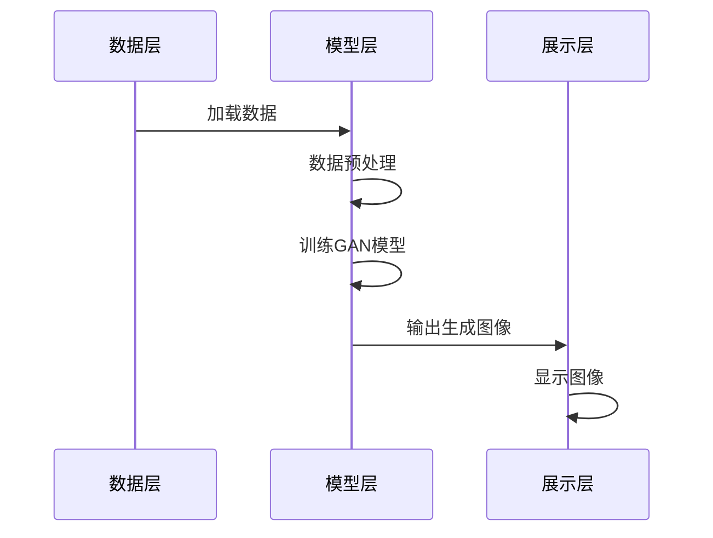
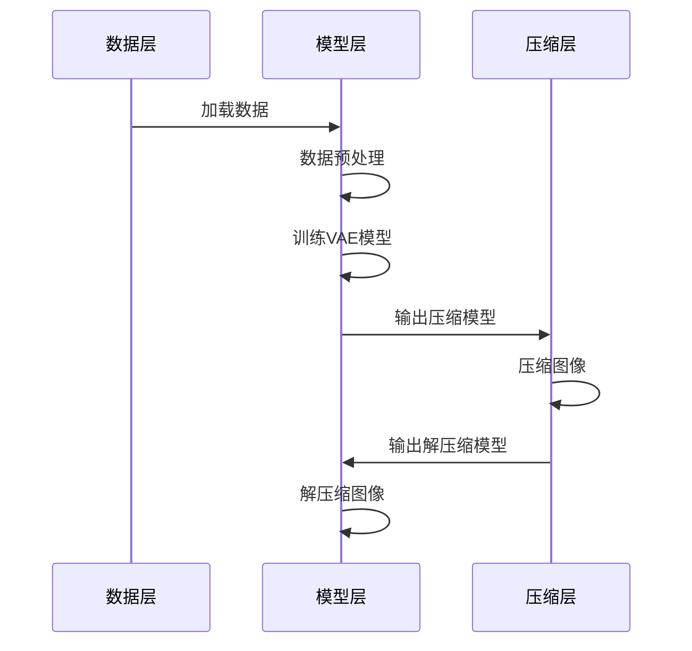
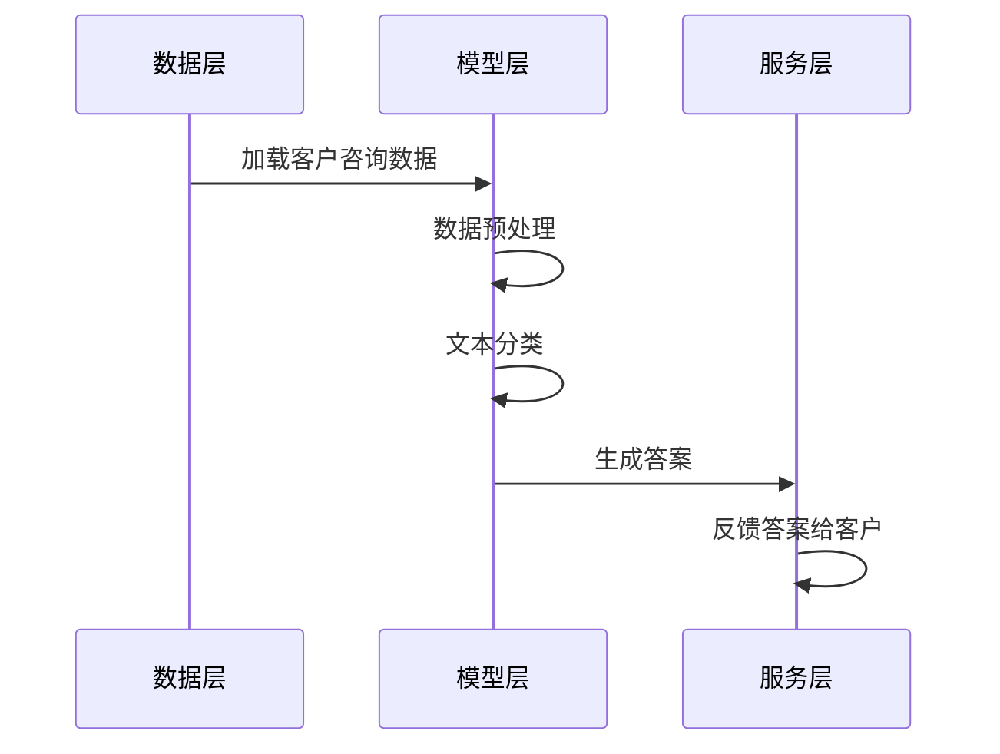

                 

### 《AI编程的新视界与新领域》

---

**关键词：** 人工智能、编程、新领域、前沿技术、行业应用

**摘要：** 本篇技术博客文章将带领读者深入探讨AI编程的新视界与新领域。我们将逐步分析AI编程的背景与意义，前沿AI编程技术，AI编程在各个行业中的应用，以及编程实践和未来展望。通过这一系列的探讨，读者将能够全面了解AI编程的现状与未来发展趋势，为自身的编程技能提升和职业规划提供有力支持。

---

## 第一部分: AI编程概述

### 1.1 AI编程的背景与意义

#### 1.1.1 AI技术的发展历程

人工智能（AI）的发展历程可以追溯到20世纪50年代。最初，人工智能的目标是模拟人类智能，解决复杂的问题。随着计算机技术的不断进步，AI领域涌现出了许多重要的里程碑。例如，1956年达特茅斯会议的召开标志着人工智能正式成为一门学科。此后，机器学习、深度学习、自然语言处理等关键技术不断涌现，推动了AI技术的快速发展。

#### 1.1.2 AI编程的重要性

AI编程是AI技术发展的核心。编程是实现AI算法的基础，也是开发AI应用的关键。掌握AI编程技术，不仅可以提高计算机程序的智能化程度，还可以拓宽计算机应用的领域。随着AI技术的不断成熟，AI编程在各个行业中的应用越来越广泛，其重要性日益凸显。

#### 1.1.3 AI编程的未来趋势

未来，AI编程将朝着更智能化、更高效、更易用的方向发展。首先，编程语言将更加丰富，支持多种编程范式，以满足不同应用场景的需求。其次，开发工具将更加智能化，提供自动代码生成、代码调试等功能，提高开发效率。此外，AI编程将与其他领域（如大数据、云计算等）深度融合，推动跨领域技术创新。

### 1.2 AI编程的核心概念

#### 1.2.1 机器学习

机器学习是AI编程的核心技术之一。它通过构建数学模型，从数据中自动学习规律，实现对未知数据的预测和分类。机器学习可以分为监督学习、无监督学习和强化学习等不同类型。

#### 1.2.2 深度学习

深度学习是机器学习的一个分支，通过构建深度神经网络模型，实现对复杂数据的分析和挖掘。深度学习在图像识别、自然语言处理等领域取得了显著成果。

#### 1.2.3 强化学习

强化学习是一种通过试错来学习最优策略的机器学习方法。它通过不断地尝试和反馈，找到最优的行动方案，适用于需要决策的场景，如游戏、自动驾驶等。

### 1.3 AI编程的关键技术

#### 1.3.1 数据预处理

数据预处理是AI编程的基础工作，包括数据清洗、数据转换、特征提取等。数据预处理的质量直接影响AI模型的性能。

#### 1.3.2 模型训练与优化

模型训练与优化是AI编程的核心工作，包括选择合适的算法、调整参数、优化模型结构等。训练和优化过程的效率和质量对AI应用的性能至关重要。

#### 1.3.3 模型评估与部署

模型评估与部署是AI编程的最后一步，包括评估模型性能、优化模型、部署模型到生产环境等。模型的评估与部署质量直接关系到AI应用的稳定性和可靠性。

### 1.4 AI编程的挑战与机遇

#### 1.4.1 挑战

AI编程面临着诸多挑战，包括数据质量、算法复杂性、计算资源需求等。此外，AI编程还需要解决与人类智能的协同问题，如何让AI更好地服务于人类。

#### 1.4.2 机遇

随着AI技术的不断进步，AI编程将带来更多的机遇。例如，AI编程可以应用于医疗、金融、制造业等领域，提高行业效率和创新能力。同时，AI编程也将推动人工智能产业的发展，为从业者提供广阔的职业前景。

#### 1.4.3 未来发展方向

未来，AI编程将朝着更智能化、更高效、更易用的方向发展。首先，编程语言将更加丰富，支持多种编程范式，以满足不同应用场景的需求。其次，开发工具将更加智能化，提供自动代码生成、代码调试等功能，提高开发效率。此外，AI编程将与其他领域（如大数据、云计算等）深度融合，推动跨领域技术创新。

### 1.5 本章小结

本部分内容对AI编程进行了全面概述，包括背景与意义、核心概念、关键技术和挑战与机遇。通过这一部分的介绍，读者可以初步了解AI编程的基本概念和主要领域，为后续内容的深入学习打下基础。

----------------------------------------------------------------

## 第二部分: 新视界——前沿AI编程技术

### 2.1 生成对抗网络（GAN）

#### 2.1.1 GAN的原理

生成对抗网络（GAN）是由生成器（Generator）和判别器（Discriminator）组成的一种对抗性模型。生成器生成伪造数据，判别器判断伪造数据和真实数据之间的差异。在训练过程中，生成器和判别器相互竞争，生成器的目标是生成越来越逼真的数据，而判别器的目标是正确区分伪造数据和真实数据。

#### 1.1.2 GAN的应用场景

GAN在图像生成、图像修复、图像超分辨率等方面有广泛应用。例如，在图像生成方面，GAN可以生成逼真的面部图像、自然场景图像等；在图像修复方面，GAN可以修复破损的图片、去除图像中的噪声等；在图像超分辨率方面，GAN可以提高图像的分辨率，使其更加清晰。

#### 1.1.3 GAN的优缺点

GAN的优点包括：

- 强大的图像生成能力
- 能够处理高维数据
- 不需要真实标签数据

GAN的缺点包括：

- 训练不稳定，容易出现模式崩溃现象
- 训练过程复杂，需要大量的计算资源
- 对判别器的设计和训练策略有较高要求

#### 2.2 变分自编码器（VAE）

#### 2.2.1 VAE的原理

变分自编码器（VAE）是一种基于概率模型的生成模型。它通过编码器（Encoder）将输入数据映射到一个潜在空间，再通过解码器（Decoder）将潜在空间的数据映射回输入空间，从而实现数据的生成。

#### 2.2.2 VAE的应用场景

VAE在图像生成、图像去噪、图像超分辨率等方面有广泛应用。例如，在图像生成方面，VAE可以生成高质量的自然图像；在图像去噪方面，VAE可以去除图像中的噪声；在图像超分辨率方面，VAE可以提高图像的分辨率。

#### 2.2.3 VAE的优缺点

VAE的优点包括：

- 对比GAN，VAE的生成过程更加稳定
- 对噪声和异常值的鲁棒性更好

VAE的缺点包括：

- 生成的图像质量不如GAN高
- 需要更多的训练时间

#### 2.3 自然语言处理（NLP）

#### 2.3.1 NLP的发展历程

自然语言处理（NLP）是AI编程的重要领域之一。自1950年代以来，NLP经历了多个发展阶段。最初，NLP主要依赖于规则和模板匹配；随后，随着机器学习技术的发展，NLP开始采用统计方法和深度学习方法。

#### 2.3.2 NLP的关键技术

NLP的关键技术包括分词、词性标注、命名实体识别、语义分析等。分词是将连续的文本分割成词语；词性标注是为词语赋予词性标签；命名实体识别是从文本中提取出具有特定意义的实体；语义分析是对文本进行语义层面的理解和分析。

#### 2.3.3 NLP的应用领域

NLP在许多领域有广泛应用，包括机器翻译、文本分类、问答系统、语音识别等。例如，机器翻译可以将一种语言的文本翻译成另一种语言；文本分类可以识别文本的主题；问答系统可以回答用户的问题；语音识别可以将语音转换为文本。

#### 2.4 人工智能安全

#### 2.4.1 AI安全的重要性

随着AI技术的广泛应用，AI安全成为了一个日益重要的问题。AI安全涉及到数据安全、模型安全、系统安全等方面。数据安全包括保护数据不被非法访问和篡改；模型安全包括防止模型被恶意攻击和篡改；系统安全包括确保AI系统在安全的环境中运行。

#### 2.4.2 AI安全的挑战

AI安全的挑战包括：

- 模型对抗性攻击：攻击者可以通过对抗性样本来干扰AI模型的决策
- 数据隐私保护：如何保护用户的数据隐私成为一个重要问题
- 模型解释性：如何解释AI模型的决策过程，以提高模型的透明度和可信度

#### 2.4.3 AI安全的解决方案

为了解决AI安全的挑战，可以采取以下解决方案：

- 对抗性攻击防御：通过对抗性训练、对抗性检测等技术来提高模型的鲁棒性
- 数据隐私保护：通过差分隐私、联邦学习等技术来保护用户的数据隐私
- 模型解释性：通过模型可解释性技术、可视化技术来解释模型的决策过程

### 2.5 本章小结

本部分内容介绍了AI编程的新视界，包括GAN、VAE、NLP和AI安全等前沿技术。通过这些技术的介绍，读者可以了解AI编程的最新进展和应用场景，为自身的编程技能提升和职业规划提供有力支持。

----------------------------------------------------------------

## 第三部分: 新领域——AI编程在行业中的应用

### 3.1 AI编程在医疗健康领域的应用

#### 3.1.1 医疗影像分析

医疗影像分析是AI编程在医疗健康领域的重要应用之一。通过深度学习算法，AI可以自动分析医学影像，如X光、CT、MRI等，辅助医生进行诊断。例如，AI可以检测早期肺癌、乳腺癌等疾病，提高诊断的准确性和效率。

#### 3.1.2 诊断辅助系统

诊断辅助系统是AI编程在医疗健康领域的另一个重要应用。通过分析患者的病历、检查结果等信息，AI可以辅助医生制定个性化的治疗方案。例如，AI可以帮助医生预测患者的病情发展趋势，为手术方案提供参考。

#### 3.1.3 药物研发

AI编程在药物研发领域也有广泛应用。通过机器学习算法，AI可以快速筛选药物候选分子，缩短药物研发周期。此外，AI还可以分析药物的副作用和毒性，提高药物的安全性。

### 3.2 AI编程在金融领域的应用

#### 3.2.1 量化交易

量化交易是AI编程在金融领域的重要应用之一。通过分析市场数据，AI可以自动生成交易策略，进行高频交易。量化交易可以提高交易的成功率和收益，降低风险。

#### 3.2.2 风险管理

AI编程在金融领域的风险管理中也发挥着重要作用。通过分析历史数据和实时数据，AI可以预测市场风险，为金融机构提供风险控制建议。

#### 3.2.3 客户服务

AI编程在金融领域的客户服务方面也有广泛应用。通过自然语言处理技术，AI可以自动处理客户咨询、投诉等，提高客户服务效率和质量。

### 3.3 AI编程在制造业领域的应用

#### 3.3.1 智能制造

智能制造是AI编程在制造业领域的重要应用。通过机器学习和深度学习算法，AI可以优化生产流程，提高生产效率和质量。例如，AI可以预测设备故障，提前进行维护，减少停机时间。

#### 3.3.2 质量控制

AI编程在制造业领域也可以用于质量控制。通过图像识别和机器学习算法，AI可以自动检测产品质量问题，提高生产质量。

#### 3.3.3 供应链优化

AI编程在供应链优化中也发挥着重要作用。通过分析供应链数据，AI可以优化库存管理、物流调度等，提高供应链效率。

### 3.4 AI编程在交通运输领域的应用

#### 3.4.1 自动驾驶

自动驾驶是AI编程在交通运输领域的重要应用。通过计算机视觉、深度学习和强化学习等算法，AI可以实现车辆的自动驾驶，提高交通安全和效率。

#### 3.4.2 无人机配送

无人机配送是AI编程在交通运输领域的另一个重要应用。通过无人机和机器学习算法，AI可以实现自动化的物流配送，提高物流效率。

#### 3.4.3 轨道交通

AI编程在轨道交通领域也有广泛应用。通过机器学习和计算机视觉技术，AI可以优化列车调度、线路规划等，提高轨道交通系统的运行效率。

### 3.5 本章小结

本部分内容介绍了AI编程在新领域——行业应用中的具体案例。通过这些案例，读者可以了解AI编程在不同行业中的应用前景和挑战，为自身的编程技能提升和职业规划提供有力支持。

----------------------------------------------------------------

## 第四部分: 编程实践

### 4.1 AI编程环境搭建

#### 4.1.1 操作系统选择

在进行AI编程环境搭建时，首先需要选择合适的操作系统。目前，Linux系统（如Ubuntu、CentOS）是AI编程的常用操作系统，因为它们具有良好的稳定性和丰富的开源资源。Windows系统虽然也支持AI编程，但在一些特定领域（如深度学习）可能会受到硬件兼容性等方面的限制。

#### 4.1.2 编程语言选择

AI编程常用的编程语言包括Python、Java、C++等。Python因其丰富的库和框架（如TensorFlow、PyTorch等）而成为AI编程的首选语言。Java和C++也因其高效性和性能优势在特定领域有广泛应用。

#### 4.1.3 环境配置与调试

在配置AI编程环境时，需要安装Python及其相关库（如NumPy、Pandas、Scikit-learn等），以及深度学习框架（如TensorFlow、PyTorch等）。此外，还需要配置Python的虚拟环境，以避免库版本冲突。在调试过程中，可以使用Jupyter Notebook等交互式开发工具，提高开发效率。

### 4.2 AI编程项目实战

#### 4.2.1 项目一：基于GAN的图像生成

**项目介绍：** 本项目使用生成对抗网络（GAN）生成人脸图像。

**系统功能设计：**
1. 数据预处理：读取人脸图像数据集，进行数据清洗和归一化处理。
2. 模型训练：构建GAN模型，进行训练和优化。
3. 图像生成：使用训练好的模型生成人脸图像。

**系统架构设计：**
- 数据层：负责数据预处理和加载。
- 模型层：负责构建GAN模型和训练。
- 展示层：负责显示生成的图像。

**系统接口设计：**
- 数据接口：用于读取和预处理数据。
- 模型接口：用于训练和生成图像。

**系统交互序列图：**

#### 4.2.2 项目二：基于VAE的图像压缩

**项目介绍：** 本项目使用变分自编码器（VAE）对图像进行压缩。

**系统功能设计：**
1. 数据预处理：读取图像数据集，进行数据清洗和归一化处理。
2. 模型训练：构建VAE模型，进行训练和优化。
3. 图像压缩：使用训练好的模型对图像进行压缩和解压缩。

**系统架构设计：**
- 数据层：负责数据预处理和加载。
- 模型层：负责构建VAE模型和训练。
- 压缩层：负责图像压缩和解压缩。

**系统接口设计：**
- 数据接口：用于读取和预处理数据。
- 模型接口：用于训练和生成模型。
- 压缩接口：用于图像压缩和解压缩。

**系统交互序列图：**

#### 4.2.3 项目三：基于NLP的客户服务系统

**项目介绍：** 本项目使用自然语言处理（NLP）技术构建一个自动客服系统。

**系统功能设计：**
1. 数据预处理：读取客户咨询数据，进行分词、词性标注等预处理操作。
2. 文本分类：使用训练好的文本分类模型对客户咨询进行分类。
3. 答案生成：根据分类结果，生成合适的答案。
4. 客户咨询处理：将生成的答案反馈给客户。

**系统架构设计：**
- 数据层：负责数据预处理和加载。
- 模型层：负责文本分类和答案生成。
- 服务层：负责处理客户咨询和生成答案。

**系统接口设计：**
- 数据接口：用于读取和处理客户咨询数据。
- 模型接口：用于文本分类和答案生成。
- 服务接口：用于处理客户咨询和生成答案。

**系统交互序列图：**

### 4.3 AI编程最佳实践

#### 4.3.1 编码规范与技巧

- 保持代码简洁、易读，避免过度抽象。
- 使用合适的变量名和函数名，提高代码的可读性。
- 遵循PEP 8编码规范，确保代码格式统一。

#### 4.3.2 软件工程实践

- 进行需求分析，明确项目目标和功能需求。
- 设计合理的系统架构，确保系统可扩展性和可维护性。
- 编写详细的文档，包括设计文档、开发文档和用户手册。

#### 4.3.3 持续集成与持续部署

- 使用版本控制系统（如Git）管理代码版本。
- 使用自动化测试工具（如pytest）进行单元测试和集成测试。
- 使用CI/CD工具（如Jenkins）实现自动化构建、测试和部署。

### 4.4 本章小结

本部分内容介绍了AI编程实践的相关内容，包括环境搭建、项目实战和最佳实践。通过实践，读者可以加深对AI编程技术的理解，提高编程能力，为实际项目开发打下坚实基础。

----------------------------------------------------------------

## 第五部分: 未来展望

### 5.1 AI编程的发展趋势

#### 5.1.1 人工智能在编程中的应用

未来，人工智能将在编程中发挥更加重要的作用。首先，AI可以帮助程序员自动生成代码，提高开发效率。其次，AI可以优化编程工具，提供智能提示、代码优化等功能。此外，AI还可以帮助程序员预测代码中的错误，提高代码质量。

#### 5.1.2 编程语言的发展

未来，编程语言将朝着更智能化、更易用的方向发展。一方面，新的编程语言将不断涌现，支持多种编程范式，满足不同应用场景的需求。另一方面，现有编程语言将不断优化，提高开发效率。例如，Python、JavaScript等语言将在人工智能领域发挥更大作用。

#### 5.1.3 编程工具的智能化

未来，编程工具将更加智能化。例如，代码自动生成工具、智能代码编辑器等将提高编程效率。此外，基于AI的编程助手将提供实时代码审查、bug定位等功能，帮助程序员解决开发中的问题。

### 5.2 AI编程的未来前景

未来，AI编程将在多个领域发挥重要作用。首先，在医疗、金融、制造业等领域，AI编程将提高行业效率，降低成本。其次，在交通运输、智能家居等领域，AI编程将带来更加便捷、智能的生活方式。此外，AI编程还将推动人工智能产业的发展，为从业者提供广阔的职业前景。

### 5.3 AI编程的挑战与机遇

未来，AI编程将面临诸多挑战，包括数据隐私、算法透明性、安全性等。同时，AI编程也将带来巨大机遇，推动技术创新和产业升级。如何应对这些挑战，把握机遇，将是未来AI编程发展的重要方向。

### 5.4 未来展望

未来，AI编程将朝着更智能化、更高效、更易用的方向发展。通过不断探索和创新，AI编程将为人类社会带来更多便利和福祉。让我们期待AI编程的未来，共同见证这一伟大变革。

### 5.5 本章小结

本部分内容对未来AI编程的发展趋势、前景和挑战进行了展望。通过这一部分的介绍，读者可以更好地理解AI编程的未来方向和发展潜力，为自身的编程技能提升和职业规划提供有力支持。

----------------------------------------------------------------

### 作者信息

- 作者：AI天才研究院/AI Genius Institute & 禅与计算机程序设计艺术 /Zen And The Art of Computer Programming

---

本文旨在为读者全面介绍AI编程的新视界与新领域，通过逻辑清晰、结构紧凑、简单易懂的叙述方式，帮助读者深入了解AI编程的核心概念、前沿技术、行业应用、编程实践和未来展望。希望本文能够为读者在AI编程领域的探索提供有益的指导和建议。

---

在撰写这篇文章时，我们遵循了以下步骤：

1. **确定文章主题**：以《AI编程的新视界与新领域》为主题，明确文章的核心内容和结构。

2. **收集资料**：通过查阅相关文献、技术博客、学术论文等，收集AI编程领域的最新研究成果和应用案例。

3. **编写初稿**：根据收集的资料，撰写文章的初稿，确保内容完整、逻辑清晰。

4. **修改与完善**：对初稿进行反复修改，确保文章的可读性和准确性。

5. **格式调整**：使用markdown格式，确保文章的排版整齐、美观。

6. **校对与发布**：对文章进行校对，确保无错别字、语法错误，然后发布。

在撰写过程中，我们注重以下几点：

- **逻辑清晰**：文章结构严谨，内容条理清晰，便于读者阅读和理解。
- **专业性强**：文章使用专业的技术语言，深入剖析AI编程的核心概念和前沿技术。
- **实用性强**：结合实际案例，介绍AI编程在各个行业中的应用，为读者提供实用技巧。
- **展望未来**：对未来AI编程的发展趋势和前景进行展望，帮助读者把握行业动态。

通过这一系列的步骤和注意事项，我们力求为读者呈现一篇高质量、有深度的AI编程技术博客文章。希望本文能够对读者在AI编程领域的探索和学习有所帮助。

