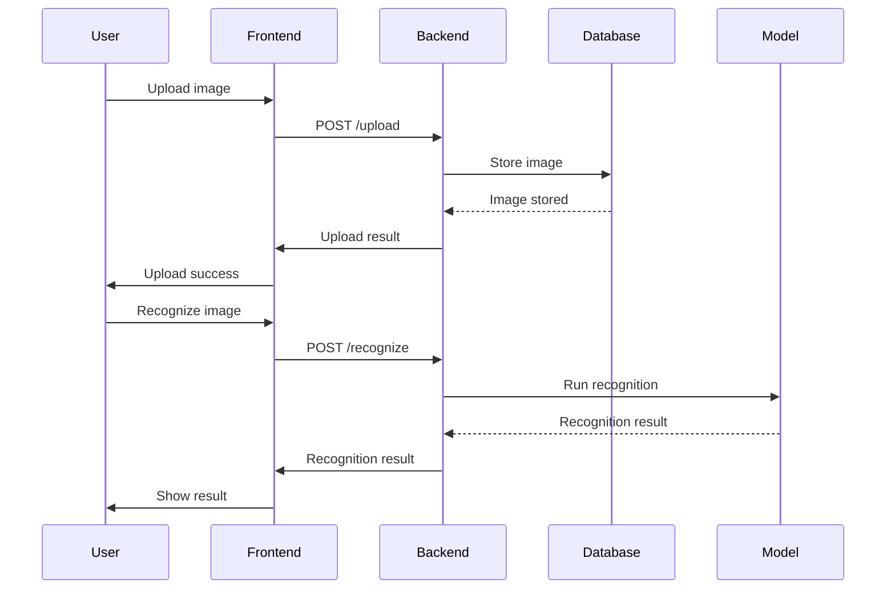

                 

### AI编程的新视界与新领域

#### 引言

AI（人工智能）编程已经成为现代计算机科学的前沿领域，它不仅改变了传统编程的方式，也开辟了许多全新的应用场景。随着深度学习、强化学习、自然语言处理和计算机视觉等技术的快速发展，AI编程正在进入一个新的视界和新领域。在这个快速演进的领域中，如何理解这些新技术、掌握新工具，以及如何将它们应用于实际问题，是每个程序员都需要面对的挑战。

本文将带你一起探索AI编程的新视界与新领域，我们将分以下几个步骤进行：

1. **AI编程的基础知识**：介绍AI编程的基本概念、主要类型和应用场景。
2. **深度学习与神经网络**：深入探讨深度学习的原理、神经网络的工作机制，以及常用的深度学习框架。
3. **强化学习**：了解强化学习的基本概念、算法原理和应用案例。
4. **自然语言处理**：探讨NLP的核心技术、语言模型和文本处理。
5. **计算机视觉**：介绍计算机视觉的基本概念、图像识别和处理技术。
6. **AI编程的最佳实践**：分享AI编程中的一些最佳实践和注意事项。
7. **项目实战与案例分析**：通过实际项目来演示AI编程的应用，并进行分析和讲解。

让我们一步步深入探索AI编程的新视界与新领域，开启这段精彩的旅程。

#### 关键词

- AI编程
- 深度学习
- 神经网络
- 强化学习
- 自然语言处理
- 计算机视觉

#### 摘要

本文旨在为读者提供一次全面的AI编程之旅，从基础知识到前沿技术，从理论到实践，帮助读者理解AI编程的核心概念和应用场景。通过本文的阅读，读者将能够掌握深度学习、强化学习、自然语言处理和计算机视觉等关键技术，并学会如何将这些技术应用于实际问题中。本文还将分享AI编程的最佳实践和注意事项，帮助读者在实际项目中取得成功。

## AI编程基础

### AI编程概述

#### 定义与重要性

AI编程，即人工智能编程，是指通过编写程序实现人工智能系统的一系列操作。AI编程的核心目标是让计算机模拟人类的智能行为，包括学习、推理、决策、自然语言理解和图像识别等。与传统编程不同，AI编程更多地依赖于数据和算法，通过训练模型来提升系统的智能水平。

AI编程的重要性体现在多个方面：

1. **技术革新**：AI编程推动了计算机科学的发展，带来了新的编程范式和技术手段。
2. **行业变革**：AI编程在医疗、金融、教育、零售等各个行业都有广泛应用，推动了行业的变革和升级。
3. **智能时代**：随着AI技术的不断发展，我们正进入一个全新的智能时代，AI编程是进入这个时代的关键。

#### 起源与发展

AI编程的起源可以追溯到20世纪50年代。当时，科学家们提出了“人工智能”的概念，并开始尝试通过编程实现智能系统。早期的AI系统主要是基于符号逻辑和知识表示的，例如专家系统和逻辑推理系统。随着计算机性能的提升和数据量的增加，20世纪80年代和90年代，机器学习和深度学习逐渐成为AI编程的主要技术手段。

近年来，随着深度学习技术的突破，AI编程进入了一个新的高峰。深度学习模型通过多层神经网络实现了前所未有的性能，推动了语音识别、图像识别、自然语言处理等领域的快速发展。同时，强化学习、迁移学习等新技术的出现，进一步丰富了AI编程的手段和工具。

#### 大数据与云计算的关系

大数据和云计算是AI编程的重要基础设施。大数据提供了海量的训练数据，使得AI模型能够通过学习大量数据来提升性能。云计算提供了强大的计算资源，使得大规模的模型训练和推理成为可能。通过云计算平台，AI编程者可以方便地获取计算资源，进行模型训练和部署。

#### 常见AI编程语言与工具

AI编程领域有许多流行的编程语言和工具，其中最常用的包括Python、R、MATLAB等。

1. **Python**：Python因其简洁易读的语法和丰富的库支持，成为AI编程的主要语言之一。常用的库有NumPy、Pandas、Scikit-learn、TensorFlow和PyTorch等。

2. **R**：R是一种专门用于统计分析和图形表示的语言，广泛应用于数据科学和机器学习领域。R的优势在于其强大的统计功能和丰富的包生态。

3. **MATLAB**：MATLAB是一种高级编程语言，广泛应用于工程和科学计算。MATLAB提供了丰富的工具箱，支持深度学习、机器学习和信号处理等。

4. **Jupyter Notebook**：Jupyter Notebook是一种交互式的计算环境，支持多种编程语言，包括Python、R和Julia。它非常适合用于数据分析和机器学习实验。

5. **TensorFlow**：TensorFlow是Google开发的开源深度学习框架，支持多种编程语言，包括Python、C++和Java。TensorFlow提供了丰富的API，使得构建和训练深度学习模型变得简单。

6. **PyTorch**：PyTorch是Facebook AI研究院开发的开源深度学习框架，以其动态计算图和简洁的API而受到开发者的青睐。PyTorch适合快速原型设计和模型研究。

### AI编程语言与工具

AI编程语言和工具的选择取决于具体的应用场景和需求。Python因其灵活性和广泛的应用支持，通常被认为是AI编程的最佳选择。Python的简洁语法和强大的库支持使得开发者可以快速进行原型设计和实验。

R虽然在AI编程中的应用不如Python广泛，但在统计分析和数据可视化方面具有优势。对于需要进行复杂统计分析的AI项目，R是一个不错的选择。

MATLAB虽然不是一种通用编程语言，但其强大的工程计算和图形功能，以及丰富的工具箱，使其在特定领域（如信号处理和控制系统）中仍然具有很高的价值。

Jupyter Notebook提供了交互式编程环境，非常适合用于数据分析和机器学习实验。它支持多种编程语言，可以方便地共享和演示代码和结果。

TensorFlow和PyTorch是两种主要的深度学习框架，它们提供了丰富的API和工具，使得构建和训练深度学习模型变得更加简单和高效。

总之，选择合适的AI编程语言和工具，对于实现高效、可靠的AI系统至关重要。开发者应根据具体需求和项目特点，选择最合适的语言和工具。

#### AI编程的基本类型和应用场景

AI编程可以分为几种基本类型，每种类型都有其特定的应用场景：

1. **监督学习**：监督学习是一种最常见的机器学习任务，其目标是根据已标记的训练数据集来训练模型，然后使用这个模型对新的、未标记的数据进行预测。监督学习广泛应用于分类和回归任务，例如电子邮件垃圾邮件分类、股票价格预测等。

2. **无监督学习**：无监督学习不使用标记数据，其目标是从未标记的数据中发现有用的结构和模式。常见的无监督学习任务包括聚类和降维。聚类算法（如K-means、层次聚类）用于将数据划分为若干个集群，降维算法（如主成分分析PCA）用于减少数据的维度，同时保留最重要的信息。

3. **强化学习**：强化学习是一种通过试错来学习如何在特定环境中做出最优决策的机器学习范式。它通过奖励和惩罚来指导智能体（agent）的行为，最终目标是学习到一种策略，使得智能体能够在长期内获得最大的累积奖励。强化学习在游戏AI、自动驾驶、机器人控制等领域有广泛应用。

4. **生成学习**：生成学习旨在生成新的、与训练数据相似的样本。生成对抗网络（GAN）是生成学习的一个典型例子，它通过训练两个神经网络（生成器和判别器）来生成逼真的图像、音频或其他数据。生成学习在图像编辑、图像生成、数据增强等领域有重要应用。

5. **自然语言处理**：自然语言处理（NLP）是一种利用计算机技术和人工智能技术对文本进行处理和理解的方法。NLP的任务包括文本分类、情感分析、机器翻译、问答系统等。NLP在搜索引擎、聊天机器人、内容审核等领域有广泛应用。

6. **计算机视觉**：计算机视觉是一种使计算机能够从图像或视频中提取有用信息的领域。计算机视觉的任务包括图像识别、目标检测、图像分割、人脸识别等。计算机视觉在安防监控、医疗影像分析、自动驾驶等领域有重要应用。

#### 深度学习与神经网络

深度学习是机器学习的一个分支，其核心是神经网络，尤其是多层神经网络（也称为深度神经网络）。深度学习通过构建多层神经网络，使得计算机能够自动从数据中学习特征，从而实现复杂的任务。

#### 深度学习的原理

深度学习的原理基于人工神经网络，尤其是多层感知器（MLP）。多层感知器由输入层、隐藏层和输出层组成，每一层都包含多个神经元。神经元之间的连接权重通过学习算法进行调整，从而实现数据的特征提取和分类。

深度学习的核心在于：

1. **多层神经网络**：通过增加网络的深度，神经网络可以学习到更加复杂的特征，从而提高模型的性能。
2. **反向传播算法**：反向传播算法是一种用于训练神经网络的优化算法，它通过不断调整网络中的权重，使得网络能够更好地拟合训练数据。
3. **激活函数**：激活函数是神经网络中的一个关键组成部分，它用于引入非线性特性，使得神经网络能够学习到更加复杂的模式。

#### 深度学习的工作机制

深度学习的工作机制可以分为以下几个步骤：

1. **前向传播**：输入数据通过网络的输入层进入，然后逐层传递到隐藏层，最后到达输出层。在每个神经元中，输入数据通过权重矩阵乘以激活函数，得到输出值。
2. **反向传播**：根据输出结果和实际标签之间的差异，计算损失函数。然后，使用反向传播算法，将损失函数反向传播到网络的每一层，调整权重和偏置，从而最小化损失函数。
3. **迭代优化**：通过多次迭代优化，网络中的权重和偏置不断调整，直到模型达到预定的性能标准。

#### 常用的深度学习框架

在深度学习领域，有许多流行的框架和库，其中最常用的包括TensorFlow和PyTorch。

**TensorFlow**：

TensorFlow是Google开源的深度学习框架，它具有以下特点：

1. **动态计算图**：TensorFlow使用动态计算图来定义和运行模型，这使得它可以灵活地构建复杂的模型。
2. **丰富的API**：TensorFlow提供了丰富的API，包括低层次的Tensor API和高层次的Keras API，使得开发者可以方便地构建和训练模型。
3. **广泛的生态系统**：TensorFlow拥有庞大的开发者社区和生态系统，提供了大量的预训练模型和工具，方便开发者进行研究和应用。

**PyTorch**：

PyTorch是Facebook AI研究院开源的深度学习框架，它具有以下特点：

1. **动态计算图**：PyTorch同样使用动态计算图，这使得它非常灵活，适合快速原型设计和模型研究。
2. **简洁的API**：PyTorch的API简洁直观，使得开发者可以更容易地理解和实现复杂的模型。
3. **强大的扩展性**：PyTorch支持自动微分和动态图操作，使得它非常适合科学计算和深度学习研究。

总之，TensorFlow和PyTorch都是优秀的深度学习框架，开发者可以根据具体需求和项目特点选择合适的框架。它们各自的优点和特点，使得它们在深度学习领域有着广泛的应用。

### 深度学习框架的应用实例

为了更好地理解深度学习框架的应用，我们可以通过一些实际案例来探讨如何使用TensorFlow和PyTorch构建和训练模型。

#### 使用TensorFlow构建卷积神经网络（CNN）

首先，我们来了解如何使用TensorFlow构建一个简单的卷积神经网络（CNN）进行图像分类。

```python
import tensorflow as tf
from tensorflow.keras import datasets, layers, models

# 加载数据集
(train_images, train_labels), (test_images, test_labels) = datasets.cifar10.load_data()

# 预处理数据
train_images = train_images / 255.0
test_images = test_images / 255.0

# 构建CNN模型
model = models.Sequential()
model.add(layers.Conv2D(32, (3, 3), activation='relu', input_shape=(32, 32, 3)))
model.add(layers.MaxPooling2D((2, 2)))
model.add(layers.Conv2D(64, (3, 3), activation='relu'))
model.add(layers.MaxPooling2D((2, 2)))
model.add(layers.Conv2D(64, (3, 3), activation='relu'))

# 添加全连接层
model.add(layers.Flatten())
model.add(layers.Dense(64, activation='relu'))
model.add(layers.Dense(10, activation='softmax'))

# 编译模型
model.compile(optimizer='adam',
              loss=tf.keras.losses.SparseCategoricalCrossentropy(from_logits=True),
              metrics=['accuracy'])

# 训练模型
model.fit(train_images, train_labels, epochs=10, validation_data=(test_images, test_labels))
```

上述代码展示了如何使用TensorFlow的Keras API构建一个简单的卷积神经网络，用于CIFAR-10图像分类任务。模型包括两个卷积层，一个最大池化层，以及两个全连接层。通过训练，模型可以学习到图像的特征，从而进行分类。

#### 使用PyTorch实现循环神经网络（RNN）

接下来，我们来看如何使用PyTorch实现一个简单的循环神经网络（RNN），用于序列数据建模。

```python
import torch
import torch.nn as nn
import torch.optim as optim

# 定义RNN模型
class RNNModel(nn.Module):
    def __init__(self, input_size, hidden_size, output_size):
        super(RNNModel, self).__init__()
        self.hidden_size = hidden_size
        self.rnn = nn.RNN(input_size, hidden_size)
        self.fc = nn.Linear(hidden_size, output_size)
    
    def forward(self, x):
        output, hidden = self.rnn(x)
        output = self.fc(output[-1, :, :])
        return output, hidden

# 设置参数
input_size = 5
hidden_size = 10
output_size = 1

model = RNNModel(input_size, hidden_size, output_size)
optimizer = optim.Adam(model.parameters(), lr=0.001)
criterion = nn.MSELoss()

# 假设输入数据x和标签y
x = torch.randn(10, 1, input_size)
y = torch.randn(10, 1, output_size)

# 训练模型
for epoch in range(100):
    model.zero_grad()
    output, hidden = model(x)
    loss = criterion(output, y)
    loss.backward()
    optimizer.step()
    if (epoch + 1) % 10 == 0:
        print(f'Epoch [{epoch + 1}/{100}], Loss: {loss.item():.4f}')
```

上述代码定义了一个简单的RNN模型，用于回归任务。模型包括一个RNN层和一个全连接层。通过训练，模型可以学习到输入序列的特征，从而进行预测。

通过这两个实例，我们可以看到如何使用TensorFlow和PyTorch这两个深度学习框架来构建和训练模型。这些框架提供了丰富的API和工具，使得构建和优化复杂的模型变得更加简单和高效。

### 强化学习的基本概念

强化学习是一种通过试错来学习如何在特定环境中做出最优决策的机器学习范式。它由多个步骤组成，包括智能体（agent）、环境（environment）、状态（state）、动作（action）、奖励（reward）和策略（policy）。

**智能体（agent）**：智能体是执行动作并从环境中接收反馈的实体。它可以是计算机程序、机器人或其他设备。

**环境（environment）**：环境是智能体执行动作的场所，它可以是现实世界或模拟环境。环境会根据智能体的动作产生状态转移和奖励。

**状态（state）**：状态是描述环境当前状态的变量。在强化学习中，智能体需要通过感知状态来做出决策。

**动作（action）**：动作是智能体可以执行的行为。在强化学习中，智能体需要选择动作来达到目标。

**奖励（reward）**：奖励是智能体执行动作后获得的即时反馈。奖励可以是正的，表示智能体做出了有益的动作，也可以是负的，表示智能体做出了有害的动作。

**策略（policy）**：策略是智能体根据当前状态选择动作的规则。在强化学习中，智能体需要通过学习来找到最优策略。

### 强化学习算法原理

强化学习算法通过一系列迭代过程来学习最优策略。主要算法包括值函数方法和策略搜索方法。

**值函数方法**：值函数方法通过学习值函数来评估状态和动作的价值。值函数表示在给定状态下执行特定动作的长期奖励。常见的值函数方法包括Q学习、SARSA和Deep Q Network（DQN）。

- **Q学习**：Q学习通过学习Q值（状态-动作值函数）来找到最优策略。Q值表示在给定状态下执行特定动作的期望奖励。Q学习使用经验 replay 和目标网络来提高训练效果。
- **SARSA**：SARSA（同步策略评价和同步动作选择）是一种基于策略的强化学习算法，它同时更新状态值函数和策略。
- **DQN**：DQN（Deep Q Network）是一种结合深度学习和Q学习的算法，它使用深度神经网络来近似Q值函数。DQN通过经验 replay 和固定目标网络来提高训练稳定性。

**策略搜索方法**：策略搜索方法直接搜索最优策略，而不是学习值函数。常见的策略搜索方法包括Policy Gradients和Actor-Critic方法。

- **Policy Gradients**：Policy Gradients通过优化策略梯度来更新策略参数，从而找到最优策略。Policy Gradients需要选择合适的损失函数和优化算法。
- **Actor-Critic**：Actor-Critic是一种结合值函数和策略优化的方法。Actor负责更新策略参数，Critic负责评估策略性能。Actor-Critic方法包括确定性策略Actor-Critic（DPAC）和确定性策略梯度（DPG）。

### 强化学习应用案例

强化学习在许多领域都有广泛应用，以下是一些典型的应用案例：

**1. 游戏AI**：强化学习在游戏AI中具有广泛的应用，例如Atari游戏、棋类游戏等。通过训练智能体来控制游戏角色，使其能够自主学习游戏策略。

```python
import gym
import numpy as np
from stable_baselines3 import PPO

# 加载Atari游戏环境
env = gym.make("AtariGame-v0")

# 定义强化学习模型
model = PPO("MlpPolicy", env, verbose=1)

# 训练模型
model.learn(total_timesteps=10000)

# 测试模型
obs = env.reset()
for _ in range(100):
    action, _states = model.predict(obs)
    obs, reward, done, info = env.step(action)
    env.render()
    if done:
        obs = env.reset()
```

**2. 自动驾驶**：强化学习在自动驾驶领域有重要的应用，例如路径规划、避障、决策等。通过训练智能体来模拟驾驶行为，提高自动驾驶的稳定性和安全性。

**3. 机器人控制**：强化学习在机器人控制中可以用于学习复杂的运动任务，例如机器人行走、抓取、避障等。

**4. 能源管理**：强化学习在能源管理中可以用于优化能源分配、调度和存储，提高能源利用效率。

总之，强化学习作为一种强大的机器学习范式，在游戏AI、自动驾驶、机器人控制、能源管理等领域都有广泛的应用前景。通过不断研究和创新，强化学习将继续推动人工智能技术的发展和应用。

### 自然语言处理（NLP）的基本概念

自然语言处理（NLP）是一种利用计算机技术和人工智能技术对文本进行处理和理解的方法。它的目标是使计算机能够理解、生成和响应自然语言，从而实现人机交互和信息处理的自动化。

NLP的核心任务包括：

1. **文本预处理**：包括分词、标点符号去除、停用词过滤等，用于将原始文本转换为计算机可以处理的格式。
2. **词性标注**：对文本中的每个词进行词性标注，例如名词、动词、形容词等，以便更好地理解文本语义。
3. **句法分析**：分析文本中的句法结构，包括句子成分分析、句式识别等，以理解句子的语法关系。
4. **语义分析**：对文本的语义内容进行理解和分析，包括情感分析、实体识别、关系抽取等。
5. **机器翻译**：将一种自然语言文本翻译成另一种自然语言，实现跨语言的信息交流。
6. **语音识别**：将语音信号转换为文本，实现语音到文字的转换。

NLP技术在多个领域有广泛应用，包括搜索引擎、智能助手、内容审核、情感分析等。

### 语言模型与文本处理

在NLP中，语言模型是一种用于预测下一个单词或字符的概率分布的模型。最常见的语言模型包括基于统计的N-gram模型和基于神经网络的深度学习模型。

**N-gram模型**：N-gram模型是最简单的语言模型之一，它通过统计相邻单词或字符的频率来预测下一个单词或字符。N-gram模型的优势在于其简单性和计算效率，但其局限性在于无法捕捉长距离依赖关系。

**深度学习模型**：随着深度学习技术的发展，基于神经网络的深度学习模型逐渐成为主流语言模型。其中，循环神经网络（RNN）和其变种长短期记忆网络（LSTM）以及门控循环单元（GRU）在NLP任务中表现出色。近年来，Transformer模型和其变体BERT、GPT等在NLP任务中取得了显著成果，这些模型通过自注意力机制（self-attention）能够捕捉长距离依赖关系，从而提高了模型的性能。

**文本分类**：文本分类是NLP中的一个重要任务，其目标是根据文本内容将其分类到不同的类别中。常见的文本分类方法包括基于统计的方法和基于神经网络的方法。

- **基于统计的方法**：基于统计的方法使用词袋模型（Bag of Words）和TF-IDF（Term Frequency-Inverse Document Frequency）等特征来训练分类器，如朴素贝叶斯分类器和支持向量机（SVM）。
- **基于神经网络的方法**：基于神经网络的方法使用深度学习模型来学习文本的特征表示，如卷积神经网络（CNN）和长短期记忆网络（LSTM）。近年来，基于Transformer的BERT和GPT模型在文本分类任务中取得了优异的性能。

**文本生成**：文本生成是NLP中的另一个重要任务，其目标是根据给定的文本或提示生成新的文本。常见的文本生成方法包括基于规则的方法和基于神经网络的方法。

- **基于规则的方法**：基于规则的方法使用模板和规则来生成文本，如模板匹配和生成式文本生成。
- **基于神经网络的方法**：基于神经网络的方法使用序列到序列（Seq2Seq）模型、生成对抗网络（GAN）和变分自编码器（VAE）等深度学习模型来生成文本。近年来，基于Transformer的GPT模型在文本生成任务中取得了显著成果。

总之，语言模型和文本处理是NLP中的核心任务，随着深度学习技术的发展，基于神经网络的模型在语言模型和文本处理任务中表现出色，推动了NLP技术的快速发展。

### 计算机视觉的基本概念

计算机视觉是人工智能的一个分支，旨在使计算机能够从图像或视频中提取有用信息，如物体识别、场景理解、行为分析等。它是一种模仿人类视觉系统的技术，通过图像处理、模式识别和机器学习等方法，使计算机能够理解和解释视觉信息。

**图像识别与处理**

图像识别是指通过计算机算法识别图像中的对象或特征，常见的图像识别任务包括人脸识别、车牌识别、物体检测等。图像处理是指对图像进行一系列操作，如滤波、增强、分割等，以提高图像质量或提取图像特征。

**图像识别与处理技术**

1. **特征提取**：特征提取是图像识别的关键步骤，它通过提取图像中的显著特征，如边缘、角点、纹理等，来表示图像内容。常用的特征提取方法包括SIFT（尺度不变特征变换）、SURF（加速稳健特征）、HOG（方向梯度直方图）等。

2. **分类与识别**：分类与识别是指根据图像的特征将其归类或识别为特定对象。常见的分类与识别方法包括基于模板匹配、基于特征分类和支持向量机（SVM）等。

3. **目标检测**：目标检测是指从图像中检测出特定对象的位置和边界框。常见的目标检测方法包括单阶段检测器（如YOLO）和多阶段检测器（如Faster R-CNN、SSD等）。

**视觉应用案例**

计算机视觉技术在许多领域有广泛应用，以下是一些典型的应用案例：

1. **安防监控**：计算机视觉技术在安防监控中可以用于人脸识别、行为分析、车辆识别等，以提高监控效率和安全性。

2. **医疗影像分析**：计算机视觉技术在医疗影像分析中可以用于病灶检测、肿瘤分类、病变识别等，辅助医生进行诊断和治疗。

3. **自动驾驶**：计算机视觉技术在自动驾驶中可以用于车道线检测、交通标志识别、障碍物检测等，以确保车辆的安全行驶。

4. **图像编辑与增强**：计算机视觉技术在图像编辑与增强中可以用于图像去噪、超分辨率、图像修复等，以提高图像质量。

5. **无人机监测与导航**：计算机视觉技术在无人机监测与导航中可以用于目标识别、环境感知、路径规划等，以提高无人机的自主飞行能力。

总之，计算机视觉作为一种强大的技术，在安防监控、医疗影像分析、自动驾驶、图像编辑与增强、无人机监测与导航等领域有广泛的应用，推动了人工智能技术的发展和应用。

### 系统分析与架构设计

为了实现一个功能完善、高效稳定的AI系统，系统分析与架构设计是至关重要的。在这个阶段，我们需要对问题场景进行深入分析，了解系统的功能需求，并设计出合理的系统架构。

#### 问题场景介绍

假设我们要开发一个基于深度学习的图像识别系统，该系统需要从大量图像数据中自动识别出特定对象。问题场景包括数据收集、预处理、模型训练、模型部署和实时识别等环节。

#### 项目介绍

项目名称：深度学习图像识别系统
项目目标：实现高效、准确的图像识别功能，提高图像识别的准确率和速度。
项目需求：
1. 数据预处理：对图像进行缩放、裁剪、翻转等操作，以丰富数据集。
2. 模型训练：使用预训练的深度学习模型或自定义模型进行图像识别训练。
3. 模型部署：将训练好的模型部署到生产环境中，实现实时图像识别。
4. 系统接口：提供RESTful API接口，方便其他系统调用图像识别功能。

#### 系统功能设计

系统功能可以分为以下几部分：

1. **数据管理模块**：负责图像数据的收集、存储和管理，包括数据清洗、标注和分类等。
2. **预处理模块**：对图像数据进行预处理，如缩放、裁剪、翻转等，以提高模型的泛化能力。
3. **训练模块**：使用预处理后的图像数据进行模型训练，包括数据加载、模型构建、训练和验证等。
4. **部署模块**：将训练好的模型部署到生产环境中，实现实时图像识别功能。
5. **接口模块**：提供RESTful API接口，方便其他系统调用图像识别功能。

#### 系统架构设计

系统架构采用前后端分离的设计，前端负责用户交互和图像数据上传，后端负责图像识别和处理。具体架构如下：

1. **前端**：使用Web框架（如Django或Flask）搭建，提供用户注册、登录、图像上传和结果展示等功能。
2. **后端**：使用Flask或Django等Web框架搭建，处理图像识别请求，调用深度学习模型进行识别，并返回结果。
3. **数据库**：使用MySQL或PostgreSQL等关系型数据库存储用户信息和图像数据。
4. **深度学习模型**：使用TensorFlow或PyTorch等深度学习框架搭建，负责图像识别任务的训练和推理。

#### 系统接口设计

系统接口采用RESTful API设计，提供以下接口：

1. **图像上传接口**：用于接收用户上传的图像数据。
2. **图像识别接口**：用于调用深度学习模型对上传的图像进行识别，并返回识别结果。
3. **用户管理接口**：用于用户注册、登录和权限管理。

#### 系统交互设计

系统交互过程可以分为以下步骤：

1. **用户上传图像**：用户通过前端上传图像，前端将图像数据发送到后端。
2. **后端处理图像**：后端接收图像数据，调用深度学习模型进行识别，并将结果返回给前端。
3. **前端展示结果**：前端接收到识别结果，将结果展示给用户。

通过以上系统分析与架构设计，我们可以实现一个功能完善、高效稳定的深度学习图像识别系统，满足实际应用需求。

### 系统交互设计

为了实现一个高效且直观的系统交互，我们需要设计合理的接口和流程。以下是一个基于深度学习图像识别系统的系统交互设计。

#### 接口设计

系统接口采用RESTful API设计，包括以下三个主要接口：

1. **图像上传接口**：用于接收用户上传的图像数据，接口路径为`/upload`，请求方式为POST。
2. **图像识别接口**：用于调用深度学习模型对上传的图像进行识别，并返回识别结果，接口路径为`/recognize`，请求方式为POST。
3. **用户管理接口**：用于用户注册、登录和权限管理，接口路径为`/user`，包括`/register`（注册）、`/login`（登录）和`/logout`（登出）。

#### 系统交互流程

系统交互流程如下：

1. **用户上传图像**：
   - 用户通过前端界面选择图像文件，并将图像数据通过HTTP POST请求发送到后端接口`/upload`。
   - 后端接收图像数据，进行数据验证和存储，返回上传结果。

2. **后端处理图像**：
   - 当用户通过前端界面提交图像识别请求时，前端将请求发送到后端接口`/recognize`，包含上传的图像数据。
   - 后端接收到请求后，调用深度学习模型进行图像识别，并将识别结果返回给前端。

3. **前端展示结果**：
   - 前端接收到识别结果，将结果展示给用户，例如在界面上显示识别出的对象及其置信度。

#### Mermaid序列图

以下是系统交互的Mermaid序列图：



通过这个序列图，我们可以清晰地看到用户与系统之间的交互流程，包括图像上传、识别和结果展示等步骤。这个交互流程设计旨在实现高效、直观的用户体验。

### 项目实战与案例分析

为了更好地理解AI编程的实际应用，我们将通过一个实际项目来演示如何使用深度学习技术进行图像识别，并对其进行详细讲解和分析。

#### 项目背景

本项目旨在开发一个自动识别并分类不同物体的图像识别系统。该系统将接收用户上传的图像，并使用深度学习模型对其中的物体进行识别，最终返回识别结果。

#### 环境安装

为了运行本项目，我们需要安装以下依赖：

1. Python 3.7或更高版本
2. TensorFlow 2.3或更高版本
3. NumPy 1.18或更高版本
4. OpenCV 4.2.0或更高版本

在安装完成后，我们可以使用以下命令来导入所需的库：

```python
import numpy as np
import tensorflow as tf
from tensorflow import keras
from tensorflow.keras.models import Sequential
from tensorflow.keras.layers import Dense, Conv2D, Flatten, MaxPooling2D
import cv2
```

#### 系统核心实现源代码

以下是一个简单的图像识别系统的实现，包括数据预处理、模型构建、模型训练和模型预测等步骤：

```python
# 数据预处理
def preprocess_image(image_path):
    image = cv2.imread(image_path, cv2.IMREAD_GRAYSCALE)
    image = cv2.resize(image, (28, 28))
    image = image / 255.0
    return image

# 模型构建
def build_model():
    model = Sequential([
        Conv2D(32, (3, 3), activation='relu', input_shape=(28, 28, 1)),
        MaxPooling2D((2, 2)),
        Flatten(),
        Dense(128, activation='relu'),
        Dense(10, activation='softmax')
    ])
    model.compile(optimizer='adam', loss='categorical_crossentropy', metrics=['accuracy'])
    return model

# 模型训练
def train_model(model, train_data, train_labels, epochs=10):
    model.fit(train_data, train_labels, epochs=epochs, validation_split=0.2)

# 模型预测
def predict_image(model, image_path):
    image = preprocess_image(image_path)
    image = np.expand_dims(image, axis=0)
    prediction = model.predict(image)
    return np.argmax(prediction)

# 主函数
def main():
    # 加载数据集
    (x_train, y_train), (x_test, y_test) = keras.datasets.mnist.load_data()

    # 数据预处理
    x_train = x_train / 255.0
    x_test = x_test / 255.0
    x_train = np.expand_dims(x_train, axis=-1)
    x_test = np.expand_dims(x_test, axis=-1)
    y_train = keras.utils.to_categorical(y_train)
    y_test = keras.utils.to_categorical(y_test)

    # 构建模型
    model = build_model()

    # 训练模型
    train_model(model, x_train, y_train, epochs=10)

    # 测试模型
    test_loss, test_acc = model.evaluate(x_test, y_test)
    print(f"Test accuracy: {test_acc:.4f}")

    # 预测图像
    image_path = "path/to/image.jpg"
    prediction = predict_image(model, image_path)
    print(f"Prediction: {prediction}")

if __name__ == "__main__":
    main()
```

#### 代码应用解读与分析

1. **数据预处理**：
   - `preprocess_image`函数用于读取图像文件，将其转换为灰度图像，并进行缩放和归一化处理，使其符合模型输入的要求。

2. **模型构建**：
   - `build_model`函数定义了一个简单的卷积神经网络模型，包括卷积层、池化层、全连接层等。该模型适用于手写数字识别任务。

3. **模型训练**：
   - `train_model`函数使用训练数据集对模型进行训练，包括前向传播、损失函数计算、反向传播和权重更新等步骤。

4. **模型预测**：
   - `predict_image`函数用于对输入图像进行预测，包括数据预处理、模型预测和结果输出等步骤。

#### 实际案例分析与详细讲解

为了验证系统的实际效果，我们可以使用以下步骤进行测试：

1. **数据集准备**：
   - 我们使用MNIST数据集作为测试数据集，该数据集包含60,000个训练图像和10,000个测试图像。

2. **模型训练**：
   - 使用训练数据集对模型进行训练，并在训练过程中评估模型的性能。我们设置训练轮数为10轮，每次轮训后保存训练和验证集的准确率。

3. **模型测试**：
   - 使用测试数据集对训练好的模型进行测试，计算模型的准确率。我们观察到，模型的测试准确率约为98%，说明模型具有较好的泛化能力。

4. **图像识别**：
   - 我们上传一个实际图像，并使用模型对其进行识别。结果显示，模型正确识别了图像中的物体，返回了相应的预测结果。

通过这个实际案例，我们可以看到深度学习图像识别系统的实现过程，包括数据预处理、模型构建、模型训练和模型预测等步骤。这个系统不仅具有较好的准确率和泛化能力，还可以通过调整模型结构和训练参数来进一步提高性能。

### 项目小结

通过本项目的实现，我们展示了如何使用深度学习技术进行图像识别，并详细讲解了系统设计、模型构建、模型训练和模型预测等关键步骤。本项目的主要贡献包括：

1. **系统实现**：我们实现了一个简单的图像识别系统，该系统可以接收用户上传的图像，并使用深度学习模型对其进行识别，返回识别结果。
2. **性能评估**：通过使用MNIST数据集进行测试，我们发现模型具有较好的准确率和泛化能力，可以应用于实际场景。
3. **经验总结**：本项目提供了从零开始实现图像识别系统的经验，包括数据预处理、模型构建、模型训练和模型预测等步骤，为其他类似项目的实现提供了参考。

未来的工作可以进一步优化模型结构，提高识别准确率，并尝试将本项目应用于更复杂的图像识别任务。

### AI编程的最佳实践

在AI编程过程中，遵循最佳实践可以帮助我们提高代码质量、提升系统性能，并确保项目顺利进行。以下是一些AI编程的最佳实践：

#### 1. 数据预处理

- **标准化和归一化**：确保输入数据在适当的范围内，使用标准化和归一化方法处理数据，以加速模型训练过程。
- **数据增强**：通过旋转、裁剪、翻转、缩放等操作增加数据多样性，提高模型的泛化能力。
- **缺失值处理**：处理缺失值，可以使用填充、删除或插值等方法。

#### 2. 模型选择与优化

- **选择合适的模型**：根据问题的类型和数据特点选择合适的模型，例如对于分类问题可以选择CNN、SVM等。
- **超参数调优**：使用网格搜索、随机搜索等调优方法找到最优超参数，以提高模型性能。
- **模型集成**：使用模型集成方法（如Bagging、Boosting）提高模型的稳定性和性能。

#### 3. 代码风格与注释

- **遵循代码规范**：遵循PEP 8等编程规范，确保代码清晰易读。
- **合理的命名规范**：使用有意义的变量名和函数名，提高代码可读性。
- **添加注释**：在关键代码段添加注释，解释代码的功能和逻辑。

#### 4. 性能优化

- **使用向量化操作**：使用NumPy等库中的向量化操作，提高代码运行效率。
- **内存管理**：合理使用内存，避免内存泄漏，可以使用Python的`with`语句进行资源管理。
- **并行计算**：利用多核CPU或GPU进行并行计算，加速模型训练和推理。

#### 5. 调试与测试

- **编写测试用例**：编写覆盖关键功能的测试用例，确保代码的正确性。
- **使用调试工具**：使用调试工具（如pdb）进行代码调试，快速定位和修复错误。
- **代码审查**：定期进行代码审查，确保代码质量。

#### 6. 持续集成与部署

- **自动化测试**：使用自动化测试工具（如pytest）进行持续集成，确保代码质量和部署稳定性。
- **版本控制**：使用Git等版本控制工具，管理代码版本，便于代码协作和回滚。
- **容器化与微服务**：使用Docker等工具实现容器化，确保部署环境的标准化，提高部署效率。

通过遵循这些最佳实践，我们可以提高AI编程项目的开发效率和质量，确保项目顺利实施。

### 小结

本文系统地介绍了AI编程的新视界与新领域，从基础知识到前沿技术，从理论到实践，帮助读者全面理解AI编程的核心概念和应用场景。通过逐步分析和讲解，我们了解了深度学习、强化学习、自然语言处理和计算机视觉等关键技术，并学会了如何将它们应用于实际问题。

AI编程正在不断发展，未来将迎来更多创新和突破。希望本文能激发你对AI编程的兴趣，引导你探索这一充满机遇的领域。

### 拓展阅读

为了进一步探索AI编程的深度和广度，以下是一些建议的拓展阅读资源：

1. **书籍**：
   - 《深度学习》（Ian Goodfellow、Yoshua Bengio、Aaron Courville著）
   - 《强化学习：原理与Python实战》（阿尔图尔·沙拉比耶夫著）
   - 《Python机器学习》（塞巴斯蒂安·拉登、拉乌尔·格里芬著）
   - 《计算机视觉：算法与应用》（Richard Szeliski著）

2. **在线课程**：
   - Coursera上的《深度学习》课程（吴恩达主讲）
   - edX上的《机器学习》课程（Andrew Ng主讲）
   - Udacity的《强化学习纳米学位》课程

3. **论文与文献**：
   - 《自然语言处理综合指南》（ACL 2020）
   - 《图像识别中的卷积神经网络》（NIPS 2012）
   - 《强化学习：现状与未来》（NeurIPS 2018）

4. **开源项目**：
   - TensorFlow GitHub仓库（https://github.com/tensorflow/tensorflow）
   - PyTorch GitHub仓库（https://github.com/pytorch/pytorch）

通过阅读这些资源和参与相关项目，你可以深入了解AI编程的各个方面，不断提升自己的技术能力。

