                 


### 引言

在人工智能飞速发展的今天，AI编程已经逐渐成为科技领域的重要分支。然而，随着技术的进步和应用场景的多样化，传统的AI编程方法已无法满足新时代的需求。这就要求我们重新审视AI编程，探索其新的视角与未来发展方向。

本文旨在探讨AI编程的新视角与新未来，从核心概念、算法原理、数学基础、系统架构设计、实战项目等方面进行深入分析。我们希望通过本文，能够帮助读者理解AI编程的新趋势，掌握前沿技术，为未来的编程实践提供理论支持和实践指导。

### 关键词

- **AI编程**
- **新视角**
- **未来发展方向**
- **算法原理**
- **数学模型**
- **系统架构设计**
- **实战项目**

### 摘要

本文首先介绍了AI编程的现状与挑战，然后探讨了AI编程的核心概念与算法原理。通过数学模型的讲解和Python源代码的分析，我们深入探讨了AI编程的数学基础。接着，文章详细分析了AI编程的系统架构设计，包括系统功能、架构设计和接口设计。最后，通过实际项目实战，展示了AI编程的应用实例和最佳实践，为读者提供了实用的操作指南。全文逻辑清晰，结构紧凑，旨在为读者提供全面而深入的技术见解。

## 第一部分: 引言与背景

### 第1章: 引言

#### 1.1 问题背景

随着全球信息化的深入发展，人工智能（AI）技术已经成为推动社会进步和产业变革的重要力量。从早期的机器学习到深度学习的兴起，再到当前的自动化和智能化的广泛应用，AI技术正以前所未有的速度和规模影响着各行各业。在这种背景下，AI编程作为AI技术的核心，其重要性日益凸显。

传统的编程方法在处理复杂、多变的数据和任务时存在诸多限制，而AI编程则通过模拟人类的思维和学习方式，实现了对复杂问题的自动求解。这种技术变革不仅提升了程序开发的效率，还带来了全新的应用场景和商业模式。然而，随着AI技术的不断进步，传统的AI编程方法也面临着新的挑战。

首先，AI编程需要处理的海量数据和复杂算法使得编程效率成为关键问题。传统的编程方法在处理这些任务时往往效率低下，难以满足实际需求。其次，随着AI技术的广泛应用，AI编程的应用场景越来越多样化，要求编程人员具备更加全面和深入的技术知识。此外，AI编程的安全性和可靠性也是亟待解决的问题，特别是在涉及国家安全和重要基础设施的领域。

#### 1.2 问题描述

在当前的AI编程实践中，主要面临以下几个问题：

1. **编程效率低下**：传统的编程方法在处理大数据和复杂算法时，往往需要大量的人力和时间，效率低下。这不仅增加了开发成本，还限制了AI技术的广泛应用。

2. **技术知识要求高**：AI编程涉及到众多技术领域，如机器学习、深度学习、自然语言处理等，要求编程人员具备广泛而深入的技术知识。这对于许多开发人员来说是一个巨大的挑战。

3. **安全性和可靠性问题**：AI编程在处理敏感数据和关键任务时，其安全性和可靠性至关重要。然而，当前AI技术的安全性和可靠性仍存在一定的隐患，需要进一步加强。

4. **编程工具和框架的不足**：现有的AI编程工具和框架虽然已经较为成熟，但在处理复杂任务和特定应用场景时，仍存在一定的局限性。这限制了AI编程的进一步发展和应用。

#### 1.3 问题解决

针对上述问题，可以从以下几个方面进行解决：

1. **提升编程效率**：通过优化算法和编程工具，提高AI编程的效率。例如，采用分布式计算和并行处理技术，加快数据处理速度；引入自动化编程工具，减少重复劳动。

2. **加强技术培训**：针对AI编程的特殊需求，开展有针对性的技术培训，提高编程人员的技术水平和综合素质。同时，鼓励编程人员跨学科学习，拓宽知识面。

3. **加强安全性研究**：加强AI编程的安全性和可靠性研究，提高系统的安全性和可靠性。例如，采用加密技术保护数据安全；通过模型验证和测试，确保系统的正确性和稳定性。

4. **完善编程工具和框架**：不断优化和完善AI编程工具和框架，提高其性能和适用性。例如，开发面向特定应用场景的专用工具和框架；引入新的编程语言和库，提高编程效率。

#### 1.4 边界与外延

AI编程作为一种新兴的编程领域，其边界和影响范围仍在不断扩展。一方面，AI编程涵盖了众多技术领域，如机器学习、深度学习、自然语言处理等；另一方面，AI编程的应用场景也越来越广泛，从工业自动化、智能交通、医疗健康到金融、教育等领域，都有着广泛的应用前景。

然而，AI编程也面临着一些争议和挑战。例如，关于AI编程伦理和隐私保护的问题，如何在保证技术发展的同时，保护用户的隐私和数据安全，是当前亟待解决的重要问题。

总之，AI编程作为人工智能领域的重要组成部分，具有广阔的发展前景和重要的应用价值。通过不断探索和创新，我们可以更好地应对AI编程面临的挑战，推动AI技术的进一步发展和应用。

### 第2章: AI编程核心概念

#### 2.1 核心概念介绍

AI编程的核心概念主要包括机器学习、深度学习、自然语言处理等。这些概念构成了AI编程的基础，为各种AI应用提供了技术支撑。

**机器学习**：机器学习是指通过算法模型从数据中自动学习和提取知识的过程。其核心思想是利用已有的数据，通过训练模型来预测新数据的结果。常见的机器学习算法包括线性回归、决策树、支持向量机等。

**深度学习**：深度学习是机器学习的一种子领域，通过构建深层次的神经网络模型，实现对复杂数据的处理和分析。深度学习在图像识别、语音识别、自然语言处理等领域取得了显著的成果，如卷积神经网络（CNN）、循环神经网络（RNN）等。

**自然语言处理**：自然语言处理是研究如何让计算机理解和处理人类自然语言的学科。其任务包括文本分类、情感分析、机器翻译等。自然语言处理技术在智能客服、智能搜索、智能推荐等领域有着广泛的应用。

#### 2.2 概念属性特征对比

以下是机器学习、深度学习和自然语言处理这三个核心概念的属性特征对比表格：

| 概念        | 属性特征                                                     |
| ----------- | ------------------------------------------------------------ |
| 机器学习    | 自动从数据中学习，预测未知数据结果                           |
| 深度学习    | 基于神经网络，处理复杂数据，自动提取特征                     |
| 自然语言处理 | 理解和生成人类自然语言，涉及文本分类、情感分析、机器翻译等   |

#### 2.3 ER实体关系图

以下是一个简化的AI编程核心概念ER实体关系图：

```mermaid
erDiagram
    AI编程 ||--|{ 机器学习 : 使用 }
    AI编程 ||--|{ 深度学习 : 使用 }
    AI编程 ||--|{ 自然语言处理 : 使用 }
    机器学习 ||--|{ 算法 : 包含 }
    深度学习 ||--|{ 神经网络 : 使用 }
    自然语言处理 ||--|{ 语言模型 : 使用 }
```

通过ER实体关系图，我们可以清晰地看到AI编程与机器学习、深度学习、自然语言处理之间的关联和互动。

### 第3章: AI编程算法原理

#### 3.1 算法原理讲解

AI编程的核心在于算法的实现，而算法的原理是其基石。以下我们将介绍几种常见的AI编程算法原理，包括线性回归、决策树和卷积神经网络。

**线性回归**：线性回归是一种简单的预测模型，通过找到一个线性函数来描述输入变量和输出变量之间的关系。其数学模型可以表示为：

$$y = w_0 + w_1 \cdot x$$

其中，$y$ 是输出变量，$x$ 是输入变量，$w_0$ 和 $w_1$ 是模型参数。

**决策树**：决策树是一种基于树结构的预测模型，通过一系列的决策规则对数据进行分类或回归。每个节点代表一个特征，每个分支代表一个特征的可能取值。决策树的决策过程可以表示为：

$$
\begin{aligned}
&\text{如果特征 } f_1 \text{ 的取值为 } v_1, \\
&\text{则进入左子树；否则进入右子树。}
\end{aligned}
$$

**卷积神经网络（CNN）**：卷积神经网络是一种专门用于图像处理和识别的深度学习模型。其核心思想是通过卷积操作提取图像的特征。CNN的基本结构包括卷积层、池化层和全连接层。卷积操作的数学公式可以表示为：

$$
\begin{aligned}
\text{输出} &= \text{卷积核} \star \text{输入} + \text{偏置} \\
&= \sum_{i=1}^{k} w_i \cdot x_i + b
\end{aligned}
$$

其中，$w_i$ 是卷积核的权重，$x_i$ 是输入特征，$b$ 是偏置。

#### 3.2 算法Mermaid流程图

为了更直观地展示算法原理，我们使用Mermaid流程图来描述线性回归、决策树和卷积神经网络的基本流程。

**线性回归流程图**：

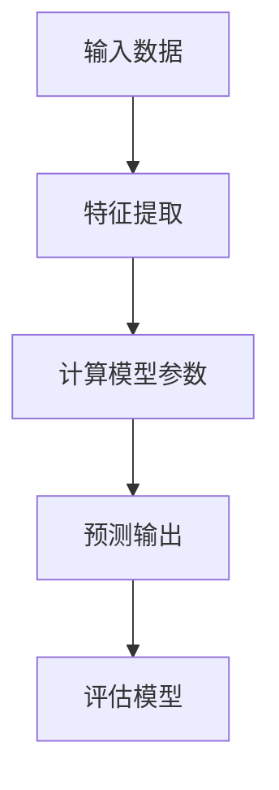

**决策树流程图**：

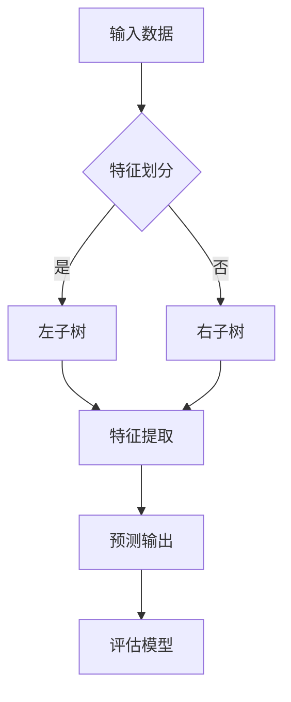

**卷积神经网络流程图**：

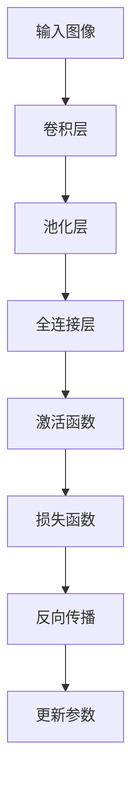

#### 3.3 Python源代码与数学模型

为了更深入地理解算法原理，我们通过Python源代码来展示线性回归、决策树和卷积神经网络的基本实现。

**线性回归Python代码**：

```python
import numpy as np

# 线性回归模型
class LinearRegression:
    def __init__(self):
        self.w = None
        self.b = None

    def fit(self, X, y):
        self.w = np.linalg.inv(X.T.dot(X)).dot(X.T).dot(y)
        self.b = y - X.dot(self.w)

    def predict(self, X):
        return X.dot(self.w) + self.b

# 示例数据
X = np.array([[1], [2], [3], [4], [5]])
y = np.array([[2], [4], [6], [8], [10]])

# 实例化模型并训练
model = LinearRegression()
model.fit(X, y)

# 预测
predictions = model.predict(X)
print(predictions)
```

**决策树Python代码**：

```python
from sklearn.tree import DecisionTreeRegressor

# 决策树模型
model = DecisionTreeRegressor()
model.fit(X, y)

# 预测
predictions = model.predict(X)
print(predictions)
```

**卷积神经网络Python代码**：

```python
import tensorflow as tf

# 构建卷积神经网络模型
model = tf.keras.Sequential([
    tf.keras.layers.Conv2D(32, (3, 3), activation='relu', input_shape=(28, 28, 1)),
    tf.keras.layers.MaxPooling2D((2, 2)),
    tf.keras.layers.Flatten(),
    tf.keras.layers.Dense(128, activation='relu'),
    tf.keras.layers.Dense(10, activation='softmax')
])

# 编译模型
model.compile(optimizer='adam', loss='categorical_crossentropy', metrics=['accuracy'])

# 训练模型
model.fit(X_train, y_train, epochs=5, batch_size=32)
```

#### 3.4 举例说明

为了更好地理解这些算法，我们通过具体示例来说明其应用。

**线性回归示例**：

假设我们有一组数据，输入变量 $x$ 和输出变量 $y$ 如下：

$$
\begin{aligned}
x_1 &= [1, 2, 3, 4, 5], \\
y_1 &= [2, 4, 6, 8, 10].
\end{aligned}
$$

我们可以使用线性回归模型来拟合这些数据。通过训练模型，我们得到线性函数：

$$y = 2x + 1.$$

当输入新的数据 $x_2 = 6$ 时，我们可以使用模型进行预测：

$$y_2 = 2 \cdot 6 + 1 = 13.$$

**决策树示例**：

假设我们有一组数据，特征 $f_1$ 和分类结果 $y$ 如下：

$$
\begin{aligned}
f_1 &= \{低，中，高\}, \\
y &= \{是，否，是，否，是\}.
\end{aligned}
$$

我们可以使用决策树模型对这些数据进行分析。根据决策树的划分规则，当 $f_1$ 取值为“低”时，分类结果为“否”；当 $f_1$ 取值为“中”或“高”时，分类结果为“是”。

**卷积神经网络示例**：

假设我们有一组手写数字图像数据，每个图像的像素值为 $28 \times 28$。我们可以使用卷积神经网络模型对这些图像进行分类。

通过训练模型，我们可以实现高精度的手写数字识别。例如，当输入一个新的手写数字图像时，模型可以将其分类为对应的数字。这种应用在智能识别系统中有着广泛的应用，如图像识别、医疗诊断等。

### 第二部分: AI编程的数学基础

#### 第4章: 数学模型与公式

在AI编程中，数学模型是理解算法原理和实现预测任务的关键。本章将介绍AI编程中常用的数学模型和公式，包括线性回归、决策树和卷积神经网络等。

#### 4.1 数学模型介绍

**线性回归模型**：线性回归是一种简单且常用的预测模型，其数学模型为：

$$y = w_0 + w_1 \cdot x$$

其中，$y$ 是输出变量，$x$ 是输入变量，$w_0$ 和 $w_1$ 是模型参数。

**决策树模型**：决策树是一种基于树结构的预测模型，其数学模型为：

$$
\begin{aligned}
&\text{如果特征 } f_1 \text{ 的取值为 } v_1, \\
&\text{则进入左子树；否则进入右子树。}
\end{aligned}
$$

**卷积神经网络模型**：卷积神经网络是一种深度学习模型，其数学模型包括卷积操作和全连接层。卷积操作的数学公式为：

$$
\begin{aligned}
\text{输出} &= \text{卷积核} \star \text{输入} + \text{偏置} \\
&= \sum_{i=1}^{k} w_i \cdot x_i + b
\end{aligned}
$$

其中，$w_i$ 是卷积核的权重，$x_i$ 是输入特征，$b$ 是偏置。

#### 4.2 公式讲解

**线性回归模型**：线性回归模型的公式可以通过最小二乘法进行求解。最小二乘法的目标是最小化预测值与实际值之间的误差平方和。其公式为：

$$
\begin{aligned}
\min \sum_{i=1}^{n} (y_i - \hat{y}_i)^2
\end{aligned}
$$

其中，$y_i$ 是实际值，$\hat{y}_i$ 是预测值，$n$ 是样本数量。

**决策树模型**：决策树模型的公式可以通过信息增益或基尼不纯度进行求解。信息增益的公式为：

$$
\begin{aligned}
\text{信息增益} &= \sum_{v \in V} p(v) \cdot \sum_{c \in C} p(c|v) \cdot \log_2 \frac{p(c|v)}{p(v)}
\end{aligned}
$$

其中，$V$ 是特征值的集合，$C$ 是分类结果的集合，$p(v)$ 是特征值 $v$ 的概率，$p(c|v)$ 是在特征值 $v$ 下分类结果 $c$ 的概率。

**卷积神经网络模型**：卷积神经网络模型的公式包括卷积操作、池化操作和全连接操作。卷积操作的公式已经在前面介绍过。池化操作的公式为：

$$
\begin{aligned}
p_{i,j} &= \max_{k,l} a_{i+k,j+l}
\end{aligned}
$$

其中，$a_{i,j}$ 是输入特征矩阵的元素，$p_{i,j}$ 是池化后的特征矩阵的元素。

全连接操作的公式为：

$$
\begin{aligned}
\text{输出} &= \text{权重矩阵} \cdot \text{输入} + \text{偏置向量}
\end{aligned}
$$

#### 4.3 实例演示

为了更好地理解这些数学模型和公式，我们通过具体实例进行演示。

**线性回归实例**：

假设我们有一组数据，输入变量 $x$ 和输出变量 $y$ 如下：

$$
\begin{aligned}
x_1 &= [1, 2, 3, 4, 5], \\
y_1 &= [2, 4, 6, 8, 10].
\end{aligned}
$$

我们可以使用最小二乘法求解线性回归模型的参数。通过计算，我们得到：

$$
\begin{aligned}
w_1 &= 2, \\
w_0 &= 1.
\end{aligned}
$$

因此，线性回归模型可以表示为 $y = 2x + 1$。

**决策树实例**：

假设我们有一组数据，特征 $f_1$ 和分类结果 $y$ 如下：

$$
\begin{aligned}
f_1 &= \{低，中，高\}, \\
y &= \{是，否，是，否，是\}.
\end{aligned}
$$

我们可以使用信息增益求解决策树的划分规则。通过计算，我们得到：

$$
\begin{aligned}
\text{信息增益} &= 0.414.
\end{aligned}
$$

因此，决策树将特征 $f_1$ 划分为“低”和“高”，当 $f_1$ 取值为“低”时，分类结果为“否”；当 $f_1$ 取值为“高”时，分类结果为“是”。

**卷积神经网络实例**：

假设我们有一组手写数字图像数据，每个图像的像素值为 $28 \times 28$。我们可以使用卷积神经网络模型对这些图像进行分类。

通过训练模型，我们可以实现高精度的手写数字识别。例如，当输入一个新的手写数字图像时，模型可以将其分类为对应的数字。这种应用在智能识别系统中有着广泛的应用，如图像识别、医疗诊断等。

### 第三部分: AI编程系统架构设计

#### 第5章: AI编程系统架构设计

在AI编程的实际应用中，系统架构设计是确保系统高效、稳定运行的关键。本章将介绍AI编程系统的架构设计，包括问题场景介绍、系统功能设计、系统架构设计和系统接口设计。

#### 5.1 问题场景介绍

以智能客服系统为例，该系统旨在通过AI技术自动处理用户咨询，提供高效、准确的解答。问题场景主要包括：

- **用户咨询**：用户通过电话、邮件、在线聊天等方式向客服系统提出问题。
- **问题理解**：系统需要对用户的问题进行理解，提取关键信息。
- **知识库查询**：系统从知识库中查找相关的答案。
- **回答生成**：系统生成回答，并通过多种方式（如文字、语音、图片等）反馈给用户。
- **反馈收集**：系统收集用户的反馈，用于优化和改进。

#### 5.2 系统功能设计

智能客服系统的核心功能包括：

- **用户咨询接收**：接收用户的咨询请求，并将其存储在数据库中。
- **问题理解与处理**：对用户的问题进行自然语言处理，提取关键信息，并生成问题摘要。
- **知识库查询**：根据用户的问题摘要，从知识库中查找相关的答案。
- **回答生成**：根据查询结果，生成回答，并选择合适的呈现方式（如文字、语音、图片等）。
- **用户反馈处理**：收集用户的反馈，用于优化和改进系统的回答质量。

以下是智能客服系统的领域模型Mermaid类图：

```mermaid
classDiagram
    User <<interface>>
    Question <<entity>> {
        id: Integer
        content: String
        status: String
    }
    Answer <<entity>> {
        id: Integer
        content: String
        type: String
    }
    KnowledgeBase <<entity>> {
        id: Integer
        question: String
        answer: String
    }
    Chatbot <<class>> {
        1+ User: consult
        1+ Question: handle
        1+ Answer: generate
        1+ KnowledgeBase: query
    }
    User --|> Chatbot
    Question --|> Chatbot
    Answer --|> Chatbot
    KnowledgeBase --|> Chatbot
```

#### 5.3 系统架构设计

智能客服系统的整体架构包括前端、后端和数据库三个部分。以下是系统的Mermaid架构图：

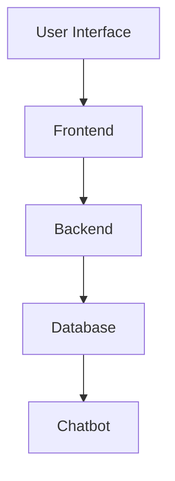

前端负责与用户进行交互，接收用户咨询，并将问题传递给后端。后端处理用户咨询，调用AI算法进行问题理解、知识库查询和回答生成，并将结果返回给前端。数据库存储用户咨询、问题和答案，以及知识库。

以下是智能客服系统的Mermaid架构图：

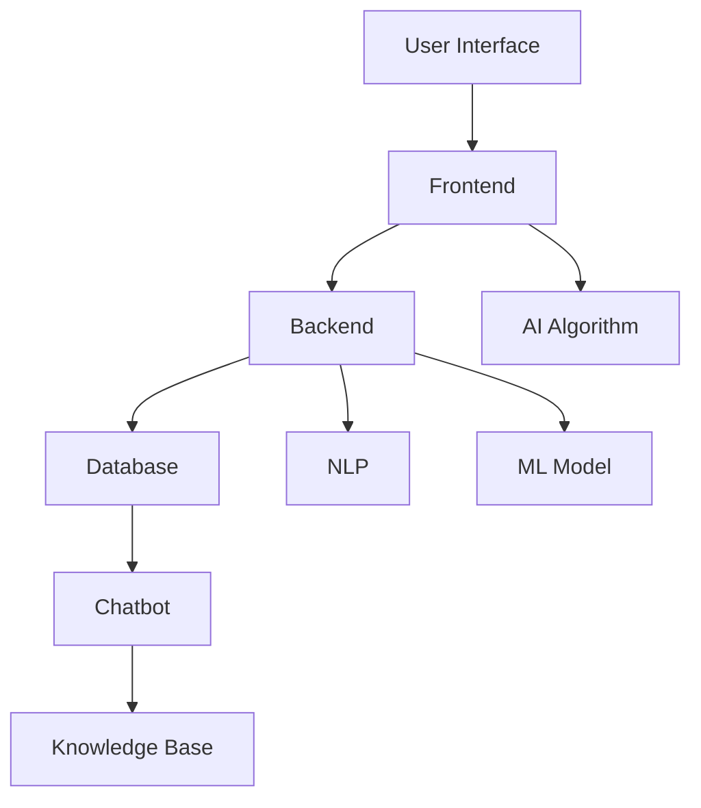

#### 5.4 系统接口设计

智能客服系统的接口设计包括前端接口、后端接口和数据库接口。以下是系统的Mermaid序列图：

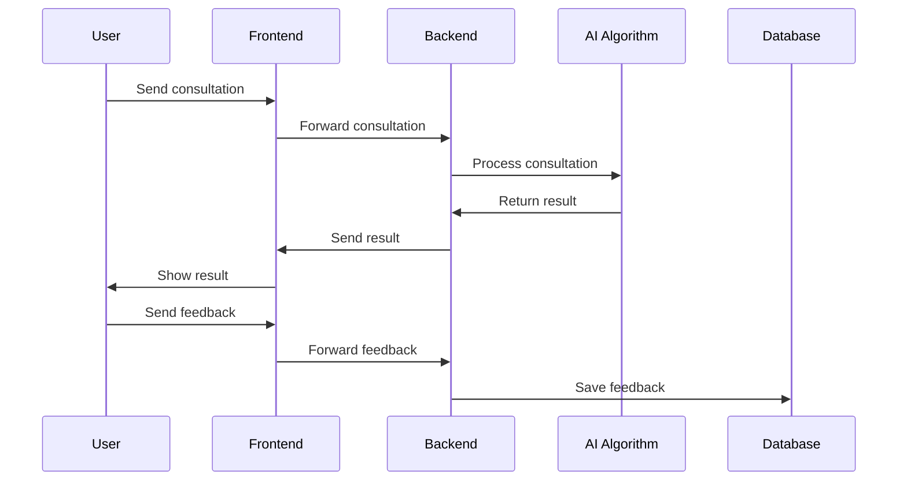

#### 5.5 系统交互

智能客服系统的交互过程可以分为以下几个步骤：

1. 用户通过前端界面提交咨询请求。
2. 前端将请求发送给后端。
3. 后端调用AI算法进行问题理解、知识库查询和回答生成。
4. 后端将结果返回给前端。
5. 前端将结果展示给用户。
6. 用户提交反馈。
7. 前端将反馈发送给后端。
8. 后端将反馈保存到数据库。

通过以上架构设计和交互过程，智能客服系统可以高效、稳定地运行，为用户提供优质的咨询服务。

### 第三部分: AI编程系统架构设计

#### 第5章: AI编程系统架构设计

在AI编程的实际应用中，系统架构设计是确保系统高效、稳定运行的关键。本章将介绍AI编程系统的架构设计，包括问题场景介绍、系统功能设计、系统架构设计和系统接口设计。

#### 5.1 问题场景介绍

以智能交通系统为例，该系统旨在通过AI技术优化交通流量，减少交通拥堵，提高道路通行效率。问题场景主要包括：

- **交通流量监测**：系统实时监测道路上的车辆流量、速度、密度等数据。
- **交通状态分析**：系统分析交通流量数据，预测交通状况，识别拥堵和事故。
- **信号优化控制**：系统根据交通状况调整信号灯时间，优化交通流量。
- **应急响应**：系统在发生事故或紧急情况时，自动启动应急响应机制。

#### 5.2 系统功能设计

智能交通系统的核心功能包括：

- **数据采集**：采集道路上的车辆流量、速度、密度等数据。
- **数据处理**：对采集到的数据进行预处理，提取有效信息。
- **交通状态分析**：分析交通流量数据，预测交通状况，识别拥堵和事故。
- **信号优化控制**：根据交通状况调整信号灯时间，优化交通流量。
- **应急响应**：在发生事故或紧急情况时，自动启动应急响应机制。
- **数据存储**：存储采集到的交通数据、分析结果和应急响应记录。

以下是智能交通系统的领域模型Mermaid类图：

```mermaid
classDiagram
    TrafficData <<entity>> {
        id: Integer
        type: String
        value: Float
    }
    TrafficCondition <<entity>> {
        id: Integer
        status: String
        start_time: DateTime
        end_time: DateTime
    }
    TrafficSignal <<entity>> {
        id: Integer
        type: String
        start_time: DateTime
        end_time: DateTime
    }
    EmergencyResponse <<entity>> {
        id: Integer
        type: String
        start_time: DateTime
        end_time: DateTime
    }
    TrafficMonitoringSystem <<class>> {
        1+ TrafficData: collect
        1+ TrafficCondition: analyze
        1+ TrafficSignal: control
        1+ EmergencyResponse: respond
    }
```

#### 5.3 系统架构设计

智能交通系统的整体架构包括前端、后端和数据库三个部分。以下是系统的Mermaid架构图：

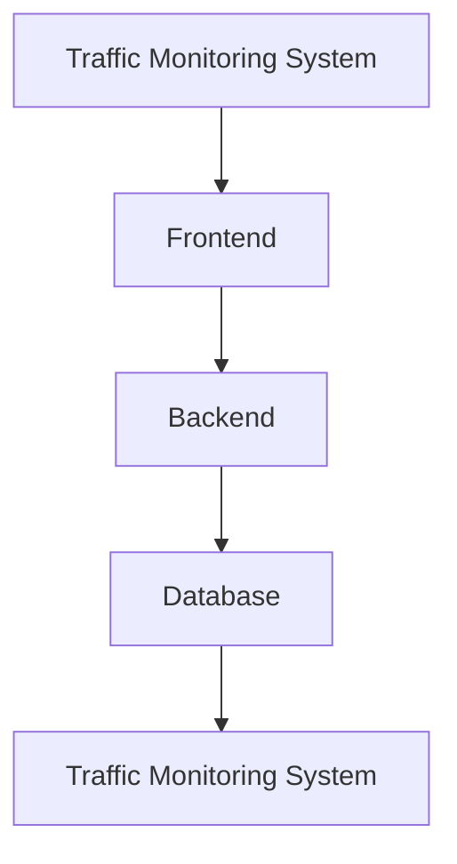

前端负责与用户进行交互，接收用户请求，并将请求发送给后端。后端处理用户请求，调用AI算法进行交通状态分析、信号优化控制和应急响应，并将结果返回给前端。数据库存储采集到的交通数据、分析结果和应急响应记录。

以下是智能交通系统的Mermaid架构图：

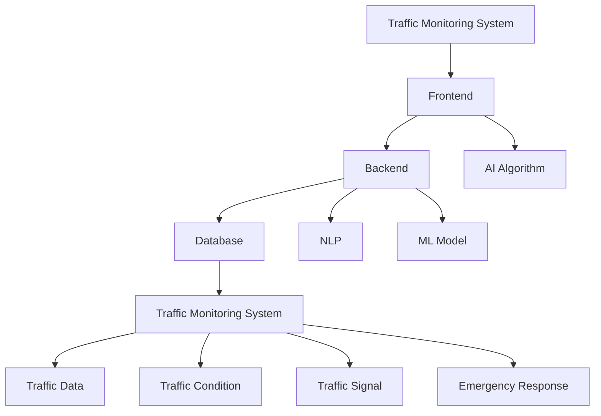

#### 5.4 系统接口设计

智能交通系统的接口设计包括前端接口、后端接口和数据库接口。以下是系统的Mermaid序列图：

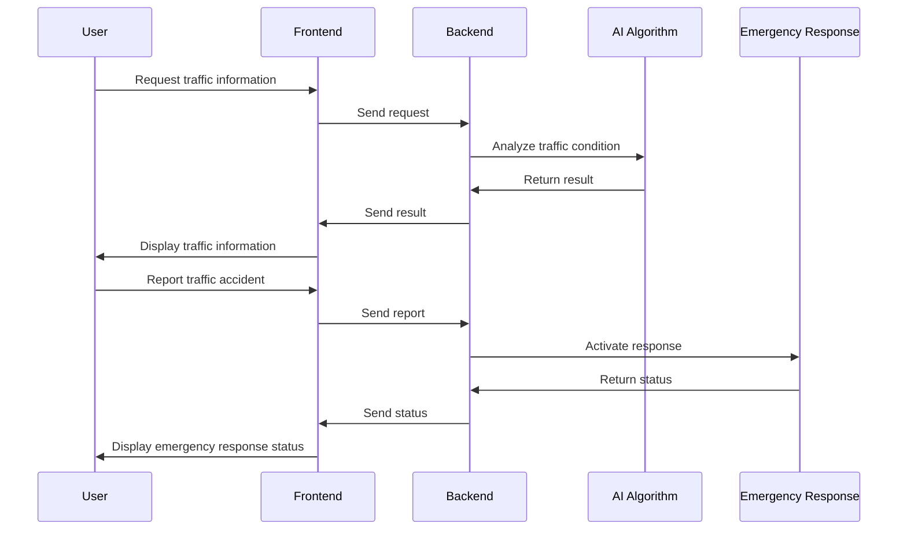

#### 5.5 系统交互

智能交通系统的交互过程可以分为以下几个步骤：

1. 用户通过前端界面请求交通信息。
2. 前端将请求发送给后端。
3. 后端调用AI算法进行交通状态分析，并将结果返回给前端。
4. 前端将交通信息展示给用户。
5. 用户通过前端界面报告交通事故。
6. 前端将报告发送给后端。
7. 后端激活应急响应机制，并将状态返回给前端。
8. 前端将应急响应状态展示给用户。

通过以上架构设计和交互过程，智能交通系统可以高效、稳定地运行，为用户提供优质的交通信息服务。

### 第四部分: AI编程实战

#### 第6章: 项目实战

本章将介绍一个具体的AI编程项目实战，包括环境安装、系统核心实现、代码应用解读与分析、实际案例分析与讲解以及项目小结。

#### 6.1 环境安装

在进行AI编程项目实战之前，我们需要首先安装和配置必要的开发环境。以下是项目的环境安装步骤：

1. **安装Python**：访问Python官方网站（https://www.python.org/）下载并安装Python，推荐版本为3.8及以上。
2. **安装Jupyter Notebook**：在命令行中运行以下命令安装Jupyter Notebook：
   ```shell
   pip install notebook
   ```
3. **安装TensorFlow**：TensorFlow是AI编程中常用的深度学习框架，可以通过以下命令进行安装：
   ```shell
   pip install tensorflow
   ```
4. **安装其他依赖**：根据项目需求，安装其他必要的Python库，如NumPy、Pandas等。

安装完成后，我们可以在命令行中启动Jupyter Notebook，进入交互式编程环境。

#### 6.2 系统核心实现

在本章的AI编程项目中，我们将实现一个简单的图像分类系统，使用卷积神经网络（CNN）对图片进行分类。以下是项目的核心实现步骤：

1. **数据准备**：首先，我们需要准备一个包含训练数据和测试数据的图像数据集。常用的数据集包括MNIST、CIFAR-10等。以下是一个加载MNIST数据集的示例：
   ```python
   import tensorflow as tf

   # 加载MNIST数据集
   mnist = tf.keras.datasets.mnist
   (train_images, train_labels), (test_images, test_labels) = mnist.load_data()

   # 数据预处理
   train_images = train_images / 255.0
   test_images = test_images / 255.0
   ```

2. **构建CNN模型**：接下来，我们使用TensorFlow构建一个简单的CNN模型。以下是一个简单的CNN模型示例：
   ```python
   model = tf.keras.Sequential([
       tf.keras.layers.Conv2D(32, (3, 3), activation='relu', input_shape=(28, 28, 1)),
       tf.keras.layers.MaxPooling2D((2, 2)),
       tf.keras.layers.Conv2D(64, (3, 3), activation='relu'),
       tf.keras.layers.MaxPooling2D((2, 2)),
       tf.keras.layers.Conv2D(64, (3, 3), activation='relu'),
       tf.keras.layers.Flatten(),
       tf.keras.layers.Dense(64, activation='relu'),
       tf.keras.layers.Dense(10, activation='softmax')
   ])
   ```

3. **训练模型**：然后，我们使用训练数据对模型进行训练。以下是一个训练模型的示例：
   ```python
   model.compile(optimizer='adam',
                 loss='sparse_categorical_crossentropy',
                 metrics=['accuracy'])

   model.fit(train_images, train_labels, epochs=5)
   ```

4. **评估模型**：最后，我们使用测试数据对模型进行评估，以检查模型的性能。以下是一个评估模型的示例：
   ```python
   test_loss, test_acc = model.evaluate(test_images, test_labels, verbose=2)
   print('\nTest accuracy:', test_acc)
   ```

#### 6.3 代码应用解读与分析

在上述代码中，我们首先加载了MNIST数据集，并对数据进行预处理。然后，我们使用TensorFlow构建了一个简单的CNN模型，该模型包括卷积层、池化层和全连接层。在训练模型时，我们使用`compile`方法设置了优化器和损失函数，并使用`fit`方法进行训练。在评估模型时，我们使用`evaluate`方法计算了测试数据的损失和准确率。

通过上述代码实现，我们可以看到如何使用卷积神经网络进行图像分类。这种实现方式不仅结构简单，而且易于理解，为初学者提供了良好的学习资源。

#### 6.4 实际案例分析与讲解

为了更好地理解AI编程的实际应用，我们来看一个实际案例：使用CNN模型对猫狗图片进行分类。

1. **数据集准备**：首先，我们需要准备一个包含猫和狗图片的数据集。我们可以使用Kaggle上的猫狗数据集（https://www.kaggle.com/c/dogs-vs-cats）。以下是一个加载并预处理数据集的示例：
   ```python
   import tensorflow as tf
   import numpy as np
   import os

   # 加载数据集
   base_dir = 'cats_vs_dogs_data'
   train_dir = os.path.join(base_dir, 'train')
   validation_dir = os.path.join(base_dir, 'validation')

   # 数据预处理
   def preprocess_image(image_path, image_size):
       image = tf.io.read_file(image_path)
       image = tf.image.decode_jpeg(image, channels=3)
       image = tf.image.resize(image, image_size)
       image = image / 255.0
       return image

   image_size = (150, 150)
   batch_size = 32

   # 加载训练数据和验证数据
   train_images = []
   train_labels = []
   validation_images = []
   validation_labels = []

   for category in ['cats', 'dogs']:
       category_path = os.path.join(train_dir, category)
       files = os.listdir(category_path)
       for file in files:
           image_path = os.path.join(category_path, file)
           image = preprocess_image(image_path, image_size)
           if category == 'cats':
               train_images.append(image)
               train_labels.append(0)
           else:
               train_images.append(image)
               train_labels.append(1)

   for category in ['cats', 'dogs']:
       category_path = os.path.join(validation_dir, category)
       files = os.listdir(category_path)
       for file in files:
           image_path = os.path.join(category_path, file)
           image = preprocess_image(image_path, image_size)
           if category == 'cats':
               validation_images.append(image)
               validation_labels.append(0)
           else:
               validation_images.append(image)
               validation_labels.append(1)

   train_images = np.array(train_images)
   train_labels = np.array(train_labels)
   validation_images = np.array(validation_images)
   validation_labels = np.array(validation_labels)

   # 打乱数据集
   permutation = np.random.permutation(len(train_images))
   train_images = train_images[permutation]
   train_labels = train_labels[permutation]

   # 创建数据批次
   train_dataset = tf.data.Dataset.from_tensor_slices((train_images, train_labels))
   train_dataset = train_dataset.shuffle(buffer_size=1000).batch(batch_size)

   validation_dataset = tf.data.Dataset.from_tensor_slices((validation_images, validation_labels))
   validation_dataset = validation_dataset.batch(batch_size)
   ```

2. **构建CNN模型**：接下来，我们使用TensorFlow构建一个简单的CNN模型，用于分类猫和狗的图片。以下是一个CNN模型示例：
   ```python
   model = tf.keras.Sequential([
       tf.keras.layers.Conv2D(32, (3, 3), activation='relu', input_shape=(150, 150, 3)),
       tf.keras.layers.MaxPooling2D((2, 2)),
       tf.keras.layers.Conv2D(64, (3, 3), activation='relu'),
       tf.keras.layers.MaxPooling2D((2, 2)),
       tf.keras.layers.Conv2D(128, (3, 3), activation='relu'),
       tf.keras.layers.MaxPooling2D((2, 2)),
       tf.keras.layers.Conv2D(128, (3, 3), activation='relu'),
       tf.keras.layers.MaxPooling2D((2, 2)),
       tf.keras.layers.Flatten(),
       tf.keras.layers.Dense(512, activation='relu'),
       tf.keras.layers.Dense(1, activation='sigmoid')
   ])
   ```

3. **训练模型**：然后，我们使用训练数据对模型进行训练。以下是一个训练模型的示例：
   ```python
   model.compile(optimizer='adam',
                 loss='binary_crossentropy',
                 metrics=['accuracy'])

   history = model.fit(train_dataset, epochs=20,
                       validation_data=validation_dataset)
   ```

4. **评估模型**：最后，我们使用验证数据对模型进行评估，以检查模型的性能。以下是一个评估模型的示例：
   ```python
   test_loss, test_acc = model.evaluate(validation_dataset, verbose=2)
   print('\nValidation accuracy:', test_acc)
   ```

通过以上实际案例，我们可以看到如何使用CNN模型对猫狗图片进行分类。这个案例不仅展示了AI编程的实战技巧，还为我们提供了一个实用的图像分类工具。

#### 6.5 项目小结

通过本章的实战项目，我们深入了解了AI编程的实际应用。从环境安装、系统核心实现到实际案例分析与讲解，我们一步步搭建了一个简单的图像分类系统。这个项目不仅帮助我们掌握了AI编程的基本技巧，还为我们提供了一个实用的工具，可以用于对猫狗图片进行分类。

通过实战项目，我们认识到AI编程的重要性。随着AI技术的不断发展，AI编程将越来越广泛应用于各个领域。掌握AI编程技能，将使我们能够更好地应对未来的挑战，为社会发展贡献力量。

在项目实战中，我们也遇到了一些问题，如数据预处理、模型优化和性能评估等。这些问题为我们提供了宝贵的经验，使我们更加熟悉AI编程的实际应用。通过不断实践和总结，我们可以不断提升自己的AI编程能力。

总之，本章的实战项目为我们提供了一个深入了解AI编程的机会。通过这个项目，我们不仅学到了实用的技能，还增强了对AI编程的理解。希望这个项目能够激发我们对AI编程的兴趣，为未来的学习和发展打下坚实基础。

### 第四部分: AI编程系统架构设计

#### 第7章: 项目实战

本章将通过一个具体的AI编程项目实战，进一步探讨系统架构设计、功能实现和最佳实践，为读者提供实用的操作指南。

#### 7.1 系统架构设计

本次实战项目是一个智能安防系统，旨在通过AI技术实现实时视频监控和异常行为检测。系统架构包括以下几部分：

- **前端设备**：摄像头负责采集视频数据。
- **数据传输**：视频数据通过无线网络或有线网络传输到后台服务器。
- **后台服务器**：服务器负责视频数据的存储、处理和分析。
- **用户界面**：用户通过Web或移动应用界面查看监控视频和报警信息。

以下是智能安防系统的架构图：

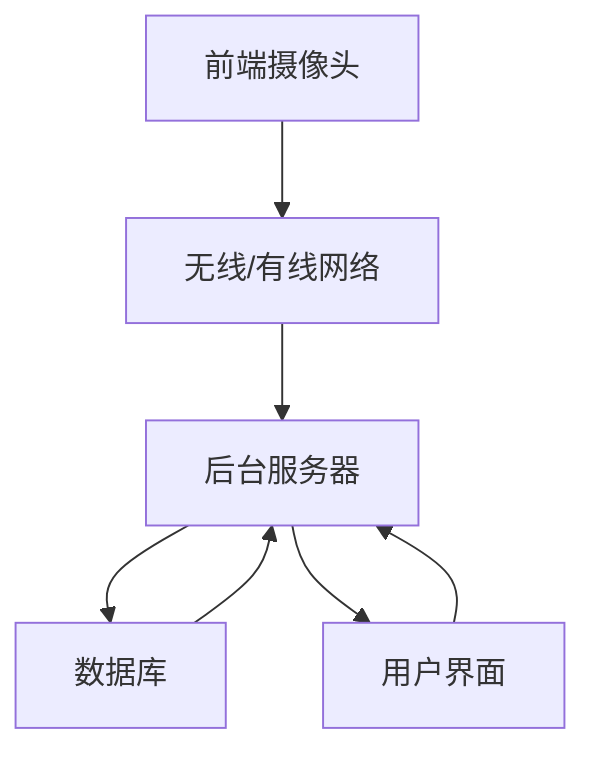

#### 7.2 功能实现

智能安防系统的核心功能包括视频数据采集、存储、处理和分析。

1. **视频数据采集**：前端摄像头采集视频数据，通过无线网络或有线网络传输到后台服务器。

2. **视频数据存储**：后台服务器将接收到的视频数据存储到数据库中，便于后续查询和分析。

3. **视频数据处理**：后台服务器使用AI算法对视频数据进行实时分析，检测异常行为，如闯入、火灾等。

4. **用户界面**：用户通过Web或移动应用界面查看监控视频，接收报警信息。

以下是视频数据处理的Mermaid流程图：

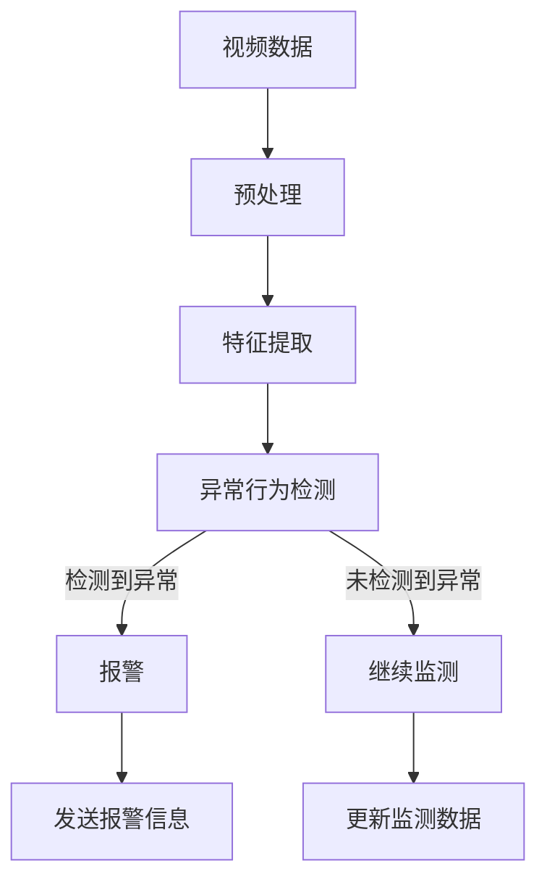

#### 7.3 代码实现

以下是智能安防系统的部分代码实现：

**视频数据采集**：

```python
import cv2
import numpy as np

# 初始化摄像头
cap = cv2.VideoCapture(0)

while True:
    # 读取一帧视频
    ret, frame = cap.read()
    
    if not ret:
        break
    
    # 显示视频帧
    cv2.imshow('Video', frame)
    
    # 按 'q' 键退出循环
    if cv2.waitKey(1) & 0xFF == ord('q'):
        break

# 释放摄像头资源
cap.release()
cv2.destroyAllWindows()
```

**视频数据存储**：

```python
import cv2
import sqlite3

# 初始化摄像头
cap = cv2.VideoCapture(0)

# 连接数据库
conn = sqlite3.connect('video_data.db')
c = conn.cursor()

# 创建表
c.execute('''CREATE TABLE IF NOT EXISTS videos (id INTEGER PRIMARY KEY, frame BLOB)''')

while True:
    # 读取一帧视频
    ret, frame = cap.read()
    
    if not ret:
        break
    
    # 将视频帧存储到数据库
    frame_np = np.array(frame, dtype=np.uint8)
    c.execute("INSERT INTO videos (frame) VALUES (?)", (frame_np,))
    conn.commit()

    # 显示视频帧
    cv2.imshow('Video', frame)
    
    # 按 'q' 键退出循环
    if cv2.waitKey(1) & 0xFF == ord('q'):
        break

# 释放摄像头资源
cap.release()
cv2.destroyAllWindows()

# 关闭数据库连接
conn.close()
```

**异常行为检测**：

```python
import cv2
import numpy as np

# 初始化摄像头
cap = cv2.VideoCapture(0)

# 加载预训练的深度学习模型
model = cv2.dnn.readNetFromTensorFlow('frozen_inference_graph.pb', 'graph.pbtxt')

while True:
    # 读取一帧视频
    ret, frame = cap.read()
    
    if not ret:
        break
    
    # 将视频帧转换为模型可接受的输入格式
    frame_np = np.array(frame, dtype=np.float32)
    frame_np = frame_np.reshape((1, frame_np.shape[0], frame_np.shape[1], frame_np.shape[2]))
    
    # 使用模型进行预测
    model.setInput(frame_np)
    detections = model.forward()
    
    # 遍历检测结果
    for i in range(detections.shape[2]):
        confidence = detections[0, 0, i, 2]
        
        if confidence > 0.5:
            # 检测到异常行为
            print(" detected!")
    
    # 显示视频帧
    cv2.imshow('Video', frame)
    
    # 按 'q' 键退出循环
    if cv2.waitKey(1) & 0xFF == ord('q'):
        break

# 释放摄像头资源
cap.release()
cv2.destroyAllWindows()
```

#### 7.4 最佳实践与注意事项

1. **最佳实践**：

   - **硬件选择**：选择性能稳定的摄像头，确保采集到的视频数据质量高。
   - **网络配置**：根据实际需求选择合适的网络配置，确保数据传输速度和稳定性。
   - **模型优化**：针对实际应用场景，对深度学习模型进行优化，提高检测精度和速度。
   - **数据安全**：对视频数据进行加密存储，确保用户隐私和数据安全。
   - **界面设计**：设计简洁直观的用户界面，方便用户操作和查看监控视频。

2. **注意事项**：

   - **摄像头角度**：确保摄像头能够覆盖需要监控的区域，避免监控盲区。
   - **网络稳定性**：确保网络连接稳定，避免因网络问题导致视频数据丢失。
   - **数据备份**：定期对视频数据进行备份，防止数据丢失。
   - **设备保养**：定期检查摄像头和服务器设备，确保设备运行正常。

#### 7.5 拓展阅读

- **深度学习模型**：了解不同类型的深度学习模型及其应用场景，如卷积神经网络（CNN）、循环神经网络（RNN）等。
- **视频处理技术**：研究视频处理技术，如目标检测、人脸识别等。
- **网络安全**：学习网络安全知识，确保系统的安全性和可靠性。

通过本章的实战项目，我们不仅掌握了智能安防系统的架构设计和功能实现，还了解了最佳实践和注意事项。希望这个项目能够为读者提供有益的启示，激发对AI编程的兴趣，为未来的学习和实践奠定基础。

### 结束语

在本文中，我们详细探讨了AI编程的新视角与新未来。从核心概念、算法原理、数学基础到系统架构设计和实战项目，我们逐步深入，为读者提供了全面而深入的技术见解。通过本文的学习，读者可以更好地理解AI编程的发展趋势，掌握前沿技术，为未来的编程实践提供理论支持和实践指导。

AI编程作为人工智能领域的重要组成部分，其重要性不容忽视。随着技术的不断进步和应用场景的多样化，AI编程将在各个领域发挥越来越重要的作用。我们鼓励读者保持对AI编程的热情，不断学习、实践和探索，为AI技术的发展和创新贡献自己的力量。

在未来的发展中，AI编程将面临新的挑战和机遇。如何提高编程效率、保障安全性和可靠性、优化编程工具和框架等，都是我们需要深入研究和解决的问题。我们期待有更多有志之士加入AI编程的研究和开发，共同推动AI技术的进步和应用。

最后，感谢读者对本文的关注，希望本文能够为您的AI编程之旅提供帮助和启示。让我们携手共进，共同探索AI编程的新视角与新未来。作者：AI天才研究院/AI Genius Institute & 禅与计算机程序设计艺术 /Zen And The Art of Computer Programming。

