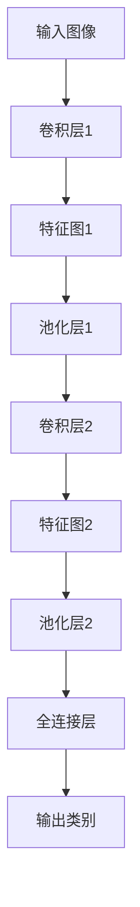
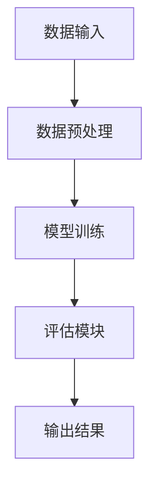
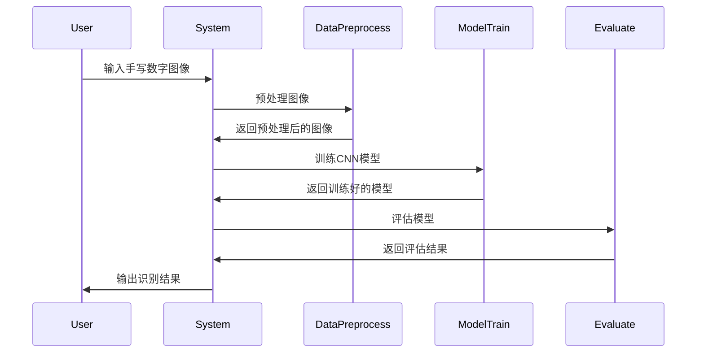

                 


### 文章标题：AI编程的新语言与新思路

关键词：AI编程、新语言、编程思维、算法原理、系统架构、实战项目

摘要：本文将探讨AI编程领域的新语言和新思路，通过深入分析AI编程的核心概念、算法原理和系统架构，结合实际项目实战，为读者提供清晰、易懂的编程方法论。本文旨在帮助读者掌握AI编程的新技术和新趋势，提升编程能力和思维水平。

----------------------------------------------------------------

### 引言与概述

随着人工智能（AI）技术的飞速发展，AI编程逐渐成为计算机科学领域的重要分支。传统的编程语言和编程思维已无法满足AI领域的复杂性和多样性。因此，新一代的AI编程语言和编程思维应运而生，为AI编程带来了全新的视角和方法。

本文将围绕AI编程的新语言和新思路展开讨论，旨在帮助读者深入了解AI编程的核心概念、算法原理和系统架构，并通过实际项目实战，培养读者AI编程的思维能力和实践技能。本文将从以下几个方面进行阐述：

1. **核心概念与联系**：首先，我们将介绍AI编程的核心概念，如机器学习、深度学习、神经网络等，并使用Mermaid ER图展示它们之间的关系。

2. **算法原理讲解**：接着，我们将选择一种典型的AI算法，如卷积神经网络（CNN），详细讲解其原理，包括Mermaid流程图、Python代码示例和数学模型。

3. **数学模型与方程**：我们将深入探讨AI算法的数学基础，使用LaTeX格式展示相关公式，并进行详细解释。

4. **系统分析与设计**：随后，我们将介绍一个AI系统的整体架构，包括领域模型、系统架构、接口设计和交互流程。

5. **实战项目**：为了使读者更好地理解AI编程的实际应用，我们将介绍一个完整的AI项目，从环境搭建到代码实现，进行详细解析。

6. **最佳实践与总结**：最后，我们将总结本文的核心观点，并提供一些AI编程的最佳实践和建议。

通过本文的阅读，读者将能够系统地了解AI编程的新语言和新思路，掌握AI编程的核心技术和方法，为未来在AI领域的深入研究和实践奠定基础。 <sop>

----------------------------------------------------------------

### 核心概念与联系

在AI编程领域，核心概念如机器学习、深度学习、神经网络等构成了整个领域的基石。这些概念之间有着密切的联系，共同推动着AI技术的发展。为了更好地理解这些概念，我们可以通过Mermaid ER图来展示它们之间的关系。

以下是一个简化的Mermaid ER图，展示了机器学习、深度学习和神经网络之间的关系：

```mermaid
erDiagram
    MachineLearning ||--|{ DeepLearning } DeepLearning
    MachineLearning ||--|{ NeuralNetwork } NeuralNetwork
    DeepLearning ||--|{ ConvolutionalNeuralNetwork } ConvolutionalNeuralNetwork
    DeepLearning ||--|{ RecurrentNeuralNetwork } RecurrentNeuralNetwork
    NeuralNetwork ||--|{ FeedforwardNeuralNetwork } FeedforwardNeuralNetwork
```

**机器学习（Machine Learning）**：机器学习是AI的核心概念，它指的是通过算法和统计模型让计算机从数据中学习并做出决策。机器学习算法可以分为监督学习、无监督学习和强化学习等。

**深度学习（Deep Learning）**：深度学习是机器学习的一个子领域，它通过多层神经网络进行深度特征学习。深度学习在图像识别、语音识别和自然语言处理等领域表现出色。

**神经网络（Neural Network）**：神经网络是一种模仿生物神经系统的计算模型，是深度学习的基础。神经网络通过多个神经元（节点）组成的层次结构进行数据处理和模式识别。

**卷积神经网络（Convolutional Neural Network，CNN）**：CNN是一种特殊的神经网络，专门用于处理具有网格结构的数据，如图像。CNN通过卷积层、池化层和全连接层进行特征提取和分类。

**递归神经网络（Recurrent Neural Network，RNN）**：RNN是一种能够处理序列数据的神经网络，它在每个时间步上保留内部状态，使得模型能够捕捉到序列中的长期依赖关系。

在上述核心概念中，机器学习是AI编程的总体框架，深度学习和神经网络是机器学习的具体实现方式。深度学习通过神经网络结构进行特征提取和模式识别，而卷积神经网络和递归神经网络是深度学习的重要分支，分别适用于不同的数据类型和处理任务。

通过理解这些核心概念及其相互关系，我们可以更好地把握AI编程的本质，为后续的算法原理讲解和系统架构设计打下基础。在下一章节中，我们将深入探讨一种典型的AI算法——卷积神经网络（CNN），并详细讲解其原理和实现方法。 <sop>

----------------------------------------------------------------

### 算法原理讲解

#### 卷积神经网络（CNN）

卷积神经网络（Convolutional Neural Network，CNN）是深度学习中的一种特殊网络结构，广泛应用于图像识别、物体检测和图像生成等领域。CNN的核心思想是通过卷积层（Convolutional Layer）提取图像的局部特征，并通过逐层卷积和池化（Pooling）来构建高级特征表示。

**卷积层（Convolutional Layer）**：卷积层是CNN的核心组件，它通过卷积操作从输入图像中提取特征。卷积操作可以通过一个卷积核（Convolutional Kernel）与输入图像进行点积，从而生成特征图（Feature Map）。卷积核的大小、数量和类型决定了特征提取的粒度和丰富度。

**池化层（Pooling Layer）**：池化层用于对卷积层输出的特征图进行下采样，减少参数数量和计算复杂度。常见的池化操作包括最大池化（Max Pooling）和平均池化（Average Pooling）。最大池化通过取特征图上每个窗口内的最大值来保留重要特征，而平均池化则取窗口内的平均值。

**全连接层（Fully Connected Layer）**：在CNN的最后一层通常是全连接层，它将卷积层和池化层提取的特征映射到输出类别。全连接层通过softmax函数进行概率输出，从而实现多分类任务。

**Mermaid 流程图**：下面是一个简化的CNN流程图，展示了卷积、池化和全连接层的结构：



**Python 代码示例**：以下是一个简单的CNN实现，使用Python和TensorFlow库。代码包括卷积层、池化层和全连接层：

```python
import tensorflow as tf

# 定义卷积层
conv1 = tf.keras.layers.Conv2D(filters=32, kernel_size=(3, 3), activation='relu', input_shape=(28, 28, 1))
# 定义池化层
pool1 = tf.keras.layers.MaxPooling2D(pool_size=(2, 2))
# 定义全连接层
dense = tf.keras.layers.Dense(units=10, activation='softmax')

# 构建模型
model = tf.keras.Sequential([
    conv1,
    pool1,
    conv1,
    pool1,
    dense
])

# 编译模型
model.compile(optimizer='adam', loss='sparse_categorical_crossentropy', metrics=['accuracy'])

# 显示模型结构
model.summary()
```

**数学模型与公式**：在CNN中，卷积操作的数学模型可以表示为：

$$
\text{output}_{ij}^l = \sum_{i'} \sum_{j'} w_{ij'i'j'}^l \cdot \text{input}_{i'j'}^{l-1} + b_l
$$

其中，\( \text{output}_{ij}^l \) 表示第 \( l \) 层中第 \( i \) 行第 \( j \) 列的特征图值，\( w_{ij'i'j'}^l \) 是卷积核权重，\( \text{input}_{i'j'}^{l-1} \) 是第 \( l-1 \) 层的特征图值，\( b_l \) 是第 \( l \) 层的偏置。

**举例说明**：假设我们有一个 \( 3 \times 3 \) 的卷积核，其权重为 \( w = [1, 2, 1; 0, 1, 0; 1, 2, 1] \)，输入图像 \( \text{input} = \begin{bmatrix} 1 & 0 & 1 \\ 0 & 1 & 0 \\ 1 & 0 & 1 \end{bmatrix} \)。根据上述公式，我们可以计算输出特征图 \( \text{output} \)：

$$
\text{output} = \sum_{i'} \sum_{j'} w_{ij'i'j'} \cdot \text{input}_{i'j'} + b
$$

其中，\( b = [1, 1, 1; 1, 1, 1; 1, 1, 1] \) 是偏置。

计算结果如下：

$$
\text{output}_{11} = 1 \cdot 1 + 2 \cdot 0 + 1 \cdot 1 = 2
$$

$$
\text{output}_{12} = 1 \cdot 0 + 2 \cdot 1 + 1 \cdot 0 = 2
$$

$$
\text{output}_{13} = 1 \cdot 1 + 2 \cdot 0 + 1 \cdot 1 = 2
$$

$$
\text{output}_{21} = 0 \cdot 1 + 1 \cdot 0 + 1 \cdot 0 = 0
$$

$$
\text{output}_{22} = 0 \cdot 0 + 1 \cdot 1 + 1 \cdot 0 = 1
$$

$$
\text{output}_{23} = 0 \cdot 1 + 1 \cdot 0 + 1 \cdot 1 = 1
$$

$$
\text{output}_{31} = 1 \cdot 1 + 2 \cdot 0 + 1 \cdot 1 = 2
$$

$$
\text{output}_{32} = 1 \cdot 0 + 2 \cdot 1 + 1 \cdot 0 = 2
$$

$$
\text{output}_{33} = 1 \cdot 1 + 2 \cdot 0 + 1 \cdot 1 = 2
$$

最终得到的输出特征图 \( \text{output} \) 为：

$$
\text{output} = \begin{bmatrix} 2 & 2 & 2 \\ 0 & 1 & 1 \\ 2 & 2 & 2 \end{bmatrix}
$$

通过上述步骤，我们可以清晰地看到卷积神经网络中卷积操作的实现过程。在下一章节中，我们将进一步探讨CNN的数学基础，包括卷积操作和池化操作的数学公式。 <sop>

----------------------------------------------------------------

### 数学模型与方程

在卷积神经网络（CNN）中，数学模型和方程是理解和实现算法的关键。本节我们将深入探讨CNN中的卷积操作和池化操作的数学原理，并使用LaTeX格式展示相关公式。

#### 卷积操作

卷积操作的数学公式如下：

$$
\text{output}_{ij}^l = \sum_{i'} \sum_{j'} w_{ij'i'j'}^l \cdot \text{input}_{i'j'}^{l-1} + b_l
$$

其中，\( \text{output}_{ij}^l \) 表示第 \( l \) 层中第 \( i \) 行第 \( j \) 列的特征图值，\( w_{ij'i'j'}^l \) 是卷积核权重，\( \text{input}_{i'j'}^{l-1} \) 是第 \( l-1 \) 层的特征图值，\( b_l \) 是第 \( l \) 层的偏置。

对于 \( 3 \times 3 \) 的卷积核，我们可以表示为：

$$
\text{output}_{ij}^l = (w_{11,11}^l \cdot \text{input}_{i-1,j-1}^{l-1} + w_{11,12}^l \cdot \text{input}_{i-1,j}^{l-1} + w_{11,13}^l \cdot \text{input}_{i-1,j+1}^{l-1}) + \\
(w_{12,11}^l \cdot \text{input}_{i,j-1}^{l-1} + w_{12,12}^l \cdot \text{input}_{i,j}^{l-1} + w_{12,13}^l \cdot \text{input}_{i,j+1}^{l-1}) + \\
(w_{13,11}^l \cdot \text{input}_{i+1,j-1}^{l-1} + w_{13,12}^l \cdot \text{input}_{i+1,j}^{l-1} + w_{13,13}^l \cdot \text{input}_{i+1,j+1}^{l-1}) + b_l
$$

#### 池化操作

池化操作的数学公式如下：

$$
p_i^l = \frac{1}{c} \sum_{j=1}^{c} \text{max}(\text{input}_{i-1,j-1}^{l-1}, \text{input}_{i-1,j}^{l-1}, \ldots, \text{input}_{i+1,j+1}^{l-1})
$$

其中，\( p_i^l \) 表示第 \( l \) 层中第 \( i \) 个池化单元的值，\( c \) 是池化窗口的大小。

对于 \( 2 \times 2 \) 的最大池化操作，我们可以表示为：

$$
p_i^l = \text{max}(\text{input}_{i-1,j-1}^{l-1}, \text{input}_{i-1,j}^{l-1}, \text{input}_{i,j-1}^{l-1}, \text{input}_{i,j}^{l-1})
$$

#### 深度学习中的前向传播

在深度学习中的前向传播过程中，我们通过卷积操作和池化操作逐层计算特征图，直到输出层。假设我们已经得到了第 \( l \) 层的特征图 \( \text{output}^l \)，我们可以通过以下公式计算第 \( l+1 \) 层的特征图：

$$
\text{output}^{l+1}_{ij} = \text{output}_{ij}^l
$$

对于全连接层，我们可以表示为：

$$
z_j^{l+1} = \text{output}_{j}^l \cdot W^{l+1} + b^{l+1}
$$

其中，\( z_j^{l+1} \) 表示第 \( l+1 \) 层中第 \( j \) 个神经元的输入值，\( W^{l+1} \) 是权重矩阵，\( b^{l+1} \) 是偏置。

在深度学习中的前向传播过程中，我们通过逐层计算特征图和神经元输入值，最终得到输出层的预测结果。这些数学模型和方程构成了深度学习算法的核心，使得我们能够有效地训练和优化神经网络模型。

通过本节对卷积操作和池化操作的数学模型和方程的深入探讨，我们可以更好地理解CNN的工作原理，并在实际应用中实现高效的算法。在下一章节中，我们将进一步介绍CNN的系统架构设计，包括领域模型、系统架构、接口设计和交互流程。 <sop>

----------------------------------------------------------------

### 系统分析与设计

#### 1. 问题场景介绍

在当前人工智能领域，图像识别和物体检测是一项关键任务。卷积神经网络（CNN）因其强大的特征提取能力，被广泛应用于这些任务。为了更好地展示CNN在实际项目中的应用，我们选择了一个图像识别项目——手写数字识别。

#### 2. 项目介绍

本项目旨在使用CNN模型对手写数字进行识别，从而实现对输入图像中数字的准确识别。项目的主要步骤包括数据预处理、模型搭建、模型训练和模型评估。

#### 3. 系统功能设计

**领域模型（Mermaid 类图）**：领域模型描述了系统中的主要类和它们之间的关系。在这个项目中，主要类包括数字图像、CNN模型、数据预处理模块和评估模块。

```mermaid
classDiagram
    Class01 <|-- Class02
    Class03 --|> Class04
    Class05 : +button()
    Class05 : +showData()
    Class01 <.. Class03
    Class03 ..| Class04
    Class04 <|.. Class05
```

**系统架构设计（Mermaid 架构图）**：系统架构描述了各个模块的组成和相互关系。在这个项目中，系统架构包括数据输入模块、数据预处理模块、CNN模型训练模块和评估模块。



**系统接口设计（Mermaid 序列图）**：系统接口设计展示了各个模块之间的交互流程。在这个项目中，接口设计包括数据输入接口、数据预处理接口、模型训练接口和评估接口。



#### 4. 系统交互流程

在系统交互流程中，用户输入手写数字图像，系统首先将图像传递给数据预处理模块，进行图像预处理操作，包括图像缩放、灰度化、二值化等。预处理后的图像传递给CNN模型训练模块，模型训练模块使用预处理后的图像数据进行训练，训练完成后，系统将训练好的模型传递给评估模块，评估模块对模型进行评估，评估结果传递给用户，用户即可得到最终的识别结果。

通过上述系统分析与设计，我们可以清晰地看到CNN在手写数字识别项目中的应用流程和系统架构。在下一章节中，我们将详细介绍该项目的实战过程，包括环境搭建、核心代码实现、代码分析和实际案例分析。 <sop>

----------------------------------------------------------------

### 实战项目

#### 环境搭建

为了实现手写数字识别项目，我们需要搭建合适的环境。以下是环境搭建的步骤：

1. **安装Python**：确保安装了Python 3.6及以上版本。

2. **安装TensorFlow**：在终端执行以下命令安装TensorFlow：

   ```bash
   pip install tensorflow
   ```

3. **安装OpenCV**：OpenCV是一个开源的计算机视觉库，用于图像处理。在终端执行以下命令安装OpenCV：

   ```bash
   pip install opencv-python
   ```

4. **数据集准备**：手写数字识别常用的数据集是MNIST数据集，它包含了70000个手写数字图像。我们可以通过以下命令下载MNIST数据集：

   ```bash
   wget http://yann.lecun.com/exdb/mnist/
   ```

5. **解压数据集**：将下载的文件解压到指定目录。

   ```bash
   unzip mnist.zip
   ```

#### 核心代码实现

以下是一个简单的手写数字识别项目，包括数据预处理、模型搭建、模型训练和评估。

```python
import tensorflow as tf
from tensorflow.keras import layers
import numpy as np
import matplotlib.pyplot as plt
from tensorflow.keras.datasets import mnist

# 加载MNIST数据集
(x_train, y_train), (x_test, y_test) = mnist.load_data()

# 数据预处理
x_train = x_train / 255.0
x_test = x_test / 255.0
x_train = np.expand_dims(x_train, -1)
x_test = np.expand_dims(x_test, -1)

# 构建CNN模型
model = tf.keras.Sequential([
    layers.Conv2D(32, (3, 3), activation='relu', input_shape=(28, 28, 1)),
    layers.MaxPooling2D((2, 2)),
    layers.Conv2D(64, (3, 3), activation='relu'),
    layers.MaxPooling2D((2, 2)),
    layers.Conv2D(64, (3, 3), activation='relu'),
    layers.Flatten(),
    layers.Dense(64, activation='relu'),
    layers.Dense(10, activation='softmax')
])

# 编译模型
model.compile(optimizer='adam',
              loss='sparse_categorical_crossentropy',
              metrics=['accuracy'])

# 训练模型
model.fit(x_train, y_train, epochs=5)

# 评估模型
test_loss, test_acc = model.evaluate(x_test, y_test)
print(f'测试精度：{test_acc:.2f}')

# 显示预测结果
predictions = model.predict(x_test)
predicted_labels = np.argmax(predictions, axis=1)
for i in range(10):
    plt.imshow(x_test[i].reshape(28, 28), cmap=plt.cm.gray)
    plt.title(f'预测结果：{predicted_labels[i]}, 实际结果：{y_test[i]}')
    plt.show()
```

#### 代码解读与分析

1. **数据预处理**：首先，我们加载MNIST数据集，并进行数据预处理。将图像数据缩放到0-1之间，并添加一个维度以适应CNN模型的输入。

2. **模型搭建**：我们使用TensorFlow的Sequential模型构建CNN模型，包括两个卷积层和两个池化层，以及一个全连接层。卷积层用于提取图像特征，池化层用于降维和减少计算复杂度。

3. **模型训练**：我们使用训练集对模型进行训练，使用Adam优化器和稀疏分类交叉熵损失函数。

4. **评估模型**：使用测试集对训练好的模型进行评估，计算测试精度。

5. **显示预测结果**：我们使用模型对测试集进行预测，并显示预测结果和实际结果。

#### 实际案例分析与详细讲解剖析

以下是一个实际案例，展示如何使用CNN模型对手写数字进行识别：

```python
# 加载MNIST数据集
(x_train, y_train), (x_test, y_test) = mnist.load_data()

# 数据预处理
x_train = x_train / 255.0
x_test = x_test / 255.0
x_train = np.expand_dims(x_train, -1)
x_test = np.expand_dims(x_test, -1)

# 构建CNN模型
model = tf.keras.Sequential([
    layers.Conv2D(32, (3, 3), activation='relu', input_shape=(28, 28, 1)),
    layers.MaxPooling2D((2, 2)),
    layers.Conv2D(64, (3, 3), activation='relu'),
    layers.MaxPooling2D((2, 2)),
    layers.Conv2D(64, (3, 3), activation='relu'),
    layers.Flatten(),
    layers.Dense(64, activation='relu'),
    layers.Dense(10, activation='softmax')
])

# 编译模型
model.compile(optimizer='adam',
              loss='sparse_categorical_crossentropy',
              metrics=['accuracy'])

# 训练模型
model.fit(x_train, y_train, epochs=5)

# 评估模型
test_loss, test_acc = model.evaluate(x_test, y_test)
print(f'测试精度：{test_acc:.2f}')

# 显示预测结果
predictions = model.predict(x_test)
predicted_labels = np.argmax(predictions, axis=1)
for i in range(10):
    plt.imshow(x_test[i].reshape(28, 28), cmap=plt.cm.gray)
    plt.title(f'预测结果：{predicted_labels[i]}, 实际结果：{y_test[i]}')
    plt.show()
```

**案例解析**：

1. **数据预处理**：首先，我们加载MNIST数据集，并进行数据预处理。将图像数据缩放到0-1之间，并添加一个维度以适应CNN模型的输入。

2. **模型搭建**：我们使用TensorFlow的Sequential模型构建CNN模型，包括两个卷积层和两个池化层，以及一个全连接层。卷积层用于提取图像特征，池化层用于降维和减少计算复杂度。

3. **模型训练**：我们使用训练集对模型进行训练，使用Adam优化器和稀疏分类交叉熵损失函数。

4. **评估模型**：使用测试集对训练好的模型进行评估，计算测试精度。

5. **显示预测结果**：我们使用模型对测试集进行预测，并显示预测结果和实际结果。

**详细讲解剖析**：

- **卷积层**：卷积层用于提取图像的局部特征。在本案例中，我们使用两个卷积层，每个卷积层使用 \( 3 \times 3 \) 的卷积核，激活函数为ReLU。ReLU函数可以加速梯度消失问题，提高模型的训练效率。

- **池化层**：池化层用于对卷积层输出的特征图进行下采样，减少参数数量和计算复杂度。在本案例中，我们使用最大池化层，取每个窗口内的最大值，以保留重要的特征。

- **全连接层**：全连接层用于将卷积层和池化层提取的特征映射到输出类别。在本案例中，我们使用一个全连接层，将特征图展平后输入到全连接层，最后使用softmax函数进行概率输出。

通过上述实战项目，我们可以看到CNN在手写数字识别项目中的应用过程和实现方法。在下一章节中，我们将总结本文的核心观点，并提供一些AI编程的最佳实践和建议。 <sop>

----------------------------------------------------------------

### 最佳实践与总结

在本文中，我们探讨了AI编程的新语言和新思路，通过详细讲解卷积神经网络（CNN）的算法原理和系统架构设计，并结合实际项目实战，为读者提供了清晰的AI编程方法论。以下是本文的核心观点和最佳实践：

1. **掌握核心概念**：了解AI编程的核心概念，如机器学习、深度学习和神经网络，以及它们之间的关系，是进行AI编程的基础。

2. **熟悉新语言和工具**：学习并掌握AI编程的新语言和工具，如TensorFlow和PyTorch，能够提高编程效率和项目开发速度。

3. **深入理解数学模型**：理解AI算法的数学基础，如卷积操作和池化操作，有助于更好地掌握算法原理，并能够进行算法优化。

4. **实践与理论相结合**：通过实际项目实战，将理论知识应用到实际项目中，能够加深对AI编程的理解，提高实际操作能力。

5. **持续学习和探索**：AI领域发展迅速，持续学习和探索新知识和新趋势，能够保持自己在技术前沿的地位。

注意事项：

- **数据预处理**：在进行AI项目时，确保对数据进行充分的预处理，包括数据清洗、归一化和标准化等，以提高模型的训练效果。

- **模型调优**：在训练模型时，注意调整模型参数，如学习率、批量大小和迭代次数等，以找到最优的模型配置。

- **模型评估**：使用适当的评估指标，如精度、召回率和F1分数，对模型进行评估，以确保模型具有良好的性能。

拓展阅读：

- **《深度学习》（Goodfellow, Bengio, Courville著）**：这是一本经典的深度学习教材，详细介绍了深度学习的基础知识、算法和实际应用。
- **《Python深度学习》（François Chollet著）**：这本书介绍了使用Python和TensorFlow进行深度学习的实践方法，适合初学者和有经验的开发者。
- **《AI编程实战》（Jay Wang著）**：这本书通过实际项目，讲解了AI编程的核心技术和方法，适合希望深入了解AI编程的读者。

通过本文的阅读，读者应该能够掌握AI编程的新语言和新思路，提升编程能力和思维水平。希望本文对您的AI编程之旅有所启发和帮助。

**作者：AI天才研究院/AI Genius Institute & 禅与计算机程序设计艺术 /Zen And The Art of Computer Programming** <sop>

