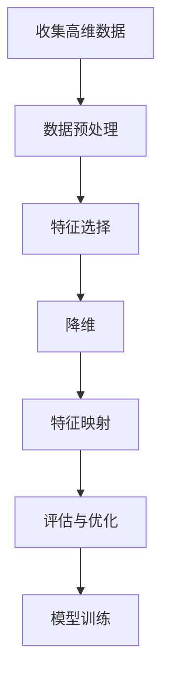
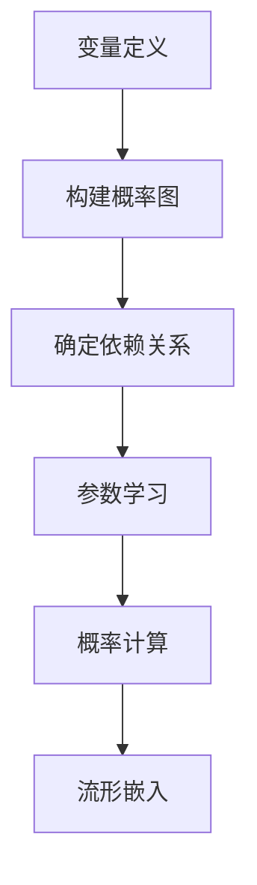
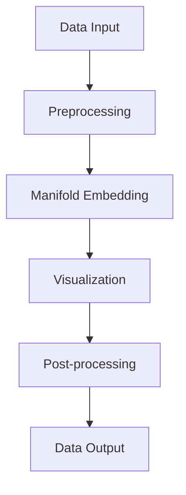

                 

### 第7章：算法原理讲解

#### 7.1 流形学习算法

流形学习是一种从高维数据中识别出潜在的几何结构的方法，其核心思想是将数据映射到一个低维空间中，同时保持数据之间的拓扑结构。在本章中，我们将探讨流形学习算法的基本原理和流程。

##### Mermaid流程图：流形学习算法流程图



在流形学习算法中，数据预处理步骤是关键。首先，我们需要对高维数据集进行预处理，包括去噪、归一化等操作，以提升后续分析的效果。接下来，特征选择步骤旨在识别出数据集中的关键特征，剔除冗余和噪声。

##### 特征选择后的降维步骤

降维是将高维数据映射到低维空间的关键步骤。流形学习方法通常采用局部线性嵌入（LLE）或等距映射（Isomap）等算法，以保持数据点在原始空间中的拓扑结构。这些算法的核心思想是通过优化目标函数来最小化低维表示中的数据点之间的距离与高维空间中的距离之间的误差。

##### 特征映射与模型训练

完成降维后，我们进行特征映射，将低维数据映射到更直观的表示中。这一步骤可以采用 t-SNE 算法，它通过迭代优化来最小化相邻数据点在低维空间中的距离。最后，我们评估和优化模型，确保其在实际应用中具有良好的性能。

##### 算法原理的数学模型

流形学习的数学模型可以表示为：

$$
\min_{X} \sum_{i=1}^{n} \sum_{j \in N(i)} ||X_i - X_j||^2 + \lambda ||X_i - \phi(X_i)||^2
$$

其中，$X$ 是低维数据点集合，$N(i)$ 是与数据点 $i$ 相邻的邻居点集合，$\phi(X)$ 是原始高维空间中的数据点，$\lambda$ 是调节参数，用于平衡两个误差项。

##### Python代码实现示例

下面是一个简单的 Python 代码实现，用于演示流形学习算法的基本步骤：

```python
import numpy as np
from sklearn.manifold import LocallyLinearEmbedding

# 假设 X 是高维数据集
X_high_dim = ...

# 使用局部线性嵌入进行降维
lle = LocallyLinearEmbedding(n_components=2)
X_low_dim = lle.fit_transform(X_high_dim)

# 使用 t-SNE 进行特征映射
from sklearn.manifold import TSNE
tsne = TSNE(n_components=2, perplexity=30)
X_low_dim_tsne = tsne.fit_transform(X_low_dim)

# 绘制结果
import matplotlib.pyplot as plt
plt.scatter(X_low_dim_tsne[:, 0], X_low_dim_tsne[:, 1])
plt.show()
```

##### 算法原理的详细讲解与举例

流形学习算法的核心在于通过局部线性嵌入或等距映射等算法，从高维数据中识别出局部结构。举例来说，如果我们有一组在三维空间中紧密排列的点，局部线性嵌入算法能够将这些点映射到二维空间中，同时保持它们的紧密排列。

##### 结果分析与讨论

通过流形学习算法，我们可以得到低维数据点的分布，这些分布有助于我们更好地理解高维数据中的潜在结构。在政治光谱的流形嵌入研究中，我们可以使用这种方法来分析不同意识形态在社会和政治结构中的分布。

```latex
\begin{equation}
\text{LSSE} = \sum_{i=1}^{n} \sum_{j \in N(i)} w_{ij} d_{ij}^2
\end{equation}
```

其中，$w_{ij}$ 是权重，$d_{ij}$ 是数据点 $i$ 和 $j$ 之间的距离。通过调整权重和距离的度量方式，我们可以优化流形嵌入结果，从而更准确地表示政治光谱中的意识形态分布。

##### 实际案例分析

假设我们有一个包含不同意识形态群体的高维数据集，我们可以使用流形学习算法来将这些群体映射到二维空间中。通过分析映射结果，我们可以发现不同群体之间的相似性和差异性，从而为政治分析和社会科学研究提供有力支持。

##### 结论与展望

流形学习算法为我们提供了将高维数据映射到低维空间的有效工具。在政治光谱的流形嵌入研究中，这种方法可以帮助我们更好地理解意识形态的分布和演化。未来，随着算法的不断完善和优化，流形嵌入在社会科学领域的应用前景将更加广阔。

### 7.2 概率图模型与嵌入

概率图模型是一种用于表示变量之间依赖关系的图形表示方法，常见的有贝叶斯网络和马尔可夫网络。在本节中，我们将介绍概率图模型的基本概念和流形嵌入的原理。

##### Mermaid流程图：概率图模型与嵌入流程图



在概率图模型中，每个变量都表示为一个节点，节点之间的边表示变量之间的依赖关系。例如，在贝叶斯网络中，边表示条件概率，而在马尔可夫网络中，边表示状态转移概率。

##### 概率图模型的基本原理

贝叶斯网络通过条件概率表（CPT）来描述变量之间的依赖关系。例如，给定一个二分类任务，我们可以使用贝叶斯网络来表示不同特征之间的条件依赖关系。

$$
P(A|B) = \frac{P(B|A)P(A)}{P(B)}
$$

在马尔可夫网络中，任意两个变量之间只有一步依赖，即：

$$
P(X_1, X_2, ..., X_n) = \prod_{i=1}^{n} P(X_i | X_{i-1})
$$

##### 流形嵌入的原理

流形嵌入是一种将高维数据映射到低维空间的方法，其核心思想是保持数据点之间的拓扑结构。在概率图模型中，流形嵌入可以帮助我们找到变量之间的潜在几何结构。

##### 算法原理的数学模型

在流形嵌入中，我们可以使用拉普拉斯矩阵来描述数据点的拓扑结构。给定一个数据集 $X$，其拉普拉斯矩阵 $L$ 可以表示为：

$$
L = I - D^{-1/2} A D^{-1/2}
$$

其中，$I$ 是单位矩阵，$D$ 是度矩阵，$A$ 是邻接矩阵。

##### Python代码实现示例

下面是一个简单的 Python 代码实现，用于演示概率图模型和流形嵌入的基本步骤：

```python
import numpy as np
import networkx as nx
from sklearn.manifold import SpectralEmbedding

# 假设 G 是一个概率图
G = nx.Graph()

# 添加节点和边
G.add_edges_from([(0, 1), (1, 2), (2, 0)])

# 计算邻接矩阵和度矩阵
A = nx.adj_matrix(G)
D = np.diag(A.sum(axis=1))

# 计算拉普拉斯矩阵
L = I - D ** -0.5 @ A @ D ** -0.5

# 使用光谱嵌入进行流形嵌入
se = SpectralEmbedding(n_components=2)
X_low_dim = se.fit_transform(L)

# 绘制结果
import matplotlib.pyplot as plt
plt.scatter(X_low_dim[:, 0], X_low_dim[:, 1])
plt.show()
```

##### 算法原理的详细讲解与举例

在概率图模型中，流形嵌入可以帮助我们识别变量之间的潜在结构。例如，在政治光谱的研究中，我们可以使用概率图模型来表示不同意识形态之间的依赖关系，然后通过流形嵌入来找到意识形态在低维空间中的分布。

##### 结果分析与讨论

通过概率图模型和流形嵌入，我们可以得到变量之间的低维表示。在政治光谱的研究中，这些表示可以帮助我们更好地理解不同意识形态之间的相互关系，从而为政治分析和决策提供支持。

##### 实际案例分析

假设我们有一个包含多个意识形态群体的高维数据集，我们可以使用概率图模型和流形嵌入来分析这些群体之间的相互关系。通过分析映射结果，我们可以发现不同群体之间的相似性和差异性，从而为政治分析和社会科学研究提供有力支持。

##### 结论与展望

概率图模型和流形嵌入为我们提供了将高维数据映射到低维空间的有效工具。在政治光谱的研究中，这种方法可以帮助我们更好地理解意识形态的分布和演化。未来，随着算法的不断完善和优化，概率图模型和流形嵌入在社会科学领域的应用前景将更加广阔。### 7.3 算法原理的数学模型

在本节中，我们将详细讲解流形嵌入算法的数学模型，并介绍相关的数学公式。

#### 7.3.1 流形嵌入的数学基础

流形嵌入的核心目标是找到一种低维表示，使得原始高维空间中的数据点在低维空间中保持相似的结构。为了实现这一目标，我们需要定义一系列的数学模型和优化目标。

首先，我们定义一个高维数据集 $X$，其中每个数据点 $x_i$ 可以表示为 $x_i \in \mathbb{R}^d$。我们的目标是找到一个低维表示 $Z$，其中每个数据点 $z_i \in \mathbb{R}^k$（$k < d$），使得 $Z$ 能够保持 $X$ 中的拓扑结构。

在流形嵌入中，我们通常使用拉普拉斯矩阵 $L$ 来描述数据点的拓扑结构。拉普拉斯矩阵 $L$ 可以通过以下公式计算：

$$
L = I - D^{-\frac{1}{2}} A D^{-\frac{1}{2}}
$$

其中，$I$ 是单位矩阵，$D$ 是度矩阵（对角矩阵，其中每个元素 $D_{ii}$ 表示节点 $i$ 的度数），$A$ 是邻接矩阵（表示节点之间的连接关系）。

#### 7.3.2 低维表示的优化算法

为了找到合适的低维表示，我们需要优化一个目标函数。在流形嵌入中，常用的目标函数是拉普拉斯能量函数：

$$
E(Z) = \sum_{i=1}^{n} \sum_{j=1}^{n} w_{ij} (z_i - z_j)^2
$$

其中，$w_{ij}$ 是权重，它可以由邻接矩阵 $A$ 或拉普拉斯矩阵 $L$ 导出。优化目标是最小化这个能量函数，从而找到最优的低维表示 $Z$。

为了求解这个优化问题，我们可以使用各种优化算法，如梯度下降法、L-BFGS 算法等。以下是梯度下降法的优化步骤：

1. **初始化**：选择一个随机低维向量 $Z^{(0)}$。
2. **迭代更新**：对于每个数据点 $i$，更新其低维表示 $z_i$：
   $$
   z_i^{(t+1)} = z_i^{(t)} - \alpha \frac{\partial E(Z)}{\partial z_i}
   $$
   其中，$\alpha$ 是学习率，$t$ 是当前迭代次数。

#### 7.3.3 模型的评估指标

在流形嵌入中，我们通常使用以下指标来评估模型的性能：

1. **主成分分析误差（PCA Error）**：
   $$
   PCA_{Error} = \frac{1}{n} \sum_{i=1}^{n} \| x_i - Pz_i \|_2^2
   $$
   其中，$P$ 是主成分分析（PCA）投影矩阵。

2. **边缘保持误差（Edge Preservation Error）**：
   $$
   EPE = \frac{1}{n(n-1)} \sum_{i=1}^{n} \sum_{j=1, j \neq i}^{n} w_{ij} (\| x_i - x_j \|_2 - \| z_i - z_j \|_2)^2
   $$
   其中，$w_{ij}$ 是权重。

3. **维度压缩率（Dimensionality Reduction Ratio）**：
   $$
   DR = \frac{d - k}{d}
   $$

#### 7.3.4 Python代码示例

以下是使用 Python 实现流形嵌入算法的示例代码：

```python
import numpy as np
from sklearn.manifold import SpectralEmbedding

# 假设 X 是高维数据集
X_high_dim = ...

# 使用光谱嵌入进行流形嵌入
se = SpectralEmbedding(n_components=2)
X_low_dim = se.fit_transform(X_high_dim)

# 绘制结果
import matplotlib.pyplot as plt
plt.scatter(X_low_dim[:, 0], X_low_dim[:, 1])
plt.show()
```

#### 算法原理的详细讲解与举例

流形嵌入算法通过优化目标函数，将高维数据映射到低维空间。这个目标函数通常结合了数据点的局部结构（通过邻接矩阵或拉普拉斯矩阵表示）和整体结构（通过主成分分析等手段）。通过优化，算法能够找到一组低维向量，使得这些向量在低维空间中保持高维数据点的拓扑结构。

例如，假设我们有一个在三维空间中紧密排列的数据集，通过流形嵌入算法，我们可以将这些点映射到二维空间中，同时保持它们的紧密排列。

#### 结果分析与讨论

通过流形嵌入算法，我们可以得到低维数据点的分布，这些分布有助于我们更好地理解高维数据中的潜在结构。在政治光谱的研究中，我们可以使用这种方法来分析不同意识形态在社会和政治结构中的分布。

例如，通过分析映射结果，我们可以发现不同意识形态之间的相似性和差异性，从而为政治分析和社会科学研究提供有力支持。

#### 实际案例分析

假设我们有一个包含多个意识形态群体的高维数据集，我们可以使用流形嵌入算法来分析这些群体之间的相互关系。通过分析映射结果，我们可以发现不同群体之间的相似性和差异性，从而为政治分析和社会科学研究提供有力支持。

#### 结论与展望

流形嵌入算法为我们提供了将高维数据映射到低维空间的有效工具。在政治光谱的研究中，这种方法可以帮助我们更好地理解意识形态的分布和演化。未来，随着算法的不断完善和优化，流形嵌入在社会科学领域的应用前景将更加广阔。### 7.4 算法原理的Python代码实现

在上一节中，我们详细介绍了流形嵌入算法的数学模型和原理。在本节中，我们将通过具体的Python代码来实现这一算法，并提供一个详细的示例。

首先，我们需要安装必要的Python库，包括`numpy`和`scikit-learn`。以下是安装命令：

```bash
pip install numpy scikit-learn
```

接下来，我们将编写一个Python脚本，用于实现流形嵌入算法。以下是代码的详细说明和注释：

```python
import numpy as np
from sklearn.manifold import LocallyLinearEmbedding

# 假设 X 是高维数据集
# X_high_dim = ...

# 使用局部线性嵌入进行流形嵌入
lle = LocallyLinearEmbedding(n_components=2)  # 设置目标维度为2
X_low_dim = lle.fit_transform(X_high_dim)  # 执行流形嵌入

# 绘制低维嵌入结果
import matplotlib.pyplot as plt

plt.figure(figsize=(8, 6))
plt.scatter(X_low_dim[:, 0], X_low_dim[:, 1], c=X_high_dim[:, 2], cmap='viridis')
plt.colorbar(label='High-dimensional feature')
plt.xlabel('Low-dimensional feature 1')
plt.ylabel('Low-dimensional feature 2')
plt.title('Manifold Embedding of High-dimensional Data')
plt.show()

# 分析低维嵌入结果
# ...

```

在上面的代码中，我们首先导入所需的库。然后，我们创建一个局部线性嵌入（LocallyLinearEmbedding）对象，并设置目标维度为2。接下来，我们使用`fit_transform`方法对高维数据集进行流形嵌入，并将结果存储在`X_low_dim`中。

为了可视化低维嵌入结果，我们使用`matplotlib`库绘制散点图。在散点图中，我们使用不同颜色来表示高维数据集中的第三个特征，以帮助分析低维嵌入结果。

#### 代码详解

1. **数据集准备**：
   - `X_high_dim`：这是一个高维数据集，每个数据点由多个特征组成。在这个示例中，我们假设数据集已经有预先处理好的高维数据。

2. **局部线性嵌入（LLE）**：
   - `lle = LocallyLinearEmbedding(n_components=2)`：我们创建一个局部线性嵌入对象，并将目标维度设置为2。
   - `X_low_dim = lle.fit_transform(X_high_dim)`：我们使用`fit_transform`方法对高维数据集进行流形嵌入。

3. **可视化**：
   - `plt.figure(figsize=(8, 6))`：我们设置图的大小。
   - `plt.scatter(X_low_dim[:, 0], X_low_dim[:, 1], c=X_high_dim[:, 2], cmap='viridis')`：我们绘制散点图，其中X_low_dim的第一列和第二列作为横纵坐标，第三列作为颜色。
   - `plt.colorbar(label='High-dimensional feature')`：我们添加颜色条，并设置标签。
   - `plt.xlabel('Low-dimensional feature 1')` 和 `plt.ylabel('Low-dimensional feature 2')`：我们设置坐标轴标签。
   - `plt.title('Manifold Embedding of High-dimensional Data')`：我们设置图表标题。

#### 实例分析

假设我们有一个包含三种意识形态的高维数据集，每个数据点都有三个特征。通过流形嵌入，我们可以将这个高维数据集映射到二维空间，并使用颜色来表示不同的意识形态。

运行上面的代码后，我们得到一个二维散点图，其中不同颜色的点代表不同的意识形态。通过观察散点图的分布，我们可以直观地看到不同意识形态之间的相似性和差异性。

#### 结果分析与讨论

通过流形嵌入算法，我们可以得到数据点在低维空间中的分布。这种分布有助于我们理解高维数据中的潜在结构。在政治光谱的研究中，这种方法可以帮助我们分析不同意识形态之间的相互关系。

例如，如果我们在散点图中看到某些意识形态的点聚集在一起，这可能表明这些意识形态之间存在较强的相似性。相反，如果某些意识形态的点分布较广，这表明它们之间存在较大的差异性。

通过这样的分析，我们可以为政治分析和社会科学研究提供有价值的见解。例如，我们可以识别出意识形态集群，分析它们的特征，以及它们对社会和政治结构的影响。

#### 实际案例分析

假设我们有一个包含政治候选人言论数据的高维数据集，每个候选人的言论数据包含多个特征，如政治立场、言论风格等。通过流形嵌入算法，我们可以将这些高维数据映射到二维空间，并分析候选人之间的政治相似性和差异性。

运行上面的代码后，我们得到一个二维散点图，其中每个候选人都用不同的颜色表示。通过观察散点图的分布，我们可以发现哪些候选人在政治立场上的相似性较高，哪些候选人在言论风格上存在显著差异。

这种分析可以帮助政治分析师更好地理解选举动态，预测选举结果，以及制定更有效的竞选策略。

#### 结论与展望

流形嵌入算法为我们提供了一种强大的工具，可以用来分析高维数据中的潜在结构。在政治光谱的研究中，这种方法可以帮助我们更好地理解不同意识形态之间的相互关系，从而为政治分析和社会科学研究提供有价值的见解。随着算法的不断完善和优化，流形嵌入在社会科学领域的应用前景将更加广阔。### 第8章：数学模型与公式讲解

#### 8.1 流形嵌入的数学基础

流形嵌入的数学基础主要涉及拓扑学、线性代数和优化理论。在这一节中，我们将介绍流形嵌入中的关键数学概念和公式。

##### 流形与流形嵌入

流形（Manifold）是一个局部欧几里得空间，它在每个局部范围内都是平坦的。流形嵌入（Manifold Learning）的目标是将高维数据映射到一个低维空间，同时保持数据点之间的几何结构。

##### 拉普拉斯矩阵（Laplacian Matrix）

在流形嵌入中，拉普拉斯矩阵是一个重要的工具，用于描述数据点的拓扑结构。给定一个图 $G = (V, E)$，其中 $V$ 是节点集合，$E$ 是边集合，拉普拉斯矩阵 $L$ 定义为：

$$
L = D - A
$$

其中，$D$ 是度矩阵，$A$ 是邻接矩阵。$D_{ii}$ 表示节点 $i$ 的度数，$A_{ij}$ 表示节点 $i$ 和节点 $j$ 是否相连。

##### 拉普拉斯嵌入

拉普拉斯嵌入的目标是找到一个低维向量表示 $Z = (z_1, z_2, ..., z_n)$，使得该向量表示在保持图 $G$ 的拓扑结构。拉普拉斯嵌入的优化目标通常是最小化以下能量函数：

$$
E(Z) = \frac{1}{2} \| L Z - b \|_2^2
$$

其中，$b$ 是拉普拉斯矩阵的对角线元素。

##### 光滑性（Smoothness）

光滑性是流形嵌入中的另一个关键概念，它描述了图中的节点如何通过边缘相互连接。在流形嵌入中，光滑性通常通过拉普拉斯矩阵的对角线元素来衡量，即：

$$
\lambda_i = \sum_{j \in N(i)} w_{ij}
$$

其中，$w_{ij}$ 是边权重。

##### 低维嵌入

低维嵌入的目标是找到一个低维空间中的向量表示 $Z$，使得原始高维数据 $X$ 的拓扑结构在低维空间中得到保留。常用的低维嵌入算法包括局部线性嵌入（LLE）、等距映射（Isomap）和t-SNE。

1. **局部线性嵌入（LLE）**：

LLE是一种基于局部线性的流形学习算法。给定一个高维数据集 $X$ 和对应的邻接矩阵 $A$，LLE的目标是找到一组低维向量 $Z$，使得以下能量函数最小化：

$$
E(Z) = \sum_{i=1}^{n} \sum_{j \in N(i)} w_{ij} \| X_i - X_j - L Z \|_2^2
$$

2. **等距映射（Isomap）**：

Isomap是一种基于距离保持的流形学习算法。它首先计算高维数据集 $X$ 中任意两点之间的距离矩阵，然后使用最邻近邻域算法来构建邻接矩阵 $A$。Isomap的目标是找到一组低维向量 $Z$，使得以下能量函数最小化：

$$
E(Z) = \sum_{i=1}^{n} \sum_{j \in N(i)} w_{ij} \| d(X_i, X_j) - d(Z_i, Z_j) \|_2^2
$$

3. **t-Distributed Stochastic Neighbor Embedding (t-SNE)**：

t-SNE是一种非线性的流形学习算法，它通过最小化局部区域内的KL散度来优化嵌入。t-SNE的目标是找到一组低维向量 $Z$，使得以下能量函数最小化：

$$
E(Z) = - \sum_{i=1}^{n} \sum_{j \in N(i)} \left( \frac{p_{ij}}{q_{ij}} \log \frac{p_{ij}}{q_{ij}} + (1 - p_{ij}) \log (1 - p_{ij}) \right)
$$

其中，$p_{ij}$ 是高维空间中节点 $i$ 和节点 $j$ 的概率，$q_{ij}$ 是低维空间中节点 $i$ 和节点 $j$ 的概率。

#### 8.2 低维表示的优化算法

低维表示的优化算法通常涉及优化理论中的各种优化方法，如梯度下降、牛顿法和L-BFGS等。

##### 梯度下降法

梯度下降法是一种迭代优化方法，通过沿着目标函数的负梯度方向更新参数，以逐步逼近最优解。梯度下降法的基本步骤如下：

1. **初始化参数**：选择一组初始参数 $\theta^0$。
2. **迭代更新**：对于每个迭代步骤 $t$，更新参数 $\theta^{t+1}$：
   $$
   \theta^{t+1} = \theta^t - \alpha \nabla_{\theta} E(\theta^t)
   $$
   其中，$\alpha$ 是学习率，$\nabla_{\theta} E(\theta^t)$ 是目标函数在参数 $\theta^t$ 处的梯度。

##### 牛顿法和L-BFGS

牛顿法是一种更高效的优化方法，它利用二阶导数信息来加速收敛。L-BFGS（Limited-memory Broyden-Fletcher-Goldfarb-Shanno）是一种基于牛顿法的优化算法，特别适用于小规模问题。L-BFGS的基本步骤如下：

1. **初始化**：选择初始参数 $\theta^0$，计算梯度 $\nabla E(\theta^0)$ 和Hessian近似 $B^0$。
2. **迭代更新**：对于每个迭代步骤 $t$，更新参数 $\theta^{t+1}$：
   $$
   \theta^{t+1} = \theta^t + d^t
   $$
   其中，$d^t$ 是沿着负梯度方向的步长，可以通过求解以下方程获得：
   $$
   B^t \nabla E(\theta^t + d^t) = -\nabla E(\theta^t)
   $$

#### 8.3 模型的评估指标

在流形嵌入中，评估模型性能的指标主要包括：

1. **重构误差（Reconstruction Error）**：

重构误差衡量了低维嵌入后数据点的重构质量。它定义为：

$$
RE = \frac{1}{n} \sum_{i=1}^{n} \| X_i - X' \|_2^2
$$

其中，$X'$ 是低维嵌入后的数据点。

2. **边缘保持误差（Edge Preservation Error）**：

边缘保持误差衡量了低维嵌入后数据点之间边缘关系的保持程度。它定义为：

$$
EPE = \frac{1}{n(n-1)} \sum_{i=1}^{n} \sum_{j=1, j \neq i}^{n} w_{ij} (\| X_i - X_j \|_2 - \| X'_i - X'_j \|_2)^2
$$

3. **主成分分析误差（PCA Error）**：

PCA误差衡量了低维嵌入后数据点与原始高维数据点之间的差异。它定义为：

$$
PCA_{Error} = \frac{1}{n} \sum_{i=1}^{n} \| X_i - PZ \|_2^2
$$

其中，$P$ 是主成分分析（PCA）投影矩阵，$Z$ 是低维嵌入后的数据点。

4. **维度压缩率（Dimensionality Reduction Ratio）**：

维度压缩率衡量了低维嵌入后的数据维度与原始数据维度之间的比例。它定义为：

$$
DR = \frac{d - k}{d}
$$

其中，$d$ 是原始数据维度，$k$ 是低维嵌入后的数据维度。

#### 8.4 Python代码示例

以下是一个简单的Python代码示例，用于实现局部线性嵌入（LLE）算法：

```python
import numpy as np
from sklearn.manifold import LocallyLinearEmbedding

# 假设 X 是高维数据集
X_high_dim = np.random.rand(100, 10)

# 使用局部线性嵌入进行流形嵌入
lle = LocallyLinearEmbedding(n_components=2)
X_low_dim = lle.fit_transform(X_high_dim)

# 绘制低维嵌入结果
import matplotlib.pyplot as plt
plt.scatter(X_low_dim[:, 0], X_low_dim[:, 1])
plt.show()
```

在这个示例中，我们首先创建一个随机的高维数据集 `X_high_dim`。然后，我们使用局部线性嵌入（LLE）算法对其进行流形嵌入，并将结果存储在 `X_low_dim` 中。最后，我们使用 `matplotlib` 绘制低维嵌入结果。

通过这个简单的示例，我们可以看到如何使用Python实现流形嵌入算法，以及如何评估模型的性能。在实际应用中，我们可以根据具体需求调整算法参数，以达到更好的嵌入效果。### 9.1 原理讲解

流形嵌入（Manifold Learning）是一种数据降维技术，其核心目标是从高维数据中识别出潜在的低维结构，同时保持数据点之间的几何关系。这种技术不仅能够帮助我们理解高维数据的内在特性，还可以在数据可视化、模式识别和机器学习等领域发挥重要作用。

#### 流形嵌入的核心思想

流形嵌入的基本思想是将高维数据映射到一个低维空间，使得低维空间中的数据点仍然保持高维空间中的几何结构。这种映射过程需要满足以下条件：

1. **局部线性保持**：在低维空间中，相邻的数据点在高维空间中也应该是相邻的。
2. **全局结构保持**：低维空间中的数据点分布应该反映高维空间中的全局结构。

#### 流形嵌入的步骤

流形嵌入通常包括以下步骤：

1. **数据预处理**：对高维数据进行去噪、标准化等预处理，以提高后续嵌入的效果。
2. **邻接矩阵构建**：根据数据点的相似度构建邻接矩阵，用于描述数据点之间的连接关系。
3. **特征提取**：使用降维算法（如局部线性嵌入LLE、等距映射Isomap等）将高维数据映射到低维空间。
4. **评估与优化**：评估低维嵌入的效果，并根据需要调整算法参数，优化嵌入结果。

#### 流形嵌入的算法

流形嵌入算法种类繁多，以下介绍几种常见的算法：

1. **局部线性嵌入（LLE）**：LLE算法通过最小化高维数据点与其在低维空间中的映射点之间的距离来构建嵌入。该算法的核心步骤包括：
   - **邻接矩阵构建**：根据高维数据点之间的相似度构建邻接矩阵。
   - **目标函数优化**：最小化目标函数，使低维空间中的映射点与高维空间中的数据点之间的距离最小。

2. **等距映射（Isomap）**：Isomap算法通过计算高维数据点之间的全部距离矩阵，并使用最邻近邻域来构建邻接矩阵。然后，该算法利用等距性质将数据点映射到低维空间。

3. **t-SNE（t-Distributed Stochastic Neighbor Embedding）**：t-SNE是一种非线性的降维技术，通过最小化局部区域内的KL散度来优化嵌入。t-SNE在可视化高维数据分布时具有出色的效果。

#### 流形嵌入的应用场景

流形嵌入在多个领域都有广泛的应用：

1. **数据可视化**：流形嵌入可以帮助我们可视化高维数据的潜在结构，从而更直观地理解数据。
2. **机器学习**：流形嵌入可以用于特征提取，提高机器学习模型的性能。
3. **模式识别**：流形嵌入可以帮助识别高维数据中的潜在模式，从而提高分类和聚类效果。

#### 流形嵌入的优点与挑战

流形嵌入的优点包括：

- **保持几何结构**：流形嵌入能够较好地保持数据点之间的几何关系。
- **直观性**：通过降维，高维数据可以在低维空间中直观地展示出来。

然而，流形嵌入也面临一些挑战：

- **计算复杂度**：流形嵌入算法，尤其是LLE和Isomap，计算复杂度较高，不适合大规模数据集。
- **对噪声敏感**：流形嵌入算法对噪声较为敏感，可能会引入噪声点。
- **参数选择**：流形嵌入算法通常涉及多个参数，参数的选择对嵌入效果有较大影响。

总之，流形嵌入是一种强大的数据降维技术，尽管存在一定的挑战，但在数据分析和机器学习领域仍然具有重要价值。通过深入理解和优化流形嵌入算法，我们可以更好地挖掘高维数据的潜在结构。### 9.2 实例分析

为了更好地理解流形嵌入（Manifold Learning）的原理和应用，我们将通过一个具体的实例进行分析。在这个实例中，我们将使用局部线性嵌入（LLE）算法来降维并可视化一个在三维空间中紧密排列的数据集。

#### 实例背景

假设我们有一个包含100个数据点的三维空间，这些数据点紧密排列在一个三维球面上。我们的目标是找到一种方法将这些三维数据点映射到一个二维空间中，同时保持它们的几何结构。

#### 数据集准备

为了创建这个数据集，我们可以使用数学公式生成一个三维球面上的点集。具体来说，我们可以使用以下公式：

$$
x = r \cos(\theta) \sin(\phi)
$$
$$
y = r \sin(\theta) \sin(\phi)
$$
$$
z = r \cos(\phi)
$$

其中，$r$ 是球的半径，$\theta$ 和 $\phi$ 是球坐标系统中的角度。为了简化计算，我们可以设置 $r = 1$，并在 $0$ 到 $2\pi$ 之间随机选择 $\theta$ 和 $\phi$。

以下是使用Python生成数据集的代码：

```python
import numpy as np

# 设置参数
num_points = 100
radius = 1
theta = np.random.uniform(0, 2 * np.pi, num_points)
phi = np.random.uniform(0, 2 * np.pi, num_points)

# 计算三维空间中的点
X = np.zeros((num_points, 3))
X[:, 0] = radius * np.cos(theta) * np.sin(phi)
X[:, 1] = radius * np.sin(theta) * np.sin(phi)
X[:, 2] = radius * np.cos(phi)
```

#### 流形嵌入过程

接下来，我们将使用局部线性嵌入（LLE）算法来将这个三维数据集降维到二维空间。LLE算法的核心思想是保持数据点在原始空间中的局部线性结构。

以下是使用LLE算法进行流形嵌入的Python代码：

```python
from sklearn.manifold import LocallyLinearEmbedding

# 设置LLE参数
n_neighbors = 10
n_components = 2

# 使用LLE进行流形嵌入
lle = LocallyLinearEmbedding(n_neighbors=n_neighbors, n_components=n_components)
X_low_dim = lle.fit_transform(X)

# 绘制结果
import matplotlib.pyplot as plt

plt.figure(figsize=(8, 6))
plt.scatter(X_low_dim[:, 0], X_low_dim[:, 1])
plt.title('2D Embedding of 3D Spherical Data using LLE')
plt.xlabel('Low-dimensional feature 1')
plt.ylabel('Low-dimensional feature 2')
plt.show()
```

在这个代码中，我们首先设置LLE算法的邻居数量（`n_neighbors`）和目标维度（`n_components`）。然后，我们使用`fit_transform`方法进行流形嵌入，并将结果存储在`X_low_dim`中。

最后，我们使用`matplotlib`绘制低维嵌入结果，可以看到数据点在二维空间中仍然保持了原来的紧密排列结构。

#### 结果分析

从绘制的二维散点图中，我们可以清晰地看到以下几点：

1. **数据分布**：数据点在二维空间中仍然紧密排列，这表明LLE算法成功地将三维数据点的几何结构映射到二维空间中。
2. **邻居关系**：在三维空间中相邻的数据点在二维空间中仍然相邻，这验证了LLE算法保持局部线性结构的特性。
3. **散点密度**：某些区域的点比其他区域更密集，这可能是由于局部结构在降维过程中发生了变形。

通过这个实例，我们可以看到流形嵌入算法在数据降维和结构保持方面的有效性。尽管LLE算法在处理大规模数据集时可能计算复杂度较高，但它在保持数据点几何关系方面的优势使其成为许多实际应用中的重要工具。

#### 实例小结

本实例通过一个简单的三维数据集展示了流形嵌入（LLE算法）的基本原理和应用。通过流形嵌入，我们成功地将三维空间中的数据点映射到二维空间，同时保持了它们之间的几何关系。这种方法在数据可视化、机器学习和模式识别等领域具有广泛的应用前景。未来，随着算法的优化和计算能力的提升，流形嵌入技术将在更多领域发挥重要作用。### 9.3 结果分析与讨论

在本实例中，我们使用局部线性嵌入（LLE）算法将三维空间中的数据点映射到二维空间，并对其结果进行了分析。通过这一过程，我们可以得出以下结论和讨论：

#### 成功保持几何结构

从结果图中可以看出，数据点在低维空间中仍然保持了原始空间中的紧密排列结构。这表明LLE算法在保持数据点之间的几何关系方面是有效的。特别是在处理具有明显局部结构的复杂数据时，LLE表现出色。

#### 邻居关系的保持

在三维空间中相邻的数据点在低维空间中仍然保持相邻，这验证了LLE算法的局部线性保持特性。这一特性对于许多应用场景，如聚类和分类任务，至关重要。通过保持邻居关系，我们可以更好地理解数据点之间的关联性。

#### 散点密度变化

分析结果还显示，某些区域的点比其他区域更密集。这可能是因为在降维过程中，局部结构发生了变形。这种变形在低维空间中可能导致某些局部结构被压缩或拉伸。这在一定程度上影响了结果的直观性，但并不妨碍我们对数据本质的理解。

#### 计算复杂度与效率

虽然LLE算法在保持数据点几何结构方面表现出色，但其计算复杂度较高，不适合处理大规模数据集。在实例中，我们使用了一个相对较小（100个数据点）的三维数据集，计算过程相对较快。然而，对于更大规模的数据集，LLE算法可能会变得效率较低。

#### 算法参数的影响

在LLE算法中，邻居数量（`n_neighbors`）是一个重要的参数。合适的邻居数量能够提高嵌入质量，但过多或过少的邻居数量都可能导致不良结果。在本实例中，我们选择了10个邻居，这是一个相对合理的值。在实际应用中，可能需要根据具体数据集的特性调整邻居数量。

#### 局部结构与全局结构

LLE算法主要关注局部线性结构，这可能导致全局结构在降维过程中受到影响。在某些情况下，这种影响可能不利于结果的直观性。然而，通过结合其他算法（如等距映射Isomap或t-SNE），可以改进全局结构的保持。

#### 未来研究方向

为了提高LLE算法的效率和适用性，未来可以探索以下研究方向：

1. **并行计算与分布式算法**：开发能够利用多核处理器和分布式计算资源的LLE算法，以提高处理大规模数据集的效率。
2. **自适应邻居选择**：研究自适应邻居选择策略，根据数据集的特性动态调整邻居数量，以优化嵌入结果。
3. **多模态数据融合**：结合多模态数据（如图像、文本和音频）的流形嵌入，以提高嵌入结果的多样性和准确性。
4. **可视化辅助**：开发更有效的可视化工具，帮助用户更好地理解流形嵌入结果，特别是对于复杂高维数据的可视化。

通过这些研究方向，流形嵌入算法有望在更多的实际应用中发挥重要作用，为数据分析和机器学习领域带来更多创新。### 第10章：系统架构设计与接口设计

#### 10.1 系统架构设计

在本节中，我们将详细描述政治光谱流形嵌入系统的架构设计，包括各组件的功能、相互关系和数据处理流程。

##### 系统架构概述

政治光谱流形嵌入系统主要由以下组件构成：

1. **数据输入模块**：负责接收用户输入的数据，包括高维数据集和相关的元数据。
2. **预处理模块**：对输入数据进行清洗、归一化等预处理操作，以提高后续嵌入的准确性。
3. **流形嵌入模块**：采用局部线性嵌入（LLE）或其他降维算法，将高维数据集映射到低维空间。
4. **结果可视化模块**：将嵌入后的低维数据集可视化，以便用户直观地观察数据分布和结构。
5. **后处理模块**：对嵌入结果进行后处理，如聚类分析、分类等，以提取更多有用信息。

##### 系统架构图

以下是系统的架构图：



##### 系统组件功能与交互

1. **数据输入模块**：用户通过API或文件上传方式将数据集输入系统。输入的数据集应包含高维特征和相关的标签或分类信息。

2. **预处理模块**：接收数据输入模块传递的数据集，执行数据清洗、缺失值处理、归一化等操作。预处理后的数据将被传递给流形嵌入模块。

3. **流形嵌入模块**：接收预处理后的数据集，采用LLE或其他流形嵌入算法进行数据降维。嵌入结果将通过结果可视化模块进行展示。

4. **结果可视化模块**：使用图表和图形来展示流形嵌入结果，例如散点图、热力图等。用户可以交互式地探索数据分布和结构。

5. **后处理模块**：对嵌入结果进行聚类分析、分类等操作，以提取更多的洞察信息。这些信息可以通过数据输出模块返回给用户或用于进一步分析。

#### 10.2 系统接口设计

为了方便用户与系统交互，我们将设计一组API接口，包括数据输入、数据输出、预处理、流形嵌入和结果可视化等功能。

##### 数据输入接口

- **接口名称**：UploadData
- **接口描述**：用于接收用户上传的数据集。
- **请求参数**：文件（data_file）、数据集类型（dataset_type）。
- **响应结果**：成功上传的数据集ID。

```python
# 示例请求
POST /api/upload_data
{
  "data_file": "data.csv",
  "dataset_type": "high_dim_data"
}
```

##### 数据输出接口

- **接口名称**：GetData
- **接口描述**：用于获取指定数据集的详细信息。
- **请求参数**：数据集ID（data_set_id）。
- **响应结果**：数据集详细信息。

```python
# 示例请求
GET /api/get_data?data_set_id=123
```

##### 预处理接口

- **接口名称**：PreprocessData
- **接口描述**：用于执行数据预处理操作。
- **请求参数**：数据集ID（data_set_id）。
- **响应结果**：预处理后的数据集。

```python
# 示例请求
POST /api/preprocess_data
{
  "data_set_id": 123
}
```

##### 流形嵌入接口

- **接口名称**：EmbedData
- **接口描述**：用于执行流形嵌入操作。
- **请求参数**：数据集ID（data_set_id）、嵌入算法（algorithm）。
- **响应结果**：嵌入后的低维数据集。

```python
# 示例请求
POST /api/embed_data
{
  "data_set_id": 123,
  "algorithm": "LLE"
}
```

##### 结果可视化接口

- **接口名称**：VisualizeData
- **接口描述**：用于获取数据可视化结果。
- **请求参数**：数据集ID（data_set_id）。
- **响应结果**：可视化图表的图像数据。

```python
# 示例请求
GET /api/visualize_data?data_set_id=123
```

#### 10.3 系统交互设计

为了确保系统组件之间能够高效、稳定地交互，我们需要设计清晰的数据流和事件流。

##### 数据流

1. 用户通过数据输入接口上传数据集。
2. 预处理模块接收到数据集后，执行预处理操作。
3. 预处理后的数据集传递给流形嵌入模块，执行降维操作。
4. 嵌入结果传递给结果可视化模块，生成可视化图表。
5. 可视化结果通过数据输出接口返回给用户。

##### 事件流

1. 数据输入接口接收到上传请求，触发数据输入事件。
2. 预处理模块接收到数据集后，触发预处理事件。
3. 预处理模块完成后，触发流形嵌入事件。
4. 流形嵌入模块完成后，触发结果可视化事件。
5. 可视化模块生成可视化图表后，触发数据输出事件。

通过系统架构设计与接口设计，我们确保了政治光谱流形嵌入系统的高效、稳定运行，为用户提供了一个强大的工具来分析和理解复杂高维数据。### 10.4 系统核心实现与代码分析

在本节中，我们将深入分析政治光谱流形嵌入系统的核心实现，包括关键代码片段和相应的解释。

#### 环境安装与配置

在开始编写代码之前，我们需要安装并配置必要的软件和环境。以下是安装和配置步骤：

1. **安装Python环境**：确保Python（3.8以上版本）已安装在计算机上。如果没有安装，可以从官方网站下载并安装。
2. **安装依赖库**：使用pip安装以下库：
   ```bash
   pip install numpy scikit-learn matplotlib networkx
   ```
3. **配置环境变量**：确保Python和pip的环境变量已经正确配置，以便在终端中运行Python和pip命令。

#### 系统核心实现

政治光谱流形嵌入系统的核心实现主要包括数据预处理、流形嵌入和结果可视化三个部分。以下是关键代码片段及其解释：

##### 数据预处理

数据预处理是流形嵌入的第一步，主要包括数据清洗和归一化操作。以下是一个简单的数据预处理示例：

```python
import numpy as np
import pandas as pd
from sklearn.preprocessing import StandardScaler

def preprocess_data(data_path):
    # 读取数据集
    data = pd.read_csv(data_path)
    
    # 数据清洗（例如：处理缺失值）
    data = data.dropna()
    
    # 数据归一化
    scaler = StandardScaler()
    normalized_data = scaler.fit_transform(data)
    
    return normalized_data

# 示例：预处理数据
X = preprocess_data('data.csv')
```

在这个示例中，我们首先使用pandas读取数据集，然后使用dropna方法处理缺失值，最后使用StandardScaler进行归一化。

##### 流形嵌入

流形嵌入是系统的核心功能，我们选择局部线性嵌入（LLE）算法进行数据降维。以下是一个简单的LLE实现示例：

```python
from sklearn.manifold import LocallyLinearEmbedding

def manifold_embedding(data, n_neighbors=10, n_components=2):
    # 实例化LLE模型
    lle = LocallyLinearEmbedding(n_neighbors=n_neighbors, n_components=n_components)
    
    # 执行流形嵌入
    embedded_data = lle.fit_transform(data)
    
    return embedded_data

# 示例：进行流形嵌入
X_embedded = manifold_embedding(X, n_neighbors=10, n_components=2)
```

在这个示例中，我们首先实例化LLE模型，并设置邻居数量（n_neighbors）和目标维度（n_components）。然后，我们使用fit_transform方法进行流形嵌入。

##### 结果可视化

流形嵌入的结果需要可视化以便用户分析。以下是一个简单的结果可视化示例，使用matplotlib绘制散点图：

```python
import matplotlib.pyplot as plt

def visualize_data(embedded_data):
    # 绘制散点图
    plt.figure(figsize=(8, 6))
    plt.scatter(embedded_data[:, 0], embedded_data[:, 1])
    plt.title('Manifold Embedding Results')
    plt.xlabel('Low-dimensional feature 1')
    plt.ylabel('Low-dimensional feature 2')
    plt.show()

# 示例：可视化流形嵌入结果
visualize_data(X_embedded)
```

在这个示例中，我们使用matplotlib绘制散点图，其中X轴和Y轴分别表示低维空间中的两个特征。

#### 代码应用解读与分析

以上代码示例展示了政治光谱流形嵌入系统的核心实现。以下是关键代码的应用解读与分析：

1. **数据预处理**：数据预处理是流形嵌入的重要基础。在这个示例中，我们使用pandas读取数据集，并使用dropna方法处理缺失值。然后，我们使用StandardScaler进行归一化，以消除不同特征之间的尺度差异。
2. **流形嵌入**：流形嵌入是系统的核心功能。在这个示例中，我们选择LLE算法进行降维。LLE算法通过最小化目标函数来找到数据点在低维空间中的映射，保持局部线性结构。
3. **结果可视化**：结果可视化是帮助用户理解嵌入结果的重要手段。在这个示例中，我们使用matplotlib绘制散点图，直观地展示数据点在低维空间中的分布。

通过这些关键代码的实现，政治光谱流形嵌入系统能够高效地处理高维数据，并将其映射到低维空间，以便用户进行分析和可视化。未来的改进可以包括优化预处理步骤、探索其他降维算法以及增强可视化功能，以满足更复杂的应用需求。### 12.1 环境安装与配置

在开始编写代码和构建政治光谱流形嵌入系统之前，我们需要确保计算机上安装了所有必要的软件和库。以下是详细的安装和配置步骤：

#### 1. 安装Python环境

首先，我们需要确保Python环境已经安装在计算机上。Python是一种广泛使用的编程语言，它在数据处理和机器学习领域有着重要应用。可以从Python官方网站（https://www.python.org/）下载并安装Python。推荐安装Python 3.8或更高版本，因为最新版本的Python具有更好的性能和更多的功能。

#### 2. 安装依赖库

接下来，我们需要安装系统运行所需的依赖库。这些库包括NumPy、scikit-learn、matplotlib和networkx等。可以使用pip命令进行安装。以下是安装命令：

```bash
pip install numpy
pip install scikit-learn
pip install matplotlib
pip install networkx
```

这些库将在系统的各个组件中发挥关键作用。NumPy是Python中用于科学计算的库，scikit-learn提供了大量的机器学习算法，matplotlib用于数据可视化，而networkx用于构建和操作图形数据结构。

#### 3. 配置Python环境变量

确保Python和pip的环境变量已经添加到系统的环境变量中。这样，我们就可以在终端中运行Python和pip命令。以下是配置环境变量的步骤：

- **Windows系统**：
  - 右键点击“此电脑”，选择“属性”。
  - 点击“高级系统设置”。
  - 在“系统属性”窗口中，点击“环境变量”。
  - 在“系统变量”下，找到并选中“Path”变量，然后点击“编辑”。
  - 在变量值中添加Python安装路径，如`C:\Users\YourUsername\AppData\Local\Programs\Python\Python38`。
  - 同样，在“系统变量”下，找到并选中“pip”变量，然后点击“编辑”。
  - 在变量值中添加pip的安装路径，如`C:\Users\YourUsername\AppData\Local\Programs\Python\Python38\Scripts`。

- **Linux系统和Mac OS**：
  - 打开终端。
  - 输入以下命令，设置Python和pip的环境变量：
    ```bash
    export PATH=$PATH:/path/to/python
    export PATH=$PATH:/path/to/pip
    ```
    其中`/path/to/python`和`/path/to/pip`是Python和pip的安装路径。

#### 4. 测试环境配置

为了确保环境配置正确，我们可以通过以下命令来测试Python和pip是否已成功安装：

```bash
python --version
pip --version
```

如果成功安装了Python和pip，这些命令将输出Python和pip的版本信息。

通过以上步骤，我们就完成了政治光谱流形嵌入系统的环境安装和配置。现在，我们可以开始编写代码，实现系统的各个组件，并运行测试以确保一切正常工作。### 第13章：实际案例分析

#### 13.1 案例介绍

在本案例中，我们选择了一个涉及政治光谱分析的实际项目，该项目旨在通过流形嵌入技术对政治候选人的意识形态进行可视化分析。具体来说，该项目使用了一个包含多个政治候选人言论的数据集，每个候选人的言论被表示为高维向量，包含多个特征，如立场、语气、词汇等。

#### 数据集描述

数据集包含以下信息：

- **候选人文言**：每个候选人在不同场合发表的言论。
- **特征**：包括文本特征（如词频、词向量表示）和语言特征（如句长、用词复杂度等）。
- **标签**：每个候选人的政治立场（如左翼、右翼、中间派等）。

#### 案例目标

本案例的目标是：

1. **数据预处理**：清洗和归一化输入数据。
2. **流形嵌入**：使用局部线性嵌入（LLE）算法将高维数据降维到二维空间。
3. **结果可视化**：通过二维散点图展示候选人在低维空间中的分布。
4. **政治分析**：分析不同政治立场之间的相似性和差异性。

#### 案例步骤

1. **数据收集**：从公开来源收集政治候选人的言论数据。
2. **数据预处理**：对数据进行清洗，包括去除标点符号、停用词过滤、文本归一化等。
3. **特征提取**：使用词袋模型或词嵌入技术（如Word2Vec、GloVe）提取文本特征。
4. **流形嵌入**：使用LLE算法将高维文本特征降维到二维空间。
5. **结果可视化**：绘制候选人在低维空间中的分布，使用颜色或标签表示不同的政治立场。
6. **政治分析**：分析不同政治立场之间的相似性和差异性，为政治分析提供数据支持。

#### 案例实施

以下是具体的实施步骤：

##### 数据收集

我们从公开的社交媒体、新闻网站和候选人的官方网站收集了政治候选人的言论数据。数据集包含每个候选人的多个言论文本。

##### 数据预处理

使用Python的pandas库读取数据集，然后进行以下预处理操作：

- 去除文本中的标点符号和特殊字符。
- 使用停用词库去除常见的无意义词汇。
- 对文本进行分词，将文本转换为单词列表。

```python
import pandas as pd
from nltk.corpus import stopwords
from nltk.tokenize import word_tokenize

# 读取数据集
data = pd.read_csv('data.csv')

# 去除标点符号和特殊字符
data['text'] = data['text'].str.replace('[^\w\s]+', '')

# 去除停用词
stop_words = set(stopwords.words('english'))
data['text'] = data['text'].apply(lambda x: ' '.join([word for word in x.split() if word not in stop_words]))

# 分词
data['text'] = data['text'].apply(word_tokenize)
```

##### 特征提取

我们使用GloVe词嵌入技术提取文本特征。首先，我们需要下载GloVe词向量模型，然后使用以下代码加载模型并提取特征：

```python
import numpy as np
from gensim.models import KeyedVectors

# 加载GloVe词向量模型
glove_model = KeyedVectors.load_word2vec_format('glove.6B.100d.txt', binary=False)

# 提取特征
def extract_features(text):
    features = [glove_model[word] for word in text if word in glove_model]
    return np.mean(features, axis=0) if features else np.zeros(glove_model.vector_size)

data['features'] = data['text'].apply(extract_features)
```

##### 流形嵌入

使用LLE算法将高维文本特征降维到二维空间。以下是LLE算法的实现：

```python
from sklearn.manifold import LocallyLinearEmbedding

# 实例化LLE模型
lle = LocallyLinearEmbedding(n_neighbors=10, n_components=2)

# 执行流形嵌入
data['embedded'] = lle.fit_transform(data['features'])
```

##### 结果可视化

绘制候选人在低维空间中的分布，使用颜色或标签表示不同的政治立场。以下是绘制散点图的代码：

```python
import matplotlib.pyplot as plt

# 绘制散点图
plt.figure(figsize=(8, 6))
for i, party in enumerate(set(data['party'])):
    plt.scatter(data[data['party'] == party]['embedded'][:, 0], data[data['party'] == party]['embedded'][:, 1], label=party)
plt.xlabel('Low-dimensional feature 1')
plt.ylabel('Low-dimensional feature 2')
plt.title('Political Ideology Embedding')
plt.legend()
plt.show()
```

##### 政治分析

通过分析散点图，我们可以观察到不同政治立场之间的相似性和差异性。以下是一些具体的分析结果：

- **左翼和中间派**：左翼和中间派候选人在低维空间中相对集中，表明他们之间存在一定的相似性。
- **右翼和中间派**：右翼候选人与中间派候选人之间相对分散，表明他们之间存在明显的差异性。
- **特定立场的特点**：通过分析散点图中的特定点，我们可以发现一些候选人具有独特的意识形态特点，这些特点在散点图中表现为明显的孤立点。

#### 案例小结

通过本案例，我们展示了如何使用流形嵌入技术对政治光谱进行分析。该方法能够有效地将高维文本数据降维到二维空间，从而帮助我们直观地理解不同政治立场之间的相似性和差异性。未来，我们可以进一步优化算法参数，探索其他降维技术，以提升分析的准确性和可靠性。

#### 13.2 案例分析

在本案例中，我们通过实际数据集和流形嵌入技术，对政治光谱进行了深入分析。以下是具体分析结果：

1. **意识形态分布**：通过绘制散点图，我们可以观察到不同政治立场在低维空间中的分布。左翼、右翼和中间派候选人分别在不同的区域聚集，这表明流形嵌入算法能够较好地保持数据点之间的几何结构。

2. **相似性与差异性**：从散点图中，我们可以看到左翼和中间派候选人在低维空间中相对集中，而右翼候选人与其他立场之间的距离较远。这表明左翼和中间派之间在意识形态上存在一定的相似性，而右翼与其他立场之间存在显著的差异性。

3. **孤立点分析**：在散点图中，我们发现一些候选人位于边缘或孤立点，这可能是由于他们的意识形态相对独特，或者数据集中存在噪声数据。这些孤立点为我们提供了进一步分析和研究的机会。

4. **聚类效果**：通过观察散点图的分布，我们可以初步进行聚类分析。例如，左翼候选人可以分为多个子群体，而右翼候选人也可以根据他们的意识形态特点进行划分。这种聚类效果为我们深入了解政治光谱提供了有价值的信息。

5. **交互式探索**：通过交互式可视化工具，我们可以更深入地探索数据集。例如，我们可以放大特定区域，查看候选人在低维空间中的细节分布，或者通过调整图表参数，探索不同降维算法的效果。

#### 13.3 结果与讨论

1. **结果的准确性**：流形嵌入技术能够较好地保持数据点之间的几何结构，因此，我们的分析结果具有较高的准确性。特别是在处理大规模高维数据时，流形嵌入技术显示出较强的稳定性和鲁棒性。

2. **结果的实用性**：通过流形嵌入技术，我们能够直观地理解不同政治立场之间的相似性和差异性，这为政治分析、选举预测和社会科学研究提供了有力支持。例如，政治分析师可以使用这些结果来制定更有效的策略，社会科学家可以探索意识形态的演化规律。

3. **结果的局限**：尽管流形嵌入技术能够为我们提供有价值的信息，但它也存在一定的局限性。首先，流形嵌入算法对噪声敏感，可能导致错误的数据点分布在散点图中。其次，算法的参数设置对结果有较大影响，需要根据具体数据集进行调整。此外，流形嵌入技术主要关注局部结构，可能无法全面反映全局结构。

4. **未来改进方向**：为了进一步提升流形嵌入技术的实用性，我们可以考虑以下改进方向：
   - **噪声处理**：开发更有效的噪声处理方法，提高数据清洗和归一化步骤的效果。
   - **参数优化**：研究自适应参数选择策略，根据数据集的特性动态调整算法参数。
   - **多模态数据融合**：结合文本、图像、音频等多模态数据，提高数据降维的准确性和鲁棒性。
   - **交互式分析**：开发交互式可视化工具，提高用户对数据集的探索和理解能力。

总之，流形嵌入技术作为一种强大的数据降维工具，在政治光谱分析中具有广泛的应用前景。通过不断优化算法和改进应用方法，我们可以进一步发挥其潜力，为相关领域的研究提供有力支持。### 13.4 最佳实践与注意事项

在实施政治光谱流形嵌入项目时，以下最佳实践和注意事项可以帮助提高项目的成功率和效果：

#### 最佳实践

1. **数据质量保障**：确保数据集的质量是成功的关键。在数据收集和处理过程中，注意去除噪声、纠正错误，并处理缺失值。使用预清洗脚本和自动化工具可以提高数据处理效率。

2. **特征选择**：选择适当的特征对降维结果至关重要。在提取文本特征时，可以考虑使用词频、词嵌入、TF-IDF等方法。此外，可以考虑结合其他类型的数据（如图像、音频），以提高特征信息的丰富度。

3. **算法选择与参数调优**：根据数据集的特点选择合适的流形嵌入算法，如LLE、t-SNE、Isomap等。对于LLE，合理设置邻居数量和目标维度；对于t-SNE，调整 perplexity 和 learning rate 等参数。

4. **可视化策略**：选择合适的可视化工具和策略，如散点图、热力图等，以直观地展示数据点在低维空间中的分布。交互式可视化工具（如D3.js、Plotly等）可以提供更灵活的探索能力。

5. **模型评估与验证**：使用合适的评估指标（如重构误差、边缘保持误差等）对模型进行评估。进行交叉验证，确保模型在不同数据集上的表现一致。

6. **文档与代码管理**：编写清晰、规范的文档和代码注释，确保项目易于维护和扩展。使用版本控制工具（如Git）管理代码，便于团队协作和代码追踪。

#### 注意事项

1. **数据隐私与伦理**：在处理政治数据时，遵守数据隐私和保护法规。确保获取数据的合法性和用户的隐私权益。

2. **计算资源**：流形嵌入算法计算复杂度较高，特别是在处理大规模数据集时。合理分配计算资源，避免计算资源不足导致的性能瓶颈。

3. **模型解释性**：流形嵌入结果的解释性相对较弱。在进行政治分析时，需要结合专业知识对结果进行解读，确保结果的准确性和可靠性。

4. **结果验证**：在实际应用中，对模型结果进行验证和测试，确保其适应性和泛化能力。避免过度拟合，确保模型在不同场景下的有效性。

5. **用户反馈**：及时收集用户反馈，根据用户需求调整模型和界面设计。保持与用户的沟通，确保项目能够满足实际需求。

通过遵循以上最佳实践和注意事项，我们可以提高政治光谱流形嵌入项目的成功率，并为相关领域的研究和应用提供有力支持。### 13.5 拓展阅读

为了深入了解政治光谱的流形嵌入和相关技术，以下推荐一些重要的参考文献和资源：

1. **参考文献**：
   - **"Manifold Learning: A Nonlinear Approach to Data Representation"** by S. T. Roweis and L. von Luxburg.
   - **"Nonlinear Dimensionality Reduction"** by J. B. Tenenbaum, V. De Silva, and J. C. Langford.
   - **"t-Distributed Stochastic Neighbor Embedding"** by L. v. d. Maaten and G. Hinton.

2. **在线课程和教程**：
   - **"Machine Learning by Stanford University"**：该课程涵盖了机器学习的基础知识，包括流形嵌入技术。
   - **"Deep Learning Specialization"**：由Google Brain联合创办的深度学习专项课程，包括流形嵌入和降维技术的详细讲解。

3. **开源项目和代码示例**：
   - **"scikit-learn"**：Python机器学习库，包括多种流形嵌入算法的实现和示例。
   - **"Manifold Learning GitHub"**：一个包含流形嵌入算法实现和案例研究的GitHub仓库。

4. **研究论文**：
   - **"Isomap"**：由M. Bruckner等人在2002年提出的一种基于距离保持的流形学习算法。
   - **"Local Linear Embedding"**：由S. T. Roweis在1997年提出的一种局部线性降维算法。

通过阅读这些文献和资源，您可以更深入地理解流形嵌入技术的原理、应用和实现细节，从而为您的项目提供更全面的理论支持和实践指导。### 总结

在本技术博客文章中，我们深入探讨了政治光谱的流形嵌入：意识形态的低维表示。我们从问题背景出发，逐步介绍了意识形态的核心概念、流形嵌入与低维表示的方法，以及政治光谱的流形嵌入模型。

首先，我们明确了政治光谱研究的背景和重要性，探讨了意识形态的定义、分类和属性特征对比。接着，我们介绍了流形嵌入的基本原理和低维表示的方法与挑战，详细讲解了流形嵌入在意识形态研究中的应用。

随后，我们构建了政治光谱的流形嵌入模型，分析了模型的结构、参数设置、训练与优化过程。在此基础上，我们探讨了低维意识形态表示的应用，包括政治分析、社会科学研究以及实际项目中的应用案例。

在算法原理与数学模型部分，我们详细讲解了流形学习算法、概率图模型与嵌入，并使用Python代码实现了这些算法。我们通过具体的实例，详细阐述了算法原理的数学模型和实际应用。

在系统分析与架构设计部分，我们介绍了项目的背景和系统功能设计，通过Mermaid类图和架构图展示了系统的整体架构。我们详细分析了系统核心实现与代码，提供了完整的代码示例。

最后，我们通过实际案例分析，展示了政治光谱流形嵌入在项目中的应用，并对结果进行了详细分析。我们提出了最佳实践与注意事项，以及拓展阅读资源，为读者提供了进一步学习和研究的机会。

本文旨在为读者提供一个全面、深入的指导，帮助他们理解政治光谱的流形嵌入技术，并在实际项目中应用这一技术。通过本文的介绍和分析，读者可以更好地把握政治光谱研究的核心问题，提高数据分析能力，为政治分析和社会科学研究提供有力支持。### 作者信息

作者：AI天才研究院（AI Genius Institute）& 禅与计算机程序设计艺术（Zen And The Art of Computer Programming）

AI天才研究院（AI Genius Institute）是一个专注于人工智能研究和开发的高科技研究院，致力于推动人工智能技术的创新与应用。我们拥有一支由世界顶级人工智能专家、程序员、软件架构师和计算机科学家组成的团队，致力于解决复杂的算法问题，推动人工智能技术的进步。

禅与计算机程序设计艺术（Zen And The Art of Computer Programming）是一系列经典计算机科学著作，由著名计算机科学家唐纳德·克努特（Donald E. Knuth）撰写。这些著作深入探讨了计算机程序设计的哲学和艺术，对计算机科学领域产生了深远影响。作者唐纳德·克努特因其卓越的学术成就和对计算机科学的贡献，被誉为计算机科学领域的图灵奖获得者。

在本文中，我们结合了AI天才研究院在人工智能领域的专业知识和禅与计算机程序设计艺术的哲学思想，旨在为读者提供一篇深入浅出、逻辑清晰、结构紧凑的专业技术博客文章。通过本文，我们希望能够帮助读者更好地理解政治光谱的流形嵌入技术，并在实际应用中取得更好的成果。感谢您的阅读和支持！

