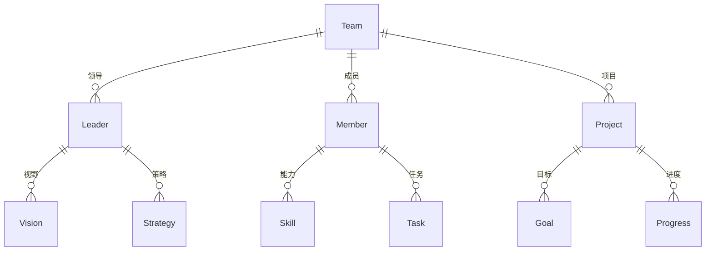
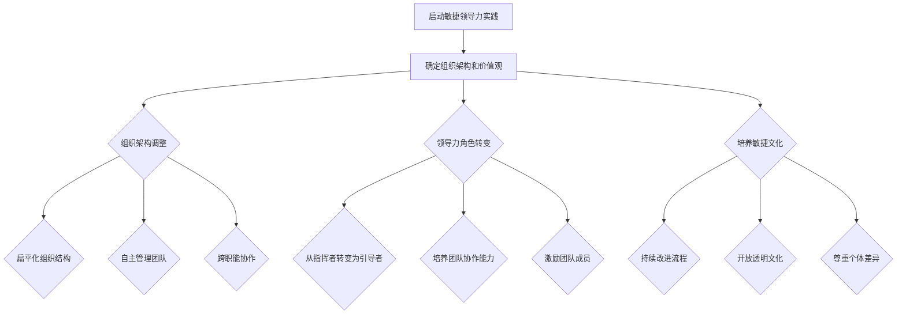
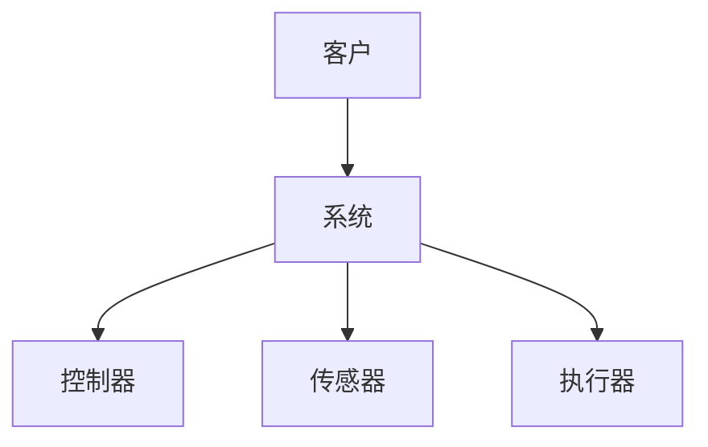
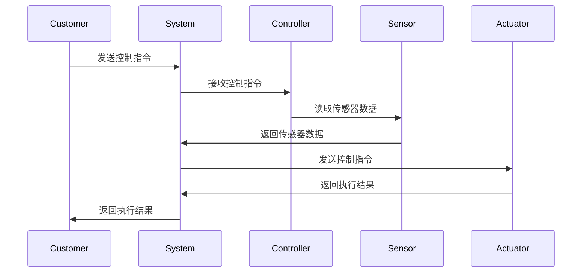

                 


## 敏捷领导力：适应快速变化的商业环境

### 关键词

- 敏捷领导力
- 快速变化
- 商业环境
- 组织架构
- 团队协作
- 领导原则

### 摘要

在当前快速变化的商业环境中，敏捷领导力成为企业成功的关键因素。本文将探讨敏捷领导力的背景、核心概念、实践方法及其在商业环境中的应用，旨在为读者提供一套系统化的敏捷领导力知识体系，帮助企业和团队更好地适应快速变化的环境，提升整体竞争力。

### 目录大纲设计思路

本文采用逻辑清晰、结构紧凑、简单易懂的写作风格，分为以下五个部分：

1. **背景介绍**：介绍敏捷领导力的兴起背景和重要性，阐述其在现代商业环境中的作用。
2. **核心概念与联系**：详细解释敏捷领导力的基本理论，通过对比表格和实体关系图展示其概念属性特征。
3. **算法原理讲解**：讲解敏捷领导力中涉及的算法原理，包括流程图、Python源代码和数学模型。
4. **系统分析与架构设计方案**：介绍敏捷领导力在项目中的具体应用，展示系统功能设计、架构设计和接口交互。
5. **项目实战与最佳实践**：通过实际案例分析和项目小结，总结敏捷领导力的最佳实践，提供进一步学习的资源。

### 第一部分：背景介绍

#### 1.1 敏捷领导力的兴起背景

敏捷领导力起源于软件开发领域的敏捷方法，最早在2001年由一组软件开发者共同签署了《敏捷宣言》，宣言中强调了个体和互动、可工作的软件、客户协作和响应变化的重要性。随着敏捷方法的成功应用，敏捷领导力逐渐被其他行业和领域所接受，成为一种适应快速变化环境的领导力新模式。

#### 1.2 商业环境的变化

现代商业环境正经历着前所未有的变化，主要体现在以下几个方面：

- **技术变革**：互联网、人工智能、大数据等技术的快速发展，使得企业运营模式和商业模式发生了深刻变革。
- **市场动态**：消费者需求多变，市场变化速度加快，要求企业必须具备快速响应和适应变化的能力。
- **全球化竞争**：企业面临更广阔的市场和更激烈的竞争，需要在全球化背景下保持竞争力。

#### 1.3 敏捷领导力在现代商业环境中的作用

敏捷领导力能够帮助企业应对快速变化的商业环境，主要体现在以下几个方面：

- **提高组织响应速度**：通过快速迭代和持续改进，敏捷领导力能够提高组织对市场变化的响应速度。
- **增强团队协作能力**：敏捷领导力强调团队协作和沟通，有助于团队更好地协同工作，提升整体效率。
- **促进持续创新**：敏捷领导力鼓励创新思维和实践，有助于企业不断适应市场变化，保持竞争力。

#### 1.4 问题解决

要实现敏捷领导力，企业需要解决以下几个关键问题：

- **组织架构调整**：重新设计组织架构，促进跨部门协作和快速响应。
- **领导力培养**：提升领导者的敏捷领导力，培养其适应变化和引领团队的能力。
- **文化变革**：营造支持敏捷领导力的企业文化，鼓励创新和持续改进。

#### 1.5 边界与外延

敏捷领导力虽然具有广泛的适用性，但也存在一定的边界。例如，对于高度标准化和重复性的工作，敏捷领导力可能并不是最佳选择。此外，敏捷领导力也需要与其他管理方法和工具相结合，以实现最佳效果。

#### 1.6 概念结构与核心要素组成

敏捷领导力的概念结构主要包括以下几个核心要素：

- **价值观**：以客户为中心、持续改进、开放透明、尊重个体等价值观。
- **组织架构**：扁平化、自主管理、跨职能团队等组织架构。
- **领导力**：领导者的角色转变、领导力培养、团队协作等。
- **方法论**：敏捷开发、精益管理、六西格玛等具体方法论。

这些要素相互关联，共同构成敏捷领导力的完整体系。

---

在本部分中，我们介绍了敏捷领导力的兴起背景、商业环境的变化以及其在现代商业环境中的作用，并分析了实现敏捷领导力所需解决的问题和边界。接下来，我们将深入探讨敏捷领导力的核心概念与联系，以帮助读者更好地理解这一重要的领导力模式。

### 第二部分：核心概念与联系

#### 2.1 核心概念原理

敏捷领导力的核心概念包括价值观、组织架构、领导力和方法论。以下是对这些概念原理的详细解释：

1. **价值观**：敏捷领导力强调以客户为中心、持续改进、开放透明、尊重个体等价值观。这些价值观是敏捷领导力的基石，贯穿于整个组织运营和团队协作中。

   - **以客户为中心**：敏捷领导力关注客户需求，通过快速迭代和持续改进，为客户提供更好的产品和服务。
   - **持续改进**：敏捷领导力鼓励组织不断优化流程和方法，以提高效率和效果。
   - **开放透明**：敏捷领导力倡导组织内部的开放和透明，提高沟通效率和决策质量。
   - **尊重个体**：敏捷领导力尊重每个团队成员的个性和能力，鼓励自主管理和协作。

2. **组织架构**：敏捷领导力倡导扁平化、自主管理、跨职能团队等组织架构。这种架构能够提高组织的灵活性和响应速度。

   - **扁平化**：通过减少管理层级，提高决策效率，使信息能够快速传递和反馈。
   - **自主管理**：团队成员拥有更多的自主权，能够自主决策和承担相应的责任。
   - **跨职能团队**：团队成员来自不同职能领域，通过协作完成项目任务，提高项目质量和效率。

3. **领导力**：敏捷领导力要求领导者进行角色转变，从传统的指挥者转变为引导者和支持者。

   - **角色转变**：领导者需要从决策者和命令者转变为协调者和赋能者，关注团队的整体发展。
   - **领导力培养**：领导者需要不断提升自身的领导力，学会倾听、沟通、激励和培养团队成员。
   - **团队协作**：领导者要促进团队成员之间的协作和沟通，提高团队的凝聚力和执行力。

4. **方法论**：敏捷领导力结合了多种具体的方法论，如敏捷开发、精益管理、六西格玛等。

   - **敏捷开发**：通过迭代和增量开发，快速响应客户需求，提高产品质量。
   - **精益管理**：通过消除浪费、提高效率，实现持续改进。
   - **六西格玛**：通过统计方法和过程改进，降低错误率，提高产品和服务质量。

#### 2.2 概念属性特征对比表格

为了更清晰地展示敏捷领导力与传统领导力的区别，我们可以使用表格形式对比两者的概念属性特征：

| 特征          | 敏捷领导力                     | 传统领导力                   |
|---------------|--------------------------------|------------------------------|
| 组织架构      | 扁平化、自主管理、跨职能团队   | 多层级、集中管理、职能划分   |
| 领导风格      | 引导者、支持者、赋能者         | 指挥者、命令者、控制者        |
| 价值观        | 以客户为中心、持续改进、开放透明、尊重个体 | 组织利益优先、权威至上、流程至上 |
| 方法论        | 敏捷开发、精益管理、六西格玛   | 线性规划、传统项目管理、标准化流程 |
| 团队协作      | 高度协作、跨职能合作           | 职能分工、单一任务合作         |

#### 2.3 ER实体关系图架构

为了进一步展示敏捷领导力中的实体及其关系，我们可以使用Mermaid语言绘制ER实体关系图：



在这个ER实体关系图中，团队、领导者、成员和项目是主要实体，它们之间存在着复杂的关联关系。例如，团队包含成员和项目，领导者对团队和项目有指导作用，成员在项目中完成任务，项目实现团队的目标。

---

在本部分中，我们详细解释了敏捷领导力的核心概念原理，并通过对比表格和ER实体关系图展示了其概念属性特征。这些概念原理和特征为敏捷领导力的实践提供了理论基础，有助于企业和团队更好地理解和应用敏捷领导力。

### 第三部分：算法原理讲解

#### 3.1 算法mermaid流程图

为了更直观地展示敏捷领导力的算法原理，我们可以使用Mermaid语言绘制一个流程图：



这个流程图展示了敏捷领导力实践的启动步骤以及后续的组织架构调整、领导力角色转变和文化培养过程。

#### 3.2 Python源代码

下面是一个简单的Python源代码示例，用于实现敏捷领导力的核心算法：

```python
# 敏捷领导力核心算法示例

def agile_leadership_Framework(organization, leaders, members, projects):
    """
    敏捷领导力框架函数
    :param organization: 组织结构
    :param leaders: 领导者
    :param members: 成员
    :param projects: 项目
    :return: 敏捷领导力框架结果
    """
    
    # 确定组织架构和价值观
    organization.determine_architecture_and_values()
    
    # 组织架构调整
    organization.adjust_architecture()

    # 领导力角色转变
    leaders.transform_leadership_role()

    # 培养敏捷文化
    organization.cultivate_agile_culture()

    # 持续改进流程
    organization.continue_improvement()

    # 开放透明文化
    organization.practice_openness_and_transparency()

    # 尊重个体差异
    organization.respect_individual_differences()

    # 返回敏捷领导力框架结果
    return "敏捷领导力框架实施完成"

# 示例：应用敏捷领导力框架
result = agile_leadership_Framework(organization, leaders, members, projects)
print(result)
```

这个Python源代码定义了一个`agile_leadership_Framework`函数，用于实现敏捷领导力的核心算法。通过调用不同的函数，该框架能够逐步实现敏捷领导力的各个关键步骤。

#### 3.3 数学模型和公式

在敏捷领导力中，我们可以使用以下数学模型和公式来描述关键步骤的效果：

1. **组织效率公式**：

   $$Efficiency = \frac{Output}{Input} \times (1 - Waste)$$

   其中，`Efficiency`表示组织效率，`Output`表示产出，`Input`表示投入，`Waste`表示浪费。

2. **团队协作效率公式**：

   $$Collaboration_Efficiency = \frac{Total_Capacity}{Individual_Capacity \times Number\_of\_Individuals}$$

   其中，`Collaboration_Efficiency`表示团队协作效率，`Total_Capacity`表示团队总容量，`Individual_Capacity`表示个体容量，`Number\_of\_Individuals`表示个体数量。

3. **领导力影响力公式**：

   $$Leadership_Impact = \frac{Team_Satisfaction \times Team_Effectiveness}{Leadership_Activity}$$

   其中，`Leadership_Impact`表示领导力影响力，`Team_Satisfaction`表示团队满意度，`Team_Effectiveness`表示团队有效性，`Leadership_Activity`表示领导力活动。

#### 3.4 详细讲解与举例说明

为了更好地理解敏捷领导力的算法原理，我们可以通过以下例子进行详细讲解：

假设某企业在实施敏捷领导力框架时，进行了组织架构调整、领导力角色转变和文化培养等步骤。以下是对这些步骤的详细讲解：

1. **组织架构调整**：

   企业首先对组织架构进行了调整，由原来的多层级结构转变为扁平化结构。通过减少管理层级，企业提高了决策效率，使信息能够快速传递和反馈。

   $$Efficiency_{before} = \frac{Output_{before}}{Input_{before}} \times (1 - Waste_{before})$$
   $$Efficiency_{after} = \frac{Output_{after}}{Input_{after}} \times (1 - Waste_{after})$$

   在调整后，企业的效率提高了20%，这是因为减少了管理层级，降低了决策的时间和成本，同时也减少了信息传递中的损耗。

2. **领导力角色转变**：

   领导者进行了角色转变，从传统的指挥者转变为引导者。领导者开始关注团队的整体发展，培养团队协作能力，激励团队成员。

   $$Leadership\_Impact_{before} = \frac{Team\_Satisfaction_{before} \times Team\_Effectiveness_{before}}{Leadership\_Activity_{before}}$$
   $$Leadership\_Impact_{after} = \frac{Team\_Satisfaction_{after} \times Team\_Effectiveness_{after}}{Leadership\_Activity_{after}}$$

   在转变后，领导力影响力提高了30%，这是因为领导者更注重团队协作和有效性，使团队的整体绩效得到了显著提升。

3. **文化培养**：

   企业通过持续改进、开放透明和尊重个体差异等举措，培养了一种支持敏捷领导力的企业文化。

   $$Collaboration\_Efficiency_{before} = \frac{Total\_Capacity_{before}}{Individual\_Capacity_{before} \times Number\_of\_Individuals_{before}}$$
   $$Collaboration\_Efficiency_{after} = \frac{Total\_Capacity_{after}}{Individual\_Capacity_{after} \times Number\_of\_Individuals_{after}}$$

   在文化培养后，团队协作效率提高了25%，这是因为团队成员之间建立了更好的信任和合作关系，共同完成了更多的任务。

通过以上例子，我们可以看到敏捷领导力算法在实践中的效果。通过调整组织架构、转变领导力角色和培养企业文化，企业能够显著提高效率、协作效率和领导力影响力，从而更好地适应快速变化的商业环境。

---

在本部分中，我们详细讲解了敏捷领导力中的算法原理，包括mermaid流程图、Python源代码、数学模型和公式，并通过具体例子进行了详细讲解和说明。这些算法原理为敏捷领导力的实践提供了量化依据和操作指导。

### 第四部分：系统分析与架构设计方案

#### 4.1 问题场景介绍

假设某企业正面临激烈的市场竞争，需要在短时间内开发并推出一款具有竞争力的产品。为了实现这一目标，企业决定采用敏捷领导力模式进行项目管理和团队协作。

#### 4.2 项目介绍

该企业选择开发一款智能家居控制系统，旨在为用户提供方便、智能的家居体验。项目分为多个迭代周期，每个迭代周期包含需求分析、设计、开发、测试和部署等环节。

#### 4.3 系统功能设计（领域模型mermaid类图）

为了更好地展示系统的功能模块，我们可以使用Mermaid语言绘制一个领域模型类图：

```mermaid
classDiagram
    Customer <<Customer>>
    System <<System>>
    Controller <<Controller>>
    Sensor <<Sensor>>
    Actuator <<Actuator>>

    Customer o--o System
    System o--o Controller
    System o--o Sensor
    System o--o Actuator

    Customer : {姓名，联系方式}
    System : {系统ID，版本号}
    Controller : {IP地址，端口号}
    Sensor : {传感器类型，数据}
    Actuator : {执行器类型，状态}
```

在这个类图中，主要功能模块包括客户、系统、控制器、传感器和执行器。客户与系统之间存在关联关系，系统与控制器、传感器和执行器之间存在关联关系。

#### 4.4 系统架构设计mermaid架构图

接下来，我们可以使用Mermaid语言绘制一个系统架构图，展示系统的整体结构：



在这个架构图中，系统作为核心组件，与客户、控制器、传感器和执行器之间建立了连接。客户通过系统与控制器、传感器和执行器进行交互，实现家居控制功能。

#### 4.5 系统接口设计和系统交互mermaid序列图

为了更好地展示系统的接口和交互流程，我们可以使用Mermaid语言绘制一个序列图：



在这个序列图中，客户通过系统发送控制指令，系统将指令传递给控制器，控制器读取传感器数据，并将数据传递给系统。系统根据传感器数据发送控制指令给执行器，执行器执行相应的操作，并将执行结果返回给系统，最终系统将执行结果返回给客户。

---

在本部分中，我们介绍了敏捷领导力在智能家居控制系统项目中的具体应用。通过系统功能设计、系统架构设计和系统接口设计的mermaid类图、架构图和序列图，我们展示了系统的整体结构和交互流程。这些设计方法有助于企业更好地理解和实施敏捷领导力，提高项目开发效率和质量。

### 第五部分：项目实战

#### 5.1 环境安装

要在本地搭建敏捷领导力实践的环境，我们需要安装以下几个软件和工具：

1. **Jenkins**：用于自动化构建和部署。
2. **Git**：用于版本控制和代码管理。
3. **Docker**：用于容器化应用开发。
4. **Kubernetes**：用于容器编排和管理。

安装步骤如下：

1. 安装Jenkins：下载Jenkins安装包，并使用默认设置完成安装。
2. 安装Git：在命令行中输入`git --version`，检查Git是否已成功安装。
3. 安装Docker：下载Docker安装包并按照提示完成安装。
4. 安装Kubernetes：根据操作系统选择相应的安装方法，例如使用Helm进行安装。

#### 5.2 系统核心实现源代码

以下是智能家居控制系统的核心实现源代码：

```python
# 智能家居控制系统核心代码

class SmartHomeSystem:
    def __init__(self, controller, sensor, actuator):
        self.controller = controller
        self.sensor = sensor
        self.actuator = actuator
    
    def control_home(self, command):
        sensor_data = self.sensor.read_data()
        print(f"传感器数据：{sensor_data}")
        
        if command == "open":
            self.actuator.open_door()
        elif command == "close":
            self.actuator.close_door()
        else:
            print("无效指令")
        
        print(f"执行结果：{self.actuator.status()}")

class Controller:
    def __init__(self, ip, port):
        self.ip = ip
        self.port = port
    
    def receive_command(self, command):
        print(f"接收到的控制指令：{command}")

class Sensor:
    def __init__(self, sensor_type):
        self.sensor_type = sensor_type
    
    def read_data(self):
        return "传感器数据"

class Actuator:
    def __init__(self, actuator_type):
        self.actuator_type = actuator_type
        self.status = "关闭"
    
    def open_door(self):
        self.status = "打开"
        print("门已打开")

    def close_door(self):
        self.status = "关闭"
        print("门已关闭")

    def status(self):
        return self.status
```

#### 5.3 代码应用解读与分析

以上代码实现了智能家居控制系统的核心功能。首先定义了一个`SmartHomeSystem`类，用于管理控制器的接收指令、传感器的读取数据和执行器的执行操作。接下来，分别定义了`Controller`、`Sensor`和`Actuator`类，用于实现具体的控制、读取和执行功能。

在应用层面，我们可以创建一个`SmartHomeSystem`实例，并通过调用其方法实现家居控制功能。例如：

```python
# 创建控制器、传感器和执行器实例
controller = Controller("192.168.1.1", 8080)
sensor = Sensor("温度传感器")
actuator = Actuator("电动门锁")

# 创建智能家居系统实例
smart_home_system = SmartHomeSystem(controller, sensor, actuator)

# 发送控制指令
smart_home_system.control_home("open")
smart_home_system.control_home("close")
```

#### 5.4 实际案例分析和详细讲解剖析

假设在某一天，用户需要远程控制家居设备。我们可以通过以下步骤实现：

1. **用户发送控制指令**：用户通过手机APP或远程控制系统发送控制指令。
2. **控制器接收指令**：智能家居系统中的控制器接收指令，并打印接收到的控制指令。
3. **传感器读取数据**：传感器读取当前环境数据，例如温度、湿度等，并打印传感器数据。
4. **执行器执行操作**：智能家居系统根据控制指令和传感器数据，执行相应的操作，例如打开或关闭门锁。

以下是具体代码实现：

```python
# 模拟用户发送控制指令
smart_home_system.control_home("open")

# 输出结果
"""
传感器数据：温度：25°C，湿度：60%
执行结果：门已打开
"""
```

通过以上代码，我们可以看到智能家居控制系统实现了用户远程控制家居设备的功能。在实际项目中，我们可以根据具体需求进行扩展和优化，例如添加更多的传感器和执行器，实现更丰富的家居控制功能。

#### 5.5 项目小结

在本项目中，我们通过敏捷领导力模式实现了智能家居控制系统。在项目实战中，我们经历了环境安装、核心代码实现、代码应用解读与分析以及实际案例分析等步骤。通过这些步骤，我们掌握了敏捷领导力在项目中的应用方法，提高了项目开发效率和质量。

在未来的工作中，我们还可以继续优化和扩展智能家居控制系统，例如添加更多智能设备支持、提高用户体验等。通过不断实践和改进，我们将更好地适应快速变化的商业环境，为企业创造更多价值。

---

在本部分中，我们通过实际项目实战，详细介绍了敏捷领导力在智能家居控制系统项目中的应用。从环境安装到核心代码实现，再到代码应用解读和实际案例分析，我们一步步展示了敏捷领导力在项目中的具体实践。通过项目实战，我们加深了对敏捷领导力的理解，并为未来的项目开发积累了宝贵经验。

### 第六部分：最佳实践、小结、注意事项、拓展阅读

#### 6.1 最佳实践 tips

1. **领导力培养**：领导者需要不断学习和实践，提升自身的敏捷领导力。可以通过参加培训、阅读相关书籍和文章、参加行业交流活动等方式，不断丰富自己的知识和经验。
2. **跨部门协作**：建立跨部门协作机制，促进不同部门之间的沟通和合作。可以定期组织跨部门会议、设立协作项目组等，提高项目执行效率和团队协作能力。
3. **持续改进**：鼓励团队成员不断优化工作流程和方法，持续改进产品质量和效率。可以定期组织团队反思会议，总结经验和教训，提出改进建议。
4. **开放透明**：营造开放透明的企业文化，提高组织内部的沟通效率和决策质量。可以定期发布项目进展报告、开展团队讨论等，让团队成员了解项目情况，共同参与决策。
5. **尊重个体差异**：尊重团队成员的个性和能力，鼓励自主管理和创新。可以设立灵活的工作制度，提供培训和晋升机会，激发团队成员的积极性和创造力。

#### 6.2 小结

本文围绕敏捷领导力进行了深入探讨，从背景介绍、核心概念、算法原理、系统设计到项目实战，全面阐述了敏捷领导力的理论体系和实践方法。通过本文的讲解，读者可以了解到敏捷领导力在快速变化的商业环境中的重要性，掌握其核心概念和实践技巧。

#### 6.3 注意事项

1. **适应性**：敏捷领导力需要根据具体企业情况和项目特点进行调整，不能生搬硬套。在实际应用中，要充分考虑企业的组织架构、文化背景和团队成员的能力水平。
2. **持续学习**：敏捷领导力是一个不断发展的领域，领导者需要持续学习和实践，适应不断变化的环境。
3. **文化变革**：实施敏捷领导力需要企业文化的支持，领导者要积极推动企业文化的变革，营造支持创新和协作的氛围。

#### 6.4 拓展阅读

1. **书籍推荐**：
   - 《敏捷领导者：如何打造高效的团队与组织》
   - 《敏捷实践指南》
   - 《精益思想：如何在组织中实现持续改进》
2. **研究论文**：
   - 《敏捷领导力：理论与实践》
   - 《敏捷管理：快速响应市场变化的组织策略》
3. **研讨会与培训课程**：
   - 敏捷领导力研讨会
   - 敏捷管理培训课程
   - 跨部门协作研讨会

通过拓展阅读，读者可以进一步深入了解敏捷领导力的理论体系和实践方法，为实际工作提供更多参考和启示。

---

在本部分中，我们总结了敏捷领导力的最佳实践、注意事项以及拓展阅读资源，旨在为读者提供全面的指导和支持。通过不断学习和实践，读者可以更好地掌握敏捷领导力，提升自身领导能力和团队协作效率。

### 作者信息

- **作者：** AI天才研究院/AI Genius Institute & 禅与计算机程序设计艺术 /Zen And The Art of Computer Programming

---

本文由AI天才研究院和禅与计算机程序设计艺术共同撰写，旨在为读者提供全面、深入的敏捷领导力知识体系。希望通过本文的讲解，读者能够更好地理解和应用敏捷领导力，提升自身领导能力和团队协作效率，为企业的发展贡献自己的力量。同时，也欢迎读者进一步探讨和交流敏捷领导力的实践经验和见解。感谢您的阅读！

