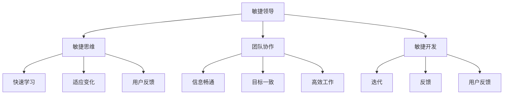

                 


### 敏捷领导框架：在变化中保持组织灵活性

#### 关键词：敏捷领导、组织灵活性、变化应对、领导力、敏捷思维

> 摘要：本文旨在探讨敏捷领导框架在当前快速变化的环境中的重要性。通过分析敏捷领导的核心概念、要素以及与传统领导方式的对比，本文将详细阐述敏捷领导框架的构建方法，并提供实际案例与最佳实践，帮助组织在变化中保持灵活性与适应性。

#### 第一部分：背景介绍与核心概念

### 第1章：问题背景与敏捷领导的重要性

#### 1.1.1 问题背景

在当今快速变化的市场环境中，企业面临着前所未有的挑战。技术革新、市场竞争、客户需求的变化，要求企业必须具备高度的灵活性和适应性。然而，传统领导模式往往过于僵化，难以快速响应外部变化，导致企业在变革过程中效率低下，甚至陷入困境。

#### 1.1.2 敏捷领导的概念与价值

敏捷领导是一种以敏捷思维为核心的领导方式，它强调领导者与团队成员之间的紧密协作，注重快速响应变化、持续迭代和不断优化。敏捷领导的价值在于它能够帮助组织更好地应对外部变化，提高工作效率和创新能力，从而在激烈的市场竞争中立于不败之地。

### 第2章：敏捷领导框架概述

#### 2.1.1 敏捷领导框架的结构

敏捷领导框架由多个关键要素组成，包括领导力、敏捷思维、团队管理、需求管理、产品开发与迭代、持续改进等。这些要素相互关联，共同构成了一个完整的敏捷领导体系。

#### 2.1.2 敏捷领导框架的要素

1. **领导力**：敏捷领导者需要具备较强的领导力，能够在变化中保持冷静，引导团队共同应对挑战。
2. **敏捷思维**：领导者需要培养敏捷思维，具备快速学习、快速适应变化的能力。
3. **团队管理**：领导者需要构建高效的团队，确保团队成员之间能够紧密协作。
4. **需求管理**：领导者需要有效管理需求，确保团队能够集中精力解决最重要的问题。
5. **产品开发与迭代**：领导者需要推动敏捷开发，通过迭代和反馈不断优化产品。
6. **持续改进**：领导者需要持续推动组织改进，不断提高组织的灵活性和适应性。

#### 2.1.3 敏捷领导与传统的领导方式的对比

| 特点 | 敏捷领导 | 传统领导 |
| ---- | ---- | ---- |
| 应对变化 | 快速响应，持续迭代 | 预测性强，计划性强 |
| 团队协作 | 强调团队协作，共同解决问题 | 依赖于个人能力和权威 |
| 学习与适应 | 快速学习，适应变化 | 依赖经验和习惯 |
| 决策方式 | 民主决策，广泛参与 | 单一决策，高度集中 |

### 第二部分：敏捷领导框架的构建

#### 第3章：核心概念与联系

#### 3.1.1 核心概念原理

敏捷领导框架的核心概念包括领导力、敏捷思维、团队管理、需求管理、产品开发与迭代和持续改进。

1. **领导力**：领导力是敏捷领导的核心，它包括愿景、沟通、决策和激励等方面。
2. **敏捷思维**：敏捷思维强调快速学习、持续改进和适应性。
3. **团队管理**：团队管理包括构建高效团队、激发团队潜力和优化团队流程。
4. **需求管理**：需求管理包括需求收集、分析、优先级排序和排期。
5. **产品开发与迭代**：产品开发与迭代包括敏捷开发方法、迭代周期和反馈机制。
6. **持续改进**：持续改进包括质量改进、效率提升和流程优化。

#### 3.1.2 概念属性特征对比表格

| 概念 | 属性1 | 属性2 | 属性3 |
| ---- | ---- | ---- | ---- |
| 领导力 | 愿景 | 沟通 | 决策 |
| 敏捷思维 | 快速学习 | 持续改进 | 适应性 |
| 团队管理 | 高效团队 | 激发潜力 | 优化流程 |
| 需求管理 | 需求收集 | 分析 | 排优先级 |
| 产品开发与迭代 | 敏捷开发 | 迭代周期 | 反馈机制 |
| 持续改进 | 质量改进 | 效率提升 | 流程优化 |

#### 3.1.3 ER实体关系图架构的Mermaid流程图

```mermaid
erDiagram
  Product : 《敏捷领导框架》
  |--|{ Team } Team
  Product : 《敏捷领导框架》
  |--|{ Demand } Demand
  Product : 《敏捷领导框架》
  |--|{ Iteration } Iteration
  Product : 《敏捷领导框架》
  |--|{ Improvement } Improvement

  Team ||--|{ Leader } Leader
  Demand ||--|{ Manager } Manager
  Iteration ||--|{ Developer } Developer
  Improvement ||--|{ Analyst } Analyst
```

#### 第4章：领导力与敏捷思维

#### 4.1.1 领导力在敏捷环境中的重要性

在敏捷环境中，领导力的重要性更加凸显。敏捷领导者需要具备以下能力：

1. **愿景**：敏捷领导者需要具有清晰的目标和愿景，能够引导团队朝着共同的目标前进。
2. **沟通**：敏捷领导者需要具备良好的沟通能力，确保信息畅通无阻。
3. **决策**：敏捷领导者需要能够快速做出决策，并在决策过程中广泛征求团队成员的意见。
4. **激励**：敏捷领导者需要能够激发团队成员的潜力，使其充分发挥作用。

#### 4.1.2 敏捷思维的培养与实践

敏捷思维是一种以变化为核心、以适应为目标的思维方式。培养敏捷思维可以从以下几个方面入手：

1. **快速学习**：敏捷领导者需要具备快速学习的能力，不断吸收新的知识和经验。
2. **持续改进**：敏捷领导者需要具备持续改进的意识，不断优化工作流程和产品。
3. **适应性**：敏捷领导者需要具备适应变化的能力，能够在不确定的环境中保持冷静和理性。

#### 4.1.3 领导者的角色转变

在敏捷环境中，领导者的角色发生了转变。从传统的权威型领导者转变为服务型领导者，领导者需要更加关注团队的需求和潜力，为团队提供支持和资源，帮助团队实现共同的目标。

#### 第5章：团队管理与协作

#### 5.1.1 敏捷团队的组织结构

敏捷团队的组织结构强调灵活性和高效性，通常采用扁平化的组织结构，减少层级和沟通成本。敏捷团队通常由以下几个部分组成：

1. **产品负责人**：负责定义产品的愿景和目标，管理产品需求和优先级。
2. **Scrum Master**：负责确保团队遵循敏捷开发原则，解决团队中的障碍。
3. **开发团队**：负责实现产品需求，通常由多学科成员组成。
4. **测试团队**：负责确保产品质量，通常与开发团队紧密协作。

#### 5.1.2 高效团队协作的方法

高效团队协作是敏捷领导的关键要素。以下是一些提高团队协作效率的方法：

1. **定期的团队会议**：通过定期的团队会议，确保团队成员之间的沟通和信息共享。
2. **共同的目标和愿景**：明确团队的目标和愿景，确保团队成员朝着共同的目标努力。
3. **透明的沟通渠道**：建立透明的沟通渠道，确保团队成员能够及时获取信息。
4. **共享的责任和权力**：鼓励团队成员共享责任和权力，提高团队的整体效率。

#### 5.1.3 领导者如何在团队中发挥影响力

领导者需要在团队中发挥积极的影响力，以下是一些方法：

1. **树立榜样**：领导者需要通过自己的行为树立榜样，影响团队成员的行为。
2. **提供支持**：领导者需要为团队成员提供必要的支持和资源，帮助他们克服困难。
3. **激励团队**：领导者需要通过激励措施，激发团队成员的积极性和创造力。
4. **倾听和理解**：领导者需要倾听团队成员的意见和建议，理解他们的需求和困扰。

#### 第6章：需求管理

#### 6.1.1 敏捷需求管理的核心原则

敏捷需求管理强调需求的灵活性和适应性。以下是敏捷需求管理的核心原则：

1. **用户故事**：使用用户故事来定义需求，确保需求具有可测试性和可接受性。
2. **优先级排序**：根据优先级对需求进行排序，确保团队能够优先解决最重要的问题。
3. **迭代开发**：采用迭代开发的方式，逐步实现需求，确保团队能够快速响应变化。
4. **需求变化管理**：对需求变化进行管理，确保需求变更对项目的影响最小。

#### 6.1.2 需求收集与分析

需求收集是敏捷需求管理的第一步。以下是一些需求收集和分析的方法：

1. **用户访谈**：通过与用户进行访谈，了解用户的需求和期望。
2. **问卷调查**：通过问卷调查收集用户的需求和意见。
3. **市场研究**：通过市场研究，了解竞争对手的产品和市场需求。
4. **数据分析**：通过数据分析，挖掘潜在的需求和问题。

#### 6.1.3 需求的优先级与排期

在敏捷开发中，需求的优先级和排期至关重要。以下是一些确定需求和排期的原则：

1. **价值优先**：根据需求的价值进行优先级排序，确保团队首先解决最重要的问题。
2. **风险优先**：根据需求的风险进行优先级排序，确保团队能够首先解决潜在的问题。
3. **资源可用性**：根据团队的资源可用性进行排期，确保团队能够在合理的时间内完成任务。
4. **反馈循环**：根据反馈循环的结果进行优先级调整和排期优化。

#### 第7章：产品开发与迭代

#### 7.1.1 敏捷开发方法

敏捷开发是一种以人为核心、以迭代和反馈为基础的开发方法。以下是敏捷开发的核心原则：

1. **用户反馈**：以用户反馈为中心，确保产品符合用户需求。
2. **迭代开发**：采用迭代开发的方式，逐步完善产品。
3. **持续交付**：通过持续交付，确保产品能够快速上线。
4. **团队协作**：强调团队协作，提高开发效率。

#### 7.1.2 迭代与反馈循环

迭代与反馈循环是敏捷开发的核心。以下是一些迭代与反馈循环的关键要素：

1. **迭代计划**：在每次迭代开始前，制定详细的迭代计划。
2. **迭代执行**：按照迭代计划执行任务，确保团队在规定时间内完成任务。
3. **迭代评审**：在每次迭代结束后，进行迭代评审，评估产品的质量和功能。
4. **迭代回顾**：在每次迭代结束后，进行迭代回顾，总结经验和教训，为下一次迭代做好准备。

#### 7.1.3 敏捷领导在产品开发中的作用

敏捷领导在产品开发中扮演着重要角色。以下是一些敏捷领导在产品开发中的作用：

1. **愿景引导**：敏捷领导者需要为团队提供清晰的愿景，确保团队朝着共同的目标努力。
2. **资源协调**：敏捷领导者需要协调团队所需资源，确保团队能够顺利开展工作。
3. **问题解决**：敏捷领导者需要解决团队遇到的问题，确保团队能够高效工作。
4. **激励团队**：敏捷领导者需要激发团队的积极性和创造力，提高团队的工作效率。

#### 第8章：持续改进与适应变化

#### 8.1.1 持续改进的核心原则

持续改进是敏捷领导的重要原则。以下是一些持续改进的核心原则：

1. **质量第一**：始终将质量放在首位，确保产品和服务的高质量。
2. **效率提升**：不断优化工作流程和工具，提高工作效率。
3. **创新驱动**：鼓励创新思维，不断寻找新的解决方案和改进点。
4. **数据驱动**：以数据为依据，进行改进和决策。

#### 8.1.2 适应变化的策略

在快速变化的环境中，适应变化至关重要。以下是一些适应变化的策略：

1. **灵活应变**：根据外部环境的变化，灵活调整战略和计划。
2. **快速学习**：不断学习新的知识和技能，提高适应变化的能力。
3. **开放合作**：与外部合作伙伴保持紧密合作，共同应对变化。
4. **敏捷组织**：构建敏捷组织，提高组织的灵活性和适应性。

#### 8.1.3 敏捷领导在持续改进中的角色

敏捷领导在持续改进中扮演着关键角色。以下是一些敏捷领导在持续改进中的角色：

1. **推动者**：敏捷领导者需要推动持续改进，确保团队能够持续改进和优化。
2. **倡导者**：敏捷领导者需要倡导持续改进的理念，激发团队成员的改进意识。
3. **协调者**：敏捷领导者需要协调不同团队和部门之间的合作，确保改进计划的顺利实施。
4. **评估者**：敏捷领导者需要评估改进计划的效果，确保改进计划达到预期目标。

### 第三部分：最佳实践与案例分析

#### 第9章：敏捷领导实践案例分析

#### 9.1.1 案例一：企业A的敏捷转型实践

企业A是一家传统的制造企业，面临着市场竞争的激烈压力。为了提高组织的灵活性和适应性，企业A决定进行敏捷转型。以下是企业A的敏捷转型实践：

1. **领导力提升**：企业A的领导者参加了敏捷领导培训，提高了敏捷思维和领导力。
2. **团队重构**：企业A重构了团队结构，采用了敏捷团队的组织模式。
3. **流程优化**：企业A优化了工作流程，采用了敏捷开发方法。
4. **培训与赋能**：企业A对团队成员进行了敏捷培训，提高了团队成员的敏捷能力。

#### 9.1.2 案例二：团队B的敏捷领导实践

团队B是一家互联网企业的研发团队，面临着项目周期短、需求变化快的问题。为了提高团队的工作效率和质量，团队B采用了敏捷领导实践。以下是团队B的敏捷领导实践：

1. **愿景引导**：团队B的领导者明确了团队的愿景和目标，激发了团队成员的积极性。
2. **协作与沟通**：团队B建立了高效的协作与沟通机制，确保团队成员之间的信息畅通。
3. **迭代开发**：团队B采用了迭代开发的方式，逐步完善产品，确保团队能够快速响应变化。
4. **持续改进**：团队B不断进行反馈和总结，优化工作流程和产品。

#### 9.1.3 案例三：组织C的敏捷领导成功之道

组织C是一家金融科技企业，面临着市场竞争激烈、客户需求多变的问题。为了提高组织的灵活性和竞争力，组织C采用了敏捷领导实践。以下是组织C的敏捷领导成功之道：

1. **领导力提升**：组织C的领导者参加了敏捷领导培训，提高了敏捷思维和领导力。
2. **文化建设**：组织C建立了以敏捷思维为核心的企业文化，激发了员工的创新意识和积极性。
3. **流程优化**：组织C优化了工作流程，采用了敏捷开发方法。
4. **培训与赋能**：组织C对团队成员进行了敏捷培训，提高了团队成员的敏捷能力。

### 第10章：最佳实践与注意事项

#### 10.1.1 敏捷领导最佳实践

以下是一些敏捷领导的最佳实践：

1. **培养敏捷思维**：领导者需要培养敏捷思维，具备快速学习和适应变化的能力。
2. **关注团队协作**：领导者需要关注团队协作，建立高效的团队协作机制。
3. **明确目标和愿景**：领导者需要明确团队的目标和愿景，激发团队成员的积极性。
4. **持续改进**：领导者需要持续改进，不断提高组织的灵活性和适应性。
5. **提供支持和资源**：领导者需要为团队成员提供必要的支持和资源，帮助他们克服困难。

#### 10.1.2 小结

敏捷领导是一种以敏捷思维为核心的领导方式，它强调领导者与团队成员之间的紧密协作，注重快速响应变化、持续迭代和不断优化。通过构建敏捷领导框架，组织可以在变化中保持灵活性和适应性，提高工作效率和创新能力。

#### 10.1.3 注意事项

1. **领导力提升**：领导者需要不断提高自身的领导力，适应敏捷环境。
2. **团队协作**：领导者需要关注团队协作，建立高效的团队协作机制。
3. **持续改进**：领导者需要持续改进，不断提高组织的灵活性和适应性。
4. **资源投入**：组织需要为敏捷转型提供必要的资源投入，确保敏捷实践的顺利实施。

#### 10.1.4 拓展阅读

1. 《敏捷领导：如何在快速变化的环境中保持竞争力》（作者：保罗·尼文）
2. 《敏捷之道：敏捷领导与团队协作实战》（作者：凯西·考夫曼）
3. 《敏捷企业：如何在数字化时代保持敏捷》（作者：史蒂夫·乔布斯）

### 作者

作者：AI天才研究院/AI Genius Institute & 禅与计算机程序设计艺术 /Zen And The Art of Computer Programming

### 附录

#### 参考文献

1. 《敏捷领导：如何在快速变化的环境中保持竞争力》（作者：保罗·尼文）
2. 《敏捷之道：敏捷领导与团队协作实战》（作者：凯西·考夫曼）
3. 《敏捷企业：如何在数字化时代保持敏捷》（作者：史蒂夫·乔布斯）
4. 《敏捷开发实践指南》（作者：克里斯·布莱克）

#### 附录 A：核心概念定义

1. **敏捷领导**：以敏捷思维为核心，注重团队协作、快速响应变化和持续优化的领导方式。
2. **敏捷思维**：具备快速学习和适应变化的能力，以用户反馈为中心，采用迭代和反馈的方法。
3. **团队协作**：团队内部成员之间的紧密合作，确保信息畅通、目标一致和高效工作。
4. **敏捷开发**：一种以人为核心、以迭代和反馈为基础的开发方法，强调用户反馈、持续交付和团队协作。

#### 附录 B：核心概念关系图



### 结论

敏捷领导框架是一种在变化中保持组织灵活性的有效方法。通过培养敏捷思维、关注团队协作、明确目标和愿景、持续改进，组织可以在快速变化的环境中保持竞争力。本文介绍了敏捷领导框架的核心概念、构建方法、实践案例和注意事项，旨在为读者提供全面的指导。作者：AI天才研究院/AI Genius Institute & 禅与计算机程序设计艺术 /Zen And The Art of Computer Programming。

