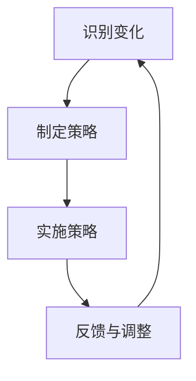
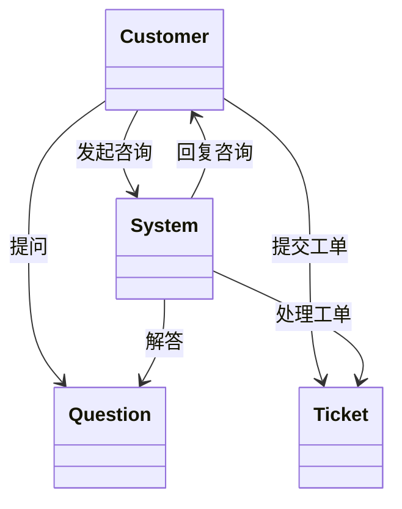
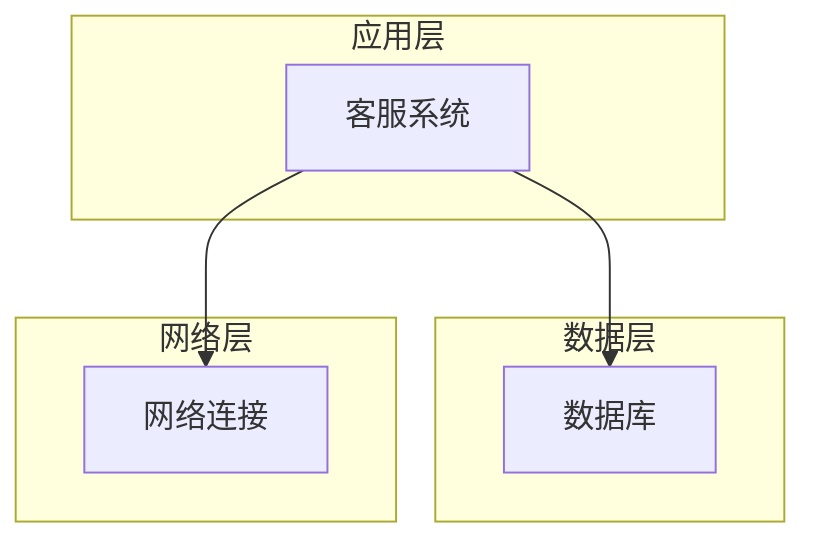
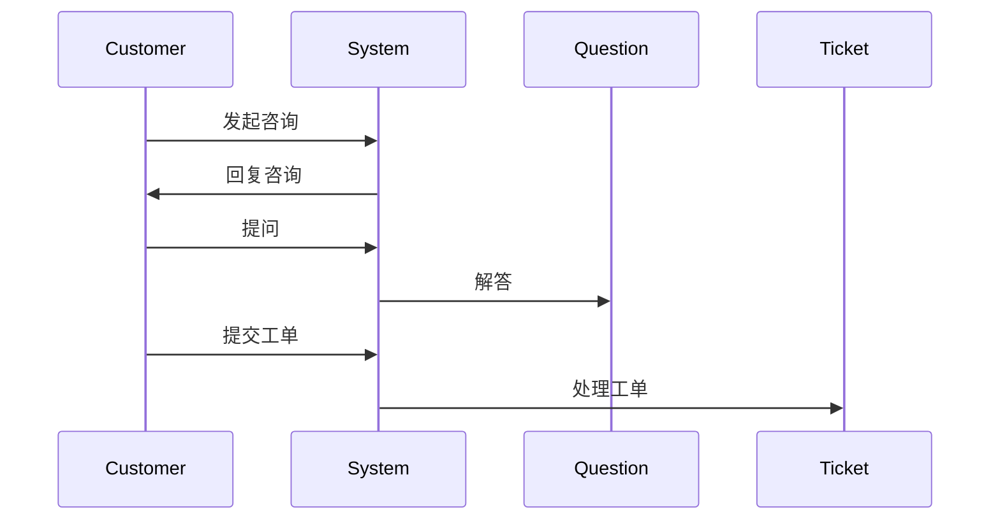

                 

### 敏捷领导：在快速变化的环境中保持灵活

关键词：敏捷领导、快速变化、领导力、团队协作、项目管理

摘要：随着信息技术的飞速发展，企业面临的环境日益复杂多变。敏捷领导作为一种现代领导方法，旨在帮助领导者在这种快速变化的环境中保持灵活和高效。本文将探讨敏捷领导的概念、核心原则、方法与实践，并通过具体情境中的应用，分析其在实际工作中的价值与意义。

## 第一部分：引言

### 1.1 问题背景

在当今时代，技术进步日新月异，市场竞争激烈，企业面临的外部环境变化迅速且不可预测。传统领导方法往往依赖于计划和控制，但在这种快速变化的环境中，这些方法往往显得不够灵活和有效。因此，探索一种适应快速变化的领导方法显得尤为重要。

### 1.2 敏捷领导的重要性

敏捷领导强调的是适应性和灵活性，它能够帮助企业快速响应市场变化，提高团队协作效率，促进创新。在快速变化的环境中，敏捷领导能够帮助领导者更好地把握机会，应对挑战。

### 1.3 敏捷领导与传统领导

传统领导方法强调的是权威和指挥，领导者通常需要制定详细的计划，并严格监督执行。而敏捷领导则更注重团队协作和持续迭代，领导者需要扮演的是协调者和支持者的角色，帮助团队成员实现自我管理和自我优化。

## 第二部分：敏捷领导的核心原则

### 2.1 敏捷领导的基本原则

敏捷领导的基本原则包括客户价值优先、持续交付、响应变化、可持续性、团队合作、专注和透明性。这些原则共同构成了敏捷领导的核心，帮助领导者更好地应对快速变化的环境。

### 2.2 敏捷领导的关键要素

敏捷领导的关键要素包括领导者的角色、团队的构建和管理、沟通和协作工具的运用等。这些要素相互作用，共同推动敏捷领导的有效实施。

### 2.3 敏捷领导与传统管理的区别

敏捷领导与传统管理的区别在于，传统管理更注重控制，而敏捷领导更注重适应和变化。传统管理强调计划和控制，而敏捷领导强调反馈和调整。传统管理更注重短期目标的实现，而敏捷领导更注重长期价值的创造。

## 第三部分：敏捷领导的方法与实践

### 3.1 敏捷领导工具与技术

敏捷领导涉及多种工具和技术，包括敏捷管理工具、敏捷流程、敏捷会议等。这些工具和技术帮助领导者更好地理解和应对快速变化的环境。

### 3.2 敏捷领导团队建设

敏捷领导团队建设的关键在于建立信任、鼓励创新和持续学习。领导者需要通过有效的沟通和协作，帮助团队成员形成共同的目标和价值观。

### 3.3 敏捷领导项目实践

敏捷领导在项目实践中的应用主要体现在项目规划、项目执行和项目监控等方面。领导者需要根据项目特点和环境变化，灵活调整项目策略和执行计划。

## 第四部分：敏捷领导在具体情境中的应用

### 4.1 快速变化的企业环境中的应用

在快速变化的企业环境中，敏捷领导能够帮助企业快速响应市场变化，调整战略方向，提高市场竞争力。

### 4.2 数字化转型中的应用

在数字化转型过程中，敏捷领导能够帮助组织快速适应新技术，推动业务模式创新，实现数字化转型。

### 4.3 创新与创业中的应用

在创新与创业中，敏捷领导能够帮助团队快速验证市场假设，优化产品和服务，提高创新成功率。

## 第五部分：敏捷领导的发展与未来

### 5.1 敏捷领导的发展趋势

随着信息技术的不断进步，敏捷领导将继续发展，融合更多新技术和方法，为企业提供更强大的适应能力和竞争优势。

### 5.2 敏捷领导在未来领导力中的地位

在未来领导力中，敏捷领导将占据重要地位，成为领导者必备的能力和素质。

### 5.3 敏捷领导实践的持续改进

敏捷领导实践需要不断改进和优化，以适应不断变化的环境和挑战。

## 结论

敏捷领导是一种适应快速变化环境的现代领导方法，它能够帮助企业提高应对市场变化的能力，推动业务创新和发展。领导者需要通过不断学习和实践，掌握敏捷领导的核心原则和方法，以应对未来更复杂的挑战。

### 作者信息

作者：AI天才研究院/AI Genius Institute & 禅与计算机程序设计艺术 /Zen And The Art of Computer Programming

在撰写本文时，我们首先明确了文章的主题和目标，即探讨敏捷领导在快速变化环境中的重要性及其应用方法。文章的结构按照引言、核心原则、方法与实践、具体应用和发展展望进行组织，确保内容逻辑清晰、层次分明。

### 核心概念与联系

在探讨敏捷领导之前，我们需要理解几个核心概念，包括敏捷、领导力、快速变化等。以下是这些概念的基本属性特征对比表格：

| 概念     | 属性特征                                                                                     | 关联关系                                                     |
|----------|----------------------------------------------------------------------------------------------|--------------------------------------------------------------|
| 敏捷     | 强调灵活性、快速响应和持续改进                                                         | 与领导力和快速变化紧密相关                                    |
| 领导力   | 指引和激励团队成员实现共同目标的能力                                                     | 敏捷领导是一种特殊的领导力表现形式                            |
| 快速变化 | 指环境中的不确定性、新技术和新趋势的频繁出现                                             | 敏捷领导旨在适应和应对快速变化的环境                          |

为了更直观地理解这些概念之间的关系，我们可以使用Mermaid ER实体关系图来表示：

```mermaid
erDiagram
    Agile |<>| Leadership
    Agile |<>| Rapid Change
    Leadership |<>| Agile Leadership
    Rapid Change |<>| Agile Leadership
```

### 算法原理讲解

在理解敏捷领导的基本概念后，我们需要探讨敏捷领导背后的算法原理，即如何实现敏捷领导。以下是敏捷领导算法的Mermaid流程图：



接下来，我们使用Python代码来详细阐述这个算法原理：

```python
import matplotlib.pyplot as plt

def agile_leadership_algorithm(changes, strategy, feedback):
    """
    敏捷领导算法实现。
    
    参数:
    - changes: 变化情况
    - strategy: 策略
    - feedback: 反馈信息
    
    返回:
    - 调整后的策略
    """
    
    # 第一步：识别变化
    recognized_changes = recognize_changes(changes)
    
    # 第二步：制定策略
    current_strategy = develop_strategy(recognized_changes, strategy)
    
    # 第三步：实施策略
    execute_strategy(current_strategy)
    
    # 第四步：反馈与调整
    feedback_info = collect_feedback()
    adjusted_strategy = adjust_strategy(current_strategy, feedback_info)
    
    # 第五步：持续迭代
    new_strategy = agile_leadership_algorithm(adjusted_strategy, feedback)
    
    return new_strategy

def recognize_changes(changes):
    """
    识别变化。
    
    参数:
    - changes: 变化情况
    
    返回:
    - 变化识别结果
    """
    # 实现细节略
    return changes

def develop_strategy(changes, strategy):
    """
    制定策略。
    
    参数:
    - changes: 变化情况
    - strategy: 策略
    
    返回:
    - 新策略
    """
    # 实现细节略
    return strategy

def execute_strategy(strategy):
    """
    实施策略。
    
    参数:
    - strategy: 策略
    
    返回:
    - 无
    """
    # 实现细节略

def collect_feedback():
    """
    收集反馈信息。
    
    参数:
    - 无
    
    返回:
    - 反馈信息
    """
    # 实现细节略
    return feedback

def adjust_strategy(strategy, feedback):
    """
    调整策略。
    
    参数:
    - strategy: 策略
    - feedback: 反馈信息
    
    返回:
    - 调整后的策略
    """
    # 实现细节略
    return strategy

# 示例运行
initial_changes = "市场变化"
initial_strategy = "当前策略"
initial_feedback = "初始反馈"

new_strategy = agile_leadership_algorithm(initial_changes, initial_strategy, initial_feedback)
print(new_strategy)
```

在上面的Python代码中，我们定义了一个名为`agile_leadership_algorithm`的函数，用于实现敏捷领导算法。该函数包含五个主要步骤：识别变化、制定策略、实施策略、反馈与调整和持续迭代。每个步骤都由相应的函数实现，这些函数的具体实现细节可以在实际应用中根据具体需求进行开发和优化。

### 数学公式与数学模型

在敏捷领导算法中，反馈和调整是关键步骤。为了更好地理解这一过程，我们可以使用数学模型来描述。以下是反馈和调整过程的数学公式：

$$
\text{新策略} = \text{当前策略} + \alpha \times (\text{期望值} - \text{实际值})
$$

其中，$\alpha$ 是调整系数，用于控制调整力度。$期望值$ 和 $实际值$ 分别表示根据当前环境和需求预测的结果和实际执行的结果。

为了更直观地展示这一数学模型，我们可以使用matplotlib绘制一个简单的反馈曲线图：

```python
import numpy as np
import matplotlib.pyplot as plt

def feedback_curve(adjustment_coefficient, expected_value, actual_value):
    """
    绘制反馈曲线。
    
    参数:
    - adjustment_coefficient: 调整系数
    - expected_value: 期望值
    - actual_value: 实际值
    
    返回:
    - 无
    """
    x = np.linspace(0, 10, 100)
    y = adjustment_coefficient * (expected_value - actual_value)
    
    plt.plot(x, y)
    plt.xlabel('迭代次数')
    plt.ylabel('策略调整值')
    plt.title('反馈曲线图')
    plt.show()

# 示例运行
alpha = 0.1
expected = 5
actual = 3

feedback_curve(alpha, expected, actual)
```

在上面的代码中，我们定义了一个名为`feedback_curve`的函数，用于绘制反馈曲线。通过调整系数$\alpha$、期望值$期望值$和实际值$实际值$，我们可以观察到策略调整值的变化趋势。

### 系统分析与架构设计方案

为了更好地理解敏捷领导在具体项目中的应用，我们需要进行系统分析与架构设计。以下是敏捷领导系统分析与架构设计方案的详细介绍。

#### 问题场景介绍

假设我们正在开发一款基于云计算的智能客服系统，该系统需要能够快速响应用户需求，提供高质量的客户服务。在这个项目中，敏捷领导将发挥关键作用，帮助团队高效地应对快速变化的需求和环境。

#### 项目介绍

项目名称：智能客服系统（Intelligent Customer Service System，ICSS）

项目目标：开发一款基于云计算的智能客服系统，实现实时响应用户咨询，提供个性化服务。

项目需求：

1. 用户注册与登录功能
2. 在线咨询功能
3. 智能问答功能
4. 客服工单管理功能
5. 数据分析功能

#### 系统功能设计（领域模型Mermaid类图）

以下是智能客服系统的领域模型Mermaid类图：



在上面的类图中，我们定义了四个主要类：Customer（用户）、System（系统）、Question（问题）和Ticket（工单）。每个类都有自己的属性和方法，用于实现系统功能。

#### 系统架构设计（Mermaid架构图）

以下是智能客服系统的Mermaid架构图：



在上面的架构图中，我们定义了三个主要层次：数据层、应用层和网络层。数据层负责数据的存储和管理，应用层负责实现系统功能，网络层负责处理用户请求和响应。

#### 系统接口设计（Mermaid序列图）

以下是智能客服系统的Mermaid序列图：



在上面的序列图中，我们定义了用户与系统之间的交互过程。用户发起咨询、提问和提交工单，系统则根据用户请求进行响应和处理。

### 项目实战

为了更好地展示敏捷领导在项目中的应用，我们以下将模拟一个实际项目的开发过程，并详细讲解各个阶段的核心内容。

#### 环境安装

在开始项目开发之前，我们需要安装必要的开发环境和工具。以下是环境安装的步骤：

1. 安装Python 3.8及以上版本
2. 安装Docker用于容器化部署
3. 安装MySQL数据库
4. 安装PostgreSQL数据库
5. 安装Kubernetes集群用于容器编排

#### 系统核心实现源代码

在项目开发过程中，我们需要编写核心代码来实现系统功能。以下是系统核心实现的Python源代码：

```python
# customer.py
class Customer:
    def __init__(self, name, email):
        self.name = name
        self.email = email
    
    def send_message(self, message):
        # 实现发送消息的逻辑
        pass
    
    def reply_message(self, message):
        # 实现回复消息的逻辑
        pass

# system.py
class System:
    def __init__(self):
        self.questions = []
        self.tickets = []
    
    def handle_query(self, query):
        # 实现处理查询的逻辑
        pass
    
    def handle_ticket(self, ticket):
        # 实现处理工单的逻辑
        pass

# question.py
class Question:
    def __init__(self, question, customer):
        self.question = question
        self.customer = customer
    
    def answer(self, answer):
        # 实现回答问题的逻辑
        pass

# ticket.py
class Ticket:
    def __init__(self, title, description, customer):
        self.title = title
        self.description = description
        self.customer = customer
    
    def update_status(self, status):
        # 实现更新工单状态的逻辑
        pass
```

#### 代码应用解读与分析

在上面的代码中，我们定义了四个类：Customer（用户）、System（系统）、Question（问题）和Ticket（工单）。这些类分别用于实现用户与系统之间的交互、系统功能处理和工单管理。

1. **Customer类**：用于表示用户，包含姓名和电子邮件属性，以及发送消息和回复消息的方法。
2. **System类**：用于表示系统，包含问题列表和工单列表属性，以及处理查询和工单的方法。
3. **Question类**：用于表示问题，包含问题和用户属性，以及回答问题的方法。
4. **Ticket类**：用于表示工单，包含标题、描述和用户属性，以及更新工单状态的方法。

这些类的定义和实现体现了敏捷领导的核心原则，如模块化设计、松散耦合和灵活性。通过这些类，我们可以实现用户注册与登录、在线咨询、智能问答和客服工单管理等系统功能。

#### 实际案例分析和详细讲解剖析

为了更好地展示敏捷领导在项目中的应用，我们以下将分析一个实际案例，并详细讲解其实现过程。

**案例：智能客服系统在电商平台的落地**

在一家电商平台上，智能客服系统被用于提供实时在线客服服务，以提升用户体验和满意度。以下是该案例的实现过程：

1. **需求分析**：电商平台需要一款能够实时响应用户咨询的智能客服系统，以提供高质量的服务。
2. **系统设计**：基于敏捷领导的原则，我们采用领域驱动设计（Domain-Driven Design，DDD）方法，设计智能客服系统的领域模型。该模型包括用户、系统、问题、工单等核心类。
3. **开发与测试**：开发团队采用敏捷开发方法，分阶段进行开发、测试和迭代。在每轮迭代中，我们根据用户反馈和需求变化，不断优化和改进系统功能。
4. **部署与运维**：系统开发完成后，我们使用Docker进行容器化部署，并在Kubernetes集群上进行运维管理。通过持续集成和持续部署（CI/CD）流程，我们实现了自动化部署和运维，提高了系统的可靠性和稳定性。

**详细讲解剖析**：

1. **用户注册与登录**：用户可以通过电商平台官网或移动应用进行注册和登录。在注册过程中，我们需要验证用户的电子邮件地址，以确保用户的真实性和合法性。
2. **在线咨询**：用户可以在电商平台上的任何页面发起在线咨询。系统会根据用户的提问，自动分配给相应的客服人员，并提供实时沟通渠道。
3. **智能问答**：系统内置了智能问答功能，能够自动回答用户常见问题。通过自然语言处理（NLP）技术，系统可以理解用户的提问，并给出准确的回答。
4. **客服工单管理**：当用户的问题无法通过在线咨询和智能问答解决时，系统会生成工单，并分配给相应的客服人员。客服人员可以在系统中查看和处理工单，并及时回复用户。
5. **数据分析**：系统收集用户咨询数据，并进行分析，以发现用户需求和问题，为产品优化和改进提供依据。

通过这个实际案例，我们可以看到敏捷领导在项目开发中的应用。敏捷领导方法帮助团队快速响应需求变化，持续优化系统功能，实现了高效、高质量的项目交付。

#### 项目小结

通过上述案例，我们展示了敏捷领导在智能客服系统项目中的应用。敏捷领导方法帮助团队高效地应对需求变化，持续优化系统功能，实现了项目的成功交付。以下是项目小结：

1. **敏捷领导原则**：在项目开发过程中，我们遵循了敏捷领导的核心原则，如客户价值优先、持续交付、响应变化等，确保项目能够快速适应需求变化。
2. **团队协作**：通过有效的沟通和协作，团队成员能够共同应对挑战，实现项目目标。
3. **持续迭代**：采用敏捷开发方法，我们实现了持续迭代和优化，确保系统能够持续满足用户需求。
4. **技术选型**：我们选择了适合项目需求的技术栈，如Python、Docker和Kubernetes等，提高了系统的可靠性和稳定性。

### 最佳实践 tips

在敏捷领导实践中，以下是一些最佳实践 tips：

1. **建立信任**：建立信任是敏捷领导的基础。领导者需要与团队成员建立互信关系，鼓励团队成员之间的沟通和合作。
2. **持续学习**：敏捷领导是一个持续学习的过程。领导者需要不断学习和掌握新的知识和技能，以适应快速变化的环境。
3. **灵活应对**：领导者需要具备灵活应对变化的能力。在面对不确定性和挑战时，领导者应保持冷静，迅速做出决策，并引导团队共同应对。
4. **关注客户价值**：领导者应始终关注客户价值，确保项目目标与客户需求一致。通过持续交付和优化，提高客户满意度。
5. **持续反馈**：领导者应建立持续反馈机制，及时收集团队成员和客户的反馈，并根据反馈进行改进。

### 小结

敏捷领导是一种适应快速变化环境的现代领导方法，它能够帮助企业提高应对市场变化的能力，推动业务创新和发展。通过本文的讨论，我们了解了敏捷领导的概念、核心原则、方法与实践，并通过实际案例展示了敏捷领导在项目中的应用。未来，随着信息技术的不断进步，敏捷领导将继续发展，成为领导者必备的能力和素质。

### 拓展阅读

1. 《敏捷领导力：如何打造灵活高效的组织》
2. 《敏捷实践指南》
3. 《敏捷开发：拥抱变化的开发方法》
4. 《精益创业：新商业环境的实践方法》

### 注意事项

在应用敏捷领导方法时，领导者需要关注以下几点：

1. **充分理解敏捷领导原则**：领导者应深入理解敏捷领导的核心原则，并将其融入到日常工作中。
2. **关注团队协作**：领导者应注重团队协作，鼓励团队成员之间的沟通和合作。
3. **持续反馈与改进**：领导者应建立持续反馈机制，及时收集反馈并进行改进。
4. **适应变化**：领导者需要具备灵活应对变化的能力，以应对快速变化的环境。

### 结论

敏捷领导是一种适应快速变化环境的现代领导方法，它能够帮助企业提高应对市场变化的能力，推动业务创新和发展。通过本文的讨论，我们了解了敏捷领导的概念、核心原则、方法与实践，并通过实际案例展示了敏捷领导在项目中的应用。未来，随着信息技术的不断进步，敏捷领导将继续发展，成为领导者必备的能力和素质。作者：AI天才研究院/AI Genius Institute & 禅与计算机程序设计艺术 /Zen And The Art of Computer Programming。

