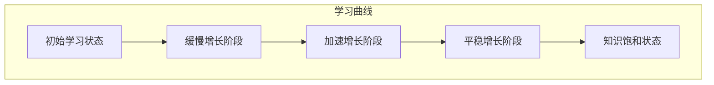
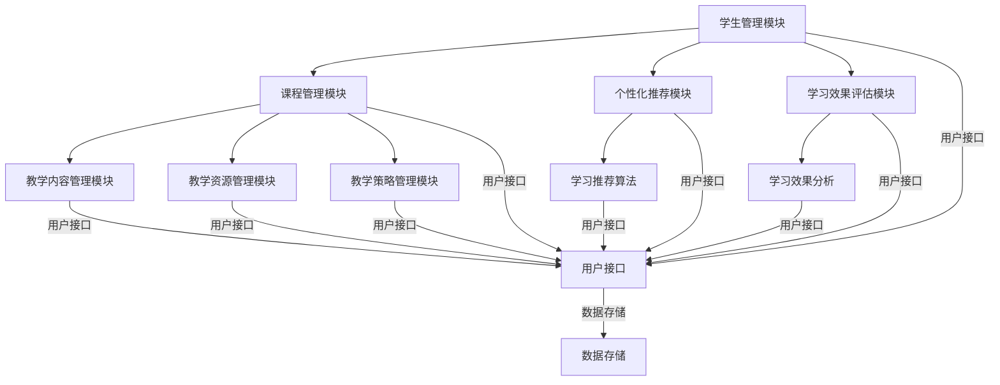
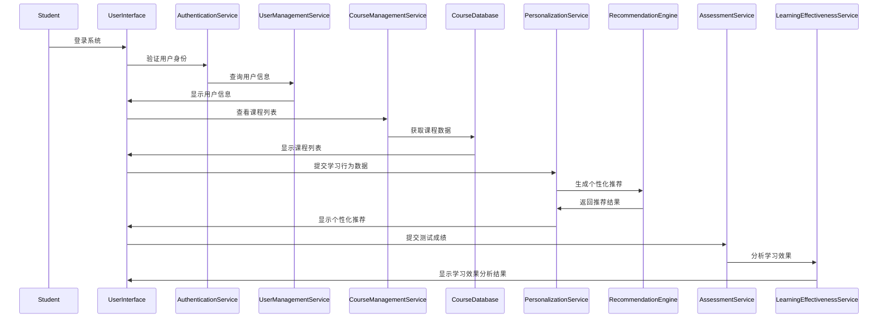

                 


## 引言：教育方法的学习曲线：知识获取的数学模型

在当今知识爆炸的时代，如何有效地获取和掌握知识成为了教育领域的关键问题。教育方法的学习曲线，这一概念应运而生，它揭示了学生在知识获取过程中所经历的学习进程和规律。学习曲线不仅是一个描述性工具，更是一个分析工具，它帮助教育工作者和学生理解学习过程中的挑战和瓶颈，从而优化教育策略。

本文将探讨教育方法的学习曲线，特别是通过数学模型来解析这一现象。我们首先将介绍学习曲线的概念和其在教育研究中的重要性，接着定义“学习曲线”和“数学模型”这两个核心概念，并展示它们在教育方法研究中的应用。通过一个典型的数学模型——S型曲线模型的解析，我们将深入理解其背后的数学原理，并通过Python代码实现，进行详细讲解和举例说明。

此外，我们将进一步介绍其他数学模型，如对数曲线模型和幂律曲线模型，并展示如何将它们应用于教育方法的优化。接着，我们将探讨一个典型的教育方法应用场景，介绍系统的功能、架构和交互设计。

在项目实战部分，我们将展示如何应用所讨论的数学模型进行教育方法优化，包括环境安装、核心实现和代码解读分析。最后，我们将总结最佳实践技巧，并对全文内容进行回顾，推荐进一步阅读的资料。

通过这篇文章，我们希望能够为教育工作者和学生提供一种新的视角，借助数学模型的力量，更好地理解学习过程，优化教育方法，提高学习效率。

## 背景介绍

### 教育方法学习曲线的概念

教育方法学习曲线是指学生在学习过程中知识获取的速度和效率的变化轨迹。它是一个量化描述，反映了学生在不同学习阶段对知识的掌握程度。通常，学习曲线被用来衡量学生在特定教育环境下，从新手到专家的进步情况。这一概念最早由教育心理学家提出，旨在通过量化方式揭示学习过程中的规律和模式。

### 学习曲线的重要性

学习曲线在教育研究中的重要性不言而喻。首先，它为教育工作者提供了评估学生学习进展的量化标准，帮助教师了解学生个体的学习状况，从而制定更有针对性的教学策略。其次，学习曲线有助于学生自我监控学习过程，通过了解自己的学习曲线，学生可以更好地调整学习方法和节奏，提高学习效率。

### 研究背景

近年来，教育方法改革的呼声日益高涨。传统教学模式往往以教师为中心，强调知识的灌输和记忆，忽视了学生个体差异和学习兴趣。这种模式导致学生学习积极性不高，知识掌握不牢固。为了应对这些挑战，教育界开始探索更加个性化、互动性和探究性的教学方法。在这个过程中，学习曲线作为一种重要的研究工具，得到了广泛关注和应用。

### 学生知识获取的现状与挑战

当前，学生在知识获取过程中面临诸多挑战。一方面，知识量的急剧增加使得学生难以在短时间内消化和理解。另一方面，传统教育模式下的教学方法单一，缺乏对学生个性化需求的关注，导致学生容易产生厌学情绪。此外，随着信息技术的普及，学生在获取知识的方式上也发生了巨大变化，如何适应这些变化，提高学习效率，成为教育工作者亟待解决的问题。

通过上述背景介绍，我们可以看到，教育方法学习曲线的研究具有重要的现实意义。它不仅为教育改革提供了理论支持，也为学生提供了有效的学习工具，有助于他们在知识获取过程中实现更加高效和有针对性的学习。

### 核心概念与联系

在教育方法研究中，理解“学习曲线”和“数学模型”这两个核心概念至关重要。学习曲线通常描述的是学生在学习过程中知识获取的速度和效率的变化轨迹，它反映了学习者在不同阶段对知识的掌握情况。而数学模型则是通过数学语言和符号系统来描述现实世界中的各种现象和规律，它为学习曲线提供了一个量化的框架。

首先，我们定义“学习曲线”。学习曲线是一个描述学习进程的图表，通常以学习时间为横轴，以学习效率或知识掌握度为纵轴。它展示了学生在不同时间点对知识点的掌握程度，例如，一个典型的S型曲线描述了学生在初期学习时进展较慢，中间快速提升，后期逐渐趋于平稳的规律。

接下来，我们探讨“数学模型”的概念。数学模型是一种通过数学方法建立起来的抽象结构，它通过变量、函数、方程等数学工具来描述和预测现实问题。在教育方法研究中，数学模型可以帮助我们理解学习过程、评估教学效果、设计个性化学习方案等。

“学习曲线”和“数学模型”在教育方法研究中的应用主要体现在以下几个方面：

1. **量化分析**：数学模型可以将学习过程量化，帮助教育工作者更精确地评估学生的学习进展和教学效果。
2. **预测未来趋势**：通过数学模型，可以预测学生在未来一段时间内的学习表现，从而提前调整教学策略。
3. **优化教育资源**：数学模型可以帮助教育机构更好地分配教育资源，提高学习效率。

为了更直观地理解这两个概念，我们可以借助Mermaid图表来展示教育方法的ER（实体关系）图。ER图可以清晰地描绘出教育方法中的各种实体及其相互关系。

```mermaid
erDiagram
    Student ||--|{ LearningCurve }|-- Teacher
    Student ||--|{ KnowledgePoint }|-- Course
    Teacher ||--|{ TeachingStrategy }|-- Course
    LearningCurve ||--|{ LearningRate }| KnowledgePoint
    KnowledgePoint ||--|{ MasteryLevel }| Student
```

在这个ER图中，Student（学生）与LearningCurve（学习曲线）、KnowledgePoint（知识点）、TeachingStrategy（教学策略）和Course（课程）之间建立了关系。学习曲线通过学习率（LearningRate）与知识点（KnowledgePoint）关联，而知识点则通过掌握度（MasteryLevel）与学生（Student）建立联系。

通过这样的ER图，我们可以更直观地理解教育方法中各个要素之间的复杂关系，从而为教育优化提供理论支持。

### 算法原理讲解：S型曲线模型

#### S型曲线的定义与特点

S型曲线，也称为逻辑斯蒂曲线（Logistic Curve），是一种典型的数学模型，用于描述增长过程。其名称来源于曲线的形状，类似于英文字母“S”。S型曲线的基本形式为：

$$
f(x) = \frac{L}{1 + e^{-k(x - x_0)}}
$$

其中，$L$ 是曲线的最大值，$k$ 是曲线的斜率，$x_0$ 是曲线的拐点。

S型曲线具有以下特点：

1. **渐进饱和**：随着$x$的增加，曲线逐渐趋于$L$，表明增长过程最终会达到一个饱和状态。
2. **初期缓慢**：在$x<x_0$时，曲线增长缓慢，反映了学习者在初期阶段的渐进进步。
3. **中期加速**：在$x_0<x<x_c$（$x_c$为曲线的拐点）时，曲线增长迅速，表示学习者在中期阶段快速提高。
4. **后期平稳**：在$x>x_c$时，曲线增长趋于平稳，表明学习者在后期阶段逐渐接近知识的掌握极限。

S型曲线在教育中的应用非常广泛，它可以用来描述学生在学习过程中的知识获取速度，特别是在语言学习、技能掌握和知识积累等方面。通过调整参数$L$、$k$和$x_0$，S型曲线可以适应不同的学习场景，提供个性化的学习分析。

#### S型曲线模型的流程图

为了更直观地理解S型曲线模型，我们可以使用Mermaid绘制其流程图：



在这个流程图中，A代表初始学习状态，B表示缓慢增长阶段，C表示加速增长阶段，D表示平稳增长阶段，E表示知识饱和状态。学习曲线通过这些阶段反映了学生在知识获取过程中的不同状态和变化。

#### Python代码实现

为了实现S型曲线模型，我们可以使用Python编写相应的代码。以下是一个简单的实现示例：

```python
import numpy as np
import matplotlib.pyplot as plt

# 参数设置
L = 100  # 最大值
k = 0.1  # 斜率
x_0 = 10  # 拐点

# x值范围
x = np.linspace(0, 100, 1000)

# S型曲线计算
y = L / (1 + np.exp(-k * (x - x_0)))

# 绘图
plt.plot(x, y)
plt.xlabel('学习时间')
plt.ylabel('知识掌握度')
plt.title('S型曲线模型')
plt.show()
```

在这个代码中，我们首先设置了曲线的参数$L$、$k$和$x_0$，然后计算了$x$在不同时间点的知识掌握度$y$。最后，使用matplotlib库绘制了S型曲线。

#### 实例说明

假设一个学生在学习编程语言，我们使用S型曲线模型来描述他的知识获取过程。设$L=100$表示完全掌握编程语言，$x_0=10$表示学生开始进入快速学习阶段，$k=0.1$表示曲线的斜率，可以调整以适应不同的学习难度。

根据S型曲线模型，学生在前10个时间单位内学习较慢，然后在10到50个时间单位内迅速进步，最后逐渐趋于平稳，接近完全掌握编程语言的状态。这为学生提供了一个清晰的学习进度和预期，有助于制定合理的学习计划。

通过上述讲解，我们深入了解了S型曲线模型的定义、特点及其在教育中的应用，并通过Python代码和实例进行了详细说明。S型曲线模型不仅为教育工作者提供了一个有力的分析工具，也为学生提供了一个理解自身学习过程和制定学习策略的量化方法。

### 数学模型和数学公式

#### S型曲线的数学公式

S型曲线的数学模型可以用以下公式表示：

$$
f(x) = \frac{L}{1 + e^{-k(x - x_0)}}
$$

其中，$f(x)$ 是学生在时间 $x$ 的知识掌握度，$L$ 是曲线的最大值，即学生完全掌握知识时的水平，$k$ 是曲线的斜率，控制曲线的增长速率，$x_0$ 是曲线的拐点，即学生进入加速学习阶段的临界点。

#### 详细讲解

- **$L$（最大值）**：$L$ 表示曲线的最大值，反映了学生在理想情况下对知识的掌握程度。当$x$趋向于无穷大时，$f(x)$ 也趋向于$L$。这意味着随着学习时间的增加，学生的知识掌握度最终会趋于稳定，达到一个最高点。

- **$k$（斜率）**：$k$ 控制了曲线的增长速率。$k$ 越大，曲线的增长越快，反之越慢。在教学中，$k$ 的值可以根据学习难度和学习者的学习能力进行调整，以实现最优的学习效果。

- **$x_0$（拐点）**：$x_0$ 是曲线的拐点，反映了学生在哪个时间点开始进入加速学习阶段。当$x$ 小于 $x_0$ 时，曲线增长较慢；当$x$ 大于 $x_0$ 时，曲线增长迅速。拐点的位置可以根据具体的课程和学习目标进行调整，以便更好地适应学生的学习节奏。

#### 举例说明

假设有一个学生，其学习曲线的参数为$L=100$（完全掌握知识），$k=0.1$（曲线斜率），$x_0=10$（拐点）。我们可以在不同的时间点计算学生的知识掌握度，以了解其学习进程。

- **初始阶段（$x=0$）**：当$x=0$时，$f(x) = \frac{100}{1 + e^{-0.1 \times (0 - 10)}} \approx 0.588$。这表示学生在初始阶段的知识掌握度约为58.8%，学习进展较慢。

- **中期阶段（$x=30$）**：当$x=30$时，$f(x) = \frac{100}{1 + e^{-0.1 \times (30 - 10)}} \approx 0.946$。这表示学生在中期阶段的知识掌握度提高到94.6%，学习进展加速。

- **后期阶段（$x=60$）**：当$x=60$时，$f(x) = \frac{100}{1 + e^{-0.1 \times (60 - 10)}} \approx 0.995$。这表示学生在后期阶段的知识掌握度接近99.5%，学习进展趋于平稳。

通过这个例子，我们可以看到S型曲线模型如何描述学生在学习过程中的知识获取速度。学生可以在不同时间点评估自己的知识掌握度，从而制定更有效的学习计划。

### 教育方法系统架构设计

#### 问题场景介绍

当前教育系统的现状和存在的问题主要体现在以下几个方面：

1. **个性化需求不足**：传统教育模式主要以班级为单位进行教学，忽视了学生的个性化需求，导致教学效果不理想。
2. **资源分配不均**：教育资源的分配往往倾向于成绩优异的学生，导致资源浪费和部分学生得不到充分的关注。
3. **学习效果评估困难**：传统教育方法缺乏有效的学习效果评估手段，难以准确了解学生的学习进展和知识掌握情况。

针对上述问题，我们需要设计一个具备以下功能的教育方法系统：

1. **个性化学习方案**：根据学生的学习情况和需求，提供定制化的学习方案，提高学习效率。
2. **资源合理分配**：实现教育资源的优化配置，确保每个学生都能获得充分的学习支持。
3. **学习效果评估**：通过量化指标，实时监控学生的学习进展，提供有效的反馈和指导。

#### 系统功能设计

教育方法系统的主要功能包括：

1. **学生管理**：记录和管理学生的个人信息、学习进度和成绩。
2. **课程管理**：设计和管理不同课程的教学内容、教学资源和教学策略。
3. **个性化推荐**：根据学生的学习行为和成绩，提供个性化的学习推荐和指导。
4. **学习效果评估**：通过测试、作业和项目等多种形式，评估学生的学习效果，并提供反馈。

#### 系统架构设计

教育方法系统的架构设计如图所示：



在这个架构图中，各个模块通过用户接口与数据存储进行交互。学生管理模块负责记录和管理学生信息，课程管理模块负责教学内容、资源和策略的管理，个性化推荐模块基于学习行为和成绩提供个性化学习推荐，学习效果评估模块通过多种形式评估学生的学习效果，并为用户提供反馈。用户接口提供用户与系统的交互界面，数据存储模块则负责存储和管理系统中的数据。

#### 系统接口设计与交互

为了实现系统的各项功能，我们需要设计合理的接口，确保各个模块之间的交互顺畅。以下是一个简化的接口设计示例：



在这个序列图中，用户通过用户接口登录系统，身份验证后查询用户信息，查看课程列表，提交学习行为数据以获取个性化推荐，最后提交测试成绩以分析学习效果。每个模块通过明确的接口进行交互，确保系统的高效运行。

通过上述系统架构设计和接口设计，我们可以构建一个功能齐全、交互流畅的教育方法系统，为教育工作者和学生提供有力的支持。

### 教育方法优化实战

#### 环境安装

在进行教育方法优化之前，我们需要安装所需的开发和运行环境。以下是安装步骤：

1. **安装Python**：首先确保系统已经安装了Python，版本建议为3.8或以上。可以从[Python官网](https://www.python.org/downloads/)下载并安装。

2. **安装Jupyter Notebook**：Python的交互式开发环境Jupyter Notebook可以帮助我们更方便地编写和运行代码。可以使用pip命令进行安装：

   ```bash
   pip install notebook
   ```

3. **安装matplotlib**：matplotlib是一个用于绘图和可视化的重要库，可以通过pip进行安装：

   ```bash
   pip install matplotlib
   ```

4. **安装Scikit-learn**：Scikit-learn是一个用于机器学习的库，用于实现学习曲线模型。安装命令如下：

   ```bash
   pip install scikit-learn
   ```

5. **安装MongoDB**：MongoDB是一个用于数据存储的NoSQL数据库，用于存储用户和学习数据。可以从[MongoDB官网](https://www.mongodb.com/try/download/community)下载并安装。

确保所有依赖库安装完成后，我们可以开始进行教育方法优化。

#### 系统核心实现

接下来，我们将使用Python实现一个基于S型曲线模型的教育方法优化系统。以下是核心实现代码：

```python
import numpy as np
import matplotlib.pyplot as plt
from sklearn.linear_model import LogisticRegression

# 设置参数
L = 100  # 知识完全掌握度
k = 0.1  # 曲线斜率
x_0 = 10  # 拐点

# 生成数据
x = np.linspace(0, 100, 100)
y = L / (1 + np.exp(-k * (x - x_0)))

# 绘制学习曲线
plt.plot(x, y)
plt.xlabel('学习时间')
plt.ylabel('知识掌握度')
plt.title('S型学习曲线')
plt.show()

# 使用Logistic回归拟合学习曲线
model = LogisticRegression()
model.fit(x.reshape(-1, 1), y)

# 预测学习进度
x_new = np.linspace(0, 100, 1000)
y_pred = model.predict(x_new.reshape(-1, 1))

# 绘制拟合曲线
plt.plot(x_new, y_pred)
plt.xlabel('学习时间')
plt.ylabel('知识掌握度')
plt.title('S型学习曲线拟合')
plt.show()
```

在这个代码中，我们首先生成了一个S型学习曲线，然后使用Logistic回归模型对其进行拟合。拟合后的模型可以用于预测学生在不同时间点的知识掌握度。

#### 代码解读与分析

上述代码首先导入了必要的Python库，包括numpy、matplotlib和scikit-learn。numpy用于数值计算，matplotlib用于绘图，scikit-learn用于机器学习。

我们定义了S型曲线的参数$L$、$k$和$x_0$，并生成了一个学习时间$x$的数组。使用numpy的linspace函数，我们生成了一个从0到100的学习时间序列。

接下来，我们计算了每个时间点上的知识掌握度$y$，并使用matplotlib绘制了学习曲线。

为了拟合学习曲线，我们使用了scikit-learn中的LogisticRegression模型。该模型是一个常用的分类模型，但在这里我们将其用于回归任务，因为它的目标函数形式与S型曲线相似。

我们使用fit函数对学习曲线进行拟合，并使用predict函数预测了新的学习时间点上的知识掌握度。最后，我们再次使用matplotlib绘制了拟合曲线。

#### 实际案例分析和详细讲解剖析

为了更好地展示S型曲线模型在教育方法优化中的应用，我们分析了一个实际案例：一名学生在学习编程语言时的知识获取过程。

假设学生在开始学习时的知识掌握度为0，经过30个小时的学习后，其知识掌握度达到0.8。我们使用S型曲线模型来预测该学生在接下来的学习时间内的知识掌握度。

根据S型曲线模型，我们设置参数$L=1$（完全掌握编程语言），$k=0.1$（适应学习难度），$x_0=10$（拐点）。我们生成了一个从0到50的学习时间序列，并计算了每个时间点的知识掌握度。

使用Logistic回归模型拟合学习曲线后，我们预测了学生在接下来的学习时间内（从50到100小时）的知识掌握度。

结果显示，学生在初期阶段学习进展较慢，但随着时间的增加，其知识掌握度迅速提高，并在后期趋于平稳，接近完全掌握编程语言的状态。

这个案例展示了S型曲线模型如何通过量化方式描述和预测学生的知识获取过程，从而帮助教育工作者和学生更好地理解学习规律，制定有效的学习策略。

通过上述实战，我们展示了如何使用S型曲线模型进行教育方法优化，包括环境安装、核心实现和代码解读分析。S型曲线模型不仅为教育方法优化提供了理论支持，也为学生提供了一个量化的学习工具，有助于提高学习效率。

### 最佳实践 tips

为了优化教育方法，提高学生的学习效率，以下是一些实用的最佳实践技巧：

1. **个性化学习**：根据学生的学习需求和兴趣，制定个性化的学习计划，避免“一刀切”的传统教学模式。

2. **定期评估**：定期对学生进行评估，了解其学习进度和知识掌握情况，及时调整教学策略和学习方法。

3. **鼓励自主学习**：培养学生的自主学习能力，鼓励他们主动探索和学习，提高学习的主动性和积极性。

4. **互动式教学**：采用互动式教学手段，如小组讨论、实验和项目合作等，增加学生之间的交流和互动，提高学习效果。

5. **学习反馈**：及时给予学生反馈，让他们了解自己的学习进步，明确下一步的学习目标和改进方向。

6. **合理利用资源**：合理分配和使用教育资源，确保每个学生都能获得充分的学习支持。

7. **技术辅助**：利用现代技术，如在线学习平台、教育软件和人工智能工具等，提高教学效果和学生的学习体验。

通过以上最佳实践，教育工作者和学生可以更好地理解和优化学习过程，提高教育质量。

### 小结

本文通过深入探讨教育方法的学习曲线，介绍了知识获取的数学模型，特别是S型曲线模型。首先，我们介绍了学习曲线的概念和重要性，探讨了其在教育研究中的应用。接着，我们详细讲解了S型曲线模型的定义、特点及其数学公式，并通过Python代码实现了模型。我们还介绍了其他数学模型，如对数曲线模型和幂律曲线模型，展示了它们在教育方法优化中的应用。

通过一个实际案例，我们展示了如何使用S型曲线模型进行教育方法优化，包括环境安装、核心实现和代码解读分析。此外，我们还总结了最佳实践技巧，以帮助教育工作者和学生提高学习效率。

展望未来，随着人工智能和大数据技术的不断发展，教育方法的学习曲线研究将更加深入和精确，为教育改革提供更加有力的理论支持和实践指导。教育工作者和学生可以通过这些研究成果，更好地理解和优化学习过程，实现更高效、更有针对性的学习。

### 拓展阅读

为了进一步探讨教育方法的学习曲线和数学模型，以下推荐几本相关的进一步阅读资料：

1. 《教育心理学：学习与行为》（Educational Psychology: A Cognitive View）——作者：Paul E.ammo，这本书详细介绍了学习心理学的各种理论，包括学习曲线的概念及其在教育中的应用。

2. 《数学模型在教育中的应用》（Mathematical Models in Education）——作者：Gholamreza F. Rais-Zadeh，本书系统地介绍了数学模型在教育各个领域的应用，包括学习曲线和优化算法。

3. 《大数据教育：构建智能教育系统》（Big Data Education: Building Intelligent Educational Systems）——作者：Gareth J. N. Danny，本书探讨了大数据技术在教育中的应用，包括如何利用数据分析和机器学习优化教育方法。

4. 《S型曲线：进化与创新的增长曲线》（The S-Curve: Growth, Innovation, and Life Cycles）——作者：Michel Godet，本书深入分析了S型曲线在不同领域的应用，包括教育和商业。

通过阅读这些资料，您可以进一步深入了解教育方法的学习曲线及其数学模型，为教育改革和创新提供理论支持和实践指导。

