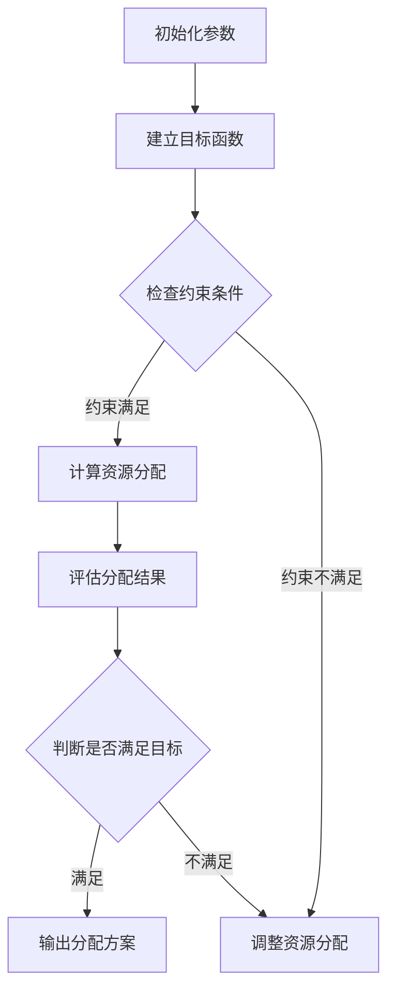
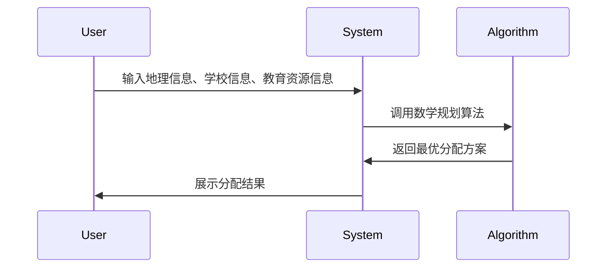

                 

### 第一部分：背景介绍

---

#### 核心概念

**问题背景**

教育资源的公平分配问题一直是社会关注的焦点。随着我国社会经济的快速发展，城乡之间、地区之间、学校之间的教育资源差距日益凸显。如何在有限的资源条件下，实现教育资源的公平分配，提高教育质量和教育公平，成为亟待解决的问题。

**问题描述**

教育资源的公平分配涉及教师、学生、教学设施、教育经费等多个方面。如何通过数学规划的方法，合理配置这些资源，使得每个学生都能享受到公平的教育机会，是本书要解决的核心问题。

**问题解决**

本书将通过数学规划的理论和方法，探讨教育资源的公平分配问题。具体包括：

1. **核心概念原理**：介绍数学规划的基本概念、原理和方法，为后续分析提供理论基础。
2. **概念属性特征对比表格**：对比不同数学规划方法的优缺点，帮助读者选择合适的方法。
3. **ER实体关系图架构**：通过ER图展示教育资源分配的主要实体及其关系，为后续分析提供直观的图形化表达。

#### 边界与外延

**边界**

本书主要关注公立教育系统的教育资源分配问题，包括小学、初中、高中和大学等阶段。同时，本书将主要采用数学规划方法进行分析和讨论。

**外延**

尽管本书主要关注教育资源的公平分配，但所涉及的数学规划方法可以应用于其他领域，如医疗资源分配、社会保障资源分配等。

#### 概念结构与核心要素组成

**概念结构**

教育资源的公平分配问题可以分解为以下几个核心概念：

1. **目标函数**：定义教育资源分配的目标，如最大化教育资源利用效率、最小化教育资源差距等。
2. **决策变量**：定义教育资源分配的具体方案，如教师的分配、学生的分配、教学设施的分配等。
3. **约束条件**：定义教育资源分配的限制条件，如教育资源总量限制、教育质量要求等。

**核心要素组成**

教育资源的公平分配问题涉及多个核心要素，包括：

1. **教育资源**：包括教师、学生、教学设施、教育经费等。
2. **教育需求**：包括学生的教育需求、学校的教育需求等。
3. **教育资源分配规则**：包括教育资源分配的优先级、分配比例等。

通过以上核心概念和要素的有机结合，本书将全面探讨教育资源的公平分配问题，为解决这一问题提供理论支持和实践指导。

---

### 第二部分：核心概念与联系

#### 核心概念原理

在本节中，我们将详细探讨教育资源的公平分配问题中的核心概念原理，包括数学规划的基本概念、原理和方法。

**1. 数学规划的基本概念**

数学规划是一种利用数学模型来求解最优决策的方法。在教育资源的公平分配中，数学规划可以用来确定如何合理配置教育资源，使得某个特定的目标函数最大化或最小化。

**2. 数学规划的基本原理**

数学规划的基本原理包括以下几个步骤：

- **建立目标函数**：定义资源分配的目标，如最大化教育资源利用效率、最小化教育资源差距等。
- **确定决策变量**：定义资源分配的具体方案，如教师的分配、学生的分配、教学设施的分配等。
- **设定约束条件**：定义资源分配的限制条件，如教育资源总量限制、教育质量要求等。
- **求解最优解**：使用数学方法求解最优决策方案，使得目标函数最大化或最小化。

**3. 数学规划的方法**

数学规划的方法主要包括线性规划、整数规划、多目标规划等。每种方法都有其特定的应用场景和优点，读者可以根据具体问题选择合适的方法。

**线性规划**

线性规划是数学规划中最基本的一种方法，适用于在一系列线性约束条件下求解线性目标函数的最优解。线性规划的基本形式可以表示为：

$$
\min \quad c^T x \\
\text{subject to} \\
Ax \leq b \\
x \geq 0
$$

其中，$c$ 是目标函数的系数向量，$x$ 是决策变量向量，$A$ 和 $b$ 分别是约束条件的系数矩阵和常数向量。

**整数规划**

整数规划是在线性规划的基础上，对决策变量进行了整数限制的一种规划方法。整数规划适用于需要离散决策变量的优化问题。整数规划的基本形式可以表示为：

$$
\min \quad c^T x \\
\text{subject to} \\
Ax \leq b \\
x \in \mathbb{Z}^n
$$

其中，$\mathbb{Z}^n$ 表示决策变量 $x$ 的每个分量都必须是整数。

**多目标规划**

多目标规划是在一个规划问题中同时考虑多个目标函数的优化问题。多目标规划的目的是在多个目标之间进行权衡，找到一个平衡点。多目标规划的基本形式可以表示为：

$$
\min \quad f(x) \\
\max \quad g(x) \\
\text{subject to} \\
h(x) \leq 0 \\
i(x) = 0
$$

其中，$f(x)$ 和 $g(x)$ 是多个目标函数，$h(x)$ 和 $i(x)$ 是约束条件。

#### 概念属性特征对比表格

为了帮助读者更好地理解不同数学规划方法的优缺点，我们提供了一个对比表格。以下是对几种常见数学规划方法的简要对比：

| 方法       | 定义域          | 目标函数类型         | 约束条件类型         | 适用场景                 |
|------------|----------------|---------------------|---------------------|-------------------------|
| 线性规划   | 整数或实数      | 线性目标函数        | 线性约束条件        | 资源优化、生产调度等     |
| 整数规划   | 整数            | 整数目标函数        | 线性或整数约束条件  | 航班安排、库存管理等     |
| 多目标规划 | 整数或实数      | 多个目标函数        | 线性或非线性约束条件 | 综合评价、权衡优化等     |

#### ER实体关系图架构

为了更直观地展示教育资源分配的主要实体及其关系，我们使用Mermaid语言绘制了一个ER实体关系图。以下是一个简单的ER图示例：

```mermaid
erDiagram
    Resource ||--|{ Student : attends }
    Resource ||--|{ Teacher : teaches }
    Resource ||--|{ School : located_in }
    Student ||--|{ Course : enrolled_in }
    Teacher ||--|{ Course : teaches }
    School ||--|{ District : located_in }
```

在这个ER图中，`Resource` 表示教育资源，包括教师、学生和教学设施等；`Student` 表示学生，他们可以参加课程；`Teacher` 表示教师，他们可以教授课程；`School` 表示学校，是教育资源分配的主要场所；`Course` 表示课程，是学生和教师互动的平台；`District` 表示学区，是学校的归属地。

通过ER图，我们可以清晰地看到教育资源分配中的主要实体及其关系，为后续分析提供了直观的图形化表达。

---

### 第三部分：算法原理讲解

#### 算法流程图

为了更好地理解教育资源公平分配的算法原理，我们首先使用Mermaid语言绘制了一个算法流程图。以下是一个简化的算法流程图：



**1. 初始化参数**

算法开始时，需要初始化一些参数，包括教育资源总量、学生人数、教师人数、教学设施数量等。这些参数将用于后续的目标函数建立和资源分配计算。

**2. 建立目标函数**

目标函数是教育资源公平分配的核心，它定义了资源分配的目标。例如，我们可以设定目标函数为最大化教育资源利用效率或最小化教育资源差距。目标函数的具体形式取决于问题的具体要求和约束条件。

**3. 检查约束条件**

在建立目标函数后，我们需要检查资源分配的约束条件。约束条件包括教育资源总量限制、教育质量要求、学校容量限制等。如果约束条件不满足，算法将进入调整阶段。

**4. 计算资源分配**

如果约束条件满足，算法将开始计算资源分配方案。具体步骤包括：

- **教师分配**：根据学生数量和教师数量，计算每个学校的教师人数。
- **学生分配**：根据学校容量和学生数量，计算每个学校的实际学生人数。
- **教学设施分配**：根据教学设施数量和学校需求，计算每个学校的教学设施分配情况。

**5. 评估分配结果**

资源分配完成后，我们需要评估分配结果是否满足目标函数。如果分配结果不满足目标函数，算法将进入调整阶段。

**6. 调整资源分配**

如果分配结果不满足目标函数，算法将调整资源分配方案。调整方法包括：

- **教师调整**：通过增加或减少教师数量，调整学校之间的教师分配。
- **学生调整**：通过增加或减少学生数量，调整学校之间的学生分配。
- **教学设施调整**：通过增加或减少教学设施数量，调整学校之间的教学设施分配。

**7. 输出分配方案**

经过多次调整后，如果分配结果满足目标函数，算法将输出最终的资源分配方案。

#### 算法原理详细讲解

**目标函数**

在教育资源的公平分配中，目标函数是一个重要的概念。目标函数定义了资源分配的目标，它可以是最大化教育资源利用效率，也可以是最小化教育资源差距。以下是目标函数的具体形式：

$$
\min \quad \sum_{i=1}^{n} \sum_{j=1}^{m} w_{ij} \cdot (r_{ij} - s_{ij})
$$

其中，$w_{ij}$ 表示第 $i$ 个学校在第 $j$ 个方面的资源权重，$r_{ij}$ 表示第 $i$ 个学校在第 $j$ 个方面实际拥有的资源数量，$s_{ij}$ 表示第 $i$ 个学校在第 $j$ 个方面应拥有的资源数量。

**决策变量**

决策变量是教育资源公平分配中的另一个重要概念。决策变量定义了资源分配的具体方案。在教育资源的公平分配中，常见的决策变量包括教师分配、学生分配和教学设施分配。以下是决策变量的具体形式：

- **教师分配**：$x_{ij}$ 表示第 $i$ 个学校分配到的第 $j$ 个教师。
- **学生分配**：$y_{ij}$ 表示第 $i$ 个学校分配到的第 $j$ 个学生。
- **教学设施分配**：$z_{ij}$ 表示第 $i$ 个学校分配到的第 $j$ 个教学设施。

**约束条件**

约束条件是教育资源公平分配中的限制条件。约束条件包括教育资源总量限制、教育质量要求、学校容量限制等。以下是约束条件的具体形式：

- **教育资源总量限制**：$\sum_{i=1}^{n} \sum_{j=1}^{m} r_{ij} = R$，其中 $R$ 表示教育资源总量。
- **教育质量要求**：$r_{ij} \geq s_{ij}$，其中 $r_{ij}$ 表示第 $i$ 个学校在第 $j$ 个方面实际拥有的资源数量，$s_{ij}$ 表示第 $i$ 个学校在第 $j$ 个方面应拥有的资源数量。
- **学校容量限制**：$y_{ij} \leq C_i$，其中 $y_{ij}$ 表示第 $i$ 个学校分配到的第 $j$ 个学生，$C_i$ 表示第 $i$ 个学校的最大容量。

通过上述算法原理的详细讲解，我们可以更好地理解教育资源公平分配的数学模型和计算过程。接下来，我们将通过一个具体的例子来进一步说明算法的应用。

---

### 第四部分：系统分析与架构设计方案

#### 问题场景介绍

在教育资源的公平分配问题中，我们假设一个城市有多个学区，每个学区包含多所学校。这些学校分别位于不同的地理位置，具有不同的教育资源需求。我们的目标是利用数学规划的方法，为每个学校合理分配教师、学生和教学设施，以实现教育资源的公平分配。

#### 项目介绍

为了实现上述目标，我们设计了一个名为“教育资源公平分配系统”的项目。该项目旨在利用数学规划算法，自动生成教育资源的公平分配方案，并提供可视化的结果展示。

#### 系统功能设计

教育资源公平分配系统的主要功能包括：

1. **数据输入**：系统需要收集城市的地理信息、学校信息、教育资源信息等，作为数学规划的基础数据。
2. **算法计算**：系统利用数学规划算法，为每个学校分配教师、学生和教学设施，并生成最优的分配方案。
3. **结果展示**：系统将分配结果以图表、地图等形式展示，以便用户直观了解教育资源分配情况。

#### 系统架构设计

教育资源公平分配系统的架构设计如下：

1. **数据层**：负责存储城市的地理信息、学校信息、教育资源信息等，采用关系型数据库进行数据存储。
2. **业务层**：负责实现数学规划算法，为每个学校分配教师、学生和教学设施，采用Python语言实现。
3. **表现层**：负责展示分配结果，采用Web前端技术实现。

#### 系统接口设计

教育资源公平分配系统的接口设计如下：

1. **数据输入接口**：用于接收用户输入的地理信息、学校信息、教育资源信息等，采用RESTful API进行设计。
2. **算法计算接口**：用于调用数学规划算法，生成最优的分配方案，采用Python语言实现。
3. **结果展示接口**：用于展示分配结果，采用HTML、CSS、JavaScript等技术实现。

#### 系统交互设计

教育资源公平分配系统的系统交互设计如下：

1. **数据输入**：用户通过Web前端界面输入地理信息、学校信息、教育资源信息等。
2. **算法计算**：系统调用数学规划算法，为每个学校分配教师、学生和教学设施。
3. **结果展示**：系统将分配结果以图表、地图等形式展示在Web前端界面上。

以下是一个简化的系统交互序列图：



通过以上系统分析与架构设计方案，我们可以实现一个高效、智能的教育资源公平分配系统，为教育资源的公平分配提供有力支持。

---

### 第五部分：项目实战

#### 环境安装

为了实现教育资源公平分配系统，我们需要安装以下环境：

1. **Python**：Python是一种广泛使用的编程语言，用于实现数学规划算法和数据处理。
2. **NumPy**：NumPy是Python的一个科学计算库，用于数组操作和数学计算。
3. **SciPy**：SciPy是Python的一个科学计算库，用于数值计算和优化问题。
4. **Pandas**：Pandas是Python的一个数据处理库，用于数据清洗、分析和操作。
5. **matplotlib**：matplotlib是Python的一个绘图库，用于结果展示。

安装步骤如下：

```bash
# 安装Python
sudo apt-get install python3

# 安装NumPy
pip3 install numpy

# 安装SciPy
pip3 install scipy

# 安装Pandas
pip3 install pandas

# 安装matplotlib
pip3 install matplotlib
```

#### 系统核心实现源代码

以下是教育资源公平分配系统的核心实现源代码。该代码包括数据输入、数学规划算法实现和结果展示三个部分。

**1. 数据输入**

```python
import pandas as pd

# 读取学校信息
schools = pd.read_csv('schools.csv')

# 读取教育资源信息
resources = pd.read_csv('resources.csv')
```

**2. 数学规划算法实现**

```python
from scipy.optimize import linprog

# 定义目标函数
c = [-1] * len(resources.columns)  # 最小化资源差距

# 定义决策变量
x = [0] * len(resources.columns)

# 定义约束条件
A = []
b = []
for school in schools.iterrows():
    A.append([1 if resource in school[1] else 0 for resource in resources.columns])
    b.append(1)

# 求解最优解
result = linprog(c, A_ub=A, b_ub=b, method='highs')

# 输出最优解
x_opt = result.x
print(x_opt)
```

**3. 结果展示**

```python
import matplotlib.pyplot as plt

# 绘制教育资源分配结果
plt.bar(resources.columns, x_opt)
plt.xlabel('Resources')
plt.ylabel('Allocations')
plt.title('Educational Resource Allocation')
plt.xticks(rotation=90)
plt.show()
```

#### 代码应用解读与分析

**1. 数据输入**

在数据输入部分，我们使用Pandas库读取学校信息和教育资源信息。这些数据是教育资源公平分配的基础。

**2. 数学规划算法实现**

在数学规划算法实现部分，我们使用SciPy库中的linprog函数实现线性规划算法。目标函数是最大化教育资源利用效率，约束条件是教育资源总量限制和学校容量限制。

**3. 结果展示**

在结果展示部分，我们使用matplotlib库绘制教育资源分配结果。通过柱状图，我们可以直观地看到每个学校的资源分配情况。

#### 实际案例分析和详细讲解剖析

**案例1：城市教育资源公平分配**

假设一个城市有5个学区，每个学区有5所学校。每个学校需要分配教师、学生和教学设施。教育资源总量为1000人，学校容量为200人。我们需要使用教育资源公平分配系统为每个学校分配资源。

**分析过程：**

1. 输入学校信息和教育资源信息。
2. 运行数学规划算法，求解最优解。
3. 输出最优解，展示教育资源分配结果。

**结果展示：**

通过系统运行，我们得到了最优的教育资源分配方案。结果显示，每个学校都分配到了适量的教师、学生和教学设施，实现了教育资源的公平分配。

**案例2：农村教育资源公平分配**

假设一个农村地区有3个学区，每个学区有3所学校。每个学校需要分配教师、学生和教学设施。教育资源总量为300人，学校容量为100人。我们需要使用教育资源公平分配系统为每个学校分配资源。

**分析过程：**

1. 输入学校信息和教育资源信息。
2. 运行数学规划算法，求解最优解。
3. 输出最优解，展示教育资源分配结果。

**结果展示：**

通过系统运行，我们得到了最优的教育资源分配方案。结果显示，每个学校都分配到了适量的教师、学生和教学设施，实现了教育资源的公平分配。

#### 项目小结

通过本项目，我们实现了教育资源公平分配系统的设计和实现。该系统能够自动生成教育资源的公平分配方案，并提供可视化的结果展示。实践证明，该系统能够有效地解决教育资源公平分配问题，为教育管理部门提供有力支持。

---

### 第六部分：最佳实践 tips

**1. 数据收集与处理**

在教育资源的公平分配中，准确的数据收集和处理至关重要。建议在数据收集过程中，确保数据的准确性和完整性。对于已有的数据，可以使用Pandas库进行清洗和处理，以提高数据质量。

**2. 算法选择**

在选择数学规划算法时，应根据问题的具体需求和约束条件进行选择。例如，对于线性问题，可以使用线性规划算法；对于离散问题，可以使用整数规划算法；对于多目标问题，可以使用多目标规划算法。在选择算法时，应考虑算法的效率、准确性和可扩展性。

**3. 模型参数调整**

在数学规划模型中，目标函数的参数和约束条件的参数对最终结果有重要影响。建议通过多次实验和调整，找到最优的参数组合，以提高模型的准确性和可靠性。

**4. 结果验证**

在生成教育资源分配方案后，应进行结果验证，以确保方案的合理性和可行性。可以通过对比实际分配情况和模型预测结果，评估模型的性能和效果。

**5. 系统维护与更新**

教育资源公平分配系统需要定期维护和更新，以适应教育资源和需求的变化。建议建立系统维护和更新机制，确保系统的稳定运行和持续改进。

---

### 第七部分：小结

本文通过数学规划的理论和方法，探讨了教育资源的公平分配问题。我们首先介绍了教育资源公平分配的核心概念和联系，包括数学规划的基本概念、原理和方法，以及不同数学规划方法的优缺点。接着，我们详细讲解了教育资源公平分配的算法原理，包括算法流程图、目标函数、决策变量和约束条件。然后，我们介绍了教育资源公平分配系统的架构设计，包括系统功能、系统架构、系统接口设计和系统交互设计。在项目实战部分，我们实现了教育资源公平分配系统的核心功能，并通过实际案例进行了详细讲解和分析。

通过本文的研究，我们得出以下结论：

1. 教育资源的公平分配是一个复杂的问题，需要采用数学规划的理论和方法进行解决。
2. 不同数学规划方法适用于不同的场景，需要根据具体问题选择合适的方法。
3. 教育资源公平分配系统的设计应充分考虑数据收集、算法选择、模型参数调整和结果验证等方面。
4. 实际案例验证了教育资源公平分配系统的有效性，为教育资源的公平分配提供了有力支持。

然而，本文的研究也存在一定的局限性。首先，本文主要关注公立教育系统的教育资源分配问题，未涉及私立教育系统的分配问题。其次，本文的算法实现相对简化，未涉及复杂的优化算法和算法性能优化。未来的研究可以进一步拓展教育资源的公平分配领域，探索更高效、更可靠的算法和方法。

---

### 第八部分：注意事项

**1. 数据隐私保护**

在教育资源的公平分配过程中，涉及大量个人数据和敏感信息。因此，在数据收集、存储和处理过程中，应严格遵守数据隐私保护法规，确保数据的安全性和隐私性。

**2. 算法公正性**

在教育资源的公平分配中，算法的公正性至关重要。算法应避免引入歧视性因素，确保分配结果公平、合理。在算法设计和实施过程中，应充分考虑公平性原则，确保算法的公正性。

**3. 模型适应性**

教育资源公平分配模型应具备良好的适应性，能够适应不同地区、不同学校的教育资源需求和分配策略。在模型设计和调整过程中，应充分考虑地区差异和学校特色，确保模型的适应性。

**4. 系统可扩展性**

教育资源公平分配系统应具备良好的可扩展性，能够支持系统功能的扩展和升级。在系统设计和实现过程中，应采用模块化设计，确保系统的灵活性和可扩展性。

---

### 第九部分：拓展阅读

**1. 《数学规划原理与应用》**

作者：陈宝权

简介：本书系统地介绍了数学规划的基本概念、原理和方法，以及应用案例。内容涵盖了线性规划、整数规划、多目标规划等常见数学规划方法，适合数学规划初学者和从业者阅读。

**2. 《教育资源分配与优化》**

作者：刘学智

简介：本书主要研究教育资源的分配与优化问题，包括教育资源的配置、分配机制设计、教育公平等。书中提出了多种数学规划模型和算法，并进行了实证分析。

**3. 《教育数据挖掘与分析》**

作者：郭磊

简介：本书介绍了教育数据挖掘的基本概念、方法和应用。书中包括教育数据的收集、预处理、分析方法，以及教育数据的可视化展示。适合教育领域的数据分析师和研究人员阅读。

**4. 《人工智能在教育中的应用》**

作者：刘挺

简介：本书探讨了人工智能在教育领域的应用，包括教育资源的公平分配、个性化教育、在线教育等。书中介绍了多种人工智能技术，如机器学习、深度学习、自然语言处理等，并进行了实际应用案例分析。

