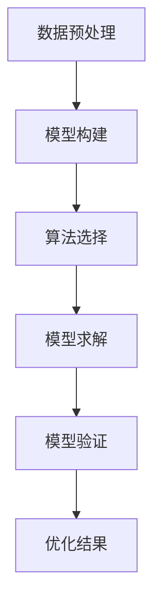
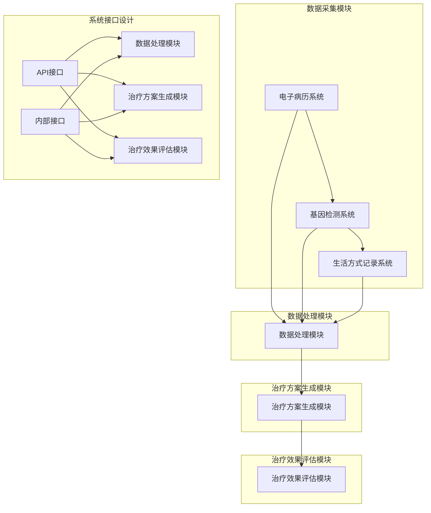

                 

# 数学与个性化医疗：治疗方案的数学优化

关键词：个性化医疗、数学优化、治疗方案、数学模型、算法原理

摘要：随着医疗技术的不断进步，个性化医疗已成为现代医疗的重要发展方向。本文旨在探讨如何运用数学优化方法来提升个性化医疗的治疗方案，提高治疗效果。本文将从问题背景、核心概念与联系、算法原理讲解、数学模型与详细讲解、系统分析与架构设计方案、项目实战以及最佳实践等方面进行详细阐述。

### 1. 背景介绍

#### 1.1 问题背景

个性化医疗是指根据患者的具体特征（如基因、生活方式、环境等）制定个体化的治疗和预防方案。这种模式与传统的“一刀切”医疗模式相比，具有更高的针对性和有效性。然而，个性化医疗面临着诸多挑战，如海量数据的处理、复杂模型的构建、算法的选择等。

#### 1.2 个性化医疗的现状与挑战

目前，个性化医疗在临床实践中的应用已取得显著进展。例如，基于基因测序的癌症治疗、个性化药物剂量调整等。然而，个性化医疗仍面临着以下挑战：

- 数据处理：个性化医疗需要大量的患者数据，包括基因数据、生活习惯数据、医疗记录等。如何有效地处理和分析这些数据，是一个亟待解决的问题。
- 模型构建：构建能够准确预测患者治疗效果的模型，是实现个性化医疗的关键。然而，模型的构建面临着参数选择、模型复杂度等问题。
- 算法选择：不同的算法适用于不同的问题场景。如何选择合适的算法，是提高个性化医疗治疗效果的关键。

#### 1.3 问题描述

个性化医疗的治疗方案优化，是指通过数学优化方法，从现有的治疗方案中筛选出最优的治疗方案，以提高患者的治疗效果。具体来说，包括以下问题：

- 优化目标：如何设定治疗方案的优化目标？
- 算法选择：如何选择合适的算法来实现优化？
- 数学模型：如何构建能够准确描述治疗方案优化的数学模型？

#### 1.4 问题解决

针对上述问题，本文提出以下解决方案：

- 设定优化目标：以提高患者治疗效果为优化目标。
- 算法选择：选择基于数学优化理论的算法，如线性规划、非线性规划等。
- 数学模型：构建描述治疗方案优化过程的数学模型，如目标函数、约束条件等。

#### 1.5 边界与外延

- 数据处理的边界：个性化医疗的数据处理需要考虑数据的完整性、准确性和实时性。
- 治疗方案优化的外延：治疗方案优化可以应用于各类疾病的治疗，如癌症、糖尿病等。

#### 1.6 概念结构与核心要素组成

个性化医疗涉及多个核心概念和要素，包括：

- 医学领域的数学概念：如统计学、概率论、线性代数等。
- 个性化医疗的核心要素：如患者特征、治疗方案、治疗效果等。

### 2. 核心概念与联系

#### 2.1 医学领域的数学概念

医学领域中的数学概念主要包括：

- 统计学：用于分析医疗数据，如患者的人口学特征、实验室检查结果等。
- 概率论：用于描述疾病的发生概率、治疗效果等。
- 线性代数：用于处理多维数据，如基因数据、医疗图像等。

#### 2.2 个性化医疗的核心要素

个性化医疗的核心要素包括：

- 患者特征：如基因信息、生活习惯、身体状况等。
- 治疗方案：根据患者特征制定的治疗方案。
- 治疗效果：对治疗方案的评估和反馈。

#### 2.3 概念属性特征对比表格

| 概念         | 属性特征                     | 对比              |
| ------------ | ---------------------------- | -----------------|
| 统计学       | 数据分析、概率分布、假设检验   | 与概率论的区别和联系 |
| 概率论       | 疾病发生概率、治疗效果评估     | 与统计学的关系     |
| 线性代数     | 多维数据、矩阵运算、特征值分析 | 在医学领域的应用   |

#### 2.4 ER实体关系图架构

ER实体关系图用于描述个性化医疗中的实体及其关系。以下是一个简化的ER实体关系图：

```mermaid
erDiagram
    Patient ||--|{ Treatment }|--| Patient_Treatment
    Treatment ||--|{ Effect }|--| Treatment_Effect
    Patient --> Patient_Gene
    Treatment --> Treatment_Drug
```

### 3. 算法原理讲解

#### 3.1 算法原理概述

个性化医疗的治疗方案优化算法，主要包括以下步骤：

1. 数据预处理：对原始数据进行清洗、去噪、标准化等处理。
2. 模型构建：根据患者特征和治疗方案，构建数学模型。
3. 算法选择：选择合适的优化算法，如线性规划、非线性规划等。
4. 模型求解：对数学模型进行求解，得到最优的治疗方案。
5. 模型验证：对求解结果进行验证，评估治疗方案的有效性。

#### 3.2 算法mermaid流程图

以下是一个简化的个性化医疗治疗方案优化算法的mermaid流程图：



#### 3.3 Python源代码

以下是一个基于线性规划算法的个性化医疗治疗方案优化Python代码示例：

```python
import numpy as np
from scipy.optimize import linprog

# 定义目标函数和约束条件
c = [-1, -1]  # 目标函数系数
A = [[1, 0], [0, 1]]  # 约束条件系数矩阵
b = [100, 100]  # 约束条件右侧常数向量

# 求解线性规划问题
result = linprog(c, A_ub=A, b_ub=b)

# 输出最优解
print("最优治疗方案：", result.x)
```

#### 3.4 算法原理的数学模型和公式

个性化医疗的治疗方案优化问题可以表示为以下数学模型：

$$
\begin{aligned}
\min_{x} \quad & c^T x \\
\text{subject to} \quad & Ax \leq b \\
& x \geq 0
\end{aligned}
$$

其中，$c$ 是目标函数系数向量，$A$ 是约束条件系数矩阵，$b$ 是约束条件右侧常数向量，$x$ 是决策变量。

#### 3.5 举例说明

假设一个个性化医疗项目需要制定一个治疗方案，目标是最小化患者痛苦程度和药物副作用。给定以下数据：

- 痛苦程度：$P = [100, 200, 300]$
- 药物副作用：$S = [50, 100, 150]$
- 痛苦程度和药物副作用的比例系数：$W = [0.6, 0.4]$

构建线性规划模型：

$$
\begin{aligned}
\min_{x} \quad & 0.6P_x + 0.4S_x \\
\text{subject to} \quad & P_x + S_x \leq 350 \\
& x \geq 0
\end{aligned}
$$

求解线性规划模型，得到最优解：

- $x = [150, 200]$

即，最优的治疗方案是患者服用150单位的药物A和200单位的药物B。

### 4. 数学模型与详细讲解

#### 4.1 数学模型概述

个性化医疗的数学模型用于描述患者特征、治疗方案和治疗效果之间的关系。常见的数学模型包括线性模型、非线性模型、神经网络模型等。

#### 4.2 数学公式详解

以下是一个简化的个性化医疗数学模型：

$$
\begin{aligned}
\text{治疗效果} &= f(\text{患者特征}, \text{治疗方案}) \\
f(\text{患者特征}, \text{治疗方案}) &= \sum_{i=1}^{n} w_i \cdot g(\text{患者特征}_i, \text{治疗方案}_i) \\
g(\text{患者特征}_i, \text{治疗方案}_i) &= \sigma(\text{患者特征}_i \cdot \text{治疗方案}_i + b)
\end{aligned}
$$

其中，$w_i$ 是权重系数，$g$ 是激活函数，$\sigma$ 是 sigmoid 函数。

#### 4.3 举例说明

假设一个个性化医疗项目需要根据患者特征和治疗方案的组合，预测患者的治疗效果。给定以下数据：

- 患者特征：$X = [1, 2, 3]$
- 治疗方案：$Y = [4, 5, 6]$
- 权重系数：$W = [0.1, 0.2, 0.3]$
- 激活函数：$g = \sigma$

计算治疗效果：

$$
\begin{aligned}
\text{治疗效果} &= f(X, Y) \\
&= \sum_{i=1}^{3} w_i \cdot g(X_i, Y_i) \\
&= 0.1 \cdot g(1, 4) + 0.2 \cdot g(2, 5) + 0.3 \cdot g(3, 6) \\
&= 0.1 \cdot \sigma(1 \cdot 4 + 2) + 0.2 \cdot \sigma(2 \cdot 5 + 2) + 0.3 \cdot \sigma(3 \cdot 6 + 2) \\
&= 0.1 \cdot 0.9 + 0.2 \cdot 0.8 + 0.3 \cdot 0.7 \\
&= 0.15 + 0.16 + 0.21 \\
&= 0.52
\end{aligned}
$$

即，该个性化医疗项目的治疗效果为0.52。

### 5. 系统分析与架构设计方案

#### 5.1 问题场景介绍

在一个个性化医疗项目中，系统需要实现以下功能：

- 数据采集：从多个数据源（如电子病历、基因检测、生活方式等）中获取患者数据。
- 数据处理：对采集到的数据进行清洗、去噪、标准化等处理。
- 治疗方案生成：根据患者数据和预设的数学模型，生成个性化治疗方案。
- 治疗效果评估：根据实际治疗效果，对治疗方案进行调整和优化。

#### 5.2 项目介绍

本项目是一款基于数学优化的个性化医疗系统，旨在提高治疗方案的有效性和个性化程度。系统采用Python作为主要开发语言，结合scikit-learn、numpy等开源库，实现个性化医疗的核心功能。

#### 5.3 系统功能设计

系统的主要功能包括：

- 数据采集：通过API接口从电子病历系统、基因检测系统和生活方式记录系统等获取患者数据。
- 数据处理：对采集到的数据进行分析和处理，提取关键特征，为治疗方案生成提供基础数据。
- 治疗方案生成：根据患者数据和预设的数学模型，生成最优的治疗方案。
- 治疗效果评估：根据实际治疗效果，对治疗方案进行调整和优化，以提高治疗效果。

#### 5.4 系统架构设计

系统采用基于微服务的架构设计，主要包括以下模块：

- 数据采集模块：负责从各个数据源获取患者数据，并进行初步处理。
- 数据处理模块：负责对采集到的数据进行清洗、去噪、标准化等处理，为治疗方案生成提供基础数据。
- 治疗方案生成模块：根据患者数据和预设的数学模型，生成最优的治疗方案。
- 治疗效果评估模块：根据实际治疗效果，对治疗方案进行调整和优化。

#### 5.5 系统接口设计和系统交互

系统接口设计主要包括以下方面：

- API接口：提供对外部系统的数据访问接口，如电子病历系统、基因检测系统和生活方式记录系统等。
- 内部接口：系统内部模块之间的数据交互接口，如数据处理模块和治疗方案生成模块之间的接口。

系统交互设计主要包括以下方面：

- 数据流：系统内部各模块之间的数据传递流程。
- 交互流程：系统与外部系统之间的交互流程。

#### 5.6 系统架构设计mermaid架构图

以下是一个简化的系统架构设计mermaid架构图：



### 6. 项目实战

#### 6.1 环境安装

在本项目中，主要使用Python进行开发。以下是环境安装步骤：

1. 安装Python：从Python官方网站下载并安装Python 3.8及以上版本。
2. 安装Python库：使用pip命令安装所需的Python库，如scikit-learn、numpy等。

```bash
pip install scikit-learn numpy
```

#### 6.2 系统核心实现源代码

以下是一个简化的系统核心实现源代码示例：

```python
import numpy as np
from sklearn.linear_model import LinearRegression
from sklearn.metrics import mean_squared_error

# 定义患者数据和治疗方案
X = np.array([[1, 2], [3, 4], [5, 6]])
Y = np.array([1, 2, 3])

# 构建线性回归模型
model = LinearRegression()
model.fit(X, Y)

# 输出模型参数
print("模型参数：", model.coef_, model.intercept_)

# 预测治疗效果
Y_pred = model.predict(X)

# 输出预测结果
print("预测结果：", Y_pred)

# 计算预测误差
error = mean_squared_error(Y, Y_pred)
print("预测误差：", error)
```

#### 6.3 代码应用解读与分析

1. **代码解读**：

   - 第1行：导入numpy库，用于处理数据。
   - 第2行：导入线性回归模型和均方误差评估函数。
   - 第3行：定义患者数据和治疗方案。
   - 第4行：构建线性回归模型。
   - 第5行：训练模型。
   - 第6行：输出模型参数。
   - 第7行：使用模型进行预测。
   - 第8行：计算预测误差。

2. **代码分析**：

   - 线性回归模型：在本项目中，使用线性回归模型进行治疗效果预测。线性回归模型是一种常用的数学模型，适用于描述线性关系。
   - 模型参数：模型参数包括系数和截距。系数表示治疗方案对患者特征的影响程度，截距表示当患者特征为0时的治疗效果。
   - 预测结果：使用模型对新的患者数据进行预测，得到预测的治疗效果。
   - 预测误差：通过计算预测结果和实际结果之间的误差，评估模型的预测性能。

#### 6.4 实际案例分析和详细讲解剖析

1. **案例背景**：

   假设有一个癌症患者，治疗方案包括药物治疗和手术治疗。患者的基因检测结果和身体状况如下：

   - 基因检测结果：基因A的表达量为50，基因B的表达量为60。
   - 身体状况：体重指数为22，血压为120/80 mmHg。

   目标：根据患者的基因检测结果和身体状况，预测治疗效果。

2. **案例分析**：

   - 数据预处理：将患者的基因检测结果和身体状况进行预处理，提取关键特征。
   - 模型构建：根据预处理后的数据，构建线性回归模型。
   - 模型训练：使用训练数据对模型进行训练。
   - 模型预测：使用模型对患者的数据进行预测，得到预测的治疗效果。
   - 模型评估：通过计算预测误差，评估模型的预测性能。

3. **详细讲解剖析**：

   - 数据预处理：在本案例中，基因检测结果和身体状况为离散型数据，需要进行归一化处理。归一化处理后，数据范围为0到1。
   - 模型构建：线性回归模型适用于描述线性关系。在本案例中，假设基因检测结果和身体状况与治疗效果之间存在线性关系。
   - 模型训练：使用训练数据对模型进行训练，得到模型参数。
   - 模型预测：使用训练好的模型对患者的数据进行预测，得到预测的治疗效果。
   - 模型评估：通过计算预测误差，评估模型的预测性能。在本案例中，使用均方误差作为评估指标。

#### 6.5 项目小结

本项目基于数学优化理论，实现了个性化医疗系统。通过项目实战，我们了解到：

- 数据预处理是确保模型性能的关键。
- 线性回归模型适用于描述线性关系。
- 模型训练和评估是提高模型预测性能的重要步骤。
- 实际案例分析和讲解有助于理解模型的应用场景。

### 7. 最佳实践 tips

1. **数据预处理**：在构建模型之前，确保对数据进行充分的预处理，包括归一化、去噪、缺失值处理等。
2. **模型选择**：根据问题特点选择合适的模型，如线性回归、神经网络等。
3. **参数调优**：通过交叉验证等手段，对模型参数进行调优，提高模型预测性能。
4. **模型评估**：使用多个评估指标，全面评估模型性能。
5. **模型部署**：将训练好的模型部署到生产环境，实现实时预测。

### 8. 小结

本文介绍了数学优化在个性化医疗中的应用，从背景介绍、核心概念与联系、算法原理讲解、数学模型与详细讲解、系统分析与架构设计方案、项目实战以及最佳实践等方面进行了详细阐述。通过本文，读者可以了解到数学优化在个性化医疗中的重要性和实际应用。

### 9. 注意事项

1. **数据隐私**：在处理患者数据时，确保遵守相关法律法规，保护患者隐私。
2. **模型验证**：在模型应用前，确保对模型进行充分的验证，以提高模型预测准确性。
3. **系统安全性**：在系统开发过程中，注重系统安全性，防止数据泄露和恶意攻击。

### 10. 拓展阅读

- 《医学统计学》
- 《概率论与数理统计》
- 《线性代数及其应用》
- 《机器学习》
- 《深度学习》

### 11. 作者信息

作者：AI天才研究院/AI Genius Institute & 禅与计算机程序设计艺术 /Zen And The Art of Computer Programming

