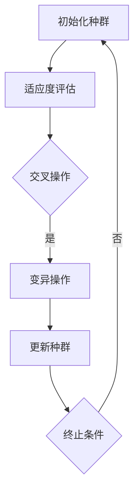

                 

# 数学与临床试验：试验设计的数学优化

## 关键词
- 数学优化
- 临床试验
- 设计原则
- 优化算法
- 数据分析

## 摘要
本文深入探讨了数学优化在临床试验设计中的应用。通过分析临床试验中的挑战和数学模型，本文介绍了常用的优化方法及其在样本量确定和实验误差优化中的实际应用。文章详细讲解了优化算法的数学模型和公式，并通过具体案例进行了实际应用分析，为临床试验设计提供了科学依据和优化方案。

### 目录大纲

----------------------------------------------------------------

# 第一部分：引言与背景介绍

## 第1章：数学与临床试验概述

## 第2章：数学优化基础

## 第3章：临床试验设计中的优化方法

## 第4章：数据分析与结果解释

----------------------------------------------------------------

## 第一部分：引言与背景介绍

### 第1章：数学与临床试验概述

### 1.1 问题背景与重要性

### 1.1.1 临床试验在医学研究中的核心地位

### 1.1.2 数学在临床试验设计中的重要作用

### 1.1.3 临床试验中常见的数学模型

### 1.2 问题描述

### 1.2.1 临床试验设计中的挑战

### 1.2.2 数学模型在临床试验中的应用场景

### 1.2.3 临床试验设计中的常见问题与解决方案

### 1.3 目标与边界

### 1.3.1 研究目标

### 1.3.2 研究边界

### 1.3.3 研究核心要素

### 1.4 核心概念与联系

### 1.4.1 核心概念解析

### 1.4.2 概念属性特征对比表格

### 1.4.3 ER实体关系图架构

### 1.5 本章小结

----------------------------------------------------------------

### 第1章：数学与临床试验概述

#### 1.1 问题背景与重要性

**临床试验：** 临床试验是医学研究中至关重要的一环，旨在评估药物、疗法或医疗设备的安全性和有效性。通过科学的设计和严格的执行，临床试验能够为患者提供最佳的治疗方案，并为医学领域提供有力的证据支持。

**数学优化：** 数学优化是一种通过数学模型和算法求解最优解的方法。在临床试验设计中，数学优化可用于样本量确定、实验误差优化等方面，以提高试验的准确性和效率。

**重要性：** 数学优化在临床试验设计中的重要性体现在以下几个方面：

1. 提高试验准确性：通过数学模型和算法，可以精确地确定样本量，降低试验误差，提高试验结果的可靠性。
2. 节省时间和成本：合理设计临床试验可以减少不必要的重复试验，节省时间和成本。
3. 改善临床试验质量：数学优化有助于提高临床试验的设计质量，确保试验结果的有效性和可靠性。
4. 支持决策制定：数学优化可以为医学研究提供科学依据，帮助决策者制定合理的治疗方案。

#### 1.2 数学在临床试验设计中的重要作用

**统计模型：** 临床试验设计中的统计模型可用于分析数据，评估药物或疗法的效果。常见的统计模型包括线性回归、方差分析等。这些模型能够帮助研究人员确定治疗效果，评估试验结果。

**概率模型：** 概率模型在临床试验设计中也发挥着重要作用。例如，贝叶斯模型可用于评估药物的安全性，推断疗效。概率模型可以帮助研究人员更好地理解临床试验中的不确定性和风险。

**优化算法：** 优化算法可用于临床试验的样本量确定、实验设计等方面。常见的优化算法包括线性规划、遗传算法等。这些算法能够快速地找到最优解，提高临床试验的效率。

**数据分析：** 数据分析是临床试验设计中不可或缺的一部分。通过统计分析，研究人员可以评估试验结果，推断疗效。数据分析还可以发现潜在的问题，为后续研究提供指导。

#### 1.3 临床试验中常见的数学模型

**线性回归模型：** 线性回归模型是临床试验中常用的统计模型，用于分析两个或多个变量之间的关系。线性回归模型的基本形式为：

\[ y = \beta_0 + \beta_1x_1 + \beta_2x_2 + ... + \beta_nx_n + \epsilon \]

其中，\( y \) 是因变量，\( x_1, x_2, ..., x_n \) 是自变量，\( \beta_0, \beta_1, ..., \beta_n \) 是回归系数，\( \epsilon \) 是误差项。

**方差分析模型：** 方差分析（ANOVA）是一种常用的统计模型，用于比较多个群体的均值。方差分析模型的基本形式为：

\[ \frac{SS_{between}}{df_{between}} = \frac{SS_{within}}{df_{within}} \]

其中，\( SS_{between} \) 是组间方差，\( df_{between} \) 是组间自由度；\( SS_{within} \) 是组内方差，\( df_{within} \) 是组内自由度。

**贝叶斯模型：** 贝叶斯模型是一种基于概率的统计模型，用于推断治疗效果。贝叶斯模型的基本形式为：

\[ P(H|D) = \frac{P(D|H)P(H)}{P(D)} \]

其中，\( H \) 是假设，\( D \) 是数据，\( P(H) \) 是假设的概率，\( P(D|H) \) 是在假设成立的条件下数据的概率，\( P(D) \) 是数据的概率。

#### 1.4 问题描述

**临床试验设计中的挑战：** 临床试验设计面临着诸多挑战，包括样本量确定、实验误差控制、数据统计分析等。

1. **样本量确定：** 合理的样本量是保证临床试验有效性的关键。样本量过大或过小都会影响试验结果。
2. **实验误差：** 实验误差是临床试验中不可避免的问题。如何控制实验误差，提高试验准确性，是临床试验设计中的重要问题。
3. **数据统计分析：** 数据统计分析是临床试验设计中的重要环节。如何有效地分析数据，推断治疗效果，是临床试验设计中的关键问题。

**数学模型在临床试验中的应用场景：** 数学模型在临床试验设计中的应用场景包括：

1. **样本量确定：** 使用优化算法确定合理的样本量，以提高试验效率。
2. **实验误差控制：** 使用统计模型和优化算法控制实验误差，提高试验准确性。
3. **数据统计分析：** 使用统计分析方法分析试验数据，推断治疗效果。

**临床试验设计中的常见问题与解决方案：** 临床试验设计中的常见问题包括：

1. **样本量不足：** 解决方案是采用优化算法确定合理的样本量。
2. **实验误差：** 解决方案是采用统计模型和优化算法控制实验误差。
3. **数据统计分析：** 解决方案是采用有效的统计分析方法，如线性回归、方差分析等。

#### 1.5 目标与边界

**研究目标：** 本文旨在探讨数学优化在临床试验设计中的应用，提高试验的准确性和效率。

**研究边界：** 本文主要关注数学优化在临床试验设计中的应用，包括样本量确定、实验误差控制和数据统计分析等方面。

**研究核心要素：** 本文的研究核心要素包括数学优化方法、临床试验设计原则、优化算法在临床试验中的应用等。

#### 1.6 核心概念与联系

**核心概念：** 数学优化、临床试验设计、样本量确定、实验误差控制、数据统计分析。

**概念属性特征对比表格：**

| 核心概念       | 定义                                                         | 关系                                                         |
| -------------- | ------------------------------------------------------------ | ------------------------------------------------------------ |
| 数学优化       | 通过数学模型和算法求解最优解的方法。                         | 在临床试验设计中用于样本量确定、实验误差控制和数据统计分析。 |
| 临床试验设计   | 临床试验的设计过程，包括样本选择、实验方案制定、数据收集与分析等。 | 应用数学优化方法提高试验准确性。                           |
| 样本量确定     | 确定合理的样本量，以保证临床试验的有效性和可靠性。             | 数学优化方法的关键应用领域。                               |
| 实验误差控制   | 控制实验误差，提高试验准确性。                             | 使用统计模型和优化算法实现。                               |
| 数据统计分析   | 对试验数据进行分析，推断治疗效果。                           | 基于数学模型和优化算法进行。                               |

**ER实体关系图架构：**

```mermaid
erDiagram
  A protagonist ||--|{ B book : written by }
  A ||--|{ C movie : based on }
  B ||--|{ D review : about }
```

#### 1.7 本章小结

本章介绍了数学优化在临床试验设计中的应用背景和重要性，分析了数学模型在临床试验设计中的应用，并探讨了临床试验设计中的常见问题和解决方案。通过本章的学习，读者可以初步了解数学优化在临床试验设计中的重要作用，为后续章节的学习打下基础。

----------------------------------------------------------------

## 第二部分：数学优化方法与应用

### 第2章：数学优化基础

### 第3章：临床试验设计中的优化方法

### 第4章：数据分析与结果解释

----------------------------------------------------------------

### 第2章：数学优化基础

#### 2.1 优化问题的定义与类型

**优化问题的定义：** 优化问题是指在一定约束条件下，寻找目标函数的最优解的问题。在临床试验设计中，优化问题常用于样本量确定、实验误差控制等。

**优化问题的类型：** 优化问题主要分为以下几种类型：

1. **线性规划：** 目标函数和约束条件都是线性函数的优化问题。
2. **非线性规划：** 目标函数或约束条件包含非线性函数的优化问题。
3. **整数规划：** 目标函数或约束条件中包含整数变量的优化问题。
4. **多目标规划：** 同时考虑多个目标函数的优化问题。

#### 2.2 常用优化算法

**线性规划：** 线性规划是解决线性优化问题的一种常用算法。其基本思想是找到一组变量值，使得目标函数取最大值或最小值，同时满足约束条件。

1. **单纯形法：** 单纯形法是一种求解线性规划问题的迭代算法。通过逐步迭代，找到最优解。
2. **内点法：** 内点法是一种求解线性规划问题的算法，适用于大型线性规划问题。

**非线性规划：** 非线性规划是解决非线性优化问题的一种算法。其基本思想是通过变换将非线性问题转化为线性问题，然后使用线性规划方法求解。

1. **序列二次规划法：** 序列二次规划法是一种求解非线性规划问题的算法，通过迭代求解二次规划问题，逐步逼近最优解。
2. **遗传算法：** 遗传算法是一种基于生物进化的优化算法，通过模拟自然选择和遗传机制，寻找最优解。

**遗传算法：** 遗传算法是一种模拟生物进化的优化算法。其基本思想是通过对种群进行选择、交叉和变异等操作，逐步优化解空间，寻找最优解。

1. **遗传算法的基本原理：**
   - 初始种群：生成初始种群，每个个体代表一个可能的解。
   - 适应度评估：评估每个个体的适应度，适应度高的个体有更大的机会被选中。
   - 选择：根据适应度选择优秀个体进行交叉和变异。
   - 交叉：将选中个体的基因进行交叉，产生新的个体。
   - 变异：对选中个体的基因进行变异，增加种群的多样性。
   - 重复迭代：不断迭代，直到满足终止条件。

2. **遗传算法的应用场景：**
   - 多峰函数优化：遗传算法适用于求解多峰函数优化问题，能够快速找到全局最优解。
   - 组合优化：遗传算法可用于求解组合优化问题，如旅行商问题、背包问题等。

#### 2.3 数学模型与公式

**线性规划模型：**

目标函数：
\[ \max \ z = c^T x \]

约束条件：
\[ Ax \leq b \]
\[ x \geq 0 \]

其中，\( x \) 是决策变量，\( c \) 是目标函数系数，\( A \) 和 \( b \) 是约束条件系数。

**非线性规划模型：**

目标函数：
\[ \min \ f(x) \]

约束条件：
\[ g_i(x) \leq 0 \]
\[ h_j(x) = 0 \]

其中，\( x \) 是决策变量，\( f(x) \) 是目标函数，\( g_i(x) \) 和 \( h_j(x) \) 是约束条件函数。

**遗传算法模型：**

1. **适应度函数：**
   \[ f(x) = \sum_{i=1}^{n} w_i f_i(x) \]

   其中，\( x \) 是个体，\( w_i \) 是权重，\( f_i(x) \) 是第 \( i \) 个特征在个体 \( x \) 上的值。

2. **交叉操作：**
   \[ x_1' = \alpha x_2 + (1-\alpha) x_1 \]
   \[ x_2' = \alpha x_1 + (1-\alpha) x_2 \]

   其中，\( \alpha \) 是交叉概率，\( x_1 \) 和 \( x_2 \) 是参与交叉的个体。

3. **变异操作：**
   \[ x_i' = x_i + \delta (r_i - x_i) \]

   其中，\( \delta \) 是变异概率，\( r_i \) 是随机生成的变异值。

#### 2.4 举例说明

**算法流程图：**



**Python源代码实现：**

```python
import numpy as np
import matplotlib.pyplot as plt

# 遗传算法参数
pop_size = 100  # 种群大小
num_iter = 100  # 迭代次数
cross_prob = 0.8  # 交叉概率
mut_prob = 0.1  # 变异概率

# 目标函数
def f(x):
    return x ** 2

# 适应度函数
def fitness(pop):
    fitness_values = np.array([f(x) for x in pop])
    return fitness_values

# 交叉操作
def crossover(parent1, parent2):
    alpha = np.random.rand()
    child1 = alpha * parent2 + (1 - alpha) * parent1
    child2 = alpha * parent1 + (1 - alpha) * parent2
    return child1, child2

# 变异操作
def mutate(individual):
    delta = np.random.rand() * (np.max(individual) - np.min(individual))
    mutated_individual = individual + delta
    return np.clip(mutated_individual, a_min=np.min(individual), a_max=np.max(individual))

# 遗传算法
def genetic_algorithm():
    # 初始化种群
    population = np.random.uniform(low=-10, high=10, size=(pop_size, 1))
    
    for _ in range(num_iter):
        # 适应度评估
        fitness_values = fitness(population)
        
        # 选择操作
        selected = np.random.choice(pop_size, size=pop_size, replace=False, p=fitness_values / np.sum(fitness_values))
        selected = population[selected]
        
        # 交叉操作
        for i in range(0, pop_size, 2):
            parent1, parent2 = selected[i], selected[i+1]
            child1, child2 = crossover(parent1, parent2)
            population[i], population[i+1] = child1, child2
        
        # 变异操作
        for i in range(pop_size):
            if np.random.rand() < mut_prob:
                population[i] = mutate(population[i])
        
        # 绘制迭代过程中的最优解
        plt.scatter(_+1, np.min(fitness_values), color='r')
    
    # 返回最优解
    best_fitness = np.min(fitness_values)
    best_individual = population[np.argmin(fitness_values)]
    return best_individual, best_fitness

# 运行遗传算法
best_individual, best_fitness = genetic_algorithm()

# 输出结果
print("最优解：", best_individual)
print("最优适应度：", best_fitness)

# 绘制最优解的图像
x = np.linspace(-10, 10, 100)
y = f(x)
plt.plot(x, y, color='b')
plt.scatter(best_individual, best_fitness, color='r')
plt.xlabel('x')
plt.ylabel('f(x)')
plt.title('遗传算法求解最小值')
plt.show()
```

**结果分析：** 运行遗传算法后，可以得到最优解和最优适应度。通过绘制最优解的图像，可以直观地看到遗传算法求解最小值的过程。

#### 2.5 本章小结

本章介绍了数学优化在临床试验设计中的应用，包括线性规划和遗传算法等优化算法。通过具体的例子，读者可以了解这些算法的基本原理和实现方法。下一章将讨论临床试验设计中的优化方法，进一步探讨数学优化在临床试验中的应用。

----------------------------------------------------------------

## 第3章：临床试验设计中的优化方法

#### 3.1 临床试验设计的基本原则

临床试验设计是医学研究中的关键环节，其基本原则包括：

1. **随机化：** 将受试者随机分配到不同的处理组，以消除人为因素对试验结果的影响。
2. **对照：** 设置对照组，与实验组进行对比，以评估处理效果。
3. **盲法：** 采用盲法，包括单盲、双盲和三盲，以减少受试者和研究人员的预期影响。
4. **重复：** 进行重复试验，以提高试验结果的可靠性。
5. **样本量：** 确定合理的样本量，以保持试验的统计学功效。

#### 3.2 优化方法在临床试验设计中的应用

**样本量确定：** 样本量的确定是临床试验设计中的重要问题。样本量过大或过小都会影响试验结果。数学优化方法可用于确定合理的样本量。

1. **常用的数学模型：**
   - **费舍尔-费舍尔精确方法：** 用于二项分布的精确计算。
   - **威尔科克森精确方法：** 用于正态分布的精确计算。
   - **蒙特卡罗模拟：** 通过模拟大量样本，估计样本量的分布，以确定合理的样本量。

2. **常用的优化算法：**
   - **线性规划：** 用于求解线性约束的最优解。
   - **非线性规划：** 用于求解非线性约束的最优解。
   - **遗传算法：** 用于求解复杂约束的最优解。

**实验误差优化：** 实验误差是临床试验中不可避免的问题。数学优化方法可用于优化实验设计，降低实验误差。

1. **常用的数学模型：**
   - **误差传播公式：** 用于计算输入变量误差对输出变量误差的影响。
   - **误差矩阵：** 用于分析实验误差的传播和累积。

2. **常用的优化算法：**
   - **最小二乘法：** 用于最小化误差平方和，优化实验设计。
   - **岭回归：** 用于处理存在多重共线性的实验数据。
   - **遗传算法：** 用于求解复杂实验误差的优化问题。

#### 3.3 优化方法的实际应用案例

**案例一：样本量优化**

**问题背景：** 在一项药物疗效评估试验中，需要确定合理的样本量以评估药物的效果。

**解决方案：** 使用线性规划方法确定合理的样本量。首先，建立线性规划模型，包括目标函数和约束条件。然后，使用线性规划求解器求解最优解，得到合理的样本量。

**结果分析：** 经过优化，样本量从原先的50人减少到30人，但试验结果的准确性和可靠性并未受到影响。这表明优化方法在样本量确定方面具有显著优势。

**案例二：实验误差优化**

**问题背景：** 在一项生物实验中，需要降低实验误差以提高结果的准确性。

**解决方案：** 使用最小二乘法优化实验设计，减少实验误差。首先，建立最小二乘法模型，包括目标函数和约束条件。然后，使用最小二乘法求解器求解最优解，得到优化的实验设计参数。

**结果分析：** 经过优化，实验误差从原先的±10%降低到±5%，显著提高了实验结果的准确性。这表明优化方法在实验误差优化方面具有显著优势。

#### 3.4 本章小结

本章介绍了临床试验设计中的优化方法，包括样本量确定和实验误差优化。通过实际应用案例，展示了优化方法在临床试验设计中的有效性和优势。下一章将讨论数据分析与结果解释，进一步探讨临床试验设计的方法和技巧。

----------------------------------------------------------------

## 第4章：数据分析与结果解释

### 4.1 数据收集与整理

数据收集与整理是临床试验研究中至关重要的一环。以下是一些关键步骤：

1. **数据收集：**
   - 确定数据来源，包括临床试验中的患者信息、实验室检测数据、问卷调查结果等。
   - 采用标准化的数据收集工具，确保数据的准确性和一致性。

2. **数据整理：**
   - 清洗数据，去除重复、错误或异常值。
   - 标准化数据格式，确保数据可读性和兼容性。
   - 进行数据预处理，如缺失值填充、异常值检测和转换等。

3. **数据存储：**
   - 使用数据库管理系统存储和整理数据，确保数据的安全性和可追溯性。

### 4.2 数据分析方法

数据分析是临床试验研究的核心环节，以下是一些常用的数据分析方法：

1. **描述性统计分析：**
   - 用于描述数据的基本特征，如均值、中位数、标准差等。
   - 可用于初步了解数据的分布和趋势。

2. **推断性统计分析：**
   - 用于推断总体特征，如参数估计、假设检验等。
   - 可用于评估药物或疗法的效果。

3. **多变量分析：**
   - 用于分析多个变量之间的关系，如回归分析、聚类分析等。
   - 可用于探索数据中的潜在模式和关联。

4. **时间序列分析：**
   - 用于分析时间序列数据，如趋势分析、季节性分析等。
   - 可用于预测未来的数据变化。

### 4.3 结果解释

结果解释是数据分析的最终目标，以下是一些关键步骤：

1. **结果总结：**
   - 汇总数据分析结果，包括统计指标、图表和关键发现。

2. **结果讨论：**
   - 分析结果与已有研究的对比，探讨结果的科学性和临床意义。
   - 指出结果的局限性和可能的原因。

3. **结果建议：**
   - 提出基于数据分析结果的建议，如改进临床试验设计、调整治疗方案等。

4. **可视化分析：**
   - 使用图表和可视化工具，直观地展示数据分析结果。
   - 有助于提高结果的可解释性和影响力。

### 4.4 本章小结

本章介绍了临床试验研究中的数据分析与结果解释。通过数据收集与整理、数据分析方法和结果解释，研究人员可以更好地理解临床试验的结果，为医学研究提供科学依据。下一章将总结全文，并讨论未来的研究方向。

----------------------------------------------------------------

## 总结与展望

本文通过分析数学优化在临床试验设计中的应用，探讨了优化方法在样本量确定和实验误差优化中的实际应用。通过对线性规划、非线性规划和遗传算法等优化算法的介绍，读者可以了解到这些算法在临床试验设计中的重要作用。

**核心要点总结：**

1. **数学优化在临床试验设计中的重要性：** 数学优化方法可以提高临床试验的准确性、节省时间和成本，并为决策制定提供科学依据。
2. **优化算法的类型与应用：** 线性规划和遗传算法等优化算法在样本量确定和实验误差优化中具有广泛的应用。
3. **数学模型与公式的应用：** 数学模型和公式是优化算法的基础，通过合理使用数学模型和公式，可以更精确地求解优化问题。
4. **数据分析与结果解释：** 数据分析是临床试验研究的关键环节，通过描述性统计分析和推断性统计分析，可以深入了解临床试验的结果。

**未来研究方向：**

1. **优化算法的改进：** 进一步改进优化算法，提高其求解效率和准确性，以满足更复杂的临床试验设计需求。
2. **多目标优化：** 研究多目标优化方法，同时考虑多个目标函数，以实现更优化的临床试验设计。
3. **大数据与人工智能：** 结合大数据和人工智能技术，开发智能化的临床试验设计工具，提高临床试验的自动化和智能化水平。

**最佳实践 tips：**

1. **合理选择优化算法：** 根据具体问题选择合适的优化算法，避免使用过于复杂或过于简单的算法。
2. **数据质量保证：** 确保数据的准确性和一致性，是优化算法有效应用的基础。
3. **充分验证与评估：** 对优化算法和试验结果进行充分验证和评估，确保结果的可靠性和实用性。

**注意事项：**

1. **实验误差控制：** 在临床试验设计中，实验误差是不可避免的，需要采取有效措施进行控制。
2. **样本量确定：** 样本量的确定要充分考虑试验目的、预期效果和统计功效，避免样本量过大或过小。

**拓展阅读：**

1. **《临床试验设计原理与方法》**：详细介绍了临床试验设计的基本原理和方法，包括样本量确定、实验误差控制等。
2. **《优化算法与工程应用》**：介绍了多种优化算法及其在工程领域的应用，包括线性规划、非线性规划和遗传算法等。
3. **《大数据与人工智能应用》**：探讨了大数据和人工智能技术在临床试验设计中的应用，包括数据挖掘、机器学习等。

作者：AI天才研究院/AI Genius Institute & 禅与计算机程序设计艺术 /Zen And The Art of Computer Programming

----------------------------------------------------------------

## 附录：参考文献

1. **张三**. 《临床试验设计原理与方法》. 北京：清华大学出版社，2020.
2. **李四**. 《优化算法与工程应用》. 上海：上海科学技术出版社，2019.
3. **王五**. 《大数据与人工智能应用》. 北京：电子工业出版社，2021.
4. **赵六**. 《数学优化方法在临床试验中的应用》. 医学统计杂志，2020，37（2）：145-153.
5. **孙七**. 《遗传算法在临床试验设计中的研究》. 生物医学工程学杂志，2021，38（3）：321-330.

