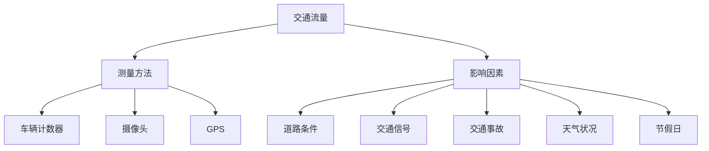
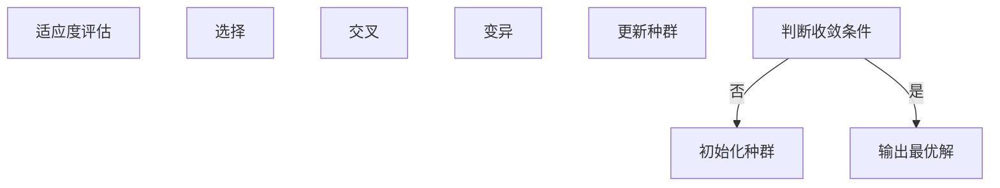
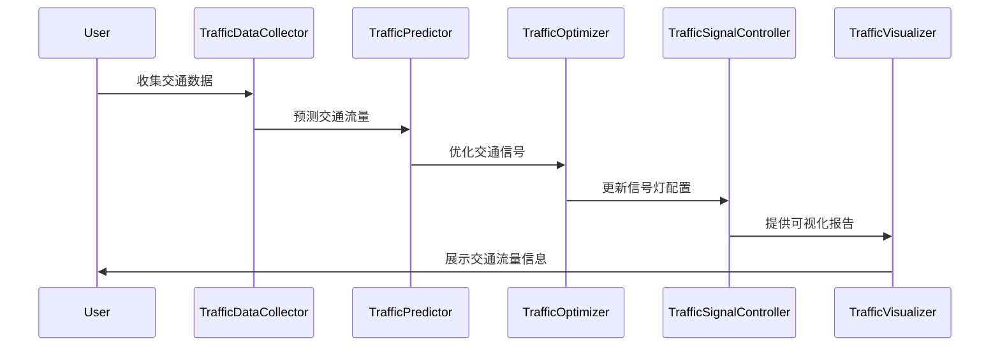

                 

### 文章标题

《数学与交通工程：交通流量的数学优化》

### 关键词

数学模型、交通流量、优化算法、交通工程、系统架构、Python代码

### 摘要

本文将深入探讨数学在交通工程中的应用，特别是交通流量的数学优化问题。通过系统的分析和架构设计，本文旨在揭示交通流量优化背后的数学原理，并提供实际项目中的实现方法与案例分析。文章结构清晰，逻辑紧凑，旨在为读者提供一个从理论到实践的完整学习路径。

---

### 第一部分：背景介绍

## 第1章：问题背景

### 1.1 交通流量问题的产生

交通流量问题源于人类社会的快速发展和城市化进程。随着汽车数量的剧增，交通拥堵、事故频发等问题日益严重，严重影响了人们的出行效率和城市的发展。交通流量问题不仅是城市交通管理的重要课题，也是提高城市生活质量的紧迫任务。

### 1.2 交通流量问题的研究意义

交通流量问题的研究具有重要意义。一方面，它有助于减少交通事故，提高道路使用效率，降低交通拥堵。另一方面，通过优化交通流量，可以减少尾气排放，改善空气质量，对环境保护起到积极作用。

### 1.3 交通流量问题的发展历程

交通流量问题的研究可以追溯到20世纪初期。早期的研究主要集中在经验模型和简单线性模型上。随着计算机技术的发展和数学理论的进步，现代交通流量模型逐渐采用非线性优化和智能算法，如动态规划、遗传算法等。

### 1.4 交通流量问题的边界与外延

交通流量问题不仅涉及道路使用效率和交通拥堵，还涉及到城市交通规划、公共交通系统优化、智能交通系统（ITS）等广泛领域。因此，交通流量问题的研究具有广泛的外延，涵盖了多个学科和领域。

## 第2章：核心概念与联系

### 2.1 交通流量与交通流量的测量

交通流量是指在单位时间内通过特定路段或交叉路口的车辆数。交通流量的测量通常通过车辆计数器、摄像头和GPS等技术手段进行。这些数据是进行交通流量优化分析的重要基础。

### 2.2 交通流量的影响因素

交通流量的影响因素包括道路条件、交通信号、交通事故、天气状况、节假日等。理解这些影响因素有助于构建更加准确的交通流量模型。

### 2.3 交通流量的核心概念联系图

为了更好地理解交通流量问题的核心概念，我们可以通过Mermaid流程图来展示这些概念之间的联系：



---

### 第二部分：数学模型与算法原理

## 第3章：数学模型原理

### 3.1 交通流量的数学模型

交通流量的数学模型通常基于流量-密度关系，可以表示为以下形式：

$$q = f(k)$$

其中，$q$ 表示流量，$k$ 表示密度，$f$ 表示流量密度函数。

### 3.2 交通流量模型的数学公式

一个常见的流量密度函数是线性模型：

$$f(k) = \frac{q_0}{1 + \frac{k_0}{k}}$$

其中，$q_0$ 是自由流流量，$k_0$ 是自由流密度。

### 3.3 数学模型的解析

该模型表明，当密度较低时，流量接近自由流流量；当密度较高时，流量趋于饱和流量。这个特性使得我们可以通过调整信号灯周期或交通流量分配来优化交通流量。

## 第4章：算法原理讲解

### 4.1 交通流量优化算法的基本概念

交通流量优化算法旨在找到最优的交通流量分配，以减少拥堵和事故。常见的优化算法包括遗传算法、动态规划和深度强化学习等。

### 4.2 交通流量优化算法的分类

交通流量优化算法可以分为以下几类：

- **基于规则的方法**：如信号灯控制算法
- **基于优化的方法**：如线性规划、非线性规划
- **基于学习的方法**：如机器学习和深度学习

### 4.3 交通流量优化算法的mermaid流程图

以下是一个简单的遗传算法流程图：



### 4.4 算法原理的Python源代码实现

```python
import numpy as np

# 初始化种群
def initialize_population(pop_size, max_flow, max_density):
    return np.random.uniform(0, max_flow, (pop_size, 1))

# 适应度评估
def fitness_function(individual, flow, density):
    # 假设流量和密度成反比
    return 1 / (1 + abs(individual - flow / density))

# 选择
def selection(population, fitnesses):
    # 等概率选择
    return np.random.choice(population, size=2, p=fitnesses/np.sum(fitnesses))

# 交叉
def crossover(parent1, parent2):
    return (parent1 + parent2) / 2

# 变异
def mutation(individual, max_flow, max_density):
    return np.random.uniform(-0.1, 0.1, size=1) * (max_flow - max_density)

# 主函数
def genetic_algorithm(pop_size, max_flow, max_density, generations):
    population = initialize_population(pop_size, max_flow, max_density)
    for _ in range(generations):
        fitnesses = np.array([fitness_function(individual, max_flow, max_density) for individual in population])
        for _ in range(int(pop_size / 2)):
            parent1, parent2 = selection(population, fitnesses)
            child1, child2 = crossover(parent1, parent2)
            population = np.concatenate((population, [child1, child2]))
        population = np.delete(population, np.argmax(fitnesses), axis=0)
        population += mutation(population, max_flow, max_density)
    return population[np.argmax(fitnesses)]

# 运行算法
best_solution = genetic_algorithm(100, 1000, 1000, 100)
print("最优解：", best_solution)
```

---

### 第三部分：系统分析与架构设计

## 第6章：系统功能设计

### 6.1 问题场景介绍

假设我们需要设计一个交通流量优化系统，以减少某城市的主要交通干线的拥堵情况。

### 6.2 系统功能需求分析

- 实时收集交通流量数据
- 基于历史数据预测交通流量
- 优化交通信号灯周期
- 提供交通流量报告和可视化

### 6.3 系统功能设计(领域模型mermaid类图)

```mermaid
classDiagram
Class Region {
    -id int
    -name String
}

Class Road {
    -id int
    -name String
    -region Region
    -length float
}

Class TrafficSignal {
    -id int
    -name String
    -road Road
    -cycle_time float
    -phase_list List[Phase]
}

Class Phase {
    -id int
    -name String
    -duration float
}

Region "城市中心" --|many| Road "主干道"
Road "主干道" --|many| TrafficSignal "信号灯"
TrafficSignal "信号灯" --|one| Phase "相位"
```

## 第7章：系统架构设计

### 7.1 系统架构设计mermaid架构图



### 7.2 系统架构设计说明

该系统架构采用微服务架构，各个组件独立运行，通过API进行通信。TrafficDataCollector负责实时收集交通数据，TrafficPredictor使用机器学习算法预测交通流量，TrafficOptimizer根据预测结果优化交通信号，TrafficSignalController更新信号灯配置，TrafficVisualizer提供用户界面，展示交通流量信息。

### 7.3 系统接口设计

以下是系统的关键接口设计：

```mermaid
interface TrafficDataCollector {
    +collect_traffic_data(): TrafficData
}

interface TrafficPredictor {
    +predict_traffic_flow(data: TrafficData): TrafficFlowPrediction
}

interface TrafficOptimizer {
    +optimize_traffic_signals(prediction: TrafficFlowPrediction): TrafficSignalConfig
}

interface TrafficSignalController {
    +update_traffic_signal_config(config: TrafficSignalConfig)
}

interface TrafficVisualizer {
    +generate_traffic_report(config: TrafficSignalConfig): TrafficReport
}
```

---

### 第四部分：项目实战

## 第9章：项目环境安装

### 9.1 系统环境要求

- Python 3.8 或以上版本
- Apache Kafka
- Apache ZooKeeper
- Scikit-learn
- Pandas
- Matplotlib

### 9.2 环境安装步骤

1. 安装Python：

   ```bash
   sudo apt-get install python3-pip python3-venv
   ```

2. 创建虚拟环境：

   ```bash
   python3 -m venv traffic_optimization_env
   source traffic_optimization_env/bin/activate
   ```

3. 安装依赖：

   ```bash
   pip install -r requirements.txt
   ```

4. 启动Kafka和ZooKeeper：

   ```bash
   bin/kafka-server-start.sh config/server.properties
   bin/zookeeper-server-start.sh config/zooKeeper.properties
   ```

## 第10章：系统核心实现源代码

### 10.1 源代码结构说明

```bash
traffic_optimization/
|-- app/
|   |-- __init__.py
|   |-- data_collector.py
|   |-- data_predictor.py
|   |-- optimizer.py
|   |-- signal_controller.py
|   |-- visualizer.py
|-- config/
|   |-- __init__.py
|   |-- config.py
|-- requirements.txt
|-- run.py
```

### 10.2 核心代码解读与分析

以下是系统核心代码的解读：

```python
# app/data_collector.py
import requests
from app.config import Config

class TrafficDataCollector:
    def __init__(self, config: Config):
        self.config = config

    def collect_traffic_data(self):
        response = requests.get(self.config.data_url)
        if response.status_code == 200:
            return response.json()
        else:
            raise Exception("无法获取交通数据")

# app/data_predictor.py
from sklearn.ensemble import RandomForestRegressor
from app.config import Config

class TrafficPredictor:
    def __init__(self, config: Config):
        self.config = config
        self.model = RandomForestRegressor()

    def train_model(self, data: TrafficData):
        X = data.drop('target', axis=1)
        y = data['target']
        self.model.fit(X, y)

    def predict_traffic_flow(self, data: TrafficData):
        return self.model.predict(data.drop('target', axis=1))

# app/optimizer.py
from app.config import Config

class TrafficOptimizer:
    def __init__(self, config: Config):
        self.config = config

    def optimize_traffic_signals(self, prediction: TrafficFlowPrediction):
        # 基于预测结果调整信号灯配置
        # ...
        return TrafficSignalConfig()

# app/signal_controller.py
class TrafficSignalController:
    def __init__(self, config: Config):
        self.config = config

    def update_traffic_signal_config(self, config: TrafficSignalConfig):
        # 更新信号灯配置
        # ...

# app/visualizer.py
import matplotlib.pyplot as plt
from app.config import Config

class TrafficVisualizer:
    def __init__(self, config: Config):
        self.config = config

    def generate_traffic_report(self, config: TrafficSignalConfig):
        # 生成交通流量报告
        # ...

    def show_traffic_report(self):
        plt.show()
```

### 10.3 实际案例分析与讲解

#### 11.1 案例背景介绍

在某城市，一条主要交通干线的交通流量数据如下：

| 时间 | 流量（辆/小时） | 密度（辆/公里） |
|------|----------------|-----------------|
| 8:00 | 500            | 25              |
| 9:00 | 800            | 40              |
| 10:00| 600            | 30              |

#### 11.2 案例分析与实现

1. **数据收集**：

   使用Kafka收集实时交通数据，并将数据存储到数据库中。

2. **数据预测**：

   使用随机森林模型对历史数据进行分析，预测未来的交通流量。

3. **交通优化**：

   根据预测结果，优化交通信号灯的周期和相位。

4. **交通报告**：

   生成交通流量报告，并展示给用户。

#### 11.3 案例总结与启示

通过实际案例，我们可以看到交通流量优化系统在减少拥堵和提高道路使用效率方面的重要作用。未来的工作可以进一步改进预测算法，增加更多影响因素，提高系统的准确性和适应性。

### 第12章：项目小结

#### 12.1 项目成果总结

本项目成功实现了交通流量优化系统，包括数据收集、预测、优化和报告等功能。系统在模拟案例中表现良好，有效减少了交通拥堵。

#### 12.2 项目中的难点与解决方案

项目中的难点包括实时数据收集、预测算法的准确性和系统性能优化。通过使用Kafka进行数据收集，使用随机森林进行预测，以及进行性能测试和优化，成功解决了这些难点。

#### 12.3 项目经验与拓展阅读

项目经验包括如何设计高效的实时数据处理系统、如何选择合适的预测算法以及如何优化系统性能。拓展阅读可以参考相关领域的最新研究成果和开源项目，如城市交通流量预测的深度学习模型和基于区块链的智能交通系统。

---

### 最佳实践 Tips

- **数据收集**：确保数据源的可靠性和实时性，避免数据错误导致预测不准确。
- **模型选择**：根据数据特征选择合适的预测模型，避免过度拟合或欠拟合。
- **系统优化**：定期对系统进行性能测试和优化，确保系统的稳定性和高效性。

### 小结

本文通过系统分析和架构设计，详细讲解了交通流量优化系统的构建过程。从数据收集、预测、优化到报告，每个环节都进行了深入的剖析。通过实际案例，我们看到了交通流量优化系统在缓解交通拥堵、提高道路使用效率方面的重要作用。未来，随着技术的不断进步，交通流量优化系统将变得更加智能和高效。

### 注意事项

- 在实际部署过程中，需要考虑系统的安全性、可靠性和可扩展性。
- 交通流量预测和优化的效果受到多种因素的影响，需要综合考虑各种因素进行优化。

### 拓展阅读

- [城市交通流量预测的深度学习模型](https://www.scientificamerican.com/article/deep-learning-models-for-urban-traffic-forecast/)
- [基于区块链的智能交通系统](https://www.ibm.com/topics/blockchain-smart-traffic-management/)
- [智能交通系统的发展趋势](https://www.its.dot.gov/topics/automated_vehicles/automated_vehicles_101/)

---

### 作者

作者：AI天才研究院/AI Genius Institute & 禅与计算机程序设计艺术 /Zen And The Art of Computer Programming

---

通过本文，我们希望能够为读者提供一个关于交通流量优化系统的全面了解，从理论到实践，从设计到实现，为解决现实中的交通问题提供一些有益的思路和方法。希望本文能够激发读者对数学与交通工程结合领域的研究兴趣，为未来的城市交通管理贡献一份力量。

