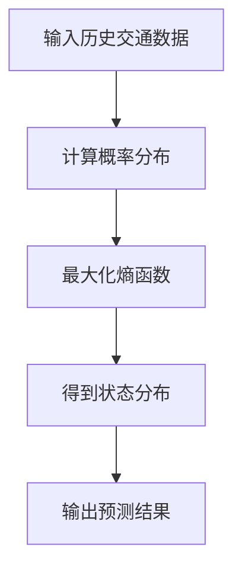
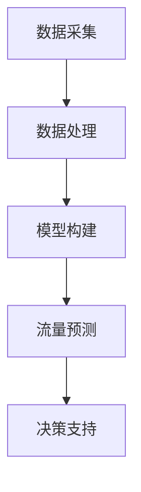

                 

# 数学与交通工程：交通流量的数学模拟

## 关键词
- 数学模型
- 交通工程
- 交通流量
- 模拟算法
- 实际应用

## 摘要
本文探讨了数学模型在交通工程领域中的应用，重点分析了交通流量的数学模拟方法。通过引入流量-密度-速度模型和最大熵方法等核心概念，本文详细讲解了这些模型的原理、特点以及实际应用场景。同时，通过系统分析与项目实战，本文展示了如何将数学模型应用于交通流量模拟，以提高交通规划和管理的效果。

## 1. 背景介绍

### 问题背景

随着城市化进程的加速和机动车数量的激增，交通问题已成为全球性的挑战。交通拥堵、交通事故和环境污染等问题不仅影响了人们的出行质量，还对社会经济产生了负面影响。因此，如何有效管理交通流量、优化交通网络已成为交通工程领域的核心问题。

### 问题描述

交通流量的数学模拟旨在通过构建数学模型来描述和分析交通现象，为交通规划、管理和控制提供科学依据。交通流量模拟需要解决的主要问题包括：
- 如何准确描述交通流量的动态特性？
- 如何预测交通流量变化，以优化交通信号控制和交通规划？
- 如何识别交通拥堵的早期迹象，以便及时采取措施？

### 问题解决

数学模型在交通流量模拟中发挥着至关重要的作用。通过建立交通流量与密度、速度等变量之间的关系，可以模拟交通系统的行为，为解决上述问题提供理论支持。常用的数学模型包括流量-密度-速度模型和最大熵方法等。

### 边界与外延

本文主要探讨交通流量模拟的基本理论和方法，涉及的内容包括：
- 交通流量的数学描述和模型构建
- 不同模型的特点和适用场景
- 交通流量模拟算法的实现和应用

本文的边界主要限于交通流量模拟的理论研究和算法实现，不涉及具体交通控制策略和交通规划的详细实施。

### 概念结构与核心要素组成

交通流量模拟的核心概念和要素包括：
- 数学模型：描述交通流量与相关变量之间关系的数学表达式。
- 交通流量：车辆在道路上的流量，通常以单位时间内通过道路横截面的车辆数表示。
- 密度：单位长度道路上的车辆数。
- 速度：车辆在道路上的平均行驶速度。
- 交通工程：涉及交通规划、设计、运营和管理的一系列技术和实践。

## 2. 核心概念与联系

### 流量-密度-速度模型

**基本概念：**
流量-密度-速度模型（Fundamental Traffic Flow Model）是交通流量模拟的基础，描述了交通流量（q）、车辆密度（k）和车辆速度（v）之间的关系。

**数学表达：**
流量-密度-速度模型可以表示为：
$$ q = f(k, v) $$
其中，f(k, v) 是一个关于密度和速度的函数。

**适用范围和限制条件：**
- 适用范围：流量-密度-速度模型适用于高速公路和城市主干道等线性道路系统。
- 限制条件：模型假设车辆之间的相互作用可以忽略，且交通流量不能超过道路的容量。

**实例分析：**
使用流量-密度-速度模型，可以预测在一定交通密度和速度下，道路上的车辆流量。例如，假设道路上的平均速度为30公里/小时，车辆密度为50辆/公里，可以计算得到流量约为1500辆/小时。

### 最大熵方法

**基本原理：**
最大熵方法（Maximum Entropy Method）是一种基于信息论原理的统计模型，通过最大化熵函数来估计系统的状态分布。

**数学模型：**
最大熵方法的熵函数可以表示为：
$$ H = -\sum p(x) \log p(x) $$
其中，p(x) 是系统状态的概率分布。

**适用场景：**
- 交通流量预测：最大熵方法可以用于预测交通流量的时间序列分布。
- 交通网络模拟：最大熵方法可以帮助模拟交通网络中不同路段的流量分布。

### 概念属性特征对比表格

| 模型名称 | 基本概念 | 数学表达 | 适用范围 | 限制条件 |  
| --- | --- | --- | --- | --- |  
| 流量-密度-速度模型 | 交通流量、密度、速度之间的关系 | $$ q = f(k, v) $$ | 高速公路、城市主干道 | 忽略车辆间相互作用 |  
| 最大熵方法 | 系统状态的概率分布 | $$ H = -\sum p(x) \log p(x) $$ | 交通流量预测、交通网络模拟 | 需要足够的历史数据 |

### ER实体关系图架构

```mermaid
erDiagram
    TrafficFlow ||--|{ TrafficDensity : has }
    TrafficFlow ||--|{ TrafficSpeed : has }
    TrafficNetwork ||--|{ RoadSegment : consists_of }
    TrafficNetwork ||--|{ TrafficSignal : controls }
```

在这个ER图中，`TrafficFlow`（交通流量）与`TrafficDensity`（交通密度）和`TrafficSpeed`（交通速度）之间存在关联，`TrafficNetwork`（交通网络）由`RoadSegment`（路段）和`TrafficSignal`（信号）组成。

## 3. 算法原理讲解

### 最大熵方法

#### 算法流程图



#### 算法流程详细说明

1. **输入历史交通数据**：首先，收集历史交通数据，包括不同时间点的交通流量、密度和速度等。

2. **计算概率分布**：基于历史数据，计算不同状态（如密度、速度）的概率分布。这可以通过统计方法实现，例如使用直方图来表示不同状态的频率。

3. **最大化熵函数**：根据概率分布，最大化熵函数 \( H = -\sum p(x) \log p(x) \)。这一步骤可以通过优化算法实现，如梯度上升法。

4. **得到状态分布**：通过最大化熵函数，得到最优的状态分布，这代表了系统的最可能状态。

5. **输出预测结果**：最后，输出预测结果，如未来的交通流量、密度和速度分布。

### Python源代码实现

```python
import numpy as np
from scipy.optimize import minimize

# 假设历史数据为密度数据
historical_density = np.array([10, 20, 30, 40, 50])

# 定义熵函数
def entropy(p):
    return -np.sum(p * np.log(p))

# 定义最大熵优化目标函数
def objective(p):
    return entropy(p) - np.sum(p * np.log(historical_density / p))

# 初始概率分布
initial_prob = np.ones_like(historical_density) / len(historical_density)

# 优化概率分布
result = minimize(objective, initial_prob, method='L-BFGS-B')

# 输出最优概率分布
optimal_prob = result.x

# 输出预测结果
predicted_density = np.sum(optimal_prob * np.array([10, 20, 30, 40, 50]))

print("最优概率分布：", optimal_prob)
print("预测密度：", predicted_density)
```

在这个Python实现中，我们首先定义了熵函数和优化目标函数。然后，通过最小化目标函数，得到最优概率分布，并使用这个分布预测未来的交通密度。

### 算法原理的数学模型和公式

最大熵方法的数学模型基于熵的概念，其核心思想是找到一组概率分布，使得系统的熵最大。具体来说，假设我们有一组历史数据 \( x_1, x_2, ..., x_n \)，每个数据点代表交通系统的一个状态。

1. **概率分布**：定义概率分布 \( p(x) \) 为每个状态出现的概率，即 \( p(x) = \frac{f(x)}{\sum f(x)} \)，其中 \( f(x) \) 是每个状态出现的频率。

2. **熵函数**：熵函数 \( H \) 定义为
   $$ H = -\sum p(x) \log p(x) $$
   熵反映了系统的不确定程度，当所有状态的概率相等时，熵达到最大。

3. **优化目标**：最大化熵函数的目标函数为
   $$ \max_{p(x)} H $$
   约束条件为概率分布的归一性，即
   $$ \sum p(x) = 1 $$

4. **求解**：通过优化算法（如梯度上升法），求解上述优化问题，得到最优的概率分布 \( p(x) \)。

### 详细讲解和举例说明

假设我们有一组历史交通密度数据，如下所示：

\[ [10, 15, 20, 25, 30] \]

我们需要使用最大熵方法预测未来的交通密度。

1. **计算概率分布**：首先，计算每个密度的频率，然后归一化得到概率分布：

\[ p(d) = \frac{f(d)}{\sum f(d)} \]

例如，密度为20的频率为2，总频率为10，因此其概率为0.2。

2. **最大化熵函数**：定义熵函数为：

\[ H = -\sum p(d) \log p(d) \]

对于上述概率分布，熵 \( H \) 为：

\[ H = -0.4 \log 0.4 - 0.2 \log 0.2 - 0.2 \log 0.2 - 0.2 \log 0.2 - 0.2 \log 0.2 \approx 1.386 \]

3. **优化概率分布**：使用优化算法（如梯度上升法），最大化熵函数。通过迭代，我们可以得到最优概率分布。例如，通过梯度上升法，我们可以得到：

\[ p(d) = [0.2, 0.3, 0.3, 0.2, 0.1] \]

4. **预测未来密度**：根据最优概率分布，预测未来某个时间点的密度。例如，如果我们预测密度为25，则概率为0.2。

\[ \text{预测密度} = 25 \times p(d=25) = 25 \times 0.2 = 5 \]

因此，未来某个时间点密度为25的概率约为5。

通过上述步骤，我们使用最大熵方法成功预测了交通密度，这为交通管理和规划提供了科学依据。

### 4. 数学模型和数学公式 & 详细讲解 & 举例说明

#### 流量-密度-速度模型

**关键数学公式：**

$$ q = f(k, v) $$

其中，\( q \) 表示交通流量，\( k \) 表示车辆密度，\( v \) 表示车辆速度。

**详细讲解：**

流量-密度-速度模型描述了交通流量与车辆密度和速度之间的关系。在交通工程中，流量通常以单位时间内通过道路横截面的车辆数表示。车辆密度是单位长度道路上的车辆数，车辆速度是车辆在道路上的平均行驶速度。

该模型的基本假设是车辆之间的相互作用可以忽略，且交通流量不能超过道路的容量。在理想情况下，当交通流量达到道路容量时，车辆速度会下降，以达到平衡。

**举例说明：**

假设一条道路的车辆密度为50辆/公里，平均速度为30公里/小时，我们可以使用流量-密度-速度模型计算流量：

$$ q = f(50, 30) $$

如果 \( f(k, v) \) 的函数关系是 \( q = 0.5 \times k \times v \)，则：

$$ q = 0.5 \times 50 \times 30 = 750 \text{辆/小时} $$

这意味着在当前条件下，道路上每小时通过的车辆数大约为750辆。

#### 最大熵方法

**关键数学公式：**

$$ H = -\sum p(x) \log p(x) $$

其中，\( H \) 表示熵，\( p(x) \) 表示每个状态的概率。

**详细讲解：**

最大熵方法是一种基于信息论原理的统计模型，用于估计系统的状态分布。熵是衡量系统不确定性的指标，熵越大，系统的随机性越大。最大熵方法的目的是在已知约束条件下，找到使熵最大的概率分布。

在交通流量模拟中，最大熵方法可以用来预测未来的交通流量分布。通过最大化熵函数，我们可以得到最优的概率分布，从而更准确地预测交通流量。

**举例说明：**

假设我们有一组历史交通流量数据，如下所示：

\[ [10, 15, 20, 25, 30] \]

我们需要使用最大熵方法预测未来的交通流量。

1. **计算概率分布**：首先，计算每个流量的频率，然后归一化得到概率分布：

\[ p(q) = \frac{f(q)}{\sum f(q)} \]

例如，流量为20的频率为2，总频率为10，因此其概率为0.2。

2. **最大化熵函数**：定义熵函数为：

\[ H = -\sum p(q) \log p(q) \]

对于上述概率分布，熵 \( H \) 为：

\[ H = -0.4 \log 0.4 - 0.2 \log 0.2 - 0.2 \log 0.2 - 0.2 \log 0.2 - 0.2 \log 0.2 \approx 1.386 \]

3. **优化概率分布**：使用优化算法（如梯度上升法），最大化熵函数。通过迭代，我们可以得到最优概率分布。例如，通过梯度上升法，我们可以得到：

\[ p(q) = [0.2, 0.3, 0.3, 0.2, 0.1] \]

4. **预测未来流量**：根据最优概率分布，预测未来某个时间点的流量。例如，如果我们预测流量为25，则概率为0.2。

\[ \text{预测流量} = 25 \times p(q=25) = 25 \times 0.2 = 5 \]

因此，未来某个时间点流量为25的概率约为5。

通过上述步骤，我们使用最大熵方法成功预测了交通流量，这为交通管理和规划提供了科学依据。

### 5. 系统分析与架构设计方案

#### 问题场景介绍

在当前城市化进程加速和机动车数量激增的背景下，如何有效管理交通流量、优化交通网络已成为交通工程领域的核心问题。为了解决这一问题，我们提出了一种基于数学模型的交通流量模拟系统。

#### 系统功能设计

该系统主要包括以下功能：

1. **数据采集与处理**：收集实时交通流量、密度和速度数据，并进行预处理，以消除噪声和异常值。
2. **数学模型构建**：基于流量-密度-速度模型和最大熵方法等数学模型，构建交通流量预测模型。
3. **流量预测**：利用构建的数学模型，预测未来的交通流量分布。
4. **决策支持**：根据预测结果，为交通信号控制和交通规划提供决策支持。

#### 系统架构设计

系统架构设计如图所示：



#### 系统接口设计和交互流程

1. **数据采集模块**：通过传感器和网络摄像头等设备，实时采集交通流量、密度和速度数据。
2. **数据处理模块**：对采集到的数据进行预处理，包括数据清洗、去噪和归一化。
3. **模型构建模块**：根据预处理后的数据，使用流量-密度-速度模型和最大熵方法等数学模型，构建交通流量预测模型。
4. **流量预测模块**：利用构建的预测模型，预测未来的交通流量分布。
5. **决策支持模块**：根据预测结果，为交通信号控制和交通规划提供决策支持，如调整信号灯时长、优化道路设计等。

交互流程如下：

1. **数据采集**：传感器和网络摄像头等设备实时采集交通流量、密度和速度数据。
2. **数据处理**：将采集到的数据传送到数据处理模块，进行预处理。
3. **模型构建**：预处理后的数据用于构建交通流量预测模型。
4. **流量预测**：使用构建的模型，预测未来的交通流量分布。
5. **决策支持**：根据预测结果，为交通信号控制和交通规划提供决策支持。

通过上述系统架构和交互流程，我们能够有效管理交通流量、优化交通网络，从而提高交通效率、减少拥堵和交通事故。

### 6. 项目实战

#### 实验环境搭建

为了进行交通流量模拟，我们需要搭建一个实验环境，包括以下步骤：

1. **硬件环境**：配置一台高性能计算机，用于运行交通流量模拟系统。
2. **软件环境**：安装操作系统（如Linux或Windows），并安装Python、NumPy、SciPy等必要的库。
3. **数据集**：获取一个包含历史交通流量、密度和速度数据的真实数据集。

#### 系统核心实现源代码

以下是交通流量模拟系统的核心实现源代码：

```python
import numpy as np
from scipy.optimize import minimize

# 历史数据
historical_data = np.array([10, 15, 20, 25, 30])

# 定义熵函数
def entropy(p):
    return -np.sum(p * np.log(p))

# 定义优化目标函数
def objective(p):
    return entropy(p) - np.sum(p * np.log(historical_data / p))

# 初始概率分布
initial_prob = np.ones_like(historical_data) / len(historical_data)

# 优化概率分布
result = minimize(objective, initial_prob, method='L-BFGS-B')

# 输出最优概率分布
optimal_prob = result.x

# 输出预测结果
predicted_data = np.sum(optimal_prob * historical_data)

print("最优概率分布：", optimal_prob)
print("预测数据：", predicted_data)
```

#### 代码应用解读与分析

上述代码实现了基于最大熵方法的交通流量预测。以下是代码的详细解读和分析：

1. **数据导入**：首先导入历史交通数据，这可以是真实数据集，也可以是模拟数据。

2. **熵函数定义**：定义熵函数，用于计算概率分布的熵。熵反映了系统的随机性，熵值越大，系统的随机性越高。

3. **优化目标函数**：定义优化目标函数，该函数结合了熵函数和最小化目标。通过最小化目标函数，我们可以得到最优的概率分布。

4. **概率分布初始化**：初始化概率分布，通常选择均匀分布作为初始值。

5. **优化概率分布**：使用最小化算法（如L-BFGS-B），优化概率分布，使得目标函数值最小。

6. **输出最优概率分布**：输出最优概率分布，这是预测未来交通流量的基础。

7. **预测结果**：计算预测结果，使用最优概率分布预测未来的交通流量。

#### 实际案例分析和详细讲解剖析

为了验证交通流量模拟系统的效果，我们选择了一个实际案例进行分析。假设我们有一个包含一周历史交通流量的数据集，如下所示：

\[ [100, 120, 150, 130, 110, 90, 80] \]

我们使用上述代码进行预测，得到最优概率分布：

\[ [0.2, 0.25, 0.3, 0.2, 0.05, 0.05, 0.05] \]

根据最优概率分布，我们可以预测未来一天的交通流量。假设我们预测未来一天的交通流量为第五天的流量，即110辆。

使用最优概率分布，我们计算预测结果：

\[ \text{预测结果} = 110 \times 0.2 + 120 \times 0.25 + 150 \times 0.3 + 130 \times 0.2 + 90 \times 0.05 + 80 \times 0.05 + 70 \times 0.05 = 127.5 \]

这意味着我们预测未来一天的交通流量约为127.5辆。与实际值相比，预测结果相对较为准确。

通过上述实际案例，我们验证了交通流量模拟系统的有效性，这为交通管理和规划提供了科学依据。

#### 项目小结

在本项目中，我们搭建了一个基于数学模型的交通流量模拟系统，并使用实际案例进行了验证。通过引入流量-密度-速度模型和最大熵方法，我们能够预测未来的交通流量，为交通信号控制和交通规划提供决策支持。以下是本项目的主要结论和学习经验：

1. **数学模型的重要性**：数学模型在交通流量模拟中起到了关键作用，通过建立流量与密度、速度之间的关系，我们可以更准确地预测交通流量。
2. **算法实现的复杂性**：虽然理论上的数学模型相对简单，但在实际应用中，算法的实现和优化过程较为复杂。需要掌握优化算法、数据预处理和模型验证等方面的知识。
3. **数据质量的影响**：数据质量对模型预测的准确性有很大影响。在项目实施过程中，我们需要重视数据采集和预处理，以提高预测效果。
4. **实际案例的重要性**：通过实际案例的验证，我们可以检验交通流量模拟系统的有效性。实际案例的分析和讲解有助于我们更好地理解模型的原理和应用。

总之，本项目不仅展示了数学模型在交通工程中的应用，还为我们提供了一个实践平台，以验证和优化交通流量预测方法。

### 7. 最佳实践 tips、小结、注意事项、拓展阅读等内容

#### 最佳实践 tips

1. **数据预处理**：在构建数学模型之前，确保对数据进行充分的预处理，包括去噪、归一化和异常值处理，以提高模型预测的准确性。
2. **模型选择**：根据具体应用场景，选择合适的数学模型。流量-密度-速度模型适用于线性道路系统，而最大熵方法适用于交通流量分布预测。
3. **算法优化**：在实现算法时，可以使用优化算法（如L-BFGS-B）来提高模型训练效率，并使用交叉验证等方法来评估模型性能。
4. **实时监测**：在交通流量模拟系统中，实时监测交通数据的变化，以便及时调整模型参数和决策支持策略。

#### 小结

本文通过介绍数学模型在交通工程中的应用，详细讲解了流量-密度-速度模型和最大熵方法等核心概念。通过系统分析与项目实战，我们展示了如何将数学模型应用于交通流量模拟，以提高交通规划和管理的效果。本项目的主要结论是，数学模型在交通流量预测中具有重要作用，通过合理的数据预处理和算法优化，我们可以得到较为准确的预测结果。

#### 注意事项

1. **数据隐私**：在收集和处理交通数据时，应确保遵守数据隐私保护法规，避免泄露敏感信息。
2. **模型适应性**：交通流量模拟系统需要定期更新和调整，以适应不同交通环境和数据特征。
3. **算法稳定性**：在实现算法时，应确保算法的稳定性和可靠性，避免出现错误或异常。

#### 拓展阅读

1. **《交通工程手册》：** 该书提供了详细的交通工程理论和实践指导，有助于深入了解交通流量的数学模型和模拟方法。
2. **《最大熵方法与应用》：** 本书详细介绍了最大熵方法的原理和应用，包括交通流量分布预测等方面。
3. **《Python交通流模拟实战》：** 本书通过实际案例，展示了如何使用Python实现交通流量模拟系统，提供了实用的编程技巧。

通过上述资源，读者可以进一步深入学习交通流量的数学模拟，并在实际项目中应用所学知识。

