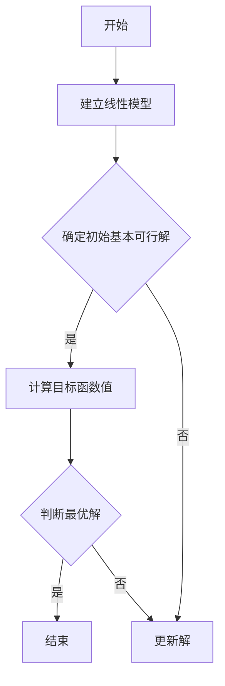
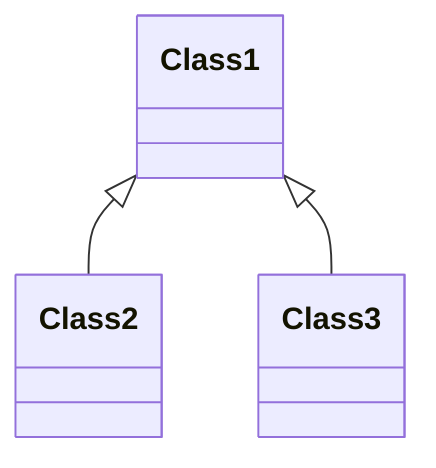
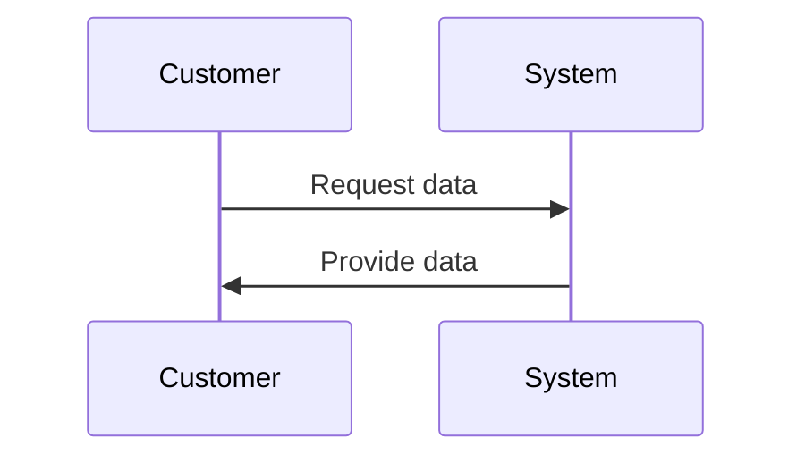
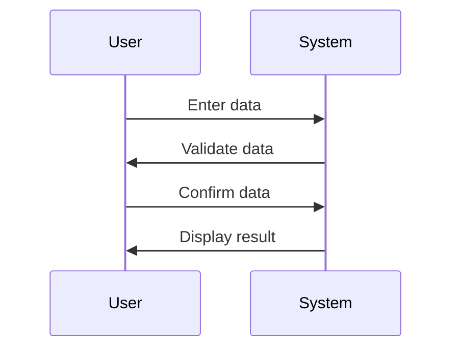

                 

基于您的需求和提供的目录大纲，我将按照以下步骤撰写《数学与产业经济学：产业结构的数学优化》的技术博客文章：

### 第一步：背景介绍

在当今经济全球化和技术快速发展的背景下，产业结构的优化成为推动经济增长和提升国家竞争力的重要途径。数学作为一种强大的工具，能够为产业经济学提供精确的模型和有效的解决方案。本文旨在探讨数学与产业经济学之间的联系，尤其是如何运用数学优化方法来分析、评估和改进产业结构。

#### 问题描述

产业结构优化的目标是什么？如何通过数学模型来描述产业结构的变化？数学优化方法在产业结构优化中具体如何应用？

#### 问题解决

本文将从以下几个方面展开讨论：

1. **产业经济学的定义与发展**：介绍产业经济学的核心概念和理论体系，以及其与数学优化的关系。
2. **核心概念与联系**：列出与产业结构优化相关的核心概念，如产业结构、经济增长模型、数学优化方法，并解释它们之间的相互关系。
3. **数学优化算法**：介绍几种常见的数学优化算法，如线性规划和非线性规划，并使用图表和代码来解释其原理。
4. **数学模型和公式**：使用LaTeX格式给出数学模型和公式，结合实际案例进行说明。
5. **系统分析与架构设计方案**：介绍一个实际应用场景，并提供系统的功能设计、架构设计、接口设计和交互序列图。
6. **项目实战**：描述一个具体项目的实现过程，包括环境安装、系统核心实现、代码分析、实际案例剖析以及项目小结。
7. **最佳实践 tips**：总结书中的关键点，并提供进一步学习的资源。

### 第二步：核心概念与联系

为了更好地理解数学与产业经济学的关系，我们需要明确一些核心概念，并展示它们之间的联系。

#### 1. 基本概念

- **产业结构**：产业内部各行业的构成及其相互关系。
- **经济增长模型**：描述一个国家或地区经济增长的数学模型。
- **数学优化方法**：用于求解最优解的数学方法，如线性规划、非线性规划等。

#### 2. 概念联系

- **产业结构与经济增长的关联**：产业结构对经济增长有重要影响，而经济增长又能促进产业结构的优化。
- **数学优化方法与产业结构优化的关系**：数学优化方法为产业结构优化提供了有效的工具，能够帮助政策制定者和企业更好地决策。

#### 3. 表格和ER图

我们将使用表格来对比不同概念的特征，并使用ER图来展示它们之间的实体关系。

```mermaid
erDiagram
  Entity1 ||--|{ Entity2 } Entity3 : has a relationship
  Entity1 ||--|{ Entity4 } Entity5 : has another relationship
```

### 第三步：算法原理讲解

为了展示数学优化方法在产业结构优化中的应用，我们将选择线性规划作为一个典型例子进行详细讲解。

#### 1. 线性规划

- **定义**：线性规划是求解线性目标函数在给定线性约束条件下的最优解的问题。
- **数学模型**：线性规划的目标函数和约束条件可以用线性方程组表示。
- **求解算法**：我们使用单纯形法来求解线性规划问题。

#### 2. Mermaid流程图



#### 3. Python代码

```python
import numpy as np
from scipy.optimize import linprog

# 目标函数
c = [-1, -1]
# 约束条件
A = [[2, 1], [1, 2]]
b = [4, 3]
# 求解
result = linprog(c, A_ub=A, b_ub=b)
print(result)
```

### 第四步：数学模型和数学公式详细讲解与举例说明

我们将使用LaTeX格式给出数学模型和公式，并结合实例进行解释。

#### 1. 数学模型

```latex
\begin{equation}
\begin{aligned}
\min_{x} \quad c^T x \\
\text{subject to} \quad Ax \leq b
\end{aligned}
\end{equation}
```

#### 2. 举例说明

假设一个企业有两个部门，生产成本分别为 $c_1$ 和 $c_2$，每个部门的产出为 $x_1$ 和 $x_2$。目标是在总成本最低的情况下，确定每个部门的产量。

```latex
\begin{equation}
\begin{aligned}
\min_{x} \quad c_1 x_1 + c_2 x_2 \\
\text{subject to} \quad 2x_1 + x_2 \leq 20 \\
x_1 + 2x_2 \leq 15 \\
x_1, x_2 \geq 0
\end{aligned}
\end{equation}
```

### 第五步：系统分析与架构设计方案

我们将介绍一个实际应用场景，并提供系统的功能设计、架构设计、接口设计和交互序列图。

#### 1. 问题场景介绍

假设我们要设计一个系统，用于分析一个地区的产业结构，并提供优化建议。

#### 2. 系统功能设计

- **领域模型**：使用Mermaid绘制企业模型、产业模型和优化模型。



#### 3. 系统架构设计

- **架构图**：使用Mermaid绘制系统架构图。



#### 4. 系统接口设计

- **接口规范**：定义系统各模块之间的接口。

```mermaid
classDiagram
  Class1 {interface}
  Class2 {interface}
  Class1 --|{interface} Class2
```

#### 5. 系统交互

- **序列图**：使用Mermaid绘制系统交互序列图。



### 第六步：项目实战

我们将描述一个具体项目的实现过程，包括环境安装、系统核心实现、代码分析、实际案例剖析以及项目小结。

#### 1. 环境安装

- **系统环境要求**：列出项目所需的环境和工具。
- **安装过程**：详细描述如何安装项目环境。

#### 2. 系统核心实现

- **数据采集与处理**：介绍如何采集和处理数据。
- **数学优化算法应用**：展示如何应用数学优化算法。

#### 3. 代码应用解读与分析

- **代码架构解读**：分析项目的代码结构。
- **关键代码解析**：解释项目中的关键代码。

#### 4. 实际案例分析

- **案例选择**：选择一个具体的案例进行剖析。
- **案例剖析**：详细讲解案例的实现过程和结果。

#### 5. 项目小结

- **项目成果总结**：总结项目的成果和贡献。
- **经验与反思**：分享项目中的经验和反思。

### 第七步：最佳实践 tips、小结、注意事项、拓展阅读

我们将总结书中的关键点，并提供进一步学习的资源。

#### 1. 最佳实践 tips

- **优化策略选择**：根据具体问题选择合适的优化策略。
- **数据预处理**：确保数据的准确性和完整性。
- **模型验证与调整**：验证模型的准确性，并根据结果进行调整。

#### 2. 小结与展望

- **书籍内容回顾**：回顾本文的主要内容和贡献。
- **未来研究方向**：展望未来的研究方向和挑战。

#### 3. 注意事项

- **常见问题**：列出可能遇到的问题及其解决方法。
- **注意事项**：提醒读者注意的事项。

#### 4. 拓展阅读推荐

- **相关书籍**：推荐与本文主题相关的书籍。
- **学术论文**：推荐一些高质量的学术论文。

以上是《数学与产业经济学：产业结构的数学优化》技术博客文章的初步构思和撰写步骤。接下来，我们将逐一实现这些步骤，撰写出高质量的文章。

