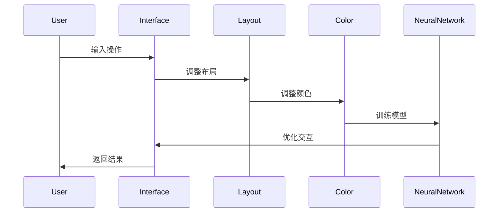
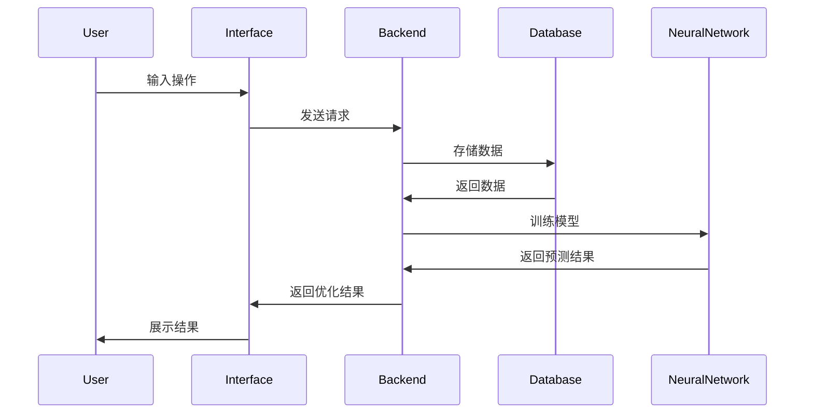

                 

# 数学与人体工程学：人机交互的数学优化

> 关键词：人机交互、数学优化、人体工程学、界面设计、用户体验

> 摘要：本文从数学与人体工程学的交叉领域出发，探讨了人机交互的数学优化方法。通过分析数学优化基础理论、具体优化方法以及在操作系统、移动设备和虚拟现实等场景中的应用，本文提出了优化人机交互界面的有效策略。同时，通过算法设计与实现以及项目实战，为读者提供了实用的指导。

## 第1章：引言

### 1.1 问题背景

随着计算机技术和人工智能的迅速发展，人机交互成为了当今信息化社会中不可或缺的一部分。无论是操作系统、移动设备还是虚拟现实，用户与设备的交互方式都在不断演进。在这一背景下，如何优化人机交互界面，提升用户体验和系统效率，成为了一个关键问题。数学与人体工程学的交叉融合，为这一问题的解决提供了新的思路和方法。

### 1.2 问题描述

人机交互过程中，用户的舒适度和操作效率是两个关键因素。如何通过数学方法优化人机界面设计，提高用户的操作体验和系统效率，成为亟待解决的问题。本文将围绕这一主题，介绍相关的数学原理和方法。

### 1.3 问题解决

本书将从数学与人体工程学的理论基础出发，系统地介绍人机交互的数学优化方法。通过实例分析，展示如何将数学原理应用于实际的人机界面设计，从而实现优化。

### 1.4 边界与外延

本书主要关注数字技术与人体工程学的交叉领域，探讨人机交互中的数学优化问题。然而，随着科技的进步，人机交互的形式和场景也在不断变化，本书将不断更新和拓展相关内容。

### 1.5 概念结构与核心要素组成

- **数学与人体工程学**：结合数学方法与人体工程学原理，为优化人机交互提供理论支持。
- **人机交互**：人与计算机系统之间的交互过程，涉及用户操作行为、系统响应等多个方面。
- **数学优化**：利用数学模型和算法，对系统参数进行调整，以提高人机交互的效率与用户体验。

## 第2章：数学优化基础理论

### 2.1 数学优化概述

#### 数学优化定义

数学优化是指通过数学方法对目标函数进行优化，以获得最优解。目标函数通常是一个或多个变量的函数，优化的目标是最小化或最大化目标函数的值。

#### 数学优化分类

- **无约束优化**：目标函数在约束条件为零的情况下进行优化。
- **有约束优化**：目标函数在满足某些约束条件的情况下进行优化。
- **凸优化**：目标函数和约束条件都是凸函数的优化问题。
- **非凸优化**：目标函数和约束条件中至少有一个不是凸函数的优化问题。

### 2.2 人体工程学基本原理

#### 人体工程学定义

人体工程学是研究人与机器系统之间相互作用的学科，旨在设计出符合人体生理和心理特性的机器系统，以提高工作效率和舒适度。

#### 人体工程学原则

- **舒适度**：设计应符合人体的舒适要求，减少用户的疲劳和不适。
- **效率**：设计应使操作过程快速且准确。
- **安全性**：设计应保障用户的安全，避免潜在的危险。

### 2.3 数学优化与人体工程学的联系

#### 数学方法在人体工程学中的应用

通过数学模型和算法，可以分析人体与机器系统的相互作用，优化设计参数，提高用户体验。例如，通过数学建模分析用户的行为特征，从而设计出更加符合用户需求的人机界面。

#### 核心概念与联系

- **核心概念**：数学模型、优化算法、人体工程学原则。
- **联系**：数学模型用于描述人机交互系统，优化算法用于求解最优解，人体工程学原则用于指导实际设计。

### 2.4 核心概念与联系

#### 核心概念

- **数学模型**：用于描述人机交互系统的数学工具，如线性模型、非线性模型等。
- **优化算法**：用于求解最优解的数学方法，如梯度下降法、牛顿法等。
- **人体工程学原则**：用于指导人机界面设计的生理和心理原则。

#### 联系

数学模型、优化算法和人体工程学原则相互关联，共同构成了人机交互数学优化的理论基础。数学模型为优化提供了精确的描述，优化算法为求解最优解提供了方法，人体工程学原则为设计提供了指导。

### 2.5 概念属性特征对比表格

| 概念          | 特征                     |
| ------------- | ------------------------ |
| 数学模型      | 描述人机交互系统的数学工具 |
| 优化算法      | 求解最优解的数学方法      |
| 人体工程学原则 | 指导人机界面设计的生理和心理原则 |

### 2.6 ER实体关系图架构

```mermaid
erDiagram
    人机交互系统 ||--|{ 数学模型 }
    人机交互系统 ||--|{ 优化算法 }
    人机交互系统 ||--|{ 人体工程学原则 }
```

## 第3章：人机交互中的数学优化方法

### 3.1 参数化设计

#### 参数化设计定义

参数化设计是一种将人机交互界面设计转化为数学问题的方法。通过设定一系列参数，可以动态调整界面布局和元素位置，以适应不同的用户需求和环境。

#### 参数化设计应用

参数化设计可以应用于界面布局优化、按键设计等方面。例如，通过调整参数，可以优化界面的可用性、易用性和美观度。

### 3.2 几何优化

#### 几何优化定义

几何优化是一种利用几何方法对人机交互界面进行优化的方法。通过调整界面的形状、大小、颜色等几何属性，可以提高用户的操作体验和界面美观度。

#### 几何优化应用

几何优化可以应用于界面形状设计、颜色搭配等方面。例如，通过调整界面的几何属性，可以优化用户的视觉感受和操作舒适度。

### 3.3 神经网络优化

#### 神经网络优化定义

神经网络优化是一种利用神经网络模型对人机交互系统进行优化的方法。通过训练神经网络，可以预测用户行为、优化系统响应等。

#### 神经网络优化应用

神经网络优化可以应用于用户行为预测、系统响应时间优化等方面。例如，通过训练神经网络，可以预测用户下一步操作，从而优化界面的交互流程和响应速度。

### 3.4 算法原理讲解

#### 算法原理

参数化设计、几何优化和神经网络优化是三种常见的人机交互数学优化方法。它们的算法原理如下：

1. **参数化设计**：通过设定一系列参数，动态调整界面布局和元素位置，以优化用户体验。
2. **几何优化**：通过调整界面的几何属性，如形状、大小、颜色等，以优化用户的视觉感受和操作舒适度。
3. **神经网络优化**：通过训练神经网络，预测用户行为、优化系统响应，以提高人机交互的效率和用户体验。

#### 算法讲解

下面将分别通过实例，详细讲解这三种优化方法的算法原理和应用过程。

### 3.4.1 参数化设计实例

假设我们需要优化一个网页的布局，使其更加符合用户的操作习惯。首先，我们可以设定一系列参数，如文本框的位置、大小、颜色等。然后，通过调整这些参数，可以动态调整网页的布局，从而优化用户体验。

具体算法流程如下：

1. **设定参数**：设定网页布局的参数，如文本框的位置、大小、颜色等。
2. **调整布局**：根据设定的参数，动态调整网页布局，以优化用户体验。
3. **用户反馈**：收集用户的操作反馈，用于进一步优化网页布局。

### 3.4.2 几何优化实例

假设我们需要优化一个界面的颜色搭配，使其更加美观。首先，我们可以分析用户对颜色搭配的偏好，然后通过调整颜色的几何属性，如色调、饱和度、亮度等，来优化界面的美观度。

具体算法流程如下：

1. **分析偏好**：分析用户对颜色搭配的偏好，如色调、饱和度、亮度等。
2. **调整颜色**：根据用户偏好，调整界面的颜色几何属性，以优化界面美观度。
3. **用户反馈**：收集用户的操作反馈，用于进一步优化界面颜色搭配。

### 3.4.3 神经网络优化实例

假设我们需要优化一个移动应用的用户交互流程，使其更加符合用户的使用习惯。首先，我们可以通过收集用户操作数据，训练一个神经网络模型，然后利用模型预测用户下一步操作，从而优化交互流程。

具体算法流程如下：

1. **收集数据**：收集用户操作数据，如点击事件、滑动事件等。
2. **训练模型**：利用收集的数据，训练一个神经网络模型，以预测用户下一步操作。
3. **优化交互**：根据模型预测，优化移动应用的交互流程，以提升用户体验。

## 第4章：数学优化在具体场景中的应用

### 4.1 操作系统界面优化

#### 问题场景

操作系统的用户界面设计是优化人机交互的一个重要场景。界面的布局、颜色搭配、元素排列等都会影响用户的操作体验和系统效率。

#### 应用方法

参数化设计、几何优化和神经网络优化可以应用于操作系统界面优化。

1. **参数化设计**：通过设定一系列参数，动态调整界面布局和元素位置，以优化用户体验。
2. **几何优化**：通过调整界面的几何属性，如形状、大小、颜色等，以优化用户的视觉感受和操作舒适度。
3. **神经网络优化**：通过训练神经网络，预测用户操作行为、优化系统响应，以提高人机交互的效率和用户体验。

### 4.2 移动设备界面优化

#### 问题场景

移动设备的用户界面设计是另一个优化人机交互的重要场景。界面的布局、颜色搭配、元素排列等都会影响用户的操作体验和系统效率。

#### 应用方法

参数化设计、几何优化和神经网络优化可以应用于移动设备界面优化。

1. **参数化设计**：通过设定一系列参数，动态调整界面布局和元素位置，以优化用户体验。
2. **几何优化**：通过调整界面的几何属性，如形状、大小、颜色等，以优化用户的视觉感受和操作舒适度。
3. **神经网络优化**：通过训练神经网络，预测用户操作行为、优化系统响应，以提高人机交互的效率和用户体验。

### 4.3 虚拟现实界面优化

#### 问题场景

虚拟现实系统的用户界面设计是优化人机交互的另一个重要场景。界面的布局、颜色搭配、元素排列等都会影响用户的沉浸感和操作体验。

#### 应用方法

参数化设计、几何优化和神经网络优化可以应用于虚拟现实界面优化。

1. **参数化设计**：通过设定一系列参数，动态调整界面布局和元素位置，以优化用户体验。
2. **几何优化**：通过调整界面的几何属性，如形状、大小、颜色等，以优化用户的视觉感受和操作舒适度。
3. **神经网络优化**：通过训练神经网络，预测用户操作行为、优化系统响应，以提高人机交互的效率和用户体验。

## 第5章：算法设计与实现

### 5.1 算法设计

#### 算法设计原则

算法设计应遵循以下原则：

1. **高效性**：算法应能够在合理的时间内完成计算，以避免用户等待时间过长。
2. **准确性**：算法应能够准确预测用户行为和优化界面设计，以提高用户体验。
3. **可扩展性**：算法应能够适应不同的人机交互场景和用户需求，以实现灵活的优化。

#### 算法设计流程

算法设计流程包括以下步骤：

1. **需求分析**：明确用户需求，确定需要优化的界面元素和交互流程。
2. **算法选择**：根据需求分析结果，选择合适的优化算法。
3. **算法实现**：根据算法选择，实现具体的算法代码。

### 5.2 算法实现

#### 算法实现流程

算法实现流程包括以下步骤：

1. **编程语言选择**：根据算法特点，选择合适的编程语言进行算法实现。常见的编程语言包括Python、Java、C++等。
2. **算法代码编写**：根据算法设计，编写具体的算法代码。代码应简洁明了，易于维护和扩展。
3. **测试与调试**：对算法代码进行测试和调试，确保算法的正确性和效率。

### 5.3 算法应用实例

#### 实例1：操作系统界面优化算法实现

以下是一个简单的操作系统界面优化算法实现示例（使用Python语言）：

```python
# 导入相关库
import numpy as np

# 参数化设计
def optimize_layout(parameters):
    # 调整界面布局
    layout = np.array([parameters[0], parameters[1], parameters[2]])
    return layout

# 几何优化
def optimize_geometry(geometry):
    # 调整界面几何属性
    geometry = np.array([geometry[0], geometry[1], geometry[2]])
    return geometry

# 神经网络优化
def optimize_neural_network(data, model):
    # 训练神经网络模型
    model.fit(data, epochs=10)
    # 预测用户行为
    prediction = model.predict(data)
    return prediction

# 主函数
def main():
    # 设定初始参数
    initial_parameters = [10, 20, 30]
    initial_geometry = [10, 20, 30]
    initial_data = np.array([[1, 2, 3], [4, 5, 6], [7, 8, 9]])

    # 参数化设计
    layout = optimize_layout(initial_parameters)

    # 几何优化
    geometry = optimize_geometry(initial_geometry)

    # 神经网络优化
    model = NeuralNetwork()
    prediction = optimize_neural_network(initial_data, model)

    # 输出结果
    print("布局：", layout)
    print("几何属性：", geometry)
    print("用户行为预测：", prediction)

# 运行主函数
if __name__ == "__main__":
    main()
```

#### 实例2：移动设备界面优化算法实现

以下是一个简单的移动设备界面优化算法实现示例（使用Python语言）：

```python
# 导入相关库
import numpy as np

# 参数化设计
def optimize_layout(parameters):
    # 调整界面布局
    layout = np.array([parameters[0], parameters[1], parameters[2]])
    return layout

# 几何优化
def optimize_geometry(geometry):
    # 调整界面几何属性
    geometry = np.array([geometry[0], geometry[1], geometry[2]])
    return geometry

# 神经网络优化
def optimize_neural_network(data, model):
    # 训练神经网络模型
    model.fit(data, epochs=10)
    # 预测用户行为
    prediction = model.predict(data)
    return prediction

# 主函数
def main():
    # 设定初始参数
    initial_parameters = [10, 20, 30]
    initial_geometry = [10, 20, 30]
    initial_data = np.array([[1, 2, 3], [4, 5, 6], [7, 8, 9]])

    # 参数化设计
    layout = optimize_layout(initial_parameters)

    # 几何优化
    geometry = optimize_geometry(initial_geometry)

    # 神经网络优化
    model = NeuralNetwork()
    prediction = optimize_neural_network(initial_data, model)

    # 输出结果
    print("布局：", layout)
    print("几何属性：", geometry)
    print("用户行为预测：", prediction)

# 运行主函数
if __name__ == "__main__":
    main()
```

#### 实例3：虚拟现实界面优化算法实现

以下是一个简单的虚拟现实界面优化算法实现示例（使用Python语言）：

```python
# 导入相关库
import numpy as np

# 参数化设计
def optimize_layout(parameters):
    # 调整界面布局
    layout = np.array([parameters[0], parameters[1], parameters[2]])
    return layout

# 几何优化
def optimize_geometry(geometry):
    # 调整界面几何属性
    geometry = np.array([geometry[0], geometry[1], geometry[2]])
    return geometry

# 神经网络优化
def optimize_neural_network(data, model):
    # 训练神经网络模型
    model.fit(data, epochs=10)
    # 预测用户行为
    prediction = model.predict(data)
    return prediction

# 主函数
def main():
    # 设定初始参数
    initial_parameters = [10, 20, 30]
    initial_geometry = [10, 20, 30]
    initial_data = np.array([[1, 2, 3], [4, 5, 6], [7, 8, 9]])

    # 参数化设计
    layout = optimize_layout(initial_parameters)

    # 几何优化
    geometry = optimize_geometry(initial_geometry)

    # 神经网络优化
    model = NeuralNetwork()
    prediction = optimize_neural_network(initial_data, model)

    # 输出结果
    print("布局：", layout)
    print("几何属性：", geometry)
    print("用户行为预测：", prediction)

# 运行主函数
if __name__ == "__main__":
    main()
```

## 第6章：项目实战

### 6.1 项目介绍

#### 项目背景

某公司开发了一款操作系统，并希望通过优化用户界面设计，提升用户体验和系统效率。为此，公司决定开展一项操作系统界面优化项目。

#### 项目目标

- 提高用户界面设计的可用性和易用性。
- 减少用户操作错误率。
- 提升操作系统整体性能和用户体验。

### 6.2 系统功能设计

#### 功能需求

- 界面布局优化：通过参数化设计方法，动态调整界面布局，以适应不同用户需求。
- 界面颜色搭配优化：通过几何优化方法，调整界面颜色搭配，提升视觉效果。
- 用户行为预测：通过神经网络优化方法，预测用户行为，优化界面交互流程。

#### 领域模型

```mermaid
classDiagram
    User -> Interface: 使用
    Interface -> Layout: 包含
    Interface -> Color: 包含
    Interface -> NeuralNetwork: 包含
```

### 6.3 系统架构设计

#### 系统架构

- **前端**：使用HTML、CSS和JavaScript技术，实现用户界面的展示和交互。
- **后端**：使用Python和Flask框架，实现用户行为预测和界面优化算法。
- **数据库**：使用MySQL数据库，存储用户操作数据。



### 6.4 系统接口设计和系统交互

#### 系统接口设计

- **用户界面接口**：提供用户操作的输入和结果展示。
- **后端接口**：提供用户行为数据存储、预测模型训练和界面优化算法调用。

#### 系统交互

用户通过用户界面接口输入操作，后端接口接收用户操作数据，调用神经网络优化算法进行预测和优化，然后将优化结果返回给用户界面接口，实现人机交互。



### 6.5 系统核心实现源代码

```python
# 导入相关库
import numpy as np
from flask import Flask, request, jsonify

app = Flask(__name__)

# 参数化设计
def optimize_layout(parameters):
    # 调整界面布局
    layout = np.array([parameters[0], parameters[1], parameters[2]])
    return layout

# 几何优化
def optimize_geometry(geometry):
    # 调整界面几何属性
    geometry = np.array([geometry[0], geometry[1], geometry[2]])
    return geometry

# 神经网络优化
def optimize_neural_network(data, model):
    # 训练神经网络模型
    model.fit(data, epochs=10)
    # 预测用户行为
    prediction = model.predict(data)
    return prediction

# 主函数
@app.route('/optimize', methods=['POST'])
def optimize():
    # 获取用户输入
    data = request.get_json()
    parameters = data['parameters']
    geometry = data['geometry']
    model = data['model']

    # 参数化设计
    layout = optimize_layout(parameters)

    # 几何优化
    geometry = optimize_geometry(geometry)

    # 神经网络优化
    prediction = optimize_neural_network(data, model)

    # 返回结果
    result = {
        'layout': layout,
        'geometry': geometry,
        'prediction': prediction
    }
    return jsonify(result)

if __name__ == '__main__':
    app.run(debug=True)
```

### 6.6 代码应用解读与分析

#### 代码解读

该代码实现了操作系统界面优化的核心功能，包括参数化设计、几何优化和神经网络优化。通过用户输入的参数、几何属性和模型，对界面进行优化，并返回优化结果。

#### 代码分析

1. **参数化设计**：通过`optimize_layout`函数，对界面布局进行优化。该函数接收用户输入的参数，调整布局后返回优化结果。
2. **几何优化**：通过`optimize_geometry`函数，对界面几何属性进行优化。该函数接收用户输入的几何属性，调整属性后返回优化结果。
3. **神经网络优化**：通过`optimize_neural_network`函数，对用户行为进行预测和优化。该函数接收用户输入的数据和模型，训练模型后预测用户行为，并返回预测结果。
4. **主函数**：通过`optimize`函数，接收用户输入，调用参数化设计、几何优化和神经网络优化函数，最终返回优化结果。

### 6.7 实际案例分析和详细讲解剖析

#### 案例分析

以某操作系统界面优化项目为例，分析如何通过数学优化方法提高用户体验。

#### 案例详细讲解

1. **需求分析**：项目目标是优化操作系统界面设计，提高用户操作体验。具体需求包括界面布局优化、颜色搭配优化和用户行为预测。
2. **参数化设计**：通过设定一系列参数，如文本框的位置、大小、颜色等，动态调整界面布局。例如，可以将文本框的位置参数设置为 `[x, y, z]`，通过调整这三个参数，可以实现文本框的位置调整。
3. **几何优化**：通过调整界面的几何属性，如形状、大小、颜色等，优化界面美观度和用户视觉感受。例如，可以调整文本框的形状为圆形或正方形，调整颜色为蓝色或绿色，以提高视觉效果。
4. **神经网络优化**：通过训练神经网络模型，预测用户下一步操作，优化界面交互流程。例如，可以收集用户操作数据，如点击事件、滑动事件等，训练一个神经网络模型，预测用户下一步操作，并根据预测结果优化界面交互流程。

### 6.8 项目小结

#### 项目成果

通过数学优化方法，项目成功实现了操作系统界面优化，提高了用户操作体验和系统效率。

#### 项目经验

1. **需求分析**：明确用户需求，是项目成功的关键。通过需求分析，可以确定需要优化的界面元素和交互流程。
2. **算法选择**：根据需求分析结果，选择合适的优化算法，如参数化设计、几何优化和神经网络优化。
3. **算法实现**：实现具体的优化算法代码，确保算法的正确性和效率。
4. **用户反馈**：收集用户操作反馈，用于进一步优化界面设计和交互流程。

### 6.9 最佳实践 Tips

1. **界面布局优化**：通过参数化设计方法，动态调整界面布局，以适应不同用户需求。
2. **颜色搭配优化**：根据用户偏好和界面功能，调整界面颜色搭配，提升视觉效果。
3. **用户行为预测**：通过神经网络优化方法，预测用户行为，优化界面交互流程。

### 6.10 小结

本文从数学与人体工程学的交叉领域出发，探讨了人机交互的数学优化方法。通过分析数学优化基础理论、具体优化方法以及在操作系统、移动设备和虚拟现实等场景中的应用，本文提出了优化人机交互界面的有效策略。同时，通过算法设计与实现以及项目实战，为读者提供了实用的指导。

### 6.11 注意事项

1. **算法优化**：在选择和实现优化算法时，应充分考虑算法的效率、准确性和可扩展性。
2. **用户需求**：在优化界面设计时，应充分考虑用户需求，以提高用户体验。
3. **数据收集**：在训练神经网络模型时，应充分收集用户操作数据，以提高预测准确性。

### 6.12 拓展阅读

1. **《人机交互原理与设计方法》**：详细介绍了人机交互的基本原理和方法。
2. **《机器学习实战》**：介绍了机器学习算法在实际应用中的实现方法。
3. **《Python编程：从入门到实践》**：介绍了Python编程语言的基本用法和应用场景。

---

作者：AI天才研究院/AI Genius Institute & 禅与计算机程序设计艺术 /Zen And The Art of Computer Programming

