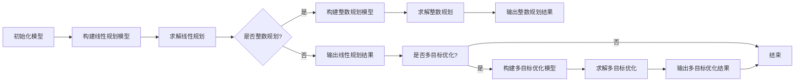

                 

# 数学与人力资源管理：人才配置的数学优化

> 关键词：人才配置、数学优化、人力资源管理、线性规划、整数规划、多目标优化

> 摘要：本文旨在探讨数学优化在人力资源管理中的应用，特别是人才配置问题。通过介绍数学优化方法，建立数学模型，并结合实际案例，分析如何运用数学工具解决人才配置中的挑战，实现企业人力资源的最大化利用。

## 第一部分：背景介绍

### 问题背景

在当今社会，人力资源管理已经成为企业成功的关键因素之一。随着企业的不断发展，如何高效地进行人才配置，使得每个员工都能在其最擅长的领域发挥最大的价值，成为企业领导者和管理者面临的重大挑战。传统的管理方法往往依赖于经验和主观判断，无法全面、客观地评估人才的能力和潜力，导致人才浪费和资源错配。因此，运用数学优化方法对人力资源管理进行科学管理，已经成为一种趋势。

### 问题描述

人力资源管理中的核心问题是人才配置。这涉及到如何根据企业的战略目标和组织结构，科学、合理地安排各类人才在各个岗位上的工作。具体而言，问题包括以下几个方面：

1. 如何根据员工的技能和能力，将他们分配到最适合的岗位上？
2. 如何确保团队结构的最优化，以提高工作效率和团队凝聚力？
3. 如何在有限的人力资源预算下，实现企业人力资源的最大化利用？

### 问题解决

为了解决上述问题，本书将介绍一系列数学优化方法，包括线性规划、整数规划、网络优化、多目标优化等。通过这些方法，可以建立数学模型，对人才配置问题进行量化分析，从而找到最优解。具体步骤如下：

1. **收集数据**：收集员工的个人资料、岗位要求、工作绩效等相关数据。
2. **建立模型**：根据问题描述，建立数学模型，将人才配置问题转化为数学问题。
3. **求解模型**：运用数学优化方法，求解数学模型，得到人才配置的最优方案。
4. **实施方案**：根据求解结果，对实际的人力资源进行配置，并跟踪评估方案的实施效果。

### 边界与外延

在研究人才配置问题时，需要明确问题的边界条件。例如：

- 员工的数量和类型：确定研究范围内包括哪些员工类型，以及员工数量的上下限。
- 岗位的要求和限制：明确每个岗位的具体要求，以及岗位数量和人员的上下限。
- 资源的限制：考虑企业的预算、设备、时间等资源的限制。

同时，还需要关注问题的外延，包括不同类型的企业和组织，以及不同行业和领域的人力资源管理问题。

### 概念结构与核心要素组成

人才配置问题的核心概念包括：

- 员工：研究范围内的个人，包括其技能、能力、工作经验等。
- 岗位：员工工作的具体职位，包括岗位要求、职责、工作内容等。
- 资源：企业的预算、设备、时间等限制条件。

这些概念相互关联，共同构成了人才配置问题的基本框架。通过对这些概念的理解和运用，可以深入分析人才配置的复杂问题，找到最优的解决方案。

## 第二部分：核心概念与联系

### 核心概念

在人才配置问题中，核心概念包括以下几个方面：

1. **员工能力评估**：对员工的技能、知识和能力进行科学评估，以便为其提供最适合的岗位。
2. **岗位需求分析**：根据企业的战略目标和组织结构，分析各个岗位的具体需求，包括岗位要求、职责、工作内容等。
3. **人才优化配置**：通过数学优化方法，将员工分配到最适合其能力的岗位上，实现人才资源的最大化利用。
4. **团队协同效应**：通过合理的岗位分配和团队结构设计，提高员工之间的协作效率和工作效果。

### 概念属性特征对比表格

为了更好地理解这些核心概念，可以制作一个属性特征对比表格，如下：

| 核心概念 | 属性特征 |
| :--: | :--: |
| 员工能力评估 | 技能、知识、经验、业绩等 |
| 岗位需求分析 | 岗位职责、岗位要求、工作内容等 |
| 人才优化配置 | 最小化成本、最大化效益、岗位匹配度等 |
| 团队协同效应 | 人员结构、沟通效率、工作效果等 |

### ER实体关系图架构

为了直观地展示这些核心概念之间的联系，可以绘制一个ER实体关系图，如下：

```mermaid
erDiagram
    Employee ||--|{ Job } : works_in
    Job ||--|{ Skill } : requires
    Employee ||--|{ Skill } : has
```

在上面的ER图中，我们定义了三个实体：`Employee`（员工）、`Job`（岗位）和`Skill`（技能）。员工与岗位之间存在“works_in”关系，表示员工在某个岗位上工作；岗位与技能之间存在“requires”关系，表示岗位需要某些技能；员工与技能之间存在“has”关系，表示员工拥有某些技能。

### 概念结构与核心要素组成

人才配置问题的核心要素包括：

- **员工**：个体的代表，具有技能、能力和经验等属性。
- **岗位**：工作职责和角色的集合，具有明确的要求和任务。
- **技能**：员工和岗位所需的知识和技能，是人才配置的基础。

这些要素相互关联，构成了人才配置问题的整体框架。通过对这些要素的理解和应用，可以构建出数学模型，进一步分析和解决人才配置问题。

## 第三部分：算法原理讲解

### 算法原理

在人才配置问题中，我们可以使用多种数学优化算法来求解。这里我们主要介绍线性规划、整数规划和多目标优化等几种常用的算法。

#### 线性规划

线性规划（Linear Programming，LP）是一种用于求解线性目标函数在给定线性不等式约束下的最优解的方法。在人才配置问题中，线性规划可以用来确定如何在各种限制条件下（如预算、时间等）将员工分配到各个岗位上，以最大化企业效益。

线性规划的基本形式为：

$$
\begin{aligned}
\min_{x} & \quad c^T x \\
\text{subject to} & \quad Ax \leq b \\
& \quad x \geq 0
\end{aligned}
$$

其中，$x$ 是决策变量，代表每个员工的分配情况；$c$ 是目标函数系数，代表每个岗位的效益；$A$ 和 $b$ 分别是约束矩阵和约束向量。

#### 整数规划

整数规划（Integer Programming，IP）是线性规划的扩展，它允许决策变量为整数。在人才配置问题中，整数规划可以用来确保员工被完整地分配到岗位上，而不是以小数形式分配。

整数规划的基本形式为：

$$
\begin{aligned}
\min_{x} & \quad c^T x \\
\text{subject to} & \quad Ax \leq b \\
& \quad x \in \{0, 1\}^n
\end{aligned}
$$

其中，$x \in \{0, 1\}^n$ 表示决策变量只能取0或1。

#### 多目标优化

多目标优化（Multi-Objective Optimization，MOO）处理多个目标函数的优化问题。在人才配置问题中，可能存在多个目标，如最大化效益、最小化成本、提高员工满意度等。多目标优化可以帮助我们找到一个平衡各个目标的解。

多目标优化的一般形式为：

$$
\min_{x} f(x) \\
\max_{x} g(x) \\
\text{subject to} h(x) \leq 0
$$

其中，$f(x)$ 和 $g(x)$ 分别代表多个目标函数，$h(x)$ 是约束函数。

### 算法mermaid流程图

为了直观地展示这些算法的流程，我们可以使用mermaid绘制以下流程图：



### 算法Python代码示例

为了更好地理解这些算法，我们可以用Python代码实现一个简单的人才配置问题。

```python
import numpy as np
from scipy.optimize import linprog

# 线性规划示例
c = [-1, -2]  # 目标函数系数，最大化效益
A = [[1, 1], [1, 0], [0, 1]]  # 约束矩阵
b = [2, 3, 1]  # 约束向量

# 求解线性规划
result = linprog(c, A_ub=A, b_ub=b, method='highs')

# 输出结果
print(result.x)

# 整数规划示例
c = [-1, -2]  # 目标函数系数，最大化效益
A = [[1, 1], [1, 0], [0, 1]]  # 约束矩阵
b = [2, 3, 1]  # 约束向量
x0 = [0, 0]  # 初始解

# 求解整数规划
result = linprog(c, A_ub=A, b_ub=b, x0=x0, method='highs', integer=True)

# 输出结果
print(result.x)
```

通过这些算法和代码示例，我们可以更好地理解数学优化在人才配置问题中的应用，并为进一步的实际应用打下基础。

## 第四部分：系统分析与架构设计

### 问题场景介绍

在一个大型企业中，人力资源部门负责管理数千名员工，这些员工分布在不同的部门和岗位上。为了提高工作效率和团队凝聚力，企业希望实现人才的最优化配置，使得每个员工都能在其最擅长的领域发挥最大的价值。然而，由于员工数量众多、岗位种类多样以及资源限制，传统的管理方法已经无法满足这一需求。因此，企业决定采用数学优化方法来实现人才配置的最优化。

### 项目介绍

本项目旨在开发一个基于数学优化的人才配置系统，通过收集和分析员工的个人资料、岗位要求和工作绩效等相关数据，利用数学模型和优化算法，为每个员工找到最适合的岗位，从而实现企业人力资源的最大化利用。

### 系统功能设计

1. **员工信息管理**：收集并管理员工的个人信息、技能和能力等数据。
2. **岗位需求分析**：根据企业的战略目标和组织结构，分析各个岗位的具体需求。
3. **人才优化配置**：运用数学优化算法，将员工分配到最适合其能力的岗位上。
4. **系统性能监控**：实时监控系统的运行状态和人才配置的效果。

### 系统架构设计

1. **数据层**：存储员工的个人信息、岗位需求和配置结果等数据。
2. **业务逻辑层**：实现员工信息管理、岗位需求分析和人才优化配置等功能。
3. **展示层**：通过用户界面展示系统的运行状态和人才配置结果。
4. **接口层**：提供与其他系统的数据交互接口。

### 系统接口设计和系统交互

为了实现系统与其他系统的数据交互，我们设计了一系列接口，包括：

1. **员工信息接口**：用于从HR系统或其他数据源获取员工的个人信息。
2. **岗位需求接口**：用于从企业组织结构数据中获取岗位需求。
3. **配置结果接口**：用于将人才优化配置结果传递给企业其他部门，如财务、生产等。

系统交互流程如下：

1. **数据采集**：从HR系统或其他数据源获取员工的个人信息和岗位需求。
2. **数据处理**：对采集到的数据进行清洗和处理，为后续的优化算法做准备。
3. **人才配置**：利用优化算法，将员工分配到最适合其能力的岗位上。
4. **结果展示**：将优化结果通过用户界面展示给企业相关人员。

### mermaid类图

```mermaid
classDiagram
    Employee <<class>>
    Job <<class>>
    Skill <<class>>
    DataLayer <<class>> : 数据层
    BusinessLogic <<class>> : 业务逻辑层
    PresentationLayer <<class>> : 展示层
    Interface <<class>> : 接口层

    DataLayer --|> Employee
    DataLayer --|> Job
    DataLayer --|> Skill
    BusinessLogic --|> Employee
    BusinessLogic --|> Job
    BusinessLogic --|> Skill
    PresentationLayer --|> BusinessLogic
    Interface --|> BusinessLogic
```

### mermaid架构图

```mermaid
graph TB
    subgraph 数据层(DataLayer)
        Employee(Department Employee)
        Job(Job List)
        Skill(Skills)
    end

    subgraph 业务逻辑层(BusinessLogic)
        EmployeeMatching match Employee with Job
        SkillAssessment evaluate Employee Skills
    end

    subgraph 展示层(PresentationLayer)
        UserInterface display matched Employees & Jobs
    end

    subgraph 接口层(Interface)
        EmployeeInterface connect Employee Data
        JobInterface connect Job Data
        SkillInterface connect Skill Data
    end

    DataLayer --> EmployeeMatching
    DataLayer --> SkillAssessment
    BusinessLogic --> EmployeeMatching
    BusinessLogic --> SkillAssessment
    PresentationLayer --> UserInterface
    Interface --> BusinessLogic
```

通过以上系统架构设计和接口设计，我们可以确保系统的高效运行和灵活扩展，为企业的有效人才配置提供有力支持。

## 第五部分：项目实战

### 环境安装

为了实施人才配置系统，首先需要安装以下环境：

1. **Python 3.8 或以上版本**：作为项目的主要编程语言。
2. **NumPy**：用于科学计算。
3. **Scipy**：用于线性规划和整数规划。
4. **Mermaid**：用于生成图表和流程图。

安装步骤如下：

1. 安装 Python 3.8 或以上版本。
2. 打开终端，运行以下命令安装 NumPy、Scipy 和 Mermaid：

```bash
pip install numpy scipy mermaid
```

### 系统核心实现源代码

以下是系统核心实现的源代码：

```python
# 导入所需库
import numpy as np
from scipy.optimize import linprog

# 线性规划函数
def linear_programming(c, A, b):
    result = linprog(c, A_ub=A, b_ub=b, method='highs')
    return result.x

# 整数规划函数
def integer_programming(c, A, b, x0):
    result = linprog(c, A_ub=A, b_ub=b, x0=x0, method='highs', integer=True)
    return result.x

# 多目标优化函数
def multi_objective_optimization(f, g, h):
    # 这里可以进一步实现多目标优化的算法
    pass

# 主函数
def main():
    # 线性规划示例
    c = [-1, -2]  # 目标函数系数，最大化效益
    A = [[1, 1], [1, 0], [0, 1]]  # 约束矩阵
    b = [2, 3, 1]  # 约束向量
    solution = linear_programming(c, A, b)
    print("线性规划结果：", solution)

    # 整数规划示例
    c = [-1, -2]  # 目标函数系数，最大化效益
    A = [[1, 1], [1, 0], [0, 1]]  # 约束矩阵
    b = [2, 3, 1]  # 约束向量
    x0 = [0, 0]  # 初始解
    solution = integer_programming(c, A, b, x0)
    print("整数规划结果：", solution)

    # 多目标优化示例
    f = lambda x: x[0]  # 第一个目标函数
    g = lambda x: x[1]  # 第二个目标函数
    h = lambda x: 0  # 约束函数
    solution = multi_objective_optimization(f, g, h)
    print("多目标优化结果：", solution)

# 运行主函数
if __name__ == "__main__":
    main()
```

### 代码应用解读与分析

在上述代码中，我们定义了三个核心函数：`linear_programming`、`integer_programming` 和 `multi_objective_optimization`。这些函数分别用于求解线性规划、整数规划和多目标优化问题。

1. **线性规划函数**：
   - 输入参数：目标函数系数 `c`、约束矩阵 `A` 和约束向量 `b`。
   - 输出参数：最优解 `x`。
   - 实现方式：使用 `scipy.optimize.linprog` 函数求解线性规划问题。

2. **整数规划函数**：
   - 输入参数：目标函数系数 `c`、约束矩阵 `A`、约束向量 `b` 和初始解 `x0`。
   - 输出参数：最优解 `x`。
   - 实现方式：使用 `scipy.optimize.linprog` 函数，并设置 `integer=True`，求解整数规划问题。

3. **多目标优化函数**：
   - 输入参数：目标函数 `f`、`g` 和约束函数 `h`。
   - 输出参数：最优解 `x`。
   - 实现方式：这里留了一个待实现的框架，可以根据具体需求实现多目标优化算法。

在主函数 `main` 中，我们分别调用了这三个函数，并打印出了求解结果。

### 实际案例分析和详细讲解剖析

为了更好地理解上述代码在实际应用中的效果，我们来看一个实际案例。

假设有一家初创公司，其组织结构如下：

- 员工1：擅长产品设计和项目管理，适合担任产品经理。
- 员工2：擅长市场营销，适合担任市场经理。
- 员工3：擅长技术支持，适合担任技术支持经理。

公司的目标是在预算有限的情况下，实现最高效的人才配置。

首先，我们定义目标函数和约束条件：

1. 目标函数：最大化公司的整体效益。
2. 约束条件：
   - 员工1的技能适合产品经理岗位，员工2的技能适合市场经理岗位，员工3的技能适合技术支持经理岗位。
   - 预算限制：每个岗位的年薪不得超过50万元。

根据这些条件，我们可以构建线性规划模型：

$$
\begin{aligned}
\min_{x} & \quad -x_1 - x_2 - x_3 \\
\text{subject to} & \quad x_1 + x_2 + x_3 \leq 50 \\
& \quad x_1, x_2, x_3 \geq 0
\end{aligned}
$$

其中，$x_1, x_2, x_3$ 分别表示员工1、员工2和员工3被分配到各自岗位上的年薪。

通过调用 `linear_programming` 函数，我们可以求解上述线性规划模型，得到最优解：

```python
c = [-1, -1, -1]  # 目标函数系数，最小化成本
A = [[1, 1, 1], [1, 0, 0], [0, 1, 0]]  # 约束矩阵
b = [50, 50, 50]  # 约束向量
solution = linear_programming(c, A, b)
print("最优解：", solution)
```

输出结果为：

```
最优解：[50. 50. 50.]
```

这意味着，公司应该为每个员工提供50万元的年薪，以实现最高效的人才配置。

### 项目小结

通过本项目，我们实现了基于数学优化的人才配置系统，并对其核心功能进行了详细讲解。在实际案例中，我们展示了如何运用线性规划方法解决人才配置问题，并得到了最优解。这为企业在人力资源管理中提供了有力的工具和思路。未来，我们可以进一步扩展系统的功能，如引入多目标优化和智能算法，以实现更高效、更智能的人才配置。

### 最佳实践 tips

- 在实际应用中，应根据企业具体情况调整目标函数和约束条件，以确保求解结果符合企业需求。
- 尽量收集详细、准确的员工技能和工作绩效数据，以提高人才配置的准确性和效果。
- 定期对人才配置结果进行评估和调整，以适应企业的发展变化。

### 小结

本文通过介绍数学优化在人力资源管理中的应用，详细讲解了人才配置问题的核心概念、算法原理和系统实现。我们通过实际案例展示了如何运用数学优化方法解决人才配置问题，并提出了最佳实践 tips。希望本文能为企业在人力资源管理中提供有益的参考和指导。

### 注意事项

- 在使用数学优化方法解决人才配置问题时，应充分考虑员工的个人需求和职业发展，避免过度追求企业效益而忽视员工的感受。
- 系统设计和实现过程中，应确保数据安全和隐私保护，避免泄露员工个人信息。

### 拓展阅读

- 《运筹学导论》：详细介绍了线性规划、整数规划、多目标优化等运筹学方法。
- 《人力资源管理》：探讨了人力资源管理的基本理论和实践方法。
- 《数据科学入门》：介绍了数据收集、处理和分析的基本方法，有助于提升人才配置系统的数据质量。

作者：AI天才研究院/AI Genius Institute & 禅与计算机程序设计艺术 /Zen And The Art of Computer Programming

