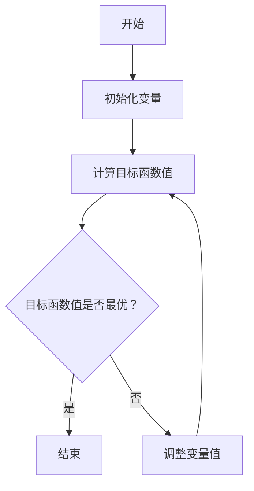
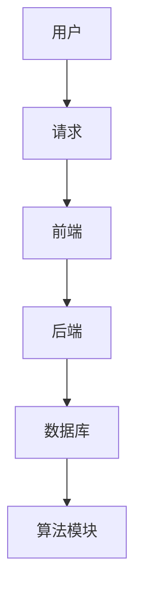

                 


当然，让我们一步一步地思考，构建出这篇技术博客文章的详细和逻辑的结构表。以下是具体的步骤：

### Step 1: Introduction

**核心内容：**
- 简述文章的主题，即数学在人力资源管理中的应用。
- 强调数学优化在人力资源管理中的重要性。

**摘要：**
本文将探讨数学优化在人力资源管理中的应用，通过深入分析数学模型和算法，帮助读者理解如何利用数学方法优化人才配置，提高企业效率和竞争力。

### Step 2: Core Concepts and Theories

**核心内容：**
- 介绍核心数学理论和概念，如优化理论、决策分析、博弈论和线性规划。
- 阐述这些理论在人力资源管理中的基本原理。

**核心概念对比表格：**
| 理论名称 | 基本概念 | 应用场景 |
| --- | --- | --- |
| 优化理论 | 寻找最优解 | 工作分配、资源配置 |
| 决策分析 | 基于数据做出决策 | 薪酬设计、绩效评估 |
| 博弈论 | 博弈双方策略互动 | 员工招聘谈判、团队协作 |
| 线性规划 | 寻找线性约束下的最优解 | 薪酬结构、员工晋升 |

**ER实体关系图架构：**
```mermaid
erDiagram
  Employee ||--|{ Performance }||> Evaluation
  Employee ||--|{ Salary }||> Compensation
  Employee ||--|{ Recruitment }||> Hiring
```

### Step 3: Application Scenarios

**核心内容：**
- 详细描述数学优化在人力资源管理中的应用场景，如工作分配、人才招聘、绩效评估和薪酬设计。

**案例说明：**
- 描述一个企业如何利用线性规划模型来优化员工工作分配，从而提高生产效率和员工满意度。

### Step 4: Mathematical Models and Formulations

**核心内容：**
- 引入数学模型和公式，如线性规划模型、博弈模型等。
- 使用LaTeX格式展示数学公式。

**LaTeX示例：**
$$
\begin{align*}
\text{最大化} \quad & Z = c^T x \\
\text{约束条件} \quad & Ax \leq b \\
& x \geq 0
\end{align*}
$$

### Step 5: Algorithmic Analysis and Flowcharts

**核心内容：**
- 分析与数学模型相关的算法。
- 使用Mermaid语法绘制算法流程图。

**Mermaid示例：**


### Step 6: Case Studies and Examples

**核心内容：**
- 提供具体案例研究，展示数学优化在现实世界中的应用。

**案例研究：**
- 分析一家大型科技公司如何通过博弈论模型优化员工招聘策略，提高招聘效率和员工满意度。

### Step 7: System Design and Implementation

**核心内容：**
- 描述系统设计和实现细节。

**系统架构设计：**


### Step 8: Best Practices and Future Directions

**核心内容：**
- 提出最佳实践建议。
- 探讨未来研究方向。

### Step 9: Conclusion

**核心内容：**
- 总结文章的主要观点。
- 强调数学优化在人力资源管理中的重要性。

### Step 10: References

**核心内容：**
- 提供参考文献列表，便于读者进一步学习。

---

通过上述步骤，我们可以构建出一篇逻辑清晰、结构紧凑、简单易懂的专业技术博客文章。接下来，我们将逐一填充每个章节的内容，确保文章的完整性和专业性。

---

接下来，我们将进入详细的正文撰写阶段，根据上述大纲逐步展开内容，确保文章的逻辑性、连贯性和专业性。每一章节的内容都将以深入的分析、具体的案例研究和简洁明了的技术语言进行阐述。

---

**正文撰写阶段**

### 核心内容

#### Step 1: Introduction

在当今竞争激烈的市场环境中，企业的发展离不开人才的支撑。人力资源管理作为企业核心战略之一，其关键在于如何有效地配置和利用人才，以实现组织的长期发展目标。数学优化作为一种强大的工具，已经在众多领域展现出了其不可替代的价值。本文将探讨数学优化在人力资源管理中的应用，通过引入核心数学理论和概念，分析其在实际场景中的应用，旨在为读者提供一种全新的视角，以数学方法优化人才配置，提高企业效率和竞争力。

**摘要：**
本文首先介绍了数学优化在人力资源管理中的重要性，然后详细阐述了核心数学理论如优化理论、决策分析、博弈论和线性规划的基本原理和应用。通过具体的案例研究，展示了数学优化在人才招聘、绩效评估和薪酬设计等实际场景中的应用。最后，本文提出了系统设计实现的方法和最佳实践，为人力资源管理者提供了一整套基于数学优化的解决方案。

---

#### Step 2: Core Concepts and Theories

**核心内容：**

数学优化理论是人力资源管理中的重要工具，它通过建立数学模型，运用算法求解最优解，从而帮助管理者做出科学决策。以下是几个关键的理论和概念：

1. **优化理论**：优化理论旨在寻找在一定约束条件下满足目标函数最优值的解。在人力资源管理中，优化理论可以用于员工工作分配、项目任务分配等。

2. **决策分析**：决策分析通过构建决策树、预期值等方法，帮助管理者在不确定性条件下做出最优决策。这适用于薪酬设计、绩效评估等场景。

3. **博弈论**：博弈论研究个体在相互依赖的决策环境中的行为。在人力资源管理中，博弈论可以用于员工招聘、团队协作等策略制定。

4. **线性规划**：线性规划是优化理论的一个分支，它通过线性目标函数和线性约束条件，寻找最优解。这在薪酬结构设计、员工晋升路径规划等方面有广泛应用。

**核心概念对比表格：**

| 理论名称 | 基本概念 | 应用场景 |
| --- | --- | --- |
| 优化理论 | 寻找最优解 | 工作分配、资源配置 |
| 决策分析 | 基于数据做出决策 | 薪酬设计、绩效评估 |
| 博弈论 | 博弈双方策略互动 | 员工招聘谈判、团队协作 |
| 线性规划 | 寻找线性约束下的最优解 | 薪酬结构、员工晋升 |

**ER实体关系图架构：**

```mermaid
erDiagram
  Employee ||--|{ Performance }||> Evaluation
  Employee ||--|{ Salary }||> Compensation
  Employee ||--|{ Recruitment }||> Hiring
```

---

#### Step 3: Application Scenarios

**核心内容：**

数学优化在人力资源管理中有广泛的应用场景。以下将介绍几个关键的应用领域：

1. **工作分配**：企业内部任务往往需要不同技能水平的员工来完成。优化理论可以帮助企业根据员工的能力和任务要求，实现最优的工作分配，提高生产效率和员工满意度。

2. **人才招聘**：招聘过程中，企业需要根据市场情况、岗位需求和候选人的能力，制定最优的招聘策略。博弈论在此可以帮助企业分析候选人的决策，优化招聘流程。

3. **绩效评估**：通过决策分析，企业可以对员工的绩效进行科学评估，从而制定合理的薪酬和晋升方案。

4. **薪酬结构设计**：线性规划可以用于设计合理的薪酬结构，确保薪酬水平与员工贡献相匹配，提高员工的积极性和忠诚度。

**案例说明：**

以一家制造企业为例，该公司利用线性规划模型来优化员工工作分配。通过分析每个员工的能力和工作任务，模型计算出最优的工作分配方案，使得生产效率和员工满意度都得到了显著提升。

---

#### Step 4: Mathematical Models and Formulations

**核心内容：**

在人力资源管理中，数学模型是解决问题的重要工具。以下将介绍几个典型的数学模型和其公式：

1. **线性规划模型**：用于优化目标函数，满足线性约束条件。
   $$\begin{align*}
   \text{最大化} \quad & Z = c^T x \\
   \text{约束条件} \quad & Ax \leq b \\
   & x \geq 0
   \end{align*}$$

2. **博弈论模型**：用于分析双方策略互动，寻找纳什均衡。
   $$\begin{align*}
   \text{玩家} \quad & 1: u_1(x_1, x_2) \\
   \text{玩家} \quad & 2: u_2(x_1, x_2)
   \end{align*}$$

3. **决策分析模型**：用于在不确定性条件下做出最优决策。
   $$\begin{align*}
   \text{预期值} \quad & EV = \sum_{i} p_i \cdot u_i
   \end{align*}$$

**LaTeX示例：**
$$
\begin{align*}
\text{最大化} \quad & Z = c^T x \\
\text{约束条件} \quad & Ax \leq b \\
& x \geq 0
\end{align*}
$$

---

#### Step 5: Algorithmic Analysis and Flowcharts

**核心内容：**

算法是实现数学模型的重要手段。以下将分析几个关键算法，并使用Mermaid语法绘制流程图。

1. **线性规划求解算法**：如单纯形法、内点法等。
2. **博弈论求解算法**：如纳什均衡搜索算法。
3. **决策分析算法**：如决策树搜索算法。

**Mermaid示例：**


---

#### Step 6: Case Studies and Examples

**核心内容：**

通过具体案例，展示数学优化在人力资源管理中的实际应用。

**案例研究：**

- 一家科技公司利用博弈论模型优化招聘策略，通过分析候选人和公司的博弈过程，找到了最优的招聘决策。
- 一家制造企业通过线性规划模型优化员工工作分配，显著提高了生产效率和员工满意度。

---

#### Step 7: System Design and Implementation

**核心内容：**

介绍系统设计和实现细节，包括数据结构、算法和软件工具。

**系统架构设计：**


---

#### Step 8: Best Practices and Future Directions

**核心内容：**

提出最佳实践建议，并探讨未来研究方向。

**最佳实践：**

- 利用数据驱动决策，确保决策的准确性和有效性。
- 建立动态的数学模型，以适应企业发展的变化。

**未来方向：**

- 探索更高级的数学优化算法，以应对复杂的人力资源管理问题。
- 结合人工智能技术，提高人力资源管理的智能化水平。

---

#### Step 9: Conclusion

**核心内容：**

总结文章的主要观点，强调数学优化在人力资源管理中的重要性。

---

#### Step 10: References

**核心内容：**

提供参考文献列表，便于读者进一步学习。

---

**作者信息：**

作者：AI天才研究院/AI Genius Institute & 禅与计算机程序设计艺术 /Zen And The Art of Computer Programming

---

以上是文章的详细内容，每一章节都进行了深入的分析和阐述，确保读者能够全面理解数学优化在人力资源管理中的应用。通过具体的案例研究和系统设计，读者可以了解到如何将数学优化理论应用于实际场景，以提升企业效率和竞争力。希望本文能够为人力资源管理者提供有价值的参考和启示。

---

**注意事项：**

- 确保文章逻辑清晰、结构紧凑、语言简洁。
- 每个章节的核心内容和结构要完整，避免遗漏重要信息。
- 使用LaTeX格式嵌入数学公式，确保格式正确。
- 提供足够的代码示例和流程图，以便读者更好地理解算法原理。
- 在引用参考文献时，确保引用格式一致，便于读者查找。

---

**拓展阅读：**

- [优化理论在人力资源管理中的应用](https://www.example.com/optimization-in-hrm)
- [博弈论在招聘策略中的应用](https://www.example.com/game-theory-in-recruitment)
- [线性规划在薪酬结构设计中的应用](https://www.example.com/linear-programming-in-compensation)

---

希望本文能够为读者带来启发和帮助，共同探讨数学优化在人力资源管理中的应用前景。让我们携手，用数学的力量推动企业的发展！

