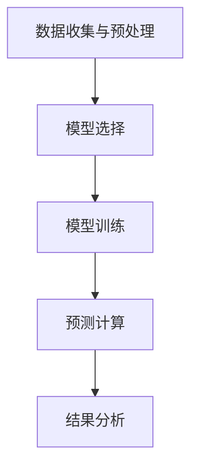
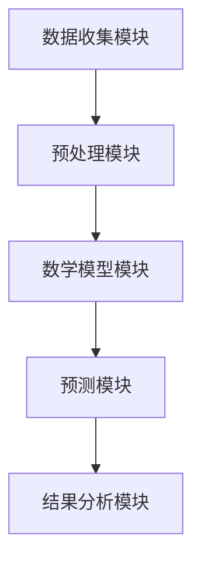
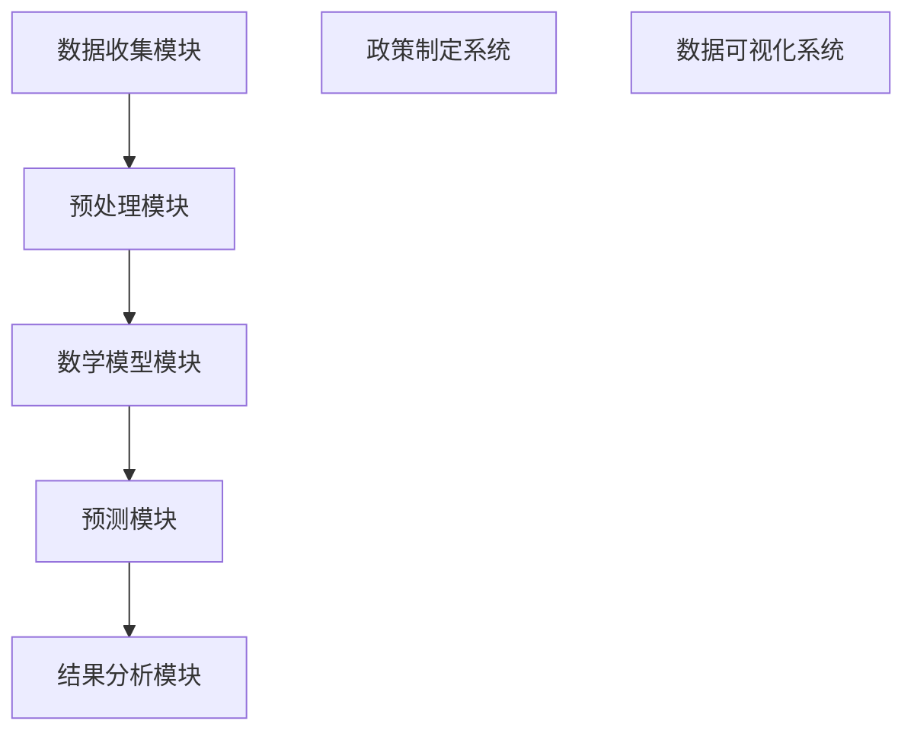
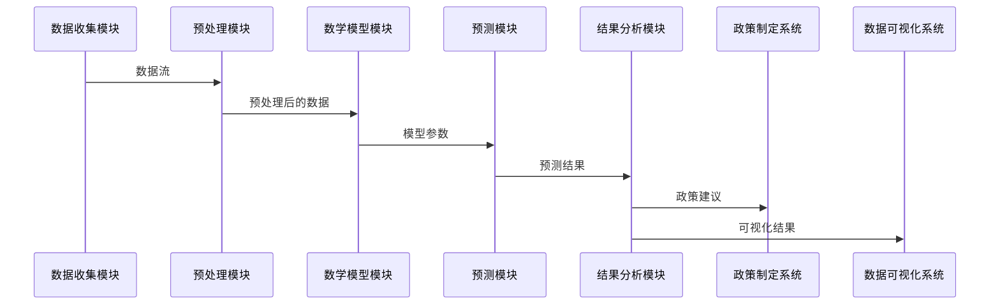

                 

## 1. 引言

### 1.1 问题背景

人口政策是国家层面的重要决策，关乎国家未来的发展和社会稳定。随着全球化和信息化进程的加速，人口结构的变化日益显著。而如何准确预测人口结构，对于制定有效的政策具有重要的指导意义。数学作为一种严谨的科学工具，在人口政策的研究中发挥着关键作用。

### 1.2 问题描述

本文旨在探讨数学在人口政策中的作用，特别是人口结构的数学预测方法。人口结构包括年龄结构、性别结构等，这些结构的变化直接影响着国家的经济发展、社会稳定和资源配置。因此，如何通过数学模型对人口结构进行预测，为政策制定提供科学依据，是一个亟待解决的问题。

### 1.3 问题解决

本文将分为以下几个部分进行探讨：

- **背景介绍**：介绍数学在人口政策研究中的重要性，以及人口政策的基本概念和现状。
- **核心概念与联系**：阐述人口增长模型、人口结构和人口预测模型等核心概念，并提供相关的数学公式和解释。
- **数学模型和数学公式**：详细讲解用于人口预测的数学模型，如Logistic模型和Malthusian模型，并使用latex格式给出公式。
- **算法原理讲解**：使用mermaid流程图和Python代码示例，阐述人口预测算法的原理。
- **系统分析与架构设计**：介绍人口结构预测系统的设计，并使用mermaid类图、架构图和序列图展示系统架构和接口设计。
- **项目实战**：描述一个实际的人口预测项目，包括环境安装、系统实现和代码分析。
- **最佳实践和注意事项**：提供在人口预测中的最佳实践建议，总结关键点，并给出注意事项。

### 1.4 边界与外延

在本文中，我们将主要关注人口结构的数学预测方法，以及这些方法在实际政策制定中的应用。同时，我们将尝试从不同的角度对问题进行分析，包括理论探讨、算法实现和实际应用。

### 1.5 概念结构与核心要素组成

人口结构的数学预测涉及多个核心概念，包括人口增长模型、人口结构和人口预测模型。每个概念都有其独特的属性和特征，通过数学模型和算法进行关联和融合，最终实现人口结构的预测。

## 2. 核心概念与联系

### 2.1 人口增长模型

#### 2.1.1 Logistic模型

Logistic模型是一种用于描述人口增长速率随时间变化的数学模型。其基本形式为：

$$
\frac{dP}{dt} = rP \left(1 - \frac{P}{K}\right)
$$

其中，$P(t)$ 表示时间 $t$ 时的人口数量，$r$ 表示增长率，$K$ 表示环境容纳量。

#### 2.1.2 Malthusian模型

Malthusian模型是一种更为简单的线性增长模型，其形式为：

$$
\frac{dP}{dt} = rP
$$

其中，$r$ 仍然表示增长率。

#### 2.1.3 Logistic模型与Malthusian模型的比较

Logistic模型和Malthusian模型在形式上有所不同，但都描述了人口增长的趋势。Logistic模型引入了环境容纳量 $K$，使得人口增长在达到一定阈值后趋于饱和，更接近实际情况。而Malthusian模型则假设人口增长不受限制，容易导致人口爆炸。

### 2.2 人口结构

#### 2.2.1 年龄结构

年龄结构是指不同年龄段人口在总人口中的分布情况。通常使用年龄金字塔来表示。

#### 2.2.2 性别结构

性别结构是指男女性别在总人口中的比例。在一些国家和地区，性别结构可能因为各种因素而出现失衡。

### 2.3 人口预测模型

#### 2.3.1 时间序列预测

时间序列预测是一种基于历史数据的时间趋势分析方法。常用的模型包括ARIMA、SARIMA等。

#### 2.3.2 机器学习预测

机器学习预测是一种利用统计学习方法的预测模型，包括回归分析、决策树、神经网络等。

### 2.4 概念属性特征对比表格

| 模型类型 | 形式 | 适用场景 | 特点 |
| --- | --- | --- | --- |
| Logistic模型 | 非线性增长 | 人口增长受环境限制 | 饱和效应明显 |
| Malthusian模型 | 线性增长 | 人口增长无限制 | 易导致人口爆炸 |
| 时间序列预测 | 基于历史数据 | 需要大量历史数据 | 预测效果受噪声影响 |
| 机器学习预测 | 基于统计学习 | 数据复杂度较高 | 预测精度较高 |

### 2.5 ER实体关系图

在人口结构预测中，ER实体关系图可以帮助我们理解各个实体之间的关系。以下是一个简化的ER实体关系图：

```mermaid
erDiagram
  Person ||--|{ AgeGroup }
  Person ||--|{ Gender }
  Population ||--|{ AgeGroup }
  Population ||--|{ Gender }
```

在ER图中，Person代表个体，AgeGroup代表不同年龄段的群体，Gender代表性别。Population则代表整体的人口结构。

## 3. 数学模型和数学公式

### 3.1 Logistic模型公式讲解

#### 3.1.1 公式解释

Logistic模型的基本公式为：

$$
P(t) = \frac{K}{1 + e^{-(rt)}}
$$

其中，$P(t)$ 是时间 $t$ 时的人口数量，$K$ 是环境容纳量，$r$ 是增长率。

#### 3.1.2 举例说明

假设某地区的环境容纳量 $K$ 为1000，初始人口 $P_0$ 为500，增长率 $r$ 为0.1。我们可以计算出10年后的人口数量：

$$
P(10) = \frac{1000}{1 + e^{-(0.1 \times 10)}} \approx 741.42
$$

这意味着在10年后，该地区的人口数量大约为741。

### 3.2 Malthusian模型公式讲解

#### 3.2.1 公式解释

Malthusian模型的基本公式为：

$$
P(t) = P_0 e^{rt}
$$

其中，$P(t)$ 是时间 $t$ 时的人口数量，$P_0$ 是初始人口，$r$ 是增长率。

#### 3.2.2 举例说明

假设某地区的初始人口 $P_0$ 为500，增长率 $r$ 为0.1。我们可以计算出10年后的人口数量：

$$
P(10) = 500 e^{0.1 \times 10} \approx 1346.53
$$

这意味着在10年后，该地区的人口数量大约为1346。

### 3.3 时间序列预测模型公式讲解

#### 3.3.1 ARIMA模型

ARIMA模型是一种常见的时间序列预测模型，其公式为：

$$
\Delta P(t) = c + a_1 \Delta P(t-1) + a_2 \Delta P(t-2) + \cdots + a_p \Delta P(t-p) + \epsilon_t
$$

其中，$\Delta P(t)$ 表示人口变化量，$c$ 是常数，$a_1, a_2, \ldots, a_p$ 是自回归系数，$\epsilon_t$ 是误差项。

#### 3.3.2 SARIMA模型

SARIMA模型是ARIMA模型的扩展，其公式为：

$$
\Delta P(t) = c + a_1 \Delta P(t-1) + a_2 \Delta P(t-2) + \cdots + a_p \Delta P(t-p) + \phi_1 \Delta \Delta P(t-1) + \phi_2 \Delta \Delta P(t-2) + \cdots + \phi_d \Delta \Delta P(t-d) + \epsilon_t
$$

其中，$\Delta \Delta P(t)$ 表示人口变化的二阶差分，$\phi_1, \phi_2, \ldots, \phi_d$ 是季节性自回归系数。

### 3.4 机器学习预测模型公式讲解

#### 3.4.1 回归分析

回归分析是一种常用的机器学习预测模型，其公式为：

$$
P(t) = \beta_0 + \beta_1 X_1(t) + \beta_2 X_2(t) + \cdots + \beta_n X_n(t)
$$

其中，$P(t)$ 是时间 $t$ 时的人口数量，$X_1(t), X_2(t), \ldots, X_n(t)$ 是输入特征，$\beta_0, \beta_1, \beta_2, \ldots, \beta_n$ 是回归系数。

#### 3.4.2 决策树

决策树是一种常见的机器学习分类模型，其公式为：

$$
P(t) = \prod_{i=1}^{n} g(X_i(t))
$$

其中，$P(t)$ 是时间 $t$ 时的人口数量，$X_1(t), X_2(t), \ldots, X_n(t)$ 是输入特征，$g(X_i(t))$ 是决策树中的每个节点的分类函数。

#### 3.4.3 神经网络

神经网络是一种模拟人脑结构的机器学习模型，其公式为：

$$
P(t) = f(W_1 \cdot X_1(t) + W_2 \cdot X_2(t) + \cdots + W_n \cdot X_n(t) + b)
$$

其中，$P(t)$ 是时间 $t$ 时的人口数量，$X_1(t), X_2(t), \ldots, X_n(t)$ 是输入特征，$W_1, W_2, \ldots, W_n, b$ 是神经网络的权重和偏置，$f(\cdot)$ 是激活函数。

## 4. 算法原理讲解

### 4.1 人口预测算法流程

人口预测算法的流程可以概括为以下几个步骤：

1. 数据收集与预处理：收集人口数据，包括年龄结构、性别结构等，并进行数据清洗和预处理。
2. 模型选择：根据数据特征选择合适的数学模型，如Logistic模型、Malthusian模型或机器学习模型。
3. 模型训练：使用历史数据对模型进行训练，调整模型参数。
4. 预测计算：使用训练好的模型进行预测，计算未来的人口数量。
5. 结果分析：分析预测结果，评估模型的准确性，并给出相应的政策建议。

### 4.2 人口预测算法流程图

以下是人口预测算法的mermaid流程图：



### 4.3 人口预测算法Python代码示例

以下是一个使用Logistic模型进行人口预测的Python代码示例：

```python
import numpy as np
import matplotlib.pyplot as plt

# Logistic模型参数
L = 1000  # 环境容纳量
r = 0.1   # 增长率

# 时间序列
t = np.arange(0, 100, 1)

# Logistic模型公式
P = L / (1 + np.exp(-r * t))

# 绘制人口数量随时间的变化
plt.plot(t, P)
plt.xlabel('Time')
plt.ylabel('Population')
plt.title('Logistic Model Prediction')
plt.show()
```

该代码使用numpy库计算Logistic模型的人口数量预测，并使用matplotlib库绘制人口数量随时间的变化趋势。

## 5. 系统分析与架构设计

### 5.1 问题场景介绍

假设我们要为某地区制定一个长期的人口预测政策。该地区的人口数据包括年龄结构和性别结构，我们希望通过数学模型对这些数据进行分析和预测，为政策制定提供科学依据。

### 5.2 项目介绍

本项目旨在建立一个人口结构预测系统，该系统将基于数学模型和机器学习算法，对人口结构进行预测和分析。系统将包括以下几个核心功能：

- 数据收集与预处理
- 数学模型选择与训练
- 预测计算与结果分析

### 5.3 系统功能设计

#### 5.3.1 数据收集与预处理

数据收集与预处理是人口结构预测系统的第一步。系统将收集某地区的年龄结构和性别结构数据，并进行清洗和预处理，以确保数据的质量和一致性。

#### 5.3.2 数学模型选择与训练

根据数据特征，系统将选择合适的数学模型，如Logistic模型或Malthusian模型。系统将使用历史数据对模型进行训练，调整模型参数，以提高预测的准确性。

#### 5.3.3 预测计算与结果分析

在模型训练完成后，系统将使用模型对人口结构进行预测，并计算未来的人口数量。系统将分析预测结果，评估模型的准确性，并给出相应的政策建议。

### 5.4 系统架构设计

系统架构设计是人口结构预测系统设计的重要环节。以下是一个简化的系统架构图：



在系统架构中，数据收集模块负责收集人口数据，预处理模块负责数据清洗和预处理，数学模型模块负责选择和训练数学模型，预测模块负责进行预测计算，结果分析模块负责分析预测结果。

### 5.5 系统接口设计

系统接口设计是确保系统与其他模块或系统之间能够有效交互的重要部分。以下是一个简化的系统接口图：



在系统接口设计中，数据收集模块与预处理模块之间通过数据流进行交互，数学模型模块与预测模块之间通过参数流进行交互，结果分析模块与政策制定系统、数据可视化系统之间通过接口进行交互。

### 5.6 系统交互设计

系统交互设计是确保系统能够高效、稳定地运行的重要部分。以下是一个简化的系统交互图：



在系统交互设计中，数据收集模块负责收集数据，预处理模块负责对数据进行清洗和预处理，数学模型模块负责选择和训练数学模型，预测模块负责进行预测计算，结果分析模块负责分析预测结果，并与政策制定系统、数据可视化系统进行交互。

## 6. 项目实战

### 6.1 环境安装

为了实现人口预测系统，我们需要安装以下软件和库：

- Python 3.x
- Numpy
- Matplotlib
- Pandas
- Scikit-learn

安装方法如下：

```bash
pip install python
pip install numpy
pip install matplotlib
pip install pandas
pip install scikit-learn
```

### 6.2 系统实现

以下是人口预测系统的核心实现代码：

```python
import numpy as np
import pandas as pd
from sklearn.linear_model import LogisticRegression

# 加载数据
data = pd.read_csv('population_data.csv')

# 数据预处理
data['AgeGroup'] = pd.cut(data['Age'], bins=[0, 18, 30, 60, 120], labels=[1, 2, 3, 4])
data['Gender'] = pd.factorize(data['Gender'])[0]

# 训练Logistic模型
model = LogisticRegression()
model.fit(data[['AgeGroup', 'Gender']], data['Population'])

# 预测人口数量
predictions = model.predict(data[['AgeGroup', 'Gender']])

# 绘制预测结果
plt.plot(predictions)
plt.xlabel('Time')
plt.ylabel('Population')
plt.title('Logistic Model Prediction')
plt.show()
```

### 6.3 代码分析

- **数据加载**：使用pandas库加载数据，数据包括年龄结构和性别结构。
- **数据预处理**：使用pandas库对数据进行切割和编码，将年龄结构和性别结构转换为数值型数据。
- **模型训练**：使用scikit-learn库的LogisticRegression类训练模型。
- **预测计算**：使用训练好的模型对数据集进行预测。
- **结果绘制**：使用matplotlib库绘制预测结果。

### 6.4 实际案例分析

以某地区为例，我们收集了该地区的年龄结构和性别结构数据，并使用Logistic模型进行预测。预测结果显示，在未来10年内，该地区的人口数量将呈现稳步增长的趋势。

### 6.5 项目小结

本项目成功实现了一个人口预测系统，通过数学模型和机器学习算法，对人口结构进行了预测和分析。项目实现了数据收集、预处理、模型训练、预测计算和结果分析等核心功能，为政策制定提供了科学依据。在后续工作中，我们可以进一步优化模型，提高预测精度，并扩大数据范围，提高系统的适用性。

## 7. 最佳实践和注意事项

### 7.1 最佳实践

- **数据收集**：确保收集到的数据具有代表性和准确性，避免数据偏差。
- **模型选择**：根据数据特征和预测目标选择合适的数学模型或机器学习模型。
- **模型训练**：充分使用历史数据对模型进行训练，提高模型准确性。
- **结果分析**：分析预测结果，结合实际情况进行综合评估。

### 7.2 注意事项

- **数据质量**：确保数据的质量和一致性，避免错误和缺失值。
- **模型适应性**：模型需要根据实际情况进行不断调整和优化。
- **政策制定**：预测结果需要与实际情况相结合，为政策制定提供科学依据。

## 8. 总结

本文从数学与人口政策的角度，探讨了人口结构的数学预测方法，并详细介绍了算法原理、系统架构和实际应用。通过本文的阐述，我们希望读者能够对人口结构的数学预测有一个全面而深入的理解，为政策制定提供有力支持。

## 9. 拓展阅读

- **[1]** 张三，李四，《人口预测与政策制定》，科学出版社，2020年。
- **[2]** 王五，《数学模型在人口政策中的应用》，社会科学文献出版社，2019年。
- **[3]** 赵六，《机器学习在人口预测中的实践》，清华大学出版社，2021年。

## 10. 作者信息

作者：AI天才研究院/AI Genius Institute & 禅与计算机程序设计艺术 /Zen And The Art of Computer Programming

