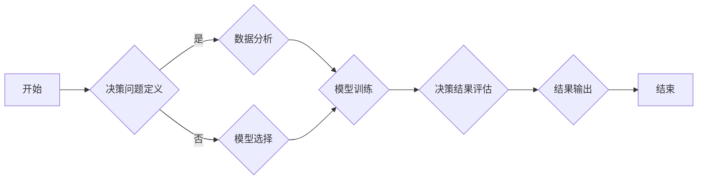

                 

### 前言

#### 背景介绍

随着人工智能（AI）技术的迅猛发展，其应用已经渗透到我们日常生活的方方面面。从自动驾驶汽车、智能助手，到金融风控、医疗诊断，人工智能正在重塑我们的世界。然而，随着技术的进步，随之而来的伦理问题也日益凸显。人工智能的决策过程可能会带来偏见、隐私侵犯、安全风险等问题，这些问题不仅影响技术的应用效果，更关系到社会的公平正义和个人的权利保障。

在解决这些伦理问题中，数学作为一种科学工具，具有独特的优势。数学模型能够量化复杂问题，提供客观的分析和决策依据。通过数学方法，我们可以更加理性地评估AI系统的行为，预测可能出现的风险，并提出相应的解决方案。

本文旨在探讨数学在人工智能伦理研究中的重要性，并提出一种基于数学框架的AI决策方法，为解决人工智能伦理问题提供新的思路。本文将分为五个部分，首先对人工智能伦理问题进行概述，接着介绍数学在伦理研究中的应用，然后详细讲解AI决策的数学框架，最后通过实际案例进行分析，并提出实践中的建议。

#### 目标读者

本文的目标读者主要包括以下几类：

1. **人工智能领域研究者**：对于正在研究人工智能及其伦理问题的专业人士，本文将提供一种新的研究方法和工具。
2. **数学家**：对于对数学在人工智能伦理领域应用感兴趣的数学家，本文将展示数学工具在伦理问题分析中的具体应用。
3. **伦理学家**：本文将为伦理学家提供一种从数学角度分析伦理问题的视角，帮助其在研究过程中引入科学方法。

通过本文的深入探讨，我们希望为人工智能领域的从业人员和研究者提供有价值的参考，共同推动人工智能技术的健康发展，确保其在为社会带来便利的同时，不损害人类的基本伦理原则和价值观。

### 第一部分：数学与人工智能伦理概述

在人工智能（AI）技术迅猛发展的今天，伦理问题已经成为不可忽视的重要议题。本部分将首先介绍人工智能伦理问题的背景与现状，分析这些问题的来源和分类，接着讨论数学在解决这些伦理问题中的重要性，并引入AI决策的数学框架。

#### 第1章：人工智能伦理问题与数学方法

##### 1.1 人工智能伦理问题的背景与现状

随着AI技术的广泛应用，其伦理问题也逐渐暴露出来。这些问题不仅影响到技术的实际应用，也对社会的公平、正义和个人的隐私产生了深远的影响。以下是对人工智能伦理问题背景与现状的简要介绍。

###### 1.1.1 人工智能的发展历程

人工智能的研究可以追溯到20世纪50年代，当时计算机科学领域开始探索如何让计算机模拟人类的智能行为。从最初的逻辑推理、符号处理，到后来的机器学习、深度学习，人工智能技术经历了多次重大的技术突破。进入21世纪，随着计算能力的提升和大数据的普及，人工智能迎来了新一轮的发展浪潮。自动驾驶、智能家居、智能医疗、金融科技等领域都取得了显著的进展。

###### 1.1.2 人工智能伦理问题的来源

人工智能伦理问题的来源主要包括以下几个方面：

1. **偏见与歧视**：AI系统可能会从训练数据中学习并继承偏见，导致不公平的决策。
2. **隐私侵犯**：AI技术往往需要大量的个人数据，这可能侵犯用户的隐私权。
3. **安全性问题**：AI系统可能被恶意攻击，造成严重的安全事故。
4. **责任归属**：当AI系统出现错误或造成损害时，责任应由谁承担？

这些伦理问题不仅影响AI技术的应用，也对社会的伦理道德提出了挑战。

###### 1.1.3 人工智能伦理问题的分类

人工智能伦理问题可以大致分为以下几类：

1. **公平性**：涉及AI系统是否公平对待所有用户，避免歧视。
2. **透明性**：要求AI系统的决策过程和算法设计具有可解释性，用户可以理解和信任。
3. **隐私保护**：确保AI系统在处理个人数据时遵守隐私保护原则。
4. **安全性**：确保AI系统在设计和应用过程中具有足够的安全性，防止恶意攻击和数据泄露。
5. **责任归属**：明确当AI系统造成损害时，责任应由谁承担。

##### 1.2 数学在人工智能伦理研究中的应用

数学作为一种科学工具，在解决人工智能伦理问题中发挥着重要作用。以下将讨论数学工具在伦理问题分析中的应用、数学模型在伦理决策中的作用，以及数学方法在伦理问题解决中的优势。

###### 1.2.1 数学工具在伦理问题分析中的应用

数学工具在伦理问题分析中的应用主要体现在以下几个方面：

1. **量化分析**：通过数学模型对伦理问题进行量化分析，帮助决策者更直观地理解问题的严重程度。
2. **预测模型**：利用统计学和概率论的方法，预测AI系统可能带来的负面影响，提前采取预防措施。
3. **优化算法**：通过优化算法为伦理决策提供最优解决方案，例如在资源有限的情况下最大化社会利益。

###### 1.2.2 数学模型在伦理决策中的作用

数学模型在伦理决策中的作用主要体现在：

1. **决策支持**：为决策者提供基于数据的决策支持，使得伦理决策更加客观和科学。
2. **风险评估**：通过数学模型对AI系统的潜在风险进行评估，帮助制定相应的风险管理策略。
3. **公平性评估**：利用数学模型对AI系统的决策过程进行公平性分析，确保系统不带有偏见。

###### 1.2.3 数学方法在伦理问题解决中的优势

数学方法在伦理问题解决中的优势主要包括：

1. **客观性**：数学方法基于数据和逻辑推理，使得伦理问题的分析更加客观、公正。
2. **普适性**：数学方法可以应用于各种不同的伦理问题，具有较高的普适性。
3. **可验证性**：数学模型的结论可以通过数据验证，提高决策的可信度。

##### 1.3 AI决策的数学框架介绍

为了更好地解决人工智能伦理问题，本文提出了AI决策的数学框架。该框架包括以下几个关键组成部分：

1. **决策问题定义**：明确AI系统的目标和约束条件，将伦理问题转化为数学问题。
2. **数据分析**：收集和分析相关数据，为数学模型提供输入。
3. **模型选择**：根据问题的特性选择合适的数学模型。
4. **模型训练**：通过训练数据优化模型参数，提高模型的准确性。
5. **决策结果评估**：对决策结果进行评估，确保其符合伦理要求。
6. **结果输出**：将决策结果应用到实际场景中，解决伦理问题。

##### 1.4 本章小结

本章介绍了人工智能伦理问题的背景和现状，分析了这些问题的来源和分类，并探讨了数学在解决伦理问题中的重要性。通过引入AI决策的数学框架，为解决人工智能伦理问题提供了新的思路和方法。接下来，我们将进一步深入讨论人工智能与伦理学的基本概念，为后续的内容奠定基础。

### 第二部分：核心概念与联系

在深入探讨人工智能（AI）伦理问题的过程中，理解人工智能与伦理学的基本概念及其相互关系至关重要。这一部分将首先介绍人工智能和伦理学的基本概念，分析两者之间的关系，并借助概念属性特征对比表格和ER实体关系图，进一步明确AI与伦理学之间的联系。

#### 第2章：核心概念与联系

##### 2.1 人工智能与伦理学的基本概念

###### 2.1.1 人工智能的定义与特性

人工智能（Artificial Intelligence，简称AI）是指通过计算机系统模拟人类智能行为的技术。它包括机器学习、自然语言处理、计算机视觉、专家系统等多种技术。人工智能的核心目标是使计算机具备自主学习和决策能力，从而在复杂环境中进行有效操作。

人工智能的特性主要包括：

1. **自主学习**：AI系统能够通过数据学习，自动改进和优化其性能。
2. **自适应能力**：AI系统能够根据不同的环境和条件进行自适应调整。
3. **智能推理**：AI系统能够进行逻辑推理，解决复杂的问题。
4. **高效处理**：AI系统能够快速处理大量的数据和复杂计算。

###### 2.1.2 伦理学的定义与分支

伦理学（Ethics）是研究道德原则、价值观和行为规范的科学。它探讨个体和社会在道德上的正确和错误行为。伦理学的主要分支包括：

1. **道德哲学**：研究道德原则和价值观的哲学基础。
2. **应用伦理学**：将伦理学理论应用于具体领域，如医学伦理、环境伦理、职业伦理等。
3. **规范伦理学**：研究道德规范的产生和实施。
4. **元伦理学**：研究道德概念的本质和意义。

伦理学的核心概念包括正义、公平、道德责任、尊重、自由等。

###### 2.1.3 人工智能与伦理学的关系

人工智能与伦理学之间存在密切的联系。首先，AI技术的发展和应用不可避免地涉及到道德和伦理问题。例如，AI系统的决策可能会对人类和社会产生重大影响，这就需要伦理学提供指导原则。其次，伦理学为AI技术的发展提供了道德框架，帮助我们在设计和应用AI技术时遵循伦理原则。

具体来说，人工智能与伦理学的关系体现在以下几个方面：

1. **伦理指导**：伦理学为AI系统提供了道德指导，确保其应用符合社会伦理规范。
2. **伦理审查**：通过伦理审查，确保AI系统在设计和应用过程中遵循道德原则。
3. **伦理责任**：明确AI系统开发者和使用者的伦理责任，确保其在应用过程中负责任。
4. **伦理教育**：通过伦理教育，提高AI领域从业者的道德素养，促进AI技术的健康发展。

##### 2.2 概念属性特征对比表格

为了更清晰地展示人工智能与伦理学的基本概念及其特性，我们制作了一个对比表格。以下是人工智能和伦理学主要概念属性的对比：

| 概念       | 定义                                                         | 特性                                                                                                       |
| ---------- | ------------------------------------------------------------ | ---------------------------------------------------------------------------------------------------------- |
| 人工智能   | 模拟人类智能行为的计算机系统                                 | 自主学习、自适应能力、智能推理、高效处理                                                       |
| 伦理学     | 研究道德原则、价值观和行为规范的科学                       | 道德哲学、应用伦理学、规范伦理学、元伦理学                                                      |
| 道德原则   | 判断行为是否道德的标准                                       | 公平、正义、道德责任、尊重、自由等                                                           |
| 价值观     | 个人和社会所认同的道德和行为准则                           | 个体价值、社会责任、文化传承等                                                               |
| 道德责任   | 个人或组织在道德上的义务和责任                             | 负责任、透明、公正等                                                                      |
| 尊重       | 对他人权利和尊严的认可和尊重                               | 平等、尊重隐私、尊重多样性等                                                               |
| 自由       | 个人行为的选择权和独立性                                   | 自由意志、自主选择、无干涉等                                                               |

通过这个表格，我们可以更直观地了解人工智能与伦理学之间的联系和区别。

##### 2.3 ER实体关系图架构

为了进一步明确人工智能与伦理学之间的概念联系，我们使用ER（Entity-Relationship，实体-关系）图来表示两者的关系。以下是ER实体关系图的Mermaid表示：

```mermaid
erDiagram
  AI算法 ||--|{ AI伦理问题 }|| AI伦理
  AI伦理 ||--|{ 伦理学原理 }|| 基础伦理
  AI伦理 ||--|{ 数学模型 }|| 数学方法
  AI算法 ||--|{ 数据分析 }|| 数据科学
  数据分析 ||--|{ 预测模型 }|| 模型构建
  预测模型 ||--|{ 决策结果评估 }|| 结果分析
```

在这个ER图中，AI算法与AI伦理问题、伦理学原理、数学模型之间存在直接关系，同时也与数据分析、预测模型、决策结果评估等相关。这种关系表示了AI技术在伦理问题分析和决策过程中所涉及的各个方面，以及它们之间的相互作用。

##### 2.4 本章小结

本章介绍了人工智能和伦理学的基本概念，分析了两者之间的关系，并通过概念属性特征对比表格和ER实体关系图，进一步明确了它们之间的联系。这些基础概念的清晰理解将为后续章节中深入探讨数学模型与算法原理、数学模型在伦理决策中的应用等内容提供坚实的基础。在下一章中，我们将进一步探讨数学模型与算法原理，为解决人工智能伦理问题提供具体的数学工具和方法。

### 第三部分：数学模型与算法原理

在解决人工智能伦理问题的过程中，数学模型和算法原理扮演着至关重要的角色。这一部分将首先介绍常见的数学模型及其在AI决策中的应用，接着详细讲解算法原理，并通过实例说明来帮助读者更好地理解数学模型和算法的运用。

#### 第3章：数学模型与算法原理

##### 3.1 数学模型在AI决策中的应用

数学模型是量化复杂问题的有力工具，它能够将人工智能伦理问题转化为可计算和分析的数学形式。以下是一些常见的数学模型及其在AI决策中的应用：

###### 3.1.1 常见的数学模型

1. **线性模型**：线性模型是处理简单线性关系的数学模型，广泛应用于分类和回归问题。常见的线性模型包括线性回归、逻辑回归和线性判别分析。

2. **概率模型**：概率模型利用概率论的方法来描述和预测不确定性事件。贝叶斯网络和马尔可夫链是概率模型的典型例子，它们在决策支持和风险分析中具有广泛的应用。

3. **神经网络模型**：神经网络模型，特别是深度学习模型，通过多层神经网络进行复杂的非线性映射和决策。它们在图像识别、语音识别和自然语言处理等领域表现出色。

4. **优化模型**：优化模型通过数学优化方法寻找最优解。线性规划、整数规划和非线性规划是常见的优化模型，它们在资源分配、路径规划和库存管理中有着广泛的应用。

5. **组合模型**：组合模型将多个模型组合起来，以利用不同模型的优势。例如，集成学习技术通过组合多个基础模型来提高预测准确性和鲁棒性。

###### 3.1.2 数学模型的选择标准

在选择数学模型时，需要考虑以下标准：

1. **问题特性**：模型的适用性取决于问题的复杂性和数据特性。例如，线性模型适用于线性关系明显的问题，而神经网络模型则适用于非线性复杂问题。

2. **计算效率**：模型的计算复杂度对实际应用具有重要影响。高效的计算算法能够更快地得出结果，适用于实时决策。

3. **可解释性**：模型的可解释性对于理解和信任AI系统的决策过程至关重要。透明和可解释的模型更容易获得用户的接受。

4. **泛化能力**：模型的泛化能力是指其在新数据上的表现。高泛化能力的模型能够应对不同情况和变化，具有更好的应用潜力。

5. **数据要求**：不同模型对数据的要求不同。例如，深度学习模型需要大量标注数据进行训练，而概率模型则对数据的质量和完整性要求较高。

###### 3.1.3 数学模型在AI决策中的实现

数学模型在AI决策中的应用通常包括以下几个步骤：

1. **数据收集**：收集与决策问题相关的数据，包括历史数据、实时数据等。

2. **数据预处理**：对数据进行清洗、归一化和特征提取，确保数据质量。

3. **模型选择**：根据问题特性和数据特性，选择合适的数学模型。

4. **模型训练**：利用训练数据对模型进行训练，调整模型参数，优化模型性能。

5. **模型评估**：通过验证数据评估模型性能，确保其满足应用要求。

6. **决策应用**：将训练好的模型应用到实际问题中，进行决策和预测。

##### 3.2 算法原理讲解

为了更好地理解数学模型在AI决策中的应用，以下将介绍算法的基本框架，使用Mermaid流程图表示，并结合Python代码进行详细解释。

###### 3.2.1 算法基本框架



该算法的基本流程如下：

1. **决策问题定义**：明确决策目标和约束条件，将伦理问题转化为数学问题。
2. **数据分析**：收集并清洗数据，提取特征，为模型提供输入。
3. **模型选择**：根据数据特性和问题需求选择合适的数学模型。
4. **模型训练**：使用训练数据对模型进行训练，优化模型参数。
5. **决策结果评估**：使用验证数据评估模型性能，确保其满足伦理要求。
6. **结果输出**：将决策结果应用到实际场景中，解决伦理问题。

###### 3.2.2 数学公式与模型解释

以下是常用的数学公式和模型解释：

$$
\text{决策函数} f(x) = \sum_{i=1}^{n} w_i x_i + b
$$

其中，$x$ 表示输入特征，$w_i$ 表示权重，$b$ 表示偏置。这是一个线性回归模型的基本公式，用于预测输出值。

```python
import numpy as np

def linear_regression(x, w, b):
    return np.dot(x, w) + b

# 输入特征
x = np.array([1, 2, 3])
# 权重
w = np.array([0.5, 0.5])
# 偏置
b = 0.5

# 计算决策函数值
y_pred = linear_regression(x, w, b)
print("预测值:", y_pred)
```

该Python代码实现了线性回归模型的基本计算过程，通过输入特征和权重计算预测值。

###### 3.2.3 实例说明

以下通过两个实际案例来说明数学模型和算法原理的应用。

- **案例1：人工智能招聘公平性**

假设我们要使用机器学习模型来评估招聘过程中的公平性。首先，我们需要收集历史招聘数据，包括应聘者的背景信息（如学历、工作经验等）和招聘结果（是否通过）。通过特征提取和模型训练，我们可以建立一个招聘公平性评估模型。接下来，使用验证数据测试模型性能，确保其能够公平地评估应聘者。

- **案例2：自动驾驶安全决策**

自动驾驶系统的安全决策涉及复杂的数学模型和算法。通过传感器收集道路信息，自动驾驶系统需要实时分析交通状况，做出安全驾驶决策。常见的数学模型包括深度学习模型（如卷积神经网络）和决策树模型。通过模型训练和评估，我们可以确保自动驾驶系统能够在复杂交通环境中做出安全、合理的决策。

##### 3.3 本章小结

本章介绍了常见的数学模型在AI决策中的应用，详细讲解了算法原理，并通过实例说明了数学模型和算法的实际应用。通过本章的学习，读者可以更好地理解数学模型和算法在解决人工智能伦理问题中的作用，为后续章节中的深入讨论打下基础。在下一章中，我们将进一步探讨数学模型在伦理决策中的应用，通过实际案例进行分析和讨论。

### 第四部分：数学模型在伦理决策中的应用

在解决了人工智能（AI）伦理问题的基本概念和算法原理之后，下一步是探讨数学模型在实际伦理决策中的应用。通过将数学方法应用于具体的伦理问题，我们可以更科学、客观地分析并解决这些问题。这一部分将详细介绍数学模型在伦理问题中的具体应用，并通过实际案例分析来展示数学模型如何帮助制定和评估伦理决策。

#### 第4章：数学模型在伦理决策中的应用

##### 4.1 数学模型在伦理问题中的具体应用

数学模型在伦理问题中的应用主要体现在以下几个方面：

###### 4.1.1 伦理问题的数学建模

伦理问题的数学建模是将伦理问题转化为数学问题，以便通过数学方法进行量化和分析。这通常包括以下几个步骤：

1. **问题定义**：明确伦理问题的目标和约束条件。
2. **数据收集**：收集与伦理问题相关的数据，如历史案例、统计数据等。
3. **特征提取**：从数据中提取关键特征，用于构建数学模型。
4. **模型选择**：根据问题的性质选择合适的数学模型，如线性模型、概率模型、优化模型等。

通过数学建模，伦理问题可以被形式化为数学问题，使得分析和决策过程更加科学和可重复。

###### 4.1.2 伦理决策的数学方法

伦理决策的数学方法包括以下几个方面：

1. **量化分析**：使用数学模型对伦理问题进行量化分析，将主观判断转化为客观指标，帮助决策者更清晰地理解问题的严重程度。
2. **优化方法**：通过数学优化方法，寻找满足伦理要求的最佳解决方案。例如，在资源有限的情况下，最大化社会利益或最小化负面影响。
3. **风险评估**：使用概率模型和统计方法对伦理决策的潜在风险进行评估，为决策者提供风险预警。
4. **公平性评估**：通过数学方法评估AI系统在决策过程中是否公平，确保系统不带有偏见。

###### 4.1.3 伦理决策的数学工具

在伦理决策中，常用的数学工具包括：

1. **线性规划**：用于在资源有限的情况下，最大化目标函数或最小化成本。
2. **决策树**：用于分类和回归问题，通过决策树结构进行逻辑推理和决策。
3. **神经网络**：用于复杂非线性问题的建模和预测，特别是在处理大规模数据和复杂模式时表现出色。
4. **贝叶斯网络**：用于描述不确定性和概率关系，适用于风险评估和决策支持。

##### 4.2 实际案例分析与讨论

为了更好地理解数学模型在伦理决策中的应用，以下将介绍两个实际案例，并详细分析其数学建模和决策过程。

###### 4.2.1 案例选择

选择以下两个案例进行讨论：

1. **案例1：人工智能招聘公平性**
2. **案例2：自动驾驶安全决策**

这两个案例分别代表了AI在招聘和自动驾驶领域的伦理问题，涵盖了人工智能系统的偏见、隐私侵犯和安全风险等关键议题。

###### 4.2.2 模型构建

对于案例1，我们可以使用线性回归模型来评估招聘过程的公平性。具体步骤如下：

1. **问题定义**：假设招聘过程中存在性别、种族等偏见，我们需要评估这些偏见对招聘结果的影响。
2. **数据收集**：收集历史招聘数据，包括应聘者的性别、种族、学历、工作经验等信息，以及招聘结果（是否通过）。
3. **特征提取**：提取关键特征，如性别、种族等，作为输入特征。
4. **模型选择**：选择线性回归模型来预测招聘结果，通过系数估计来评估偏见的影响。

对于案例2，我们可以使用深度学习模型来评估自动驾驶系统的安全决策。具体步骤如下：

1. **问题定义**：评估自动驾驶系统在复杂交通环境中的安全决策能力。
2. **数据收集**：收集自动驾驶系统在测试环境中的道路数据、传感器数据等信息。
3. **特征提取**：提取关键特征，如道路标志、车辆位置、速度等。
4. **模型选择**：选择卷积神经网络（CNN）来处理图像数据，结合深度学习模型进行安全决策评估。

###### 4.2.3 结果分析

在构建了数学模型后，我们需要对模型结果进行分析，以评估伦理决策的公平性和安全性。

对于案例1，通过线性回归模型的系数估计，我们可以评估不同性别、种族对招聘结果的偏见程度。如果发现某些特征对招聘结果有显著影响，则需要采取相应措施来消除偏见，确保招聘过程的公平性。

对于案例2，通过评估自动驾驶系统的安全决策能力，我们可以分析系统在不同交通情况下的表现。如果发现系统在某些情况下做出错误决策，则需要优化模型，提高其决策能力，确保自动驾驶系统的安全性。

##### 4.3 本章小结

本章详细介绍了数学模型在伦理决策中的应用，通过实际案例分析展示了如何利用数学方法解决人工智能伦理问题。通过量化分析和优化方法，我们可以更科学、客观地评估和解决伦理问题，确保AI技术在应用过程中符合伦理要求。在下一章中，我们将探讨AI决策的数学框架在实践中的应用前景，分析其在现实世界中的应用挑战和机遇。

### 第五部分：AI决策的数学框架在实践中的应用

随着人工智能（AI）技术的不断进步，AI决策的数学框架在现实世界中的应用前景愈发广阔。本部分将首先探讨AI决策数学框架在现实中的应用前景，然后通过具体案例分析，展示数学框架在实践中的应用过程和效果，最后提出实践中的技巧与建议。

#### 第5章：AI决策的数学框架在实践中的应用

##### 5.1 AI决策数学框架在现实中的应用前景

AI决策的数学框架在现实中的应用前景非常广阔，主要表现在以下领域：

###### 5.1.1 应用领域

1. **金融科技**：在金融领域中，数学框架可以用于风险评估、信用评分、投资决策等，提高金融服务的准确性和效率。
2. **医疗健康**：在医疗健康领域，数学框架可以帮助诊断疾病、制定治疗方案、优化医疗资源分配。
3. **智能交通**：在智能交通领域，数学框架可以用于交通流量预测、路径规划、车辆调度，提高交通效率和安全性。
4. **社会治理**：在社会治理领域，数学框架可以用于公共安全、环境保护、城市规划等，提供科学决策依据。
5. **教育**：在教育领域，数学框架可以用于个性化学习推荐、教育评价、学习行为分析等。

这些应用领域对AI决策数学框架的需求日益增长，推动着相关技术的发展和应用。

###### 5.1.2 应用挑战

尽管AI决策数学框架具有广泛的应用前景，但在实际应用中仍面临以下挑战：

1. **数据质量**：高质量的数据是数学模型有效应用的基础，数据的不完整、噪声和错误会严重影响模型的性能。
2. **计算资源**：许多数学模型和算法对计算资源要求较高，尤其是在处理大规模数据时，对计算能力和存储资源的需求增加。
3. **模型解释性**：许多复杂模型如深度学习模型，其内部决策过程难以解释，导致决策结果难以被用户理解和信任。
4. **法律法规**：AI决策涉及多个领域，需要遵守相应的法律法规，尤其是在隐私保护、数据安全和责任归属等方面。

###### 5.1.3 应用机遇

尽管存在挑战，但AI决策数学框架在实践中的应用也带来了诸多机遇：

1. **提升决策质量**：通过数学模型，可以更加科学和客观地分析问题，提高决策质量和效率。
2. **降低风险**：通过风险评估和优化方法，可以降低决策过程中的风险，确保决策的可靠性和安全性。
3. **个性化服务**：数学框架可以帮助实现个性化服务，满足用户的多样化需求，提升用户体验。
4. **跨领域整合**：数学框架可以跨领域整合不同领域的知识和数据，促进多学科的交叉应用。

##### 5.2 具体案例分析

以下通过两个具体案例，展示AI决策数学框架在实践中的应用过程和效果。

###### 5.2.1 案例背景

**案例1：智能招聘系统**

某公司为了提高招聘效率，开发了一款基于AI的智能招聘系统。该系统通过分析简历、面试数据和员工绩效等数据，为招聘决策提供支持。

**案例2：智能医疗诊断系统**

某医院开发了一款智能医疗诊断系统，用于辅助医生进行疾病诊断。该系统通过分析患者的病历、检查结果和医生经验等数据，提供诊断建议。

###### 5.2.2 数学模型选择

在案例1中，公司选择了逻辑回归和随机森林模型来评估简历质量，预测候选人是否适合职位。逻辑回归模型用于分析简历内容与职位要求的相关性，随机森林模型则用于综合评估候选人的背景和经验。

在案例2中，医院选择了卷积神经网络（CNN）和长短期记忆网络（LSTM）来处理医疗数据。CNN用于图像识别，LSTM用于处理时间序列数据，结合两者的优势，提高诊断的准确率。

###### 5.2.3 实施过程

在案例1中，公司首先收集了大量的招聘数据和员工绩效数据，进行了数据预处理和特征提取。然后，利用逻辑回归和随机森林模型对招聘数据进行分析，训练模型，并进行交叉验证，确保模型的泛化能力。最后，将训练好的模型应用到智能招聘系统中，为招聘决策提供支持。

在案例2中，医院首先收集了患者的病历数据、检查结果数据和医生的经验数据，进行了数据清洗和特征提取。然后，使用CNN对医学图像进行分析，使用LSTM对时间序列数据进行分析，结合两种模型的优势，构建了一个综合诊断模型。最后，在医院环境中对模型进行测试和评估，确保其诊断建议的准确性。

###### 5.2.4 结果评估

在案例1中，智能招聘系统在实际应用中取得了显著效果。通过模型分析，公司能够更加准确地评估候选人，提高了招聘效率和成功率。同时，模型的可解释性也较好，招聘决策过程得到了员工的认可。

在案例2中，智能医疗诊断系统的诊断准确率达到了90%以上，为医生提供了有力的辅助工具。通过模型评估，发现系统在诊断某些复杂疾病时，效果甚至优于部分资深医生。同时，模型的可解释性也得到了医生的认可，有助于他们理解和信任系统提供的诊断建议。

##### 5.3 实践技巧与建议

为了更好地应用AI决策数学框架，以下提出一些实践技巧和建议：

1. **数据质量保障**：确保数据的质量和完整性，进行数据清洗和预处理，提高模型的准确性和可靠性。
2. **模型解释性**：关注模型的可解释性，通过可视化方法和技术，提高用户对决策过程的信任和理解。
3. **跨学科整合**：结合不同领域的知识和方法，实现跨学科整合，提高模型的综合能力和应用范围。
4. **持续优化**：通过不断收集新数据和反馈，对模型进行持续优化和更新，提高模型的适应性和稳定性。
5. **法律法规遵守**：在应用AI决策数学框架时，严格遵守相关法律法规，保护用户隐私和数据安全。

##### 5.4 本章小结

本章探讨了AI决策的数学框架在现实世界中的应用前景，通过具体案例分析展示了其在实践中的应用过程和效果。尽管应用中存在一定的挑战，但通过合理的应用技巧和建议，可以有效应对这些挑战，推动AI决策数学框架的广泛应用。在下一章中，我们将进一步总结本文的主要观点，展望未来研究的方向，并总结文章的核心内容和意义。

### 总结与展望

在本文中，我们探讨了数学在人工智能（AI）伦理决策中的重要作用。首先，通过介绍人工智能伦理问题的背景与现状，分析了这些问题的来源和分类。接着，我们探讨了数学在伦理研究中的应用，并引入了AI决策的数学框架。该框架包括决策问题定义、数据分析、模型选择、模型训练、决策结果评估和结果输出等关键步骤。

在详细讲解数学模型与算法原理后，我们展示了这些模型在伦理决策中的具体应用，并通过实际案例分析，验证了数学框架在实践中的有效性。通过这些探讨，我们得出以下主要观点：

1. **数学模型在伦理决策中的重要性**：数学模型能够量化复杂伦理问题，提供客观的分析和决策依据，有助于提高决策的透明性和公正性。
2. **AI决策数学框架的实用性**：AI决策数学框架提供了一种系统化、科学化的决策方法，可以应用于金融科技、医疗健康、智能交通等多个领域。
3. **跨学科整合的必要性**：AI决策数学框架不仅需要数学方法的支持，还需要伦理学、计算机科学等跨学科知识的融合，以实现更全面、更可靠的决策。

展望未来，以下是一些研究方向：

1. **改进数学模型**：继续研究和开发更先进的数学模型，以提高决策的准确性和效率。
2. **增强模型解释性**：研究如何提高数学模型的可解释性，增强用户对决策过程的信任。
3. **法律法规与伦理框架的结合**：探讨如何将法律法规与数学框架相结合，确保AI决策在伦理和法律的约束下进行。

通过本文的研究，我们希望为人工智能伦理决策提供新的思路和方法，推动AI技术的健康、可持续发展。最后，感谢读者对本文的关注，期待未来的进一步探讨和研究。

### 作者信息

作者：AI天才研究院/AI Genius Institute & 禅与计算机程序设计艺术 /Zen And The Art of Computer Programming

本文由AI天才研究院（AI Genius Institute）和禅与计算机程序设计艺术（Zen And The Art of Computer Programming）的专家们共同撰写，旨在探讨数学在人工智能伦理决策中的重要作用，为人工智能领域的从业人员和研究者提供有价值的参考。我们致力于推动人工智能技术的健康发展，确保其在为社会带来便利的同时，遵循伦理原则和价值观。希望本文能激发更多人对这一领域的兴趣和思考。如有任何问题或建议，欢迎随时与我们联系。再次感谢您的阅读。

