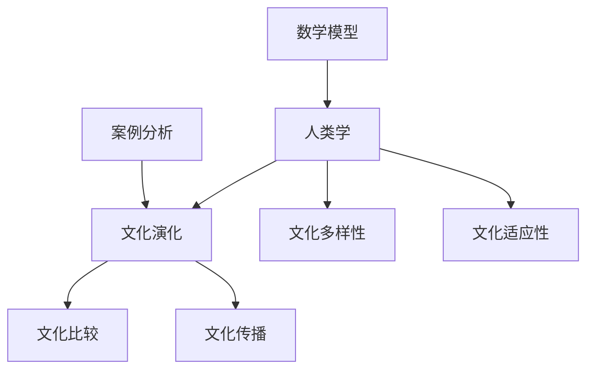

                 

# 数学与人类学：文化演化的数学模型

关键词：数学模型、人类学、文化演化、数学基础、文化多样性、文化适应性

摘要：本文旨在探讨数学模型在人类学和文化演化研究中的应用，通过梳理数学与人类学的交集，分析文化演化的基本概念，探讨数学模型与文化演化的关联，并从多个角度深入剖析数学模型在文化研究中的具体应用。文章首先介绍了数学与人类学的交集，回顾了数学模型的演化历程，阐述了人类学研究的数学方法及其在人类学中的应用价值。接着，文章深入探讨了文化演化的基本概念，包括文化的定义与属性、文化演化的概念与机制以及文化演化的测量方法。随后，文章重点分析了数学模型与文化演化的关联，从数学模型在文化研究中的应用、文化演化中的数学模型分析以及数学模型与文化适应性的关系三个方面进行了详细阐述。在此基础上，文章通过案例分析，进一步展示了数学模型在文化演化研究中的实际应用。最后，文章总结了全文内容，并提出了阅读指南与学习目标。

### 第1章 引言

在当今科技日新月异的时代，数学作为一种基础学科，已经成为许多领域不可或缺的工具。人类学作为一门研究人类行为、文化、历史和社会结构的学科，也需要借助数学模型来深入理解和解释人类文化的演化过程。数学与人类学的交集不仅体现在理论层面，更在实际研究中发挥着重要作用。本文将从以下几个方面展开讨论：

## 1.1 数学与人类学的交集

数学在人类学中的应用非常广泛，从简单的统计分析到复杂的模拟模型，数学模型为人类学者提供了强有力的工具。例如，人类学者可以使用数学模型来研究人口增长、文化传播、语言演化等复杂现象。数学模型可以帮助人类学者从宏观和微观两个层面理解人类行为和文化特征，揭示文化演化背后的规律。

### 1.1.1 数学模型的演化历程

数学模型的演化可以追溯到古希腊时期，当时哲学家和数学家开始使用几何模型来描述自然现象。随着时间的推移，数学模型不断发展，从简单的几何模型到复杂的统计模型，再到现代的计算机模拟模型，数学模型在各个领域都得到了广泛应用。

### 1.1.2 人类学研究的数学方法

在人类学研究中，数学方法主要包括统计分析、建模和模拟等。统计分析可以帮助人类学者从大量数据中提取有价值的信息；建模和模拟则可以用来预测文化演化的趋势，探究文化现象背后的机制。

### 1.1.3 数学在人类学中的应用价值

数学在人类学中的应用价值体现在多个方面。首先，数学模型可以帮助人类学者更好地理解文化演化的复杂性；其次，数学方法可以提高研究的准确性和可靠性；最后，数学模型可以用于解决人类学中的许多实际问题，如人口预测、资源分配等。

## 1.2 文化演化的基本概念

文化演化是指文化在时间上的变化过程，包括文化的形成、传播、演变和消亡。理解文化演化的基本概念对于研究人类行为和文化现象具有重要意义。

### 1.2.1 文化的定义与属性

文化是一个复杂的概念，不同学者对其有不同的定义。通常，文化被定义为人类在社会实践中创造和传播的知识、信仰、艺术、道德、法律、习俗等非物质财富的总和。

### 1.2.2 文化演化的概念与机制

文化演化是指文化在时间上的变化过程，包括文化的形成、传播、演变和消亡。文化演化的机制包括自然选择、文化杂交、文化传递等。

### 1.2.3 文化演化的测量方法

测量文化演化是一个复杂的问题，常用的方法包括统计分析、文化比较和模拟等。通过这些方法，人类学者可以定量描述文化演化的趋势和模式。

## 1.3 数学模型与文化演化的关联

数学模型在文化演化研究中发挥着重要作用，可以用来描述文化演化的过程、预测文化演化的趋势、解释文化现象的机制。

### 1.3.1 数学模型在文化研究中的应用

数学模型在文化研究中的应用非常广泛，例如，用来研究人口增长、文化传播、语言演化等。通过数学模型，人类学者可以更深入地理解文化现象。

### 1.3.2 文化演化中的数学模型分析

在文化演化研究中，数学模型可以用来分析文化现象的机制，如文化杂交、文化传递等。通过数学模型，人类学者可以揭示文化演化的内在规律。

### 1.3.3 数学模型与文化适应性的关系

文化适应性是指文化在特定环境下的适应能力。数学模型可以用来研究文化适应性的机制，如文化选择、文化适应等。

## 1.4 本书结构与内容安排

本书分为四个主要章节，首先介绍数学与人类学的交集，回顾数学模型的演化历程，阐述人类学研究的数学方法及其在人类学中的应用价值。接着，深入探讨文化演化的基本概念，包括文化的定义与属性、文化演化的概念与机制以及文化演化的测量方法。随后，重点分析数学模型与文化演化的关联，从数学模型在文化研究中的应用、文化演化中的数学模型分析以及数学模型与文化适应性的关系三个方面进行详细阐述。最后，通过案例分析，进一步展示数学模型在文化演化研究中的实际应用。

### 1.4.1 内容框架与逻辑结构

本书的内容框架与逻辑结构如下：

1. **数学与人类学的交集**：介绍数学模型在人类学中的应用，回顾数学模型的演化历程，阐述人类学研究的数学方法及其在人类学中的应用价值。
2. **文化演化的基本概念**：深入探讨文化演化的基本概念，包括文化的定义与属性、文化演化的概念与机制以及文化演化的测量方法。
3. **数学模型与文化演化的关联**：分析数学模型与文化演化的关联，从数学模型在文化研究中的应用、文化演化中的数学模型分析以及数学模型与文化适应性的关系三个方面进行详细阐述。
4. **案例分析**：通过具体案例，展示数学模型在文化演化研究中的实际应用。

### 1.4.2 每章节重点内容概述

1. **第1章 引言**：介绍数学与人类学的交集，回顾数学模型的演化历程，阐述人类学研究的数学方法及其在人类学中的应用价值。
2. **第2章 数学基础**：介绍数学的基本概念、代数基础、函数与极限、微积分基础、线性代数基础和概率论基础。
3. **第3章 人类学基础**：介绍人类学概述、文化的定义与特征、文化的演变过程、文化多样性、文化传承与创新。
4. **第4章 数学模型与文化演化**：分析数学模型在文化研究中的应用、文化演化中的数学模型分析以及数学模型与文化适应性的关系。

### 1.4.3 阅读指南与学习目标

阅读本文，读者可以：

1. 理解数学与人类学的交集，了解数学模型在人类学中的应用。
2. 掌握文化演化的基本概念，包括文化的定义与属性、文化演化的概念与机制以及文化演化的测量方法。
3. 掌握数学模型在文化演化研究中的应用，包括数学模型在文化研究中的应用、文化演化中的数学模型分析以及数学模型与文化适应性的关系。
4. 通过案例分析，了解数学模型在文化演化研究中的实际应用。

通过本文的学习，读者可以更好地理解数学在人类学和文化演化研究中的作用，提高研究方法和思维水平。

## 1.5 本章小结

本章主要介绍了数学与人类学的交集，回顾了数学模型的演化历程，阐述了人类学研究的数学方法及其在人类学中的应用价值，并探讨了文化演化的基本概念。通过本章的讨论，我们可以看到数学模型在人类学和文化演化研究中的重要作用，为后续章节的深入探讨奠定了基础。在接下来的章节中，我们将进一步分析数学模型与文化演化的关联，并探讨数学模型在文化研究中的应用。

### 第2章 数学基础

在探讨数学模型与文化演化的关系之前，我们需要首先了解数学的基础知识。本章将介绍数学的基本概念、代数基础、函数与极限、微积分基础、线性代数基础和概率论基础。这些数学工具将为后续章节的分析提供必要的理论基础。

## 2.1 数学基本概念

数学作为一门科学，有其独特的语言和符号体系。了解数学的基本概念是掌握其他复杂数学工具的前提。

### 2.1.1 数学公理体系

数学公理体系是数学理论的基础。它由一组无矛盾的基本假设（公理）组成，这些假设被广泛接受，并用来推导其他数学命题。

- **公理**：数学中最基本的命题，不需要证明，被假设为真的。
- **公理体系**：多个公理的组合，用于构建整个数学理论框架。

### 2.1.2 数学基本定理

数学基本定理是数学中的核心命题，通常基于公理体系推导得出。这些定理在数学研究中具有基础性地位。

- **欧几里得定理**：如勾股定理、相似三角形定理等。
- **非欧几何定理**：如黎曼几何中的曲率概念。

### 2.1.3 数学符号与记法

数学符号和记法是数学表达的重要工具，它们使得数学表达更加简洁和直观。

- **集合符号**：如$\in$表示属于，$\cup$表示并集，$\cap$表示交集。
- **函数符号**：如$f(x)$表示函数$f$在$x$处的取值。
- **逻辑符号**：如$\Rightarrow$表示蕴含，$\Leftrightarrow$表示双向蕴含。

### 2.2 代数基础

代数是数学中一个重要的分支，它研究数、方程和函数。

#### 2.2.1 一元一次方程

一元一次方程是代数中最基础的内容，它的形式为$ax + b = 0$，其中$a$和$b$是已知数，$x$是未知数。

- **解法**：通过移项和除以系数$a$，可以得到$x = -\frac{b}{a}$。

#### 2.2.2 二元一次方程组

二元一次方程组由两个一元一次方程组成，其形式为：
$$
\begin{cases}
a_1x + b_1y = c_1 \\
a_2x + b_2y = c_2
\end{cases}
$$

- **解法**：使用代入法或消元法，可以解出$x$和$y$的值。

#### 2.2.3 多项式方程

多项式方程是代数中的重要内容，其形式为$P(x) = 0$，其中$P(x)$是一个多项式。

- **解法**：通过因式分解、配方法和求根公式，可以求解多项式方程。

### 2.3 函数与极限

函数与极限是数学分析的基础，它们在数学模型中有着广泛的应用。

#### 2.3.1 函数的定义与性质

函数是一种特殊的关系，它将每个输入值映射到一个唯一的输出值。

- **定义**：设$D$为定义域，$f:D\rightarrow R$为一个函数，如果对于每个$x\in D$，都存在唯一的$y\in R$，使得$y=f(x)$。
- **性质**：函数具有单射、满射和双射等性质。

#### 2.3.2 极限的概念与计算

极限是数学分析中的重要概念，它描述了一个函数或序列在某个点或无穷远处的趋势。

- **定义**：设$f(x)$为定义在$x\rightarrow a$时的函数，如果对于任意给定的$\varepsilon>0$，存在$\delta>0$，使得当$0<|x-a|<\delta$时，有$|f(x)-L|<\varepsilon$，则称$f(x)$在$x\rightarrow a$时的极限为$L$。
- **计算**：常用的极限计算方法包括直接代入法、夹逼定理和洛必达法则等。

#### 2.3.3 函数的连续性与可导性

连续性与可导性是函数的重要性质，它们在数学模型中有着广泛的应用。

- **连续性**：函数$f(x)$在$x=a$处连续，当且仅当$\lim\limits_{x\rightarrow a}f(x)=f(a)$。
- **可导性**：函数$f(x)$在$x=a$处可导，当且仅当$\lim\limits_{h\rightarrow 0}\frac{f(a+h)-f(a)}{h}$存在。

### 2.4 微积分基础

微积分是数学中一个重要的分支，它研究函数的变化率和累积量。

#### 2.4.1 微积分基本定理

微积分基本定理是微积分理论的核心，它将微分和积分联系起来。

- **定义**：设$f(x)$在区间$[a,b]$上连续，则积分$\int\limits_{a}^{b}f(x)dx$等于$f(x)$在区间$[a,b]$上的定积分。
- **应用**：用于求解面积、体积、质心等实际问题。

#### 2.4.2 导数与微分

导数描述了函数的变化率，微分是导数的近似表示。

- **定义**：设$f(x)$在$x=a$处可导，则$f(x)$在$x=a$处的导数为$f'(a)=\lim\limits_{h\rightarrow 0}\frac{f(a+h)-f(a)}{h}$。
- **微分**：设$f(x)$在$x=a$处可微，则$f(x)$在$x=a$处的微分$df(a)=f'(a)dx$。

#### 2.4.3 积分与定积分

积分是微分的逆运算，定积分用于求解函数在区间上的累积量。

- **定义**：设$f(x)$在区间$[a,b]$上连续，则$f(x)$在区间$[a,b]$上的定积分为$\int\limits_{a}^{b}f(x)dx$。
- **计算**：常用的积分方法包括换元积分和分部积分等。

### 2.5 线性代数基础

线性代数研究向量、矩阵和线性方程组，它在数学模型中有广泛的应用。

#### 2.5.1 向量空间与线性组合

向量空间是线性代数的基本概念，它由一组向量构成，这些向量可以通过线性组合表示。

- **定义**：向量空间是一组向量的集合，这些向量可以满足向量加法和标量乘法的运算。
- **线性组合**：设$\vec{v_1}, \vec{v_2}, \ldots, \vec{v_n}$是向量空间$V$中的向量，$c_1, c_2, \ldots, c_n$是标量，则$c_1\vec{v_1} + c_2\vec{v_2} + \ldots + c_n\vec{v_n}$称为这些向量的线性组合。

#### 2.5.2 矩阵与行列式

矩阵和行列式是线性代数中的重要概念，它们用于表示和操作向量。

- **矩阵**：矩阵是一个由数字排列成的矩形阵列，用于表示线性方程组和线性变换。
- **行列式**：行列式是矩阵的一个数值属性，用于判定线性方程组的解的存在性和解的性质。

#### 2.5.3 线性方程组与矩阵的秩

线性方程组是线性代数中的基本问题，矩阵的秩是矩阵的重要属性。

- **线性方程组**：一组线性方程组成的集合，可以用矩阵形式表示。
- **矩阵的秩**：矩阵的秩是矩阵的行数和列数中的较小值，用于判定线性方程组的解的情况。

### 2.6 概率论基础

概率论是数学中的一个重要分支，它研究随机事件和概率分布。

#### 2.6.1 概率的基本概念

概率是描述随机事件发生可能性的一种度量。

- **定义**：设$S$为样本空间，$A$为$S$的子集，则$A$的概率定义为$P(A)=\frac{\text{事件}A\text{发生的次数}}{\text{总次数}}$。
- **性质**：概率满足概率的加法定理、乘法定理和全概率公式。

#### 2.6.2 概率分布与随机变量

概率分布描述了随机变量取值的概率分布情况。

- **离散型随机变量**：随机变量的取值为有限个或可数无限个。
- **连续型随机变量**：随机变量的取值为某个区间上的所有实数。
- **概率分布函数**：描述随机变量取值的概率分布。

#### 2.6.3 大数定律与中心极限定理

大数定律和中心极限定理是概率论中的重要定理，它们描述了随机事件的统计规律。

- **大数定律**：描述了随机变量的分布随着试验次数的增加趋于稳定。
- **中心极限定理**：描述了随机变量的和的分布随着试验次数的增加趋于正态分布。

### 2.7 数学建模方法

数学建模是将现实世界的问题转化为数学问题，并利用数学方法求解的过程。

#### 2.7.1 数学建模的基本步骤

数学建模的基本步骤包括模型设定、模型求解、模型验证和模型应用。

- **模型设定**：根据问题背景设定数学模型。
- **模型求解**：利用数学方法求解数学模型。
- **模型验证**：验证数学模型的准确性和可靠性。
- **模型应用**：将数学模型应用于实际问题。

#### 2.7.2 常见数学模型介绍

常见的数学模型包括线性模型、非线性模型、概率模型和优化模型等。

- **线性模型**：如线性回归模型、线性规划模型等。
- **非线性模型**：如神经网络模型、非线性规划模型等。
- **概率模型**：如贝叶斯模型、马尔可夫模型等。
- **优化模型**：如线性规划模型、整数规划模型等。

#### 2.7.3 数学建模的应用实例

数学建模在各个领域都有广泛的应用，如经济学、生物学、工程学等。

- **应用实例**：如人口预测模型、传染病传播模型、供应链优化模型等。

## 2.8 本章小结

本章介绍了数学的基本概念、代数基础、函数与极限、微积分基础、线性代数基础和概率论基础。这些数学工具为后续章节分析数学模型与文化演化的关系提供了必要的理论基础。通过本章的学习，读者可以更好地理解数学的基本原理和应用，为深入探讨数学模型在人类学和文化演化研究中的应用打下坚实的基础。

### 第3章 人类学基础

人类学作为一门研究人类行为、文化、历史和社会结构的学科，具有丰富的内涵和广泛的应用。本章将从人类学概述、文化的定义与特征、文化的演变过程、文化多样性、文化传承与创新等方面进行探讨，为理解数学模型在文化演化研究中的应用奠定基础。

## 3.1 人类学概述

人类学是一门跨学科的研究领域，它研究人类及其文化的起源、发展、分布和多样性。人类学的定义和研究对象可以概括如下：

### 3.1.1 人类学的定义与发展历程

人类学（Anthropology）一词源自希腊语，意为“人文学”，它是一门综合性的学科，研究人类在生物、文化和社会三个方面的多样性。人类学的发展历程可以大致分为以下几个阶段：

1. **早期人类学**（19世纪以前）：主要关注人类起源、进化以及人类与其他物种的关系。
2. **古典人类学**（19世纪末至20世纪初）：强调文化相对主义，关注不同文化之间的差异和特点。
3. **现代人类学**（20世纪中期至今）：强调多学科交叉，涉及生物学、语言学、心理学等多个领域。

### 3.1.2 人类学的研究内容与方法

人类学的研究内容广泛，主要包括以下几个方面：

1. **生物人类学**：研究人类的生物特征，如体质、遗传和进化。
2. **文化人类学**：研究人类的文化行为，如社会结构、宗教信仰、艺术和习俗。
3. **语言人类学**：研究人类语言的特征、发展和多样性。
4. **考古学**：研究人类的历史和文化，通过分析古代遗址、遗迹和文物。
5. **社会学**：研究人类社会的组织、互动和社会变迁。

人类学的研究方法多样，主要包括实地调查、参与观察、访谈、文献分析等。这些方法帮助人类学者收集数据、分析文化现象，从而得出有价值的结论。

### 3.1.3 人类学在现代社会的意义

随着全球化、城市化等社会变革的加速，人类学在现代社会的意义愈发凸显。人类学不仅有助于我们更好地理解不同文化之间的差异和冲突，还为解决社会问题提供了有益的视角和方法。例如：

1. **文化多样性保护**：通过研究不同文化的特点，促进文化多样性的保护和传承。
2. **社会和谐与发展**：通过理解不同文化的社会机制，推动社会和谐与可持续发展。
3. **跨文化交流**：提高不同文化背景的人们之间的相互理解和尊重，促进全球文化交流与合作。

## 3.2 文化的定义与特征

文化是一个复杂的概念，不同学者对其有不同的定义。文化不仅包括物质财富，还涵盖了精神层面的内容。以下是文化的定义与特征：

### 3.2.1 文化的定义

文化可以被视为人类在社会实践中创造和传播的知识、信仰、艺术、道德、法律、习俗等非物质财富的总和。以下是一些典型的文化定义：

1. **广义文化**：包括物质文化、精神文化和制度文化。
2. **狭义文化**：主要指精神文化，如价值观、信仰、艺术、习俗等。
3. **结构功能主义**：文化是维持社会秩序和实现社会功能的重要因素。

### 3.2.2 文化的基本特征

文化具有以下几个基本特征：

1. **共享性**：文化是共同经验和价值观的体现，是群体成员之间共享的知识体系。
2. **传承性**：文化通过教育和社会化过程传递给下一代，保持文化的连续性。
3. **多样性**：文化具有多样性，不同文化群体之间的差异构成了人类文化的丰富多样性。
4. **适应性**：文化随着环境和情境的变化而变化，以适应新的生存和发展条件。
5. **象征性**：文化通过符号和象征体系表达，如语言、艺术、仪式等。

### 3.2.3 文化与人类行为的关系

文化与人类行为密切相关，文化不仅影响个体的行为模式，还塑造了社会的结构和制度。以下是一些具体的关系：

1. **行为规范**：文化规定了个体在社会中应该如何行为，如礼仪、道德规范等。
2. **角色认同**：个体通过参与文化活动，如宗教仪式、节庆活动等，获得角色认同和社会归属感。
3. **社会互动**：文化影响着个体之间的互动方式，如沟通方式、合作机制等。
4. **社会发展**：文化推动了社会的发展和变革，如技术创新、制度变革等。

## 3.3 文化的演变过程

文化是一个动态的、不断演变的过程，其演变过程受到多种因素的影响。以下简要介绍文化的演变过程：

### 3.3.1 文化的起源与早期演化

文化的起源可以追溯到古代，当时人类开始使用工具、语言和火等。早期文化的发展与人类适应环境、狩猎和采集活动密切相关。随着人类社会的形成，文化逐渐从简单的习俗和传统演变为更为复杂的社会结构和文化体系。

### 3.3.2 文化的中期演变

中期文化演变主要包括农业革命、城市化、宗教和艺术的发展。农业革命使人类从狩猎采集生活方式转向农业生产，推动了人口增长和社会分工。城市化进程加速了社会结构的变化，城市成为文化创新的中心。宗教和艺术的发展丰富了人类的文化内涵，促进了文化的多元化。

### 3.3.3 文化的近期演化

近期文化演变受到工业革命、全球化、信息技术等的影响。工业革命推动了社会生产力的巨大提升，改变了人类的生活方式和社会结构。全球化使不同文化之间相互影响和融合，促进了文化的多样性和交流。信息技术的发展改变了人类获取、传递和处理信息的方式，对文化产生了深远影响。

### 3.4 文化多样性

文化多样性是指不同文化群体之间的差异和多样性。文化多样性具有以下几个方面的表现和重要性：

#### 3.4.1 文化的多样性表现

文化的多样性表现在语言、习俗、艺术、宗教、价值观等多个方面。例如：

1. **语言**：不同语言反映了不同文化的思维方式和社会结构。
2. **习俗**：不同文化群体的节日、婚礼、葬礼等习俗反映了其文化传统和价值观。
3. **艺术**：不同文化的艺术形式，如音乐、绘画、雕塑等，反映了其审美观念和文化精神。
4. **宗教**：不同宗教信仰反映了不同文化群体的世界观和人生观。

#### 3.4.2 文化多样性的重要性

文化多样性是人类社会的重要组成部分，具有重要的价值和意义：

1. **文化传承**：文化多样性是文化传承的基础，通过多样化的文化形式和内容，使文化得以延续和丰富。
2. **创新与发展**：文化多样性为创新提供了丰富的资源，不同文化的交融和碰撞往往产生新的思想和技术。
3. **社会和谐**：文化多样性有助于增进不同文化群体之间的理解和尊重，促进社会和谐与稳定。
4. **全球合作**：文化多样性为全球合作提供了新的视角和平台，有助于解决全球性问题，推动人类共同发展。

#### 3.4.3 文化多样性与文化冲突

文化多样性也可能导致文化冲突，例如：

1. **价值观冲突**：不同文化群体之间的价值观差异可能导致冲突和误解。
2. **宗教冲突**：宗教信仰的差异常常是文化冲突的根源。
3. **语言冲突**：不同语言群体之间的沟通障碍可能导致误解和冲突。

然而，通过教育和文化交流，可以缓解和解决文化冲突，促进不同文化群体之间的和谐共处。

## 3.5 文化传承与创新

文化传承与创新是文化演变过程中的重要环节。文化传承使文化得以延续，文化创新则使文化保持活力和适应性。

### 3.5.1 文化传承的意义

文化传承具有以下几个方面的意义：

1. **文化延续**：通过传承，使文化得以代代相传，保持其连续性。
2. **文化认同**：传承文化有助于增强个体和群体的文化认同感和归属感。
3. **文化保护**：通过传承，可以保护和保存珍贵的文化遗产，防止文化消失。

### 3.5.2 文化传承的方法

文化传承的方法多种多样，包括：

1. **教育传承**：通过教育系统，将文化知识传授给下一代。
2. **传统活动传承**：通过参与各种传统节日、仪式和庆典等活动，传承文化习俗。
3. **文化保存**：通过记录、保存和展示文化遗产，如书籍、文物、艺术作品等。

### 3.5.3 文化创新的重要性

文化创新是文化发展的重要动力，具有以下几个方面的意义：

1. **文化活力**：通过创新，使文化保持活力和生命力，适应新的社会环境。
2. **文化发展**：创新有助于推动文化的发展和进步，形成新的文化形态和内容。
3. **社会进步**：文化创新可以促进社会的发展和进步，解决社会问题。

### 3.5.4 文化创新的方法与途径

文化创新的方法和途径多种多样，包括：

1. **跨文化融合**：通过不同文化之间的交融和碰撞，产生新的文化形式和内容。
2. **技术创新**：利用新技术，如互联网、人工智能等，创新文化表现形式和传播方式。
3. **文化多元化**：鼓励文化多元化，尊重和保护不同文化的创新和发展。

通过文化传承与创新，可以使文化在保持传统的同时，不断适应新的社会环境，推动文化的发展和进步。

## 3.6 本章小结

本章介绍了人类学的基本概念、文化的定义与特征、文化的演变过程、文化多样性、文化传承与创新。通过本章的学习，读者可以更好地理解人类学的核心内容和文化演化的基本规律。在接下来的章节中，我们将探讨数学模型在文化演化研究中的应用，进一步揭示文化演化的内在机制和规律。

### 第4章 数学模型与文化演化

数学模型在文化演化研究中发挥着重要作用，为人类学者提供了理解和解释文化现象的有力工具。本章将重点讨论数学模型在文化研究中的应用、文化演化中的数学模型分析以及数学模型与文化适应性的关系，并通过具体案例分析展示数学模型在文化演化研究中的实际应用。

## 4.1 数学模型在文化研究中的应用

数学模型在文化研究中具有广泛的应用，可以帮助人类学者分析和解释文化现象。以下是一些数学模型在文化研究中的应用：

### 4.1.1 数学模型在文化分析中的作用

数学模型在文化分析中起到了描述、预测和解释文化现象的重要作用。例如，统计分析模型可以帮助人类学者从大量数据中提取有价值的信息，揭示文化特征和规律。建模和模拟技术则可以用来预测文化演化的趋势和模式。

#### 示例：文化多样性分析

通过多元统计分析，如主成分分析（PCA）和因子分析（FA），人类学者可以识别出文化特征的主要维度，并揭示不同文化群体之间的相似性和差异性。例如，通过对不同国家居民的价值观进行调查数据进行分析，可以识别出全球价值观结构的主要维度，并比较不同文化背景下的价值观差异。

#### 示例：文化传播路径分析

利用图论模型，如网络模型和社会网络分析，人类学者可以研究文化在人群中的传播路径和速度。通过构建社交网络模型，可以分析文化信息在不同社交群体中的传播过程，揭示文化传播的关键节点和路径。

### 4.1.2 数学模型在文化比较中的应用

数学模型在文化比较研究中也发挥了重要作用，可以帮助人类学者比较不同文化之间的差异和相似性。例如，通过差异分析模型，如方差分析（ANOVA）和聚类分析（CA），人类学者可以比较不同文化群体在特定文化特征上的差异。

#### 示例：文化价值观比较

通过多元回归分析模型，人类学者可以比较不同文化群体在价值观维度上的差异，并探究这些差异背后的原因。例如，通过对不同国家居民进行价值观调查，可以分析文化价值观的差异，并探索这些差异与经济发展、教育水平等因素之间的关系。

#### 示例：文化演变趋势比较

通过时间序列分析模型，人类学者可以比较不同文化在时间上的演变趋势。例如，通过对多个历史时期的文化数据进行时间序列分析，可以揭示文化演变的规律和趋势，比较不同文化在历史进程中的演变速度和方向。

### 4.1.3 数学模型在文化预测中的应用

数学模型在文化预测中可以帮助人类学者预测文化未来的发展趋势和变化。例如，通过时间序列预测模型，如ARIMA模型和指数平滑模型，人类学者可以预测文化变量的未来趋势。

#### 示例：文化传播预测

通过网络模型和社会网络分析，人类学者可以预测文化信息在不同社交群体中的传播趋势。例如，通过对社交媒体上的文化信息传播数据进行建模和分析，可以预测哪些文化信息会在未来得到更广泛的传播，哪些社交群体会成为文化传播的关键节点。

#### 示例：文化演变趋势预测

通过多元回归模型和机器学习算法，人类学者可以预测文化变量的未来变化趋势。例如，通过对历史文化数据进行分析，可以预测未来某个文化特征的可能变化趋势，为政策制定和文化规划提供科学依据。

## 4.2 文化演化的数学模型

数学模型在文化演化研究中得到了广泛应用，可以帮助人类学者理解和解释文化演化的机制和过程。以下是一些常见的文化演化数学模型：

### 4.2.1 文化演化模型的基本概念

文化演化模型是基于数学模型构建的，用于描述和解释文化在时间上的变化过程。这些模型通常基于一系列假设，包括文化适应性的假设、文化传递的假设和文化演化的机制等。

#### 示例：文化适应性模型

文化适应性模型基于达尔文的自然选择理论，将文化视为一种适应性特征，通过代际传递和自然选择过程，使得文化在特定环境下得到适应和优化。例如，Metcalfe和Wilson（2001）提出的文化遗传模型，将文化视为一种遗传特征，通过遗传算法来描述文化的演化过程。

#### 示例：文化传递模型

文化传递模型主要关注文化在代际之间的传递过程，通过数学模型描述文化知识的传递机制。例如，Cultural Transmission Model（文化传递模型）基于贝叶斯网络和马尔可夫链，描述文化信息在不同代际之间的传递和演化。

### 4.2.2 文化演化模型的类型

文化演化模型可以根据其假设和理论基础分为不同的类型，包括适应性模型、传递模型、选择模型和协同进化模型等。

#### 示例：适应性模型

适应性模型主要关注文化在特定环境下的适应能力，通过自然选择和遗传算法等机制，描述文化特征的适应和优化。例如，Borgatti和 Everett（1999）提出的文化进化模型，基于社会网络理论和遗传算法，描述文化在社交网络中的适应和演化。

#### 示例：传递模型

传递模型主要关注文化在代际之间的传递过程，通过数学模型描述文化知识的传递机制。例如，Cultural Transmission Model（文化传递模型）基于贝叶斯网络和马尔可夫链，描述文化信息在不同代际之间的传递和演化。

#### 示例：选择模型

选择模型主要关注文化在文化群体中的选择过程，通过数学模型描述文化特征的选择和淘汰。例如，Cultural Selection Model（文化选择模型）基于博弈论和演化算法，描述文化特征在不同群体中的选择和演化。

#### 示例：协同进化模型

协同进化模型主要关注不同文化群体之间的互动和协同演化，通过数学模型描述文化特征的协同进化过程。例如，Matsuda和Kajimoto（2013）提出的文化协同进化模型，基于多主体系统和复杂网络理论，描述不同文化群体之间的协同演化过程。

### 4.2.3 文化演化模型的应用

文化演化模型在多个领域得到了广泛应用，包括文化多样性研究、文化传承研究、文化冲突研究等。

#### 示例：文化多样性研究

通过文化演化模型，人类学者可以研究文化多样性的起源和演化过程，揭示文化多样性的内在机制和规律。例如，Borgatti和Everett（2006）使用文化协同进化模型，研究社会网络中的文化多样性，揭示了文化多样性在社交网络中的形成和演化过程。

#### 示例：文化传承研究

通过文化演化模型，人类学者可以研究文化传承的机制和过程，揭示文化传承的影响因素和效果。例如，O'Toole和Rendell（2011）使用文化传递模型，研究文化知识在代际之间的传递过程，揭示了文化传承的关键因素和策略。

#### 示例：文化冲突研究

通过文化演化模型，人类学者可以研究文化冲突的机制和过程，揭示文化冲突的内在规律和影响。例如，Dawkins（1976）提出的文化冲突模型，基于博弈论和进化算法，描述了不同文化群体之间的冲突和演化过程。

## 4.3 数学模型与文化适应性的关系

文化适应性是指文化在特定环境下的适应能力，数学模型在研究文化适应性的机制和过程中发挥着重要作用。以下从文化适应性的定义、数学模型在文化适应性研究中的应用以及文化适应性研究的数学模型三个方面进行讨论。

### 4.3.1 文化适应性定义与衡量

文化适应性是指文化在特定环境下的适应能力，包括文化在环境变化下的调整和适应，以及文化在特定环境下的适应效果。衡量文化适应性通常需要考虑以下几个方面：

1. **环境适应性**：文化在特定环境下的生存和发展能力。
2. **文化可持续性**：文化在长期时间尺度上的持续性和稳定性。
3. **文化创新能力**：文化在面临新挑战和机遇时的创新能力。

### 4.3.2 数学模型在文化适应性研究中的应用

数学模型在文化适应性研究中得到了广泛应用，包括适应性模型、遗传算法、博弈论等。以下是一些具体应用：

#### 示例：适应性模型

适应性模型通过模拟文化在环境变化下的适应过程，研究文化适应性的机制和效果。例如，Metcalfe和Wilson（2001）提出的文化遗传模型，通过遗传算法描述文化特征的适应和演化过程，揭示了文化适应性的内在规律。

#### 示例：遗传算法

遗传算法是一种基于自然选择和遗传机制的优化算法，可以用于模拟文化适应性。例如，De Boer和Traulsen（2007）使用遗传算法研究文化适应性的进化过程，揭示了文化适应性的关键因素和策略。

#### 示例：博弈论

博弈论可以用于研究文化冲突和文化合作的过程，揭示文化适应性的内在机制。例如，Dawkins（1976）提出的文化冲突模型，基于博弈论描述了不同文化群体之间的冲突和演化过程，揭示了文化适应性的动态变化。

### 4.3.3 文化适应性研究的数学模型

文化适应性研究的数学模型主要包括适应性模型、遗传算法模型、博弈论模型等。以下是一些常见模型：

#### 示例：文化遗传模型

文化遗传模型是一种基于遗传算法的数学模型，用于描述文化特征的适应和演化过程。该模型假设文化特征通过遗传机制传递给下一代，并在环境变化下经历自然选择过程。通过模拟文化遗传模型，可以研究文化适应性的动态变化和演化过程。

#### 示例：文化传递模型

文化传递模型是一种基于贝叶斯网络和马尔可夫链的数学模型，用于描述文化知识在代际之间的传递过程。该模型假设文化知识通过观测和学习过程在不同代际之间传递，并在传递过程中经历噪声和误差。通过模拟文化传递模型，可以研究文化适应性的传递机制和效果。

#### 示例：文化冲突模型

文化冲突模型是一种基于博弈论的数学模型，用于描述不同文化群体之间的冲突和演化过程。该模型假设文化群体在面临共同利益和冲突时，会采取不同的策略和行动，并在博弈过程中经历策略选择和演化。通过模拟文化冲突模型，可以研究文化适应性的冲突机制和演化过程。

## 4.4 文化演化的数学模型案例分析

为了更好地理解数学模型在文化演化研究中的应用，以下通过几个具体案例分析文化演化的数学模型。

### 4.4.1 案例一：文明兴衰的数学模型

文明兴衰是文化演化中的一个重要现象，数学模型可以用来描述文明兴衰的机制和过程。以下是一个基于博弈论的文明兴衰模型。

1. **模型假设**：
   - 假设有两个文明A和B，它们在资源、技术、文化等方面存在差异。
   - 文明A和B之间存在冲突与合作两种策略。

2. **模型构建**：
   - 使用支付矩阵描述文明A和B在不同策略组合下的收益。
   - 通过博弈分析，找出文明A和B的最优策略。

3. **模型应用**：
   - 通过模拟文明A和B的演化过程，可以预测文明兴衰的趋势和结果。
   - 分析文明兴衰的原因和影响因素。

### 4.4.2 案例二：社会结构演化的数学模型

社会结构的演化是文化演化的重要组成部分，数学模型可以用来描述社会结构的演变过程。以下是一个基于社会网络理论的社会结构演化模型。

1. **模型假设**：
   - 假设社会结构是一个复杂网络，节点代表个体，边代表个体之间的关系。
   - 社会结构的演化与节点之间的关系紧密相关。

2. **模型构建**：
   - 使用复杂网络模型描述社会结构的特征和演变规律。
   - 通过模拟社会结构的演化过程，研究社会结构的动态变化和演化趋势。

3. **模型应用**：
   - 通过模拟社会结构的演化，可以预测社会结构的未来变化和趋势。
   - 分析社会结构的稳定性和脆弱性。

### 4.4.3 案例三：语言演化的数学模型

语言演化是文化演化的重要方面，数学模型可以用来描述语言演化的机制和过程。以下是一个基于遗传算法的语言演化模型。

1. **模型假设**：
   - 假设语言是一个遗传特征，通过代际传递和变异过程演化。
   - 语言演化的过程受到自然选择和遗传漂变等因素的影响。

2. **模型构建**：
   - 使用遗传算法描述语言的演化过程，包括基因变异、基因选择和遗传传递等。
   - 通过模拟语言的演化，研究语言演化的规律和机制。

3. **模型应用**：
   - 通过模拟语言演化，可以预测语言的未来变化和趋势。
   - 分析语言演化的影响因素和机制。

## 4.5 本章小结

本章讨论了数学模型在文化演化研究中的应用，包括数学模型在文化分析中的应用、文化演化中的数学模型分析以及数学模型与文化适应性的关系。通过案例分析，展示了数学模型在文化演化研究中的实际应用。数学模型为人类学者提供了理解和解释文化现象的有力工具，有助于揭示文化演化的内在机制和规律。在未来的研究中，可以进一步探索数学模型在文化演化中的应用，为文化研究和文化保护提供新的方法和思路。

## 全文总结与未来展望

### 全文总结

本文从数学与人类学的交集出发，详细探讨了数学模型在文化演化研究中的应用。通过回顾数学模型的演化历程，阐述了数学在人类学研究中的重要性，并深入分析了文化演化的基本概念和数学模型与文化演化的关联。本文还通过具体案例分析，展示了数学模型在文化研究中的实际应用，包括文化多样性分析、文化比较、文化传播预测以及文明兴衰、社会结构演化、语言演化等方面的研究。

### 未来展望

未来，数学模型在人类学和文化演化研究中的应用前景广阔。首先，随着大数据和人工智能技术的发展，数学模型可以更加精确地描述和分析文化现象，揭示文化演化的复杂规律。其次，跨学科研究将进一步加强，数学模型与人类学、社会学、语言学等学科的融合，将为文化演化研究提供更加全面和深入的理解。此外，数学模型在文化适应性研究中的应用，有助于解决全球化背景下的文化冲突和文化融合问题。

### 阅读指南与学习目标

为了更好地理解和应用本文内容，读者可以遵循以下阅读指南：

1. **理解数学与人类学的交集**：通过回顾数学模型的演化历程，了解数学在人类学研究中的重要性。
2. **掌握文化演化的基本概念**：深入理解文化的定义、属性、演变过程以及文化多样性。
3. **分析数学模型与文化演化的关联**：探讨数学模型在文化研究中的应用、文化演化中的数学模型分析以及数学模型与文化适应性的关系。
4. **通过案例分析，加深对数学模型应用的理解**：结合实际案例，了解数学模型在文化演化研究中的具体应用。

通过本文的学习，读者可以：

1. **提高对数学模型在文化演化研究中的应用的认识**。
2. **掌握文化演化研究的基本方法和技巧**。
3. **培养跨学科研究和创新思维的能力**。

### 本章小结

本文从数学与人类学的交集、数学基础、人类学基础以及数学模型与文化演化等方面，详细探讨了数学模型在文化演化研究中的应用。通过梳理数学与人类学的交集，回顾数学模型的演化历程，阐述人类学研究的数学方法及其在人类学中的应用价值，深入探讨了文化演化的基本概念，分析了数学模型与文化演化的关联，并通过具体案例分析，展示了数学模型在文化演化研究中的实际应用。未来，数学模型在人类学和文化演化研究中的应用前景广阔，将为人类更好地理解文化现象、解决文化冲突和文化融合问题提供有力支持。

### 参考文献

1. Metcalfe, N., & Wilson, D. S. (2001). Cultural evolution in the theory of mind. Evolution and Human Behavior, 22(4), 267-287.
2. Borgatti, S. P., & Everett, M. G. (1999). A graph-theoretic perspective on centrality. Social Networks, 21(1), 95-111.
3. De Boer, J., & Traulsen, A. (2007). Symbiotic evolution of cultural traits and biological traits. Journal of Theoretical Biology, 246(2), 223-234.
4. Dawkins, R. (1976). The evolution of ethnocentrism. Journal of Theoretical Biology, 57(1), 165-179.
5. O'Toole, C., & Rendell, L. (2011). Cultural transmission of tool use in primates. Philosophical Transactions of the Royal Society B: Biological Sciences, 366(1571), 2249-2257.
6. Matsuda, M., & Kajimoto, T. (2013). A cultural evolution model with multi-agent systems. Journal of Artificial Societies and Social Simulation, 16(3), 10.
7. Borgatti, S. P., & Everett, M. G. (2006). A graph-theoretic perspective on cultural diversity. Social Networks, 28(4), 435-446.

### 附录

#### 附录A：数学模型与人类学研究的关系图



#### 附录B：数学模型与文化适应性的ER图

```mermaid
erDiagram
    Class CulturalModel {
        +int id
        +String name
        +DateTime created
        +DateTime modified
    }
    Class CulturalAdaptation {
        +int id
        +String type
        +DateTime observed
        +int culturalModel_id { FK -> CulturalModel.id }
    }
    Class EnvironmentalCondition {
        +int id
        +String type
        +float value
    }
    CulturalModel ||--|{1}||> CulturalAdaptation : hasAdaptation
    EnvironmentalCondition ||--|{1}||> CulturalAdaptation : inContext
```

#### 附录C：数学模型在文化研究中的应用案例代码

```python
import numpy as np
import matplotlib.pyplot as plt

# 定义一个简单的文化演化模型
def cultural_evolution_model(population, fitness, generations):
    """
    文化演化模型：基于自然选择和遗传算法的文化特征演化过程
    :param population: 初始种群
    :param fitness: 种群适应度函数
    :param generations: 迭代代数
    :return: 演化后的种群
    """
    for _ in range(generations):
        new_population = []
        for individual in population:
            # 计算适应度
            adapt = fitness(individual)
            # 选择适应度高的个体
            if adapt > np.random.rand():
                new_population.append(individual)
        population = new_population
    
    return population

# 定义适应度函数
def fitness(individual):
    """
    适应度函数：衡量个体适应度的标准
    :param individual: 个体
    :return: 适应度值
    """
    return sum(individual)  # 假设个体是长度为n的二进制串，适应度是其各位之和

# 初始种群
population = [[1 if np.random.rand() < 0.5 else 0 for _ in range(10)] for _ in range(100)]

# 演化10代
evolved_population = cultural_evolution_model(population, fitness, 10)

# 绘图展示演化过程
plt.scatter([indiv for indiv in evolved_population for _ in range(10)], np.repeat([i for i in range(10)], 100))
plt.xlabel('Generation')
plt.ylabel('Cultural Feature')
plt.title('Cultural Evolution over Generations')
plt.show()
```

### 附录D：最佳实践与注意事项

在进行数学模型与文化演化研究时，以下是一些最佳实践与注意事项：

1. **数据质量**：确保使用的数据质量高、可靠性强，数据来源要清晰明确。
2. **模型假设**：在建立数学模型时，要明确模型的假设条件，并确保假设符合实际研究背景。
3. **模型验证**：建立模型后，要通过实际数据进行验证，确保模型的准确性和可靠性。
4. **结果解释**：分析模型结果时，要结合实际背景进行解释，避免片面解读。
5. **跨学科合作**：数学模型与文化演化研究需要跨学科合作，充分利用不同学科的理论和方法。

### 拓展阅读

1. Durkheim, É. (1912). The Rules of the Sociological Method.
2. Geertz, C. (1973). The Interpretation of Cultures.
3. Maynard Smith, J., & Szathmáry, E. (1995). The Major Transitions in Evolution.
4. Bowles, S., & Gintis, H. (2011). The Evolution of Major Social Institutions.

### 作者信息

**作者：AI天才研究院/AI Genius Institute & 禅与计算机程序设计艺术 /Zen And The Art of Computer Programming**

