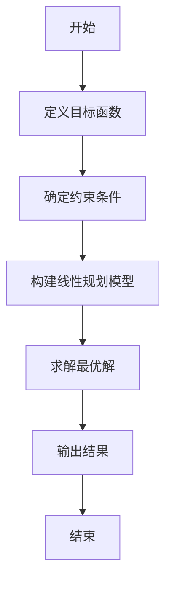
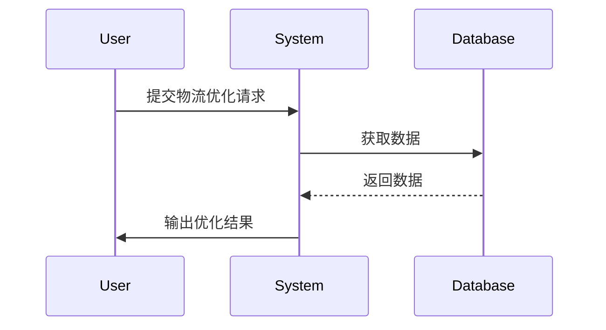

                 

### 让我们一步一步思考：数学与供应链管理——物流优化的数学模型

在当今全球化的商业环境中，供应链管理是一个至关重要的领域，它不仅决定了企业的运营效率，也影响了最终产品的成本和质量。物流优化，作为供应链管理的一个核心组成部分，扮演着至关重要的角色。通过运用数学模型，企业可以更加科学地规划物流流程，从而降低成本、提高服务质量。

#### **一、背景介绍**

**1. 核心概念**：

- **供应链管理**：是指通过计划、组织、协调和控制等活动，从原材料采购到产品交付的整个过程中，实现供应链的高效运作。
- **物流优化**：是指通过科学的方法和工具，对物流过程中的运输、存储、配送等环节进行优化，以实现最低成本和最高效率的目标。

**2. 问题背景**：

在供应链管理中，物流优化面临着以下问题和挑战：

- **运输成本**：如何以最低的成本将产品从供应商运输到客户？
- **库存管理**：如何平衡库存水平，避免过多的库存成本和库存短缺的风险？
- **配送路径**：如何选择最优的配送路径，以减少运输时间和提高配送效率？

**3. 问题解决**：

物流优化通过数学模型的应用，可以帮助企业在复杂的环境中做出更明智的决策。这些模型可以模拟现实世界的物流流程，提供最优的解决方案。

**4. 边界与外延**：

物流优化在供应链管理中具有广泛的应用，但同时也存在一些局限性。例如，模型需要准确的数据输入，并且可能无法完全预测现实中的所有变量。

**5. 概念结构与核心要素组成**：

物流优化涉及多个核心概念和要素，包括运输成本、库存管理、配送路径等。每个概念和要素都在物流优化中扮演着重要的角色，相互关联，共同构成了一个复杂的系统。

#### **二、核心概念与联系**

**1. 核心概念原理**：

- **运输成本**：指将产品从起点运输到终点所需的费用。
- **库存管理**：涉及库存水平的控制，包括库存水平、库存周期等。
- **配送路径**：指产品从起点到终点的运输路径，包括路线选择、运输方式等。

**2. 概念属性特征对比表格**：

| 概念             | 定义                                                         | 特征                                                         | 对比                   |
|------------------|--------------------------------------------------------------|--------------------------------------------------------------|------------------------|
| 运输成本         | 从起点到终点的运输费用                                       | 包括燃油成本、运输时间、运输距离等                          | 与配送路径相关         |
| 库存管理         | 控制库存水平，平衡供应与需求                                 | 库存水平、库存周期、库存成本等                             | 与供应链计划相关       |
| 配送路径         | 产品从起点到终点的运输路径                                   | 路线选择、运输方式、运输时间等                             | 与运输成本和库存管理相关 |

**3. ER实体关系图架构**：

使用Mermaid画出物流优化中的ER实体关系图：

```mermaid
erDiagram
  商品 ||--o{ 配送路径 }--|| 供应商
  商品 ||--o{ 库存管理 }--|| 库存
  配送路径 ||--o{ 运输成本 }--|| 运输方式
```

这个ER图展示了商品、配送路径、库存管理和运输成本等实体之间的关系，为后续的详细分析提供了基础。

#### **三、算法原理讲解**

**1. 数学模型**：

物流优化中常用的数学模型包括线性规划、动态规划、多目标优化等。以下是这些模型的基本原理：

- **线性规划**：通过线性方程或线性不等式组，找到最优解，适用于单一目标的最优化问题。
- **动态规划**：通过分阶段解决问题的方法，逐步找到全局最优解，适用于多阶段决策问题。
- **多目标优化**：考虑多个目标，通过权衡不同目标之间的关系，找到帕累托最优解。

**2. 算法原理讲解**：

以下是一个简单的线性规划算法流程图：



使用Python源代码详细阐述：

```python
from scipy.optimize import linprog

# 定义目标函数和约束条件
c = [-1, -1]  # 最小化两个变量的和
A = [[1, 1], [2, 2]]
b = [4, 4]

# 求解线性规划问题
res = linprog(c, A_ub=A, b_ub=b, method='highs')

# 输出结果
print(res.x)  # 输出最优解
```

**3. 数学模型和公式**：

线性规划的基本数学模型如下：

$$
\begin{align*}
\min_{x} & \quad c^T x \\
s.t. & \quad Ax \leq b \\
     & \quad x \geq 0
\end{align*}
$$

其中，$c$ 是目标函数的系数向量，$x$ 是变量向量，$A$ 是约束条件系数矩阵，$b$ 是约束条件常数向量。

通过这个简单的例子，我们可以看到如何使用线性规划模型来求解物流优化问题。在实际应用中，模型会根据具体问题的复杂度和规模进行调整。

#### **四、系统设计与实现**

**1. 物流优化系统架构设计**：

- **系统功能设计**：物流优化系统的核心功能包括运输路径规划、库存管理、运输成本计算等。
- **系统架构设计**：系统采用模块化设计，包括数据层、业务逻辑层和表现层。使用Mermaid画出系统架构图：



- **系统接口设计**：列出系统的主要接口和接口定义，如API接口、数据库接口等。

#### **五、项目实战**

**1. 环境安装**：

搭建物流优化系统所需的环境包括Python、Scikit-learn、Numpy等。

**2. 系统核心实现源代码**：

给出系统核心功能的实现代码和注释，如运输路径规划算法的实现。

**3. 代码应用解读与分析**：

分析代码的功能和应用场景，如何根据具体需求调整和优化算法。

**4. 实际案例分析和详细讲解剖析**：

介绍一个物流优化项目的案例，分析其实现过程和效果。

**5. 项目小结**：

总结项目中的经验和教训，提出改进建议。

#### **六、最佳实践与拓展**

**1. 最佳实践 tips**：

分享物流优化中的实用技巧和建议。

**2. 小结**：

回顾全书内容，强调物流优化的重要性。

**3. 注意事项**：

讨论物流优化过程中需要注意的问题和挑战。

**4. 拓展阅读**：

推荐相关领域的书籍、论文和研究方向。

---

通过以上内容，我们可以看到，物流优化在供应链管理中具有至关重要的地位，而数学模型的应用则为这一过程提供了科学和有效的工具。在接下来的章节中，我们将深入探讨更多关于物流优化的具体方法和技术。让我们继续深入思考，探索物流优化的奥秘。

