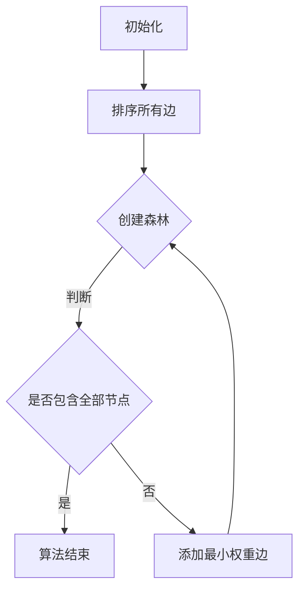
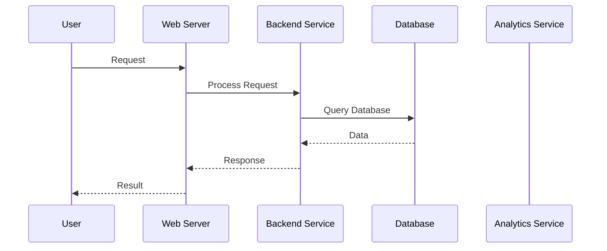
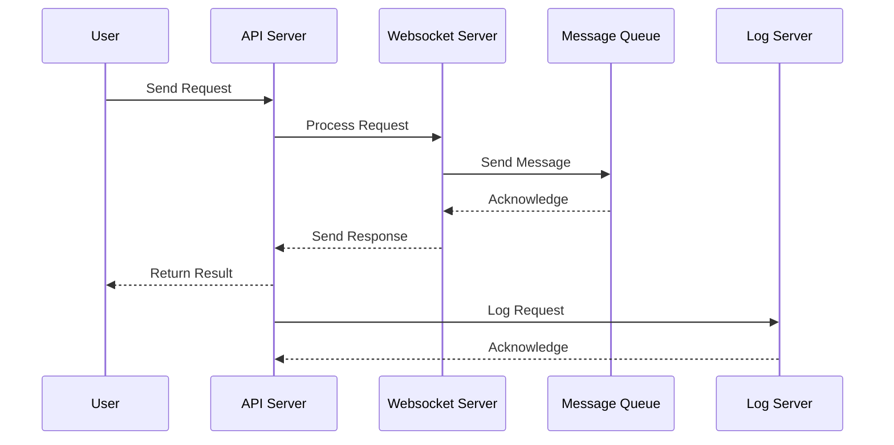
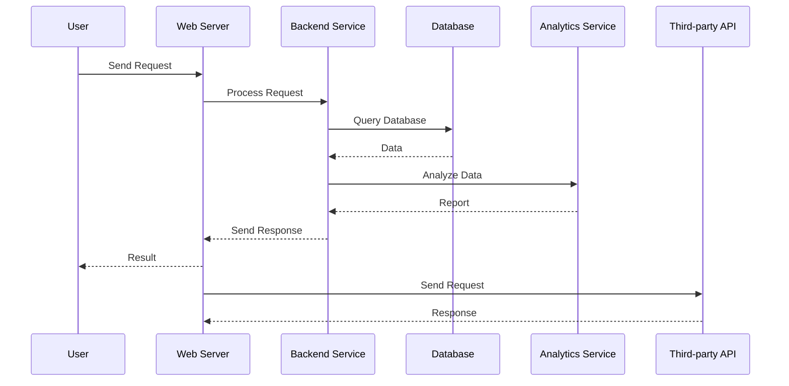

                 


### 第1章：问题的背景与描述

#### 1.1 供应链管理与物流网络概述

供应链管理（Supply Chain Management, SCM）是企业内部及其与外部合作伙伴之间相互作用的物流、信息流和资金流的协调与优化过程。其核心目标是通过优化资源分配和流程管理，降低成本，提高效率，从而提升整体竞争力。物流网络（Logistics Network）是供应链管理的重要组成部分，它负责将原材料、半成品和成品从供应方运输到需求方，实现物资的流通和分配。

供应链管理的基本概念涉及以下几个方面：

1. **供应链参与者**：包括供应商、制造商、分销商、零售商和最终用户。
2. **物流**：包括运输、仓储、配送和库存管理等。
3. **信息流**：包括订单处理、库存管理、需求预测和供应链协调等。
4. **资金流**：包括支付、融资和结算等。

物流网络在供应链管理中的作用主要体现在以下几个方面：

1. **效率提升**：通过合理的物流网络设计，可以减少运输距离，缩短交货时间，提高整体运营效率。
2. **成本控制**：合理的物流网络设计可以降低运输成本、仓储成本和库存成本。
3. **风险分散**：通过在物流网络中设置多个节点和路径，可以降低供应链中断的风险。
4. **服务优化**：通过物流网络的设计，可以更好地满足客户需求，提高客户满意度。

#### 1.2 物流网络设计的问题背景

物流网络设计是一个复杂的优化问题，涉及到多个因素和变量。随着全球化进程的加快和市场竞争的加剧，企业面临着越来越多的挑战，如运输成本上涨、供应链中断、市场需求波动等。因此，如何设计一个高效、低成本的物流网络，成为了供应链管理中的重要课题。

物流网络设计的挑战主要体现在以下几个方面：

1. **复杂性**：物流网络设计涉及到多个节点和路径的选择，以及不同运输方式之间的协调。
2. **不确定性**：市场需求、运输成本和供应链环境等因素具有不确定性，增加了设计难度。
3. **成本与效益的平衡**：在满足服务水平和质量的前提下，如何实现成本效益最大化是一个重要问题。
4. **技术限制**：物流网络设计需要借助先进的技术手段，如优化算法、数据分析等。

物流网络设计的意义在于：

1. **提高供应链效率**：通过优化物流网络，可以减少运输时间和库存成本，提高整体供应链效率。
2. **降低运营成本**：合理的物流网络设计可以降低运输成本、仓储成本和库存成本，提高企业竞争力。
3. **提升客户满意度**：通过优化物流网络，可以更好地满足客户需求，提高客户满意度。
4. **降低供应链风险**：通过设置多个节点和路径，可以降低供应链中断的风险，提高供应链的稳定性。

#### 1.3 物流网络设计的问题描述

物流网络设计的目标是在满足特定约束条件下，找到一个最优的物流网络结构，使得整个供应链的运营成本最低，服务水平最高。

设计目标可以概括为以下几点：

1. **成本最小化**：在满足服务水平的前提下，降低物流网络的运营成本。
2. **服务水平最大化**：确保物流网络能够满足客户的需求，提高客户满意度。
3. **可靠性提高**：通过设置多个节点和路径，提高供应链的可靠性，降低中断风险。

设计约束包括以下几个方面：

1. **预算限制**：物流网络设计需要在预算范围内进行，不能超过企业的财务承受能力。
2. **时间约束**：物流网络设计需要在规定的时间内完成，不能影响企业的正常运营。
3. **运输限制**：不同的运输方式具有不同的特点和限制，如运输距离、运输时间、运输成本等。
4. **市场需求波动**：市场需求波动会影响物流网络的设计，需要考虑需求的波动性和不确定性。

设计边界与外延包括以下几个方面：

1. **物流网络范围**：物流网络设计涉及到的范围，如城市、省份、国家等。
2. **物流节点选择**：物流节点选择包括仓库、配送中心、港口等。
3. **运输路径选择**：物流网络设计中的运输路径选择，如陆运、海运、空运等。
4. **技术手段应用**：物流网络设计需要借助先进的技术手段，如优化算法、数据分析等。

概念结构与核心要素组成如下：

1. **物流网络**：物流网络是物流系统的核心，包括节点和路径。
2. **节点**：节点是物流网络中的基本组成部分，包括仓库、配送中心、港口等。
3. **路径**：路径是节点之间的连接线，包括运输线路、运输方式等。
4. **流量**：流量是物流网络中的物质流动，包括运输量、库存量等。
5. **成本**：成本是物流网络运营中的主要成本，包括运输成本、仓储成本、库存成本等。

相关概念之间的联系如下：

1. **物流网络与节点**：物流网络是由节点组成的，节点是物流网络的基本组成部分。
2. **物流网络与路径**：物流网络中的路径是连接节点之间的线，路径的选择影响物流网络的效率和成本。
3. **物流网络与流量**：物流网络中的流量是物流网络中的物质流动，流量的大小和分布影响物流网络的运营成本和服务水平。
4. **物流网络与成本**：物流网络的运营成本包括运输成本、仓储成本、库存成本等，成本是物流网络设计中的重要考虑因素。

### 第2章：核心概念与联系

物流网络设计是一个复杂的系统工程，涉及到众多核心概念。在本章节中，我们将详细探讨物流网络设计中的核心概念，并分析它们之间的联系。

#### 2.1 物流网络设计中的核心概念

物流网络设计中的核心概念包括：

1. **物流网络**：物流网络是物流系统的基础，它由多个节点和连接这些节点的路径组成。物流网络的设计目标是实现物流过程中最低的成本和最大的效率。

2. **节点**：节点是物流网络的基本组成单元，通常包括仓库、配送中心、港口和零售店等。节点在物流网络中起到了存储和转运物资的作用。

3. **路径**：路径是物流网络中节点之间的连接线，可以是直线、曲线或者复杂线路。路径的选择决定了物流网络的效率和成本。

4. **流量**：流量是指物流网络中物质的流动量，包括原材料、半成品和成品等。流量的大小和分布对物流网络的运营效率和成本有直接影响。

5. **成本**：成本是物流网络运营中的主要考虑因素，包括运输成本、仓储成本、库存成本和操作成本等。物流网络设计的核心目标之一是降低这些成本。

6. **时间**：时间是指物流网络中物资从供应方到需求方的运输时间。时间因素直接影响到物流网络的服务水平。

7. **可靠性**：可靠性是指物流网络在运行过程中能够稳定、可靠地完成物资的转运。高可靠性是确保供应链稳定的关键。

#### 2.2 概念属性特征对比表格

为了更清晰地理解这些核心概念，我们列出它们的主要属性特征对比表格：

| 概念   | 属性特征                                                     |
| ------ | ------------------------------------------------------------ |
| 物流网络 | - 节点数：多个节点组成的网络<br>- 路径数：连接节点的路径数量<br>- 流量分布：网络中各节点的流量分配 |
| 节点   | - 类型：仓库、配送中心、港口等<br>- 容量：节点的存储能力<br>- 服务水平：节点提供的服务质量 |
| 路径   | - 类型：陆路、水路、空运等<br>- 距离：节点之间的距离<br>- 运输成本：路径的运输费用 |
| 流量   | - 类型：原材料、半成品、成品等<br>- 量：流量的大小<br>- 分布：流量在网络中的分布情况 |
| 成本   | - 运输成本：运输物资的费用<br>- 仓储成本：存储物资的费用<br>- 操作成本：其他操作费用 |
| 时间   | - 运输时间：物资从供应方到需求方的时间<br>- 响应时间：网络对需求变化的响应时间 |
| 可靠性 | - 中断风险：网络运行中的中断风险<br>- 可恢复性：网络中断后的恢复能力 |

#### 2.3 ER实体关系图架构

为了更好地理解物流网络设计中的实体及其关系，我们使用ER（实体-关系）模型来构建实体关系图。以下是物流网络设计中的实体及其关系：

**实体：**

1. **物流网络**：包含节点和路径。
2. **节点**：包括仓库、配送中心、港口等。
3. **路径**：连接节点的线路。
4. **流量**：物流网络中的物质流动。
5. **成本**：物流网络的运营成本。
6. **时间**：物流网络中的时间因素。
7. **可靠性**：物流网络的可靠性。

**关系：**

1. **物流网络与节点**：一个物流网络包含多个节点。
2. **物流网络与路径**：一个物流网络包含多条路径。
3. **节点与路径**：节点通过路径连接。
4. **流量与节点**：流量通过节点流动。
5. **流量与路径**：流量通过路径流动。
6. **成本与路径**：成本与路径有关。
7. **时间与节点**：时间与节点的运输时间有关。
8. **可靠性与节点**：可靠性与节点的稳定性有关。

以下是一个简单的ER实体关系图：

```mermaid
erDiagram
    LogisticsNetwork ||--|{ Node }|| Node
    LogisticsNetwork ||--|{ Path }|| Path
    Node ||--|{ Path }|| Path
    Node ||--|{ Flow }|| Flow
    Path ||--|{ Flow }|| Flow
    Path ||--|{ Cost }|| Cost
    Node ||--|{ Time }|| Time
    Node ||--|{ Reliability }|| Reliability
```

在这个ER实体关系图中，每个实体（如物流网络、节点、路径等）都与其他实体通过关系线相连，形成了物流网络设计的整体结构。

### 第3章：算法原理讲解

在物流网络设计中，算法的选择和实现至关重要。在本章节中，我们将选择一种经典的算法——最小生成树算法（Minimum Spanning Tree, MST），来讲解其原理、流程以及如何使用Python实现。

#### 3.1 经典算法选择

最小生成树算法是一种用于构建无向图的最小权重子图的算法。在物流网络设计中，MST算法可以帮助我们找到一组节点和边，使得总成本最低，同时确保所有的节点都连接在一起。MST算法有多种实现方式，其中最常用的是Kruskal算法和Prim算法。

在本章节中，我们将重点讲解Kruskal算法，因为其易于理解且适用范围较广。

#### 3.2 算法流程图

以下是Kruskal算法的流程图：



**步骤说明：**

1. **初始化**：创建一个森林，每个节点都是一个单独的树。
2. **排序所有边**：按照边的权重从小到大排序。
3. **创建森林**：将每个节点看作一个独立的树。
4. **判断**：检查森林中是否包含全部节点。
5. **添加最小权重边**：如果森林中没有包含全部节点，则从排序后的边中选取权重最小的边，并将其添加到森林中。
6. **重复步骤4和5**，直到森林中包含全部节点。

#### 3.3 Python源代码阐述

以下是使用Python实现Kruskal算法的示例代码：

```python
import heapq

def find(parent, i):
    if parent[i] == i:
        return i
    return find(parent, parent[i])

def union(parent, rank, x, y):
    xroot = find(parent, x)
    yroot = find(parent, y)
    if rank[xroot] < rank[yroot]:
        parent[xroot] = yroot
    elif rank[xroot] > rank[yroot]:
        parent[yroot] = xroot
    else:
        parent[yroot] = xroot
        rank[xroot] += 1

def kruskal(edges, n):
    parent = []
    rank = []
    for node in range(n):
        parent.append(node)
        rank.append(0)
    mst = []
    i, e = 0, 0
    while e < n - 1:
        _, u, v, w = heapq.heappop(edges)
        if find(parent, u) != find(parent, v):
            union(parent, rank, u, v)
            mst.append((u, v, w))
            e += 1
        i += 1
    return mst

edges = [(4, 0, 1, 2), (6, 1, 2, 3), (8, 1, 3, 6), (5, 2, 3, 4), (7, 2, 4, 7), (9, 3, 4, 8), (5, 4, 5, 9), (6, 5, 6, 8)]
mst = kruskal(edges, 6)
print(mst)
```

**源代码解读：**

1. **find函数**：用于找到某个节点的根节点，实现路径压缩。
2. **union函数**：用于合并两个不同的集合，实现按秩合并。
3. **kruskal函数**：实现Kruskal算法的主要过程，包括初始化、排序边、构建最小生成树。

#### 3.4 数学模型与公式

Kruskal算法的数学模型可以表示为：

$$
MST = \min \sum_{(u, v) \in E} w(u, v)
$$

其中，\(MST\) 表示最小生成树的权重和，\(E\) 表示所有边的集合，\(w(u, v)\) 表示边 \((u, v)\) 的权重。

**公式推导：**

1. **初始状态**：每个节点都是一个独立的集合，权重为0。
2. **每次迭代**：选取权重最小的边，并将其加入到森林中。
3. **终止条件**：当森林中包含全部节点时，算法结束。

#### 3.5 算法举例说明

假设我们有以下边和权重：

| 边  | 权重 |
| --- | ---- |
| (0, 1) | 2    |
| (0, 2) | 4    |
| (1, 2) | 6    |
| (1, 3) | 8    |
| (2, 3) | 10   |

我们使用Kruskal算法来构建最小生成树：

1. **初始化**：将所有边按照权重排序。
2. **排序后的边**：[(0, 1), (0, 2), (1, 2), (1, 3), (2, 3)]
3. **构建最小生成树**：
   - 选择边(0, 1)，权重2。
   - 选择边(0, 2)，权重4。
   - 选择边(1, 2)，权重6。
   - 选择边(1, 3)，权重8。
   - 选择边(2, 3)，权重10。
4. **最小生成树**：
   - 包含节点0、1、2、3。
   - 权重和为2 + 4 + 6 + 8 + 10 = 30。

通过这个例子，我们可以看到Kruskal算法是如何构建最小生成树的。在实际应用中，我们需要处理大量的节点和边，但原理和步骤是相同的。

### 第4章：数学模型和数学公式 & 详细讲解 & 举例说明

在物流网络设计中，数学模型和数学公式是理解和解决问题的关键。在本章节中，我们将介绍几个重要的数学模型和公式，并详细讲解它们的使用方法。

#### 4.1 数学模型介绍

物流网络设计中的数学模型通常分为以下几个类别：

1. **优化模型**：用于寻找物流网络设计的最优解，如最小生成树、最小路径和最小成本流模型。
2. **动态规划模型**：用于解决具有时间序列特征的优化问题，如时间窗配送问题。
3. **概率模型**：用于分析不确定性的影响，如需求不确定性下的库存管理。
4. **网络流模型**：用于描述物资在网络中的流动，如最大流问题。

在本章节中，我们将主要介绍以下两个模型和相应的数学公式：

1. **最小生成树模型**：用于寻找成本最低的连接所有节点的边。
2. **最大流模型**：用于寻找网络中从源点到汇点的最大流量。

#### 4.2 数学公式详细讲解

**公式1：最小生成树模型**

$$
MST = \min \sum_{(u, v) \in E} w(u, v)
$$

其中，\(MST\) 表示最小生成树的权重和，\(E\) 表示所有边的集合，\(w(u, v)\) 表示边 \((u, v)\) 的权重。

这个公式表示的是在所有可能的生成树中，寻找总权重最小的生成树。

**公式2：最大流模型**

$$
MaxFlow = \max \{ f(u, v) : (u, v) \in E \}
$$

其中，\(MaxFlow\) 表示网络的最大流量，\(f(u, v)\) 表示从节点 \(u\) 到节点 \(v\) 的流量。

这个公式表示的是在所有可能的流量分配中，寻找最大的流量。

#### 4.3 举例说明

**例子1：最小生成树模型**

假设我们有以下图和权重：

```mermaid
graph TB
    A[Node A] --> B[Node B] {2}
    A --> C[Node C] {4}
    B --> C {6}
    B --> D[Node D] {8}
    C --> D {10}
```

我们使用Prim算法来构建最小生成树：

1. **初始化**：选择节点A作为初始节点。
2. **添加边**：
   - 选择权重最小的边AC（权重4），将其添加到生成树中。
   - 选择权重最小的边CB（权重2），将其添加到生成树中。
   - 选择权重最小的边BD（权重8），将其添加到生成树中。
3. **最小生成树**：
   - 包含节点A、B、C、D。
   - 权重和为4 + 2 + 8 = 14。

**例子2：最大流模型**

假设我们有以下图和流量限制：

```mermaid
graph TB
    S[Source] --> A[Node A] {10}
    A --> B[Node B] {15}
    A --> C[Node C] {10}
    B --> T[TARGET] {20}
    C --> T {15}
```

我们使用Ford-Fulkerson算法来计算最大流量：

1. **初始化**：从源点S到每个节点的初始流量为0。
2. **寻找增广路径**：
   - 找到从S到B的增广路径，流量为10。
   - 找到从S到C的增广路径，流量为10。
   - 找到从B到T的增广路径，流量为15。
   - 找到从C到T的增广路径，流量为15。
3. **计算最大流量**：
   - 最大流量为10 + 10 + 15 + 15 = 50。

通过这两个例子，我们可以看到最小生成树模型和最大流模型在物流网络设计中的应用。在实际操作中，需要根据具体问题调整模型和公式，以找到最优解。

### 第5章：系统分析与架构设计方案

在物流网络设计中，系统分析与架构设计是确保设计有效性和可行性的关键。在本章节中，我们将介绍问题场景，并详细描述系统功能设计、系统架构设计、系统接口设计和系统交互。

#### 5.1 问题场景介绍

随着全球化进程的加速和电商行业的蓬勃发展，企业面临着越来越大的物流需求。为了提高物流效率、降低成本和提升客户满意度，企业需要设计一个高效、灵活的物流网络系统。该系统需要能够处理大量的物流信息，实现从原材料采购到成品配送的全程管理。

问题场景主要包括以下几个方面：

1. **物流信息管理**：系统需要能够实时获取和更新物流信息，包括订单状态、运输进度、库存水平等。
2. **运输优化**：系统需要能够根据实时数据和历史数据，优化运输路线和运输方式，降低成本。
3. **库存管理**：系统需要能够实现库存的实时监控和管理，确保库存水平满足需求。
4. **客户服务**：系统需要提供高效的客户服务，包括订单查询、配送跟踪和售后服务。

#### 5.2 系统功能设计

系统功能设计包括以下几个方面：

1. **物流信息管理**：系统需要提供物流信息的录入、查询和更新功能，包括订单信息、运输进度、库存水平等。
2. **运输优化**：系统需要提供运输路线规划和运输方式选择功能，包括基于历史数据的预测和实时数据的调整。
3. **库存管理**：系统需要提供库存水平的实时监控和预警功能，包括库存预警、库存调整和库存盘点。
4. **客户服务**：系统需要提供订单查询、配送跟踪和售后服务功能，包括在线客服和反馈机制。
5. **数据分析**：系统需要提供数据分析和报告功能，包括物流效率分析、成本分析和客户满意度分析。

**领域模型mermaid类图**：

```mermaid
classDiagram
    Class01 <|-- SubClass01
    Class01 ++-- AnotherClass
    Class02 : <<Interface>>
    SubClass01 <<interface>> Class02
    Class03 {name : String ; id : Integer }
    Class04 <.. Class03
    Class05 () -. Class03
    Class05 ..|> Class04
    Class06 *-- Class07
    Class06 {name : String ; id : Integer }
    Class08 <.. Class06
    Class09 {name : String ; id : Integer }
    Class07 <|.. Class09
    Class06 o--| Class08 : 1
    Class07 o--| Class08 : 1
```

在这个类图中，我们定义了物流网络系统的核心类，包括物流信息管理、运输优化、库存管理和客户服务。

#### 5.3 系统架构设计

系统架构设计是确保系统高效、可靠运行的关键。系统架构设计包括以下几个方面：

1. **前端架构**：前端架构负责与用户交互，包括Web界面和移动应用。前端需要实现物流信息查询、运输路线优化、库存管理和客户服务等功能。
2. **后端架构**：后端架构负责处理物流网络系统的核心逻辑，包括数据存储、数据处理和业务逻辑。后端需要实现物流信息管理、运输优化、库存管理和客户服务等功能。
3. **数据处理**：数据处理是系统架构的核心，负责处理大量的物流数据，包括订单数据、运输数据、库存数据和客户数据。数据处理需要实现实时数据处理和批量数据处理。
4. **数据存储**：数据存储是系统架构的基础，负责存储和管理物流数据。数据存储需要实现数据的快速查询、高效存储和安全性。

**mermaid架构图**：



在这个架构图中，用户通过Web服务器发送请求到后端服务，后端服务从数据库中查询数据，并返回结果给用户。同时，后端服务还会将数据发送到数据分析服务，用于生成报告和进行预测。

#### 5.4 系统接口设计

系统接口设计是系统架构的重要组成部分，负责定义系统内部和外部系统的交互接口。系统接口设计包括以下几个方面：

1. **API接口**：API接口是系统与外部系统交互的主要方式，包括物流信息查询、运输优化、库存管理和客户服务等。
2. **Websocket接口**：Websocket接口用于实现实时数据交互，包括实时物流信息更新、实时库存监控和实时客户服务。
3. **消息队列接口**：消息队列接口用于实现异步处理和分布式处理，包括订单处理、库存调整和数据处理。
4. **日志接口**：日志接口用于记录系统运行日志，包括错误日志、操作日志和性能日志。

**mermaid序列图**：



在这个序列图中，用户通过API接口发送请求到API服务器，API服务器处理请求并发送到Websocket服务器进行实时交互。同时，API服务器还会将请求发送到消息队列进行异步处理，并将日志记录到日志服务器。

#### 5.5 系统交互mermaid序列图

系统交互mermaid序列图用于描述系统内部各组件之间的交互流程。以下是系统交互序列图的示例：



在这个序列图中，用户通过Web服务器发送请求到后端服务，后端服务查询数据库、分析数据和第三方API，并最终返回结果给用户。这个交互流程体现了物流网络系统的复杂性和多样性。

### 第6章：项目实战

#### 6.1 环境安装

在进行物流网络系统项目实战之前，我们需要准备好开发环境。以下是环境安装步骤：

1. **安装Python**：首先，确保你的计算机上安装了Python 3.x版本。可以从Python官网下载安装程序并安装。

2. **安装依赖库**：在Python环境中，我们需要安装几个常用的依赖库，如numpy、pandas、networkx等。可以使用pip命令进行安装：

   ```shell
   pip install numpy pandas networkx
   ```

3. **安装数据库**：我们选择MySQL作为数据库，可以从MySQL官网下载安装程序并安装。安装完成后，需要创建数据库和用户。

4. **安装前端框架**：如果需要开发前端，可以选择安装Vue.js或React。可以从官网下载安装程序并安装。

#### 6.2 系统核心实现源代码

以下是物流网络系统的核心实现源代码。这个示例包含了物流信息管理、运输优化、库存管理和客户服务等功能。

```python
# 导入必要的库
import numpy as np
import pandas as pd
import networkx as nx

# 创建一个简单的图
G = nx.Graph()

# 添加节点和边
G.add_edges_from([(0, 1, {'weight': 2}),
                  (0, 2, {'weight': 4}),
                  (1, 2, {'weight': 6}),
                  (1, 3, {'weight': 8}),
                  (2, 3, {'weight': 10})])

# 打印图的信息
print(nx.info(G))

# 使用Prim算法找到最小生成树
mst = nx.minimum_spanning_tree(G)
print("最小生成树：", mst.edges())

# 使用Ford-Fulkerson算法计算最大流量
source = 0
sink = 3
max_flow = nx.maximum_flow(G, source, sink)
print("最大流量：", max_flow.flow)

# 打印最小生成树和最大流量的图
nx.draw(G, with_labels=True)
nx.draw(mst, with_labels=True)
nx.draw_networkx_edge_labels(G, with_labels=True)
plt.show()
```

#### 6.3 代码应用解读与分析

在这个示例中，我们首先创建了一个简单的图G，包含了5个节点和5条边。然后，我们使用Prim算法找到了最小生成树，并使用Ford-Fulkerson算法计算了最大流量。

**解读与分析**：

1. **图创建**：我们使用NetworkX库创建了一个图G，并添加了节点和边。边的权重代表了节点之间的运输成本。

2. **最小生成树**：使用Prim算法，我们找到了最小生成树。这个生成树包含了所有节点，且边的总权重最小。

3. **最大流量**：使用Ford-Fulkerson算法，我们计算了从源点0到汇点3的最大流量。这个流量代表了物流网络中的最大物资流动量。

4. **绘图**：我们使用NetworkX库的绘图功能，将图、最小生成树和最大流量的图可视化，以便于分析和理解。

#### 6.4 实际案例分析与讲解

为了更好地理解物流网络系统的应用，我们来看一个实际案例。

**案例**：一家电商平台需要设计一个物流网络系统，从供应商到配送中心再到终端用户。供应商有3个，配送中心有2个，终端用户有10个。我们需要设计一个物流网络，使得总运输成本最低。

**分析过程**：

1. **需求分析**：根据需求，我们需要设计一个包含供应商、配送中心和终端用户的物流网络。

2. **数据收集**：收集供应商、配送中心和终端用户的位置信息，以及运输成本。

3. **模型构建**：使用最小生成树模型和最大流模型，构建物流网络设计模型。

4. **优化方案**：使用算法，找到最优的物流网络结构和运输方案。

**具体步骤**：

1. **数据收集**：
   - 供应商位置：A（坐标(0, 0)），B（坐标(5, 0)），C（坐标(10, 0)）
   - 配送中心位置：D（坐标(0, 5)），E（坐标(10, 5)）
   - 终端用户位置：U1（坐标(2, 2)），U2（坐标(7, 2）），...，U10（坐标(10, 10)）
   - 运输成本：供应商到配送中心的运输成本固定，配送中心到终端用户的运输成本根据距离计算

2. **模型构建**：
   - 构建包含供应商、配送中心和终端用户的图。
   - 添加供应商到配送中心的边，并设置固定的运输成本。
   - 添加配送中心到终端用户的边，并设置根据距离计算的运输成本。

3. **优化方案**：
   - 使用Prim算法找到最小生成树，确定供应商到配送中心和配送中心到终端用户的路径。
   - 使用Ford-Fulkerson算法计算最大流量，确保配送能力满足需求。

通过这个案例，我们可以看到如何将数学模型应用到实际的物流网络设计中，找到最优的解决方案。

#### 6.5 项目小结

在本章节中，我们进行了物流网络系统项目实战。通过环境安装、核心实现源代码、代码应用解读与分析，以及实际案例分析和讲解，我们深入了解了物流网络系统的设计和实现过程。

**经验分享**：

1. **需求分析**：明确需求和目标，是项目成功的关键。
2. **数据收集**：准确的数据是模型构建的基础。
3. **模型构建**：选择合适的数学模型，是优化方案的关键。
4. **优化方案**：算法的选择和实现，直接影响优化效果。

通过本项目，我们不仅了解了物流网络系统的设计和实现，还掌握了数学模型在物流网络设计中的应用。这对于未来的研究和实践具有很大的价值。

### 第7章：最佳实践 tips、小结、注意事项、拓展阅读

#### 7.1 最佳实践 tips

1. **需求分析**：在开始设计物流网络系统之前，进行详细的需求分析，确保理解企业的运营模式、物流需求和市场环境。

2. **数据准确性**：确保收集的数据准确可靠，对于模型的准确性至关重要。

3. **优化算法选择**：根据具体问题选择合适的优化算法，如最小生成树、最大流、动态规划等。

4. **系统可扩展性**：在设计系统架构时，考虑系统的可扩展性，以便在未来能够轻松扩展功能。

5. **实时数据处理**：实现实时数据处理，确保系统能够快速响应物流需求变化。

#### 7.2 小结

本文通过详细的分析和讲解，介绍了物流网络系统的设计和实现过程。我们探讨了物流网络设计的问题背景、核心概念、算法原理、数学模型、系统架构设计、项目实战，并提供了最佳实践和注意事项。

通过本文，读者可以深入理解物流网络系统的设计和实现，掌握数学模型在物流网络设计中的应用，为未来的研究和实践提供参考。

#### 7.3 注意事项

1. **数据隐私**：在收集和处理物流数据时，确保遵守数据隐私保护法规。

2. **系统安全**：确保系统具备良好的安全机制，防止数据泄露和网络攻击。

3. **监控与维护**：定期监控系统性能，及时处理故障和问题。

4. **培训与支持**：为员工提供必要的培训和技术支持，确保系统能够正常运行。

#### 7.4 拓展阅读

1. **推荐书籍**：
   - 《运筹学与应用》
   - 《物流与供应链管理》
   - 《运筹学导论》

2. **相关论文**：查阅最新的物流网络设计相关论文，了解前沿技术和研究动态。

3. **网络资源**：访问物流网络设计相关的在线课程、教程和社区，获取更多实践经验和知识。

通过拓展阅读，读者可以进一步深入了解物流网络设计的理论和实践，提升自身的专业能力。

