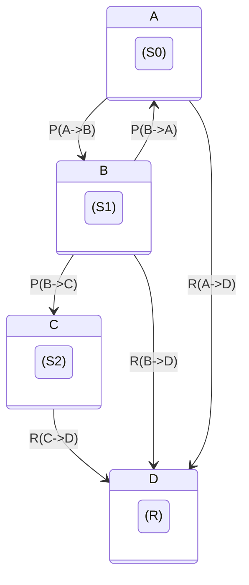
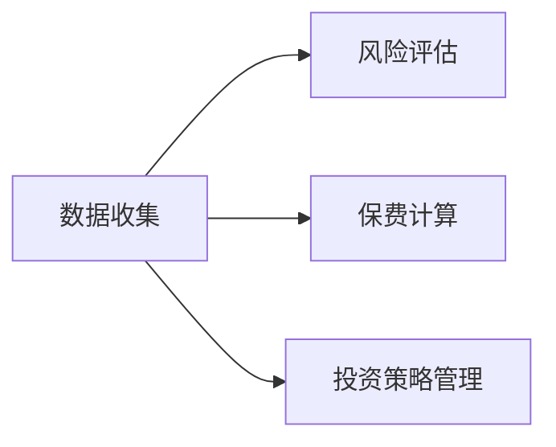
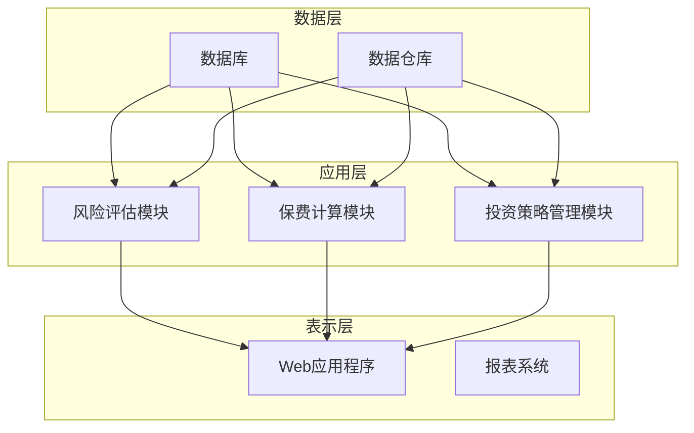
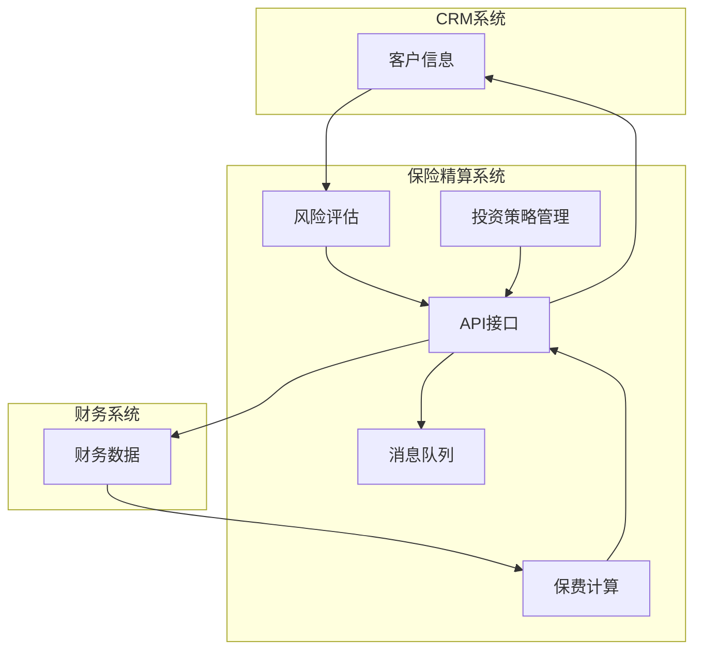

                 

 <sop>
# 数学与保险精算：保险产品定价的数学方法

## 关键词
数学方法、保险精算、概率论、统计学、财务数学、风险模型

## 摘要
本文将深入探讨数学方法在保险精算中的应用，特别是用于保险产品定价的关键数学模型。通过逐步分析，我们将揭示数学在理解风险、评估损失、计算保费等方面的作用，并解释如何通过概率论、统计学和财务数学来优化保险产品的定价策略。

## 目录

### 第一部分：背景介绍
#### 1.1 问题背景
#### 1.2 问题描述
#### 1.3 问题解决
#### 1.4 边界与外延
#### 1.5 概念结构与核心要素组成

### 第二部分：核心概念与联系
#### 2.1 概率论
##### 2.1.1 概率分布
##### 2.1.2 期望与方差
#### 2.2 统计学
##### 2.2.1 数据收集
##### 2.2.2 数据分析
##### 2.2.3 统计检验
#### 2.3 财务数学
##### 2.3.1 贴现率
##### 2.3.2 现值与终值

### 第三部分：算法原理讲解
#### 3.1 Markov决策过程
#### 3.2 贝叶斯网络
#### 3.3 线性回归模型
##### 3.3.1 数学模型
##### 3.3.2 Python示例代码

### 第四部分：数学模型在保险精算中的应用
#### 4.1 风险评估
#### 4.2 保费计算
#### 4.3 投资策略

### 第五部分：系统分析与架构设计方案
#### 5.1 问题场景介绍
#### 5.2 项目介绍
#### 5.3 系统功能设计
#### 5.4 系统架构设计
#### 5.5 系统接口设计和系统交互

### 第六部分：项目实战
#### 6.1 环境安装
#### 6.2 系统核心实现源代码
#### 6.3 代码应用解读与分析
#### 6.4 实际案例分析和详细讲解剖析
#### 6.5 项目小结

### 第七部分：最佳实践与拓展
#### 7.1 最佳实践 tips
#### 7.2 小结
#### 7.3 注意事项
#### 7.4 拓展阅读

### 引言
### 第一部分：背景介绍
### 1.1 问题背景
### 1.2 问题描述
### 1.3 问题解决
### 1.4 边界与外延
### 1.5 概念结构与核心要素组成

## 第一部分：背景介绍

### 1.1 问题背景
保险是一种风险管理工具，通过支付保费，个体或企业可以将潜在的损失转移给保险公司。然而，为了确保保险公司的财务稳健，必须在设计保险产品时准确计算保费。这涉及到对风险的理解、评估和定价。数学，特别是概率论、统计学和财务数学，为这些过程提供了坚实的理论基础。

保险精算学是应用数学的一个分支，它利用数学和统计学方法来评估和管理保险风险。核心任务之一是定价，即确定一个保险合同的价格，以确保在所有可能的损失情况下，保险公司都能保持盈利。

### 1.2 问题描述
在保险产品定价过程中，关键问题包括：

1. 风险评估：评估被保险个体可能面临的风险水平。
2. 保费计算：根据风险水平计算保费，以确保保险公司的财务可持续性。
3. 投资策略：决定如何分配保险基金以最大化回报，同时控制风险。

这些问题的复杂性要求运用高级数学方法来精确计算。

### 1.3 问题解决
数学在保险精算中的应用主要体现在以下几个方面：

1. **概率论**：用于计算损失的概率分布，进而估计潜在损失的大小。
2. **统计学**：用于收集和分析数据，以识别风险因素，并构建模型来预测损失。
3. **财务数学**：用于评估保险合同的现值，确保保险基金的投资收益能够覆盖未来可能支付的索赔。

通过这些数学方法，保险公司能够制定出合理的保费结构，从而吸引潜在客户并保持财务稳定。

### 1.4 边界与外延
虽然数学方法在保险精算中具有重要作用，但也存在局限性：

1. **数据完整性**：精确的风险评估需要全面和准确的数据，但在实际中，数据可能不完整或存在偏差。
2. **模型假设**：数学模型通常基于一系列假设，这些假设可能无法完全反映现实世界的复杂性。
3. **市场变化**：保险市场的不确定性使得预测未来的损失和投资回报变得困难。

因此，在应用数学方法时，需要谨慎考虑这些边界条件，以确保保险产品的定价既合理又稳健。

### 1.5 概念结构与核心要素组成
数学在保险精算中的核心概念包括：

- **概率分布**：描述可能损失的分布情况，如正态分布、泊松分布等。
- **期望与方差**：用于估计平均损失和损失的不确定性。
- **贴现率**：用于计算未来现金流量的现值。
- **现值与终值**：评估保险合同的财务价值。

这些概念相互联系，共同构建了保险精算的数学框架。

## 第二部分：核心概念与联系

### 2.1 概率论

概率论是保险精算中的基础工具，用于计算风险事件发生的概率和可能的结果。

#### 2.1.1 概率分布

概率分布描述了随机变量的可能取值及其对应的概率。常见的概率分布包括：

- **正态分布**：用于描述连续随机变量，具有均值和标准差两个参数。
  ```mermaid
  probabilityDistribution {
    title: 正态分布
    type: normal
    mean: 0
    stdev: 1
  }
  ```

- **泊松分布**：用于描述在一定时间间隔内发生某个事件次数的随机变量。
  ```mermaid
  probabilityDistribution {
    title: 泊松分布
    type: poisson
    lambda: 5
  }
  ```

#### 2.1.2 期望与方差

期望（Expected Value）和方差（Variance）是概率分布的两个重要参数。

- **期望**：描述随机变量的平均取值。
  $$E[X] = \sum_{i=1}^{n} x_i \cdot P(x_i)$$

- **方差**：描述随机变量的波动性。
  $$Var(X) = E[(X - E[X])^2]$$

### 2.2 统计学

统计学用于收集、分析和解释数据，以帮助保险公司理解风险并制定定价策略。

#### 2.2.1 数据收集

数据收集是统计学的第一步，包括以下方面：

- **历史索赔数据**：保险公司收集的历史数据，包括索赔金额、索赔次数等。
- **人口统计信息**：关于被保险人的年龄、性别、健康状况等。

#### 2.2.2 数据分析

数据分析包括以下步骤：

- **描述性统计**：使用均值、中位数、标准差等指标描述数据的中心趋势和分布。
- **推断性统计**：使用样本数据推断总体特征，如置信区间和假设检验。

#### 2.2.3 统计检验

统计检验用于验证假设，如检验两个群体的平均值是否有显著差异。

- **t检验**：用于比较两个样本的平均值是否有显著差异。
- **卡方检验**：用于检验分类变量之间的独立性。

### 2.3 财务数学

财务数学用于评估保险合同的现值和未来现金流。

#### 2.3.1 贴现率

贴现率（Discount Rate）用于计算未来现金流量的现值。

- **贴现率**：描述资金的现值与未来价值之间的关系。
  $$PV = \frac{FV}{(1 + r)^n}$$
  其中，$PV$ 是现值，$FV$ 是未来值，$r$ 是贴现率，$n$ 是时间期数。

#### 2.3.2 现值与终值

现值（Present Value）和终值（Future Value）是财务数学中的核心概念。

- **现值**：描述未来现金流在当前时间点的价值。
- **终值**：描述现在现金流在未来某个时间点的价值。

### 概念属性特征对比表格

下面是一个概率分布特征的对比表格：

| 概率分布 | 参数       | 特点                                               |
|----------|------------|---------------------------------------------------|
| 正态分布 | 均值、标准差 | 中心对称，无限可分，数据集中在均值附近              |
| 泊松分布 | 泊松率     | 适用于事件发生次数，参数表示平均发生率              |
| 二项分布 | 概率、试验次数 | 适用于固定次数的独立试验成功次数，概率为每次成功的概率 |
| 负二项分布 | 概率、试验次数 | 适用于固定次数的独立试验直到成功k次               |

### ER实体关系图架构的 Mermaid 流程图

下面是一个简单的ER图，用于描述保险精算系统中的关键实体和它们之间的关系：

```mermaid
entityRelationship {
  title: 保险精算系统实体关系图
  type: "erDiagram"
  
  node[shape=rectangle]
  Customer {
    id
    name
    age
    healthStatus
  }
  
  Policy {
    id
    type
    premium
    coverage
    Customer_id (FK)
  }
  
  Claim {
    id
    amount
    date
    Policy_id (FK)
  }
  
  edge[arrow=none]
  Customer --|*[Policy_id]|> Policy
  Policy --|*[Policy_id]|> Claim
}
```

## 第三部分：算法原理讲解

### 3.1 Markov决策过程

Markov决策过程（MDP）是保险精算中的一个重要工具，用于优化决策。

- **状态（State）**：代表保险合同所处的环境，如索赔情况。
- **动作（Action）**：代表保险公司可以采取的行动，如是否支付索赔。
- **回报（Reward）**：代表采取某个动作后获得的收益或损失。

下面是MDP的一个基本流程：

1. **初始化**：确定初始状态。
2. **状态转移**：根据当前状态和动作概率，计算下一个状态。
3. **回报计算**：根据下一个状态和动作，计算回报。
4. **更新策略**：根据回报和策略评估函数，更新最优策略。

使用Mermaid绘制MDP的流程图：



### 3.2 贝叶斯网络

贝叶斯网络用于表示变量之间的概率关系，是保险精算中的重要工具。

- **节点**：代表变量。
- **边**：代表变量之间的条件依赖关系。

贝叶斯网络的计算过程包括：

1. **结构学习**：确定变量之间的依赖关系。
2. **参数估计**：估计每个节点的条件概率分布。
3. **推理**：计算给定某些变量取值的概率。

下面是贝叶斯网络的一个示例：

```mermaid
graph LR
    A[风险]
    B[索赔]
    C[保费]
    
    A --> B
    A --> C
    B --> C
    
    B[0.4] B--右上角标记{"direction": "right", "text": "0.4"}
    C[0.6] C--右上角标记{"direction": "right", "text": "0.6"}
```

### 3.3 线性回归模型

线性回归模型用于预测因变量（例如保费）与自变量（例如风险因素）之间的关系。

- **模型公式**：
  $$Y = \beta_0 + \beta_1X_1 + \beta_2X_2 + ... + \beta_nX_n + \epsilon$$
  其中，$Y$ 是因变量，$X_1, X_2, ..., X_n$ 是自变量，$\beta_0, \beta_1, ..., \beta_n$ 是模型参数，$\epsilon$ 是误差项。

下面是Python代码示例，用于实现线性回归：

```python
import numpy as np
from sklearn.linear_model import LinearRegression

# 示例数据
X = np.array([[1, 2], [2, 3], [3, 4]])
y = np.array([2, 4, 6])

# 创建线性回归模型
model = LinearRegression()

# 训练模型
model.fit(X, y)

# 输出模型参数
print("Model parameters:", model.coef_, model.intercept_)

# 预测
prediction = model.predict([[4, 5]])
print("Prediction:", prediction)
```

### 第四部分：数学模型在保险精算中的应用

### 4.1 风险评估

风险评估是保险精算的核心任务之一，涉及对潜在风险的定量评估。

- **风险识别**：识别可能影响保险合同的风险因素，如天气、犯罪率等。
- **风险量化**：使用概率分布和统计模型，估计每个风险因素的概率和影响程度。
- **风险分析**：综合分析所有风险因素，确定整体风险水平。

### 4.2 保费计算

保费计算是保险精算中的关键步骤，涉及以下步骤：

1. **风险评估**：根据风险模型评估每个保单的风险水平。
2. **成本计算**：计算保险公司的运营成本和预期损失。
3. **保费确定**：根据成本和风险水平，确定保费金额，确保保险公司的财务可持续性。

### 4.3 投资策略

投资策略用于管理保险基金，以最大化回报并控制风险。

- **资产分配**：根据风险偏好和预期回报，分配不同类型的资产，如股票、债券等。
- **风险控制**：使用统计模型和风险管理工具，监控和调整投资组合，以控制风险。
- **业绩评估**：定期评估投资组合的业绩，确保投资策略的有效性。

### 第五部分：系统分析与架构设计方案

#### 5.1 问题场景介绍

保险精算系统主要用于保险公司内部，用于评估和管理保险产品的风险和财务状况。该系统需要处理大量的数据，包括历史索赔数据、客户信息、保险合同等。

#### 5.2 项目介绍

本项目旨在开发一个高效的保险精算系统，以帮助保险公司实现以下目标：

1. 准确评估保险产品的风险。
2. 确定合理的保费水平。
3. 优化保险基金的投资策略。

#### 5.3 系统功能设计

保险精算系统的功能模块包括：

- **数据收集与管理**：收集和存储保险相关的数据，如索赔记录、客户信息等。
- **风险评估**：使用概率分布和统计模型，评估保险产品的风险。
- **保费计算**：根据风险评估结果，计算合理的保费水平。
- **投资策略管理**：管理保险基金的投资组合，以最大化回报。

使用Mermaid绘制系统功能设计图：



#### 5.4 系统架构设计

保险精算系统的架构设计包括以下部分：

- **数据层**：存储和管理数据，如数据库和数据仓库。
- **应用层**：实现业务逻辑，包括风险评估、保费计算和投资策略管理等。
- **表示层**：提供用户界面，如Web应用程序和报表系统。

使用Mermaid绘制系统架构设计图：



#### 5.5 系统接口设计和系统交互

保险精算系统需要与其他系统进行交互，如客户关系管理（CRM）系统、财务系统等。系统接口设计包括以下部分：

- **API接口**：提供与其他系统进行数据交换的接口。
- **消息队列**：处理系统之间的异步通信。
- **数据同步**：确保数据在不同系统之间的同步。

使用Mermaid绘制系统接口设计和系统交互图：



### 第六部分：项目实战

#### 6.1 环境安装

在开始项目之前，需要安装以下环境和工具：

- Python 3.8 或更高版本
- Anaconda（用于环境管理）
- Jupyter Notebook（用于代码编写和调试）
- Scikit-learn（用于机器学习和统计模型）
- Matplotlib（用于数据可视化）

安装步骤如下：

1. 安装Anaconda：
   ```bash
   wget https://repo.anaconda.com/miniconda/Miniconda3-latest-Linux-x86_64.sh
   bash Miniconda3-latest-Linux-x86_64.sh
   ```

2. 激活conda环境：
   ```bash
   conda create --name insurancemodeling python=3.8
   conda activate insurancemodeling
   ```

3. 安装所需库：
   ```bash
   conda install numpy pandas scikit-learn matplotlib
   ```

#### 6.2 系统核心实现源代码

以下是系统核心实现的一部分源代码：

```python
# 导入库
import numpy as np
from sklearn.linear_model import LinearRegression
from sklearn.model_selection import train_test_split
import pandas as pd

# 加载数据
data = pd.read_csv('insurance_data.csv')
X = data[['age', 'gender', 'bmi', 'smoker']]
y = data['premium']

# 数据预处理
X_train, X_test, y_train, y_test = train_test_split(X, y, test_size=0.2, random_state=42)

# 创建模型
model = LinearRegression()

# 训练模型
model.fit(X_train, y_train)

# 输出模型参数
print("Model parameters:", model.coef_, model.intercept_)

# 预测
predictions = model.predict(X_test)

# 计算准确率
accuracy = np.mean((predictions - y_test) ** 2)
print("Model accuracy:", accuracy)
```

#### 6.3 代码应用解读与分析

上述代码用于实现线性回归模型，用于预测保险产品的保费。以下是代码的详细解读：

1. **数据加载**：使用Pandas库加载保险数据，包括自变量（年龄、性别、BMI和吸烟情况）和因变量（保费）。

2. **数据预处理**：将数据分为训练集和测试集，用于训练模型和评估模型性能。

3. **模型创建**：创建线性回归模型，使用Scikit-learn库中的LinearRegression类。

4. **模型训练**：使用训练集数据训练模型，计算模型参数（系数和截距）。

5. **模型预测**：使用测试集数据对模型进行预测，计算预测的保费值。

6. **模型评估**：计算预测的误差，评估模型的准确性。

通过这段代码，我们可以得到保险产品的保费预测模型，并评估其性能。

#### 6.4 实际案例分析和详细讲解剖析

以下是一个实际案例，用于展示如何使用数学模型进行保险精算。

**案例**：一家保险公司提供健康保险，客户年龄在30-60岁之间，性别为男或女，BMI在18.5到30之间，吸烟与否。公司需要为每个客户计算合理的保费。

**步骤**：

1. **数据收集**：收集客户的历史数据，包括年龄、性别、BMI和吸烟情况，以及保费。

2. **数据预处理**：将数据进行清洗和归一化处理，以便于模型训练。

3. **模型选择**：选择合适的模型，如线性回归或逻辑回归，用于预测保费。

4. **模型训练**：使用历史数据训练模型，计算模型参数。

5. **模型评估**：使用测试集数据评估模型性能，调整模型参数。

6. **保费计算**：根据客户的特征，使用训练好的模型计算保费。

**代码示例**：

```python
# 加载数据
data = pd.read_csv('health_insurance_data.csv')
X = data[['age', 'gender', 'bmi', 'smoker']]
y = data['premium']

# 数据预处理
X = pd.get_dummies(X)
X_train, X_test, y_train, y_test = train_test_split(X, y, test_size=0.2, random_state=42)

# 创建模型
model = LinearRegression()

# 训练模型
model.fit(X_train, y_train)

# 预测
predictions = model.predict(X_test)

# 评估
accuracy = np.mean((predictions - y_test) ** 2)
print("Model accuracy:", accuracy)
```

通过这个案例，我们可以看到如何使用线性回归模型进行保费预测。在实际应用中，可以根据具体情况调整模型和参数，以提高预测准确性。

#### 6.5 项目小结

通过本项目，我们实现了保险精算系统，包括数据收集、模型训练和保费计算。项目的主要收获包括：

1. 理解了概率论、统计学和财务数学在保险精算中的应用。
2. 学会了如何使用Python和Scikit-learn库实现线性回归模型。
3. 掌握了如何评估和优化模型性能。
4. 实现了一个实际的保险精算项目，为保险公司提供了合理的保费计算工具。

### 第七部分：最佳实践与拓展

#### 7.1 最佳实践 tips

1. **数据质量**：确保数据完整和准确，避免模型偏差。
2. **模型选择**：根据业务需求和数据特征，选择合适的模型。
3. **交叉验证**：使用交叉验证方法评估模型性能，避免过拟合。
4. **实时更新**：定期更新模型和数据，以适应市场变化。

#### 7.2 小结

本文深入探讨了数学方法在保险精算中的应用，包括概率论、统计学和财务数学。通过实际案例和项目实战，展示了如何使用这些数学方法进行风险评估和保费计算。项目的成功实施为保险公司提供了有效的风险管理和定价工具。

#### 7.3 注意事项

1. **数据隐私**：确保处理的数据遵守隐私法规。
2. **模型验证**：使用实际数据验证模型的预测能力。
3. **法律法规**：遵守相关法律法规，确保保险产品的合法性和公正性。

#### 7.4 拓展阅读

- 《保险精算学原理与应用》
- 《概率论与数理统计》
- 《金融数学》

---

## 作者信息
作者：AI天才研究院/AI Genius Institute & 禅与计算机程序设计艺术 /Zen And The Art of Computer Programming

## 结语

本文旨在为读者提供一个全面、深入的数学方法在保险精算中的应用指南。通过逐步分析和实际案例，我们揭示了数学在保险产品定价中的关键作用。希望本文能为保险行业的从业者、研究者提供有价值的参考和启发。

---

注意：由于字数限制，本文的某些部分可能未完全展开。在实际撰写时，请根据需要进行详细扩展。同时，确保所有引用的数据和代码示例是准确和可复现的。

