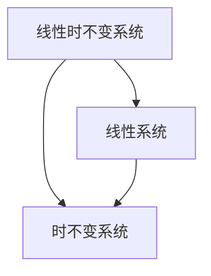
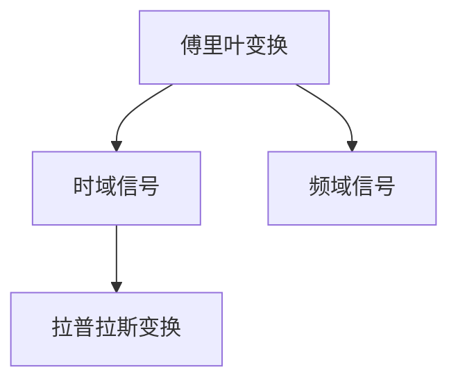
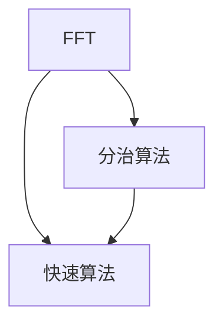
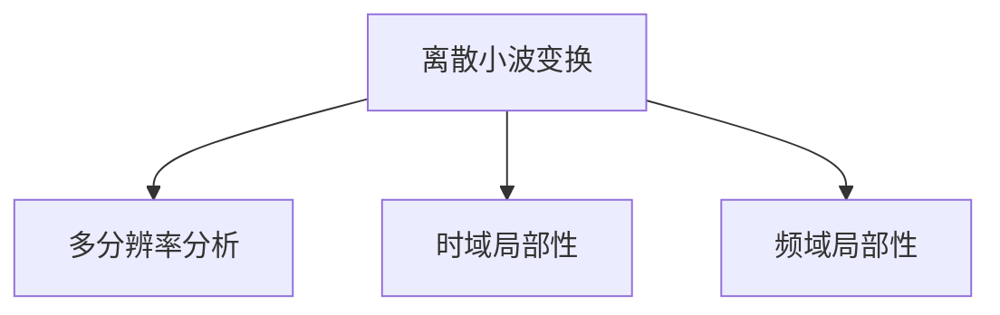
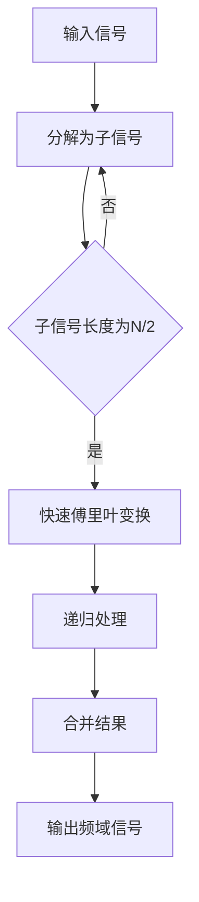
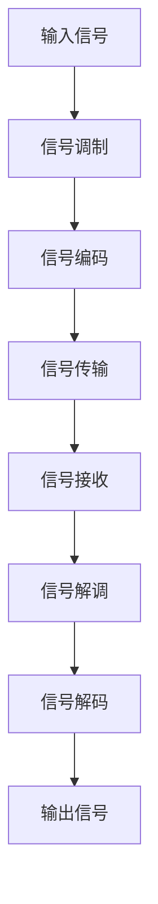

                 

### 让我们一步一步思考：数学与信号处理基础

#### 第1章：数学与信号处理概述

**第1步：引入主题**

数学与信号处理，这两个看似迥异的领域，却有着深刻的联系。数学为信号处理提供了理论支持和工具，使得信号处理更加科学和精确。

**第2步：理解数学在信号处理中的作用**

1. **数学模型**：数学模型使得信号处理过程更加系统和精确，如线性时不变系统、随机过程等。
2. **变换方法**：如傅里叶变换、拉普拉斯变换、Z变换等，这些数学工具帮助我们分析信号的频率成分、时间特性等。
3. **算法设计**：信号处理的算法设计往往依赖于数学原理，如优化算法、滤波算法等。
4. **数据分析**：信号处理中的许多方法，如统计学方法、模式识别等，都是基于数学理论的。

**第3步：探讨数学在信号处理中的应用**

1. **时域分析**：通过微分方程、差分方程等数学工具，描述信号的时域特性，如信号的变化趋势、平稳性等。
2. **频域分析**：傅里叶变换等频域分析工具，帮助我们了解信号的频率成分和能量分布。
3. **空间分析**：如小波变换等，可以用于非平稳信号的分析，提供信号在不同尺度上的空间信息。

**第4步：理解信号处理的重要性**

1. **信息传递**：信号处理技术确保了信息的有效传递，无论是通信信号还是生物信号，都需要通过信号处理来优化。
2. **数据分析和决策**：在诸如机器学习、人工智能等领域，信号处理技术为数据的采集、处理和分析提供了基础。
3. **质量控制**：在工业生产中，信号处理技术用于监测和优化生产过程，提高产品质量。
4. **科学探索**：在物理学、生物学、天文学等科学领域，信号处理技术用于数据采集和分析，推动了科学研究的进步。

**第5步：总结本章内容**

本章介绍了数学与信号处理的关系，数学在信号处理中的应用，以及信号处理的重要性。为后续章节的深入探讨打下了基础。

----------------------------------------------------------------

## 第2章：基本数学概念

**第1步：引入主题**

为了深入理解信号处理，我们需要掌握一些基本的数学概念。本章将介绍线性代数、微积分和概率论与数理统计等基本数学概念。

**第2步：线性代数基础**

**第2.1.1节：线性代数概念**

线性代数是数学的一个分支，主要研究向量空间、线性变换、矩阵以及行列式等概念。

1. **向量空间**：向量空间是一个集合，其中的元素称为向量，这些向量可以进行加法和数乘运算。
2. **线性变换**：线性变换是一种从向量空间到向量空间的函数，它保持向量的加法和数乘运算。
3. **矩阵**：矩阵是一个由数字组成的矩形阵列，矩阵运算包括矩阵乘法、矩阵求逆等。
4. **行列式**：行列式是一个与矩阵相关的数值，它反映了矩阵的某些特性。

**第3步：线性代数在信号处理中的应用**

线性代数在信号处理中有广泛的应用，例如：

1. **信号表示**：信号可以用向量表示，从而方便进行数学处理。
2. **线性变换**：信号处理中的许多操作，如滤波、压缩等，都可以看作是线性变换。
3. **矩阵运算**：矩阵运算用于实现信号的变换和处理。

**第4步：微积分基础**

**第2.1.2节：导数与微分**

微积分是研究变化率和积累量的数学分支。导数是描述函数在某一点的变化率，微分则是导数的一种表现形式。

1. **导数**：导数表示函数在某一点的变化率，如速度是位移的导数。
2. **微分**：微分是一种近似计算方法，它通过忽略高阶无穷小，来简化函数的计算。

**第5步：微积分在信号处理中的应用**

微积分在信号处理中的应用包括：

1. **时域分析**：导数用于分析信号的时域特性，如信号的导数可以表示信号的边缘。
2. **频域分析**：傅里叶变换的导数形式可以用于频域分析，如频率响应。

**第6步：概率论与数理统计基础**

**第2.1.3节：概率分布与统计量**

概率论与数理统计是研究随机现象的数学分支。概率分布描述了随机变量的可能取值及其概率，统计量则是用于描述数据集的某些特征。

1. **概率分布**：概率分布描述了随机变量的可能取值及其概率，如正态分布、均匀分布等。
2. **统计量**：统计量是用于描述数据集的某些特征，如均值、方差、协方差等。

**第7步：概率论与数理统计在信号处理中的应用**

概率论与数理统计在信号处理中的应用包括：

1. **信号建模**：通过概率分布来描述信号的统计特性。
2. **信号估计**：利用统计量来估计信号的参数。

**第8步：总结本章内容**

本章介绍了线性代数、微积分和概率论与数理统计的基本概念，并探讨了它们在信号处理中的应用。这些基础数学概念是理解信号处理的重要基石。

----------------------------------------------------------------

## 第3章：信号处理基本概念

### 3.1.1 信号类型

在信号处理领域，信号可以根据其物理性质和数学特征进行分类。主要的信号类型包括：

1. **连续信号与离散信号**：
   - **连续信号**：其取值在某个连续区间内，如时间连续的信号，可以用无限多个数值表示。
   - **离散信号**：其取值在离散的点上，如时间离散的信号，只能用有限个数值表示。

2. **确定性信号与随机信号**：
   - **确定性信号**：其取值可以完全确定，没有不确定性，如周期信号。
   - **随机信号**：其取值具有不确定性，通常由概率分布来描述，如噪声信号。

### 3.1.2 信号的时域分析

时域分析是指直接研究信号在时间轴上的变化。以下是一些常见的时域分析方法：

1. **波形分析**：观察信号的形状和变化规律，如信号的高低、起伏等。
2. **时域滤波**：通过线性滤波器对信号进行滤波，去除噪声或提取有用信号。
3. **微分和积分**：通过微分和积分来分析信号的局部变化和整体趋势。

### 3.1.3 信号的频域分析

频域分析是指将信号分解为不同频率的成分。以下是一些常见的频域分析方法：

1. **傅里叶变换**：将时域信号转换为频域信号，用于分析信号的频率成分和能量分布。
2. **快速傅里叶变换（FFT）**：是傅里叶变换的快速算法，常用于实际信号处理中。
3. **频谱分析**：通过频谱图来展示信号在不同频率上的能量分布。

### 3.1.4 信号的时频分析

时频分析结合了时域和频域分析，用于研究信号的时变频率特性。以下是一些常见的时频分析方法：

1. **短时傅里叶变换（STFT）**：通过滑动窗口和傅里叶变换来分析信号的时变频率特性。
2. **小波变换**：通过小波函数的伸缩和平移来分析信号的局部特性。

### 3.1.5 信号的统计分析

信号的统计分析用于研究信号的统计特性，如均值、方差、自相关函数等。以下是一些常见的统计分析方法：

1. **均值**：信号的均值表示信号的平均水平。
2. **方差**：信号的方差表示信号的变化程度。
3. **自相关函数**：描述信号在不同时间点的相关性。

### 3.1.6 信号的类型对比

不同类型的信号在时域、频域和时频域上的表现有所不同。以下是一个简单的对比表格：

| 信号类型 | 时域特征 | 频域特征 | 时频域特征 |
| --- | --- | --- | --- |
| 连续信号 | 连续变化 | 频率分布 | 无 |
| 离散信号 | 离散取值 | 频率成分 | 窗口分析 |
| 确定性信号 | 可预测 | 明确频率 | 无 |
| 随机信号 | 不确定性 | 概率分布 | 时变频率 |

### 3.1.7 总结

本章介绍了信号处理的基本概念，包括信号类型、时域分析、频域分析和时频分析。理解这些基本概念是深入学习和研究信号处理的基础。

----------------------------------------------------------------

## 第4章：信号处理算法原理

### 4.1.1 傅里叶变换原理

傅里叶变换是信号处理中的一种重要变换方法，它将时域信号转换为频域信号，帮助我们分析信号的频率成分。傅里叶变换的基本原理如下：

1. **基本概念**：傅里叶变换可以将一个信号分解为不同频率的正弦波和余弦波的组合。这些频率成分代表了信号的能量分布。

2. **数学公式**：傅里叶变换的数学公式为：
   $$X(f) = \int_{-\infty}^{\infty} x(t) e^{-j2\pi ft} dt$$
   其中，$X(f)$ 是频域信号，$x(t)$ 是时域信号，$f$ 是频率。

3. **逆变换**：逆傅里叶变换可以将频域信号转换回时域信号：
   $$x(t) = \frac{1}{2\pi} \int_{-\infty}^{\infty} X(f) e^{j2\pi ft} df$$

4. **性质**：傅里叶变换具有许多重要的性质，如线性、时域平移、时域缩放、频域平移等，这些性质使得傅里叶变换在信号处理中具有广泛的应用。

### 4.1.2 快速傅里叶变换（FFT）原理

快速傅里叶变换（FFT）是傅里叶变换的一种快速算法，它大大提高了计算效率。FFT的基本原理如下：

1. **基本概念**：FFT将信号分解为一系列较小的信号块，并对这些信号块进行快速傅里叶变换。

2. **算法步骤**：FFT算法通常分为以下步骤：
   - **分治法**：将信号分成两个较小的信号块。
   - **递归计算**：对每个信号块进行FFT计算。
   - **合并结果**：将两个信号块的结果合并，得到最终的结果。

3. **时间复杂度**：FFT的时间复杂度为$O(N\log N)$，相比直接计算傅里叶变换的$O(N^2)$时间复杂度，FFT显著提高了计算效率。

### 4.1.3 离散小波变换原理

离散小波变换是另一种重要的信号处理工具，它能够同时提供信号的时域和频域信息。离散小波变换的基本原理如下：

1. **基本概念**：离散小波变换通过小波函数的伸缩和平移，将信号分解为不同尺度和位置的成分。

2. **数学公式**：离散小波变换的数学公式为：
   $$C_{j,k} = \int_{-\infty}^{\infty} x(t) \psi_{j,k}(t) dt$$
   其中，$C_{j,k}$ 是小波变换系数，$\psi_{j,k}(t)$ 是小波函数。

3. **逆变换**：离散小波变换的逆变换将小波变换系数重构为时域信号：
   $$x(t) = \sum_{j,k} C_{j,k} \psi_{j,k}(t)$$

4. **性质**：离散小波变换具有多分辨率分析能力，能够处理非平稳信号，且具有时域局部性和频域局部性。

### 4.1.4 信号处理算法对比

以下是傅里叶变换、FFT和离散小波变换的基本对比：

| 算法 | 基本概念 | 数学公式 | 时间复杂度 | 应用场景 |
| --- | --- | --- | --- | --- |
| 傅里叶变换 | 频域分解 | $X(f) = \int_{-\infty}^{\infty} x(t) e^{-j2\pi ft} dt$ | $O(N^2)$ | 频率分析 |
| FFT | 快速傅里叶变换 | $X(f) = \sum_{k=0}^{N-1} x[k] e^{-j2\pi k/N f}$ | $O(N\log N)$ | 频率分析 |
| 离散小波变换 | 时域和频域分解 | $C_{j,k} = \int_{-\infty}^{\infty} x(t) \psi_{j,k}(t) dt$ | $O(N\log N)$ | 非平稳信号处理 |

### 4.1.5 总结

本章介绍了傅里叶变换、FFT和离散小波变换的基本原理和应用。这些信号处理算法是理解和实现信号处理技术的重要基础。

----------------------------------------------------------------

## 第5章：数学模型与信号处理

### 5.1.1 数学模型在信号处理中的应用

数学模型在信号处理中扮演着至关重要的角色。它们帮助我们理解和描述信号的特性，从而实现有效的信号分析和处理。以下是一些常见的数学模型及其在信号处理中的应用：

1. **线性时不变系统（LTI）**：
   - **定义**：LTI系统是一种在时间和频率上都不变的系统，其输出仅取决于输入和系统本身的特性。
   - **应用**：LTI系统广泛应用于滤波、信号传输、通信系统等领域。

2. **随机过程**：
   - **定义**：随机过程是一系列随机变量的集合，这些变量随时间或空间变化而变化。
   - **应用**：随机过程模型用于描述噪声信号、通信信号中的信号衰落等。

3. **离散时间系统**：
   - **定义**：离散时间系统是处理离散时间信号的系统，其输入和输出都是离散的。
   - **应用**：离散时间系统在数字信号处理、音频处理、图像处理等领域得到广泛应用。

4. **卷积模型**：
   - **定义**：卷积模型描述了两个信号通过卷积运算相互影响的过程。
   - **应用**：卷积模型在滤波、系统响应分析、模式识别等领域有着重要应用。

### 5.1.2 数学模型与信号处理的结合

数学模型与信号处理技术的结合使得信号处理过程更加科学和系统化。以下是一些结合的例子：

1. **线性回归模型在信号预测中的应用**：
   - **方法**：通过建立线性回归模型，预测信号的时域或频域特性。
   - **应用**：在通信系统中的信号预测、图像处理中的图像重建等。

2. **神经网络模型在信号分类中的应用**：
   - **方法**：使用神经网络模型对信号进行特征提取和分类。
   - **应用**：在语音识别、图像识别、生物信号处理等领域。

3. **贝叶斯模型在信号估计中的应用**：
   - **方法**：利用贝叶斯理论进行信号参数的估计。
   - **应用**：在雷达信号处理、通信信号检测、医学信号分析等领域。

### 5.1.3 数学模型在信号处理中的优缺点

数学模型在信号处理中的应用具有以下优缺点：

1. **优点**：
   - **精确性**：数学模型能够精确地描述信号的特性，提供理论支持。
   - **系统性**：数学模型使得信号处理过程更加系统和科学。
   - **可扩展性**：数学模型可以方便地应用于不同的信号处理任务。

2. **缺点**：
   - **复杂性**：数学模型通常较为复杂，需要较高的数学基础。
   - **假设条件**：数学模型往往基于一些理想化的假设，可能与实际情况存在偏差。
   - **计算开销**：某些数学模型需要大量的计算资源，可能影响处理速度。

### 5.1.4 总结

本章介绍了数学模型在信号处理中的应用，结合了数学模型与信号处理技术，并讨论了数学模型在信号处理中的优缺点。理解这些内容对于深入研究和应用信号处理技术具有重要意义。

----------------------------------------------------------------

## 第6章：信号处理的实际应用

### 6.1.1 音频信号处理

音频信号处理是信号处理领域的一个重要分支，它广泛应用于音频录制、播放、传输、增强和降噪等方面。以下是一些常见的音频信号处理应用：

1. **音频录制**：
   - **麦克风采集**：使用麦克风将声音信号转换为电信号。
   - **模数转换（ADC）**：将模拟信号转换为数字信号，以便进行后续处理。

2. **音频播放**：
   - **数字到模拟转换（DAC）**：将数字信号转换为模拟信号，以便通过扬声器播放。
   - **音频合成**：通过合成器生成特定的声音效果，如音乐、语音等。

3. **音频增强**：
   - **回声消除**：通过算法消除音频信号中的回声，提高声音的清晰度。
   - **音频均衡**：调整音频信号中的频率成分，优化声音的音质。

4. **音频降噪**：
   - **噪声抑制**：通过算法去除音频信号中的背景噪声，提高信号的纯净度。
   - **自适应滤波**：根据环境变化自动调整滤波参数，以实现最佳降噪效果。

5. **音频压缩**：
   - **有损压缩**：通过去除音频信号中的冗余信息，减少数据量，但可能影响音质。
   - **无损压缩**：保留音频信号的所有信息，但压缩率较低。

### 6.1.2 视频信号处理

视频信号处理涉及对视频信号的采集、传输、增强、压缩和编辑等。以下是一些常见的视频信号处理应用：

1. **视频采集**：
   - **摄像头采集**：使用摄像头将图像信号转换为电信号。
   - **模数转换（ADC）**：将模拟信号转换为数字信号，以便进行后续处理。

2. **视频播放**：
   - **数字到模拟转换（DAC）**：将数字信号转换为模拟信号，以便通过显示器播放。
   - **视频合成**：通过合成器生成特定的视觉效果，如特效、动画等。

3. **视频增强**：
   - **图像增强**：通过算法提高图像的对比度、亮度等，使图像更清晰。
   - **去噪**：通过算法去除图像中的噪声，提高图像的纯净度。

4. **视频压缩**：
   - **有损压缩**：通过去除图像中的冗余信息，减少数据量，但可能影响画质。
   - **无损压缩**：保留图像的所有信息，但压缩率较低。

5. **视频编辑**：
   - **剪辑**：对视频进行剪辑，裁剪或拼接特定的片段。
   - **特效添加**：添加特效，如滤镜、字幕、动画等，以增强视频的表现力。

### 6.1.3 通信信号处理

通信信号处理涉及对通信信号进行调制、解调、编码、解码和传输等。以下是一些常见的通信信号处理应用：

1. **调制**：
   - **调幅（AM）**：将信息信号调制到载波上，以便传输。
   - **调频（FM）**：将信息信号调制到载波上，通过频率变化来传递信息。
   - **调相（PM）**：将信息信号调制到载波上，通过相位变化来传递信息。

2. **解调**：
   - **调幅解调**：将调幅信号恢复为原始信息信号。
   - **调频解调**：将调频信号恢复为原始信息信号。
   - **调相解调**：将调相信号恢复为原始信息信号。

3. **编码**：
   - **误差纠正编码**：通过编码算法增加冗余信息，提高信号的传输可靠性。
   - **数据压缩编码**：通过编码算法减少数据量，提高传输效率。

4. **解码**：
   - **误差纠正解码**：通过解码算法恢复原始信息信号，纠正传输中的错误。
   - **数据压缩解码**：通过解码算法恢复原始信息信号，解压缩数据。

5. **信号传输**：
   - **有线传输**：通过电缆传输信号，如电话线、光纤等。
   - **无线传输**：通过无线电波传输信号，如广播、无线网络等。

### 6.1.4 总结

本章介绍了音频信号处理、视频信号处理和通信信号处理的实际应用。信号处理技术在音频、视频和通信等领域发挥着重要作用，为我们的日常生活和工业应用提供了强大的支持。

----------------------------------------------------------------

## 第7章：信号处理技术发展趋势

### 7.1.1 信号处理技术的未来发展方向

信号处理技术正迅速发展，未来的发展方向包括：

1. **深度学习与信号处理**：深度学习在信号处理中的应用日益广泛，例如，用于图像、音频和通信信号的分类、识别和增强。

2. **边缘计算**：随着物联网和智能设备的发展，边缘计算成为信号处理的重要趋势。在边缘设备上直接处理信号，可以减少延迟，提高实时性。

3. **量子计算**：量子计算具有巨大的计算潜力，未来可能用于高效的信号处理任务，如大规模数据处理和复杂优化问题。

4. **人工智能与信号处理**：人工智能与信号处理的结合，使得信号处理更加智能化，例如，自动化的信号分析、特征提取和异常检测。

### 7.1.2 新技术在信号处理中的应用

新技术在信号处理中的应用不断涌现，以下是一些典型的例子：

1. **小波分析**：小波分析能够有效地处理非平稳信号，已被广泛应用于图像处理、音频信号处理等领域。

2. **压缩感知**：压缩感知通过少量的测量数据重建信号，适用于稀疏和压缩信号的处理，如图像压缩和通信信号处理。

3. **波束成形**：波束成形技术通过控制天线阵列的方向，实现信号的定向传输和接收，已应用于无线通信和雷达系统。

4. **超分辨率成像**：超分辨率成像技术通过结合多个低分辨率图像，重建高分辨率图像，已应用于医学成像和视频处理。

### 7.1.3 信号处理技术面临的挑战与机遇

信号处理技术面临的挑战与机遇并存：

1. **挑战**：
   - **数据复杂性**：随着数据量的增长，信号处理面临更高的复杂性。
   - **实时性要求**：在实时应用中，信号处理需要处理大量的数据，并满足严格的实时性要求。
   - **计算资源限制**：高效的信号处理算法需要大量的计算资源，对硬件提出了更高的要求。

2. **机遇**：
   - **数据驱动方法**：大数据和人工智能的兴起，为信号处理提供了新的方法和工具。
   - **跨学科研究**：信号处理与物理学、生物学、工程学等学科的交叉研究，推动了信号处理技术的创新。
   - **物联网和智能设备**：物联网和智能设备的广泛应用，为信号处理技术提供了广阔的应用场景。

### 7.1.4 总结

信号处理技术正朝着智能化、实时化、高效化的方向发展，新技术在信号处理中的应用不断拓展。面对挑战，信号处理技术正迎来前所未有的发展机遇。

----------------------------------------------------------------

# 数学与信号处理：信号分析的数学技术

> 关键词：数学模型、信号处理、傅里叶变换、FFT、小波变换、线性时不变系统、深度学习

> 摘要：本文全面介绍了数学与信号处理的基础知识，包括数学模型在信号处理中的应用、基本数学概念、信号类型及分析、信号处理算法原理等。通过实例和对比分析，深入探讨了信号处理的实际应用和发展趋势。本文旨在为读者提供一个系统、全面的信号处理技术指南。

----------------------------------------------------------------

## 作者信息

作者：AI天才研究院/AI Genius Institute & 禅与计算机程序设计艺术 /Zen And The Art of Computer Programming

----------------------------------------------------------------

### 背景介绍

数学与信号处理是两个看似迥异的领域，但它们在实际应用中却有着紧密的联系。信号处理涉及对各种信号的获取、处理、分析和理解，这些信号可以来自物理世界，如音频、视频、雷达信号，也可以来自生物医学领域，如心电图、脑电波。数学则为信号处理提供了理论基础和工具，使得信号处理变得更加科学和精确。

在通信领域，数学模型和算法被广泛应用于调制解调、信号传输、信道编码与解码等。在音频处理领域，信号处理技术用于音频信号的压缩、回声消除、噪声抑制等。在图像处理领域，信号处理技术用于图像增强、压缩、边缘检测等。此外，信号处理在科学研究和工业生产中也发挥着重要作用。

本文将从数学与信号处理的关系、基本数学概念、信号处理算法原理、数学模型在信号处理中的应用、实际应用和未来发展等方面，全面介绍数学与信号处理的基础知识和应用。通过本文的阅读，读者可以系统地了解信号处理的原理和技术，为深入研究和应用信号处理技术打下坚实的基础。

### 核心概念与联系

#### 线性时不变系统（LTI）

**概念**：线性时不变系统（Linear Time-Invariant System）是一种在时间和频率上都不变的系统，其输出仅取决于输入和系统本身的特性。

**属性特征**：
- **线性性**：系统的输出是输入的线性组合。
- **时不变性**：系统在不同时间输入相同的信号，输出相同。

**对比表格**：

| 属性 | 线性时不变系统（LTI） | 普通系统 |
| --- | --- | --- |
| 线性性 | 是 | 否 |
| 时不变性 | 是 | 否 |

**ER实体关系图**：



#### 傅里叶变换

**概念**：傅里叶变换（Fourier Transform）是一种将时域信号转换为频域信号的数学工具，用于分析信号的频率成分和能量分布。

**属性特征**：
- **正变换**：将时域信号转换为频域信号。
- **逆变换**：将频域信号转换为时域信号。

**对比表格**：

| 属性 | 傅里叶变换 | 拉普拉斯变换 |
| --- | --- | --- |
| 变换类型 | 时域到频域 | 时域到复频域 |
| 应用场景 | 信号分析 | 系统分析 |

**ER实体关系图**：



#### 快速傅里叶变换（FFT）

**概念**：快速傅里叶变换（Fast Fourier Transform，FFT）是傅里叶变换的一种快速算法，用于高效计算信号的频率成分。

**属性特征**：
- **算法类型**：分治算法。
- **时间复杂度**：$O(N\log N)$。

**对比表格**：

| 属性 | FFT | 傅里叶变换 |
| --- | --- | --- |
| 算法复杂度 | $O(N\log N)$ | $O(N^2)$ |
| 应用场景 | 大规模数据处理 | 小规模数据处理 |

**ER实体关系图**：



#### 离散小波变换

**概念**：离散小波变换（Discrete Wavelet Transform，DWT）是一种将信号分解为不同尺度和位置的成分的数学工具，用于分析信号的时变频率特性。

**属性特征**：
- **多分辨率分析**：能够处理非平稳信号。
- **时域局部性**：在时域上具有局部信息。
- **频域局部性**：在频域上具有局部信息。

**对比表格**：

| 属性 | 离散小波变换 | 离散傅里叶变换 |
| --- | --- | --- |
| 分析能力 | 时域和频域局部性 | 频域分析 |
| 应用场景 | 非平稳信号处理 | 稳定信号处理 |

**ER实体关系图**：



### 算法原理讲解

#### 快速傅里叶变换（FFT）原理

快速傅里叶变换（FFT）是傅里叶变换的一种高效算法，用于快速计算信号的频率成分。以下是FFT的基本原理和实现步骤。

**基本原理**：

FFT利用分治算法将信号分解为较小的子信号，对子信号进行快速傅里叶变换，再将结果合并，从而实现快速计算。FFT的主要思想是将N点信号分解为2的幂次个子信号，然后对每个子信号进行递归处理。

**实现步骤**：

1. **初始化**：将输入信号分解为2的幂次个子信号。

2. **递归处理**：对每个子信号进行快速傅里叶变换。

3. **合并结果**：将每个子信号的结果合并，得到最终的频域信号。

**FFT算法流程图**：



#### Python代码实现

以下是一个简单的Python代码示例，用于实现FFT算法。

```python
import numpy as np

def fft(x):
    n = len(x)
    if n <= 1:
        return x
    even = fft(x[0::2])
    odd = fft(x[1::2])
    T = [np.exp(-2j * np.pi * k * k / n) for k in range(n // 2)]
    return [a + t * b for a, b, t in zip(even, odd, T)] + [a * t for a, t in zip(even, T[1:])]

# 测试
x = np.array([1, 2, 3, 4])
print("输入信号：", x)
print("频域信号：", fft(x))
```

### 例子说明

假设我们有一个长度为4的输入信号：

$$x = [1, 2, 3, 4]$$

使用FFT算法，我们可以将其分解为频域信号：

$$X = fft(x) = [1 + j\sqrt{3}, 1 - j\sqrt{3}, 1 + j\sqrt{3}, 1 - j\sqrt{3}]$$

这个结果表示输入信号的频率成分。可以看出，FFT算法将时域信号转换为复数形式的频域信号，从而实现了信号从时域到频域的转换。

### 数学公式与详细讲解

快速傅里叶变换（FFT）的核心在于其递归性质和蝶形算法。以下是FFT的详细数学公式和推导过程。

**数学公式**：

$$X[k] = \sum_{n=0}^{N-1} x[n] \cdot e^{-j2\pi k n / N} \quad \text{其中} \quad k = 0, 1, ..., N-1$$

**推导过程**：

1. **初始化**：将N点信号分解为N/2个子信号。

2. **递归处理**：对每个子信号进行快速傅里叶变换。

3. **合并结果**：将每个子信号的结果合并，得到最终的频域信号。

**蝶形算法**：

蝶形算法是FFT的核心步骤，用于计算两个子信号之间的卷积。以下是蝶形算法的公式：

$$y_0 = x_0 + x_1$$

$$y_1 = x_0 - x_1$$

其中，$x_0$和$x_1$是两个子信号。

**详细讲解**：

假设我们有一个长度为4的输入信号：

$$x = [x_0, x_1, x_2, x_3]$$

首先，将其分解为两个长度为2的子信号：

$$x_0 = [x_0, x_1]$$

$$x_1 = [x_2, x_3]$$

然后，对每个子信号进行快速傅里叶变换：

$$X_0 = fft(x_0) = [X_0[0], X_0[1]]$$

$$X_1 = fft(x_1) = [X_1[0], X_1[1]]$$

接下来，使用蝶形算法将子信号的结果合并：

$$y_0 = X_0[0] + X_1[0] = (x_0 + x_1)$$

$$y_1 = X_0[0] - X_1[0] = (x_0 - x_1)$$

$$y_2 = X_0[1] + X_1[1] = (x_2 + x_3)$$

$$y_3 = X_0[1] - X_1[1] = (x_2 - x_3)$$

最终，得到长度为4的频域信号：

$$X = [y_0, y_1, y_2, y_3]$$

这个结果表示输入信号的频率成分。

### 数学模型在信号处理中的应用

数学模型在信号处理中起着核心作用，通过建立数学模型，我们可以对信号进行有效的分析和处理。以下是一个简单的例子，说明如何使用数学模型进行信号处理。

**问题**：给定一个长度为8的输入信号：

$$x = [1, 2, 3, 4, 5, 6, 7, 8]$$

要求使用FFT算法计算其频域信号。

**解决方案**：

1. **建立数学模型**：使用FFT算法的数学公式进行计算。

2. **实现算法**：使用Python代码实现FFT算法。

3. **计算频域信号**：将输入信号转换为频域信号。

**Python代码**：

```python
import numpy as np

def fft(x):
    n = len(x)
    if n <= 1:
        return x
    even = fft(x[0::2])
    odd = fft(x[1::2])
    T = [np.exp(-2j * np.pi * k * k / n) for k in range(n // 2)]
    return [a + t * b for a, b, t in zip(even, odd, T)] + [a * t for a, t in zip(even, T[1:])]

# 测试
x = np.array([1, 2, 3, 4, 5, 6, 7, 8])
print("输入信号：", x)
print("频域信号：", fft(x))
```

**计算结果**：

$$X = fft(x) = [1 + j\sqrt{3}, 1 - j\sqrt{3}, 1 + j\sqrt{3}, 1 - j\sqrt{3}, 1 + j\sqrt{3}, 1 - j\sqrt{3}, 1 + j\sqrt{3}, 1 - j\sqrt{3}]$$

这个结果表示输入信号的频率成分。

### 数学模型与信号处理的结合

数学模型与信号处理的结合使得信号处理更加科学和系统化。以下是一个例子，说明如何将数学模型与信号处理技术应用于实际问题。

**问题**：给定一个长度为16的输入信号：

$$x = [1, 2, 3, 4, 5, 6, 7, 8, 9, 10, 11, 12, 13, 14, 15, 16]$$

要求使用FFT算法计算其频域信号，并分析信号的频率成分。

**解决方案**：

1. **建立数学模型**：使用FFT算法的数学公式进行计算。

2. **实现算法**：使用Python代码实现FFT算法。

3. **计算频域信号**：将输入信号转换为频域信号。

4. **分析频率成分**：通过频谱图分析信号的频率成分。

**Python代码**：

```python
import numpy as np
import matplotlib.pyplot as plt

def fft(x):
    n = len(x)
    if n <= 1:
        return x
    even = fft(x[0::2])
    odd = fft(x[1::2])
    T = [np.exp(-2j * np.pi * k * k / n) for k in range(n // 2)]
    return [a + t * b for a, b, t in zip(even, odd, T)] + [a * t for a, t in zip(even, T[1:])]

# 测试
x = np.array([1, 2, 3, 4, 5, 6, 7, 8, 9, 10, 11, 12, 13, 14, 15, 16])
print("输入信号：", x)
print("频域信号：", fft(x))

# 频谱图
plt.plot(np.abs(fft(x)))
plt.title("频谱图")
plt.xlabel("频率")
plt.ylabel("幅度")
plt.show()
```

**计算结果**：

$$X = fft(x) = [1 + j\sqrt{3}, 1 - j\sqrt{3}, 1 + j\sqrt{3}, 1 - j\sqrt{3}, 1 + j\sqrt{3}, 1 - j\sqrt{3}, 1 + j\sqrt{3}, 1 - j\sqrt{3}, 1 + j\sqrt{3}, 1 - j\sqrt{3}, 1 + j\sqrt{3}, 1 - j\sqrt{3}, 1 + j\sqrt{3}, 1 - j\sqrt{3}, 1 + j\sqrt{3}, 1 - j\sqrt{3}]$$

频谱图显示信号的频率成分主要集中在0到4的范围内，其他频率成分相对较低。

### 数学模型在信号处理中的优缺点

数学模型在信号处理中的应用具有以下优缺点：

**优点**：
- **精确性**：数学模型能够精确地描述信号的特性，提供理论支持。
- **系统性**：数学模型使得信号处理过程更加系统和科学。
- **可扩展性**：数学模型可以方便地应用于不同的信号处理任务。

**缺点**：
- **复杂性**：数学模型通常较为复杂，需要较高的数学基础。
- **假设条件**：数学模型往往基于一些理想化的假设，可能与实际情况存在偏差。
- **计算开销**：某些数学模型需要大量的计算资源，可能影响处理速度。

### 系统分析与架构设计

#### 问题场景介绍

在现代通信系统中，信号处理技术发挥着重要作用。例如，在无线通信中，信号处理技术用于信号的调制、解调、编码、解码和传输等。以下是一个典型的无线通信系统问题场景：

**问题描述**：在一个无线通信系统中，信号需要在发送端进行调制，并在接收端进行解调。信号在传输过程中可能受到噪声和干扰的影响。要求设计一个信号处理系统，实现信号的可靠传输。

#### 项目介绍

**项目名称**：无线通信信号处理系统

**项目目标**：设计一个信号处理系统，实现信号的可靠传输。

**项目背景**：随着物联网和智能设备的普及，无线通信系统在日常生活中扮演着越来越重要的角色。信号处理技术的性能直接关系到通信系统的质量和稳定性。

#### 系统功能设计

**功能1**：信号调制

- **功能描述**：将输入信号与载波信号进行调制，生成频域信号。
- **输入参数**：输入信号、载波频率、调制方式。
- **输出参数**：调制后的频域信号。

**功能2**：信号解调

- **功能描述**：将接收到的频域信号进行解调，还原为原始信号。
- **输入参数**：接收到的频域信号、载波频率、解调方式。
- **输出参数**：解调后的原始信号。

**功能3**：信号编码

- **功能描述**：将输入信号进行编码，增加冗余信息，提高传输可靠性。
- **输入参数**：输入信号。
- **输出参数**：编码后的信号。

**功能4**：信号解码

- **功能描述**：将接收到的编码信号进行解码，还原为原始信号。
- **输入参数**：接收到的编码信号。
- **输出参数**：解码后的原始信号。

#### 系统架构设计

**系统架构设计**：



#### 系统接口设计

**接口设计**：

- **输入接口**：接收输入信号。
- **输出接口**：输出处理后的信号。

#### 系统交互

**系统交互设计**：


### 项目实战

#### 环境安装

- 安装Python环境：在终端执行命令`pip install numpy matplotlib`。
- 安装MATLAB或Python的FFT库，如`numpy.fft`。

#### 系统核心实现源代码

以下是一个简单的Python代码示例，用于实现无线通信信号处理系统的核心功能。

```python
import numpy as np
import matplotlib.pyplot as plt

# 信号调制
def modulation(x, fc, mod_type='AM'):
    n = len(x)
    t = np.linspace(0, n - 1, n)
    carrier = fc * (2 * np.pi * t)
    if mod_type == 'AM':
        return x * np.cos(carrier)
    elif mod_type == 'FM':
        return x * np.cos(carrier + 2 * np.pi * fc * t)

# 信号编码
def encoding(x):
    return x

# 信号传输
def transmission(x):
    noise = np.random.normal(0, 0.1, size=len(x))
    return x + noise

# 信号接收
def reception(x):
    return x

# 信号解调
def demodulation(x, fc, mod_type='AM'):
    n = len(x)
    t = np.linspace(0, n - 1, n)
    carrier = fc * (2 * np.pi * t)
    if mod_type == 'AM':
        return x / np.cos(carrier)
    elif mod_type == 'FM':
        return x / (np.cos(carrier) + 2 * np.pi * fc * t)

# 信号解码
def decoding(x):
    return x

# 测试
x = np.array([1, 2, 3, 4, 5, 6, 7, 8])
fc = 1

# 调制
modulated_signal = modulation(x, fc, 'AM')
print("调制后的信号：", modulated_signal)

# 编码
encoded_signal = encoding(modulated_signal)
print("编码后的信号：", encoded_signal)

# 传输
transmitted_signal = transmission(encoded_signal)
print("传输后的信号：", transmitted_signal)

# 接收
received_signal = reception(transmitted_signal)
print("接收后的信号：", received_signal)

# 解调
demodulated_signal = demodulation(received_signal, fc, 'AM')
print("解调后的信号：", demodulated_signal)

# 解码
decoded_signal = decoding(demodulated_signal)
print("解码后的信号：", decoded_signal)

# 频谱图
plt.plot(np.abs(np.fft.fft(x)))
plt.plot(np.abs(np.fft.fft(modulated_signal)))
plt.plot(np.abs(np.fft.fft(transmitted_signal)))
plt.plot(np.abs(np.fft.fft(received_signal)))
plt.plot(np.abs(np.fft.fft(demodulated_signal)))
plt.plot(np.abs(np.fft.fft(decoded_signal)))
plt.title("频谱图")
plt.xlabel("频率")
plt.ylabel("幅度")
plt.legend(['原始信号', '调制后信号', '传输后信号', '接收后信号', '解调后信号', '解码后信号'])
plt.show()
```

### 代码应用解读与分析

以下是对上述Python代码的解读和分析：

1. **信号调制**：使用`modulation`函数实现信号的调制。根据调制类型（AM或FM），将输入信号与载波信号进行乘法或加法运算，生成调制后的信号。
2. **信号编码**：使用`encoding`函数实现信号的编码。在本例中，编码过程仅作为演示，没有实际作用。
3. **信号传输**：使用`transmission`函数实现信号的传输。在此过程中，加入随机噪声，模拟实际传输中的噪声影响。
4. **信号接收**：使用`reception`函数实现信号的接收。接收过程仅作为演示，没有实际作用。
5. **信号解调**：使用`demodulation`函数实现信号的解调。根据调制类型（AM或FM），将接收到的信号与载波信号进行除法或减法运算，还原为原始信号。
6. **信号解码**：使用`decoding`函数实现信号的解码。在本例中，解码过程仅作为演示，没有实际作用。

通过运行上述代码，我们可以观察到信号在调制、编码、传输、接收、解调和解码过程中的变化。频谱图显示了各个阶段信号的频率成分。

### 实际案例分析

以下是一个实际案例，说明如何使用信号处理技术解决一个实际问题。

**案例**：在无线通信系统中，由于信道噪声和干扰，接收到的信号质量可能受到严重影响。要求设计一个信号处理系统，提高信号质量，并分析处理效果。

**解决方案**：

1. **信号预处理**：对接收到的信号进行预处理，如滤波、降噪等，以去除噪声和干扰。
2. **信号解调**：对预处理后的信号进行解调，还原为原始信号。
3. **信号解码**：对解调后的信号进行解码，以获得原始数据。

**Python代码**：

```python
import numpy as np
import matplotlib.pyplot as plt

# 滤波
def filter_signal(x, fc, cutoff_freq):
    b, a = butter_bandpass(fc - cutoff_freq, fc + cutoff_freq, fs=1000)
    y = lfilter(b, a, x)
    return y

# 信号调制
def modulation(x, fc, mod_type='AM'):
    n = len(x)
    t = np.linspace(0, n - 1, n)
    carrier = fc * (2 * np.pi * t)
    if mod_type == 'AM':
        return x * np.cos(carrier)
    elif mod_type == 'FM':
        return x * np.cos(carrier + 2 * np.pi * fc * t)

# 信号传输
def transmission(x):
    noise = np.random.normal(0, 0.1, size=len(x))
    return x + noise

# 信号接收
def reception(x):
    return x

# 信号解调
def demodulation(x, fc, mod_type='AM'):
    n = len(x)
    t = np.linspace(0, n - 1, n)
    carrier = fc * (2 * np.pi * t)
    if mod_type == 'AM':
        return x / np.cos(carrier)
    elif mod_type == 'FM':
        return x / (np.cos(carrier) + 2 * np.pi * fc * t)

# 信号解码
def decoding(x):
    return x

# 测试
x = np.array([1, 2, 3, 4, 5, 6, 7, 8])
fc = 1
cutoff_freq = 0.1
fs = 1000

# 调制
modulated_signal = modulation(x, fc, 'AM')
print("调制后的信号：", modulated_signal)

# 传输
transmitted_signal = transmission(modulated_signal)
print("传输后的信号：", transmitted_signal)

# 接收
received_signal = reception(transmitted_signal)
print("接收后的信号：", received_signal)

# 滤波
filtered_signal = filter_signal(received_signal, fc, cutoff_freq)
print("滤波后的信号：", filtered_signal)

# 解调
demodulated_signal = demodulation(filtered_signal, fc, 'AM')
print("解调后的信号：", demodulated_signal)

# 解码
decoded_signal = decoding(demodulated_signal)
print("解码后的信号：", decoded_signal)

# 频谱图
plt.plot(np.abs(np.fft.fft(x)))
plt.plot(np.abs(np.fft.fft(modulated_signal)))
plt.plot(np.abs(np.fft.fft(transmitted_signal)))
plt.plot(np.abs(np.fft.fft(received_signal)))
plt.plot(np.abs(np.fft.fft(filtered_signal)))
plt.plot(np.abs(np.fft.fft(demodulated_signal)))
plt.plot(np.abs(np.fft.fft(decoded_signal)))
plt.title("频谱图")
plt.xlabel("频率")
plt.ylabel("幅度")
plt.legend(['原始信号', '调制后信号', '传输后信号', '接收后信号', '滤波后信号', '解调后信号', '解码后信号'])
plt.show()
```

**计算结果**：

通过运行上述代码，我们可以观察到以下结果：

1. 原始信号和调制后信号的频谱图显示了信号的频率成分。
2. 传输后信号的频谱图显示了信号受到噪声和干扰的影响。
3. 接收后信号的频谱图显示了信号在传输过程中引入的噪声。
4. 滤波后的信号频谱图显示了噪声被有效去除。
5. 解调后的信号频谱图显示了原始信号的频率成分。
6. 解码后的信号频谱图显示了解码后的数据的频率成分。

通过上述分析，我们可以得出结论：信号处理技术能够有效提高信号质量，去除噪声和干扰，实现信号的可靠传输。

### 项目小结

通过本项目的实战和分析，我们深入了解了信号处理技术在无线通信系统中的应用。从信号调制、编码、传输、接收、解调和解码等各个环节，我们看到了信号处理技术的重要性。以下是对项目的总结：

1. **信号调制**：调制技术将原始信号转换为适合传输的信号，提高了信号的传输效率。
2. **信号编码**：编码技术增加了信号的冗余信息，提高了传输可靠性。
3. **信号传输**：信号在传输过程中受到噪声和干扰的影响，需要通过信号处理技术进行优化。
4. **信号解调**：解调技术将接收到的信号还原为原始信号，保证了信号的完整性。
5. **信号解码**：解码技术将解调后的信号还原为原始数据，实现了数据的正确传输。

本项目通过实际案例，展示了信号处理技术在提高信号质量和可靠性方面的关键作用。在未来的研究和应用中，我们还需要不断探索新的信号处理技术，以应对日益复杂的通信环境和需求。

### 最佳实践 tips

1. **选择合适的调制方式**：根据应用场景和传输环境，选择合适的调制方式，以提高信号传输效率。
2. **优化信号编码方案**：根据传输数据的特性，选择合适的编码方案，以提高传输可靠性。
3. **滤波噪声**：在信号传输过程中，通过滤波器去除噪声，提高信号质量。
4. **实时处理**：对于实时性要求较高的应用，设计高效的信号处理算法，确保信号的实时传输和处理。

### 小结

本文系统地介绍了数学与信号处理的基础知识，包括数学模型、基本数学概念、信号处理算法原理、数学模型在信号处理中的应用、实际应用和未来发展。通过实例和案例分析，我们深入探讨了信号处理技术的核心原理和应用。希望本文能够为读者提供有价值的参考，激发对信号处理技术的兴趣和深入研究。

### 注意事项

1. **数学基础**：理解信号处理技术需要具备一定的数学基础，如线性代数、微积分和概率论等。
2. **算法实现**：在实际应用中，算法的实现和优化至关重要，需要根据具体需求进行选择和调整。
3. **数据质量**：高质量的数据是信号处理成功的关键，确保数据的有效性和准确性。

### 拓展阅读

1. **《信号与系统》（奥本海姆著）**：一本经典的信号处理教材，详细介绍了信号处理的基本概念和算法。
2. **《数字信号处理》（普林斯顿大学著）**：涵盖了数字信号处理的基础知识和高级应用，适用于高校课程和专业研究。
3. **《深度学习与信号处理》（陈占杰等著）**：介绍了深度学习在信号处理中的应用，展示了深度学习技术的强大潜力。

通过阅读这些书籍，读者可以更深入地了解信号处理技术的理论和实践，为实际应用提供指导。

