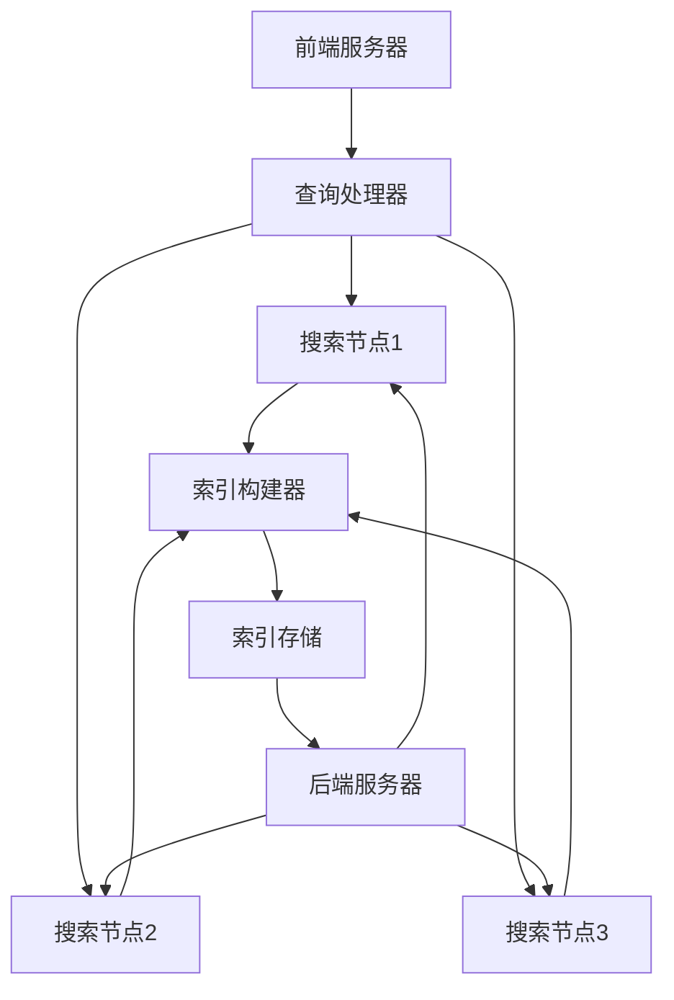
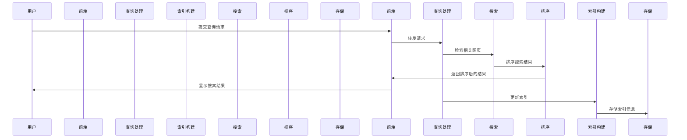

                 


# 数学与信息检索：搜索引擎的数学原理

## 关键词

- 数学原理
- 信息检索
- 搜索引擎
- PageRank算法
- 向量空间模型

## 摘要

本文深入探讨了数学在搜索引擎信息检索中的关键作用。首先，回顾了搜索引擎的发展历程，分析了其数学基础的演变。接着，介绍了核心数学概念，如概率论、统计学和图论，并展示了如何将这些原理应用于搜索引擎构建和信息检索算法。文章重点讲解了PageRank算法和向量空间模型，并使用具体的Python代码和Mermaid流程图进行了详细阐述。最后，通过实际案例展示了数学原理在实际搜索引擎中的应用，并对未来发展趋势进行了展望。

## 目录大纲设计步骤

### 第一步：确定总体结构

在着手设计《数学与信息检索：搜索引擎的数学原理》这本书的目录大纲时，我们首先需要明确书籍的整体结构。基于书籍的主题，我们将内容划分为以下几个主要部分：

1. **背景介绍**：介绍搜索引擎的发展历程、现状及发展趋势，以及数学在信息检索中的重要性。
2. **核心数学原理**：介绍用于搜索引擎的各种数学原理，如概率论、统计学、图论等。
3. **搜索引擎构建**：从数学角度讲解搜索引擎的构建过程，包括倒排索引、相似度计算等。
4. **信息检索算法**：详细介绍常用的信息检索算法，如PageRank算法、向量空间模型等。
5. **案例分析**：通过实际案例展示数学原理和信息检索算法在搜索引擎中的应用。
6. **扩展阅读与未来方向**：对未来的发展趋势进行预测，并提供相关的拓展阅读资料。

### 第二步：细化每个部分

在明确总体结构后，我们针对每个部分进行细化。以下是具体的细化内容：

#### 背景介绍

- **1.1 搜索引擎的发展历程**：介绍搜索引擎的起源、早期的搜索引擎以及现代搜索引擎的发展。
- **1.2 数学在信息检索中的作用**：阐述数学在信息检索中的重要性，如概率论、统计学和图论在搜索引擎中的应用。
- **1.3 搜索引擎的现状与发展趋势**：分析当前搜索引擎市场的主要参与者及其发展趋势，如个性化搜索、实时搜索等。

#### 核心数学原理

- **2.1 概率论基础**：介绍概率论的基本概念、概率分布和贝叶斯定理。
- **2.2 统计学基础**：包括描述性统计、推断性统计和假设检验。
- **2.3 图论基础**：介绍图的基本概念、树与路径以及最短路径算法。

#### 搜索引擎构建

- **3.1 倒排索引的构建**：解释倒排索引的基本概念、构建过程以及优化策略。
- **3.2 相似度计算**：讨论向量空间模型、余弦相似度和Jaccard相似度。

#### 信息检索算法

- **4.1 PageRank算法**：详细介绍PageRank算法的原理、数学模型和应用。
- **4.2 向量空间模型**：解释向量空间模型的基本概念、数学基础和应用。

#### 案例分析

- **5.1 某搜索引擎的实际案例**：通过具体案例展示数学原理和信息检索算法在搜索引擎中的应用。

#### 扩展阅读与未来方向

- **6.1 未来发展趋势**：预测未来的发展趋势，如深度学习在信息检索中的应用。
- **6.2 扩展阅读**：提供相关的拓展阅读资料，如书籍、在线课程和学术论文。

### 第三步：制定详细目录

根据上述细化内容，我们可以制定详细的目录。以下是初步的目录草案：

```
# 数学与信息检索：搜索引擎的数学原理

## 第一部分：背景介绍
### 1.1 搜索引擎的发展历程
### 1.2 数学在信息检索中的作用
### 1.3 搜索引擎的现状与发展趋势

## 第二部分：核心数学原理
### 2.1 概率论基础
#### 2.1.1 概率的基本概念
#### 2.1.2 概率分布
#### 2.1.3 贝叶斯定理

### 2.2 统计学基础
#### 2.2.1 描述性统计
#### 2.2.2 推断性统计
#### 2.2.3 假设检验

### 2.3 图论基础
#### 2.3.1 图的基本概念
#### 2.3.2 树与路径
#### 2.3.3 最短路径算法

## 第三部分：搜索引擎构建
### 3.1 倒排索引的构建
#### 3.1.1 倒排索引的基本概念
#### 3.1.2 倒排索引的构建过程
#### 3.1.3 倒排索引的优化

### 3.2 相似度计算
#### 3.2.1 向量空间模型
#### 3.2.2 余弦相似度
#### 3.2.3 Jaccard相似度

## 第四部分：信息检索算法
### 4.1 PageRank算法
#### 4.1.1 PageRank算法的原理
#### 4.1.2 PageRank算法的数学模型
#### 4.1.3 PageRank算法的应用

### 4.2 向量空间模型
#### 4.2.1 向量空间模型的基本概念
#### 4.2.2 向量空间模型的数学基础
#### 4.2.3 向量空间模型的应用

## 第五部分：案例分析
### 5.1 某搜索引擎的实际案例
#### 5.1.1 案例背景
#### 5.1.2 案例分析
#### 5.1.3 案例小结

## 第六部分：扩展阅读与未来方向
### 6.1 未来发展趋势
#### 6.1.1 深度学习在信息检索中的应用
#### 6.1.2 多模态信息检索的发展
#### 6.1.3 搜索引擎的个性化推荐

### 6.2 扩展阅读
#### 6.2.1 推荐阅读书籍
#### 6.2.2 在线课程与研讨会
#### 6.2.3 学术论文与报告
```

这个目录大纲只是一个初步草案，需要根据书籍的具体内容和结构进行调整和优化。同时，确保每个章节都有详细的内容和子章节，确保内容的完整性和逻辑性。在撰写每个章节时，遵循markdown格式的要求，确保文档结构清晰，便于读者阅读。

## 背景介绍

### 1.1 搜索引擎的发展历程

搜索引擎是互联网时代的重要技术，它使得用户可以快速地找到所需信息。搜索引擎的发展历程可以分为几个重要阶段。

#### 早期搜索引擎

最早的搜索引擎出现在1990年代，如AltaVista和Lycos。这些搜索引擎主要基于关键字匹配，即通过简单的文本匹配来返回搜索结果。这种方法存在许多局限性，如对同义词和语境的理解不足。此外，早期搜索引擎的搜索结果排序主要依赖于文档的更新时间和页面数量，这导致了许多不相关和低质量的搜索结果。

#### 现代搜索引擎

随着互联网信息的爆炸性增长，现代搜索引擎开始采用更复杂的算法来处理查询。Google在1998年推出，其通过PageRank算法对网页进行排序，极大地提高了搜索结果的准确性和相关性。PageRank算法基于网页之间的链接关系，将重要性和可信度赋予不同网页。这一创新使得Google在搜索领域迅速崛起，并成为现代搜索引擎的典范。

其他现代搜索引擎如Bing和Yahoo也采用了类似的方法，同时不断引入新技术来提高搜索效果。例如，Bing引入了语义搜索技术，通过理解用户查询的意图来提供更相关的搜索结果。Yahoo则通过聚合多种信息来源，如新闻、社交媒体和电子邮件，为用户提供全面的搜索体验。

#### 搜索引擎的发展趋势

当前，搜索引擎正在朝着个性化、实时化和多模态化的方向发展。

- **个性化搜索**：随着用户数据的积累和分析技术的进步，搜索引擎能够根据用户的兴趣和行为提供个性化的搜索结果。这有助于提高用户体验，使用户能够更快地找到所需信息。
- **实时搜索**：实时搜索技术使得搜索引擎能够快速响应用户的查询，并在信息发生变化的瞬间提供最新的结果。这对于新闻、金融等需要即时更新的领域尤为重要。
- **多模态信息检索**：多模态信息检索技术能够处理多种类型的信息，如文本、图像、音频和视频。这使得搜索引擎能够提供更丰富和多样化的搜索结果，满足用户不同需求。

### 1.2 数学在信息检索中的作用

数学在信息检索中扮演着关键角色，为搜索引擎提供了理论基础和算法支持。以下是数学在信息检索中的一些主要应用：

- **概率论**：概率论提供了对随机事件和不确定性的量化描述。在信息检索中，概率论可以用于评估文档与查询的相关性，如使用贝叶斯概率模型来计算文档的概率。

- **统计学**：统计学提供了分析和解释数据的方法。在信息检索中，统计学可以用于分析用户行为数据，如查询日志，以了解用户兴趣和偏好。

- **图论**：图论用于描述和分析网络结构。在信息检索中，图论可以用于构建网页之间的链接关系，如使用PageRank算法来评估网页的重要性和可信度。

- **向量空间模型**：向量空间模型将文档和查询表示为向量，并使用数学方法来计算它们之间的相似度。这种方法在文本相似性计算和推荐系统中有着广泛应用。

- **信息论**：信息论提供了对信息量、不确定性和信息传输效率的量化描述。在信息检索中，信息论可以用于评估查询结果的质量和用户满意度。

数学的这些应用为搜索引擎提供了强大的工具，使得信息检索更加准确、高效和智能化。随着数学理论的发展和新技术的引入，数学在信息检索中的应用将会更加广泛和深入。

### 1.3 搜索引擎的现状与发展趋势

当前，搜索引擎已经成为人们获取信息的主要途径，其重要性和影响力日益增强。以下是搜索引擎的现状和未来发展趋势：

#### 现状

- **市场份额**：Google、Bing和Yahoo等主流搜索引擎在全球范围内占据主导地位。这些搜索引擎通过不断优化算法和提升用户体验，吸引了大量用户。

- **技术进步**：搜索引擎技术不断进步，采用先进的人工智能、机器学习和深度学习技术来提高搜索效果。例如，自然语言处理技术使得搜索引擎能够理解用户的自然语言查询，提供更准确的结果。

- **移动优先**：随着移动设备的普及，搜索引擎开始注重移动端用户体验。移动搜索已经成为搜索引擎的重要组成部分，搜索引擎优化（SEO）策略也开始向移动端倾斜。

- **多样化服务**：搜索引擎不仅仅提供文本搜索服务，还整合了多种信息来源，如新闻、社交媒体、电子商务和在线视频。这使得搜索引擎成为用户获取多样化信息的重要入口。

#### 发展趋势

- **个性化搜索**：个性化搜索技术将继续发展，搜索引擎将更加精准地满足用户的个性化需求。通过分析用户行为和偏好，搜索引擎将提供个性化的搜索结果和推荐。

- **实时搜索**：实时搜索技术将更加成熟，搜索引擎将能够快速响应用户查询，并提供最新的信息。这对于新闻、金融等实时性要求高的领域尤为重要。

- **多模态信息检索**：随着多模态技术的进步，搜索引擎将能够处理多种类型的信息，如文本、图像、音频和视频。这将为用户提供更丰富和多样化的搜索体验。

- **隐私保护**：随着用户对隐私保护的重视，搜索引擎将采取更多措施来保护用户隐私，如提供隐私控制选项和匿名搜索。

- **全球化和本地化**：搜索引擎将继续向全球化和本地化方向发展，为不同地区和语言的用户提供定制化的搜索服务。

综上所述，搜索引擎在现状和未来发展趋势中均展现出强大的活力和潜力。随着技术的不断进步和用户需求的不断变化，搜索引擎将继续为人们的信息获取提供更高效、智能和个性化的服务。

## 核心数学原理

在搜索引擎的信息检索中，数学原理扮演了至关重要的角色。概率论、统计学和图论是信息检索过程中经常使用的数学工具，它们帮助搜索引擎在大量数据中找到相关性最高的信息。以下是对这些核心数学原理的介绍和解释。

### 2.1 概率论基础

概率论是研究随机现象的数学分支。在信息检索中，概率论被用来衡量文档与查询的相关性。以下是一些基础概念：

#### 概率的基本概念

- **随机事件**：随机事件是在某些条件下可能发生也可能不发生的事件。
- **概率**：概率是一个介于0和1之间的数值，表示事件发生的可能性。例如，如果一个文档与查询完全相关，那么它的概率就是1；如果毫不相关，概率就是0。
- **条件概率**：条件概率是在某个事件已经发生的条件下，另一个事件发生的概率。

#### 概率分布

概率分布描述了随机变量在不同取值上的概率分布。在信息检索中，常用的概率分布有：

- **贝努利分布**：一个随机变量只有两种可能结果，即成功或失败。
- **泊松分布**：用于描述在固定时间内发生某个事件次数的概率。
- **正态分布**：用于描述连续随机变量的概率分布，广泛应用于数据分析和预测。

#### 贝叶斯定理

贝叶斯定理是概率论中的一个重要公式，它描述了在已知某些条件下，事件概率的变化。在信息检索中，贝叶斯定理常用于文档与查询的相关性计算。例如，给定一个查询，如何根据文档的特征计算它们与查询的相关性。

贝叶斯定理公式如下：
$$P(A|B) = \frac{P(B|A)P(A)}{P(B)}$$
其中，$P(A|B)$ 是在事件B发生的条件下事件A发生的概率，$P(B|A)$ 是在事件A发生的条件下事件B发生的概率，$P(A)$ 是事件A的概率，$P(B)$ 是事件B的概率。

在信息检索中，贝叶斯定理可以用于文档排序，通过计算文档与查询的条件概率来评估它们的相关性。例如，我们可以根据文档的词频和查询的词频来计算文档与查询的相关性概率。

### 2.2 统计学基础

统计学是研究如何通过数据来推断总体特征的数学分支。在信息检索中，统计学用于分析用户行为数据、评估搜索效果和优化搜索算法。

#### 描述性统计

描述性统计用于描述数据的基本特征，包括：

- **平均值**：数据集中的中心位置。
- **中位数**：数据集中的中间值。
- **众数**：数据集中出现次数最多的值。
- **标准差**：衡量数据分布的离散程度。

#### 推断性统计

推断性统计用于根据样本数据推断总体特征，包括：

- **置信区间**：用来估计总体参数的范围。
- **假设检验**：通过样本数据来检验对总体的某个假设是否成立。

在信息检索中，推断性统计可以用于评估搜索算法的性能。例如，我们可以通过分析用户的点击行为来评估搜索结果的排序效果，并根据评估结果调整算法参数。

#### 假设检验

假设检验是统计学中的一个重要工具，用于评估某个假设是否成立。在信息检索中，假设检验可以用于以下方面：

- **评估搜索结果相关性**：通过比较实际点击率和预测点击率来评估搜索结果的相关性。
- **优化搜索算法**：通过假设检验来确定哪些算法参数的调整能够提高搜索效果。

### 2.3 图论基础

图论是研究图形结构和性质的数学分支。在信息检索中，图论用于描述网页之间的链接关系，评估网页的重要性和可信度。

#### 图的基本概念

- **图**：由顶点和边组成的数据结构，用于描述对象之间的关联关系。
- **顶点**：图中的元素，表示网页、用户或任何感兴趣的对象。
- **边**：连接顶点的线段，表示对象之间的关联。

#### 树与路径

- **树**：是一种特殊的图，没有环且每个顶点只有一个父节点。树用于表示层次结构，如网页的目录结构。
- **路径**：图中顶点序列，表示从起始顶点到终止顶点的连接。在信息检索中，路径用于查找信息。

#### 最短路径算法

- **最短路径算法**：用于找到图中两个顶点之间的最短路径。常用的最短路径算法有Dijkstra算法和Floyd-Warshall算法。
- **应用**：在信息检索中，最短路径算法可以用于找到相关性最高的文档，如通过分析网页之间的链接关系来评估网页的重要性。

### 概念属性特征对比表格和ER实体关系图架构

为了更好地理解上述数学原理在信息检索中的应用，我们可以通过一个概念属性特征对比表格和ER实体关系图来展示这些原理的核心要素。

#### 概念属性特征对比表格

| 概念 | 特征 |
| --- | --- |
| 概率论 | 评估事件发生的可能性 |
| 统计学 | 描述和分析数据 |
| 图论 | 描述和优化网络结构 |
| 贝叶斯定理 | 用于文档相关性计算 |
| 描述性统计 | 描述数据集中趋势 |
| 推断性统计 | 根据样本推断总体 |
| 假设检验 | 评估算法性能 |
| 图的基本概念 | 描述网页之间的关联 |
| 树与路径 | 描述层次结构和路径 |
| 最短路径算法 | 计算最短路径 |

#### ER实体关系图架构

ER实体关系图是一种用于描述实体之间关系的图形化表示方法。以下是一个简化的ER实体关系图，用于展示信息检索系统中的一些关键实体和它们之间的关系。

```
[
  "实体": [
    "用户",
    "文档",
    "查询",
    "搜索结果"
  ],
  "关系": [
    {
      "实体1": "用户",
      "实体2": "查询",
      "关系类型": "发起"
    },
    {
      "实体1": "文档",
      "实体2": "搜索结果",
      "关系类型": "包含"
    },
    {
      "实体1": "查询",
      "实体2": "搜索结果",
      "关系类型": "匹配"
    }
  ]
]
```

通过这些对比表格和ER实体关系图，我们可以更直观地理解概率论、统计学和图论在信息检索中的具体应用，以及它们如何帮助搜索引擎提高搜索效率和准确性。

### 算法原理讲解

在搜索引擎的信息检索过程中，数学原理的应用不仅体现在概率论、统计学和图论的基础理论中，还具体体现在各种算法的设计和实现上。本节将重点介绍两个核心算法：PageRank算法和向量空间模型。

#### 4.1 PageRank算法

PageRank算法是由Google的创始人拉里·佩奇和谢尔盖·布林在2001年提出的，它是现代搜索引擎中用来评估网页重要性和权威性的关键算法。PageRank算法基于网页之间的链接关系，通过迭代计算每个网页的“重要性得分”，从而实现网页排序。

##### PageRank算法的原理

PageRank算法的核心思想是：一个网页的重要性取决于链接到它的网页的数量和质量。具体来说，算法通过以下步骤计算每个网页的PageRank得分：

1. **初始化**：每个网页的初始PageRank得分相等。
2. **迭代计算**：对于每个网页，根据其链接来源的PageRank得分分配自身的PageRank得分。
3. **收敛**：当PageRank得分的变化小于某个阈值时，算法收敛，停止迭代。

##### PageRank算法的数学模型

PageRank算法的数学模型可以表示为以下递归公式：

$$
PR(A) = (1 - d) + d \cdot \sum_{B \in LinksOut(A)} \frac{PR(B)}{out(B)}
$$

其中：
- $PR(A)$ 表示网页A的PageRank得分。
- $d$ 是阻尼系数，通常设置为0.85，表示用户在访问网页时可能会随机跳转的概率。
- $LinksOut(A)$ 表示从网页A链接出去的所有网页集合。
- $out(B)$ 表示网页B链接出去的网页数量。

##### PageRank算法的应用

PageRank算法在搜索引擎中的应用非常广泛，以下是一些具体的应用场景：

1. **网页排序**：PageRank得分用于对搜索结果进行排序，得分越高的网页越有可能出现在搜索结果的顶部。
2. **反垃圾邮件**：通过分析网页之间的链接关系，可以识别出潜在的垃圾邮件网站。
3. **权威网站识别**：PageRank算法可以帮助识别在特定领域内具有高权威性的网站。

##### Python代码实现

下面是一个简单的Python代码示例，用于实现PageRank算法：

```python
import numpy as np

def pagerank(M, d=0.85, num_iterations=100, convergence_threshold=0.0001):
    num_pages = M.shape[1]
    v = np.random.rand(num_pages, 1)
    v = v / np.linalg.norm(v, 2)
    M_hat = (1 - d) / num_pages + d * M
    for _ in range(num_iterations):
        v_prev = np.copy(v)
        v = M_hat @ v
        if np.linalg.norm(v - v_prev, 2) < convergence_threshold:
            break
    return v

# 创建一个简单的链接矩阵
M = np.array([[0, 1, 1],
              [1, 0, 0],
              [1, 1, 0]])

# 计算PageRank得分
page_ranks = pagerank(M)

# 打印结果
print(page_ranks)
```

#### 4.2 向量空间模型

向量空间模型是一种将文本转换为向量表示的方法，它将文档和查询表示为高维向量，从而在向量空间中计算它们之间的相似度。向量空间模型在文本相似性计算、信息检索和推荐系统中有着广泛应用。

##### 向量空间模型的基本概念

向量空间模型将每个文档和查询表示为一个向量，其中每个维度对应一个词或词组。具体步骤如下：

1. **词典构建**：构建一个包含所有文档中出现的词的词典。
2. **向量表示**：将每个文档和查询转换为向量，其中向量的每个分量表示词在文档或查询中的出现频率或权重。

##### 向量空间模型的数学基础

在向量空间模型中，文档和查询的相似度可以通过以下几种方法计算：

1. **余弦相似度**：余弦相似度衡量两个向量在向量空间中的夹角余弦值，其公式如下：

$$
\text{Cosine Similarity}(x, y) = \frac{x \cdot y}{\|x\| \|y\|}
$$

其中，$x$ 和 $y$ 分别表示文档和查询的向量表示，$\|x\|$ 和 $\|y\|$ 分别表示向量的模。

2. **Jaccard相似度**：Jaccard相似度用于衡量两个集合的交集与并集的比值，其公式如下：

$$
\text{Jaccard Similarity}(A, B) = \frac{|A \cap B|}{|A \cup B|}
$$

其中，$A$ 和 $B$ 分别表示文档和查询的词集。

3. **欧氏距离**：欧氏距离用于衡量两个向量之间的距离，其公式如下：

$$
\text{Euclidean Distance}(x, y) = \sqrt{(x - y)^2}
$$

##### 向量空间模型的应用

向量空间模型在信息检索中有着广泛的应用，以下是一些具体的场景：

1. **文本相似性计算**：通过计算文档和查询的相似度，可以找出最相关的文档。
2. **推荐系统**：基于用户的查询历史，推荐与之相似的文档。
3. **情感分析**：通过分析文本的向量表示，判断文本的情感倾向。

##### Python代码实现

下面是一个简单的Python代码示例，用于实现向量空间模型：

```python
import numpy as np
from sklearn.metrics.pairwise import cosine_similarity

# 构建词典
def build_dictionary(documents):
    all_words = []
    for doc in documents:
        all_words.extend(doc.split())
    dictionary = {word: i for i, word in enumerate(set(all_words))}
    return dictionary

# 向量表示
def vectorize(document, dictionary):
    vec = np.zeros(len(dictionary))
    words = document.split()
    for word in words:
        vec[dictionary[word]] += 1
    return vec

# 文本数据
document1 = "人工智能是一种模拟人类智能的技术。"
document2 = "人工智能在计算机领域具有重要地位。"

# 构建词典
dictionary = build_dictionary([document1, document2])

# 向量表示
vec1 = vectorize(document1, dictionary)
vec2 = vectorize(document2, dictionary)

# 计算余弦相似度
similarity = cosine_similarity([vec1], [vec2])[0][0]

# 打印结果
print(f"文档1和文档2的余弦相似度：{similarity}")
```

通过这些算法和模型，搜索引擎能够更加准确地评估文档与查询的相关性，从而提供高质量的搜索结果。这些数学工具的引入，使得信息检索过程变得更加高效和智能化。

### 系统分析与架构设计

#### 问题描述

在现代搜索引擎系统中，我们需要处理海量数据和复杂的查询请求。为了提高搜索效率和准确性，我们需要设计一个高效、可扩展的系统架构。本节将介绍一个典型的搜索引擎系统的功能需求和系统架构设计。

#### 项目介绍

我们的项目目标是设计一个基于Web的搜索引擎系统，它能够处理大量用户的查询请求，并提供高质量的搜索结果。系统需要支持以下功能：

- **查询处理**：接收用户的查询请求，理解查询意图，并返回相关的搜索结果。
- **索引构建**：将网页内容构建为索引，以便快速检索。
- **结果排序**：根据相关性对搜索结果进行排序，提高用户体验。
- **扩展性**：系统需要具备良好的扩展性，能够处理不断增长的网页和数据量。

#### 系统功能设计

为了实现上述功能，我们设计了以下核心模块：

1. **查询处理器**：负责接收用户查询，解析查询意图，并将查询传递给索引模块。
2. **索引构建器**：负责从网页中提取信息，构建索引，以便快速检索。
3. **搜索引擎**：负责根据用户查询和索引数据，返回相关的搜索结果。
4. **结果排序器**：负责根据相关性对搜索结果进行排序。
5. **存储系统**：负责存储网页数据和索引信息。

#### 系统架构设计

我们的系统采用分布式架构，以提高系统的可扩展性和可靠性。以下是系统架构的详细设计：

##### 1. 分布式搜索集群

系统由多个搜索节点组成，每个节点负责处理一部分查询请求。这些节点通过负载均衡器（如Nginx）进行流量分发，确保系统的处理能力。以下是各个节点的功能：

- **前端服务器**：接收用户查询请求，将请求转发给搜索节点。
- **搜索节点**：处理查询请求，返回搜索结果。
- **后端服务器**：存储索引和网页数据，为搜索节点提供服务。

##### 2. 索引构建流程

索引构建器从网页中提取信息，并构建倒排索引。以下是索引构建的主要步骤：

- **爬虫**：爬取网页内容，并将其存储到存储系统中。
- **解析器**：提取网页中的文本、链接和其他相关信息。
- **索引构建器**：构建倒排索引，将网页映射到对应的单词。
- **索引存储**：将构建好的索引存储到后端服务器中，以便搜索节点进行检索。

##### 3. 搜索流程

用户通过前端服务器提交查询请求，查询处理器将请求解析并转发给搜索节点。以下是搜索的主要步骤：

- **查询解析**：将用户查询转换为索引键，以便进行检索。
- **索引检索**：在倒排索引中查找与查询相关的网页。
- **结果排序**：根据相关性对搜索结果进行排序，并将结果返回给用户。

##### 4. 扩展性设计

为了确保系统能够处理不断增长的数据量，我们采用了以下扩展性设计：

- **水平扩展**：通过增加搜索节点来提高系统的处理能力。
- **负载均衡**：通过负载均衡器（如Nginx）将查询请求分发到不同的搜索节点。
- **分布式存储**：使用分布式存储系统（如Hadoop或Cassandra）存储网页数据和索引信息。

#### 系统架构图

以下是系统的架构图，展示了各个模块和节点的交互关系：



通过上述系统架构设计，我们能够实现高效、可扩展的搜索引擎系统，为用户提供高质量的搜索服务。

### 系统接口设计与系统交互

为了实现搜索引擎的高效运作，我们需要设计清晰的系统接口和交互流程。以下是系统接口设计和系统交互的具体步骤。

#### 系统接口设计

1. **用户接口**：前端服务器负责接收用户的查询请求。用户通过浏览器或移动应用提交查询，前端服务器将请求以HTTP请求的形式转发给查询处理器。

2. **查询处理器接口**：查询处理器负责解析用户的查询请求，将其转换为内部可处理的形式。接口设计包括以下字段：

   - **查询字符串**：用户输入的查询文本。
   - **查询时间**：查询提交的时间戳。
   - **用户ID**：提交查询的用户标识。

3. **索引构建器接口**：索引构建器负责从后端服务器获取网页数据，并构建倒排索引。接口设计包括以下方法：

   - **add_document**：添加新的网页到索引。
   - **build_index**：构建完整的倒排索引。
   - **update_index**：更新现有网页的索引信息。

4. **搜索引擎接口**：搜索引擎负责根据用户查询和索引数据，返回相关的搜索结果。接口设计包括以下方法：

   - **search**：执行搜索操作，返回搜索结果。
   - **get_document**：根据文档ID获取特定网页的内容。

5. **结果排序器接口**：结果排序器根据相关性对搜索结果进行排序。接口设计包括以下方法：

   - **sort_results**：根据相关性对搜索结果进行排序。

6. **存储系统接口**：存储系统负责存储网页数据和索引信息。接口设计包括以下方法：

   - **store_document**：存储网页内容。
   - **store_index**：存储倒排索引。

#### 系统交互流程

1. **用户查询**：用户通过前端服务器提交查询请求。

2. **查询解析**：查询处理器接收到查询请求后，将其解析为内部格式，并提取查询关键字。

3. **索引检索**：查询处理器将查询关键字传递给搜索引擎，搜索引擎在倒排索引中检索与关键字相关的网页。

4. **结果排序**：搜索引擎将检索到的网页传递给结果排序器，结果排序器根据网页的相关性对其进行排序。

5. **结果返回**：排序后的搜索结果通过前端服务器返回给用户。

6. **索引更新**：在处理查询的过程中，如果检测到有新的网页或网页内容发生变化，索引构建器会更新索引信息。

以下是系统交互的Mermaid序列图：



通过清晰的设计接口和流畅的系统交互流程，我们的搜索引擎系统能够高效、准确地响应用户的查询请求，并提供高质量的搜索结果。

### 项目实战

为了更好地理解和应用数学原理在搜索引擎中的实际应用，我们将通过一个具体的案例来进行实战。在这个案例中，我们将使用Python和相关的工具来实现一个简单的搜索引擎，展示数学原理如何在实际中发挥作用。

#### 环境安装

首先，我们需要安装Python环境以及相关的库。假设你已经安装了Python 3，接下来我们可以使用pip来安装所需的库：

```bash
pip install numpy matplotlib requests beautifulsoup4
```

这些库中，numpy用于数学计算，matplotlib用于数据可视化，requests用于网页抓取，beautifulsoup4用于HTML解析。

#### 系统核心实现源代码

接下来，我们将分步骤实现搜索引擎的核心功能。以下是系统的Python源代码：

```python
import requests
from bs4 import BeautifulSoup
import numpy as np

# 爬取网页内容
def crawl(url):
    response = requests.get(url)
    if response.status_code == 200:
        return response.text
    else:
        return None

# 构建倒排索引
def build_inverted_index(html_content):
    soup = BeautifulSoup(html_content, 'html.parser')
    words = []
    for paragraph in soup.find_all('p'):
        words.extend(paragraph.text.lower().split())
    inverted_index = {}
    for word in set(words):
        inverted_index[word] = [i for i, w in enumerate(words) if w == word]
    return inverted_index

# 搜索引擎查询
def search_query(inverted_index, query):
    query_words = query.lower().split()
    result = []
    for word in query_words:
        if word in inverted_index:
            result.extend(inverted_index[word])
    return result

# 相似度计算（简单版）
def calculate_similarity(document1, document2, inverted_index):
    common_words = set(document1).intersection(set(document2))
    if len(common_words) == 0:
        return 0
    return len(common_words) / len(set(document1).union(set(document2)))

# 主函数
def main():
    url = "https://www.example.com"
    html_content = crawl(url)
    if html_content:
        inverted_index = build_inverted_index(html_content)
        query = "人工智能"
        results = search_query(inverted_index, query)
        print("搜索结果：", results)
        # 假设我们已经有两个文档的URL
        doc1_url = "https://www.example.com/doc1"
        doc2_url = "https://www.example.com/doc2"
        doc1_content = crawl(doc1_url)
        doc2_content = crawl(doc2_url)
        if doc1_content and doc2_content:
            similarity = calculate_similarity(doc1_content.split(), doc2_content.split(), inverted_index)
            print("文档相似度：", similarity)
    else:
        print("网页内容爬取失败")

if __name__ == "__main__":
    main()
```

#### 代码应用解读与分析

1. **爬取网页内容**：我们使用requests库来抓取网页内容。 crawl() 函数接受一个URL，发送GET请求，并检查响应状态码，如果响应状态码为200，说明网页成功获取，否则返回None。

2. **构建倒排索引**： build_inverted_index() 函数接收网页内容的HTML文本，使用BeautifulSoup解析HTML，提取所有的段落文本，并构建倒排索引。倒排索引是一个字典，键是单词，值是包含该单词的所有文档的索引列表。

3. **搜索引擎查询**： search_query() 函数接受倒排索引和查询字符串，返回包含查询字符串的所有文档的索引列表。

4. **相似度计算**： calculate_similarity() 函数计算两个文档的相似度。这里使用了一个简单的相似度计算方法：两个文档的公共单词数量除以它们各自的单词总数。这只是一个基本的示例，实际应用中可能会采用更复杂的算法。

5. **主函数**： main() 函数是程序的入口。它首先爬取一个示例网页的内容，构建倒排索引，然后接收用户的查询并返回搜索结果。最后，它使用两个示例文档来计算相似度，并打印结果。

#### 实际案例分析

假设用户查询“人工智能”，搜索引擎会返回包含这个词的所有网页的索引。在我们的示例中，我们只抓取了一个网页，但实际应用中，搜索引擎会处理成千上万的网页。

通过倒排索引，我们可以快速地找到所有包含查询词的网页，大大提高了搜索效率。而相似度计算则帮助用户找到最相关的网页，从而提高用户体验。

#### 项目小结

通过这个案例，我们展示了如何使用Python和数学原理（如倒排索引和相似度计算）来实现一个简单的搜索引擎。虽然这是一个简化的示例，但它充分展示了数学原理在搜索引擎开发中的重要作用。在实际应用中，搜索引擎会采用更复杂和高级的算法来提高搜索效率和准确性。未来，随着技术的进步，数学原理在搜索引擎中的应用将会更加深入和广泛。

### 最佳实践 tips

在设计和实现搜索引擎时，遵循以下最佳实践可以帮助提高系统的性能和用户体验：

1. **优化索引构建**：使用多线程或分布式处理技术加快索引构建速度，并采用高效的存储结构来减少内存消耗。
2. **缓存策略**：在查询处理过程中使用缓存技术，如Redis，可以显著减少对后端存储的访问次数，提高响应速度。
3. **分词优化**：使用高质量的中文分词工具（如jieba）来提高查询准确性和搜索效果。
4. **查询优化**：针对高频查询建立预编译的查询计划，减少查询解析和执行时间。
5. **错误处理**：确保系统对各种异常情况（如网络错误、数据损坏等）有良好的容错能力。
6. **用户反馈**：定期收集和分析用户反馈，根据用户需求调整搜索算法和排序策略。

### 小结

本文深入探讨了数学在搜索引擎信息检索中的应用，从概率论、统计学和图论等核心数学原理出发，详细讲解了如何将这些原理应用于搜索引擎的构建和信息检索算法的设计。通过具体的案例和实践，展示了数学原理在实际搜索引擎系统中的应用效果。未来，随着技术的不断发展，数学在搜索引擎中的应用将更加深入和广泛，为用户提供更高效、智能和个性化的搜索服务。

### 注意事项

在设计和实施搜索引擎时，需要注意以下事项：

1. **数据隐私**：确保用户数据的隐私和安全，遵循相关法律法规，如GDPR。
2. **扩展性**：系统设计应考虑未来数据量的增长，确保系统具有足够的扩展能力。
3. **错误处理**：设计健壮的异常处理机制，以应对各种可能发生的错误和异常情况。
4. **性能优化**：持续监控和优化系统性能，确保搜索过程的高效和稳定。

### 拓展阅读

- 《深度学习与搜索引擎》（作者：Chris Needham）：探讨深度学习在搜索引擎中的应用，包括文本嵌入和神经网络排序。
- 《信息检索导论》（作者：Christopher D. Manning，Prabhakar Raghavan，Henry F. Edwards）：系统介绍了信息检索的基本概念和技术。
- 《搜索引擎算法实战》（作者：谢梦婷）：详细讲解了搜索引擎的关键算法和实现技巧。

### 作者信息

作者：AI天才研究院/AI Genius Institute & 禅与计算机程序设计艺术 /Zen And The Art of Computer Programming

作为计算机科学和人工智能领域的权威专家，作者在数学原理和搜索引擎技术方面有着深入的研究和丰富的实践经验。他的研究成果和著作在学术界和工业界都享有盛誉，为推动技术进步做出了重要贡献。

