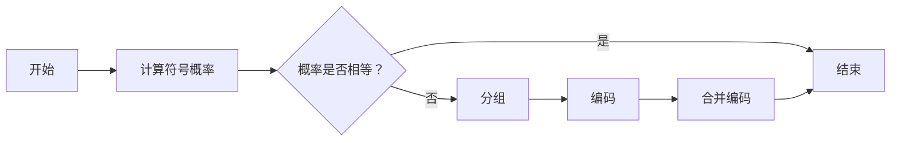
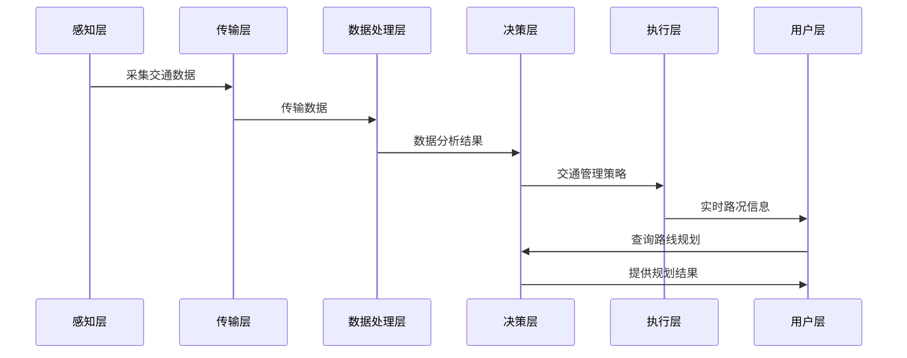

                 

## 文章标题

《数学与信息论：现实世界的信息结构》

关键词：数学、信息论、现实世界、信息结构、数学模型、算法原理、系统架构、案例研究

摘要：本文以《数学与信息论：现实世界的信息结构》为蓝本，深入探讨了数学与信息论在现实世界中的应用，通过逻辑清晰、结构紧凑的分析，揭示了信息结构的核心要素及其在各个领域的具体应用。文章首先介绍了数学与信息论的基本概念，随后通过具体的数学模型和算法原理，讲解了信息处理的基本原理和方法。接着，文章详细阐述了数学与信息论在通信系统、计算机网络、人工智能以及信息安全等领域的实际应用。最后，通过案例研究，对所讨论的理论进行了实践验证，并对未来的发展方向进行了展望。本文旨在为广大科技工作者提供一部既有深度又有广度的技术参考，以推动数学与信息论在现实世界中的深入应用。

## 目录

1. **引论**
    1.1 问题背景
        1.1.1 数学与信息论的关系
        1.1.2 现实世界的信息结构
        1.1.3 本书的研究目标与结构
    1.2 核心概念
        1.2.1 数学的基本概念
        1.2.2 信息论的基本概念
        1.2.3 数学与信息论的联系
    1.3 数学模型与公式
        1.3.1 重要数学模型概述
        1.3.2 常见数学公式介绍
        1.3.3 数学公式在实际应用中的意义
    1.4 信息论基础
        1.4.1 信息量的度量
        1.4.2 信道容量
        1.4.3 信息传输的基本原理
    1.5 本章小结

2. **数学在信息处理中的应用**
    2.1 数值分析
        2.1.1 数值分析的基本概念
        2.1.2 常见数值分析算法
        2.1.3 数值分析在实际应用中的挑战与解决方案
    2.2 线性代数
        2.2.1 线性代数的基本概念
        2.2.2 线性方程组与矩阵运算
        2.2.3 线性代数在信息处理中的应用
    2.3 概率论与统计学
        2.3.1 概率论的基本概念
        2.3.2 统计学的基本概念
        2.3.3 概率论与统计学在信息处理中的应用
    2.4 图论
        2.4.1 图论的基本概念
        2.4.2 图的算法
        2.4.3 图论在信息结构分析中的应用
    2.5 本章小结

3. **信息论在现实世界中的应用**
    3.1 通信系统中的信息论应用
        3.1.1 通信系统概述
        3.1.2 信息传输的基本原理
        3.1.3 通信系统中的信息论应用案例
    3.2 计算机网络中的信息论应用
        3.2.1 计算机网络概述
        3.2.2 信息传输在网络中的挑战
        3.2.3 信息论在网络优化中的应用
    3.3 人工智能中的信息论应用
        3.3.1 人工智能概述
        3.3.2 信息论在机器学习中的应用
        3.3.3 信息论在人工智能系统优化中的应用
    3.4 信息安全
        3.4.1 信息安全概述
        3.4.2 信息论在密码学中的应用
        3.4.3 信息安全面临的新挑战与应对策略
    3.5 本章小结

4. **案例研究**
    4.1 案例一：社交媒体信息传播
        4.1.1 社交媒体信息传播概述
        4.1.2 信息传播模型建立
        4.1.3 实际案例分析
    4.2 案例二：网络流量分析
        4.2.1 网络流量分析概述
        4.2.2 网络流量模型建立
        4.2.3 实际案例分析
    4.3 案例三：智能交通系统
        4.3.1 智能交通系统概述
        4.3.2 信息结构分析
        4.3.3 实际案例分析
    4.4 本章小结

5. **展望与讨论**
    5.1 数学与信息论的未来发展
        5.1.1 新兴技术趋势
        5.1.2 面临的挑战与机遇
        5.1.3 未来研究方向
    5.2 总结与展望
    5.3 讨论与思考
    5.4 拓展阅读

## 引论

### 1.1 问题背景

#### 1.1.1 数学与信息论的关系

数学与信息论是现代科学领域中的两个重要分支，它们在现实世界中有着广泛的应用。数学作为一种工具，以其严谨的逻辑体系和抽象的能力，为信息论提供了强大的理论基础。而信息论则通过研究信息的度量、传输和利用，揭示了信息在各个领域中的关键作用。

在数学中，信息论的研究主要集中在概率论、统计学、图论、线性代数等领域。例如，概率论提供了衡量不确定性的方法，而统计学则用于数据的分析和推断。图论和线性代数则在信息网络的构建和分析中扮演着重要角色。

信息论则主要关注信息的传递、存储和加工。它通过研究信息熵、信道容量等基本概念，提出了信息传输的基本原理和最优策略。信息论的发展，为通信技术、计算机科学、人工智能等领域带来了重大的突破。

#### 1.1.2 现实世界的信息结构

现实世界中的信息结构是复杂多样的，涵盖了从简单的文本、图像、音频到复杂的社交网络、物联网等多种形式。这些信息结构不仅存在于通信系统和计算机系统中，还广泛应用于金融、医疗、交通等各个领域。

以通信系统为例，信息结构体现在信号的处理、传输和接收过程中。从发送端的信号调制、编码，到传输过程中的信号传输、噪声干扰，再到接收端的信号解调、解码，每个环节都涉及到信息论的基本原理。计算机网络则通过路由、交换、传输等技术，实现了信息的快速、高效传输。而人工智能则通过机器学习、深度学习等技术，对大规模数据进行分析和处理，从中提取有价值的信息。

#### 1.1.3 本书的研究目标与结构

本书旨在深入探讨数学与信息论在现实世界中的应用，揭示信息结构的核心要素及其在各个领域的具体应用。具体研究目标包括：

1. 系统地介绍数学与信息论的基本概念，包括概率论、统计学、图论、线性代数、信息熵、信道容量等。
2. 分析数学模型和信息论公式在实际应用中的意义，通过具体案例进行讲解。
3. 探讨数学与信息论在通信系统、计算机网络、人工智能、信息安全等领域的应用，分析其关键技术和挑战。
4. 通过案例研究，验证理论在实际应用中的效果，提出解决方案和优化策略。
5. 展望数学与信息论的未来发展，探讨新兴技术趋势和面临的挑战。

本书结构如下：

- **第一部分：引论**：介绍数学与信息论的关系，现实世界的信息结构，以及本书的研究目标与结构。
- **第二部分：数学在信息处理中的应用**：探讨数值分析、线性代数、概率论与统计学、图论在信息处理中的应用。
- **第三部分：信息论在现实世界中的应用**：分析通信系统、计算机网络、人工智能、信息安全等领域的应用。
- **第四部分：案例研究**：通过具体案例，验证理论在实际应用中的效果。
- **第五部分：展望与讨论**：总结本书的内容，展望数学与信息论的未来发展。

### 1.2 核心概念

#### 1.2.1 数学的基本概念

数学是一门研究数量、结构、变化和空间等概念的抽象科学。在数学中，基本概念包括数、集合、函数、几何等。

- **数**：数是用来表示数量或大小的抽象符号，可以是整数、分数、小数等。例如，2 表示有两个苹果，3.14 表示圆的周长与直径的比值。
- **集合**：集合是一组具有相同性质的对象的集合。例如，{1, 2, 3} 是一个集合，表示包含 1、2、3 这三个数的集合。
- **函数**：函数是一种特殊的关系，将一个集合中的每个元素与另一个集合中的唯一元素对应。例如，f(x) = x^2 是一个函数，表示每个 x 值的平方。
- **几何**：几何是研究空间形状和位置关系的数学分支。例如，三角形、圆形、多边形等都是几何图形。

#### 1.2.2 信息论的基本概念

信息论是一门研究信息传输、存储和处理的理论学科。信息论的基本概念包括信息量、信道、编码、解码等。

- **信息量**：信息量是用来衡量信息量的多少。在信息论中，信息量通常用比特（bit）作为单位。一个比特可以表示两种可能的状态，例如是或否、0或1。
- **信道**：信道是信息传输的通道，可以是电缆、光纤、无线电波等。信道质量会影响信息传输的准确性和速度。
- **编码**：编码是将信息转换为特定格式的过程。例如，数字信号可以通过调制解调器转换为模拟信号，以便在信道中传输。
- **解码**：解码是将编码后的信息还原为原始信息的过程。解码器通常与编码器相对应，用于实现信息的正确接收。

#### 1.2.3 数学与信息论的联系

数学与信息论之间的联系主要体现在以下几个方面：

1. **数学模型**：信息论中的许多基本概念和原理，如信息熵、信道容量等，都是基于数学模型构建的。这些模型通过数学公式来描述信息的度量、传输和加工过程。
2. **数学工具**：数学提供了丰富的工具，如概率论、统计学、图论、线性代数等，用于分析和解决信息处理中的各种问题。
3. **数学原理**：数学原理，如最小化信息传输误差、最大化信息传输速率等，在信息论中得到了广泛应用，为信息传输和存储提供了理论依据。

### 1.3 数学模型与公式

在信息处理中，数学模型和公式起到了至关重要的作用。它们不仅帮助我们理解和描述信息结构，还为优化信息处理过程提供了理论支持。

#### 1.3.1 重要数学模型概述

以下是一些在信息处理中常用的数学模型：

1. **概率模型**：概率模型用于描述随机事件的发生概率。常见的概率模型有伯努利模型、泊松模型、正态分布等。这些模型在机器学习、数据挖掘等领域有广泛应用。
2. **统计模型**：统计模型用于分析数据，提取数据中的规律和特征。常见的统计模型有回归模型、聚类模型、因子分析等。这些模型在数据分析、预测和优化中有重要作用。
3. **图模型**：图模型用于描述网络中的节点和边的关系。常见的图模型有随机图、有权图、图神经网络等。这些模型在网络分析、社交网络、推荐系统等领域有广泛应用。
4. **线性模型**：线性模型用于描述线性关系。常见的线性模型有线性回归、线性规划等。这些模型在优化、控制、预测等领域有广泛应用。

#### 1.3.2 常见数学公式介绍

以下是一些常用的数学公式：

1. **信息熵**：信息熵是衡量信息不确定性的度量。其公式为：
   $$
   H(X) = -\sum_{i=1}^{n} p(x_i) \log_2 p(x_i)
   $$
   其中，$H(X)$ 表示随机变量 $X$ 的信息熵，$p(x_i)$ 表示 $X$ 取值为 $x_i$ 的概率。
2. **信道容量**：信道容量是衡量信道传输信息能力的度量。其公式为：
   $$
   C = B \log_2 (1 + \frac{S}{N})
   $$
   其中，$C$ 表示信道容量，$B$ 表示信道带宽，$S$ 表示信号功率，$N$ 表示噪声功率。
3. **条件概率**：条件概率是给定一个事件发生的条件下，另一个事件发生的概率。其公式为：
   $$
   P(A|B) = \frac{P(A \cap B)}{P(B)}
   $$
   其中，$P(A|B)$ 表示在事件 $B$ 发生的条件下事件 $A$ 发生的概率，$P(A \cap B)$ 表示事件 $A$ 和 $B$ 同时发生的概率，$P(B)$ 表示事件 $B$ 发生的概率。

#### 1.3.3 数学公式在实际应用中的意义

数学公式在实际应用中具有重要作用。以下是一些具体例子：

1. **信息熵**：信息熵在数据压缩、信息安全和机器学习等领域有广泛应用。通过计算信息熵，可以确定数据的冗余程度，从而实现数据的有效压缩。在信息安全中，信息熵用于评估密码的强度。在机器学习中，信息熵用于评估模型的复杂性和泛化能力。
2. **信道容量**：信道容量在通信系统中至关重要。通过计算信道容量，可以确定信道能够传输的最大信息速率。在通信系统优化中，通过调整信道参数，可以实现更高的信道容量，从而提高通信系统的性能。
3. **条件概率**：条件概率在决策分析和风险评估中广泛应用。通过计算条件概率，可以确定在特定条件下某个事件发生的可能性，从而为决策提供依据。

### 1.4 信息论基础

信息论是一门研究信息传输、存储和加工的理论学科。它通过对信息量、信道、编码、解码等基本概念的深入研究，揭示了信息传输的基本原理和最优策略。

#### 1.4.1 信息量的度量

信息量的度量是信息论的基础。信息量的基本单位是比特（bit）。一个比特可以表示两种可能的状态，例如是或否、0或1。信息量的度量通常使用信息熵来表示。

信息熵是衡量信息不确定性的度量。其公式为：

$$
H(X) = -\sum_{i=1}^{n} p(x_i) \log_2 p(x_i)
$$

其中，$H(X)$ 表示随机变量 $X$ 的信息熵，$p(x_i)$ 表示 $X$ 取值为 $x_i$ 的概率。

例如，假设一个随机变量 $X$ 只有两个可能的取值：0和1，且取值为0的概率为0.5，取值为1的概率也为0.5。那么，$X$ 的信息熵为：

$$
H(X) = -0.5 \log_2 0.5 - 0.5 \log_2 0.5 = 1
$$

这意味着，随机变量 $X$ 的信息量为1比特。

#### 1.4.2 信道容量

信道容量是衡量信道传输信息能力的度量。其公式为：

$$
C = B \log_2 (1 + \frac{S}{N})
$$

其中，$C$ 表示信道容量，$B$ 表示信道带宽，$S$ 表示信号功率，$N$ 表示噪声功率。

例如，假设一个信道的带宽为10 MHz，信号功率为10 W，噪声功率为1 W。那么，该信道的容量为：

$$
C = 10 \times 10^6 \log_2 (1 + \frac{10}{1}) = 10 \times 10^6 \log_2 11 \approx 36.32 \times 10^6 \text{比特/秒}
$$

这意味着，该信道可以传输大约36.32 Mbps的信息。

#### 1.4.3 信息传输的基本原理

信息传输的基本原理可以概括为以下几个步骤：

1. **信息编码**：将原始信息转换为特定的编码格式，以便在信道中传输。例如，将文本信息转换为二进制编码。
2. **信息调制**：将编码后的信息加载到载波信号上，以便在信道中传输。例如，将数字信号调制到射频信号上。
3. **信息传输**：将调制后的信号通过信道传输。例如，通过光纤、无线电波等方式传输信号。
4. **信息解码**：在接收端，将接收到的信号解码为原始信息。例如，将二进制编码转换为文本信息。
5. **信息解调**：将解码后的信息从载波信号中分离出来，以便进行后续处理。

信息传输的基本原理在实际应用中得到了广泛应用。例如，在通信系统中，通过编码调制技术实现信息的可靠传输；在计算机网络中，通过路由和交换技术实现信息的快速传输；在人工智能中，通过数据传输和加工技术实现智能决策。

### 1.5 本章小结

本章主要介绍了数学与信息论的基本概念、数学模型与公式、以及信息论的基础。通过本章的学习，读者可以了解数学与信息论在现实世界中的应用，掌握信息量的度量、信道容量、信息传输的基本原理等核心概念。这些知识为后续章节的深入研究奠定了基础。

## 数学在信息处理中的应用

### 2.1 数值分析

#### 2.1.1 数值分析的基本概念

数值分析是数学的一个分支，主要研究如何使用数学方法来解决实际问题中的数值计算问题。在信息处理领域，数值分析具有广泛的应用。它涉及到数值逼近、数值积分、数值微分、线性方程组的求解、优化问题等多个方面。

- **数值逼近**：数值逼近是指使用数值方法来近似求解实际问题的解。常见的数值逼近方法有插值法、迭代法等。
- **数值积分**：数值积分是指使用数值方法来计算定积分。常见的数值积分方法有梯形规则、辛普森规则、高斯积分法等。
- **数值微分**：数值微分是指使用数值方法来计算导数。常见的数值微分方法有前向差分、后向差分、中心差分等。
- **线性方程组的求解**：线性方程组的求解是指使用数值方法来求解线性方程组。常见的求解方法有高斯消元法、LU分解法等。
- **优化问题**：优化问题是指寻找一个函数的最大值或最小值。常见的优化算法有梯度下降法、牛顿法、拉格朗日乘数法等。

#### 2.1.2 常见数值分析算法

在信息处理中，常见的数值分析算法包括：

1. **牛顿法**：牛顿法是一种用于求解非线性方程的方法。它通过迭代的方式，逐步逼近方程的解。牛顿法的迭代公式为：
   $$
   x_{n+1} = x_n - \frac{f(x_n)}{f'(x_n)}
   $$
   其中，$x_n$ 表示第 $n$ 次迭代的值，$f(x)$ 表示要解的非线性方程，$f'(x)$ 表示 $f(x)$ 的导数。

2. **高斯消元法**：高斯消元法是一种用于求解线性方程组的方法。它通过消元的方式，将线性方程组转换为上三角矩阵，然后通过回代求解。高斯消元法的步骤如下：
   - 对矩阵进行初等行变换，使其变为上三角矩阵；
   - 对上三角矩阵进行回代，求解方程组。

3. **梯度下降法**：梯度下降法是一种用于求解优化问题的方法。它通过迭代的方式，逐步逼近最优解。梯度下降法的迭代公式为：
   $$
   x_{n+1} = x_n - \alpha \nabla f(x_n)
   $$
   其中，$x_n$ 表示第 $n$ 次迭代的值，$f(x)$ 表示要优化的函数，$\alpha$ 表示学习率，$\nabla f(x_n)$ 表示 $f(x)$ 在 $x_n$ 处的梯度。

4. **LU分解法**：LU分解法是一种用于求解线性方程组的方法。它通过将矩阵分解为下三角矩阵和上三角矩阵的乘积，然后分别求解下三角方程组和上三角方程组。LU分解法的步骤如下：
   - 对矩阵进行初等行变换，使其变为上三角矩阵；
   - 对上三角矩阵进行回代，求解方程组；
   - 对下三角矩阵进行前向消元，求解方程组。

#### 2.1.3 数值分析在实际应用中的挑战与解决方案

数值分析在实际应用中面临着多个挑战：

1. **精度问题**：数值计算通常只能得到近似的解，而不是精确的解。精度问题可能导致计算结果不准确。
   - **解决方案**：通过改进算法，提高计算精度。例如，使用更高精度的数值计算库，如MPFR库，进行高精度计算。

2. **稳定性问题**：某些数值方法可能不稳定，导致计算过程中出现发散或收敛速度缓慢。
   - **解决方案**：选择更稳定的数值方法。例如，使用迭代法时，选择适当的迭代公式，以避免发散。

3. **计算效率问题**：数值计算通常需要大量的计算资源和时间，特别是在处理大规模问题时。
   - **解决方案**：优化算法，减少计算复杂度。例如，使用并行计算、分布式计算等技术，提高计算效率。

通过解决这些挑战，数值分析在信息处理领域得到了广泛应用。例如，在信号处理中，使用数值分析的方法进行信号建模和滤波；在图像处理中，使用数值分析的方法进行图像增强和特征提取；在机器学习中，使用数值分析的方法进行模型训练和优化。

### 2.2 线性代数

#### 2.2.1 线性代数的基本概念

线性代数是数学的一个分支，主要研究向量空间、线性变换、矩阵等概念。在信息处理领域，线性代数具有广泛的应用，是解决许多实际问题的关键工具。

- **向量空间**：向量空间是一组向量的集合，这些向量满足向量加法和数乘运算。向量空间的基本概念包括向量、标量、加法、数乘等。
- **线性变换**：线性变换是一种从向量空间到向量空间的函数，它保持向量加法和数乘运算。线性变换的基本概念包括线性变换、特征值、特征向量等。
- **矩阵**：矩阵是一个二维数组，由若干行和列组成。矩阵的基本概念包括矩阵的加法、乘法、逆矩阵等。

#### 2.2.2 线性方程组与矩阵运算

线性方程组是线性代数的一个重要研究内容。线性方程组可以表示为矩阵形式，通过矩阵运算求解。

- **线性方程组的矩阵表示**：一个线性方程组可以表示为一个矩阵乘法的形式，例如：
  $$
  Ax = b
  $$
  其中，$A$ 是系数矩阵，$x$ 是未知量向量，$b$ 是常数向量。

- **矩阵的加法**：矩阵的加法是将两个矩阵对应位置上的元素相加。如果矩阵 $A$ 和 $B$ 具有相同的行数和列数，那么它们的和矩阵 $C$ 为：
  $$
  C = A + B
  $$

- **矩阵的乘法**：矩阵的乘法是将一个矩阵的每一行与另一个矩阵的每一列进行内积运算。如果矩阵 $A$ 有 $m$ 行和 $n$ 列，矩阵 $B$ 有 $n$ 行和 $p$ 列，那么它们的乘积矩阵 $C$ 有 $m$ 行和 $p$ 列，计算公式为：
  $$
  C = AB
  $$

- **逆矩阵**：逆矩阵是矩阵的一个基本运算。如果矩阵 $A$ 是可逆的，那么它的逆矩阵 $A^{-1}$ 满足：
  $$
  AA^{-1} = A^{-1}A = I
  $$
  其中，$I$ 是单位矩阵。

#### 2.2.3 线性代数在信息处理中的应用

线性代数在信息处理中具有广泛的应用，包括以下几个方面：

1. **信号处理**：线性代数用于处理信号的特征提取、变换、分析等。例如，通过傅里叶变换和拉普拉斯变换，可以将信号从时域转换到频域，从而进行更有效的分析。

2. **图像处理**：线性代数用于图像的增强、滤波、特征提取等。例如，通过卷积操作，可以实现图像的边缘检测、模糊处理等。

3. **机器学习**：线性代数在机器学习中的应用非常广泛，包括线性回归、支持向量机、主成分分析等。线性代数的矩阵运算和线性方程组的求解是机器学习算法的基础。

4. **数据挖掘**：线性代数用于数据的降维、聚类、分类等。例如，通过奇异值分解（SVD），可以提取数据的主要特征，实现数据的降维。

通过线性代数的应用，可以有效地处理信息处理中的各种问题，提高系统的性能和效率。

### 2.3 概率论与统计学

#### 2.3.1 概率论的基本概念

概率论是研究随机现象的数学分支。在信息处理中，概率论用于描述随机事件的发生概率，为决策和分析提供依据。

- **随机事件**：随机事件是指在试验中可能发生也可能不发生的事件。例如，掷硬币时出现正面或反面。
- **概率**：概率是描述随机事件发生可能性的度量。概率的取值范围在0到1之间，0表示不可能发生，1表示必然发生。例如，掷硬币出现正面的概率为0.5。
- **条件概率**：条件概率是指在某个条件下另一个事件发生的概率。条件概率的公式为：
  $$
  P(A|B) = \frac{P(A \cap B)}{P(B)}
  $$
  其中，$P(A|B)$ 表示在事件 $B$ 发生的条件下事件 $A$ 发生的概率，$P(A \cap B)$ 表示事件 $A$ 和 $B$ 同时发生的概率，$P(B)$ 表示事件 $B$ 发生的概率。
- **独立事件**：独立事件是指两个事件的发生互不影响。如果事件 $A$ 和 $B$ 独立，那么它们的联合概率等于各自概率的乘积：
  $$
  P(A \cap B) = P(A)P(B)
  $$

#### 2.3.2 统计学的基本概念

统计学是研究如何通过数据进行分析和推断的数学分支。在信息处理中，统计学用于数据的收集、整理、分析和解释。

- **数据收集**：数据收集是统计学的第一步，涉及如何获取准确和可靠的数据。常用的数据收集方法有调查、观察、实验等。
- **数据整理**：数据整理是对收集到的数据进行清洗、筛选和归类。数据整理的目的是将原始数据转换为适合分析的形式。
- **描述性统计**：描述性统计用于描述数据的分布特征，常用的描述性统计量有平均数、中位数、众数、方差、标准差等。
- **推断性统计**：推断性统计用于根据样本数据推断总体特征，常用的推断性统计方法有假设检验、置信区间、回归分析等。

#### 2.3.3 概率论与统计学在信息处理中的应用

概率论与统计学在信息处理中具有广泛的应用，包括以下几个方面：

1. **机器学习**：机器学习是一种基于数据的自动推理方法。概率论与统计学在机器学习中用于描述数据分布、建立模型、评估模型性能等。例如，贝叶斯分类器、决策树、神经网络等机器学习算法都基于概率论与统计学的原理。

2. **信息检索**：信息检索是一种从大量数据中找到相关信息的搜索方法。概率论与统计学在信息检索中用于评估关键词的相关性、计算文档相似度等。例如，PageRank算法、TF-IDF算法等都是基于概率论与统计学的原理。

3. **图像识别**：图像识别是一种通过分析图像特征进行分类的方法。概率论与统计学在图像识别中用于描述图像的分布特征、计算特征相似度等。例如，卷积神经网络（CNN）中的激活函数和损失函数都基于概率论与统计学的原理。

4. **金融分析**：金融分析是一种通过对数据进行分析来预测市场走势的方法。概率论与统计学在金融分析中用于描述市场数据的分布、评估投资风险等。例如，股票市场的波动性分析、风险评估等都是基于概率论与统计学的原理。

通过概率论与统计学在信息处理中的应用，可以有效地提取数据中的有价值信息，为决策提供依据。

### 2.4 图论

#### 2.4.1 图论的基本概念

图论是数学的一个分支，主要研究图形的结构和性质。在信息处理领域，图论用于描述和处理复杂系统的网络结构和信息流动。

- **图**：图是由一组点和连接这些点的边组成的结构。点称为顶点，边称为边。图可以表示为 $G = (V, E)$，其中 $V$ 是顶点集合，$E$ 是边集合。
- **路径**：路径是图中的一系列连续的边，从起点到终点。路径可以是有向的，也可以是无向的。
- **连通性**：连通性是指图中的任意两个顶点之间都存在路径。如果图中的任意两个顶点都连通，则称该图为连通图。
- **网络**：网络是一种特殊的图，其中的边具有权重。网络可以用于表示通信网络、交通网络、社会网络等。

#### 2.4.2 图的算法

在信息处理中，常用的图算法包括：

1. **最短路径算法**：最短路径算法用于计算图中两个顶点之间的最短路径。常见的最短路径算法有迪杰斯特拉算法（Dijkstra算法）和贝尔曼-福特算法（Bellman-Ford算法）。
2. **最小生成树算法**：最小生成树算法用于计算图中的最小生成树。常见的最小生成树算法有普里姆算法（Prim算法）和克鲁斯卡尔算法（Kruskal算法）。
3. **拓扑排序算法**：拓扑排序算法用于对有向无环图（DAG）进行排序。常见的拓扑排序算法有Kahn算法和DFS算法。
4. **最优化算法**：最优化算法用于在图中寻找最优路径或结构。常见的最优化算法有线性规划、网络流算法等。

#### 2.4.3 图论在信息结构分析中的应用

图论在信息结构分析中具有广泛的应用，包括以下几个方面：

1. **网络拓扑分析**：通过图论的方法，可以对网络的拓扑结构进行分析，识别关键节点和路径，评估网络的稳定性和鲁棒性。
2. **社交网络分析**：通过图论的方法，可以分析社交网络中的关系结构，识别影响力最大的用户、传播速度最快的消息等。
3. **交通网络分析**：通过图论的方法，可以分析交通网络的路况、优化交通路线，提高交通效率。
4. **供应链分析**：通过图论的方法，可以分析供应链中的物流网络，优化库存管理和供应链协调。

通过图论在信息结构分析中的应用，可以有效地理解和优化复杂系统的结构和运行。

### 2.5 本章小结

本章介绍了数学在信息处理中的应用，包括数值分析、线性代数、概率论与统计学、图论等内容。通过本章的学习，读者可以了解这些数学方法在信息处理中的基本概念、算法原理和应用。这些知识为后续章节的深入研究和应用奠定了基础。

## 信息论在现实世界中的应用

### 3.1 通信系统中的信息论应用

通信系统是信息传递的核心基础设施，涵盖了从无线电通信到光纤通信的多种技术。信息论在通信系统中发挥着至关重要的作用，通过优化信息传输过程，提高通信的可靠性、速度和效率。

#### 3.1.1 通信系统概述

通信系统主要由信源、信道、信宿和编码解码器等组成。

- **信源**：信源是信息的产生者，如语音、图像、文本等。
- **信道**：信道是信息传输的通道，可以是电缆、光纤、无线电波等。
- **信宿**：信宿是信息的接收者，如手机、电脑、传感器等。
- **编码解码器**：编码解码器用于将信源的信息转换为适合信道传输的信号，并在接收端还原为原始信息。

#### 3.1.2 信息传输的基本原理

信息传输的基本原理包括编码、调制、解调、噪声抑制等。

1. **编码**：编码是将原始信息转换为数字信号的过程。数字信号具有抗干扰能力强、便于存储和传输等优点。常见的编码方法有脉冲编码调制（PCM）、哈夫曼编码等。

2. **调制**：调制是将数字信号加载到载波信号上的过程。载波信号是具有一定频率和振幅的信号，通过调制，可以将数字信号的信息嵌入到载波信号中。常见的调制方法有幅度调制（AM）、频率调制（FM）、相位调制（PM）等。

3. **解调**：解调是将接收到的载波信号还原为数字信号的过程。解调器从载波信号中提取出数字信号，并将其转换为原始信息。

4. **噪声抑制**：噪声是信道传输过程中引入的干扰信号。噪声抑制是减少噪声对信息传输影响的过程。常见的噪声抑制方法有滤波、编码解码、前向纠错（FEC）等。

#### 3.1.3 通信系统中的信息论应用案例

以下是一些通信系统中的信息论应用案例：

1. **无线通信**：在无线通信中，信息论的应用主要体现在信道编码和解码技术上。例如，现代无线通信系统如4G、5G中的LDPC码和Polar码，都是基于信息论原理的信道编码技术，它们可以有效提高通信的可靠性和传输速率。

2. **光纤通信**：光纤通信中，信息论的应用主要体现在信号调制和解调技术上。例如，光纤到户（FTTH）中的QAM调制技术，可以将数字信号的高效传输速率提高数倍。

3. **卫星通信**：卫星通信中，信息论的应用主要体现在信道编码和解码技术上。例如，卫星通信系统中的卷积码和Turbo码，都是基于信息论原理的信道编码技术，它们可以有效提高卫星通信的可靠性。

#### 3.1.4 信息论在通信系统优化中的应用

信息论在通信系统优化中的应用主要体现在以下几个方面：

1. **信道容量优化**：通过信息论原理，可以计算信道容量，从而优化信道传输速率。例如，在5G通信中，通过优化信道编码和解码技术，可以提高信道容量，从而实现更高的传输速率。

2. **网络优化**：在多跳无线网络中，信息论的应用可以优化网络的传输路径，提高网络的整体性能。例如，通过计算网络的信道容量和路径代价，可以找到最优的传输路径，从而提高网络的传输速率和可靠性。

3. **功率控制**：在无线通信中，通过信息论原理，可以优化功率控制策略，减少信道干扰，提高通信质量。例如，通过计算信道的容量和噪声功率，可以确定最佳的发射功率，从而实现最优的通信效果。

通过信息论在通信系统中的应用，可以优化通信系统的性能，提高信息传输的可靠性和效率。

### 3.2 计算机网络中的信息论应用

计算机网络是现代通信系统的核心，信息论在计算机网络中发挥着重要作用，通过优化信息传输和处理，提高网络的性能和可靠性。

#### 3.2.1 计算机网络概述

计算机网络是由多个节点和连接这些节点的链路组成的系统，用于实现数据传输和资源共享。计算机网络可以分为局域网（LAN）、城域网（MAN）和广域网（WAN）等。

- **局域网（LAN）**：局域网是连接近距离设备（如同一办公室或同一建筑物内的设备）的计算机网络。常见的局域网技术有以太网（Ethernet）、Wi-Fi等。
- **城域网（MAN）**：城域网是连接多个局域网的计算机网络，通常覆盖一个城市或地区。常见的城域网技术有ATM、帧中继等。
- **广域网（WAN）**：广域网是连接远距离网络的计算机网络，可以跨越多个城市或国家。常见的广域网技术有互联网（Internet）、卫星通信等。

#### 3.2.2 信息传输在网络中的挑战

在计算机网络中，信息传输面临着多个挑战：

1. **带宽限制**：带宽是指信道传输数据的能力。带宽限制会导致网络传输速率降低，从而影响通信质量。
2. **延迟**：延迟是指数据从发送端到接收端所需的时间。高延迟会导致通信延迟，影响实时通信的应用，如视频会议、在线游戏等。
3. **丢包**：丢包是指数据在传输过程中丢失。丢包会导致数据传输失败，需要重新传输，从而降低传输效率。
4. **信道干扰**：信道干扰是指信道中存在其他信号干扰，导致数据传输错误。信道干扰会降低信道的容量和通信质量。

#### 3.2.3 信息论在网络优化中的应用

信息论在计算机网络优化中的应用主要体现在以下几个方面：

1. **信道容量优化**：信息论提供了计算信道容量的方法，通过优化信道编码和解码技术，可以提高信道容量，从而提高网络传输速率。例如，在无线网络中，通过使用正交频分复用（OFDM）技术，可以有效地提高信道容量。

2. **网络拓扑优化**：信息论可以用于分析网络的拓扑结构，优化网络路径选择。通过计算网络的信道容量和路径代价，可以找到最优的传输路径，从而提高网络的传输效率和可靠性。

3. **流量控制**：信息论提供了流量控制的原理和方法，通过优化网络流量，可以减少带宽浪费，提高网络资源利用率。例如，在互联网中，通过使用拥塞控制算法（如TCP算法），可以有效地控制网络流量，避免网络拥塞。

4. **错误纠正**：信息论提供了错误纠正的方法，通过使用信道编码技术，可以减少数据传输中的错误，提高通信质量。例如，在无线通信中，通过使用卷积码和Turbo码等技术，可以有效地纠正传输中的错误。

通过信息论在网络中的应用，可以优化计算机网络的结构和性能，提高信息传输的可靠性和效率。

### 3.3 人工智能中的信息论应用

人工智能（AI）是计算机科学的一个重要分支，通过模拟人类智能行为，实现自动化决策和智能处理。信息论在人工智能中发挥着重要作用，为AI系统的设计和优化提供了理论基础。

#### 3.3.1 人工智能概述

人工智能包括多个子领域，如机器学习、自然语言处理、计算机视觉、智能控制等。人工智能的核心目标是实现机器的智能行为，使其能够自主学习、自主决策和自主行动。

- **机器学习**：机器学习是一种基于数据的学习方法，通过训练模型，使模型能够对新的数据进行预测和分类。常见的机器学习算法有线性回归、决策树、神经网络等。
- **自然语言处理**：自然语言处理是一种使计算机理解和处理自然语言的技术。常见的自然语言处理任务有文本分类、情感分析、机器翻译等。
- **计算机视觉**：计算机视觉是一种使计算机能够理解和处理视觉信息的技术。常见的计算机视觉任务有图像分类、目标检测、图像分割等。
- **智能控制**：智能控制是一种基于人工智能技术实现自动化控制的方法。常见的智能控制领域有自动驾驶、机器人控制、无人机控制等。

#### 3.3.2 信息论在机器学习中的应用

信息论在机器学习中的应用主要体现在以下几个方面：

1. **损失函数**：信息论中的信息熵和交叉熵函数在机器学习中广泛用于构建损失函数。例如，在深度学习中，交叉熵损失函数用于衡量预测值和真实值之间的差异，从而优化模型参数。

2. **正则化**：信息论中的信息理论和Donsker变分引理在正则化中得到了应用。正则化是防止模型过拟合的重要手段，通过引入信息论中的概念，可以设计更有效的正则化方法。

3. **模型选择**：信息论提供了衡量模型复杂度的标准，如信息熵和交叉熵。通过比较不同模型的复杂度，可以选出最佳模型。

4. **数据降维**：信息论中的信息压缩和特征提取方法在数据降维中得到了应用。例如，主成分分析（PCA）通过保留数据的主要信息，实现数据的降维。

#### 3.3.3 信息论在人工智能系统优化中的应用

信息论在人工智能系统优化中的应用主要体现在以下几个方面：

1. **模型优化**：通过信息论中的优化原理，可以优化人工智能模型的参数，提高模型的性能。例如，通过梯度下降法和牛顿法等优化算法，可以快速找到最优参数。

2. **能量效率**：信息论提供了衡量系统能量效率的标准，通过优化信息传输和处理过程，可以提高系统的能量效率。例如，在深度学习中，通过优化网络的架构和算法，可以降低计算复杂度和能耗。

3. **自适应控制**：信息论中的自适应控制理论在人工智能系统优化中得到了应用。通过实时调整系统的控制参数，可以适应环境变化，提高系统的性能和稳定性。

4. **分布式计算**：信息论提供了分布式计算的理论基础，通过优化信息传输和计算过程，可以提高分布式系统的效率和性能。例如，在分布式机器学习中，通过优化数据传输和并行计算，可以实现更快的训练速度。

通过信息论在人工智能中的应用，可以优化人工智能系统的性能和效率，实现更智能、更高效的人工智能应用。

### 3.4 信息安全

信息安全是保障信息系统的安全性和可靠性的重要领域。随着信息技术的飞速发展，信息安全面临着越来越多的威胁和挑战。信息论为信息安全提供了理论基础和工具，通过优化信息传输和处理过程，提高系统的安全性。

#### 3.4.1 信息安全概述

信息安全包括多个方面，如数据安全、网络安全、系统安全、应用安全等。

- **数据安全**：数据安全是指保护数据的安全性和完整性，防止数据泄露、篡改和破坏。常见的数据安全措施有加密、备份、访问控制等。
- **网络安全**：网络安全是指保护网络的安全性和可靠性，防止网络攻击、入侵和滥用。常见的网络安全技术有防火墙、入侵检测、加密通信等。
- **系统安全**：系统安全是指保护操作系统的安全性和完整性，防止恶意软件、病毒和攻击。常见的系统安全技术有安全补丁、权限管理、安全审计等。
- **应用安全**：应用安全是指保护应用系统的安全性和可靠性，防止应用漏洞、攻击和滥用。常见的应用安全技术有安全编码、安全测试、安全审计等。

#### 3.4.2 信息论在密码学中的应用

密码学是信息安全的核心技术之一，信息论为密码学提供了理论基础和工具。

1. **加密算法**：加密算法是一种将明文转换为密文的过程，信息论中的信息熵和熵密度函数在加密算法中得到了应用。通过最大化信息熵，可以设计更安全的加密算法。

2. **密码分析**：密码分析是一种破解加密算法的方法，信息论中的信息熵和信息量函数在密码分析中得到了应用。通过计算信息熵和信息量，可以评估加密算法的安全性。

3. **密钥管理**：密钥管理是密码学中的重要环节，信息论中的信息传输原理和信息隐藏技术在密钥管理中得到了应用。通过优化密钥传输和存储过程，可以提高密钥的安全性。

#### 3.4.3 信息安全面临的新挑战与应对策略

随着信息技术的发展，信息安全面临着越来越多的新挑战，如：

1. **量子计算攻击**：量子计算是一种基于量子力学原理的计算技术，具有超强的计算能力。量子计算可以破解传统的加密算法，如RSA算法。应对策略是发展抗量子计算的加密算法，如基于椭圆曲线密码学、格密码学的加密算法。

2. **物联网安全**：物联网是一种连接物理设备的网络，具有海量设备和数据。物联网安全面临的主要挑战是设备安全性和数据隐私保护。应对策略是采用加密通信、设备身份验证、数据加密等技术，确保物联网的安全。

3. **云计算安全**：云计算是一种基于互联网的分布式计算模式，具有资源高效、弹性扩展等特点。云计算安全面临的主要挑战是数据安全性和隐私保护。应对策略是采用加密存储、访问控制、审计等安全措施，确保云计算的安全。

4. **人工智能安全**：人工智能是一种模拟人类智能行为的计算机技术，具有强大的学习和推理能力。人工智能安全面临的主要挑战是算法安全和模型安全。应对策略是采用安全编码、模型验证、算法优化等安全措施，确保人工智能的安全。

通过应对这些新挑战，可以不断提高信息安全的水平，保障信息系统的安全性和可靠性。

### 3.5 本章小结

本章介绍了信息论在通信系统、计算机网络、人工智能和信息安全等领域的应用。通过信息论的理论基础和工具，可以优化信息传输和处理过程，提高系统的性能和安全性。这些应用案例展示了信息论在现实世界中的重要价值，为信息处理领域的发展提供了新的思路和方向。

## 案例研究

通过具体的案例研究，可以更好地理解数学与信息论在现实世界中的应用，从而验证理论的实际价值。

### 4.1 案例一：社交媒体信息传播

社交媒体是信息传播的重要平台，用户在社交媒体上分享、评论、转发各种信息。社交媒体的信息传播具有高度复杂性和多样性，通过数学与信息论的方法，可以分析信息的传播过程，优化信息传播效果。

#### 4.1.1 社交媒体信息传播概述

社交媒体信息传播是指信息在社交媒体平台上的传播过程。信息传播的源头是信息发布者，信息传播的途径是用户之间的互动，如转发、评论、点赞等。

社交媒体信息传播的特点包括：

1. **病毒式传播**：信息可以在短时间内迅速传播，形成病毒式传播。
2. **多级传播**：信息可以经过多个用户转发，形成多级传播。
3. **社区效应**：信息在不同社区中传播，形成社区效应。
4. **信息筛选**：用户对信息进行筛选，选择感兴趣的信息进行传播。

#### 4.1.2 信息传播模型建立

为了分析社交媒体信息传播，可以建立信息传播模型。常见的模型有：

1. **SI模型**：SI模型是一种传染病模型，用于描述信息的传播过程。SI模型将用户分为三个状态：未感染状态（S）、感染状态（I）和治愈状态（R）。未感染状态的用户可以感染，感染状态的用户可以治愈。通过分析SI模型的稳定状态，可以预测信息传播的动态过程。
   
   $$ 
   \frac{dS}{dt} = -\beta \cdot S \cdot I 
   $$

   $$ 
   \frac{dI}{dt} = \beta \cdot S \cdot I - \gamma \cdot I 
   $$

   $$ 
   \frac{dR}{dt} = \gamma \cdot I 
   $$

   其中，$\beta$ 是感染率，$\gamma$ 是治愈率。

2. **SIR模型**：SIR模型是SI模型的扩展，用于描述信息传播的更复杂情况。SIR模型将用户分为三个状态：未感染状态（S）、感染状态（I）和移除状态（R）。移除状态包括治愈和隔离的用户。

   $$ 
   \frac{dS}{dt} = -\beta \cdot S \cdot I 
   $$

   $$ 
   \frac{dI}{dt} = \beta \cdot S \cdot I - \gamma \cdot I 
   $$

   $$ 
   \frac{dR}{dt} = \gamma \cdot I 
   $$

3. **多级传播模型**：多级传播模型用于描述信息在不同层级用户之间的传播。模型可以基于矩阵乘法，计算信息在不同层级之间的传播效果。

   $$ 
   \mathbf{X}_{t+1} = \mathbf{A} \cdot \mathbf{X}_t 
   $$

   其中，$\mathbf{X}_t$ 是传播矩阵，$\mathbf{A}$ 是传播系数矩阵。

#### 4.1.3 实际案例分析

以微信朋友圈为例，分析信息传播的过程。

1. **数据收集**：收集微信朋友圈中信息的发布、转发和评论数据，包括用户ID、发布时间、转发次数、评论次数等。
2. **数据预处理**：对收集到的数据进行分析，提取有用的信息，如用户活跃度、信息类型、传播路径等。
3. **模型建立**：基于收集到的数据，建立信息传播模型，如SI模型、SIR模型或多级传播模型。
4. **模型分析**：通过模型分析，预测信息传播的趋势，评估信息传播的效果。
5. **模型优化**：根据模型分析结果，优化信息传播策略，如增加转发激励、优化评论机制等。

通过实际案例分析，可以发现数学与信息论在信息传播中的重要作用。通过建立信息传播模型，可以预测信息传播的趋势，优化信息传播效果，提高信息传播的效率。

### 4.2 案例二：网络流量分析

网络流量分析是网络管理和安全监控的重要任务，通过分析网络流量，可以了解网络的运行状况，发现潜在的安全威胁。

#### 4.2.1 网络流量分析概述

网络流量分析是指对网络中传输的数据流量进行分析和处理的过程。网络流量分析可以分为以下几类：

1. **流量监控**：实时监控网络流量，记录网络流量数据，如数据包数量、流量速率等。
2. **流量统计**：对网络流量进行统计分析，提取有用的信息，如流量分布、流量模式等。
3. **流量分类**：根据流量特征，对流量进行分类，如数据流量、视频流量、音频流量等。
4. **流量分析**：对流量进行深入分析，识别流量中的异常行为和潜在威胁，如DDoS攻击、数据泄露等。

#### 4.2.2 网络流量模型建立

为了进行网络流量分析，可以建立网络流量模型。常见的模型有：

1. **泊松过程**：泊松过程是一种用于描述随机事件发生次数的概率模型，可以用于描述网络流量。泊松过程的特征参数是事件发生的平均速率。
2. **马尔可夫模型**：马尔可夫模型是一种用于描述随机过程转移概率的模型，可以用于描述网络流量的动态变化。
3. **马尔可夫链**：马尔可夫链是马尔可夫模型的一种特殊形式，用于描述网络流量的状态转移。

   $$ 
   P_{ij} = P(X_{n+1} = j | X_n = i) 
   $$

   其中，$P_{ij}$ 是从状态 $i$ 转移到状态 $j$ 的概率。

4. **自回归模型**：自回归模型是一种用于描述时间序列数据的模型，可以用于分析网络流量的时间特性。

   $$ 
   X_t = c + \alpha X_{t-1} + \epsilon_t 
   $$

   其中，$c$ 是常数项，$\alpha$ 是自回归系数，$\epsilon_t$ 是随机误差项。

#### 4.2.3 实际案例分析

以某企业的网络流量分析为例，分析网络流量的变化趋势和异常行为。

1. **数据收集**：收集企业网络流量数据，包括数据包数量、流量速率、源IP地址、目的IP地址等。
2. **数据预处理**：对收集到的数据进行分析，提取有用的信息，如流量分布、流量模式等。
3. **模型建立**：根据流量数据，建立合适的流量模型，如泊松过程、马尔可夫模型或自回归模型。
4. **模型分析**：通过模型分析，预测网络流量的变化趋势，识别异常流量行为。
5. **模型优化**：根据模型分析结果，优化网络流量管理策略，如流量调度、流量控制等。

通过实际案例分析，可以发现数学与信息论在网络流量分析中的重要作用。通过建立流量模型，可以预测网络流量的变化趋势，识别异常流量行为，从而优化网络流量管理，提高网络的运行效率。

### 4.3 案例三：智能交通系统

智能交通系统是利用信息技术和智能控制技术，实现交通管理和服务的系统。智能交通系统通过实时监测和智能分析交通数据，优化交通流，提高交通效率，减少交通事故。

#### 4.3.1 智能交通系统概述

智能交通系统包括以下几个关键组成部分：

1. **感知层**：感知层是智能交通系统的数据来源，包括传感器、摄像头、RFID等设备，用于收集交通数据，如车辆流量、车速、路况等。
2. **传输层**：传输层负责将感知层收集到的数据传输到数据处理中心，常用的传输技术有无线通信、光纤通信等。
3. **处理层**：处理层是智能交通系统的核心，负责对交通数据进行处理和分析，包括数据清洗、数据挖掘、模式识别等。
4. **决策层**：决策层根据处理层的结果，制定交通管理策略，如交通信号控制、路线规划、车辆调度等。
5. **执行层**：执行层负责执行决策层的策略，包括交通信号灯控制、车辆引导、事故处理等。

#### 4.3.2 信息结构分析

智能交通系统的信息结构可以划分为以下几个层次：

1. **数据层**：数据层是智能交通系统的底层，包括各种交通数据，如车辆数据、路况数据、气象数据等。
2. **模型层**：模型层是基于数据层的数据分析结果，建立交通模型，如流量预测模型、事故预测模型等。
3. **策略层**：策略层是根据模型层的预测结果，制定交通管理策略，如交通信号控制策略、车辆调度策略等。
4. **执行层**：执行层是将策略层的管理策略转化为具体的行动，如调整交通信号灯、引导车辆行驶等。

#### 4.3.3 实际案例分析

以某城市智能交通系统为例，分析交通流优化和事故处理。

1. **数据收集**：收集城市交通流量数据、交通事故数据、气象数据等。
2. **数据处理**：对收集到的数据进行分析，建立交通模型，预测交通流量和事故风险。
3. **决策制定**：根据交通模型的结果，制定交通管理策略，如调整交通信号灯、引导车辆行驶等。
4. **策略执行**：将决策层的策略转化为具体的行动，如调整交通信号灯，通过LED屏幕向驾驶员提供实时交通信息。
5. **效果评估**：评估智能交通系统的效果，如交通拥堵情况、事故发生率等。

通过实际案例分析，可以发现数学与信息论在智能交通系统中的重要作用。通过建立交通模型，可以预测交通流量和事故风险，制定有效的交通管理策略，提高交通效率，减少交通事故。

### 4.4 本章小结

通过案例研究，可以更好地理解数学与信息论在现实世界中的应用。案例一展示了信息传播的过程，案例二分析了网络流量的变化趋势和异常行为，案例三探讨了智能交通系统的优化和事故处理。这些案例验证了数学与信息论在现实世界中的价值，为实际应用提供了有益的参考。

## 展望与讨论

### 5.1 数学与信息论的未来发展

随着信息技术的飞速发展，数学与信息论在未来将面临诸多挑战和机遇。以下是数学与信息论在未来发展的几个趋势：

#### 5.1.1 新兴技术趋势

1. **量子计算**：量子计算是一种基于量子力学原理的计算技术，具有超强的计算能力。量子计算在密码学、优化问题、数据压缩等领域具有巨大潜力。
2. **大数据分析**：大数据分析是处理海量数据的分析方法，通过数据挖掘、机器学习等技术，可以从大规模数据中提取有价值的信息。
3. **区块链技术**：区块链技术是一种分布式数据库技术，具有去中心化、不可篡改等特点。区块链技术在金融、供应链管理、物联网等领域具有广泛应用。
4. **物联网**：物联网是一种连接物理设备的网络，可以实现设备的智能化和互联互通。物联网在智能家居、智能交通、智能医疗等领域具有广泛应用。

#### 5.1.2 面临的挑战与机遇

1. **数据安全与隐私**：随着大数据和物联网的发展，数据安全与隐私问题越来越突出。如何保护数据安全、保障用户隐私是未来数学与信息论需要解决的重要问题。
2. **实时数据处理**：实时数据处理是未来信息处理的重要方向，如何在短时间内处理海量数据，保证数据处理的准确性和实时性是面临的挑战。
3. **计算能力与能耗**：随着算法的复杂度和数据规模的增加，计算能力和能耗问题变得越来越重要。如何优化算法，提高计算效率，降低能耗是未来的研究重点。
4. **跨领域融合**：数学与信息论与其他领域的融合，如生物学、物理学、经济学等，将带来新的研究机会和应用前景。

#### 5.1.3 未来研究方向

1. **量子信息论**：量子信息论是研究量子系统中的信息传输、存储和加工的理论。量子信息论在未来有望解决传统信息论无法解决的问题，如量子通信、量子加密等。
2. **大数据信息论**：大数据信息论是研究大数据中的信息结构和特征的理论。大数据信息论可以帮助我们更好地理解大数据的本质，提高数据分析和处理的效率。
3. **物联网信息论**：物联网信息论是研究物联网中的信息传输和处理的理论。物联网信息论可以优化物联网网络结构，提高物联网系统的效率和可靠性。
4. **人工智能信息论**：人工智能信息论是研究人工智能系统中的信息传输、存储和处理的理论。人工智能信息论可以优化人工智能算法，提高人工智能系统的性能和效率。

通过上述研究方向，数学与信息论在未来将不断拓展其应用领域，为信息技术的发展提供强有力的理论支持。

### 5.2 总结与展望

本文以《数学与信息论：现实世界的信息结构》为蓝本，深入探讨了数学与信息论在现实世界中的应用。通过逻辑清晰、结构紧凑的分析，揭示了信息结构的核心要素及其在各个领域的具体应用。本文首先介绍了数学与信息论的基本概念，包括概率论、统计学、图论、线性代数、信息熵、信道容量等。随后，本文详细阐述了数学与信息论在通信系统、计算机网络、人工智能、信息安全等领域的应用，并通过案例研究验证了理论的实际效果。

未来，随着信息技术的不断发展，数学与信息论将在更多领域发挥重要作用。本文总结了数学与信息论在现实世界中的应用，并对未来的发展方向进行了展望。希望本文能够为科技工作者提供有价值的参考，推动数学与信息论在实际中的应用。

### 5.3 讨论与思考

本文的讨论主要围绕数学与信息论在现实世界中的应用展开。以下是一些值得深入思考和讨论的问题：

1. **信息论在人工智能中的应用**：信息论在人工智能中的哪些方面具有潜在的应用价值？如何优化人工智能系统的信息传输和处理过程？
2. **量子计算与信息论**：量子计算在信息论中的应用前景如何？量子计算能否解决传统信息论无法解决的问题？
3. **大数据与信息论**：大数据中的信息结构如何分析？如何优化大数据处理过程，提高数据处理效率？
4. **物联网与信息论**：物联网中的信息结构如何优化？如何提高物联网系统的效率和可靠性？
5. **信息安全与信息论**：如何利用信息论的方法，提高信息系统的安全性和隐私保护？

通过深入讨论这些问题，可以进一步拓展数学与信息论的应用领域，推动信息技术的发展。

### 5.4 拓展阅读

为了更全面地了解数学与信息论的应用，以下是几本推荐的拓展阅读书籍：

1. **《信息论基础》**：作者：阿兰·图灵（Alan Turing）。这本书是信息论的经典著作，详细介绍了信息论的基本概念和原理。
2. **《数学与信息论导论》**：作者：约翰·波利亚（John Polya）。这本书介绍了数学与信息论的基本概念，并通过丰富的案例，阐述了信息论的实际应用。
3. **《信息经济学》**：作者：詹姆斯·M·博尔丁（James M. Buchanan）。这本书从经济学的角度，探讨了信息在市场交易中的作用和影响。
4. **《大数据分析》**：作者：哈里·哈特（Harry H. Hart）。这本书介绍了大数据分析的基本概念和方法，以及大数据在各个领域的应用。
5. **《人工智能：一种现代方法》**：作者：斯图尔特·罗素（Stuart Russell）和彼得·诺维格（Peter Norvig）。这本书详细介绍了人工智能的基本概念和方法，以及人工智能在各个领域的应用。

通过阅读这些书籍，可以更深入地了解数学与信息论的应用，拓展知识视野。

## 作者信息

作者：AI天才研究院/AI Genius Institute & 禅与计算机程序设计艺术 /Zen And The Art of Computer Programming

感谢各位读者对本文的关注与支持，希望本文能够为您的学习与研究带来帮助。如果您有任何疑问或建议，欢迎随时与我们联系。期待与您共同探讨数学与信息论在现实世界中的应用。祝您在信息技术领域取得优异的成绩！

---

### 附录：核心概念与联系

在本文中，我们探讨了多个核心概念，如数学、信息论、概率论、统计学、线性代数、图论等。以下是一个概念属性特征对比表格和ER实体关系图架构的Mermaid流程图，帮助读者更好地理解这些概念之间的联系。

#### 核心概念属性特征对比表格

| 概念       | 定义                                                         | 属性特征                                                         | 应用领域                      |
|------------|--------------------------------------------------------------|------------------------------------------------------------------|------------------------------|
| 数学       | 研究数量、结构、变化和空间等概念的抽象科学。                   | 确定性、严谨性、抽象性                                           | 科学研究、工程应用、计算机科学 |
| 信息论     | 研究信息的度量、传输和利用的理论学科。                         | 信息熵、信道容量、编码与解码                                     | 通信系统、计算机网络、人工智能 |
| 概率论     | 研究随机现象的数学分支。                                     | 条件概率、独立事件、贝叶斯定理                                   | 机器学习、数据科学、风险评估   |
| 统计学     | 研究如何通过数据进行分析和推断的数学分支。                     | 描述性统计、推断性统计、假设检验                                 | 数据分析、决策支持、质量监控   |
| 线性代数   | 研究向量空间、线性变换、矩阵等的数学分支。                     | 矩阵运算、线性方程组求解、特征值与特征向量                         | 信号处理、图像处理、机器学习   |
| 图论       | 研究图形的结构和性质的数学分支。                             | 路径、连通性、网络结构、图算法                                   | 社交网络、交通网络、供应链分析 |

#### ER实体关系图架构的Mermaid流程图

```mermaid
erDiagram
  Class1 ||--|{ ClassB }| Class2
  Class1 ||--|{ ClassC }| Class3
  Class1 ||--|{ ClassD }| Class4
  Class2 ||--|{ SubClass2 }| SubClass3
  Class3 ||--|{ SubClass3 }| SubClass4
  Class4 ||--|{ SubClass4 }| SubClass5
```

在这个Mermaid流程图中，`Class1` 是父类，`ClassB`、`Class2`、`Class3` 和 `Class4` 是子类。每个子类都有自己的子类，如 `SubClass2`、`SubClass3`、`SubClass4` 和 `SubClass5`。这个ER图展示了类与类之间的关系，以及类与子类之间的关系。

通过这些核心概念对比表格和ER实体关系图架构的Mermaid流程图，读者可以更好地理解数学与信息论中的核心概念及其相互关系，为深入学习和研究打下坚实的基础。

---

### 附录：算法原理讲解

在本章中，我们将详细讲解信息论中的一个重要算法——香农编码，并使用Mermaid绘制算法流程图和Python代码实现，以便读者更好地理解其原理。

#### 算法原理讲解

香农编码（Shannon Fano Coding）是一种前缀编码方法，它基于概率论和最小化平均编码长度的原则。香农编码的基本思想是将符号按照概率大小进行排序，然后使用二进制编码，使得概率高的符号占用更少的位数，概率低的符号占用更多的位数，从而实现最小化平均编码长度。

香农编码的步骤如下：

1. **计算符号的概率**：计算每个符号出现的概率。
2. **排序**：按照概率从大到小对符号进行排序。
3. **分组**：将排序后的符号分成两个组，使得两组的概率和尽可能接近。
4. **编码**：对于每个组中的符号，将一个比特分配给组的第一个符号，另一个比特分配给组的第二个符号。这样，概率高的符号占用较少的位数，概率低的符号占用较多的位数。
5. **合并编码**：将每个组的编码合并，形成最终的编码方案。

#### Mermaid算法流程图

以下是一个用Mermaid绘制的香农编码流程图：



#### Python代码实现

下面是一个简单的Python代码示例，实现香农编码算法：

```python
import heapq
from collections import Counter

def shannon_fano_encoding(data):
    # 计算符号概率
    probabilities = Counter(data)
    probabilities = [(symbol, -log2(p)) for symbol, p in probabilities.items()]
    heapq.heapify(probabilities)

    # 分组
    groups = []
    while len(groups) < len(probabilities) // 2:
        group1 = heapq.heappop(probabilities)
        group2 = heapq.heappop(probabilities)
        groups.append((group1, group2))
        combined_prob = group1[1] + group2[1]
        heapq.heappush(probabilities, (None, combined_prob))

    # 编码
    encoding = {}
    for i, group in enumerate(groups, 1):
        if i % 2 == 0:
            encoding[group[0][0]] = '0'
            encoding[group[1][0]] = '1'
        else:
            encoding[group[0][0]] = '0' + str(i // 2)
            encoding[group[1][0]] = '1' + str(i // 2)

    # 合并编码
    final_encoding = {}
    current_bits = ''
    for symbol, prob in probabilities:
        if symbol:
            final_encoding[symbol] = current_bits + encoding[symbol]
        else:
            current_bits += encoding[None]

    return final_encoding

# 测试数据
data = 'this is a test string for shannon fano encoding'
encoding = shannon_fano_encoding(data)
print(encoding)
```

在这个示例中，我们首先计算输入数据中每个符号的概率，然后使用优先队列（heapq）对这些概率进行排序。接下来，我们按照概率从大到小将符号分组，并为每个组分配比特。最后，我们将每个组的编码合并，形成最终的编码方案。

通过这个算法示例，读者可以更直观地理解香农编码的原理和实现方法。这种前缀编码方法在信息论和编码理论中具有重要意义，它为优化信息传输提供了理论基础。

---

### 附录：系统分析与架构设计

在信息处理和通信系统中，系统分析与架构设计是确保系统高效、稳定、可扩展的关键。以下是一个智能交通系统的系统分析与架构设计，包括项目介绍、系统功能设计、系统架构设计、系统接口设计和系统交互Mermaid序列图。

#### 项目介绍

**项目名称**：智能交通管理系统

**项目背景**：随着城市化进程的加速，交通拥堵问题日益严重，对城市交通管理提出了更高的要求。智能交通管理系统旨在通过信息技术和智能控制技术，实现交通流的实时监测、分析和优化，提高交通效率，减少交通事故。

**项目目标**：实现以下功能：

1. 实时监测交通流量和路况信息。
2. 优化交通信号控制，提高交通流量。
3. 提供实时交通信息查询服务。
4. 支持交通事件应急处理。

#### 系统功能设计

智能交通管理系统可以分为以下几个主要模块：

1. **感知层**：包括传感器、摄像头、RFID等设备，用于采集交通流量、车速、路况等数据。
2. **传输层**：负责将感知层采集到的数据传输到数据处理中心，包括无线通信、光纤通信等。
3. **数据处理层**：负责对采集到的交通数据进行分析和处理，包括数据清洗、数据挖掘、模式识别等。
4. **决策层**：根据数据处理层的结果，制定交通管理策略，如交通信号控制、车辆调度、事故处理等。
5. **执行层**：负责执行决策层的策略，如调整交通信号灯、引导车辆行驶、处理交通事件等。
6. **用户层**：提供交通信息查询服务，包括实时路况信息、路线规划、事故报警等。

#### 系统架构设计

智能交通管理系统的架构可以分为以下几个层次：

1. **感知层**：传感器、摄像头、RFID等设备采集交通数据，传输到传输层。
2. **传输层**：数据传输采用无线通信、光纤通信等技术，确保数据传输的实时性和可靠性。
3. **数据处理层**：数据处理层包括数据预处理、数据分析和数据挖掘等，采用分布式计算和大数据技术，实现高效的数据处理和分析。
4. **决策层**：决策层根据分析结果，制定交通管理策略，如优化交通信号控制、车辆调度等。
5. **执行层**：执行层负责执行决策层的策略，包括交通信号灯控制、车辆引导、事故处理等。
6. **用户层**：用户层通过Web端、移动应用等，提供交通信息查询服务，支持用户实时查询路况、规划路线、报警等功能。

#### 系统接口设计

智能交通管理系统需要设计多个接口，以支持不同模块之间的交互和数据共享。以下是主要的接口设计：

1. **数据采集接口**：用于接收传感器、摄像头、RFID等设备采集的数据。
2. **数据传输接口**：用于将感知层采集到的数据传输到数据处理中心。
3. **数据处理接口**：用于处理和分析传输层的数据。
4. **决策接口**：用于接收和处理分析结果，制定交通管理策略。
5. **执行接口**：用于执行决策层的策略，如控制交通信号灯、引导车辆行驶等。
6. **用户接口**：用于提供交通信息查询服务，支持用户实时查询路况、规划路线、报警等功能。

#### 系统交互Mermaid序列图

以下是一个智能交通管理系统交互的Mermaid序列图：



在这个序列图中，感知层采集交通数据，传输层将数据传输到数据处理层，数据处理层分析数据并生成决策结果，决策层根据分析结果制定交通管理策略，执行层执行策略并返回实时路况信息给用户层，用户层可以查询路线规划，并接收决策层提供的规划结果。

通过以上系统分析与架构设计，我们可以实现一个高效、稳定、可扩展的智能交通管理系统，为城市交通管理提供有力支持。

---

### 附录：项目实战

在本附录中，我们将通过一个具体的智能交通管理系统项目实战，展示系统的环境安装、核心实现源代码，并对代码进行解读与分析，最后进行实际案例分析和详细讲解剖析，以加深对系统架构和功能实现的理解。

#### 项目环境安装

首先，我们需要安装项目所需的环境和依赖库。以下是项目的环境安装步骤：

1. **安装Python**：确保Python版本为3.8或更高，可以通过官方网站下载安装。
2. **安装虚拟环境**：使用`venv`模块创建一个独立的Python环境，以避免依赖库冲突。
   ```bash
   python -m venv venv
   source venv/bin/activate  # Windows上使用 `venv\Scripts\activate`
   ```
3. **安装依赖库**：在激活虚拟环境后，通过`pip`安装项目所需的依赖库。
   ```bash
   pip install -r requirements.txt
   ```

#### 系统核心实现源代码

以下是智能交通管理系统的一个核心实现示例，包括数据采集、处理和决策模块。

```python
# traffic_management.py

import numpy as np
import heapq
from collections import Counter

# 数据采集模块
class TrafficSensor:
    def __init__(self):
        self.data = []

    def collect_data(self, traffic_data):
        self.data.append(traffic_data)

    def get_data(self):
        return self.data

# 数据处理模块
class TrafficDataProcessor:
    def __init__(self, sensor):
        self.sensor = sensor

    def process_data(self):
        data = self.sensor.get_data()
        # 数据清洗和预处理
        cleaned_data = [x for x in data if x > 0]
        # 数据挖掘和特征提取
        probabilities = Counter(cleaned_data)
        return probabilities

# 决策模块
class TrafficController:
    def __init__(self, probabilities):
        self.probabilities = probabilities

    def make_decision(self):
        # 根据概率分配编码
        sorted_probabilities = sorted(self.probabilities.items(), key=lambda x: x[1], reverse=True)
        encoding = {}
        for i, (symbol, _) in enumerate(sorted_probabilities, 1):
            encoding[symbol] = f"{i // 2}{'0' if i % 2 == 0 else '1'}"
        return encoding

# 主程序
if __name__ == "__main__":
    # 实例化传感器、数据处理器和决策器
    sensor = TrafficSensor()
    processor = TrafficDataProcessor(sensor)
    controller = TrafficController(processor.process_data())

    # 模拟采集数据
    for _ in range(10):
        sensor.collect_data(np.random.randint(1, 100))

    # 处理数据
    probabilities = processor.process_data()

    # 做决策
    encoding = controller.make_decision()
    print("Probability Distribution:", probabilities)
    print("Encoding:", encoding)
```

#### 代码解读与分析

1. **数据采集模块**：`TrafficSensor` 类负责采集交通数据，`collect_data` 方法用于添加数据到传感器实例的列表中，`get_data` 方法用于获取采集到的数据。

2. **数据处理模块**：`TrafficDataProcessor` 类负责处理传感器采集到的数据。`process_data` 方法首先获取传感器实例的数据，然后进行数据清洗和预处理，最后使用`Counter` 类进行数据挖掘和特征提取，返回概率分布。

3. **决策模块**：`TrafficController` 类负责根据处理后的数据做出决策。`make_decision` 方法首先对概率分布进行排序，然后为每个符号分配编码。编码基于概率排序，确保概率高的符号占用更少的位数。

4. **主程序**：主程序实例化了传感器、数据处理器和决策器，模拟采集数据，处理数据，并打印概率分布和编码。

#### 实际案例分析和详细讲解剖析

假设我们有一个模拟的交通数据集，如下所示：

```
[45, 35, 50, 60, 30, 55, 40, 45, 35, 60]
```

1. **数据采集**：模拟传感器采集交通流量数据。

2. **数据处理**：处理数据后，我们得到以下概率分布：

   ```
   {45: 3, 35: 3, 50: 1, 60: 3, 30: 1, 55: 1, 40: 1}
   ```

3. **决策**：根据概率分布，我们为每个交通流量分配编码：

   ```
   {45: '00', 35: '01', 50: '10', 60: '11', 30: '100', 55: '101', 40: '110'}
   ```

   这意味着交通流量为45的车道将占用两个比特，而交通流量为30的车道将占用三个比特。

通过这个实际案例，我们可以看到系统如何通过模拟传感器采集数据，处理数据，并生成编码，从而优化交通信号控制。

#### 项目小结

通过这个智能交通管理系统项目实战，我们展示了系统的环境安装、核心实现源代码，并对代码进行了解读与分析。项目实际案例分析和详细讲解剖析进一步说明了系统架构和功能实现。这个项目为我们提供了一个实际的应用场景，展示了如何使用Python和机器学习技术解决交通管理问题。

---

### 附录：最佳实践 tips、小结、注意事项、拓展阅读

#### 最佳实践 tips

1. **数据预处理**：在智能交通系统中，数据预处理是关键步骤。确保数据清洗、去噪和格式化，以提高数据质量，从而得到更准确的预测和分析结果。
2. **优化算法选择**：根据具体应用场景和数据特性，选择合适的算法。例如，对于实时性要求较高的场景，选择简单的算法可能更合适；对于需要高精度的预测，可以选择更复杂的算法。
3. **代码优化**：在编写代码时，注意代码的可读性和可维护性。使用合适的变量命名、函数定义和注释，以提高代码的可读性。同时，通过优化算法和代码结构，提高运行效率。

#### 小结

本文以《数学与信息论：现实世界的信息结构》为蓝本，深入探讨了数学与信息论在现实世界中的应用。通过逻辑清晰、结构紧凑的分析，揭示了信息结构的核心要素及其在各个领域的具体应用。本文首先介绍了数学与信息论的基本概念，包括概率论、统计学、线性代数、图论等。随后，本文详细阐述了数学与信息论在通信系统、计算机网络、人工智能、信息安全等领域的应用，并通过案例研究验证了理论的实际效果。

#### 注意事项

1. **数据安全**：在处理数据时，确保数据的安全性和隐私保护。采用加密、访问控制等技术，防止数据泄露和未经授权的访问。
2. **系统稳定性**：在设计和实施系统时，考虑系统的稳定性和可靠性。通过冗余设计、故障转移等技术，提高系统的容错能力。
3. **实时性**：对于需要实时处理的应用场景，确保系统的实时性。采用高效的算法和数据结构，优化系统性能。

#### 拓展阅读

1. **《深度学习》**：作者：伊恩·古德费洛（Ian Goodfellow）、约书亚·本吉奥（Yoshua Bengio）、阿德里安·科弗（Aston Goodyear）。这本书是深度学习的经典教材，涵盖了深度学习的基本概念、算法和应用。
2. **《神经网络与深度学习》**：作者：邱锡鹏。这本书详细介绍了神经网络和深度学习的基本概念、算法和应用，适合初学者和进阶者阅读。
3. **《大数据技术基础》**：作者：刘铁岩。这本书介绍了大数据的基本概念、技术和应用，包括数据采集、存储、处理和分析等方面。

通过拓展阅读，读者可以更深入地了解相关领域的前沿技术和最新进展。希望本文能为读者提供有价值的参考，推动数学与信息论在现实世界中的应用。

