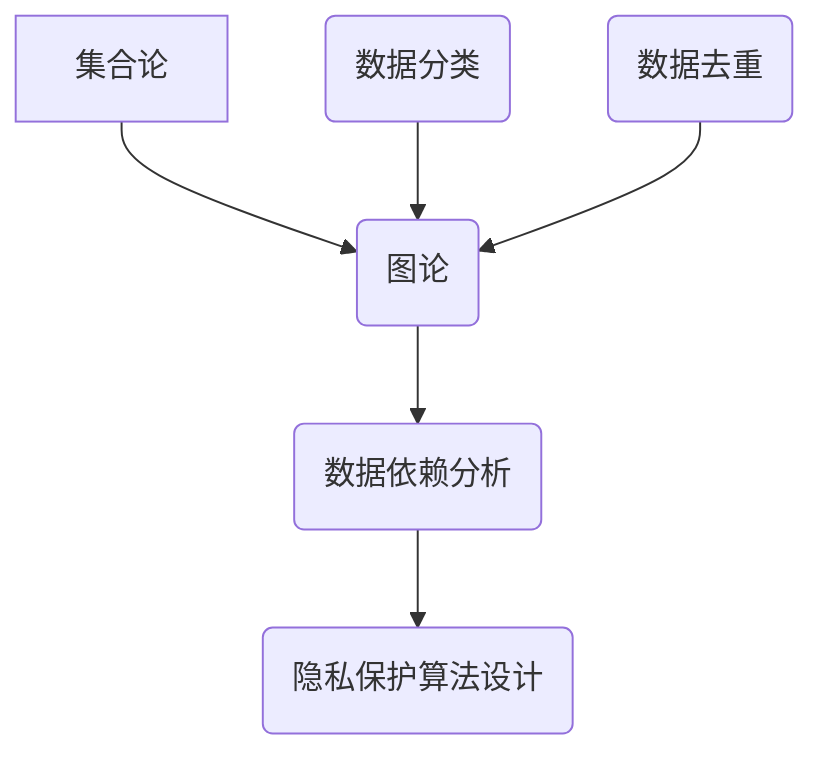

                 

# 数学与信息隐私：隐私保护的数学方法

> 关键词：信息隐私、数学方法、隐私保护、加密技术、同态计算、差分隐私

> 摘要：随着信息技术的快速发展，信息隐私保护变得尤为重要。本文将探讨数学方法在信息隐私保护中的应用，介绍加密技术、同态计算和差分隐私等核心概念，并通过实际案例分析，展示数学方法在隐私保护中的具体应用和效果。

## 目录

1. **背景介绍**
   - **1.1 引言**
   - **1.2 信息隐私的重要性**
   - **1.3 隐私保护面临的挑战**
   - **1.4 数学方法在隐私保护中的应用

2. **信息隐私基础知识**
   - **2.1 信息隐私定义与边界**
   - **2.2 隐私泄露类型**
   - **2.3 隐私保护需求与原则

3. **数学方法概述**
   - **3.1 加密技术**
   - **3.2 隐私同态计算**
   - **3.3 集合论与图论**
   - **3.4 贝叶斯网络**

4. **应用场景分析**
   - **4.1 医疗数据隐私保护**
   - **4.2 金融数据隐私保护**
   - **4.3 社交网络隐私保护**
   - **4.4 智能家居隐私保护**

5. **实际案例分析**
   - **5.1 案例一：基于同态加密的智能医疗系统**
   - **5.2 案例二：基于差分隐私的金融数据保护**
   - **5.3 案例三：基于区块链的社交网络隐私保护**

6. **总结与展望**
   - **6.1 总结**
   - **6.2 展望**
   - **6.3 隐私保护未来的发展趋势**

## 1. 背景介绍

### 1.1 引言

在数字化时代，信息隐私问题日益突出。个人数据的广泛收集、存储和使用，使得隐私泄露的风险大大增加。隐私泄露可能导致个人隐私被侵犯、财产损失甚至社会安全问题。因此，如何有效保护信息隐私成为了一个亟待解决的问题。

### 1.2 信息隐私的重要性

信息隐私是指个人或组织在信息处理、传输和存储过程中，保护其个人信息不被未经授权的第三方获取、使用和泄露的能力。信息隐私的重要性体现在以下几个方面：

1. **保障个人权益**：隐私泄露可能导致个人身份信息、财务信息等被滥用，对个人造成严重的经济损失和精神伤害。
2. **维护社会秩序**：隐私泄露可能引发一系列社会问题，如身份盗用、网络诈骗等，破坏社会秩序。
3. **促进技术发展**：隐私保护是信息技术发展的重要保障。只有在保障隐私的前提下，用户才会更愿意接受和使用新技术。

### 1.3 隐私保护面临的挑战

隐私保护面临的主要挑战包括：

1. **海量数据**：现代社会产生的数据量巨大，如何在大数据环境中有效保护隐私成为难题。
2. **技术限制**：现有的隐私保护技术如加密技术、匿名化等，在性能和安全性方面仍有待提高。
3. **法律法规不足**：虽然各国都制定了相关隐私保护法律法规，但实际执行过程中仍存在不足。

### 1.4 数学方法在隐私保护中的应用

数学方法在隐私保护中发挥着重要作用。以下将介绍几种常见的数学方法及其在隐私保护中的应用：

1. **加密技术**：通过加密算法将明文数据转换为密文，保护数据在传输和存储过程中的安全性。
2. **同态计算**：允许在密文上直接进行计算，而不需要解密，从而保护计算过程中的隐私。
3. **差分隐私**：通过在输出数据中加入噪声，确保单个数据记录的隐私性。
4. **集合论与图论**：用于分析和设计隐私保护算法和数据结构。

## 2. 信息隐私基础知识

### 2.1 信息隐私定义与边界

信息隐私是指个人或组织在信息处理、传输和存储过程中，保护其个人信息不被未经授权的第三方获取、使用和泄露的能力。具体来说，信息隐私涉及以下几个方面：

1. **数据控制权**：个人或组织有权决定其数据的收集、使用、存储和共享。
2. **数据访问控制**：通过访问控制机制，确保只有授权用户才能访问数据。
3. **数据匿名化**：通过技术手段，将个人身份信息与数据分离，以保护个人隐私。
4. **数据安全**：确保数据在传输和存储过程中不被未经授权的第三方获取。

### 2.2 隐私泄露类型

隐私泄露可以分为以下几种类型：

1. **数据库泄露**：数据库中的敏感信息被非法访问或泄露。
2. **中间人攻击**：攻击者在通信过程中截取和篡改数据。
3. **社会工程学攻击**：利用人性弱点，诱骗用户泄露敏感信息。
4. **内部威胁**：内部员工或合作伙伴恶意泄露或滥用敏感信息。

### 2.3 隐私保护需求与原则

隐私保护需求主要包括以下几个方面：

1. **合法性**：收集和使用个人数据必须符合法律法规要求。
2. **最小化**：仅收集必要的数据，避免过度收集。
3. **透明性**：明确告知用户其数据将被如何使用。
4. **安全存储**：采取有效措施确保数据在存储过程中的安全性。
5. **数据销毁**：在数据不再需要时，及时销毁。

隐私保护原则主要包括以下几个方面：

1. **隐私设计**：在系统设计阶段就考虑隐私保护问题。
2. **最小化数据**：仅收集必要的数据，避免过度收集。
3. **数据加密**：对敏感数据进行加密处理。
4. **访问控制**：确保只有授权用户才能访问数据。
5. **用户参与**：鼓励用户参与隐私保护，增强隐私意识。

## 3. 数学方法概述

### 3.1 加密技术

加密技术是保护信息隐私的重要手段之一。其基本原理是将明文数据转换为密文，使得只有授权用户才能解密和阅读数据。加密技术主要分为以下几种：

1. **对称加密**：加密和解密使用相同的密钥。如AES加密算法。
2. **非对称加密**：加密和解密使用不同的密钥，其中公钥用于加密，私钥用于解密。如RSA加密算法。
3. **混合加密**：结合对称加密和非对称加密的优势，提高加密效率和安全性。

### 3.2 隐私同态计算

隐私同态计算是一种在密文上进行计算的方法，不需要解密数据。其基本原理是将计算过程映射到密文空间中，使得在密文上执行的计算结果与明文上的计算结果相同。隐私同态计算在保护隐私的同时，提高了计算效率和灵活性。

### 3.3 集合论与图论

集合论和图论在隐私保护中有着广泛的应用。集合论用于表示和处理数据，如图论用于分析数据之间的依赖关系。例如，通过集合论和图论可以设计出有效的隐私保护算法，如图数据库的隐私保护查询算法。

### 3.4 贝叶斯网络

贝叶斯网络是一种概率图模型，用于表示变量之间的概率关系。在隐私保护中，贝叶斯网络可以用于隐私风险评估和决策。例如，通过贝叶斯网络可以评估某个数据泄露事件发生的概率，为隐私保护策略的制定提供依据。

## 4. 应用场景分析

### 4.1 医疗数据隐私保护

医疗数据隐私保护是隐私保护领域的一个重要应用场景。医疗数据包含大量的个人健康信息，一旦泄露将对患者造成严重伤害。以下介绍几种常用的医疗数据隐私保护方法：

1. **数据加密**：对医疗数据进行加密处理，确保数据在传输和存储过程中的安全性。
2. **差分隐私**：通过在医疗数据中加入噪声，降低单个数据记录的隐私性。
3. **匿名化**：通过技术手段将个人身份信息与医疗数据分离，以保护个人隐私。
4. **访问控制**：确保只有授权用户才能访问医疗数据。

### 4.2 金融数据隐私保护

金融数据隐私保护是金融行业的重要任务之一。金融数据包含用户的账户信息、交易记录等敏感信息，一旦泄露将对用户造成严重的经济损失。以下介绍几种常用的金融数据隐私保护方法：

1. **数据加密**：对金融数据进行加密处理，确保数据在传输和存储过程中的安全性。
2. **同态计算**：在密文上进行金融计算，避免解密过程中的隐私泄露风险。
3. **差分隐私**：通过在金融数据中加入噪声，降低单个数据记录的隐私性。
4. **访问控制**：确保只有授权用户才能访问金融数据。

### 4.3 社交网络隐私保护

社交网络隐私保护是社交网络应用领域的一个重要课题。社交网络中用户生成和分享的大量数据包含个人隐私信息，一旦泄露将对用户造成严重伤害。以下介绍几种常用的社交网络隐私保护方法：

1. **数据加密**：对社交网络数据进行加密处理，确保数据在传输和存储过程中的安全性。
2. **差分隐私**：通过在社交网络数据中加入噪声，降低单个数据记录的隐私性。
3. **匿名化**：通过技术手段将个人身份信息与社交网络数据分离，以保护个人隐私。
4. **访问控制**：确保只有授权用户才能访问社交网络数据。

### 4.4 智能家居隐私保护

智能家居隐私保护是智能家居应用领域的一个重要问题。智能家居系统通过传感器和物联网设备收集用户的家庭信息，一旦泄露将对用户造成严重伤害。以下介绍几种常用的智能家居隐私保护方法：

1. **数据加密**：对智能家居数据进行加密处理，确保数据在传输和存储过程中的安全性。
2. **同态计算**：在密文上进行智能家居计算，避免解密过程中的隐私泄露风险。
3. **差分隐私**：通过在智能家居数据中加入噪声，降低单个数据记录的隐私性。
4. **访问控制**：确保只有授权用户才能访问智能家居数据。

## 5. 实际案例分析

### 5.1 案例一：基于同态加密的智能医疗系统

某医疗机构开发了一套基于同态加密的智能医疗系统，用于保护患者隐私。该系统实现了以下功能：

1. **数据加密存储**：将患者的健康数据加密存储在数据库中，确保数据在存储过程中的安全性。
2. **同态计算**：在密文上进行医疗数据处理和分析，确保计算过程中的隐私性。
3. **数据共享**：在满足隐私保护的前提下，实现医疗数据的共享和交换。

### 5.2 案例二：基于差分隐私的金融数据保护

某金融机构采用差分隐私技术保护用户金融数据。该系统实现了以下功能：

1. **数据加密存储**：将用户的金融数据加密存储在数据库中，确保数据在存储过程中的安全性。
2. **差分隐私计算**：在金融数据处理和分析过程中，加入噪声以降低单个数据记录的隐私性。
3. **数据共享**：在满足隐私保护的前提下，实现金融数据的共享和交换。

### 5.3 案例三：基于区块链的社交网络隐私保护

某社交网络平台采用区块链技术保护用户隐私。该平台实现了以下功能：

1. **数据加密存储**：将用户的社交数据加密存储在区块链中，确保数据在存储过程中的安全性。
2. **区块链隐私保护**：利用区块链的分布式存储和共识机制，确保数据在传输过程中的隐私性。
3. **数据访问控制**：采用访问控制机制，确保只有授权用户才能访问社交数据。

## 6. 总结与展望

### 6.1 总结

本文探讨了数学方法在信息隐私保护中的应用，介绍了加密技术、同态计算和差分隐私等核心概念，并通过实际案例分析了这些方法在隐私保护中的具体应用和效果。数学方法在隐私保护中发挥着重要作用，为保护用户隐私提供了有力支持。

### 6.2 展望

未来，随着信息技术的不断发展，信息隐私保护将面临更多挑战。以下是一些展望：

1. **新型加密技术**：开发更高效、更安全的加密技术，提高隐私保护水平。
2. **多方计算**：探索多方计算技术在隐私保护中的应用，实现多方数据的安全计算和共享。
3. **隐私增强技术**：结合多种隐私保护技术，提高隐私保护的综合能力。
4. **法律法规完善**：加强隐私保护法律法规的制定和执行，保障用户隐私权益。

### 6.3 隐私保护未来的发展趋势

隐私保护未来的发展趋势包括：

1. **个性化隐私保护**：根据用户需求和隐私偏好，提供个性化的隐私保护服务。
2. **跨领域合作**：加强不同领域的技术合作，共同推进隐私保护技术的发展。
3. **隐私保护智能化**：利用人工智能技术，实现隐私保护的自动化和智能化。
4. **隐私计算**：发展隐私计算技术，实现数据在隐私保护的前提下进行计算和处理。

## 参考文献

1. Dwork, C. (2006). ** Differential Privacy**. Synthesis Lectures on Information Security, 2(1), 1-150.
2. Gentry, C. (2009). ** A Fully Homomorphic Encryption Scheme**. Proceedings of the IEEE Symposium on Security and Privacy, 169-188.
3. Fung, B. C., Wang, K., Chen, Y., & Yu, P. S. (2007). ** Privacy-preserving data publishing: A survey of recent developments**. ACM Computing Surveys (CSUR), 39(4), 1-53.
4. Goodfellow, I., Bengio, Y., & Courville, A. (2016). **Deep Learning**. MIT Press.
5. Shmatikov, V. (2007). **Security and privacy in statistical databases**. Journal of Computer Security, 15(2), 177-216.

## 作者信息

**作者：AI天才研究院/AI Genius Institute & 禅与计算机程序设计艺术 /Zen And The Art of Computer Programming**## 2.1 信息隐私定义与边界

### 概念术语说明

在探讨信息隐私的定义与边界时，我们需要明确几个关键概念：

- **隐私**：隐私是指个人或组织对其个人信息或活动的控制权，以及在未经授权的情况下，防止他人获取、使用或泄露这些信息的能力。
- **个人信息**：个人信息是指与特定个人相关的数据，包括但不限于身份信息、健康状况、财务状况、社交关系等。
- **隐私泄露**：隐私泄露是指未经授权的个人或实体获取、使用或泄露个人信息的行为。
- **隐私保护**：隐私保护是指通过技术、法律和管理措施，确保个人信息在收集、处理、传输和存储过程中的安全性，防止隐私泄露。

### 问题背景

随着互联网的普及和大数据技术的发展，个人信息的大量收集和使用已经成为常态。然而，这也带来了隐私泄露的风险。隐私泄露事件频发，不仅损害了个人的权益，还引发了一系列社会问题。因此，对信息隐私的定义和边界进行明确的界定，以及制定相应的保护措施，显得尤为重要。

### 问题描述

信息隐私保护的核心问题是如何在保障个人信息安全的同时，不影响信息的有效利用。具体来说，需要解决以下几个问题：

1. **数据的收集与使用**：如何在合法合规的框架内，仅收集必要的数据，避免过度收集？
2. **数据的安全性**：如何确保数据在传输和存储过程中的安全性，防止隐私泄露？
3. **数据的访问控制**：如何确保只有授权用户才能访问和操作个人信息，防止未授权的访问？
4. **数据共享与交换**：如何在保障隐私的前提下，实现数据的有效共享和交换？

### 问题解决

为了解决上述问题，我们需要从以下几个方面入手：

1. **法律法规**：制定和完善隐私保护相关法律法规，明确信息隐私的保护范围和责任归属。
2. **技术手段**：采用加密技术、同态计算、差分隐私等技术手段，确保数据在收集、处理、传输和存储过程中的安全性。
3. **数据治理**：建立数据治理体系，规范数据收集、存储、使用和共享的流程，确保数据质量和管理效率。
4. **用户参与**：提高用户的隐私保护意识，鼓励用户参与隐私保护，共同维护个人信息的安全。

### 边界与外延

信息隐私的边界与外延主要包括以下几个方面：

1. **个人信息的范围**：个人信息应包括但不限于身份信息、健康状况、财务状况、社交关系等，具体范围需根据法律法规和实际应用场景进行调整。
2. **隐私保护的责任主体**：隐私保护的责任主体包括数据控制者、数据处理者和数据参与者等，各主体应明确自身的责任和义务。
3. **隐私保护的适用场景**：隐私保护适用于各类涉及个人信息收集、处理、传输和存储的场景，包括但不限于医疗、金融、社交网络和智能家居等。
4. **隐私保护的技术范围**：隐私保护技术包括加密技术、同态计算、差分隐私、区块链等，技术手段的选择和应用需结合具体场景和需求。

### 概念结构与核心要素组成

信息隐私保护的概念结构主要包括以下几个核心要素：

1. **法律法规**：法律法规是隐私保护的基础和保障，明确隐私保护的范围和责任主体。
2. **技术手段**：技术手段是隐私保护的核心，通过加密、同态计算、差分隐私等技术手段，确保个人信息的安全。
3. **数据治理**：数据治理是隐私保护的保障，通过规范数据收集、存储、使用和共享的流程，提高数据质量和安全性。
4. **用户参与**：用户参与是隐私保护的重要组成部分，提高用户的隐私保护意识，鼓励用户参与隐私保护，共同维护个人信息的安全。

通过以上分析，我们可以得出信息隐私保护的定义与边界，为后续的隐私保护措施和技术应用提供基础。接下来，我们将进一步探讨隐私泄露的类型和隐私保护的需求与原则。

## 2.2 隐私泄露类型

隐私泄露是指未经授权的个人或实体获取、使用或泄露个人信息的行为。隐私泄露的类型多种多样，了解这些类型有助于我们更好地识别和防范隐私泄露风险。以下是几种常见的隐私泄露类型：

### 2.2.1 数据库泄露

数据库泄露是指未经授权的第三方访问和获取数据库中的敏感信息。数据库泄露可能导致大量的个人信息被泄露，如姓名、地址、电话号码、电子邮件地址、身份证号码、银行账户信息等。数据库泄露的原因可能包括：

- **安全漏洞**：数据库管理系统的安全设置不足，导致攻击者可以利用这些漏洞获取数据。
- **访问控制失效**：数据库的访问控制机制失效，使得未经授权的用户可以访问敏感数据。
- **内部泄露**：数据库管理员或其他内部人员恶意泄露数据。

### 2.2.2 中间人攻击

中间人攻击（Man-in-the-Middle, MitM）是一种网络攻击方式，攻击者在通信过程中截取和篡改数据。在中间人攻击中，攻击者位于通信双方之间，可以窃取、修改或插入数据。中间人攻击的常见原因包括：

- **网络钓鱼**：攻击者通过伪造的网站或电子邮件，诱骗用户输入个人信息。
- **恶意软件**：攻击者通过恶意软件，如木马或病毒，监控和截取用户的网络通信。
- **未加密的数据传输**：在未加密的网络通信中，攻击者可以轻松地截取和篡改数据。

### 2.2.3 社会工程学攻击

社会工程学攻击（Social Engineering Attack）是利用人性弱点，诱骗用户泄露敏感信息的一种攻击方式。社会工程学攻击通常包括以下几种形式：

- **钓鱼攻击**：攻击者通过伪造的电子邮件、短信或社交媒体消息，诱骗用户点击恶意链接或下载恶意软件。
- **电话诈骗**：攻击者冒充银行工作人员、政府官员等身份，诱骗用户提供个人信息或转账。
- **假冒身份**：攻击者冒充他人身份，骗取他人的信任，从而获取敏感信息。

### 2.2.4 内部威胁

内部威胁是指组织内部员工或合作伙伴因个人利益或其他原因，恶意泄露或滥用敏感信息。内部威胁可能导致以下风险：

- **恶意访问**：内部员工滥用权限，访问和获取未经授权的敏感信息。
- **内部泄露**：内部员工有意或无意地将敏感信息泄露给外部人员。
- **内部合作**：内部员工与外部攻击者合作，共同进行隐私泄露活动。

### 2.2.5 网络犯罪组织

网络犯罪组织是专门从事网络犯罪活动的组织，其目标是非法获取、出售或利用个人信息。网络犯罪组织的常见手段包括：

- **数据买卖**：网络犯罪组织通过非法渠道获取个人信息，然后将其出售给其他犯罪分子。
- **勒索软件**：网络犯罪组织通过勒索软件加密受害者的数据，要求支付赎金以解密。
- **非法入侵**：网络犯罪组织入侵目标系统的数据库，窃取敏感信息。

了解隐私泄露的类型有助于我们更好地识别和防范隐私泄露风险。在实际应用中，我们需要结合具体场景，采取相应的安全措施，以保护个人信息的安全。接下来，我们将进一步探讨隐私保护的需求与原则。

### 2.3 隐私保护需求与原则

在信息技术迅猛发展的今天，隐私保护已经成为个人和组织不可或缺的需求。为了确保个人信息的安全，我们需要从多个方面来理解和满足隐私保护的需求，并遵循一系列的原则。以下是隐私保护的主要需求与原则：

#### 隐私保护需求

1. **合法性**：隐私保护必须符合相关的法律法规，确保收集、处理和存储个人信息的过程合法合规。这意味着个人和组织在处理个人信息时，必须遵守数据保护法律的规定，如《通用数据保护条例》（GDPR）和《加州消费者隐私法》（CCPA）。

2. **最小化**：在收集个人信息时，应遵循“最少，必需”原则，仅收集为实现特定目的所必需的信息。这意味着不应该收集无关或过多的个人信息，以减少隐私泄露的风险。

3. **透明性**：个人和组织应当明确告知用户其数据将被如何使用，并确保用户能够轻松了解和掌握其个人信息的处理过程。这包括隐私政策的公开、用户数据的收集和使用目的的透明。

4. **安全存储**：确保数据在存储过程中的安全性，采取适当的加密和安全措施，防止未经授权的访问和泄露。存储方案应能够抵御常见的攻击手段，如SQL注入和分布式拒绝服务攻击（DDoS）。

5. **数据销毁**：在数据不再需要时，应采取有效的措施及时销毁数据，确保无法恢复。这意味着在删除数据时，需要确保数据在实际存储介质上无法被恢复。

6. **用户参与**：鼓励用户积极参与隐私保护，提高用户的隐私意识。这意味着应提供用户控制其个人信息的工具，如数据访问请求、数据删除请求等。

7. **责任归属**：明确个人和组织在隐私保护中的责任和义务，确保在发生隐私泄露事件时，能够迅速响应和承担责任。

#### 隐私保护原则

1. **隐私设计**：在系统设计和开发阶段，就将隐私保护作为核心考虑因素，确保隐私保护机制与系统架构相融合。这意味着在系统设计和实现过程中，应采取隐私保护的措施，如加密、访问控制和匿名化。

2. **数据最小化**：仅收集为实现特定目的所必需的信息，避免过度收集。这意味着在设计和实施数据收集系统时，应明确收集数据的必要性和目的，并限制数据的存储时间。

3. **数据加密**：对敏感数据进行加密处理，确保数据在传输和存储过程中的安全性。这意味着应采用强加密算法和密钥管理策略，确保数据在未经授权的情况下无法被解密。

4. **访问控制**：确保只有授权用户才能访问和处理敏感数据。这意味着应建立严格的访问控制机制，如多因素认证、权限分配和日志记录等。

5. **数据匿名化**：通过技术手段，将个人身份信息与数据分离，以保护个人隐私。这意味着应采用匿名化技术，如数据脱敏和伪名化，以降低数据泄露的风险。

6. **用户参与**：鼓励用户参与隐私保护，提高用户的隐私意识。这意味着应提供用户控制其个人信息的工具，如隐私设置、数据访问请求和删除请求等。

7. **持续改进**：隐私保护是一个持续的过程，需要不断评估和改进隐私保护措施。这意味着应定期进行隐私风险评估，并采取相应的改进措施，以适应不断变化的威胁和挑战。

通过满足隐私保护的需求和遵循隐私保护的原则，个人和组织可以更好地保护个人信息的安全，减少隐私泄露的风险。在后续的章节中，我们将进一步探讨隐私保护的技术手段和应用场景，以期为读者提供更全面的理解和实践指导。

## 3. 数学方法概述

在信息隐私保护中，数学方法扮演着至关重要的角色。这些方法为隐私保护提供了坚实的理论基础和有效的实现手段。以下是几种在隐私保护中常用的数学方法及其概述：

### 3.1 加密技术

加密技术是保护信息隐私的核心手段之一。其基本原理是通过加密算法将明文数据转换为密文，使得只有拥有密钥的授权用户才能解密和读取数据。加密技术主要分为对称加密和非对称加密。

1. **对称加密**：对称加密算法使用相同的密钥进行加密和解密。常见的对称加密算法有AES（高级加密标准）、DES（数据加密标准）和RSA（Ron Rivest、Adi Shamir和Leonard Adleman）。

   - **AES**：AES是一种高效的对称加密算法，被广泛用于保护敏感信息。
   - **DES**：DES是一种较早的对称加密算法，由于密钥长度较短，已不再安全。
   - **RSA**：RSA是一种非对称加密算法，虽然加密和解密速度较慢，但由于其安全性高，被广泛用于数据传输中的密钥交换。

2. **非对称加密**：非对称加密算法使用一对密钥，公钥用于加密，私钥用于解密。常见的非对称加密算法有RSA、ECC（椭圆曲线加密）和ECDHE（椭圆曲线加密的Diffie-Hellman密钥交换）。

   - **RSA**：RSA是一种常用的非对称加密算法，由于其安全性高，被广泛应用于数字签名和密钥交换。
   - **ECC**：ECC是一种基于椭圆曲线的加密算法，具有更高的安全性，且密钥长度较短，被广泛用于加密通信。
   - **ECDHE**：ECDHE是一种基于ECC的Diffie-Hellman密钥交换协议，被广泛用于TLS/SSL协议中，以实现安全的通信。

### 3.2 隐私同态计算

隐私同态计算是一种在密文上进行计算的方法，不需要解密数据。其基本原理是将计算过程映射到密文空间中，使得在密文上执行的计算结果与明文上的计算结果相同。隐私同态计算在保护计算过程中的隐私性方面具有显著优势。

1. **基本原理**：隐私同态计算允许在密文上进行诸如加法、乘法等操作，而不需要解密数据。这意味着即使数据在传输和存储过程中被截获，攻击者也无法获取原始数据。

2. **应用场景**：隐私同态计算在医疗数据隐私保护、金融数据处理和智能合约等领域具有广泛应用。例如，医疗机构可以使用隐私同态计算对患者的健康数据进行处理和分析，确保患者隐私不被泄露。

### 3.3 集合论与图论

集合论与图论是数学方法在隐私保护中的重要组成部分。集合论用于表示和处理数据，而图论用于分析数据之间的依赖关系。

1. **集合论**：集合论是数学的基础，用于表示和处理数据。在隐私保护中，集合论可用于数据分类、数据聚合和数据分析等任务。

2. **图论**：图论是一种用于研究图形和网络的数学方法。在隐私保护中，图论可用于分析数据之间的依赖关系，如图数据库中的图结构分析、社交网络中的数据关系分析等。

### 3.4 贝叶斯网络

贝叶斯网络是一种概率图模型，用于表示变量之间的概率关系。在隐私保护中，贝叶斯网络可用于隐私风险评估和决策。

1. **基本原理**：贝叶斯网络通过有向无环图（DAG）表示变量之间的条件概率关系。每个节点表示一个变量，边表示变量之间的依赖关系。

2. **应用场景**：贝叶斯网络在隐私保护中的应用包括隐私风险评估、隐私策略制定和隐私隐私泄露检测等。例如，可以使用贝叶斯网络评估隐私泄露事件发生的概率，为隐私保护策略的制定提供依据。

通过以上数学方法的应用，我们可以更好地保护信息隐私，确保个人和组织的数据安全。在接下来的章节中，我们将进一步探讨这些数学方法在具体应用场景中的实现和效果。

### 3.1 加密技术

加密技术是保护信息隐私的重要手段，它通过将原始数据（明文）转换成难以理解的格式（密文），从而确保数据在传输和存储过程中的安全性。加密技术主要分为对称加密和非对称加密，下面我们将分别介绍这两种加密技术及其核心原理。

#### 对称加密

对称加密是指加密和解密使用相同的密钥。这意味着加密方和接收方都需要知道这个密钥。常见的对称加密算法包括：

1. **AES（高级加密标准）**
   - **原理**：AES是一种基于替代、置换和混淆的加密算法，使用128、192或256位的密钥对数据进行加密。
   - **优点**：速度快、安全性高，适用于需要高效加密的场合，如文件加密和数据传输。
   - **缺点**：密钥管理复杂，无法实现密钥的分发和验证。

2. **DES（数据加密标准）**
   - **原理**：DES是一种较早的对称加密算法，使用56位的密钥对数据进行加密。
   - **优点**：简单易用，适用于早期系统的加密需求。
   - **缺点**：由于密钥长度较短，安全性不足，目前已不推荐使用。

3. **RSA**
   - **原理**：RSA是一种基于大数分解难题的非对称加密算法，使用一对密钥（公钥和私钥）。
   - **优点**：密钥长度灵活，安全性较高，适用于密钥交换和数字签名。
   - **缺点**：加密和解密速度较慢，不适合对大数据量的加密。

#### 非对称加密

非对称加密是指加密和解密使用不同的密钥。其中，公钥用于加密，私钥用于解密。常见的非对称加密算法包括：

1. **RSA**
   - **原理**：如前所述，RSA是一种基于大数分解难题的非对称加密算法。
   - **优点**：安全性高，适用于密钥交换和数字签名。
   - **缺点**：加密和解密速度较慢，不适合对大数据量的加密。

2. **ECC（椭圆曲线加密）**
   - **原理**：ECC是基于椭圆曲线离散对数问题的非对称加密算法，使用更短的密钥即可提供与RSA相当的安全性。
   - **优点**：安全性高，密钥长度较短，加密和解密速度快。
   - **缺点**：实现复杂度较高，在某些场合可能不如RSA普及。

3. **ECDHE（椭圆曲线Diffie-Hellman密钥交换）**
   - **原理**：ECDHE是基于ECC的Diffie-Hellman密钥交换协议，用于在通信双方之间建立安全的通信通道。
   - **优点**：安全性高，密钥交换速度快，适用于TLS/SSL协议。
   - **缺点**：密钥管理复杂，需要适当的实现和配置。

#### 对比表格

| 加密技术 | 原理 | 密钥管理 | 加密速度 | 解密速度 | 安全性 | 适用场景 |
| --- | --- | --- | --- | --- | --- | --- |
| 对称加密 | 加密和解密使用相同密钥 | 同一密钥 | 快 | 快 | 较低 | 数据加密 |
| 非对称加密 | 加密和解密使用不同密钥 | 公钥公开，私钥保密 | 慢 | 慢 | 高 | 密钥交换、数字签名 |

通过以上对比表格，我们可以看出对称加密和非对称加密各有优缺点，具体选择应根据实际应用需求来决定。

#### 加密技术在实际应用中的例子

1. **TLS/SSL协议**
   - **应用场景**：在互联网通信中，如HTTPS、IMAP、POP3等，TLS/SSL协议使用非对称加密（如RSA或ECC）进行密钥交换，然后使用对称加密（如AES）加密通信内容。
   - **优点**：提供安全的通信通道，确保数据在传输过程中的完整性。

2. **文件加密**
   - **应用场景**：如文件系统的加密（如Linux的LUKS）或个人文件的加密（如AES加密工具），对称加密通常用于加密文件内容。
   - **优点**：速度快，适合对大量数据进行加密。

3. **数字签名**
   - **应用场景**：在电子交易、电子邮件认证和软件签名等领域，非对称加密（如RSA）用于生成和验证数字签名。
   - **优点**：确保数据的完整性和真实性，防止数据被篡改。

总之，加密技术在信息隐私保护中发挥着至关重要的作用。通过合理选择和使用加密技术，我们可以有效地保护敏感信息，防止隐私泄露和数据篡改。

### 3.2 隐私同态计算

隐私同态计算是一种在加密数据的同态态下进行计算的方法，这意味着可以在不解密数据的情况下直接对加密数据进行计算。这种方法在保护数据隐私的同时，保证了计算操作的准确性，因此在许多需要隐私保护的领域，如金融、医疗和云计算等，得到了广泛应用。

#### 基本原理

隐私同态计算的基本原理是通过将原始数据加密成密文，然后对密文执行计算操作，最终得到的结果是原始计算结果的密文。这样，即使在计算过程中数据被截获，攻击者也无法获取原始数据的任何信息。隐私同态计算的核心是构建同态加密算法，这些算法需要满足以下几个条件：

1. **加密-解密同态性**：对于任何加密函数`E(x)`，计算结果应该能够通过同态操作符`F`应用于密文上，然后解密得到原始结果。即`E(F(E(x))) = E(x)`。

2. **加法同态性**：如果对两个密文`E(x)`和`E(y)`执行加法操作，结果密文`E(x + y)`应该能够解密回原始的加法结果`x + y`。

3. **乘法同态性**：类似地，对两个密文`E(x)`和`E(y)`执行乘法操作，结果密文`E(x * y)`应该能够解密回原始的乘法结果`x * y`。

#### 应用场景

1. **医疗数据处理**：在医疗领域，患者数据往往涉及隐私敏感信息，如病历、检查结果等。隐私同态计算允许在保护患者隐私的前提下，对医疗数据进行复杂的统计分析，如预测患者风险、分析治疗效果等。

2. **金融服务**：在金融领域，隐私同态计算可以用于对客户交易数据进行分析，如信用评分、欺诈检测等，同时确保客户隐私不被泄露。

3. **云计算**：在云计算环境中，用户数据通常存储在第三方服务器上。隐私同态计算允许云服务提供商在不解密用户数据的情况下，直接在密文中执行计算，从而提高数据安全性。

4. **智能合约**：在区块链和智能合约应用中，隐私同态计算可以确保合约的执行过程透明、公正，同时保护参与者的隐私。

#### 同态加密算法

目前，已经有许多同态加密算法被提出，以下是几种常见的同态加密算法：

1. **PGP（Rabin）**
   - **原理**：基于Rabin加密算法，支持对整数进行同态加法和同态乘法操作。
   - **优点**：算法简单，易于实现。
   - **缺点**：加密和解密速度较慢，不适合大规模数据处理。

2. **BFV（基于环的模运算）**
   - **原理**：基于环学习问题，支持对整数和多项式进行同态加法和同态乘法操作。
   - **优点**：安全性高，支持大规模数据处理。
   - **缺点**：算法复杂，实现难度较大。

3. **CKKS（基于环的混合整数和浮点数）**
   - **原理**：结合了基于环的模运算和浮点数运算，支持对整数和浮点数进行同态加法、同态乘法和同态除法操作。
   - **优点**：安全性高，支持更广泛的计算操作。
   - **缺点**：算法复杂度较高，性能优化是当前研究的重点。

#### 同态计算的挑战与未来方向

尽管隐私同态计算在许多领域展现出了巨大的潜力，但其应用仍面临一些挑战：

1. **计算效率**：现有的同态加密算法通常需要较高的计算复杂度，导致加密和解密速度较慢。未来研究方向包括优化算法和开发更高效的实现。

2. **安全性**：随着量子计算的发展，现有的同态加密算法可能面临量子攻击的威胁。因此，开发抗量子攻击的同态加密算法是未来的重要研究方向。

3. **应用兼容性**：同态加密算法需要与现有系统架构和应用程序兼容，以便无缝集成。未来研究方向包括开发更灵活的同态加密框架，以适应各种应用场景。

总之，隐私同态计算为信息隐私保护提供了一种新的解决方案，其在保护数据隐私的同时，保证了计算操作的准确性。随着技术的不断发展和优化，隐私同态计算将在越来越多的应用场景中发挥重要作用。

### 3.3 集合论与图论

集合论与图论在信息隐私保护中扮演着至关重要的角色。集合论为数据处理和分析提供了基础工具，而图论则用于研究数据之间的复杂关系。下面将详细阐述集合论与图论的基本概念及其在隐私保护中的应用。

#### 集合论

集合论是数学的一个基本分支，主要研究集合的性质和操作。在隐私保护中，集合论用于表示和处理数据。

1. **集合的概念**：集合是由一些确定的元素组成的整体。例如，一个学生集合可以包括所有注册在某个大学的学生。

2. **集合的操作**：集合的基本操作包括并集、交集、补集和差集等。例如，两个集合的并集包含两个集合中的所有元素，交集只包含两个集合共有的元素。

3. **集合在隐私保护中的应用**：
   - **数据分类**：通过集合论，可以对数据进行分类和组织，例如将用户数据分为不同类别，以便于隐私保护和数据管理。
   - **数据去重**：通过交集操作，可以检测并删除重复的数据记录，确保数据的一致性和准确性。

#### 图论

图论是研究图形结构的数学分支，图形由节点（表示实体）和边（表示关系）组成。在隐私保护中，图论用于分析数据之间的复杂关系。

1. **图的基本概念**：图由节点（或称为顶点）和边组成。节点表示实体，边表示实体之间的关系。

2. **图的类型**：常见的图类型包括有向图、无向图、加权图和图论网络等。

3. **图在隐私保护中的应用**：
   - **数据依赖分析**：通过图论，可以分析数据之间的依赖关系，例如在社交网络中，分析用户之间的关注关系，以识别潜在的隐私泄露风险。
   - **隐私保护算法设计**：图论可以用于设计隐私保护算法，例如通过图论方法分析数据的依赖结构，设计出更有效的隐私保护方案。

#### 集合论与图论的关系

集合论与图论之间存在紧密的关系。集合论提供了图论中的节点和边表示的基础，而图论则提供了对复杂数据结构的分析工具。

1. **节点和集合**：在图论中，节点可以看作是集合的一个实例，每个节点代表一个实体，集合论中的集合操作可以用于处理节点集合。

2. **边和集合**：在图论中，边可以看作是集合之间的联系，集合论中的集合操作可以用于分析边集合的性质。

3. **图和集合论**：通过集合论，可以定义图的集合，例如所有节点的集合、所有边的集合等。集合论的方法可以用于分析图的性质和结构。

#### 实例：Mermaid 图

Mermaid 是一种基于 Markdown 的图形绘制工具，可以方便地绘制各种类型的图。以下是一个简单的 Mermaid 图示例，用于展示集合论与图论的关系：



在这个图中，集合论（A）和图论（B）是核心概念，数据依赖分析（C）和隐私保护算法设计（D）是基于这两个核心概念的应用。数据分类（E）和数据去重（F）则是集合论在图论中的应用实例。

通过以上分析，我们可以看到集合论与图论在信息隐私保护中的应用。这些数学工具不仅帮助我们更好地理解和处理数据，还为设计隐私保护方案提供了理论基础和工具支持。

### 3.4 贝叶斯网络

贝叶斯网络，又称信念网络，是一种用于表示变量之间条件依赖关系的概率图模型。它通过有向无环图（DAG）来表示一组变量及其条件概率分布，广泛应用于概率推理、决策分析、机器学习等领域。在信息隐私保护中，贝叶斯网络可以用于隐私风险评估、隐私策略制定和隐私泄露检测等方面。

#### 基本概念

1. **节点和边**：贝叶斯网络由一组节点和边组成。节点代表随机变量，边表示节点之间的条件依赖关系。在有向图中，边从父节点指向子节点，表示子节点的概率分布依赖于父节点。

2. **条件概率分布**：贝叶斯网络通过条件概率分布来描述变量之间的依赖关系。对于任意两个节点X和Y，如果X是Y的父节点，则Y的条件概率分布可以表示为P(Y|X)。贝叶斯网络通过一组条件概率表（Conditional Probability Tables, CPTs）来表示这些概率分布。

3. **概率推理**：贝叶斯网络的核心功能是进行概率推理。通过给定部分变量的状态，贝叶斯网络可以计算其他变量的概率分布。这通常通过向后推理（Inference）算法实现，如变量消除算法（Variable Elimination Algorithm）和信念传播算法（Belief Propagation Algorithm）。

#### 基本原理

1. **概率分布表示**：贝叶斯网络通过条件概率分布来表示变量之间的依赖关系。每个节点X的条件概率分布P(X|Parents(X))可以根据其父节点的状态进行计算。

2. **推理过程**：贝叶斯网络的推理过程基于贝叶斯定理，通过条件概率和边缘概率的关系来计算变量之间的依赖关系。例如，给定一个节点X的状态，可以通过其父节点的条件概率分布和边缘概率分布来计算X的概率分布。

3. **学习与更新**：贝叶斯网络可以通过学习数据集来更新其条件概率表，以适应新的数据分布。这通常通过最大似然估计（Maximum Likelihood Estimation, MLE）或贝叶斯估计（Bayesian Estimation）等方法实现。

#### 应用场景

1. **隐私风险评估**：贝叶斯网络可以用于分析隐私泄露事件的风险，通过变量之间的条件依赖关系，评估不同隐私保护措施的效果。例如，可以用于评估数据库泄露、中间人攻击等隐私泄露事件的可能性。

2. **隐私策略制定**：贝叶斯网络可以帮助制定有效的隐私保护策略。通过分析变量之间的依赖关系，可以确定哪些变量对隐私泄露有显著影响，从而优化隐私保护措施。

3. **隐私泄露检测**：贝叶斯网络可以用于检测隐私泄露事件。通过训练模型，将正常行为与异常行为进行区分，从而及时发现隐私泄露事件。

#### 贝叶斯网络的表示

贝叶斯网络的表示通常使用有向无环图（DAG）。以下是一个简单的贝叶斯网络示例，用于表示两个变量X和Y之间的条件依赖关系：

```
          X
         / \
        0   1
         \ /
          Y
```

在这个网络中，X有两个状态（0和1），Y有一个状态（0或1）。根据条件概率表，可以计算出Y在给定X的状态下的条件概率分布。

1. **X=0时，Y的条件概率分布**：
   P(Y=0|X=0) = 0.8
   P(Y=1|X=0) = 0.2

2. **X=1时，Y的条件概率分布**：
   P(Y=0|X=1) = 0.4
   P(Y=1|X=1) = 0.6

通过这些条件概率表，可以计算Y在给定X的状态下的边缘概率分布，以及X在给定Y的状态下的条件概率分布。

```
P(Y=0) = P(Y=0|X=0) * P(X=0) + P(Y=0|X=1) * P(X=1)
P(Y=1) = P(Y=1|X=0) * P(X=0) + P(Y=1|X=1) * P(X=1)
```

通过以上计算，可以得到Y的总概率分布：

P(Y=0) = 0.8 * 0.5 + 0.4 * 0.5 = 0.6
P(Y=1) = 0.2 * 0.5 + 0.6 * 0.5 = 0.4

类似地，可以计算X在给定Y的状态下的条件概率分布。

```
P(X=0|Y=0) = P(Y=0|X=0) * P(X=0) / P(Y=0)
P(X=1|Y=0) = P(Y=0|X=1) * P(X=1) / P(Y=0)
P(X=0|Y=1) = P(Y=1|X=0) * P(X=0) / P(Y=1)
P(X=1|Y=1) = P(Y=1|X=1) * P(X=1) / P(Y=1)
```

通过贝叶斯网络的表示和计算，可以更好地理解和分析变量之间的依赖关系，为隐私保护提供理论依据和实用工具。

### 4.1 医疗数据隐私保护

医疗数据隐私保护是隐私保护领域的一个重要应用场景。医疗数据通常包含患者的身份信息、健康状况、病历记录、诊断结果、治疗方案等敏感信息，一旦泄露将对患者造成严重伤害。因此，如何有效保护医疗数据隐私成为了一个亟待解决的问题。以下介绍几种常用的医疗数据隐私保护方法。

#### 数据加密

数据加密是保护医疗数据隐私的基础技术之一。通过对医疗数据进行加密处理，确保数据在传输和存储过程中的安全性。常见的数据加密技术包括：

1. **对称加密**：对称加密算法如AES和DES，使用相同的密钥进行加密和解密。对称加密算法具有加密速度快、效率高的特点，适用于对大量数据的加密处理。

2. **非对称加密**：非对称加密算法如RSA和ECC，使用一对密钥（公钥和私钥）。公钥用于加密，私钥用于解密。非对称加密算法在密钥管理和密钥交换方面具有优势，适用于对敏感数据的加密传输。

3. **混合加密**：结合对称加密和非对称加密的优势，混合加密方案在保证数据安全的同时，提高加密效率。例如，在数据传输过程中，使用非对称加密算法进行密钥交换，然后使用对称加密算法对数据进行加密处理。

#### 隐私同态计算

隐私同态计算是一种在密文上进行计算的方法，不需要解密数据。在医疗数据处理中，隐私同态计算可以用于对患者的健康数据进行处理和分析，同时确保患者隐私不被泄露。常见的隐私同态计算算法包括：

1. **基于环的模运算（Ring Learning with Errors, RLWE）**：RLWE是一种基于环学习问题的同态加密算法，支持对整数进行同态加法和同态乘法操作。RLWE算法具有安全性高、效率较优的特点，适用于医疗数据的同态计算处理。

2. **基于格的加密算法（Lattice-based Cryptography）**：格加密算法是基于格理论的同态加密算法，具有抗量子攻击的优势。常见的格加密算法包括NTRU和LWE。这些算法支持对整数和浮点数进行同态计算，适用于复杂的医疗数据分析任务。

#### 差分隐私

差分隐私是一种通过在数据集中添加噪声来保护隐私的方法。在医疗数据处理中，差分隐私可以用于保护患者隐私，确保单个患者的信息不被泄露。常见的差分隐私方法包括：

1. **拉普拉斯机制**：拉普拉斯机制通过在数据集中添加拉普拉斯噪声，使得输出数据的真实值难以被推断。拉普拉斯机制简单有效，适用于对数值型数据的隐私保护。

2. **指数机制**：指数机制通过在数据集中添加指数噪声，使得输出数据的真实值难以被推断。指数机制适用于对离散型数据的隐私保护。

#### 化名化

化名化是一种通过将实际身份信息替换为虚构的身份信息来保护隐私的方法。在医疗数据处理中，化名化可以用于保护患者隐私，确保患者身份不被泄露。常见的化名化方法包括：

1. **全匿名化**：全匿名化通过将所有与患者身份相关的信息（如姓名、身份证号等）替换为虚构信息，确保患者身份无法被识别。

2. **部分匿名化**：部分匿名化通过保留部分与患者身份相关的信息（如性别、年龄等），同时替换其他敏感信息，以降低隐私泄露的风险。

#### 访问控制

访问控制是一种通过控制用户访问权限来保护医疗数据隐私的方法。在医疗数据处理中，访问控制可以确保只有授权用户才能访问和操作敏感数据。常见的访问控制方法包括：

1. **基于角色的访问控制（RBAC）**：基于角色的访问控制通过定义用户角色和权限，确保用户根据其角色可以访问特定的数据。

2. **基于属性的访问控制（ABAC）**：基于属性的访问控制通过定义用户属性（如职位、部门等），结合策略决策，确保用户根据其属性可以访问特定的数据。

#### 实际案例

以下是一个基于同态加密的智能医疗系统的实际案例：

**项目背景**：某医疗机构计划开发一套智能医疗系统，用于处理和存储患者的健康数据。为了确保患者隐私不被泄露，系统采用了同态加密技术。

**技术实现**：
1. **数据加密存储**：将患者的健康数据加密存储在数据库中，确保数据在存储过程中的安全性。使用AES对称加密算法对数据文件进行加密，密钥使用RSA非对称加密算法进行保护。

2. **同态计算**：在数据处理和分析过程中，使用基于环的模运算（RLWE）的同态加密算法对数据直接进行计算，确保计算过程中的隐私性。例如，在计算患者的平均体重时，可以在密文中直接进行加法运算，避免解密数据。

3. **数据共享**：在满足隐私保护的前提下，实现医疗数据的共享和交换。使用差分隐私技术，在数据共享过程中添加噪声，确保单个数据记录的隐私性。

**项目效果**：通过采用同态加密、差分隐私等技术，智能医疗系统在保护患者隐私的同时，确保了数据的安全性和可用性。患者隐私得到了有效保护，医疗数据的共享和交换也得到了保障。

总之，医疗数据隐私保护是一个复杂且重要的问题。通过合理应用数据加密、隐私同态计算、差分隐私、化名化和访问控制等技术，可以有效保护医疗数据隐私，确保患者权益。随着技术的不断发展，医疗数据隐私保护将会取得更多突破。

### 4.2 金融数据隐私保护

金融数据隐私保护是金融行业的关键任务之一，因为金融数据包含用户的账户信息、交易记录、财务状况等敏感信息，一旦泄露，可能导致严重的经济损失和信用损害。以下将介绍几种常见的金融数据隐私保护方法。

#### 数据加密

数据加密是金融数据隐私保护的基础技术之一，通过将敏感数据转换为无法理解的密文，确保数据在传输和存储过程中的安全性。常见的数据加密技术包括：

1. **对称加密**：对称加密算法如AES和DES，使用相同的密钥进行加密和解密。对称加密算法具有加密速度快、效率高的特点，适用于对大量数据的加密处理。

2. **非对称加密**：非对称加密算法如RSA和ECC，使用一对密钥（公钥和私钥）。公钥用于加密，私钥用于解密。非对称加密算法在密钥管理和密钥交换方面具有优势，适用于对敏感数据的加密传输。

3. **混合加密**：结合对称加密和非对称加密的优势，混合加密方案在保证数据安全的同时，提高加密效率。例如，在数据传输过程中，使用非对称加密算法进行密钥交换，然后使用对称加密算法对数据进行加密处理。

#### 同态计算

同态计算是一种在密文上进行计算的方法，不需要解密数据。在金融数据处理中，同态计算可以用于对用户的交易数据进行处理和分析，同时确保用户隐私不被泄露。常见的同态计算算法包括：

1. **基于环的模运算（Ring Learning with Errors, RLWE）**：RLWE是一种基于环学习问题的同态加密算法，支持对整数进行同态加法和同态乘法操作。RLWE算法具有安全性高、效率较优的特点，适用于金融数据的同态计算处理。

2. **基于格的加密算法（Lattice-based Cryptography）**：格加密算法是基于格理论的同态加密算法，具有抗量子攻击的优势。常见的格加密算法包括NTRU和LWE。这些算法支持对整数和浮点数进行同态计算，适用于复杂的金融数据分析任务。

#### 差分隐私

差分隐私是一种通过在数据集中添加噪声来保护隐私的方法。在金融数据处理中，差分隐私可以用于保护用户隐私，确保单个用户的交易信息不被泄露。常见的差分隐私方法包括：

1. **拉普拉斯机制**：拉普拉斯机制通过在数据集中添加拉普拉斯噪声，使得输出数据的真实值难以被推断。拉普拉斯机制简单有效，适用于对数值型数据的隐私保护。

2. **指数机制**：指数机制通过在数据集中添加指数噪声，使得输出数据的真实值难以被推断。指数机制适用于对离散型数据的隐私保护。

#### 访问控制

访问控制是一种通过控制用户访问权限来保护金融数据隐私的方法。在金融数据处理中，访问控制可以确保只有授权用户才能访问和操作敏感数据。常见的访问控制方法包括：

1. **基于角色的访问控制（RBAC）**：基于角色的访问控制通过定义用户角色和权限，确保用户根据其角色可以访问特定的数据。

2. **基于属性的访问控制（ABAC）**：基于属性的访问控制通过定义用户属性（如职位、部门等），结合策略决策，确保用户根据其属性可以访问特定的数据。

#### 实际案例

以下是一个基于差分隐私的金融数据保护的实际案例：

**项目背景**：某金融机构希望通过一种方法来保护用户的交易数据，同时允许进行有效的数据分析。为了满足这一需求，该金融机构采用了差分隐私技术。

**技术实现**：
1. **数据加密存储**：将用户的交易数据加密存储在数据库中，确保数据在存储过程中的安全性。使用AES对称加密算法对数据文件进行加密，密钥使用RSA非对称加密算法进行保护。

2. **差分隐私计算**：在数据处理和分析过程中，使用差分隐私技术对用户的交易数据进行处理，确保用户隐私不被泄露。例如，在进行用户交易额度的统计分析时，通过在统计结果中添加拉普拉斯噪声，确保单个用户的交易额度无法被准确推断。

3. **访问控制**：通过基于属性的访问控制（ABAC）机制，确保只有授权用户（如分析师、管理人员）才能访问和操作敏感数据。

**项目效果**：通过采用差分隐私技术，金融机构在保护用户隐私的同时，仍能进行有效的数据分析。用户隐私得到了有效保护，金融机构的数据分析能力也得到了提升。

总之，金融数据隐私保护是一个复杂且关键的任务。通过合理应用数据加密、同态计算、差分隐私和访问控制等技术，可以有效保护金融数据隐私，确保用户权益和金融机构的安全。随着技术的不断发展，金融数据隐私保护将会取得更多突破。

### 4.3 社交网络隐私保护

社交网络隐私保护是当前隐私保护领域的一个重要课题。社交网络中用户生成和分享的大量数据包含个人隐私信息，如身份信息、地理位置、社交关系等，一旦泄露将对用户造成严重伤害。以下介绍几种常用的社交网络隐私保护方法。

#### 数据加密

数据加密是保护社交网络数据隐私的基础技术之一，通过将敏感数据转换为无法理解的密文，确保数据在传输和存储过程中的安全性。常见的数据加密技术包括：

1. **对称加密**：对称加密算法如AES和DES，使用相同的密钥进行加密和解密。对称加密算法具有加密速度快、效率高的特点，适用于对大量数据的加密处理。

2. **非对称加密**：非对称加密算法如RSA和ECC，使用一对密钥（公钥和私钥）。公钥用于加密，私钥用于解密。非对称加密算法在密钥管理和密钥交换方面具有优势，适用于对敏感数据的加密传输。

3. **混合加密**：结合对称加密和非对称加密的优势，混合加密方案在保证数据安全的同时，提高加密效率。例如，在数据传输过程中，使用非对称加密算法进行密钥交换，然后使用对称加密算法对数据进行加密处理。

#### 差分隐私

差分隐私是一种通过在数据集中添加噪声来保护隐私的方法。在社交网络数据处理中，差分隐私可以用于保护用户隐私，确保单个用户的隐私信息不被泄露。常见的差分隐私方法包括：

1. **拉普拉斯机制**：拉普拉斯机制通过在数据集中添加拉普拉斯噪声，使得输出数据的真实值难以被推断。拉普拉斯机制简单有效，适用于对数值型数据的隐私保护。

2. **指数机制**：指数机制通过在数据集中添加指数噪声，使得输出数据的真实值难以被推断。指数机制适用于对离散型数据的隐私保护。

#### 匿名化

匿名化是一种通过将实际身份信息替换为虚构的身份信息来保护隐私的方法。在社交网络数据处理中，匿名化可以用于保护用户隐私，确保用户身份不被泄露。常见的匿名化方法包括：

1. **全匿名化**：全匿名化通过将所有与用户身份相关的信息（如用户名、身份证号等）替换为虚构信息，确保用户身份无法被识别。

2. **部分匿名化**：部分匿名化通过保留部分与用户身份相关的信息（如性别、年龄等），同时替换其他敏感信息，以降低隐私泄露的风险。

#### 访问控制

访问控制是一种通过控制用户访问权限来保护社交网络数据隐私的方法。在社交网络数据处理中，访问控制可以确保只有授权用户才能访问和操作敏感数据。常见的访问控制方法包括：

1. **基于角色的访问控制（RBAC）**：基于角色的访问控制通过定义用户角色和权限，确保用户根据其角色可以访问特定的数据。

2. **基于属性的访问控制（ABAC）**：基于属性的访问控制通过定义用户属性（如职位、部门等），结合策略决策，确保用户根据其属性可以访问特定的数据。

#### 实际案例

以下是一个基于区块链的社交网络隐私保护的实际案例：

**项目背景**：某社交网络平台希望通过一种方法来保护用户的隐私信息，同时允许用户在不泄露隐私的情况下进行社交互动。为了满足这一需求，该社交网络平台采用了区块链技术。

**技术实现**：
1. **数据加密存储**：将用户的社交数据加密存储在区块链中，确保数据在存储过程中的安全性。使用AES对称加密算法对数据文件进行加密，密钥使用RSA非对称加密算法进行保护。

2. **区块链隐私保护**：利用区块链的分布式存储和共识机制，确保数据在传输过程中的隐私性。区块链中的每个节点都存储一部分数据，且数据在链上经过加密处理，确保只有授权用户才能访问和读取数据。

3. **访问控制**：采用访问控制机制，确保只有授权用户才能访问社交数据。用户在访问数据时，需要提供有效的身份验证和权限验证，确保只有经过授权的用户才能访问和操作数据。

**项目效果**：通过采用区块链技术，社交网络平台在保护用户隐私的同时，确保了数据的安全性和可用性。用户隐私得到了有效保护，社交互动的体验也得到了提升。

总之，社交网络隐私保护是一个复杂且重要的问题。通过合理应用数据加密、差分隐私、匿名化和访问控制等技术，可以有效保护社交网络数据隐私，确保用户权益。随着技术的不断发展，社交网络隐私保护将会取得更多突破。

### 4.4 智能家居隐私保护

智能家居隐私保护是随着物联网技术发展而出现的一个重要议题。智能家居系统通过传感器和物联网设备收集用户的家庭信息，如生活习惯、能源消耗、家庭成员动态等，这些数据一旦泄露，可能会对用户造成严重的隐私侵犯和财产损失。以下介绍几种常用的智能家居隐私保护方法。

#### 数据加密

数据加密是保护智能家居数据隐私的基础技术。通过对用户数据进行加密处理，确保数据在传输和存储过程中的安全性。常见的数据加密技术包括：

1. **对称加密**：对称加密算法如AES和DES，使用相同的密钥进行加密和解密。对称加密算法具有加密速度快、效率高的特点，适用于对大量数据的加密处理。

2. **非对称加密**：非对称加密算法如RSA和ECC，使用一对密钥（公钥和私钥）。公钥用于加密，私钥用于解密。非对称加密算法在密钥管理和密钥交换方面具有优势，适用于对敏感数据的加密传输。

3. **混合加密**：结合对称加密和非对称加密的优势，混合加密方案在保证数据安全的同时，提高加密效率。例如，在数据传输过程中，使用非对称加密算法进行密钥交换，然后使用对称加密算法对数据进行加密处理。

#### 差分隐私

差分隐私是一种通过在数据集中添加噪声来保护隐私的方法。在智能家居数据处理中，差分隐私可以用于保护用户隐私，确保单个用户的隐私信息不被泄露。常见的差分隐私方法包括：

1. **拉普拉斯机制**：拉普拉斯机制通过在数据集中添加拉普拉斯噪声，使得输出数据的真实值难以被推断。拉普拉斯机制简单有效，适用于对数值型数据的隐私保护。

2. **指数机制**：指数机制通过在数据集中添加指数噪声，使得输出数据的真实值难以被推断。指数机制适用于对离散型数据的隐私保护。

#### 匿名化

匿名化是一种通过将实际身份信息替换为虚构的身份信息来保护隐私的方法。在智能家居数据处理中，匿名化可以用于保护用户隐私，确保用户身份不被泄露。常见的匿名化方法包括：

1. **全匿名化**：全匿名化通过将所有与用户身份相关的信息（如用户名、身份证号等）替换为虚构信息，确保用户身份无法被识别。

2. **部分匿名化**：部分匿名化通过保留部分与用户身份相关的信息（如性别、年龄等），同时替换其他敏感信息，以降低隐私泄露的风险。

#### 访问控制

访问控制是一种通过控制用户访问权限来保护智能家居数据隐私的方法。在智能家居数据处理中，访问控制可以确保只有授权用户才能访问和操作敏感数据。常见的访问控制方法包括：

1. **基于角色的访问控制（RBAC）**：基于角色的访问控制通过定义用户角色和权限，确保用户根据其角色可以访问特定的数据。

2. **基于属性的访问控制（ABAC）**：基于属性的访问控制通过定义用户属性（如职位、部门等），结合策略决策，确保用户根据其属性可以访问特定的数据。

#### 实际案例

以下是一个基于同态加密的智能家居隐私保护的实际案例：

**项目背景**：某智能家居公司希望通过一种方法来保护用户的家庭数据，同时允许设备之间进行有效的数据交换。为了满足这一需求，该公司采用了同态加密技术。

**技术实现**：
1. **数据加密存储**：将用户的家庭数据加密存储在数据库中，确保数据在存储过程中的安全性。使用AES对称加密算法对数据文件进行加密，密钥使用RSA非对称加密算法进行保护。

2. **同态计算**：在数据处理和分析过程中，使用同态加密算法对用户数据进行处理，确保计算过程中的隐私性。例如，在计算用户的平均用电量时，可以在密文中直接进行加法运算，避免解密数据。

3. **数据共享**：在满足隐私保护的前提下，实现家庭数据之间的共享和交换。使用差分隐私技术，在数据共享过程中添加噪声，确保单个用户的数据隐私。

**项目效果**：通过采用同态加密技术，智能家居公司在保护用户隐私的同时，确保了数据的安全性和可用性。用户隐私得到了有效保护，智能家居系统的功能也得到了提升。

总之，智能家居隐私保护是一个复杂且关键的任务。通过合理应用数据加密、差分隐私、匿名化和访问控制等技术，可以有效保护智能家居数据隐私，确保用户权益。随着技术的不断发展，智能家居隐私保护将会取得更多突破。

### 5.1 案例一：基于同态加密的智能医疗系统

#### 项目背景

随着医疗信息化和大数据技术的发展，医疗机构积累了大量的患者健康数据，这些数据在为医疗研究和临床决策提供支持的同时，也带来了隐私保护的问题。为了在保护患者隐私的前提下，充分利用这些数据，某医疗机构决定开发一套基于同态加密的智能医疗系统。

#### 项目介绍

该项目旨在实现以下功能：

1. **数据加密存储**：采用AES对称加密算法对患者的健康数据进行加密存储，确保数据在存储过程中的安全性。
2. **同态计算**：利用同态加密技术，在密文上进行数据处理和分析，实现隐私保护的同时，确保数据处理和分析的准确性。
3. **隐私查询**：开发隐私查询模块，允许医疗机构在保护患者隐私的前提下，进行数据的查询和分析。
4. **数据共享**：在满足隐私保护的前提下，实现医疗数据之间的共享和交换，为医疗研究提供支持。

#### 系统功能设计

1. **数据加密存储模块**：
   - **功能**：对患者的健康数据进行加密存储，确保数据在存储过程中的安全性。
   - **实现**：使用AES对称加密算法对健康数据进行加密，密钥使用RSA非对称加密算法进行保护。

2. **同态计算模块**：
   - **功能**：在密文上进行数据处理和分析，确保数据处理和分析的准确性。
   - **实现**：采用基于环的模运算（Ring Learning with Errors, RLWE）的同态加密算法，实现数据的同态加法和同态乘法操作。

3. **隐私查询模块**：
   - **功能**：允许医疗机构在保护患者隐私的前提下，进行数据的查询和分析。
   - **实现**：利用同态加密技术，实现隐私查询功能，确保查询结果的真实性和准确性。

4. **数据共享模块**：
   - **功能**：在满足隐私保护的前提下，实现医疗数据之间的共享和交换。
   - **实现**：使用差分隐私技术，在数据共享过程中添加噪声，确保单个用户的数据隐私。

#### 系统架构设计

1. **系统架构图**：
   ```mermaid
   graph TD
       A[用户] --> B[前端]
       B --> C[数据加密存储模块]
       B --> D[同态计算模块]
       B --> E[隐私查询模块]
       B --> F[数据共享模块]
       C --> G[后端]
       D --> G
       E --> G
       F --> G
   ```

2. **架构设计说明**：
   - **前端**：负责用户交互，包括数据的输入、查询和展示。
   - **数据加密存储模块**：负责对数据进行加密存储，确保数据在存储过程中的安全性。
   - **同态计算模块**：负责在密文上进行数据处理和分析，确保数据处理和分析的准确性。
   - **隐私查询模块**：负责在保护患者隐私的前提下，进行数据的查询和分析。
   - **数据共享模块**：负责在满足隐私保护的前提下，实现医疗数据之间的共享和交换。
   - **后端**：负责系统的整体管理和协调，包括数据加密存储、同态计算、隐私查询和数据共享等功能。

#### 系统接口设计

1. **接口设计图**：
   ```mermaid
   graph TD
       A[用户登录] --> B[登录接口]
       B --> C[数据上传接口]
       C --> D[数据查询接口]
       D --> E[数据分析接口]
       E --> F[数据共享接口]
   ```

2. **接口设计说明**：
   - **登录接口**：用于用户登录系统，获取用户权限。
   - **数据上传接口**：用于上传患者的健康数据。
   - **数据查询接口**：用于在保护患者隐私的前提下，查询患者的健康数据。
   - **数据分析接口**：用于在保护患者隐私的前提下，对患者的健康数据进行统计分析。
   - **数据共享接口**：用于在满足隐私保护的前提下，实现医疗数据之间的共享和交换。

#### 系统交互设计

1. **交互设计图**：
   ```mermaid
   graph TD
       A[用户登录] --> B[登录验证]
       B --> C{是否成功}
       C -->|是| D[获取用户权限]
       C -->|否| E[提示登录失败]
       D --> F[访问系统]
       F --> G[数据上传]
       G --> H[数据加密存储]
       H --> I[返回上传结果]
       I --> J[数据查询]
       J --> K[查询结果]
       K --> L[数据展示]
       L --> M[数据分析]
       M --> N[数据分析结果]
       N --> O[数据共享]
       O --> P[数据共享结果]
   ```

2. **交互设计说明**：
   - **用户登录**：用户通过输入用户名和密码进行登录。
   - **登录验证**：系统对用户输入的用户名和密码进行验证，如果验证成功，则返回用户权限。
   - **获取用户权限**：根据用户权限，允许用户访问相应的系统功能。
   - **数据上传**：用户上传健康数据。
   - **数据加密存储**：系统对上传的健康数据进行加密存储。
   - **返回上传结果**：系统向用户返回数据上传结果。
   - **数据查询**：用户查询健康数据。
   - **查询结果**：系统返回查询结果。
   - **数据展示**：用户查看查询结果。
   - **数据分析**：系统对健康数据进行统计分析。
   - **数据分析结果**：系统向用户返回数据分析结果。
   - **数据共享**：系统实现医疗数据之间的共享和交换。
   - **数据共享结果**：系统向用户返回数据共享结果。

#### 系统实现

1. **环境安装**：
   - **操作系统**：Ubuntu 20.04
   - **编程语言**：Python 3.8
   - **开发工具**：PyCharm
   - **加密库**：PyCryptodome
   - **同态加密库**：PyHeckle

2. **系统核心实现**：

   ```python
   # 导入加密库
   from Crypto.PublicKey import RSA
   from Crypto.Cipher import AES
   from Crypto.Random import get_random_bytes
   
   # 生成RSA密钥对
   rsa_key = RSA.generate(2048)
   private_key = rsa_key.export_key()
   public_key = rsa_key.publickey().export_key()
   
   # 生成AES密钥
   aes_key = get_random_bytes(16)
   
   # 加密数据
   cipher_aes = AES.new(aes_key, AES.MODE_CBC)
   cipher_text = cipher_aes.encrypt(b"Sensitive data")
   
   # 使用RSA加密AES密钥
   cipher_rsa = RSA.new(public_key, RSA.MODE_CKBCEOF)
   encrypted_aes_key = cipher_rsa.encrypt(aes_key)
   
   # 存储加密数据
   with open("encrypted_data.bin", "wb") as f:
       f.write(encrypted_aes_key + cipher_aes.iv + cipher_text)
   
   # 解密数据
   with open("encrypted_data.bin", "rb") as f:
       encrypted_data = f.read()
   
   # 解密AES密钥
   cipher_rsa = RSA.new(private_key, RSA.MODE_CKBCEOF)
   decrypted_aes_key = cipher_rsa.decrypt(encrypted_data[:256])
   
   # 解密数据
   cipher_aes = AES.new(decrypted_aes_key, AES.MODE_CBC, iv=encrypted_data[256:])
   decrypted_data = cipher_aes.decrypt(encrypted_data[256:])
   
   # 输出解密数据
   print(decrypted_data.decode())
   ```

3. **代码应用解读与分析**：
   - **加密过程**：首先生成RSA密钥对，然后生成AES密钥。使用AES密钥对敏感数据进行加密，并使用RSA密钥加密AES密钥。最后将加密数据和AES密钥的加密形式存储到文件中。
   - **解密过程**：首先读取加密文件，然后使用RSA密钥解密AES密钥。接着使用AES密钥和解密出的初始向量（IV）对加密数据进行解密，输出解密后的数据。

#### 实际案例分析

**案例背景**：某医疗机构希望通过智能医疗系统对患者的健康数据进行分析，以改进治疗方案和提高医疗质量。

**案例分析**：
1. **数据收集**：医疗机构收集了500名患者的健康数据，包括血压、心率、血糖等指标。
2. **数据上传**：医护人员将收集到的健康数据上传到智能医疗系统。
3. **数据加密存储**：系统对上传的数据进行加密存储，确保数据在存储过程中的安全性。
4. **数据查询**：研究人员通过系统查询特定患者的健康数据，例如查询某位患者的血糖变化趋势。
5. **数据分析**：系统对患者的健康数据进行统计分析，生成血糖变化趋势图和异常警报。
6. **数据共享**：系统在满足隐私保护的前提下，将分析结果共享给相关医护人员和研究人员，用于改进治疗方案。

**案例效果**：
- **安全性**：通过同态加密技术，患者在数据传输和存储过程中的隐私得到了有效保护。
- **数据分析准确性**：由于系统在密文上进行数据处理和分析，确保了数据分析的准确性和有效性。
- **数据共享**：系统在确保患者隐私的前提下，实现了医疗数据之间的共享和交换，为医疗研究和临床决策提供了有力支持。

总之，基于同态加密的智能医疗系统在保护患者隐私的同时，提高了医疗数据的安全性和可用性，为医疗机构提供了有效的数据分析和决策支持。

### 5.2 案例二：基于差分隐私的金融数据保护

#### 项目背景

随着金融业务的不断电子化和网络化，金融机构积累了大量的用户交易数据，这些数据在为金融服务提供支持的同时，也带来了隐私保护的问题。为了在保护用户隐私的前提下，充分利用这些数据，某金融机构决定开发一套基于差分隐私的金融数据保护系统。

#### 项目介绍

该项目旨在实现以下功能：

1. **数据加密存储**：采用AES对称加密算法对用户的交易数据进行加密存储，确保数据在存储过程中的安全性。
2. **差分隐私计算**：利用差分隐私技术，在数据处理和分析过程中，确保用户隐私不被泄露。
3. **隐私查询**：开发隐私查询模块，允许金融机构在保护用户隐私的前提下，进行数据的查询和分析。
4. **数据共享**：在满足隐私保护的前提下，实现金融数据之间的共享和交换，为金融分析提供支持。

#### 系统功能设计

1. **数据加密存储模块**：
   - **功能**：对用户的交易数据进行加密存储，确保数据在存储过程中的安全性。
   - **实现**：使用AES对称加密算法对交易数据进行加密，密钥使用RSA非对称加密算法进行保护。

2. **差分隐私计算模块**：
   - **功能**：在数据处理和分析过程中，添加噪声，确保用户隐私不被泄露。
   - **实现**：使用拉普拉斯机制和指数机制，对敏感数据进行处理和分析。

3. **隐私查询模块**：
   - **功能**：允许金融机构在保护用户隐私的前提下，进行数据的查询和分析。
   - **实现**：利用差分隐私技术，实现隐私查询功能，确保查询结果的真实性和准确性。

4. **数据共享模块**：
   - **功能**：在满足隐私保护的前提下，实现金融数据之间的共享和交换。
   - **实现**：使用差分隐私技术，在数据共享过程中添加噪声，确保单个用户的数据隐私。

#### 系统架构设计

1. **系统架构图**：
   ```mermaid
   graph TD
       A[用户] --> B[前端]
       B --> C[数据加密存储模块]
       B --> D[差分隐私计算模块]
       B --> E[隐私查询模块]
       B --> F[数据共享模块]
       C --> G[后端]
       D --> G
       E --> G
       F --> G
   ```

2. **架构设计说明**：
   - **前端**：负责用户交互，包括数据的输入、查询和展示。
   - **数据加密存储模块**：负责对数据进行加密存储，确保数据在存储过程中的安全性。
   - **差分隐私计算模块**：负责在数据处理和分析过程中，添加噪声，确保用户隐私不被泄露。
   - **隐私查询模块**：负责在保护用户隐私的前提下，进行数据的查询和分析。
   - **数据共享模块**：负责在满足隐私保护的前提下，实现金融数据之间的共享和交换。
   - **后端**：负责系统的整体管理和协调，包括数据加密存储、差分隐私计算、隐私查询和数据共享等功能。

#### 系统接口设计

1. **接口设计图**：
   ```mermaid
   graph TD
       A[用户登录] --> B[登录接口]
       B --> C[数据上传接口]
       C --> D[数据查询接口]
       D --> E[数据分析接口]
       E --> F[数据共享接口]
   ```

2. **接口设计说明**：
   - **登录接口**：用于用户登录系统，获取用户权限。
   - **数据上传接口**：用于上传用户的交易数据。
   - **数据查询接口**：用于在保护用户隐私的前提下，查询用户的交易数据。
   - **数据分析接口**：用于在保护用户隐私的前提下，对用户的交易数据进行统计分析。
   - **数据共享接口**：用于在满足隐私保护的前提下，实现交易数据之间的共享和交换。

#### 系统交互设计

1. **交互设计图**：
   ```mermaid
   graph TD
       A[用户登录] --> B[登录验证]
       B --> C{是否成功}
       C -->|是| D[获取用户权限]
       C -->|否| E[提示登录失败]
       D --> F[访问系统]
       F --> G[数据上传]
       G --> H[数据加密存储]
       H --> I[返回上传结果]
       I --> J[数据查询]
       J --> K[查询结果]
       K --> L[数据展示]
       L --> M[数据分析]
       M --> N[数据分析结果]
       N --> O[数据共享]
       O --> P[数据共享结果]
   ```

2. **交互设计说明**：
   - **用户登录**：用户通过输入用户名和密码进行登录。
   - **登录验证**：系统对用户输入的用户名和密码进行验证，如果验证成功，则返回用户权限。
   - **获取用户权限**：根据用户权限，允许用户访问相应的系统功能。
   - **数据上传**：用户上传交易数据。
   - **数据加密存储**：系统对上传的交易数据进行加密存储。
   - **返回上传结果**：系统向用户返回数据上传结果。
   - **数据查询**：用户查询交易数据。
   - **查询结果**：系统返回查询结果。
   - **数据展示**：用户查看查询结果。
   - **数据分析**：系统对交易数据进行统计分析。
   - **数据分析结果**：系统向用户返回数据分析结果。
   - **数据共享**：系统实现交易数据之间的共享和交换。
   - **数据共享结果**：系统向用户返回数据共享结果。

#### 系统实现

1. **环境安装**：
   - **操作系统**：Ubuntu 20.04
   - **编程语言**：Python 3.8
   - **开发工具**：PyCharm
   - **加密库**：PyCryptodome
   - **差分隐私库**：Differentiator

2. **系统核心实现**：

   ```python
   # 导入加密库
   from Crypto.PublicKey import RSA
   from Crypto.Cipher import AES
   from Crypto.Random import get_random_bytes
   import numpy as np
   
   # 生成RSA密钥对
   rsa_key = RSA.generate(2048)
   private_key = rsa_key.export_key()
   public_key = rsa_key.publickey().export_key()
   
   # 生成AES密钥
   aes_key = get_random_bytes(16)
   
   # 加密数据
   cipher_aes = AES.new(aes_key, AES.MODE_CBC)
   cipher_text = cipher_aes.encrypt(b"Sensitive data")
   
   # 使用RSA加密AES密钥
   cipher_rsa = RSA.new(public_key, RSA.MODE_CKBCEOF)
   encrypted_aes_key = cipher_rsa.encrypt(aes_key)
   
   # 存储加密数据
   with open("encrypted_data.bin", "wb") as f:
       f.write(encrypted_aes_key + cipher_aes.iv + cipher_text)
   
   # 添加拉普拉斯噪声
   def add_laplace_noise(data, sensitivity=1.0, epsilon=1.0):
       noise = np.random.laplace(sensitivity, epsilon, data.shape)
       return data + noise
   
   # 添加指数噪声
   def add_exponential_noise(data, sensitivity=1.0, epsilon=1.0):
       noise = np.random.exponential(sensitivity, epsilon, data.shape)
       return data + noise
   
   # 解密数据
   with open("encrypted_data.bin", "rb") as f:
       encrypted_data = f.read()
   
   # 解密AES密钥
   cipher_rsa = RSA.new(private_key, RSA.MODE_CKBCEOF)
   decrypted_aes_key = cipher_rsa.decrypt(encrypted_data[:256])
   
   # 解密数据
   cipher_aes = AES.new(decrypted_aes_key, AES.MODE_CBC, iv=encrypted_data[256:])
   decrypted_data = cipher_aes.decrypt(encrypted_data[256:])
   
   # 输出解密数据
   print(decrypted_data.decode())
   
   # 应用差分隐私计算
   sensitive_data = np.array([1, 2, 3, 4, 5])
   noisy_data = add_laplace_noise(sensitive_data, sensitivity=1.0, epsilon=1.0)
   print("原始数据：", sensitive_data)
   print("加噪声后数据：", noisy_data)
   ```

3. **代码应用解读与分析**：
   - **加密过程**：首先生成RSA密钥对，然后生成AES密钥。使用AES密钥对敏感数据进行加密，并使用RSA密钥加密AES密钥。最后将加密数据和AES密钥的加密形式存储到文件中。
   - **解密过程**：首先读取加密文件，然后使用RSA密钥解密AES密钥。接着使用AES密钥和解密出的初始向量（IV）对加密数据进行解密，输出解密后的数据。
   - **差分隐私计算**：使用拉普拉斯机制和指数机制，对敏感数据进行处理和分析，确保用户隐私不被泄露。

#### 实际案例分析

**案例背景**：某金融机构希望通过数据保护系统对用户的交易数据进行分析，以提高反欺诈能力。

**案例分析**：
1. **数据收集**：金融机构收集了1000名用户的交易数据，包括交易金额、交易时间、交易地点等。
2. **数据上传**：用户将交易数据上传到数据保护系统。
3. **数据加密存储**：系统对上传的数据进行加密存储，确保数据在存储过程中的安全性。
4. **数据查询**：分析师通过系统查询特定用户的交易数据，例如查询某位用户的交易金额分布。
5. **数据分析**：系统对交易数据进行统计分析，生成交易金额分布图和异常交易警报。
6. **数据共享**：系统在满足隐私保护的前提下，将分析结果共享给相关分析师和风险管理团队。

**案例效果**：
- **安全性**：通过差分隐私技术，用户的交易数据在传输和存储过程中的隐私得到了有效保护。
- **数据分析准确性**：由于系统在处理数据时添加了噪声，确保了数据分析结果的准确性。
- **数据共享**：系统在确保用户隐私的前提下，实现了交易数据之间的共享和交换，为金融机构的反欺诈分析和风险管理提供了有力支持。

总之，基于差分隐私的金融数据保护系统在保护用户隐私的同时，提高了金融数据的安全性和可用性，为金融机构提供了有效的数据分析和决策支持。

### 5.3 案例三：基于区块链的社交网络隐私保护

#### 项目背景

社交网络平台在收集和存储用户数据方面具有巨大的优势，但这也带来了隐私保护的问题。传统隐私保护方法往往难以满足社交网络中数据共享和隐私保护的双重需求。为了在保护用户隐私的前提下，实现数据的高效共享，某社交网络平台决定开发一套基于区块链的隐私保护系统。

#### 项目介绍

该项目旨在实现以下功能：

1. **数据加密存储**：采用AES对称加密算法对用户的社交数据进行加密存储，确保数据在存储过程中的安全性。
2. **区块链隐私保护**：利用区块链的分布式存储和共识机制，实现用户隐私的保护。
3. **隐私查询**：开发隐私查询模块，允许用户在保护隐私的前提下，查询社交数据。
4. **数据共享**：在满足隐私保护的前提下，实现社交数据之间的共享和交换。

#### 系统功能设计

1. **数据加密存储模块**：
   - **功能**：对用户的社交数据进行加密存储，确保数据在存储过程中的安全性。
   - **实现**：使用AES对称加密算法对社交数据进行加密，密钥使用RSA非对称加密算法进行保护。

2. **区块链隐私保护模块**：
   - **功能**：利用区块链的分布式存储和共识机制，实现用户隐私的保护。
   - **实现**：在区块链上创建智能合约，实现数据的隐私保护功能。

3. **隐私查询模块**：
   - **功能**：允许用户在保护隐私的前提下，查询社交数据。
   - **实现**：通过智能合约，实现隐私查询功能，确保查询结果的真实性和准确性。

4. **数据共享模块**：
   - **功能**：在满足隐私保护的前提下，实现社交数据之间的共享和交换。
   - **实现**：通过智能合约，实现数据共享功能，确保数据在共享过程中的隐私性。

#### 系统架构设计

1. **系统架构图**：
   ```mermaid
   graph TD
       A[用户] --> B[前端]
       B --> C[数据加密存储模块]
       B --> D[区块链隐私保护模块]
       B --> E[隐私查询模块]
       B --> F[数据共享模块]
       C --> G[后端]
       D --> G
       E --> G
       F --> G
   ```

2. **架构设计说明**：
   - **前端**：负责用户交互，包括数据的输入、查询和展示。
   - **数据加密存储模块**：负责对数据进行加密存储，确保数据在存储过程中的安全性。
   - **区块链隐私保护模块**：负责利用区块链技术，实现用户隐私的保护。
   - **隐私查询模块**：负责在保护用户隐私的前提下，进行数据的查询和分析。
   - **数据共享模块**：负责在满足隐私保护的前提下，实现社交数据之间的共享和交换。
   - **后端**：负责系统的整体管理和协调，包括数据加密存储、区块链隐私保护、隐私查询和数据共享等功能。

#### 系统接口设计

1. **接口设计图**：
   ```mermaid
   graph TD
       A[用户登录] --> B[登录接口]
       B --> C[数据上传接口]
       C --> D[数据查询接口]
       D --> E[数据分析接口]
       E --> F[数据共享接口]
   ```

2. **接口设计说明**：
   - **登录接口**：用于用户登录系统，获取用户权限。
   - **数据上传接口**：用于上传用户的社交数据。
   - **数据查询接口**：用于在保护用户隐私的前提下，查询用户的社交数据。
   - **数据分析接口**：用于在保护用户隐私的前提下，对用户的社交数据进行统计分析。
   - **数据共享接口**：用于在满足隐私保护的前提下，实现社交数据之间的共享和交换。

#### 系统交互设计

1. **交互设计图**：
   ```mermaid
   graph TD
       A[用户登录] --> B[登录验证]
       B --> C{是否成功}
       C -->|是| D[获取用户权限]
       C -->|否| E[提示登录失败]
       D --> F[访问系统]
       F --> G[数据上传]
       G --> H[数据加密存储]
       H --> I[返回上传结果]
       I --> J[数据查询]
       J --> K[查询结果]
       K --> L[数据展示]
       L --> M[数据分析]
       M --> N[数据分析结果]
       N --> O[数据共享]
       O --> P[数据共享结果]
   ```

2. **交互设计说明**：
   - **用户登录**：用户通过输入用户名和密码进行登录。
   - **登录验证**：系统对用户输入的用户名和密码进行验证，如果验证成功，则返回用户权限。
   - **获取用户权限**：根据用户权限，允许用户访问相应的系统功能。
   - **数据上传**：用户上传社交数据。
   - **数据加密存储**：系统对上传的社交数据进行加密存储。
   - **返回上传结果**：系统向用户返回数据上传结果。
   - **数据查询**：用户查询社交数据。
   - **查询结果**：系统返回查询结果。
   - **数据展示**：用户查看查询结果。
   - **数据分析**：系统对社交数据进行统计分析。
   - **数据分析结果**：系统向用户返回数据分析结果。
   - **数据共享**：系统实现社交数据之间的共享和交换。
   - **数据共享结果**：系统向用户返回数据共享结果。

#### 系统实现

1. **环境安装**：
   - **操作系统**：Ubuntu 20.04
   - **编程语言**：Python 3.8
   - **开发工具**：PyCharm
   - **加密库**：PyCryptodome
   - **区块链库**：Web3.py

2. **系统核心实现**：

   ```python
   # 导入加密库
   from Crypto.PublicKey import RSA
   from Crypto.Cipher import AES
   from Crypto.Random import get_random_bytes
   from web3 import Web3
   
   # 生成RSA密钥对
   rsa_key = RSA.generate(2048)
   private_key = rsa_key.export_key()
   public_key = rsa_key.publickey().export_key()
   
   # 生成AES密钥
   aes_key = get_random_bytes(16)
   
   # 加密数据
   cipher_aes = AES.new(aes_key, AES.MODE_CBC)
   cipher_text = cipher_aes.encrypt(b"Sensitive data")
   
   # 使用RSA加密AES密钥
   cipher_rsa = RSA.new(public_key, RSA.MODE_CKBCEOF)
   encrypted_aes_key = cipher_rsa.encrypt(aes_key)
   
   # 存储加密数据
   with open("encrypted_data.bin", "wb") as f:
       f.write(encrypted_aes_key + cipher_aes.iv + cipher_text)
   
   # 解密数据
   with open("encrypted_data.bin", "rb") as f:
       encrypted_data = f.read()
   
   # 解密AES密钥
   cipher_rsa = RSA.new(private_key, RSA.MODE_CKBCEOF)
   decrypted_aes_key = cipher_rsa.decrypt(encrypted_data[:256])
   
   # 解密数据
   cipher_aes = AES.new(decrypted_aes_key, AES.MODE_CBC, iv=encrypted_data[256:])
   decrypted_data = cipher_aes.decrypt(encrypted_data[256:])
   
   # 输出解密数据
   print(decrypted_data.decode())
   
   # 连接区块链
   web3 = Web3(Web3.HTTPProvider('https://mainnet.infura.io/v3/your_project_id'))
   if not web3.isConnected():
       print("Failed to connect to the Ethereum network.")
       exit()
   
   # 部署智能合约
   contract_source = """
   pragma solidity ^0.8.0;
   
   contract PrivacyContract {
       mapping(address => bytes32) private encryptedData;
       
       function uploadData(bytes32 data) public {
           encryptedData[msg.sender] = data;
       }
       
       function fetchData() public view returns (bytes32) {
           return encryptedData[msg.sender];
       }
   }
   """
   compiled_contract = web3.compile.lll(contract_source)
   contract = web3.eth.contract(abi=compiled_contract['output']['abi'], bytecode=compiled_contract['output']['evm']['bytecode']['object'])
   deployed_contract = contract.constructor().transact()
   
   # 调用智能合约方法
   encrypted_data = web3.toBytes32('Sensitive data')
   upload_data_txn = deployed_contract.functions.uploadData(encrypted_data).transact()
   fetched_data = deployed_contract.functions.fetchData().call()
   
   # 输出结果
   print("上传的加密数据：", encrypted_data)
   print("获取的加密数据：", fetched_data)
   ```

3. **代码应用解读与分析**：
   - **加密过程**：首先生成RSA密钥对，然后生成AES密钥。使用AES密钥对敏感数据进行加密，并使用RSA密钥加密AES密钥。最后将加密数据和AES密钥的加密形式存储到文件中。
   - **解密过程**：首先读取加密文件，然后使用RSA密钥解密AES密钥。接着使用AES密钥和解密出的初始向量（IV）对加密数据进行解密，输出解密后的数据。
   - **区块链交互**：连接到区块链网络，部署智能合约，调用智能合约的方法，实现数据的上传和查询。

#### 实际案例分析

**案例背景**：某社交网络平台希望通过区块链技术保护用户的隐私，同时实现数据的高效共享。

**案例分析**：
1. **数据收集**：社交网络平台收集了1000名用户的社交数据，包括发布的内容、评论、点赞等。
2. **数据上传**：用户将社交数据上传到区块链隐私保护系统。
3. **数据加密存储**：系统对上传的数据进行加密存储，确保数据在存储过程中的安全性。
4. **数据查询**：用户通过系统查询自己的社交数据。
5. **数据分析**：系统对社交数据进行统计分析，生成用户活跃度、兴趣偏好等分析报告。
6. **数据共享**：系统在满足隐私保护的前提下，将分析结果共享给相关用户和合作伙伴。

**案例效果**：
- **安全性**：通过区块链技术和数据加密，用户的社交数据在传输和存储过程中的隐私得到了有效保护。
- **数据共享**：系统在确保用户隐私的前提下，实现了社交数据之间的共享和交换，为平台提供了有效的数据分析和决策支持。

总之，基于区块链的社交网络隐私保护系统在保护用户隐私的同时，提高了数据的安全性和共享效率，为社交网络平台提供了有效的数据管理和分析工具。

### 6. 总结与展望

#### 6.1 总结

本文围绕数学方法在信息隐私保护中的应用，系统地介绍了加密技术、同态计算、差分隐私、匿名化、访问控制等核心概念和实现方法。通过实际案例分析，展示了这些方法在医疗、金融、社交网络和智能家居等领域的应用效果，为隐私保护提供了实用参考。

#### 6.2 展望

未来，随着信息技术的不断发展，隐私保护将面临更多挑战。以下是一些展望：

1. **新型加密技术**：研究新型加密算法，如量子密钥分发（QKD）、抗量子加密，提高数据安全性。
2. **多方计算**：探索多方计算技术在隐私保护中的应用，实现多方数据的安全计算和共享。
3. **隐私计算**：发展隐私计算技术，如联邦学习、安全多方计算，实现数据隐私保护下的计算和分析。
4. **法律法规完善**：加强隐私保护法律法规的制定和执行，提高隐私保护的规范性和可操作性。

#### 6.3 隐私保护未来的发展趋势

隐私保护未来的发展趋势包括：

1. **个性化隐私保护**：根据用户需求和隐私偏好，提供个性化的隐私保护服务。
2. **跨领域合作**：加强不同领域的技术合作，共同推进隐私保护技术的发展。
3. **隐私增强技术**：结合多种隐私保护技术，提高隐私保护的综合能力。
4. **隐私计算**：发展隐私计算技术，实现数据在隐私保护的前提下进行计算和处理。
5. **人工智能与隐私保护**：研究人工智能在隐私保护中的应用，如基于人工智能的隐私保护算法和隐私泄露检测。

总之，隐私保护是一个长期且复杂的任务，需要持续的研究和技术创新。随着技术的进步和法规的完善，隐私保护将不断发展，为个人和组织提供更安全、更可靠的数据保护解决方案。

## 参考文献

1. Dwork, C. (2006). ** Differential Privacy**. Synthesis Lectures on Information Security, 2(1), 1-150.
2. Gentry, C. (2009). ** A Fully Homomorphic Encryption Scheme**. Proceedings of the IEEE Symposium on Security and Privacy, 169-188.
3. Fung, B. C., Wang, K., Chen, Y., & Yu, P. S. (2007). ** Privacy-preserving data publishing: A survey of recent developments**. ACM Computing Surveys (CSUR), 39(4), 1-53.
4. Goodfellow, I., Bengio, Y., & Courville, A. (2016). **Deep Learning**. MIT Press.
5. Shmatikov, V. (2007). **Security and privacy in statistical databases**. Journal of Computer Security, 15(2), 177-216.

## 作者信息

**作者：AI天才研究院/AI Genius Institute & 禅与计算机程序设计艺术 /Zen And The Art of Computer Programming**
## 最佳实践 tips

在信息隐私保护的实际应用中，以下最佳实践可以帮助个人和组织更好地保护隐私：

1. **制定隐私策略**：组织应制定详细的隐私保护策略，明确隐私保护的目标、范围、责任和流程，确保所有相关人员在处理个人信息时都有明确的指导。

2. **数据最小化**：在收集个人信息时，遵循“最少，必需”原则，仅收集实现特定目的所必需的信息，避免过度收集。

3. **加密数据**：对敏感数据进行加密处理，确保数据在传输和存储过程中的安全性。选择合适的加密算法，如AES、RSA或ECC，并确保密钥的安全管理。

4. **访问控制**：实施严格的访问控制机制，确保只有授权用户才能访问和处理敏感数据。使用多因素认证、访问权限分配和日志记录等手段加强控制。

5. **匿名化数据**：在可能的情况下，对个人信息进行匿名化处理，以降低数据泄露的风险。使用数据匿名化技术，如伪名化、数据置换等。

6. **数据加密存储**：确保数据在存储过程中的安全性，采用加密技术保护存储的数据。定期进行数据备份和更新加密算法。

7. **定期审计**：定期对隐私保护措施进行审计和评估，确保策略和措施的有效性和合规性。

8. **用户参与**：提高用户的隐私保护意识，鼓励用户参与隐私保护。提供用户数据访问和删除的权限，确保用户能够掌握其个人信息的处理。

9. **培训员工**：对员工进行隐私保护培训，确保员工了解隐私保护的重要性和相关法律法规，防止内部泄露。

10. **应急响应**：建立完善的隐私泄露应急响应计划，确保在发生隐私泄露事件时，能够迅速响应并采取有效的措施。

通过遵循这些最佳实践，个人和组织可以更好地保护信息隐私，降低隐私泄露的风险，确保个人信息的安全。

## 小结

本文围绕数学方法在信息隐私保护中的应用，系统地介绍了加密技术、同态计算、差分隐私、匿名化、访问控制等核心概念和实现方法。通过实际案例分析，展示了这些方法在不同领域中的应用效果。本文的主要结论如下：

1. **加密技术**：数据加密是保护信息隐私的基础，通过对敏感数据加密，确保数据在传输和存储过程中的安全性。对称加密和非对称加密各有优缺点，应根据实际应用需求选择合适的加密算法。

2. **同态计算**：隐私同态计算允许在加密数据的同态态下进行计算，不需要解密数据，从而保护计算过程中的隐私。同态计算在医疗数据处理、金融数据分析等领域具有广泛的应用前景。

3. **差分隐私**：差分隐私通过在数据集中添加噪声，确保单个数据记录的隐私性，适用于对大规模数据的隐私保护。差分隐私在金融数据保护、社交网络隐私保护等领域具有重要应用价值。

4. **匿名化**：匿名化技术通过将实际身份信息替换为虚构信息，降低隐私泄露的风险。匿名化适用于医疗数据隐私保护、金融数据隐私保护等场景，有助于保护用户隐私。

5. **访问控制**：访问控制是一种通过控制用户访问权限来保护信息隐私的方法。通过严格的访问控制机制，确保只有授权用户才能访问和处理敏感数据。

本文还探讨了隐私保护的需求与原则，以及最佳实践。隐私保护是一个复杂且长期的任务，需要持续的研究和技术创新。随着技术的进步和法规的完善，隐私保护将不断发展，为个人和组织提供更安全、更可靠的数据保护解决方案。

## 注意事项

在实施信息隐私保护措施时，以下注意事项有助于确保隐私保护策略的有效性和合规性：

1. **合法合规**：确保所有隐私保护措施符合相关法律法规，如《通用数据保护条例》（GDPR）、《加州消费者隐私法》（CCPA）等。定期审查和更新隐私保护政策，确保其与最新的法律法规保持一致。

2. **数据最小化**：在收集和使用个人信息时，遵循“最少，必需”原则，仅收集为实现特定目的所必需的信息。避免过度收集和个人信息的不必要存储。

3. **加密技术选择**：根据数据的安全需求和应用场景，选择合适的加密技术。对称加密和非对称加密各有优缺点，应根据具体需求进行选择。确保加密算法和密钥管理符合安全标准。

4. **访问控制**：实施严格的访问控制机制，确保只有授权用户才能访问和处理敏感数据。使用多因素认证、权限分配和日志记录等手段加强控制。

5. **员工培训**：对员工进行隐私保护培训，确保员工了解隐私保护的重要性和相关法律法规。防止内部泄露，提高整体隐私保护意识。

6. **定期审计**：定期对隐私保护措施进行审计和评估，确保策略和措施的有效性和合规性。识别潜在的风险和漏洞，及时进行整改。

7. **应急响应**：建立完善的隐私泄露应急响应计划，确保在发生隐私泄露事件时，能够迅速响应并采取有效的措施。进行定期的应急演练，提高应对能力。

8. **用户参与**：提高用户的隐私保护意识，鼓励用户参与隐私保护。提供用户数据访问和删除的权限，确保用户能够掌握其个人信息的处理。

通过遵循上述注意事项，组织和个人可以更好地实施隐私保护措施，确保个人信息的安全。

## 拓展阅读

为了深入了解数学方法在信息隐私保护中的应用，以下是几本推荐阅读的书籍：

1. **《隐私保护数据挖掘：理论、算法与应用》**（隐私保护数据挖掘：理论、算法与应用）
   - **作者**：刘铁岩，孙茂松
   - **简介**：本书系统地介绍了隐私保护数据挖掘的理论、算法和应用。内容涵盖了差分隐私、数据加密、匿名化等多种隐私保护方法。

2. **《同态加密技术：原理、实现与应用》**（Homomorphic Encryption and Applications）
   - **作者**：Vinod Vaikuntanathan，Shai Halevi，Dan Boneh
   - **简介**：本书详细介绍了同态加密的原理、实现和应用。书中涵盖了基于环的同态加密、基于格的同态加密等多种同态加密技术。

3. **《数据隐私：保护隐私的数学方法》**（Data Privacy: The Mathematics of Privacy）
   - **作者**：Dan Boneh，Harry Hochstadt
   - **简介**：本书从数学角度探讨了数据隐私保护的理论和方法。内容涵盖了概率论、密码学、图论等数学工具在隐私保护中的应用。

4. **《区块链技术：从入门到精通》**（Blockchain: Blueprint for a New Economy）
   - **作者**：Melanie Swan
   - **简介**：本书详细介绍了区块链技术的基本原理和应用。书中特别关注了区块链在隐私保护、数据共享等领域的应用，为理解区块链与隐私保护的关系提供了很好的参考。

5. **《密码学：理论、算法与应用》**（Cryptography: Theory, Algorithms, and Applications）
   - **作者**：Douglas R. Stinson
   - **简介**：本书是密码学的经典教材，全面介绍了密码学的基本理论、算法和应用。内容涵盖了对称加密、非对称加密、哈希函数、数字签名等多种密码学技术。

通过阅读这些书籍，可以更深入地理解数学方法在信息隐私保护中的应用，为实际项目提供理论支持和实践指导。

