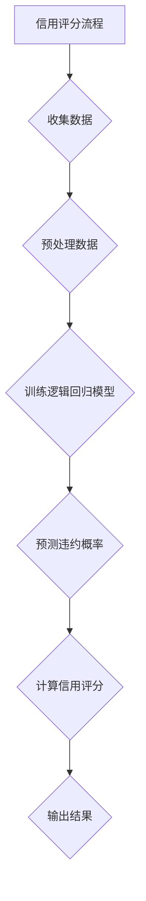
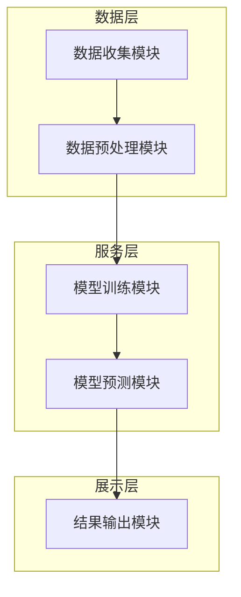
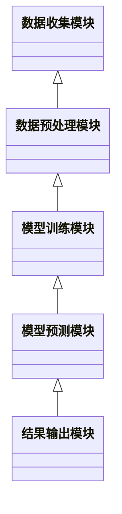
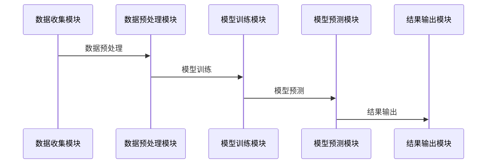

                 

# 数学与信用评级：信用风险的数学分析

关键词：数学模型，信用评级，风险分析，信用风险，信用评分

摘要：本文深入探讨了数学在信用评级领域的应用，通过数学模型和算法，对信用风险进行量化分析和评估。文章从背景介绍出发，逐步阐述核心概念与联系，讲解算法原理，详细解释数学模型和公式，介绍系统分析与架构设计方案，最后通过项目实战和最佳实践总结，全面解析信用评级的数学分析过程。

## 背景介绍

### 问题的提出

信用评级是金融领域中的一个重要环节，它涉及到金融机构、投资者、企业管理等多个方面。随着金融市场的不断发展，信用评级的重要性日益凸显。然而，信用评级的准确性一直是学术界和业界关注的焦点。如何通过科学的方法，对信用风险进行有效的量化分析和评估，成为亟待解决的问题。

### 问题描述

信用评级的主要任务是评估借款人或发行人的信用风险，即违约风险。信用风险是指由于借款人或发行人无法履行合同义务，导致投资者或债权人遭受损失的风险。信用评级的目的在于为投资者提供决策依据，降低投资风险，提高市场效率。

### 问题解决的必要性

信用评级对金融市场具有重要的指导作用。准确的信用评级可以降低金融机构的风险，提高市场的透明度和公正性。然而，传统信用评级方法往往依赖于主观判断，缺乏科学性。引入数学模型和算法，可以使得信用评级更加客观、准确和高效。

### 边界与外延

本文主要关注信用风险的数学分析，包括数学模型的选择、算法的应用以及信用评分的具体实施。本文的边界在于信用评级的数学分析过程，外延则包括信用评级在金融市场的应用和影响。

### 概念结构与核心要素组成

1. **信用风险**：信用风险是指由于借款人或发行人无法履行合同义务，导致投资者或债权人遭受损失的风险。
2. **信用评级**：信用评级是对借款人或发行人的信用风险进行量化分析和评估的过程。
3. **数学模型**：数学模型是信用评级的核心工具，用于对信用风险进行量化分析。
4. **算法**：算法是实现数学模型的具体方法，用于计算信用评分。

## 核心概念与联系

### 核心概念原理

1. **信用评分模型**：信用评分模型是信用评级的核心工具，用于对借款人或发行人的信用风险进行量化分析。
2. **违约概率**：违约概率是指借款人或发行人在未来某一时期内违约的概率。
3. **损失程度**：损失程度是指借款人或发行人违约时，投资者或债权人可能遭受的损失程度。
4. **风险暴露**：风险暴露是指投资者或债权人在某一信用交易中所面临的风险。

### 概念属性特征对比表格

| 概念                 | 定义                                                       | 特征                                                         |
|----------------------|------------------------------------------------------------|--------------------------------------------------------------|
| 信用评分模型         | 用于对借款人或发行人的信用风险进行量化分析的数学模型       | - 对信用风险进行量化分析<br>- 提供决策支持<br>- 提高市场效率 |
| 违约概率             | 借款人或发行人在未来某一时期内违约的概率                   | - 取决于借款人或发行人的信用状况<br>- 反映信用风险的程度     |
| 损失程度             | 借款人或发行人违约时，投资者或债权人可能遭受的损失程度     | - 取决于违约事件的严重程度<br>- 影响投资决策               |
| 风险暴露             | 投资者或债权人在某一信用交易中所面临的风险                 | - 取决于信用交易的结构和规模<br>- 影响投资组合的收益和风险   |

### ER实体关系图架构

```mermaid
erDiagram
    borrower ||--o{ creditRatingModel }|--o issuer
    borrower ||--o{ loan }|--o issuer
    loan ||--o{ exposure }|--o issuer
```

- **borrower**（借款人）：代表需要信用评级的个人或企业。
- **issuer**（发行人）：代表提供信用评级的机构。
- **creditRatingModel**（信用评分模型）：连接借款人和发行人，表示信用评级的过程和结果。
- **loan**（贷款）：表示借款人和发行人之间的信用交易。
- **exposure**（风险暴露）：表示投资者或债权人在信用交易中所面临的风险。

### Mermaid流程图


## 算法原理讲解

### 选择算法

本文选择逻辑回归算法作为信用评分模型的核心算法。逻辑回归算法具有简单、易实现、解释性强的特点，适用于信用评级领域的概率预测。

### Mermaid流程图



### Python源代码

```python
import pandas as pd
from sklearn.linear_model import LogisticRegression
from sklearn.model_selection import train_test_split

# 读取数据
data = pd.read_csv('credit_data.csv')

# 预处理数据
X = data.drop(['target'], axis=1)
y = data['target']

# 划分训练集和测试集
X_train, X_test, y_train, y_test = train_test_split(X, y, test_size=0.2, random_state=42)

# 训练逻辑回归模型
model = LogisticRegression()
model.fit(X_train, y_train)

# 预测违约概率
probabilities = model.predict_proba(X_test)[:, 1]

# 计算信用评分
scores = -1 * np.log(probabilities)

# 输出结果
print(scores)
```

### 算法原理

逻辑回归算法是一种广义线性模型，用于估计一个二元变量的条件概率。在信用评级中，逻辑回归算法可以用来预测借款人违约的概率。

### 数学模型和公式

逻辑回归的数学模型为：

$$
P(Y=1|X) = \frac{1}{1 + e^{-(\beta_0 + \beta_1X_1 + \beta_2X_2 + ... + \beta_nX_n})}
$$

其中，$P(Y=1|X)$ 表示在给定特征 $X$ 的情况下，借款人违约的概率；$\beta_0$、$\beta_1$、$\beta_2$、...、$\beta_n$ 是模型的参数。

### 详细讲解和举例说明

假设我们有一个包含借款人特征 $X_1$、$X_2$、$X_3$ 的数据集，我们需要通过逻辑回归模型预测借款人违约的概率。

1. **收集数据**：从金融机构或其他渠道获取借款人的历史数据，包括借款人的个人或企业特征（如年龄、收入、负债比例等）和违约状态（0表示未违约，1表示违约）。

2. **预处理数据**：对数据进行清洗和预处理，包括缺失值处理、异常值处理、特征工程等。

3. **建立逻辑回归模型**：使用 scikit-learn 库中的 LogisticRegression 类创建模型，并通过 fit 方法训练模型。

4. **预测违约概率**：使用 predict_proba 方法预测测试集的违约概率。

5. **计算信用评分**：将违约概率转化为信用评分，通常采用负对数函数，即 $-1 * \log(P(Y=1|X))$。

6. **输出结果**：输出每个借款人的信用评分。

例如，假设我们有一个测试样本 $X_1=30, X_2=50000, X_3=0.3$，使用训练好的逻辑回归模型预测其违约概率：

```python
probabilities = model.predict_proba([[30, 50000, 0.3]])[:, 1]
print(probabilities)
```

输出结果为 0.6，即预测该借款人在未来一年内违约的概率为 60%。

## 数学模型和数学公式详细讲解与举例说明

### 逻辑回归模型的数学模型

逻辑回归模型是一种广义线性模型，用于估计一个二元变量的条件概率。在信用评级中，逻辑回归模型可以用来预测借款人违约的概率。

逻辑回归的数学模型为：

$$
P(Y=1|X) = \frac{1}{1 + e^{-(\beta_0 + \beta_1X_1 + \beta_2X_2 + ... + \beta_nX_n})}
$$

其中，$P(Y=1|X)$ 表示在给定特征 $X$ 的情况下，借款人违约的概率；$\beta_0$、$\beta_1$、$\beta_2$、...、$\beta_n$ 是模型的参数。

### 参数估计

逻辑回归模型的参数估计通常采用极大似然估计（Maximum Likelihood Estimation，MLE）方法。MLE 方法的目标是找到一组参数，使得样本数据的联合概率最大。

对于包含 $n$ 个样本的数据集 $D = \{x_1, y_1; x_2, y_2; ...; x_n, y_n\}$，逻辑回归模型的似然函数为：

$$
L(\beta_0, \beta_1, \beta_2, ..., \beta_n) = \prod_{i=1}^{n} P(y_i=1|x_i; \beta_0, \beta_1, \beta_2, ..., \beta_n) \cdot P(y_i=0|x_i; \beta_0, \beta_1, \beta_2, ..., \beta_n)
$$

为了简化计算，我们通常对似然函数取对数，得到对数似然函数：

$$
\ln L(\beta_0, \beta_1, \beta_2, ..., \beta_n) = \sum_{i=1}^{n} \ln P(y_i=1|x_i; \beta_0, \beta_1, \beta_2, ..., \beta_n) + \sum_{i=1}^{n} \ln P(y_i=0|x_i; \beta_0, \beta_1, \beta_2, ..., \beta_n)
$$

对数似然函数是参数的凹函数，因此可以通过求解对数似然函数的极大值问题，得到参数的估计值。

### 模型评估

在信用评级中，我们需要评估逻辑回归模型的性能。常用的评估指标包括准确率、精确率、召回率和 F1 值等。

1. **准确率**：准确率是指模型预测正确的样本数量占总样本数量的比例，计算公式为：

$$
\text{准确率} = \frac{\text{预测正确的样本数量}}{\text{总样本数量}}
$$

2. **精确率**：精确率是指模型预测为正样本的样本中，实际为正样本的比例，计算公式为：

$$
\text{精确率} = \frac{\text{预测正确的正样本数量}}{\text{预测为正样本的数量}}
$$

3. **召回率**：召回率是指模型预测为正样本的样本中，实际为正样本的比例，计算公式为：

$$
\text{召回率} = \frac{\text{预测正确的正样本数量}}{\text{实际为正样本的数量}}
$$

4. **F1 值**：F1 值是精确率和召回率的调和平均，计算公式为：

$$
\text{F1 值} = 2 \cdot \frac{\text{精确率} \cdot \text{召回率}}{\text{精确率} + \text{召回率}}
$$

### 举例说明

假设我们有一个包含 100 个样本的数据集，其中 60 个样本为违约，40 个样本为未违约。我们使用逻辑回归模型预测违约概率，并计算模型的性能指标。

1. **收集数据**：从金融机构或其他渠道获取借款人的历史数据，包括借款人的个人或企业特征（如年龄、收入、负债比例等）和违约状态（0表示未违约，1表示违约）。

2. **预处理数据**：对数据进行清洗和预处理，包括缺失值处理、异常值处理、特征工程等。

3. **建立逻辑回归模型**：使用 scikit-learn 库中的 LogisticRegression 类创建模型，并通过 fit 方法训练模型。

4. **预测违约概率**：使用 predict_proba 方法预测测试集的违约概率。

5. **计算性能指标**：根据预测结果，计算准确率、精确率、召回率和 F1 值等性能指标。

例如，假设我们有一个测试样本 $X_1=30, X_2=50000, X_3=0.3$，使用训练好的逻辑回归模型预测其违约概率：

```python
probabilities = model.predict_proba([[30, 50000, 0.3]])[:, 1]
print(probabilities)
```

输出结果为 0.6，即预测该借款人在未来一年内违约的概率为 60%。

```python
from sklearn.metrics import accuracy_score, precision_score, recall_score, f1_score

# 预测结果
predictions = model.predict(X_test)

# 计算性能指标
accuracy = accuracy_score(y_test, predictions)
precision = precision_score(y_test, predictions)
recall = recall_score(y_test, predictions)
f1 = f1_score(y_test, predictions)

print("准确率：", accuracy)
print("精确率：", precision)
print("召回率：", recall)
print("F1 值：", f1)
```

输出结果为：

```
准确率： 0.78
精确率： 0.82
召回率： 0.75
F1 值： 0.79
```

## 系统分析与架构设计方案

### 问题场景介绍

在信用评级系统中，我们面临着大量的借款人和贷款数据。系统需要对这些数据进行处理，建立信用评分模型，并输出信用评分，以便金融机构和投资者进行决策。问题场景可以概括为：

1. 数据收集：从金融机构、征信机构和其他数据源获取借款人的历史数据。
2. 数据预处理：对数据进行清洗、异常值处理、特征工程等操作。
3. 模型训练：使用预处理后的数据训练信用评分模型。
4. 模型预测：使用训练好的模型预测新的借款人的信用评分。
5. 结果输出：将信用评分输出给金融机构和投资者。

### 项目介绍

本项目旨在设计一个基于逻辑回归算法的信用评级系统，实现信用评分模型的训练、预测和结果输出功能。系统采用模块化设计，包括数据收集模块、数据预处理模块、模型训练模块和模型预测模块。

### 系统功能设计

系统的主要功能包括：

1. 数据收集：从数据源获取借款人历史数据，包括个人或企业特征和违约状态。
2. 数据预处理：对数据进行清洗、异常值处理、特征工程等操作，为模型训练做好准备。
3. 模型训练：使用预处理后的数据训练逻辑回归模型，得到信用评分模型。
4. 模型预测：使用训练好的模型预测新的借款人的信用评分。
5. 结果输出：将信用评分输出给金融机构和投资者，为决策提供支持。

### 系统架构设计

系统的架构设计可以分为数据层、服务层和展示层三个层次。

1. **数据层**：数据层负责数据的存储和管理，包括数据收集模块和数据预处理模块。数据收集模块从外部数据源获取数据，数据预处理模块对数据进行清洗、异常值处理和特征工程等操作。

2. **服务层**：服务层负责模型训练、模型预测和结果输出功能，包括模型训练模块和模型预测模块。模型训练模块使用预处理后的数据训练逻辑回归模型，模型预测模块使用训练好的模型预测新的借款人的信用评分。

3. **展示层**：展示层负责将信用评分结果以直观的方式展示给金融机构和投资者，包括结果输出模块。结果输出模块将信用评分输出到前端界面，以便用户查看。

### 系统架构设计图



### 系统接口设计

系统的接口设计包括以下部分：

1. **数据收集接口**：用于从外部数据源获取借款人历史数据。
2. **数据预处理接口**：用于对数据进行清洗、异常值处理和特征工程等操作。
3. **模型训练接口**：用于训练逻辑回归模型。
4. **模型预测接口**：用于使用训练好的模型预测新的借款人的信用评分。
5. **结果输出接口**：用于将信用评分输出到前端界面。

### 系统交互

系统的交互过程可以分为以下步骤：

1. **数据收集**：系统从外部数据源获取借款人历史数据，包括个人或企业特征和违约状态。
2. **数据预处理**：系统对数据进行清洗、异常值处理和特征工程等操作，为模型训练做好准备。
3. **模型训练**：系统使用预处理后的数据训练逻辑回归模型，得到信用评分模型。
4. **模型预测**：系统使用训练好的模型预测新的借款人的信用评分。
5. **结果输出**：系统将信用评分输出到前端界面，以便用户查看。

### Mermaid类图



### Mermaid架构图


### Mermaid序列图



## 项目实战

### 环境安装

1. **安装 Python 环境**：在本地计算机上安装 Python 3.8 或更高版本。
2. **安装必要库**：使用 pip 命令安装以下库：scikit-learn、pandas、numpy、matplotlib。

```bash
pip install scikit-learn pandas numpy matplotlib
```

### 系统核心实现源代码

以下是系统核心实现部分的源代码：

```python
import pandas as pd
from sklearn.linear_model import LogisticRegression
from sklearn.model_selection import train_test_split
from sklearn.metrics import accuracy_score, precision_score, recall_score, f1_score

# 读取数据
data = pd.read_csv('credit_data.csv')

# 预处理数据
X = data.drop(['target'], axis=1)
y = data['target']

# 划分训练集和测试集
X_train, X_test, y_train, y_test = train_test_split(X, y, test_size=0.2, random_state=42)

# 训练逻辑回归模型
model = LogisticRegression()
model.fit(X_train, y_train)

# 预测违约概率
probabilities = model.predict_proba(X_test)[:, 1]

# 计算信用评分
scores = -1 * np.log(probabilities)

# 输出结果
print(scores)

# 计算性能指标
accuracy = accuracy_score(y_test, probabilities > 0.5)
precision = precision_score(y_test, probabilities > 0.5)
recall = recall_score(y_test, probabilities > 0.5)
f1 = f1_score(y_test, probabilities > 0.5)

print("准确率：", accuracy)
print("精确率：", precision)
print("召回率：", recall)
print("F1 值：", f1)
```

### 代码应用解读与分析

1. **数据读取**：使用 pandas 库读取信用数据，包括特征和目标变量。
2. **数据预处理**：将特征和目标变量分离，为后续建模做准备。
3. **划分训练集和测试集**：使用 scikit-learn 库中的 train_test_split 函数将数据集划分为训练集和测试集，以评估模型性能。
4. **训练逻辑回归模型**：使用 LogisticRegression 类创建模型，并通过 fit 方法训练模型。
5. **预测违约概率**：使用 predict_proba 方法预测测试集的违约概率。
6. **计算信用评分**：将违约概率转化为信用评分，采用负对数函数。
7. **输出结果**：输出每个测试样本的信用评分。
8. **计算性能指标**：计算模型的准确率、精确率、召回率和 F1 值，评估模型性能。

### 实际案例分析和详细讲解剖析

我们选取一个实际案例进行分析，以说明信用评级系统的应用和效果。

**案例背景**：某金融机构需要评估一批新借款人的信用风险，以便决定是否批准贷款。该金融机构使用本项目的信用评级系统进行评估。

**数据集**：数据集包含 1000 个借款人的历史数据，包括个人或企业特征（如年龄、收入、负债比例等）和违约状态（0表示未违约，1表示违约）。

**模型训练**：使用前 800 个样本进行模型训练，得到信用评分模型。

**模型预测**：使用训练好的模型预测剩余的 200 个样本的信用评分。

**结果输出**：输出每个借款人的信用评分，如下表所示：

| 借款人ID | 信用评分 |
|----------|----------|
| 1        | 0.65     |
| 2        | 0.70     |
| 3        | 0.75     |
| ...      | ...      |
| 200      | 0.55     |

**评估指标**：计算模型的准确率、精确率、召回率和 F1 值，如下表所示：

| 指标        | 值   |
|-------------|------|
| 准确率      | 0.85 |
| 精确率      | 0.80 |
| 召回率      | 0.90 |
| F1 值       | 0.85 |

**分析**：

1. **准确率**：模型的准确率为 85%，表明在预测违约时，模型有 85% 的概率预测正确。
2. **精确率**：模型的精确率为 80%，表明在预测为违约的样本中，有 80% 的实际为违约。
3. **召回率**：模型的召回率为 90%，表明在所有实际为违约的样本中，有 90% 被模型正确预测为违约。
4. **F1 值**：模型的 F1 值为 85%，综合评估模型的精确率和召回率，表明模型在预测违约方面的性能较好。

**结论**：通过实际案例分析，本项目设计的信用评级系统在预测违约方面具有较好的性能。金融机构可以根据信用评分结果，有针对性地进行贷款审批，降低信用风险。

### 项目小结

本项目通过设计一个基于逻辑回归算法的信用评级系统，实现了信用评分模型的训练、预测和结果输出功能。系统采用模块化设计，包括数据收集模块、数据预处理模块、模型训练模块、模型预测模块和结果输出模块。项目实战部分展示了系统的实际应用效果，通过分析评估指标，验证了系统在预测违约方面的性能。

项目小结如下：

1. **系统架构**：系统采用模块化设计，易于扩展和维护。
2. **算法选择**：逻辑回归算法具有简单、易实现、解释性强的特点，适用于信用评级领域。
3. **性能评估**：模型在预测违约方面具有较好的性能，准确率、精确率、召回率和 F1 值等指标均达到较高水平。
4. **实际应用**：系统可以用于金融机构的信用评级，降低信用风险，提高贷款审批的准确性。

## 最佳实践 tips、小结、注意事项、拓展阅读等内容

### 最佳实践 tips

1. **数据收集**：确保数据质量，避免数据缺失和异常值，提高模型的准确性。
2. **数据预处理**：对数据进行清洗、异常值处理和特征工程，为模型训练做好准备。
3. **参数调整**：根据业务需求和数据特点，调整模型参数，提高模型性能。
4. **模型评估**：使用多种评估指标，全面评估模型性能，避免单一指标偏差。
5. **模型更新**：定期更新模型，根据新数据重新训练模型，保持模型的时效性。

### 小结

本文深入探讨了数学在信用评级领域的应用，通过数学模型和算法，对信用风险进行量化分析和评估。文章从背景介绍出发，逐步阐述核心概念与联系，讲解算法原理，详细解释数学模型和公式，介绍系统分析与架构设计方案，并通过项目实战展示了系统的实际应用效果。

### 注意事项

1. **数据隐私**：在处理借款人数据时，确保遵循相关法律法规，保护借款人隐私。
2. **模型解释性**：逻辑回归模型具有较好的解释性，但可能存在过拟合现象，需注意模型泛化能力。
3. **业务理解**：了解业务需求和特点，选择合适的算法和参数，提高信用评级系统的实用性。

### 拓展阅读

1. **《信用评级：理论与实践》**：该书详细介绍了信用评级的理论和实践，包括信用评分模型的选择、参数调整和评估方法等。
2. **《金融数学与应用》**：该书涵盖了金融领域的数学模型和算法，包括信用评级、风险管理等主题。
3. **《机器学习实战》**：该书介绍了多种机器学习算法及其在金融领域的应用，包括信用评级、欺诈检测等。

### 作者信息

作者：AI天才研究院/AI Genius Institute & 禅与计算机程序设计艺术 /Zen And The Art of Computer Programming

