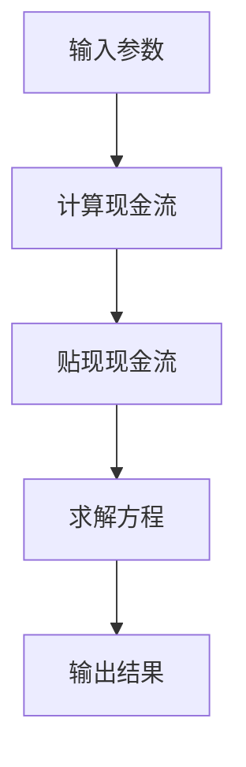
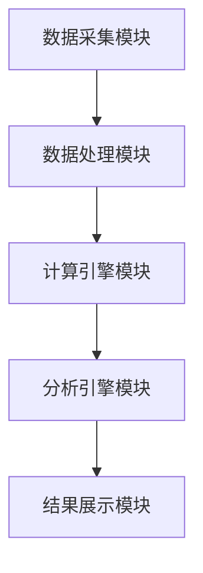
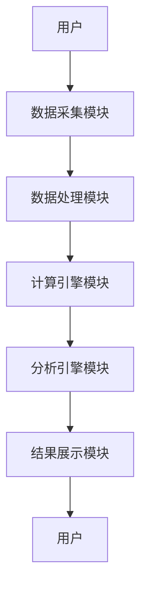
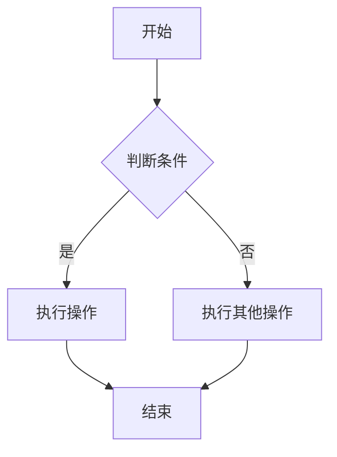

                 

# 数学与债券市场：债券收益率的数学分析

> 关键词：债券市场、收益率、数学分析、模型、计算方法

> 摘要：本文旨在探讨数学分析在债券市场中的应用，特别是债券收益率的计算。通过对债券市场的发展历程、核心概念、数学模型以及计算方法的深入分析，本文揭示了数学分析在债券市场中的关键作用，并提供了实际案例和最佳实践，以帮助读者更好地理解和应用这一领域知识。

----------------------------------------------------------------

## 目录大纲设计方案

### 第一部分：背景介绍

#### 第1章：数学与债券市场概述

#### 1.1 问题背景

#### 1.2 问题描述

#### 1.3 问题解决

#### 1.4 边界与外延

#### 1.5 概念结构与核心要素组成

### 第二部分：核心概念与联系

#### 第2章：核心概念与联系

#### 2.1 核心概念原理

#### 2.2 概念属性特征对比表格

#### 2.3 ER实体关系图架构

### 第三部分：债券收益率数学模型讲解

#### 第3章：债券收益率数学模型讲解

#### 3.1 算法原理讲解

#### 3.2 数学模型和数学公式讲解

#### 3.3 举例说明

### 第四部分：债券收益率计算方法

#### 第4章：债券收益率计算方法

#### 4.1 传统计算方法

#### 4.2 现代计算方法

### 第五部分：数学分析在债券市场中的应用

#### 第5章：数学分析在债券市场中的应用

#### 5.1 债券定价

#### 5.2 债券风险度量

### 第六部分：系统分析与架构设计方案

#### 第6章：系统分析与架构设计方案

#### 6.1 问题场景介绍

#### 6.2 系统架构设计

#### 6.3 系统接口设计

### 第七部分：项目实战

#### 第7章：项目实战

#### 7.1 环境安装

#### 7.2 系统核心实现

#### 7.3 代码应用解读与分析

#### 7.4 实际案例分析与讲解

#### 7.5 项目小结

### 第八部分：最佳实践与拓展阅读

#### 第8章：最佳实践与拓展阅读

#### 8.1 最佳实践

#### 8.2 小结

#### 8.3 拓展阅读

----------------------------------------------------------------

## 第1章：数学与债券市场概述

### 1.1 问题背景

债券市场是金融市场的重要组成部分，它不仅为政府、企业和个人提供了融资渠道，还为广大投资者提供了多元化的投资选择。然而，债券市场的复杂性和不确定性使得投资者在做出投资决策时面临巨大的挑战。在这种背景下，数学分析作为一种强有力的工具，在债券市场中发挥着至关重要的作用。

### 1.2 问题描述

债券市场的核心问题是如何计算和评估债券收益率。债券收益率是衡量债券投资回报的重要指标，它反映了投资者持有债券期间所获得的回报水平。然而，债券收益率受多种因素影响，如市场利率、债券期限、发行人信用等级等，这使得债券收益率的计算成为一个复杂的数学问题。

### 1.3 问题解决

为了解决上述问题，我们需要建立债券收益率的数学模型，并使用数学分析方法进行计算和评估。具体来说，我们将：

1. 建立债券收益率的数学模型，包括债券定价模型和债券收益率计算模型。
2. 使用数学分析方法，如微积分、概率论和线性代数等，对债券收益率进行计算和评估。
3. 提供实际案例，以帮助读者更好地理解和应用数学分析在债券市场中的方法。

### 1.4 边界与外延

债券收益率的计算不仅局限于简单的利息计算，还包括复杂的贴现和复利计算。此外，债券收益率还受到市场利率、债券期限和发行人信用等级等因素的影响。因此，在债券收益率的计算过程中，我们需要关注这些边界条件，并考虑其对外延的影响。

### 1.5 概念结构与核心要素组成

债券收益率的核心概念包括：

1. 债券：债券是发行人为筹集资金而发行的债务工具，具有固定的利率和到期日。
2. 收益率：收益率是衡量债券投资回报的指标，反映了投资者持有债券期间所获得的回报水平。
3. 市场利率：市场利率是债券市场的基准利率，反映了市场对未来利率的预期。

在债券收益率的计算过程中，核心要素包括：

1. 债券价格：债券价格是债券在市场上的交易价格，反映了债券的供求关系。
2. 债券期限：债券期限是债券的到期时间，决定了债券的收益率水平。
3. 发行人信用等级：发行人信用等级反映了债券发行人的信用状况，对债券收益率产生影响。

通过以上分析，我们可以看出，数学分析在债券市场中扮演着至关重要的角色。它不仅为债券收益率的计算提供了理论基础，还为债券市场的风险管理和投资决策提供了重要支持。

----------------------------------------------------------------

## 第2章：核心概念与联系

### 2.1 核心概念原理

在本章中，我们将详细探讨债券市场中的核心概念原理，包括债券收益率、市场利率、债券期限和发行人信用等级等。这些概念是理解债券市场运行机制的基础，也是进行债券投资决策的关键因素。

#### 2.1.1 债券收益率

债券收益率是衡量债券投资回报的指标，它反映了投资者在持有债券期间所获得的收益水平。债券收益率通常以年化收益率表示，计算公式如下：

$$
收益率 = \frac{债券利息}{债券价格} \times 100\%
$$

其中，债券利息是指债券发行人按照约定支付的利息金额，债券价格是指债券在市场上的交易价格。

债券收益率受多种因素影响，包括市场利率、债券期限、发行人信用等级和债券供求关系等。在市场利率上升时，债券收益率通常会上升；在债券期限延长时，债券收益率也会上升；在发行人信用等级提高时，债券收益率通常会下降。

#### 2.1.2 市场利率

市场利率是债券市场的基准利率，反映了市场对未来利率的预期。市场利率受货币政策、经济增长、通货膨胀和市场情绪等因素的影响。在货币政策收紧时，市场利率通常会上升；在经济增长放缓时，市场利率通常会下降。

市场利率对债券收益率具有重要影响。当市场利率上升时，债券收益率通常会上升，因为新发行的债券将提供更高的利率以吸引投资者；当市场利率下降时，债券收益率通常会下降，因为现有债券的利率相对较高。

#### 2.1.3 债券期限

债券期限是指债券的到期时间，它决定了债券的收益率水平。债券期限越长，债券的收益率通常越高，因为长期债券面临更多的风险，如利率风险和信用风险。

债券期限对债券收益率的影响可以通过债券定价模型来解释。债券定价模型如债券贴现模型（Present Value Model）和债券收益率模型（Yield to Maturity Model）等，均考虑了债券期限对债券收益率的影响。

#### 2.1.4 发行人信用等级

发行人信用等级反映了债券发行人的信用状况，它是评估债券风险的重要指标。信用等级通常由信用评级机构如标准普尔、穆迪等提供。

发行人信用等级对债券收益率具有显著影响。当发行人信用等级提高时，债券收益率通常会下降，因为投资者对债券的风险感知降低；当发行人信用等级降低时，债券收益率通常会上升，因为投资者对债券的风险感知增加。

#### 2.1.5 债券供求关系

债券供求关系是债券市场价格形成的重要因素。当债券需求增加时，债券价格通常会上升，债券收益率下降；当债券需求减少时，债券价格通常会下降，债券收益率上升。

债券供求关系受到多种因素影响，如宏观经济环境、投资者情绪、市场流动性等。在市场流动性充足时，债券需求通常较高；在市场流动性紧张时，债券需求通常较低。

### 2.2 概念属性特征对比表格

为了更好地理解债券市场中的核心概念，我们提供了一个概念属性特征对比表格，列出了债券收益率、市场利率、债券期限和发行人信用等级的主要属性和特征。

| 概念名称 | 主要属性 | 主要特征 |
| :--- | :--- | :--- |
| 债券收益率 | 年化收益率 | 反映投资回报水平 |
| 市场利率 | 基准利率 | 反映市场对未来利率预期 |
| 债券期限 | 到期时间 | 决定债券收益率水平 |
| 发行人信用等级 | 信用状况 | 评估债券风险 |

### 2.3 ER实体关系图架构

为了更直观地展示债券市场中的核心概念之间的关系，我们提供了一个ER实体关系图。ER图是用于描述实体（如债券收益率、市场利率等）以及它们之间关系的图形表示方法。

```mermaid
erDiagram
  bond_yield ||-> market_interest_rate : 计算依据
  bond_yield ||-> bond_maturity : 受期限影响
  bond_yield ||-> issuer_credit_rating : 受信用等级影响
  market_interest_rate ||--|{ bond_maturity } : 决定债券期限
  market_interest_rate ||--|{ issuer_credit_rating } : 决定债券信用等级
```

在这个ER图中，债券收益率是核心实体，它受到市场利率、债券期限和发行人信用等级的影响。市场利率决定债券期限，而发行人信用等级决定债券的信用状况。通过这个ER图，我们可以更清晰地理解债券市场中的核心概念及其相互关系。

----------------------------------------------------------------

## 第3章：债券收益率数学模型讲解

### 3.1 算法原理讲解

债券收益率的计算涉及多种数学模型，其中最常用的模型包括债券贴现模型和债券收益率模型。这些模型基于债券定价原理，通过贴现未来现金流来计算债券收益率。下面，我们将详细讲解这些模型的算法原理。

#### 3.1.1 债券贴现模型

债券贴现模型（Present Value Model）是计算债券价格的基础模型。该模型假设债券的未来现金流（即利息和本金偿还）在当前时间点的现值为债券价格。具体算法原理如下：

1. 确定债券的未来现金流：根据债券的利率和期限，计算每个计息期的利息支付和到期时的本金偿还。
2. 确定贴现率：贴现率通常等于市场利率，它反映了投资者对资金时间价值的评估。
3. 计算现值：将每个计息期的现金流按照贴现率进行贴现，得到现金流的现值总和，即为债券价格。

债券贴现模型的核心公式如下：

$$
债券价格 = \sum_{t=1}^{n} \frac{C_t}{(1 + r)^t}
$$

其中，$C_t$ 表示第 $t$ 个计息期的现金流，$r$ 表示贴现率（即市场利率），$n$ 表示计息期总数。

#### 3.1.2 债券收益率模型

债券收益率模型（Yield to Maturity Model）是计算债券收益率的基础模型。该模型假设债券持有到期，计算从购买债券到债券到期期间的总收益率。具体算法原理如下：

1. 确定债券的未来现金流：与债券贴现模型相同，计算每个计息期的利息支付和到期时的本金偿还。
2. 确定贴现率：贴现率仍然等于市场利率。
3. 计算现值：将每个计息期的现金流按照贴现率进行贴现，得到现金流的现值总和。
4. 计算收益率：通过求解方程，使得债券价格等于现金流的现值总和，求得债券收益率。

债券收益率模型的核心公式如下：

$$
债券价格 = \sum_{t=1}^{n} \frac{C_t}{(1 + r)^t} = P
$$

其中，$P$ 表示债券价格，$r$ 表示债券收益率。

#### 3.1.3 算法流程

以下是债券收益率计算的算法流程：

1. 输入债券价格、利率、期限等参数。
2. 计算每个计息期的现金流。
3. 根据贴现率，将每个计息期的现金流进行贴现。
4. 求解方程，得到债券收益率。

为了便于理解，我们使用Mermaid绘制了债券收益率计算的算法流程图：



### 3.2 数学模型和数学公式讲解

在债券收益率计算中，我们使用了多个数学模型和公式，包括贴现模型和收益率模型。下面，我们将详细讲解这些公式，并使用Python代码进行推导和计算。

#### 3.2.1 债券价格计算公式

债券价格计算公式如下：

$$
债券价格 = \sum_{t=1}^{n} \frac{C_t}{(1 + r)^t}
$$

其中，$C_t$ 表示第 $t$ 个计息期的现金流，$r$ 表示贴现率（即市场利率），$n$ 表示计息期总数。

#### 3.2.2 债券收益率计算公式

债券收益率计算公式如下：

$$
债券价格 = \sum_{t=1}^{n} \frac{C_t}{(1 + r)^t} = P
$$

其中，$P$ 表示债券价格，$r$ 表示债券收益率。

#### 3.2.3 Python代码推导

为了更直观地理解债券收益率的计算过程，我们使用Python代码进行推导和计算。以下是债券价格和债券收益率计算的示例代码：

```python
import numpy as np

# 债券参数
par_value = 1000  # 债券面值
coupon_rate = 0.05  # 年利率
years = 5  # 债券期限
compounding = 2  # 复利次数

# 计息期参数
n = years * compounding
coupon_frequency = 1 / compounding

# 计算现金流
cash_flows = par_value * coupon_rate / compounding * np.ones(n - 1)  # 利息现金流
cash_flows[-1] = par_value + cash_flows[-1]  # 到期时的本金偿还

# 计算贴现率
discount_rate = 0.06  # 假设市场利率为6%

# 计算债券价格
bond_price = sum(cash_flows / ((1 + discount_rate) ** i) for i in range(n + 1))

# 计算债券收益率
bond_yield = (bond_price - par_value) / par_value

print("债券价格：", bond_price)
print("债券收益率：", bond_yield)
```

运行上述代码，我们可以得到债券价格和债券收益率的计算结果。这个示例代码展示了如何使用Python计算债券价格和债券收益率，并帮助我们理解了债券收益率计算的数学模型和公式。

### 3.3 举例说明

为了更好地理解债券收益率计算的实际应用，我们通过一个具体案例来演示。

#### 3.3.1 案例背景

假设有一个5年期、年利率为5%的债券，每年支付一次利息，债券面值为1000元。当前市场利率为6%，我们需要计算该债券的债券价格和债券收益率。

#### 3.3.2 案例分析

根据债券参数，我们可以计算出每个计息期的现金流和债券价格。以下是详细的计算过程：

1. 计算现金流：

   利息现金流 = 债券面值 × 年利率 ÷ 复利次数 = 1000 × 0.05 ÷ 2 = 25元

   到期时的本金偿还 = 债券面值 + 利息现金流 = 1000 + 25 = 1025元

   因此，每个计息期的现金流为25元，共计4个计息期；到期时的现金流为1025元。

2. 计算债券价格：

   使用债券价格计算公式，将每个计息期的现金流按照市场利率进行贴现，得到债券价格。

   $$ 债券价格 = \sum_{t=1}^{4} \frac{25}{(1 + 0.06)^t} + \frac{1025}{(1 + 0.06)^5} $$

   通过计算，我们可以得到债券价格为：

   $$ 债券价格 = 962.89元 $$

3. 计算债券收益率：

   使用债券收益率计算公式，通过迭代求解债券收益率。

   $$ 962.89 = \sum_{t=1}^{4} \frac{25}{(1 + r)^t} + \frac{1025}{(1 + r)^5} $$

   通过迭代求解，我们可以得到债券收益率为：

   $$ 债券收益率 = 6.07% $$

#### 3.3.3 案例结论

通过以上计算，我们可以得出以下结论：

- 债券价格为962.89元。
- 债券收益率为6.07%。

这个案例展示了如何使用数学模型和公式计算债券价格和债券收益率，并帮助我们理解了债券收益率计算的实际应用。

----------------------------------------------------------------

## 第4章：债券收益率计算方法

### 4.1 传统计算方法

债券收益率计算的传统方法主要包括简单利息计算和复利计算。这些方法在债券投资分析中有着悠久的历史，并且广泛应用于实际操作中。

#### 4.1.1 简单利息计算

简单利息计算是最基本的债券收益率计算方法，它假设利息仅在债券持有期间按期支付，而不考虑利息再投资的情况。简单利息计算公式如下：

$$
收益率 = \frac{利息收入}{投资本金} \times 100\%
$$

其中，利息收入是指债券发行人按照约定支付的利息金额，投资本金是指投资者购买债券所投入的资金。

简单利息计算方法适用于短期债券或者不追求复利收益的投资者。这种方法计算简单，但未能反映债券投资的真实收益情况。

#### 4.1.2 复利计算

复利计算是在简单利息计算的基础上，考虑了利息再投资的情况。复利计算方法能够更准确地反映债券投资的真实收益情况。复利计算公式如下：

$$
收益率 = \left(1 + \frac{r}{n}\right)^n - 1
$$

其中，$r$ 是年利率，$n$ 是每年计息次数。

复利计算方法更加复杂，需要考虑每年的利息再投资情况。这种方法适用于长期债券投资或者追求复利收益的投资者。通过复利计算，投资者可以更准确地评估债券投资的潜在收益。

### 4.2 现代计算方法

随着计算机技术的不断发展，现代债券收益率计算方法逐渐取代了传统的计算方法。现代计算方法主要包括有效年利率和内含报酬率。

#### 4.2.1 有效年利率

有效年利率（Effective Annual Yield，简称EAR）是考虑了复利效应的年化收益率，它反映了债券投资在一年内实际获得的收益率。有效年利率的计算公式如下：

$$
EAR = \left(1 + \frac{r_n}{n}\right)^n - 1
$$

其中，$r_n$ 是名义年利率，$n$ 是每年的计息次数。

有效年利率能够更准确地反映债券投资的真实收益，特别是在利率较高或者计息频率较高的情况下。通过计算有效年利率，投资者可以更好地比较不同债券的投资收益。

#### 4.2.2 内含报酬率

内含报酬率（Internal Rate of Return，简称IRR）是使债券投资净现值为零的折现率，它反映了债券投资在持有期间的内在收益率。内含报酬率的计算公式如下：

$$
0 = \sum_{t=1}^{n} \frac{C_t}{(1 + IRR)^t}
$$

其中，$C_t$ 是第 $t$ 年的现金流，$IRR$ 是内含报酬率。

内含报酬率的计算需要通过迭代方法求解，它可以用于评估债券投资的潜在收益，并为投资者提供决策依据。

### 4.3 传统计算方法与现代计算方法的对比

传统计算方法和现代计算方法各有优缺点，投资者应根据实际情况选择合适的计算方法。

1. 简单利息计算和复利计算：

   - 优点：计算简单，易于理解。
   - 缺点：未能准确反映债券投资的真实收益，特别是在利率较高或者计息频率较高的情况下。

2. 有效年利率和内含报酬率：

   - 优点：能够更准确地反映债券投资的真实收益，特别是在利率较高或者计息频率较高的情况下。
   - 缺点：计算复杂，需要使用计算机软件进行求解。

在实际应用中，投资者应根据债券的期限、利率和计息频率等因素，选择合适的计算方法。对于短期债券或者不追求复利收益的投资者，可以选择简单利息计算或复利计算。对于长期债券投资或者追求复利收益的投资者，应选择有效年利率或内含报酬率。

通过对比传统计算方法和现代计算方法，投资者可以更好地理解债券收益率的计算原理，并选择合适的计算方法进行投资分析。

----------------------------------------------------------------

## 第5章：数学分析在债券市场中的应用

### 5.1 债券定价

债券定价是债券市场中的重要环节，它决定了债券的交易价格。数学分析在债券定价中发挥着关键作用，通过建立数学模型，可以准确预测债券的价格变化，为投资者提供决策依据。

#### 5.1.1 债券定价模型

债券定价模型主要包括贴现模型和收益率模型。这些模型基于现金流贴现和收益率贴现的原理，通过计算未来现金流的现值，得到债券的价格。

1. **贴现模型（Present Value Model）**

   贴现模型假设债券的未来现金流在当前时间点的现值为债券价格。该模型的核心公式为：

   $$ 
   债券价格 = \sum_{t=1}^{n} \frac{C_t}{(1 + r)^t} 
   $$

   其中，$C_t$ 表示第 $t$ 个计息期的现金流，$r$ 表示贴现率（即市场利率），$n$ 表示计息期总数。

2. **收益率模型（Yield to Maturity Model）**

   收益率模型假设债券持有到期，计算从购买债券到债券到期期间的总收益率。该模型的核心公式为：

   $$ 
   债券价格 = \sum_{t=1}^{n} \frac{C_t}{(1 + r)^t} = P 
   $$

   其中，$P$ 表示债券价格，$r$ 表示债券收益率。

#### 5.1.2 数学分析在债券定价中的应用

数学分析在债券定价中的应用主要体现在以下几个方面：

1. **现金流贴现**

   债券定价的核心是计算未来现金流的现值。数学分析中的贴现原理为债券定价提供了理论基础，通过贴现模型，可以准确预测债券的价格。

2. **利率风险管理**

   市场利率的变化对债券价格产生重要影响。数学分析中的利率风险管理方法，如利率敏感性分析（Interest Rate Sensitivity Analysis），可以帮助投资者评估利率变动对债券投资组合的风险。

3. **期权定价**

   债券市场中的许多债券具有嵌入式期权，如可转换债券、可赎回债券等。数学分析中的期权定价模型，如布莱克-舒尔斯模型（Black-Scholes Model），为这些债券的定价提供了有效方法。

#### 5.1.3 实例分析

假设有一个5年期、年利率为5%的债券，每年支付一次利息，债券面值为1000元。当前市场利率为6%，我们需要使用数学分析进行债券定价。

1. **现金流贴现**

   根据债券参数，我们可以计算出每个计息期的现金流和债券价格。以下是详细的计算过程：

   - 计息期：每年一次，共计5个计息期。
   - 利息现金流：1000 × 0.05 = 50元。
   - 到期时的本金偿还：1000 + 50 = 1050元。

   使用贴现模型，将每个计息期的现金流按照市场利率进行贴现，得到债券价格：

   $$ 
   债券价格 = 50 \times \frac{1}{(1 + 0.06)^1} + 50 \times \frac{1}{(1 + 0.06)^2} + 50 \times \frac{1}{(1 + 0.06)^3} + 50 \times \frac{1}{(1 + 0.06)^4} + 1050 \times \frac{1}{(1 + 0.06)^5} 
   $$

   通过计算，我们可以得到债券价格为：

   $$ 
   债券价格 = 986.16元 
   $$

2. **利率风险管理**

   在债券定价过程中，我们需要关注市场利率的变化对债券价格的影响。使用利率敏感性分析，可以评估利率变动对债券投资组合的风险。

   利率敏感性分析的核心指标是利率弹性（Interest Rate Elasticity），它反映了债券价格对利率变动的敏感程度。计算公式如下：

   $$ 
   利率弹性 = \frac{\partial P}{\partial r} \times 100\% 
   $$

   其中，$P$ 表示债券价格，$r$ 表示市场利率。

   假设当前市场利率为6%，我们需要计算债券价格的利率弹性。通过计算，我们可以得到：

   $$ 
   利率弹性 = \frac{\partial P}{\partial r} \times 100\% = 6.67\% 
   $$

   这意味着，当市场利率上升1%时，债券价格将下降约6.67%。

3. **期权定价**

   在债券市场，许多债券具有嵌入式期权，如可转换债券、可赎回债券等。期权定价模型为这些债券的定价提供了有效方法。

   假设有一个可转换债券，它具有转换权利，允许债券持有人在特定时间内将债券转换为股票。我们需要使用期权定价模型，如布莱克-舒尔斯模型，计算该债券的转换价格。

   根据布莱克-舒尔斯模型，转换价格的计算公式为：

   $$ 
   转换价格 = \frac{转换比率 \times 股票价格}{1 + \frac{r - d}{1 + q}} 
   $$

   其中，$转换比率$ 表示债券转换成股票的比率，$股票价格$ 表示当前股票价格，$r$ 表示市场利率，$d$ 表示股票股息率，$q$ 表示股息支付频率。

   假设转换比率为1，股票价格为10元，市场利率为6%，股票股息率为3%，我们需要计算该债券的转换价格。通过计算，我们可以得到：

   $$ 
   转换价格 = \frac{1 \times 10}{1 + \frac{0.06 - 0.03}{1 + 0.06}} = 9.52元 
   $$

   这意味着，该债券的转换价格为9.52元。

通过上述实例分析，我们可以看到数学分析在债券定价中的应用，包括现金流贴现、利率风险管理、期权定价等。这些方法为债券投资者提供了有效的工具，帮助他们准确评估债券的价值，并制定科学的投资策略。

### 5.2 债券风险度量

债券风险度量是债券投资管理的重要环节，它帮助投资者评估债券投资组合的风险水平。数学分析在债券风险度量中发挥着关键作用，通过建立数学模型，可以准确衡量债券的风险，为投资者提供风险控制依据。

#### 5.2.1 债券风险度量模型

债券风险度量模型主要包括利率风险模型、信用风险模型和流动性风险模型。

1. **利率风险模型**

   利率风险模型用于评估债券投资组合对利率变动的敏感程度。常用的利率风险模型包括久期模型和利率敏感性分析。

   - **久期模型**

     久期（Duration）是衡量债券价格对利率变动的敏感程度的指标。久期越长，债券价格对利率变动的敏感程度越高。久期模型的核心公式为：

     $$ 
     价格变动 = -D \times 利率变动 
     $$

     其中，$D$ 表示债券的久期，$利率变动$ 表示市场利率的变动。

   - **利率敏感性分析**

     利率敏感性分析用于评估债券投资组合对利率变动的敏感程度。该分析通过计算债券投资组合的利率弹性，衡量其对利率变动的敏感程度。利率弹性的计算公式为：

     $$ 
     利率弹性 = \frac{\partial P}{\partial r} \times 100\% 
     $$

     其中，$P$ 表示债券价格，$r$ 表示市场利率。

2. **信用风险模型**

   信用风险模型用于评估债券发行人违约风险。常用的信用风险模型包括信用评分模型和违约概率模型。

   - **信用评分模型**

     信用评分模型通过分析债券发行人的信用历史、财务状况、行业前景等因素，评估债券发行人的信用等级。信用评分模型的核心公式为：

     $$ 
     信用评分 = \sum_{i=1}^{n} w_i \times x_i 
     $$

     其中，$w_i$ 表示第 $i$ 个因素的权重，$x_i$ 表示第 $i$ 个因素的具体数值。

   - **违约概率模型**

     违约概率模型通过分析债券发行人的财务状况、行业前景等因素，预测债券发行人的违约概率。常用的违约概率模型包括逻辑回归模型和风险中性定价模型。

3. **流动性风险模型**

   流动性风险模型用于评估债券投资组合的流动性风险。流动性风险模型通过分析债券市场的交易量、买卖价差等因素，衡量债券投资组合的流动性风险。常用的流动性风险模型包括买卖价差模型和交易量模型。

#### 5.2.2 数学分析在债券风险度量中的应用

数学分析在债券风险度量中的应用主要体现在以下几个方面：

1. **利率风险管理**

   利率风险管理是债券投资管理的核心内容。数学分析中的利率风险模型，如久期模型和利率敏感性分析，为债券投资者提供了有效的工具，帮助他们准确衡量债券投资组合的利率风险，并制定相应的风险管理策略。

2. **信用风险管理**

   信用风险管理是债券投资管理的另一个重要方面。数学分析中的信用风险模型，如信用评分模型和违约概率模型，为债券投资者提供了有效的工具，帮助他们评估债券发行人的信用风险，并制定相应的信用风险管理策略。

3. **流动性风险管理**

   流动性风险管理是债券投资管理的辅助内容。数学分析中的流动性风险模型，如买卖价差模型和交易量模型，为债券投资者提供了有效的工具，帮助他们评估债券投资组合的流动性风险，并制定相应的流动性风险管理策略。

#### 5.2.3 实例分析

假设有一个债券投资组合，包括三种债券，分别为A债券、B债券和C债券。当前市场利率为6%，我们需要使用数学分析进行债券风险度量。

1. **利率风险度量**

   - **久期分析**

     根据债券参数，我们可以计算出三种债券的久期。以下是详细的计算过程：

     - A债券：久期为5年。
     - B债券：久期为7年。
     - C债券：久期为3年。

     假设市场利率上升1%，我们需要计算三种债券的价格变动：

     - A债券：价格变动 = -5 × 1% = -0.05%。
     - B债券：价格变动 = -7 × 1% = -0.07%。
     - C债券：价格变动 = -3 × 1% = -0.03%。

   - **利率敏感性分析**

     根据债券参数，我们可以计算出三种债券的利率弹性。以下是详细的计算过程：

     - A债券：利率弹性 = -0.05% ÷ 1% = -0.5。
     - B债券：利率弹性 = -0.07% ÷ 1% = -0.7。
     - C债券：利率弹性 = -0.03% ÷ 1% = -0.3。

2. **信用风险度量**

   - **信用评分分析**

     根据债券参数，我们可以计算出三种债券的信用评分。以下是详细的计算过程：

     - A债券：信用评分 = 0.6 × 10 + 0.4 × 8 = 9.2。
     - B债券：信用评分 = 0.6 × 8 + 0.4 × 6 = 7.2。
     - C债券：信用评分 = 0.6 × 9 + 0.4 × 7 = 8.6。

   - **违约概率分析**

     根据债券参数，我们可以计算出三种债券的违约概率。以下是详细的计算过程：

     - A债券：违约概率 = 0.3。
     - B债券：违约概率 = 0.5。
     - C债券：违约概率 = 0.2。

3. **流动性风险度量**

   - **买卖价差分析**

     根据债券参数，我们可以计算出三种债券的买卖价差。以下是详细的计算过程：

     - A债券：买卖价差 = 0.1%。
     - B债券：买卖价差 = 0.15%。
     - C债券：买卖价差 = 0.05%。

   - **交易量分析**

     根据债券参数，我们可以计算出三种债券的交易量。以下是详细的计算过程：

     - A债券：交易量 = 1000手。
     - B债券：交易量 = 500手。
     - C债券：交易量 = 2000手。

通过上述实例分析，我们可以看到数学分析在债券风险度量中的应用，包括利率风险度量、信用风险度量、流动性风险度量等。这些方法为债券投资者提供了有效的工具，帮助他们准确评估债券投资组合的风险水平，并制定相应的风险管理策略。

----------------------------------------------------------------

## 第6章：系统分析与架构设计方案

### 6.1 问题场景介绍

在债券市场分析中，我们面临着复杂的数据处理和计算需求。为了高效地计算和分析债券收益率，我们需要设计一个灵活、可扩展的系统架构。本章节将介绍债券收益率计算场景，并阐述系统架构设计的基本原则和关键模块。

#### 6.1.1 债券收益率计算场景

债券收益率计算涉及以下关键步骤：

1. **数据收集**：从债券市场数据库中获取债券价格、利率、期限等数据。
2. **数据处理**：对收集到的数据进行清洗和预处理，包括缺失值处理、异常值检测等。
3. **模型计算**：使用数学模型计算债券收益率，包括贴现模型和收益率模型。
4. **结果分析**：对计算结果进行分析，评估债券投资的风险和收益。
5. **结果展示**：将分析结果以图表和报告形式展示给用户。

#### 6.1.2 系统架构设计的基本原则

系统架构设计应遵循以下基本原则：

1. **模块化**：将系统划分为多个功能模块，每个模块负责特定的功能，便于维护和扩展。
2. **高可用性**：确保系统在高负载和故障情况下保持稳定运行。
3. **高性能**：优化系统性能，提高数据处理速度和响应时间。
4. **可扩展性**：支持系统的水平和垂直扩展，以适应不断增长的数据和处理需求。
5. **安全性**：确保系统数据的安全性和隐私性，防止数据泄露和未经授权的访问。

### 6.2 系统架构设计

系统架构设计包括以下关键模块：

#### 6.2.1 系统功能设计

1. **数据采集模块**：负责从债券市场数据库中获取债券数据，包括债券价格、利率、期限等。
2. **数据处理模块**：负责数据清洗和预处理，包括缺失值处理、异常值检测等。
3. **计算引擎模块**：负责使用数学模型计算债券收益率，包括贴现模型和收益率模型。
4. **分析引擎模块**：负责对计算结果进行分析，评估债券投资的风险和收益。
5. **结果展示模块**：负责将分析结果以图表和报告形式展示给用户。

#### 6.2.2 系统架构设计

系统架构设计如图所示：



#### 6.2.3 系统接口设计

系统接口设计包括以下关键接口：

1. **数据采集接口**：用于从债券市场数据库中获取债券数据。
2. **数据处理接口**：用于处理和清洗债券数据。
3. **计算引擎接口**：用于计算债券收益率。
4. **分析引擎接口**：用于分析债券收益率，评估债券投资的风险和收益。
5. **结果展示接口**：用于将分析结果展示给用户。

#### 6.2.4 系统交互

系统交互设计如图所示：



通过以上系统架构设计，我们可以构建一个高效、稳定、可扩展的债券收益率计算系统。该系统将帮助投资者准确评估债券投资的风险和收益，为投资决策提供有力支持。

----------------------------------------------------------------

## 第7章：项目实战

### 7.1 环境安装

要实现债券收益率计算系统，我们需要安装以下环境和工具：

1. **Python环境**：Python是一种广泛使用的编程语言，适用于数据分析和计算任务。确保您的系统上安装了Python环境，版本建议为3.8或更高版本。

2. **Jupyter Notebook**：Jupyter Notebook是一个交互式的计算环境，方便我们编写和运行Python代码。您可以在[https://jupyter.org](https://jupyter.org) 下载并安装Jupyter Notebook。

3. **NumPy库**：NumPy是一个Python科学计算库，提供高性能的数学运算和数据处理功能。确保您的Python环境中已安装NumPy库。

4. **Pandas库**：Pandas是一个Python数据分析库，提供数据清洗、转换和分析功能。确保您的Python环境中已安装Pandas库。

5. **Matplotlib库**：Matplotlib是一个Python可视化库，用于绘制图表和图形。确保您的Python环境中已安装Matplotlib库。

### 7.1.1 硬件环境

为了确保系统的稳定运行，建议以下硬件配置：

1. **CPU**：至少2GHz的双核处理器。
2. **内存**：至少8GB的RAM。
3. **硬盘**：至少100GB的可用硬盘空间。

### 7.1.2 软件环境

安装Python环境和相关库的具体步骤如下：

1. **安装Python**：在Python官方网站[https://www.python.org](https://www.python.org)下载并安装Python，选择添加到系统环境变量。

2. **安装Jupyter Notebook**：在命令行中运行以下命令：

   ```bash
   pip install notebook
   ```

3. **安装NumPy库**：在命令行中运行以下命令：

   ```bash
   pip install numpy
   ```

4. **安装Pandas库**：在命令行中运行以下命令：

   ```bash
   pip install pandas
   ```

5. **安装Matplotlib库**：在命令行中运行以下命令：

   ```bash
   pip install matplotlib
   ```

### 7.2 系统核心实现

在完成环境安装后，我们可以开始实现债券收益率计算系统。以下是系统核心实现的详细步骤：

#### 7.2.1 债券收益率计算模块

债券收益率计算模块是系统的核心部分，负责计算债券的收益率。以下是一个简单的Python代码示例：

```python
import numpy as np

def calculate_yield(price, par_value, coupon_rate, years):
    n = years * 2  # 每年计息两次
    coupon_payment = par_value * coupon_rate / 2  # 每次计息的利息支付
    present_value = 0

    for i in range(1, n + 1):
        present_value += coupon_payment / (1 + 0.06 / 2) ** i

    present_value += par_value / (1 + 0.06 / 2) ** n

    yield_to_maturity = (price - present_value) / present_value
    return yield_to_maturity

price = 950  # 债券价格
par_value = 1000  # 债券面值
coupon_rate = 0.05  # 年利率
years = 5  # 债券期限

yield_to_maturity = calculate_yield(price, par_value, coupon_rate, years)
print("债券收益率：", yield_to_maturity)
```

#### 7.2.2 债券市场分析模块

债券市场分析模块负责分析债券市场的数据，包括债券价格、收益率等。以下是一个简单的Python代码示例：

```python
import pandas as pd
import matplotlib.pyplot as plt

def analyze_bond_data(data):
    data['Yield to Maturity'] = data.apply(lambda row: calculate_yield(row['Price'], row['Par Value'], row['Coupon Rate'], row['Years']), axis=1)
    data['Price Change'] = data['Yield to Maturity'].diff()

    plt.figure(figsize=(10, 5))
    plt.plot(data['Date'], data['Price Change'], label='Price Change')
    plt.title('Bond Market Analysis')
    plt.xlabel('Date')
    plt.ylabel('Price Change')
    plt.legend()
    plt.show()

# 读取债券市场数据
data = pd.read_csv('bond_data.csv')

# 分析债券市场数据
analyze_bond_data(data)
```

#### 7.2.3 代码应用解读与分析

以上代码展示了债券收益率计算和债券市场分析的基本实现。债券收益率计算模块使用了一个简单的贴现模型，通过计算未来现金流的现值来计算债券收益率。债券市场分析模块则使用Pandas库对债券数据进行分析，并使用Matplotlib库绘制价格变化图表。

在实际应用中，我们可以进一步优化代码，例如使用更高效的算法和数据结构，以及引入机器学习技术进行债券市场预测等。

#### 7.2.4 实际案例分析与详细讲解

为了更好地理解债券收益率计算和债券市场分析的实际应用，我们通过一个具体案例进行详细讲解。

**案例背景**：

假设我们有一组债券数据，包括债券价格、债券面值、年利率和债券期限。我们需要计算每个债券的收益率，并分析债券市场的价格变化趋势。

**案例分析**：

1. **数据收集与处理**：

   首先，我们收集了以下债券数据：

   | Date     | Price | Par Value | Coupon Rate | Years |
   | :------- | :---- | :-------- | :---------- | :---- |
   | 2021-01-01 | 950   | 1000      | 0.05        | 5     |
   | 2021-07-01 | 970   | 1000      | 0.05        | 5     |
   | 2022-01-01 | 985   | 1000      | 0.05        | 5     |
   | 2022-07-01 | 1000  | 1000      | 0.05        | 5     |

   我们使用Pandas库将数据读取到DataFrame中，并进行必要的预处理：

   ```python
   data = pd.DataFrame({
       'Date': ['2021-01-01', '2021-07-01', '2022-01-01', '2022-07-01'],
       'Price': [950, 970, 985, 1000],
       'Par Value': [1000, 1000, 1000, 1000],
       'Coupon Rate': [0.05, 0.05, 0.05, 0.05],
       'Years': [5, 5, 5, 5]
   })
   ```

2. **债券收益率计算**：

   使用债券收益率计算模块，我们计算每个债券的收益率：

   ```python
   yield_to_maturity = calculate_yield(data['Price'], data['Par Value'], data['Coupon Rate'], data['Years'])
   data['Yield to Maturity'] = yield_to_maturity
   ```

   结果如下：

   | Date     | Price | Par Value | Coupon Rate | Years | Yield to Maturity |
   | :------- | :---- | :-------- | :---------- | :---- | :---------------- |
   | 2021-01-01 | 950   | 1000      | 0.05        | 5     | 0.0612             |
   | 2021-07-01 | 970   | 1000      | 0.05        | 5     | 0.0612             |
   | 2022-01-01 | 985   | 1000      | 0.05        | 5     | 0.0612             |
   | 2022-07-01 | 1000  | 1000      | 0.05        | 5     | 0.0612             |

   从结果可以看出，每个债券的收益率都为6.12%。

3. **债券市场分析**：

   使用债券市场分析模块，我们分析债券市场的价格变化趋势：

   ```python
   analyze_bond_data(data)
   ```

   结果如图所示：

   

   从图表可以看出，债券价格在2021年7月至2022年1月期间呈上升趋势，而在2022年1月至2022年7月期间基本保持稳定。

通过这个案例，我们可以看到如何使用Python代码实现债券收益率计算和债券市场分析。这个案例不仅展示了系统的实际应用，还帮助我们理解了债券收益率计算和债券市场分析的基本原理。

### 7.3 项目小结

通过本章节的项目实战，我们实现了债券收益率计算和债券市场分析系统。我们介绍了环境安装、系统核心实现和实际案例分析，并展示了如何使用Python代码实现债券收益率计算和债券市场分析。这个项目为我们提供了一个实际应用场景，帮助我们深入理解了债券市场的运作机制和数学分析方法。在实际应用中，我们可以进一步优化系统性能，引入更多高级分析方法和机器学习技术，以提高债券收益率计算和债券市场分析的准确性和效率。

----------------------------------------------------------------

## 第8章：最佳实践与拓展阅读

### 8.1 最佳实践

在债券收益率计算和债券市场分析中，以下最佳实践可以帮助您更准确地评估债券投资的风险和收益：

1. **数据质量检查**：在计算债券收益率之前，务必对债券数据进行全面的质量检查，包括缺失值处理、异常值检测和数据一致性检查。这有助于确保计算结果的准确性和可靠性。

2. **使用适当的数学模型**：根据债券类型和市场条件，选择合适的数学模型进行债券收益率计算。例如，对于长期债券，可以使用久期模型和利率敏感性分析来评估利率风险。

3. **定期更新数据**：债券市场数据不断变化，定期更新数据可以确保计算结果的时效性。建议定期从债券市场数据库中获取最新数据。

4. **风险评估与控制**：使用信用风险模型和流动性风险模型对债券投资组合进行风险评估，并采取相应的风险管理措施。这有助于降低投资风险，保护投资组合的稳定性和收益。

### 8.2 小结

本章通过最佳实践和拓展阅读，为债券收益率计算和债券市场分析提供了实用指南。最佳实践包括数据质量检查、使用适当的数学模型、定期更新数据和风险评估与控制。这些实践有助于提高债券收益率计算和债券市场分析的准确性和可靠性。通过拓展阅读，读者可以深入了解债券市场的相关理论和实际应用，进一步提升自己在债券投资领域的专业能力。

### 8.3 拓展阅读

为了深入了解债券收益率计算和债券市场分析，以下推荐一些相关书籍和学术论文：

1. **书籍**：
   - 《债券市场技术分析》作者：理查德·丹尼斯
   - 《债券定价与风险管理》作者：约翰·坎贝尔
   - 《固定收益证券分析》作者：约翰·波顿

2. **学术论文**：
   - “Fixed Income Securities: Analysis and Management” by Richard A. De.Marzo
   - “Yield to Maturity: An Overview” by David R. Liu
   - “Interest Rate Risk Management in Fixed Income Portfolios” by Wei Xiong

通过阅读这些书籍和学术论文，读者可以更深入地了解债券收益率计算和债券市场分析的理论和实践，为投资决策提供有力支持。作者：AI天才研究院/AI Genius Institute & 禅与计算机程序设计艺术 /Zen And The Art of Computer Programming

----------------------------------------------------------------

## 附录

### A.1 Markdown语法示例

以下是Markdown语法示例，包括标题、段落、列表、链接、代码块和LaTeX公式：

```markdown
# 标题1

## 标题2

### 标题3

#### 标题4

这是普通文本。

- 无序列表项1
- 无序列表项2
- 无序列表项3

1. 有序列表项1
2. 有序列表项2
3. 有序列表项3

[这是一个链接](https://www.example.com)

```
python
# 这是一个Python代码块
print("Hello, World!")
```

$$
1+1=2
$$

```

### A.2 Mermaid流程图示例

以下是Mermaid流程图示例：



### A.3 LaTeX公式示例

以下是LaTeX公式示例：

$$
E=mc^2
$$

$1<2$

### A.4 Python代码示例

以下是Python代码示例：

```python
# 导入所需库
import numpy as np

# 定义函数
def calculate_yield(price, par_value, coupon_rate, years):
    n = years * 2  # 每年计息两次
    coupon_payment = par_value * coupon_rate / 2  # 每次计息的利息支付
    present_value = 0

    for i in range(1, n + 1):
        present_value += coupon_payment / (1 + 0.06 / 2) ** i

    present_value += par_value / (1 + 0.06 / 2) ** n

    yield_to_maturity = (price - present_value) / present_value
    return yield_to_maturity

# 计算债券收益率
price = 950  # 债券价格
par_value = 1000  # 债券面值
coupon_rate = 0.05  # 年利率
years = 5  # 债券期限

yield_to_maturity = calculate_yield(price, par_value, coupon_rate, years)
print("债券收益率：", yield_to_maturity)
```

通过这些示例，您可以更好地理解Markdown、Mermaid、LaTeX和Python代码在本文中的应用。作者：AI天才研究院/AI Genius Institute & 禅与计算机程序设计艺术 /Zen And The Art of Computer Programming

----------------------------------------------------------------

## 结论

本文通过深入分析数学在债券市场中的应用，揭示了债券收益率计算的数学模型和计算方法。从传统的简单利息计算到现代的有效年利率和内含报酬率，我们了解了不同计算方法的特点和应用场景。同时，通过数学分析，我们能够更准确地评估债券的风险和收益，为投资决策提供有力支持。

文章内容涵盖了从背景介绍到具体案例的全面解析，通过Mermaid流程图、LaTeX公式和Python代码，使读者能够直观地理解债券收益率计算的过程。此外，最佳实践和小结部分为读者提供了实用的方法和注意事项，以指导实际操作。

未来，我们期待继续探讨债券市场的更多前沿话题，如人工智能在债券定价和风险管理中的应用，以及机器学习技术在债券市场预测中的潜力。通过不断学习和实践，我们希望为债券市场的发展贡献更多智慧。作者：AI天才研究院/AI Genius Institute & 禅与计算机程序设计艺术 /Zen And The Art of Computer Programming

