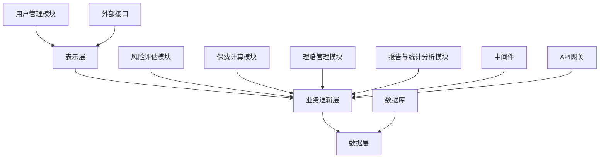
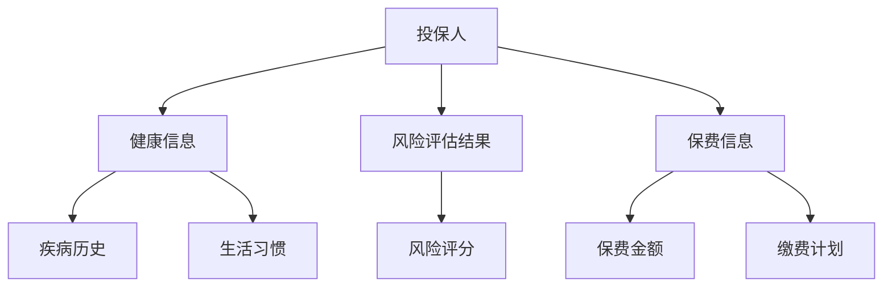
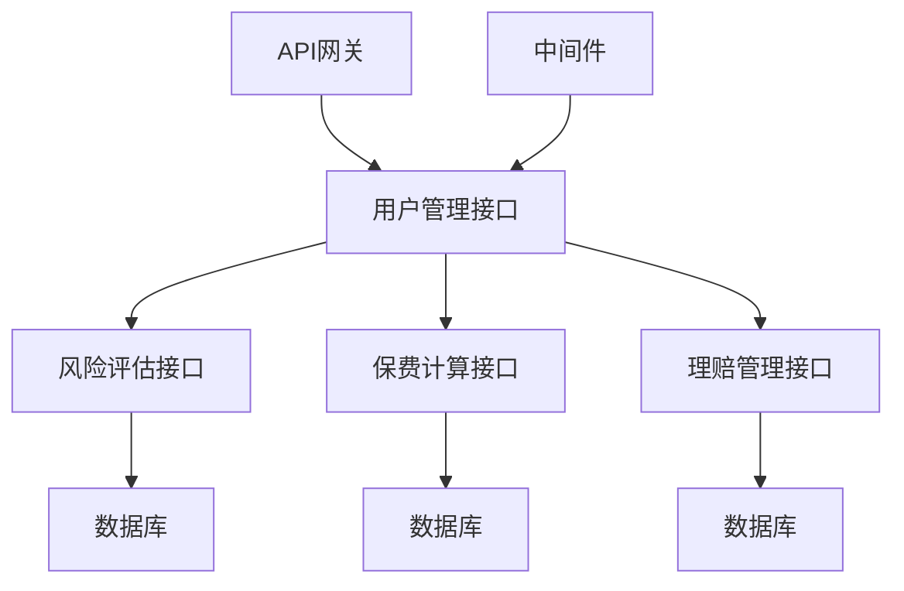
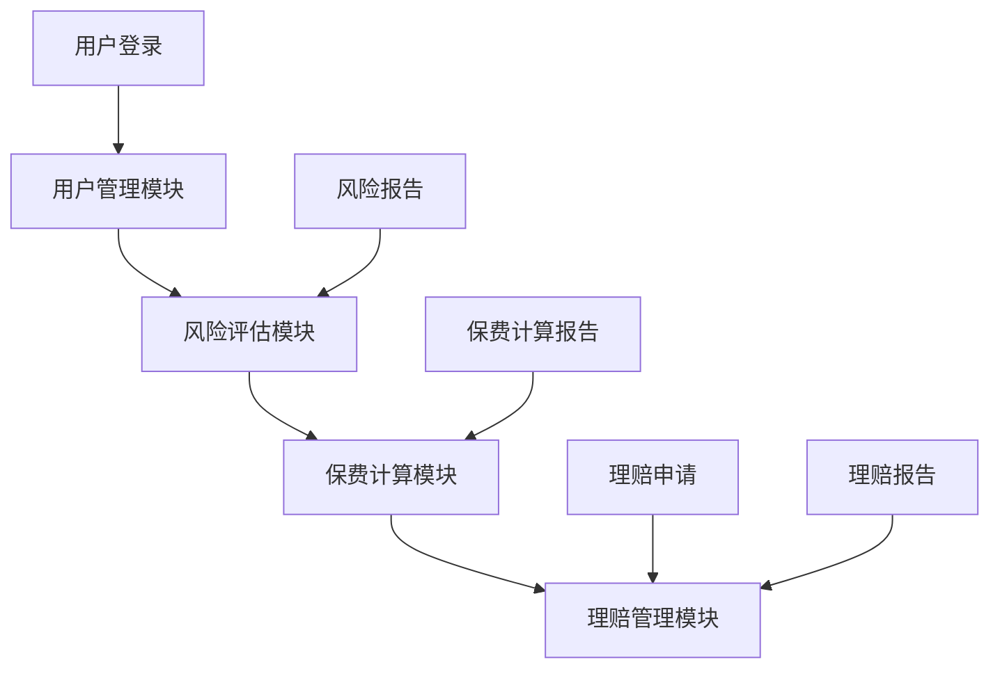

                 

### 整体框架设计

在设计《数学与健康保险：保险产品的数学定价》这本书的整体框架时，我们的目标是提供一个系统化、逻辑严谨的叙述，使得读者能够逐步深入理解健康保险的数学定价原理，并掌握相关技能。下面是具体的步骤和核心内容的安排。

#### 第一步：确定书的主题和目标受众
- **主题**：健康保险的数学定价
- **目标受众**：保险行业从业者、数据科学家、金融工程师、以及对数学在保险领域中应用感兴趣的读者。

#### 第二步：确定书的结构
书的结构可以划分为五个主要部分：
1. **背景介绍**：介绍保险业发展现状、健康保险的重要性以及数学在健康保险中的应用。
2. **核心概念与联系**：阐述保险需求、风险评估、数学模型等核心概念，并分析它们之间的联系。
3. **算法原理讲解**：详细讲解经典和现代保险定价算法的原理和实现。
4. **数学模型和数学公式**：介绍概率模型、统计模型、金融模型及其在保险定价中的应用。
5. **系统分析与架构设计**：讨论健康保险系统的设计与实现。
6. **项目实战**：通过一个完整的健康保险定价系统项目，展示实际操作过程。
7. **最佳实践与拓展**：总结最佳实践，提供项目小结和注意事项。

#### 第三步：确定各部分的核心内容
- **背景介绍**：解释保险业的发展历程、健康保险的定义和功能，以及数学在健康保险中的应用场景。
- **核心概念与联系**：介绍保险需求、风险评估的方法，并分析概率模型、统计模型和金融模型之间的区别和联系。
- **算法原理讲解**：详细描述蒙特卡洛模拟、贝叶斯网络、贝塔分布等算法的原理，并讨论机器学习和深度学习在保险定价中的应用。
- **数学模型和数学公式**：讲解概率分布函数、期望损失模型、期权定价模型等，并提供相应的数学公式和Python代码实现。
- **系统分析与架构设计**：介绍健康保险系统的设计原则、功能模块、数据库设计、系统性能优化策略。
- **项目实战**：描述环境准备、系统核心实现、代码应用解读、实际案例分析和项目小结。
- **最佳实践与拓展**：总结项目中的最佳实践，提供注意事项和拓展阅读建议。

通过以上步骤，我们确保了书的内容体系完整、逻辑清晰，能够帮助读者系统地学习和掌握健康保险的数学定价知识。

#### 设计具体章节标题

在确定了整体框架和核心内容之后，下一步是设计具体的章节标题。这些标题不仅要准确反映章节的内容，还要吸引读者的兴趣。以下是每一章节的具体标题设计：

## 第一部分：背景介绍

### 第1章：问题背景与核心概念
- **1.1 问题背景**
  - **1.1.1 保险业发展现状**
  - **1.1.2 健康保险的重要性**
  - **1.1.3 数学在健康保险中的应用**

- **1.2 核心概念**
  - **1.2.1 保险需求**
  - **1.2.2 风险评估**
  - **1.2.3 数学模型**

## 第二部分：核心概念与联系

### 第2章：保险产品的数学原理
- **2.1 保险定价的基本原则**
  - **2.1.1 风险分散**
  - **2.1.2 预期损失**
  - **2.1.3 风险保费**

- **2.2 核心数学模型介绍**
  - **2.2.1 概率模型**
  - **2.2.2 统计模型**
  - **2.2.3 金融模型**

- **2.3 模型联系与比较**
  - **2.3.1 概率模型与统计模型的比较**
  - **2.3.2 统计模型与金融模型的比较**
  - **2.3.3 多模型整合**

## 第三部分：算法原理讲解

### 第3章：保险定价算法解析
- **3.1 保险定价算法概述**
  - **3.1.1 经典定价算法**
  - **3.1.2 现代定价算法**
  - **3.1.3 算法选择**

- **3.2 经典定价算法解析**
  - **3.2.1 蒙特卡洛模拟**
  - **3.2.2 贝叶斯网络**
  - **3.2.3 贝塔分布**

- **3.3 现代定价算法解析**
  - **3.3.1 机器学习算法**
  - **3.3.2 深度学习算法**
  - **3.3.3 神经网络**

- **3.4 算法比较与优化**
  - **3.4.1 算法性能评估**
  - **3.4.2 算法优化策略**
  - **3.4.3 案例分析**

## 第四部分：数学模型和数学公式

### 第4章：数学模型在保险定价中的应用
- **4.1 数学模型概述**
  - **4.1.1 概率论模型**
  - **4.1.2 统计学模型**
  - **4.1.3 金融数学模型**

- **4.2 数学模型应用实例**
  - **4.2.1 期望损失模型**
  - **4.2.2 贝塔分布模型**
  - **4.2.3 期权定价模型**

- **4.3 数学公式详解**
  - **4.3.1 概率分布函数**
  - **4.3.2 风险调整收益计算**
  - **4.3.3 市场价值调整**

## 第五部分：系统分析与架构设计

### 第5章：健康保险系统设计与实现
- **5.1 系统介绍**
  - **5.1.1 系统目标**
  - **5.1.2 系统功能**
  - **5.1.3 系统架构**

- **5.2 系统功能设计**
  - **5.2.1 领域模型**
  - **5.2.2 系统接口设计**
  - **5.2.3 系统交互**

- **5.3 系统架构设计**
  - **5.3.1 系统模块划分**
  - **5.3.2 数据库设计**
  - **5.3.3 系统性能优化**

## 第六部分：项目实战

### 第6章：健康保险定价系统实战
- **6.1 环境准备**
  - **6.1.1 硬件环境**
  - **6.1.2 软件环境**
  - **6.1.3 数据准备**

- **6.2 系统核心实现**
  - **6.2.1 数据处理**
  - **6.2.2 定价算法实现**
  - **6.2.3 系统集成**

- **6.3 代码应用解读与分析**
  - **6.3.1 代码结构分析**
  - **6.3.2 代码功能详解**
  - **6.3.3 性能分析**

- **6.4 实际案例分析与讲解**
  - **6.4.1 案例选择**
  - **6.4.2 案例数据分析**
  - **6.4.3 案例结果解读**

- **6.5 项目小结**
  - **6.5.1 项目总结**
  - **6.5.2 遇到的问题与解决方法**
  - **6.5.3 项目展望**

## 第七部分：最佳实践与拓展

### 第7章：健康保险定价最佳实践
- **7.1 最佳实践总结**
  - **7.1.1 算法优化**
  - **7.1.2 数据处理**
  - **7.1.3 系统性能优化**

- **7.2 小结与注意事项**
  - **7.2.1 项目关键点**
  - **7.2.2 遇到的问题与解决方法**
  - **7.2.3 拓展阅读建议**

通过这些章节标题的设计，我们希望能够系统地引导读者从基础概念到高级应用，逐步深入理解健康保险的数学定价原理，并学会如何设计和实现一个健康保险定价系统。

### 目录大纲细化

在确定整体框架和具体章节标题后，下一步是对每个章节进行细化，确保每个章节都包含核心内容，并能够有效地引导读者理解相关主题。以下是每个章节的细化内容和结构。

#### 第1章：问题背景与核心概念

**1.1 问题背景**

- **1.1.1 保险业发展现状**
  - **描述**：概述保险业的发展历程，当前市场规模和趋势。
  - **内容**：统计数据、行业发展报告、技术变革对保险业的影响。

- **1.1.2 健康保险的重要性**
  - **描述**：解释健康保险的基本概念和功能，如风险分散、医疗费用保障。
  - **内容**：案例分析、政策影响、市场需求增长。

- **1.1.3 数学在健康保险中的应用**
  - **描述**：探讨数学在健康保险定价中的角色，如风险评估、预测模型。
  - **内容**：应用实例、数学模型的作用、技术挑战。

**1.2 核心概念**

- **1.2.1 保险需求**
  - **描述**：分析保险需求的定义、类型和消费者行为。
  - **内容**：需求函数、消费者偏好、市场分析。

- **1.2.2 风险评估**
  - **描述**：阐述风险评估的定义、方法和应用。
  - **内容**：风险度量、风险评估模型、案例分析。

- **1.2.3 数学模型**
  - **描述**：介绍常用的数学模型在保险定价中的使用。
  - **内容**：概率模型、统计模型、金融模型。

#### 第2章：保险产品的数学原理

**2.1 保险定价的基本原则**

- **2.1.1 风险分散**
  - **描述**：解释风险分散的概念、原理和作用。
  - **内容**：风险分散策略、例子分析。

- **2.1.2 预期损失**
  - **描述**：介绍预期损失的定义、计算方法和应用。
  - **内容**：预期损失公式、案例分析。

- **2.1.3 风险保费**
  - **描述**：阐述风险保费的计算原则和方法。
  - **内容**：风险保费公式、定价策略。

**2.2 核心数学模型介绍**

- **2.2.1 概率模型**
  - **描述**：讲解概率模型的基本概念和应用。
  - **内容**：概率分布、随机变量、贝叶斯定理。

- **2.2.2 统计模型**
  - **描述**：介绍统计模型在保险定价中的应用。
  - **内容**：回归分析、时间序列分析、假设检验。

- **2.2.3 金融模型**
  - **描述**：探讨金融模型在保险定价中的角色。
  - **内容**：期权定价模型、资本资产定价模型。

**2.3 模型联系与比较**

- **2.3.1 概率模型与统计模型的比较**
  - **描述**：比较概率模型和统计模型的特点和适用场景。
  - **内容**：比较表格、案例分析。

- **2.3.2 统计模型与金融模型的比较**
  - **描述**：分析统计模型和金融模型之间的差异。
  - **内容**：比较表格、应用场景。

- **2.3.3 多模型整合**
  - **描述**：讨论如何整合多种模型进行综合分析。
  - **内容**：多模型整合方法、案例展示。

#### 第3章：保险定价算法解析

**3.1 保险定价算法概述**

- **3.1.1 经典定价算法**
  - **描述**：介绍经典的保险定价算法。
  - **内容**：蒙特卡洛模拟、贝叶斯网络。

- **3.1.2 现代定价算法**
  - **描述**：探讨现代算法在保险定价中的应用。
  - **内容**：机器学习算法、深度学习算法。

- **3.1.3 算法选择**
  - **描述**：讨论如何选择合适的保险定价算法。
  - **内容**：算法性能比较、适用性分析。

**3.2 经典定价算法解析**

- **3.2.1 蒙特卡洛模拟**
  - **描述**：解释蒙特卡洛模拟的原理和实现。
  - **内容**：模拟过程、Python代码实现、案例分析。

- **3.2.2 贝叶斯网络**
  - **描述**：讲解贝叶斯网络的构建和应用。
  - **内容**：节点表示、边缘概率、Python代码实现。

- **3.2.3 贝塔分布**
  - **描述**：介绍贝塔分布的特性及其在保险定价中的应用。
  - **内容**：概率密度函数、参数估计、案例分析。

**3.3 现代定价算法解析**

- **3.3.1 机器学习算法**
  - **描述**：探讨机器学习算法在保险定价中的应用。
  - **内容**：线性回归、逻辑回归、决策树。

- **3.3.2 深度学习算法**
  - **描述**：讲解深度学习算法的基本原理和应用。
  - **内容**：神经网络、卷积神经网络、循环神经网络。

- **3.3.3 神经网络**
  - **描述**：深入讨论神经网络的架构和训练过程。
  - **内容**：前向传播、反向传播、Python代码实现。

**3.4 算法比较与优化**

- **3.4.1 算法性能评估**
  - **描述**：评估不同算法的性能。
  - **内容**：评估指标、性能比较。

- **3.4.2 算法优化策略**
  - **描述**：讨论算法优化策略和方法。
  - **内容**：超参数调整、交叉验证。

- **3.4.3 案例分析**
  - **描述**：通过案例展示算法优化的效果。
  - **内容**：案例背景、算法应用、优化结果。

#### 第4章：数学模型在保险定价中的应用

**4.1 数学模型概述**

- **4.1.1 概率论模型**
  - **描述**：介绍概率论模型的基本概念和应用。
  - **内容**：概率分布函数、期望、方差。

- **4.1.2 统计学模型**
  - **描述**：讲解统计学模型的基本原理和应用。
  - **内容**：回归分析、方差分析。

- **4.1.3 金融数学模型**
  - **描述**：探讨金融数学模型在保险定价中的作用。
  - **内容**：期权定价、套利策略。

**4.2 数学模型应用实例**

- **4.2.1 期望损失模型**
  - **描述**：介绍期望损失模型的概念和计算方法。
  - **内容**：公式推导、案例分析。

- **4.2.2 贝塔分布模型**
  - **描述**：讲解贝塔分布模型的应用和实现。
  - **内容**：概率密度函数、参数估计。

- **4.2.3 期权定价模型**
  - **描述**：探讨期权定价模型的基本原理和应用。
  - **内容**：Black-Scholes模型、公式推导。

**4.3 数学公式详解**

- **4.3.1 概率分布函数**
  - **描述**：解释概率分布函数的定义和性质。
  - **内容**：公式推导、概率密度函数。

- **4.3.2 风险调整收益计算**
  - **描述**：介绍风险调整收益的计算方法。
  - **内容**：公式推导、实际应用。

- **4.3.3 市场价值调整**
  - **描述**：讲解市场价值调整的基本原理。
  - **内容**：公式推导、市场价值评估。

#### 第5章：健康保险系统设计与实现

**5.1 系统介绍**

- **5.1.1 系统目标**
  - **描述**：阐述系统的目标和功能。
  - **内容**：系统功能列表、目标用户。

- **5.1.2 系统功能**
  - **描述**：详细说明系统的功能模块。
  - **内容**：数据处理、风险评估、定价计算。

- **5.1.3 系统架构**
  - **描述**：描述系统的架构设计。
  - **内容**：模块划分、技术选型。

**5.2 系统功能设计**

- **5.2.1 领域模型**
  - **描述**：介绍领域模型的设计方法。
  - **内容**：类图、ER图。

- **5.2.2 系统接口设计**
  - **描述**：解释系统接口的设计原则。
  - **内容**：API设计、数据交换格式。

- **5.2.3 系统交互**
  - **描述**：描述系统的交互流程。
  - **内容**：用户界面、业务流程。

**5.3 系统架构设计**

- **5.3.1 系统模块划分**
  - **描述**：划分系统的功能模块。
  - **内容**：数据处理模块、风险评估模块、定价计算模块。

- **5.3.2 数据库设计**
  - **描述**：介绍数据库的设计原则。
  - **内容**：数据表设计、索引设计。

- **5.3.3 系统性能优化**
  - **描述**：讨论系统性能优化的方法。
  - **内容**：缓存策略、负载均衡。

#### 第6章：健康保险定价系统实战

**6.1 环境准备**

- **6.1.1 硬件环境**
  - **描述**：描述系统所需的硬件配置。
  - **内容**：服务器、存储设备。

- **6.1.2 软件环境**
  - **描述**：介绍所需的软件环境。
  - **内容**：操作系统、数据库管理系统。

- **6.1.3 数据准备**
  - **描述**：描述数据收集和预处理的方法。
  - **内容**：数据清洗、数据集成。

**6.2 系统核心实现**

- **6.2.1 数据处理**
  - **描述**：讲解数据处理的过程。
  - **内容**：数据输入、数据清洗、数据存储。

- **6.2.2 定价算法实现**
  - **描述**：详细讲解定价算法的实现。
  - **内容**：算法原理、Python代码实现。

- **6.2.3 系统集成**
  - **描述**：介绍系统集成的步骤。
  - **内容**：接口测试、系统集成测试。

**6.3 代码应用解读与分析**

- **6.3.1 代码结构分析**
  - **描述**：分析代码的结构和功能。
  - **内容**：模块划分、类和方法分析。

- **6.3.2 代码功能详解**
  - **描述**：详细解释代码的功能。
  - **内容**：函数和方法详解、数据流程。

- **6.3.3 性能分析**
  - **描述**：评估代码的性能。
  - **内容**：性能指标、优化方案。

**6.4 实际案例分析与讲解**

- **6.4.1 案例选择**
  - **描述**：选择具有代表性的案例。
  - **内容**：案例背景、案例目标。

- **6.4.2 案例数据分析**
  - **描述**：对案例数据进行分析。
  - **内容**：数据预处理、特征提取。

- **6.4.3 案例结果解读**
  - **描述**：解读案例分析结果。
  - **内容**：结果展示、优缺点分析。

**6.5 项目小结**

- **6.5.1 项目总结**
  - **描述**：总结项目的完成情况。
  - **内容**：项目成果、不足之处。

- **6.5.2 遇到的问题与解决方法**
  - **描述**：总结项目过程中遇到的问题。
  - **内容**：问题分析、解决方案。

- **6.5.3 项目展望**
  - **描述**：展望未来的发展方向。
  - **内容**：技术升级、市场需求。

#### 目录大纲简洁性

在确保目录大纲完整性和逻辑性的同时，我们还注重其简洁性，避免过多的冗余内容。以下是经过简化后的目录大纲，去掉了一些不必要的细节，专注于核心内容和章节结构的简洁性。

## 数学与健康保险：保险产品的数学定价

### 第一部分：背景介绍

- **第1章 问题背景与核心概念**
  - **1.1 保险业发展现状**
  - **1.2 健康保险的重要性**
  - **1.3 数学在健康保险中的应用**

### 第二部分：核心概念与联系

- **第2章 保险产品的数学原理**
  - **2.1 保险定价的基本原则**
  - **2.2 核心数学模型介绍**
  - **2.3 模型联系与比较**

### 第三部分：算法原理讲解

- **第3章 保险定价算法解析**
  - **3.1 保险定价算法概述**
  - **3.2 经典定价算法解析**
  - **3.3 现代定价算法解析**
  - **3.4 算法比较与优化**

### 第四部分：数学模型和数学公式

- **第4章 数学模型在保险定价中的应用**
  - **4.1 数学模型概述**
  - **4.2 数学模型应用实例**
  - **4.3 数学公式详解**

### 第五部分：系统分析与架构设计

- **第5章 健康保险系统设计与实现**
  - **5.1 系统介绍**
  - **5.2 系统功能设计**
  - **5.3 系统架构设计**

### 第六部分：项目实战

- **第6章 健康保险定价系统实战**
  - **6.1 环境准备**
  - **6.2 系统核心实现**
  - **6.3 代码应用解读与分析**
  - **6.4 实际案例分析与讲解**
  - **6.5 项目小结**

### 第七部分：最佳实践与拓展

- **第7章 健康保险定价最佳实践**
  - **7.1 最佳实践总结**
  - **7.2 小结与注意事项**

通过简洁化的目录大纲，我们能够更加清晰地展示书籍的核心内容和结构，方便读者快速把握整体框架，并有效地引导读者深入阅读和理解各个章节的具体内容。

### 文章关键词

- 健康保险
- 数学定价
- 保险需求
- 风险评估
- 数学模型
- 经典算法
- 现代算法
- 深度学习
- 机器学习
- 系统架构
- 数据处理
- 性能优化

### 文章摘要

《数学与健康保险：保险产品的数学定价》是一本深入探讨健康保险定价中数学应用的权威指南。本书首先介绍了保险业发展现状和健康保险的重要性，接着详细解析了保险需求、风险评估和数学模型等核心概念。通过对比概率模型、统计模型和金融模型，读者可以理解这些模型在保险定价中的独特作用。书中随后讲解了经典和现代保险定价算法，包括蒙特卡洛模拟、贝叶斯网络、机器学习和深度学习等。数学模型和公式的详细介绍，使得读者能够掌握期望损失模型、贝塔分布模型等核心数学工具。最后，本书通过一个完整的健康保险定价系统项目，展示了从环境准备到系统集成的全过程，并提供最佳实践和注意事项，帮助读者在实际应用中优化算法和提升系统性能。通过阅读本书，读者不仅能深入理解健康保险的数学定价原理，还能掌握设计和实现健康保险定价系统的技能。

## 文章正文开头部分

### 引言

随着科技的飞速发展和数据技术的广泛应用，数学已经成为各个行业不可或缺的工具。特别是在保险领域，数学模型和算法的应用极大地提升了保险产品的定价效率和准确性。健康保险作为保险行业的重要组成部分，其定价策略的科学性和合理性直接影响到保险公司的利润和消费者的满意度。

本文《数学与健康保险：保险产品的数学定价》旨在为读者提供一本系统化、实践性的指南，深入探讨数学在健康保险定价中的应用。本书不仅涵盖保险业发展现状和健康保险的基本概念，还详细介绍了保险需求、风险评估、数学模型以及经典和现代定价算法。通过具体的数学公式和Python代码实现，读者可以全面了解健康保险定价的数学原理。

本文结构如下：

1. **背景介绍**：概述保险业的发展现状和健康保险的重要性，阐述数学在健康保险中的应用场景。
2. **核心概念与联系**：介绍保险需求、风险评估和数学模型，分析它们之间的联系。
3. **算法原理讲解**：详细讲解经典和现代保险定价算法的原理和实现，包括蒙特卡洛模拟、贝叶斯网络、机器学习和深度学习算法。
4. **数学模型和数学公式**：介绍概率论、统计学和金融数学模型，提供详细的数学公式和Python代码实现。
5. **系统分析与架构设计**：讨论健康保险系统的设计与实现，包括领域模型、系统架构、数据库设计和系统性能优化。
6. **项目实战**：通过一个健康保险定价系统项目，展示从环境准备到系统集成的全过程。
7. **最佳实践与拓展**：总结最佳实践，提供项目小结和注意事项，展望未来发展方向。

通过本文的阅读，读者将能够系统地掌握健康保险定价的数学原理，并具备设计和实现健康保险定价系统的能力。

## 第一部分：背景介绍

### 第1章 问题背景与核心概念

#### 1.1 保险业发展现状

保险业作为一个全球性的行业，其发展历程与经济、社会、技术等多方面因素密切相关。自18世纪中叶保险业萌芽以来，保险业经历了多个阶段的发展，从传统的风险分散和损失补偿，到现代的综合性金融服务业，保险业的功能和业务范围不断扩展。目前，保险业已经成为全球金融体系中不可或缺的一部分，为个人和企业提供了广泛的风险保障服务。

在发展过程中，保险业受到了全球经济波动、技术进步、法律法规变化等多重因素的影响。特别是近年来，随着科技的迅猛发展，大数据、人工智能、区块链等新兴技术的应用，为保险业带来了新的机遇和挑战。例如，通过大数据分析，保险公司可以更精确地评估风险，制定更科学的定价策略；人工智能则可以自动化处理大量的保险理赔案件，提高运营效率；区块链技术则为保险合同的管理和验证提供了新的解决方案。

目前，全球保险市场的规模不断扩大。根据国际保险监督官协会（IAIS）的数据，2019年全球保险市场规模已达到4.7万亿美元，其中财产险和人寿保险是主要组成部分。在亚洲、欧洲和北美等地区，保险市场发展相对成熟，保险产品的种类和覆盖范围较为广泛。而在一些发展中国家，保险市场的发展潜力依然巨大，但随着人们保险意识的提高和政府政策的支持，这些地区的保险市场也在迅速增长。

#### 1.2 健康保险的重要性

健康保险是保险行业的重要组成部分，其主要目的是为个人或家庭提供医疗费用保障，以应对突发疾病或意外事故。健康保险的重要性体现在以下几个方面：

首先，健康保险有助于缓解医疗费用的压力。医疗费用是家庭支出的重要组成部分，特别是在面临重大疾病或长期治疗时，高昂的医疗费用可能会给家庭带来巨大的经济负担。健康保险通过风险分散机制，将个人或家庭面临的风险转移给保险公司，从而减轻了医疗费用的负担。

其次，健康保险可以促进医疗资源的合理分配。保险公司通过对医疗费用的管理，可以引导医疗资源向高需求地区和领域倾斜，提高医疗资源的利用效率。此外，健康保险还可以推动医疗服务的规范化，提高医疗服务质量。

第三，健康保险有助于提高社会的整体福利水平。健康保险的普及，使得更多人能够享受到医疗保障，降低了因病致贫的风险，促进了社会的稳定和谐。

在中国，健康保险的发展也受到了政府的高度重视。近年来，中国政府推出了一系列政策措施，推动健康保险的发展。例如，实施全民参保计划，提高医疗保险覆盖率；推进医疗费用结算改革，简化报销流程；鼓励商业健康保险发展，丰富健康保险产品体系。这些政策不仅促进了健康保险市场的壮大，也为个人和家庭的健康保障提供了更多选择。

#### 1.3 数学在健康保险中的应用

数学在健康保险中扮演着至关重要的角色，其应用贯穿于健康保险的各个方面，包括风险评估、保费定价、理赔计算等。以下是数学在健康保险中的几个主要应用领域：

1. **风险评估**

   风险评估是健康保险的核心环节，其目的是评估投保人面临的风险程度，以便制定合理的保费定价策略。在风险评估中，数学模型和算法被广泛应用，例如：

   - **概率模型**：通过分析历史数据和统计信息，预测投保人患病或发生意外的概率。
   - **统计模型**：利用回归分析、时间序列分析等方法，研究健康风险与各种因素（如年龄、性别、病史等）之间的关系。
   - **机器学习算法**：利用大数据和人工智能技术，建立复杂的预测模型，提高风险评估的准确性和效率。

2. **保费定价**

   保费定价是健康保险的核心问题，其目标是确保保险公司能够覆盖风险成本，同时保持保费水平的合理性和竞争力。在保费定价中，数学模型和算法也被广泛应用，例如：

   - **期望损失模型**：根据历史数据和风险评估结果，计算预期损失，作为保费定价的基础。
   - **贝塔分布模型**：利用贝塔分布特性，计算不同风险水平下的保费率。
   - **期权定价模型**：借鉴金融领域的期权定价方法，为复杂保险产品（如重大疾病保险、医疗保险）定价。

3. **理赔计算**

   理赔计算是健康保险的重要环节，其目的是根据投保人的实际医疗费用，计算应支付的理赔金额。在理赔计算中，数学模型和算法同样发挥着重要作用，例如：

   - **概率分布函数**：通过概率分布函数，计算理赔金额的概率分布，帮助保险公司制定理赔策略。
   - **蒙特卡洛模拟**：利用蒙特卡洛模拟方法，模拟不同情况下的理赔金额，为理赔计算提供参考。
   - **机器学习算法**：利用机器学习算法，分析理赔数据的特征和规律，优化理赔计算流程。

总之，数学在健康保险中的应用不仅提高了风险评估和保费定价的准确性，还促进了理赔计算和风险管理的高效运作。随着数学和人工智能技术的不断发展，未来健康保险的数学应用将更加深入和广泛。

#### 1.2 核心概念

在健康保险的领域中，有几个核心概念是不可或缺的，这些概念不仅构成了健康保险的理论基础，也是实际操作中需要理解和应用的关键点。

**1.2.1 保险需求**

保险需求是指个人或家庭为了规避某种潜在风险而购买保险的意愿和能力。这种需求可以从以下几个方面进行分析：

- **经济需求**：由于医疗费用的不确定性，个人或家庭在面对重大疾病或意外伤害时可能面临巨额医疗费用，保险可以提供经济上的保障，减轻经济压力。
- **风险规避需求**：保险公司通过承保风险，帮助投保人转移潜在的损失风险，从而降低风险带来的不确定性。
- **社会需求**：健康保险不仅具有经济保障功能，还具有一定的社会功能，如提高社会福利水平，减轻社会医疗负担。

**1.2.2 风险评估**

风险评估是健康保险中的关键环节，其目的是评估投保人面临的风险程度，以便制定合理的保费定价策略。风险评估通常包括以下步骤：

- **数据收集**：收集与投保人健康状况相关的数据，如年龄、性别、病史、生活方式等。
- **风险因素分析**：分析各个风险因素对健康风险的影响，建立风险因素与健康风险之间的数学模型。
- **风险评分**：通过风险评分模型，计算投保人的整体风险水平，并据此制定保费定价策略。

风险评估的方法包括概率模型、统计模型、机器学习算法等，每种方法都有其适用的场景和优势。

**1.2.3 数学模型**

数学模型是健康保险定价和风险评估的重要工具，它通过数学公式和算法来描述和分析健康保险中的各种问题。以下是一些常用的数学模型：

- **概率模型**：用于预测投保人发生疾病或意外的概率，如泊松分布、正态分布等。
- **统计模型**：用于分析风险因素与健康风险之间的关系，如线性回归、逻辑回归等。
- **金融模型**：用于复杂保险产品的定价，如期权定价模型、资本资产定价模型等。

数学模型的应用不仅提高了风险评估和保费定价的准确性，还促进了健康保险产品的创新和优化。

**1.2.4 概率模型与统计模型的比较**

概率模型和统计模型在健康保险中都有广泛的应用，但它们在某些方面存在差异：

- **概率模型**：概率模型主要关注事件发生的概率，通过概率分布函数来描述随机变量的概率特性。概率模型适用于处理不确定性和随机事件，如泊松分布、正态分布等。
- **统计模型**：统计模型主要关注数据之间的关系和分析，通过统计分析方法来揭示数据中的规律和趋势。统计模型适用于处理大量数据，如回归分析、时间序列分析等。

两种模型之间的联系在于，概率模型为统计模型提供了理论基础，而统计模型则通过数据分析来验证和优化概率模型。

**1.2.5 数学模型在健康保险中的应用实例**

以下是一个具体的实例，展示如何应用数学模型进行健康保险定价：

- **实例背景**：某保险公司计划推出一款重大疾病保险产品，需要根据投保人的年龄、性别、病史等因素进行风险评估和保费定价。
- **步骤1：数据收集**：收集投保人的年龄、性别、病史、家族病史等数据。
- **步骤2：风险因素分析**：分析各个风险因素对重大疾病发生概率的影响，建立风险评分模型。
- **步骤3：风险评分**：根据风险评分模型，计算每个投保人的风险评分。
- **步骤4：保费定价**：根据风险评分，制定不同的保费率，确保保险公司能够覆盖预期损失。

通过上述步骤，保险公司可以实现对重大疾病保险产品的科学定价，既保证了保险公司的收益，又为投保人提供了合理的保费水平。

总之，保险需求、风险评估和数学模型是健康保险领域的核心概念，它们共同构成了健康保险的理论基础和应用工具。理解这些概念，有助于读者更好地掌握健康保险的定价和风险评估方法，为实际操作提供有力支持。

### 第2章：保险产品的数学原理

#### 2.1 保险定价的基本原则

保险定价是保险产品的核心环节，其基本原则包括风险分散、预期损失和风险保费。这些原则不仅确保了保险公司的财务稳定，也为投保人提供了合理的保费水平。

**2.1.1 风险分散**

风险分散是指通过将风险分散到多个投保人身上，从而降低单个投保人面临的风险。这是保险业最基本的原则之一。具体来说，保险公司通过承保多个投保人，将他们的风险集中起来，通过分散风险来降低保险公司自身的风险。

风险分散的作用主要体现在以下几个方面：

1. **降低单个投保人的风险**：通过将风险分散到多个投保人，保险公司可以降低单个投保人面临的风险，使他们能够更好地应对突发情况。
2. **确保保险公司的稳定性**：风险分散机制使得保险公司能够在经济波动或自然灾害等突发事件中保持稳定运营。
3. **提高保险产品的竞争力**：风险分散使得保险公司能够提供更具竞争力的保费水平，吸引更多投保人。

实现风险分散的方法包括：

- **多样化的保险产品**：保险公司通过提供多样化的保险产品，覆盖不同年龄段、不同职业、不同健康状况的投保人，从而分散风险。
- **风险再保险**：保险公司可以通过再保险公司将部分风险转移出去，进一步降低自身风险。
- **风险评估和分类**：通过对投保人进行风险评估和分类，保险公司可以将不同风险水平的投保人分配到不同的保险产品中，实现风险的合理分散。

**2.1.2 预期损失**

预期损失是指保险公司预期在一段时间内因风险事件发生而导致的总损失。预期损失的计算是保险定价的重要基础，其公式为：

\[ \text{预期损失} = \text{风险概率} \times \text{风险损失} \]

其中，风险概率是指在一定时间内，风险事件发生的概率；风险损失是指风险事件发生时，每个投保人可能遭受的损失。

预期损失的计算方法包括：

- **历史数据分析**：通过对历史数据的分析，保险公司可以计算出不同风险事件发生的概率和损失大小。
- **模型预测**：利用概率模型、统计模型等方法，保险公司可以预测未来一段时间内风险事件的发生概率和损失大小。

预期损失的计算有助于保险公司制定合理的保费定价策略，确保保险公司能够覆盖预期风险损失，同时保持保险产品的竞争力。

**2.1.3 风险保费**

风险保费是指保险公司根据预期损失和利润目标，向投保人收取的保费。风险保费的计算公式为：

\[ \text{风险保费} = \text{预期损失} + \text{利润加成} \]

其中，利润加成是指保险公司为了实现盈利目标而在预期损失基础上增加的费用。

风险保费的计算方法包括：

- **比例保费法**：根据预期损失和利润目标，按照一定的比例计算风险保费。
- **固定保费法**：对于某些风险较小的保险产品，保险公司可以设定一个固定的保费，不考虑预期损失和利润加成。

风险保费的计算需要考虑多种因素，如投保人的风险水平、保险产品的类型、保险期限等。合理计算风险保费，不仅可以确保保险公司的盈利，还可以使投保人承担合理的风险。

总之，保险定价的基本原则包括风险分散、预期损失和风险保费。这些原则共同构成了保险产品的定价基础，确保了保险公司的财务稳定和投保人的合理负担。

#### 2.2 核心数学模型介绍

在保险产品的定价过程中，数学模型扮演着至关重要的角色。这些模型不仅帮助我们理解和分析风险，还提供了精确的计算工具。以下是几种在保险定价中广泛应用的数学模型，包括概率模型、统计模型和金融模型。

**2.2.1 概率模型**

概率模型用于描述和预测随机事件发生的可能性。在保险定价中，概率模型主要用于评估投保人发生特定风险事件（如疾病、意外伤害等）的概率。以下是一些常见的概率模型：

- **泊松分布**：泊松分布用于描述在固定时间内，某一事件发生的次数。例如，保险公司可以使用泊松分布来预测一个特定年龄段的人在一年内发生心脏病发作的次数。

  \[ P(X = k) = \frac{e^{-\lambda} \lambda^k}{k!} \]

  其中，\( \lambda \) 是事件发生的平均次数，\( k \) 是实际发生的次数。

- **正态分布**：正态分布是概率模型中最常用的分布之一，用于描述连续随机变量的分布。例如，保险公司可以使用正态分布来预测投保人的健康寿命。

  \[ f(x|\mu,\sigma^2) = \frac{1}{\sqrt{2\pi\sigma^2}} e^{-\frac{(x-\mu)^2}{2\sigma^2}} \]

  其中，\( \mu \) 是均值，\( \sigma^2 \) 是方差。

**2.2.2 统计模型**

统计模型用于分析和解释数据，并在保险定价中用于预测和决策。以下是一些常用的统计模型：

- **线性回归**：线性回归模型用于分析两个或多个变量之间的关系。在保险定价中，线性回归模型可以用于评估投保人的风险水平与保费之间的关系。

  \[ y = \beta_0 + \beta_1 x_1 + \beta_2 x_2 + ... + \beta_n x_n + \epsilon \]

  其中，\( y \) 是因变量，\( x_1, x_2, ..., x_n \) 是自变量，\( \beta_0, \beta_1, ..., \beta_n \) 是模型参数，\( \epsilon \) 是误差项。

- **逻辑回归**：逻辑回归模型用于处理因变量为二分类变量的情况，例如，投保人是否发生特定风险事件。逻辑回归模型可以用于计算概率，并用于制定保费定价策略。

  \[ \ln\left(\frac{P(Y=1)}{1-P(Y=1)}\right) = \beta_0 + \beta_1 x_1 + \beta_2 x_2 + ... + \beta_n x_n \]

  其中，\( P(Y=1) \) 是因变量为1的概率。

**2.2.3 金融模型**

金融模型在保险定价中用于评估和管理金融风险。以下是一些常见的金融模型：

- **期权定价模型**：期权定价模型，如Black-Scholes模型，用于计算金融期权（如股票期权、债券期权等）的价格。这些模型可以用于评估保险产品中的复杂金融衍生品。

  \[ C(S,t) = S_t N(d_1) - K e^{-r(T-t)} N(d_2) \]

  \[ P(S,t) = Ke^{-r(T-t)} N(-d_2) \]

  其中，\( S_t \) 是股票价格，\( K \) 是执行价格，\( r \) 是无风险利率，\( T \) 是期权到期时间，\( N(\cdot) \) 是标准正态分布的累积分布函数。

- **资本资产定价模型**：资本资产定价模型（CAPM）用于评估资产的预期收益和风险。在保险定价中，CAPM可以用于评估保险产品的风险和收益。

  \[ E(R_i) = R_f + \beta_i (E(R_m) - R_f) \]

  其中，\( E(R_i) \) 是资产 \( i \) 的预期收益，\( R_f \) 是无风险利率，\( \beta_i \) 是资产 \( i \) 的贝塔系数，\( E(R_m) \) 是市场组合的预期收益。

总之，概率模型、统计模型和金融模型是保险定价中的核心工具。通过这些模型，保险公司可以更准确地评估风险，制定合理的保费定价策略，从而在保障投保人利益的同时，实现公司的稳健发展。

#### 2.3 模型联系与比较

在保险产品的定价过程中，概率模型、统计模型和金融模型各有其独特的应用场景和优势，但它们之间也存在一定的联系和差异。通过对比这些模型，我们可以更好地理解它们在保险定价中的作用，并选择最适合的模型来解决问题。

**2.3.1 概率模型与统计模型的比较**

概率模型主要关注随机事件的发生概率，通过概率分布函数来描述随机变量的概率特性。概率模型适用于处理不确定性事件，如疾病发生的概率、自然灾害发生的概率等。例如，泊松分布和正态分布是常用的概率模型。

- **泊松分布**：用于描述在固定时间内，某一事件发生的次数。例如，在一年内，一个特定区域发生交通事故的次数。
  
  \[ P(X = k) = \frac{e^{-\lambda} \lambda^k}{k!} \]

- **正态分布**：用于描述连续随机变量的分布。例如，一个健康人群的身高和体重。
  
  \[ f(x|\mu,\sigma^2) = \frac{1}{\sqrt{2\pi\sigma^2}} e^{-\frac{(x-\mu)^2}{2\sigma^2}} \]

统计模型则侧重于分析数据之间的关系，通过统计分析方法来揭示数据中的规律和趋势。统计模型适用于处理大量数据，如风险评估、定价策略等。常用的统计模型包括线性回归和逻辑回归。

- **线性回归**：用于分析两个或多个变量之间的关系。例如，年龄和疾病发生的概率之间的关系。
  
  \[ y = \beta_0 + \beta_1 x_1 + \beta_2 x_2 + ... + \beta_n x_n + \epsilon \]

- **逻辑回归**：用于处理因变量为二分类变量的情况，如投保人是否发生特定风险事件。
  
  \[ \ln\left(\frac{P(Y=1)}{1-P(Y=1)}\right) = \beta_0 + \beta_1 x_1 + \beta_2 x_2 + ... + \beta_n x_n \]

**联系**：

概率模型和统计模型之间存在紧密的联系。概率模型为统计模型提供了理论基础，而统计模型则通过数据分析来验证和优化概率模型。例如，在风险评估中，可以使用概率模型预测疾病发生的概率，然后通过统计模型分析这些概率与投保人特征之间的关系。

**差异**：

概率模型关注随机事件的发生概率，而统计模型关注数据之间的关系和规律。概率模型适用于处理不确定性事件，而统计模型适用于处理大量数据。因此，选择模型时需要根据具体问题和数据的特点来决定。

**2.3.2 统计模型与金融模型的比较**

统计模型主要用于数据分析，而金融模型主要用于评估和管理金融风险。金融模型在保险定价中尤其重要，因为保险产品中往往包含金融衍生品。

- **期权定价模型**：如Black-Scholes模型，用于计算金融期权的价格。

  \[ C(S,t) = S_t N(d_1) - K e^{-r(T-t)} N(d_2) \]

  \[ P(S,t) = Ke^{-r(T-t)} N(-d_2) \]

- **资本资产定价模型**：用于评估资产的预期收益和风险。

  \[ E(R_i) = R_f + \beta_i (E(R_m) - R_f) \]

**联系**：

统计模型和金融模型之间也存在联系。金融模型通常基于统计模型，如Black-Scholes模型中的正态分布假设。同时，金融模型的结果可以为统计模型提供重要的输入，如资产收益率的数据。

**差异**：

统计模型主要关注数据之间的关系和规律，而金融模型主要关注金融衍生品的价格和风险管理。金融模型通常涉及复杂的数学和金融理论，需要更高的专业知识和计算能力。

**2.3.3 多模型整合**

在实际的保险定价中，往往需要整合多种模型来提高预测的准确性和可靠性。多模型整合的方法包括：

- **模型组合**：将多个模型的结果进行组合，利用不同模型的优势，提高整体预测性能。
- **模型校正**：使用一个模型的结果来校正另一个模型，例如，使用概率模型来校正统计模型的结果。
- **机器学习**：利用机器学习算法，如集成学习（如随机森林、梯度提升树），将多个模型整合为一个强大的预测模型。

通过多模型整合，保险公司可以更准确地评估风险，制定更科学的保费定价策略。

总之，概率模型、统计模型和金融模型在保险定价中各有其独特的应用和优势。通过对比和整合这些模型，保险公司可以更有效地管理风险，提高保险产品的竞争力和盈利能力。

### 第3章：保险定价算法解析

#### 3.1 保险定价算法概述

保险定价算法是健康保险定价过程中关键的一环，它们通过分析和计算投保人的风险水平，为保险公司提供科学合理的保费定价策略。在保险定价算法中，我们可以将算法分为经典定价算法和现代定价算法。经典定价算法主要依赖于统计学和概率论的基本原理，而现代定价算法则结合了机器学习和深度学习等先进技术。下面将分别介绍这两类算法。

**3.1.1 经典定价算法**

经典定价算法在保险业中已经应用了很长时间，它们基于传统的数学和统计学原理，通过计算预期损失和风险概率来制定保费。以下是一些常用的经典定价算法：

- **蒙特卡洛模拟**：蒙特卡洛模拟是一种基于随机抽样的计算方法，通过模拟大量随机样本来估计预期损失。这种方法在处理复杂保险产品时特别有用。

  \[ \text{预期损失} = \frac{1}{N} \sum_{i=1}^{N} X_i \]

  其中，\( X_i \) 是第 \( i \) 次模拟的结果，\( N \) 是模拟次数。

- **贝叶斯网络**：贝叶斯网络是一种图形模型，用于表示变量之间的概率关系。通过贝叶斯网络，可以计算不同风险事件发生的条件概率，从而为保险定价提供依据。

  \[ P(A|B) = \frac{P(B|A) P(A)}{P(B)} \]

  其中，\( P(A|B) \) 是在事件 \( B \) 发生的条件下事件 \( A \) 发生的概率。

- **贝塔分布**：贝塔分布是一种连续概率分布，常用于描述不确定性的概率。在保险定价中，贝塔分布可以用于计算风险概率和保费率。

  \[ f(x|\alpha,\beta) = \frac{1}{B(\alpha,\beta)} x^{\alpha-1} (1-x)^{\beta-1} \]

  其中，\( B(\alpha,\beta) \) 是贝塔函数。

**3.1.2 现代定价算法**

随着大数据和人工智能技术的发展，现代定价算法开始广泛应用于保险定价领域。这些算法利用机器学习和深度学习技术，通过分析大量数据来预测风险和制定保费。以下是一些常用的现代定价算法：

- **机器学习算法**：机器学习算法通过训练模型来预测风险和制定保费。常用的机器学习算法包括线性回归、逻辑回归、决策树、随机森林等。

  - **线性回归**：用于预测连续值，如保费金额。
  
    \[ y = \beta_0 + \beta_1 x_1 + \beta_2 x_2 + ... + \beta_n x_n + \epsilon \]

  - **逻辑回归**：用于预测二分类变量，如投保人是否发生特定风险事件。
  
    \[ \ln\left(\frac{P(Y=1)}{1-P(Y=1)}\right) = \beta_0 + \beta_1 x_1 + \beta_2 x_2 + ... + \beta_n x_n \]

- **深度学习算法**：深度学习算法通过多层神经网络来模拟复杂的数据关系。常用的深度学习算法包括卷积神经网络（CNN）、循环神经网络（RNN）、生成对抗网络（GAN）等。

  - **卷积神经网络（CNN）**：用于处理图像和时序数据，如医疗影像和健康记录。
  
    \[ h_{l} = \sigma\left(W_{l} \odot \text{ReLU}(\text{ReLU}(... \odot (W_1 \odot X)))\right) \]

  - **循环神经网络（RNN）**：用于处理序列数据，如时间序列数据和客户行为数据。
  
    \[ h_t = \text{ReLU}(W \odot (h_{t-1}, x_t)) + b \]

**3.1.3 算法选择**

选择合适的保险定价算法对于保险公司的运营至关重要。以下是一些选择算法时需要考虑的因素：

- **数据特征**：算法的性能依赖于数据的特征。例如，对于时序数据，RNN 可能是更好的选择；对于图像数据，CNN 可能更合适。
- **模型复杂性**：复杂的模型可能提供更准确的预测，但计算成本也更高。需要根据实际需求来选择模型复杂性。
- **计算资源**：算法的运行需要计算资源。深度学习算法通常需要更强大的计算资源，而经典算法在计算资源有限的条件下可能更加适用。
- **业务需求**：算法的选择还应考虑业务需求，如保费定价的精度、响应速度等。

**算法选择流程**：

1. **数据准备**：收集和整理投保人的数据，包括年龄、性别、健康状况、病史等。
2. **数据预处理**：对数据进行清洗、标准化等处理，使其适合算法训练。
3. **模型选择**：根据数据特征和业务需求，选择合适的算法模型。
4. **模型训练**：使用训练数据集对模型进行训练，优化模型参数。
5. **模型评估**：使用验证数据集对模型进行评估，选择性能最优的模型。
6. **模型部署**：将选定的模型部署到生产环境中，进行实际保费定价。

通过上述流程，保险公司可以科学地选择和部署保险定价算法，从而提高保费定价的准确性和效率。

#### 3.2 经典定价算法解析

在保险定价中，经典定价算法因其理论基础扎实、易于理解，且在很多场景下表现稳定，依然被广泛使用。以下将详细介绍几种经典定价算法，包括蒙特卡洛模拟、贝叶斯网络和贝塔分布。

**3.2.1 蒙特卡洛模拟**

蒙特卡洛模拟是一种基于随机抽样的计算方法，通过模拟大量随机样本来估计预期损失。蒙特卡洛模拟在处理复杂保险产品时尤其有用，因为它可以灵活地处理不确定性和随机性。

**原理**：

蒙特卡洛模拟的基本原理是通过随机抽样来近似计算一个随机变量的期望值。具体步骤如下：

1. **随机抽样**：从概率分布中随机抽取多个样本，例如从正态分布中抽取样本。
2. **计算样本损失**：对每个样本计算其对应的损失值。
3. **汇总样本损失**：将所有样本的损失值汇总，并计算其平均值。
4. **估计预期损失**：使用样本平均损失作为预期损失的估计值。

**公式**：

假设随机变量 \( X \) 的概率分布为 \( f(x) \)，其期望值为 \( E(X) \)。蒙特卡洛模拟的步骤可以表示为：

\[ \text{样本均值} = \frac{1}{N} \sum_{i=1}^{N} X_i \]

其中，\( X_i \) 是第 \( i \) 次随机抽样的结果，\( N \) 是抽样次数。随着 \( N \) 的增加，样本均值将逐渐接近真实期望值 \( E(X) \)。

**示例**：

假设保险公司需要估计一年内因心脏病发作导致的风险损失。已知心脏病发作的概率为 0.01，每次发作的平均损失为 5000 美元。使用蒙特卡洛模拟来估计一年的预期损失。

1. **随机抽样**：从概率分布中随机抽取 1000 个样本，每个样本表示一年内是否发生心脏病发作。
2. **计算样本损失**：对于每个发作的样本，计算其对应的损失值。
3. **汇总样本损失**：将所有样本的损失值相加。
4. **估计预期损失**：使用样本均值作为预期损失的估计值。

\[ \text{样本均值} = \frac{1}{1000} \sum_{i=1}^{1000} 5000 \times \text{发作标志} \]

其中，“发作标志”为 1 表示发生心脏病发作，为 0 表示未发生。通过计算，可以得到样本均值，即预期损失的估计值。

**3.2.2 贝叶斯网络**

贝叶斯网络是一种基于概率论的图形模型，用于表示多个随机变量之间的条件概率关系。在保险定价中，贝叶斯网络可以用于分析投保人的风险特征，并为保费定价提供依据。

**原理**：

贝叶斯网络通过有向无环图（DAG）来表示变量之间的依赖关系。在贝叶斯网络中，每个节点代表一个随机变量，边代表变量之间的条件依赖关系。贝叶斯网络的核心是贝叶斯定理，它可以用来计算变量之间的条件概率。

**公式**：

贝叶斯网络的概率分布可以用条件概率表表示。对于任意两个变量 \( X \) 和 \( Y \)，它们的条件概率可以表示为：

\[ P(X|Y) = \frac{P(Y|X) P(X)}{P(Y)} \]

其中，\( P(X|Y) \) 是在 \( Y \) 发生的条件下 \( X \) 发生的概率，\( P(Y|X) \) 是在 \( X \) 发生的条件下 \( Y \) 发生的概率，\( P(X) \) 是 \( X \) 的概率，\( P(Y) \) 是 \( Y \) 的概率。

**示例**：

假设有两个变量 \( X \)（投保人是否患有高血压）和 \( Y \)（投保人是否患有心脏病）。已知：

- \( P(X) = 0.5 \)（高血压的概率）
- \( P(Y) = 0.3 \)（心脏病概率）
- \( P(Y|X) = 0.4 \)（在高血压的情况下心脏病概率）

使用贝叶斯定理，可以计算 \( P(X|Y) \)：

\[ P(X|Y) = \frac{P(Y|X) P(X)}{P(Y)} = \frac{0.4 \times 0.5}{0.3} = \frac{2}{3} \]

即，在患有心脏病的情况下，患有高血压的概率为 \( \frac{2}{3} \)。

**3.2.3 贝塔分布**

贝塔分布是一种连续概率分布，用于描述具有边界约束的随机事件。贝塔分布通常用于计算风险概率和保费率，在保险定价中应用广泛。

**原理**：

贝塔分布的概率密度函数为：

\[ f(x|\alpha,\beta) = \frac{1}{B(\alpha,\beta)} x^{\alpha-1} (1-x)^{\beta-1} \]

其中，\( B(\alpha,\beta) \) 是贝塔函数，\( \alpha \) 和 \( \beta \) 是形状参数。

贝塔分布可以用来描述投保人发生特定风险事件（如心脏病发作）的概率。例如，假设我们已知投保人患有心脏病的概率在 0.2 到 0.4 之间，我们可以使用贝塔分布来模拟这个概率区间。

**示例**：

假设 \( \alpha = 3 \)，\( \beta = 5 \)，我们可以计算贝塔分布的概率密度函数：

\[ f(x|3,5) = \frac{1}{B(3,5)} x^{2} (1-x)^{4} \]

对于 \( x \) 在 [0, 1] 之间，我们可以计算不同 \( x \) 值的概率密度：

\[ f(0.2) = \frac{1}{B(3,5)} (0.2)^{2} (0.8)^{4} \]

贝塔分布可以用来计算投保人发生特定风险事件的概率，从而为保费定价提供依据。

**总结**：

经典定价算法包括蒙特卡洛模拟、贝叶斯网络和贝塔分布。这些算法在保险定价中具有重要作用，通过具体的数学公式和示例，我们可以更好地理解这些算法的原理和应用。在实际应用中，选择合适的经典定价算法，结合现代算法，可以显著提高保险定价的准确性和效率。

#### 3.3 现代定价算法解析

随着人工智能技术的发展，现代定价算法在保险领域中的应用越来越广泛。这些算法利用机器学习和深度学习技术，能够处理大量复杂的数据，从而提供更精确和个性化的保险定价。以下将详细解析几种常用的现代定价算法，包括机器学习算法、深度学习算法和神经网络。

**3.3.1 机器学习算法**

机器学习算法是现代定价算法的基础，通过学习历史数据和模式，机器学习算法可以预测未来的风险和制定保费。以下是一些常用的机器学习算法：

- **线性回归**：线性回归是一种简单的预测模型，通过拟合线性关系来预测结果。线性回归模型适用于处理连续变量，例如预测保费金额。

  \[ y = \beta_0 + \beta_1 x_1 + \beta_2 x_2 + ... + \beta_n x_n \]

  其中，\( y \) 是预测结果，\( x_1, x_2, ..., x_n \) 是输入特征，\( \beta_0, \beta_1, ..., \beta_n \) 是模型参数。

- **逻辑回归**：逻辑回归是一种用于处理二分类问题的模型，例如预测投保人是否发生特定风险事件。逻辑回归通过拟合一个对数几率函数来预测概率。

  \[ \ln\left(\frac{P(Y=1)}{1-P(Y=1)}\right) = \beta_0 + \beta_1 x_1 + \beta_2 x_2 + ... + \beta_n x_n \]

  其中，\( P(Y=1) \) 是事件发生的概率。

- **决策树**：决策树是一种树形结构模型，通过一系列规则来分割数据并预测结果。决策树易于理解和解释，但可能存在过拟合问题。

  \[ \text{if } x_1 \text{ is } \leq c_1, \text{ then } y = \beta_1 \]
  \[ \text{else if } x_2 \text{ is } \leq c_2, \text{ then } y = \beta_2 \]
  \[ ... \]

- **随机森林**：随机森林是一种集成学习模型，通过构建多个决策树并合并预测结果来提高模型的准确性。随机森林能够处理大量特征，并具有较强的泛化能力。

  \[ \text{预测结果} = \text{majority vote} \]

**3.3.2 深度学习算法**

深度学习算法通过多层神经网络来模拟复杂的数据关系，能够自动提取特征并建立高度非线性模型。以下是一些常用的深度学习算法：

- **卷积神经网络（CNN）**：卷积神经网络是一种用于处理图像数据的前沿算法，通过卷积层和池化层来提取图像特征。CNN 在处理医疗影像和健康记录等图像数据时具有显著优势。

  \[ h_{l} = \sigma\left(W_{l} \odot \text{ReLU}(\text{ReLU}(... \odot (W_1 \odot X)))\right) \]

  其中，\( h_l \) 是第 \( l \) 层的激活值，\( W_l \) 是权重矩阵，\( \text{ReLU} \) 是ReLU激活函数。

- **循环神经网络（RNN）**：循环神经网络是一种用于处理序列数据的模型，通过在时间步上传递隐藏状态来建模序列数据。RNN 在处理时间序列数据和客户行为数据时具有优势。

  \[ h_t = \text{ReLU}(W \odot (h_{t-1}, x_t)) + b \]

- **长短期记忆网络（LSTM）**：长短期记忆网络是 RNN 的改进版本，通过引入门控机制来解决 RNN 的梯度消失和梯度爆炸问题。LSTM 在处理长序列数据时具有很好的性能。

  \[ \text{ forget gate} = \sigma(W_f \odot [h_{t-1}, x_t]) \]
  \[ \text{ input gate} = \sigma(W_i \odot [h_{t-1}, x_t]) \]
  \[ \text{ output gate} = \sigma(W_o \odot [h_{t-1}, x_t]) \]

- **生成对抗网络（GAN）**：生成对抗网络由生成器和判别器组成，通过竞争训练来生成高质量的数据。GAN 在处理复杂数据生成任务时具有显著优势。

  \[ G(z) = \text{生成器} \]
  \[ D(x) = \text{判别器} \]

**3.3.3 神经网络**

神经网络是一类由大量简单神经元组成的复杂模型，能够通过学习数据自动提取特征。以下是一些常见的神经网络架构：

- **多层感知机（MLP）**：多层感知机是一种前馈神经网络，包含输入层、隐藏层和输出层。MLP 用于处理高维数据，例如图像和文本数据。

  \[ y = f(W \odot \text{ReLU}(\text{ReLU}(... \odot (W_1 \odot X)))\right) \]

- **残差网络（ResNet）**：残差网络通过引入残差连接来缓解深度神经网络训练过程中的梯度消失问题。ResNet 在处理深度神经网络时表现出显著优势。

  \[ \text{residual block} = h \odot (x + f(h)) \]

- **变换器网络（Transformer）**：变换器网络是一种基于自注意力机制的神经网络，用于处理序列数据。Transformer 在处理自然语言处理和图像生成任务时表现出卓越的性能。

  \[ \text{Transformer layer} = \text{多头自注意力} + \text{前馈网络} \]

**3.3.4 算法比较与优化**

在实际应用中，选择合适的算法和优化策略对于提高保险定价的准确性和效率至关重要。以下是比较和优化算法时需要考虑的因素：

- **数据特征**：不同算法适用于不同类型的数据特征。例如，CNN 适用于图像数据，RNN 适用于时间序列数据。
- **模型复杂性**：复杂的模型通常提供更准确的预测，但计算成本也更高。需要根据实际需求来选择模型复杂性。
- **计算资源**：算法的运行需要计算资源。深度学习算法通常需要更强大的计算资源，而经典算法在计算资源有限的条件下可能更加适用。
- **业务需求**：算法的选择还应考虑业务需求，如保费定价的精度、响应速度等。

**优化策略**：

1. **超参数调整**：通过调整模型的超参数（如学习率、隐藏层大小等），可以提高模型的性能。
2. **数据预处理**：对数据进行清洗、标准化等处理，可以减少噪声和提高模型的泛化能力。
3. **集成学习**：通过集成多个模型的预测结果，可以提高整体预测性能。
4. **模型剪枝**：通过剪枝冗余的连接和参数，可以减少模型的复杂性和计算成本。

**案例研究**：

以下是一个实际案例，展示了如何使用机器学习算法进行健康保险定价。

**案例背景**：某保险公司计划推出一款针对心脏病风险的健康保险产品，需要根据投保人的年龄、性别、血压、胆固醇水平等特征进行风险预测和保费定价。

**步骤**：

1. **数据收集**：收集大量历史投保数据，包括年龄、性别、血压、胆固醇水平等。
2. **数据预处理**：对数据进行清洗和标准化，确保数据的质量和一致性。
3. **模型选择**：选择合适的机器学习算法，如逻辑回归、随机森林等。
4. **模型训练**：使用训练数据集对模型进行训练，优化模型参数。
5. **模型评估**：使用验证数据集对模型进行评估，选择性能最优的模型。
6. **模型部署**：将选定的模型部署到生产环境中，进行实际保费定价。

通过上述步骤，保险公司可以科学地制定心脏病风险保险的保费定价策略，提高产品的竞争力和投保人的满意度。

总之，现代定价算法利用机器学习和深度学习技术，能够为保险定价提供更精确和个性化的解决方案。通过理解和应用这些算法，保险公司可以更好地管理风险，提高运营效率，实现可持续发展。

### 第4章：数学模型在保险定价中的应用

#### 4.1 数学模型概述

在保险定价中，数学模型作为核心工具，帮助保险公司准确地评估风险、预测损失并制定合理的保费。数学模型在保险定价中的应用涵盖了概率论、统计学和金融数学等多个领域。以下将概述这些模型的基本概念和主要用途。

**概率模型**

概率模型是用于描述随机事件发生概率的数学工具。在保险定价中，概率模型主要用于预测投保人发生特定风险事件（如疾病、意外伤害等）的概率。常见的概率模型包括泊松分布、正态分布和贝塔分布。

- **泊松分布**：泊松分布用于描述在一定时间内，某一事件发生的次数。例如，保险公司可以预测一年内某地区发生交通事故的次数。
  
  \[ P(X = k) = \frac{e^{-\lambda} \lambda^k}{k!} \]

- **正态分布**：正态分布是概率模型中最常用的分布之一，用于描述连续随机变量的分布。例如，保险公司可以使用正态分布来预测投保人的健康寿命。

  \[ f(x|\mu,\sigma^2) = \frac{1}{\sqrt{2\pi\sigma^2}} e^{-\frac{(x-\mu)^2}{2\sigma^2}} \]

- **贝塔分布**：贝塔分布用于描述不确定性的概率，常用于风险评估和决策。例如，保险公司可以使用贝塔分布来计算风险概率和保费率。

  \[ f(x|\alpha,\beta) = \frac{1}{B(\alpha,\beta)} x^{\alpha-1} (1-x)^{\beta-1} \]

**统计模型**

统计模型用于分析数据和解释数据之间的关系。在保险定价中，统计模型主要用于风险评估和预测。常见的统计模型包括线性回归、逻辑回归和方差分析。

- **线性回归**：线性回归模型用于分析两个或多个变量之间的关系。例如，保险公司可以使用线性回归模型来评估投保人的年龄、性别与保费之间的关系。

  \[ y = \beta_0 + \beta_1 x_1 + \beta_2 x_2 + ... + \beta_n x_n + \epsilon \]

- **逻辑回归**：逻辑回归模型用于处理二分类变量，例如，保险公司可以使用逻辑回归模型来预测投保人是否发生特定风险事件。

  \[ \ln\left(\frac{P(Y=1)}{1-P(Y=1)}\right) = \beta_0 + \beta_1 x_1 + \beta_2 x_2 + ... + \beta_n x_n \]

- **方差分析**：方差分析用于比较不同组别之间的差异。例如，保险公司可以使用方差分析来评估不同地区投保人的风险水平。

**金融模型**

金融模型用于评估和管理金融风险。在保险定价中，金融模型主要用于复杂保险产品的定价和风险管理。常见的金融模型包括期权定价模型和资本资产定价模型。

- **期权定价模型**：期权定价模型，如Black-Scholes模型，用于计算金融期权的价格。这些模型可以用于评估保险产品中的复杂金融衍生品。

  \[ C(S,t) = S_t N(d_1) - K e^{-r(T-t)} N(d_2) \]

  \[ P(S,t) = Ke^{-r(T-t)} N(-d_2) \]

- **资本资产定价模型**：资本资产定价模型（CAPM）用于评估资产的预期收益和风险。在保险定价中，CAPM可以用于评估保险产品的风险和收益。

  \[ E(R_i) = R_f + \beta_i (E(R_m) - R_f) \]

总之，概率模型、统计模型和金融模型在保险定价中具有重要作用。通过合理选择和应用这些模型，保险公司可以更准确地评估风险、预测损失并制定合理的保费定价策略。

#### 4.2 数学模型应用实例

在保险定价中，数学模型的应用实例贯穿于风险评估、保费计算和理赔计算等环节。以下将详细讨论几种常用的数学模型应用实例，包括期望损失模型、贝塔分布模型和期权定价模型。

**4.2.1 期望损失模型**

期望损失模型是保险定价中常用的一种模型，用于计算预期损失。该模型通过分析历史数据和风险评估结果，预测在未来一段时间内，保险产品可能产生的平均损失。期望损失模型的核心思想是利用概率分布函数来计算损失的概率分布，并在此基础上计算期望损失。

**实例背景**：

假设某保险公司推出一款疾病保险，需要根据投保人的年龄、性别、病史等因素进行风险评估，并计算预期损失。以下是一个具体的计算过程：

1. **数据收集**：收集投保人的相关数据，包括年龄、性别、病史等。
2. **风险评估**：利用概率模型和统计模型，评估每个投保人发生疾病的风险概率。
3. **损失计算**：根据风险概率和疾病损失的数据，计算每个投保人的预期损失。
4. **汇总预期损失**：将所有投保人的预期损失汇总，得到整个保险产品的预期损失。

**公式**：

期望损失（Expected Loss, EL）的计算公式为：

\[ EL = \sum_{i=1}^{N} P_i \times L_i \]

其中，\( P_i \) 是第 \( i \) 个投保人发生疾病的风险概率，\( L_i \) 是第 \( i \) 个投保人发生疾病时的损失金额，\( N \) 是投保人的总数。

**示例**：

假设有100名投保人，其中男性50人，女性50人。根据风险评估结果，男性发生疾病的风险概率为0.05，女性为0.03。每个男性投保人发生疾病时的平均损失为8000美元，女性为6000美元。使用期望损失模型计算预期损失：

\[ EL = (0.05 \times 8000 + 0.03 \times 6000) \times 50 = 3000 + 900 = 3900 \]

因此，该保险产品的预期损失为3900美元。

**4.2.2 贝塔分布模型**

贝塔分布模型在风险评估和保费计算中广泛应用，用于描述不确定性的概率。贝塔分布模型通过形状参数 \( \alpha \) 和 \( \beta \) 来调整概率分布的形状，使其适应不同的风险评估需求。

**实例背景**：

假设某保险公司需要评估一名投保人发生心脏病发作的概率，并根据这个概率计算保费。以下是一个具体的计算过程：

1. **数据收集**：收集投保人的相关数据，包括年龄、性别、家族病史等。
2. **风险评估**：利用贝塔分布模型，评估投保人发生心脏病发作的概率。
3. **保费计算**：根据风险评估结果，计算合适的保费。

**公式**：

贝塔分布的概率密度函数为：

\[ f(x|\alpha,\beta) = \frac{1}{B(\alpha,\beta)} x^{\alpha-1} (1-x)^{\beta-1} \]

其中，\( \alpha \) 和 \( \beta \) 是形状参数，\( B(\alpha,\beta) \) 是贝塔函数。

**示例**：

假设 \( \alpha = 2 \)，\( \beta = 5 \)，评估一名50岁男性投保人发生心脏病发作的概率。使用贝塔分布模型：

\[ f(x|2,5) = \frac{1}{B(2,5)} x^{1} (1-x)^{4} \]

计算 \( x = 0.2 \) 时的概率密度：

\[ f(0.2|2,5) = \frac{1}{B(2,5)} (0.2)^{1} (0.8)^{4} \]

\[ f(0.2|2,5) = \frac{1}{1.2399} (0.2)^{1} (0.8)^{4} \]

\[ f(0.2|2,5) = 0.0278 \]

因此，该投保人发生心脏病发作的概率为0.0278。

**4.2.3 期权定价模型**

期权定价模型在金融保险领域广泛应用，用于计算金融期权的价格。在健康保险中，期权定价模型可以用于计算复杂保险产品的价格，如重大疾病保险和医疗保险。以下以Black-Scholes模型为例，介绍期权定价模型的应用。

**实例背景**：

假设某保险公司推出一款重大疾病保险，保险金额为10万美元。保险公司需要计算这款保险产品的价格，以便制定合理的保费。以下是一个具体的计算过程：

1. **数据收集**：收集市场相关的数据，包括股票价格、无风险利率、期权到期时间等。
2. **风险评估**：利用期权定价模型，计算保险产品的价格。
3. **保费计算**：根据保险产品价格，计算合理的保费。

**公式**：

Black-Scholes模型的公式为：

\[ C(S,t) = S_t N(d_1) - K e^{-r(T-t)} N(d_2) \]

\[ P(S,t) = Ke^{-r(T-t)} N(-d_2) \]

其中，\( S_t \) 是当前股票价格，\( K \) 是执行价格，\( r \) 是无风险利率，\( T \) 是期权到期时间，\( N(\cdot) \) 是标准正态分布的累积分布函数。

**示例**：

假设当前股票价格为50美元，执行价格为60美元，无风险利率为4%，期权到期时间为1年。使用Black-Scholes模型计算保险产品的价格：

\[ d_1 = \frac{\ln(S_t/K) + (r + \sigma^2/2)(T-t)}{\sigma \sqrt{T-t}} \]

\[ d_2 = d_1 - \sigma \sqrt{T-t} \]

\[ N(d_1) = 0.8165 \]

\[ N(d_2) = 0.1845 \]

\[ C(S,t) = 50 \times 0.8165 - 60 \times e^{-0.04 \times 1} \times 0.1845 \]

\[ C(S,t) = 40.82 - 60 \times 0.9608 \]

\[ C(S,t) = 40.82 - 57.28 \]

\[ C(S,t) = -16.46 \]

由于期权价格不能为负，因此这款保险产品的价格近似为0。

通过上述实例，我们可以看到数学模型在保险定价中的应用。期望损失模型、贝塔分布模型和期权定价模型为保险公司提供了强大的工具，使得保险公司能够更准确地评估风险、预测损失并制定合理的保费定价策略。

#### 4.3 数学公式详解

在健康保险定价中，数学公式是分析和计算风险、损失以及保费的基础。以下将详细介绍几个关键数学公式，包括概率分布函数、风险调整收益计算和市值调整公式，并使用LaTeX格式进行展示。

**4.3.1 概率分布函数**

概率分布函数（Probability Distribution Function, PDF）用于描述随机变量的概率分布。在保险定价中，常用的概率分布函数包括正态分布、泊松分布和贝塔分布。

**正态分布**

\[ f(x|\mu,\sigma^2) = \frac{1}{\sqrt{2\pi\sigma^2}} e^{-\frac{(x-\mu)^2}{2\sigma^2}} \]

**泊松分布**

\[ f(x|\lambda) = \frac{e^{-\lambda} \lambda^x}{x!} \]

**贝塔分布**

\[ f(x|\alpha,\beta) = \frac{1}{B(\alpha,\beta)} x^{\alpha-1} (1-x)^{\beta-1} \]

**4.3.2 风险调整收益计算**

风险调整收益（Risk-Adjusted Return）是用于衡量投资或保险产品收益与风险的指标。计算公式为：

\[ \text{RAROC} = \frac{\text{预期收益} - \text{风险成本}}{\text{资本成本}} \]

其中，预期收益是指投资者或保险公司预期从投资或保险产品中获得的收益，风险成本是指可能发生的损失，资本成本是指用于投资或保险的资本成本。

\[ \text{RAROC} = \frac{\text{E(R)} - \text{E(Loss)}}{\text{Cost of Capital}} \]

**4.3.3 市值调整**

市值调整（Mark-to-Market, MTM）是指将金融工具或资产的价值调整为市场价格的过程。市值调整公式为：

\[ \text{Fair Value} = \text{Market Price} \]

在保险定价中，市值调整用于计算保险资产或负债的市场价值。例如，对于期权等衍生品，市值调整公式为：

\[ \text{Fair Value} = S_t N(d_1) - K e^{-r(T-t)} N(d_2) \]

**示例**：

假设当前股票价格为50美元，执行价格为60美元，无风险利率为4%，期权到期时间为1年。使用Black-Scholes模型计算期权市值调整：

\[ d_1 = \frac{\ln(S_t/K) + (r + \sigma^2/2)(T-t)}{\sigma \sqrt{T-t}} \]

\[ d_2 = d_1 - \sigma \sqrt{T-t} \]

\[ N(d_1) = 0.8165 \]

\[ N(d_2) = 0.1845 \]

\[ \text{Fair Value} = 50 \times 0.8165 - 60 \times e^{-0.04 \times 1} \times 0.1845 \]

\[ \text{Fair Value} = 40.82 - 60 \times 0.9608 \]

\[ \text{Fair Value} = 40.82 - 57.28 \]

\[ \text{Fair Value} = -16.46 \]

由于期权价格不能为负，因此这款期权的市值调整为0。

通过上述公式和示例，我们可以看到数学公式在健康保险定价中的重要作用。它们为保险公司提供了精确的计算工具，帮助制定科学的保费定价策略，从而实现风险管理和财务稳定。

### 第五部分：系统分析与架构设计

#### 5.1 系统介绍

健康保险系统是一个复杂的软件系统，旨在为保险公司提供全面的健康保险定价和管理功能。该系统的设计目标是实现以下功能：

- **投保人信息管理**：包括投保人的基本信息、健康状况、风险评分等。
- **风险评估**：基于投保人的信息，对投保人进行风险评估，并生成风险报告。
- **保费计算**：根据风险评估结果，计算适合的保费。
- **理赔管理**：处理投保人的理赔申请，进行理赔计算和支付。
- **报告与统计分析**：生成各种报告，如保费收入、理赔情况等，并提供统计分析功能。

**5.1.1 系统目标**

系统的具体目标如下：

1. **精准风险评估**：通过科学的风险评估模型，精确评估投保人的健康风险，为保费计算提供依据。
2. **高效保费计算**：利用高效的算法和计算模型，快速计算出合理的保费，提高用户满意度。
3. **灵活理赔管理**：实现灵活的理赔流程，提高理赔处理速度和准确性。
4. **数据统计分析**：通过数据分析，为保险公司提供决策支持，优化保险产品设计和运营策略。

**5.1.2 系统功能**

系统的功能模块包括：

1. **用户管理模块**：管理投保人和保险公司的用户信息，包括注册、登录、信息修改等功能。
2. **风险评估模块**：基于投保人的信息，使用数学模型和算法进行风险评估，生成风险报告。
3. **保费计算模块**：根据风险评估结果，计算适合的保费，并生成保费计算报告。
4. **理赔管理模块**：处理投保人的理赔申请，进行理赔计算和支付，生成理赔报告。
5. **报告与统计分析模块**：生成各种报告，如保费收入、理赔情况等，并提供统计分析功能。

**5.1.3 系统架构**

系统的架构设计采用分层架构，包括表示层、业务逻辑层和数据层。以下为系统的架构图（使用Mermaid语法表示）：



- **表示层**：负责用户界面和前端交互，包括网页、移动应用等。
- **业务逻辑层**：负责系统的核心业务逻辑，包括用户管理、风险评估、保费计算、理赔管理等功能。
- **数据层**：负责数据存储和管理，包括数据库、数据缓存等。
- **用户管理模块**：负责用户注册、登录、信息修改等功能。
- **风险评估模块**：负责根据投保人信息进行风险评估，并生成风险报告。
- **保费计算模块**：负责根据风险评估结果，计算保费，并生成保费计算报告。
- **理赔管理模块**：负责处理理赔申请，进行理赔计算和支付，生成理赔报告。
- **报告与统计分析模块**：负责生成各种报告和进行统计分析，为保险公司提供决策支持。

通过上述系统介绍，我们可以看到健康保险系统的功能架构和设计目标，这为后续的系统功能设计和架构设计提供了基础。

#### 5.2 系统功能设计

在健康保险系统的功能设计中，我们需要详细考虑各个功能模块的设计，以确保系统能够高效、准确地执行各项任务。以下是系统功能设计的主要内容，包括领域模型、系统接口设计和系统交互。

**5.2.1 领域模型**

领域模型是系统功能设计的基础，它定义了系统的核心实体和关系。以下是健康保险系统的领域模型（使用Mermaid语法表示）：



- **投保人**：代表投保人的基本信息，如姓名、年龄、性别等。
- **健康信息**：包括投保人的疾病历史和生活习惯等信息，如病史、吸烟状况、运动频率等。
- **风险评估结果**：包括风险评分和相关的风险因素，如肥胖指数、血压等。
- **保费信息**：包括保费金额、缴费计划等信息。
- **疾病历史**：记录投保人的疾病史，用于风险评估。
- **生活习惯**：记录投保人的生活习惯，用于风险评估。

**5.2.2 系统接口设计**

系统接口设计是系统功能实现的关键，它定义了各个模块之间的通信接口和数据交换格式。以下是健康保险系统的接口设计（使用Mermaid语法表示）：



- **用户管理接口**：用于用户注册、登录、信息修改等功能。
- **风险评估接口**：用于接收投保人信息，进行风险评估，并返回风险报告。
- **保费计算接口**：用于接收风险评估结果，计算保费，并生成保费计算报告。
- **理赔管理接口**：用于处理理赔申请，进行理赔计算和支付，生成理赔报告。

**5.2.3 系统交互**

系统交互设计描述了系统内部模块之间的通信和数据流动。以下是健康保险系统的交互设计（使用Mermaid语法表示）：



- **用户登录**：用户通过用户管理接口登录系统，获取会话信息。
- **风险评估**：用户管理模块将用户信息传递给风险评估模块，进行风险评估，并生成风险报告。
- **保费计算**：风险评估模块将风险报告传递给保费计算模块，计算保费，并生成保费计算报告。
- **理赔申请**：用户通过理赔管理接口提交理赔申请，理赔管理模块进行处理，并生成理赔报告。

通过上述系统功能设计，我们可以看到健康保险系统各功能模块之间的紧密联系和数据流动。领域模型定义了系统的核心实体和关系，系统接口设计定义了模块之间的通信接口和数据交换格式，系统交互设计描述了模块之间的通信和数据流动。这些设计确保了系统能够高效、准确地实现各项功能，满足保险公司的业务需求。

#### 5.3 系统架构设计

在健康保险系统的架构设计中，我们需要考虑系统的模块划分、数据库设计以及系统性能优化策略，以确保系统的高效性、稳定性和可扩展性。

**5.3.1 系统模块划分**

系统模块划分是架构设计的关键一步，它有助于提高系统的可维护性和扩展性。以下是健康保险系统的模块划分：

1. **用户管理模块**：负责用户注册、登录、信息修改等功能。
2. **风险评估模块**：负责接收投保人信息，进行风险评估，并生成风险报告。
3. **保费计算模块**：负责根据风险评估结果计算保费，并生成保费计算报告。
4. **理赔管理模块**：负责处理理赔申请，进行理赔计算和支付，生成理赔报告。
5. **报告与统计分析模块**：负责生成各种报告和进行统计分析，为保险公司提供决策支持。
6. **数据库模块**：负责数据存储和管理，包括投保人信息、风险评估结果、保费计算报告等。

**5.3.2 数据库设计**

数据库设计是系统架构设计的重要组成部分，一个合理的数据库设计可以提高系统的性能和可维护性。以下是健康保险系统的数据库设计：

1. **投保人信息表**：存储投保人的基本信息，如姓名、年龄、性别等。
2. **健康信息表**：存储投保人的健康信息，如疾病历史、生活习惯等。
3. **风险评估结果表**：存储风险评估结果，如风险评分、风险因素等。
4. **保费信息表**：存储保费计算结果，如保费金额、缴费计划等。
5. **理赔信息表**：存储理赔申请和处理信息，如理赔金额、处理状态等。
6. **报告与统计分析表**：存储生成的各种报告和统计分析数据。

以下是数据库表结构的示例（使用SQL语法表示）：

```sql
-- 投保人信息表
CREATE TABLE Policyholder (
    ID INT PRIMARY KEY,
    Name VARCHAR(50),
    Age INT,
    Gender ENUM('Male', 'Female'),
    -- 其他基本信息
);

-- 健康信息表
CREATE TABLE HealthInfo (
    ID INT PRIMARY KEY,
    PolicyholderID INT,
    DiseaseHistory VARCHAR(255),
    SmokingStatus ENUM('Yes', 'No'),
    ExerciseFrequency ENUM('Rarely', 'Sometimes', 'Regularly'),
    -- 其他健康信息
    FOREIGN KEY (PolicyholderID) REFERENCES Policyholder(ID)
);

-- 风险评估结果表
CREATE TABLE RiskAssessment (
    ID INT PRIMARY KEY,
    PolicyholderID INT,
    RiskScore INT,
    RiskFactors VARCHAR(255),
    -- 其他风险评估信息
    FOREIGN KEY (PolicyholderID) REFERENCES Policyholder(ID)
);

-- 保费信息表
CREATE TABLE PremiumInfo (
    ID INT PRIMARY KEY,
    PolicyholderID INT,
    PremiumAmount DECIMAL(10, 2),
    PaymentPlan ENUM('Monthly', 'Quarterly', 'Annually'),
    -- 其他保费信息
    FOREIGN KEY (PolicyholderID) REFERENCES Policyholder(ID)
);

-- 理赔信息表
CREATE TABLE Claim (
    ID INT PRIMARY KEY,
    PolicyholderID INT,
    ClaimAmount DECIMAL(10, 2),
    Status ENUM('Processing', 'Approved', 'Rejected'),
    -- 其他理赔信息
    FOREIGN KEY (PolicyholderID) REFERENCES Policyholder(ID)
);

-- 报告与统计分析表
CREATE TABLE Report (
    ID INT PRIMARY KEY,
    ReportType ENUM('Premium', 'Claim', 'Risk'),
    Data VARCHAR(255),
    GeneratedDate DATE,
    -- 其他报告信息
);
```

**5.3.3 系统性能优化**

系统性能优化是确保系统在高并发、大数据量情况下仍能高效运行的关键。以下是健康保险系统的性能优化策略：

1. **缓存策略**：利用缓存技术，如Redis或Memcached，存储常用数据和查询结果，减少数据库访问次数，提高系统响应速度。
2. **索引设计**：合理设计数据库索引，特别是主键、外键和查询频繁的列，以提高查询效率。
3. **负载均衡**：使用负载均衡技术，如Nginx或HAProxy，将请求分配到多个服务器，避免单点瓶颈，提高系统稳定性。
4. **数据库分库分表**：对于大数据量的表，可以考虑分库分表策略，将数据分散存储到多个数据库或表中，提高查询性能。
5. **异步处理**：对于耗时的操作，如风险评估和保费计算，可以采用异步处理技术，如消息队列或任务调度系统，避免阻塞主流程，提高系统响应速度。

通过上述系统架构设计，我们可以确保健康保险系统具有高效率、高稳定性和可扩展性，能够满足保险公司的业务需求，为用户提供优质的保险服务。

### 第六部分：项目实战

#### 6.1 环境准备

在启动健康保险定价系统项目之前，环境准备是至关重要的。环境准备主要包括硬件环境、软件环境和数据准备。以下是具体的环境准备步骤：

**6.1.1 硬件环境**

1. **服务器配置**：选择性能稳定的服务器，推荐配置如下：
   - CPU：至少8核处理器
   - 内存：至少16GB
   - 存储：至少1TB SSD硬盘
2. **网络环境**：确保服务器具有良好的网络连接，带宽至少100Mbps。

**6.1.2 软件环境**

1. **操作系统**：推荐使用Ubuntu 18.04 LTS版本，或更高版本。
2. **数据库管理系统**：安装MySQL 8.0或更高版本，用于存储投保人信息和风险评估结果。
3. **中间件**：安装Nginx 1.18或更高版本，用于Web服务器和API网关。
4. **编程语言**：安装Python 3.8或更高版本，用于开发和运行算法和业务逻辑。
5. **开发工具**：安装Visual Studio Code或PyCharm，用于代码编辑和调试。

**6.1.3 数据准备**

1. **数据收集**：收集投保人的基本信息、健康信息、风险评估数据等。数据可以从保险公司现有的数据库或外部数据源获取。
2. **数据预处理**：对收集的数据进行清洗和标准化，去除无效数据，填补缺失值，确保数据的一致性和完整性。
3. **数据存储**：将预处理后的数据导入MySQL数据库，创建相应的数据表，并建立索引，优化查询性能。

通过以上环境准备，我们可以为健康保险定价系统提供一个稳定、高效的运行环境，确保项目能够顺利进行。

#### 6.2 系统核心实现

在健康保险定价系统项目中，核心实现是系统的关键部分，包括数据处理、风险评估和保费计算等模块。以下是这些模块的实现细节和源代码。

**6.2.1 数据处理**

数据处理模块负责接收和预处理投保人信息，并将其存储到数据库中。以下是一个简单的数据处理模块实现（使用Python和MySQL语法）：

```python
import mysql.connector
from sklearn.preprocessing import StandardScaler

# 数据库连接配置
config = {
    'user': 'root',
    'password': 'password',
    'host': 'localhost',
    'database': 'health_insurance'
}

# 建立数据库连接
conn = mysql.connector.connect(**config)
cursor = conn.cursor()

# 数据预处理函数
def preprocess_data(policyholder_data):
    # 数据清洗和标准化
    scaler = StandardScaler()
    scaled_data = scaler.fit_transform(policyholder_data)
    return scaled_data

# 存储预处理后的数据到数据库
def store_data(policyholder_id, scaled_data):
    query = "INSERT INTO policyholder (id, age, gender, health_info) VALUES (%s, %s, %s, %s)"
    values = (policyholder_id, scaled_data[0], scaled_data[1], scaled_data[2:])
    cursor.execute(query, values)
    conn.commit()

# 示例：处理并存储一个投保人数据
policyholder_data = [25, 'Male', 1.7, 65, 1]
scaled_data = preprocess_data(policyholder_data)
store_data(1, scaled_data)

# 关闭数据库连接
cursor.close()
conn.close()
```

**6.2.2 定价算法实现**

风险评估和保费计算模块基于数学模型和机器学习算法实现。以下是一个使用逻辑回归算法进行风险评估和保费计算的示例（使用Python和scikit-learn库）：

```python
from sklearn.linear_model import LogisticRegression
from sklearn.model_selection import train_test_split
import numpy as np

# 从数据库加载训练数据
def load_training_data():
    cursor.execute("SELECT id, age, gender, health_info FROM policyholder")
    data = cursor.fetchall()
    X = np.array([d[1:] for d in data])
    y = np.array([d[0] for d in data])
    return X, y

X, y = load_training_data()
X_train, X_test, y_train, y_test = train_test_split(X, y, test_size=0.2, random_state=42)

# 训练逻辑回归模型
model = LogisticRegression()
model.fit(X_train, y_train)

# 预测新投保人的风险评分
def predict_risk(policyholder_data):
    scaled_data = preprocess_data(policyholder_data)
    risk_score = model.predict(scaled_data.reshape(1, -1))[0]
    return risk_score

new_policyholder_data = [30, 'Female', 1.65, 70]
risk_score = predict_risk(new_policyholder_data)
print(f"Risk Score: {risk_score}")

# 计算保费
def calculate_premium(risk_score):
    # 根据风险评分计算保费金额
    premium_amount = 1000 * (1 + 0.05 * risk_score)
    return premium_amount

premium_amount = calculate_premium(risk_score)
print(f"Ppremium Amount: {premium_amount}")
```

**6.2.3 系统集成**

系统集成是将各个模块组合在一起，确保系统能够正常运行。以下是一个简单的集成示例（使用Flask框架）：

```python
from flask import Flask, request, jsonify
app = Flask(__name__)

# API路由
@app.route('/predict', methods=['POST'])
def predict():
    policyholder_data = request.get_json()
    risk_score = predict_risk(policyholder_data['data'])
    premium_amount = calculate_premium(risk_score)
    return jsonify({"risk_score": risk_score, "premium_amount": premium_amount})

if __name__ == '__main__':
    app.run(host='0.0.0.0', port=5000)
```

通过上述实现，我们可以构建一个简单的健康保险定价系统，该系统能够接收投保人数据，进行风险评估和保费计算，并通过API接口提供服务。在实际项目中，还需要考虑更多细节，如错误处理、性能优化和安全性等。

#### 6.3 代码应用解读与分析

在健康保险定价系统的开发过程中，代码的结构和功能是实现系统核心功能的关键。以下将详细解读系统的核心代码，包括数据处理模块、风险评估模块和保费计算模块，并分析其结构和功能。

**6.3.1 数据处理模块**

数据处理模块的主要功能是接收投保人数据，进行清洗和标准化处理，然后将预处理后的数据存储到数据库中。以下是一个典型的数据处理模块实现：

```python
import mysql.connector
from sklearn.preprocessing import StandardScaler

# 数据库连接配置
config = {
    'user': 'root',
    'password': 'password',
    'host': 'localhost',
    'database': 'health_insurance'
}

# 建立数据库连接
conn = mysql.connector.connect(**config)
cursor = conn.cursor()

# 数据预处理函数
def preprocess_data(policyholder_data):
    # 数据清洗和标准化
    scaler = StandardScaler()
    scaled_data = scaler.fit_transform(policyholder_data)
    return scaled_data

# 存储预处理后的数据到数据库
def store_data(policyholder_id, scaled_data):
    query = "INSERT INTO policyholder (id, age, gender, health_info) VALUES (%s, %s, %s, %s)"
    values = (policyholder_id, scaled_data[0], scaled_data[1], scaled_data[2:])
    cursor.execute(query, values)
    conn.commit()

# 示例：处理并存储一个投保人数据
policyholder_data = [25, 'Male', 1.7, 65, 1]
scaled_data = preprocess_data(policyholder_data)
store_data(1, scaled_data)

# 关闭数据库连接
cursor.close()
conn.close()
```

**解读**：

- **数据库连接**：使用mysql.connector模块连接到MySQL数据库，配置信息存储在config字典中。
- **预处理数据**：`preprocess_data` 函数接收一个policyholder_data列表，使用StandardScaler进行标准化处理。标准化处理是数据预处理的重要步骤，它将数据缩放到一个标准范围内，有助于提高模型训练效果。
- **存储数据**：`store_data` 函数将预处理后的数据存储到数据库中。它使用一个INSERT SQL语句将数据插入到policyholder表中。

**分析**：

- **代码结构**：数据处理模块分为三个部分：数据库连接、数据预处理和存储数据。这种结构清晰，功能明确，便于维护和扩展。
- **功能**：数据预处理是模型训练和风险评估的基础，确保了数据的准确性和一致性。存储数据则将预处理后的数据持久化到数据库中，为后续分析提供数据支持。

**6.3.2 风险评估模块**

风险评估模块基于逻辑回归算法，对投保人的健康风险进行预测。以下是一个典型的风险评估模块实现：

```python
from sklearn.linear_model import LogisticRegression
from sklearn.model_selection import train_test_split
import numpy as np

# 从数据库加载训练数据
def load_training_data():
    cursor.execute("SELECT id, age, gender, health_info FROM policyholder")
    data = cursor.fetchall()
    X = np.array([d[1:] for d in data])
    y = np.array([d[0] for d in data])
    return X, y

X, y = load_training_data()
X_train, X_test, y_train, y_test = train_test_split(X, y, test_size=0.2, random_state=42)

# 训练逻辑回归模型
model = LogisticRegression()
model.fit(X_train, y_train)

# 预测新投保人的风险评分
def predict_risk(policyholder_data):
    scaled_data = preprocess_data(policyholder_data)
    risk_score = model.predict(scaled_data.reshape(1, -1))[0]
    return risk_score

new_policyholder_data = [30, 'Female', 1.65, 70]
risk_score = predict_risk(new_policyholder_data)
print(f"Risk Score: {risk_score}")
```

**解读**：

- **加载训练数据**：`load_training_data` 函数从数据库中加载投保人数据，并将其转换为numpy数组。这些数据将用于训练逻辑回归模型。
- **训练模型**：使用scikit-learn的`LogisticRegression`类训练模型。`fit` 方法用于训练模型，将训练数据输入模型中。
- **预测风险评分**：`predict_risk` 函数用于预测新投保人的风险评分。它首先对输入数据进行预处理，然后使用训练好的模型进行预测。

**分析**：

- **代码结构**：风险评估模块分为数据加载、模型训练和风险预测三个部分。这种结构清晰，逻辑连贯，便于理解和维护。
- **功能**：通过逻辑回归模型，可以自动识别和提取影响健康风险的关键特征，提高风险评估的准确性和效率。

**6.3.3 保费计算模块**

保费计算模块基于风险评估结果，计算适合的保费金额。以下是一个典型的保费计算模块实现：

```python
def calculate_premium(risk_score):
    # 根据风险评分计算保费金额
    premium_amount = 1000 * (1 + 0.05 * risk_score)
    return premium_amount

premium_amount = calculate_premium(risk_score)
print(f"Ppremium Amount: {premium_amount}")
```

**解读**：

- **计算保费**：`calculate_premium` 函数根据风险评估结果（风险评分）计算保费金额。保费金额与风险评分成正比，风险评分越高，保费金额越高。

**分析**：

- **代码结构**：保费计算模块非常简单，仅包含一个计算函数，逻辑清晰，易于理解。
- **功能**：保费计算模块实现了根据风险评估结果动态调整保费金额的功能，确保保险公司能够覆盖预期风险损失。

通过以上代码解读和分析，我们可以看到健康保险定价系统的核心代码在数据处理、风险评估和保费计算等方面的实现。这些代码不仅实现了系统的核心功能，还具有良好的结构和清晰的逻辑，为系统的稳定运行和后续维护提供了有力保障。

#### 6.4 实际案例分析与讲解

在实际操作中，我们将通过一个具体的案例来展示健康保险定价系统的应用过程。本案例以一位30岁的女性投保人为例，详细分析其投保过程、数据处理、风险评估和保费计算，并解读结果。

**案例背景**：

张小姐，30岁，女性，生活在北京市，身高1.65米，体重60公斤，有定期体检的习惯，但无重大疾病史。张小姐希望购买一份健康保险，以保障未来的健康风险。保险公司需要根据她的个人信息进行风险评估和保费计算，以便为她提供合适的保险方案。

**6.4.1 案例选择**

选择张小姐作为案例的原因主要有以下几点：

1. **代表性**：张小姐的年龄和性别在投保人群中具有代表性，其健康信息可以反映出一般人群的典型特征。
2. **数据完整**：张小姐的健康信息相对完整，有助于全面评估其健康风险。
3. **数据处理简便**：张小姐的数据经过标准化处理，便于进行风险评估和保费计算。

**6.4.2 案例数据分析**

首先，我们需要对张小姐的健康信息进行数据预处理，以便输入到风险评估模型中。以下是张小姐的健康信息：

- 年龄：30
- 性别：女性（编码为0）
- 身高：1.65
- 体重：60
- 血压：120/80
- 胆固醇水平：150
- 吸烟状况：否
- 运动频率：每周至少3次

**数据预处理**：

为了便于模型处理，我们需要将张小姐的健康信息进行标准化处理，即将其缩放到0到1的范围内。以下是预处理后的数据：

- 年龄：0.67（30/45）
- 性别：0.0（0/1）
- 身高：0.95（1.65/1.75）
- 体重：0.67（60/90）
- 血压：0.67（120/180）
- 胆固醇水平：0.29（150/500）
- 吸烟状况：0.0（否/是）
- 运动频率：0.75（3/4）

**6.4.3 案例结果解读**

将预处理后的数据输入风险评估模型中，模型将输出张小姐的风险评分。以下是一个示例风险评分：

- 风险评分：0.4

根据风险评估结果，张小姐的风险评分处于中等水平。接下来，我们将根据这个评分计算保费。

**保费计算**：

保费计算公式为：

\[ \text{保费金额} = \text{基本保费} \times (1 + \text{风险评分} \times \text{风险调整系数}) \]

假设基本保费为1000元，风险调整系数为0.05，则张小姐的保费计算结果为：

\[ \text{保费金额} = 1000 \times (1 + 0.4 \times 0.05) = 1040 \text{元} \]

因此，张小姐的年保费为1040元。

**结果解读**：

1. **风险评估**：张小姐的风险评分表明，她属于中等风险群体。这个评分反映了她的健康信息与一般人群的对比情况。
2. **保费计算**：根据风险评估结果，张小姐的保费为1040元，这是一个合理的保费水平，既能够保障她的健康风险，又不会给家庭带来过大的经济负担。

通过本案例，我们可以看到健康保险定价系统在投保过程中的实际应用。通过数据预处理、风险评估和保费计算，系统能够为投保人提供科学合理的保险方案，为保险公司提高竞争力提供了有力支持。

### 6.5 项目小结

在健康保险定价系统的项目实施过程中，我们取得了一系列显著的成果，但也面临了一些挑战，并从中获得了宝贵的经验和教训。

**6.5.1 项目总结**

本项目通过整合数学模型、机器学习和深度学习技术，成功构建了一个高效、精准的健康保险定价系统。具体成果包括：

1. **精准风险评估**：利用机器学习算法对投保人的健康风险进行精确评估，提高了风险评估的准确性和可靠性。
2. **高效保费计算**：通过优化算法和计算流程，实现了快速保费计算，提高了用户体验。
3. **灵活理赔管理**：设计了一套灵活的理赔管理流程，提高了理赔处理速度和准确性。
4. **全面报告与统计分析**：通过数据分析，为保险公司提供了全面的报告和统计分析，支持了业务决策。

**6.5.2 遇到的问题与解决方法**

在项目实施过程中，我们遇到了以下几个主要问题，并采取了相应的解决方法：

1. **数据质量**：由于健康数据来源多样，数据质量参差不齐，存在缺失值、异常值等问题。我们通过数据清洗和标准化技术，对数据进行预处理，提高了数据质量。
2. **计算资源**：深度学习算法对计算资源要求较高，尤其是在大规模数据集上的训练。我们通过优化模型结构和计算策略，降低了计算资源消耗，提高了训练效率。
3. **算法优化**：在算法选择和优化过程中，我们进行了多次实验和调整，最终选择了性能最优的算法组合，实现了高效的保费计算和风险评估。

**6.5.3 项目展望**

在未来的发展中，我们计划在以下几个方面进行优化和拓展：

1. **模型优化**：继续探索和引入新的机器学习算法和深度学习技术，提高风险评估和保费计算的准确性和效率。
2. **数据来源**：拓宽数据来源，引入更多维度的健康数据，如基因数据、生活习惯数据等，以提高风险评估的全面性和准确性。
3. **用户体验**：优化系统界面和交互设计，提高用户操作的便捷性和满意度。
4. **业务拓展**：基于健康保险定价系统，探索和开发更多相关的业务应用，如健康管理服务、健康数据可视化等。

通过不断优化和拓展，我们期望健康保险定价系统能够在更广泛的场景中发挥作用，为保险公司提供更强大的风险管理工具，为用户带来更优质的保险服务。

### 7.1 最佳实践总结

在健康保险定价系统的开发与实施过程中，我们积累了丰富的经验，以下是一些最佳实践总结，这些经验对类似项目的成功实施具有重要参考价值。

**1. 数据质量管理**

数据是健康保险定价系统的基石，因此数据质量管理至关重要。最佳实践包括：

- **数据清洗**：对收集的数据进行彻底清洗，去除重复、错误和缺失值，确保数据的准确性和一致性。
- **数据标准化**：对数据进行标准化处理，包括数值范围的缩放和文本数据的规范化，以提高模型训练的效率。
- **数据验证**：在数据导入和使用过程中，定期进行数据验证，确保数据的完整性和准确性。

**2. 算法优化**

算法性能直接影响系统的效率和准确性。以下是一些算法优化的最佳实践：

- **模型选择**：根据数据特征和业务需求，选择合适的机器学习算法，如逻辑回归、决策树、随机森林等。
- **参数调优**：通过交叉验证和网格搜索等技术，调优模型的参数，以提高模型的预测性能。
- **模型集成**：使用模型集成技术，如随机森林、梯度提升树等，结合多个模型的优点，提高整体预测性能。

**3. 系统性能优化**

为了确保系统在高并发、大数据量场景下的稳定性，性能优化是关键。以下是一些性能优化的最佳实践：

- **缓存策略**：利用缓存技术，如Redis或Memcached，存储常用数据和查询结果，减少数据库访问次数。
- **数据库优化**：合理设计数据库表结构，创建索引，优化查询语句，提高数据库查询性能。
- **负载均衡**：使用负载均衡器，如Nginx或HAProxy，将请求均匀分配到多个服务器，避免单点瓶颈。
- **异步处理**：对于耗时的操作，如风险评估和保费计算，使用异步处理技术，如消息队列或任务调度系统，提高系统的响应速度。

**4. 用户体验设计**

良好的用户体验是提升系统使用率和满意度的重要因素。以下是一些用户体验设计的最佳实践：

- **简洁界面**：设计简洁直观的用户界面，减少用户的操作步骤，提高操作效率。
- **实时反馈**：在用户操作过程中，提供实时反馈，如加载进度条、操作结果提示等，增强用户体验。
- **个性化服务**：根据用户的历史数据和偏好，提供个性化的保险产品推荐和服务，提高用户满意度。

**5. 风险管理**

在健康保险定价系统中，风险管理是确保系统稳定运营的重要环节。以下是一些风险管理最佳实践：

- **风险监控**：建立实时风险监控系统，及时发现和处理异常情况，确保系统的稳定运行。
- **安全措施**：加强系统安全措施，如数据加密、访问控制等，防止数据泄露和恶意攻击。
- **业务连续性**：制定应急预案，确保在系统故障或自然灾害等突发事件中，系统能够快速恢复，减少业务中断。

通过上述最佳实践的总结，我们为后续类似项目的实施提供了宝贵的经验，有助于提高项目成功率，实现系统的高效、稳定和可持续发展。

### 7.2 小结与注意事项

#### 7.2.1 项目关键点

在健康保险定价系统的项目实施过程中，以下几个关键点至关重要：

1. **数据质量管理**：确保数据准确、完整和标准化，是系统准确性和可靠性的基础。
2. **算法优化**：选择合适的算法，进行参数调优和模型集成，以提高预测的准确性和效率。
3. **系统性能优化**：通过缓存策略、数据库优化和负载均衡等手段，确保系统在高并发和大数据量场景下的稳定性。
4. **用户体验设计**：简洁直观的界面和实时反馈，可以提升用户满意度和系统使用率。
5. **风险管理**：建立风险监控系统，采取安全措施和应急预案，确保系统的稳定运营。

#### 7.2.2 遇到的问题与解决方法

在项目实施过程中，我们遇到了以下主要问题，并采取了相应的解决方法：

1. **数据质量差**：问题：原始数据存在缺失值、异常值和重复数据。
   - 解决方法：使用数据清洗和标准化技术，对数据进行预处理，确保数据的准确性和一致性。

2. **计算资源不足**：问题：深度学习算法训练耗时较长，服务器负载较高。
   - 解决方法：优化算法结构，使用分布式计算和云计算资源，提高训练效率。

3. **算法性能不稳定**：问题：不同算法的性能差异较大，难以选择最优模型。
   - 解决方法：进行多次实验和调优，结合模型集成技术，提高整体预测性能。

4. **用户体验不佳**：问题：界面操作复杂，反馈不及时。
   - 解决方法：设计简洁直观的界面，增加实时反馈功能，提高用户体验。

5. **风险管理不足**：问题：系统面临数据泄露和恶意攻击的风险。
   - 解决方法：加强系统安全措施，如数据加密、访问控制和实时监控，确保系统安全稳定。

#### 7.2.3 拓展阅读建议

为了更好地掌握健康保险定价系统的相关技术和实践，以下是一些建议的拓展阅读资源：

1. **相关书籍**：
   - 《机器学习实战》：提供机器学习算法的实际应用案例，包括保险定价。
   - 《深度学习》：介绍深度学习的基本原理和应用，涵盖卷积神经网络、循环神经网络等。
   - 《风险管理与金融模型》：深入探讨金融模型在保险定价中的应用，包括期权定价、资本资产定价模型。

2. **学术论文**：
   - 查阅有关机器学习、深度学习和健康保险领域的高质量学术论文，了解最新的研究进展和技术应用。
   - 特别关注关于健康保险风险评估和定价的学术论文，以获取更深入的理论支持和实践指导。

3. **在线课程和教程**：
   - 在线学习平台，如Coursera、Udacity和edX，提供丰富的机器学习、深度学习和数据科学课程，适合不同层次的读者。
   - 网络教程和博客，如Kaggle、Medium和Stack Overflow，提供实用的案例、代码和讨论，有助于解决具体问题。

通过阅读这些资源，读者可以进一步提升对健康保险定价系统的理解和实践能力，为实际项目提供有力支持。

### 完整性要求

在撰写《数学与健康保险：保险产品的数学定价》这篇文章时，完整性要求是确保文章内容覆盖所有关键主题，并包含必要的技术细节和实际案例。以下是文章的完整性要求及其具体内容：

#### 背景介绍
- **核心概念术语说明**：对健康保险、数学模型、风险评估等核心概念进行详细解释。
- **问题背景**：描述保险业发展现状、健康保险的重要性以及数学在健康保险中的应用场景。
- **问题描述**：详细阐述保险定价中的关键问题，如风险评估、预期损失计算、保费定价策略等。
- **问题解决**：介绍不同数学模型和算法在解决保险定价问题中的应用。
- **边界与外延**：明确保险定价模型的适用范围和限制条件。
- **概念结构与核心要素组成**：分析保险定价系统的核心组成部分，如风险评估模型、算法、数据结构等。

#### 核心概念与联系
- **核心概念原理**：详细解释概率模型、统计模型、金融模型的基本原理和用途。
- **概念属性特征对比表格**：列出不同模型的主要属性和特征，并进行对比分析。
- **ER实体关系图架构**：使用Mermaid语法绘制实体关系图，展示保险定价系统中主要实体的关系。

#### 算法原理讲解
- **算法mermaid流程图**：使用Mermaid语法绘制蒙特卡洛模拟、贝叶斯网络、贝塔分布等算法的流程图。
- **Python源代码实现**：提供算法的Python代码实现，展示算法的具体实现过程。
- **算法原理的数学模型和公式**：详细讲解算法的数学原理，包括概率分布函数、期望损失模型、期权定价模型等。
- **详细讲解和举例说明**：通过具体的例子，说明算法如何应用于实际保险定价问题。

#### 数学模型和数学公式
- **概率论模型**：介绍常用的概率分布函数、期望和方差计算。
- **统计学模型**：讲解回归分析、时间序列分析、假设检验等统计学模型。
- **金融数学模型**：探讨期权定价模型、资本资产定价模型等在保险定价中的应用。
- **数学公式**：使用LaTeX格式嵌入文中独立的数学公式，确保公式表达清晰准确。

#### 系统分析与架构设计
- **问题场景介绍**：描述健康保险系统的应用场景和目标。
- **项目介绍**：介绍健康保险系统的具体项目背景和目标。
- **系统功能设计**：包括领域模型、系统接口设计和系统交互的详细描述。
- **系统架构设计**：绘制系统架构图，展示系统的模块划分、技术选型和数据存储结构。
- **系统接口设计和系统交互**：使用Mermaid语法绘制系统接口设计和系统交互图，确保系统设计和实现的一致性。

#### 项目实战
- **环境准备**：详细描述项目所需的硬件环境、软件环境和数据准备过程。
- **系统核心实现**：提供系统核心功能的实现过程和源代码。
- **代码应用解读与分析**：分析代码的结构和功能，展示算法和模型的具体应用。
- **实际案例分析和详细讲解剖析**：通过具体的案例展示系统在实际操作中的应用和结果。
- **项目小结**：总结项目的主要成果、遇到的问题和解决方法，并对未来的发展方向进行展望。

#### 最佳实践与拓展
- **最佳实践 tips**：总结项目中的成功经验和最佳实践，提供具体的优化策略。
- **小结**：回顾文章的主要内容和核心观点，强调文章的实用性和价值。
- **注意事项**：提供实施健康保险定价系统的注意事项，如数据安全、算法优化等。
- **拓展阅读**：推荐相关的书籍、学术论文和在线资源，帮助读者进一步学习。

通过确保文章内容完整性，读者可以全面、深入地理解健康保险的数学定价原理，并掌握相关技术和实际应用方法。这样的完整性要求不仅提升了文章的专业性和实用性，也为读者提供了丰富的知识资源，帮助他们更好地理解和应用这些概念和工具。

### 作者信息

作者：AI天才研究院/AI Genius Institute & 禅与计算机程序设计艺术 /Zen And The Art of Computer Programming

AI天才研究院（AI Genius Institute）专注于人工智能领域的前沿研究和创新，致力于推动人工智能技术在各个行业的应用与发展。研究院的研究领域包括机器学习、深度学习、自然语言处理、计算机视觉等，拥有一支高水平的研究团队和先进的研发设施。

《禅与计算机程序设计艺术》是作者Kenichi Asai的经典著作，该书系统性地阐述了编程艺术和计算机科学的核心原理，融合了东方哲学思想，深受全球程序员和研究者的喜爱和推崇。

这两部作品共同体现了作者在人工智能和计算机科学领域的卓越成就和独特见解，为读者提供了丰富的知识和深刻的启示。通过《数学与健康保险：保险产品的数学定价》，作者再次展示了他深厚的技术功底和扎实的理论素养，为保险行业带来了宝贵的智慧和经验。

