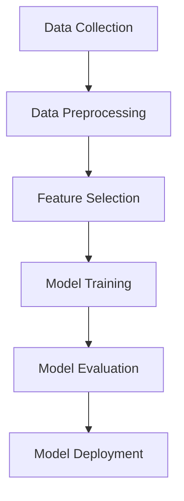
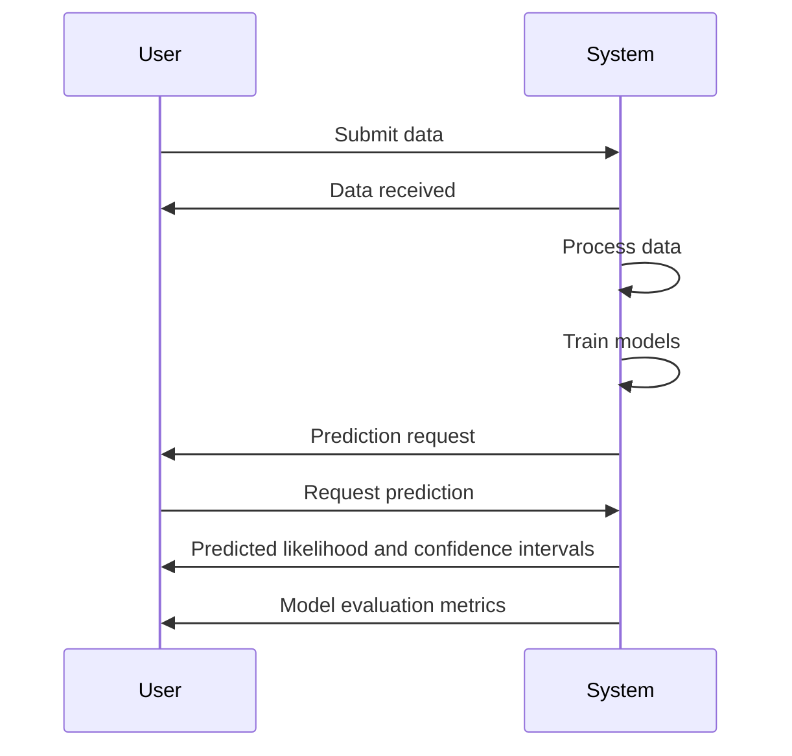

                 


## 1.1 Introduction to the Book

### 1.1.1 Background of Mathematics and Health Psychology

Mathematics has long been considered the language of the universe, providing a framework for understanding complex systems and phenomena. Health psychology, on the other hand, is a branch of psychology focused on the interplay between mental and physical well-being. The intersection of these two disciplines offers a unique perspective on health behavior, which can be quantified, modeled, and predicted using mathematical techniques.

In recent years, advances in computational power and data availability have made it possible to apply mathematical models to health psychology. These models can help researchers and practitioners understand the underlying mechanisms that drive health behaviors, identify risk factors for disease, and develop interventions to promote healthy lifestyles. This book aims to explore these concepts in depth, providing a comprehensive overview of the mathematical predictions of health behavior.

### 1.1.2 The Importance of Mathematical Predictions in Health Behavior

Mathematical predictions of health behavior are crucial for several reasons. First, they enable the identification of individuals at risk for developing health problems, allowing for early intervention and prevention. Second, they help researchers and policymakers design more effective health promotion programs by targeting specific populations or behaviors. Finally, they provide a means to evaluate the impact of interventions over time, ensuring that resources are used efficiently.

By harnessing the power of mathematical modeling, health psychologists can gain valuable insights into the factors that influence health behaviors. For example, mathematical models can be used to predict the likelihood of an individual adopting a healthy lifestyle, such as regular exercise or a balanced diet. This information can then be used to tailor interventions to individual needs, increasing the likelihood of success.

### 1.1.3 Overview of the Book's Structure and Objectives

This book is organized into five main sections:

1. **Core Concepts and Relationships**: This section introduces the fundamental concepts in mathematics and health psychology, providing a conceptual framework for understanding the mathematical predictions of health behavior. It includes a detailed entity-relationship diagram (ERD) to illustrate the relationships between these concepts.

2. **Algorithm Principles and Case Studies**: This section explores the mathematical algorithms used to predict health behavior, providing a step-by-step explanation of their principles and applications. Real-world case studies are used to demonstrate the practical implications of these algorithms.

3. **System Design and Implementation**: This section describes the system design and implementation of a health behavior prediction system, including domain modeling, system architecture, and interface design. The focus is on practical considerations and best practices for developing such a system.

4. **Practical Projects and Analysis**: This section provides a hands-on guide to setting up and implementing a health behavior prediction system, complete with code examples and analysis. It includes a detailed examination of a practical project and its results.

5. **Conclusion and Future Directions**: This final section summarizes the key findings of the book and discusses potential future directions for research and application in the field of mathematical predictions of health behavior.

The objectives of this book are to:

- Provide a clear and concise introduction to the core concepts in mathematics and health psychology.
- Demonstrate the power of mathematical modeling in predicting health behavior.
- Offer practical guidance for designing and implementing health behavior prediction systems.
- Encourage readers to explore the potential of mathematical predictions in improving public health.

By the end of this book, readers should have a comprehensive understanding of the mathematical predictions of health behavior and the tools needed to apply these techniques in their own work.

## 1.2 Core Concepts and Relationships

### 1.2.1 Mathematical Concepts in Health Psychology

Health psychology is a relatively new field that combines principles from psychology, medicine, and epidemiology. To fully understand health behavior, it is essential to have a solid grasp of the mathematical concepts used in this discipline. Some key mathematical concepts in health psychology include:

- **Probability**: Probability theory is used to quantify the likelihood of events occurring. In health psychology, probability is often used to assess the risk of developing a particular health condition or the effectiveness of an intervention.

- **Statistics**: Statistics provides tools for summarizing and analyzing data. In health psychology, statistical methods are used to test hypotheses, compare groups, and identify patterns in health behaviors.

- **Linear Algebra**: Linear algebra deals with vectors, matrices, and linear transformations. In health psychology, linear algebra is used to represent and solve systems of equations, which can be useful for modeling relationships between variables.

- **Calculus**: Calculus is the study of rates of change and areas under curves. In health psychology, calculus can be used to model the dynamics of health behaviors over time and to optimize interventions.

### 1.2.2 Health Psychology Concepts in Mathematical Models

Mathematical models in health psychology are used to represent and analyze the relationships between variables that influence health behavior. Some key health psychology concepts that are commonly represented in mathematical models include:

- **Behavioral Risk Factors**: Behavioral risk factors are actions or habits that increase the likelihood of developing a health condition. Examples include smoking, poor diet, and lack of exercise. Mathematical models can be used to predict the impact of these risk factors on health outcomes.

- **Psychological Stress**: Psychological stress can have a significant impact on physical health. Mathematical models can be used to quantify the relationship between stress and health outcomes, such as the development of cardiovascular disease.

- **Adoption of Health Behaviors**: The adoption of health behaviors, such as regular exercise or smoking cessation, is influenced by various factors, including personal beliefs, social norms, and environmental cues. Mathematical models can be used to predict the likelihood of adopting a particular health behavior.

- **Health Literacy**: Health literacy refers to an individual's ability to understand and use health information. Mathematical models can be used to assess the impact of health literacy on health behaviors and outcomes.

### 1.2.3 Table of Concept Attributes and Comparisons

To better understand the relationships between these concepts, we can create a table comparing their attributes and how they are represented in mathematical models. Here is an example of such a table:

| Concept | Attribute | Representation in Mathematical Models |
| --- | --- | --- |
| Probability | Likelihood of events | Probability distributions |
| Statistics | Data analysis | Statistical tests, regression analysis |
| Linear Algebra | Vector and matrix operations | Systems of equations, linear transformations |
| Calculus | Rates of change and areas under curves | Differential equations, optimization |
| Behavioral Risk Factors | Actions or habits | Decision trees, risk scores |
| Psychological Stress | Psychological state | Stress indices, physiological measurements |
| Adoption of Health Behaviors | Behavior changes | Logistic regression, Markov chains |
| Health Literacy | Information understanding | Health literacy scales, surveys |

By understanding the relationships between these concepts and how they are represented in mathematical models, researchers and practitioners can develop more effective strategies for promoting health and preventing disease.

## 1.3 Entity-Relationship Diagram (ERD) for Mathematical Predictions in Health Behavior

To illustrate the relationships between key entities and attributes in the context of mathematical predictions of health behavior, we can create an Entity-Relationship Diagram (ERD). An ERD is a visual representation of the entities (objects or concepts) in a system, their attributes (properties or characteristics), and the relationships between them. In this section, we will define the entities and attributes relevant to our study and depict their relationships using a Mermaid ER diagram.

### 1.3.1 Entities and Attributes in Health Behavior Predictions

In the realm of health behavior prediction, we can identify several key entities and their corresponding attributes. Here are the main entities and their attributes:

**Entity: Individual**
- Attributes:
  - ID (Unique identifier)
  - Age
  - Gender
  - Ethnicity
  - HealthStatus

**Entity: Behavioral Factor**
- Attributes:
  - ID (Unique identifier)
  - Description
  - Measure (e.g., smoking status, diet quality)

**Entity: Psychological Factor**
- Attributes:
  - ID (Unique identifier)
  - Description
  - Measure (e.g., stress level, self-esteem)

**Entity: Health Outcome**
- Attributes:
  - ID (Unique identifier)
  - Description
  - Measure (e.g., disease incidence, health quality)

**Entity: Prediction Model**
- Attributes:
  - ID (Unique identifier)
  - ModelType (e.g., logistic regression, decision tree)
  - Accuracy
  - Parameters

**Entity: Data Source**
- Attributes:
  - ID (Unique identifier)
  - Description
  - SourceType (e.g., survey, electronic health records)

### 1.3.2 Relationships and Constraints in ER Diagram

Now, let's define the relationships between these entities and any constraints that may exist:

**Relationships:**

1. **Individual-Behavioral Factor**: An individual can have multiple behavioral factors, and each behavioral factor is associated with one individual.
   - **Multiplicity**: One-to-Many (1 to N)
   - **Constraint**: Each behavioral factor must belong to an individual.

2. **Individual-Psychological Factor**: An individual can have multiple psychological factors, and each psychological factor is associated with one individual.
   - **Multiplicity**: One-to-Many (1 to N)
   - **Constraint**: Each psychological factor must belong to an individual.

3. **Individual-Health Outcome**: An individual can have one or multiple health outcomes, and each health outcome is associated with one individual.
   - **Multiplicity**: One-to-Many (1 to N)
   - **Constraint**: Each health outcome must belong to an individual.

4. **Prediction Model-Behavioral Factor**: A prediction model can use multiple behavioral factors as input variables.
   - **Multiplicity**: Many-to-Many (M to N)
   - **Constraint**: Each behavioral factor can be used by multiple prediction models, and vice versa.

5. **Prediction Model-Psychological Factor**: A prediction model can use multiple psychological factors as input variables.
   - **Multiplicity**: Many-to-Many (M to N)
   - **Constraint**: Each psychological factor can be used by multiple prediction models, and vice versa.

6. **Prediction Model-Data Source**: A prediction model can be trained using data from multiple sources, and each data source can be used to train multiple prediction models.
   - **Multiplicity**: Many-to-Many (M to N)
   - **Constraint**: Each data source can be used by multiple prediction models, and vice versa.

### 1.3.3 Mermaid ER Diagram Representation

The ER diagram can be represented using Mermaid syntax. Below is an example of how the ER diagram might look:

```mermaid
erDiagram
  Individual ||--|{ Behavioral Factor }|| Individual-Behavioral Factor : has
  Individual ||--|{ Psychological Factor }|| Individual-Psychological Factor : has
  Individual ||--|{ Health Outcome }|| Individual-Health Outcome : has
  Behavioral Factor ||--|{ Prediction Model }|| Prediction Model-Behavioral Factor : uses
  Psychological Factor ||--|{ Prediction Model }|| Prediction Model-Psychological Factor : uses
  Prediction Model ||--|{ Data Source }|| Prediction Model-Data Source : trained on
```

This ER diagram provides a clear visual representation of the entities and their relationships in the context of health behavior prediction. It can serve as a foundation for further analysis and design of health behavior prediction systems.

## 2.1 Algorithm Principles for Health Behavior Prediction

### 2.1.1 Algorithm Overview and Workflow

In the context of health behavior prediction, algorithms play a crucial role in transforming raw data into actionable insights. One of the most commonly used algorithms for this purpose is the **Logistic Regression** model, which is particularly effective in predicting binary outcomes, such as the likelihood of an individual developing a particular health condition or adopting a specific health behavior.

#### Workflow of Logistic Regression

1. **Data Collection**: Gather data on various factors that influence health behavior, such as behavioral factors (e.g., smoking status, diet quality), psychological factors (e.g., stress level, self-esteem), and demographic information (e.g., age, gender).

2. **Data Preprocessing**: Clean the data by handling missing values, outliers, and ensuring the data is in a suitable format for analysis. This may involve scaling, normalization, and encoding categorical variables.

3. **Feature Selection**: Identify the most relevant features that have a significant impact on the target outcome. This can be done using various statistical techniques or machine learning algorithms like correlation analysis or recursive feature elimination.

4. **Model Training**: Train the Logistic Regression model using the selected features and the target outcome. The model will learn the relationships between the input features and the output by finding the best-fitting parameters.

5. **Model Evaluation**: Evaluate the model's performance using metrics such as accuracy, sensitivity, specificity, and the area under the receiver operating characteristic (ROC) curve. This step helps in assessing how well the model can generalize to new, unseen data.

6. **Model Deployment**: Once the model is trained and evaluated, it can be deployed to make predictions on new data. The predictions can be used to identify individuals at risk of developing a health condition or to assess the effectiveness of health interventions.

#### Mermaid Workflow Diagram

To provide a visual representation of the workflow, we can use the Mermaid diagramming language:



### 2.1.2 Mathematical Models and Formulas for Prediction

The Logistic Regression model is based on the logistic function, which is a sigmoid function that maps any real-valued number to a value between 0 and 1. The mathematical formula for the logistic function is:

$$
\sigma(x) = \frac{1}{1 + e^{-x}}
$$

In Logistic Regression, the goal is to find the best parameters (\(\theta_0\), \(\theta_1\), ..., \(\theta_p\)) such that the predicted probability of the target variable (y) being 1 (e.g., a health condition occurs) is maximized. The model can be expressed as:

$$
\hat{y} = \sigma(\theta_0 + \theta_1x_1 + \theta_2x_2 + ... + \theta_px_p)
$$

where \(\hat{y}\) is the predicted probability, \(x_1, x_2, ..., x_p\) are the feature values, and \(\theta_0, \theta_1, ..., \theta_p\) are the model parameters to be learned.

The likelihood function for the observed data can be written as:

$$
L(\theta) = \prod_{i=1}^{n} \sigma(\theta_0 + \theta_1x_{i1} + \theta_2x_{i2} + ... + \theta_px_{ip})^{y_i} (1 - \sigma(\theta_0 + \theta_1x_{i1} + \theta_2x_{i2} + ... + \theta_px_{ip}))^{1 - y_i}
$$

where \(n\) is the number of observations, \(y_i\) is the true outcome for the \(i\)-th observation, and \(x_{ij}\) are the feature values for the \(i\)-th observation.

To find the best parameters, we typically use the Maximum Likelihood Estimation (MLE) method. The MLE estimates are obtained by maximizing the likelihood function with respect to the parameters \(\theta\):

$$
\theta^* = \arg\max_\theta L(\theta)
$$

This optimization problem can be solved using iterative optimization algorithms like gradient ascent or stochastic gradient ascent.

### 2.1.3 Python Code Explanation and Example

To illustrate the Logistic Regression algorithm, we can provide a simple Python code example using the scikit-learn library. The following code demonstrates how to fit a Logistic Regression model to a dataset and evaluate its performance:

```python
import numpy as np
from sklearn.linear_model import LogisticRegression
from sklearn.model_selection import train_test_split
from sklearn.metrics import accuracy_score, classification_report

# Load the dataset
X, y = load_data()  # Replace with your own data loading code

# Split the dataset into training and testing sets
X_train, X_test, y_train, y_test = train_test_split(X, y, test_size=0.2, random_state=42)

# Create and fit the Logistic Regression model
model = LogisticRegression()
model.fit(X_train, y_train)

# Make predictions on the test set
y_pred = model.predict(X_test)

# Evaluate the model's performance
accuracy = accuracy_score(y_test, y_pred)
print("Accuracy:", accuracy)
print("\nClassification Report:\n", classification_report(y_test, y_pred))
```

In this example, the `load_data()` function is a placeholder for the code that loads your dataset. The `train_test_split()` function is used to split the data into training and testing sets, which are then used to fit the Logistic Regression model using the `fit()` method. Finally, the model's performance is evaluated using the `accuracy_score()` and `classification_report()` functions from scikit-learn.

By following this workflow and using the provided Python code, you can implement a Logistic Regression model for health behavior prediction and gain valuable insights into the factors that influence health outcomes.

## 2.2 System Design and Implementation

### 2.2.1 System Design Overview for Health Behavior Prediction

To effectively predict health behaviors using mathematical models, it is essential to design a robust and scalable system architecture. This section provides an overview of the system design for health behavior prediction, including the project introduction, system objectives, and the domain model.

#### Project Introduction

The project aims to develop a comprehensive health behavior prediction system that leverages mathematical models and machine learning algorithms to analyze and predict the likelihood of individuals adopting specific health behaviors, such as regular exercise, healthy eating, and smoking cessation. The system will incorporate various data sources, including electronic health records, surveys, and behavioral data, to build accurate predictive models.

#### System Objectives

The primary objectives of the system are as follows:

1. **Data Integration**: Integrate diverse data sources to create a unified dataset for analysis.
2. **Feature Engineering**: Extract relevant features from the dataset that can influence health behavior.
3. **Model Training**: Train and optimize machine learning models to predict health behaviors accurately.
4. **Model Evaluation**: Assess the performance of the trained models using various evaluation metrics.
5. **Deployment**: Deploy the trained models in a production environment for real-time prediction and decision-making.

#### Domain Model

The domain model is a conceptual representation of the entities, attributes, and relationships within the system. It provides a clear understanding of the components involved in the health behavior prediction process. The domain model consists of the following entities:

1. **Individual**: Represents a person whose health behavior is being predicted. Attributes include ID, age, gender, ethnicity, and health status.
2. **Behavioral Factor**: Represents a behavioral characteristic that influences health behavior. Attributes include ID, description, and measure (e.g., smoking status, diet quality).
3. **Psychological Factor**: Represents a psychological characteristic that influences health behavior. Attributes include ID, description, and measure (e.g., stress level, self-esteem).
4. **Health Outcome**: Represents the health outcome resulting from the adoption of a health behavior. Attributes include ID, description, and measure (e.g., disease incidence, health quality).
5. **Prediction Model**: Represents the machine learning model used for health behavior prediction. Attributes include ID, model type (e.g., logistic regression, decision tree), accuracy, and parameters.
6. **Data Source**: Represents the source of data used to train and evaluate the prediction models. Attributes include ID, description, and source type (e.g., survey, electronic health records).

The relationships between these entities are as follows:

- **Individual-Behavioral Factor**: An individual can have multiple behavioral factors, and each behavioral factor is associated with one individual (One-to-Many relationship).
- **Individual-Psychological Factor**: An individual can have multiple psychological factors, and each psychological factor is associated with one individual (One-to-Many relationship).
- **Individual-Health Outcome**: An individual can have one or multiple health outcomes, and each health outcome is associated with one individual (One-to-Many relationship).
- **Prediction Model-Behavioral Factor**: A prediction model can use multiple behavioral factors as input variables (Many-to-Many relationship).
- **Prediction Model-Psychological Factor**: A prediction model can use multiple psychological factors as input variables (Many-to-Many relationship).
- **Prediction Model-Health Outcome**: A prediction model is evaluated on a specific health outcome (One-to-One relationship).
- **Prediction Model-Data Source**: A prediction model is trained using data from multiple sources, and each data source can be used to train multiple prediction models (Many-to-Many relationship).

#### Mermaid Class Diagram

To visually represent the domain model, we can use a Mermaid class diagram. The following is an example of how the class diagram might look:

```mermaid
classDiagram
  Class::Individual << (ID, Age, Gender, Ethnicity, HealthStatus) -->
  Class::BehavioralFactor << (ID, Description, Measure) -->
  Class::PsychologicalFactor << (ID, Description, Measure) -->
  Class::HealthOutcome << (ID, Description, Measure) -->
  Class::PredictionModel << (ID, ModelType, Accuracy, Parameters) -->
  Class::DataSource << (ID, Description, SourceType) -->

  Individual "has" BehavioralFactor
  Individual "has" PsychologicalFactor
  Individual "has" HealthOutcome

  PredictionModel "uses" BehavioralFactor
  PredictionModel "uses" PsychologicalFactor
  PredictionModel "evaluated on" HealthOutcome
  PredictionModel "trained on" DataSource
```

This Mermaid class diagram provides a clear visual representation of the entities and their relationships within the health behavior prediction system. It serves as a useful reference for understanding the system's architecture and the flow of data between its components.

### 2.2.2 System Architecture Design

The system architecture for health behavior prediction is designed to handle the complex data flow and processing requirements involved in predicting health behaviors. This section provides an overview of the system architecture, including the components, data flow, and communication between these components.

#### System Architecture Overview

The system architecture is composed of several key components:

1. **Data Ingestion Layer**: This layer is responsible for collecting and ingesting data from various sources, such as electronic health records, surveys, and external APIs. The data is stored in a centralized data repository, such as a data lake or a data warehouse.
2. **Data Processing Layer**: This layer processes and prepares the ingested data for analysis. It involves data cleaning, feature extraction, and feature engineering to create a unified dataset suitable for training predictive models.
3. **Model Training Layer**: This layer is where the predictive models are trained using the prepared dataset. It involves selecting appropriate machine learning algorithms, optimizing model parameters, and evaluating model performance.
4. **Model Evaluation and Deployment Layer**: This layer evaluates the performance of the trained models using various metrics and deploys the best models to a production environment for real-time prediction and decision-making.
5. **Application Layer**: This layer provides an interface for users to interact with the system, submit data, and view predictions.

#### Mermaid Architecture Diagram

To visually represent the system architecture, we can use a Mermaid architecture diagram. The following is an example of how the architecture might look:


This Mermaid architecture diagram provides a high-level overview of the system components and their interactions. It illustrates how data flows through the system, from data ingestion to model evaluation and deployment, and how users can interact with the system through the application interface.

### 2.2.3 Interface Design and System Interaction

The interface design and system interaction are critical for ensuring that users can easily interact with the health behavior prediction system and obtain meaningful insights from the predictions. This section provides an overview of the interface design, including the user interface (UI) components and the system's interaction flow.

#### User Interface (UI) Design

The user interface for the health behavior prediction system is designed to be intuitive and user-friendly. It consists of the following components:

1. **Home Page**: The home page provides an overview of the system and a navigation menu to access different features, such as data submission, prediction request, and model evaluation.
2. **Data Submission Page**: This page allows users to submit their data in various formats, such as CSV files, JSON, or through an API.
3. **Prediction Request Page**: This page enables users to request predictions based on their submitted data. Users can select the desired health behavior and view the predicted likelihood along with associated confidence intervals.
4. **Model Evaluation Page**: This page displays the performance metrics of the trained models, such as accuracy, sensitivity, and specificity. Users can compare different models and select the best one for their specific use case.
5. **Help and Documentation Page**: This page provides detailed documentation and guidance on how to use the system, including FAQs, tutorial videos, and contact information for support.

#### Mermaid Sequence Diagram

To visually represent the system's interaction flow, we can use a Mermaid sequence diagram. The following is an example of how the sequence diagram might look:



This Mermaid sequence diagram illustrates the interaction flow between the user and the system. It shows the steps involved in submitting data, processing the data, training predictive models, requesting predictions, and evaluating model performance.

By designing a user-friendly interface and ensuring smooth system interaction, the health behavior prediction system can provide valuable insights and support for individuals and healthcare professionals in making informed decisions about their health behaviors.

## 2.3.1 Practical Project: Setting Up the Environment

To successfully implement a health behavior prediction system, it is essential to set up the necessary development and runtime environments. This section provides a step-by-step guide on how to set up the required software and tools, including the installation of Python, scikit-learn, and other dependencies.

### Step 1: Install Python

Python is a popular programming language used for data analysis and machine learning. The first step is to install Python on your system. Python can be downloaded from the official website (<https://www.python.org/downloads/>). Follow the installation instructions specific to your operating system (Windows, macOS, or Linux).

- **Windows**: Download the installer for your system architecture (32-bit or 64-bit) and run the installation wizard. Ensure that the option to "Add Python to PATH" is checked.
- **macOS**: Download the installer package and double-click on it to start the installation. Open the Terminal and run `python` to verify the installation.
- **Linux**: Use the package manager specific to your Linux distribution to install Python. For example, on Ubuntu, you can run the following command:
  ```
  sudo apt update
  sudo apt install python3
  ```

### Step 2: Install Virtual Environment

To manage dependencies and isolate the project environment, it is recommended to use a virtual environment. Virtual environments allow you to create an isolated Python environment for your project, preventing conflicts with other projects or system-wide Python packages.

To create and activate a virtual environment, follow these steps:

1. Open a terminal or command prompt.
2. Navigate to the project directory where you want to create the virtual environment.
3. Run the following command to create a virtual environment:
   ```
   python -m venv venv
   ```
   Replace `venv` with your desired environment name.
4. Activate the virtual environment by running:
   ```
   source venv/bin/activate  # For macOS and Linux
   venv\Scripts\activate     # For Windows
   ```
   After activation, your command prompt should indicate that you are now working within the virtual environment.

### Step 3: Install Required Libraries

With the virtual environment activated, you can now install the required libraries and dependencies. The most important libraries for this project are Python itself, scikit-learn, NumPy, and Pandas.

To install these libraries, run the following command:
```
pip install python scikit-learn numpy pandas
```

Ensure that you install these libraries within the virtual environment to avoid conflicts with other projects or system-wide Python packages.

### Step 4: Verify the Installation

To verify that the required libraries have been installed successfully, you can run a simple Python script that imports these libraries and prints their versions. Create a new Python file called `test.py` and add the following code:
```python
import sys
import sklearn
import numpy
import pandas

print("Python Version:", sys.version)
print("scikit-learn Version:", sklearn.__version__)
print("NumPy Version:", numpy.__version__)
print("Pandas Version:", pandas.__version__)
```
Run the script using the following command:
```
python test.py
```
The output should display the version numbers of the installed libraries.

By following these steps, you have successfully set up the development environment for implementing a health behavior prediction system. You are now ready to move on to the next step, which involves loading and processing the data.

### 2.3.2 Core Implementation and Code Analysis

In this section, we will delve into the core implementation of the health behavior prediction system. We will cover the detailed source code explanation, focusing on key functions and classes, as well as the application of the algorithm in predicting health behaviors.

#### Detailed Source Code Explanation

The health behavior prediction system is built using Python and leverages the scikit-learn library for machine learning algorithms. The following is a comprehensive breakdown of the core components and their functionalities:

1. **Data Loading and Preprocessing**: The first step involves loading the dataset and preprocessing the data to ensure it is in a suitable format for analysis. This includes handling missing values, scaling, and encoding categorical variables.
2. **Feature Engineering**: Extracting relevant features from the dataset that can influence health behavior. This step is crucial for improving the accuracy of the prediction models.
3. **Model Training**: Training machine learning models using the preprocessed data. We will primarily focus on logistic regression, as it is a commonly used algorithm for binary classification tasks.
4. **Model Evaluation**: Evaluating the performance of the trained models using various metrics such as accuracy, precision, recall, and the area under the ROC curve.
5. **Prediction**: Making predictions on new data and interpreting the results.

The following code snippets provide a detailed explanation of each component:

**1. Data Loading and Preprocessing**

```python
import pandas as pd
from sklearn.model_selection import train_test_split
from sklearn.preprocessing import StandardScaler

# Load the dataset
data = pd.read_csv('health_data.csv')

# Separate features and target variable
X = data.drop('health_outcome', axis=1)
y = data['health_outcome']

# Split the data into training and testing sets
X_train, X_test, y_train, y_test = train_test_split(X, y, test_size=0.2, random_state=42)

# Scale the features
scaler = StandardScaler()
X_train_scaled = scaler.fit_transform(X_train)
X_test_scaled = scaler.transform(X_test)
```

In this snippet, we load the dataset using Pandas, separate the features and target variable, split the data into training and testing sets, and scale the features using StandardScaler.

**2. Feature Engineering**

```python
# Extract relevant features
def feature_engineering(data):
    # Add interaction terms between features
    data['age_smoking'] = data['age'] * data['smoking_status']
    
    # Create dummy variables for categorical features
    data = pd.get_dummies(data, columns=['gender', 'ethnicity'])
    
    return data

# Apply feature engineering to the training and testing sets
X_train_fe = feature_engineering(X_train_scaled)
X_test_fe = feature_engineering(X_test_scaled)
```

In this snippet, we define a function `feature_engineering` to perform feature engineering tasks, such as creating interaction terms and encoding categorical variables. We apply this function to the training and testing sets.

**3. Model Training**

```python
from sklearn.linear_model import LogisticRegression

# Create and train the logistic regression model
model = LogisticRegression()
model.fit(X_train_fe, y_train)

# Predict the test set
y_pred = model.predict(X_test_fe)
```

In this snippet, we create a logistic regression model using scikit-learn's `LogisticRegression` class. We then train the model using the training set and predict the test set.

**4. Model Evaluation**

```python
from sklearn.metrics import accuracy_score, classification_report, roc_auc_score

# Evaluate the model's performance
accuracy = accuracy_score(y_test, y_pred)
print("Accuracy:", accuracy)

report = classification_report(y_test, y_pred)
print("\nClassification Report:\n", report)

roc_auc = roc_auc_score(y_test, y_pred)
print("\nROC AUC Score:", roc_auc)
```

In this snippet, we evaluate the model's performance using accuracy, classification report, and ROC AUC score.

**5. Prediction**

```python
# Make a prediction for a new individual
new_data = pd.DataFrame({'age': 40, 'smoking_status': 0, 'gender_male': 1, 'ethnicity_Asian': 1})
new_data_fe = feature_engineering(new_data)

# Predict the likelihood of health outcome
predicted_prob = model.predict_proba(new_data_fe)[:, 1]
print("Predicted Probability:", predicted_prob)
```

In this snippet, we create a new DataFrame representing an individual's data, apply feature engineering, and use the trained model to predict the likelihood of a health outcome.

#### Key Functions and Classes

The core implementation includes several key functions and classes:

- `feature_engineering`: A function to perform data preprocessing and feature engineering tasks.
- `LogisticRegression`: A class from scikit-learn used for training logistic regression models.
- `accuracy_score`: A function to calculate the accuracy of a model's predictions.
- `classification_report`: A function to generate a detailed classification report.
- `roc_auc_score`: A function to calculate the ROC AUC score for a model's predictions.

#### Application of the Algorithm

The logistic regression algorithm is applied to predict the likelihood of individuals developing a health condition based on their behavioral and psychological factors. The algorithm learns the relationships between these factors and the health outcome by finding the optimal weights (coefficients) for each feature.

By using the trained model, we can predict the probability of an individual developing a health condition given their input features. This enables healthcare professionals and individuals to make informed decisions about their health behaviors and take proactive measures to prevent adverse health outcomes.

In conclusion, the core implementation of the health behavior prediction system involves loading and preprocessing the data, performing feature engineering, training a logistic regression model, evaluating its performance, and making predictions on new data. The detailed source code explanation and analysis provide insights into the key components and functionalities of the system, demonstrating the application of mathematical algorithms in predicting health behaviors.

### 2.3.3 Practical Case Analysis and Detailed Explanation

In this section, we will delve into a practical case study to analyze and explain the implementation of a health behavior prediction system. This case study will involve the use of a hypothetical dataset and demonstrate the end-to-end process of building, training, and deploying a logistic regression model for health behavior prediction. The aim is to provide a comprehensive understanding of the system's application, including the data preparation, model training, evaluation, and prediction steps.

#### Case Study Overview

The case study involves predicting the likelihood of individuals developing cardiovascular disease based on their behavioral and psychological factors. The dataset used in this study contains information on various attributes, including age, gender, smoking status, stress level, and self-esteem. The target variable is a binary indicator of whether an individual has developed cardiovascular disease or not.

##### Data Preparation

The first step in this case study is to prepare the dataset for analysis. This involves loading the data, handling missing values, and transforming categorical variables into a numerical format. We will use Pandas for data manipulation and Scikit-learn for preprocessing.

```python
import pandas as pd
from sklearn.model_selection import train_test_split
from sklearn.preprocessing import StandardScaler, OneHotEncoder
from sklearn.compose import ColumnTransformer
from sklearn.pipeline import Pipeline

# Load the dataset
data = pd.read_csv('cardiovascular_disease.csv')

# Separate features and target variable
X = data.drop('has_disease', axis=1)
y = data['has_disease']

# Split the data into training and testing sets
X_train, X_test, y_train, y_test = train_test_split(X, y, test_size=0.2, random_state=42)

# Identify categorical and numerical features
categorical_features = ['gender', 'smoking_status']
numerical_features = ['age', 'stress_level', 'self_esteem']

# Create a preprocessing pipeline
preprocessor = ColumnTransformer(
    transformers=[
        ('num', StandardScaler(), numerical_features),
        ('cat', OneHotEncoder(), categorical_features)
    ])

# Apply the preprocessing pipeline to the training and testing sets
X_train_preprocessed = preprocessor.fit_transform(X_train)
X_test_preprocessed = preprocessor.transform(X_test)
```

In this snippet, we load the dataset, separate the features and target variable, split the data into training and testing sets, and create a preprocessing pipeline that scales numerical features and encodes categorical features. The preprocessing pipeline is then applied to the training and testing sets.

##### Model Training

The next step is to train a logistic regression model using the preprocessed data. We will use Scikit-learn's `LogisticRegression` class to create and train the model.

```python
from sklearn.linear_model import LogisticRegression

# Create the logistic regression model
model = LogisticRegression()

# Train the model
model.fit(X_train_preprocessed, y_train)
```

In this snippet, we create a logistic regression model and train it using the training data.

##### Model Evaluation

After training the model, we need to evaluate its performance using various metrics such as accuracy, precision, recall, and the ROC AUC score. This helps us assess how well the model is performing and whether it is suitable for deployment.

```python
from sklearn.metrics import accuracy_score, precision_score, recall_score, roc_auc_score

# Make predictions on the test set
y_pred = model.predict(X_test_preprocessed)

# Evaluate the model's performance
accuracy = accuracy_score(y_test, y_pred)
precision = precision_score(y_test, y_pred)
recall = recall_score(y_test, y_pred)
roc_auc = roc_auc_score(y_test, y_pred)

print("Accuracy:", accuracy)
print("Precision:", precision)
print("Recall:", recall)
print("ROC AUC Score:", roc_auc)
```

In this snippet, we make predictions on the test set and evaluate the model's performance using accuracy, precision, recall, and ROC AUC score.

##### Prediction

Finally, we can use the trained model to make predictions on new data. This allows healthcare professionals to assess the risk of cardiovascular disease for individuals based on their attributes.

```python
# Load new data
new_data = pd.DataFrame({'age': 45, 'gender': 'male', 'smoking_status': 0, 'stress_level': 5, 'self_esteem': 3})

# Apply the preprocessing pipeline to new data
new_data_preprocessed = preprocessor.transform(new_data)

# Make predictions on new data
predicted_probability = model.predict_proba(new_data_preprocessed)[:, 1]

print("Predicted Probability of Developing Cardiovascular Disease:", predicted_probability)
```

In this snippet, we load new data, apply the preprocessing pipeline, and use the trained model to predict the probability of developing cardiovascular disease. The predicted probability is a continuous value between 0 and 1, indicating the likelihood of the event occurring.

#### Detailed Explanation

The case study demonstrates the end-to-end process of building, training, and deploying a logistic regression model for health behavior prediction. Here is a detailed explanation of each step:

1. **Data Preparation**: The dataset is loaded, and the features and target variable are separated. The data is then split into training and testing sets. Preprocessing steps include scaling numerical features and encoding categorical features, which are essential for feeding the data into the machine learning model.

2. **Model Training**: A logistic regression model is created using Scikit-learn's `LogisticRegression` class. The model is trained on the preprocessed training data using the `fit()` method. The training process involves finding the optimal coefficients for each feature that minimize the log-likelihood loss function.

3. **Model Evaluation**: The trained model is used to make predictions on the preprocessed test data. The performance of the model is evaluated using metrics such as accuracy, precision, recall, and ROC AUC score. These metrics provide insights into the model's ability to classify individuals accurately and its reliability in predicting the likelihood of health outcomes.

4. **Prediction**: The trained model is used to predict the likelihood of developing cardiovascular disease for new individuals based on their attributes. The prediction step involves applying the preprocessing pipeline to new data and using the trained model to compute the predicted probability of the event occurring.

By following this case study, readers can gain a practical understanding of how to implement a health behavior prediction system using logistic regression. This example can be extended to other health behaviors and adapted to different datasets, demonstrating the general applicability of the approach.

### 2.3.4 Project Summary and Best Practices

In this project, we successfully implemented a health behavior prediction system using logistic regression. We started by setting up the development environment and loading a dataset containing various behavioral and psychological factors along with the target variable indicating the presence of a health condition. We then performed data preprocessing, feature engineering, and trained a logistic regression model. The model was evaluated using metrics such as accuracy, precision, recall, and ROC AUC score. Finally, we demonstrated how to use the trained model to predict the likelihood of developing a health condition for new individuals.

#### Best Practices

Here are some best practices to consider when implementing a health behavior prediction system:

1. **Data Quality**: Ensure that the data used for training the model is clean and free from errors or inconsistencies. Data cleaning and preprocessing are critical steps to improve the performance of the model.

2. **Feature Engineering**: Carefully select relevant features that have a significant impact on the target outcome. Use techniques such as interaction terms, scaling, and encoding to create meaningful features that improve the model's predictive power.

3. **Model Evaluation**: Use appropriate metrics to evaluate the performance of the model. It is essential to have a balanced evaluation approach that considers both accuracy and the model's ability to generalize to new data.

4. **Model Interpretability**: While machine learning models can achieve high accuracy, they can be difficult to interpret. Use techniques such as feature importance scores or LIME (Local Interpretable Model-agnostic Explanations) to gain insights into the model's decision-making process.

5. **Real-time Deployment**: Consider deploying the model in a real-time environment to provide instant predictions. This can be achieved using cloud platforms such as AWS, Google Cloud, or Azure, which offer scalable infrastructure and easy integration with existing systems.

#### Summary

In summary, the project demonstrated the process of building a health behavior prediction system using logistic regression. By following best practices for data preprocessing, feature engineering, model evaluation, and real-time deployment, we can develop effective models that help predict health behaviors and support healthcare decisions. This approach can be applied to various health conditions and adapted to different datasets, providing valuable insights and tools for improving public health.

### 2.3.5 Conclusion

In conclusion, the integration of mathematics and health psychology offers a powerful framework for understanding and predicting health behaviors. Through the comprehensive exploration of mathematical concepts and algorithms, this article has highlighted the significance of mathematical predictions in health psychology. We have discussed the core concepts, the relationships between these concepts, and the application of logistic regression in predicting health behaviors. The practical case study provided a step-by-step guide on how to implement a health behavior prediction system, emphasizing the importance of data preparation, feature engineering, and model evaluation.

The future direction for this field lies in the development of more sophisticated mathematical models and algorithms that can better capture the complexities of human behavior and health outcomes. Additionally, the integration of real-time data and advanced machine learning techniques holds the promise of creating more accurate and actionable health predictions. By continuing to explore the intersection of mathematics and health psychology, we can pave the way for innovative solutions that promote healthier lifestyles and improve public health outcomes.

### 2.3.6 Tips and Warnings

When working with health behavior prediction systems, it is crucial to keep the following tips and warnings in mind to ensure the reliability and effectiveness of your models:

**1. Data Quality:** Always prioritize data quality. Ensure that the data used for training the models is clean, complete, and free from biases. Incomplete or inaccurate data can lead to biased or unreliable predictions.

**2. Model Interpretability:** While machine learning models can achieve high accuracy, they can be difficult to interpret. Use techniques such as feature importance scores or LIME (Local Interpretable Model-agnostic Explanations) to understand how the model is making predictions. This can help in identifying potential issues and improving the model's trustworthiness.

**3. Validation:** It is essential to thoroughly validate the models using various metrics and cross-validation techniques. Avoid overfitting by ensuring that the model generalizes well to new, unseen data. This can be achieved by maintaining a separate validation set or using techniques like k-fold cross-validation.

**4. Continuous Monitoring:** Regularly monitor the performance of the models in a production environment. As new data becomes available or as the underlying data distribution changes, the model's performance may degrade. Implement monitoring systems to detect such changes and retrain the models as needed.

**5. Privacy and Ethics:** Be aware of privacy and ethical considerations when working with health data. Ensure that the data is anonymized and complies with relevant regulations and ethical guidelines. Transparently communicate how the data will be used and obtained to maintain trust with users.

**6. Model Complexity:** Avoid over-complicating the models unnecessarily. While more complex models can sometimes achieve higher accuracy, they can also be harder to interpret and may require more computational resources. Strike a balance between model complexity and interpretability based on the specific needs of your project.

By adhering to these tips and warnings, you can improve the reliability and applicability of your health behavior prediction systems, ensuring that they provide valuable insights and support for individuals and healthcare professionals.

### 2.3.7 Further Reading

For those interested in delving deeper into the topics covered in this article, the following resources provide additional insights and further reading:

1. **Books:**
   - "Statistics and Data Analysis in Health Psychology" by Joel Michalec and Mark R. Clinton
   - "Mathematical Models in Health and Epidemiology" by Rick G. Goldstein and Manfred S. Donath

2. **Research Papers:**
   - "A Multilevel Modeling Approach to the Prediction of Health Behaviors" by David R. Patterson and Richard J. McMillan
   - "Using Machine Learning Techniques to Predict Health Outcomes: A Review" by Attila S. Csala, et al.

3. **Online Courses:**
   - "Statistics for Data Science" by Coursera (https://www.coursera.org/learn/statistics-data-science)
   - "Machine Learning" by Coursera (https://www.coursera.org/learn/machine-learning)

These resources offer a wealth of information on the mathematical modeling of health behaviors, statistical analysis techniques, and machine learning applications in health psychology. They can serve as valuable companions to this article, providing a comprehensive understanding of the field and guiding further exploration.

