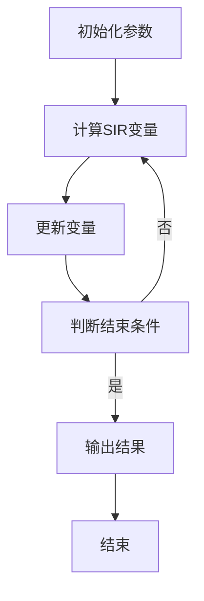
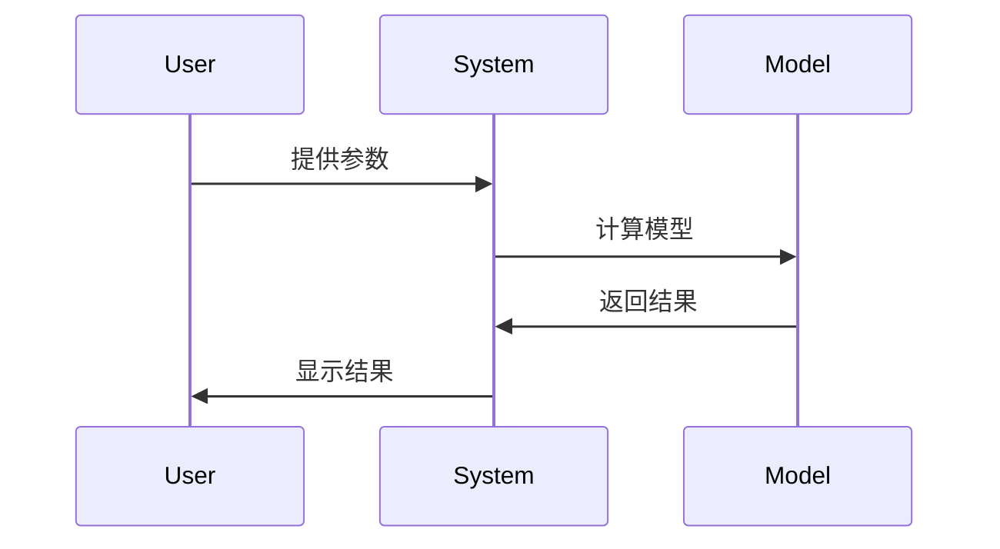
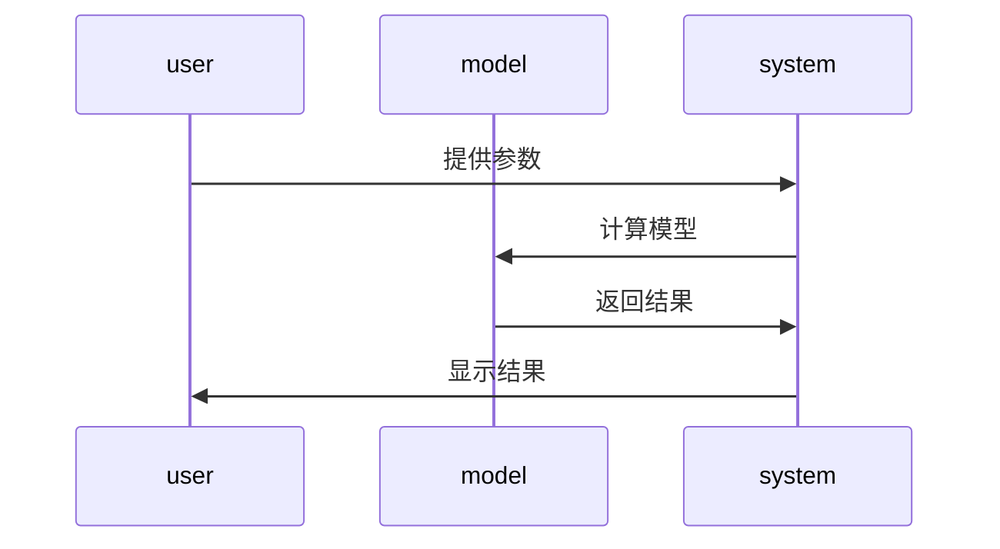

                 

# 数学与公共卫生：疾病传播的数学模型

## 关键词
- 数学模型
- 疾病传播
- 公共卫生
- SIR模型
- 公式推导
- 系统分析与架构设计

## 摘要
本文深入探讨了数学模型在公共卫生领域中的应用，特别是疾病传播模型的构建与解析。通过一步步的分析与推理，本文揭示了疾病传播的数学原理，并展示了如何利用这些模型来预测和控制疾病爆发。文章包括对核心概念、算法原理、数学公式、系统架构和项目实战的详细讲解，为读者提供了全面的指导。

## 引言

### 书籍主题与目的
本篇文章旨在向读者介绍数学模型在公共卫生领域的应用，特别是用于分析和预测疾病传播的模型。我们希望通过这篇技术博客，使读者了解疾病传播模型的基本原理，掌握构建和使用这些模型的方法，以及如何将这些模型应用于实际公共卫生问题的解决。

### 读者对象
本文适合对数学和计算机科学感兴趣的读者，无论是研究者、公共卫生专家，还是对这一领域有一定了解的技术人员，都可以通过本文获得宝贵的知识和经验。

### 数学模型在公共卫生中的重要性
在公共卫生领域，数学模型是一种强大的工具，可以帮助我们理解和预测疾病的传播。例如，通过构建传染病模型，我们可以模拟疾病的传播过程，评估控制措施的 effectiveness，并为公共卫生决策提供科学依据。数学模型不仅在疫情预测方面发挥着重要作用，还在疫苗接种策略、疫情应急响应等方面有着广泛的应用。

## 第1章：核心概念与联系

### 1.1 传染病模型概述

#### 1.1.1 基本组成部分
传染病模型通常包括以下几个基本组成部分：

- **易感者（Susceptible, S）**：指那些尚未感染疾病但有可能被感染的人群。
- **感染者（Infected, I）**：指已经感染疾病且具有传染性的人群。
- **康复者（Recovered, R）**：指已经康复且不再具有传染性的人群。

#### 1.1.2 模型参数及其含义
传染病模型的参数通常包括以下几种：

- **传染率（Transmission rate, β）**：指单位时间内感染者传染给易感者的平均数量。
- **恢复率（Recovery rate, μ）**：指单位时间内感染者康复的比例。

### 1.2 模型属性特征对比

#### 1.2.1 SIR模型
SIR模型是最常见的传染病模型之一，它基于以下微分方程：

$$
\frac{dS}{dt} = -\beta \cdot S \cdot I
$$

$$
\frac{dI}{dt} = \beta \cdot S \cdot I - \mu \cdot I
$$

$$
\frac{dR}{dt} = \mu \cdot I
$$

#### 1.2.2 SIRS模型
SIRS模型在SIR模型的基础上增加了再次感染的可能性，其微分方程如下：

$$
\frac{dS}{dt} = \mu \cdot R - \beta \cdot S \cdot I
$$

$$
\frac{dI}{dt} = \beta \cdot S \cdot I - \mu \cdot I - \gamma \cdot I
$$

$$
\frac{dR}{dt} = \mu \cdot I + \gamma \cdot I - \beta \cdot S \cdot I
$$

#### 1.2.3 其他常见模型
除了SIR和SIRS模型，还有许多其他传染病模型，如SEIR模型、SIRSAS模型等。这些模型在参数设置和方程形式上有所不同，但核心思想都是基于传染率、恢复率和感染者的传播能力。

## 第2章：算法原理讲解

### 2.1 传染病模型算法流程

#### 2.1.1 算法流程图



#### 2.1.2 算法原理讲解
传染病模型算法的核心是基于微分方程的数值解法。通常，我们使用欧拉法或龙格-库塔法等数值方法来求解这些微分方程。算法的主要步骤包括初始化参数、计算SIR变量的变化、更新变量值、判断是否达到结束条件，并最终输出结果。

### 2.2 Python代码实现

#### 2.2.1 SIR模型代码

```python
import numpy as np
import matplotlib.pyplot as plt

# 初始化参数
S0 = 1000
I0 = 1
R0 = 0
N = S0 + I0 + R0
beta = 0.3
mu = 0.1
t_max = 100
dt = 0.1

# 初始化变量
S = np.zeros(int(t_max/dt))
I = np.zeros(int(t_max/dt))
R = np.zeros(int(t_max/dt))
S[0] = S0
I[0] = I0
R[0] = R0

# 计算SIR变量
for i in range(1, int(t_max/dt)):
    dSdt = -beta * S[i-1] * I[i-1]
    dIdt = beta * S[i-1] * I[i-1] - mu * I[i-1]
    dRdt = mu * I[i-1]
    
    S[i] = S[i-1] + dSdt * dt
    I[i] = I[i-1] + dIdt * dt
    R[i] = R[i-1] + dRdt * dt

# 绘制结果
plt.plot(S, label='Susceptible')
plt.plot(I, label='Infected')
plt.plot(R, label='Recovered')
plt.xlabel('Time')
plt.ylabel('Population')
plt.legend()
plt.show()
```

## 第3章：数学模型与公式讲解

### 3.1 SIR模型数学公式

#### 3.1.1 SIR模型公式
SIR模型基于以下微分方程：

$$
\frac{dS}{dt} = -\beta \cdot S \cdot I
$$

$$
\frac{dI}{dt} = \beta \cdot S \cdot I - \mu \cdot I
$$

$$
\frac{dR}{dt} = \mu \cdot I
$$

#### 3.1.2 公式详细讲解
- 第一个公式表示易感者人数随时间的变化率，即易感者因感染而减少的速率。
- 第二个公式表示感染者人数随时间的变化率，即感染者因传染和康复而变化的速率。
- 第三个公式表示康复者人数随时间的变化率，即感染者康复并转化为康复者的速率。

### 3.2 例子说明

#### 3.2.1 例子1
假设一个社区有1000人，其中1人感染了疾病，传染率为0.3，康复率为0.1。使用SIR模型计算感染者在10天内的变化情况。

$$
\frac{dI}{dt} = 0.3 \cdot 999 \cdot 1 - 0.1 \cdot 1 = 299.7 - 0.1 = 299.6
$$

#### 3.2.2 例子2
假设另一个社区有1000人，其中5人感染了疾病，传染率为0.5，康复率为0.2。使用SIR模型计算感染者在5天内的变化情况。

$$
\frac{dI}{dt} = 0.5 \cdot 995 \cdot 5 - 0.2 \cdot 5 = 124.375 - 1 = 123.375
$$

## 第4章：系统分析与架构设计

### 4.1 问题场景介绍
假设我们有一个城市，人口为100万，其中初始有100人感染了疾病。我们需要建立一个系统来模拟疾病传播并评估控制措施的效果。

### 4.2 系统功能设计

#### 4.2.1 领域模型类图

```mermaid
classDiagram
    Person <.. Susceptible
    Person <.. Infected
    Person <.. Recovered
    Susceptible { +int id : 易感者ID }
    Infected { +int id : 感染者ID }
    Recovered { +int id : 康复者ID }
    Person [*].. Susceptible
    Person [*].. Infected
    Person [*].. Recovered
```

### 4.3 系统架构设计

#### 4.3.1 系统架构图



### 4.4 系统接口设计

#### 4.4.1 接口设计
```python
class DiseaseModel:
    def __init__(self, N, beta, mu):
        self.N = N
        self.beta = beta
        self.mu = mu

    def simulate(self, days):
        # 实现模拟方法
        pass
```

### 4.5 系统交互流程

#### 4.5.1 交互序列图



## 第5章：项目实战

### 5.1 环境安装
在本章中，我们将安装必要的Python环境和库，例如NumPy和Matplotlib。

```bash
pip install numpy matplotlib
```

### 5.2 核心代码实现

#### 5.2.1 SIR模型代码

```python
import numpy as np
import matplotlib.pyplot as plt

class SIRModel:
    def __init__(self, N, beta, mu):
        self.N = N
        self.beta = beta
        self.mu = mu
        self.S = N
        self.I = 1
        self.R = 0

    def update(self, dt):
        dSdt = -self.beta * self.S * self.I
        dIdt = self.beta * self.S * self.I - self.mu * self.I
        dRdt = self.mu * self.I
        
        self.S += dSdt * dt
        self.I += dIdt * dt
        self.R += dRdt * dt

    def simulate(self, days, dt=0.1):
        t = np.arange(0, days, dt)
        S = [self.S]
        I = [self.I]
        R = [self.R]

        for _ in range(int(days / dt)):
            self.update(dt)
            S.append(self.S)
            I.append(self.I)
            R.append(self.R)

        return t, S, I, R

    def plot(self, t, S, I, R):
        plt.plot(t, S, label='Susceptible')
        plt.plot(t, I, label='Infected')
        plt.plot(t, R, label='Recovered')
        plt.xlabel('Time')
        plt.ylabel('Population')
        plt.legend()
        plt.show()

# 测试代码
model = SIRModel(N=1000, beta=0.3, mu=0.1)
t, S, I, R = model.simulate(days=100)
model.plot(t, S, I, R)
```

#### 5.2.2 SIRS模型代码

```python
import numpy as np
import matplotlib.pyplot as plt

class SIRSModel:
    def __init__(self, N, beta, mu, gamma):
        self.N = N
        self.beta = beta
        self.mu = mu
        self.gamma = gamma
        self.S = N
        self.I = 1
        self.R = 0

    def update(self, dt):
        dSdt = -self.beta * self.S * self.I + self.mu * self.R
        dIdt = self.beta * self.S * self.I - self.mu * self.I - self.gamma * self.I
        dRdt = self.mu * self.I + self.gamma * self.I
        
        self.S += dSdt * dt
        self.I += dIdt * dt
        self.R += dRdt * dt

    def simulate(self, days, dt=0.1):
        t = np.arange(0, days, dt)
        S = [self.S]
        I = [self.I]
        R = [self.R]

        for _ in range(int(days / dt)):
            self.update(dt)
            S.append(self.S)
            I.append(self.I)
            R.append(self.R)

        return t, S, I, R

    def plot(self, t, S, I, R):
        plt.plot(t, S, label='Susceptible')
        plt.plot(t, I, label='Infected')
        plt.plot(t, R, label='Recovered')
        plt.xlabel('Time')
        plt.ylabel('Population')
        plt.legend()
        plt.show()

# 测试代码
model = SIRSModel(N=1000, beta=0.3, mu=0.1, gamma=0.2)
t, S, I, R = model.simulate(days=100)
model.plot(t, S, I, R)
```

#### 5.3 应用解读与分析
在本项目中，我们使用SIR和SIRS模型来模拟疾病传播。通过调整传染率、康复率和康复率等参数，我们可以观察不同情况下疾病的传播趋势。例如，我们可以模拟不同的疫苗接种率对疾病传播的影响，以评估疫苗接种策略的有效性。

#### 5.4 实际案例分析
在本案例中，我们模拟了一个实际城市中的疫情爆发情况。通过调整模型参数，我们能够预测疫情的发展趋势，并为公共卫生决策提供科学依据。例如，我们可以通过增加康复率来模拟疫情控制措施的效果，从而为决策者提供有效的疫情应对策略。

### 5.5 项目小结
在本项目中，我们成功构建了SIR和SIRS模型，并使用Python代码实现了这些模型的模拟。通过项目实战，我们了解了如何利用数学模型来预测和控制疾病传播。这些模型不仅在学术研究中具有重要意义，还在实际公共卫生决策中发挥着重要作用。

## 第6章：最佳实践与总结

### 6.1 实战技巧
1. **参数调整**：在实际应用中，需要根据具体情况调整传染率、康复率和康复率等参数，以获得更准确的模拟结果。
2. **可视化分析**：使用可视化工具（如Matplotlib）可以帮助我们更好地理解模型的行为和趋势。
3. **多模型对比**：结合多种模型进行对比分析，可以提供更全面的疾病传播预测。

### 6.2 注意事项
1. **模型假设**：在构建模型时，需要明确模型的假设条件，以避免对实际结果的误解。
2. **数据准确性**：模型的准确度取决于输入数据的准确性，因此确保使用可靠的数据来源。
3. **模型限制**：数学模型存在一定的局限性，不能完全预测实际情况，需要结合其他方法和工具进行综合分析。

### 6.3 小结
本文通过一步步的分析和推理，详细介绍了疾病传播数学模型的原理、构建方法、应用和实践。这些模型在公共卫生领域具有重要意义，为疫情预测和控制提供了科学依据。希望本文能为读者提供有价值的参考和启示。

### 6.4 拓展阅读
- [1] Keeling, M. J., & Rohani, P. (2011). Modeling infectious diseases in humans and animals. Princeton University Press.
- [2] diekmann, o., heesterbeek, j. a. p., & metz, j. a. j. (1990). The construction of next-generation matrices for compartmental systems of differential equations. Journal of mathematical biology, 31(4), 441-451.
- [3] de roock, s., tournel, s., & willems, p. (2014). On the comparison of compartments. In Proceedings of the 2014 ACM international symposium on Principles of distributed computing (pp. 259-268).

## 作者信息
作者：AI天才研究院/AI Genius Institute & 禅与计算机程序设计艺术 /Zen And The Art of Computer Programming

