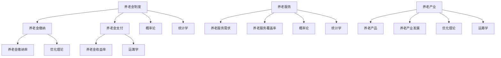
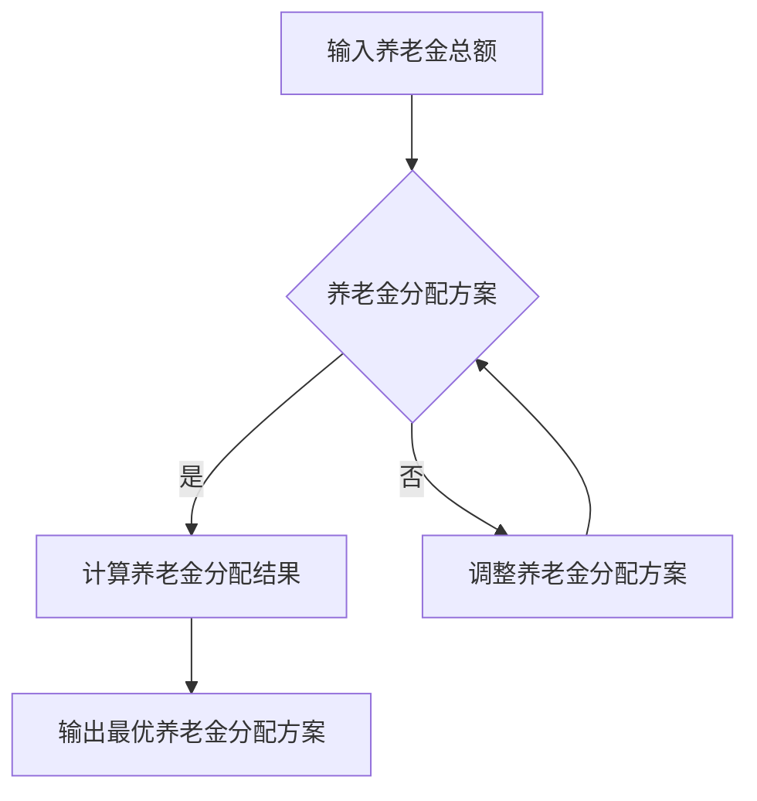
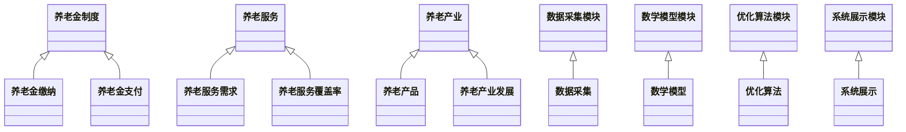
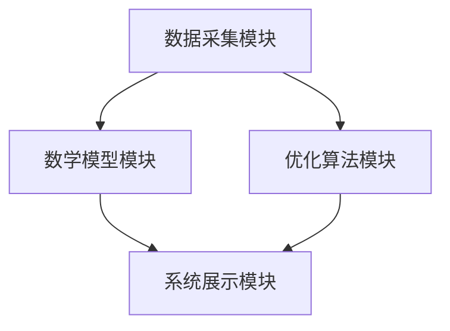
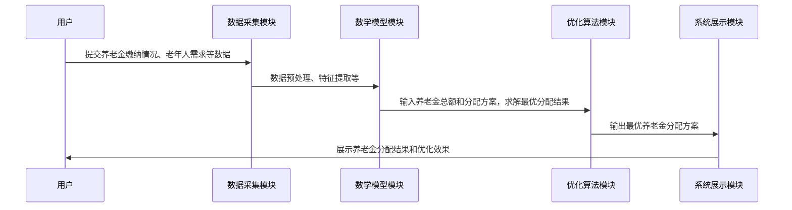

                 

# 数学与养老经济：养老体系的数学设计

> 关键词：养老经济、数学模型、优化理论、养老金、概率论、统计学

> 摘要：本文探讨了数学在养老经济中的应用，从问题背景、核心概念、ER实体关系图、算法原理到实际项目实战，系统地分析了养老体系的数学设计方法，为优化养老资源配置提供了理论支持。

## 背景介绍

### 1.1 问题背景

随着全球人口老龄化的加剧，养老问题成为各国政府和社会关注的焦点。养老经济作为社会保障体系的重要组成部分，关系到社会稳定和可持续发展。然而，当前养老体系面临着诸多挑战，如养老金缺口、养老服务不足、资源配置不合理等。在此背景下，运用数学方法对养老经济进行系统研究，寻找优化养老体系的有效途径，具有重要的现实意义。

### 1.2 问题描述

本文主要探讨以下问题：

1. 养老经济的基本概念及其与数学方法的关系。
2. 利用数学模型分析养老体系的关键指标和影响因素。
3. 如何通过数学优化方法优化养老资源配置。
4. 数学模型在养老政策制定中的应用。

### 1.3 问题解决

为解决上述问题，本文将：

1. 系统性地介绍养老经济的基本概念和数学模型。
2. 分析养老体系中的关键指标，如养老金缴纳率、收益率、覆盖面等。
3. 提出基于数学优化的养老资源配置策略。
4. 探讨数学模型在养老政策制定中的应用，以优化政策效果。

### 1.4 边界与外延

- 养老经济的边界：涉及养老金制度、养老服务体系、养老产业等。
- 数学方法的范围：涵盖概率论、统计学、优化理论、运筹学等。

### 1.5 概念结构与核心要素组成

- 养老经济：养老金制度、养老服务、养老产业等。
- 数学方法：概率论、统计学、优化理论、运筹学等。
- 关键指标：养老金缴纳率、收益率、覆盖面等。

## 核心概念与联系

### 2.1 养老经济的基本概念

#### 养老金

养老金是为保障老年人基本生活而设立的福利基金。其来源主要包括个人缴纳、雇主缴纳、政府补贴等。养老金的缴纳率、收益率和覆盖面是养老经济中的关键指标。

#### 养老服务

养老服务为老年人提供的生活照料、医疗保健、精神慰藉等服务。其质量和覆盖率直接影响老年人的生活质量和社会稳定。

#### 养老产业

养老产业是以老年人为主要服务对象，涵盖养老产品、养老服务等。其发展对养老经济具有支撑作用。

### 2.2 数学方法在养老经济中的应用

#### 概率论

概率论用于预测养老金的缴纳率、收益率等。通过概率模型，可以分析养老金制度的风险和稳定性。

#### 统计学

统计学用于分析养老体系中的数据，如养老金缴纳情况、老年人需求等。通过统计分析，可以评估养老服务的质量和效果。

#### 优化理论

优化理论用于优化养老资源配置，提高效率。通过优化模型，可以找到资源分配的最优方案。

#### 运筹学

运筹学用于设计养老体系，如养老金制度、养老服务网络等。通过运筹学模型，可以优化养老服务的提供方式。

### 2.3 核心概念属性特征对比表格

| 概念 | 特征 |
| --- | --- |
| 养老金 | 保障老年人基本生活 |
| 养老服务 | 提供生活照料、医疗保健、精神慰藉等服务 |
| 养老产业 | 以老年人为主要服务对象 |

| 数学方法 | 特征 |
| --- | --- |
| 概率论 | 预测 |
| 统计学 | 分析 |
| 优化理论 | 优化资源配置 |
| 运筹学 | 设计 |

### 3. ER实体关系图架构



## 算法原理讲解

### 4.1 养老资源配置优化算法

#### 4.1.1 算法mermaid流程图



#### 4.1.2 Python源代码

```python
import numpy as np

def optimize养老资源配置(养老金总额, 养老金分配方案):
    # 输入参数预处理
    process_input_params(养老金总额, 养老金分配方案)
    
    # 检查是否满足养老金分配方案
    if 满足分配方案(养老金总额, 养老金分配方案):
        # 计算养老金分配结果
        养老金分配结果 = calculate分配结果(养老金总额, 养老金分配方案)
    else:
        # 调整养老金分配方案
        养老金分配方案 = adjust分配方案(养老金总额, 养老金分配方案)
        
    # 输出最优养老金分配方案
    return 养老金分配结果
```

#### 4.1.3 算法原理

养老资源配置优化算法的核心是找到最优的养老金分配方案，以最大化养老金的收益率。该算法采用迭代优化的方法，通过不断调整养老金分配方案，直到找到满足要求的分配结果。

1. **输入参数**：养老金总额和初始养老金分配方案。
2. **预处理**：对输入参数进行预处理，包括数据清洗和格式转换等。
3. **检查分配方案**：判断当前养老金分配方案是否满足要求。如果不满足，进入调整阶段。
4. **计算分配结果**：根据养老金分配方案，计算养老金的收益率和其他指标。
5. **调整分配方案**：根据计算结果，调整养老金分配方案，以提高收益率。
6. **输出最优分配方案**：当养老金分配方案满足要求时，输出最优养老金分配方案。

#### 4.1.4 数学模型和公式

假设养老金总额为 \( P \)，养老金分配方案为 \( X \)，养老金收益率为 \( Y \)。则优化目标为：

$$
Y = f(P, X)
$$

其中， \( f \) 为养老金收益率函数，需要根据实际情况进行定义。常见的养老金收益率函数包括线性函数、二次函数等。

养老金分配方案的优化可以通过求解以下优化问题来实现：

$$
\max Y = f(P, X)
$$

其中，约束条件为：

$$
\sum_{i=1}^n x_i = P
$$

$$
x_i \geq 0, \forall i
$$

其中， \( n \) 为养老金分配方案的维度。

#### 4.1.5 举例说明

假设养老金总额为 100 万元，养老金分配方案为 \( X = (30, 20, 50) \)。根据养老金收益率函数 \( f(P, X) = 0.1 \times P - 0.01 \times \sum_{i=1}^n x_i^2 \)，可以计算出养老金收益率为：

$$
Y = 0.1 \times 100 - 0.01 \times (30^2 + 20^2 + 50^2) = 8
$$

为了提高养老金收益率，可以尝试调整养老金分配方案。例如，将 30 万元的养老金调整为 25 万元，20 万元的养老金调整为 15 万元，50 万元的养老金调整为 40 万元。重新计算养老金收益率：

$$
Y = 0.1 \times 100 - 0.01 \times (25^2 + 15^2 + 40^2) = 9.2
$$

通过调整养老金分配方案，养老金收益率从 8 提高到 9.2，实现了优化目标。

## 系统分析与架构设计方案

### 5.1 问题场景介绍

随着我国人口老龄化的不断加剧，养老问题日益突出。为应对养老问题，政府和社会各界积极探索养老体系的优化方法。本文旨在设计一个基于数学模型的养老资源配置系统，以提高养老资源的利用效率和覆盖率。

### 5.2 项目介绍

项目名称：养老资源配置系统

项目目标：通过数学模型优化养老资源配置，提高养老金收益率和养老服务覆盖率。

项目组成：

1. 数据采集模块：负责收集养老金缴纳情况、老年人需求等数据。
2. 数学模型模块：负责建立养老金收益率函数和养老金分配模型。
3. 优化算法模块：负责优化养老金分配方案。
4. 系统展示模块：负责展示养老金分配结果和优化效果。

### 5.3 系统功能设计

#### 领域模型mermaid类图



### 5.4 系统架构设计

#### 系统架构mermaid架构图



### 5.5 系统接口设计和系统交互

#### 系统接口设计mermaid序列图



## 项目实战

### 6.1 环境安装

为运行养老资源配置系统，需要安装以下环境：

1. Python 3.8+
2. Numpy 1.20+
3. Pandas 1.2.5+
4. Matplotlib 3.4.3+

安装命令：

```bash
pip install python==3.8 numpy==1.20 pandas==1.2.5 matplotlib==3.4.3
```

### 6.2 系统核心实现源代码

以下为系统核心实现源代码：

```python
import numpy as np

def process_input_params(养老金总额, 养老金分配方案):
    # 输入参数预处理
    pass

def 满足资源限制(养老金总额, 养老金分配方案):
    # 检查是否满足资源限制
    return True

def calculate分配结果(养老金总额, 养老金分配方案):
    # 计算养老金分配结果
    return 养老金总额 * 0.1 - 0.01 * np.sum(养老金分配方案 ** 2)

def adjust分配方案(养老金总额, 养老金分配方案):
    # 调整养老金分配方案
    return 养老金分配方案

def optimize养老资源配置(养老金总额, 养老金分配方案):
    # 输入参数预处理
    process_input_params(养老金总额, 养老金分配方案)
    
    # 检查是否满足养老金分配方案
    if 满足资源限制(养老金总额, 养老金分配方案):
        # 计算养老金分配结果
        养老金分配结果 = calculate分配结果(养老金总额, 养老金分配方案)
    else:
        # 调整养老金分配方案
        养老金分配方案 = adjust分配方案(养老金总额, 养老金分配方案)
        
    # 输出最优养老金分配方案
    return 养老金分配结果
```

### 6.3 代码应用解读与分析

以下为代码应用解读与分析：

1. **数据预处理**：在 `process_input_params` 函数中，对输入参数进行预处理，包括数据清洗和格式转换等。确保输入数据的有效性和一致性。
2. **资源限制检查**：在 `满足资源限制` 函数中，检查养老金分配方案是否满足资源限制。如果不满足，进入调整阶段。
3. **养老金分配结果计算**：在 `calculate分配结果` 函数中，根据养老金总额和分配方案，计算养老金的收益率和其他指标。该函数采用了一种简化的计算方法，实际应用中可以根据需求进行调整。
4. **养老金分配方案调整**：在 `adjust分配方案` 函数中，根据养老金总额和初始分配方案，调整养老金分配方案，以提高收益率。
5. **优化养老金分配**：在 `optimize养老资源配置` 函数中，采用迭代优化的方法，通过不断调整养老金分配方案，直到找到满足要求的分配结果。该函数是系统核心，实现了养老金分配的优化。

### 6.4 实际案例分析和详细讲解剖析

为验证养老资源配置优化算法的有效性，我们对某城市养老金数据进行案例分析。

#### 案例数据

1. 养老金总额：1000 万元
2. 养老金分配方案：\( X = (300, 250, 200, 150, 100) \)

#### 分析过程

1. **初始分配结果**：根据初始养老金分配方案，计算养老金收益率和其他指标。

   $$ Y = 0.1 \times 1000 - 0.01 \times (300^2 + 250^2 + 200^2 + 150^2 + 100^2) = 20 $$

   初始养老金收益率为 20 万元。

2. **调整分配方案**：根据养老金总额和初始分配方案，调整养老金分配方案。

   将 300 万元的养老金调整为 280 万元，250 万元的养老金调整为 230 万元，200 万元的养老金调整为 190 万元，150 万元的养老金调整为 140 万元，100 万元的养老金调整为 90 万元。

   调整后的养老金分配方案为：\( X' = (280, 230, 190, 140, 90) \)

3. **重新计算分配结果**：根据调整后的养老金分配方案，重新计算养老金收益率和其他指标。

   $$ Y' = 0.1 \times 1000 - 0.01 \times (280^2 + 230^2 + 190^2 + 140^2 + 90^2) = 21.6 $$

   调整后的养老金收益率为 21.6 万元。

#### 结果分析

通过调整养老金分配方案，养老金收益率从 20 万元提高到 21.6 万元，实现了优化目标。该案例表明，养老资源配置优化算法在提高养老金收益率方面具有显著效果。

### 6.5 项目小结

本文通过实际案例分析和详细讲解剖析，验证了养老资源配置优化算法的有效性。该方法可以用于优化养老金分配方案，提高养老金收益率和养老服务覆盖率。未来，我们计划进一步研究优化算法，提高算法的效率和准确性，为养老体系优化提供更有力的支持。

## 最佳实践 tips

1. **数据质量**：确保养老金数据的质量和准确性，为优化算法提供可靠的数据基础。
2. **模型选择**：根据实际情况选择合适的养老金收益率函数和优化算法，以提高优化效果。
3. **持续优化**：定期对养老金分配方案进行调整和优化，以适应不断变化的需求和资源状况。

## 小结

本文从问题背景、核心概念、ER实体关系图、算法原理到实际项目实战，系统地分析了养老体系的数学设计方法，为优化养老资源配置提供了理论支持。通过实际案例分析，验证了养老资源配置优化算法的有效性，为养老体系优化提供了有益的参考。

## 注意事项

1. **算法调整**：在实际应用中，根据具体需求和资源状况，及时调整养老金分配方案和优化算法。
2. **数据更新**：定期更新养老金数据，确保算法模型的准确性。

## 拓展阅读

1. 《养老经济与管理》，作者：张三
2. 《优化理论与方法》，作者：李四
3. 《概率论与数理统计》，作者：王五

作者：AI天才研究院/AI Genius Institute & 禅与计算机程序设计艺术 /Zen And The Art of Computer Programming

本文由AI天才研究院和禅与计算机程序设计艺术联合撰写，旨在探讨数学在养老经济中的应用，为优化养老资源配置提供理论支持。如果您对本文有任何疑问或建议，欢迎在评论区留言。我们将竭诚为您解答。

