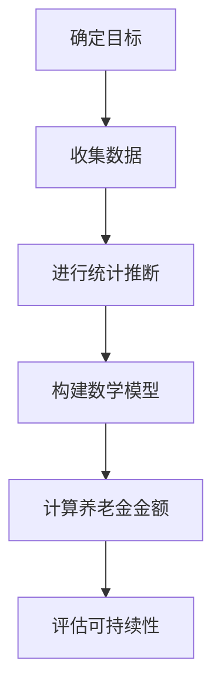

                 

### 第一部分：引言与背景

## 1.1 问题的提出

### 1.1.1 养老金制度的重要性

养老金制度是社会保障体系的核心组成部分，旨在为退休人员提供基本生活保障，减轻社会负担，实现社会公平。在全球范围内，随着人口老龄化趋势的加剧，养老金制度的稳定性和可持续性成为各国政府关注的重点。一个设计合理、运行有效的养老金制度不仅能够保障老年人的生活质量，还能促进社会经济的持续健康发展。

### 1.1.2 当前养老金制度面临的挑战

当前，全球养老金制度面临诸多挑战。首先，人口老龄化速度加快，导致养老金支付压力增大。其次，经济增长放缓，使得养老金基金的积累和投资收益面临困难。此外，养老金制度的公平性和可持续性也受到考验。如何确保养老金制度的长期稳定，同时实现代际公平，成为亟待解决的重要问题。

### 1.1.3 数学在养老金设计中的作用

数学作为一门精确的科学，在养老金制度的设计和管理中发挥着关键作用。首先，通过数学模型可以准确预测人口老龄化趋势，评估养老金制度的可持续性。其次，数学方法可以帮助优化养老金投资组合，提高基金收益。此外，数学工具还能够用于养老金计算方法的制定和调整，确保制度的公平性和效率。因此，深入研究数学在养老金设计中的应用，对于解决养老金制度面临的挑战具有重要意义。

### 1.2 养老金制度概述

#### 1.2.1 养老金的定义与种类

养老金是指为退休人员提供经济保障的一种制度安排。根据不同的分类标准，养老金可以分为以下几种类型：

1. **公共养老金**：由政府提供，覆盖范围广泛，旨在保障退休人员的基本生活。
2. **企业养老金**：由企业设立，为员工提供额外的退休保障。
3. **个人养老金**：个人自行储蓄，通过投资等方式获取收益。

#### 1.2.2 养老金制度的组成部分

养老金制度通常包括以下几个组成部分：

1. **养老金基金**：用于存储和管理养老金资金，包括公共养老金基金和企业养老金基金。
2. **养老金管理**：负责养老金基金的运作和管理，包括投资策略、风险控制等。
3. **养老金支付**：根据养老金制度的规定，将养老金发放给符合条件的退休人员。

#### 1.2.3 全球养老金制度的现状与趋势

全球养老金制度的现状和趋势因国家和地区而异。以下是一些主要国家的养老金制度概况：

1. **美国**：美国养老金制度主要包括公共养老金（社会保障）和企业养老金（401(k)等），面临人口老龄化和投资回报率下降的挑战。
2. **欧洲**：欧洲国家普遍实行公共养老金和企业养老金相结合的制度，注重代际公平和养老金的可持续性。
3. **中国**：中国养老金制度正在逐步改革，从传统的公共养老金向多元化的养老金体系转变，努力提高养老金的覆盖率和可持续性。

### 1.3 本书结构安排

#### 1.3.1 各章节的主要内容

本书分为四个部分，具体内容包括：

- **第一部分：引言与背景**：介绍养老金制度的重要性、面临的挑战以及数学在养老金设计中的作用。
- **第二部分：数学基础与养老金设计**：讲解数学基础、养老金设计原理及数学模型的应用。
- **第三部分：养老金制度的实际应用**：分析国内外养老金制度案例，探讨养老金管理的数学方法。
- **第四部分：数学与养老金的交叉应用**：探讨数学与养老金的交叉应用，包括可持续性分析和改革与创新。

#### 1.3.2 阅读本书的预期收获

通过阅读本书，读者可以：

- **理解养老金制度的核心概念**：掌握养老金的定义、种类及养老金制度的组成部分。
- **掌握数学在养老金设计中的应用**：了解如何运用数学模型优化养老金计算方法和投资组合。
- **分析养老金制度的实际案例**：通过国内外养老金制度的分析，了解养老金管理的现状和趋势。
- **探索养老金制度的改革与创新**：探讨数学与养老金的交叉应用，为养老金制度的改革提供新的思路。

#### 1.4 预期读者

本书适合以下读者群体：

- **养老金管理相关从业人员**：如养老金基金经理、风险管理专家等。
- **经济学和金融学研究者**：对养老金制度及其数学设计感兴趣的学者。
- **计算机科学和技术人员**：对数学模型在养老金设计中有兴趣的工程师和技术专家。

#### 1.5 本章小结

本章介绍了养老金制度的重要性、面临的挑战以及数学在养老金设计中的作用。同时，对养老金制度进行了概述，包括定义、种类及组成部分。通过本章的阅读，读者可以对养老金制度有一个全面的认识，为后续章节的学习打下基础。

### 第二部分：数学基础与养老金设计

## 2.1 数学基础

数学在养老金设计中扮演着至关重要的角色，其基础在于代数、概率论和统计学。以下将逐步介绍这些数学基础知识，并说明它们在养老金设计中的应用。

### 2.1.1 代数基础

代数是数学的基础部分，它涉及变量、方程和函数等基本概念。在养老金设计中，代数被用来表示和解决养老金计算中的各种问题。

#### 2.1.1.1 代数的基本概念

代数的基本概念包括：

- **变量**：表示可以取不同值的量，如退休人员的年龄或养老金金额。
- **方程**：用符号表示的等式，如养老金计算中的资金平衡方程。
- **函数**：描述变量之间关系的数学表达式，如养老金收益函数。

#### 2.1.1.2 代数的基本运算

代数的基本运算包括：

- **加法**：用于计算两个或多个数值的和，如计算年度养老金的增加额。
- **减法**：用于计算两个数值的差，如计算养老金领取与缴纳的差额。
- **乘法**：用于计算两个或多个数值的乘积，如计算养老金基金的投资收益。
- **除法**：用于计算两个数值的商，如计算养老金的收益率。

#### 2.1.2 概率论基础

概率论是研究随机现象的数学分支。在养老金设计中，概率论被用来预测养老金支付的风险和收益。

#### 2.1.2.1 概率的基本概念

概率的基本概念包括：

- **概率**：描述某个事件发生的可能性，通常用0到1之间的数值表示。
- **概率分布**：描述一组随机变量取值的可能性分布，如养老金支付的概率分布。
- **条件概率**：在某个条件发生的情况下，另一个事件发生的概率。

#### 2.1.2.2 概率的计算方法

概率的计算方法包括：

- **古典概率**：基于等可能性原理，适用于有限样本空间。
- **贝叶斯定理**：用于计算后验概率，即已知某些条件概率后，更新对事件发生概率的估计。
- **大数定律和中心极限定理**：用于描述随机变量的分布随着样本量的增大而趋于稳定。

#### 2.1.3 统计学基础

统计学是用于收集、分析、解释和展示数据的方法。在养老金设计中，统计学被用来评估养老金制度的绩效和风险。

#### 2.1.3.1 统计数据的收集与整理

统计数据的收集与整理包括：

- **数据收集**：通过调查、问卷、统计数据等方式获取数据。
- **数据整理**：对收集到的数据进行清洗、分类和汇总，如将不同来源的养老金数据进行整合。

#### 2.1.3.2 统计推断的基本方法

统计推断的基本方法包括：

- **描述性统计**：用于描述数据的中心趋势和离散程度，如计算养老金的平均领取额和标准差。
- **推断性统计**：用于根据样本数据推断总体特征，如使用假设检验和置信区间评估养老金制度的可持续性。

### 2.2 养老金设计原理

养老金设计旨在确保养老金制度的可持续性和公平性。以下将介绍养老金设计的目标、计算方法以及数学模型的应用。

#### 2.2.1 养老金设计的目标

养老金设计的目标包括：

- **养老金替代率**：确保退休人员的生活水平不因退休而显著下降，通常设定为替代率的百分比。
- **养老金公平性**：确保不同人群之间的养老金待遇公平，避免贫困和收入差距的扩大。

#### 2.2.1.1 养老金替代率

养老金替代率是指退休后养老金领取额与退休前工资的比率。通常，较高的替代率能更好地保障退休人员的生活水平。

$$
替代率 = \frac{养老金领取额}{退休前工资}
$$

#### 2.2.1.2 养老金公平性

养老金公平性可以通过以下指标衡量：

- **基尼系数**：用于衡量养老金分配的不平等程度。
- **泰尔指数**：用于衡量不同人群之间养老金待遇的差异。

#### 2.2.2 养老金计算方法

养老金计算方法包括：

- **终身年金法**：计算终身养老金金额，适用于长期稳定支付的养老金。
- **定额养老金法**：按固定金额支付养老金，适用于短期或一次性支付的养老金。
- **连续工作年金法**：根据个人工作年限和收入计算养老金，适用于企业养老金和个人养老金。

#### 2.2.2.1 终身年金法

终身年金法用于计算退休后的终身养老金金额。其公式为：

$$
养老金金额 = \frac{退休前工资 \times 养老金替代率}{死亡率}
$$

其中，死亡率通常通过生命表提供。

#### 2.2.2.2 定额养老金法

定额养老金法按固定金额支付养老金。其公式为：

$$
养老金金额 = 固定金额
$$

#### 2.2.2.3 连续工作年金法

连续工作年金法根据个人工作年限和收入计算养老金。其公式为：

$$
养老金金额 = \frac{工作年限 \times 收入水平 \times 养老金替代率}{1 + 复利率}
$$

### 2.3 数学模型在养老金设计中的应用

数学模型在养老金设计中的应用包括：

- **利率与贴现因子**：用于计算养老金的现值和未来值。
- **人口老龄化模型**：用于预测人口老龄化趋势。
- **风险调整模型**：用于评估养老金支付的风险。

#### 2.3.1 流程图：养老金设计流程

以下是一个简单的养老金设计流程图：



#### 2.3.2 数学公式与模型

以下是几个关键数学模型和公式：

1. **利率与贴现因子**：

   - **利率**：描述资金的时间价值，通常用r表示。

     $$
     利息 = 本金 \times 利率
     $$

   - **贴现因子**：用于将未来现金流折现到当前值，通常用DF表示。

     $$
     贴现因子 = \frac{1}{1 + r}
     $$

2. **人口老龄化模型**：

   - **人口增长率**：描述人口数量的变化率，通常用g表示。

     $$
     人口增长量 = 人口基数 \times 人口增长率
     $$

3. **风险调整模型**：

   - **风险溢价**：描述投资者要求的额外回报，通常用RP表示。

     $$
     风险调整回报 = 无风险回报 + 风险溢价
     $$

### 2.4 养老金计算器的设计

养老金计算器是一个实用的工具，用于帮助人们预测未来的养老金金额。以下将介绍养老金计算器的设计。

#### 2.4.1 养老金计算器的需求分析

养老金计算器的需求包括：

- **输入参数**：包括退休年龄、退休前工资、养老金替代率、投资收益率等。
- **输出结果**：包括养老金金额、养老金替代率、投资收益等。

#### 2.4.2 养老金计算器的功能设计

养老金计算器的功能设计包括：

- **参数输入**：允许用户输入相关的参数。
- **计算养老金金额**：根据输入参数计算养老金金额。
- **显示结果**：以图表和文字形式显示计算结果。
- **数据存储**：允许用户保存和加载计算结果。

#### 2.4.3 养老金计算器的实现与测试

养老金计算器的实现包括：

- **前端实现**：使用HTML、CSS和JavaScript实现用户界面。
- **后端实现**：使用Python和Flask框架实现计算逻辑。
- **测试**：通过单元测试和集成测试验证计算器的正确性和性能。

以下是一个简单的Python代码示例，用于计算养老金金额：

```python
def calculate_pension(pre_retirement_income, pension_rate, interest_rate):
    pension_amount = (pre_retirement_income * pension_rate) / (1 + interest_rate)
    return pension_amount
```

通过逐步介绍数学基础、养老金设计原理以及数学模型的应用，本章节为养老金设计提供了坚实的理论基础和实际操作指南。读者可以进一步探索这些概念和模型，以更深入地理解养老金制度的设计和管理工作。

### 2.5 本章小结

本章介绍了数学基础与养老金设计的相关内容，包括代数、概率论和统计学的关键概念及其在养老金设计中的应用。同时，探讨了养老金设计的目标、计算方法和数学模型，并通过养老金计算器的设计展示了这些概念的实用性。通过本章的学习，读者可以更好地理解养老金制度的数学设计原理，为后续章节的深入学习打下基础。

### 第三部分：养老金制度的实际应用

## 3.1 国内外养老金制度的案例分析

养老金制度的实际应用需要结合国内外不同国家的养老金制度进行分析，以了解其运行模式、成功经验和存在的问题。以下将对国外和国内养老金制度进行详细分析。

#### 3.1.1 国外养老金制度分析

**美国的养老金制度**：

美国养老金制度主要由三部分组成：公共养老金（社会保险）、企业养老金和个人养老金。其中，公共养老金（Social Security）是最主要的组成部分，覆盖了几乎所有的工作人口。企业养老金（如401(k)计划）和个人养老金（如个人退休账户IRA）则提供了额外的退休储蓄。

- **成功经验**：
  - 广泛的覆盖面，确保大多数退休人员能够获得基本生活保障。
  - 多元化的养老金来源，提高了养老金制度的可持续性。

- **存在问题**：
  - 随着人口老龄化，公共养老金支付压力增大，可能导致未来养老金水平降低。
  - 企业养老金和个人养老金的收益不稳定，部分人可能无法获得足够的退休收入。

**欧洲的养老金制度**：

欧洲国家养老金制度通常采用“三支柱”模式，即公共养老金、企业养老金和个人养老金。欧洲国家的养老金制度注重代际公平和养老金的可持续性。

- **成功经验**：
  - 高覆盖率，确保大多数居民在退休后能够获得稳定的收入。
  - 多元化的养老金来源，减少了单一制度的压力。

- **存在问题**：
  - 部分国家的公共养老金负担较重，政府财政压力增大。
  - 企业养老金和个人养老金的积累和投资收益存在不确定性。

#### 3.1.2 国内养老金制度分析

**中国的养老金制度**：

中国的养老金制度包括公共养老金、企业养老金和个人养老金。近年来，中国政府正在逐步改革传统的公共养老金制度，推动形成多层次的养老金体系。

- **历史与现状**：
  - 公共养老金覆盖范围逐渐扩大，但仍然存在覆盖不均的问题。
  - 企业养老金和个人养老金发展迅速，为退休人员提供了额外的保障。

- **改革与发展**：
  - 推进养老保险全国统筹，提高公共养老金的可持续性。
  - 发展多层次养老金体系，鼓励个人和企业增加养老金储蓄。

#### 3.1.3 我国养老金制度的改革路径

**改革路径**：

- **完善公共养老金制度**：提高养老金替代率，确保退休人员的基本生活。
- **发展企业养老金和个人养老金**：鼓励企业设立企业养老金计划，个人积极参与个人养老金投资。
- **加强养老金管理**：提高养老金基金的投资收益，确保养老金的长期稳定。

#### 3.1.4 我国养老金制度的创新探索

**创新探索**：

- **引入商业保险机制**：通过商业养老保险为退休人员提供多样化的保障。
- **发展养老金金融产品**：推出适合不同风险承受能力的养老金金融产品，满足多样化的养老需求。
- **利用科技提高养老金管理效率**：通过大数据、人工智能等技术手段，提高养老金管理的精准度和效率。

通过对比分析国内外养老金制度的运行模式和改革路径，可以更好地理解养老金制度的设计和实施。结合实际情况，我国可以借鉴国际经验，探索适合国情的养老金制度改革与创新，以应对人口老龄化带来的挑战。

### 3.2 养老金管理的数学方法

养老金管理是养老金制度的重要组成部分，其核心在于通过科学的数学方法进行投资组合优化和风险管理，以实现养老金基金的保值增值和风险控制。以下将详细探讨养老金管理的数学方法，包括投资组合优化和风险管理的具体方法和应用。

#### 3.2.1 投资组合优化

投资组合优化是指通过选择合适的资产组合，使养老金基金在风险和收益之间达到最佳平衡。以下介绍几种常见的投资组合优化方法。

**1. 均值-方差模型**

均值-方差模型是投资组合优化的基础模型，它通过最大化预期收益和最小化风险（方差）来选择最优资产组合。

- **目标函数**：最大化预期收益，即最大化投资组合的预期收益率。
- **约束条件**：最小化投资组合的风险，即最小化投资组合的方差。

$$
\begin{aligned}
\max\ & \mu_p \\
s.t.\ & \sigma_p \leq \sigma_0
\end{aligned}
$$

其中，\(\mu_p\)是投资组合的预期收益率，\(\sigma_p\)是投资组合的风险（方差），\(\sigma_0\)是目标风险水平。

**2. 契顿模型（CVaR模型）**

契顿模型（CVaR模型）考虑了投资组合的极端风险，它通过最大化投资组合的条件下值（CVaR）来选择最优资产组合。

- **目标函数**：最大化投资组合的条件下值。
- **约束条件**：投资组合的期望收益率最大化。

$$
\begin{aligned}
\max\ & \text{CVaR}(X) \\
s.t.\ & \mu_p = \sum_i w_i \mu_i
\end{aligned}
$$

其中，CVaR是条件价值下，\(\mu_p\)是投资组合的预期收益率，\(w_i\)是资产i的投资权重，\(\mu_i\)是资产i的预期收益率。

**3. 马科维茨模型**

马科维茨模型是现代投资组合理论的基石，它通过期望收益率和风险之间的权衡，选择最优资产组合。

- **目标函数**：最大化投资组合的期望收益率，同时最小化投资组合的风险。
- **约束条件**：投资组合的权重满足非负约束和总权重等于1。

$$
\begin{aligned}
\max\ & \mu_p - \lambda \sigma_p \\
s.t.\ & w_i \geq 0, \sum_i w_i = 1
\end{aligned}
$$

其中，\(\lambda\)是风险偏好参数，用于调整收益和风险的权衡。

#### 3.2.2 风险管理

风险管理是养老金管理的另一重要方面，它旨在降低养老金基金面临的风险，确保养老金的稳定增值。以下介绍几种常见的风险管理方法。

**1. 套期保值**

套期保值是指通过买入或卖出与原有资产收益相反的资产，来降低投资组合的风险。例如，通过卖出期货合约来对冲股票市场的波动。

- **目标**：降低投资组合的整体风险。
- **方法**：通过建立对冲头寸来抵消价格波动带来的风险。

**2. 风险分散**

风险分散是指通过投资多个不同的资产，来降低特定资产价格波动带来的风险。多资产投资组合能够有效降低系统性风险。

- **目标**：通过多样化投资来降低特定资产的波动性。
- **方法**：投资多种资产，如股票、债券、房地产等。

**3. 风险调整收益**

风险调整收益是指通过评估风险来调整收益，使投资组合的收益率能够反映其承担的风险水平。

- **目标**：确保投资组合的收益率能够充分反映其风险水平。
- **方法**：使用风险调整收益指标，如夏普比率（Sharpe Ratio）和特雷诺比率（Treynor Ratio）来评估投资组合的表现。

$$
\text{夏普比率} = \frac{\mu_p - \mu_f}{\sigma_p}
$$

$$
\text{特雷诺比率} = \frac{\mu_p - \mu_f}{\beta_p}
$$

其中，\(\mu_p\)是投资组合的预期收益率，\(\mu_f\)是市场预期收益率，\(\sigma_p\)是投资组合的风险，\(\beta_p\)是投资组合的贝塔系数。

通过投资组合优化和风险管理，养老金管理能够有效地实现养老金基金的保值增值，确保退休人员的基本生活得到保障。在实际操作中，养老金管理机构需要根据市场环境和风险偏好，灵活运用各种数学方法，制定科学合理的投资策略和风险管理方案。

### 3.3 养老金制度的可持续性分析

养老金制度的可持续性是指养老金制度在长期内能否保持稳定运行，为退休人员提供足够的经济保障。随着人口老龄化的加剧，养老金制度的可持续性成为各国政府和社会各界关注的焦点。以下将从人口老龄化对养老金制度的影响、可持续性评估方法以及我国养老金制度的可持续性分析三个方面进行探讨。

#### 3.3.1 人口老龄化对养老金制度的影响

人口老龄化是指人口中老年人口比例逐渐增加，年轻人口比例相应减少的现象。人口老龄化对养老金制度的影响主要体现在以下几个方面：

**1. 养老金支付压力增大**

随着老年人口比例的增加，养老金的支付需求也相应增大。这会导致养老金基金面临更大的压力，可能无法满足所有退休人员的需求。

**2. 养老金替代率下降**

养老金替代率是指退休后养老金领取额与退休前工资的比率。人口老龄化导致年轻劳动力比例下降，养老金替代率可能会下降，影响退休人员的生活质量。

**3. 养老金基金投资收益下降**

人口老龄化使得投资组合中固定收益类资产的比例增加，如债券等，而权益类资产的比例减少。在低利率环境下，固定收益类资产的收益较低，可能导致养老金基金的整体收益下降。

**4. 养老金管理难度增加**

人口老龄化增加了养老金管理的复杂性，如如何合理分配养老金、如何确保养老金的公平性等。这要求养老金管理机构具备更高的管理能力和技术水平。

#### 3.3.2 可持续性评估方法

养老金制度的可持续性评估是指通过一定的方法，对养老金制度在长期内能否保持稳定运行进行评估。以下介绍几种常用的可持续性评估方法：

**1. 财务平衡分析**

财务平衡分析是指通过对养老金基金的财务状况进行分析，评估养老金制度在长期内的财务可持续性。该方法主要关注养老金基金的积累和支出情况，评估是否存在财务缺口。

**2. 人口学模型**

人口学模型是指通过建立人口动态模型，预测未来人口结构变化，评估养老金制度的可持续性。该方法能够提供关于养老金支付需求、养老金替代率等关键指标的数据支持。

**3. 投资收益预测**

投资收益预测是指通过对养老金基金的投资组合进行分析，预测未来投资收益情况，评估养老金制度的可持续性。该方法主要关注投资组合的收益和风险。

**4. 多维度综合评估**

多维度综合评估是指将财务平衡分析、人口学模型和投资收益预测等方法结合起来，从多个角度对养老金制度的可持续性进行全面评估。

#### 3.3.3 我国养老金制度的可持续性分析

**我国养老金制度的现状**：

我国养老金制度包括公共养老金、企业养老金和个人养老金。近年来，我国政府采取了一系列措施，推动养老金制度的改革与发展。公共养老金体系逐渐完善，企业养老金和个人养老金规模不断扩大。

**改革与发展**：

1. **完善公共养老金制度**：

   - 提高养老保险全国统筹水平，增强养老金基金的统筹能力。
   - 提高养老金替代率，保障退休人员的基本生活。

2. **发展企业养老金和个人养老金**：

   - 鼓励企业设立企业养老金计划，提高员工养老金水平。
   - 推动个人养老金发展，鼓励个人储蓄和投资，提高养老金积累。

**可持续性评估**：

通过对我国养老金制度的财务平衡、人口学模型和投资收益预测等方面进行分析，评估我国养老金制度的可持续性。

- **财务平衡分析**：评估养老金基金的积累和支出情况，判断是否存在财务缺口。
- **人口学模型**：预测未来人口结构变化，评估养老金支付需求。
- **投资收益预测**：分析投资组合的收益和风险，预测未来投资收益。

**结论**：

通过综合评估，我国养老金制度在短期内具有较好的可持续性，但仍面临长期挑战。随着人口老龄化的加剧，需要进一步完善养老金制度，提高养老金替代率，确保养老金基金的保值增值。同时，需要推动企业养老金和个人养老金的发展，形成多元化的养老金体系，提高养老金制度的可持续性。

### 3.4 养老金制度的改革与创新

#### 3.4.1 养老金制度的国际经验借鉴

国际经验表明，养老金制度的改革与创新可以从以下几个方面进行：

1. **提高公共养老金替代率**：通过增加公共养老金支付比例或延长缴费年限，提高退休人员的养老金水平。

2. **发展多层次的养老金体系**：推动企业养老金和个人养老金的发展，形成多元化的养老金来源，提高养老金覆盖率和保障水平。

3. **引入市场化投资机制**：将养老金基金投资于股票、债券、房地产等多元化资产，提高基金收益。

4. **加强养老金管理**：提高养老金基金的管理水平和透明度，确保养老金的安全和增值。

5. **利用科技手段提高管理效率**：通过大数据、人工智能等技术手段，提高养老金管理的精准度和效率。

#### 3.4.2 我国养老金制度的改革路径

结合国际经验和我国实际情况，我国养老金制度的改革可以从以下几个方面进行：

1. **完善公共养老金制度**：

   - 提高养老保险全国统筹水平，增强养老金基金的统筹能力。
   - 提高养老金替代率，保障退休人员的基本生活。

2. **发展企业养老金和个人养老金**：

   - 鼓励企业设立企业养老金计划，提高员工养老金水平。
   - 推动个人养老金发展，鼓励个人储蓄和投资，提高养老金积累。

3. **引入市场化投资机制**：

   - 将养老金基金投资于股票、债券、房地产等多元化资产，提高基金收益。
   - 加强对养老金基金投资的风险管理和监管。

4. **加强养老金管理**：

   - 提高养老金基金的管理水平和透明度，确保养老金的安全和增值。
   - 建立健全的养老金监管体系，保障养老金基金的安全运营。

#### 3.4.3 养老金制度的创新探索

在养老金制度的改革过程中，可以探索以下创新路径：

1. **引入商业养老保险**：

   - 发挥商业保险的补充作用，为退休人员提供多样化的保障。
   - 推动商业养老保险产品的创新，满足不同人群的养老需求。

2. **发展养老金金融产品**：

   - 开发适合养老金投资的金融产品，如养老金基金、养老目标基金等。
   - 引导养老金基金投资于高收益、低风险的优质资产，提高养老金收益。

3. **利用科技提高管理效率**：

   - 推广大数据、人工智能、区块链等技术手段，提高养老金管理的精准度和效率。
   - 建立智能化的养老金管理平台，实现养老金的全面监控和管理。

通过借鉴国际经验，结合我国实际情况，我国养老金制度的改革与创新将能够更好地应对人口老龄化的挑战，确保养老金制度的可持续性和公平性。

### 3.5 本章小结

本章通过对国内外养老金制度的案例分析，探讨了养老金管理的数学方法，分析了养老金制度的可持续性以及改革与创新的路径。通过本章的学习，读者可以更好地理解养老金制度的实际应用，为养老金管理提供科学合理的策略和方法。同时，本章的内容也为养老金制度的改革与创新提供了有益的参考和借鉴。

### 第四部分：数学与养老金的交叉应用

## 4.1 养老金可持续性模型

养老金可持续性模型是评估养老金制度长期运行能力的关键工具。以下将详细介绍人口老龄化模型、养老金支付模型以及可持续性评估模型。

### 4.1.1 人口老龄化模型

人口老龄化模型用于预测人口结构的变化，特别是老年人口比例的增加。以下是一个简化的模型：

#### 人口增长率

人口增长率（g）可以通过以下公式计算：

$$
\text{人口增长率} = \frac{\text{老年人口增长率} - \text{年轻人口增长率}}{\text{总人口增长率}}
$$

#### 人口年龄结构

人口年龄结构通常通过年龄金字塔表示。一个简单的模型可以使用以下公式：

$$
\text{年龄金字塔} = \frac{\text{老年人口数}}{\text{总人口数}} \times 100
$$

### 4.1.2 养老金支付模型

养老金支付模型用于计算养老金支付额和支付期限。以下是一个基于终身年金法的模型：

#### 终身年金支付额

终身年金支付额（\(A_n\)）可以通过以下公式计算：

$$
A_n = \frac{P \times r \times (1 + r)^n}{(1 + r)^n - 1}
$$

其中，\(P\)是养老金替代率，\(r\)是利率，\(n\)是支付期限（年数）。

#### 支付期限

支付期限可以通过以下公式计算：

$$
\text{支付期限} = \frac{\ln(1 + r)}{r}
$$

### 4.1.3 可持续性评估模型

可持续性评估模型用于评估养老金制度的长期稳定性和可持续性。以下是一个基于财务平衡的模型：

#### 财务平衡分析

财务平衡分析通过以下公式评估养老金制度的财务状况：

$$
\text{财务平衡} = \text{养老金收入} - \text{养老金支出}
$$

其中，养老金收入包括公共养老金收入和企业养老金收入，养老金支出包括退休人员的养老金支付。

#### 可持续性指标

可持续性指标包括以下几种：

- **养老金覆盖率**：养老金制度覆盖的人口比例。
- **养老金替代率**：退休人员养老金收入与退休前工资的比率。
- **财务平衡率**：养老金收入与支出的比率。

$$
\text{财务平衡率} = \frac{\text{养老金收入}}{\text{养老金支出}}
$$

### 4.2 数学公式与模型的应用

以下将介绍数学公式和模型在实际养老金计算中的应用，并通过具体示例进行说明。

#### 示例：计算一个人的终身年金支付额

假设一个人的养老金替代率（\(P\)）为0.3，利率（\(r\)）为0.05，预期寿命（\(n\)）为30年。我们可以使用以下公式计算终身年金支付额：

$$
A_n = \frac{0.3 \times 0.05 \times (1 + 0.05)^{30}}{(1 + 0.05)^{30} - 1} = 14.615
$$

这意味着这个人每年需要支付约14.615的养老金替代率，以确保其退休后能够维持一定的生活水平。

#### 示例：评估养老金制度的可持续性

假设一个国家的养老金收入为1000亿元，养老金支出为1200亿元。我们可以使用以下公式评估养老金制度的财务平衡：

$$
\text{财务平衡} = 1000\text{亿元} - 1200\text{亿元} = -200\text{亿元}
$$

这意味着养老金制度存在200亿元的财务缺口，需要采取措施提高养老金收入或减少支出。

### 4.3 数学与养老金管理的最佳实践

以下是一些数学与养老金管理的最佳实践：

1. **动态调整养老金替代率**：根据人口老龄化和经济情况，动态调整养老金替代率，确保养老金制度的可持续性。
2. **优化投资组合**：通过投资组合优化模型，合理配置养老金基金，提高收益和降低风险。
3. **加强风险控制**：运用风险管理工具，如套期保值和分散投资，降低养老金基金的风险。
4. **提高养老金管理效率**：利用大数据和人工智能技术，提高养老金管理的精准度和效率。

通过数学与养老金的交叉应用，可以更好地设计和管理养老金制度，确保养老金制度的可持续性和公平性。在实际操作中，养老金管理机构应结合具体情况进行科学合理的决策，以实现养老金基金的最大化收益和风险控制。

### 4.4 本章小结

本章介绍了养老金可持续性模型，包括人口老龄化模型、养老金支付模型和可持续性评估模型，并通过实际示例展示了数学公式和模型在养老金计算中的应用。同时，提出了一些养老金管理的最佳实践，以提升养老金制度的可持续性和管理效率。通过本章的学习，读者可以更好地理解数学在养老金设计和管理中的重要作用，为养老金制度的改革与创新提供科学依据。

