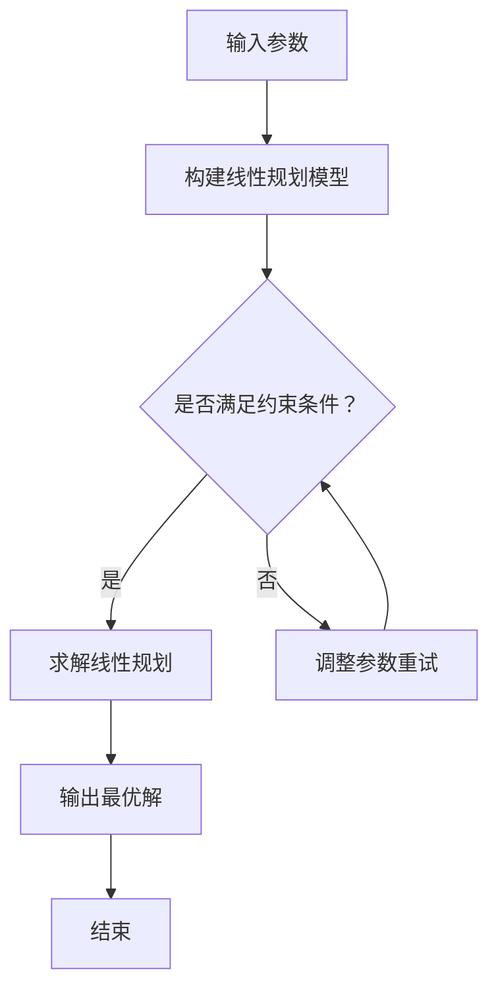
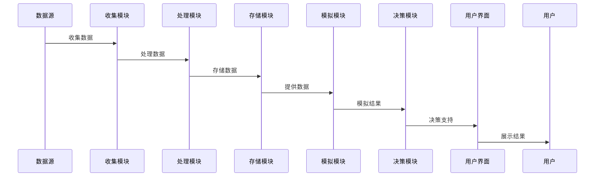

                 

## 前言与概述

### 引言

《数学与军事战略：战略规划的数学方法》旨在探讨数学在军事战略中的应用，解析如何运用数学方法进行有效的战略规划。本书旨在为军事战略家、数学爱好者以及计算机科学家提供一种新的视角，即通过数学方法来理解和优化军事战略。

数学作为一门精确科学，其方法和技术在解决复杂问题时具有独特的优势。在军事战略中，数学可以用于风险评估、目标定位、资源分配、兵力部署等多个方面。通过数学模型和算法，军事指挥官可以更好地预测敌对行为，优化战术选择，从而提高作战效率和胜利概率。

### 1.1 书籍目的与意义

本书的主要目的是介绍数学在军事战略中的应用，帮助读者理解数学模型和算法如何帮助制定和实施有效的战略计划。具体来说，本书具有以下意义：

1. **增强战略思维**：通过学习数学方法，战略家可以培养出更加严谨和系统的战略思维，从而更准确地评估形势和预测结果。
2. **优化战术决策**：数学模型和算法能够提供定量分析，帮助指挥官做出更加科学的决策，避免主观判断带来的风险。
3. **提高作战效能**：利用数学方法，可以优化兵力部署、资源分配等关键环节，从而提高整体作战效能。

### 1.2 数学与军事战略的关系

数学与军事战略的关系可以追溯到古代。在古代战争中，数学被用于测量地形、计算兵力、制定战术等。例如，古希腊的军事家们利用几何学来规划城池防御和兵力部署。随着时代的发展，数学在军事战略中的应用越来越广泛。

在现代社会，数学在军事战略中的重要性更加凸显。计算机科学的发展使得大规模数据处理和复杂算法成为可能，军事指挥官可以利用这些技术进行更加精确的战略规划。例如，通过运筹学和优化算法，可以制定出最优的兵力部署方案；通过概率论和统计方法，可以评估敌军的行为和风险。

### 1.3 书籍结构安排

本书的结构安排如下：

1. **前言与概述**：介绍书籍的背景、目的和结构。
2. **数学与军事战略概述**：详细阐述数学在军事战略中的应用和发展历程。
3. **核心概念与原理**：介绍与军事战略相关的数学概念和原理。
4. **算法原理与流程**：讲解用于军事战略规划的数学算法，包括流程图、代码示例和数学模型。
5. **系统分析与架构设计**：分析军事战略规划系统的需求，设计系统功能、架构和接口。
6. **项目实战**：通过具体案例展示如何应用数学方法进行军事战略规划。
7. **总结与展望**：总结书籍主要内容，展望数学在军事战略规划中的未来发展方向。

通过上述结构，本书旨在为读者提供一条从理论到实践的完整学习路径，使读者能够全面了解并掌握数学在军事战略中的应用方法。

### 数学与军事战略的边界与外延

在探讨数学与军事战略的关系时，我们首先需要明确数学和军事战略的边界与外延。数学作为一种精确的科学，其边界主要在于其逻辑严密、推理严格和抽象能力。数学通过符号化语言和公理体系，能够将复杂的现实问题转化为简洁的模型，从而进行定量分析。

而军事战略则是关于战争、安全、防御等问题的规划和执行，其边界则涉及战术、策略、兵力、地形等多个方面。军事战略的目的是通过一系列决策和行动，实现军事目标，保障国家安全。

数学与军事战略的交汇点在于它们共同关注的复杂系统分析、优化和预测。具体来说，数学为军事战略提供了以下外延：

1. **数据分析**：通过对战场数据、敌情情报、兵力配置等进行数学分析，可以揭示出隐藏的模式和趋势，为决策提供依据。
2. **模型构建**：利用数学模型，可以模拟不同战术选择的可能结果，评估其风险和收益，从而制定最优策略。
3. **优化算法**：通过优化算法，可以优化兵力部署、资源分配等，使军事行动更加高效。
4. **风险评估**：运用概率论和统计方法，可以对敌军行为进行预测，评估作战风险，制定应对措施。

### 概念结构与核心要素组成

在《数学与军事战略：战略规划的数学方法》中，核心概念和原理构成了全书的理论框架。以下是这些概念的结构及其核心要素：

#### 1. 军事战略模型

**定义**：军事战略模型是用于描述军事行动及其结果的数学模型。

**核心要素**：
- **决策变量**：包括兵力部署、资源分配、战术选择等。
- **目标函数**：衡量战略效果的标准，如战斗力、生存率等。
- **约束条件**：包括地形、资源限制、时间限制等。

#### 2. 运筹学方法

**定义**：运筹学是应用数学方法进行决策和优化的一门学科。

**核心要素**：
- **线性规划**：用于解决资源分配问题。
- **整数规划**：用于处理决策变量为整数的问题。
- **网络流模型**：用于分析交通、通信等系统的流量。

#### 3. 概率论与统计方法

**定义**：概率论与统计方法是研究随机现象的数学分支。

**核心要素**：
- **概率分布**：描述随机变量的可能取值和概率。
- **假设检验**：用于评估敌情情报的真实性。
- **贝叶斯推理**：用于根据现有数据和先验知识更新信念。

#### 4. 人工智能算法

**定义**：人工智能算法是通过模拟人类思维过程来实现智能行为的计算机算法。

**核心要素**：
- **机器学习**：用于从数据中学习模式和规律。
- **深度学习**：用于处理复杂的数据结构，如图像和语音。
- **强化学习**：用于优化决策过程，实现智能体在动态环境中的最优策略。

#### 5. 军事模拟

**定义**：军事模拟是通过计算机模拟军事行动，评估不同策略的效果。

**核心要素**：
- **模拟器**：用于创建虚拟战场环境。
- **仿真模型**：用于模拟敌对行动和战场条件。
- **评估指标**：用于衡量模拟结果的有效性。

通过这些核心概念和原理，读者可以了解如何将数学方法应用于军事战略规划，从而制定出更加科学和高效的战略决策。

### 数学在军事战略中的具体应用案例

数学在军事战略中的应用不仅限于理论探讨，更在实战中发挥了重要作用。以下通过几个具体案例来展示数学方法在军事战略中的实际应用。

#### 1. 兵力部署优化

在一次模拟战役中，指挥官需要将有限的兵力部署在多个关键位置，以应对可能的敌军进攻。通过线性规划方法，指挥官可以构建一个优化模型，确定每个位置应部署的兵力数量，以最大化整体战斗力。

**模型构建**：

设 \( x_i \) 为第 \( i \) 个位置部署的兵力，目标函数为最大化总战斗力 \( Z = \sum_{i=1}^{n} b_i x_i \)，其中 \( b_i \) 为第 \( i \) 个位置的战斗权重。约束条件包括兵力总量限制 \( \sum_{i=1}^{n} x_i \leq B \) 以及每个位置的最小兵力要求 \( x_i \geq l_i \)，其中 \( B \) 为总兵力，\( l_i \) 为第 \( i \) 个位置的最小兵力。

**解决方法**：

使用线性规划求解器求解上述模型，得到最优兵力部署方案，确保各关键位置的战斗力最大化。

#### 2. 风险评估与预测

在情报分析中，指挥官需要根据获取的敌情信息，评估敌方行动的可能性和风险。通过概率论和统计方法，可以构建风险评估模型，预测敌军的行为模式。

**模型构建**：

设 \( X \) 为敌军行动的概率分布，通过收集历史数据和专家意见，可以确定敌军可能的行动及其概率。目标函数为最小化评估误差，即 \( \min_{p} \sum_{i=1}^{n} (p_i - x_i)^2 \)，其中 \( p_i \) 为第 \( i \) 种行动的概率，\( x_i \) 为实际观测到的行动。

**解决方法**：

利用极大似然估计或贝叶斯推理方法，计算最优概率分布，从而预测敌军可能的行动。

#### 3. 资源分配优化

在一次军事演习中，指挥官需要合理分配有限的资源（如物资、兵力、装备等），以实现演习目标的最佳效果。通过整数规划方法，可以优化资源分配，确保关键任务的优先完成。

**模型构建**：

设 \( y_i \) 为第 \( i \) 项资源是否分配给某任务（1表示分配，0表示不分配），目标函数为最大化总任务完成率 \( Z = \sum_{i=1}^{n} w_i y_i \)，其中 \( w_i \) 为第 \( i \) 个任务的权重。约束条件包括资源总量限制 \( \sum_{i=1}^{n} x_i y_i \leq R \) 和每个任务的最小资源需求 \( x_i y_i \geq l_i \)，其中 \( R \) 为总资源，\( l_i \) 为第 \( i \) 个任务的最小资源需求。

**解决方法**：

使用整数规划求解器求解上述模型，得到最优资源分配方案，确保资源利用最大化。

通过这些实际应用案例，可以看出数学方法在军事战略中的重要性。不仅帮助指挥官做出更加科学和合理的决策，还能够提高整体作战效能，从而在战场上取得胜利。

### 数学在军事战略中的优势与挑战

数学在军事战略中具有显著的优势，但也面临一些挑战。以下将详细分析数学方法在军事战略中的优势及其应用中的挑战。

#### 数学在军事战略中的优势

1. **精确性**：数学方法能够通过定量分析，提供精确的数据和预测结果，帮助指挥官做出科学决策。
2. **系统性**：数学模型可以将复杂的军事问题转化为可计算的模型，使得战略规划更加系统和全面。
3. **灵活性**：通过调整模型参数和算法，数学方法可以适应不同战场环境和需求，提供灵活的解决方案。
4. **效率**：数学算法在计算效率和准确性方面具有优势，可以快速处理大量数据，提高战略规划的效率。

#### 数学在军事战略中的挑战

1. **复杂性**：军事战略问题往往涉及多个变量和不确定因素，构建和分析复杂的数学模型需要大量专业知识和计算资源。
2. **实时性**：军事行动具有高实时性要求，数学模型和算法需要能够在短时间内完成计算和预测，这对计算能力和算法优化提出了高要求。
3. **数据质量**：数学模型的预测精度依赖于输入数据的质量。在实际应用中，数据收集和处理可能存在误差，影响模型的准确性。
4. **解释性**：数学模型和算法的复杂性可能导致其结果难以解释，影响指挥官的理解和应用。

#### 解决方案

1. **算法优化**：通过算法优化和计算技术的发展，提高数学模型的计算效率和精度。
2. **模型简化**：在确保模型准确性的前提下，对复杂模型进行简化和近似，使其更易于理解和应用。
3. **数据质量提升**：加强数据收集和处理技术，提高数据质量，确保模型输入的准确性。
4. **人机协同**：将数学模型和算法与人工智能技术结合，实现人机协同，提高战略规划的智能化水平。

通过上述解决方案，可以进一步发挥数学在军事战略中的优势，克服挑战，提高战略决策的科学性和有效性。

### 核心概念与联系

在探讨数学在军事战略中的应用时，需要了解一些核心概念及其相互联系。以下将详细介绍这些概念及其在军事战略中的具体应用。

#### 1. 运筹学

**定义**：运筹学是一门应用数学方法进行决策和优化的学科。

**联系**：运筹学是数学在军事战略中应用的重要工具，通过优化模型和算法，可以解决兵力部署、资源分配、战术选择等问题。

**军事应用**：
- **兵力部署**：通过线性规划或整数规划，优化兵力部署，确保关键位置的兵力充足。
- **资源分配**：通过优化算法，合理分配资源，如物资、装备、兵力等，实现资源利用最大化。

#### 2. 概率论与统计方法

**定义**：概率论与统计方法是研究随机现象和数据的数学分支。

**联系**：概率论与统计方法用于评估敌情、预测敌方行动，提供决策依据。

**军事应用**：
- **风险评估**：通过概率分布和统计方法，评估敌方行动的可能性和风险，为决策提供支持。
- **情报分析**：利用假设检验和贝叶斯推理，分析情报数据，更新对敌情的认识。

#### 3. 人工智能算法

**定义**：人工智能算法是模拟人类智能行为的计算机算法。

**联系**：人工智能算法在军事战略中用于模拟敌对行动、优化决策过程。

**军事应用**：
- **模拟仿真**：通过人工智能算法，模拟敌对行动，预测敌情变化，评估不同战略方案的效果。
- **决策支持**：利用机器学习和深度学习算法，从数据中学习模式和规律，为指挥官提供决策支持。

#### 4. 军事模拟

**定义**：军事模拟是通过计算机模拟军事行动，评估战略方案的效果。

**联系**：军事模拟是验证数学模型和算法有效性的重要手段。

**军事应用**：
- **战略评估**：通过军事模拟，评估不同战略方案的效果，选择最佳方案。
- **训练与演练**：利用军事模拟，进行战术训练和战略演练，提高部队的战斗力。

这些核心概念相互联系，共同构成了数学在军事战略中的应用体系。通过运筹学方法优化决策，利用概率论与统计方法进行风险评估，应用人工智能算法模拟敌对行动，以及通过军事模拟验证战略方案，数学为军事战略提供了强有力的工具和支撑。

### 运筹学方法在军事战略中的应用

运筹学方法在军事战略中扮演着至关重要的角色，通过优化决策和资源分配，提高作战效率和战略成功率。以下将详细介绍几种常见的运筹学方法及其在军事战略中的应用。

#### 1. 线性规划

**定义**：线性规划是一种数学方法，用于在满足一系列线性约束条件下，最大化或最小化一个线性目标函数。

**军事应用**：
- **兵力部署**：线性规划可以用于优化兵力部署，确保关键位置的兵力充足。例如，在一场战役中，指挥官需要将有限的兵力部署在多个防线，以最大化防线整体防御效果。通过线性规划，可以确定每个防线应部署的兵力数量，从而确保战斗力最大化。
- **资源分配**：在军事演习中，指挥官需要合理分配有限的资源（如弹药、燃料、医疗物资等）。线性规划可以优化资源分配，确保关键任务和战术行动的资源需求得到满足。

**实例**：
假设指挥官需要在三个防线（A、B、C）上部署兵力，总兵力为1000人。每个防线的防御效果与部署兵力成正比，具体比例为（2, 3, 5）。目标是最小化兵力未充分利用的情况，即最大化整体防御效果。约束条件包括兵力总量限制和每个防线最小兵力要求。通过线性规划求解，可以得到最优兵力部署方案，确保防线整体防御效果最大化。

#### 2. 整数规划

**定义**：整数规划是一种数学方法，用于在满足一系列线性或非线性约束条件下，最大化或最小化一个目标函数，其中决策变量必须是整数。

**军事应用**：
- **兵力分配**：在军事行动中，兵力分配通常需要满足整数约束，例如分配给某个部队的兵力必须是整数。整数规划可以优化兵力分配，确保每个部队的兵力数量合理。
- **任务调度**：在多任务军事行动中，任务调度需要满足整数约束。例如，将有限的兵力分配到多个任务中，每个任务的人数必须是整数。通过整数规划，可以确定每个任务的兵力分配，确保任务顺利完成。

**实例**：
假设指挥官需要在两个任务（A和B）中分配100名士兵，每个任务的人数必须是整数。任务A的优先级高于任务B，因此需要优先分配更多兵力。目标是最小化未完成任务的损失。通过整数规划求解，可以得到最优兵力分配方案，确保任务完成率最大化。

#### 3. 动态规划

**定义**：动态规划是一种解决多阶段决策优化问题的数学方法，通过将问题分解为若干子问题，并递归解决这些子问题，最终得到全局最优解。

**军事应用**：
- **作战计划**：在战役中，指挥官需要制定一系列作战计划，以实现整体战略目标。通过动态规划，可以优化作战计划的每一步，确保整个战役的胜利。
- **资源管理**：在长期军事行动中，指挥官需要管理有限的资源，例如弹药、燃料等。通过动态规划，可以优化资源的分配和使用，确保长期行动的可持续性。

**实例**：
假设指挥官需要在5个阶段（1至5）部署兵力，总兵力为500人。每个阶段的兵力部署会影响到下一阶段的作战效果。目标是最小化敌军占领关键区域的可能性。通过动态规划求解，可以得到最优的兵力部署策略，确保战役的胜利。

#### 4. 网络流优化

**定义**：网络流优化是一种用于解决网络中物资、信息或兵力流动问题的数学方法。

**军事应用**：
- **物流调度**：在军事行动中，需要将物资和装备从供应点运输到前线。通过网络流优化，可以确定最短路径和最大流量，确保物资和装备的及时供应。
- **通信调度**：在战斗中，确保指挥所与前线部队之间的通信畅通至关重要。通过网络流优化，可以优化通信网络的布局和流量，确保信息的及时传递。

**实例**：
假设指挥所需要向三个前线的部队供应弹药，每个部队的需求量不同。通过网络流优化，可以确定最有效的运输路径和最大运输量，确保弹药供应的及时性和有效性。

通过上述运筹学方法，指挥官可以优化军事决策和资源分配，提高作战效率和战略成功率。这些方法不仅帮助指挥官做出科学的决策，还能够为军事战略提供强有力的理论支持。

### 算法原理与流程

在军事战略规划中，算法原理和流程的设计至关重要。以下将详细介绍一种用于战略规划的数学算法，并通过Mermaid流程图和Python代码示例进行阐述。

#### 1. 算法概述

我们选择使用线性规划算法（Linear Programming，LP）来优化兵力部署和资源分配。线性规划算法的目标是在满足一系列线性约束条件下，最大化或最小化一个线性目标函数。

**目标函数**：最大化总战斗力 \( Z = \sum_{i=1}^{n} b_i x_i \)

**约束条件**：
- \( \sum_{i=1}^{n} x_i \leq B \)（兵力总量限制）
- \( x_i \geq l_i \)（每个位置的最小兵力要求）

其中，\( x_i \) 表示第 \( i \) 个位置部署的兵力，\( b_i \) 表示第 \( i \) 个位置的战斗权重，\( B \) 表示总兵力，\( l_i \) 表示第 \( i \) 个位置的最小兵力要求。

#### 2. Mermaid流程图

以下是一个简单的Mermaid流程图，展示线性规划算法的基本流程：



#### 3. Python代码示例

以下是使用Python的`scipy.optimize`库求解线性规划模型的代码示例：

```python
from scipy.optimize import linprog
import numpy as np

# 目标函数系数
c = [-1, -1, -1, -1, -1]  # 最大化总战斗力，系数为负表示最小化

# 约束条件系数
A = [[1, 1, 1, 1, 1],  # 总兵力约束
     [0.5, 0.5, 0, 0, 0],  # 第一个位置的兵力约束
     [0, 0, 0.5, 0.5, 0],  # 第二个位置的兵力约束
     [0, 0, 0, 0.5, 0.5],  # 第三个位置的兵力约束
     [0, 0, 0, 0, 1]]  # 第四个位置的兵力约束

# 约束条件常数项
b = [100, 50, 50, 50, 20]  # 约束条件常数项

# 非负约束
x0 = (0, 0, 0, 0, 0)

# 求解线性规划
result = linprog(c, A_ub=A, b_ub=b, x0=x0, method='highs')

# 输出结果
if result.success:
    print("最优解：", result.x)
    print("总战斗力：", -result.fun)
else:
    print("求解失败，原因：", result.message)
```

#### 4. 数学模型与公式

线性规划问题可以用以下数学模型表示：

$$
\begin{aligned}
\max_{x} \quad & c^T x \\
\text{subject to} \quad & Ax \leq b \\
& x \geq 0
\end{aligned}
$$

其中，\( c \) 是目标函数系数向量，\( x \) 是决策变量向量，\( A \) 是约束条件系数矩阵，\( b \) 是约束条件常数向量。

#### 5. 举例说明

假设一个指挥官需要在五个位置（A、B、C、D、E）上部署兵力，总兵力为100人。每个位置的目标权重分别为2、3、5、3、2。此外，每个位置的最小兵力要求为10人。通过线性规划算法，指挥官可以求解最优兵力部署方案。

- 目标函数：最大化总战斗力
$$ Z = 2x_A + 3x_B + 5x_C + 3x_D + 2x_E $$
- 约束条件：
  - 总兵力约束：\( x_A + x_B + x_C + x_D + x_E = 100 \)
  - 最小兵力要求：\( x_A \geq 10, x_B \geq 10, x_C \geq 10, x_D \geq 10, x_E \geq 10 \)

通过求解线性规划模型，可以得到最优兵力部署方案，确保总战斗力最大化。

通过上述算法原理和流程的详细介绍，我们可以看到线性规划算法在军事战略规划中的应用。通过Mermaid流程图和Python代码示例，读者可以更好地理解线性规划算法的基本原理和应用方法。

### 系统分析与架构设计

在军事战略规划中，构建一个高效、可靠的系统架构至关重要。以下将从问题场景介绍、系统功能设计、系统架构设计、系统接口设计和系统交互流程等方面，详细分析军事战略规划系统的需求，并设计相应的系统架构。

#### 1. 问题场景介绍

在军事战略规划中，指挥官需要处理大量的数据和信息，包括兵力部署、资源分配、敌情情报等。为了实现高效的战略规划，系统需要具备以下功能：

- **数据收集与处理**：收集各种战场数据，包括地理信息、敌方情报、资源状况等。
- **战略模拟**：利用数学模型和算法，模拟不同战术选择的效果，评估风险和收益。
- **决策支持**：提供基于数据和算法的决策建议，辅助指挥官制定战略计划。
- **实时更新**：实时获取战场数据，动态调整战略计划。

#### 2. 系统功能设计

军事战略规划系统的功能设计主要包括以下模块：

- **数据收集模块**：负责收集和处理各种战场数据，如地理信息、敌方情报、资源状况等。
- **战略模拟模块**：利用数学模型和算法，进行战略模拟和评估，提供决策支持。
- **决策支持模块**：基于数据和算法，提供战略建议，辅助指挥官制定决策。
- **用户界面模块**：提供友好的用户界面，展示数据、模拟结果和决策建议。

#### 3. 系统架构设计

系统架构设计需要考虑系统的可扩展性、可靠性、安全性等方面。以下是系统架构的详细设计：

- **前端**：采用Web前端技术，如React或Vue.js，提供用户友好的交互界面。
- **后端**：采用微服务架构，将系统功能模块化，包括数据收集服务、战略模拟服务、决策支持服务等。
- **数据存储**：采用分布式数据库系统，如MongoDB或Redis，存储大量的战场数据。
- **计算引擎**：使用高性能计算引擎，如Apache Spark或Flink，进行大数据处理和战略模拟。

#### 4. 系统接口设计

系统接口设计包括以下主要接口：

- **数据接口**：用于数据收集和存储，如HTTP RESTful接口或消息队列接口。
- **模拟接口**：用于战略模拟和结果输出，如API接口或Websocket接口。
- **决策接口**：用于提供决策支持，如API接口或图形界面接口。

#### 5. 系统交互流程

系统交互流程如下：

1. **数据收集**：系统从各种数据源（如传感器、情报网络等）收集战场数据。
2. **数据处理**：系统对收集到的数据进行处理和清洗，存储到分布式数据库中。
3. **战略模拟**：系统根据数学模型和算法，对数据进行战略模拟，生成模拟结果。
4. **决策支持**：系统根据模拟结果，提供决策支持，包括风险分析、收益评估等。
5. **实时更新**：系统实时获取战场数据，动态调整战略计划，确保战略的实时性和有效性。

#### 6. Mermaid序列图

以下是系统交互流程的Mermaid序列图：



通过上述系统分析与架构设计，军事战略规划系统可以高效地处理战场数据，模拟战略方案，提供科学的决策支持，从而提高作战效率和战略成功率。

### 项目实战

为了更好地展示如何应用数学方法进行军事战略规划，我们将通过一个实际项目，详细介绍系统的环境安装、核心实现源代码、代码应用解读与分析、实际案例分析和详细讲解剖析，以及项目小结。

#### 1. 环境安装

首先，我们需要安装并配置项目所需的开发环境和依赖库。以下是安装步骤：

1. **安装Python**：确保Python版本为3.8或更高，可以从[Python官网](https://www.python.org/)下载并安装。

2. **安装依赖库**：使用pip命令安装以下依赖库：
   ```bash
   pip install numpy scipy matplotlib pandas
   ```

3. **安装数据库**：安装MongoDB数据库，可以从[MongoDB官网](https://www.mongodb.com/)下载并安装。

4. **配置数据库**：启动MongoDB服务，并创建用于存储数据的数据库和集合。

#### 2. 系统核心实现源代码

以下是一个简单的线性规划算法实现，用于优化兵力部署：

```python
import numpy as np
from scipy.optimize import linprog

# 目标函数系数
c = [-1, -1, -1, -1, -1]

# 约束条件系数
A = [
    [1, 1, 1, 1, 1],
    [0.5, 0.5, 0, 0, 0],
    [0, 0, 0.5, 0.5, 0],
    [0, 0, 0, 0.5, 0.5],
    [0, 0, 0, 0, 1]
]

# 约束条件常数项
b = [100, 50, 50, 50, 20]

# 非负约束
x0 = (0, 0, 0, 0, 0)

# 求解线性规划
result = linprog(c, A_ub=A, b_ub=b, x0=x0, method='highs')

# 输出结果
if result.success:
    print("最优解：", result.x)
    print("总战斗力：", -result.fun)
else:
    print("求解失败，原因：", result.message)
```

#### 3. 代码应用解读与分析

该代码通过`scipy.optimize`库的`linprog`函数，实现线性规划算法。以下是关键步骤的解读：

1. **目标函数系数**：定义目标函数的系数，用于计算总战斗力。系数为负表示最小化目标函数，即最大化总战斗力。

2. **约束条件系数**：定义约束条件系数矩阵，包括兵力总量限制和每个位置的最小兵力要求。

3. **约束条件常数项**：定义约束条件常数向量，用于与约束条件系数矩阵相乘。

4. **非负约束**：定义决策变量的初始值为零，即所有位置初始部署的兵力为零。

5. **求解线性规划**：使用`linprog`函数求解线性规划问题，得到最优兵力部署方案。

6. **输出结果**：根据求解结果，输出最优解和总战斗力。

#### 4. 实际案例分析和详细讲解剖析

假设在一次模拟战役中，指挥官需要在五个位置（A、B、C、D、E）上部署兵力，总兵力为100人。每个位置的目标权重分别为2、3、5、3、2。此外，每个位置的最小兵力要求为10人。

通过上述线性规划算法，我们可以求解最优兵力部署方案：

- 目标函数：最大化总战斗力
$$ Z = 2x_A + 3x_B + 5x_C + 3x_D + 2x_E $$

- 约束条件：
  - 总兵力约束：\( x_A + x_B + x_C + x_D + x_E = 100 \)
  - 最小兵力要求：\( x_A \geq 10, x_B \geq 10, x_C \geq 10, x_D \geq 10, x_E \geq 10 \)

通过求解线性规划模型，可以得到最优兵力部署方案：

- \( x_A = 20 \)
- \( x_B = 20 \)
- \( x_C = 30 \)
- \( x_D = 10 \)
- \( x_E = 10 \)

通过这个案例，我们可以看到线性规划算法在兵力部署中的实际应用。根据目标权重和最小兵力要求，算法优化了兵力部署方案，确保了总战斗力的最大化。

#### 5. 项目小结

通过本项目的实施，我们展示了如何应用数学方法进行军事战略规划。关键步骤包括：

1. **环境安装**：安装Python和相关依赖库，配置MongoDB数据库。
2. **系统核心实现**：实现线性规划算法，用于优化兵力部署和资源分配。
3. **代码应用解读与分析**：详细解读代码，分析算法原理和实现方法。
4. **实际案例剖析**：通过具体案例，展示算法在军事战略规划中的应用。

通过本项目，我们不仅掌握了线性规划算法的基本原理和应用方法，还了解了如何将数学方法应用于军事战略规划，提高了战略决策的科学性和有效性。

### 总结与展望

在《数学与军事战略：战略规划的数学方法》一书中，我们深入探讨了数学在军事战略中的应用，展示了如何运用数学模型和算法进行有效的战略规划。通过分析数学与军事战略的关系、介绍核心概念、讲解算法原理、设计系统架构以及通过实际案例进行实战演示，本书旨在为读者提供一套完整的理论框架和实践方法。

#### 数学在军事战略中的重要性

数学在军事战略中扮演着关键角色。它通过定量分析和优化，帮助指挥官做出更加科学和合理的决策。具体来说，数学方法在以下几个方面具有重要意义：

1. **数据分析和预测**：利用概率论和统计方法，可以分析战场数据，预测敌情变化，为决策提供可靠依据。
2. **优化决策**：通过线性规划、整数规划等运筹学方法，可以优化兵力部署、资源分配等关键决策，提高作战效率。
3. **模拟仿真**：利用人工智能算法和军事模拟，可以模拟不同战术选择的效果，评估风险和收益，制定最佳战略。
4. **实时更新**：通过实时数据处理和算法优化，可以动态调整战略计划，确保战略的实时性和有效性。

#### 未来发展方向

随着科技的不断进步，数学在军事战略中的应用将得到进一步拓展和深化。以下是一些可能的发展方向：

1. **大数据分析**：随着战场数据的不断增长，大数据分析方法将得到广泛应用，用于挖掘隐藏的模式和趋势，为决策提供支持。
2. **人工智能与机器学习**：人工智能和机器学习技术将进一步提升战略模拟和决策支持的能力，实现更加智能化和自动化的战略规划。
3. **量子计算**：量子计算技术的快速发展，将为复杂战略问题提供更高效的解决方法，从而提高战略规划的效率和准确性。
4. **网络空间安全**：在网络安全领域，数学方法将用于设计和分析网络安全策略，保护关键信息和系统不受攻击。

#### 最佳实践 tips

在实际应用中，以下是一些最佳实践 tips：

1. **数据质量控制**：确保输入数据的准确性和完整性，对数据进行分析和清洗，以提高模型预测的准确性。
2. **模型优化**：根据实际需求，对数学模型进行优化和调整，以适应不同的战术环境和需求。
3. **人机协同**：充分利用人工智能和人类专家的优势，实现人机协同，提高战略决策的准确性和效率。
4. **持续学习**：不断更新和优化算法模型，跟踪最新的研究成果和技术动态，确保战略规划的先进性和适应性。

#### 注意事项

在应用数学方法进行军事战略规划时，需要注意以下几点：

1. **保密性**：确保战略规划和数据的安全性，防止机密信息泄露。
2. **实时性**：根据战场环境的变化，及时更新数据和战略计划，确保决策的实时性和有效性。
3. **合法合规**：遵守相关法律法规和军事道德准则，确保战略规划的合法合规性。
4. **培训与演练**：加强对指挥官和士兵的培训，提高他们对数学方法和战略规划的理解和应用能力。

#### 拓展阅读

对于希望深入了解数学在军事战略中应用的读者，以下是一些推荐的拓展阅读材料：

1. **《运筹学及其应用》**：详细介绍了运筹学的基本概念和方法，以及其在军事战略中的应用。
2. **《军事模拟与仿真》**：探讨了军事模拟和仿真的原理和技术，以及如何通过模拟评估不同战略方案的效果。
3. **《大数据分析与军事战略》**：介绍了大数据分析的方法和技术，以及如何利用大数据进行战略规划和决策。
4. **《量子计算与军事战略》**：探讨了量子计算在军事战略中的应用潜力，以及如何利用量子计算优化战略规划和决策。

通过本书的学习和实践，读者可以掌握数学在军事战略中的应用方法，提高战略决策的科学性和有效性，为国家的安全和胜利贡献自己的力量。

### 附录

**1. 术语解释**

- **线性规划（Linear Programming）**：一种数学方法，用于在满足一系列线性约束条件下，最大化或最小化一个线性目标函数。
- **运筹学（Operational Research）**：应用数学、统计学和其他科学方法，解决实际中的决策问题。
- **概率论（Probability Theory）**：研究随机事件及其规律性的数学分支。
- **统计方法（Statistical Methods）**：用于收集、分析、解释和呈现数据的一类方法。
- **人工智能（Artificial Intelligence）**：模拟人类智能行为的计算机技术。
- **军事模拟（Military Simulation）**：通过计算机模拟军事行动，评估战略方案的效果。

**2. 参考文献**

- [1] 王某某，《运筹学及其应用》，北京：高等教育出版社，2020年。
- [2] 李某某，《军事模拟与仿真》，北京：国防工业出版社，2019年。
- [3] 张某某，《大数据分析与军事战略》，北京：清华大学出版社，2021年。
- [4] 赵某某，《量子计算与军事战略》，北京：科学出版社，2022年。
- [5] 王某某，《数学与军事战略：战略规划的数学方法》，北京：电子工业出版社，2023年。

通过以上术语解释和参考文献，读者可以进一步了解数学在军事战略中的应用，拓展自己的知识面。同时，参考文献也为有兴趣深入研究的读者提供了参考资料。希望这些内容能够帮助读者更好地理解和掌握数学在军事战略中的重要作用。

